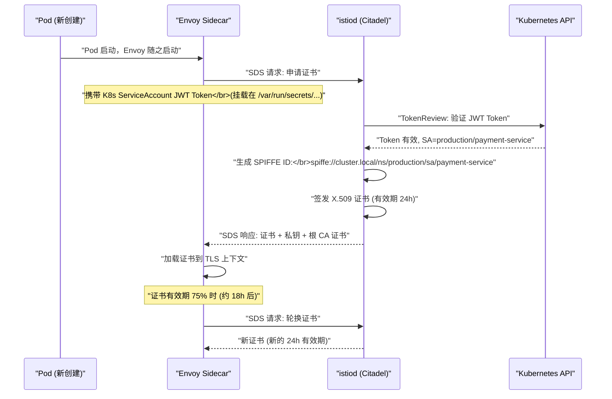
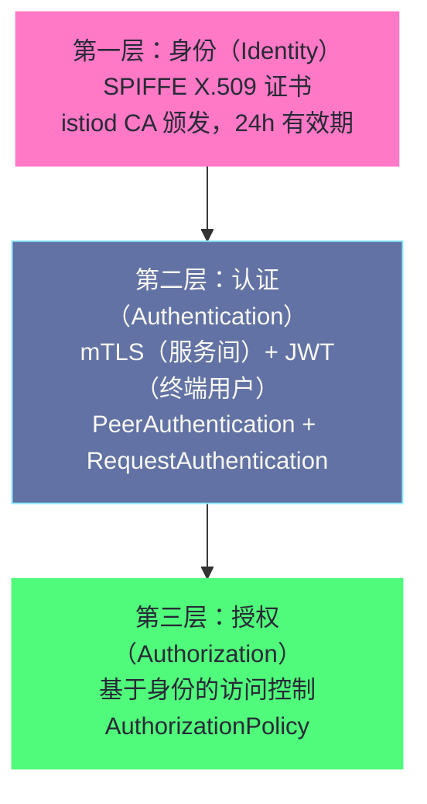

# 安全——mTLS、认证与授权策略

## 摘要

服务网格的安全能力是其区别于传统 L4 网络安全（[[07 NetworkPolicy与CoreDNS——网络安全策略与集群DNS|NetworkPolicy]]）的核心价值之一。Istio 基于 **SPIFFE** 标准为每个工作负载颁发加密身份，通过 **mTLS** 在服务间通信层实现"默认加密 + 双向身份验证"，再通过 **PeerAuthentication** 和 **AuthorizationPolicy** 两个 CRD 实现"谁能与谁通信、允许哪些操作"的精细访问控制。本文深入 SPIFFE 身份的颁发链路与 X.509 证书结构，解析 mTLS 握手中身份验证的具体过程，剖析 PeerAuthentication 的三种模式及其迁移策略，并详解 AuthorizationPolicy 从服务级别到方法级别的访问控制语义。**Istio 安全的核心哲学是零信任（Zero Trust）：不因为在同一集群内就信任任何服务，每次通信都必须经过身份验证和授权检查。**

---

## 第 1 章 零信任安全模型：为什么集群内部也不能信任

### 1.1 传统边界安全模型的失效

传统的网络安全建立在"边界"假设之上：在防火墙内部的流量是可信的，防火墙外的是不可信的。这个模型在数据中心时代行之有效——内部网络的访问受到物理隔离和 VPN 保护，"进了门就是自己人"。

Kubernetes 集群打破了这个假设：

**假设一：容器的隔离不是绝对的**。容器共享宿主机内核，历史上已有多个容器逃逸漏洞（CVE-2019-5736 runc 漏洞，CVE-2020-15257 containerd 漏洞）。一旦某个容器被攻陷并逃逸，攻击者就在"内网"中了。

**假设二：供应链攻击可以绕过边界**。你的 Pod 镜像可能包含被植入后门的第三方库。Pod 在"内网"中运行，如果内网流量没有认证，攻击者可以直接访问所有其他 Pod 的 API。

**假设三：多租户集群没有天然的租户隔离**。多个团队的工作负载可能运行在同一个集群中，Team A 的服务默认可以访问 Team B 的服务。

**零信任（Zero Trust）模型**的核心原则：**永不信任，始终验证（Never Trust, Always Verify）**。不论请求来自集群内部还是外部，每次通信都需要：

1. **验证身份（Authentication）**：我是谁？对方是谁？
2. **授权（Authorization）**：我有权限做这个操作吗？
3. **加密（Encryption）**：通信内容不能被监听或篡改

Istio 通过 mTLS + SPIFFE 身份 + AuthorizationPolicy 为 Kubernetes 集群实现了完整的零信任安全模型。

### 1.2 IP/端口安全的根本局限

Kubernetes [[07 NetworkPolicy与CoreDNS——网络安全策略与集群DNS|NetworkPolicy]] 基于 IP 地址和端口进行访问控制，这在 L3/L4 层提供了基本的隔离。但 IP/端口安全存在根本性局限：

**IP 是可伪造的**。在 Pod 内，应用可以伪造源 IP（如果节点不限制 IP spoofing）。iptables 规则匹配的是 IP 地址，而非加密身份——如果攻击者能伪造一个被信任的 Pod IP，就可以绕过 NetworkPolicy。

**端口控制过于粗粒度**。NetworkPolicy 允许 `frontend → backend: TCP 8080`，这意味着 frontend 可以对 backend 的 8080 端口发出任意 HTTP 请求——包括 `DELETE /api/v1/users/all` 这种破坏性操作。L4 无法限制 HTTP 方法和路径。

**没有身份，只有地址**。NetworkPolicy 规则形如"IP `10.244.0.5` 可以访问 `10.244.1.3:8080`"，但它无法回答"这个 IP 后面的服务是否真的是被授权的 `payment-service`"——如果 `payment-service` 的 Pod 被替换为恶意 Pod（保持同一 IP），NetworkPolicy 仍然放行。

mTLS 用加密身份（X.509 证书中的 SPIFFE ID）替代 IP 地址作为信任锚点，从根本上解决了上述问题。

---

## 第 2 章 SPIFFE：工作负载身份的标准化

### 2.1 SPIFFE 是什么

**SPIFFE（Secure Production Identity Framework for Everyone）** 是 CNCF 的一个标准规范，定义了**在动态的、异构的基础设施中如何为工作负载（服务、Pod、进程）颁发和验证身份**。

在 Kubernetes 中，Pod 是临时的——它随时可能被销毁和重建，重建后 IP 变化。传统的基于 IP 的身份绑定在 Kubernetes 中不可行。SPIFFE 将身份与**运行时的上下文**（如 Kubernetes Service Account）绑定，而非与 IP 绑定。

**SPIFFE 的两个核心规范**：
- **SPIFFE ID**：工作负载身份的统一命名格式
- **SVID（SPIFFE Verifiable Identity Document）**：携带 SPIFFE ID 的可验证凭证（最常见的形式是 X.509 证书）

### 2.2 SPIFFE ID 的格式

SPIFFE ID 是一个 URI，格式为：
```
spiffe://<trust-domain>/<workload-identifier>
```

在 Istio 中，Kubernetes 工作负载的 SPIFFE ID 由其 Namespace 和 Service Account 确定：
```
spiffe://cluster.local/ns/<namespace>/sa/<service-account>
```

例如：
```
spiffe://cluster.local/ns/production/sa/payment-service
spiffe://cluster.local/ns/default/sa/default
spiffe://cluster.local/ns/kube-system/sa/coredns
```

**trust-domain** 是集群范围的信任域标识符，默认为 `cluster.local`。在多集群场景中，不同集群使用不同的 trust-domain（如 `cluster1.example.com`、`cluster2.example.com`），可以通过配置信任 Bundle 实现跨集群的 mTLS。

### 2.3 SVID：承载 SPIFFE ID 的 X.509 证书

Istio 使用 X.509 证书作为 SVID 的实现形式。证书中包含 SPIFFE ID 的方式是：将 SPIFFE URI 放在证书的 **SAN（Subject Alternative Name）** 扩展字段的 URI 类型中。

```
X.509 证书结构（关键字段）：
  Subject: O=cluster.local (组织字段，标识信任域)
  Validity: Not Before: 2024-01-15, Not After: 2024-01-16  ← 24小时有效期
  Subject Alternative Name (SAN):
    URI: spiffe://cluster.local/ns/production/sa/payment-service
  Public Key: RSA 2048 / ECDSA P-256
  Issuer: Istio CA (由 istiod 的 Citadel 子系统签发)
```

**为什么用 SAN 而不用 Subject CN**：

传统的 TLS 服务器证书将服务身份放在 Subject Common Name（CN）字段中（如 `CN=backend-service.default.svc.cluster.local`）。但 CN 是一个字符串，不是结构化格式，而且 RFC 5280 明确规定主机名验证应使用 SAN 而非 CN。SPIFFE 规范强制使用 SAN URI 类型，这是一个有语义的、机器可读的格式，更易于程序化验证。

### 2.4 istiod 的证书颁发链路



**JWT Token 的角色**：Kubernetes 为每个 Pod 挂载一个与其 [[02 认证机制深度解析|Service Account]] 绑定的 JWT Token（存储在 `/var/run/secrets/kubernetes.io/serviceaccount/token`）。这个 Token 是 Pod 的"出生证明"——它证明了"这个 Envoy 运行在哪个 Namespace 的哪个 Service Account 的 Pod 中"。istiod 通过 Kubernetes TokenReview API 验证这个 Token 的真实性，然后根据 Token 中的 Namespace/SA 信息生成 SPIFFE ID，签发 X.509 证书。

> [!info] 核心概念
> 证书颁发的安全链条：Kubernetes API Server（信任锚）→ Pod 的 JWT Token（初始身份凭证）→ istiod 验证 JWT（身份转换）→ X.509 SPIFFE 证书（最终身份凭证）。整个链条的安全性依赖于：JWT Token 不能被伪造（由 API Server 签发），istiod 不能被攻陷（需要 RBAC 保护），根 CA 私钥不能泄露（存储在 Secret 中，需要 etcd 加密）。

---

## 第 3 章 mTLS：双向 TLS 的工作机制

### 3.1 单向 TLS vs 双向 TLS

**单向 TLS（HTTPS）**：客户端验证服务端证书（确认服务端是真实的 `api.example.com`），服务端不验证客户端身份。这是我们日常访问网站的模式——浏览器验证服务器证书，服务器不验证用户证书（用户身份通过登录表单验证）。

**双向 TLS（mTLS）**：在单向 TLS 的基础上，服务端**也验证客户端证书**，确认客户端的身份。这适用于服务间通信的场景——不仅需要确认服务端是真实的 `payment-service`，也需要确认发起调用的客户端确实是被授权的 `order-service`。

在 Istio 中，mTLS 的两端都是 Envoy Sidecar，握手过程：

```
order-service Pod → (iptables 劫持) → order-service Envoy (发起方)
                                            ↓ TCP 连接
                                    payment-service Envoy (接受方)
                                            ↓ (iptables 劫持) → payment-service Pod

mTLS 握手详细过程:
1. 发起方 Envoy 发送 ClientHello
   - SNI: outbound_.8080_._.payment-svc.production.svc.cluster.local
   - 支持的 TLS 版本: TLS 1.2, TLS 1.3
   - 支持的密码套件列表

2. 接受方 Envoy 回复 ServerHello + Certificate
   - 证书: spiffe://cluster.local/ns/production/sa/payment-service
   - CA 签名验证链

3. 发起方 Envoy 验证服务端证书:
   - 验证证书由受信任的 Istio CA 签发（根证书从 istiod SDS 获取）
   - 验证证书未过期
   - 验证 SAN 中的 SPIFFE ID 与预期的服务身份匹配（如果配置了 AuthorizationPolicy）

4. 接受方 Envoy 发送 CertificateRequest（mTLS 特有）

5. 发起方 Envoy 发送客户端 Certificate
   - 证书: spiffe://cluster.local/ns/production/sa/order-service

6. 接受方 Envoy 验证客户端证书（同步骤 3）

7. Finished（握手完成），建立加密 TLS 通道
```

整个握手过程对两端的业务容器完全透明——business 代码只是在 localhost 上建立了一个"普通"TCP 连接（实际上是被 iptables 重定向到 Envoy），Envoy 透明地在网络上执行了完整的 mTLS 握手。

### 3.2 mTLS 提供的三重保证

**保证一：加密（Confidentiality）**。所有服务间的 TCP 流量在 TLS 层加密，即使攻击者在集群内部抓包（如通过 tcpdump 在节点上监听 veth 接口），也只能看到加密的密文，无法还原业务数据。

**保证二：完整性（Integrity）**。TLS 的 MAC（消息认证码）确保数据在传输过程中未被篡改。中间人攻击无法在不被检测的情况下修改请求内容。

**保证三：双向身份认证（Mutual Authentication）**。双方都持有经过 istiod CA 签发的证书，握手时互相验证。这确保了：
- `payment-service` 不会响应来自未知身份的请求（如攻击者伪造的 Pod）
- `order-service` 不会向伪装成 `payment-service` 的恶意服务发送敏感数据

---

## 第 4 章 PeerAuthentication——配置 mTLS 策略

### 4.1 PeerAuthentication 是什么

**PeerAuthentication** CRD 控制服务端 Envoy **如何验证入站连接**的 TLS 模式。它回答的问题是：当流量到达我的服务时，我是否要求对方使用 mTLS？

```yaml
apiVersion: security.istio.io/v1beta1
kind: PeerAuthentication
metadata:
  name: default
  namespace: production
spec:
  mtls:
    mode: STRICT    # 只接受 mTLS 连接，拒绝明文连接
```

### 4.2 三种 mTLS 模式

**DISABLE 模式**：Envoy 不执行 mTLS，接受明文 TCP 连接。适用于暂时退出 mTLS 的场景（调试）或特定服务不需要加密的场景（低敏感度内部服务）。

**PERMISSIVE 模式（默认）**：Envoy 同时接受 mTLS 连接和明文连接。这是 Istio 默认的安全模式，便于渐进式迁移：
- 已注入 Sidecar 的 Pod 之间使用 mTLS
- 没有注入 Sidecar 的客户端（如 Legacy 服务）仍然可以用明文访问

PERMISSIVE 模式的判断逻辑：Envoy 通过检测连接的前几个字节判断是否是 TLS ClientHello，如果是则按 mTLS 处理，否则按明文处理。这个"自动检测"通过 `TLS Inspector` Network Filter 实现。

**STRICT 模式**：Envoy 只接受 mTLS 连接，拒绝所有明文连接（直接关闭连接，不返回任何响应）。这是零信任安全的完全实现——所有进入服务的连接都必须携带有效的客户端证书。

### 4.3 PeerAuthentication 的作用范围

PeerAuthentication 支持三个粒度的作用范围：

**全集群默认策略**（mesh-wide）：在 `istio-system` 命名空间创建名为 `default` 的 PeerAuthentication，作用于整个 mesh。

```yaml
apiVersion: security.istio.io/v1beta1
kind: PeerAuthentication
metadata:
  name: default
  namespace: istio-system   # 全集群生效
spec:
  mtls:
    mode: STRICT
```

**Namespace 级别策略**：在某个 Namespace 创建名为 `default` 的 PeerAuthentication，覆盖该 Namespace 的全局策略。

**Workload 级别策略**：通过 `selector` 字段指定作用于哪些 Pod，可以为单个服务配置不同的 mTLS 模式。

```yaml
apiVersion: security.istio.io/v1beta1
kind: PeerAuthentication
metadata:
  name: payment-service-mtls
  namespace: production
spec:
  selector:
    matchLabels:
      app: payment-service    # 只作用于 payment-service 的 Pod
  mtls:
    mode: STRICT
  portLevelMtls:             # 端口级别的细粒度控制
    8080:
      mode: STRICT
    9090:                    # metrics 端口使用明文（Prometheus 无法做 mTLS）
      mode: DISABLE
```

**策略优先级**（从高到低）：Workload 级别 > Namespace 级别 > 全集群级别。

### 4.4 从 PERMISSIVE 迁移到 STRICT 的安全策略

直接将生产集群从 PERMISSIVE 切换到 STRICT 是高风险操作——如果有任何服务没有 Sidecar 注入，切换后它们的请求会被立即拒绝，造成服务中断。推荐的迁移策略：

**Step 1：验证所有关键服务都已注入 Sidecar**
```bash
# 检查 Namespace 内所有 Pod 是否有 istio-proxy 容器
kubectl get pods -n production -o jsonpath='{range .items[*]}{.metadata.name}{"\t"}{range .spec.containers[*]}{.name}{" "}{end}{"\n"}{end}' | grep -v "istio-proxy"
# 如果有 Pod 没有 istio-proxy，说明未注入
```

**Step 2：查看当前 mTLS 连接状态**
```bash
# 检查哪些连接是 mTLS，哪些是明文
istioctl authn tls-check -n production
# 输出：
# HOST:PORT                                    STATUS    SERVER     CLIENT     AUTHN POLICY    DEST RULE
# payment-service.production:8080              OK        STRICT     ISTIO_MUTUAL  default/production  payment-dr/production
# legacy-service.production:8080               WARNING   PERMISSIVE mTLS not set  default/production  -
```

**Step 3：逐 Namespace 启用 STRICT**
```bash
# 先在测试 Namespace 启用，验证
kubectl apply -f - <<EOF
apiVersion: security.istio.io/v1beta1
kind: PeerAuthentication
metadata:
  name: default
  namespace: staging
spec:
  mtls:
    mode: STRICT
EOF

# 确认 staging 环境无问题后，再推进到 production
```

> [!warning] 生产避坑
> 一个常被忽视的陷阱：启用 STRICT mTLS 后，Kubernetes 的健康检查探针（`livenessProbe`、`readinessProbe`）如果使用 HTTP 方式，会被 Envoy 拒绝（因为探针由 kubelet 发出，kubelet 没有 Sidecar，发出的是明文 HTTP 请求）。Istio 从 1.9 版本开始通过 **Probe Rewrite** 机制解决这个问题：istiod 自动将 Pod 的 HTTP 探针重写为通过 Envoy 的 /healthz/ready 接口代理，使 kubelet 的探针请求经过 Envoy 而不直接到达应用，从而绕过 mTLS 要求。确认你的 Istio 版本在 1.9+，并且 `values.global.proxy.holdApplicationUntilProxyStarts` 设置正确。

---

## 第 5 章 RequestAuthentication——终端用户 JWT 验证

### 5.1 PeerAuthentication vs RequestAuthentication

| 维度 | PeerAuthentication | RequestAuthentication |
| :--- | :--- | :--- |
| **验证对象** | 服务（Sidecar 间的 mTLS） | 终端用户（HTTP 请求中的 JWT Token）|
| **验证机制** | X.509 证书 | JWT（JSON Web Token） |
| **典型场景** | 服务 A 调用服务 B | 用户浏览器/App 调用 API |
| **身份来源** | istiod CA 签发的证书 | 外部 IdP（Auth0、Keycloak、Google Identity）|

**RequestAuthentication** 让 Envoy 在接受请求时验证 HTTP Header 中的 JWT Token，确认请求来自合法的终端用户：

```yaml
apiVersion: security.istio.io/v1beta1
kind: RequestAuthentication
metadata:
  name: jwt-auth
  namespace: production
spec:
  selector:
    matchLabels:
      app: backend-service
  jwtRules:
  - issuer: "https://accounts.google.com"       # Token 颁发者
    jwksUri: "https://www.googleapis.com/oauth2/v3/certs"  # JWKS 公钥端点（Envoy 从这里获取公钥验证 Token）
    audiences:
    - "my-api.example.com"                       # Token 的目标受众（aud 字段）
    forwardOriginalToken: true                   # 验证后将 Token 原样转发给应用
  - issuer: "https://keycloak.internal/auth/realms/myrealm"  # 支持多个 IdP
    jwksUri: "https://keycloak.internal/.well-known/jwks.json"
```

**RequestAuthentication 的验证逻辑**：
- 如果请求没有 JWT Token：放行（不拒绝）——需要配合 AuthorizationPolicy 强制要求 Token
- 如果请求有 JWT Token 且验证通过：提取 Claims，注入 `X-Forwarded-JWT` Header
- 如果请求有 JWT Token 但验证失败（签名无效、过期、issuer 不匹配）：**直接返回 401**

这个"没有 Token 就放行"的设计看似奇怪，但有其逻辑：RequestAuthentication 只负责"如果有 Token，就验证它"，是否**要求**有 Token，是 AuthorizationPolicy 的职责。

---

## 第 6 章 AuthorizationPolicy——细粒度访问控制

### 6.1 AuthorizationPolicy 的基础结构

**AuthorizationPolicy** 是 Istio 的访问控制引擎，基于以下维度做授权决策：
- **主体（principal）**：请求来自哪个服务（SPIFFE 身份）或哪个终端用户（JWT Claims）
- **操作（operation）**：请求的 HTTP 方法、路径、端口
- **条件（condition）**：请求的 Source IP、Header、JWT Claims 等额外条件

```yaml
apiVersion: security.istio.io/v1beta1
kind: AuthorizationPolicy
metadata:
  name: payment-authz
  namespace: production
spec:
  selector:
    matchLabels:
      app: payment-service    # 作用于 payment-service 的 Pod（服务端）
  action: ALLOW               # ALLOW 或 DENY（默认 ALLOW）
  rules:
  - from:
    - source:
        principals:           # 允许的客户端 SPIFFE 身份
        - "cluster.local/ns/production/sa/order-service"
        - "cluster.local/ns/production/sa/refund-service"
    to:
    - operation:
        methods: ["GET", "POST"]
        paths: ["/api/v1/payment*"]
    when:
    - key: request.headers[x-request-id]  # 额外条件：必须有 x-request-id Header
      notValues: [""]
```

### 6.2 ALLOW vs DENY 策略的优先级

AuthorizationPolicy 有两种 action：`ALLOW`（白名单）和 `DENY`（黑名单）。当同一个服务上有多个 AuthorizationPolicy 时，优先级规则：

**优先级（从高到低）**：
1. **DENY 策略命中** → 拒绝（DENY 优先于 ALLOW）
2. **没有任何 ALLOW 策略** → 允许（没有策略 = 全部允许，符合默认全连通语义）
3. **有 ALLOW 策略但没有规则命中** → 拒绝（有 ALLOW 策略存在 = 进入白名单模式）
4. **ALLOW 策略命中** → 允许

这意味着：一旦你为某个服务创建了任何一个 `ALLOW` 类型的 AuthorizationPolicy，该服务就进入了"白名单模式"——**所有未被明确 ALLOW 的请求都被拒绝**。这与 Kubernetes NetworkPolicy 的语义完全一致。

> [!warning] 生产避坑
> 常见错误：只为 `payment-service` 添加了允许 `order-service` 访问的 `ALLOW` 策略，但忘记了 `payment-service` 自身的健康检查探针也是一个请求——由 kubelet 发出，Principal 为空（没有 SPIFFE 证书）。启用 AuthorizationPolicy 后，`payment-service` 的健康探针失败，Pod 被 Kubernetes 判定为不健康并重启。解决方案：使用 `portLevelMtls` 关闭健康检查端口的 mTLS，或者为健康探针的路径（`/healthz`）添加允许规则：
> ```yaml
> - to:
>   - operation:
>       paths: ["/healthz", "/readyz"]
> ```

### 6.3 基于 SPIFFE 身份的服务间访问控制

这是 AuthorizationPolicy 最核心的使用场景——基于 SPIFFE 身份精确控制服务间访问：

```yaml
# 场景：payment-service 只允许 order-service 和 refund-service 调用
# 且只能调用 /api/v1/payment 路径，不能调用内部管理接口 /admin

apiVersion: security.istio.io/v1beta1
kind: AuthorizationPolicy
metadata:
  name: payment-authz
  namespace: production
spec:
  selector:
    matchLabels:
      app: payment-service
  action: ALLOW
  rules:
  - from:
    - source:
        principals:
        - "cluster.local/ns/production/sa/order-service"
        - "cluster.local/ns/production/sa/refund-service"
    to:
    - operation:
        methods: ["POST"]
        paths: ["/api/v1/payment/charge", "/api/v1/payment/refund"]
  - from:
    - source:
        principals:
        - "cluster.local/ns/ops/sa/admin-tool"    # 运维工具
    to:
    - operation:
        paths: ["/admin/*"]                        # 只有运维工具可以访问 admin 接口
        methods: ["GET"]

---
# 为防止内部管理接口被任何 in-cluster 服务意外访问，额外加一条 DENY 规则
apiVersion: security.istio.io/v1beta1
kind: AuthorizationPolicy
metadata:
  name: deny-admin-to-non-ops
  namespace: production
spec:
  selector:
    matchLabels:
      app: payment-service
  action: DENY
  rules:
  - to:
    - operation:
        paths: ["/admin/*"]
    from:
    - source:
        notNamespaces: ["ops"]    # 拒绝所有不来自 ops namespace 的请求访问 admin 路径
```

### 6.4 基于 JWT Claims 的终端用户授权

结合 RequestAuthentication 和 AuthorizationPolicy，可以实现基于 JWT 声明（Claims）的细粒度用户授权：

```yaml
# RequestAuthentication: 验证 JWT Token
apiVersion: security.istio.io/v1beta1
kind: RequestAuthentication
metadata:
  name: jwt-auth
  namespace: production
spec:
  selector:
    matchLabels:
      app: backend-service
  jwtRules:
  - issuer: "https://auth.example.com"
    jwksUri: "https://auth.example.com/.well-known/jwks.json"

---
# AuthorizationPolicy: 基于 JWT Claims 授权
apiVersion: security.istio.io/v1beta1
kind: AuthorizationPolicy
metadata:
  name: require-jwt-and-role
  namespace: production
spec:
  selector:
    matchLabels:
      app: backend-service
  action: ALLOW
  rules:
  # 规则 1: admin 角色可以访问所有接口
  - when:
    - key: request.auth.claims[role]
      values: ["admin"]
  # 规则 2: user 角色只能访问 /api/user/* 接口
  - to:
    - operation:
        paths: ["/api/user/*"]
    when:
    - key: request.auth.claims[role]
      values: ["user"]
  # 规则 3: 服务账号（istiod 签发的证书）也被允许（服务间调用）
  - from:
    - source:
        principals: ["cluster.local/ns/production/sa/*"]
```

**`request.auth.claims[xxx]`** 是 Envoy 从 JWT Token 的 payload 中提取的 Claims，支持嵌套格式（如 `request.auth.claims[permissions][0]`）。常用的 Claims 字段：
- `request.auth.principal`：JWT Token 中 `iss` 和 `sub` 的组合
- `request.auth.claims[iss]`：Token 颁发者
- `request.auth.claims[sub]`：用户/应用标识符
- `request.auth.claims[groups]`：用户组（如果 IdP 在 Token 中包含）

### 6.5 AuthorizationPolicy 的几种实用模式

**模式一：默认拒绝所有，再逐条添加允许**

```yaml
# Namespace 级别的默认 DENY（拒绝所有进入 production 的流量）
apiVersion: security.istio.io/v1beta1
kind: AuthorizationPolicy
metadata:
  name: deny-all
  namespace: production
spec:
  {}  # 空的 spec = 没有 rules = 拒绝所有请求
```

**模式二：允许 Prometheus 抓取所有服务的 metrics**

```yaml
apiVersion: security.istio.io/v1beta1
kind: AuthorizationPolicy
metadata:
  name: allow-prometheus-scrape
  namespace: production
spec:
  action: ALLOW
  rules:
  - from:
    - source:
        namespaces: ["monitoring"]
        principals: ["cluster.local/ns/monitoring/sa/prometheus"]
    to:
    - operation:
        ports: ["15090", "9090"]     # Envoy metrics 端口和应用 metrics 端口
        methods: ["GET"]
        paths: ["/metrics", "/stats/prometheus"]
```

**模式三：允许所有来自同 Namespace 的服务相互访问**

```yaml
apiVersion: security.istio.io/v1beta1
kind: AuthorizationPolicy
metadata:
  name: allow-same-namespace
  namespace: production
spec:
  action: ALLOW
  rules:
  - from:
    - source:
        namespaces: ["production"]
```

---

## 第 7 章 证书管理的高级话题

### 7.1 自定义根 CA（Plugged CA）

默认情况下，Istio 使用自签名根 CA（istiod 启动时自动生成）。在生产环境中，使用自签名 CA 有以下问题：
- 根 CA 私钥存储在 Kubernetes Secret 中，如果 etcd 未加密，存在泄露风险
- 多集群场景下，需要在集群间同步根 CA，操作繁琐
- 企业安全策略可能要求使用企业级 PKI（如 Hashicorp Vault PKI、AWS ACM PCA）

**Plugged CA 配置**（以 Vault PKI 为例）：

```bash
# 1. 生成中间 CA 证书（由企业根 CA 签发）
# 将 istiod 作为 Vault PKI 的中间 CA，而不是根 CA

# 2. 将中间 CA 证书和私钥存入 K8s Secret
kubectl create secret generic cacerts -n istio-system \
    --from-file=ca-cert.pem \       # 中间 CA 证书
    --from-file=ca-key.pem \        # 中间 CA 私钥
    --from-file=root-cert.pem \     # 企业根 CA 证书（用于跨集群信任）
    --from-file=cert-chain.pem      # 完整证书链

# 3. 重启 istiod，使用自定义 CA
kubectl rollout restart deployment/istiod -n istio-system
```

### 7.2 证书有效期与轮换策略

| 配置项 | 默认值 | 说明 |
| :--- | :--- | :--- |
| 工作负载证书有效期 | 24 小时 | `MeshConfig.defaultConfig.proxyMetadata.SECRET_TTL` |
| 证书轮换时机 | 有效期的 50-75% 时 | Envoy 内部的 SDS 轮换逻辑 |
| 根 CA 有效期 | 10 年 | istiod 自签名根 CA 的默认有效期 |
| 根 CA 轮换 | 手动操作 | 需要重新签发所有工作负载证书（滚动更新）|

**为什么使用短有效期（24小时）**：
- 如果某个 Pod 的证书私钥泄露，攻击者利用这个证书的时间窗口只有 24 小时（而非传统 Web PKI 的 1-2 年）
- 短有效期配合自动轮换，在几乎不增加运维负担的情况下，大幅降低了证书泄露的影响半径

---

## 第 8 章 安全配置排查

### 8.1 mTLS 配置冲突诊断

```bash
# 检查特定服务的 mTLS 配置状态
istioctl authn tls-check <client-pod>.<ns> <server-service>.<ns>.svc.cluster.local

# 输出示例（正常）：
# HOST:PORT                                STATUS  SERVER     CLIENT     AUTHN POLICY
# payment-svc.production:8080              OK      STRICT     ISTIO_MUTUAL  default/production

# 输出示例（冲突）：
# HOST:PORT                                STATUS   SERVER     CLIENT
# payment-svc.production:8080              CONFLICT STRICT     DISABLE
# ↑ 服务端要求 STRICT，但客户端 DestinationRule 配置了 DISABLE mTLS，导致握手失败

# 分析 Istio 配置问题
istioctl analyze -n production
# 常见警告：
# Warning [IST0102] (VirtualService payment-vs.production) No matching workloads found for gateway: istio-system/ingressgateway
# Warning [IST0111] (DestinationRule payment-dr.production) Port name tcp-8080 on service is not defined
```

### 8.2 AuthorizationPolicy 调试

```bash
# 检查 AuthorizationPolicy 是否允许特定请求
istioctl x authz check <pod-name>.<namespace>

# 开启 AuthorizationPolicy 的审计日志（记录所有 DENY 事件）
kubectl apply -f - <<EOF
apiVersion: security.istio.io/v1beta1
kind: AuthorizationPolicy
metadata:
  name: audit-denied
  namespace: production
spec:
  action: AUDIT    # AUDIT 模式：记录日志但不实际拒绝（用于分析）
  rules:
  - {}             # 匹配所有请求
EOF

# 查看 Envoy 访问日志中被 RBAC 拒绝的请求
kubectl logs <pod-name> -n production -c istio-proxy | grep "403\|RBAC"
```

---

## 第 9 章 小结

### 9.1 Istio 安全体系三层架构



| 层面 | CRD/机制 | 保护内容 |
| :--- | :--- | :--- |
| **身份** | SPIFFE SVID（X.509）| 工作负载身份的不可伪造性 |
| **传输加密** | mTLS（TLS 1.2/1.3） | 数据保密性 + 完整性 |
| **服务认证** | PeerAuthentication | 控制哪些 TLS 模式被接受 |
| **用户认证** | RequestAuthentication | 验证 JWT Token 合法性 |
| **访问控制** | AuthorizationPolicy | 服务级别 + 方法级别的白/黑名单 |

### 9.2 下一篇预告

安全之后，是可见性：

- **[[06 可观测性——分布式追踪、指标与访问日志]]**：Envoy 如何自动生成 Trace Span，Zipkin/Jaeger 的接入方式，Istio 标准 Prometheus 指标体系（RED 方法），以及访问日志的结构化配置与过滤

---

*本文是 [[服务网格]] 专栏的第 5 篇。相关专栏：[[07 NetworkPolicy与CoreDNS——网络安全策略与集群DNS|K8s NetworkPolicy]]、[[02 认证机制深度解析|K8s 认证机制]]、[[03 授权机制——RBAC 深度解析|K8s RBAC 授权]]*

---

> [!note] 思考题
> 1. Istio 自动生成四个'黄金信号'指标：延迟、流量、错误率和饱和度。这些指标通过 Envoy 的 stats 模块暴露，被 Prometheus 采集。在一个 1000 Pod 的集群中，Envoy 的指标数量可能达到数百万时间序列——Prometheus 的存储和查询压力如何？你如何通过指标聚合或采样来降低压力？
> 2. 分布式追踪（Tracing）需要每个服务传递 trace header（如 `x-request-id`、`x-b3-traceid`）。Istio 的 Envoy Sidecar 自动注入这些 header——但应用代码需要将收到的 header 传递到下游调用中。如果应用忘记传递 header——追踪链路会断裂。除了改代码，有没有基础设施层面的方案来保证 header 传递？
> 3. Envoy 的 Access Log 记录了每个请求的详细信息（源/目标服务、延迟、状态码、响应标志）。`RESPONSE_FLAGS` 字段（如 `UO`=upstream overflow、`UF`=upstream connection failure）帮助快速定位问题。在故障排查中，你如何结合 Access Log 和 Tracing 来定位'某个请求慢在哪个服务'？
