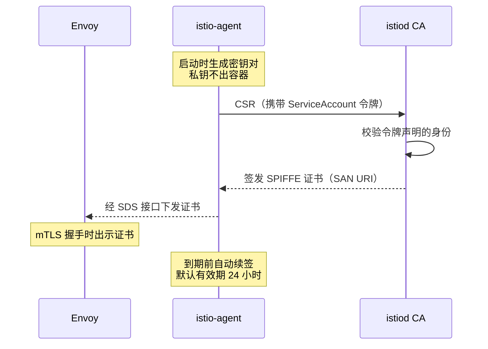
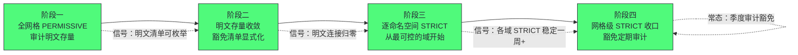

# 安全——mTLS、认证与授权策略

**摘要：**

前四篇治理的是流量的"行为"，本篇治理流量的"信任"：谁在调用我、这条链路可不可信、这个请求有没有资格过去。文章先论证为什么内网默认可信的假设已经坍塌——边界被打穿后的横向渗透是云上安全事件的主旋律，而 NetworkPolicy 的 IP 级控制回答不了"对方是谁"；然后进入网格信任体系的三层结构：工作负载身份层（SPIFFE 身份标识与 X.509 证书的自动签发轮换，私钥全程不出容器）、传输层（PeerAuthentication 驱动的 mTLS，从 PERMISSIVE 双轨到 STRICT 全量加密的迁移路径）、请求层（RequestAuthentication 的 JWT 验证与 AuthorizationPolicy 的细粒度授权）。每一层都讲清机制、故障形态与配置陷阱——证书轮换失败的延迟显形、JWT 提供方抖动引发的全站 401、ALLOW 策略一上就锁死服务。读完全文你应当能回答两个问题：零信任网格的信任根在哪里、信任如何逐跳传递，以及把一个明文内网迁到全网格 mTLS 要经过哪几个阶段、每个阶段靠什么信号判断可以进入下一步。

---

## 第 1 章 信任的坍塌：内网默认可信为什么不再成立

### 1.1 城墙模型的失效

传统企业安全的前提是一道边界：内网是可信任的，外网是不可信任的，防火墙守住边界，边界之内的流量默认放行。这个"城墙模型"（Castle-and-Moat）在单体时代勉强成立，在云原生时代四处漏水——漏水的方式值得逐一看清：

- **边界本身在漂移**：容器网络的 IP 随调度漂移，Pod 分布跨节点跨可用区，"内网"的物理含义越来越模糊；
- **凭证就是边界**：一条流水线凭证、一个 API Token 的泄露，攻击者就从"边界外"直接跳到了"边界内"——边界防不住自带钥匙的人；
- **供应链从内部开锁**：一个被投毒的依赖、一个带后门的镜像层，让最坚固的防火墙形同虚设；
- **东西向无防护**：即便边界完好，内部服务之间的流量依旧明文裸奔、互不验证。

四条漏水的共同点是：它们攻破的不是防火墙的性能或规则数量，而是"默认可信"这个前提本身。前提倒了，建在前提上的所有机制——信任内网的 ACL、不做身份验证的内部 RPC、明文的内网通信——全部要重新审视。零信任的兴起不是新时尚，是这个前提坍塌之后的必然重构。更根本的是，**横向渗透（Lateral Movement）**成为云上安全事件的标准剧本：攻陷一个边缘 Pod 后，攻击者以"合法内网流量"的姿态向任意服务发起扫描、探测与拖库，因为内网通信是明文的、不验身份的、默认放行的。

> [!info] 核心概念：零信任的核心不是"更严"，而是"换提问"
> 零信任（Zero Trust）不是把防火墙规则写得更严，而是换掉整个提问方式：安全判断的依据从"你在哪个网段"换成"你是谁、凭什么"。每一跳都要回答三个问题——**你是谁**（身份认证）、**链路可信吗**（传输加密）、**你有资格吗**（访问授权）。这三个问题分别对应本篇的三层机制：SPIFFE 身份、mTLS、AuthorizationPolicy。记住这个对应关系，后面每一节都是在展开其中一个问题的答案。

还要先说清一个容易被误解的边界：零信任的三问都是针对**服务间通信**（东西向）的；用户到服务的南北向请求里，终端用户的认证与授权同样是三问的一部分，但入口设备（网关、WAF）的角色更重——网格在南北向的角色是"承接入站验证的结果"，而非全部。边界认清，后文的机制分工才不混乱。

### 1.2 NetworkPolicy 能做什么、不能做什么

Kubernetes 原生的网络防护是 NetworkPolicy，它值得先被公道地评估再被指出边界。能做的：按标签选择 Pod，声明哪些 IP 与端口可以进出——"只有带 app=frontend 标签的 Pod 可以连 database 的 3306 端口"这类规则干净利落，是网络分段的基础设施。不能做的恰恰是零信任的三问：它不知道连接背后的**工作负载身份**——标签是声明在 Deployment 上的元数据，不是密码学意义上的身份，伪造不了 IP 但可以起一个带同样标签的 Pod；它不加密任何流量——规则之内的链路依旧明文；它做不了应用级授权——"frontend 可以连 3306"不等于"frontend 可以读任意表"。

一句话总结：**NetworkPolicy 是地址簿级的安全，零信任要的是身份证书级的安全**。前者回答"从哪里来"，后者回答"是谁在调用"。把两套机制的差异排进一张表：

| 维度 | NetworkPolicy | 网格安全层 |
| :--- | :--- | :--- |
| 判断依据 | IP 与端口 | 密码学工作负载身份 |
| 传输加密 | 不提供 | mTLS 全覆盖 |
| 应用级条件 | 无 | 路径、方法、JWT 声明 |
| 身份伪造难度 | 起一个同标签 Pod 即可 | 需持有 CA 签发的证书 |
| 作用层次 | L3/L4 | L4 到 L7 |

两者的关系是叠加而非替代——NetworkPolicy 做网络分段的第一道减法，网格在其上补身份、加密与授权。评估一个集群的安全水位时，两层要看两组不同的仪表：NetworkPolicy 看"分段规则覆盖了百分之多少的 Pod"，网格看"身份验证覆盖了百分之多少的连接"——两组数字分别反映两个平面的防护成熟度，混为一谈会各漏一半。

### 1.3 网格的位置：把信任检查嵌入每一跳

零信任的难点不在理念而在执行密度：理念要求"每一跳都验证"，而人工执行意味着每个服务都要集成 TLS 库、管理证书、校验对方身份——成本高到第 01 篇提过的程度：大多数团队直接放弃。网格的价值恰在此处：流量反正要经过每一跳的边车，**把身份验证、加密、授权检查嵌入代理层**，应用零改动地获得逐跳信任。这就是"服务网格是零信任的最佳载体"这个命题的全部内容——不是网格天生安全，而是它天然处在做安全检查的位置上。

这个位置优势还有一层经济学含义：安全检查的成本由平台团队一次性承担，收益由全公司所有服务共享——与第 01 篇治理逻辑下沉的经济学同构。安全领域尤其如此：人肉安全的边际成本随服务数线性上升（每个服务都要集成、配置、维护），网格安全的边际成本趋近于零（新服务注入即受保护）。**成本曲线的形状改变，安全覆盖率的决策就改变了**——这是零信任在网格时代从理念变成可落地方案的经济基础。

### 1.4 一次横向渗透的解剖

把抽象的风险落成一次事件推演。攻击者的起点是某个暴露了调试端点的边缘服务——打进去之后，他的第一步不是攻击这个服务本身，而是**以它为跳板向内网扫描**：内网是明文 HTTP，响应内容里全是可读的接口描述；内网不验身份，任何 Pod 发起的请求都被当作合法流量；NetworkPolicy 即便配置了，也只拦"陌生 IP"，而攻击者手里的正是"自己人"的 IP。于是数据库端口、管理接口、内部 API 一路畅通，直到摸到有价值的数据为止。事后复盘里最刺眼的往往不是哪个洞被攻破，而是**横向移动的每一步在事前的安全体系里都是"合法流量"**——这不是某个环节的疏忽，是信任模型的系统性缺陷。

零信任正是对着这个剧本逐帧设防的：明文扫描在内网不可行（mTLS 加密），伪造身份进不了对话（SPIFFE 证书互验），即便摸到了端口也过不了授权（AuthorizationPolicy）。三层防线没有一层能单独挡住剧本，叠在一起则把横向移动的成本抬高到攻击者转向别处的程度——安全从来不是绝对防御，而是成本博弈。

---

## 第 2 章 工作负载身份：SPIFFE 与自动证书体系

### 2.1 身份问题：IP 不配当身份

信任体系的第一块基石是身份：一切验证与授权的前提，是"参与通信的各方有一个不可伪造的名字"。给工作负载发身份，先要想清楚"什么才能当身份"。IP 地址不行——容器环境里 IP 随调度漂移，今天属于 frontend 的 IP 明天可能属于任何 Pod；主机名不行——Pod 名带随机后缀，滚动更新即更换；Deployment 名勉强可用——但它是部署层概念，同一 Deployment 的多版本灰度无法区分。理想的身份要满足三个性质：**稳定**（不随 IP 与重启漂移）、**密码学可验证**（不能伪造）、**可精细授权**（能区分到"哪个命名空间的哪个服务账号"）。不妨把工作负载身份类比为员工的工牌：工牌印的是岗位与部门（稳定语义），不是工位号（随时会换）；工牌有防伪（密码学验证），不是手写的纸条；门禁按"部门加岗位"放行（精细授权），不是只认脸熟。三个性质缺一个，整套门禁体系就退化为摆设。

CNCF 的 SPIFFE（Secure Production Identity Framework For Everyone）规范给出了业界共识的答案：身份就是一个 URI——

```text
spiffe://<trust-domain>/ns/<namespace>/sa/<serviceaccount>
```

例如 `spiffe://cluster.local/ns/prod/sa/orders`。三段结构对应三层语义：trust-domain 声明信任域（多集群体系的根隔离单位），namespace 与 serviceaccount 精确到 Kubernetes 的部署语义——同一个 Deployment 的 v1 与 v2 共享服务账号身份，而不同业务的隔离边界天然落在命名空间与服务账号上。这个身份被放进 **X.509 证书的 SAN URI 字段**，于是"验证身份"变成了标准的 TLS 证书校验——不发明新东西，把成熟的 PKI 机制接到工作负载上，是 SPIFFE 全部设计的聪明之处。

身份的粒度选择（服务账号而非 Pod 名）也值得推敲。Pod 名带随机后缀、滚动更新即换，拿它当身份，授权规则就要天天改；服务账号跨版本、跨副本稳定，同一 Deployment 的 v1 与 v2 共享身份——这既是便利也是代价：**版本间的授权差异无法用工作负载身份表达**（v2 要限制访问得靠路径级授权或独立服务账号）。粒度即表达力，也即管理成本——SPIFFE 选在"稳定"与"精细"的交点上，需要更细粒度时用终端用户凭证与请求属性去补，而不是把工作负载身份无限切细。

### 2.2 证书怎么发：一条不经过人类的信任链

身份的载体是证书，证书的签发链路是本篇第一个机制重点。在展开之前先看一眼这条链要满足的安全性质：身份的私钥永远不出工作负载、签发方必须验证申请者的确"是这个 Pod"、全程无人工介入且可持续轮换。Istio 的设计里，**istiod 内置 CA 是信任根**，签发链路全程自动化：



链路上有四处设计值得停下来推敲：

- **私钥不出容器**：密钥对由容器内的 istio-agent 生成，CA 只负责签名——证书可以被拿走，冒充不行，这是"私钥不落盘、不传输"的经典原则在工作负载上的落实；
- **CSR 的认证靠 ServiceAccount 令牌**：agent 向 CA 证明"我确实是这个 Pod"，依据是 kubelet 挂载的 ServiceAccount Token——Pod 声明的身份与它的运行凭据严格对应，这是 Kubernetes 原生机制向网格信任体系的移交；
- **短有效期加自动轮换**：证书默认 24 小时有效，到期前自动续签，且续签时可轮换密钥——密钥泄露的最大窗口被压缩到一天以内，全程无需任何人值守；
- **根证书分发**：istiod 把 CA 根证书以 ConfigMap（istio-ca-root-cert）挂进每个命名空间，所有代理共享同一信任锚——互验证书的前提。

图里的三次交互各有讲究：agent 与 CA 之间是标准 CSR 流程（CA 验令牌、验 CSR、签名三步）；agent 与 Envoy 之间经 SDS 的 Unix socket 交付证书——密钥材料不过网络、不落盘、不出容器；续签无感知，Envoy 侧证书热替换，连接不中断。这套机制的整体性格可以概括为"**把证书管理从运维题变成物理题**"：传统 PKI 的申请、审批、部署、轮换、吊销是一套跨团队流程，任何一环的人肉延迟都是安全窗口；网格把它压缩成"Pod 启动即有身份、24 小时必轮换"的物理规律——安全性质的达成不再依赖流程纪律，而依赖机制本身。值得一提的是吊销问题的解法：传统 PKI 靠吊销列表（CRL），实时性差；短有效期提供了更优雅的答案——证书一天必过期，"吊销"退化为"停止续签"，被攻陷的工作负载的身份最多再活一天。**用短生命周期换取免吊销**，是这个设计里最聪明的权衡。

### 2.3 信任域与多集群的身份衔接

trust-domain 是身份体系里最容易被忽视却最要命的配置。同一个网格内所有工作负载共享一个 trust-domain（缺省 cluster.local），多集群体系里两个集群要么共享信任域与根 CA（同一信任体系），要么各自持有信任域并互相信任（联邦式）——选择不同，跨集群 mTLS 的握手行为完全不同。信任域的变更尤其危险：它意味着全网格证书体系的重新签发，存量信任关系瞬间失效——**trust-domain 是要当"根密码"一样对待的配置**，第一次部署前想清楚，之后不动。多集群场景下的三种信任拓扑，取舍各不相同：

| 拓扑 | 信任关系 | 优势 | 代价 |
| :--- | :--- | :--- | :--- |
| 共享信任域 | 多集群同一根 CA | 跨集群 mTLS 天然互通 | 根密钥的分发与管理半径大 |
| 各自域加互信 | 各持根 CA，交换签发关系 | 故障域与管控域隔离 | 证书交换的运维复杂度 |
| 完全隔离 | 互不信任 | 安全边界最硬 | 跨集群通信只能走网关再加密 |

选择没有高下，只有与组织结构、合规要求的匹配——多数据中心共享密钥管理平台的公司倾向第一行，强隔离要求（金融、多租户）倾向后两行。无论哪种拓扑，SPIFFE 的 trust-domain 语义保证了身份的全局唯一性——跨集群身份碰撞（两个集群的 orders 拿到同一身份）是共享根 CA 拓扑下的经典事故，命名纪律（按集群区分服务账号命名空间）是唯一的疫苗。trust-domain 的纪律可以总结为三条：

1. 命名即规划：第一天的名字要按"三年后的拓扑"起，而不是按"当前的单集群"；
2. 变更即重建：把 trust-domain 当作不可变配置，变更要走完整的重建预案；
3. 冲突即事故：跨集群身份碰撞要进安全事件流程，而不是配置勘误。

> [!warning] 生产避坑：证书体系的故障是延迟显形的
> 第 02 篇讲过控制面宕机后证书到期的时序坑，这里把它归入安全视角的完整清单：istiod 宕机，存量流量照常（证书未到期），滚动更新照常（新证书模板注入），一切如常直到第一批证书到期——CSR 无法续签，mTLS 握手开始批量失败。故障发生点与根因点之间隔着最多 24 小时的时差，告警（mTLS 失败）与根因（istiod 宕机）之间隔着完整的排障链条——把这条时间线画进值班手册，比任何口头叮嘱都有效。对策有三：控制面多副本加 PDB、证书到期前 N 小时开始告警（提前于失效）、以及把"istiod 恢复时间"写进运维手册并与证书有效期做约束校验。

---

## 第 3 章 mTLS 机制：从双轨到全量加密

身份解决了"你是谁"，传输层解决"这段话别人听不听得懂、是不是你本人说的"——mTLS 是把身份用起来的第一现场。本章讲清它的机制、配置模型与迁移工程。

### 3.1 TLS 与 mTLS 的一字之差

常规的 HTTPS 是单向认证：客户端验证服务器证书（防止连到假站），服务器对客户端一无所知。服务间通信要的是双向认证（mutual TLS）：**两端互验证书**——client 确认"对面真的是 orders 服务"，server 确认"来者真的是 frontend 服务"。双向认证的价值不仅是加密（防窃听），更在于它把"身份验证"嵌入每一次连接建立：没有有效 SPIFFE 证书的连接，在握手阶段就被拒绝——**访问控制从"连接后的应用逻辑"前移到了"连接建立的协议层"**。一次 mTLS 握手的动作序列：

1. client 发起握手，出示自己的 SPIFFE 证书；
2. server 验证 client 证书的签发链与有效期，并核对 SAN 里的 SPIFFE 身份——"来者确实是它声称的服务"；
3. server 出示自己的证书，client 同样验证——"对面确实是它声称的服务"；
4. 双方协商出会话密钥，后续流量全程加密。

第 2 步与第 3 步在单向 TLS 里只有一半，这一字之差就是"传输加密"与"双向信任"的分界。

在网格里这一切对应用透明：应用照常发起明文 HTTP，边车在劫持到的流量上完成 TLS 终止与再加密——应用与边车之间是明文回环（Pod 内部），边车与对端边车之间是 mTLS（Pod 之间）。第 01 篇讲过的"应用以为在和后端说话，实际在和代理说话"，在安全语义下变成"应用以为在说明文，网络上传的其实是密文"。可以把边车理解为带装甲的专车司机：乘客（应用）说的是日常语言，出了车门（Pod 边界），司机把内容装进装甲车厢（TLS 通道），到达对端再原样交还——乘客全程不知道装甲的存在，但路上的窃听者一无所获。比喻的技术限定：装甲车厢还带"双向核对证件"——两端的司机互验对方身份（mTLS 的双向认证），冒牌司机的车根本进不了对接点。

### 3.2 PeerAuthentication：服务端的开关

mTLS 在 Istio 里由 PeerAuthentication 声明，它作用在**服务端**——决定"我接受什么形态的入站流量"。四种模式构成一个从宽到严的谱系：

| 模式 | 入站明文 | 入站 mTLS | 适用时刻 |
| :--- | :--- | :--- | :--- |
| UNSET | 接受 | 接受 | 继承上层作用域的默认值 |
| DISABLE | 接受 | 拒绝 | 明确要求明文的场景（如接老系统） |
| PERMISSIVE | 接受 | 接受 | 迁移期的双轨状态 |
| STRICT | 拒绝 | 接受 | 迁移完成后的目标态 |

作用域自 mesh 向下逐级覆盖：网格级（istio-system 命名空间里的声明作用于全网格）、命名空间级、工作负载级（按 selector 选择 Pod），端口级还能再覆盖——粒度从粗到细，细声明优先。这个层级设计直接服务迁移策略：**网格级先设 PERMISSIVE 兜底，逐个命名空间切 STRICT，最后收口网格级 STRICT**。

值得点破的是服务端语义的深意：mTLS 是否强制，由**接收方**说了算——STRICT 的服务端直接拒绝明文连接，客户端没有商量余地。这与直觉的"客户端决定加密与否"相反，却正是零信任的立场：**保护自己的一方握有强制权**，不能指望每个调用方自觉加密。

多级声明叠加时的求值规则要搞清：就近优先——端口级覆盖工作负载级，工作负载级覆盖命名空间级，命名空间级覆盖网格级。推演一个组合：网格级 PERMISSIVE 兜底、orders 所在命名空间 STRICT、orders 的健康检查端口单独 DISABLE——最终 orders 的业务端口只收 mTLS（命名空间级生效），健康检查端口收明文（端口级例外），其余服务收双轨（网格级兜底）。三层声明的组合拳，正是迁移期"大部分收紧、个别豁免"的现实需求建模。

### 3.3 双轨迁移：PERMISSIVE 的正确用法

从明文内网迁到全网格 mTLS，PERMISSIVE 是那座桥——但它容易被误用成"永久居住地"。正确的迁移方法论分四个阶段，每个阶段都有明确的推进信号：

**阶段一，观测。** 全网格 PERMISSIVE，同时开启对明文连接的审计（哪些来源仍在以明文连入）。这一阶段的目标不是加密，是**摸清明文存量的家底**——哪些服务、哪些调用方、哪些端口还在明文通信。

**阶段二，收敛。** 明文存量逐个消灭：接入了边车的调用方天然开始发 mTLS；没接入的（外部系统、裸 VM）逐个纳管或豁免。收敛的完成标志是明文连接清单归零（或只剩豁免清单）。

**阶段三，逐域收紧。** 按命名空间切 STRICT——从最可控的命名空间（自家团队）开始，观察一周无故障，再推进下一个。命名空间级的 STRICT 保证爆炸半径可控：出问题只影响一个域。

**阶段四，全网格收口。** 网格级 STRICT 兜底，此后新接入的工作负载无从选择，必须走 mTLS。豁免清单以显式 DISABLE 或端口级例外声明，定期审计。

把四个阶段的动作、信号与常见翻车点收进一张表，便于对照执行：

| 阶段 | 核心动作 | 退出信号 | 常见翻车点 |
| :--- | :--- | :--- | :--- |
| 一：观测 | 全网格 PERMISSIVE，审计明文来源 | 明文清单可枚举 | 审计未开，靠猜 |
| 二：收敛 | 明文存量逐个纳管或豁免 | 明文连接归零（豁免除外） | 遗漏旁路端口的调用方 |
| 三：逐域收紧 | 命名空间级 STRICT 逐域推进 | 各域 STRICT 稳定一周以上 | 一上来就在生产核心域试点 |
| 四：收口 | 网格级 STRICT，豁免显式化 | 新工作负载无从选明文 | 豁免清单无人审计，熵增失控 |

这四个阶段里藏着一条通用的迁移哲学：**先让新旧并存（双轨），用观测数据驱动收敛，最后用强制态收口**——与数据库双写迁移、API 版本迁移同构。跳过阶段一直奔 STRICT 是常见的翻车姿势：全网格同时切换，任何遗漏的明文依赖一起爆。整个迁移过程像小区更换门禁系统：先新旧闸机都开着（PERMISSIVE），统计还有多少住户用旧钥匙（观测）；挨家挨户换发新卡（收敛）；换完一栋楼锁一栋楼的旧闸机（逐域 STRICT）；最后全小区只认新卡（网格级收口）——物业从未停业一天。比喻的技术限定：旧钥匙是明文连接，新卡是 SPIFFE 证书，"锁闸机"是服务端收紧的 PeerAuthentication——接收方握有强制权的语义贯穿始终。

### 3.4 客户端侧：容易配错的那一半

PeerAuthentication 管服务端，客户端侧的 TLS 行为传统上由 DestinationRule 的 `tls.mode` 声明（ISTIO_MUTUAL 表示"对这个目标发起 mTLS"）——第 04 篇讲过 DR 是"目标定义书"，TLS 模式是目标属性的一部分。这个两侧分离的模型有一个经典的配错形态：**服务端 STRICT 而客户端 DISABLE（或没配 ISTIO_MUTUAL），握手直接失败**；反过来客户端强制 mTLS 而服务端 DISABLE，同样失败。排查的口诀是"两端一起看"，对照表如下：

| 侧 | 配置对象 | 核对项 |
| :--- | :--- | :--- |
| 服务端 | PeerAuthentication | 模式（四选一）、作用域层级、端口例外 |
| 客户端 | DestinationRule | tls 模式（ISTIO_MUTUAL / DISABLE） |
| 两端之间 | 信任域与根证书 | trust-domain 一致、根证书已挂载 |

三层都对上，握手还有问题才轮到协议层（版本、套件）——绝大多数工单终结在前两层。最经典的配错长这样：

```yaml
# 服务端声明（PeerAuthentication）
spec:
  mtls: {mode: STRICT}        # 只收 mTLS
---
# 客户端声明（DestinationRule）
spec:
  trafficPolicy:
    tls: {mode: DISABLE}      # 却声明发明文
```

两份声明各自合法，组合起来握手必败——服务端要证书，客户端不肯出示。这类故障的隐蔽性在于配置分散在两个对象、两个团队，单侧检查永远"没问题"。

值得说明的是方向的演进：新版 Istio 在多数场景下已经能自动协商客户端 mTLS（依据服务端声明与服务目录信息），DR 的 tls 字段主要用于外部服务（ServiceEntry 目标）与特殊覆盖。但理解两侧模型仍然必要——生产环境里由它解释的握手失败，至今仍是网格安全工单的最大品类。

### 3.5 网格之外的工作负载：VM 与遗留系统

mTLS 的全覆盖愿景总有一块绊脚石：不在 Kubernetes 里的工作负载——虚拟机上的遗留系统、其他编排体系里的服务。Istio 的解法是 WorkloadEntry 与 WorkloadGroup：把 VM 按"逻辑工作负载"注册进网格服务目录，VM 上装一个简化版代理（或用 istio-agent 拉取证书），与集群内负载共享同一套身份与 mTLS 语义。这条路可行但成本真实，VM 接入的完整链条包括四步：VM 上安装代理与节点配置（WorkloadGroup 定义引导模板）、证书引导（以预置凭据换取 SPIFFE 身份）、服务目录注册（WorkloadEntry 声明地址与标签）、生命周期管理（健康检查与摘除）。每一步都是新的运维面，规划跨集群或混合云网格时要把这笔人力账算进方案对比。实务上的分级策略是：能改造的遗留系统逐步纳管，不能改造的以 PERMISSIVE 豁免清单存在并纳入审计——**网格的安全边界要显式声明，而不是默认为"覆盖一切"**。

### 3.6 协议与套件：传输层的工程细节

mTLS 的实现还有一层协议工程值得交代。**协议版本**：边车间 TLS 支持 1.2 与 1.3，高安全要求的环境可把最低版本抬到 1.3——握手更快（一次往返）、套件更精简、前向保密默认开启。**密码套件**：有合规基线的组织可显式收紧默认套件，但要与调用方兼容性一起验证——套件收紧是典型的"改一行配置、断一批老客户端"的操作，按服务逐步抬版本的灰度手段在此同样适用。**SNI 的角色**：边车间握手时双方以身份对应的 SNI 声明目标，代理据此校验"连的确实是我要连的那个服务"——SNI 在网格里从"多站点路由的附件"升格为身份校验的组成部分。**会话复用**：TLS 1.3 的会话票据让重连握手开销显著下降，与连接池保活（第 03 篇）配合，把加密的长尾成本压到日常无感。

---

## 第 4 章 请求层：认证与授权的分工

传输层解决了"服务与服务的信任"，请求层解决"请求与请求的信任"——前者是机器对机器的信任底座，后者涉及终端用户凭证、请求属性与业务语义的细粒度判断。本章的三类对象分工明确、递进过滤，先把模型立起来。

### 4.1 三类策略的对象模型

网格安全在请求层有三个各司其职的对象，先把分工表立起来，再逐个拆解：

| 对象 | 回答的问题 | 作用位置 | 典型内容 |
| :--- | :--- | :--- | :--- |
| PeerAuthentication | 对端工作负载是谁 | 传输层握手 | mTLS 模式声明 |
| RequestAuthentication | 请求携带的终端用户凭证是否有效 | 七层（JWT 校验） | issuer、JWKS、audience |
| AuthorizationPolicy | 这个请求有没有资格过去 | 七层（策略求值） | from / to / when 条件 |

三层的关系是递进过滤：mTLS 挡掉"没有工作负载身份的连接"，JWT 验证挡掉"凭证无效的请求"，授权挡掉"身份有效但越权的请求"。三层各自失败时的表现也不同——第一层是握手失败（连接建立不了），后两层是 HTTP 状态码（401 与 403）。失败形态的分层是排障的第一把尺子：

| 失败层 | 表现 | 第一排查动作 |
| :--- | :--- | :--- |
| PeerAuthentication | 连接被重置，无 HTTP 响应 | 两端 mTLS 模式与信任域 |
| RequestAuthentication | 401，带认证挑战头 | JWT 有效性、JWKS 可用性 |
| AuthorizationPolicy | 403，无认证类头 | 策略规则与请求身份比对 |

### 4.2 RequestAuthentication：终端用户的凭证

当请求代表"某个用户"而非"某个服务"时（譬如用户的登录令牌），网格可以用 RequestAuthentication 在边车层完成 JWT（JSON Web Token）验证：声明 `issuer`（谁签发的）与 `jwksUri`（公钥从哪取），代理在请求到达应用之前完成签名校验与有效期校验，无效令牌直接 401——**验证逻辑从每个服务的中间件下沉到基础设施，与业务代码解耦**。

三个语义细节决定生产表现，值得逐个强调：

- **"无令牌"不等于"拒绝"**：RequestAuthentication 只验证"携带的令牌是否有效"，没带令牌的请求照样放行——要求强制登录必须配一条 AuthorizationPolicy。这个设计常被误读为漏洞，实则是分工：认证对象管"验证"，是否强制由授权对象决定；
- **JWKS 的可用性成为新的依赖**：公钥获取失败（JWKS 端点抖动）时代理的处理策略决定故障形态——全站 401 是最常见的连锁事故形态，公钥缓存与多源配置是基本盘；
- **时钟偏移**：JWT 的有效期判断依赖时钟，代理与签发方之间的偏差会造成"刚签发就被拒"或"已过期还放行"的诡异现象，NTP 对齐是上线前的检查项。

还有一个架构决策值得想清楚：**JWT 在哪一层验证**。入口处验证一次并把声明转成内部可信头（服务间靠 mTLS 身份），是多数系统的合理选择；每个服务各自验证 JWT 则把 JWKS 依赖扩散到全网格。前者简单但要求"内部头不可伪造"——而这恰好由 mTLS 保证：外部攻击者进不来，内部冒充头需要持有合法工作负载身份。两层信任的衔接处，正是这套设计的精髓所在——同时也要看清它的边界：入口代理必须在**转发前清除**外部请求携带的同名内部可信头，否则攻击者可以自带"x-authenticated-user"之类的头冒充已验证身份。头的清洗语义（或以 Envoy 的 internal address 判定）要在入口配置里显式声明，这是"内部信任头"模式最经典的一处踩坑。两种验证布局的对照：

| 布局 | 验证位置 | 优势 | 代价 |
| :--- | :--- | :--- | :--- |
| 入口统一验证 | Gateway 一处 | JWKS 依赖收敛，内部链路零开销 | 入口之后的信任靠头传递，需清洗语义 |
| 每跳各自验证 | 每个服务的边车 | 无传递信任问题 | JWKS 依赖扩散，延迟叠加 |

多数组织的合理选择是前者加 mTLS 兜底——入口验用户、全链验工作负载，两种信任各司其职。

### 4.3 AuthorizationPolicy：细粒度授权的声明

AuthorizationPolicy 是网格授权的主力对象，心智模型是"给工作负载挂一份准入名单"。它支持四种动作——ALLOW（白名单）、DENY（黑名单）、AUDIT（仅审计不拦截）与自定义外部授权（经 ext_authz 外呼）。其中 AUDIT 值得单独一句：它让"先看会拦掉谁、再决定拦不拦"的影子验证成为一等公民，是授权策略上线前的标准保守姿势。

匹配维度覆盖三层身份：**from**（谁发的：工作负载身份 principal、命名空间、终端用户 requestPrincipal）、**to**（对什么：路径、方法、端口）、**when**（什么条件下：Header、JWT 声明、源 IP 等二十余种条件）。一份典型声明：

```yaml
apiVersion: security.istio.io/v1
kind: AuthorizationPolicy
metadata:
  name: orders-allow
  namespace: prod
spec:
  selector: {matchLabels: {app: orders}}
  action: ALLOW
  rules:
  - from:
    - principal: "cluster.local/ns/prod/sa/gateway"
    to:
    - operation: {methods: ["GET", "POST"], paths: ["/api/orders*"]}
```

三条求值规则决定全部行为，必须刻在脑子里——先看规则骨架，再逐条拆解求值语义。**其一，DENY 永远优先**：只要命中任何 DENY 规则，直接拒绝，不再看 ALLOW——黑名单的权威高于白名单。**其二，ALLOW 的存在即收口**：只要一个工作负载上挂了任何一条 ALLOW 策略，就进入"默认拒绝"模式——所有未被 ALLOW 覆盖的请求全部拒绝。这是最多人踩的坑：给服务加上第一条 ALLOW（本意是"给 gateway 开个口子"），结果其他所有调用方瞬间 403——**不是 bug，是语义**：白名单的存在本身就是一种宣言。**其三，规则的匹配是"并集"**：同一 policy 内多条规则之间是 OR 关系，一条规则内多个条件之间是 AND 关系——层次搞反，规则语义全歪。

授权条件的表达力集中在 from / to / when 三段，常用维度列全如下：

| 段 | 维度 | 示例 |
| :--- | :--- | :--- |
| from | principals | 工作负载的 SPIFFE 身份精确匹配 |
| from | namespaces / sourceIp | 按命名空间或网段放行 |
| from | requestPrincipals | JWT 的签发方与主语组合（终端用户级） |
| to | methods / paths | HTTP 方法与路径（精确、前缀、通配） |
| to | ports / hosts | 端口与目标主机 |
| when | request.headers | 按 Header 值的条件 |
| when | request.auth.claims | 按 JWT 声明的条件（如角色为管理员） |
| when | destination.labels | 按目标工作负载的标签 |

与 Kubernetes 原生 RBAC 的关系也值得对照：RBAC 管的是"谁能对 apiserver 做什么操作"（管理面授权），AuthorizationPolicy 管的是"谁能调用哪个服务哪个路径"（数据面授权），两者作用在不同平面（[[03 授权机制——RBAC 深度解析]] 与 [[02 认证机制深度解析]] 有 K8s 侧的完整展开）。拿 RBAC 的直觉直接套 AuthorizationPolicy 会踩坑——前者的主语是人（用户组），后者的主语是工作负载身份与终端用户凭证的复合体。一份组合了两级身份的声明示例——"只有 gateway 服务、且持有管理员角色 JWT 的请求"才能访问管理接口：

```yaml
rules:
- from:
  - principal: "cluster.local/ns/prod/sa/gateway"
    requestPrincipals: ["auth.example.com:admin-user"]
  to:
  - operation: {paths: ["/admin/*"]}
```

这条规则同时约束了工作负载身份与终端用户凭证——两级身份缺一不可，是零信任"组合身份"的直观体现。

### 4.4 分层授权的实践构图

把三层机制组合起来，一个生产级的授权构图通常长这样：mTLS STRICT 兜底所有服务间通信（基础设施信任）；服务级 AuthorizationPolicy 声明服务调用白名单（服务间最小权限）；入口处 RequestAuthentication 加 AuthorizationPolicy 组合完成终端用户认证与强制（用户级信任）；敏感路径（管理接口、数据导出）叠加更细的 when 条件。构图的核心原则是**最小权限加纵深防御**——每一层只信任上一层验证过的东西，且任何单层的失效都有下一层兜住：

- mTLS STRICT 兜底所有服务间通信——基础设施层的信任底座；
- 服务级 AuthorizationPolicy 声明调用白名单——服务间最小权限；
- 入口处 RequestAuthentication 加 AuthorizationPolicy 组合——终端用户认证与强制；
- 敏感路径叠加 when 条件——管理接口与数据导出的二次门禁。

补一个容易忽略的维度：**授权策略的验证方法**。策略写完不代表生效，正确的验证手段是三段式：先用 AUDIT 动作影子运行（只记录不拦截，看"会拦掉谁"），比对审计日志与预期清单；影子验证通过后再切 ALLOW；上线后用一条故意不匹配的探测请求确认默认拒绝在生效。三段式的成本极低，却能挡住"策略语义理解偏差"这类最隐蔽的错误——授权故障的可怕之处在于它平时静默、出事才响，验证必须抢在出事之前。

### 4.5 授权求值的三个推演场景

把三条求值规则落到具体场景，训练一下直觉。**场景一**：服务上只有一条 ALLOW（允许 gateway 的 GET），来自风控服务的 POST 请求到达——默认拒绝生效，403。这不是策略写错，是 ALLOW 语义的完整含义：白名单之外皆拒绝。修正方式是补一条面向风控服务的规则，而不是改用 DENY 思维。

**场景二**：服务挂了一条 DENY（拒绝 dev 命名空间）和三条 ALLOW——dev 的请求即使命中某条 ALLOW，也被 DENY 优先拦下。DENY 的存在让其余规则的求值次序都不重要，这就是"黑名单权威"的含义。实务推论：DENY 要少而精，它是战略武器，日常的权限管理靠 ALLOW 表达。

**场景三**：一条 ALLOW 的规则里同时写了 from（gateway 身份）与 to（GET 方法）——同一规则内是 AND：只有"来自 gateway 的 GET"命中；把这两个条件拆成两条规则则是 OR：来自 gateway 的任何请求、或任何来源的 GET 都放行——语义瞬间宽了一倍。**条件放规则内还是拆成规则，是授权声明里最容易写错的细节**，评审规则时第一件事就是核对 AND/OR 层次。

**场景四**：无任何策略的工作负载——三种动作都没挂，默认全放行（网格的出厂状态）。这个状态是迁移的起点而非终点：生产网格的终局是"每个工作负载至少有一条显式策略"，把"无策略即放行"收敛为"有策略才放行"，正是授权体系从可选到默认的成熟度跃迁。审计维度上，"哪些服务还没有 AuthorizationPolicy"应该是安全例会的常设议题。

---

## 第 5 章 落地工程：迁移、排障与组织

### 5.1 迁移路线图：从明文到 STRICT 的四段路

第 3.3 节给过 mTLS 的四阶段方法论，这里把它扩展成覆盖三层的完整路线图，并标注每段的退出信号：



图里的虚线是各阶段的**退出信号**——没有信号的迁移就是没有终点的迁移，"差不多都迁完了"不是信号，"明文连接清单为空"才是。JWT 层的迁移并行推进：RequestAuthentication 先以"仅验证不强制"上线（配合 AUDIT 或观察 AuthorizationPolicy 的拒绝日志），确认全量调用方都携带有效令牌后，再上强制性的 ALLOW。两个迁移互相独立、可以并行——传输层信任与终端用户凭证本来就是两条线。JWT 线的迁移节奏也值得单独交代：先让 RequestAuthentication 以"仅验证"模式上线（有效令牌通过、无效令牌拒绝、无令牌放行），同时用日志统计无令牌请求的来源清单——与 mTLS 迁移的"明文清单"方法论完全同构；清单收敛后再上强制性的 AuthorizationPolicy。两套迁移共用同一个哲学：**先观测、再收敛、后强制**，每一步都有数据支撑。度量指标建议固定成四个，迁移期间每周出数：明文连接占比（传输层收敛进度）、无令牌请求占比（认证层收敛进度）、策略拒绝量与分布（授权层的误伤信号）、豁免清单规模（熵增监控）。四个数字就是迁移的仪表盘——没有仪表盘的迁移，最后都靠"感觉差不多"收尾，而感觉差不多恰恰是 STRICT 收口事故的前奏。

### 5.2 故障形态清单

安全层的故障有自己的脾气，值得整表收录：

| 故障形态 | 表现 | 根因与处置 |
| :--- | :--- | :--- |
| 证书到期未续签 | mTLS 批量握手失败 | istiod 不可达或 CSR 链路故障，先查控制面 |
| trust-domain 不一致 | 跨集群握手拒绝 | 两端信任域声明核对 |
| STRICT 遇明文调用方 | 连接被服务端拒绝 | 回查 PERMISSIVE 是否过早收紧 |
| JWT 提供方抖动 | 全站 401 | JWKS 缓存、多源公钥、降级预案 |
| 首条 ALLOW 上线 | 其他调用方全部 403 | ALLOW 存在即默认拒绝，补全白名单 |
| 时钟偏移 | 刚签发的 JWT 被拒 | NTP 对齐，容忍窗口调大 |
| 命名空间缺根证书 | 新命名空间握手失败 | istio-ca-root-cert 挂载检查 |
| 授权规则段写错 | 规则"从未命中" | from/to/when 的 AND 与 OR 层次复核 |
| AUDIT 策略无人看 | 形同虚设 | 审计日志接告警，定期出报告 |
| 外部调用走明文被 STRICT 拒 | 对接第三方突然失败 | ServiceEntry 加 DR 的 ISTIO_MUTUAL |
| 内部信任头被伪造 | 越权访问 | 入口处清洗外部同名头 |
| 端口级例外被遗忘 | STRICT 后健康检查失败 | 端口级 PeerAuthentication 补充 |

表里的第一条与第四条最阴险——它们都是"第三方抖动、我方全挂"的形态，故障现场（握手失败、401）与根因（控制面、JWT 提供方）不在同一个系统里。**安全体系的可用性包含它的全部依赖**，这个认知要贯穿容量规划与故障演练。

### 5.3 外部授权：当内置语义不够用时

AuthorizationPolicy 的条件模型再细，也表达不了"调用风控引擎判断这笔请求"这类需要外部逻辑的授权。网格的扩展点是 Envoy 的 ext_authz 过滤器——把请求转发给外部授权服务（自研策略引擎、OPA 之类的策略代理）裁决后再放行。它带来表达力，也带来两笔新账：**延迟账**（每个请求多一次外呼，进程外授权的代价，第 02 篇 Mixer 的教训在新时代的回响——缓存与超时预算是必备配套）与**可用性账**（授权服务故障时的行为选择）。可用性账的两难值得单独摆出来：

| 选择 | 授权服务故障时 | 保护了什么 | 牺牲了什么 |
| :--- | :--- | :--- | :--- |
| 失败开放 | 全部放行 | 可用性 | 安全性 |
| 失败关闭 | 全部拒绝 | 安全性 | 可用性 |

没有标准答案，只有场景匹配：公共只读内容倾向失败开放，支付与管理接口倾向失败关闭。更成熟的做法是分级——按服务的安全等级声明不同的失败策略，而不是全网格一个开关。OPA（Open Policy Agent）是 ext_authz 路线的代表实现：策略以 Rego 语言声明、与代码解耦地独立演进，策略引擎集中管理、全网格复用——代价是多运维一个策略引擎及其可用性。选型直觉：AuthorizationPolicy 的条件模型覆盖"身份加属性"的八成场景，剩下两成（复杂业务规则、跨服务上下文、动态风控）才值得外呼——能用内置语义表达的，不要为表达力引入新的可用性依赖。

### 5.4 审计与可观测：安全体系的眼睛

安全配置的实效依赖持续观测，三个观测点与第 06 篇的体系直接衔接：**拒绝日志**——AuthorizationPolicy 的每次拒绝在访问日志里带 403 与策略名，拒绝量的突增既可能是攻击，也可能是自己改坏了规则；**握手指标**——mTLS 握手成功率与失败原因分类，是证书体系健康的主仪表；**明文探测**——PERMISSIVE 期间对明文连接的统计，是迁移阶段二收敛进度的量化依据。AUDIT 动作的审计记录单独成流，它是"策略变更前后的行为对比"的原料。安全的可观测与性能的可观测共用一套基建（第 06 篇），但关注的面完全不同——指标相同，问题不同：

- 同一个 istio_requests_total，性能视角看分位数与吞吐，安全视角看 403 的来源分布；
- 同一份访问日志，性能视角看 upstream_service_time，安全视角看对端 principal 是否在白名单；
- 同一套追踪跨度，性能视角看耗时热点，安全视角看调用链是否越过了应许的边界。

### 5.5 组织与制度：机制覆盖不到的部分

证书体系自动化之后，剩下的制度短板反而显形。**策略的所有权**：AuthorizationPolicy 谁来评审？与路由规则同流程评审是底线，敏感服务的策略变更要求安全团队会签。**应急能力**：密钥泄露的预案（强制轮换全网证书的流程）、根 CA 失陷的重建流程——这些演练平时不做，战时就是灾难。**生命周期对接**：员工离职、服务下线、服务账号清理——身份体系里的"僵尸身份"是授权熵增的源头，要与服务目录的治理流程挂钩。零信任的"信任"二字，最终落在这些制度上：

- **策略所有权**：AuthorizationPolicy 与路由规则同流程评审，敏感服务的策略变更要求安全团队会签；
- **应急能力**：全网证书强制轮换流程、根 CA 失陷重建预案，每年至少演练一次；
- **生命周期对接**：服务下线、服务账号清理与身份体系联动，杜绝"僵尸身份"成为授权熵增的源头。

### 5.6 安全演练：四个科目

与故障演练同理，安全机制的可靠性也要演练来保证。四个标准科目覆盖本篇的主要故障形态：

1. **证书到期演练**：人为切断 istiod 与代理的 CSR 通道，验证告警在证书到期前触发、影响面评估与恢复流程完整；
2. **JWKS 中断演练**：模拟身份提供方公钥端点不可达，验证缓存行为与降级预案（全站 401 还是放行存量令牌）；
3. **锁死恢复演练**：在预发环境故意上一条错误的 ALLOW（触发默认拒绝），演练"分钟级定位、回滚策略"的流程；
4. **吊销演练**：吊销一个被"攻陷"的工作负载的证书（停止其续签），验证其在最长一个有效期内被逐出信任体系。

每个科目产出两样东西：流程修正项与时间基线（从故障注入到恢复的分钟数）。安全演练的频率可以低于故障演练，但不能为零——**没有被演练过的安全机制，可靠性等价于没有**。

---

## 第 6 章 边界与反例：mTLS 不是万能防护

### 6.1 五个常见误解

四个误解的流传度与危害都足够大，逐个澄清：

- **误解一：mTLS 等于应用安全。** mTLS 加密的是传输、验证的是工作负载身份；应用层的 SQL 注入、越权逻辑、反序列化漏洞在 mTLS 之下原样存在——网格解决"谁在连接我"，不解决"这段代码有没有洞"；
- **误解二：加密了就没有明文风险。** mTLS 覆盖的是边车到边车的网段；Pod 内部的回环、豁免清单里的连接、不入网的旁路端口（第 03 篇的漏网流量），都在加密范围之外——安全评估要按"真实的加密覆盖面"算；
- **误解三：授权策略配了就安全。** 授权是声明，声明会过期——"给临时项目开的白名单"往往在项目结束后还活着。没有定期审计的授权体系会随时间熵增成事实上的全放行；
- **误解四：零信任是网格一个项目的事。** 网格补齐了传输与基础设施层的三问，终端用户身份的根、密钥管理制度、应急响应流程仍在传统安全体系里——零信任是体系工程，网格是最大的一块积木，不是全部；
- **误解五：trust-domain 是随便起的名字。** 它是信任体系的根命名，多集群拓扑、证书互验、迁移预案全都压在它身上——起名前按多集群规划想清楚，之后当"根密码"对待。

### 6.2 成本的另一面

安全能力也有成本账，三个科目：

- **性能**：每跳连接增加握手与加解密开销——连接复用好的场景（HTTP/2 长连接）摊薄后可忽略，短连接高频场景则显著；
- **延迟**：首次建连多一轮握手往返，连接复用后无感；会话票据与连接保活把长尾成本压平；
- **复杂度**：本篇的故障清单就是复杂度的具象——信任体系多一层，排障维度多一层，演练科目多一组。

- **运行成本**：策略审计、豁免清单盘点、演练组织都是周期性人力投入——机制的自动化转移了技术成本，抬高了制度成本的占比。

四个科目摊在一起看，mTLS 的日常边际成本其实相当低——握手有复用摊薄、延迟有会话票据压平、排障有标志位与指标定域；真正持续吃资源的是复杂度与运行成本，而它们恰恰是"被机制自动化转移之后剩下的制度成本"。这些成本与第 07 篇要谈的数据面性能账直接相关，Ambient 模式对安全路径的重排（ztunnel 承担 L4 mTLS）正是对这笔账的回应。

> [!note] 设计哲学：信任的根必须被认真对待
> 整个零信任体系压在一件事上：根 CA 的安全。根私钥泄露等于整个网格的身份体系作废——所有工作负载身份都可被伪造，mTLS 的互验变成互骗。根证书的保护（密钥托管、轮换预案、签发审计）、trust-domain 的纪律、证书有效期的设计，这些"基础设施的安全"没有代理层的代码可写，全靠运维制度。补一句实操的冷知识：根证书的到期时间是全网格最大的"定时炸弹"——istio-ca-root-cert 的默认签发周期以十年计，容易被人遗忘，到期前的续签演练要提前一两年做，因为它复杂到值得单独的 runbook。**技术解决了"信任的传递"，"信任的起源"永远是人组织的责任**——这是本篇所有机制的地基，也是它无法自动化的一部分。

### 6.3 与相邻安全层的叠加

网格安全不是空中楼阁，它与相邻层的关系是叠加互补。**与 NetworkPolicy**：网络分段的第一道减法照做，网格在其上加身份与加密——两层叠加后，"带正确标签但无证书的 Pod"也进不来。**与 CNI 层加密**：部分 CNI 提供 WireGuard 类的节点间透明加密，它与 mTLS 的关系是"传输备份"而非替代——CNI 加密不验证身份，mTLS 验证身份且语义在七层之上，两者叠加是纵深防御的实例。**与入口侧设施**：WAF、外部认证、DDoS 防护守南北向，网格守东西向——第 01 篇的南北向分工在安全域同样成立。认清"每一层只解决一个平面的问题"，才不会把网格安全当成全部答案。三个叠加层的排布原则：越靠内核的越不管身份（网络分段、传输加密），越靠应用的越不管链路（应用授权、风控），网格恰居中间负责"身份到链路"的衔接——每一层守住自己的平面，纵深防御才不退化成重复防御。

---

## 第 7 章 小结：信任的逐跳传递

收拢本篇：内网默认可信的坍塌把安全判断从"网段"逼向"身份"，零信任的三问——你是谁、链路可信吗、你有资格吗——在网格里分别由 SPIFFE 身份体系、mTLS 与授权策略回答。身份层的聪明在于"不发明新东西"：把成熟的 PKI 接到工作负载上，CSR 靠 ServiceAccount 令牌认证、私钥不出容器、短有效期自动轮换，信任链全程无人工——这是"可机械化的机械化"的最佳样本。传输层的门道在迁移：PERMISSIVE 双轨、观测驱动收敛、逐域 STRICT、网格级收口——先并存后强制的次序，与一切大型迁移同构。请求层的分工要背熟：PeerAuthentication 管工作负载身份，RequestAuthentication 管 JWT 验证，AuthorizationPolicy 管准入名单；DENY 优先、ALLOW 存在即收口、规则内 AND 规则间 OR，三条求值规则解释了绝大多数的授权事故。

本篇的三层机制收进一张速查表：

| 层 | 对象 | 关键语义 | 一句话记忆 |
| :--- | :--- | :--- | :--- |
| 身份层 | SPIFFE / CA | CSR 认证、短有效期、自动轮换 | 启动即有身份，一天必轮换 |
| 传输层 | PeerAuthentication | 服务端强制、四模式、就近覆盖 | 接收方说了算 |
| 请求层 | RequestAuthentication / AuthorizationPolicy | 401 与 403 的分工 | 验证归验证，强制归授权 |

再补一张角色对照表收尾——安全体系里每个"谁"的确切含义：

| 术语 | 指谁 | 载体 |
| :--- | :--- | :--- |
| 工作负载身份 | 服务（进程级） | SPIFFE 证书的 SAN URI |
| 终端用户身份 | 人（请求级） | JWT 声明 |
| principal | 策略里的服务身份写法 | spiffe://trust-domain/ns/.../sa/... |
| requestPrincipal | 策略里的用户身份写法 | 签发方与主语的组合 |

本篇也有意留下了几个没有展开的角落，它们是进阶的入口：外部 CA 与密钥管理系统的对接（企业级 PKI 集成）、跨集群信任的联邦协议细节、基于属性的加密策略（ABAC 的深水区）。这些主题的公共前提是本篇的三层模型——模型立住，扩展都是增量。

把视野放回整个专栏：第 01 篇说治理逻辑要从应用里搬出来，本篇搬的是最沉重的一块——**信任从来是最依赖人力与制度的基础设施，网格把其中可机械化的部分（证书签发、逐跳验证、策略求值）自动化了，剩下的（信任根的保护、策略的审计）仍属于制度**。可机械化的机械化，不可机械化的制度化，这是网格安全的完整答案。

流量被治理了，信任被建立了，最后一块拼图是"看得见"：mTLS 的握手成功率、授权的拒绝分布、明文的存量清单——本篇反复引用的这些信号，都来自网格的观测体系——传输层与请求层的每一次决策，都在代理的指标与日志里留了痕。治理动作发生在代理层，观测能力也埋在代理层，两者是同一台机器的两个输出。下一篇 [[06 可观测性——分布式追踪、指标与访问日志]] 进入网格的观测体系，把这台机器的"仪表盘"讲清楚。

---

## 参考资料

1. Istio 官方文档：安全概念（PeerAuthentication、RequestAuthentication、AuthorizationPolicy）. https://istio.io/latest/docs/concepts/security/
2. SPIFFE 规范. https://spiffe.io/docs/latest/spiffe-about/overview/
3. Istio 官方文档：双向 TLS 迁移（PERMISSIVE 到 STRICT）. https://istio.io/latest/docs/tasks/security/
4. CNCF. Cloud Native Security Whitepaper（零信任章节）.
5. Istio 官方博客：Introducing Ambient Mesh（ztunnel 的 L4 安全模型，第 07 篇的前置）. 2022-09.
6. Kubernetes 官方文档：ServiceAccount Token 与投影卷. https://kubernetes.io/docs/concepts/security/service-accounts/
7. 周志明. 凤凰架构：构建可靠的大型分布式系统. 机械工业出版社， 2021.（服务网格章节）

---

> [!note] 思考题
> 1. 5.2 节的"首条 ALLOW 上线导致全站 403"是语义而非 bug。请为你负责的一个服务设计完整的 ALLOW 规则集：列出全部合法调用方与路径，并说明你会用什么手段（审计日志、灰度声明）验证清单的完备性。
> 2. 证书有效期 24 小时把密钥泄露窗口压缩到一天，但要求 istiod 高可用。请推演：如果把有效期放宽到 30 天换取控制面的低依赖，安全与可用性的账各变成什么样？你会怎么选？
> 3. 失败开放（ext_authz 故障时放行）与失败关闭（故障时拒绝）没有标准答案。请分别为三类服务——公共静态内容、内部管理接口、支付核心链路——做出选择并给出理由。


