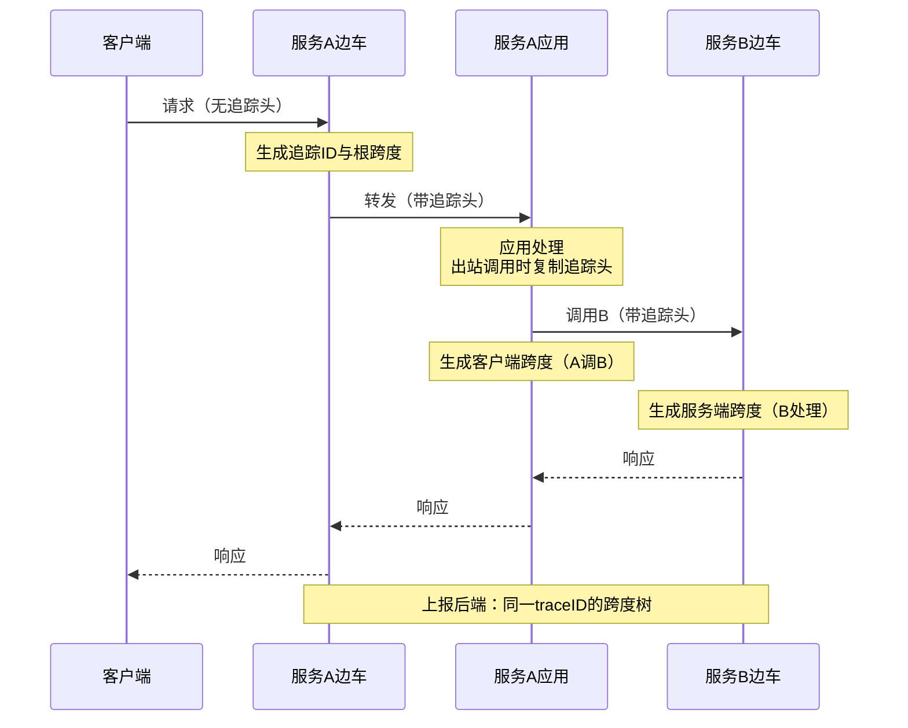
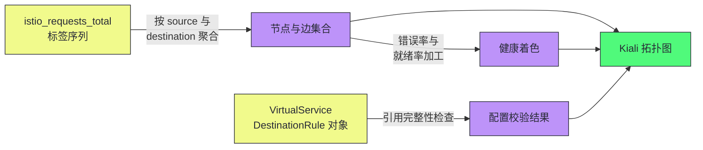

# 可观测性——分布式追踪、指标与访问日志

**摘要：**

前五篇治理了流量的行为与信任，本篇回答"这一切如何被看见"。网格坐在服务间通信的必经之路上，天然是最佳观测点——但它给出的观测与成熟的应用侧可观测体系是什么关系、互补在哪、盲区在哪，是本篇要讲透的主线。文章按三支柱展开：指标（Envoy 统计如何被加工成 istio 标准指标、标签模型如何同时成就了服务拓扑与基数爆炸、Telemetry API 如何治理）、访问日志（格式、采样与成本）、分布式追踪（跨度注入与上下文传播的机制、应用配合的关键一步、采样策略），最后以 Kiali 的拓扑推导与"网格观测的盲区地图"收束。读完全文你应当能回答两个问题：网格三支柱各自的价值与代价是什么，以及"上了网格还要不要 OpenTelemetry"这个高频争论的答案。

---

## 第 1 章 观测点：为什么是网格，又不只是网格

### 1.1 无侵入的代价结构

可观测性的传统难题是"埋点要侵入应用"：每个服务集成 SDK、每种语言维护一套埋点逻辑、每个版本升级都要回归——这与第 01 篇批评过的 SDK 困境一模一样，只是发生在观测领域。网格把埋点放进了边车：应用零改动，指标、日志、追踪三大件开箱即得。这个"零"字的实质是**成本承担者的转移**：埋点的工程成本从"每个业务团队"转移到"平台团队一次性"，覆盖率的决策从"逐个团队谈"变成"注入即覆盖"。用一个对比数字感受覆盖率的差异：三十个服务的组织里，应用侧追踪埋点的覆盖率能做到六成已属优秀（总有几个语言栈、几个遗留服务接不上），而网格注入的覆盖率天然是注入率的函数——注入了 95%，追踪与指标的覆盖就是 95%。覆盖率从"工程运动"变成"部署属性"，这是网格观测最实在的价值。

但"零改动"不等于"零成本"。边车的观测能力靠请求经过代理时的处理时间换取——每一项观测行为都是转发热路径上的额外工作：

- **指标打点**：每个请求按标签维度递增计数、更新直方图——标签越多，打点越贵；
- **日志落盘**：逐请求格式化并写出——格式越全、量越大，成本越高；
- **跨度生成与上报**：采样命中时要构造跨度、维护上下文、异步上报。

可观测的成本曲线与治理能力一致：**开启越多、标签越细，数据越贵**。本篇会反复回到这条成本线上——可观测性工程的一半是在回答"这个数据值不值这个钱"。

### 1.2 观测点视角与应用内视角的本质差异

网格是网络视角的观测者：它看见的是"一次跨服务调用的两端"——谁调了谁、多少字节、什么协议、结果如何。它看不见的是应用内部——函数耗时、线程池状态、业务异常、缓存命中率。应用内观测（APM、profiler、业务埋点）与网络观测是两双不同的眼睛，前者看"应用为什么慢"，后者看"调用关系网的健康度"。

| 视角 | 能看见 | 看不见 |
| :--- | :--- | :--- |
| 网格（网络视角） | 调用拓扑、请求量、错误率、跨服务延迟分布 | 应用内部耗时、业务语义、异步边界 |
| 应用内（进程视角） | 函数级耗时、线程与内存、业务事件 | 服务间网络真相、调用拓扑全貌 |

这个视角差异直接回答了"上了网格还要不要 OpenTelemetry"——要。网格的观测覆盖"服务之间的网"，应用内遥测覆盖"服务里面的点"，两者拼起来才是完整的图。真正被网格替代掉的是那些"仅仅为了跨服务传播与统计"的应用埋点（譬如只为统计对下游调用的错误率而做的埋点），而不是整个应用遥测体系。用一个不严格的划分帮团队做取舍：**凡是"看调用"的问题问网格，凡是"看代码"的问题问应用**——分界线上重叠的部分（某个接口的 P99：网格有网络口径，应用有处理口径），两个口径都有价值且数值必然不同，先把口径约定清楚再比较，否则就是无穷无尽的"数字对不上"。[[00 可观测性全景导览]] 与 [[03 OpenTelemetry 统一标准]] 里建立的观测体系认知，在本篇是理解"互补边界"的底座。

### 1.3 三支柱的同源与独立

指标、日志、追踪在网格里共享同一处产出位置（边车）、同一套关联键（trace ID、标志位、命名规范），但三者的机制、成本与治理完全独立——同源而不同体。同源带来工程便利：一次注入三件套齐活，关联键天然统一，交叉验证不需要翻译；不同体带来治理要求：成本结构不同（基数、速率、采样），治理抓手不同，各自的开关与预算要分开管理。把三支柱当"一个功能"来开或关，是容量事故的常见起点。独立性还有一层组织含义：三支柱的第一责任人可以不同——指标与告警通常归 SRE，日志归平台与应用共管，追踪是排障时的公共设施——治理流程要为"三个顾客"分别设计，而不是用一个观测平台的名义一刀切。同源的另一个红利值得点破：故障排查时三支柱的交叉验证成本极低——指标说"有异常"、日志说"异常长这样"、追踪说"异常在哪一跳"，三个证人的供词用同一套语言书写，互相印证不需要翻译。这个"同源红利"在自建观测体系里要靠大量的约定与工具才能凑齐，在网格里是出厂设置——这也是"观测体系优先建在网格上"最有说服力的理由。

---

## 第 2 章 指标：从 Envoy 统计到服务拓扑

### 2.1 两层指标体系

网格的指标分两层。**底层是 Envoy 自身的统计**：每个集群的 upstream_rq_500 计数、upstream_cx_active 活跃连接、upstream_rq_time 延迟直方图、连接池溢出计数——第 03 篇讲过的 thread-local 统计体系在这里兑现为可查询的数字。它们按 Envoy 对象（集群、监听器）组织，语义是代理视角的，粒度细、数量大。

**上层是 Istio 的标准指标**：istiod 把代理统计按服务语义重新加工，产出以服务调用为单位的指标族：

| 指标 | 类型 | 语义 |
| :--- | :--- | :--- |
| istio_requests_total | 计数器 | 服务间请求量（按来源、目标、结果细分） |
| istio_request_duration_milliseconds | 直方图 | 请求延迟分布 |
| istio_request_bytes / istio_response_bytes | 直方图 | 请求与响应体量 |
| istio_tcp_sent_bytes_total | 计数器 | TCP 流量（非 HTTP） |
| istio_tcp_connections_opened_total | 计数器 | TCP 连接建立 |

从请求穿越代理到指标可查询的产出链路如下：


链路里的每一环都是一个排障对象：计数没涨看打点（第 03 篇的过滤链短路）、标签缺失看遥测配置、抓取断流看暴露端点与网络策略、面板空白看 Prometheus——指标问题的排障也是分层定域的。

两层的关系是"原材料与成品"，各有各的用途：

- **成品层（标准指标）**：面向服务语义的监控与告警——错误率、延迟分位数、流量分布，日常盯盘全在这里；
- **原料层（Envoy 统计）**：面向代理内部机制的排障——连接池溢出、建连失败、线程统计，"为什么成品是这个数字"的答案常在这里。

可以打一个比喻：标准指标像年度财报（按业务科目汇总，管理层直接读），Envoy 统计像原始账本（每一笔都有明细，审计与查账才翻开）。财报解释不了的问题去账本里找——但没有人用账本做日常经营决策。两者的边界还有一个常见问答值得记录：标准指标够不够用？**监控与告警够，排障不够**——错误率抬升了（财报），为什么抬升（建连失败还是池溢出）要去账本里翻 Envoy 的原始计数。两层的阅读人群不同：业务与 SRE 团队读财报，平台团队钻账本。账本里最常翻的几个科目，值得预先混个脸熟：

- upstream_rq_time：上游延迟直方图——"慢"的定量证据；
- upstream_cx_overflow：连接池溢出计数——容量账算错的直接报数；
- upstream_cx_connect_timeout：建连超时——网络与端点问题的信号；
- upstream_rq_pending_overflow：等待队列溢出——并发超过排队能力的信号。

这四个信号加上访问日志的标志位，覆盖了数据面排障八成的高频场景。加工发生在代理进程内（第 02 篇讲过 Mixer 退场后遥测内联的历史），边车自己算、自己暴露，控制面不碰数据面——遥测数据面自治，与转发的数据面自治一脉相承。

### 2.2 标签模型：拓扑的来源，也是基数的源头

标准指标的价值密度集中在标签上。一份 istio_requests_total 的标签清单：来源工作负载与命名空间、目标服务与工作负载与版本、协议、响应码、响应标志位（第 03 篇的 flag 在这里兑现）、连接安全策略（mTLS 与否）、报告方（客户端侧还是服务端侧上报）——每一个维度都是一次可以切片的查询轴。

**服务拓扑图就是这份标签的副产品**：把 istio_requests_total 按 source_workload 与 destination_service 两个标签聚合，得到全网格的调用关系图——Kiali 的拓扑画的就是这个（第 5 章展开）。几个典型查询轴的用法：

- **按 destination_version 切片**：灰度验收的仪表盘——v1 与 v2 的错误率、延迟分布对比（第 04 篇的步进放量就看它）；
- **按 response_flags 切片**：503 的定域——UH 集中说明端点健康问题，UF 集中说明网络问题（第 03 篇标志位表的指标版）；
- **按 connection_security_policy 切片**：零信任迁移的进度表——mutual_tls 与 none 的占比就是第 05 篇的迁移仪表盘；
- **按 reporter 切分**：口径对齐的基础（见 2.5 节）。

灰度验收、排障定域、安全迁移——三大场景的仪表盘全部由同一份指标的标签切片兑现，这就是"标签模型是价值密度中心"的含义。

一条实际序列的样子长这样——每个标签组合就是一条独立的时间序列：

```text
istio_requests_total{
  reporter="destination",
  source_workload="productpage-v1", source_workload_namespace="default",
  destination_workload="reviews-v2", destination_service="reviews",
  destination_workload_namespace="default", destination_version="v2",
  request_protocol="http", response_code="200",
  response_flags="-", connection_security_policy="mutual_tls"
}  1234
```

每个标签都是一个查询轴，也都是一个基数乘数——上面这条序列占的是一个独立的时间位，而它的标签组合空间是所有轴的笛卡尔积。

但标签的代价是**基数爆炸**。算一笔账：每对"来源 × 目标"是一个时间序列，乘上响应码（十几种）、标志位（十几种）、协议、版本——一个有 500 个服务、平均每个服务 10 个调用方加 3 个版本的集群，仅 istio_requests_total 的理论序列数就以百万计。Prometheus 的内存、抓取带宽、查询延迟全部与基数线性相关——**标签模型既成就了拓扑，也埋着监控体系自身的容量地雷**。

### 2.3 基数治理：给指标瘦身的三板斧

基数治理的手段按"损失多少信息"排序，构成三板斧：

1. **砍标签**（损失最小、收益最大）：响应标志位（response_flags）在正常流量下几乎全是空值，却贡献了十几个组合维度；destination_service 与 destination_workload 在单版本服务上冗余。Telemetry API 的 tagOverrides 支持按指标删标签，从源头止血；
2. **砍指标**（整族下线）：TCP 指标族在纯 HTTP 网格里可以整体关闭，直方图的桶密度可以降档——用不到的数据一个字节都别产出；
3. **砍范围**（裁剪暴露面）：proxyStatsMatcher 让每个边车只暴露与自己相关的统计（第 02 篇作用域裁剪思想在指标层的重演），不相关服务的数据根本不产出。

三板斧的共同前提是**先量化再动手**：把当前每个指标的实际基数（sum by (metric) count by (metric)）拉出来排序，砍最大的而不是砍顺手的。基数治理是持续工程——服务数增长、版本翻新、新协议引入都会重新推高基数，季度性的基数体检是网格运维的标准动作。

### 2.4 暴露与抓取：指标如何到达监控系统

边车指标的暴露端点是 15090（Envoy 统计与 istio 指标的合并出口），以 Prometheus 文本格式对外提供；Prometheus 的抓取配置要识别带 istio 注解的 Pod（sidecar.istio.io/status 注解判断注入状态）并按 Pod 级任务抓取。工程上有三点值得注意：

- **抓取端的容量匹配**：基数决定了单次抓取的响应体积，万级 Pod 的大网格里 Prometheus 的分片与联邦（跨分片聚合）几乎是必然选择——抓取架构要按基数预算设计，而不是等爆了再拆；
- **合并端口的语义**：15020 一类合并端口把应用指标与边车指标聚合暴露，应用自身（如 Java 的 JMX 转 Prometheus）的指标可以经边车统一被抓——一套抓取任务覆盖双份指标，但也意味着边故障会连累应用指标可见性；
- **指标的诊断入口**：抓取断流时按链路查——Pod 的 15090 通不通、注解在不在、Prometheus 的 target 状态——每一环都有明确的检查命令：

```bash
# 第一步：边车指标暴露是否正常（有输出即通）
kubectl exec deploy/httpbin -c istio-proxy -- curl -s localhost:15090/stats/prometheus | head -5
# 第二步：Prometheus target 是否 UP（Ups 界面或 API 查询）
```


### 2.5 reporter 标签：同一调用被数两次

标准指标有一个初学者必踩的语义坑：每次调用会被**两侧各上报一次**——客户端边车上报一份（reporter=source），服务端边车上报一份（reporter=destination）。这个设计不是为了双倍计数，而是覆盖两种故障可见性：请求没到目标（网络丢、连接拒绝）时只有客户端侧看得到，请求处理失败时服务端侧的口径更准。查询时必须先按 reporter 切分，否则错误率算两遍。约定俗成的口径是：**成功率与错误率看服务端侧（destination），网络级失败看客户端侧（source）**——把这条口径写进面板与告警规范，能省掉无数"数字对不上"的争论。补充一个高级用途：两侧上报的差异本身就是信息——source 侧看见而 destination 侧没有的失败，是"没到达"的失败（网络层）；两侧都看见但结果不同的失败，是"到达了但处理异常"——用两侧的差分可以粗粒度地区分"路上丢的"与"屋里坏的"。

### 2.6 Telemetry API：观测配置的声明式化

遥测配置经历过一次与控制面架构同样的演进：早期埋在全局 MeshConfig（单体配置，粒度粗），1.12 起 Telemetry API 把观测配置变成命名空间与工作负载级的自定义资源——与 VirtualService 同款的声明式体验：

| 能力 | Telemetry API 表达 | 典型用途 |
| :--- | :--- | :--- |
| 指标开关与裁剪 | metrics.overrides（删除标签、关闭指标） | 基数治理 |
| 访问日志开关与格式 | accessLogging（按工作负载启停） | 高流量服务的日志成本控制 |
| 追踪采样率 | tracing.randomSamplingPercentage | 高流量服务降采样、调试期提升 |
| 自定义标签 | tracing.customTags（环境变量、请求头来源） | 把业务维度注入追踪 |

一份典型的声明长这样——给支付命名空间保留完整指标、给大流量静态服务关日志降采样：

```yaml
apiVersion: telemetry.istio.io/v1
kind: Telemetry
metadata:
  name: payment-full
  namespace: payments
spec:
  metrics:
  - enabled: {value: true}
  tracing:
  - randomSamplingPercentage: 10    # 支付链路采样提到 10%
---
apiVersion: telemetry.istio.io/v1
kind: Telemetry
metadata:
  name: static-quiet
  namespace: static-assets
spec:
  accessLogging:
  - disabled: {value: true}         # 静态资源关访问日志
  tracing:
  - randomSamplingPercentage: 0.1   # 采样降到千分之一
```

这份声明式能力的深意与第 04 篇同构：**观测行为本身成了可版本化、可评审、可灰度的配置**——给某个命名空间降采样不再改全局配置，而是一次资源提交。观测配置的变更也因此进入了与流量配置相同的治理轨道。

### 2.7 指标与 SLO 的衔接

标准指标是 SLO 工程的天然原料——错误预算的分子分母都从 istio_requests_total 出：SLI（服务等级指标）定义为"服务端侧 5xx 占比"与"延迟直方图超过阈值的占比"，SLO 定义目标值，错误预算即两者的差。网格指标做 SLI 原料的优势是口径统一（全网格同一套标签语义、同一种上报方式）与零埋点成本；局限在于口径停在网络层——业务级 SLI（"下单成功率"）仍要业务指标补位。SLO 的完整工程在 [[07 指标工程落地与 SLO 体系]] 有系统展开，本篇的定位是把原料供好。

---

## 第 3 章 访问日志：每一跳的流水账

### 3.1 日志的结构与价值

访问日志是代理对每个请求的"户籍登记"。一份生产级日志字段的清单：

- **身份与路由**：来源与目标（服务名、工作负载、IP）、方法、路径、协议；
- **结果**：响应码、响应标志位（第 03 篇的 flag——UH、UF、NR 各自指认故障域）、字节数；
- **时间**：起始时间、总耗时、上游耗时（两者的差就是代理自身开销）；
- **关联键**：追踪 ID、请求 ID——三支柱互跳的钥匙。

若说指标是体检报告（汇总的数字），日志就是病历本（逐次的原始记录）——体检告诉你"肝指标偏高"，病历本翻到那一天的那一次检查才能还原当时的细节。两者永远互为下一站，缺了谁另一站的效率都会崩塌。与指标的聚合视角不同，日志是逐请求的明细：指标的回答是"orders 服务过去五分钟 503 率 2%"，日志的回答是"具体哪五个请求、从哪来、撞上了什么标志位"。**指标负责发现异常，日志负责还原现场**——两者的分工在 [[01 为什么需要指标]] 与 [[01 日志的本质与演进]] 里建立的体系认知同样适用，只是产出者换成了边车。

### 3.2 采样的经济学

访问日志的默认行为是全量记录，而它是三支柱里成本弹性最大的：一个每秒万级请求的边车，全量 JSON 日志的产出速率以每秒数 MB 计——存储、检索、传输的成本随流量线性上涨。治理手段有三档：**按工作负载启停**（Telemetry API 把静态资源的健康检查日志关掉，把支付链路的留全）；**格式瘦身**（文本格式比 JSON 便宜两三成，字段裁剪同理）；**采样**（只记录 1% 或只记录错误与慢请求）。三档手段的取舍排进一张表：

| 手段 | 收益 | 信息损失 | 适用 |
| :--- | :--- | :--- | :--- |
| 按负载启停 | 一刀切省整块 | 该负载日志全无 | 静态资源、健康检查类高频低价值流量 |
| 格式瘦身 | 单条体积降三到五成 | 极小（保留关键字段） | 全网格默认项 |
| 采样 | 速率线性下降 | 未采到的正常请求 | 高流量核心服务的常态降档 |

共同的取舍是"事后追溯能力换当下存储成本"——采样率的底线是"错误与慢请求不丢"，因为日志在现场还原中的价值集中在异常请求上，正常请求的日志边际价值极低。

格式定制的实例值得看一眼——Telemetry 与 MeshConfig 支持把日志转成 JSON 并裁剪字段：

```text
# 保留排障最必需的九个字段，单条体积减半
{"time":"...","method":"GET","path":"/api/orders",
 "code":503,"flag":"UH","duration":"12",
 "upstream_host":"10.244.2.11:9080","trace_id":"...","app":"orders"}
```

瘦身的原则与指标砍标签同构：**字段的价值取决于排障时的使用频率**——半年用不到的字段，不值得每条日志都背着它跑。

指标是聚合视图，查询窗口之后才成数字；日志是即时明细，请求落地即成行。两者之间有时间差：指标发现异常通常滞后一到两个抓取周期（数十秒级），而异常发生瞬间的那批请求只存在于日志里——**日志是异常发生后的第一时间现场，指标是异常形态的完整拼图**。时效差的工程含义：告警靠指标（避免逐请求评估的成本），但告警的 runbook 第一跳永远是日志——先抓现场再谈形态。

### 3.3 错误日志的第二重价值：安全审计

访问日志在安全域还有一重身份：审计数据源。每次调用的来源身份（mTLS 证书对应的 SPIFFE 身份，第 05 篇的 principal）、目标、路径、结果——正是"谁在什么时候访问了什么"的完整记录。授权策略的影子验证（AUDIT 阶段看"会拦掉谁"）、越权访问的追溯、合规审计的取证，都以这份日志为原料。日志的采样策略与安全审计需求冲突时（审计要求全量、成本要求采样），按服务分级是现实的解法：涉敏服务全量留痕，其余按观测需求采样。

> [!info] 核心概念：三支柱的成本曲线不同
> 指标的成本主要在基数（随维度组合爆炸，与流量速率无关），日志的成本主要在速率（随请求量线性），追踪的成本主要在采样（全量遥不可及，采样即可控）。三者的治理抓手不同——指标砍标签、日志控速率、追踪调采样——混着治理往往砍错对象。这张成本结构表是网格观测容量规划的第一张底稿。

### 3.4 与日志体系的对接

边车日志的归宿与一切容器日志相同：stdout 出、节点收集器收、进中心化日志系统（[[04 Loki 日志系统深度解析]] 的标签索引模型对边车日志同样高效）。对接时的工程点值得注意：

- **分流采集**：边车日志与应用日志混在同一个 Pod 的输出里，采集时要按容器名分流（istio-proxy 容器单独走管道），否则检索时只能靠内容过滤硬分；
- **关联键的统一**：日志里的追踪 ID 是三支柱互跳的钥匙——指标异常切到日志靠"时间段加标签"，日志跳追踪靠 trace ID，反向亦然；
- **平台统一注入的溢价**：关联键（trace ID、标志位、服务命名规范）由平台统一规定，三支柱的互跳比自建体系顺畅得多——这是网格观测最容易被低估的收益。

---

## 第 4 章 分布式追踪：跨度如何长出来

### 4.1 网格追踪的机制：两个跨度与一次传播

分布式追踪的完整理论在 [[01 为什么需要链路追踪]] 中已经建立，本篇聚焦网格的实现方式。请求进入 sidecar 时，代理生成一个**服务端跨度**（server span）——记录"这个服务处理这个请求"的耗时与结果；请求离开 sidecar 去往下游时，代理生成一个**客户端跨度**（client span）——记录"这个服务调用下游"的耗时与结果；调用链上每个服务各自贡献这一对跨度，串起来就是完整的追踪。

跨度的串联靠**上下文传播**，一次三跳调用的完整接力是这样的：

1. 入口边车收到外部请求，发现没有追踪头——生成新的追踪 ID 与根跨度，把追踪头写进请求转给应用；
2. 应用 A 处理请求，随后调用服务 B——**把入站的追踪头原样复制到出站请求**（这一步是应用的责任）；
3. A 的出站边车读到追踪头，生成客户端跨度（A 调 B 的耗时），追加自己的跨度信息后转发；
4. B 的入站边车同样生成服务端跨度，请求处理完后如此往复。

代理把"它那一半"做得很到位——入站头交给应用、出站调用生成新跨度；但第 2 步"从入站到出站"发生在应用代码里，代理无能为力。

一次三跳调用的跨度生产时序如下——注意每跳都是"一对跨度"：



这条传播链像接力赛的交接棒：网格代理把棒递到每个运动员手里（入站头交给应用），运动员跑完自己那一棒，要把棒交还给下一棒的递送员（出站调用带上头）——**中间那段持棒奔跑，代理看不见也管不着**。任何一个服务忘记把追踪头从入站请求复制到出站调用，就等于在跑动中把棒扔了——下游自立门户开一条新追踪，链路断成两截。**"追踪图断成一截一截"的头号根因就是应用侧漏传头**，尤其是异步路径（线程池切换、消息队列收发）里的传递。这也是 1.1 节"两双眼睛"论断的又一个注脚：网格把跨服务的传播接好了，应用内的传播（进程内、异步边界）仍然是应用侧观测 SDK 的领地——[[03 OpenTelemetry 统一标准]] 的上下文传播 API 正是这一段的答案。

### 4.2 采样：追踪的成本阀门

全量追踪在数学上不成立——每请求一对跨度的数据量乘以全网请求量，存储与带宽都吃不消。网格的默认采样率是 1%，调节的层次有三：**全局采样率**（MeshConfig 与 Telemetry API 的 randomSamplingPercentage）；**按服务覆盖**（Telemetry API 命名空间级或工作负载级声明——支付链路提采样、静态资源降采样）；**按路由覆盖**（VirtualService 的路由级采样——给调试路由 100%，给常态流量 1%）。

采样的取舍不只是"省多少成本"，而是"要什么样的可见性"。两种采样范式的对照：

| 范式 | 决策点 | 优势 | 代价 |
| :--- | :--- | :--- | :--- |
| 头采样 | 入口处按概率决定 | 成本最低，链路完整（要么全有要么全无） | 异常链路可能整条没采到 |
| 尾采样 | 收集端按链路结果决定 | 异常与慢链路全保留 | 全量先收集，成本前置 |

网格原生只有头采样（按比例丢弃），尾采样要在收集端自建——OTel Collector 的尾采样处理器是现成方案，典型配置是"错误链路 100% 保留、慢链路（超 P99）100% 保留、其余按低比例保留"。两者组合的工程语义是"平时省着记，出事全记着"——SLO 驱动的采样策略（失败链路必须可追溯）正是靠这个组合兑现。调试期的临时提采样要走临时配置（Telemetry API 的工作负载级覆盖加过期时间标注），调试结束必须回收——**高采样率是排障的兴奋剂，常态化就是基数与存储的慢性中毒**。

### 4.3 后端与关联

Envoy 的追踪数据按 Zipkin 格式输出，后端可选 Jaeger、Zipkin、Datadog 或经 OpenTelemetry Collector 转发到任意兼容系统——后端是可插拔的，代理只管产出。工程上的两个关联点：**其一，追踪与指标的关联**——指标异常切到日志、日志取出 trace ID、跳转追踪详情，这条下钻路径贯穿第 2、3 章的机制；**其二，追踪与日志的反向关联**——从跨度跳日志、按链路聚合相关日志。三支柱的相互跳转依赖统一的 ID 与时间口径，网格因为"平台统一注入"，比自建体系少踩一半的关联坑——自建体系里最常见的三套 ID 对不上、时钟漂移、命名不一致问题，在网格里从出厂就规避了。

后端选型的一个务实建议：**选型权重应放在"查询体验与关联能力"上，而不是"采集协议"上**——采集格式已被 Envoy 的 Zipkin 兼容层统一，各家后端的真正差异在查询速度、跨度搜索（按标签找链路）、与日志指标的联动深度。三个主流路线的对照：

| 路线 | 优势 | 代价 |
| :--- | :--- | :--- |
| Jaeger 直连 | 生态成熟、部署简单 | 存储后端要自选自管 |
| OTel Collector 中转 | 采集与后端解耦，尾采样在此做 | 多一跳组件要运维 |
| 商业可观测平台 | 开箱即用、关联能力强 | 成本与数据出境考量 |

按组织现有的观测版图接短板，而不是推倒重来。

### 4.4 传播格式与兼容

传播格式的细节也值得一表：B3 是 Zipkin 家族的多头约定（b3 单头或 x-b3-traceid 等多头），W3C Trace Context（traceparent）是标准化后继——两者的并存是历史包袱的常态，网格代理通常同时识别与透传（格式可配置），但**应用侧的 SDK 要与全链路约定对齐**：混用格式时依赖代理的互转，互转覆盖不了的场景就是断链。新体系建议直接统一到 W3C 格式，存量体系迁移时保留代理互转做过渡。传播链上最常见的几个头，排障时要能一眼认出：

| 头 | 内容 | 断链排查时的含义 |
| :--- | :--- | :--- |
| traceparent | W3C 标准的追踪上下文 | 有它说明上游传了上下文 |
| x-b3-traceid / b3 | B3 系列追踪 ID | 与 traceparent 二选一或并存 |
| x-request-id | 请求级唯一 ID | 日志关联的次选钥匙 |
| b3 单头压缩格式 | 合并版 B3 | 部分库只认它，格式对齐检查点 |

### 4.5 自定义标签：把业务维度带进追踪

Telemetry API 的 customTags 支持把三处来源注入追踪跨度：环境变量（Pod 的部署维度）、字面量（环境标识）、请求头（业务维度如租户 ID）。它的价值是让追踪支持业务切片——"会员租户的链路延迟与普通租户对比"这类问题，靠在入口注入租户头并声明为自定义标签，就能在追踪后端按标签过滤。代价仍是基数：头来源标签的取值空间要有界（枚举型的租户 ID 可以，自由的用户 ID 不行）——追踪标签的基数纪律与指标一致。

### 4.6 一次端到端排障的走位

把三支柱的协作演一遍真实剧本。告警响起：checkout 服务的 P99 延迟从 300 毫秒涨到 2 秒。**第一站，指标定域**：Grafana 看网格指标——延迟涨了，错误率没涨；按调用方切片，只有 checkout→inventory 这条边恶化；看 Envoy 原料层，upstream_rq_time 抬升而代理自身开销平稳——问题在 inventory 或它的下游。**第二站，日志锁定**：按"时间段加 destination=inventory 加 duration>1s"筛访问日志，取出一批慢请求的 trace ID。**第三站，追踪还原**：打开其中一条追踪——树展开后一眼可见：inventory 内部处理只占 200 毫秒，慢的是它调用 pricing 的那一段；pricing 的服务端跨度更大，而 pricing 调缓存的那一跳占了大头——缓存命中率掉底。四站走完，根因落在了"应用内部"（缓存命中率）——恰是第 1 章说的"网格看不见、应用观测接棒"的地方，而网格观测的价值在于把它**定位到了最小的嫌疑范围**。

这个剧本的走位值得背下来：**指标定域 → 日志锁定 → 追踪还原 → 应用接棒**——四站每站都有明确的输入输出，没有一站靠猜。

---

## 第 5 章 Kiali：把指标变成地图

### 5.1 拓扑图的原理与局限

Kiali 是网格的可视化前端，它最有代表性的能力是服务拓扑图——但拓扑图的原理值得点破：**它不是实时抓流量画的，而是查询 Prometheus 里的 istio_requests_total 聚合出来的**。指标里的来源与目标标签，经 Kiali 的图查询组装成节点与边——拓扑图的"真实性"完全继承自指标的真实性（指标缺标签、基数被裁过头，图就缺边）；拓扑图的"新鲜度"也继承自指标的抓取周期（分钟级）。理解原理就不会误解它的两个表现：

- **图上没有的调用不代表不存在**——可能是该边暂无流量、指标被裁剪、或标签缺失；
- **边上的数字是历史窗口的聚合**——不是实时速率，分钟级延迟是它的常态；
- **图的健康色也不是实时的**——它来自指标的周期性查询，秒级故障在图上要等下个窗口才显形。

把 Kiali 当"分钟级粒度的地图"用，它就是利器；把它当"实时监控大屏"用，就会失望。还有一个选型备注：Kiali 不是唯一的网格控制台，各家商业网格产品自带的可视化、Grafana 的网格仪表盘都在同一生态位竞争——Kiali 的优势是开源中立与配置校验的深度，选型时按既有观测版图搭配即可。从指标到地图的推导链路如下：



图上每种颜色、每条边、每个徽标都能追溯到某个数据源——理解推导链，才能区分"数据问题"与"地图问题"。

### 5.2 三件套：拓扑、健康、校验

拓扑之外，Kiali 的另两件能力同样实用。**健康评估**：按"请求错误率加端点就绪率"为每个服务计算健康分，拓扑图上的红黄绿就是它——它是指标语义的加工层，不是新的数据源。**配置校验**：检查 VirtualService 与 DestinationRule 的引用完整性（指向不存在的 subset、Gateway 与 host 不匹配、路由规则永远匹配不到之类）——第 04 篇"弱校验靠流程补位"的缺口，Kiali 补了一块可视化检测。三件套合起来，Kiali 扮演的是"网格状态翻译官"：

- **拓扑图**：指标标签的空间投影——谁在调用谁、流量多大、错误率多少，一眼成图；
- **健康视图**：错误率与端点就绪的语义加工——红黄绿是判定，不是新数据；
- **配置校验**：跨对象的引用完整性检查——第 04 篇"弱校验"缺口的可视化补位。

它的定位是"看与查"，不是"管"——改配置回 kubectl 或 GitOps，Kiali 只负责让你看清改了之后世界长什么样。多集群场景还有一层地图拼接问题：各集群的 Prometheus 各自持有本集群的指标，全局拓扑要么靠远程读（Prometheus 联邦）、要么靠中心化聚合——Kiali 的全局视图质量取决于数据层的聚合质量，地图拼接的缝隙（跨集群调用的边缺失或重复计数）要从数据层修，不是地图层的锅。落地时的三个提醒：

- **权限边界**：Kiali 的只读属性要靠 RBAC 保证，别把它的部署账号配成集群管理员；
- **数据依赖**：它的全部能力建立在 Prometheus 数据齐全之上——抓取断流的命名空间在图上就是空白，别误读为"没有服务"；
- **版本对齐**：Kiali 对 Istio CRD 的校验规则随版本演进，升级 Istio 时同步升级 Kiali，否则校验误报。

---

## 第 6 章 盲区地图：网格看不见什么

### 6.1 四大盲区

把"上了网格就全看到了"的幻觉逐项击破，逐项击破之前先声明：盲区清单不是网格的缺陷清单，而是"组合各种观测手段"的路线图——知道网格看不见什么，才知道该把别的眼睛放在哪里，盲区清单如下：

| 盲区 | 表现 | 补位手段 |
| :--- | :--- | :--- |
| 应用内部 | 函数耗时、线程池、业务异常 | 应用侧 OTel SDK、profiler |
| 异步边界 | 消息队列的收发、异步任务的链路断裂 | 消息属性携带追踪上下文、消费端续链 |
| 非 HTTP 协议 | 数据库、缓存的 L4 视野 | 协议级过滤器（MySQL/Redis/PG），成熟度有限 |
| 采样外链路 | 被头采样丢弃的链路 | 尾采样、异常驱动的强制采样 |
| 跨集群拓扑 | 多集群的全局视图分散在各自数据里 | 联邦查询或全局观测平面 |

第一盲区已经在 1.2 节论证过——两双眼睛缺一不可。第二盲区是追踪断链的第二大根因：消息队列是天然的追踪断点——生产端把上下文写进消息属性、消费端读出并续链，这段胶水代码要么由应用做、要么由封装库做，网格的边车帮不上忙，因为消息不走它的转发路径。第三盲区有协议过滤器的缓解方案但别高估：MySQL 协议过滤器能看见"什么 SQL 打到了哪个数据库"，语义深度远不及 HTTP 系治理，且引入的解析开销与协议版本耦合要评估。第四盲区是采样策略的固有代价——异常驱动的采样（错误请求强制保留）是务实的折中，配合第 4.2 节的头尾组合，可以把"看不见的异常链路"压到接近零。

### 6.2 常见误区清单

| 误区 | 真相 |
| :--- | :--- |
| "追踪断了是网格的 bug" | 十有八九是应用漏传追踪头（4.1 节） |
| "指标都变慢是网格开销" | 先查基数爆炸——监控体系自身的病常被当成网格的病 |
| "Kiali 图上没有的调用就不存在" | 图是指标的投影，指标缺失或无流量都会缺边 |
| "采样率调高就能看到所有异常" | 头采样按概率丢弃，异常链路可能整条没采到 |
| "网格遥测可以替代应用埋点" | 网络视角补不了进程视角（1.2 节） |
| "自定义标签随便加" | 头来源标签的取值空间要有界，否则基数事故（4.5 节） |
| "边车指标和应用指标一起抓了就行" | 合并端口的故障会连累双方可见性（2.4 节） |
| "日志越全越好" | 全量日志的成本随流量线性走，字段与速率都要预算 |
| "采样率是全局一个数" | 全局、服务、路由三级可调，一刀切是浪费或盲区 |

### 6.3 网格自身的观测：代理健康度

讲完网格给应用的观测，还有一层常被遗漏：**网格自身的健康观测**。边车是每个 Pod 里的进程，它的资源用量、重启次数、配置同步状态是网格可靠的底座：

- **边车资源**：CPU 与内存的用量与限制比（第 03 篇的四块内存构成）、重启计数——OOM 重启意味着业务 Pod 连带重启；
- **配置同步**：proxy-status 的 SYNCED/STALE 状态分布——大面积 STALE 是控制面或推送问题的前兆（第 02 篇的信号清单）；
- **控制面指标**：istiod 的推送延迟、连接数、CPU——观测的观测，元层面的元层面。

这层观测的责任归平台团队，与业务团队对应用观测的责任划分清晰——观测体系自身的所有权矩阵，比指标本身更值得先定。

### 6.4 基数事故：监控体系的自我保护

用一个真实形态的事故收束本章。某团队新接入 200 个服务后，Prometheus 内存从 40 GB 涨到 200 GB、抓取超时、查询超时——排查发现是 istio_requests_total 的基数：200 个服务互调、乘上版本与响应码，序列数冲到千万级。这不是网格的 bug，是**观测体系没有为网格指标的基数模型做容量规划**。处置分三步：

1. **紧急止血**：裁掉 response_flags 等高基数标签，序列数当天回落；
2. **结构治理**：Telemetry API 按命名空间裁剪指标，与各服务负责人确认信息损失可接受；
3. **长期预算**：把"网格指标的基数预算"纳入容量规划，与 2.3 节的季度体检挂钩。事故之外还有一层组织教训：基数爆炸的受害者是监控系统，肇因却在网格指标的标签设计——生产者与承担者的分离，让这类问题天然缺乏守门人。治理的落点是把标签纪律写进网格准入规范：新服务接入时的基数评估、自定义标签的取值空间审查、定期体检的告警阈值——没有制度兜底，三板斧只会一遍遍地重来。

基数事故的教训可以一句话带走：**网格把观测数据的产出变得免费，但数据的存储与查询从未免费**。

### 6.5 观测的分层治理：谁管哪一层

观测体系的治理要按层级分清责任，否则要么一刀切（平台定死所有配置）、要么无人管（各团队随机发挥）：

| 层级 | 决策者 | 决策内容 |
| :--- | :--- | :--- |
| 网格级 | 平台团队 | 指标基线、默认采样率、日志格式规范 |
| 命名空间级 | 平台与业务共商 | 采样率调整、特殊指标需求 |
| 命名空间级补位 | 平台与业务共商 | 自定义标签的准入审核 |
| 工作负载级 | 业务团队 | 高流量服务的降档、调试期临时提采样 |

分层治理的枢纽是"预算"：平台团队给每个命名空间分配观测预算（基数上限、日志速率上限），预算内的细调由业务自治，超预算的调整要走评审——与云计算的资源配额治理同构，观测数据的成本终于也被当成成本来管理。

网格观测上线时的检查清单，按序核对：

1. 指标基线：标准指标全量开启时的基数估算是否在预算内；
2. 抓取架构：Prometheus 容量、分片方案、联邦拓扑与基数预算匹配；
3. 日志策略：各服务的日志启停与格式，采集管道分流是否生效；
4. 追踪链路：入口采样率、后端对接、应用侧传播的抽查验证（挑两条深链路人工核）；
5. 仪表契约：依赖网格指标的面板、告警、SLO 定义是否绑定了正确的标签口径；
6. 治理落地：预算分配、季度体检、变更管理流程是否已成文。

上线之后，季度体检的固定科目：

| 科目 | 查什么 | 健康标准 |
| :--- | :--- | :--- |
| 基数审计 | 各指标序列数与增速 | 在预算内，环比无异常跳变 |
| 日志速率 | 各命名空间日志量 | 在预算内，错误日志占比合理 |
| 采样核查 | 实际生效的采样率 | 与声明一致，异常链路可追溯 |
| 关联完整性 | 深链路抽查传播 | 抽查 10 条链路无断链 |
| 面板契约 | 面板与告警的标签依赖 | 与当前标签集一致 |

> [!warning] 生产避坑：观测配置也是变更
> Telemetry API 让观测配置像流量配置一样灵活，也带来了同样的风险——一次标签裁剪可以让依赖该标签的 Grafana 面板与告警规则集体失明，一次采样率下调可以让排障时的追踪查询突然查不到链路。观测配置的变更要进变更管理（评审、灰度、回滚预案），并与下游消费者（面板、告警、SLO 定义，[[07 指标工程落地与 SLO 体系]] 的契约）核对依赖——**砍一个标签之前，先问谁在用它**。

---

## 第 7 章 小结：两双眼睛的分工

收拢本篇：网格的观测价值来自位置（每一跳的必经之路），代价来自同样的位置（转发热路径上的额外工作）。三支柱的成本结构不同——指标贵在基数、日志贵在速率、追踪贵在采样，治理抓手各自独立。标准指标的标签模型是双刃剑：一面是服务拓扑与灰度验收的查询轴，另一面是监控体系的容量地雷；Telemetry API 把观测行为变成声明式配置，也把观测配置纳入了变更管理的轨道。追踪的机制要点是"两个跨度加一次传播"——跨服务传播代理包办，应用内传播仍是应用的责任；断链的头号根因永远是漏传头。Kiali 是指标的翻译官而非新的数据源。盲区地图的结论是一句反直觉的话：**网格让应用观测变得更必要而不是更不必要**——因为只有把两双眼睛看到的图拼起来，"慢在哪一跳、错在哪一段"的问题才有完整答案。4.6 节的四站走位——指标定域、日志锁定、追踪还原、应用接棒——就是两双眼睛协作的标准剧本，建议把它印在排障手册的第一页。

本篇速查收进一张表：

| 支柱 | 成本大头 | 治理抓手 | 一句话记忆 |
| :--- | :--- | :--- | :--- |
| 指标 | 基数 | 砍标签、砍指标、砍范围 | 服务拓扑的原料，基数的火药桶 |
| 日志 | 速率 | 按负载启停、格式瘦身、采样 | 发现靠指标，还原靠日志 |
| 追踪 | 采样 | 全局/服务/路由三级采样率 | 代理管两头，应用管中间 |

最后把"两双眼睛"的分工收成一句可操作的结论：**网格观测回答"哪条边出了问题"，应用观测回答"那个点为什么出问题"**——前者是发现与定位，后者是解释与修复。组织里的责任划分也随之清晰：平台团队为"边的可见性"负责（指标齐全、采样合理、拓扑准确），业务团队为"点的可见性"负责（应用埋点、业务指标、内部剖析）——两份责任清单合起来，才是可观测性的完整契约。再补一个执行层面的提示：两双眼睛的拼接点（trace ID 与服务命名）要作为平台契约显式维护——命名规范、头约定、采样口径，写成文档、进代码评审、做自动化校验——契约明确，两双眼睛才看得见同一只大象。

到这里，专栏的六篇讲完了服务网格的"是什么、怎么转、怎么管、怎么信、怎么看"——还剩最后一个问题：**这一切值不值**。每跳两个代理的延迟与资源开销、万级 Pod 的连接数膨胀、Ambient 模式对整个部署形态的重构——性能的账与后 Sidecar 时代的路线之争，是终篇 [[07 服务网格的性能开销与Ambient Mesh]] 的主题。

---

## 参考资料

1. Istio 官方文档：可观测性（指标、日志、追踪概览）. https://istio.io/latest/docs/concepts/observability/
2. Istio 官方文档：Telemetry API 参考. https://istio.io/latest/docs/reference/config/telemetry/
3. Istio 官方文档：标准指标（istio_requests_total 等）与标签定义. https://istio.io/latest/docs/reference/config/metrics/
4. Envoy 官方文档：统计与访问日志（格式操作符）. https://www.envoyproxy.io/docs/envoy/latest/operations/access_logging
5. OpenTelemetry 官方文档：上下文传播规范. https://opentelemetry.io/docs/specs/otel/context/
6. Kiali 官方文档：图与健康评估原理. https://kiali.io/docs/
7. OpenTelemetry Collector：尾采样处理器文档.
8. Istio 官方博客：Introducing the Istio Telemetry API（遥测配置声明式化的背景）.
9. 周志明. 凤凰架构：构建可靠的大型分布式系统. 机械工业出版社， 2021.（服务网格章节）

---

> [!note] 思考题
> 1. 2.3 节的基数三板斧都以"损失信息"为代价。请为你熟悉的一个集群设计基数预算：保留哪些标签、砍掉哪些、依据是什么？把决策写成一页 ADR（架构决策记录）。
> 2. 4.1 节说"应用内的头传播是应用的责任"。请为一条"网关 → 服务 A（内部起异步任务） → 消息队列 → 消费者 → 服务 B"的链路设计完整的追踪上下文传递方案，标出每一跳的责任归属。
> 3. 头采样便宜但可能漏掉异常链路，尾采样保异常但成本前置。假设你的系统 SLO 要求"每条失败链路必须可追溯"，你会如何组合两种采样与强制采样规则？

