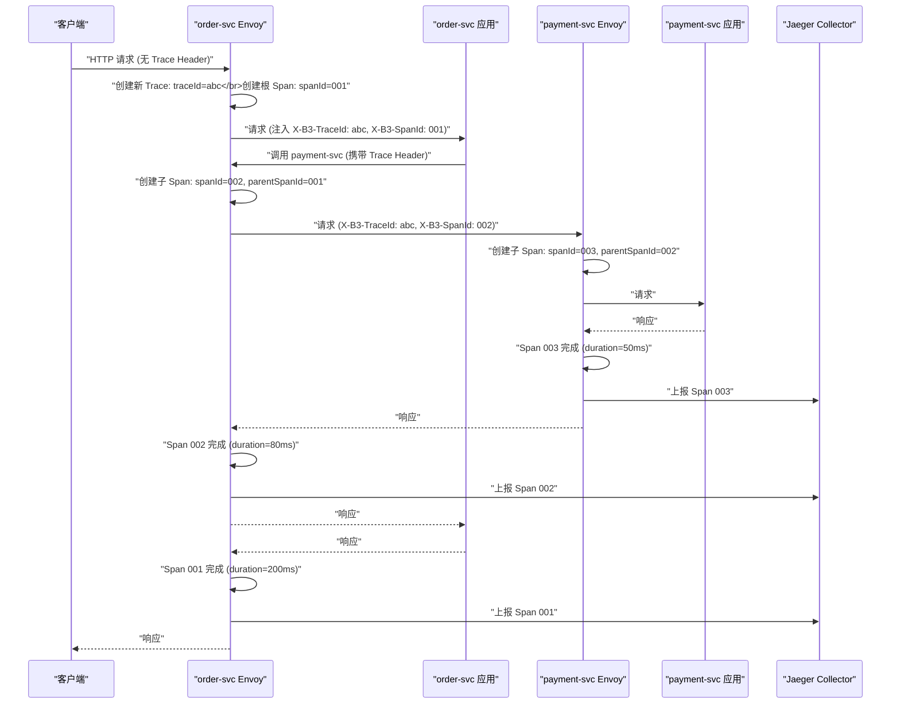
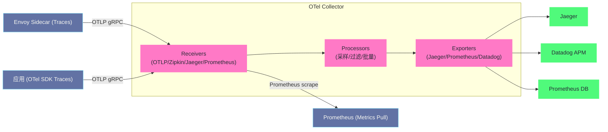

# 可观测性——分布式追踪、指标与访问日志

## 摘要

[[00 可观测性全景导览|可观测性]]（Observability）是现代分布式系统的核心运维能力，由三个支柱构成：**[[01 为什么需要指标|Metrics（指标）]]、[[01 为什么需要链路追踪|Traces（追踪）]]、[[01 日志的本质与演进|Logs（日志）]]**。Istio 通过 Envoy Sidecar 在不修改任何应用代码的前提下，自动为每个服务提供全面的可观测性数据。本文深入分布式追踪的理论基础——为什么单服务的 APM 工具无法应对微服务，Trace/Span 模型如何表达跨服务调用链；解析 Envoy 生成 Trace Span 和传播 Context 的机制，以及应用层需要做的最小化工作（Header 传播）；剖析 Istio 标准 Prometheus 指标体系，用 RED 方法（Rate/Error/Duration）建立服务健康度量；最后详解访问日志的结构化配置、关键字段语义，以及如何用访问日志做精准的故障定位。**可观测性不是"有了就好"的装饰，而是在微服务系统中"知道系统正在发生什么"的唯一可靠手段。**

---

## 第 1 章 为什么需要分布式追踪

### 1.1 单体应用的 APM 工具为何失效

在单体应用时代，APM（应用性能监控）工具（如 New Relic、AppDynamics）可以追踪一个请求在单个进程内的完整执行路径：调用了哪些函数、每个函数耗时多少、SQL 查询语句是什么。这类工具通过字节码插桩或 JVM 代理实现，不需要修改应用代码。

但微服务架构彻底打破了这个工具的适用前提：**一个用户请求不再是单个进程内的事情，而是跨越多个服务、多个进程、甚至多个数据中心的一系列网络调用**。

考虑一个典型的电商下单请求调用链：
```
客户端
  → API 网关（鉴权、限流）
    → 订单服务（创建订单记录）
      → 库存服务（扣减库存）
        → 商品服务（查询商品信息）
      → 支付服务（发起支付请求）
        → 风控服务（风险评估）
        → 银行接口（外部调用）
      → 通知服务（发送确认邮件）
```

当这个链路上某个环节出现 500ms 的延迟时，你怎么知道是哪个服务导致的？单服务的 APM 能告诉你"支付服务的响应时间是 300ms"，但无法告诉你"这 300ms 中有 200ms 是在等待风控服务的响应"——因为跨服务的调用关系不在单服务的 APM 视野之内。

### 1.2 分布式追踪的核心概念

**分布式追踪**为每个请求创建一个全局唯一的 **Trace ID**，在请求经过的每个服务中记录该服务的处理信息为一个 **Span**，所有属于同一请求的 Span 通过 Trace ID 关联，形成完整的 **调用树（Trace Tree）**。

**Trace（追踪）**：代表一个完整的端到端请求，由一个全局唯一的 `traceId`（128 位 UUID）标识。一个 Trace 包含多个 Span。

**Span（跨度）**：代表链路中的一个操作单元，记录：
- `spanId`：本 Span 的唯一 ID（64 位）
- `parentSpanId`：父 Span 的 ID（根 Span 没有 parentSpanId）
- `operationName`：操作名称（如 `GET /api/v1/orders`）
- `startTime` / `duration`：开始时间和持续时长
- `tags`：键值对，描述 Span 的上下文（如 `http.status_code=200`、`db.type=mysql`）
- `logs`：Span 内的时间戳日志事件

**Trace Context 传播**：当服务 A 调用服务 B 时，A 需要将自己的 Trace ID 和 Span ID 传递给 B，B 在创建自己的 Span 时将 A 的 Span ID 作为 `parentSpanId`。这个传播通过 HTTP Header 实现。

### 1.3 常见的追踪传播格式

不同的追踪系统使用不同的 HTTP Header 格式传播 Trace Context：

| 格式 | Header 示例 | 使用系统 |
| :--- | :--- | :--- |
| **B3（Zipkin）** | `X-B3-TraceId`, `X-B3-SpanId`, `X-B3-ParentSpanId`, `X-B3-Sampled` | Zipkin、Jaeger（兼容）、Envoy 默认 |
| **W3C TraceContext** | `traceparent`, `tracestate` | OpenTelemetry 标准，现代系统推荐 |
| **Jaeger** | `uber-trace-id` | Jaeger 原生格式 |
| **Datadog** | `x-datadog-trace-id`, `x-datadog-parent-id` | Datadog APM |

Istio 默认支持 B3 格式，从 1.9 版本开始也支持 W3C TraceContext 格式。

---

## 第 2 章 Envoy 的追踪实现机制

### 2.1 Envoy 如何自动生成 Span

当一个 HTTP 请求经过 Envoy（无论是入站还是出站），Envoy 的 `tracer` 组件会：

**入站请求（从外部进入 Sidecar）**：
1. 检查请求 Header 中是否有 Trace Context（B3 Header 或 W3C `traceparent`）
2. 如果有：提取 `traceId` 和 `spanId`，创建子 Span（parentSpanId = 上游的 spanId）
3. 如果没有：创建新的 Trace（生成新的 traceId 和根 Span 的 spanId）
4. 记录请求开始时间

**出站请求（从 Sidecar 发出，到上游服务）**：
1. 在转发给上游的 HTTP Header 中注入当前 Span 的 Trace Context
2. 记录到上游请求的开始时间

**请求完成时**：
1. 记录 Span 的结束时间（计算 duration）
2. 记录响应状态码（`http.status_code` tag）
3. 将 Span 数据上报给追踪后端（Jaeger/Zipkin Collector）



### 2.2 应用层的最小化工作：Header 传播

Envoy 可以自动生成本 Span 的数据，但有一个关键限制：**Envoy 无法自动传播 Trace Context 穿越应用代码**。

当 `order-svc` 的应用代码收到请求后，Envoy 已经在入站 Header 中注入了 Trace Context（`X-B3-TraceId: abc, X-B3-SpanId: 001`）。当 `order-svc` 内部调用 `payment-svc` 时，它是通过 `order-svc` 的出站流量路径发出的——这个出站请求的 HTTP Header 是由应用代码构造的。如果应用代码**不**将入站的 Trace Header 复制到出站请求中，Envoy 在出站时就无法知道这次调用属于哪个 Trace，会创建一个新的根 Span，调用链就断了。

**结论：应用代码必须传播 Trace Header**，但这是唯一需要在应用层做的工作。

需要传播的 B3 Headers（收到时有什么就传什么）：
```
X-Request-Id          ← 请求唯一 ID（非追踪 Header，但建议传播）
X-B3-TraceId          ← Trace ID（必传）
X-B3-SpanId           ← 父 Span ID（必传，表示"我的调用方是谁"）
X-B3-ParentSpanId     ← 父的父 Span ID
X-B3-Sampled          ← 是否采样（必传，避免上游采样决策在下游丢失）
X-B3-Flags            ← 特殊标志（如 debug=1）
```

各语言的 OpenTelemetry SDK 或框架级传播器（如 Spring Cloud Sleuth、gRPC Metadata Propagation）可以自动处理这个工作，不需要手动编写 Header 复制代码。

> [!warning] 生产避坑
> 追踪链路断裂（某个服务之后的调用无法关联到同一 Trace）是分布式追踪最常见的问题。排查方法：在 Jaeger UI 中查找一条追踪，检查哪个服务之后调用链断裂，然后查看该服务的出站 HTTP 请求 Header 是否包含 B3 Headers。如果不包含，说明该服务的 HTTP 客户端没有配置 Header 传播。注意：**异步调用（如消息队列）的追踪需要在消息元数据中传递 Trace Context**，这比 HTTP 场景更复杂，需要专门处理。

### 2.3 追踪采样策略

全量追踪（每个请求都生成 Span）在高并发场景下会产生大量数据，对追踪后端（Jaeger/Zipkin）造成存储和查询压力。实际生产中需要配置**采样率（Sampling Rate）**：只对一部分请求生成完整的追踪数据。

Istio 支持多种采样策略：

**概率采样（Probabilistic Sampling）**：对每个 Trace 以固定概率决定是否采样。在 Istio 中通过 `MeshConfig.defaultConfig.tracing.sampling` 配置（0.0 ~ 100.0）：

```yaml
apiVersion: install.istio.io/v1alpha1
kind: IstioOperator
spec:
  meshConfig:
    defaultConfig:
      tracing:
        sampling: 1.0    # 1% 的请求被追踪（生产推荐）
```

**头部采样（Head-based Sampling）**：在 Trace 的第一个服务（入口）做采样决策，通过 `X-B3-Sampled` Header 传播到后续服务。这确保了一个 Trace 要么被完整采样，要么完全不采样——不会出现"链路中间某个服务决定不采样，导致该 Span 缺失"的情况。

**尾部采样（Tail-based Sampling）**：先收集所有请求的完整追踪数据，在完成后根据特定条件（如有错误、延迟超过阈值）决定是否保留。相比头部采样，能更精准地保留"有价值"的追踪（错误请求和慢请求），但需要更多的存储缓冲。OpenTelemetry Collector 支持尾部采样，Jaeger 也有实验性支持。

**生产推荐**：对于高并发系统（>1000 QPS），将采样率设置为 **0.1%~1%**，对于低流量系统设置 **10%~100%**。关键是要结合尾部采样，确保错误请求 100% 被采样。

### 2.4 Jaeger 集成配置

```yaml
# Istio MeshConfig 配置 Jaeger 追踪后端
apiVersion: install.istio.io/v1alpha1
kind: IstioOperator
spec:
  meshConfig:
    defaultConfig:
      tracing:
        sampling: 1.0
        zipkin:
          address: jaeger-collector.monitoring:9411  # Jaeger 的 Zipkin 兼容接口
```

Jaeger 同时支持 Zipkin 格式（端口 9411）和 Jaeger 原生格式（端口 14268），推荐使用 Zipkin 格式，因为 Istio 默认支持 B3 格式（Zipkin 标准）。

```bash
# 安装 Jaeger（开发/测试环境）
kubectl apply -f https://raw.githubusercontent.com/istio/istio/release-1.15/samples/addons/jaeger.yaml

# 访问 Jaeger UI
istioctl dashboard jaeger
```

---

## 第 3 章 Prometheus 指标体系

### 3.1 RED 方法：微服务指标的黄金标准

在众多指标中，哪些是最重要的？**RED 方法**（由 Weaveworks 工程师 Tom Wilkie 提出，详见 [[07 指标工程落地与 SLO 体系|SLO 体系]]）给出了答案：

- **R（Rate）**：请求速率——每秒处理多少请求（TPS/RPS）
- **E（Error）**：错误率——有多少比例的请求失败（5xx/4xx）
- **D（Duration）**：延迟——请求的处理时间分布（P50/P95/P99）

这三个维度构成了服务健康的完整度量：Rate 告诉你服务在承受多少负载，Error 告诉你服务是否正常工作，Duration 告诉你服务的用户体验。Istio 通过 Envoy 自动生成这三类指标，不需要应用代码集成 Prometheus SDK。

### 3.2 Istio 标准 Prometheus 指标

Envoy Sidecar 在 `:15090/stats/prometheus` 端点暴露 [[02 Prometheus 数据模型与采集原理|Prometheus]] 格式的指标，Istio 将这些底层 Envoy 指标规范化为一套标准指标（通过 Prometheus 的 `metric_relabeling` 或 Istio 自己的指标合并规则）。

**核心服务级别指标**：

```
# 请求总数（Counter，单调递增）
istio_requests_total{
  reporter="destination",           # 报告者是接收方（destination）或发送方（source）
  source_workload="order-svc",      # 发起请求的服务
  source_namespace="production",
  destination_service="payment-svc.production.svc.cluster.local",
  destination_workload="payment-svc",
  destination_namespace="production",
  request_protocol="http",
  response_code="200",              # HTTP 状态码（用于计算错误率）
  response_flags="-"                # Envoy Response Flags（如 UO/UF/NR）
}

# 请求延迟分布（Histogram，用于 P50/P95/P99 计算）
istio_request_duration_milliseconds_bucket{
  ...（相同 labels）...
  le="10"    # 请求延迟 ≤10ms 的数量
}
istio_request_duration_milliseconds_bucket{le="25"}
istio_request_duration_milliseconds_bucket{le="50"}
istio_request_duration_milliseconds_bucket{le="100"}
istio_request_duration_milliseconds_bucket{le="250"}
istio_request_duration_milliseconds_bucket{le="500"}
istio_request_duration_milliseconds_bucket{le="1000"}
istio_request_duration_milliseconds_bucket{le="2500"}
istio_request_duration_milliseconds_bucket{le="+Inf"}
istio_request_duration_milliseconds_count{...}
istio_request_duration_milliseconds_sum{...}

# 请求/响应体大小（Histogram）
istio_request_bytes_bucket{...}
istio_response_bytes_bucket{...}

# TCP 连接数（用于监控长连接服务如数据库代理）
istio_tcp_connections_opened_total{...}
istio_tcp_connections_closed_total{...}
istio_tcp_sent_bytes_total{...}
istio_tcp_received_bytes_total{...}
```

### 3.3 关键 Prometheus 查询示例

**计算服务的每秒请求量（Rate）**：
```promql
# order-svc 过去 1 分钟的平均 RPS
sum(rate(istio_requests_total{destination_workload="order-svc", reporter="destination"}[1m]))
```

**计算服务的错误率（Error Rate）**：
```promql
# payment-svc 过去 5 分钟的 5xx 错误率（百分比）
sum(rate(istio_requests_total{
    destination_workload="payment-svc",
    reporter="destination",
    response_code=~"5.*"
}[5m]))
/
sum(rate(istio_requests_total{
    destination_workload="payment-svc",
    reporter="destination"
}[5m]))
* 100
```

**计算服务的 P99 延迟（Duration）**：
```promql
# payment-svc 过去 5 分钟的 P99 延迟（毫秒）
histogram_quantile(0.99,
    sum(rate(istio_request_duration_milliseconds_bucket{
        destination_workload="payment-svc",
        reporter="destination"
    }[5m])) by (le)
)
```

**服务间调用的错误情况（用于定位故障链路）**：
```promql
# 显示所有服务对之间的错误率（热力图数据）
sum(rate(istio_requests_total{
    response_code=~"5.*",
    reporter="source"
}[5m])) by (source_workload, destination_workload)
```

> [!info] 核心概念
> `reporter="destination"` 和 `reporter="source"` 的区别：每个 Envoy Sidecar 同时记录**出站请求（source reporter）**和**入站请求（destination reporter）**的指标。对于同一次服务间调用，会有两份指标数据。一般情况下，优先使用 `reporter="destination"` 数据——因为接收方统计的是真正到达服务的请求（排除了网络损耗），更准确反映服务本身的行为。而 `reporter="source"` 可用于检测"调用方感知到的失败率"，当两者差异大时，说明网络层存在问题（如 mTLS 握手失败）。

### 3.4 Kiali：服务拓扑可视化

**Kiali** 是 Istio 官方的可观测性 Dashboard，它消费 Prometheus 中的 Istio 指标，实时展示：
- **服务依赖图（Service Graph）**：可视化微服务调用拓扑，边上标注 RPS 和错误率
- **健康状态**：每个服务的健康状态（绿/黄/红）
- **流量动画**：实时动画展示流量在服务间的流向
- **配置验证**：可视化 VirtualService、DestinationRule 配置，标记配置错误

```bash
# 安装 Kiali
kubectl apply -f https://raw.githubusercontent.com/istio/istio/release-1.15/samples/addons/kiali.yaml

# 访问 Kiali Dashboard
istioctl dashboard kiali
```

---

## 第 4 章 访问日志——精准的故障定位工具

### 4.1 访问日志 vs 指标的分工

**指标（Metrics）** 是聚合的、有损的数据——你知道某个服务在过去 5 分钟内有 0.1% 的请求失败，但不知道具体是哪些请求失败了、失败的原因是什么。

**访问日志（Access Logs）** 是逐请求的、无损的数据——每个通过 Envoy 的请求都会生成一条日志记录，包含请求的完整元数据。访问日志用于：
- 精确定位特定请求的失败原因（比指标更细粒度）
- 审计（记录谁在什么时间访问了什么）
- 安全事件溯源

两者互补：指标用于**宏观监控**（趋势、告警），访问日志用于**微观排查**（具体请求的问题根因）。

### 4.2 默认访问日志格式解析

Istio 默认的 Envoy 访问日志格式（TEF，Text Envoy Format）包含丰富的字段：

```
[%START_TIME%] "%REQ(:METHOD)% %REQ(X-ENVOY-ORIGINAL-PATH?:PATH)% %PROTOCOL%"
%RESPONSE_CODE% %RESPONSE_FLAGS% %RESPONSE_CODE_DETAILS%
%CONNECTION_TERMINATION_DETAILS%
"%UPSTREAM_TRANSPORT_FAILURE_REASON%"
%BYTES_RECEIVED% %BYTES_SENT%
%DURATION% %RESP(X-ENVOY-UPSTREAM-SERVICE-TIME)%
"%REQ(X-FORWARDED-FOR)%" "%REQ(USER-AGENT)%"
"%REQ(X-REQUEST-ID)%" "%REQ(:AUTHORITY)%"
"%UPSTREAM_HOST%" %UPSTREAM_CLUSTER%
%UPSTREAM_LOCAL_ADDRESS% %DOWNSTREAM_LOCAL_ADDRESS%
%DOWNSTREAM_REMOTE_ADDRESS%
%REQUESTED_SERVER_NAME% %ROUTE_NAME%
```

一条真实的日志示例：
```
[2024-01-15T10:23:41.234Z]
"POST /api/v1/payment/charge HTTP/1.1"
200 - -
-
"-"
1234 5678
150 145
"-" "payment-client/1.0"
"abc-123-def-456" "payment-svc.production"
"10.244.1.5:8080" outbound|8080||payment-svc.production.svc.cluster.local
10.244.0.3:45678 10.244.1.5:8080
10.244.0.3:45678 - default
```

字段对应关系：

| 字段 | 示例值 | 含义 |
| :--- | :--- | :--- |
| `%START_TIME%` | `2024-01-15T10:23:41.234Z` | 请求开始时间（UTC，毫秒精度）|
| `%REQ(:METHOD)%` | `POST` | HTTP 方法 |
| `%REQ(X-ENVOY-ORIGINAL-PATH?:PATH)%` | `/api/v1/payment/charge` | 请求路径（优先取原始路径，fallback 到 :path）|
| `%PROTOCOL%` | `HTTP/1.1` | 协议版本 |
| `%RESPONSE_CODE%` | `200` | HTTP 响应状态码 |
| `%RESPONSE_FLAGS%` | `-` | Envoy 响应标志（`-` 表示正常，其他值见第 3 章）|
| `%BYTES_RECEIVED%` | `1234` | 接收的请求体字节数 |
| `%BYTES_SENT%` | `5678` | 发送的响应体字节数 |
| `%DURATION%` | `150` | 请求总耗时（毫秒）|
| `%RESP(X-ENVOY-UPSTREAM-SERVICE-TIME)%` | `145` | 上游服务处理时间（毫秒，不含网络传输）|
| `%REQ(X-REQUEST-ID)%` | `abc-123-def-456` | 请求 ID（可用于跨服务关联日志）|
| `%UPSTREAM_HOST%` | `10.244.1.5:8080` | 实际转发的上游 Endpoint IP:Port |
| `%UPSTREAM_CLUSTER%` | `outbound|8080||payment-svc...` | Envoy Cluster 名称 |

### 4.3 结构化日志配置（JSON 格式）

默认的文本格式在日志量大时难以机器解析。生产环境推荐配置 JSON 格式的结构化日志：

```yaml
apiVersion: install.istio.io/v1alpha1
kind: IstioOperator
spec:
  meshConfig:
    accessLogFile: /dev/stdout     # 输出到 stdout（由 K8s 日志收集）
    accessLogEncoding: JSON        # JSON 格式（替代默认文本格式）
    accessLogFormat: |
      {
        "start_time": "%START_TIME%",
        "method": "%REQ(:METHOD)%",
        "path": "%REQ(X-ENVOY-ORIGINAL-PATH?:PATH)%",
        "protocol": "%PROTOCOL%",
        "response_code": "%RESPONSE_CODE%",
        "response_flags": "%RESPONSE_FLAGS%",
        "duration_ms": "%DURATION%",
        "upstream_service_time_ms": "%RESP(X-ENVOY-UPSTREAM-SERVICE-TIME)%",
        "request_id": "%REQ(X-REQUEST-ID)%",
        "upstream_host": "%UPSTREAM_HOST%",
        "upstream_cluster": "%UPSTREAM_CLUSTER%",
        "downstream_remote_address": "%DOWNSTREAM_REMOTE_ADDRESS%",
        "trace_id": "%REQ(X-B3-TRACEID)%",
        "span_id": "%REQ(X-B3-SPANID)%",
        "bytes_received": "%BYTES_RECEIVED%",
        "bytes_sent": "%BYTES_SENT%"
      }
```

JSON 格式的访问日志可以直接被 Elasticsearch（ELK Stack）或 Loki（Grafana 生态）解析，支持复杂的过滤和聚合查询。

### 4.4 Telemetry API：细粒度日志控制

Istio 1.12+ 引入了 **Telemetry API**，允许对特定工作负载或命名空间进行细粒度的可观测性配置，而不需要修改全局 MeshConfig：

```yaml
# 为特定服务开启详细日志（其他服务保持默认配置）
apiVersion: telemetry.istio.io/v1alpha1
kind: Telemetry
metadata:
  name: payment-svc-logging
  namespace: production
spec:
  selector:
    matchLabels:
      app: payment-svc
  accessLogging:
  - providers:
    - name: envoy          # 使用 Envoy 内置访问日志
    filter:
      expression: "response.code >= 400"  # 只记录错误请求（减少日志量）
```

```yaml
# 为整个 Namespace 配置追踪采样率（覆盖全局设置）
apiVersion: telemetry.istio.io/v1alpha1
kind: Telemetry
metadata:
  name: high-traffic-ns-tracing
  namespace: high-traffic
spec:
  tracing:
  - providers:
    - name: jaeger
    randomSamplingPercentage: 0.1    # 高流量 Namespace 只采样 0.1%
```

---

## 第 5 章 OpenTelemetry 集成

### 5.1 为什么要关注 OpenTelemetry

**[[03 OpenTelemetry 统一标准|OpenTelemetry（OTel）]]** 是 CNCF 的可观测性框架，旨在标准化追踪、指标、日志三个维度的数据采集和传输协议。它是 OpenTracing 和 OpenCensus 合并后的下一代标准。

Istio 与 OpenTelemetry 的关系：

- **追踪**：Istio 支持通过 OTel Collector 转发追踪数据，从 Envoy 到 OTel Collector，再到 Jaeger/Zipkin/Datadog 等后端，实现追踪后端的可替换性
- **指标**：Envoy 的 Prometheus 指标可以通过 OTel Collector 的 Prometheus Receiver 收集，统一转发给各种指标后端
- **日志**：目前 Envoy 的访问日志还未完全 OTel 化，但 OTel Collector 可以收集 Envoy 的 gRPC ALS（Access Log Service）格式日志

```yaml
# Istio 配置 OpenTelemetry Collector 作为追踪后端
apiVersion: install.istio.io/v1alpha1
kind: IstioOperator
spec:
  meshConfig:
    extensionProviders:
    - name: otel-tracing
      opentelemetry:
        service: otel-collector.monitoring.svc.cluster.local
        port: 4317         # OTel gRPC 端口（OTLP/gRPC）
    defaultProviders:
      tracing:
      - otel-tracing
```

### 5.2 OTel Collector 的角色

**OpenTelemetry Collector** 是可观测性数据的统一处理管道，架构：



OTel Collector 的价值：
- **厂商无关**：改变追踪后端（从 Jaeger 切换到 Datadog）只需修改 Collector 配置，不需要改变 Envoy 的配置
- **数据处理**：在数据到达后端之前，Collector 可以做采样（尾部采样）、属性过滤、批量压缩
- **协议转换**：接收 OTLP 格式，输出 Zipkin/Jaeger/Prometheus 格式

---

## 第 6 章 可观测性实战：故障定位案例

### 6.1 场景：某服务突然出现 P99 延迟飙升

**Step 1：用 Kiali 或 Prometheus 快速定位受影响的服务**
```promql
# 找出 P99 延迟超过 500ms 的服务
histogram_quantile(0.99,
    sum(rate(istio_request_duration_milliseconds_bucket[5m])) by (le, destination_workload)
) > 500
```

假设定位到 `payment-svc` 的 P99 延迟从 50ms 飙升到 2s。

**Step 2：查看 payment-svc 的 Envoy 访问日志，分析 Response Flags**
```bash
kubectl logs -n production -l app=payment-svc -c istio-proxy --since=10m \
    | grep -v '"response_code":200' \
    | jq '{time: .start_time, code: .response_code, flags: .response_flags, upstream: .upstream_host, duration: .duration_ms}'

# 发现大量 response_flags: "UT"（Upstream Request Timeout）
# upstream_host 都指向同一个 IP: 10.244.2.7:8080
```

**Step 3：检查该 Endpoint 的 Outlier Detection 状态**
```bash
istioctl proxy-config endpoint <payment-svc-pod> -n production \
    --cluster "outbound|8080||payment-svc.production.svc.cluster.local" \
    | grep "10.244.2.7"

# 发现 10.244.2.7 的 HEALTH STATUS 为 HEALTHY（尚未被 Outlier Detection 移除）
# 这说明超时阈值还没触发熔断，请求仍在被路由到这个慢节点
```

**Step 4：在 Jaeger 中查找通过该慢节点的追踪，定位根因**
```bash
# 在 Jaeger UI 中搜索：
# Service: payment-svc
# Tags: upstream_host=10.244.2.7:8080
# Min Duration: 1s

# 找到一条完整追踪，展开 payment-svc 的 Span
# 发现 payment-svc 调用了 riskcontrol-svc，这个调用的 Span 持续 1.8s
# 进一步检查 riskcontrol-svc 的 Span，发现其调用外部 Redis 耗时 1.5s
```

**根因**：`10.244.2.7` 这个 `payment-svc` Pod 所在节点的 Redis 连接延迟异常（可能是节点网络抖动），导致经过这个节点的请求都超时。

**解决方案**：
1. 短期：`kubectl cordon` 该节点，将 Pod 驱逐到健康节点
2. 中期：调整 DestinationRule 中的 `outlierDetection.baseEjectionTime`，让 Outlier Detection 更快地移除慢节点
3. 长期：修复该节点的网络问题

这个案例展示了"指标（定位服务）→ 访问日志（定位 Endpoint 和失败模式）→ 分布式追踪（定位具体根因）"的三层诊断路径。

---

## 第 7 章 小结

### 7.1 Istio 可观测性三支柱对比

| 维度 | 技术实现 | 数据粒度 | 主要用途 |
| :--- | :--- | :--- | :--- |
| **Metrics** | Envoy Prometheus Stats | 聚合（分钟/秒级窗口） | 趋势监控、SLO 计算、告警 |
| **Traces** | Envoy 生成 Span + 应用 Header 传播 | 逐请求（采样） | 调用链路分析、性能瓶颈定位 |
| **Logs** | Envoy 访问日志 | 逐请求（全量可选） | 精确故障定位、安全审计 |

### 7.2 可观测性数据的采集成本

| 数据类型 | 采集 CPU 开销 | 存储开销 | 对延迟的影响 |
| :--- | :--- | :--- | :--- |
| **Metrics** | 低（批量聚合） | 中（时序数据库） | <0.1ms |
| **Traces（1% 采样）** | 低 | 低 | <0.5ms |
| **Access Logs（全量）** | 中（I/O 写入） | **高（每请求一条）** | <0.5ms |

在高并发场景（>10k RPS），**全量访问日志的存储成本是主要关注点**——每秒 10000 条日志，假设每条 500 字节，每天存储约 400GB。生产中通常通过以下方式控制：
- 只记录错误请求（`filter: response.code >= 400`）
- 按请求路径过滤（排除 `/healthz` 等高频无意义路径）
- 配置合理的日志保留时间（7-30 天）

### 7.3 下一篇预告（终篇）

了解了服务网格的四大核心能力，最后一篇聚焦最现实的工程问题：

- **[[07 服务网格的性能开销与Ambient Mesh]]**：量化 Sidecar 模式的 CPU/内存/延迟开销，Ambient Mesh 如何从架构层面解决这些问题，ztunnel 的 L4 安全实现，Waypoint Proxy 的 L7 处理，以及何时该选择 Sidecar 模式 vs Ambient Mesh

---

*本文是 [[服务网格]] 专栏的第 6 篇。相关专栏：[[00 可观测性全景导览|可观测性全景]]、[[02 Prometheus 数据模型与采集原理|Prometheus 指标]]、[[01 为什么需要链路追踪|链路追踪原理]]、[[04 Loki 日志系统深度解析|Loki 日志]]*

---

> [!note] 思考题
> 1. Envoy Sidecar 的默认资源配置可能过大或过小。`istio-proxy` 容器的 CPU/内存请求（request）和限制（limit）如何根据服务的 QPS 和连接数调优？在低 QPS 服务中（<100 QPS），Sidecar 的资源浪费比例是多少？Sidecar 资源设置过小导致 Envoy OOM 或 CPU 限流的后果是什么？
> 2. eBPF 加速 Service Mesh——Cilium Service Mesh 使用 eBPF 在内核层处理 L4 流量，只在需要 L7 策略时才经过用户态代理。这减少了 Sidecar 的额外跳数——L4 流量不再经过两次用户态代理（源 Sidecar → 目标 Sidecar）。延迟减少多少？在什么场景下 eBPF 加速的收益最明显？
> 3. Istio Ambient Mesh 的 ztunnel 是节点级的 L4 代理——所有 Pod 的 L4 流量共享一个 ztunnel 进程。与 Sidecar 模式（每个 Pod 一个 Envoy）相比，ztunnel 的资源效率提升多少？但 ztunnel 是节点级共享——如果 ztunnel 崩溃，该节点上所有 Pod 的流量受影响。你如何评估这个故障域的风险？
