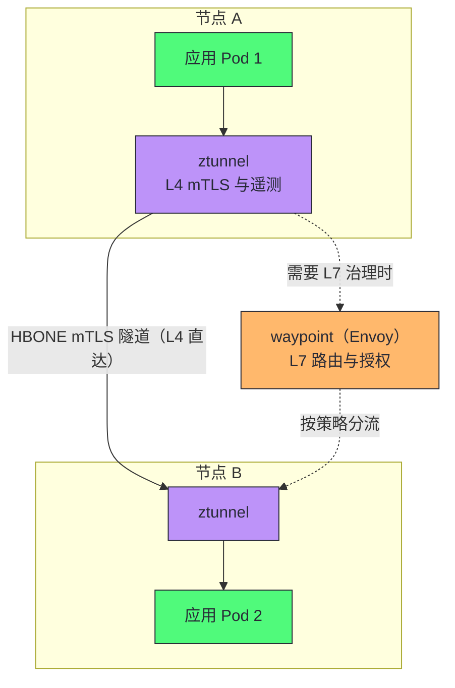
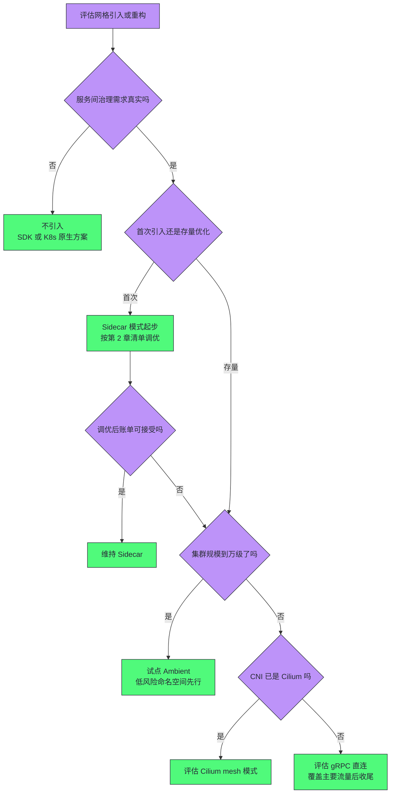

# 服务网格的性能开销与Ambient Mesh

**摘要：**

终篇回答整个专栏悬置到最后的问题：这套每跳驻扎两个代理的架构，账单到底多大，以及业界正如何把账单降下来。文章先把 Sidecar 模式的成本拆成四笔——延迟（两次代理与两次 netfilter 穿越）、资源（随 Pod 数线性放大的内存与 CPU）、连接（per-worker 连接池在网格尺度的放大效应）、运维（升级即全集群滚动重建）——每一笔都给出构成分析与量级估算方法；然后讲清"优化第一性原理"：代理两次穿越是模型约束而非实现缺陷，能省的是路径上的冗余；接着进入正题 Ambient Mesh——2022 年 9 月宣布、2024 年 11 月在 1.24 版转正的架构重排，ztunnel（节点级 Rust 隧道，承担 L4 mTLS）与 waypoint（按需挂载的 Envoy，承担 L7 治理）如何把"每 Pod 代理"改写为"分层按需"，HBONE 协议与安全模型的差异也随之展开；最后横向对比 gRPC 直连、Cilium eBPF、轻量代理等路线，给出决策框架。读完全文你应当能回答两个问题：你的场景下 Sidecar 的账单究竟值不值，以及 Sidecar、Ambient、eBPF、直连四条路线该按什么维度做选择。

---

## 第 1 章 Sidecar 的账单：四笔成本逐项清点

### 1.1 延迟账：多出来的那一程

第 01 篇立此存照的"性能账"现在正式结算。先立一个诚实的态度：网格的开销没有"一个数字"，只有"一组随规模、流量画像与配置变化的曲线"——本章的任务是把每条曲线的形状与自变量讲清楚，让读者能代入自己的参数算账。

一次服务间调用在 Sidecar 模式下的完整路径：应用出站——netfilter 劫持——回环——源端边车代理处理——真实网络——对端 PREROUTING 劫持——回环——目的端边车处理——目的应用，响应原路返回。与直连相比，多出来的是：两次 netfilter 规则穿越、四次回环接口、两次完整的 TCP 会话、两次用户态代理处理。把延迟构成排进一张表：

| 构成 | 量级 | 说明 |
| :--- | :--- | :--- |
| netfilter 匹配 | 微秒级 | 内核态完成，通常可忽略 |
| 回环往返 | 微秒到十微秒级 | 四次穿越，轻负载下不显 |
| 代理转发处理 | 亚毫秒级 | 过滤链、路由、打点 |
| TLS 对称加解密 | 亚毫秒级 | mTLS 开启后每跳两次 |
| 队列与调度 | 毫秒级（高载） | 连接池排队，高并发时的最大头 |
| 重试叠加 | 毫秒级（故障时） | 失败路径的放大 |

打个比方：直连是"门到门的直达车"，Sidecar 模式是"每段路都多转两趟摆渡车"——摆渡车本身不慢，但上下车（回环与劫持）、安检（TLS）、调度排队（连接池）都是时间；而且高峰期（高并发）摆渡车的排队远比平时长。静态地看，P50 的增量通常被业务延迟淹没；真正要紧的是两处放大器。先把直连与 Sidecar 的路径差异排成表：

| 路径环节 | 直连 | Sidecar 模式 |
| :--- | :--- | :--- |
| netfilter 穿越 | 0 次 | 出入各 1 次，共 2 次 |
| 回环接口 | 0 次 | 4 次 |
| TCP 会话 | 1 次 | 2 次（应用到代理、代理到对端） |
| 代理处理 | 0 次 | 2 次 |
| TLS 终止 | 1 次（如启用） | 2 次（两端边车各一） |**其一，尾延迟**：P99 的排队与抖动在两次代理上叠乘，官方基准里 Sidecar 模式对 P90/P99 的增量普遍高于 P50——对延迟分位数敏感的服务（交易、实时链路），增量以个位数毫秒计且随并发上行。**其二，深链路叠加**：单跳毫秒级增量乘以调用链跳数，十跳链路的累积增量就是两位数毫秒——链路越长，账单的复利越重。延迟账还有一个常被忽略的分布特征：增量不是均匀落在每个请求上，而是集中在高并发的时段与热点路径——**容量规划时按"高峰期的增量"算，而不是按均值**，这是延迟账最常见的错误算法。

### 1.2 资源账：随 Pod 数线性放大的底盘

每个 Pod 一个代理进程，资源的账要按"单 Pod 构成 × Pod 总数"算。单个 istio-proxy 的内存构成（第 01、03 篇拆过），四块各自的驱动因子：

| 构成 | 驱动因子 | 量级特征 |
| :--- | :--- | :--- |
| xDS 配置快照 | 可见服务数（作用域） | 大网格里的第一大项 |
| 连接池与缓冲区 | 并发流量画像 | 随高峰波动，突发流量的尖峰来源 |
| TLS 会话与证书 | mTLS 连接数 | 相对稳定 |
| 统计存储 | 标签基数 | 随观测精细度增长（第 06 篇的联动） |

四块合计，典型负载下每 Pod 几十到一二百 MiB、CPU 零点几核。放算到集群尺度：千级 Pod 是几百 GiB 内存与几百核 CPU 的"底盘开销"，万级 Pod 则以 TB 计。这笔开销的性质是**常量底盘**——业务空闲时它照付，业务高峰前还可能因连接池膨胀而上涨。按集群规模的粗算表（取单 Pod 平均 150 MiB、0.3 核的中位配置）：

| 集群规模 | 额外内存底盘 | 额外 CPU 底盘 |
| :--- | :--- | :--- |
| 百级 Pod | 15-20 GiB | 30 核左右 |
| 千级 Pod | 150-200 GiB | 300 核左右 |
| 万级 Pod | 1.5-2 TB | 3000 核左右 |

数字是量级示意而非精确值（随配置与流量浮动），但结论稳固：**资源账在千级 Pod 之后开始"肉眼可见"，在万级成为架构议题**——这也是 Ambient 的资源叙事为什么以大集群为主战场。

CPU 的账还有一层隐性条目：代理 worker 数与 CPU 配额的绑定（第 03 篇的错配）意味着大流量 Pod 必须给 sidecar 配更高配额，而调度器把这部分算进 Pod 的资源请求——**Sidecar 的资源开销不只占内存，还占调度容量**，节点装箱密度因此下降。调度层面的三个连锁效应：

- **装箱密度下降**：每 Pod 的资源请求 = 业务 + 代理，节点能装的 Pod 数减少，同样的业务量需要更多节点；
- **碎片化加剧**：大流量 Pod 的代理配额高，调度时的"大块资源需求"更难安插，节点残留碎片；
- **峰谷剪刀差**：业务低谷时代理照常占额，集群的"实际可用弹性"被底盘吃掉一截。

### 1.3 连接账：网格尺度的乘法

[[03 Envoy代理——线程模型、Filter链与连接管理|第 03 篇]]讲过 per-worker 连接池的放大，把它推到网格尺度再看一次。单 Pod 内：worker 数 × 上游服务数 × 每服务连接数；全网格：再乘上服务对数。理论上的连接关系是 O(N²)——N 个服务两两互调时，连接数以平方增长；实际系统中调用图虽稀疏，但大集群里"几十万条 TCP 连接"并不罕见。连接账的三个支付场景：

- **稳态内存**：每条连接的 socket 与缓冲区，百万连接以 GB 计；
- **变更风暴**：端点变更引发的连接池重建，突发 CPU 与握手开销；
- **端口耗尽**：客户端视角的临时端口是有限资源（约 6.4 万），对同一上游 IP:PORT 的连接数有理论上限——大集群里真实的约束。把乘法算成数字：40 个 worker 的节点上，一个边车对 50 个上游各保持 4 条连接，是 8000 条连接的池子容量——这还只是一个 Pod。全网格 2000 个 Pod、平均每 Pod 挂 15 个调用关系，仅"稳态连接"就是百万量级。连接的代价不只在内存（每条连接的缓冲区与 socket），更在**端点变更风暴**：一次滚动更新引发的 EDS 推送，让全网格相关的边车重建对应该服务的连接池——连接数越大，风暴越猛（[[02 Istio架构——控制面与数据面的职责分离|第 02 篇]]的推送账在这里接上了物理实体）。

> [!info] 核心概念：Sidecar 成本的三条增长曲线
> 四笔账按增长曲线分三类：**延迟随链路跳数线性增长**（与集群规模无关，与拓扑深度有关）；**资源随 Pod 数线性增长**（底盘开销，规模越大摊销越难）；**连接随服务对数平方级增长**（规模惩罚最重，大集群的真正瓶颈）。三条曲线里，延迟是小集群的最大项，连接是大集群的最大项——"Sidecar 开销大"这句话在不同规模的集群里指的不是同一笔账。

### 1.4 运维账：升级即重建的惯性

第 02 篇讲过：Sidecar 升级等于 Pod 重建。把这笔账的规模算出来：万级 Pod 的集群，Sidecar 镜像升级（通常是 CVE 修复，以月计发生）意味着万级 Pod 的滚动重建——错峰、分批、盯推送延迟，一次全网格行动以周计。它还带来一个更隐蔽的组织成本：**代理版本碎片化**——滚动未完成的窗口期里，网格内同时运行多个版本的 Envoy，行为差异（默认值变化、统计口径变化）成为"诡异现象"的来源。极端的例子是安全紧急响应：高危 CVE 披露后，修复的唯一手段是把全部 Sidecar 换成新版镜像——以周计的滚动窗口就是以周计的暴露期，平台团队在这段时间里的唯一 KPI 是"重建进度条"。运维账的脉冲特征排成表：

| 场景 | 频率 | 单次成本 |
| :--- | :--- | :--- |
| 例行版本升级 | 季度级 | 全网格分批滚动，天到周 |
| CVE 紧急修复 | 突发，不可预约 | 同上，且带暴露期压力 |
| 配置模板变更 | 按需 | 新 Pod 生效，存量随重建 |
| 故障边车恢复 | 随机 | Pod 级重建，秒到分钟 |运维账没有性能数字，但它是很多团队"想引入网格又不敢"的第一理由。

### 1.5 隐形账单：观测与安全的追加成本

四笔账之外还有两笔"开了功能才出现"的追加账。**观测追加**：[[06 可观测性——分布式追踪、指标与访问日志|第 06 篇]]的基数治理管的是监控系统的容量，边车自身为打点付出的 CPU（尤其高标签基数场景）是数据面的追加开销——观测越精细，代理越忙。**安全追加**：mTLS 的对称加密随流量线性计费，握手开销随连接 churn 波动——第 05 篇讲过连接复用可以把长尾压平，但短连接密集的流量画像下，安全账在延迟与 CPU 两张表上都会显形。两笔追加账的共同点：**它们随"网格能力的使用深度"增长，而不是随网格的存在而存在**——关掉遥测与 mTLS 可以省，但没有团队会这么干，所以规划时要把它们当成必付项。给两笔账各留一句提醒：观测账的量级可以通过第 06 篇的治理手段压（采样、砍标签），但压的极限是"必要可见性"；安全账的量级通过连接复用与会话票据压，但压的极限是"密钥强度与合规底线"——两笔账的下限都不低，因为它们对应的能力都不该被砍到零。

---

## 第 2 章 优化的第一性原理：哪些能省，哪些不能

### 2.1 两次代理是模型约束

优化的前提是想清楚哪些成本属于本质、哪些属于冗余。**两次代理属于模型约束**：源端边车管"治理这个调用"，目的端边车管"保护这个服务"——两端的治理职责不同（出站路由与入站授权加密），砍掉任何一端都要重新回答对应职责由谁承担。这不是实现偷懒，而是"治理逻辑驻扎每一跳"这一架构选择的物理后果——第 01 篇钟摆叙事的这一次摆动，代价就在这里。

**路径上的冗余则可以省**：netfilter 的多次规则匹配可以合并（Istio CNI 的一步）；回环的多次协议栈穿越可以用更短的内核路径（eBPF 的 sockmap 让 TCP 流量在内核里直接转接，跳过部分协议栈）；TLS 握手可以会话复用；打点的开销可以按需裁剪（第 06 篇的基数治理）。把这些手段用足，Sidecar 的账单可以显著收窄——但**模型约束那部分（两次代理、一次回环）原地不动**。区分"模型约束"与"路径冗余"的方法论值得单独记录：问一句"这个成本在理论最优的实现里还存在吗"——两次代理存在（治理职责决定的），多出的 netfilter 匹配不存在（实现路径的），TLS 加密存在（安全需求的），重复的协议栈穿越不存在（路径的）。**属于前者的，优化无解只能换模型；属于后者的，持续压榨**。这条方法论也解释了为什么 Sidecar 时代年年在优化、Ambient 还是会出现——路径冗余压榨有极限，模型约束的松动要等架构时机。两类成本的对照：

| 成本类别 | 判定问题 | 处置方式 |
| :--- | :--- | :--- |
| 模型约束 | 理论最优实现里还存在吗——存在 | 只能换架构模型 |
| 路径冗余 | 理论最优实现里还存在吗——不存在 | 持续压榨（调优清单） |
| 功能对价 | 这是为了哪个能力付的钱 | 按需开关（Telemetry、mTLS 范围） |

### 2.2 Sidecar 时代的调优清单

在不动架构的前提下，Sidecar 的调优科目清单如下：

| 科目 | 手段 | 收益 |
| :--- | :--- | :--- |
| worker 与配额对齐 | 并发性设置跟随 CPU limit | 避免上下文切换放大（第 03 篇） |
| 连接池预热 | 保活、预连接、调大空闲超时 | 消灭冷启动毛刺 |
| 作用域裁剪 | Sidecar CRD 收窄可见性 | 配置快照内存降一个量级 |
| 统计瘦身 | proxyStatsMatcher、砍标签 | 统计内存与抓取开销下降 |
| 排水与优雅退出 | terminationDrainDuration 调大 | 滚动更新少踩连接强拆 |
| 按需 L7 | 对纯 TCP 流量不启用七层解析 | 跳过无谓的协议处理 |
| 证书与会话复用 | TLS 1.3 会话票据、连接保活 | 压平加密的长尾成本 |
| 版本收敛 | 加速滚动、统一代理版本 | 减少碎片化与行为差异 |
| 延迟敏感路径分流 | 高频短调用降观测粒度 | 打点开销可控 |

这张清单的现实意义是给"要不要上 Ambient"一个对照组：**先调优再动架构**——很多团队的"Sidecar 太重"结论，是在默认配置下得出的。调优后仍不达标（尤其是资源底盘与升级惯性两笔），才是架构重排的真需求。

### 2.3 一次调优的量化演练

给"调优值多少账"一个直观的例子。千级 Pod 集群、平均每 Pod 200 MiB sidecar 内存（全网格 200 GiB 底盘）——按第 2.2 节清单逐项治理：先做作用域裁剪——每 Pod 可见服务从 800 收窄到 80，配置快照内存从 100 MiB 降到 15 MiB，单 Pod 总量降到 120 MiB；再做统计瘦身——标签基数减半，统计内存省 10 MiB；连接池按流量画像重设，再省 20 MiB。三项合计单 Pod 降到 90 MiB 上下——**不换架构，账单砍到 45%**。把演练沉淀成可复用的调优步骤表：

| 步骤 | 动作 | 预期收益 | 验证方式 |
| :--- | :--- | :--- | :--- |
| 一：基线 | 采集当前单 Pod 内存、CPU、延迟分布 | 拿到调优前的账单 | 容量画像脚本 |
| 二：作用域 | Sidecar CRD 收窄可见服务范围 | 配置快照内存大降 | config_dump 体积对比 |
| 三：统计 | proxyStatsMatcher 与标签裁剪 | 统计内存与抓取开销下降 | /stats 数量对比 |
| 四：连接 | 连接池按流量画像重设 | 缓冲区内存下降 | 连接数与内存曲线 |
| 五：复测 | 重复步骤一的采集 | 账单对比 | 前后报告 |

调优与架构重排的关系由此清晰：前者是后者的对照组与必经前奏，没有量化基线的架构切换是盲目的。

### 2.4 哪些场景应该留在 Sidecar

优化清单讲完，还应该给"留在 Sidecar"一个体面的位置——它不是待迁移的旧世界，而是若干场景下的正确答案：

- **信任边界敏感**：多租户强隔离、合规要求"身份材料不跨工作负载边界"的场景，Sidecar 的细粒度信任是硬需求；
- **深度定制数据面**：依赖自定义 wasm 过滤器、特制监听器配置的网格，Ambient 的 ztunnel 不承接这些扩展；
- **中小规模、调优已足**：千级以下 Pod、账单在可接受区间，切换的结构性收益覆盖不了迁移成本；
- **求稳的存量生产**：排障手册、团队经验、自动化脚本全部长在 Sidecar 心智上，切换的组织成本被低估是常见错误。

"留在 Sidecar"的理由与"迁去 Ambient"的理由共享同一张账单——算清了账，两个方向都成立。

---

## 第 3 章 Ambient Mesh：把"每 Pod 代理"重排为"分层按需"

### 3.1 动机与里程碑

2022 年 9 月，Istio 团队宣布 Ambient Mesh——对数据面部署形态的整体重排。动机直指第 1 章的账单：把"必须住进每个 Pod 的代理"换成"节点共享的基础设施 + 按需启用的七层能力"。里程碑的节奏值得记住——两年多的孵化期说明这是一次谨慎的重构而非概念炒作，也意味着新架构的生产验证仍在积累期：

| 时间 | 里程碑 | 意义 |
| :--- | :--- | :--- |
| 2022-09 | 官方宣布 Ambient 方向 | 架构重排立项，公开征求意见 |
| 2023-08 | 1.18 版 alpha | 初版实现可测，能力尚不完整 |
| 2024-11 | 1.24 版 GA | 生产可用，官方支持背书 |

Ambient 的核心思想是把网格能力拆成两层，**按需取用而非默认全量**：

- **L4 层（基线）**：加密、身份、L4 遥测——零信任的地板，所有网格流量都要，由 ztunnel 承担；
- **L7 层（选项）**：路由、灰度、七层授权、请求级观测——治理能力，只有需要的服务才开，由 waypoint 承担。Sidecar 模式的问题恰是把两层捆成一个"每 Pod 全量"的包裹——Ambient 把包裹拆开，各按各的形态供给。用一个需求场景对照：一个纯 TCP 的中间件服务（如消息队列），Sidecar 模式下它也得背一个功能全量的 Envoy（L7 能力闲置）、升级也得重建 Pod；Ambient 下它只需要 ztunnel 的 L4 能力（加密、身份、L4 遥测），零 waypoint、零 Envoy——**能力的供给粒度从"全有"变成了"按需"**。反过来，一个灰度与七层授权需求旺盛的核心服务，挂上 waypoint 后得到的 L7 能力与 Sidecar 等价。分层的本质是承认：**网格用户的需求分布是长尾的，全量供给对短头是浪费**。

### 3.2 ztunnel：节点级的零信任隧道

第一层是 **ztunnel**——每个节点一个的 Rust 守护进程（DaemonSet），承担 L4 的 mTLS 加密、身份与遥测。它有两个设计支点值得细看。

**其一，HBONE 协议**。节点间的网格流量封装在 HBONE（HTTP-Based Overlay Network Environment）隧道里——本质是 HTTP/2 CONNECT 建立的隧道，跑在 15008 端口、天然带 mTLS。选 HTTP/2 做隧道底座而不是自定义协议，换来的是协议栈成熟度、多路复用能力与调试友好（标准的 HTTP 工具就能看隧道流量）。HBONE 的几个特性点：

- **端口**：15008，隧道专属；
- **封装**：HTTP/2 CONNECT 建立隧道，网格流量在隧道内双向传输；
- **复用**：HTTP/2 的多路复用让多条业务连接共享隧道连接，减少真实 TCP 会话数——第 1.3 节的连接账在这里被结构性压缩；
- **兼容**：明文出站（不进网格的流量）不走 HBONE，协议只属于网格内部。

**其二，身份的代理持有模型**。[[05 安全——mTLS、认证与授权策略|第 05 篇]]讲过 Sidecar 模式里每个工作负载持有自己的 SPIFFE 证书；Ambient 里 ztunnel 以节点身份向 istiod 获取**其上所有工作负载的证书**，替 Pod 完成 mTLS 握手——Pod 应用与 ztunnel 之间保持明文（节点内），ztunnel 与对端 ztunnel 之间是 mTLS。这个模型的信任边界从"每个 Pod"上移到"每个节点"：ztunnel 的 compromise 影响该节点的全部工作负载身份——**用信任边界的扩大换资源与运维的集约**，这是 Ambient 最核心也最有争议的取舍，后文再评。

安全语义上有个容易被误解的点要澄清：**ztunnel 是 per-node 的共享设施，但它持有的证书按工作负载区分**——mTLS 握手仍以具体工作负载的身份进行，授权策略（L4 级）仍按工作负载身份求值。共享的是"执行者"，不是"身份"。ztunnel 的职责清单：

| 职责 | 机制 | 对应 Sidecar 的哪个部分 |
| :--- | :--- | :--- |
| L4 加密 | HBONE 隧道（HTTP/2 CONNECT + mTLS） | 边车的传输层 |
| 工作负载身份 | 代为持有与使用 SPIFFE 证书 | 边车 agent 的 CSR/SDS |
| L4 授权 | 按身份的策略求值 | 边车的 L4 AuthorizationPolicy |
| L4 遥测 | TCP 指标与连接日志 | 边车的统计 |

值得注意 ztunnel "没有"什么：没有 Envoy 的过滤链、没有七层路由、没有 HTTP 级的熔断与重试——它是刻意做薄的产品（Rust 实现、内存以 MB 计），薄到没有能力犯错的地方。需要 L7 的复杂治理时，流量交给 waypoint——**薄层常驻、厚层按需**，这是整个架构的资源哲学。ztunnel 与边车的定位对照：

| 维度 | 边车（Envoy） | ztunnel |
| :--- | :--- | :--- |
| 形态 | 每 Pod 一个 | 每节点一个 |
| 实现语言 | C++ | Rust |
| 能力范围 | L4 到 L7 全量 | 刻意做薄的 L4 |
| 内存量级 | 几十到几百 MiB | 以 MB 计 |
| 故障域 | 所在 Pod | 所在节点 |这个哲学还有一个隐含承诺：两层之间的协议（HBONE 与 xDS 的组合）是稳定的契约——waypoint 的实现可以演进（换更快的 Envoy 版本、未来的其他 L7 引擎），ztunnel 的实现可以演进（Rust 的优化、未来的内核集成），两层互不牵制——这正是第 02 篇"控制面与数据面解耦"的再一次复用，只是这次解耦发生在数据面内部。

> [!warning] 生产避坑：节点级信任不是"倒退"，但要混部纪律配套
> 对"信任边界上移"最常见的两个极端态度都要校准。一种把它当成不可接受的安全倒退——事实上节点本身已是重要信任边界（kubelet、CNI、运行时都在节点上），ztunnel 只是再添一层节点级组件，前提是节点的自身安全（镜像、运行时、内核）本就要管好。另一种完全无视它——多租户混部场景里，"租户 A 的高敏服务与租户 B 的服务同节点"意味着两方的身份材料在同一 ztunnel 进程里流转，敏感等级差异大的租户应通过节点池隔离（污点与亲和）避免同节点混部。**接受节点级信任的前提，是把节点级隔离的纪律补上**。

### 3.3 waypoint：按需挂载的 L7 层

第二层是 **waypoint**——基于 Envoy 的独立部署代理，按命名空间或服务账号粒度挂载，承担 L7 治理：VirtualService 路由、灰度分流、七层授权、请求级遥测。它只在需要 L7 能力的地方部署——纯 L4 需求的命名空间一个 waypoint 都不用开，流量在 ztunnel 层就完成加密与身份校验。需要 L7 时，流量路径为"源 ztunnel → waypoint → 目的 ztunnel"。waypoint 的挂载粒度有两种：**按命名空间**（该命名空间所有需要 L7 的流量共用一个 waypoint）与**按服务账号**（更细的资源与故障隔离）——粒度选择是资源效率与爆炸半径的权衡，与第 02 篇的作用域裁剪、第 05 篇的作用域分层是同一门手艺。waypoint 的部署形态是普通 Deployment——可以用 K8s 的全部机制（HPA、PDB、反亲和）管理它的容量与可用性，这是"每 Pod 边车"做不到的：**七层治理能力第一次拥有了独立的弹性伸缩**，容量从"预埋在每 Pod"变成"按需水平扩"——这是本专栏反复出现的"供给按需化"在算力维度上的又一次落地。

waypoint 的引入方式同样声明式：一个 Gateway 类的对象（waypointProxy）标注它服务的范围，istiod 据此为相关 ztunnel 配置"哪些流量要绕经 waypoint"。**流量绕行是配置出来的，不是拓扑决定的**——不需要 L7 的流量路径里根本没有 waypoint 的名字。waypoint 的生命周期管理要点：

| 环节 | 内容 | 与 Sidecar 的对照 |
| :--- | :--- | :--- |
| 部署 | 声明 waypoint 对象，Deployment 形态 | 无对应（边车随 Pod 出现） |
| 扩缩容 | HPA 按流量水平伸缩 | 只能调每 Pod 资源上限 |
| 升级 | 滚动 waypoint，业务 Pod 不动 | 滚动全部 Pod |
| 故障恢复 | PDB 保护、多副本 | 边车故障即 Pod 故障 |

Ambient 之下的流量路径全景：

实线是纯 L4 的路径——两次代理缩为"两次 ztunnel"，而 ztunnel 是节点共享的轻量进程；虚线是需要 L7 时才挂载的 waypoint 段。与 Sidecar 对比，账单的变化是结构性的：

| 维度 | Sidecar | Ambient |
| :--- | :--- | :--- |
| 代理形态 | 每 Pod 一个 Envoy | 每节点一个 ztunnel + 按需 waypoint |
| L4 能力（mTLS/遥测） | 边车内联 | ztunnel 承担 |
| L7 能力（路由/灰度） | 边车内联 | waypoint 按需挂载 |
| 升级 | 等于 Pod 重建 | ztunnel/waypoint 独立升级，Pod 不动 |
| 接入/退出 | 注入/卸载，要重建 | 标注即加入，Pod spec 不改 |
| 资源模型 | 随 Pod 数线性 | 随节点数线性（L4）+ 按需（L7） |
| 信任边界 | 每 Pod | 每节点（ztunnel 持有工作负载证书） |
| 成熟度 | 十年生产淬炼 | 2024 年 GA，验证积累中 |

表里最实惠的两行是**升级**与**接入**：ztunnel 升级是节点上的守护进程滚动，业务 Pod 纹丝不动；网格接入从"改 Pod spec 的注入"变为"标注即入网"——第 02 篇留下的"升级惯性"与第 01 篇的"资源底盘"两笔账，在 Ambient 里都有结构性缓解。

### 3.4 换来了什么，又让渡了什么

对 Ambient 的评估必须两面同报。换来的：资源底盘从 O(Pod) 降到 O(节点)，L4 层的集约对大集群是数量级的改善；升级与接入的惯性消失；L4/L7 分层让"只要零信任不要七层治理"的场景有了廉价路径；Pod spec 不被修改，应用与网格的耦合进一步松绑。让渡的同样清晰，逐项列出：

- **信任边界从 Pod 上移到节点**——多租户混部的集群里，节点级信任比 Pod 级信任的隔离假设更粗，ztunnel 的漏洞影响面是全节点工作负载；
- **L7 路径多一跳**——需要 L7 的流量走 ztunnel→waypoint→ztunnel，路径比 Sidecar 的"边车对边车"更长，延迟与故障点相应增加；
- **成熟度**——GA 一年有余，生产淬炼的时间跨度与 Sidecar 模式不在一个量级，社区排障经验的储备密度也不同；
- **排障心智重建**——三段路径的日志与指标分布在新位置，团队的手册与直觉都要重写。

> [!note] 设计哲学：分层按需是老原则的新胜利
> Ambient 的分层思路在第 02 篇 Mixer 的教训里埋过伏笔：与数据包同频的逻辑必须与数据包同居，低频的逻辑才可以外置。Ambient 的 L4 层承担的是每连接都要的加密与遥测（高频、简单、性能敏感——所以用 Rust 写成节点级轻进程），L7 层承担的是按策略求值的路由与授权（低频配置变更、逻辑复杂——所以复用功能最全的 Envoy 按需挂载）。**能力分层 + 按需取用**，这是把"零信任是基线、七层治理是选项"这个需求事实翻译成架构——第 01 篇的三代演进叙事（先做能力、再做形态、最后做成本），Ambient 正是第三代的代表作。

### 3.5 Ambient 下的观测与安全：前面的篇章还成立吗

读者此刻最合理的问题是：第 05、06 篇讲的机制，在 Ambient 里还成立吗？逐项对表：**身份体系完全成立**——SPIFFE 证书、istiod CA、短有效期轮换原样运转，只是证书的使用者从边车换成 ztunnel；**mTLS 迁移方法论成立**——PERMISSIVE 到 STRICT 的路径不变，只是"执行 STRICT 的实体"变成 ztunnel；**L7 授权成立**——AuthorizationPolicy 挂在 waypoint 上求值，语义不变，但要求该命名空间已挂载 waypoint（纯 L4 时只有身份级授权）；**观测基本成立**——标准指标从 ztunnel 与 waypoint 产出，L4 遥测齐全，L7 遥测随 waypoint 挂载，Telemetry API 的治理照常。

结论：**第 05、06 篇讲的是"能力"，本篇讲的是"能力的摆放位置"——位置重排，能力语义大体延续**。真正需要重新学习的是排障：三段路径（ztunnel、waypoint、ztunnel）的日志与标志位分布在新位置，排查手册要重写——这是迁移成本里最容易被低估的部分。

### 3.6 迁移到 Ambient 的路径

Ambient 与 Sidecar 可以在同一网格内**按命名空间共存**（标注决定命名空间走哪种模式），这给了迁移一条平滑路径，与第 05 篇的 mTLS 迁移方法论同构：

1. **观测期**：新版本控制面就位，挑一个低风险命名空间标注切到 Ambient，对照观测两模式的指标与行为；
2. **验证期**：核对 L4 遥测齐全、mTLS 握手正常、AuthorizationPolicy 的 L4 规则生效、应用零改动无感；
3. **推广期**：逐命名空间切换，需要 L7 治理的命名空间同步挂载 waypoint 并验证路由与灰度（[[04 流量管理——VirtualService、DestinationRule与灰度发布|第 04 篇]]的规则在 Ambient 下应逐条回归）；
4. **收口期**：Sidecar 命名空间清零或保留显式清单，迁移文档与排障手册按新路径重写。

迁移的退出信号与 mTLS 迁移同款："每个命名空间的模式归属有清单、每类能力有验证记录"。各阶段的核对要点：

| 阶段 | 核对项 | 退出信号 |
| :--- | :--- | :--- |
| 观测期 | 两模式指标对照、应用无感 | 对照报告评审通过 |
| 验证期 | mTLS、L4 遥测、L4 授权 | 能力清单逐项打钩 |
| 推广期 | L7 规则回归、waypoint 容量 | 各命名空间稳定一周以上 |
| 收口期 | 模式归属清单、手册重写 | 清单归零或显式豁免 |

值得强调的顺序细节：**先 L4 后 L7**——切 Ambient 时先只依赖 ztunnel 的能力，确认稳定后再挂 waypoint，两步分开走，每步的爆炸半径都可控。

> [!warning] 生产避坑：迁移不是"关掉注入换个标注"
> Ambient 的接入虽然轻（标注即入网），迁移的验证一点不能轻：L4 遥测的标签口径与 Sidecar 有差异（部分统计从边车移到 ztunnel，聚合口径变化）、依赖边车特有行为的旁路工具（高级 config dump 脚本、定制过滤器）在 Ambient 下失效、waypoint 的容量规划是新增科目。把 Ambient 迁移当成"部署形态的变更"来管理（有回滚预案、有对照观测），而不是当成"换个标注"。

### 3.7 Ambient 的适用画像

把本章收拢成适用性判断。**契合的画像**：千级以上 Pod、L4 零信任为主诉求、滚动升级频繁而痛苦、资源底盘压力真实、愿意用"新架构的适应成本"换"结构性的账单下降"——Ambient 为这类场景而生。**尚需观望的画像**：深度依赖边车定制扩展（wasm 过滤器、自定义监听器）的网格、多租户强隔离要求（信任边界敏感）、对排障工具链成熟度要求苛刻的环境——这些场景的切换收益低、风险高，保持 Sidecar 或等待成熟是更冷静的选择。画像的本质是：**Ambient 的每一项收益都对应一笔 Sidecar 的账，你的账单里哪笔大，哪笔就是切换的理由；账单里没有的，切换就只是换一种新麻烦**。一个便于记忆的对照：资源底盘痛 → 切 Ambient 最有感觉；升级惯性痛 → 切 Ambient 立竿见影；信任边界敏感 → 留在 Sidecar 最安心；延迟预算极紧 → 三个方案都要实测再说话。

---

## 第 4 章 其他路线：网格数据面的四国演义

### 4.1 gRPC 直连：把代理装回应用库

2021 年底 Istio 开始支持 gRPC 的 xDS 直连模式：gRPC 库原生实现 xDS 客户端，直接从 istiod 拉取配置——负载均衡、部分路由与熔断在应用库内完成，完全跳过边车。这是钟摆的又一次回摆：治理逻辑从"旁路代理"摆回"应用库"，[[01 服务网格概述——从微服务治理痛点到Sidecar模式|第 01 篇]]批评过的 SDK 困境（语言绑定、版本螺旋）理论上都在回来，但这次是**标准 API（xDS）加控制面统一管理**的 SDK——升级治理逻辑变成升级控制面，库只负责执行。

它的适用边界同样由这条原理决定：只覆盖 gRPC/HTTP2 流量（库的能力范围）、语言栈必须是有 xDS 实现的（Go、Java、C++）、治理能力是 xDS 能表达的子集（复杂的七层扩展、故障注入等仍需代理）。它是 Sidecar 之外的合法选项，不是 Sidecar 的替代品。直连与 Sidecar 的能力对照：

| 能力 | gRPC 直连 | Sidecar |
| :--- | :--- | :--- |
| 负载均衡与部分路由 | 支持（xDS 范围内） | 完整 |
| mTLS | 库内 TLS 能力 | 完整（ztunnel/边车级） |
| 七层扩展（wasm、ext_authz） | 不支持 | 完整 |
| 故障注入等高级治理 | 有限 | 完整 |
| 语言覆盖 | 有 xDS 实现的栈 | 全语言 |
| 升级 | 升级控制面 + 库版本 | 升级代理（要重建） |

矩阵里的权衡很清晰：直连把"部署简单"做到了极致，代价是能力子集与语言约束——它适合"同构 gRPC 栈、治理需求标准"的内部服务群，不适合作为异构网格的唯一形态。适合直连的画像：

- 服务间调用以 gRPC/HTTP2 为主，且语言栈集中于有 xDS 实现的三两个；
- 治理需求以发现、均衡、部分路由为主，七层扩展需求极少；
- 团队对"库版本与控制面版本的对齐"有纪律（gRPC 库的升级节奏要跟上网格 API 的演进）。落地的两个细节：**其一，注解切换**——直连的开关是 Pod 级注解（声明该工作负载由 gRPC 库直接对接 istiod），不需要注入边车，与 Ambient 的标注语义在同层；**其二，可观测的补位**——没有边车就没有边车遥测，直连工作负载的调用指标靠 gRPC 库内置的 OTel 导出补齐，监控口径要与全网格对齐——**省掉代理的代价是观测与安全要自己接回来一部分**，这笔账在决策时必须入表。

### 4.2 Cilium 的 eBPF 路线：把代理挪进内核与节点

另一条激进的路线来自 Cilium：用 eBPF 重写网络路径，服务间流量在内核态完成高效转发与网络策略，需要 L7 时在节点层挂载 Envoy（per-node 或按需实例）。它对 Sidecar 的替代逻辑与 Ambient 有神似之处（节点级设施替代每 Pod 代理），但对 Ambient 也有差异化：eBPF 数据面的转发路径更短（内核态直转），而 Ambient 的 ztunnel 仍是用户态进程。[[05 Cilium深度解析——eBPF驱动的下一代网络与可观测性]] 对 eBPF 数据面的机制有系统展开，此处只讲网格视角的定位：**eBPF 路线把"数据面性能"与"治理能力"重新配平**——转发效率更高，L7 语义仍在节点级 Envoy，生态成熟度（尤其 L7 治理的完整度）与 Istio 系仍有差距。CNI 已用 Cilium 的集群，它的 mesh 模式是低成本尝试路径；用着 Calico 或 Flannel 的集群，为 mesh 换 CNI 的迁移成本要如实计入。eBPF 路线的优势与代价都在"内核态"三个字上：

- **优势**：转发路径最短（内核直转，少两次用户态往返）、资源集约（无每 Pod 代理）、网络策略与负载均衡的执行开销低；
- **代价**：L7 语义仍在节点级 Envoy（复杂治理没有消失，只是挪了位置）、内核版本与 BPF 能力的兼容矩阵、以及与传统工具链（tcpdump、conntrack）的排障差异——内核态的效率对应的是排障时的"黑盒感"。

### 4.3 轻量代理与生态沉淀

Linkerd 的路线是另一面镜子：不改变"每 Pod 边车"的形态，但把边车做到极致轻量——Rust 实现的 linkerd2-proxy 内存以十几 MiB 计、延迟增量以亚毫秒计，显著低于通用代理的全功能包袱；用功能的克制（只做核心场景、拒绝配置的过度灵活）换取运维的简单与行为的可预期。它的存在提醒市场：**"每 Pod 边车"与"重"没有必然关系，形态与重量是两个维度**——Ambient 改变的是形态，Linkerd 优化的是重量，两者回应的是同一笔账单的不同科目。2023 年 7 月的 OSM（Open Service Mesh）宣布退役，给行业留下的教训值得展开：OSM 的技术路线并不离谱（同样 Envoy 数据面、SMI 规范的践行者），退役的根因在生态位——入场晚、功能集与社区规模不及先发者、SMI 规范本身被 Istio 的 API 事实标准边缘化。它证明了一件事：网格领域的竞争壁垒不在"能不能实现"，而在**实现之上的生态复利**——文档、案例、社区经验、与周边工具的咬合，每一项都以年为单位积累。选型者从 OSM 的教训里该带走的是：评估网格时，"社区厚度与案例匹配度"的权重应不低于"功能对比表"。

把四条路线排进一张对比表：

| 路线 | 治理逻辑位置 | 优势 | 代价与边界 |
| :--- | :--- | :--- | :--- |
| Sidecar（Istio/Linkerd） | 每 Pod 代理 | 成熟完整，故障域小，信任边界细 | 资源底盘、升级惯性 |
| Ambient（Istio） | 节点 ztunnel + 按需 waypoint | 资源集约、升级独立、分层按需 | 信任边界变粗、成熟度积累中 |
| gRPC 直连 | 应用库内（xDS） | 零代理开销 | 仅 gRPC 栈、能力子集、SDK 因素回归 |
| eBPF（Cilium） | 内核态 + 节点 Envoy | 转发路径最短、性能最优 | L7 生态差距、CNI 绑定 |

> [!info] 核心概念：四条路线在同一个坐标系里
> 把四条路线放进一个坐标系：横轴是"治理逻辑离应用多近"（应用库内 → 每 Pod → 每节点 → 内核），纵轴是"治理能力多强"（子集 → 完整）。Sidecar 占据"近应用、强能力"象限，Ambient 与 eBPF 把逻辑移向节点与内核换性能，gRPC 直连移回应用库换部署简单——**没有一条路线同时占据两个维度的最优**。钟摆叙事的最终章不是谁取代谁，而是这个坐标系提供了多个可停靠的点，组织按需选位。

### 4.4 选路线的二阶效应：生态与人的锁定

路线选择的账单不止技术面。**生态锁定**：eBPF 路线与 CNI 绑定、直连与语言栈绑定、Ambient 与 Istio 版本绑定——每条路线都带来一层锁定关系，退出成本要在进入时算清。**技能锁定**：团队十年积累的 Envoy/Nginx 排障经验，在 ztunnel 与 eBPF 面前部分失效——新路线的培训与人才储备是隐性迁移成本。**招聘与社区**：主流路线的人才市场厚度远高于新兴路线。二阶效应不改变技术判断，但会改变"什么时候切换是划算的"——**技术的先进性以年计，组织的适配以季计**，两者对齐再动。二阶效应还有一条正向的：选对了与团队气质匹配的路线（求稳的团队配 Sidecar 的成熟，爱钻研的团队配 eBPF 的前沿），路线本身会成为团队成长的载体——选型不只选技术，也选团队未来两年在什么社区里学习。

---

## 第 5 章 决策框架：把选择变成一道多选题

### 5.1 五个决策维度

把前六篇的结论与本篇的账单合起来，路线选择的五个维度如下：

| 维度 | 关键问题 | 指向 |
| :--- | :--- | :--- |
| 规模 | Pod 数量级？连接数基数？ | 万级 Pod：Ambient/eBPF 的资源优势显性化 |
| 语言栈 | 服务是否以 gRPC/Go/Java 为主？ | 单一 gRPC 栈：直连可选项上线 |
| 安全合规 | 信任边界要求按 Pod 还是可接受按节点？ | 强多租户隔离：Sidecar 的细边界仍是硬需求 |
| 延迟预算 | 深链路对每跳增量敏感吗？ | 敏感：eBPF/直连优先，或调优后的轻量边车 |
| 团队与成熟度 | 生产事故谁来扛？ | 首次引入网格：Sidecar 模式的文档与案例储备最厚 |

五个维度不是并列的——**规模与安全是硬约束**（决定了哪些路线物理上可行），**延迟与语言是筛选器**（淘汰不适配的路线），**团队是权重项**（同样可行的路线里，选团队接得住的）。实战里的误判多半是把权重项当成了硬约束（"团队熟 Sidecar"被当成不可换的理由），或把硬约束当成了权重项（"多租户隔离"被让渡出去换资源账）——先把硬约束筛完，再谈权重。还要给五个维度配上"证据要求"：规模要给出真实的 Pod 数与连接基数（监控里拉，不拍脑袋）；语言栈要给出流量占比（gRPC 流量占七成以上，直连才进入候选）；安全要求要落到书面（合规条款或安全基线文档，而不是口头印象）；延迟要给出实测的链路增量基线；团队能力要落到人与预案的清单。没有证据的维度评估，只是偏见的格式化。顺带把两个反面清单也记下：不要在事故之后做路线切换的决定（应激状态下的架构决策几乎总是后悔的）；不要同时做两件大事（迁 Ambient 与升大版本、换 CNI 叠在一起，故障归因会变成噩梦）。

### 5.2 决策流程图

流程图的每个分支都对应第 5.1 节的一个维度，把分支逻辑翻译成自然语言：治理需求不真实，一切免谈；首次引入，从生态最厚的 Sidecar 起步（学习曲线与案例储备最友好）；存量优化，先调优后动架构；规模到了万级、调优到头，Ambient 的资源叙事才兑现；CNI 已经是 Cilium 的集群，eBPF 路线的边际成本最低；gRPC 占比高的集群，直连模式覆盖主要流量后，剩下的边车需求再单独评估。流程图里有两条暗线值得点破。**其一，"调优在前、架构在后"**：所有通往 Ambient/eBPF 的分支都以"调优后仍不达标"为前提——架构重排是最后的杠杆，不是第一反应。**其二，"试点先行"**：Ambient 的生产验证仍在积累期，低风险命名空间先行的试点节奏（第 05 篇 mTLS 迁移的同款方法论）是降低新架构风险的通用姿势。

### 5.3 混合部署的现实：路线不是站队

值得单独一节说清的是：四条路线在同一个控制面之下**可以按命名空间共存**——核心支付链路留在 Sidecar（细信任边界与最成熟的排障经验），长尾服务迁 Ambient（省资源与升级成本），纯 gRPC 内部服务用直连（零代理开销）。这不是权宜之计，而是"治理能力统一供给、执行形态按需选择"的合理终态——正如 K8s 里 Deployment 与 StatefulSet 长期共存。混合运行的三条纪律：

1. 每个命名空间的模式归属写进清单，随代码库版本化；
2. 两模式的遥测口径差异在面板层抹平（同一业务的指标无论哪种模式都出同一套标签）；
3. 跨模式调用的排障演练纳入季度计划——混合期的故障会同时出现两模式的特征。

组织层面的启示是：**网格选型的产出不必是"一个决定"，而可以是"一张按服务分级的部署矩阵"**——把每个服务对信任边界、延迟、治理深度的要求排清楚，路线自然各就其位。矩阵的示意（分级即路线，可随业务演化重排）：

| 服务分级 | 特征 | 建议路线 |
| :--- | :--- | :--- |
| 核心高敏 | 支付、认证，多租户隔离敏感 | Sidecar（细信任边界） |
| 核心通用 | 高流量核心链路，L7 治理重 | Sidecar 或 Ambient + waypoint |
| 长尾常规 | 治理需求标准、量小面广 | Ambient（L4 足够） |
| 同构内部 | 纯 gRPC、治理需求标准 | 直连模式 |

### 5.4 常见误区

| 误区 | 真相 |
| :--- | :--- |
| "Ambient 性能全面优于 Sidecar" | L7 路径反而多一跳，优势集中在 L4 与资源模型 |
| "ztunnel 挂了只影响一个节点，无所谓" | 节点级故障域意味着单节点影响面更大，可用性设计要跟上 |
| "新架构出来就该立刻换" | 成熟度差异是真实成本，生产验证的缺失无法用性能数字补偿 |
| "直连模式省了边车就是省钱" | 语言栈约束与能力子集的真实成本常被低估 |
| "账单大就该换架构" | 先调优——第 2 章的清单能砍掉一半账单 |
| "迁移到 Ambient 是一步到位的升级" | 分命名空间、先 L4 后 L7，节奏与 mTLS 迁移同款 |
| "选了路线就锁死" | 四条路线在控制面之下可按命名空间共存，混合是常态 |

### 5.5 决策的三问自检

做最终决定前，用三个问题自检——它们分别对应本专栏的三条主线：

1. **治理需求真实吗**（第 01 篇的主线）：服务间链路的治理痛点是已经发生的，还是听说会发生的？
2. **账单算清了吗**（第 02-04 篇与本篇的主线）：目标路线的资源、延迟、运维三笔账是否用自己集群的参数算过？
3. **信任与观测跟上了吗**（第 05-06 篇的主线）：新路线下，mTLS 的边界变化与遥测口径的变化是否已纳入设计？

三问都答"是"，决定才算有据；任何一问答"否"，决定都还欠一次尽调。

---

## 第 6 章 小结：钟摆与坐标——专栏的收官

把终篇的结论与全专栏合拢之前，先把性能这个主题的三个认知陷阱摆在明处：

- **陷阱一：用单一数字比较架构**——"Ambient 比 Sidecar 快 30%"这类表述只在特定 workload（通常是纯 L4、小报文、高并发）下成立，脱离流量画像的性能对比都是营销；
- **陷阱二：只算性能不算概率**——成熟度差异意味着生产事故的概率分布不同，期望损失 = 概率 × 影响，只看影响不看概率是半张账单；
- **陷阱三：把开销当成本、把收益当免费**——网格的每一项能力都有对价，正确的问题是"这笔对价换回的东西对我值不值"，而不是"哪个更便宜"。Sidecar 模式的账单有四笔：延迟随跳数线性、资源随 Pod 数线性、连接随服务对数平方、运维随升级节奏脉冲——调优能砍掉其中冗余（第 2 章清单），但两次代理的模型约束不动。Ambient Mesh 用"分层按需"重排了这笔账：ztunnel 以节点集约承担 L4 零信任基线，waypoint 按需挂载承担 L7 治理，升级与接入的惯性消失，代价是信任边界上移与成熟度待淬炼。gRPC 直连与 eBPF 是坐标系上的另外两个停靠点——四条路线没有全维度最优，只有与规模、语言、合规、团队匹配的选位。

回顾整个专栏的六篇铺垫，这条叙事线值得在收官时完整走一遍：

| 篇章 | 回答的问题 | 核心遗产 |
| :--- | :--- | :--- |
| 01 概述 | 治理逻辑放在哪里 | 治理外移与钟摆叙事 |
| 02 Istio 架构 | 决策在哪生成 | 声明式调谐与 xDS 契约 |
| 03 Envoy | 治理在哪执行 | 过滤链管线与 per-worker 模型 |
| 04 流量管理 | 意图如何声明 | 条件-动作表与发布工程 |
| 05 安全 | 逐跳如何设防 | SPIFFE 身份与三层信任 |
| 06 可观测 | 一切如何被看见 | 三支柱与两双眼睛 |
| 07 本篇 | 价格与演化 | 四笔账单与路线坐标系 |**治理逻辑的位置之争**从应用进程内（SDK 困境）摆到旁路代理（Sidecar 与控制面分工），再摆向节点与内核（Ambient、eBPF）与应用库内（gRPC 直连）——钟摆的每一次摆动，都是在"变更频率、执行效率、信任边界"三个支点之间寻找新的平衡。第 02 篇的控制面架构告诉我们决策在何处生成，第 03 篇的数据面引擎告诉我们治理在何处执行，第 04 篇的流量语言告诉我们意图如何声明，第 05 篇的信任体系告诉我们逐跳如何设防，第 06 篇的观测体系告诉我们一切如何被看见——而本篇回答的，是这一切的**价格**与它正在发生的形态演化。

六个篇章、四条路线、一张部署矩阵——到这里，服务网格的技术版图已经完整走完。 Complexity 的故事之外，还有一个"人"的观察值得作为收官的注脚：本专栏反复出现的"先观测、再收敛、后强制""先调优、再换架构""先试点、再推广"，其实是同一条工程元原则的三次显影——**渐进优于激进，数据优于直觉，可逆优于一步到位**。服务网格的技术会过时（也许五年后回看，Ambient 只是又一次钟摆），但这条元原则不会。

复杂性不会消失，只会转移——专栏开篇的这句话，此刻可以补上后半句：**工程演进的历史，就是复杂性不断寻找"最佳存放位置"的历史**。服务网格是这个历史中的一段，Ambient 是这段里的最新一页，而下一页——无论它写的是什么——大概率仍会从"现实的需求"而非"架构的信仰"开始。愿你在自己的集群里做选择时，账单、团队与需求永远排在趋势与流行之前。

收官之前，把全专栏的"硬通货"清单留给读者——六篇里值得随查随用的工具：（按使用频率排序，排障先翻第 03 篇的决策树，选型先翻本篇的坐标系）

- 第 02 篇：配置链路故障定位清单（八步）与 istiod 容量三科目；
- 第 03 篇：503 排障决策树、连接池调优清单、响应标志位对照表；
- 第 04 篇：发布形态选择五问、误区清单、超时推演三要点；
- 第 05 篇：mTLS 四阶段迁移表、故障形态清单、授权求值三推演；
- 第 06 篇：基数治理三板斧、四站排障走位、上线检查与季度体检；
- 本篇：调优步骤表、四路线坐标系、决策流程图与部署矩阵。

这些清单的共同底色，是把本专栏反复出现的判断浓缩成可执行的检查动作——**架构决策有生命周期，检查清单没有**。愿这份专栏陪你的时间，比它的技术时效更长。

---

## 参考资料

1. Istio 官方博客：Ambient Mesh 架构（Introducing Ambient Mesh, 2022-09；Ambient Mesh 架构详解系列）. https://istio.io/latest/blog/
2. Istio 官方文档：Ambient 模式（ztunnel、waypoint、HBONE）. https://istio.io/latest/docs/ambient/
3. Istio. Istio 1.24 发布公告（Ambient Mesh GA）. 2024-11.
4. Istio 官方文档：gRPC 无代理服务网格（xDS 直连）. https://istio.io/latest/docs/ops/deployment/proxyless/
5. Cilium 官方文档：Service Mesh（eBPF 数据面与节点代理）. https://docs.cilium.io/
6. Linkerd 官方文档：linkerd2-proxy 设计目标（轻量数据面）. https://linkerd.io/
7. CNCF. Open Service Mesh 退役公告与生态回顾. 2023.
8. Buoyant. State of Service Mesh 行业调研报告（历年）.
9. Istio 官方文档：Ambient 安全模型（ztunnel 的信任边界说明）.
10. 周志明. 凤凰架构：构建可靠的大型分布式系统. 机械工业出版社， 2021.（服务网格章节）

---

> [!note] 思考题
> 1. 第 1.3 节说"延迟是小集群的最大项，连接是大集群的最大项"。请为你熟悉（或设想）的集群分别算出四笔账的量级，并指出哪一笔是当前规模下的主导项——它改变了你对"要不要换架构"的判断吗？
> 2. Ambient 用"信任边界从 Pod 上移到节点"换"资源与运维的集约"。请推演一个多租户混部场景：租户 A 的高敏服务与租户 B 的普通服务同节点时，ztunnel 模型的风险与 Sidecar 模型的风险各是什么？你会给平台团队什么混部建议？
> 3. 四条路线"没有一条同时占据两个维度的最优"。请设想一种混合部署：核心支付链路用 Sidecar、长尾服务用 Ambient、纯 gRPC 内部服务用直连——这个组合的可行性与管理成本各是什么？网格控制面能否统一纳管？

