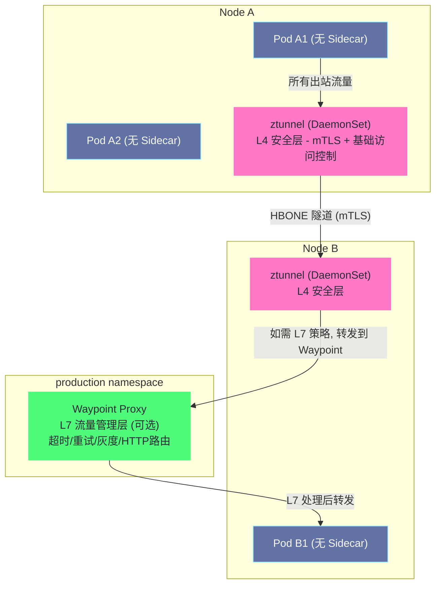
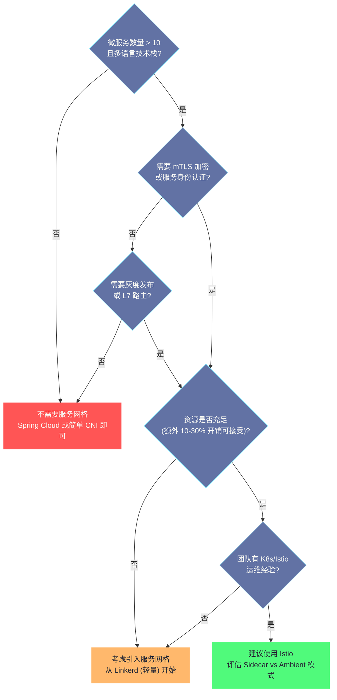

# 服务网格的性能开销与Ambient Mesh

## 摘要

Sidecar 模式的服务网格在功能上近乎完美，但其固有的架构代价——每 Pod 一个 Envoy 进程、双重 iptables 劫持、两次额外的 TLS 握手——在资源敏感的大规模集群中越来越难以接受。本文首先用真实的量化数据呈现 Sidecar 模式的性能开销，分析每个开销项目的来源；然后深入 2022 年 Istio 发布的 **Ambient Mesh** 架构——它如何通过 **ztunnel**（节点级 L4 安全隧道）和 **Waypoint Proxy**（命名空间级 L7 代理）将 Sidecar 从 Pod 内移除，实现"按需 L7"的渐进式安全模型；最后给出 Sidecar 与 Ambient Mesh 的选型决策框架。**Ambient Mesh 不是对 Sidecar 模式的否定，而是对"为什么 L7 功能必须和 L4 安全打包在一起"这个设计假设的重新审视。**

---

## 第 1 章 Sidecar 模式的性能代价量化

### 1.1 内存开销：每 Pod 一份 Envoy

Sidecar 模式最直接的开销是内存。每个注入了 Envoy Sidecar 的 Pod 需要额外运行一个 Envoy 进程，该进程需要维护：

- **xDS 配置缓存**：Envoy 在内存中保存所有 Cluster、Route、Listener 的配置。在大型集群中（1000 个 Service），单个 Envoy 实例的配置缓存可能占用 **50-200MB**，具体取决于集群中的 Service 数量和配置复杂度
- **连接池**：每个 Endpoint 的 Per-thread 连接池，在高并发服务（连接数多）的情况下显著
- **TLS 会话**：每个 mTLS 连接的 TLS 会话状态，约 200-500 字节/连接
- **基础进程内存**：Envoy 进程本身的内存占用约 40-80MB（C++ 运行时、代码段等）

**典型数字**：在一个有 200 个 Service 的中型集群中，单个 Envoy Sidecar 的内存占用约 **100-150MB**。对于一个有 500 个 Pod 的集群，Sidecar 的总额外内存开销约为 **50-75GB**——这对于许多资源受限的集群（特别是边缘计算或测试环境）来说是相当大的负担。

**内存开销随 Service 数量超线性增长的原因**：每个 Envoy 实例持有集群中**所有** Service 的 Cluster 和 Endpoint 信息（因为它不知道哪个 Pod 会调用哪个 Service），这种"全集群视图"导致内存开销与集群规模正相关。

> [!note] 设计哲学
> Istio 提供了 **Sidecar CRD** 用于限制单个 Sidecar 的 xDS 视图范围。通过配置 `egress.hosts` 只包含该服务实际需要访问的目标，可以将 Envoy 的 Cluster 数量从全集群规模缩减到该服务实际使用的规模，显著降低内存占用：
> ```yaml
> apiVersion: networking.istio.io/v1alpha3
> kind: Sidecar
> metadata:
>   name: payment-svc-sidecar
> spec:
>   workloadSelector:
>     labels:
>       app: payment-svc
>   egress:
>   - hosts:
>     - "./riskcontrol-svc"
>     - "./bank-adapter"
>     - "monitoring/*"    # 仅允许访问这几个服务
> ```
> 在大型集群中，合理配置 Sidecar CRD 可以将 Envoy 内存开销降低 **60-80%**。

### 1.2 CPU 开销：每个请求的双重代理

每个服务间的 HTTP 请求，在 Sidecar 模式下需要经过**两个** Envoy 实例：发送方的出站 Sidecar 和接收方的入站 Sidecar。每个 Envoy 实例对这个请求执行：

1. iptables 数据包重定向（内核态，开销较低）
2. TLS 解密/加密（CPU 密集，约 0.1-0.5ms/请求）
3. HTTP 协议解析（解析 Header、URL 等，约 0.05ms）
4. 路由规则匹配（查找 VirtualService/DestinationRule，约 0.01ms）
5. 指标采集、日志生成（内存写入，约 0.05ms）
6. TLS 加密（再次，约 0.1-0.5ms）

两个 Sidecar 合计，每个请求额外消耗约 **0.5-2ms** 的处理时间，CPU 额外消耗约 **0.2-0.5 个 CPU 核**（在 10k RPS 场景下）。

**TLS 握手的一次性开销**：首次建立 mTLS 连接时，TLS 握手（RSA/ECDH 密钥交换）约需 **1-5ms**，但连接复用（HTTP/2 多路复用、Keep-Alive）使得这个开销被大量请求分摊。在长连接场景下，TLS 握手的开销可忽略不计；在短连接密集场景（每个请求新建连接），这是主要的延迟来源。

### 1.3 延迟开销的量化基准

以下数据基于 Istio 官方基准测试（Istio 1.14，裸金属机器，Fortio 压测工具）：

| 测试场景 | P50 延迟（无 Istio） | P50 延迟（有 Istio） | P99 延迟（无 Istio） | P99 延迟（有 Istio） |
| :--- | :--- | :--- | :--- | :--- |
| HTTP/1.1 QPS=1000 | 0.89ms | 2.67ms | 1.42ms | 6.13ms |
| HTTP/2 QPS=1000 | 0.54ms | 2.10ms | 0.98ms | 4.89ms |
| gRPC QPS=1000 | 0.61ms | 1.98ms | 0.96ms | 4.21ms |
| HTTP/1.1 QPS=5000 | 0.89ms | 3.12ms | 1.89ms | 9.87ms |

**核心结论**：
- P50 延迟增加约 **1.5-2ms**（主要是两个 Envoy 的处理时间 + mTLS）
- P99 延迟增加约 **3-8ms**（高百分位延迟更敏感，受偶发 GC 或上下文切换影响）
- 高 QPS 场景（5000 RPS）下 P99 劣化更明显（连接池压力增大）

对于绝大多数业务场景，**1.5-2ms 的额外 P50 延迟是可以接受的**。但对于延迟极度敏感的场景（金融高频交易、实时竞价、在线游戏），这个开销是显著的。

### 1.4 启动与滚动更新的额外复杂性

Sidecar 模式还带来了非性能层面的工程成本：

**Pod 启动竞态（Sidecar 未就绪问题）**：业务容器和 Envoy Sidecar 同时启动，但 iptables 规则在 Pod 网络命名空间创建后立即生效，早于 Envoy 监听端口。如果业务容器在 Envoy 就绪前就发出网络请求，连接会被 iptables 重定向到一个还没监听的端口（15001），导致连接失败。

解决方案：配置 `holdApplicationUntilProxyStarts: true`（istiod 控制，让 Envoy 先就绪再解除业务容器的阻塞），但这增加了 Pod 启动延迟。

**滚动更新的双重重启问题**：当需要升级 Envoy 版本时（如修复安全漏洞），所有注入了 Sidecar 的 Pod 都需要滚动重启（让 MutatingAdmissionWebhook 注入新版本 Sidecar）。对于一个 1000 Pod 的集群，这意味着 1000 次 Pod 重启，可能影响数十分钟的服务稳定性。

---

## 第 2 章 Ambient Mesh：从 Sidecar 到节点代理的架构重构

### 2.1 Ambient Mesh 的诞生背景

2022 年 9 月，Istio 社区发布了 **Ambient Mesh**（环境网格）的设计提案和初始实现。提案的核心问题意识是：

> "Sidecar 模式将 L4 安全（mTLS、访问控制）和 L7 流量管理（路由、重试、可观测性）**捆绑**在一起，强制所有服务都承担完整的 L7 处理开销——即使这些服务根本不需要 L7 功能。这是过度设计。"

**80/20 法则的应用**：在一个典型的微服务集群中：
- **100%** 的服务需要 L4 安全（加密传输、身份认证）
- **20-30%** 的服务需要复杂的 L7 流量管理（灰度发布、Header 路由、故障注入）

Sidecar 模式对这两种需求采用了同一种解决方案（完整的 Envoy Sidecar），导致 70-80% 的服务为不需要的 L7 功能支付了全额的资源代价。

Ambient Mesh 的设计目标：**分层安全，按需 L7**。

### 2.2 Ambient Mesh 的两层架构

Ambient Mesh 将 Sidecar 的职责拆分为两个独立的组件，部署在不同的粒度：



**ztunnel（Zero Trust Tunnel）**：
- 每个节点一个，以 DaemonSet 形式部署
- 负责**所有进出该节点 Pod 的 L4 流量**
- 核心功能：mTLS 加密/解密、SPIFFE 身份验证、基于 SPIFFE 身份的 L4 访问控制
- 使用 **Rust** 实现（极低内存占用，约 20-30MB/节点）
- 通过 **HBONE（HTTP-Based Overlay Network Environment）** 协议在节点间建立安全隧道

**Waypoint Proxy**：
- 可选，按命名空间（或 Service Account）部署
- 基于 Envoy 实现，与 Sidecar 模式使用相同的代理内核
- 负责**需要 L7 处理的流量**：VirtualService 路由、超时/重试、故障注入、L7 访问控制
- 只有配置了 L7 策略的命名空间才需要部署 Waypoint

### 2.3 ztunnel 的工作机制

**流量劫持的方式变化**：Sidecar 模式使用 iptables REDIRECT（在 Pod 的 Network Namespace 内），Ambient Mesh 使用 **iptables TPROXY + 路由策略**（在节点的 Network Namespace 内），将 Pod 的流量劫持到节点上的 ztunnel 进程。

ztunnel 使用了 [[06 Service底层实现——kube-proxy、iptables与IPVS|Linux 内核]]  的 **透明代理（Transparent Proxy）** 机制：

```bash
# Node 网络命名空间中的规则（简化）
# 1. 所有来自 Ambient 模式 Pod 的出站流量，重定向到 ztunnel 的监听端口
ip rule add fwmark 0x100/0x100 lookup 101      # 打了特定标记的包查路由表 101
ip route add local default dev lo table 101    # 路由表 101: 所有包路由到本地（TPROXY 模式）

iptables -t mangle -A PREROUTING -i pod_veth -j MARK --set-mark 0x100
# 来自 Pod veth 接口的包打上标记 0x100，然后被 TPROXY 到 ztunnel
```

**HBONE 协议**：ztunnel 在节点间建立 mTLS 加密的 HTTP/2 隧道（HBONE），将原始 TCP 流量封装在 HTTP/2 CONNECT 隧道中传输。HBONE 使用 HTTP/2 的多路复用特性，单个 HBONE 连接可以承载多个 Pod 的流量，减少了节点间的连接数。

HBONE 的报文结构：
```
HBONE 隧道 (TLS 加密的 HTTP/2):
  :method = CONNECT
  :authority = 10.244.1.5:8080    ← 目标 Pod 的地址
  x-forwarded-for = 10.244.0.3   ← 源 Pod 的地址
  baggage = spiffe://...          ← 源 Pod 的 SPIFFE 身份（用于目标侧的访问控制）
  
  [TCP 数据流（隧道体）]
```

**ztunnel 的 L4 访问控制**：ztunnel 在建立 HBONE 连接时，验证源 Pod 的 SPIFFE 身份，并与 istiod 下发的 L4 授权策略（`AuthorizationPolicy` 中的 L4 规则）进行比对。如果策略不允许，ztunnel 直接拒绝连接，不建立隧道。

### 2.4 Waypoint Proxy 的工作机制

当某个命名空间配置了 L7 策略（VirtualService/DestinationRule/L7 AuthorizationPolicy）时，需要为该命名空间部署 Waypoint Proxy：

```bash
# 为 production 命名空间创建 Waypoint Proxy
istioctl x waypoint apply --namespace production

# 查看创建的 Waypoint
kubectl get gateway -n production
# NAME                TYPE    ADDRESS        PROGRAMMED   AGE
# waypoint            istio   10.96.200.1    True         5m
```

**流量在有 Waypoint 时的路径**：

当发往 `production` 命名空间 Pod 的流量到达目标节点的 ztunnel 时：
1. ztunnel 检查目标 Pod 所在的命名空间是否有 Waypoint Proxy
2. 如果有：ztunnel 将流量转发给 Waypoint Proxy（通过 HBONE 隧道）
3. Waypoint 应用 L7 策略（路由规则、重试、Header 修改等）
4. Waypoint 将处理后的流量转发给目标 Pod 所在节点的 ztunnel
5. ztunnel 最终将流量投递给目标 Pod

**Waypoint 的资源开销**：Waypoint 是一个基于 Envoy 的代理，但它是**命名空间级别**的（而不是 Pod 级别的），整个命名空间共享一个或多个 Waypoint 实例。对于有 100 个 Pod 的 `production` 命名空间，只需要 2-3 个 Waypoint 副本（高可用），而不是 100 个 Sidecar。

---

## 第 3 章 Ambient Mesh 与 Sidecar 模式的对比

### 3.1 架构对比

| 维度 | Sidecar 模式 | Ambient Mesh |
| :--- | :--- | :--- |
| **L4 安全组件** | 每 Pod 一个 Envoy Sidecar | 每节点一个 ztunnel（DaemonSet）|
| **L7 处理组件** | 每 Pod 一个 Envoy Sidecar | 每命名空间一个 Waypoint（可选）|
| **流量劫持方式** | Pod 内 iptables REDIRECT | 节点 iptables TPROXY |
| **L4 隧道协议** | mTLS（Envoy TLS） | HBONE（HTTP/2 + mTLS）|
| **需要 Sidecar 注入** | 是（MutatingWebhook） | 否 |
| **需要 Pod 重启** | 是（注入/升级时） | 否 |
| **L7 策略开启方式** | 默认开启（所有 Sidecar 有完整 L7 能力）| 按需（部署 Waypoint 后生效）|
| **内存开销（1000 Pod）** | ~100GB（1000 × 100MB Sidecar）| ~5GB（500节点 × 30MB ztunnel + 少量 Waypoint）|
| **Envoy 版本升级** | 需要滚动重启所有 Pod | 只需更新 ztunnel DaemonSet 和 Waypoint Deployment |

### 3.2 性能对比数字

基于 Istio 官方的 Ambient Mesh vs Sidecar 模式基准测试：

| 指标 | Sidecar 模式 | Ambient Mesh（仅 L4）| Ambient Mesh（L4+Waypoint）|
| :--- | :---: | :---: | :---: |
| **P50 延迟（HTTP/1.1）** | +2.0ms | **+0.6ms** | +1.5ms |
| **P99 延迟（HTTP/1.1）** | +8ms | **+2ms** | +5ms |
| **每请求 CPU（两端合计）** | ~0.3 vCPU | **~0.05 vCPU** | ~0.2 vCPU |
| **内存（1000 Pod 集群）** | ~100GB | **~2GB（ztunnel）** | ~2GB+Waypoint |
| **新 Pod 上线无需重启** | 否 | **是** | **是** |

**关键解读**：
- Ambient Mesh 的 L4 层（仅 ztunnel，无 Waypoint）延迟开销约为 Sidecar 的 **1/3**
- 增加了 Waypoint（等价于完整 L7 功能）后，延迟开销约为 Sidecar 的 **3/4**
- 内存节省最为显著：从 100GB 降至约 2GB（ztunnel），**50 倍**的内存节省

### 3.3 两种模式的适用场景

**继续使用 Sidecar 模式的场景**：
- Istio 版本 < 1.21（Ambient Mesh GA 之前）
- 需要**每 Pod 级别**的精细 L7 策略（如不同副本使用不同的路由规则）
- 使用了大量 Envoy 的高级特性（复杂的 EnvoyFilter 自定义、Wasm 插件）
- 对 Ambient Mesh 的稳定性仍有顾虑（处于 Beta 阶段）
- 混合了非 Kubernetes 工作负载（虚拟机），Ambient Mesh 目前对 VM 支持有限

**选择 Ambient Mesh 的场景**：
- 新建集群，追求最低的基础设施开销
- 主要需求是 mTLS 加密和基础 L4 访问控制（70% 以上的服务不需要复杂 L7 路由）
- 资源受限环境（边缘计算、低配节点）
- 希望避免 Sidecar 注入带来的 Pod 重启需求（对无停机更新要求高）
- 大规模集群（>500 节点），Sidecar 的内存开销是真实的 CapEx 问题

---

## 第 4 章 Ambient Mesh 的迁移路径

### 4.1 从 Sidecar 到 Ambient 的平滑迁移

Istio 支持 Sidecar 模式和 Ambient 模式在同一集群中**共存**，可以按命名空间逐步迁移：

```bash
# Step 1: 安装支持 Ambient 的 Istio
helm install istio-base istio/base -n istio-system
helm install istiod istio/istiod -n istio-system \
    --set profile=ambient

# 安装 ztunnel DaemonSet
helm install ztunnel istio/ztunnel -n istio-system

# Step 2: 将某个 Namespace 切换到 Ambient 模式
kubectl label namespace staging istio.io/dataplane-mode=ambient

# 验证：该 Namespace 的 Pod 不再有 istio-proxy 容器
# 但流量仍然经过 ztunnel 的 mTLS 保护

# Step 3: 如果该 Namespace 需要 L7 策略，部署 Waypoint
istioctl x waypoint apply --namespace staging
kubectl label namespace staging istio.io/use-waypoint=waypoint

# Step 4: 观察稳定后，逐步将其他 Namespace 迁移到 Ambient 模式
kubectl label namespace production istio.io/dataplane-mode=ambient
```

**迁移期间的兼容性**：处于 Ambient 模式的 Pod 和处于 Sidecar 模式的 Pod 可以互相通信，两者之间的连接会自动选择合适的协议（ztunnel 侧 HBONE ↔ Sidecar 侧普通 mTLS 有互操作机制）。

### 4.2 Ambient Mesh 的当前局限性

截至 Istio 1.21（2024 年）Ambient Mesh GA 时，仍有一些已知限制：

**功能层面**：
- 部分 Envoy 高级特性（如复杂的 EnvoyFilter）在 Waypoint 上支持有限
- IPv4/IPv6 双栈支持仍在完善中
- 多集群 Ambient Mesh 的配置更复杂

**可观测性层面**：
- Ambient 模式下，访问日志由 ztunnel 生成（而非每 Pod 的 Sidecar），格式和内容与 Sidecar 模式不完全一致
- Kiali 等工具对 Ambient 模式的可视化支持仍在跟进

**运维层面**：
- ztunnel 是节点级别的关键组件，其故障影响该节点上所有 Ambient Pod 的网络通信（而 Sidecar 模式下单个 Sidecar 故障只影响一个 Pod）
- ztunnel 的调试工具链相比 Sidecar 模式还不够成熟

---

## 第 5 章 服务网格选型决策框架

### 5.1 是否需要服务网格



### 5.2 Sidecar vs Ambient Mesh 选型矩阵

| 场景 | 推荐模式 | 理由 |
| :--- | :--- | :--- |
| 新建集群，追求最低开销 | **Ambient** | 节省 50x 内存，避免 Sidecar 运维复杂性 |
| 已有 Sidecar 集群，需要优化资源 | **渐进迁移到 Ambient** | 按 Namespace 逐步迁移，风险可控 |
| 每个 Pod 都需要复杂 L7 策略 | **Sidecar** | Ambient 的 Waypoint 是 NS 粒度，粒度不够精细 |
| 边缘计算/IoT，资源极度受限 | **Ambient** | ztunnel 30MB vs Sidecar 100MB/Pod |
| 大量 Wasm/EnvoyFilter 自定义 | **Sidecar** | Waypoint 对这些高级特性支持有限 |
| 混合虚拟机工作负载 | **Sidecar** | Ambient 对非 K8s 工作负载支持尚不完善 |
| 强调运维简单性（小团队）| **Linkerd 2.x** | 比 Istio 更简单，适合小规模场景 |

---

## 第 6 章 服务网格未来演进方向

### 6.1 eBPF 数据面

以 [[05 Cilium深度解析——eBPF驱动的下一代网络与可观测性|Cilium]] 为代表的 [[03 eBPF Profiling 内核级性能观测|eBPF]]-based 服务网格正在挑战 Envoy Sidecar 的地位。Cilium Service Mesh 用 eBPF 程序在内核中直接实现 L4 安全和部分 L7 功能，完全绕过用户态代理：

- **零用户态开销**：eBPF 程序在内核执行，不需要用户态的 Sidecar 进程
- **延迟极低**：内核内处理，没有用户态/内核态上下文切换
- **功能逐步完善**：目前 L7 功能（如灰度路由）仍依赖节点级别的 Envoy（类似 Waypoint）

Cilium Service Mesh 的局限：需要较新的 Linux 内核（5.10+），且部分 Istio 高级特性（如复杂的 Wasm Filter）暂时无法完全替代。

### 6.2 Gateway API：服务网格的下一代 API 标准

Kubernetes **Gateway API** 是 Ingress API 的下一代替代方案，它正在成为服务网格流量管理的统一标准。Istio 从 1.16 版本开始支持 Gateway API，Ambient Mesh 的 Waypoint 也基于 Gateway API 的 `HTTPRoute` 等资源进行配置：

```yaml
# 使用 Gateway API HTTPRoute 替代 Istio VirtualService
apiVersion: gateway.networking.k8s.io/v1
kind: HTTPRoute
metadata:
  name: backend-route
  namespace: production
spec:
  parentRefs:
  - group: ""
    kind: Service
    name: backend-service
    port: 80
  rules:
  - matches:
    - headers:
      - name: x-version
        value: v2
    backendRefs:
    - name: backend-service
      port: 80
      filters:
      - type: RequestHeaderModifier
        requestHeaderModifier:
          add:
          - name: x-target-version
            value: v2
```

Gateway API 的优势在于它是 Kubernetes 标准 API（不依赖特定的 Service Mesh），同一套 `HTTPRoute` 配置在 Istio、Cilium、NGINX Gateway 等不同实现中都可以使用，实现了流量管理的**可移植性**。

---

## 第 7 章 小结：服务网格专栏知识体系总结

### 7.1 七篇文章的知识地图

| 篇章 | 核心知识 | 工程价值 |
| :--- | :--- | :--- |
| **01 概述** | 微服务治理痛点、Sidecar 模式、四大能力 | 建立服务网格的认知框架 |
| **02 Istio 架构** | istiod 三大子系统、xDS API、配置推送链路 | 理解控制面如何工作 |
| **03 Envoy** | Worker 线程模型、Filter Chain、连接池、熔断 | 理解数据面的性能特性 |
| **04 流量管理** | VirtualService/DestinationRule、灰度发布 | 生产级流量管理实践 |
| **05 安全** | SPIFFE 身份、mTLS、PeerAuthentication、AuthorizationPolicy | 零信任安全实施指南 |
| **06 可观测性** | 分布式追踪、Prometheus RED 指标、访问日志 | 建立完整的观测能力 |
| **07 性能与 Ambient** | Sidecar 开销量化、Ambient Mesh 架构、选型框架 | 架构选型与演进路径 |

### 7.2 服务网格的本质

回顾整个专栏，服务网格的本质是**将分布式系统的横切关注点（Cross-cutting Concerns）从应用层下沉到基础设施层**。这个"下沉"带来的收益是：
- 所有服务统一享有安全、可观测性、弹性能力，不依赖各团队的实现质量
- 基础设施团队可以统一管理和升级这些能力，而不需要协调各业务团队

Ambient Mesh 的出现，证明了这个"下沉"还可以做得更彻底——不只是从应用代码下沉到 Pod 内的 Sidecar，而是进一步下沉到节点级别（ztunnel）和命名空间级别（Waypoint），实现真正意义上对应用完全透明的基础设施安全层。

---

*本文是 [[服务网格]] 专栏的第 7 篇（终篇）。相关专栏：[[05 Cilium深度解析——eBPF驱动的下一代网络与可观测性|Cilium eBPF]]、[[kubernetes网络原理与插件|K8s 网络专栏]]、[[01 容器的本质——从进程隔离到 OCI 标准|Docker 容器]]*

---

> [!note] 思考题
> 1. Linkerd 以轻量著称——Sidecar（linkerd-proxy，Rust 编写）资源占用远小于 Envoy。在资源受限的环境中（如边缘计算），Linkerd 可能比 Istio 更合适。但 Linkerd 的功能不如 Istio 丰富（如不支持 Envoy 的 Wasm 扩展）。在什么功能需求下你会选择 Istio 而非 Linkerd？
> 2. Cilium Service Mesh 基于 eBPF——不需要 Sidecar（或可选 Envoy 做 L7 处理）。Cilium 同时提供网络策略（CNI）和服务网格——减少了组件数量。但 Cilium 对内核版本有要求（通常需要 5.4+）。在你的环境中内核版本是否是限制因素？
> 3. Service Mesh 的'是否需要'问题——在什么阶段引入 Service Mesh 是合理的？10 个微服务？50 个？还是只在需要 mTLS 或灰度发布时？过早引入增加了系统复杂度和运维负担——你如何评估 Service Mesh 的 ROI？
