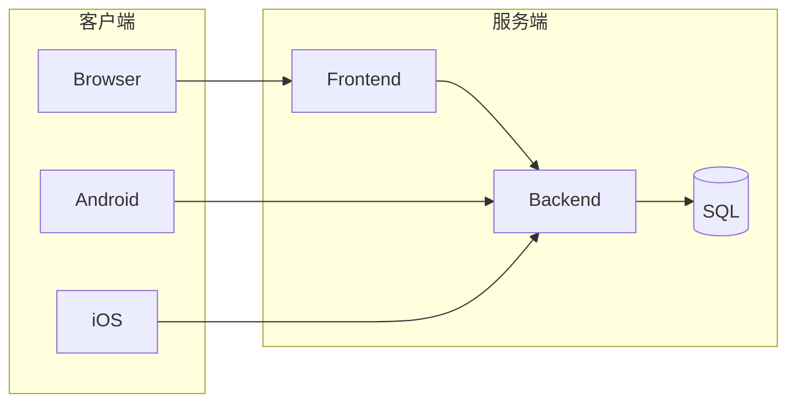
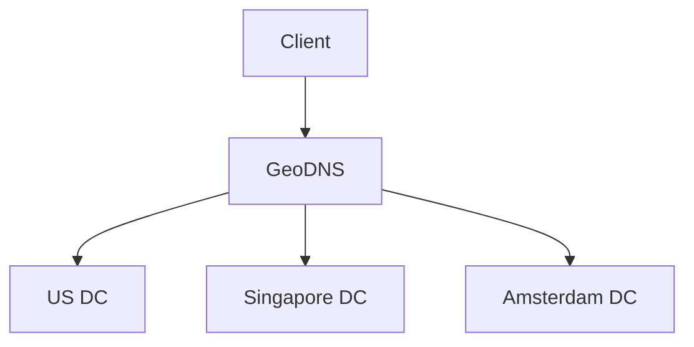
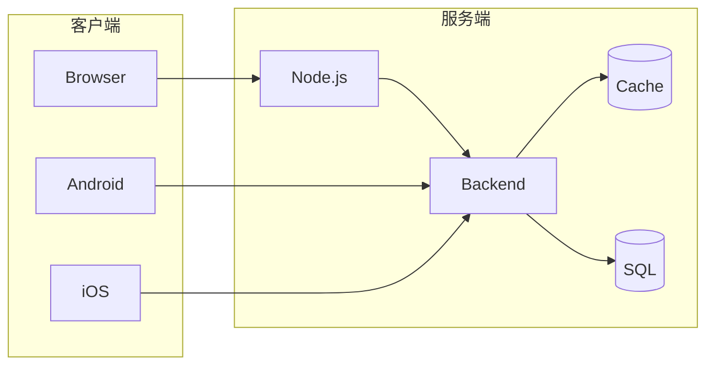
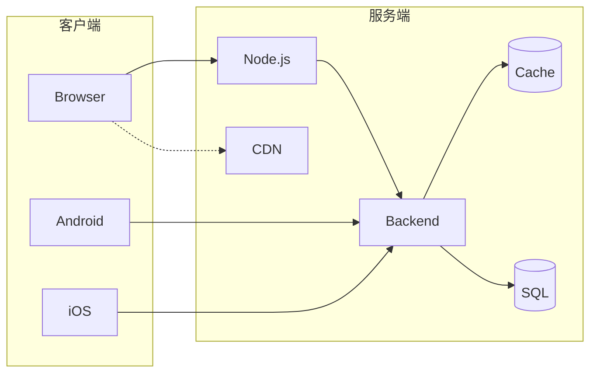
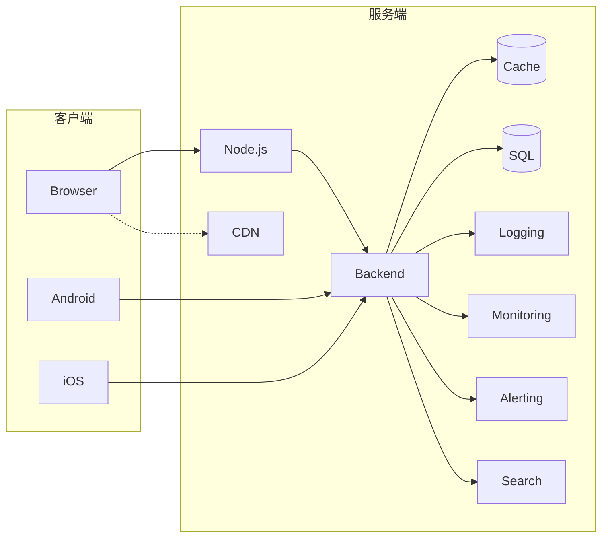
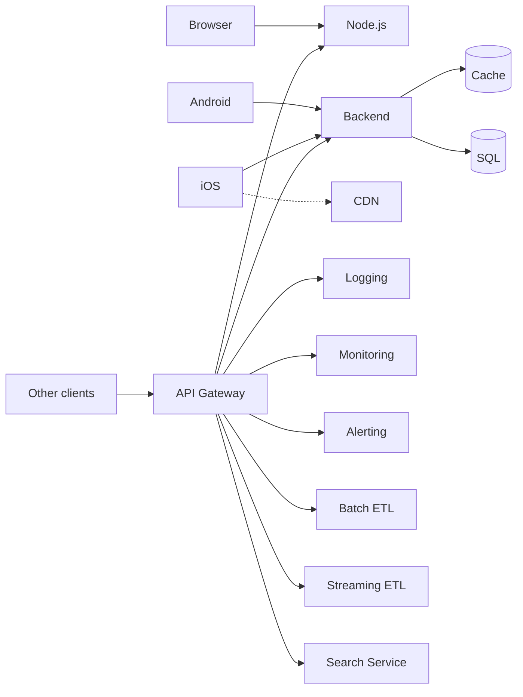
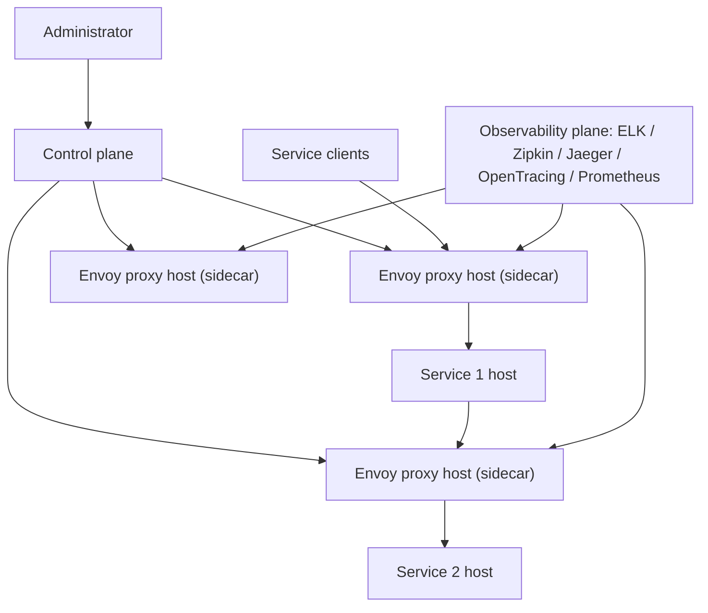

# 01 第 1 章：系统设计概念导览（A Walkthrough of System Design Concepts）

本章包括：

- 学习系统设计面试的重要性
- 扩展一个服务
- 使用云托管还是裸金属

系统设计面试是候选人与面试官之间围绕“设计一个通常通过网络提供的软件系统”所展开的讨论。面试官通常会用一句简短而模糊的话，要求候选人设计某个特定的软件系统。根据具体系统的不同，用户群体可能是非技术用户，也可能是技术用户。

系统设计面试出现在大多数软件工程、软件架构和工程经理岗位的面试中。（在本书中，我们把软件工程师、架构师和经理统称为工程师。）面试流程中的其他组成部分还包括编码面试以及行为/文化面试。

## 1.1 关于权衡的讨论

以下因素说明了系统设计面试的重要性，以及无论作为候选人还是面试官，都应认真准备它。

候选人在系统设计面试中的表现，会被用来评估其系统设计专业知识的广度与深度，以及其与其他工程师沟通和讨论系统设计的能力。这是决定公司会以何种资深等级录用你的关键因素。随着工程师资历提高，设计和评审大规模系统的能力会被认为越来越重要。相应地，系统设计面试在高级岗位面试中的权重也更高。无论作为面试官还是候选人，为系统设计面试做准备，都是一项对技术职业生涯很值得的时间投资。

技术行业的一个独特之处在于，工程师每隔几年换一次公司是很常见的，这不同于其他行业中员工可能在一家公司待很多年甚至终身任职的情况。这意味着，一个典型工程师在职业生涯中会经历很多次系统设计面试。就职于极具吸引力公司的工程师，作为面试官经历的系统设计面试还会更多。作为候选人，你不到一个小时的时间里，必须尽可能留下最好的印象，而与你竞争的其他候选人，往往是世界上最聪明、最有动力的一群人。

系统设计是一门艺术，而不是一门科学。它并不是关于完美答案。我们是在既定资源和时间下，通过做出各种权衡和妥协，去设计那个最贴合当前以及未来可能需求的系统。本书中对各种系统的讨论都包含估算与假设，并非学术上严格穷尽，也并非科学实验式推导。我们可能会提到软件设计模式和架构模式，但不会正式定义这些原则。读者若想了解更多细节，应参考其他资料。

系统设计面试不是看谁给出了“唯一正确答案”。它考察的是：一个人是否能够讨论多种可能方案，并在满足需求时比较它们的权衡。第 1 部分中讨论的各种需求类型和常见系统，会帮助我们设计系统、评估各种可能方法，并展开权衡讨论。

## 1.2 你应该读这本书吗？

系统设计面试的开放性，使得人们很难准备，也很难知道在面试中应该讨论什么、该怎么讨论。工程师或学生如果去网上搜索系统设计面试的学习材料，会发现海量内容，而这些内容在质量和覆盖主题的广度上差异很大。这会让人困惑，并阻碍学习。而且直到最近，专门讨论这个主题的书还很少，虽然现在开始陆续有一些出版。我认为，这是因为一本高质量、专注于系统设计面试主题的书，借用 19 世纪法国著名诗人与小说家维克多·雨果的话来说，就是“其时已至的思想”。很多人会在差不多同一时间想到同样的主意，这恰恰说明它的重要性。

这不是一本软件工程入门书。它最适合那些已经具备最基本行业经验的读者使用。假如你还是刚开始第一段实习的学生，那么你可以去阅读陌生工具的文档网站和其他入门材料，再把本书中的陌生概念与之结合起来，并在工作场所和工程师一起讨论。本书讨论的是如何应对系统设计面试，并尽量避免重复那些你很容易在网上或其他书里找到的入门内容。读者至少应具备中等水平的编码与 SQL 能力。

本书提供了一种结构化、有组织的方法，帮助你开始准备系统设计面试，或者在你阅读了大量碎片化材料后，用来填补知识与理解上的空白。同样重要的是，它还会教你如何在系统设计面试中展示自己的工程成熟度与沟通能力，例如如何在短短约 50 分钟内，清晰、简洁地表达你的想法、知识和问题。

像其他任何面试一样，系统设计面试也涉及沟通能力、快速思考、提出好问题以及应对表现焦虑。你可能会忘记提到面试官期望你说出的要点。这个面试形式本身是否有缺陷，可以无休止地争论下去。就我个人经验而言，随着资历提高，一个人花在会议上的时间会越来越多，而快速思考、提出好问题、把讨论引向最关键且最相关的话题，以及简洁地表达自己的想法，都是至关重要的能力。本书强调的是：在不到 1 小时的面试中，你必须高效而简洁地表达你的系统设计专业能力，并通过向面试官提出正确问题，把面试引向你希望的方向。阅读本书，再加上与其他工程师一起练习系统设计讨论，将帮助你建立通过系统设计面试并在未来公司中更好参与系统设计所需的知识与流畅度。本书也可以成为进行系统设计面试的面试官的参考资料。

有些人书面表达能力强于口头表达，因此可能会在约 50 分钟的面试里忘记提到重要要点。系统设计面试天然偏向那些口头表达能力较强的工程师，而相对不利于口头表达较弱的工程师，哪怕后者拥有相当可观的系统设计知识，并在其所在组织中做出过有价值的系统设计贡献。本书旨在帮助工程师应对这些以及其他系统设计面试中的挑战，展示一种更有条理的应对方式，并帮助读者避免被它吓倒。

如果你是一位希望拓宽系统设计概念知识、提升系统讨论能力，或者只是想拥有一套系统设计概念和示例讨论集合的软件工程师，那么请继续读下去。

## 1.3 本书概览

本书分为两部分。第 1 部分采用较典型的教材形式，章节覆盖系统设计面试中会讨论的各种主题。第 2 部分则由若干示例面试题讨论组成，这些讨论会引用第 1 部分中讲到的概念，同时也会讨论反模式、常见误解与错误。

在这些讨论里，我们也会明确指出一个显而易见的事实：没有人被期望掌握所有领域的一切知识。更重要的是，你应该能够推理出哪些方法能更好地满足需求，以及它们各自伴随哪些权衡。比如，我们不需要精确计算一个文件在使用 Gzip 压缩后能减少多少体积，也不需要算出压缩过程所需的 CPU 和内存资源，但我们应该能够说明：在发送前先压缩文件，会减少网络流量，但会在发送方和接收方两端消耗更多 CPU 和内存资源。

本书的一个目标，是把一批相关材料汇总并组织到一本书里，以便你建立知识基础，或者识别知识空缺，再据此继续学习其他材料。

本章剩余部分是一个示例系统设计的前奏，它会提到第 1 部分后续将详细讨论的一些概念。基于这个上下文，我们将在专门章节中进一步展开这些概念。

## 1.4 前奏：关于如何扩展系统中各类服务的一段简短讨论

我们将从一个应用的典型初始部署形态讲起，并介绍一种随着需要逐步为应用各项服务加入可扩展性的总体方法。在这个过程中，我们会引入大量术语、概念以及技术公司所需要的许多服务类型，这些内容都会在本书后续部分更详细地展开。

> [!INFO] 定义
> 一个服务的**可扩展性**（scalability），是指它能够以简单且具成本效率的方式调整所分配资源，以应对负载变化的能力。这既适用于用户数的增加或减少，也适用于请求量的增加或减少。第 3 章会进一步讨论这一点。

### 1.4.1 一开始：应用的一个小型初始部署

随着手工贝果热潮的兴起，我们刚刚构建了一个很棒的面向消费者的应用，名叫 Beigel，它允许用户浏览并创建关于附近贝果咖啡馆的帖子。

一开始，Beigel 主要由以下组件构成：

- 面向消费者的客户端应用。它们本质上是同一个应用，只是分别面向三种常见平台：
  - 浏览器应用。这是一个 ReactJS 浏览器端应用，会向一个 JavaScript 运行时服务发出请求。为了减小用户需要下载的 JavaScript bundle 体积，我们使用 Brotli 压缩。Gzip 是更早、也更常见的选择，但 Brotli 生成的压缩文件更小。
  - iOS 应用，下载安装到消费者的 iOS 设备上。
  - Android 应用，同样下载安装到消费者的 Android 设备上。
- 一个无状态的后端服务，为消费者应用提供服务。它可以是 Go 服务，也可以是 Java 服务。
- 一个位于单台云主机上的 SQL 数据库。

我们有两个主要服务：前端服务和后端服务。图 1.1 展示了这些组件。如图所示，消费者应用属于客户端组件，而服务和数据库属于服务端组件。

> [!NOTE]
> 关于为什么浏览器和后端服务之间需要一个前端服务，请参见 6.5.1 节和 6.5.2 节。

*图 1.1 我们应用的初始系统设计。若想更完整地讨论为何会有三个客户端应用和两个服务端应用（不包括 SQL 应用/数据库），请参见第 6 章。*

当我们第一次上线某个服务时，用户数可能很少，因此请求率也很低。单台主机就可能足以应对这种低请求率。我们会把 DNS 配置为把所有请求都导向这台主机。

在最初阶段，我们可以把这两个服务放在同一个数据中心中，每个服务各用一台云主机。（下一小节我们会比较云与裸金属。）我们会把 DNS 配置为：浏览器应用的所有请求都发送到 Node.js 主机，而 Node.js 主机以及两个移动端应用的请求，则发送到后端主机。

### 1.4.2 使用 GeoDNS 进行扩展

数月之后，Beigel 在亚洲、欧洲和北美已经拥有数十万日活跃用户。流量高峰期时，我们的后端服务每秒会接收数千个请求，而监控系统已经开始报告由于超时而返回的 504 状态码。我们必须扩展系统。

我们已经观察到流量的增长，并为这种情况做了准备。按照标准最佳实践，我们的服务是无状态的，因此我们可以配置多个完全相同的后端主机，并把每台主机放到世界不同区域的数据中心。参见图 1.2，当客户端通过域名 `beigel.com` 请求我们的后端时，我们使用 GeoDNS 将客户端导向距离它最近的数据中心。

*图 1.2 我们可以把服务部署到多个地理分布的数据中心。根据客户端的位置（由其 IP 地址推断），客户端会得到最近数据中心中某个主机的 IP 地址，并把请求发送到那里。客户端也可能缓存这个主机 IP 地址。*

如果我们的服务面向的是某个特定国家或地理区域的用户，我们通常会把服务部署在附近的数据中心，以尽量降低时延。如果你的服务面向的是大范围地理分布的用户群，那么我们就可以在多个数据中心部署服务，并使用 GeoDNS 向用户返回离其最近的数据中心中那台服务的 IP 地址。这可以通过为同一域名配置多个 A 记录，并为其他位置配置默认 IP 地址来实现。（A 记录是一种把域名映射到 IP 地址的 DNS 配置。）

当客户端向服务器发起请求时，GeoDNS 会根据客户端 IP 地址获取其地理位置，并为该客户端分配相应的主机 IP 地址。在数据中心不可访问这种不太可能但仍可能发生的情况下，GeoDNS 可以返回另一个数据中心中该服务的 IP 地址。这个 IP 地址可能会在多个层级被缓存，包括用户的互联网服务提供商（ISP）、操作系统和浏览器。

### 1.4.3 增加缓存服务

参照图 1.3，接下来我们会部署一个 Redis 缓存服务，用于响应来自消费者应用的缓存请求。我们会选择一些流量很重的后端端点，让它们从缓存中提供数据。这样做为我们争取了一些时间，因为用户基数和请求负载还在继续增长。现在，系统还需要进一步扩展。

*图 1.3 为我们的服务增加缓存。某些流量很重的后端端点可以被缓存。发生缓存未命中时，或者对于未被缓存的 SQL 数据库/数据表，后端会向数据库请求数据。*

### 1.4.4 内容分发网络

我们的浏览器应用此前一直托管一些对所有用户显示都相同、且不受用户输入影响的静态内容/文件，例如 JavaScript、CSS 库，以及一些图片和视频。我们原先把这些文件放在应用的源代码仓库中，用户会和应用其他内容一起从 Node.js 服务下载这些文件。参照图 1.4，我们决定使用第三方内容分发网络（CDN）来托管这些静态内容。我们选择并开通足够的 CDN 容量来托管这些文件，把文件上传到我们的 CDN 实例，重写代码以便从 CDN 的 URL 获取这些文件，并把这些文件从源代码仓库中移除。

*图 1.4 为我们的服务增加 CDN。客户端可以从后端获取 CDN 地址，或者某些 CDN 地址也可以被硬编码到客户端或 Node.js 服务中。*

参照图 1.5，CDN 会把静态文件的副本存放到世界各地的多个数据中心中，因此用户可以从那个能提供最低时延的数据中心下载这些文件。通常这会是地理上离用户最近的那个数据中心，不过如果最近的数据中心流量过大或出现局部故障，其他数据中心也可能更快。

*图 1.5 左图展示所有客户端都从同一个主机下载内容。右图展示客户端从 CDN 的多个主机下载内容。*

使用 CDN 改善了时延、吞吐、可靠性和成本。（我们会在第 3 章讨论这些概念。）使用 CDN 时，随着需求增加，单位成本会下降，因为维护、集成开销和客户支持都会被更大的负载所摊薄。常见的 CDN 包括 CloudFlare、Rackspace 和 AWS CloudFront。

### 1.4.5 关于水平扩展、集群管理、持续集成和持续部署的一段简短讨论

我们的前端和后端服务都是幂等的（关于幂等性及其好处，我们会在 4.6.1、6.1.2 和 7.7 节讨论），因此它们可以水平扩展。于是，我们可以配置更多主机来支撑更大的请求负载，而不需要重写任何源代码，并且在需要时把前端或后端服务部署到这些主机上。

我们的每个服务都有多名工程师在其源代码上工作，工程师每天都会提交新的 commit。为了支持更大的团队和更快的开发速度，我们必须改变软件开发与发布实践，并在这个过程中招聘两位 DevOps 工程师，来开发管理大型集群所需的基础设施。由于服务的扩展需求可能快速变化，我们希望能够很容易地调整其集群规模。我们需要能够轻松地把服务及其所需配置部署到新主机上。我们还希望能够把代码变更轻松地构建并部署到整个服务集群中的所有主机上。我们也可以利用庞大的用户群，通过向不同主机部署不同代码或配置来开展实验。本节是对“面向水平扩展和实验的集群管理”的一段简要讨论。

#### CI/CD 与基础设施即代码

为了在尽量降低发布 bug 风险的同时尽快发布新功能，我们采用 Jenkins 以及单元测试和集成测试工具来做持续集成和持续部署。（关于 CI/CD 的详细讨论超出本书范围。）我们使用 Docker 对服务进行容器化，使用 Kubernetes（或 Docker Swarm）来管理主机集群，包括扩缩容和负载均衡，并使用 Ansible 或 Terraform 来管理运行在各个集群中的各类服务配置。

> [!NOTE]
> Mesos 通常被认为已经过时。Kubernetes 显然是胜出者。相关讨论可参见：
> `https://thenewstack.io/apache-mesos-narrowly-avoids-a-move-to-the-attic-for-now/`
> `https://www.datacenterknowledge.com/business/after-kubernetes-victory-its-former-rivals-change-tack`

Terraform 允许基础设施工程师创建一份可兼容多个云提供商的统一配置。配置使用 Terraform 的领域特定语言（DSL）编写，并通过云 API 来供应基础设施。在实践中，Terraform 配置中可能会包含一些供应商特定代码，我们应尽量减少这些内容。这样做的总体结果，是降低供应商锁定。

这种方法也被称为“基础设施即代码”（Infrastructure as Code）。基础设施即代码，是指通过机器可读的定义文件来管理和供应计算机数据中心，而不是通过物理硬件配置或交互式配置工具来完成。（Wittig, Andreas; Wittig, Michael [2016]. *Amazon Web Services in Action*. Manning Publications. p. 93. ISBN 978-1-61729-288-0）

#### 渐进式发布与回滚

在本节中，我们先简要讨论渐进式发布与回滚，以便下一节把它们与实验做对比。

当我们把一个构建部署到生产环境时，可能会选择渐进方式。我们可以先把这个构建部署到一定比例的主机上，对其进行监控，然后再提高比例，重复这个过程，直到 100% 的生产主机都在运行这个构建。例如，我们可以按 1%、5%、10%、25%、50%、75%，最后 100% 的节奏来推进。如果我们检测到任何问题，就可以手动或自动回滚部署，例如：

- 测试中漏掉的 bug
- 崩溃
- 时延升高或超时增加
- 内存泄漏
- CPU、内存或存储利用率等资源消耗升高
- 用户流失增加。我们在渐进发布中也可能需要考虑用户流失——也就是说，新用户持续加入并使用应用，而部分用户可能停止使用。我们可以逐步让越来越高比例的用户接触新构建，并研究它对流失率的影响。用户流失可能由上述因素导致，也可能由一些意外问题引发，例如很多用户不喜欢这些改动

例如，一个新构建可能使时延升高到不可接受的水平。我们可以使用缓存与动态路由的组合来应对。我们的服务可能规定一秒时延 SLA。当客户端发出的请求被路由到新构建，而超时发生时，客户端可以改为读取自己的缓存，或者重试请求并被路由到仍在运行旧构建的主机。我们应该记录请求和响应，以便排查超时问题。

我们还可以把 CD 流水线配置为把生产集群划分成多个组，而 CD 工具会决定每组中应有多少主机，并为每组分配主机。如果我们调整了集群规模，那么主机的重新分组和重新部署也可能发生。

#### 实验

当我们为了开发新特性（或移除某些特性）以及调整应用的美学设计而修改用户体验（UX）时，我们可能希望把这些改动逐步推给越来越高比例的用户，而不是一次性推给所有人。实验的目的，是确定 UX 变化对用户行为的影响；而渐进式发布关注的是新部署对应用性能和用户流失的影响。常见实验方法包括 A/B 测试和多变量测试，例如多臂老虎机（multi-armed bandit）。这些主题超出本书范围。若想了解 A/B 测试，请参见 `https://www.optimizely.com/optimization-glossary/ab-testing/`；若想了解多变量测试，可参见 David Sweet 的 *Experimentation for Engineers*（Manning Publications, 2023），或者 `https://www.optimizely.com/optimization-glossary/multi-armed-bandit/` 中关于 multi-armed bandit 的介绍。

实验也被用于交付个性化用户体验。

实验与渐进式发布/回滚的另一个区别在于：在实验中，运行不同构建版本的主机比例，通常由专门为此设计的实验工具或特性开关工具来调节；而在渐进式发布与回滚中，则是由 CD 工具在发现问题时手动或自动将主机回滚到之前的构建。

CD 和实验使新部署和新特性拥有较短的反馈周期。

在 Web 和后端应用中，每一种用户体验（UX）通常都会被打包成不同的构建，因此一定比例的主机会运行不同构建。移动应用通常不同。许多用户体验会被编码进同一个构建里，但每个用户只会暴露于这些用户体验的一个子集。主要原因如下：

- 移动应用部署必须通过应用商店完成。把新版本分发到用户设备上可能要花很多小时，几乎不可能快速回滚一个部署。
- 与 Wi‑Fi 相比，移动数据更慢、可靠性更差、成本也更高。低速和不稳定意味着我们必须让很多内容支持离线，即预先放在应用里。许多国家的移动数据套餐仍然昂贵，而且可能带有流量上限和超额收费。我们应避免让用户承担这些成本，否则他们可能减少使用应用，甚至直接卸载。为了在尽量减少下载组件和媒体所消耗流量的同时开展实验，我们干脆把所有这些组件和媒体都包含在应用中，然后只向每位用户暴露其中需要的子集。
- 移动应用还可能包含很多某些用户永远不会用到的功能，因为这些功能对他们并不适用。例如，15.1 节会讨论应用中的多种支付方式。世界上可能有成千上万种支付解决方案。应用需要包含所有支付方案所需的代码和 SDK，这样才能向每位用户展示其可能会使用的那一小部分支付方式。

所有这些带来的一个结果是：移动应用可能会超过 100MB。如何解决这个问题超出本书范围。我们必须取得平衡并考虑各种权衡。比如，YouTube 的移动应用安装包显然不可能把大量 YouTube 视频都内置进去。

### 1.4.6 功能分区与横切关注点的中心化

功能分区，是指把不同功能拆分到不同服务或主机上。许多服务有一些共通关注点，可以被抽取到共享服务中。第 6 章会讨论其动机、好处和权衡。

#### 共享服务

我们的公司正在快速扩张，日活跃用户已经增长到数百万。我们把工程团队扩展为 5 名 iOS 工程师、5 名 Android 工程师、10 名前端工程师、100 名后端工程师，并新建了一个数据科学团队。

扩大的工程团队可以在许多服务上开展工作，而不只是那些由消费者直接使用的应用。例如，可以为不断扩大的客服和运营部门开发相应服务。我们在消费者应用中加入一些功能，让用户可以联系客户支持，也让运营人员能够创建并上线产品变体。

我们的很多应用都带有搜索栏。于是我们基于 Elasticsearch 创建了一个共享搜索服务。

除了水平扩展之外，我们还通过功能分区，依据功能和地理位置把数据处理与请求分散到大量地理分布的主机上。我们已经把缓存、Node.js 服务、后端服务和数据库服务分别部署到了不同主机上；对其他服务我们也会这样做，把每个服务都放到其自身的地理分布式主机集群中。图 1.6 展示了我们为 Beigel 增加的共享服务。

*图 1.6 功能分区：增加共享服务。*

我们增加了一个日志服务，它由一个基于日志的消息代理组成。我们可以使用 Elastic Stack（Elasticsearch、Logstash、Kibana、Beats）。我们还会使用一个分布式追踪系统，例如 Zipkin、Jaeger，或者分布式日志，来追踪请求穿过大量服务时的路径。我们的服务会给每个请求附加 span ID，这样就可以把它们组装为 trace 并进行分析。2.5 节会讨论日志、监控和告警。

我们还增加了监控和告警服务。我们为客服员工构建内部浏览器应用，帮助他们更好地协助客户。这些应用处理由消费者应用产生的用户日志，并通过良好的 UI 呈现出来，以便客服员工更容易理解客户问题。

API gateway 和 service mesh 是集中处理横切关注点的两种方式。其他方式还有装饰器模式和面向切面编程，不过这些超出了本书范围。

#### API gateway

到这个阶段，应用用户产生的 API 请求已经不到全部请求的一半。大多数请求来自其他公司，这些公司会基于用户在应用内的行为，为我们的用户提供推荐有用产品和服务等能力。于是我们开发了一层 API gateway，用于向外部开发者暴露部分 API。

API gateway 是一个反向代理，它会把客户端请求路由到相应的后端服务。它向很多服务提供共通功能，因此各个单独服务不必重复实现它们：

- 授权、认证，以及其他访问控制与安全策略
- 请求级日志、监控与告警
- 限流
- 计费
- 分析

我们的包含 API gateway 及其服务的初始架构如图 1.7 所示。发往某个服务的请求会先经过一个中心化 API gateway。API gateway 会执行上述所有功能，做 DNS 查询，然后再把请求转发给相关服务的某台主机。API gateway 本身还会调用 DNS、身份与访问控制管理、限流配置服务等其他服务。我们还会记录所有通过 API gateway 进行的配置变更。

*图 1.7 带有 API gateway 及相关服务的初始架构。发往服务的请求会经过 API gateway。*

不过，这种架构也有如下缺点：API gateway 会增加时延，而且需要一个很大的主机集群。对于某个具体请求，API gateway 所在主机与处理请求的服务主机可能位于不同数据中心。一个试图同时兼顾 API gateway 主机与服务主机路由的系统设计，会显得笨拙而复杂。

一种解决方案是使用 service mesh，也叫 sidecar 模式。第 6 章会进一步讨论 service mesh。图 1.8 展示了我们的 service mesh。我们可以使用 Istio 之类的 service mesh 框架。每个服务的每台主机都可以运行一个与主服务并列的 sidecar。我们使用 Kubernetes pod 来实现这一点。每个 pod 中既可以包含服务本身（一个容器），也可以包含 sidecar（另一个容器）。我们提供一个管理接口来配置策略，而这些配置可以被分发到所有 sidecar。

*图 1.8 Service mesh 示意图。Prometheus 会向每个代理主机发起请求以拉取/抓取指标，但图中未画出这些箭头，否则会显得过于杂乱。*

在这种架构下，所有服务请求和响应都会经过 sidecar。服务和 sidecar 位于同一台主机（即同一台机器）上，因此它们可以通过 localhost 相互通信，不会产生网络时延。不过，sidecar 会消耗系统资源。

#### 无 sidecar 的 service mesh：前沿方向

service mesh 几乎会让系统中的容器数量翻倍。对于那些涉及内部服务间通信（也称 ingress 或 east-west）的系统，我们可以通过把 sidecar 代理逻辑放到发起请求的客户端主机上来降低这种复杂性。在无 sidecar 的 service mesh 设计中，客户端主机会从控制平面接收配置。客户端主机必须支持控制平面的 API，因此也必须包含相应的网络通信库。

无 sidecar service mesh 的一个限制是，客户端必须与服务使用相同语言。

无 sidecar service mesh 平台仍处于早期发展阶段。Google Cloud Platform（GCP）Traffic Director 是其中一个实现，于 2019 年 4 月发布：`https://cloud.google.com/blog/products/networking/traffic-director-global-traffic-management-for-open-service-mesh`

#### 命令查询职责分离（CQRS）

命令查询职责分离（CQRS）是一种微服务模式，在这种模式下，命令/写操作与查询/读操作会被按功能拆分到不同服务上。消息代理和 ETL 作业都是 CQRS 的例子。任何一种“先把数据写入一张表，再转换并写入另一张表”的设计，都是 CQRS 的例子。CQRS 会引入复杂度，但它具有更低的时延、更好的可扩展性，而且更容易维护和使用。写服务和读服务可以分别独立扩展。

你会在本书中看到很多 CQRS 的例子，虽然它们未必都会被明确点名。第 15 章就有一个例子：Airbnb 的房东把数据写入 Listing Service，而房客则从 Booking Service 读取数据。（当然，Booking Service 也会为房客提供写入端点，以发起预订请求，但那与房东更新房源无关。）

关于 CQRS 更详细的定义，你可以很容易在其他资料中找到。

### 1.4.7 批处理与流式抽取、转换、加载（ETL）

我们的一些系统会出现不可预测的流量尖峰，而某些数据处理请求其实不需要同步完成（也就是立刻处理并返回响应）：

- 一些会对数据库执行大查询的请求（例如处理数 GB 数据的查询）
- 某些数据更适合在请求到来之前周期性预处理，而不是仅在请求发生时再处理。例如，应用首页可能会展示“过去一小时”或“过去七天”所有用户最常学习的前 10 个单词。这类信息更适合每小时或每天预处理一次。此外，处理结果可以被所有用户复用，而不必为每个用户重复处理
- 另一个例子是，用户看到的数据如果延迟几个小时甚至几天也是可以接受的。例如，用户并不需要看到其共享内容被查看次数的最新统计。展示几小时前的统计是可以接受的
- 某些写操作（例如 INSERT、UPDATE、DELETE 数据库请求）不必立即执行。例如，写入日志服务的请求不需要立刻写到日志服务主机的硬盘中。这些写请求可以先放入队列，之后再执行

对于像日志系统这样会从许多其他系统接收大量请求的系统来说，如果不采用 ETL 这种异步方法，那么日志系统集群就必须拥有成千上万台主机，才能同步处理这些请求。

我们可以将 Kafka 这样的事件流系统（如果使用 AWS，则可使用 Kinesis）与 Airflow 这样的批处理 ETL 工具结合起来，处理这类批任务。

如果我们希望持续处理数据，而不是周期性运行批任务，则可以使用 Flink 之类的流处理工具。例如，如果用户在应用中输入某些数据，而我们希望在几秒或几分钟内利用这些数据向其发送某些推荐或通知，那么我们就可以创建一个 Flink pipeline 来处理最近的用户输入。日志系统通常是流式的，因为它预期接收的是一条不断流入的请求流。若请求没有那么频繁，那么批处理 pipeline 就足够了。

### 1.4.8 其他常见服务

随着公司增长和用户群扩大，我们会开发更多产品，而这些产品也必须越来越可定制、越来越个性化，才能服务于这个庞大、持续增长且日益多样化的用户群。为了满足增长带来的新需求，并利用好这种增长，我们还需要许多其他服务，例如：

- 客户/外部用户的凭证管理，用于外部用户认证与授权
- 各类存储服务，包括数据库服务。每个系统的具体需求不同，也就意味着其所使用数据的持久化、处理与提供方式存在不同的最优方案。我们需要开发并维护多种使用不同技术与方法的共享存储服务
- 异步处理。庞大的用户群意味着需要更多主机，也可能给我们的服务带来不可预测的流量尖峰。为了应对这些尖峰，我们需要异步处理，以便更高效地利用硬件并减少不必要的硬件开销
- 用于分析和机器学习的 notebook 服务，包括实验、模型创建与部署。我们可以利用庞大的客户基数进行实验，以发现用户偏好、提供个性化体验、吸引更多用户，并探索其他增加收入的方式
- 内部搜索以及相关子问题（例如 autocomplete/typeahead 服务）。很多 Web 或移动应用都会提供搜索栏，让用户搜索自己想要的数据
- 隐私合规服务与团队。随着用户数量扩大以及客户数据量增长，我们会吸引恶意的外部与内部行为者，他们会试图窃取数据。一旦在庞大用户群上发生隐私泄露，受影响的将是大量个人和组织。我们必须投资于保护用户隐私
- 欺诈检测。公司收入增长会让它成为罪犯和诈骗者的目标，因此高效的欺诈检测系统必不可少

### 1.4.9 云与裸金属

我们可以自己管理主机和数据中心，也可以把这部分工作外包给云厂商。本节是对这两种方式的对比分析。

#### 一般性考虑

在本节一开始，我们决定使用云服务（租用 AWS、DigitalOcean 或 Microsoft Azure 等提供商的主机），而不是裸金属（拥有并管理自己的物理机器）。

云提供商提供了我们会需要的许多服务，包括 CI/CD、日志、监控、告警，以及各种数据库类型（包括缓存、SQL 和 NoSQL）的简化部署与管理能力。

如果我们从一开始就选择裸金属，那么所有这些需要的服务都要由我们自己搭建和维护。这可能会分散我们对功能开发的注意力和时间，而这对公司来说可能代价高昂。

我们还必须考虑工程人力成本与云工具成本之间的关系。工程师是非常昂贵的资源，除了金钱上的昂贵之外，优秀工程师往往更喜欢有挑战性的工作。如果让他们被小规模搭建常见服务这类琐碎工作折磨，他们可能会跳槽到别的公司，而在竞争激烈的招聘市场中，这样的人很难替代。

云工具通常比雇工程师去搭建和维护裸金属基础设施更便宜。我们很可能既不具备专门云提供商所拥有的规模经济及其带来的单位成本效率，也不具备它们那样的专门经验。如果公司发展成功，未来达到一定增长阶段，我们也许就会具备考虑裸金属的规模经济基础。

除了这些之外，相较于裸金属，使用云服务还有以下好处。

#### 搭建简单

在云提供商的浏览器应用中，我们可以轻松选择最适合自身用途的套餐。而在裸金属环境下，我们则需要执行诸如安装 Apache 之类的服务器软件、配置网络连接和端口转发等步骤。

#### 成本优势

云没有购买物理机器/服务器所需的前期投入成本。云厂商允许我们按增量使用付费，并且可能提供批量折扣。面对不可预测变化的需求，扩容或缩容都既容易又快速。如果选择裸金属，我们可能会陷入“机器太少”或“机器太多”的局面。此外，一些云提供商还提供“自动扩缩容”服务，可根据当前负载自动调整集群规模。

话虽如此，云并不总是比裸金属更便宜。Dropbox（`https://www.geekwire.com/2018/dropbox-saved-almost-75-million-two-years-building-tech-infrastructure/`）和 Uber（`https://www.datacenterknowledge.com/uber/want-build-data-centers-uber-follow-simple-recipe`）就是两个使用自建数据中心的例子，因为对它们来说，那样更具成本效率。

#### 云服务可能提供更好的支持与质量

经验性证据表明，云服务通常拥有更好的性能、用户体验和支持质量，而且故障更少、影响更轻。一个可能的原因是：与裸金属内部服务不同，云服务必须在市场中保持竞争力，才能吸引并留住客户；而组织内部用户往往没有太多选择，只能使用内部服务。很多组织倾向于更重视外部客户，而不是内部用户或员工，可能是因为客户收入可以直接衡量，而为内部用户提供高质量服务和支持所带来的收益更难量化。相应地，糟糕的内部服务给收入和士气带来的损失，也同样难以量化。云服务还可能拥有裸金属环境所缺乏的规模经济，因为云服务团队的工作成果是摊到更大用户群上的。

面向外部的文档也可能比面向内部的文档更好。它可能写得更清晰、更新更频繁，并放在一个结构良好、易于搜索的网站上。也可能会投入更多资源，因此还会提供视频和分步教程。

外部服务在输入校验方面也可能比内部服务质量更高。举一个简单例子：如果某个 UI 字段或 API 端点字段要求用户输入电子邮箱地址，那么服务就应该校验用户输入的内容是否真的是合法邮箱地址。一家公司可能会更重视外部用户对“输入校验质量差”的投诉，因为这些用户可能会因此停止使用并不再为产品付费。类似的反馈如果来自内部用户，而这些用户又别无选择，则可能会被忽视。

当发生错误时，一个高质量服务应该返回具有指导意义的错误信息，告诉用户该如何修复问题，最好是不用经历不得不联系支持人员或服务开发者这种耗时流程。外部服务也可能提供更好的错误信息，同时投入更多资源和激励来提供高质量支持。

如果客户发来一条消息，他们可能在几分钟或几小时内就得到回复；而员工的问题可能要等几小时甚至几天才有人回应。有时，内部帮助频道里的提问甚至根本没人回答。员工收到的回复，可能只是被打发去看写得很差的文档。

只有当组织为内部服务提供足够资源和激励时，组织内部服务才有可能达到外部服务的水平。由于更好的用户体验与支持会提升用户士气和生产力，组织可以考虑建立一些指标，用来衡量内部用户被服务得有多好。避免这些复杂性的一个方式，就是直接使用云服务。这些考虑也可以推广到“外部服务 vs. 内部服务”的更广泛比较上。

最后，每位开发者都有责任对自己保持高标准，但不应对他人的工作质量做理想化假设。然而，内部依赖持续低质量，会伤害组织生产力和士气。

#### 升级

组织裸金属基础设施中所使用的硬件与软件技术都会逐渐老化，而且很难升级。对于仍然使用大型机的金融公司来说，这一点尤其明显。从大型机迁移到通用服务器代价极高、困难且风险很大，因此这类公司会继续购买新的大型机，而这些大型机相比同等算力的通用服务器要昂贵得多。即便组织使用的是通用服务器，也仍然需要持续投入专门知识和精力，不断升级其硬件与软件。例如，在一家大型组织中，哪怕只是升级 MySQL 的版本，也需要相当多时间和精力。许多组织更愿意把这类维护外包给云提供商。

#### 一些缺点

云提供商的一个缺点是供应商锁定。假如我们决定把应用的部分或全部组件迁移到另一家云厂商，这个过程可能并不直接。我们可能需要投入大量工程工作，把数据和服务从一个云提供商迁到另一个，并在过渡期间为重复的服务付费。

我们之所以可能希望迁出某个供应商，有很多原因。今天这家供应商可能管理良好，能够以有竞争力的价格兑现严格的 SLA，但没有任何保证说明它未来也一定如此。未来某家公司的服务质量可能下降，无法兑现 SLA。价格也可能失去竞争力，因为裸金属或者其他云厂商未来变得更便宜了。或者，这家供应商可能被发现其安全性或其他关键特性不足。

另一个缺点是，对于数据与服务的隐私和安全，我们缺乏所有权控制感。我们可能并不完全信任云提供商来保护我们的数据或保障服务安全。而使用裸金属时，我们可以亲自验证隐私与安全。

出于这些原因，很多公司采用多云策略（multi-cloud strategy），也就是使用多家云提供商而不是只用一家，这样当突然有需要时，就可以在短时间内迁离某个特定供应商。

### 1.4.10 无服务器：函数即服务（FaaS）

如果某个端点或函数使用频率不高，或者对时延要求不严格，那么把它实现为运行在函数即服务（FaaS）平台上的函数，可能会更便宜，例如 AWS Lambda 或 Azure Functions。函数只在需要时运行，意味着不需要持续有主机空转等待对该函数的请求。

OpenFaaS 和 Knative 是开源 FaaS 解决方案，我们可以用它们在自己的集群中支持 FaaS，或者把它们作为 AWS Lambda 之上的一层，以提升函数在不同云平台之间的可移植性。在本书写作时，开源 FaaS 解决方案与 Azure Functions 这类厂商托管 FaaS 之间尚无整合。

Lambda 函数的超时时间是 15 分钟。FaaS 旨在处理能够在这一时间内完成的请求。

在典型配置中，一个 API gateway 服务接收入站请求，并触发相应的 FaaS 函数。之所以仍需要 API gateway，是因为总得有一个持续运行的服务来等待请求到来。

FaaS 的另一个好处是，服务开发者无需管理部署与扩缩容，而可以专注于实现业务逻辑。

需要注意的是，一次 FaaS 函数运行通常需要如下步骤：启动 Docker 容器，启动相应语言运行时（Java、Python、Node.js 等），运行函数，然后终止运行时和 Docker 容器。这通常被称为冷启动（cold start）。那些启动需要几分钟的框架，例如某些 Java 框架，可能并不适合 FaaS。这也推动了诸如 GraalVM（`https://www.graalvm.org/`）这类具备快速启动和低内存占用特性的 JDK 的发展。

为什么会有这样的开销？为什么不能像单体应用那样，把所有函数都打包进一个单独包，并在所有主机实例上运行？原因就在于单体应用本身的缺点（见附录 A）。

为什么不能让某个高频使用的函数在一段时间内部署在某些主机上运行（也就是带过期时间）？这样的系统与自动扩缩容的微服务很相似，当使用那些启动时间很长的框架时，也可以考虑这种做法。

FaaS 的可移植性是有争议的。乍看之下，一个组织如果在 AWS Lambda 这类专有 FaaS 上投入了大量工作，就可能被其锁定；迁移到其他解决方案会变得困难、耗时且昂贵。而开源 FaaS 平台也不是完整答案，因为你仍然需要自己配置并维护主机，这又削弱了 FaaS 所要解决的扩展性价值。这个问题在大规模场景下尤其明显，因为那时 FaaS 的成本可能远高于裸金属。

不过，FaaS 中的一个函数可以按两层来编写：内层函数负责核心逻辑，外层函数负责供应商特定配置。这样一来，若要为某个函数切换供应商，只需要修改外层函数即可。

Spring Cloud Function（`https://spring.io/projects/spring-cloud-function`）就是这一思路的一种泛化的、正在发展的 FaaS 框架。它支持 AWS Lambda、Azure Functions、Google Cloud Functions、Alibaba Function Compute，并且未来可能支持更多 FaaS 厂商。

### 1.4.11 结论：扩展后端服务

在第 1 部分的其余章节中，我们会讨论扩展后端服务的各种概念与技术。前端/UI 服务通常就是一个 Node.js 服务，它所做的只是向任何用户提供同一份使用 ReactJS 或 Vue.js 等 JavaScript 框架编写的浏览器应用，因此它往往只需调整集群规模并结合 GeoDNS 就能简单扩展。而后端服务是动态的，它可以对每个请求返回不同响应，因此其可扩展技术更加多样也更加复杂。我们在前面的例子中讨论了功能分区，后文也会在需要时偶尔继续涉及它。

## Summary

- 系统设计面试准备对你的职业生涯至关重要，同时也会让你的公司受益。
- 系统设计面试是工程师之间围绕“如何设计一个通常通过网络提供的软件系统”展开的讨论。
- GeoDNS、缓存和 CDN 是扩展服务的基础技术。
- CI/CD 工具与实践能够更快发布特性，并减少 bug。它们还允许我们把用户划分为不同组，并让各组看到不同版本的应用，以开展实验。
- 像 Terraform 这样的基础设施即代码工具，是进行集群管理、扩缩容和特性实验的有用自动化工具。
- 功能分区以及横切关注点的中心化，是系统设计的重要组成部分。
- ETL 作业可以把流量尖峰的处理摊到更长时间范围内，从而降低所需集群规模。
- 云托管有很多优点。成本往往是其中之一，但并不总是如此。它也存在一些可能的缺点，例如供应商锁定以及潜在的隐私和安全风险。
- Serverless 是服务的一种替代方式。它的优势在于不需要让主机持续运行，从而节约成本；作为交换，它会施加一定的功能限制。
