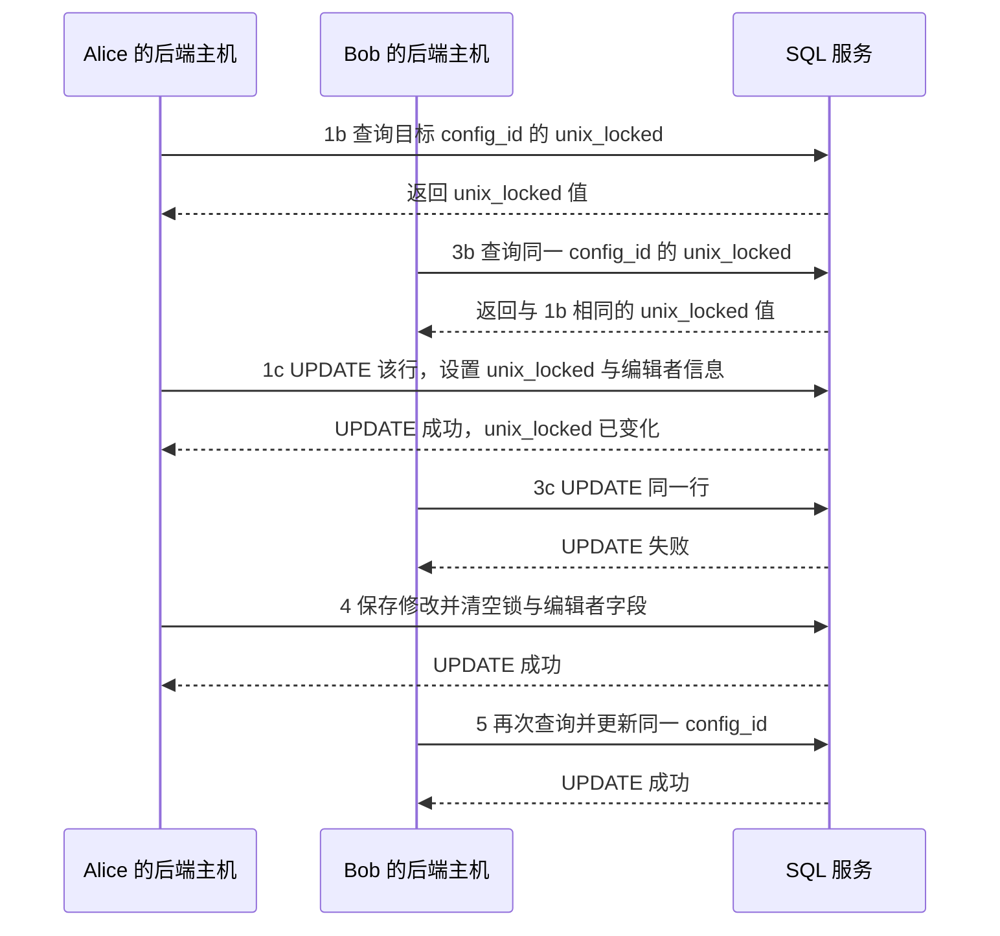

# 02 第 2 章：典型的系统设计面试流程（A Typical System Design Interview Flow）

本章包括：

- 澄清系统需求并讨论可能的权衡
- 起草系统的 API 规范
- 设计系统的数据模型
- 讨论日志、监控、告警、搜索等关注点
- 复盘面试体验并评估公司

本章将讨论一些在 1 小时系统设计面试中必须遵循的原则。等你读完整本书之后，请再回头看这份清单。在面试中，请始终记住以下原则：

1. 澄清功能需求和非功能需求（参见第 3 章），例如 QPS（queries per second，每秒查询数）和 P99 时延。询问面试官，是希望从一个简单系统开始再逐步扩容并增加特性，还是一开始就直接设计成可扩展系统。
2. 一切都是权衡。系统几乎不存在“纯收益、零代价”的特性。任何为了提升可扩展性、一致性或时延表现而增加的新内容，也会带来更高的复杂度和成本，并要求额外考虑安全、日志、监控和告警。
3. 主导面试。持续保持面试官的兴趣，讨论他们关心的内容，并不断主动提出可讨论的话题。
4. 注意时间。正如前文所说，1 小时里可讨论的内容远远多于你真正能讲完的内容。
5. 讨论日志、监控、告警与审计。
6. 讨论测试性与可维护性，包括可调试性、复杂度、安全与隐私。
7. 考虑并讨论整个系统以及每个组件中的优雅降级与故障处理，包括静默故障和伪装故障。错误可能是静默的。不要信任任何东西：不要信任外部系统，也不要信任内部系统，甚至不要完全信任你自己的系统。
8. 画系统图、流程图和时序图，把它们作为讨论时的可视化辅助工具。
9. 系统永远都可以继续改进，永远还有更多内容可讨论。

任何一个系统设计面试题都可以讨论很多个小时。你必须通过主动建议不同讨论方向并询问面试官往哪个方向走，来聚焦某些方面。你只有不到 1 小时来传达或暗示你知识面的完整程度。你必须具备这样一种能力：既能考虑并评估相关细节，又能在高层架构与组件关系和低层实现细节之间流畅切换。如果你忘了提到某件事，或者忽略了它，面试官通常会默认你并不了解。人们应当与其他工程师一起练习系统设计题讨论，从而提升这门技艺。知名公司会面试大量准备充分的候选人，而每一个通过的人，通常都经过了大量训练，并且能流利使用系统设计的语言。

本节中的题目讨论，是你在系统设计面试中展开各种话题时可采用的方法示例。其中许多主题都很常见，因此不同讨论之间会有一些重复。请留意行业常用术语的使用方式，以及在时间受限的讨论里，许多句子是如何承载大量有效信息的。

下面这个列表只是粗略指南。系统设计讨论是动态的，我们不应期待它严格按此顺序推进：

1. 澄清需求，讨论权衡。
2. 起草 API 规范。
3. 设计数据模型，并讨论可能的分析需求。
4. 讨论故障设计、优雅降级、监控与告警。其他主题还包括瓶颈、负载均衡、消除单点故障、高可用、灾难恢复和缓存。
5. 讨论复杂度与权衡、维护与下线流程，以及成本。

## 2.1 澄清需求并讨论权衡（Clarify requirements and discuss tradeoffs）

在面试中，澄清题目的需求，是第一项必须完成的检查点。第 3 章会详细说明讨论功能需求和非功能需求的重要性与具体方式。

本章最后会给出一份关于如何在面试中讨论需求的通用指南。在第 2 部分的每一道题里，我们都会实践这个步骤。我们强调：你要始终记得，自己的具体面试情境可能是独特的，必要时应偏离这份指南。

功能需求的讨论最好控制在 10 分钟以内，因为这已经占了面试时间的至少 20%。但与此同时，对细节的关注依然非常关键。不要把功能需求一条一条地记下来再逐条讨论，那样你可能会漏掉一些需求。更好的方式是：先快速头脑风暴并草草记下一份功能需求清单，然后再围绕它展开讨论。你可以告诉面试官，你希望确保已经覆盖所有关键需求，同时也注意控制时间。

我们可以先用 30 秒到 1 分钟讨论系统的整体目的，以及它如何契合更高层级的业务需求。还可以简要提到几乎所有系统都会有的一些端点，例如健康检查端点、注册和登录。超过“简要”程度的讨论，通常都不太可能属于本场面试的范围。接着，我们再讨论一些常见功能需求的细节：

1. 考虑用户类别 / 角色：
   a. 谁会使用这个系统？如何使用？讨论并草草记下用户故事。考虑不同用户类别的组合，例如手工使用（manual）与程序化使用（programmatic）、消费者（consumer）与企业（enterprise）。例如，手工/消费者组合，指消费者通过移动端或浏览器应用向我们发起请求；程序化/企业组合，则指其他服务或公司向我们发起请求。  
   b. 技术用户还是非技术用户？是为开发者设计平台/服务，还是为非开发者设计？技术类示例包括类似 key-value store 的数据库服务、用于一致性哈希等目的的库，或者分析服务。非技术类题目通常是“设计一个知名消费者应用”。在这类题目中，要讨论所有类型的用户，而不仅仅是使用该应用的非技术消费者。  
   c. 列出用户角色（例如买家、卖家、发帖者、浏览者、开发者、经理）。  
   d. 注意数字。每一项功能需求和非功能需求都必须带有数字。要拉取新闻条目？多少条？时间范围多大？是毫秒、秒、小时还是天？  
   e. 用户之间，或者用户与运营人员之间，是否存在通信？  
   f. 询问是否需要 i18n 和 L10n 支持、本国或区域语言、邮政地址、价格等；也要询问是否需要支持多币种。
2. 基于用户类别，澄清可扩展性要求。估算日活跃用户数，再估算每日或每小时请求量。例如，如果一个搜索服务有 10 亿日活用户，每人提交 10 次搜索请求，那么每天就是 100 亿次请求，也就是每小时约 4.2 亿次请求。
3. 哪些数据应当对哪些用户可见？讨论认证与授权的角色和机制。讨论 API 端点响应体的内容。然后再讨论数据的读取频率——是实时、月报，还是其他频率？
4. 搜索。有哪些可能涉及搜索的用例？
5. 分析（analytics）是典型需求。讨论可能的机器学习需求，包括对 A/B testing 或 multi-armed bandit 等实验能力的支持。关于这些主题的入门介绍，可参见：`https://www.optimizely.com/optimization-glossary/ab-testing/` 和 `https://www.optimizely.com/optimization-glossary/multi-armed-bandit/`。
6. 草草写下伪代码形式的函数签名（例如 `fetchPosts(userId)`）来表示“获取某个用户的帖子”，并把它们与用户故事对应起来。与面试官讨论哪些需求是必须的，哪些属于范围之外。

永远要问一句：“还有其他用户需求吗？”并主动头脑风暴各种可能性。不要让面试官替你思考。不要给面试官留下这样的印象：你希望他们替你思考，或者希望他们把所有需求都告诉你。

需求非常微妙，即便一个人自认为已经澄清了，也经常会漏掉细节。软件开发之所以遵循敏捷实践，其中一个原因就是：需求往往很难，甚至不可能，被完全传达清楚。在开发过程中，人们会不断发现新的需求或限制。随着经验增长，你会逐渐学会该问哪些澄清性问题。

你要表现出自己意识到：系统未来还可以扩展以服务更多功能需求，并主动头脑风暴这些可能性。

面试官不应期待你掌握所有领域知识，因此你可能想不到那些需要特定领域知识的需求。这没关系。你真正需要展示的是：批判性思维、对细节的关注、谦逊，以及学习意愿。

接下来，再讨论非功能需求。关于非功能需求的详细说明，请参见第 3 章。我们可能需要把系统设计成能服务全世界人口，并假设产品拥有完整的全球市场支配力。你应向面试官确认，是否需要立即为可扩展性而设计。如果不需要，他们也许更关心你如何考虑复杂的功能需求，这同样包括你将如何设计数据模型。讨论完需求之后，我们就可以进入系统设计讨论。

## 2.2 起草 API 规范（Draft the API specification）

基于功能需求，确定系统用户期望从系统接收什么数据，以及会向系统发送什么数据。通常我们只会花不到 5 分钟，草草写出 GET、POST、PUT、DELETE 端点草稿，包括 path 参数和 query 参数。一般不建议在端点起草上停留太久。你可以告诉面试官，在 50 分钟里还有很多内容要讨论，因此这里不会花太多时间。

你应该已经在前面澄清了功能需求，才开始写这些端点；到这里时，已经过了适合再去澄清功能需求的阶段，除非你发现自己漏掉了什么。

接下来，提出一份 API 规范，说明它如何满足功能需求，再简要讨论，并识别你可能遗漏的功能需求。

### 2.2.1 常见 API 端点（Common API endpoints）

这些是大多数系统都会有的常见端点。你可以快速带过这些端点，并说明它们不在本题讨论范围内。你几乎不可能需要详细讨论它们，但展示你既关注细节又有全局视角，永远不会吃亏。

**Health**

`GET /health` 是一个测试端点。返回 4xx 或 5xx，说明系统在生产环境中出了问题。它可能只做一个简单的数据库查询，也可能返回健康信息，例如磁盘空间、其他多个端点的状态以及应用逻辑检查结果。

**注册与登录（认证）**

应用用户通常需要先注册（`POST /signup`）并登录（`POST /login`），然后才能向应用提交内容。OpenID Connect 是常见认证协议，附录 B 会讨论它。

**用户与内容管理**

我们可能需要提供获取、修改和删除用户信息的端点。许多消费者应用也会提供渠道，让用户标记 / 举报不当内容，例如违法内容或违反社区准则的内容。

## 2.3 用户与数据之间的连接与处理（Connections and processing between users and data）

在 2.1 节中，我们讨论了用户类型、数据类型，以及哪些数据应对哪些用户可见。在 2.2 节中，我们设计了供用户对数据执行 CRUD（create、read、update、delete）的 API 端点。现在，我们可以画图，来表示用户与数据之间的连接，并说明各类系统组件以及它们之间发生的数据处理。

阶段 1：

- 画一个框表示每一类用户。
- 画一个框表示每一个满足功能需求的系统。
- 画出用户与系统之间的连接。

阶段 2：

- 拆分请求处理与存储。
- 基于非功能需求创建不同设计，例如实时一致性与最终一致性。
- 考虑共享服务。

阶段 3：

- 把系统进一步拆分为组件，这些组件通常会是库或服务。
- 画出它们之间的连接。
- 考虑日志、监控和告警。
- 考虑安全。

阶段 4：

- 给出系统设计总结。
- 给出任何新增需求。
- 分析容错性。每个组件会出什么问题？网络延迟、不一致、缺乏线性一致性等。我们能做什么来预防和 / 或缓解这些情况，并提升该组件以及整个系统的容错能力？

关于 C4 model（用于把系统按不同抽象层级进行分解的一种系统架构图技术）的概览，请参见附录 C。

## 2.4 设计数据模型（Design the data model）

我们应当先讨论：是在从零开始设计数据模型，还是要使用现有数据库。多个服务共享数据库，通常被认为是一种反模式；因此，如果要使用现有数据库，我们应当构建更多面向程序化客户的 API 端点，并根据需要构建到其他数据库之间的批式和 / 或流式 ETL 管道。

共享数据库常见的问题包括：

- 多个服务在同一张表上的查询会竞争资源。某些查询，例如对大量行执行 `UPDATE`，或者包含其他长时间运行查询的事务，可能会长时间锁表。
- Schema migration 会更加复杂。某个对一个服务有利的 schema migration，可能会破坏其他服务的 DAO 代码。这意味着，即使工程师只负责某一个服务，也需要及时了解其他自己并不维护的服务在业务逻辑底层细节、甚至源代码上的变化。这通常会低效地消耗他们的时间，也会消耗那些做出这些改动、还需要向他们及其他人解释这些变动的工程师的时间。更多时间会花在编写和阅读文档、演示文稿以及开会上。各团队还可能需要很久才能就某项 schema migration 达成一致，这也会低效消耗工程时间。其他团队甚至可能无法达成一致，或者只能在某些改动上妥协，这会引入技术债，并降低整体生产力。
- 共享同一套数据库的多个服务，会被限制只能使用这些既定数据库技术（例如 MySQL、HDFS、Cassandra、Kafka 等），无论这些技术是否真的适合各自服务的用例。服务无法选择最适合自身需求的数据库技术。

这意味着，无论是哪种情况，我们通常都需要为自己的服务重新设计一套 schema。

我们可以以前一节中讨论过的 API 端点请求体和响应体为起点设计 schema，让每个请求 / 响应体尽量贴近某张表的 schema；对于同一路径的读请求（GET）与写请求（POST、PUT），我们通常还会把它们对应到同一张表中。

### 2.4.1 多个服务共享数据库的弊端示例（Example of the disadvantages of multiple services sharing databases）

如果我们在设计一个电商系统，可能会希望有一个服务能获取业务指标数据，例如过去七天的订单总数。我们的团队发现：如果没有一套关于业务指标定义的事实来源（source of truth），不同团队会以不同方式计算指标。例如，订单总数是否包含已取消订单或已退款订单？“七天前”的截止时间应使用哪个时区？“最近七天”是否包含今天？多个团队为了澄清指标定义而进行的沟通开销，既昂贵又容易出错。

虽然计算业务指标使用的是 Orders 服务中的订单数据，我们仍决定成立一个新团队来创建专门的 Metrics 服务，因为指标定义可以独立于订单数据而变化。

Metrics 服务会依赖 Orders 服务来获取订单数据。一个指标请求的处理过程如下：

1. 取回该指标。
2. 从 Orders 服务取回相关数据。
3. 计算指标。
4. 返回指标值。

如果两个服务共享同一个数据库，那么指标计算就会在 Orders 服务的表上执行 SQL 查询。这样一来，schema migration 就会更复杂。例如，Orders 团队决定：Order 表的用户在其上执行了太多大查询。经过分析，团队发现，对最近订单的查询更重要，并且比查询旧订单更需要更低时延。因此，团队提出：Order 表只保留最近一年的订单，较旧订单迁移到 Archive 表。Order 表可以分配更多 followers / read replicas，而 Archive 表则不需要那么多。

这样一来，Metrics 团队就必须理解这项变更，并把指标计算改成同时在两张表上进行。Metrics 团队可能会反对这项变更，于是变更无法推进，组织层面通过“加快最近订单查询”获得的生产力收益也就无法实现。

如果 Orders 团队希望把 Order 表迁移到 Cassandra，以利用其低写入时延，而 Metrics 服务则因为简单、写入率低而继续使用 SQL，那么这两个服务就不可能再共享同一个数据库。

### 2.4.2 避免并发用户更新冲突的一种可能技术（A possible technique to prevent concurrent user update conflicts）

很多场景中，客户端应用会允许多个用户编辑同一份共享配置。如果某项共享配置的编辑对用户而言并不简单（也就是，用户在提交前需要花几秒钟以上时间输入信息），那么如果多个用户同时编辑这份配置，并在保存时互相覆盖修改，就会造成很糟糕的用户体验。源代码管理可以避免源代码上的这种问题，但大多数其他场景涉及的是非技术用户，我们显然不能期待他们去学 git。

例如，一个酒店客房预订服务，可能要求用户花一些时间填写入住 / 退房日期、联系信息和支付信息，然后再提交预订请求。我们应确保多个用户不会把同一个房间重复预订。

另一个例子是配置推送通知内容。比如，我们公司可能会提供一个浏览器应用，供员工配置发送给 Beigel 应用（参见第 1 章）的推送通知。某条推送通知配置可能归一个团队所有。我们应确保多个团队成员不会同时编辑这条推送通知配置，然后互相覆盖修改。

避免并发更新的方法有很多种。本节展示其中一种可能做法。

为防止这种情况，我们可以在配置被编辑时对其加锁。我们的服务里可能有一张 SQL 表来存储这些配置。我们可以给相关 SQL 表增加一个时间戳列，命名为 `unix_locked`，再增加字符串列 `edit_username` 和 `edit_email`。（这种 schema 设计并不规范化，但在实践中通常是可以接受的。你可以询问面试官，他们是否坚持使用规范化 schema。）

然后，我们可以暴露一个 PUT 端点，让 UI 在用户点击编辑图标或按钮、准备开始编辑查询字符串时通知后端。参见图 2.1，下面是一组可能发生的步骤：两个用户几乎同时决定编辑同一条推送通知配置。某个用户可以为该配置加锁一段时间（例如 10 分钟），而另一个用户会发现它已被锁定：

1. Alice 和 Bob 都在 Notifications 浏览器应用里查看同一条推送通知配置。Alice 决定把标题从“Celebrate National Bagel Day!”改成“20% off on National Bagel Day!”，于是她点击了 Edit 按钮。接下来会发生：
   a. 这个点击事件会发送一个 PUT 请求，把她的用户名和邮箱发给后端。后端的负载均衡器会把该请求分配给某台主机。  
   b. Alice 所在的后端主机会依次执行两条 SQL 查询。首先，它要确定当前的 `unix_locked` 时间：

   ```sql
   SELECT unix_locked FROM table_name WHERE config_id = {config_id}
   ```

   c. 后端检查该配置当前的锁是否已经过期（例如距离上次编辑开始时间已超过 12 分钟；这里包含 2 分钟缓冲，以防第 2 步中的倒计时启动较晚，也因为主机时钟无法完全同步）。如果锁已过期，它就更新该行以表示锁定该配置。`UPDATE` 查询会把 `edit_start` 设置为后端当前的 UNIX 时间，并用 Alice 的用户名和邮箱覆盖 `edit_username` 与 `edit_email`。我们仍需要把 `unix_locked` 放进过滤条件，以防别的用户在这期间已经改过它。`UPDATE` 查询会返回一个布尔值，表示是否成功执行：

   ```sql
   UPDATE table_name SET unix_locked = {new_time}, edit_username = {username},
        edit_email = {email} WHERE config_id = {config_id} AND unix_locked =
        {unix_locked}
   ```

   d. 如果 `UPDATE` 查询成功，后端就向 UI 返回 200 成功，响应体类似 `{"can_edit": "true"}`。
2. UI 打开一个页面，让 Alice 进行编辑，并显示一个 10 分钟倒计时。她删掉旧标题，开始输入新标题。
3. 在步骤 1b 和 1c 的 SQL 查询之间，Bob 也决定编辑这个配置：
   a. 他点击 Edit 按钮，触发 PUT 请求，该请求被分配到另一台主机。  
   b. 第一条 SQL 查询返回的 `unix_locked` 值与步骤 1b 相同。  
   c. 第二条 SQL 查询紧接在 1c 的查询之后发送。SQL DML 查询会被发往同一台主机（见 4.3.2 节），这意味着它必须等 1c 中的查询执行完才能运行。当它真正执行时，`unix_locked` 的值已经变了，因此这一行不会被更新，SQL 服务会向后端返回 `false`。后端再向 UI 返回 200 成功，响应体类似 `{"can_edit": "false", "edit_start": "1655836315", "edit_username": "Alice", "edit_email": "alice@beigel.com"}`。  
   d. UI 会计算 Alice 还剩多少分钟，并显示一个横幅通知：“Alice（alice@beigel.com）正在编辑。请在 8 分钟后重试。”
4. Alice 完成编辑并点击 Save 按钮。这会触发一个 PUT 请求到后端，保存她编辑后的值，并清空 `unix_locked`、`edit_start`、`edit_username` 和 `edit_email`。
5. Bob 再次点击 Edit 按钮，这时他就可以开始编辑了。如果 Bob 是在 `edit_start` 之后至少 12 分钟再点击 Edit，他同样也能开始编辑。如果 Alice 在倒计时结束前没有保存修改，UI 会显示通知，告知她已无法继续保存这些更改。



*图 2.1 使用 SQL 的锁机制示意图。这里有两个用户请求更新同一条 SQL 行，该行对应同一个配置 ID。Alice 所在主机先获取目标配置 ID 的 `unix_locked` 时间戳值，然后发送 `UPDATE` 查询来更新该行，因此 Alice 锁住了这条特定配置。紧接着，在她的主机于步骤 1c 发出该查询之后，Bob 所在主机也发送了 `UPDATE` 查询，但由于 Alice 主机已经修改了 `unix_locked` 的值，Bob 的 `UPDATE` 查询无法成功执行，因此 Bob 无法锁住该配置 ID。*

如果 Bob 是在 Alice 已经开始编辑之后才打开这条推送通知配置页面，会怎样？此时一种可能的 UI 优化是：禁用 Edit 按钮，并显示横幅通知，让 Bob 知道 Alice 正在编辑，因此他无法修改。为了实现这个优化，我们可以把这三个字段加入该推送通知配置的 GET 响应中，由 UI 处理这些字段，并把 Edit 按钮渲染为“enabled”或“disabled”。

关于使用 Jakarta Persistence API 和 Hibernate 进行版本跟踪的概览，可参见：`https://vladmihalcea.com/jpa-entity-version-property-hibernate/`。

## 2.5 日志、监控与告警（Logging, monitoring, and alerting）

关于日志、监控与告警，已经有很多书在讨论。本节将讲述面试中必须提到的关键概念，并深入一些面试官可能期待你展开的具体内容。永远不要忘记向面试官提到监控。

### 2.5.1 监控的重要性（The importance of monitoring）

监控对任何系统都至关重要，因为它为我们提供了观察客户体验的可见性。我们需要识别 bug、退化、意外事件，以及系统在满足当前和未来可能的功能与非功能需求方面的其他薄弱点。

Web 服务随时都可能出故障。我们可以按紧急程度、以及需要多快介入处理来对故障分类。高紧急度故障必须立刻处理；低紧急度故障则可以等我们完成更高优先级任务后再处理。究竟定义多少个紧急级别，取决于我们的需求和裁量。

如果我们的服务是其他服务的依赖，那么每当那些服务出现退化时，它们的团队都可能把我们的服务视为潜在根因。因此，我们需要一套日志和监控体系，使我们能轻松排查可能的退化，并回答他们的问题。

### 2.5.2 可观测性（Observability）

这就引出了可观测性这一概念。系统的可观测性，是衡量它“被良好埋点到何种程度，以及我们能多容易弄清它内部发生了什么”的指标（John Arundel & Justin Domingus, *Cloud Native DevOps with Kubernetes*, p. 272, O’Reilly Media Inc, 2019）。没有日志、指标和链路追踪，我们的系统就是不透明的。比如，我们很难知道一项本意是把某个端点 P99 降低 10% 的代码改动，在生产环境里到底效果如何。如果 P99 实际只降了一点点，或者降得远超预期，我们都应能从埋点数据里提炼出相关洞见，理解为什么预测不准确。

关于监控“四个黄金信号”的详细讨论，可参见 Google 的 SRE 书：`https://sre.google/sre-book/monitoring-distributed-systems/#xref_monitoring_golden-signals`。

1. **Latency**——我们可以为超过服务级别协议（SLA）的时延设置告警，例如超过 1 秒。这个 SLA 可以定义成：任意单个请求超过 1 秒就告警；也可以定义成某个滑动窗口（例如 5 秒、10 秒、1 分钟、5 分钟）上的 P99 超标时告警。
2. **Traffic**——通常用 HTTP requests per second 来衡量。我们可以为各个端点配置流量过高时触发的告警，并基于压测得出的负载上限设置合适阈值。
3. **Errors**——对必须立即处理的 4xx 或 5xx 响应码配置高紧急度告警。对于审计失败，也可以触发低紧急度（或按需求设为高紧急度）的告警。
4. **Saturation**——取决于系统的约束是 CPU、内存还是 I/O，我们可以设定不应超出的利用率目标。当达到利用率目标时触发告警。另一个例子是存储利用率：如果基于文件或数据库使用情况推断，存储会在几小时或几天内耗尽，就应触发告警。

监控与告警的三种工具是：指标（metrics）、仪表盘（dashboards）和告警（alerts）。指标是我们测量的变量，例如错误数、时延或处理时长。仪表盘是服务核心指标的汇总视图。告警是当服务发生某种问题时，发送给服务负责人的通知。指标、仪表盘和告警，都是通过处理日志数据生成的。我们还可以提供统一的浏览器 UI，来更方便地创建和管理这些内容。

CPU 利用率、内存利用率、磁盘利用率和网络 I/O 这类操作系统指标，也可以纳入仪表盘，用来按需调整服务的硬件资源，或用来发现内存泄漏。

在后端应用里，框架可能默认记录每个请求，或者提供简单注解，让你为请求方法打开日志。我们还可以在应用代码中插入日志语句，甚至手工记录某些变量的值，以帮助理解客户请求是如何被处理的。

Scholl 等人（Boris Scholl, Trent Swanson & Peter Jausovec, *Cloud Native: Using Containers, Functions, and Data to build Next-Generation Applications*, O’Reilly, 2019, p. 145）提出了如下日志通用考虑：

- 日志条目应当结构化，便于工具与自动化解析。
- 每条日志应包含唯一标识符，用于跨服务追踪请求，并便于在用户与开发者之间共享。
- 日志条目应当小而易读，并且真正有用。
- 时间戳应使用统一时区和统一格式。若同一份日志中混用不同时区与时间格式，就会难以阅读或解析。
- 对日志条目进行分类，至少从 `debug`、`info`、`error` 开始。
- 不要记录密码、连接串等隐私或敏感信息。常见统称是 Personally Identifiable Information（PII）。

大多数服务都会有如下常见日志。许多请求级日志工具的默认配置就会记录这些细节：

- 主机日志（host logging）：
  - 主机 CPU 与内存利用率
  - Network I/O
- 请求级日志（request-level logging）会捕获每个请求的细节：
  - Latency
  - 请求是谁在什么时候发起的
  - 函数名与行号
  - 请求路径、query 参数、headers、body
  - 返回状态码与返回体（包括可能的错误信息）

在具体系统中，我们可能会特别关注某些用户体验，例如错误。我们可以在应用内部添加日志语句，并围绕这些用户体验配置定制化的指标、仪表盘与告警。例如，为了聚焦应用 bug 造成的 5xx 错误，我们可以创建处理请求参数、返回状态码和错误信息等细节的指标、仪表盘和告警。

我们还应记录那些能体现系统是否满足其独特功能与非功能需求的事件。例如，如果我们构建了缓存，就希望记录 cache faults、hits 和 misses，对应的指标中也应包含 fault、hit、miss 的计数。

在企业系统中，我们甚至可能希望给用户开放一部分监控能力，或者专门为用户构建监控工具。例如，客户可以创建仪表盘来追踪自己请求的状态，并按 URL 路径等类别筛选和聚合指标与告警。

我们也应讨论如何应对可能的静默故障。这些静默故障可能来自应用代码 bug，或者库、其他服务等依赖，导致实际应返回 4xx / 5xx 的情况却返回了 2xx；这也可能说明你的服务在日志与监控方面还有改进空间。

除了针对单个请求做日志、监控和告警，我们还可以构建批式和流式审计作业，用来校验系统数据。这类似于对数据完整性做监控。如果这些作业的结果表明校验失败，就可以触发告警。这类系统会在第 10 章继续讨论。

### 2.5.3 响应告警（Responding to alerts）

负责开发和维护某个服务的团队，通常由少数几位工程师组成。这个团队通常会为服务的高紧急度告警设置值班表（on-call schedule）。值班工程师未必非常熟悉某条具体告警的根因，因此我们应准备一份 runbook，其中包含：告警清单、可能原因，以及用于定位与修复原因的步骤。

当我们编写 runbook 时，如果发现其中某些处理步骤其实只是一串容易复制粘贴的命令（例如重启主机），那么这些步骤就应直接被自动化到应用中，同时记录这些步骤被执行过的日志（Mike Julian, *Practical Monitoring*, chapter 3, O’Reilly Media Inc, 2017）。若明明可以自动化故障恢复却没有实现，这被称为 runbook abuse。如果某些 runbook 步骤只是运行命令去查看某些指标，那么这些指标就应直接展示在仪表盘中。

公司里可能还会有 Site Reliability Engineering（SRE）团队。这个团队由工程师组成，负责开发工具与流程，以确保关键服务拥有高可靠性，并且经常也承担这些关键服务的 on-call 工作。如果我们的服务获得了 SRE 覆盖，那么在部署前，它的某个构建版本可能必须满足 SRE 团队的准入标准。这些标准通常包括：高单元测试覆盖率、经过 SRE 审核的功能测试套件，以及一份覆盖充分、描述清楚并经 SRE 团队审阅通过的 runbook。

事故解决之后，我们应撰写 postmortem，说明发生了什么、为什么会发生，以及团队将如何确保不再重演。postmortem 应当是无责的（blameless），否则员工就可能试图淡化或隐藏问题，而不是正面解决问题。

通过识别“解决问题时采取的动作”中反复出现的模式，我们可以找出自动化缓解问题的方法，从而为系统引入自愈能力。

### 2.5.4 应用级日志工具（Application-level logging tools）

开源的 ELK（Elasticsearch、Logstash、Beats、Kibana）套件，以及付费服务 Splunk，是常见的应用级日志工具。Logstash 用于收集和管理日志。Elasticsearch 是搜索引擎，适合做日志的存储、索引与搜索。Kibana 用于日志的可视化和仪表盘，以 Elasticsearch 作为数据源，并为用户提供日志搜索能力。Beats 于 2015 年加入该体系，作为轻量级数据传输器，可实时把数据发送到 Elasticsearch 或 Logstash。

在本书中，只要我们提到记录某个事件，默认就意味着：把该事件记录到组织内部供其他服务共用的统一 ELK 服务中。

监控工具有很多，既可能是专有软件，也可能是 FOSS（Free and Open-Source Software，自由开源软件）。本书只会简要讨论其中少数几种；全面的清单、详细说明与比较都超出了本书范围。

这些工具在以下特征上存在差异：

- 功能：有的工具提供日志、监控、告警、仪表盘中的全部能力，有的只提供其中一部分。
- 对不同操作系统以及除服务器以外设备（如负载均衡器、交换机、调制解调器、路由器、网卡等）的支持。
- 资源消耗。
- 流行度。它通常与“能否容易找到熟悉该系统的工程师”成正比。
- 开发者支持，例如更新频率。

它们还在一些主观特征上不同：

- 学习曲线。
- 手工配置难度，以及新用户犯错的可能性。
- 与其他软件和服务的集成难易度。
- bug 的数量与严重程度。
- 用户体验（UX）。有些工具带浏览器或桌面 UI 客户端，不同用户可能会偏好不同的 UI 体验。

常见 FOSS 监控工具包括：

- **Prometheus + Grafana**——Prometheus 负责监控，Grafana 负责可视化和仪表盘。
- **Sensu**——一个使用 Redis 存储数据的监控系统。我们可以把 Sensu 配置为向第三方告警服务发送告警。
- **Nagios**——一个监控与告警系统。
- **Zabbix**——一个自带监控仪表盘工具的监控系统。

专有工具包括 Splunk、Datadog 和 New Relic。

时间序列数据库（TSDB）是一类针对时间序列数据存储与查询进行优化的系统，例如日志这类持续写入的数据。大多数查询通常集中在最近数据上，因此旧数据价值较低。于是，我们可以通过为 TSDB 配置 down sampling 来节省存储：把旧数据按预定义区间计算平均值，只保留这些平均值并删除原始数据。数据保留周期和分辨率取决于我们的需求与预算。

为了进一步降低旧数据的存储成本，我们还可以压缩旧数据，或者使用磁带、光盘等廉价存储介质。关于这种做法的例子，可参见：

- `https://www.zdnet.com/article/could-the-tech-beneath-amazons-glacier-revolutionise-data-storage/`
- `https://arstechnica.com/information-technology/2015/11/to-go-green-facebook-puts-petabytes-of-cat-pics-on-ice-and-likes-windfarming/`

一些 TSDB 示例包括：

- **Graphite**——常用于记录操作系统指标（尽管它也能监控网站、应用等其他场景），通常搭配 Grafana Web 应用进行可视化。
- **Prometheus**——同样通常与 Grafana 搭配可视化。
- **OpenTSDB**——基于 HBase 的分布式、可扩展 TSDB。
- **InfluxDB**——用 Go 编写的开源 TSDB。

Prometheus 是围绕时间序列数据库构建的开源监控系统。Prometheus 会从目标 HTTP 端点拉取指标，而 Pushgateway 会把告警推送给 Alertmanager；我们可以再把 Alertmanager 配置为推送到邮件、PagerDuty 等各种通道。我们还可以使用 Prometheus query language（PromQL）来探索指标并绘制图表。

Nagios 是一个偏传统的 IT 基础设施监控工具，聚焦服务器、网络与应用监控。它拥有数百个第三方插件、Web 界面，以及高级可视化仪表盘工具。

### 2.5.5 流式与批式的数据质量审计（Streaming and batch audit of data quality）

数据质量（data quality）是一个非正式术语，指确保数据真实反映其所指代的现实对象，并且能够用于其预期用途。例如，如果某张由 ETL 作业更新的表缺少了该作业本应产生的一些行，那么这份数据的质量就是差的。

我们可以持续地和 / 或周期性地审计数据库表，以发现数据质量问题。实现方式是：定义流式与批式 ETL 作业，来校验最近新增或修改的数据。

这对检测静默错误尤其有用。所谓静默错误，是指早期校验步骤未能发现的错误，例如服务请求处理过程中那些本应进行的校验没有把错误识别出来。

我们还可以把这个概念进一步扩展成某种“共享数据库批式审计服务”，第 10 章会讨论它。

### 2.5.6 使用异常检测来识别数据异常（Anomaly detection to detect data anomalies）

异常检测（anomaly detection）是机器学习中的一个概念，用于识别不寻常的数据点。完整的机器学习概念说明超出了本书范围。本节只会简要描述：如何利用异常检测找出异常数据点。它既有助于保障数据质量，也有助于提炼分析洞见，因为某个指标的异常上升或下降，可能意味着数据处理出现问题，或者市场环境正在发生变化。

在最基本的形式下，异常检测就是把持续数据流输入某个异常检测算法。等它处理完一定数量的数据点后——在机器学习里，这些数据点称为训练集（training set）——该算法就会建立一个统计模型。这个模型的作用，是接收一个数据点，并给出它“是异常点”的概率。

然后，我们可以把这个模型应用到另一组称为验证集（validation set）的数据点上，以验证模型是否有效。验证集中，每个数据点都已经被人工标注为正常或异常。最后，我们再用另一组人工标注的数据集——测试集（test set）——来量化该模型的准确性特征。

其中许多参数都可以人工调节，例如：采用哪种机器学习模型、三个数据集各自的数据点数量，以及模型参数本身，以调整 precision 与 recall 等特性。precision、recall 等机器学习概念超出了本书范围。

在实践中，这种用于检测数据异常的方法，实现、维护和使用的复杂度与成本都很高，因此通常只保留给关键数据集。

### 2.5.7 静默错误与审计（Silent errors and auditing）

静默错误可能来自某些 bug：即便实际发生了错误，端点却仍然返回 200 状态码。我们可以编写批式 ETL 作业，审计数据库中的最近变更，并在审计失败时触发告警。更多细节见第 10 章。

### 2.5.8 关于可观测性的延伸阅读（Further reading on observability）

- Michael Hausenblas，*Cloud Observability in Action*，Manning Publications，2023。一本关于如何将可观测性实践应用于云端 serverless 与 Kubernetes 环境的指南。
- `https://www.manning.com/liveproject/configure-observability`。一个实现服务模板中可观测性相关特性的动手课程。
- Mike Julian，*Practical Monitoring*，O’Reilly Media Inc，2017。一本专门讨论可观测性最佳实践、事故响应与反模式的书。
- Boris Scholl、Trent Swanson 和 Peter Jausovec，*Cloud Native: Using Containers, Functions, and Data to build Next-Generation Applications*，O’Reilly，2019。强调可观测性是云原生应用不可分割的一部分。
- John Arundel 和 Justin Domingus，*Cloud Native DevOps with Kubernetes* 第 15、16 章，O’Reilly Media Inc，2019。这两章讨论了云原生应用中的可观测性、监控与指标。

## 2.6 搜索栏（Search bar）

搜索是许多应用的常见特性。大多数前端应用都会为用户提供搜索栏，以便用户快速找到想要的数据。这些数据可以被索引到一个 Elasticsearch 集群中。

### 2.6.1 介绍（Introduction）

搜索栏是许多应用里的常见 UI 组件。它可以只是一个单独的搜索框，也可以包含其他用于过滤的前端组件。图 2.2 展示了一个搜索栏示例。

> [!NOTE] 图 2.2 Google 搜索栏示例，带有用于筛选结果的下拉菜单。图片来自 Google。

实现搜索的常见技术包括：

1. 在 SQL 数据库上使用 `LIKE` 运算符和模式匹配进行搜索。查询可能类似：`SELECT <column> FROM <table> WHERE Lower(<column>) LIKE "%Lower(<search_term>)%"`。
2. 使用像 `match-sorter`（`https://github.com/kentcdodds/match-sorter`）这样的库。它是一个 JavaScript 库，接收搜索词并对记录进行匹配和排序。这种方案需要在每个客户端应用里分别实现。对于最多几 GB 文本数据（即最多数百万条记录）来说，这种方案是可行且技术上较简单的。Web 应用通常从后端下载数据，而这些数据通常不太可能大于几 MB，否则应用就无法扩展到数百万用户。移动应用可能会本地存储数据，因此理论上可能达到 GB 级，但在数百万台手机之间同步这些数据，实践上往往不现实。
3. 使用像 Elasticsearch 这样的搜索引擎。这个方案可扩展，并且能处理 PB 级数据。

第一种技术有很多局限，只应作为一个很快会被丢弃或被替换为正规搜索引擎的临时实现。其缺点包括：

- 难以定制搜索查询。
- 不具备 boosting、weight、fuzzy search，或 stemming、tokenization 等文本预处理能力。

这里的讨论默认单条记录很小，也就是文本记录而不是视频记录。对视频记录来说，索引和搜索并不是直接针对视频数据本身，而是针对其伴随的文本元数据。搜索引擎内部的索引与搜索实现细节，不在本书讨论范围内。

在第 2 部分的问题讨论中，我们会引用这些技术，但会把更多注意力放在使用 Elasticsearch 上。

### 2.6.2 使用 Elasticsearch 实现搜索栏（Search bar implementation with Elasticsearch）

一个组织可以拥有一套共享的 Elasticsearch 集群，为其多个服务提供搜索能力。本节首先描述一个基本的 Elasticsearch 全文搜索查询，然后再说明：如果已经有一个 Elasticsearch 集群，如何把它加到你的服务中。本书不会讨论 Elasticsearch 集群的搭建，也不会详细解释 Elasticsearch 的概念与术语。我们的示例将沿用第 1 章中的 Beigel 应用。

若要提供支持模糊匹配的基础全文搜索，我们可以把搜索栏连接到一个 GET 端点，该端点把查询转发到 Elasticsearch 服务。Elasticsearch 查询是在某个 Elasticsearch index 上执行的（它有点类似关系型数据库中的 database）。如果 GET 查询返回 2xx 响应，并带回一个搜索结果列表，那么前端就加载结果页，把这个列表展示给用户。

例如，假设我们的 Beigel 应用提供了搜索栏，而用户搜索词是 `sesame`，则 Elasticsearch 请求可能类似以下两种方式之一。若搜索词放在 query 参数中，只能做精确匹配：

```text
GET /beigel-index/_search?q=sesame
```

我们也可以使用 JSON 请求体，从而使用完整的 Elasticsearch DSL；不过 DSL 超出了本书范围：

```text
GET /beigel-index/_search
{
  "query": {
    "match": {
      "query": "sesame",
      "fuzziness": "AUTO"
    }
  }
}
```

其中 `"fuzziness": "AUTO"` 用于支持 fuzzy（近似）匹配，它有很多用例，例如搜索词或搜索结果中存在拼写错误的情况。

结果会以按相关性递减排序的 JSON hits 数组返回。我们的后端可以把结果再传回前端，由前端解析并展示给用户。

### 2.6.3 Elasticsearch 的索引与导入（Elasticsearch index and ingestion）

创建 Elasticsearch index，包括：先导入用户在搜索栏发起搜索时希望被检索到的文档，然后执行索引操作。

我们可以通过周期性触发，或基于事件触发地调用 Bulk API 进行索引或删除请求，从而保持 index 更新。

要修改 index 的 mapping，一种方法是创建新 index，再删除旧 index。另一种方法是使用 Elasticsearch 的 reindexing 操作，但它开销较高，因为每次写请求之后，内部的 Lucene commit 操作都会同步发生：`https://www.elastic.co/guide/en/elasticsearch/reference/current/index-modules-translog.html#index-modules-translog`。

创建 Elasticsearch index，意味着所有希望可搜索的数据，都要额外存储到 Elasticsearch 的 document store 中，这会增加整体存储需求。也存在一些优化方式，例如只发送一部分数据用于建立索引。

表 2.1 给出了 SQL 与 Elasticsearch 术语之间的大致对应关系。

| SQL | Elasticsearch |
| --- | --- |
| Database | Index |
| Partition | Shard |
| Table | Type（已废弃且无替代） |
| Column | Field |
| Row | Document |
| Schema | Mapping |
| Index | 一切都是被索引的 |

*表 2.1 SQL 与 Elasticsearch 术语之间的大致映射。被映射的术语之间仍有差异，这张表不能机械照搬。它仅供具备 SQL 经验、但刚接触 Elasticsearch 的读者作为进一步学习的起点。*

### 2.6.4 用 Elasticsearch 替代 SQL（Using Elasticsearch in place of SQL）

Elasticsearch 可以像 SQL 一样使用。Elasticsearch 有 query context 与 filter context 的概念：`https://www.elastic.co/guide/en/elasticsearch/reference/current/query-filter-context.html`。按照官方文档，在 filter context 中，一个查询子句回答的是：“这个文档是否匹配这个查询条件？”答案只有是或否，不会计算分数；而在 query context 中，一个查询子句回答的是：“这个文档与这个查询条件匹配得有多好？”它不仅决定是否匹配，还会计算相关性分数。

本质上，query context 更接近 SQL 查询，而 filter context 更接近搜索。

如果用 Elasticsearch 代替 SQL，我们就可以同时支持 searching 和 querying，消除重复存储需求，也消除维护 SQL 数据库的额外开销。我见过一些服务直接只用 Elasticsearch 做数据存储。

不过，Elasticsearch 更常见的角色，是补充关系型数据库，而不是彻底取代它。它是一个 schemaless 数据库，没有规范化，也没有主键、外键等表间关系的概念。与 SQL 不同，Elasticsearch 也不提供 Command Query Responsibility Segregation（参见 1.4.6 节）或 ACID。

此外，Elasticsearch Query Language（EQL）是基于 JSON 的，写法冗长，也存在一定学习曲线。SQL 对非开发者也很熟悉，例如数据分析师和其他非技术人员。非技术用户通常一天之内就能学会基础 SQL。

Elasticsearch SQL 在 2018 年 6 月、随着 Elasticsearch 6.3.0 版本发布时引入（`https://www.elastic.co/blog/an-introduction-to-elasticsearch-sql-with-practical-examples-part-1` 和 `https://www.elastic.co/what-is/elasticsearch-sql`）。它支持所有常见过滤和聚合操作：`https://www.elastic.co/guide/en/elasticsearch/reference/current/sql-functions.html`。这是一个很有前景的发展方向。SQL 的统治地位非常稳固，但未来几年里，越来越多服务把 Elasticsearch 同时用于全部数据存储和搜索，也并非不可能。

### 2.6.5 在我们的服务中实现搜索（Implementing search in our services）

在面试里，在用户故事和功能需求讨论阶段主动提到搜索，能体现出你有客户导向意识。除非题目本身就是“设计一个搜索引擎”，否则你通常不太可能把搜索实现讨论到“创建 Elasticsearch 索引、导入与索引、执行搜索查询、处理搜索结果”之外。第 2 部分中的大多数题目，都会以这种粒度讨论搜索。

### 2.6.6 关于搜索的延伸阅读（Further reading on search）

下面是一些关于 Elasticsearch 与索引的更多资料：

- `https://www.elastic.co/guide/en/elasticsearch/reference/current/index.html`。Elasticsearch 官方指南。
- Madhusudhan Konda，*Elasticsearch in Action (Second Edition)*，Manning Publications，2023。一本讲如何使用 Elasticsearch 和 Kibana 开发完整搜索引擎的实践指南。
- `https://www.manning.com/livevideo/elasticsearch-7-and-elastic-stack`。关于 Elasticsearch 7 与 Elastic Stack 的课程。
- `https://www.manning.com/liveproject/centralized-logging-in-the-cloud-with-elasticsearch-and-kibana`。一个关于如何在云中使用 Elasticsearch 与 Kibana 做集中式日志的实操课程。
- `https://stackoverflow.com/questions/33858542/how-to-really-reindex-data-in-elasticsearch`。关于如何更新 Elasticsearch index 的一篇很好的 Stack Overflow 讨论，可作为官方指南的补充。
- `https://developers.soundcloud.com/blog/how-to-reindex-1-billion-documents-in-1-hour-at-soundcloud`。一个大规模 reindexing 操作的案例研究。

## 2.7 其他讨论（Other discussions）

当我们的系统设计已经满足既有需求时，就可以继续讨论其他话题。本节会简要介绍一些可能的延伸话题。

### 2.7.1 维护与扩展应用（Maintaining and extending the application）

我们已经在面试一开始讨论了需求，并据此建立了系统设计。接下来，我们还可以继续改进设计，让它更好地服务这些需求。

我们也可以把讨论扩展到其他潜在需求。任何在科技行业工作的人都知道，应用开发永远不会“完成”。永远会有新的、相互竞争的需求。用户会提交希望开发或调整的反馈。我们会监控 API 端点的流量和请求内容，以便做扩缩容与开发决策。关于该开发什么、维护什么、废弃什么、下线什么，也会一直存在讨论。以下都是可以继续讨论的主题：

- 维护问题可能在面试过程中已经被提到。哪些系统组件依赖某种技术（例如软件包）？哪些组件变化最快、维护成本最高？如果升级会带来 breaking changes，我们要如何处理？
- 未来可能需要开发的功能，以及相应系统设计。
- 未来也许不再需要的功能，以及如何优雅地弃用和下线它们。在这个过程中，应提供怎样程度的用户支持，以及如何以最佳方式提供？

### 2.7.2 支持其他类型的用户（Supporting other types of users）

我们可以把服务扩展为支持其他类型的用户。如果我们之前只聚焦了消费者或企业用户、手工用户或程序化用户，那么现在就可以讨论如何让系统支持剩下那些用户类别。我们可以讨论：扩展现有服务、构建新服务，以及这两种做法的权衡。

### 2.7.3 替代性架构决策（Alternative architectural decisions）

在面试前半段，我们本就应讨论过一些替代性架构决策。现在可以回过头来，更详细地重新审视它们。

### 2.7.4 可用性与反馈（Usability and feedback）

可用性（usability）衡量的是：用户能否高效、有效地使用系统来达成目标。它本质上是在评估用户界面是否易用。

我们可以定义可用性指标，记录所需数据，并实现一个批式 ETL 作业，定期计算这些指标，然后更新展示它们的仪表盘。可用性指标应根据我们期望用户如何使用系统来定义。

例如，如果我们做的是搜索引擎，那么我们希望用户能尽快找到自己想要的结果。一个可能的指标，是用户点击结果列表中条目的平均索引位置。我们希望结果按相关性递减排序，并假设：较低的平均点击位置，意味着用户在靠近列表顶部的地方就找到了目标结果。

另一个例子，是用户在使用应用时，需要支持部门协助的程度。理想情况下，应用应当是 self-service 的，也就是说，用户无需寻求帮助，就能完全在应用内完成自己的目标任务。如果应用有 help desk，我们可以用“每天或每周创建的 help desk 工单数”来衡量。工单数过高，说明应用并不具备良好的 self-service 能力。

可用性也可以通过用户调查来衡量。一个常见的可用性调查指标是 Net Promoter Score（NPS）。NPS 定义为：在 0 到 10 的评分范围内，把“愿意向朋友或同事推荐本应用”打 9 或 10 分的客户比例，减去打 6 分及以下的客户比例。

我们还可以在应用内部创建 UI 组件，让用户提交反馈。例如，Web UI 里可以放一个 HTML 链接或表单，供用户通过电子邮件提交反馈和评论。如果不想用电子邮件，例如担心垃圾邮件，我们也可以创建一个 API 端点来接收反馈，并把表单提交挂接到该端点。

良好的日志能力，将帮助我们把用户反馈与其实际操作日志对应起来，从而更容易复现 bug。

### 2.7.5 边界情况与新约束（Edge cases and new constraints）

面试接近尾声时，面试官可能会提出各种边界情况和新约束，其想象空间几乎没有上限。它们可能是新功能需求，也可能是把某些非功能需求推向极端。你可能已经在需求规划阶段预判过其中一些边界情况。我们可以讨论：能否通过权衡来满足这些要求，或者是否需要重构架构，以同时支持当前需求和这些新增需求。下面是一些例子。

**新功能需求：**

- 我们设计了一个支持信用卡支付的销售服务。如果支付系统需要支持各国不同的信用卡支付规则，该如何定制化？
- 如果还要支持 store credit 等其他支付类型呢？如果还需要支持 coupon code 呢？
- 我们设计了一个文本搜索服务。如何把它扩展到图像、音频和视频？
- 我们设计了一个酒店订房服务。如果用户需要换房怎么办？我们需要为他们找另一间可用房间，甚至可能是在另一家酒店。
- 如果我们决定给新闻流推荐服务加入社交网络特性，会怎样？

**可扩展性与性能：**

- 如果某个用户有一百万个 followers，或者其消息有一百万个接收者，怎么办？我们能接受很长的 P99 消息送达时间吗？还是需要为更高性能做设计？
- 如果我们需要对过去 10 年的销售数据执行精确审计，该怎么办？

**时延与吞吐：**

- 如果消息投递的 P99 必须控制在 500 ms 以内怎么办？
- 如果我们设计的是一个尚不支持 live streaming 的视频流服务，如何修改设计以支持直播？又如何支持在 100 亿台设备上同时播放 100 万路高分辨率视频流？

**可用性与容错：**

- 我们设计了一个不要求高可用的缓存，因为所有数据也都在数据库里。如果现在希望它至少对某些数据具备高可用，该怎么办？
- 如果我们的销售服务被用于高频交易，如何提升它的可用性？
- 你系统里的每个组件会如何失败？我们如何预防或缓解这些失败？

**成本：**

- 我们可能做出了一些代价很高的设计决策，以支持低时延和高性能。为了降低成本，我们可以牺牲什么？
- 如果需要，我们如何优雅地下线该服务？
- 我们是否考虑了可移植性（portability）？如何把应用迁移到云上（或迁出云）？为了提升可移植性，要付出什么代价？（更高的成本与复杂度。）关于可移植对象存储，可以考虑 MinIO：`https://min.io/`。

第 2 部分中的每一道题，都会在最后附上一份“进一步讨论的话题列表”。

### 2.7.6 云原生概念（Cloud-native concepts）

我们还可以讨论：如何通过云原生概念来满足非功能需求，例如微服务、service mesh 以及用于共享服务的 sidecar（Istio）、容器化（Docker）、编排（Kubernetes）、自动化（Skaffold、Jenkins），以及 Infrastructure as Code（Terraform、Helm）。这些主题的详细讨论超出了本书范围。有兴趣的读者可以轻松找到专门书籍或在线资料。

## 2.8 面试后的复盘与评估（Post-interview reflection and assessment）

随着你经历越来越多的面试，表现会不断提升。为了尽可能从每次面试中学到东西，你应在每场面试结束后尽快写一份 post-interview reflection。这样，你就能得到一份尽可能完整的书面记录，并据此写下对自己面试表现的诚实、批判性评估。

### 2.8.1 在面试结束后尽快写下复盘（Write your reflection as soon as possible after the interview）

为了方便这个过程，在面试结束时，你可以礼貌询问是否可以给你画的图拍照；但如果对方拒绝，不要坚持。你应随身带一支笔和一个纸质笔记本。如果不能拍照，就抓住最早的机会，把那些图凭记忆重新画到笔记本上。然后，尽可能写下你还能回忆起的细节。

你应在面试结束后尽快写下复盘，因为那时你仍能记住许多细节。面试结束后你也许很累，但如果这时放松下来并遗忘了本可用于提升未来面试表现的信息，反而是适得其反。立刻回家，或者回到酒店房间，把复盘写下来；在那里你能处于舒适、无干扰的环境。

你的复盘可以采用如下结构：

1. Header：
   a. 这场面试对应的公司和团队。  
   b. 面试日期。  
   c. 面试官姓名与职位。  
   d. 面试官提出的问题。  
   e. 你的图是来自拍照，还是凭记忆重画？  
2. 把整场面试划分为大约每 10 分钟一个区段。把你的图放到你开始画它们的对应区段中。你的照片可能包含多个图，因此你也许需要把它们拆分成单独图表。
3. 用你能回忆起的尽可能多的细节填充这些区段：
   a. 你说了什么。  
   b. 你画了什么。  
   c. 面试官说了什么。  
4. 写下你自己的评估与反思。你的评估可能并不精确，因此你应在实践中不断改进它们。
   a. 试着找到面试官的简历或 LinkedIn 资料。  
   b. 站在面试官的角度思考。你认为面试官为什么会选这个系统设计题？你觉得面试官期待你讲出什么？  
   c. 观察面试官的表情与肢体语言。对你的说法和画图，面试官看起来满意还是不满意？具体是哪些内容？面试官是否打断过你，或者是否对你说的某些内容表现出强烈兴趣、想继续深聊？具体是哪些内容？  
5. 在接下来的几天里，如果你又想起了更多细节，就把它们作为单独的新部分追加进去，以免无意中把不准确的信息混进你最初的复盘记录。

在写复盘时，你还可以问自己下面这些问题：

- 面试官围绕你的设计问了哪些问题？
- 面试官是否会用“你确定吗？”之类的话来质疑你的说法？
- 面试官没有告诉你什么？你觉得这是故意为之，想看看你会不会自己提到，还是面试官本身也缺乏这方面知识？

当你写完复盘和回忆记录后，给自己一个应得的休息。

### 2.8.2 写你的评估（Writing your assessment）

写评估的目的，是尽可能帮助你弄清：在面试中你展现出了哪些熟练之处，又暴露了哪些不足。你应在面试结束后的几天内开始撰写这份评估。

在开始研究面试题之前，先把你对以下几个方面的额外想法写下来。目的是让你意识到：在当前阶段，你对系统设计面试的知识边界在哪里、你的表达有多成熟。

### 2.8.3 你没有提到的细节（Details you didn’t mention）

在 50 分钟内，全面讨论一个系统是不可能的。你必须选择在这段时间里提哪些细节。基于你当前的知识（也就是在开始做研究之前），你觉得自己原本还可以补充哪些细节？当时为什么没有提？

你是有意识地选择不讨论这些内容吗？为什么？你是觉得这些细节不相关、过于底层，还是因为其他原因，决定把面试时间留给别的内容？

是因为时间不够吗？你本可以怎样更好地管理面试时间，从而挤出时间来讨论这些点？

是因为你不熟悉相关内容吗？既然现在你已经清楚意识到了这个短板，就去学习它，以便下次能更好地描述。

是因为你太累了吗？是因为睡眠不足吗？你前一天是否本应多休息，而不是临时抱佛脚塞入太多内容？或者是因为这场面试之前的几轮面试已经让你疲惫？你是否应该在这场面试前主动要求一个短暂休息？也许面试桌上一杯咖啡的香味，就能让你更清醒。

是因为你太紧张了吗？你是否被面试官、或情境中的其他因素震慑住了？去查一查网上那些关于如何保持冷静的资料。

你是否背负了自己或他人的期待压力？请记得把事情放回合理尺度上。好公司有很多。你也可能幸运地进入一家并不“显赫”、但未来业务表现极佳的公司，那时你的经验与期权都会变得很有价值。你知道自己是谦逊的，并且每天都在坚持学习；无论如何，这都只是未来众多经历中的一次，而你也决心从中尽可能多地学习，提升自己在未来许多场面试中的表现。

哪些细节大概率是错误的？这通常说明你对某些概念还不熟。去做研究，把这些概念学得更扎实。

现在，你应去寻找关于这道题的资料。你可以在书籍与在线资源中搜索，例如：

- Google
- `http://highscalability.com/` 等网站
- YouTube 视频

正如本书反复强调的，系统设计题有很多种可能的回答路径。你找到的资料彼此之间会有相似之处，也会有很多差异。把你的复盘与这些资料对照起来。看看这些资料相比你自己，是如何处理以下方面的：

- **澄清题目**：你是否提出了足够聪明的问题？漏掉了哪些点？
- **图表**：这些资料是否包含易于理解的流程图？把它们的高层架构图和低层组件设计图与你自己的进行比较。
- **高层架构如何满足需求**：它们做了哪些权衡？你觉得这些权衡代价是否过高？它们选择了哪些技术？为什么这样选？
- **沟通熟练度**：
  - 这些材料你第一次阅读或观看时，理解了多少？
  - 哪些内容你没看懂？是因为你自己知识不够，还是因为表达不清？怎样修改表达，你才能第一次就理解？回答这些问题，会提升你清晰、简洁传达复杂思想的能力。

将来任何时候，你都可以继续往评估里补充材料。哪怕在面试几个月后，你对各种话题——从自身改进空间到当时原本可以提出的替代方案——又有了新的洞见，也都可以在那时再补进去。尽量从每一次面试经历中榨取最多价值。

你可以、也应该和别人讨论这道题，但绝不要透露是哪家公司问了你这道题。尊重面试官的隐私，也尊重面试流程的完整性。我们在伦理上和职业上都有义务维护一个公平竞争的环境，这样公司才能择优录取，而我们也才能与其他优秀工程师一起工作并向他们学习。只要每个人都尽到自己的责任，整个行业的生产力与薪酬水平都会因此受益。

### 2.8.4 面试反馈（Interview feedback）

主动索要面试反馈。即使公司有“不提供具体反馈”的政策，你可能拿不到太多反馈，但问一问总没有坏处。

公司可能会要求你通过邮件或电话提供面试反馈。如果被要求，你应该提供。提醒自己：即便这不会影响录用决定，你依然可以作为一名同行工程师，帮助那些面试官。

## 2.9 反向面试公司（Interviewing the company）

到目前为止，本书一直聚焦于：作为候选人，你该如何应对系统设计面试。本节讨论的是：作为候选人，为了判断这家公司是否值得你投入接下来几年有限的人生，你可能想反过来向公司提哪些问题。

面试是双向的。公司想了解你的经验、专长，以及你是否适合以“他们能找到的最佳候选人”的身份来填补这个岗位。与此同时，你也至少会在这家公司度过人生中的几年时间，因此你必须尽量选择那些拥有最好的人、最好开发实践和最好工程理念的环境，以便最大程度地提升自己的工程能力。

下面是一些帮助你估计“自己能在这家公司如何成长”的思路。

在面试前，先去读公司的工程博客，以更好理解以下内容。如果文章太多，就读最热门的 10 篇，以及与你目标岗位最相关的文章。对于每一篇介绍某个工具的文章，都要弄清以下问题：

1. 这个工具是什么？
2. 谁在使用它？
3. 它做什么？它是怎么做到的？与其他类似工具相比，它在哪些方面相同、哪些方面不同？它能做到哪些其他工具做不到的事？它又是如何做到的？反过来，其他工具能做到但它做不到的又是什么？

考虑针对每篇文章至少写下两个问题。在面试前浏览这些问题，并计划好你打算在面试中问哪些。

你还应了解公司的以下方面：

- 公司整体的技术栈。
- 公司使用的数据工具与基础设施。
- 哪些工具是买来的，哪些是自研的？这些决策是如何做出的？
- 哪些工具是开源的？
- 公司还做过哪些其他开源贡献？
- 各类工程项目的历史与演进。
- 各项目消耗工程资源的数量与构成——负责该项目的 VP 和 director，是哪些工程经理、项目经理和工程师（前端、后端、数据工程师与数据科学家、移动端、安全等）参与其中，他们的资历、专长和经验如何？
- 各工具目前的状态如何？它们对用户需求的预判和满足程度如何？根据频繁反馈来看，最佳体验点和痛点分别是什么？哪些工具已经被放弃？为什么？它们相较于竞品以及行业最佳实践处在什么位置？
- 公司或相关团队为解决这些问题做了什么？
- 工程师对公司 CI/CD 工具的体验如何？他们多频繁地在 CI/CD 上遇到问题？有没有发生过 CI 构建成功但 CD 部署失败的事故？他们要花多少时间排查这些问题？上个月相关帮助台频道收到了多少条消息，除以工程师人数之后是什么水平？
- 计划中的项目有哪些？这些项目满足什么需求？工程部门的战略愿景是什么？
- 过去两年里，公司范围内做过哪些迁移？例如：
  - 把服务从裸金属迁移到某个云厂商，或在云厂商之间迁移。
  - 停止使用某些工具（例如 Cassandra 这样的数据库，或某种监控方案）。
- 有没有发生过突然的大转弯？例如，从裸金属迁到 Google Cloud Platform，结果一年后又迁到 AWS？这些大转弯有多少是由不可预测因素驱动的，又有多少是由先前忽视的问题或政治因素驱动的？
- 公司历史上是否发生过安全泄露？严重程度如何？未来再次发生的风险有多大？这是个敏感问题，公司通常只会披露法律要求披露的内容。
- 公司整体工程能力水平如何？
- 管理层在当前岗位和过去岗位上的履历表现如何？

尤其要严格审视你未来直属经理的技术背景。无论你是工程师还是工程经理，都不要接受一个非技术背景的工程经理，尤其是那种很有个人魅力的。一个无法批判性评估工程工作的工程经理，无法对工程流程中的重大变更做出正确判断，也无法领导这些变更落地（例如从手工部署迁移到 continuous deployment 这样的云原生流程），并且还可能为了快速出功能而牺牲自己识别不出来的技术债。这类经理通常在同一家公司（或被收购来的公司）待了很多年，靠组织政治站稳了脚跟，从而获得今天的位置，但在那些工程能力健全的公司里，他们通常拿不到类似岗位。孕育这类经理的大公司，往往已经被新兴创业公司颠覆，或者正在被颠覆。短期看，在这样的公司工作可能比你目前手头其他选项更赚钱；但长期看，它可能会把你作为工程师的成长拖慢数年。它甚至可能从财务角度也更差，因为你为了短期收益而拒绝的那些公司，最后也许在市场表现更好，让你放弃的 equity 增长更多。后果自负。

总体来说，在接下来四年里，我能从这家公司学到什么，又学不到什么？当你拿到 offer 之后，就可以把自己收集到的信息重新过一遍，做出一个深思熟虑的决定。

`https://blog.pragmaticengineer.com/reverse-interviewing/` 这篇文章讨论了如何反向面试你未来的经理和团队。

## 总结（Summary）

- 一切都是权衡。低时延和高可用会提高成本和复杂度。某些方面的提升，通常意味着另一些方面的退步。
- 注意时间。要先澄清讨论中的关键点，并把注意力聚焦在那里。
- 讨论开始时，先澄清系统需求，并讨论系统能力上的可能权衡，以便为需求做优化。
- 下一步是起草 API 规范，以满足功能需求。
- 画出用户与数据之间的连接。用户会向系统读写什么数据？这些数据在系统组件之间流动时会如何被修改？
- 讨论日志、监控、告警、搜索，以及讨论过程中出现的其他关注点。
- 面试后，写一份自我评估，评估自己的表现，识别长处与短板。它会成为追踪你进步的有用参考。
- 明确你希望未来几年达成什么，并通过反向面试公司，判断它是否值得你投入职业生涯。
- 日志、监控和告警至关重要，它们能帮助我们快速发现意外事件，并提供解决问题所需的有用信息。
- 使用“四个黄金信号”和“三种工具”来量化服务的可观测性。
- 日志条目应易于解析、体积小、信息有用、类别清晰、时间格式标准化，并且不包含隐私信息。
- 遵循响应告警的最佳实践，例如准备有用且易执行的 runbook，并根据反复出现的模式持续改进 runbook 与响应方式。
