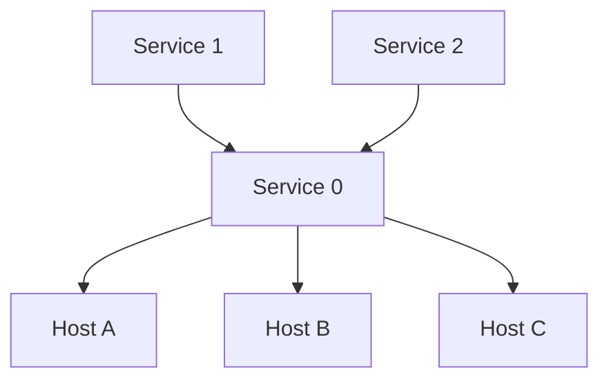
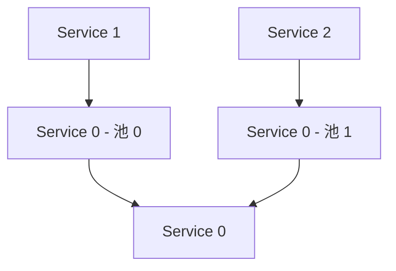
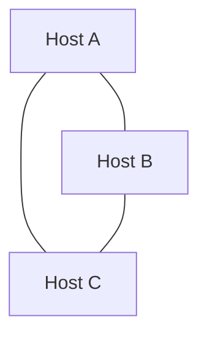
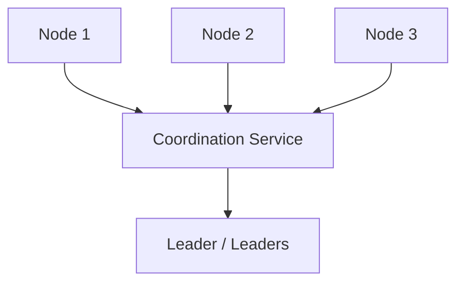
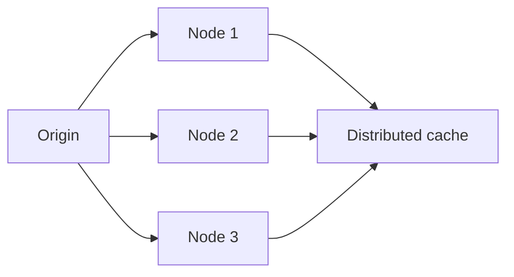
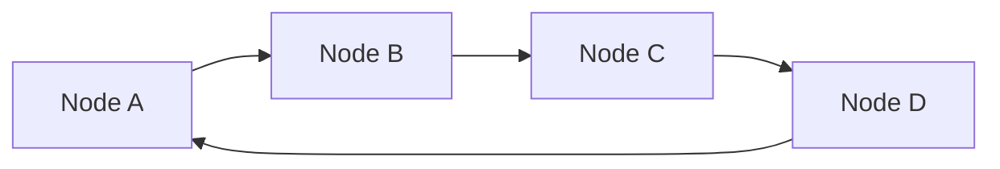
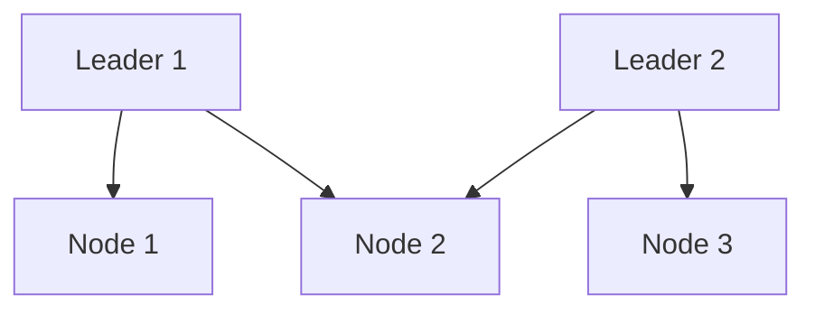

# 03 第 3 章：非功能性需求（Non-Functional Requirements）

本章包括：

- 在面试开始时讨论非功能需求
- 使用各种技术与方案满足非功能需求
- 为非功能需求做优化

一个系统既有功能需求，也有非功能需求。功能需求描述系统的输入与输出；你可以把它们粗略表示为 API 规范与端点。

非功能需求，指的是除输入与输出之外的其他系统需求。典型的非功能需求如下，稍后本章会逐一详细讨论：

- **Scalability**——系统能够轻松调整其硬件资源使用量，并以成本可接受的方式支撑负载的能力。
- **Availability**——系统能够接受请求并返回期望响应的时间百分比。
- **Performance / latency / P99 and throughput**——性能或时延，是用户请求到系统并收到响应所花费的时间。系统能够处理的最大请求速率，是它的 bandwidth；当前正在处理的请求速率，则是 throughput。不过，人们常常（虽然不严格准确）会用 throughput 来代替 bandwidth。Throughput / bandwidth 与 latency 互为倒数：一个低时延系统，通常拥有高吞吐。
- **Fault-tolerance**——当部分组件失效时，系统仍能继续运行的能力；以及在发生停机时，防止造成永久性损害（如数据丢失）的能力。
- **Security**——防止未经授权访问系统。
- **Privacy**——对 Personally Identifiable Information（PII，可唯一识别个人的信息）进行访问控制。
- **Accuracy**——系统的数据未必需要绝对精确；为了改善成本或复杂度，围绕准确性的权衡也常常是相关讨论点。
- **Consistency**——所有节点 / 机器中的数据是否一致。
- **Cost**——我们可以通过牺牲系统的其他非功能属性来降低成本。
- **Complexity、maintainability、debuggability 和 testability**——这些相关概念决定了系统在构建阶段以及后续维护阶段有多难。

无论客户是否具备技术背景，他们都未必会显式提出非功能需求，甚至可能默认系统天然就能满足这些要求。这意味着，客户陈述的需求几乎总是不完整的、带有错误的，甚至有时是过度的。如果不加澄清，就会对需求产生误解。我们可能得不到某些关键需求，从而满足不充分；也可能自行假设了一些其实并不需要的需求，进而给出过度设计的方案。

初学者更容易忽略非功能需求的澄清，但不澄清的情况同样也会出现在功能需求上。任何系统设计讨论，都必须以“讨论并澄清功能需求与非功能需求”作为起点。

非功能需求彼此之间经常存在权衡。在任何系统设计面试中，我们都必须讨论：不同设计决策如何为不同权衡服务。

把非功能需求与应对它们的技术分开讨论，其实并不容易，因为某些技术会在提升若干非功能属性的同时，牺牲另外一些属性。接下来本章会先简要讨论每一种非功能需求，以及若干满足它的技术；然后再对这些技术逐一展开更细的讨论。

## 3.1 可扩展性（Scalability）

可扩展性是指：系统能够轻松调整其硬件资源使用，并以成本高效的方式支撑负载。

为支撑更大负载或更多用户而扩张的过程，称为 scaling。Scaling 需要增加 CPU 处理能力、RAM、存储容量和网络带宽。Scaling 可以指垂直扩展（vertical scaling），也可以指水平扩展（horizontal scaling）。

垂直扩展在概念上很直接，也很容易通过“花更多钱”来做到。它意味着升级到更强、更贵的主机：例如更快的处理器、更多 RAM、更大的机械硬盘、用固态硬盘代替机械硬盘以降低时延，或带宽更高的网卡。垂直扩展有三个主要缺点。

第一，你终会遇到一个点：硬件升级带来的货币成本增长，会快于性能增长。例如，一台拥有多个处理器的定制大型主机，其成本会高于若干台普通机器，而这些普通机器加起来同样也能提供相同数量的处理器。

第二，垂直扩展存在技术上限。无论预算多高，现有技术都会对单台主机可实现的最大处理能力、RAM 和存储容量施加上限。

第三，垂直扩展可能需要停机。我们必须先停掉主机、更换硬件，再重新启动。为了避免停机，我们需要再 provision 一台主机，把服务启动在新主机上，然后把请求切换过去。并且，只有当服务状态存储在旧 / 新主机之外的其他机器上时，这样做才可行。正如本书后面会讨论的那样，把请求导向特定主机，或者把服务状态放到另一台主机上，都是同时满足可扩展性、可用性和容错性等多个非功能需求的重要技术。

因为垂直扩展在概念上相对简单，所以除非特别说明，本书中提到“scalable”或“scaling”时，默认指的是可水平扩展与水平扩展。

水平扩展，是把处理与存储需求分散到多台主机上。真正的可扩展性只能通过水平扩展实现。系统设计面试中几乎总会讨论水平扩展。

基于下面这些问题，我们可以确定客户对可扩展性的需求：

- 有多少数据进入系统、又有多少数据从系统中被读取？
- 每秒有多少次读查询？
- 每个请求的数据量有多大？
- 每秒有多少次视频观看？
- 突发流量峰值有多大？

### 3.1.1 无状态服务与有状态服务（Stateless and stateful services）

HTTP 是一种无状态协议，因此使用 HTTP 的后端服务很容易做水平扩展。第 4 章会描述数据库读操作的水平扩展。一个无状态 HTTP 后端，再配合可水平扩展的数据库读，是讨论“可扩展系统设计”的良好起点。

对共享存储的写入，是最难扩展的部分。后文会讨论多种相关技术，包括 replication、compression、aggregation、denormalization 和 Metadata Service。

关于各种常见通信架构、以及 stateful 与 stateless 的权衡，请参见 6.7 节。

### 3.1.2 负载均衡器基础概念（Basic load balancer concepts）

每一个做了水平扩展的服务，都会用到负载均衡器。它可能是下列之一：

- 硬件负载均衡器：一种专门的物理设备，用于把流量分发到多台主机。硬件负载均衡器以昂贵著称，价格可能从几千美元到几十万美元不等。
- 共享型负载均衡服务，也称 LBaaS（load balancing as a service）。
- 安装了负载均衡软件的服务器。最常见的是 HAProxy 和 NGINX。

本节讨论一些你可以在面试里使用的负载均衡基础概念。

在本书的系统图中，我会用矩形表示各种服务或其他组件，用它们之间的箭头表示请求。通常默认理解为：请求进入服务之前，会先经过负载均衡器，再被路由到该服务的某个主机上。因此，我们一般不会把负载均衡器本身画出来。

你可以直接告诉面试官：系统图中无需显式画出负载均衡器，因为它是隐含存在的；把它画出来并展开讨论，往往会分散注意力，让人忽略构成服务的其他关键组件和服务。

**Level 4 vs. level 7**

我们应能区分 level 4 与 level 7 负载均衡器，并讨论哪种更适合某个具体服务。Level 4 负载均衡器工作在传输层（TCP），它基于 TCP 流最初几个包中提取出的地址信息做路由决策，不会检查其他包的内容；它只能转发包。Level 7 负载均衡器工作在应用层（HTTP），因此具有以下能力：

- **负载均衡 / 路由决策**——基于包内容做决定。
- **Authentication**——如果缺少指定的认证头，它可以直接返回 401。
- **TLS termination**——数据中心内部流量的安全要求，可能低于互联网上的流量，因此执行 TLS termination（HTTPS → HTTP）意味着数据中心内部主机之间不再承担加解密开销。如果应用要求数据中心内部流量也必须加密（即 encryption in transit），那么我们就不能做 TLS termination。

**Sticky sessions**

Sticky session 指的是：负载均衡器把某个客户端的请求，在由负载均衡器或应用规定的一段时间内，持续发送到同一台主机。Sticky session 用于 stateful 服务。比如电商网站、社交媒体网站、银行网站，可能会利用 sticky sessions 来维持用户会话数据，如登录状态或偏好设置，这样用户在站点内跳转时就不需要反复认证或重新输入偏好。电商网站还可能用 sticky sessions 保存用户的购物车。

Sticky session 可以通过基于时长的 cookie 或应用控制的 cookie 来实现。在基于时长的 session 中，负载均衡器向客户端签发一个定义了时长的 cookie。每当负载均衡器收到请求时，都会检查这个 cookie。在应用控制的 session 中，cookie 由应用生成。负载均衡器仍会在应用 cookie 之上额外签发自己的 cookie，但负载均衡器 cookie 的生命周期会跟随应用 cookie。这种方式可以确保：即使负载均衡器自己的 cookie 过期，客户端也不会被路由到另一台主机；但它更难实现，因为它要求应用与负载均衡器之间进行额外集成。

**Session replication**

在 session replication 中，写入某台主机的数据会被复制到集群中被分配给同一 session 的其他几台主机上，因此读请求就可以被路由到任何持有该 session 的主机。这会改善可用性。

这些主机可以形成一个备份环。例如，如果某个 session 里有三台主机，那么当主机 A 收到写入后，它会写给主机 B，主机 B 再写给主机 C。另一种方式是：负载均衡器把写请求同时发给分配到该 session 的所有主机。

**Load balancing vs. reverse proxy**

你可能会在其他系统设计面试材料中看到 reverse proxy 这个术语。这里我们简要比较一下负载均衡与反向代理。

负载均衡主要面向可扩展性，而反向代理是一种管理客户端—服务端通信的技术。反向代理位于一组服务器前方，充当客户端与服务器之间的网关：它拦截并转发入站请求，并依据请求 URI 或其他条件，把请求转发到适当的服务器。反向代理还可能提供缓存、压缩等性能特性，以及 SSL termination 等安全特性。负载均衡器也可以提供 SSL termination，但它的核心目的仍是可扩展性。

关于负载均衡与反向代理的较好讨论，可参见：`https://www.nginx.com/resources/glossary/reverse-proxy-vs-load-balancer/`。

**延伸阅读（Further reading）**

- `https://www.cloudflare.com/learning/performance/types-of-load-balancing-algorithms/`：对各种负载均衡算法的简短而不错的介绍。
- `https://rancher.com/load-balancing-in-kubernetes`：一篇介绍 Kubernetes 中负载均衡的好文章。
- `https://kubernetes.io/docs/concepts/services-networking/service/#loadbalancer` 与 `https://kubernetes.io/docs/tasks/access-application-cluster/create-external-load-balancer/`：介绍如何把外部云服务负载均衡器挂到 Kubernetes service 上。

## 3.2 可用性（Availability）

可用性，是系统能够接受请求并返回期望响应的时间百分比。常见可用性基准见表 3.1。

| 可用性 | 每年停机时间 | 每月停机时间 | 每周停机时间 | 每天停机时间 |
| --- | --- | --- | --- | --- |
| 99.9（三个 9） | 8.77 小时 | 43.8 分钟 | 10.1 分钟 | 1.44 分钟 |
| 99.99（四个 9） | 52.6 分钟 | 4.38 分钟 | 1.01 分钟 | 8.64 秒 |
| 99.999（五个 9） | 5.26 分钟 | 26.3 秒 | 6.05 秒 | 864 毫秒 |

*表 3.1 常见可用性基准。*

关于 Netflix 多区域 active-active 高可用部署的详细讨论，可参见：`https://netflixtechblog.com/active-active-for-multi-regional-resiliency-c47719f6685b`。本书会讨论一些类似的高可用技术，例如在同一大洲内、或跨洲的数据中心之间进行复制，以及监控与告警。

大多数服务都要求高可用，而其他非功能需求则可能被牺牲，以在不过度增加复杂度的前提下实现高可用。

在讨论系统的非功能需求时，第一步应先确定：是否真的要求高可用。不要想当然地认为系统一定需要强一致和低时延。你应引用 CAP theorem，并讨论是否可以牺牲它们来换取更高可用。只要可行，都应建议使用异步通信技术来实现这一点，例如第 4、5 章会讨论的 event sourcing 和 saga。

那些“不需要立即处理并立即返回响应”的请求，通常并不需要强一致与低时延，例如服务之间以程序方式发起的请求。例子包括：把日志写入长期存储，或者在 Airbnb 中发送一个预订未来几天房间的请求。

只有当“立刻得到响应”绝对必要时，才使用同步通信协议；典型场景是人直接使用你的应用所发起的请求。

不过，也不要想当然地认为“由人发起的请求”就一定需要立刻返回所请求的数据。你应思考：即时响应是否可以只是一个 acknowledgment，而真正所需的信息则可以在几分钟或几小时后再返回。例如，如果用户请求提交自己的所得税缴款，这笔支付未必必须立刻完成。服务可以先把请求入队，并立即告诉用户“该请求会在几分钟或几小时内处理”。之后，这笔付款可以由流式作业或周期性批处理作业完成，再通过邮件、短信或应用通知把结果（成功或失败）告知用户。

一个高可用未必必要的例子，是缓存服务。由于缓存通常只是为了降低请求时延与网络流量，而不是实现该请求本身所必需，我们可能会在缓存服务的系统设计中，用较低可用性换取更低时延。另一个例子是第 8 章中的 rate limiting。

可用性也可以用事故指标来度量。`https://www.atlassian.com/incident-management/kpis/common-metrics` 介绍了 MTTR（Mean Time to Recovery）和 MTBF（Mean Time Between Failures）等多种事故指标。这些指标通常会有对应的仪表盘和告警。

## 3.3 容错性（Fault-tolerance）

容错性，是系统在部分组件失效时仍能继续运行的能力，以及在发生停机时防止永久性损害（如数据丢失）的能力。这样，系统在部分失效时仍能维持部分功能，实现优雅降级，而不是灾难性完全崩溃。这为工程师争取了时间，以修复失效部分并把系统恢复到正常状态。我们也可以实现自愈机制，自动 provision 替代组件并将其接入系统，使系统在无需人工介入、且终端用户几乎无感知的情况下恢复。

可用性与容错性经常一起讨论。可用性是对 uptime / downtime 的度量，而容错性并不是一个度量值，而是系统的一种特征。

与之紧密相关的概念是 failure design，它关注平滑的错误处理。要思考：对于那些不受我们控制的第三方 API 错误，以及静默 / 未检测到的错误，我们将如何处理。容错技术包括以下内容。

### 3.3.1 复制与冗余（Replication and redundancy）

Replication 会在第 4 章讨论。

一种 replication 技术，是为某个组件准备多个（例如三个）冗余实例 / 副本，这样即使其中最多两个同时宕机，也不会影响 uptime。正如第 4 章会讨论的那样，更新操作通常会被分配到某一特定主机，因此只有当其他主机位于离请求方更远的异地数据中心时，更新性能才会受到影响；而读请求通常会在所有 replicas 上执行，因此当部分组件不可用时，读性能会下降。

其中一个实例会被指定为 source of truth（通常称为 leader），另外两个组件则被指定为 replicas（或 followers）。replicas 的摆放方式有多种：一种是一个 replica 放在同一数据中心的另一台机架上，另一个 replica 放在其他数据中心；另一种是三个实例全部放在不同数据中心，这样容错性最大，但代价是性能更低。

一个典型例子是 Hadoop Distributed File System（HDFS）。它有一个可配置属性 `replication factor`，用于指定任意 block 的副本数，默认值是 3。Replication 也有助于提升可用性。

### 3.3.2 前向纠错与纠错码（Forward error correction and error correction code）

Forward error correction（FEC）是一种用于在噪声环境或不可靠通信信道中防止数据传输错误的技术，它通过冗余编码消息来实现，例如使用 error correction code（ECC）。

FEC 是协议层概念，而非系统层概念。你可以在系统设计面试中表现出对 FEC 和 ECC 的了解，但不太可能需要详细解释，因此本书不再展开。

### 3.3.3 断路器（Circuit breaker）

断路器是一种机制，用于阻止客户端反复尝试那些大概率失败的操作。就下游服务而言，断路器会统计最近一段时间内失败请求的数量；如果超过错误阈值，客户端就停止调用下游服务。一段时间后，客户端会尝试少量请求。如果这些请求成功，客户端便认为故障已经解决，恢复正常发送请求。

> [!INFO] 定义
> 如果服务 B 依赖服务 A，那么 A 是上游服务（upstream service），B 是下游服务（downstream service）。

断路器可以避免资源继续浪费在那些大概率失败的请求上，也能防止客户端给本已过载的系统继续施加额外压力。

不过，断路器会让系统更难测试。例如，假设我们有一组负载测试，它们发送了不正确的请求，但仍然正确地在测试系统极限。现在这些测试会触发断路器，于是一个原本会压垮下游服务的负载，反而可能通过测试。而客户发起的类似负载却会导致故障。另一个难点是：合适的错误阈值和计时器也很难估计。

断路器可以在服务端实现。一个例子是 Resilience4j（`https://github.com/resilience4j/resilience4j`）。它的灵感来自 Hystrix（`https://github.com/Netflix/Hystrix`），后者由 Netflix 开发，并在 2017 年转入维护模式：`https://github.com/Netflix/Hystrix/issues/1876#issuecomment-440065505`。Netflix 后来把重点转向更具自适应性的实现，即根据应用实时性能而不是预配置参数来做反应，例如 adaptive concurrency limits：`https://netflixtechblog.medium.com/performance-under-load-3e6fa9a60581`。

### 3.3.4 指数退避与重试（Exponential backoff and retry）

指数退避与重试，与断路器类似。当客户端收到错误响应时，它会等待一段时间再重试该请求，并以指数方式增加每次重试之间的等待时间。客户端还会在等待时间上再加一个小的随机正负偏移，这个技巧称为 jitter。这样可以防止多个客户端在完全相同的时间发起重试，形成“retry storm”，从而压垮下游服务。与断路器类似，当客户端收到成功响应时，就会认为故障已解除，并恢复不受限制地发送请求。

### 3.3.5 缓存其他服务的响应（Caching responses of other services）

我们的服务可能依赖外部服务来获取某些数据。如果外部服务不可用，该怎么办？通常来说，优雅降级总比直接崩溃或返回错误更好。我们可以用默认响应或空响应来替代返回值。如果“使用过期数据”比“完全没有数据”更好，那么每当我们成功请求外部服务时，就可以缓存其响应，并在外部服务不可用时使用这些缓存结果。

### 3.3.6 检查点（Checkpointing）

一台机器可能会在很多数据点上执行聚合：系统化地获取其中一部分、对其做聚合、把结果写到指定位置，然后重复这个过程，直到全部数据点都处理完；若是流式管道，则可能永远持续下去。如果这台机器在聚合过程中失效，那么替代机器应知道从哪些数据点继续恢复聚合。实现办法是：每处理完一批数据点并成功写出结果之后，就写一个 checkpoint。替代机器随后就能从这个 checkpoint 继续处理。

Checkpointing 常用于使用 Kafka 等消息代理的 ETL 管道。机器可以从 Kafka topic 拉取若干 event，处理这些 event，然后写出结果，接着写入 checkpoint。如果机器失效，其替代者就能从最近的 checkpoint 继续。

Kafka 在 partition 层面提供 offset storage：`https://kafka.apache.org/22/javadoc/org/apache/kafka/clients/consumer/KafkaConsumer.html`。Flink 则从 Kafka topics 消费数据，并利用 Flink 的分布式 checkpointing 机制定期写 checkpoint：`https://ci.apache.org/projects/flink/flink-docs-master/docs/dev/datastream/fault-tolerance/checkpointing/`。

### 3.3.7 死信队列（Dead letter queue）

如果对第三方 API 的写请求失败，我们可以把请求写入 dead letter queue，稍后再重试。

死信队列应该保存在本地，还是放到独立服务里？这里可以在复杂度与可靠性之间权衡：

- 最简单的方案是：如果丢失请求是可接受的，那就直接丢弃失败请求。
- 在本地用 try-catch 块实现死信队列。这样如果主机宕机，请求就会丢失。
- 更复杂但更可靠的方案，是使用 Kafka 之类的事件流平台。

在面试里，你应讨论多种方案及其权衡，而不是只给出一种。

### 3.3.8 日志与周期性审计（Logging and periodic auditing）

处理静默错误的一种方法，是记录写请求日志并进行周期性审计。审计作业可以处理这些日志，并验证我们写入的目标服务中的数据是否与预期一致。第 10 章会继续讨论这一点。

### 3.3.9 舱壁模式（Bulkhead）

舱壁模式是一种容错机制：把系统划分为相互隔离的资源池，使某个池中的故障不会影响整个系统。

例如，服务中的不同端点可以各自拥有独立的线程池，而不是共享线程池。这样，一旦某个端点的线程池耗尽，也不会影响其他端点继续提供服务。（关于这一点，可参见 Indrasiri 和 Siriwardena 所著 *Microservices for the Enterprise: Designing, Developing, and Deploying*，Apress，2019。）

Michael T. Nygard 的 *Release It!: Design and Deploy Production-Ready Software, Second Edition*（Pragmatic Bookshelf，2018）中也讨论了另一个 bulkhead 的例子。

某个特定请求，可能因为 bug 而导致主机崩溃。如果这个请求不断重复，就会不断打崩更多主机。把服务切分为多个 bulkheads（也就是把主机划分为多个池），可以防止该请求打崩所有主机并造成整体故障。对这类请求应做进一步调查，因此服务必须具备日志和监控。监控会识别出有问题的请求，工程师则可以借助日志排查崩溃并找出根因。

另一个例子是：某个请求方对服务发起了很高的请求速率，导致服务无法再服务其他请求方。Bulkhead 模式会为特定请求方分配某些主机，从而防止它耗尽整个服务的所有容量。（第 8 章中的 rate limiting，也是防止这种情况的另一种方式。）

服务的主机可以被划分为多个池，每个池分配给不同请求方。这也是一种为特定请求方分配更多资源、从而实现优先级区分的技术。

图 3.1 中，一个服务同时服务于另外两个服务。若该服务的主机不可用，它将无法再服务任何请求方。

*图 3.1 所有发往 service 0 的请求都会被负载均衡到它的各台主机上。若 service 0 的主机不可用，它将无法服务任何请求方。*

图 3.2 中，服务的主机被分成多个池，并分别分配给不同请求方。其中一个池中的主机不可用，不会影响其他请求方。这个方法一个显而易见的代价是：如果某些请求方出现流量突增，各池之间无法互相支援。这是我们有意做出的资源分配决策。我们可以按需手动或自动扩缩这些池。

*图 3.2 Service 0 被划分为两个池，每个池分配给一个请求方。某个池的不可用不会影响另一个池。*

关于 bulkhead 模式的其他例子，可参见 Michael Nygard 的 *Release It!: Design and Deploy Production-Ready Software, Second Edition*（Pragmatic Bookshelf，2018）。

我们不会在第 2 部分的系统设计讨论中反复提到 bulkhead，但它对大多数系统都具有普遍适用性，你可以在面试中主动提出。

### 3.3.10 回退模式（Fallback pattern）

回退模式是指：检测到问题后，执行一条替代代码路径，例如使用缓存响应，或者调用与客户端原本试图获取信息的服务相似的替代服务。举个例子：如果客户端向我们的后端请求附近贝果咖啡馆列表，它可以缓存这个响应，以便在我们的后端服务宕机时继续使用。这个缓存响应可能不是最新的，但总比直接向用户返回错误消息更好。另一个替代方案，是让客户端去请求 Bing 或 Google Maps 这样的第三方地图 API，虽然它们可能不具备我们后端所提供的定制化内容。在设计 fallback 时，我们也要考虑 fallback 本身的可靠性，以及它自己也可能失败。

> [!NOTE]
> 关于回退策略、为什么 Amazon 几乎从不使用 fallback 模式，以及 Amazon 采用了哪些替代方案，可参见：`https://aws.amazon.com/builders-library/avoiding-fallback-in-distributed-systems/`。

## 3.4 性能 / 时延与吞吐（Performance/latency and throughput）

性能或时延，是用户请求到系统并收到响应所花费的时间。它包括：请求离开客户端并到达服务的网络时延，服务处理请求并生成响应所花费的时间，以及响应离开服务并返回客户端的网络时延。一个面向消费者应用的典型请求（例如在外卖应用中查看餐厅菜单，或在电商应用中提交支付），其期望时延通常是几十毫秒到几秒。高频交易应用则可能要求时延只有几毫秒。

严格来说，latency 原本是指一个数据包从源到目的地的传播时间。不过如今 latency 已经经常被当作 performance 的同义词，两者往往交替使用。如果我们确实需要讨论“包在网络中的传播时间”，才会特意使用 latency 这个词。

Latency 也可以用来描述系统内部组件之间的请求—响应时间，而不仅仅是用户请求—响应时间。例如，如果某个后端主机向日志或存储系统发请求以存储数据，那么这个系统的 latency，就是把数据记录 / 存储进去并返回响应所需的时间。

系统的功能需求也许意味着：响应不一定非要立即包含用户请求的信息，而只需先返回一个 acknowledgment，并承诺在某个时间之后，把所需信息发给用户，或者允许用户之后再发一次请求来获取它。这样的权衡可能会简化系统设计，因此我们必须始终澄清需求，并讨论用户发出请求之后，到底多快必须拿到信息。

实现低时延的典型设计决策包括：把服务部署在地理位置接近用户的数据中心，这样用户与服务之间的网络包无需传太远。如果用户分布广泛，我们可以把服务部署到多个数据中心，并选择那些能最小化用户群体地理距离的地点。如果不同数据中心的主机之间需要共享数据，那么我们的服务就必须具备水平扩展能力。

当然，有时对时延影响更大的因素并不是用户与数据中心的物理距离，而是流量、网络带宽，或者后端系统处理本身（实际业务逻辑与持久化层）。我们可以让用户与多个数据中心之间互相发测试请求，以确定对某一地理位置的用户来说，哪个数据中心的时延最低。

其他技术还包括：使用 CDN、缓存、用 RPC 替代 REST 来减少数据体积，用 Netty 之类的框架自行设计协议，从而使用 TCP / UDP 而不是 HTTP，以及使用批式与流式处理技术。

在分析时延和吞吐时，我们会先讨论数据本身的特征，以及它是如何进入和离开系统的，然后才能提出策略。例如：视频观看数能否在数小时之后再统计？如果可以，就可以采用批式或流式方案。响应时间要求是什么？如果要求很小，那么数据必须已经提前完成聚合，聚合应在写路径上完成，而不是在读路径上做大量聚合。

## 3.5 一致性（Consistency）

Consistency 在 ACID 和 CAP（来自 CAP theorem）中含义不同。ACID 一致性关注数据关系，例如外键和唯一性。正如 Martin Kleppmann 在 *Designing Data-Intensive Applications*（O’Reilly，2017）中所说，CAP 里的 consistency 实际上是 linearizability：所有节点在同一时刻都包含相同数据，并且数据变化必须以线性的方式发生，也就是说，所有节点都必须在同一时刻开始对外提供变更后的数据。

Eventually consistent 的数据库，会通过牺牲一致性，来换取可用性、可扩展性和时延上的改善。ACID 数据库（包括关系型数据库）在发生 network partition 时，无法接受写入，因为若 partition 期间仍允许写入，就无法维持 ACID consistency。正如表 3.2 所示，MongoDB、HBase 和 Redis 选择牺牲 availability 来换取 linearizability，而 CouchDB、Cassandra、Dynamo、Hadoop 和 Riak 则牺牲 linearizability 来换取 availability。

| 偏向 linearizability | 偏向 availability |
| --- | --- |
| HBase | Cassandra |
| MongoDB | CouchDB |
| Redis | Dynamo |
|  | Hadoop |
|  | Riak |

*表 3.2 倾向 availability 与倾向 linearizability 的数据库。*

讨论时，我们应强调 ACID consistency 与 CAP consistency 的区别，以及 linearizability 与 eventual consistency 之间的权衡。本书会讨论多种用于实现 linearizability 或 eventual consistency 的技术，包括：

- Full mesh
- Quorum

以及一些通过“把写入先写到单一位置，再由其传播到其他相关位置”的 eventual consistency 技术：

- Event sourcing（5.2 节），一种也可用于应对流量尖峰的技术。
- Coordination service。
- Distributed cache。

还有一些通过牺牲 consistency 与 accuracy 来降低成本的 eventual consistency 技术：

- Gossip protocol。
- Random leader selection。

Linearizability 的缺点包括：

- 可用性更低，因为大多数甚至全部节点都必须先达成共识，才能对外提供请求服务。随着节点数量增加，这会越来越困难。
- 更复杂、更昂贵。

### 3.5.1 全互连（Full mesh）

图 3.3 展示了 full mesh 的一个例子。集群里的每台主机都知道其他每台主机的地址，并向所有其他主机广播消息。

*图 3.3 Full mesh 示意图。每台主机都连接到其他所有主机，并向它们广播消息。*

主机如何彼此发现？新增一台主机后，它的地址如何发送给其他主机？主机发现的解决方案包括：

- 把地址列表维护在配置文件中。每次列表变化时，就把该文件重新部署到所有主机 / 节点。
- 使用一个第三方服务，让它监听每台主机发来的 heartbeat。只要该服务持续收到 heartbeat，该主机就保持注册状态。所有主机都通过该服务获取完整地址列表。

Full mesh 比其他技术更容易实现，但不具备可扩展性。消息数量会随着主机数量呈平方级增长。它适合小集群，却无法支持大集群。在 quorum 中，只要大多数主机拥有相同数据，系统就被视为一致。BitTorrent 是一个利用 full mesh 进行去中心化 P2P 文件共享的协议示例。在面试里，我们可以简单提到 full mesh，并把它与可扩展方案对比。

### 3.5.2 协调服务（Coordination service）

图 3.4 展示了协调服务：它是一个第三方组件，用于选出一个 leader 节点，或一组 leader 节点。引入 leader 可以减少消息数量。其他节点把消息发给 leader，leader 负责做必要处理并返回最终结果。每个节点只需要和自己的 leader 或 leader 集合通信，而每个 leader 负责管理一组节点。

*图 3.4 Coordination service 示意图。*

典型算法包括 Paxos、Raft 和 Zab。另一个例子是 SQL 中的 single leader multiple follower（4.3.2 节），它用于支持可扩展读。ZooKeeper（`https://zookeeper.apache.org/`）就是一种分布式协调服务。相较于存放在单台主机上的配置文件，ZooKeeper 的优势包括（其中大部分也可参见：`https://stackoverflow.com/q/36312640/1045085`）。这些能力也可以自行在分布式文件系统或分布式数据库上实现，但 ZooKeeper 已经直接提供了：

- 访问控制：`https://zookeeper.apache.org/doc/r3.1.2/zookeeperProgrammers.html#sc_ZooKeeperAccessControl`
- 把数据保存在内存中以获得高性能。
- 可扩展性：通过给 ZooKeeper Ensemble 增加主机，实现水平扩展：`https://zookeeper.apache.org/doc/r3.1.2/zookeeperAdmin.html#sc_zkMulitServerSetup`
- 在指定时间边界内保证 eventual consistency，或者以更高代价提供 strong consistency：`https://zookeeper.apache.org/doc/current/zookeeperInternals.html#sc_consistency`。ZooKeeper 牺牲 availability 换取 consistency；按 CAP theorem 来说，它是 CP 系统。
- 客户端可以按照写入顺序读取数据。

协调服务的主要缺点是复杂度。协调服务是一个非常复杂的组件，它必须足够可靠，并且必须保证“有且仅有一个 leader 被选出”。（两个节点都认为自己是 leader 的情况，被称为 split brain。可参见 Martin Kleppmann，*Designing Data-Intensive Applications*，O’Reilly，2017，第 158 页。）

### 3.5.3 分布式缓存（Distributed cache）

我们可以使用 Redis 或 Memcached 这样的 distributed cache。参见图 3.5，服务中的各节点可以定期向 origin 发请求获取新数据，然后再向 distributed cache（例如 Redis 这样的内存存储）发请求，以更新缓存数据。这个方案简单、低时延，并且 distributed cache 集群可以独立于我们的服务单独扩缩容。不过，它的请求数量比本节其他方案都多，唯一比它更多的只有 full mesh。

*图 3.5 使用 distributed cache 广播消息的示意图。节点可以向 Redis 这样的内存存储发请求来更新数据，也可以定期发请求拉取新数据。*

> [!NOTE]
> Redis 从定义上说是内存缓存，并不天然就是“分布式缓存”。但在实践中，它常被当作 distributed cache 使用。参见：`https://redis.io/docs/about/` 和 `https://stackoverflow.com/questions/18376665/redis-distributed-or-not`。

发送方主机和接收方主机都可以校验消息是否包含其所需字段。由于额外开销很小，却能降低任一侧出错从而生成非法消息的可能性，因此双方通常都会做这类校验。当发送方主机通过 HTTP 请求向接收方主机发送非法消息，而接收方又能检测到其非法时，它可以立刻返回 400 或 422。我们可以为 4xx 错误配置高紧急度告警，这样就能立即收到告警并立刻展开排查。

然而，如果我们使用 Redis，那么某个节点写入的非法数据，可能要到另一个节点把它读出来时才会被发现，因此告警会有延迟。

主机之间直接发送请求时，会经历 schema validation。而 Redis 只是数据库，不会做 schema 校验，因此主机可以向其中写入任意数据。这可能带来安全问题。参见：

- `https://www.trendmicro.com/en_us/research/20/d/exposed-redis-instances-abused-for-remote-code-execution-cryptocurrency-mining.html`
- `https://www.imperva.com/blog/new-research-shows-75-of-open-redis-servers-infected/`

Redis 被设计成由受信任环境中的受信任客户端访问：`https://redis.io/topics/security`。Redis 本身并不支持加密，这也可能带来隐私问题。实现 encryption at rest 会增加复杂度、成本，并降低性能：`https://docs.aws.amazon.com/AmazonElastiCache/latest/red-ug/at-rest-encryption.html`。

协调服务可以解决这些缺点，但复杂度和成本会更高。

### 3.5.4 Gossip 协议（Gossip protocol）

Gossip protocol 的模型来自流行病传播方式。参见图 3.6，每个节点会周期性地或以随机间隔，随机选择另一个节点并与之共享数据。这种方法通过牺牲一致性，换取更低的成本与复杂度。

*图 3.6 Gossip 通信示意图。*

Cassandra 使用 gossip protocol 来维护分布式数据分区之间的一致性。DynamoDB 使用一种称为 vector clocks 的 gossip protocol，在多个数据中心之间维持一致性。

### 3.5.5 随机 leader 选举（Random Leader Selection）

参见图 3.7，随机 leader 选举使用一种简单算法来选出 leader。这个简单算法无法保证“有且仅有一个 leader”，因此可能出现多个 leaders。不过这通常只是小问题，因为每个 leader 仍可与其他所有主机共享数据，因此所有主机（包括所有 leaders）最终都会拥有正确数据。其缺点是：可能会产生重复请求和不必要的网络流量。

*图 3.7 多 leader 示意图。随机 leader 选举可能导致多个 leaders。*

Kafka 使用一种带有随机 leader 选举的 leader-follower replication 模型来提供容错性。YARN 则使用类似随机 leader 选举的方法来管理集群中的资源分配。

## 3.6 准确性（Accuracy）

在那些涉及复杂数据处理、或写入速率很高的系统中，准确性是一项相关的非功能需求。数据准确，意味着数据值是正确的，而不是近似值。某些估计算法则是用牺牲准确性来换取更低复杂度。例子包括：Presto 分布式 SQL 查询引擎中用于基数估计（`COUNT DISTINCT`）的 HyperLogLog，以及用于估计数据流中事件频率的 count-min sketch。

当底层数据库中的数据已经被修改，而缓存仍未更新时，缓存就是 stale 的。缓存可以采用某种刷新策略，以固定周期拉取最新数据。较短的刷新周期更昂贵。另一种办法是：系统在数据被修改时，主动更新或删除关联 cache key，但这会提高复杂度。

准确性与一致性有一定关联。Eventually consistent 系统，会牺牲准确性，以换取可用性、复杂度和成本上的改善。当一条写入被发送到 eventual consistency 系统后，紧接着发生的读操作可能还看不到这次写入带来的影响，于是读结果就是“不准确的”。在副本尚未同步好这次写入之前，该系统都处于不准确状态。不过，我们描述这类情况时通常用的是 consistency，而不是 accuracy。

## 3.7 复杂度与可维护性（Complexity and maintainability）

降低复杂度的第一步，是澄清功能需求与非功能需求，从而避免为不必要的需求做设计。

当我们在草拟设计图时，要留意哪些组件可以被拆分成独立系统。使用 common services 可以降低复杂度并提升可维护性。几乎对所有服务都普遍适用的 common services 包括：

- Load balancer service
- Rate limiting（参见第 8 章）
- Authentication 和 authorization（参见附录 B）
- Logging、monitoring、alerting（参见 2.5 节）
- TLS termination（更多内容请参考其他资料）
- Caching（参见 4.8 节）
- DevOps 与 CI/CD（如适用）。这些超出本书范围。

对某些组织来说，也有一些可泛化的服务，例如收集用户数据供数据科学使用的 analytics 与 machine learning。

复杂系统如果要求高可用与高容错，往往又需要引入更多复杂度。如果系统本身不可避免地复杂，那么就要考虑：是否可以通过降低可用性与容错性来换取更低复杂度。

还应讨论：能否通过在其他需求上的权衡来降低复杂度，例如使用 ETL 管道，把那些不必实时完成的数据处理延后。

一种常见做法，是用“缩小网络通信中消息体积”的技术，来以少量复杂度换取更好的时延与性能。这类技术包括 RPC serialization frameworks 和 Metadata services。（关于 Metadata service，请参见 6.3 节。）

Avro、Thrift 和 protobuf 等 RPC serialization frameworks 能减少消息体积，但代价是需要维护 schema 文件。（关于 REST vs RPC，请参见 6.7 节。）在任何面试中，我们都应始终建议使用这类 serialization framework；本书后面不再反复强调这一点。

我们还应讨论故障可能如何发生，评估不同故障对用户和业务的影响，以及如何预防和缓解。常见概念包括 replication、failover 和编写 runbooks。Runbooks 已在 2.5.3 节讨论。

第 2 部分所有章节都会讨论复杂度问题。

### 3.7.1 持续部署（Continuous deployment, CD）

本书第一次提到 continuous deployment（CD）是在 1.4.5 节。正如当时所说，CD 让部署与回滚都更容易。我们因此获得快速反馈循环，从而提升系统的可维护性。如果我们不小心把带 bug 的构建部署到生产环境，就可以轻松回滚。快速、轻松地部署增量升级与新特性，也会带来更快的软件开发生命周期。这是服务相较于 monolith 的一个重要优势，附录 A 会讨论。

其他 CD 技术还包括 blue / green deployment，也常被称为 zero downtime deployment。更多信息可参见：

- `https://spring.io/blog/2016/05/31/zero-downtime-deployment-with-a-database`
- `https://dzone.com/articles/zero-downtime-deployment`
- `https://craftquest.io/articles/what-are-zero-downtime-atomic-deployments`

像 SonarQube（`https://www.sonarqube.org/`）这样的静态代码分析工具，也能提升系统可维护性。

## 3.8 成本（Cost）

在系统设计讨论中，我们可以建议牺牲其他非功能需求来降低成本。例如：

- 通过垂直扩展而不是水平扩展，用更高成本换取更低复杂度。
- 通过降低系统冗余程度（例如主机数量、或数据库的 replication factor），牺牲部分可用性来降低成本。
- 通过把数据中心部署在离用户更远但更便宜的位置，牺牲时延来换取更低成本。

你还应讨论：实现成本、监控成本，以及每一项非功能需求（例如高可用）对应的成本。

生产问题在严重程度与处理时效上都各不相同，因此不要实现超出需求的监控与告警。若要求工程师在问题发生时立即收到告警，其成本显然高于“允许在问题发生数小时后再生成告警”的情况。

除了维护成本——也就是处理生产问题的成本——随着时间推移，软件本身也会自然老化：库和服务会被弃用。因此，还会存在另一类成本。你应识别哪些组件将来可能需要更新。若某些依赖（例如库）将来停止维护，会阻碍哪些组件的更新？若未来必须更新，我们应如何设计系统，使替换这些依赖更容易？

将来是否很可能需要更换依赖？尤其是第三方依赖，因为我们对其控制更少。第三方依赖可能被停止服务，也可能在可靠性或安全性上被证明不满足我们的需求。

一套完整的成本讨论，还应包括在必要时下线系统的成本。我们可能会因为多种原因决定下线系统，例如团队转移重点，或者系统用户太少，不足以证明其开发与维护成本的合理性。下线时，我们也许还需要把用户数据交还给现有用户，因此必须把这些数据导出成文本和 / 或 CSV 文件。

## 3.9 安全（Security）

在面试中，我们可能需要讨论系统中潜在的安全漏洞，以及如何预防与缓解安全入侵。这既包括来自外部的攻击，也包括组织内部的不当访问。安全相关的常见讨论点包括：

- TLS termination 与在服务之间或数据中心主机之间保持数据加密（即 encryption in transit）之间的取舍。通常会做 TLS termination，以节省处理开销，因为数据中心内部主机之间的加密通常不是必须的。但对于敏感数据，仍可能要求 encryption in transit。
- 哪些数据可以明文存储，哪些必须加密存储（即 encryption at rest）。Encryption at rest 与存储哈希数据在概念上不同。

我们还应对 OAuth 2.0 和 OpenID Connect 有一定理解，附录 B 会介绍它们。

我们也可能讨论 rate limiting，以防范 DDoS 攻击。限流系统本身就足够构成一道独立面试题，第 8 章会专门讨论它。几乎所有面向外部的系统，在设计时都应提到它。

## 3.10 隐私（Privacy）

Personally Identifiable Information（PII）是指可唯一识别客户的数据，例如全名、政府证件标识、地址、电子邮件地址和银行账户标识。PII 必须被妥善保护，以符合 GDPR（General Data Protection Regulation）和 CCPA（California Consumer Privacy Act）等法规要求。这既包括对外访问，也包括内部访问。

在系统内部，对存储在数据库和文件中的 PII，应应用访问控制机制。例如，可以使用 Lightweight Directory Access Protocol（LDAP）。我们也可以同时对数据做传输中加密（using SSL）和静态加密（at rest）。

还可以考虑使用 SHA-2、SHA-3 等哈希算法对 PII 做掩蔽，以在计算聚合统计（例如“每个客户的平均交易数”）时保护个体客户隐私。

如果 PII 存储在 HDFS 这样的 append-only 数据库或文件系统中，一种常见隐私技术是：为每个客户分配一个加密密钥。这些加密密钥可以保存在 SQL 这样的可变存储系统中。某个客户相关的数据在写入存储前，应先用该客户自己的加密密钥加密。如果之后需要删除这个客户的数据，那么只需删除该客户的加密密钥，该客户在 append-only 存储中的所有数据就都会变得不可访问，因此可视为“事实上已删除”。

我们可以从多个角度讨论隐私带来的复杂度、成本与影响，例如对客户服务或个性化（包括机器学习）的影响。

我们还应讨论预防和缓解数据泄露的策略，例如数据保留策略与审计。这些细节通常因组织而异，因此是开放式讨论。

### 3.10.1 外部服务与内部服务（External vs. internal services）

如果我们设计的是一个外部服务，那么显然应该设计安全与隐私机制。那么，对于只服务于其他内部服务的内部服务呢？我们也许会决定：依赖前置用户服务已有的安全机制来对抗外部恶意攻击者，并假设内部用户不会主动发起恶意操作，因此我们的 rate limiter 服务不需要额外安全措施。我们也许还会决定：信任这些用户服务不会去请求别的用户服务中属于其他请求方的限流数据，因此也不需要额外隐私措施。

不过，更有可能的结论是：公司不应信任内部用户一定会正确实现安全机制，不应信任内部用户一定不具恶意，也不应信任内部用户不会无意或恶意地侵犯客户隐私。我们应建立一种工程文化：默认实现安全与隐私机制。这与多数组织对各类服务与数据所采用的内部访问控制与隐私政策是一致的。例如，大多数组织都会对每个服务的 Git 仓库和 CI/CD 实施基于角色的访问控制。大多数组织也会有流程，确保只有他们认为确有必要的人，才能访问员工和客户数据。而且，这种访问控制通常会尽可能限制在最小范围和最短时间内。既然这些政策能合理地用于某些系统，就没有逻辑理由不在其他系统上同样采用。在决定某个内部服务可以不做安全与隐私机制之前，我们应确保它不会暴露任何敏感功能或数据。此外，无论内部还是外部服务，都应记录对敏感数据库的访问日志。

另一种隐私机制，是制定一套定义清晰的用户信息存储策略。那些存储用户信息的数据库，应当位于文档完备、拥有严格安全与访问控制策略的服务之后。其他服务与数据库则只保存用户 ID，而不保存其他用户数据。用户 ID 还可以周期性变更，或者在安全 / 隐私泄露事件发生时进行轮换。

图 1.8 展示了一个 service mesh，其中安全与隐私机制被表现为对 identity and access management 服务的外部请求。

## 3.11 云原生（Cloud native）

Cloud native 是一种应对非功能需求的方法，包括可扩展性、容错性和可维护性。Cloud Native Computing Foundation 对 cloud native 的定义如下：`https://github.com/cncf/toc/blob/main/DEFINITION.md`。原文中作者对某些词做了斜体强调。

> 云原生技术使组织能够在公共云、私有云和混合云等现代、动态环境中，构建并运行*可扩展的*应用。容器、service meshes、microservices、immutable infrastructure 和 declarative APIs，都是这种方法的代表。
>
> 这些技术让系统能够做到松耦合，并具备弹性、可管理性与可观测性。再结合强健的自动化能力，它们使工程师能够以更少 toil，更频繁、更可预测地进行高影响变更。
>
> Cloud Native Computing Foundation 致力于通过培育和维持一个开源、vendor-neutral 的项目生态，来推动这种范式的采用。我们把最先进的模式民主化，使这些创新对所有人可用。

这不是一本关于 cloud-native computing 的书，但本书会在各处使用云原生技术（containers、service meshes、microservices、serverless functions、immutable infrastructure / Infrastructure as Code、declarative APIs、automation），以获得这些收益（弹性、可管理、可观测、允许频繁且可预测地变更），并给出相关概念的资料引用。

## 3.12 延伸阅读（Further reading）

有兴趣的读者可以进一步了解 PACELC theorem，本书不展开。PACELC 是 CAP theorem 的扩展：它指出，在分布式系统发生 network partition 时，必须在 availability 与 consistency 之间二选一；而在正常运行时，则必须在 latency 与 consistency 之间二选一。

一本与本章内容相近、也很有用的资料是 Kasun Indrasiri 和 Prabath Siriwardena 所著的 *Microservices for the Enterprise: Designing, Developing, and Deploying*（2018，Apress）。

## 总结（Summary）

- 我们必须同时讨论系统的功能需求与非功能需求。不要对非功能需求想当然。各种非功能属性之间可以彼此权衡，以便为真正重要的非功能需求做优化。
- 可扩展性，是系统能够轻松调整硬件资源使用以实现成本效率的能力。它几乎总会被讨论，因为我们很难甚至不可能准确预测系统流量规模。
- 可用性，是系统能够接受请求并返回期望响应的时间百分比。大多数——但不是全部——系统都要求高可用，因此我们应澄清它是否属于当前系统的需求。
- 容错性，是系统在部分组件失效时仍能继续运行，并在停机时防止永久性损害的能力。这使用户仍可继续使用部分功能，也为工程师修复失效组件争取时间。
- 性能或时延，是用户请求到系统并收到响应所花的时间。用户期望交互式应用能快速加载，并迅速响应输入。
- 一致性，是指所有节点在某一时刻都持有相同数据，并且当数据发生变化时，所有节点必须在同一时刻开始提供变更后的数据。在金融系统等场景中，多个用户查看同一数据时必须看到同样的值；而在社交媒体等场景中，只要最终能收敛到相同数据，不同用户在同一时间点看到略有差异的数据也可能是可接受的。
- Eventually consistent 系统会用准确性换取更低复杂度和更低成本。
- 复杂度必须被最小化，这样系统才更便宜，也更容易构建和维护。凡是适用之处，都应使用 common techniques，例如 common services。
- 成本讨论应包括：如何降低复杂度、故障成本、维护成本、切换到其他技术的成本，以及下线成本。
- 安全讨论应包括：哪些数据必须保护、哪些可以不保护，以及如何使用 encryption in transit、encryption at rest 等概念。
- 隐私讨论应包括：访问控制机制与流程、用户数据的删除或模糊化，以及预防和缓解数据泄露。
- Cloud native 是一种系统设计方法，它通过一组技术手段来实现常见非功能需求。
