# 04 第 4 章：扩展数据库（Scaling Databases）

本章包括：

- 了解各种类型的存储服务
- 复制数据库
- 聚合事件以减少数据库写入
- 区分规范化与反规范化
- 在内存中缓存高频查询

本章讨论扩展数据库时涉及的概念、它们之间的权衡，以及利用这些概念实现自身机制的常见数据库。为系统中不同服务选择数据库时，我们会考虑这些概念。

## 4.1 存储服务简短前奏

存储服务是有状态服务（stateful services）。与无状态服务相比，有状态服务需要确保一致性的机制，也需要冗余来避免数据丢失。有状态服务可以选择 Paxos 之类的强一致性机制，也可以选择最终一致性机制。这些都是复杂决策，必须根据一致性、复杂度、安全性、延迟和性能等不同需求做权衡。这也是为什么我们会尽量让所有服务保持无状态，只把状态保留在有状态服务里。

> [!NOTE] 注
> 在强一致性（strong consistency）中，所有并行进程（或节点、处理器等）看到的访问顺序都是相同的（顺序一致）。因此，系统只能被观察到一个一致状态。相比之下，在弱一致性中，不同并行进程（或节点等）可能看到变量处于不同状态。

另一个原因是，如果我们把状态保存在 Web 服务或后端服务的单个主机中，就需要实现粘性会话（sticky sessions），把同一个用户持续路由到同一台主机。我们还得在主机故障时复制数据，并处理故障转移（例如当用户所在主机宕机时，把用户路由到合适的新主机）。而把所有状态都下沉到有状态存储服务后，我们就可以根据需求选择合适的存储/数据库技术，同时避免自己设计、实现和出错于状态管理。

存储大致可以分为以下几类。我们应该知道如何区分这些类别。系统性介绍各种存储类型超出本书范围（如有需要请参考其他资料），这里仅给出理解本书讨论所需的简短说明：

- **数据库（Database）**
  - **SQL**——具有关系型特征，例如表以及表之间的关系，包括主键和外键。SQL 必须具有 ACID 特性。
  - **NoSQL**——不具备 SQL 全部属性的数据库。
  - **列式（Column-oriented）**——按列而不是按行组织数据，以便高效过滤。示例有 Cassandra 和 HBase。
  - **键值（Key-value）**——数据以键值对集合存储。每个键通过哈希算法映射到磁盘位置，因此读取性能很好。键必须可哈希，所以通常是原始类型，不能是对象指针；值没有这个限制，可以是原始类型，也可以是指针。键值数据库通常用于缓存，并采用最近最少使用（LRU）等技术。缓存性能高，但不要求高可用（因为缓存不可用时，请求方可以查询原始数据源）。示例有 Memcached 和 Redis。
- **文档（Document）**——可以视为一种键值数据库，只是值没有大小限制，或者限制远大于键值数据库。值可以是多种格式，常见有文本、JSON 或 YAML。MongoDB 是一个例子。
- **图（Graph）**——用于高效存储实体之间的关系。示例有 Neo4j、RedisGraph 和 Amazon Neptune。
- **文件存储（File storage）**——以文件形式存储数据，文件可以组织在目录/文件夹中。可以把它看作一种以路径为键的键值存储。
- **块存储（Block storage）**——把数据存储为固定大小、带唯一标识符的块。我们在 Web 应用中不太可能直接使用块存储。块存储更常见于设计其他存储系统（例如数据库）的底层组件。
- **对象存储（Object storage）**——层级结构比文件存储更扁平。对象通常通过简单的 HTTP API 访问。写入对象较慢，且对象不可修改，因此对象存储适合静态数据。AWS S3 是一个云上示例。

## 4.2 何时使用数据库，何时避免数据库

在决定如何存储某个服务的数据时，你可以讨论使用数据库，也可以讨论文件存储、块存储和对象存储等其他可能性。面试时要记住：即便你偏好某种方案，并且可以在面试中表达偏好，你仍然必须能讨论所有相关因素，并考虑他人的意见。本节讨论你可以提出的各种因素。和往常一样，要讨论不同方案及其权衡。

在数据库和文件系统之间做选择，通常依赖经验判断和启发式规则，鲜有严谨的学术研究或严格原则。2006 年微软一篇常被引用的论文（`https://www.microsoft.com/en-us/research/publication/to-blob-or-not-to-blob-large-object-storage-in-a-database-or-a-filesystem`）给出的一个结论是：“小于 256 KB 的对象最好存数据库；大于 1 MB 的对象最好存文件系统；在 256 KB 到 1 MB 之间时，读写比和对象覆盖/替换频率是重要因素。”另外还有几点：

- SQL Server 要存储大于 2 GB 的文件，需要特殊配置。
- 数据库对象会被整体加载进内存，因此从数据库流式读取文件是低效的。
- 如果数据库表行是大对象（blob），复制会很慢，因为这些大对象需要从 leader 节点复制到 follower 节点。

## 4.3 复制

我们通过复制（replication）、分区（partitioning）和分片（sharding）来扩展数据库（即把分布式数据库部署到多台主机上，在数据库术语中通常称为节点 node）。复制是对数据做副本（replicas）并存储到不同节点上。分区和分片都表示把数据集切分成子集；分片意味着这些子集分布在多个节点上，而分区不一定。单台主机存在限制，因此无法满足我们的需求：

- **容错（Fault-tolerance）**——每个节点都可以把自己的数据备份到同一数据中心或跨数据中心的其他节点上，以应对节点或网络故障。我们还可以定义故障转移流程，让其他节点接管故障节点的角色和分区/分片。
- **更高存储容量**——单个节点可以纵向扩展，挂载多块大容量硬盘，但这在成本上很昂贵，而且吞吐最终也会成为问题。
- **更高吞吐**——数据库需要处理多个并发进程和用户的读写。纵向扩展终会受限于最快网卡、更强 CPU 和更多内存。
- **更低延迟**——我们可以将副本分布到不同地理区域，更贴近分散的用户。如果某个地区对某类数据读取更多，还可以在该数据中心增加该类副本数量。

要扩展读（SELECT 操作），我们只需增加对应数据的副本数。扩展写更困难，本章很大一部分内容都在讨论如何处理写扩展的难题。

### 4.3.1 分布副本

一个典型设计是：在同一个机架上的某台主机保留一个备份，在不同机架或不同数据中心（或两者）上的另一台主机保留一个备份。关于这个话题有大量资料，例如 `https://learn.microsoft.com/en-us/azure/availability-zones/az-overview`。

数据也可以被分片，这带来以下好处。分片的主要代价，是必须追踪分片位置所带来的额外复杂度：

- **扩展存储**——如果数据库/表太大，单个节点装不下，那么跨节点分片可以让数据库/表仍然保持为一个逻辑整体。
- **扩展内存**——如果数据库存于内存中，就可能需要分片，因为单节点内存纵向扩展很快就会变得昂贵。
- **扩展处理能力**——分片数据库可以利用并行处理。
- **局部性（Locality）**——数据库可以按方式分片，使某个集群节点需要的数据更可能存放在本地，而不是另一个节点上的另一个分片里。

> [!NOTE] 注
> 为了实现线性一致性（linearizability），某些分区数据库（如 HDFS）会把删除实现为追加操作（称为逻辑软删除，logical soft delete）。在 HDFS 中，这被称为追加墓碑（tombstone）。这样可以避免删除发生时，仍在运行的读操作受到干扰或出现不一致。

### 4.3.2 单 leader 复制

在单 leader 复制（single-leader replication）中，所有写操作都发生在单个节点，即 leader。单 leader 复制扩展的是读，而不是写。一些 SQL 发行版（如 MySQL 和 Postgres）支持单 leader 复制配置。SQL 服务会失去 ACID 一致性；如果我们想水平扩展一个高流量服务背后的 SQL 数据库，这一点很值得考虑。

图 4.1 展示了带主从 leader 故障转移的单 leader 复制。所有写入（SQL 中也称为 DML，Data Manipulation Language 查询）都发生在主 leader 节点上，然后复制到它的 followers，包括备用 leader。如果主 leader 故障，故障转移流程会把备用 leader 提升为主 leader。当原先故障的 leader 恢复后，它会变成备用 leader。

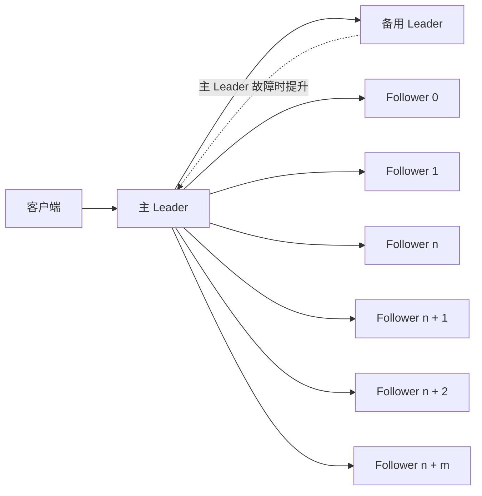

*图 4.1 单 leader 复制与主从 leader 故障转移。图改编自 Artur Ejsmont 的* Web Scalability for Startup Engineers *一书图 5.4（McGraw Hill，2015）。*

单个节点有最大吞吐上限，而这个吞吐还要与其 followers 共享，因此 followers 的数量也有上限，进而限制了读扩展能力。若想进一步扩展读取，可以使用图 4.2 所示的多级复制（multi-level replication）：followers 形成多层级结构，像金字塔一样，每一层向下一层复制。每个节点只向自己能承受的 followers 数量复制，代价是一致性进一步延迟。

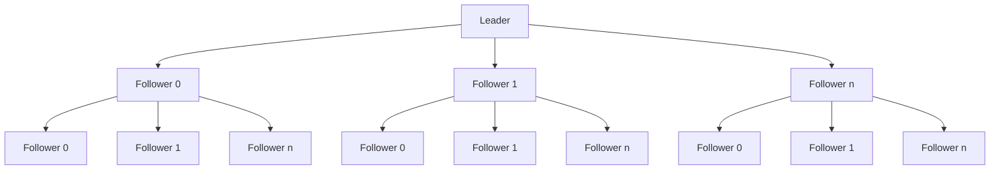

*图 4.2 多级复制。每个节点向自己的 followers 复制，而这些 followers 又继续向它们的 followers 复制。这种架构保证每个节点只向自己能处理的 follower 数量复制，但代价是一致性会进一步延迟。*

单 leader 复制是最容易实现的。它的主要限制是：整个数据库必须能放进单台主机。另一个限制是最终一致性，因为写入复制到 followers 需要时间。

MySQL 基于 binlog 的复制就是单 leader 复制的一个例子。关于这点，可参考 Ejsmont 的 *Web Scalability for Startup Engineers* 第 5 章。以下在线文档也相关：

- `https://dev.to/tutelaris/introduction-to-mysql-replication-97c`
- `https://dev.mysql.com/doc/refman/8.0/en/binlog-replication-configuration-overview.html`
- `https://www.digitalocean.com/community/tutorials/how-to-set-up-replication-in-mysql`
- `https://docs.microsoft.com/en-us/azure/mysql/single-server/how-to-data-in-replication`
- `https://www.percona.com/blog/2013/01/09/how-does-mysql-replication-really-work/`
- `https://hevodata.com/learn/mysql-binlog-based-replication/`

#### 扩展单 leader 复制的一个“权宜之计”：把查询逻辑放到应用层

人工录入的字符串使数据库体积增长较慢，这一点你可以通过简单估算和计算验证。但如果数据是程序自动生成的，或者已经积累很长时间，存储规模可能会增长到超出单节点能力。

如果我们无法缩小数据库规模，但又想继续使用 SQL，一种可能的办法是把数据拆分到多个 SQL 数据库中。这意味着服务必须配置为连接多个 SQL 数据库，并且我们还要在应用中重写 SQL 查询，使其查询正确的数据库。

如果我们不得不把一张表拆分到两个或更多数据库中，那么应用就需要查询多个数据库并合并结果。查询逻辑不再封装在数据库中，而是“泄漏”到了应用层。应用必须保存元数据，以追踪哪些数据库包含哪些数据。这本质上就是带有应用层元数据管理的多 leader 复制。若多个服务都在使用这些数据库，维护这些服务和数据库会更加困难。

例如，如果我们的贝果咖啡馆推荐应用 Beigel 每天处理数十亿次搜索，那么记录搜索的单张 SQL 表 `fact_searches` 几天内就会增长到 TB 级。我们可以把这些数据分区到多个数据库中，每个数据库在自己的集群里。可以按天分区，每天创建一张新表，并按 `fact_searches_YYYY_MM_DD` 格式命名，例如 `fact_searches_2023_01_01` 和 `fact_searches_2023_01_02`。所有查询这些表的应用都需要包含这套分区逻辑，在这个例子中就是表名约定。更复杂的场景中，某些客户交易量极大，我们可能需要专门为他们建表。如果对搜索 API 的查询很多来自其他美食推荐应用，我们可能会为这些公司分别建表，例如 `fact_searches_a_2023_01_01` 用于存放 2023 年 1 月 1 日所有公司名以 A 开头的企业发起的搜索。我们还可能需要另一张 SQL 表 `search_orgs`，存储向 Beigel 发起搜索请求的公司元数据。

我们可以在讨论中把这当作一种可能性提出来，但几乎不可能真正采用这个设计。我们更应该使用具备多 leader 复制或无 leader 复制能力的数据库。

### 4.3.3 多 leader 复制

多 leader 复制和无 leader 复制都可以用于扩展写入和数据库存储规模。它们都需要处理竞争条件（race conditions），这是单 leader 复制中不存在的问题。

在多 leader 复制中，顾名思义，会有多个节点被指定为 leaders，写请求可以发往任意一个 leader。每个 leader 都必须把自己的写入复制到所有其他节点。

#### 一致性问题与应对方式

这种复制方式会给那些对顺序敏感的操作引入一致性问题和竞争条件。例如，一行数据在某个 leader 上被更新的同时，在另一个 leader 上被删除，最终结果应该是什么？

使用时间戳来排序操作是行不通的，因为不同节点上的时钟不可能完全同步。尝试让不同节点使用同一个时钟也不行，因为每个节点接收到时钟信号的时间不同，这是一种众所周知的现象，称为时钟偏斜（clock skew）。因此，即便服务器时钟会周期性与同一来源同步，也仍会相差几毫秒甚至更多。如果查询落在比这个差异更短的时间区间内发送到不同服务器上，就无法确定它们的先后顺序。

这里讨论一些系统设计面试中常见的复制问题和与一致性相关的场景。这些情况可能出现在任何存储格式中，包括数据库和文件系统。Martin Kleppmann 的 *Designing Data-Intensive Applications* 及其参考资料，对复制陷阱有更系统的讨论。

数据库一致性的定义是什么？一致性指的是数据库事务必须把数据库从一个有效状态带到另一个有效状态，并保持数据库不变式；任何写入数据库的数据都必须符合所有定义好的规则，包括约束、级联、触发器，或者这些规则的任意组合。

正如本书其他地方讨论过的，一致性是个定义复杂的概念。一个常见的非正式理解是：对每个用户来说，数据都应该相同：

1. 对多个副本执行同一查询，即便这些副本位于不同物理服务器上，也应该返回相同结果。
2. 在不同物理服务器上执行影响同一行的 DML 查询（如 `INSERT`、`UPDATE` 或 `DELETE`）时，应按它们被发送的顺序执行。

我们也许可以接受最终一致性，但对某个特定用户而言，他接收到的数据必须对他来说是一个有效状态。例如，用户 A 查询某个计数器的值，然后把它加一，再次查询时，对用户 A 来说，返回值应当已经加一。同时，其他用户查询这个计数器时，仍然可能看到加一之前的值。这称为写后读一致性（read-after-write consistency）。

总的来说，要寻找放宽一致性要求的方法。寻找那些可以尽量减少“必须对所有用户保持一致的数据量”的办法。

在不同物理服务器上执行且影响同一行的 DML 查询，可能造成竞争条件。可能出现的情况包括：

- 对同一张带主键的表中的同一行同时执行 `DELETE` 和 `INSERT`。如果 `DELETE` 先执行，该行最终应存在；如果 `INSERT` 先执行，那么主键会阻止插入成功，随后 `DELETE` 应删除该行。
- 对同一个单元格执行两次不同值的 `UPDATE`。最终状态只能保留其中一个值。

那么，如果 DML 查询在同一毫秒被发送到不同服务器，会怎样？这种情况极其不常见，而且似乎也没有公认约定去解决这类竞争条件。我们可以提出不同处理办法，例如优先让 `DELETE` 胜过 `INSERT/UPDATE`，而其他 `INSERT/UPDATE` 则随机打破平局。无论如何，一个合格的面试官不会在 50 分钟面试里浪费时间讨论这种无法产生有效信号的问题。

### 4.3.4 无 leader 复制

在无 leader 复制（leaderless replication）中，所有节点地位相同。读写都可以发生在任意节点上。

如何处理竞争条件？一种办法是引入法定人数（quorum）的概念。quorum 是指达成共识所需的最小节点数。很容易推导出：如果数据库有 `n` 个节点，而读和写的 quorum 都是 `n/2 + 1` 个节点，那么一致性就能得到保证。

如果我们追求一致性，就要在“快写”和“快读”之间取舍。如果要求写快，就设置较低的写 quorum 和较高的读 quorum；如果要求读快，则反之。否则，就只能做到最终一致性，而 `UPDATE` 与 `DELETE` 操作将无法保持一致。

Cassandra、Dynamo、Riak 和 Voldemort 都是使用无 leader 复制的数据库。Cassandra 中，`UPDATE` 操作会受到竞争条件影响，而 `DELETE` 操作则通过 tombstone 实现，而不是真正删除行。在 HDFS 中，读取和复制基于机架局部性（rack locality），而所有副本地位平等。

### 4.3.5 HDFS 复制

本节是关于 HDFS、Hadoop 与 Hive 的简要复习，更详细内容超出本书范围。

HDFS 复制并不能完全归入前述三种方式中的任何一种。一个 HDFS 集群包含一个 active NameNode、一个 passive（备份）NameNode，以及多个 DataNode 节点。NameNode 负责执行文件系统命名空间操作，例如打开、关闭和重命名文件与目录，也负责决定 block 到 DataNode 的映射。DataNodes 负责向文件系统客户端提供读写请求服务，同时还会按照 NameNode 的指令执行 block 的创建、删除与复制。用户数据本身不会流经 NameNode。

HDFS 中，一张表会被存储为目录中的一个或多个文件。每个文件又被分成多个 block，这些 block 分布在不同的 DataNode 节点上。默认 block 大小为 64 MB；管理员可以修改这个值。

Hadoop 是一个基于 MapReduce 编程模型存储和处理分布式数据的框架。Hive 是构建在 Hadoop 之上的数据仓库方案。Hive 支持按一个或多个列对表做分区，以便高效执行过滤查询。例如，我们可以创建这样一张 Hive 分区表：

```sql
CREATE TABLE sample_table (user_id STRING, created_date DATE,
    country STRING) PARTITIONED BY (created_date, country);
```

图 4.3 展示了这张表的目录树。表目录下有按日期值建立的子目录，而日期子目录下又有按列值建立的子目录。按 `created_date` 和/或 `country` 过滤的查询，只会处理相关文件，从而避免整表扫描的浪费。

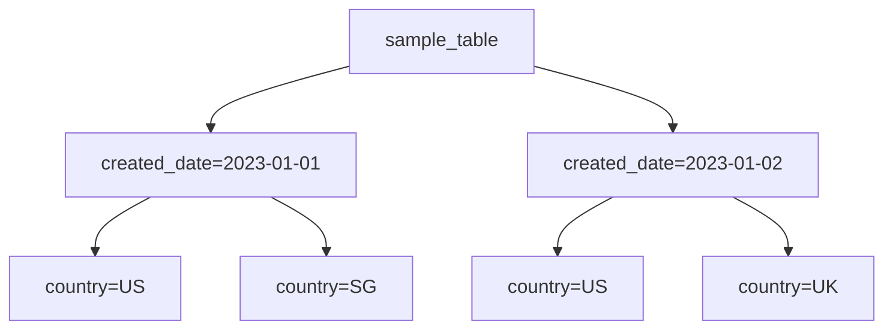

*图 4.3 表 `sample_table` 的一个 HDFS 目录树示例。它的列包含 date 和 country，并按这两个列分区。`sample_table` 目录下有按日期值建立的子目录，日期目录下再按列值建立子目录。来源：`https://stackoverflow.com/questions/44782173/hive-does-hive-support-partitioning-and-bucketing-while-usiing-external-tables`。*

HDFS 是只追加（append-only）的，不支持 `UPDATE` 或 `DELETE`，这可能正是为了避免这些操作带来的复制竞争条件；而 `INSERT` 不存在这种竞争条件。

HDFS 支持名称配额（name quota）、空间配额（space quota）和存储类型配额（storage type quota）。对于目录树而言：

- **名称配额**：文件名和目录名总数的硬上限。
- **空间配额**：所有文件字节总数的硬上限。
- **存储类型配额**：特定存储类型使用量的硬上限。HDFS 存储类型不在本书讨论范围内。

> [!TIP] 提示
> Hadoop 和 HDFS 的新手常会使用 Hadoop 的 `INSERT` 命令，但应避免这样做。一次 `INSERT` 查询会创建一个只含一行的新文件，却会占用整个 64 MB block，非常浪费。它还会增加名称数量，程序化 `INSERT` 很快就会耗尽名称配额。详情可参见 `https://hadoop.apache.org/docs/current/hadoop-project-dist/hadoop-hdfs/HdfsQuotaAdminGuide.html`。更合理的做法是直接追加写入 HDFS 文件，同时确保追加行与原有行字段一致，以避免数据不一致和处理错误。

如果我们使用的是会把数据写到 HDFS 的 Spark，那么应使用 `saveAsTable` 或 `saveAsTextFile`，例如下面的代码片段。可参考 Spark 文档，例如 `https://spark.apache.org/docs/latest/sql-data-sources-hive-tables.html`。

```scala
val spark = SparkSession.builder().appName("Our app").config("some.config",
     "value").getOrCreate()
val df = spark.sparkContext.textFile({hdfs_file})
 df.createOrReplaceTempView({table_name})
 spark.sql({spark_sql_query_with_table_name}).saveAsTextFile({hdfs_directory})
```

### 4.3.6 延伸阅读

关于以下主题，可参考 Martin Kleppmann 的 *Designing Data-Intensive Applications*（O'Reilly，2017）：

- 一致性技术，例如 read repair、anti-entropy 和 tuples。
- 多 leader 复制的共识算法，以及 CouchDB、MySQL Group Replication 和 Postgres 中的实现。
- 故障转移问题，例如 split brain。
- 用于解决这些竞争条件的各种共识算法。共识算法用于就某个数据值达成一致。

## 4.4 用分片数据库扩展存储容量

如果数据库规模增长到超出单台主机容量，我们就必须删除旧行。如果这些旧数据还需要保留，就应该把它们存到 HDFS 或 Cassandra 之类的分片存储中。分片存储可水平扩展，理论上只要不断增加主机，就能支持无限存储容量。生产环境中已经存在超过 100 PB 的 HDFS 集群（`https://eng.uber.com/uber-big-data-platform/`）。从理论上说，YB 级集群也是可能的，但要存储并分析如此规模的数据，硬件成本会高得难以接受。

> [!TIP] 提示
> 我们可以使用 Redis 这类低延迟数据库来存储直接面向用户提供服务的数据。

另一种办法是把数据存放在用户设备上，或者浏览器的 cookies 与 `localStorage` 中。但这意味着任何对此数据的处理都必须在前端完成，而不能在后端完成。

### 4.4.1 分片 RDBMS

如果我们必须使用 RDBMS，而数据量又超出单节点可容纳范围，可以使用 Amazon RDS 之类的分片 RDBMS 方案（`https://aws.amazon.com/blogs/database/sharding-with-amazon-relational-database-service/`），或自行实现分片 SQL。这些方案会对 SQL 操作施加限制：

- **`JOIN` 查询会更慢**。一条 `JOIN` 查询会涉及各节点之间的大量网络流量。考虑两张表按某一列做 `JOIN`。如果两张表都被分片到各个节点上，那么一张表的每个分片都需要把该列中的每一行，与另一张表中该列的每一行进行比较。如果 `JOIN` 恰好发生在作为分片键的列上，那么 `JOIN` 会高效得多，因为每个节点都知道该去哪些节点上执行 `JOIN`。我们可以把 `JOIN` 限制在这种列上。
- **聚合操作同时涉及数据库和应用**。某些聚合比其他聚合更容易，例如 `sum` 或 `mean`：每个节点只需先做求和和/或计数，再把聚合值返回给应用，由应用做简单算术得到最终结果。而像中位数和百分位数这样的聚合会更复杂，也更慢。

## 4.5 聚合事件

数据库写入既难扩展又昂贵，因此在系统设计中，只要可能，我们就应该降低数据库写入速率。采样（sampling）和聚合（aggregation）是降低数据库写速率的常见技术，额外收益是数据库体积增长更慢。

除了减少数据库写，我们也可以通过缓存和近似计算等技术减少数据库读。第 17 章会介绍 Count-Min Sketch，它是一种为连续数据流中的事件构建近似频率表的算法。

对数据做采样，是指只考虑部分数据点而忽略其他数据点。采样策略有很多种，例如每隔第 `n` 个点采一个，或者随机采样。用于写入时，采样意味着我们会以低于“写入全部数据点”的速率写入数据。采样在概念上很简单，是面试中可以提到的内容。

聚合事件则是把多个事件聚合/合并成一个事件，于是原本需要多次数据库写入，现在只需要一次写入。如果单个事件的精确时间戳并不重要，我们就可以考虑聚合。

聚合可以用流式管道实现。流式管道的第一层可能接收极高的事件速率，因此需要一个包含数千台主机的大型集群。如果没有聚合，后续每一层也都需要类似规模的集群。聚合可以使后续每一层所需主机更少。我们还会用复制和 checkpointing 来应对主机故障。结合第 5 章，我们可以使用 Saga 或 quorum writes 等分布式事务算法，确保每个事件至少被复制到最少数量的副本上。

### 4.5.1 单层聚合

聚合可以是单层，也可以是多层。图 4.4 展示了一个单层聚合的例子，用于统计各值的数量。在这个例子中，一个事件的值可以是 A、B、C 等。这些事件可以由负载均衡器均匀分布到各主机上。每台主机都可以在内存中维护一个哈希表，并在哈希表里做聚合计数。每台主机可以周期性（例如每 5 分钟）把这些计数刷写到数据库，或者在内存快耗尽时刷写，以先发生者为准。

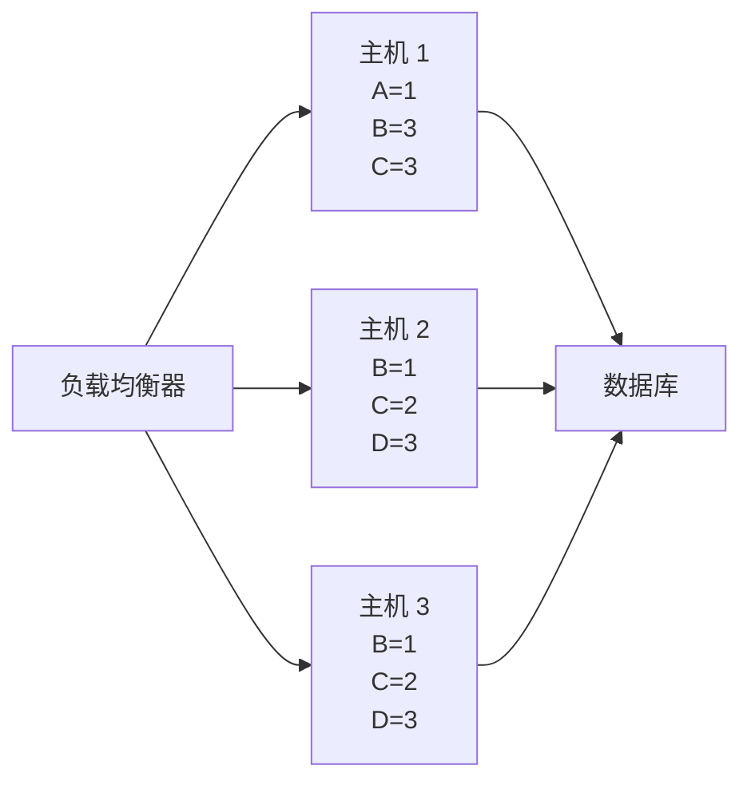

*图 4.4 单层聚合示意。负载均衡器把事件分发到单层主机，这些主机完成聚合后，再把聚合计数写入数据库。若每个单独事件都直接写数据库，写入速率会高得多，数据库也必须扩容。图中未展示主机副本；若需要高可用和高准确性，则必须有副本。*

### 4.5.2 多层聚合

图 4.5 展示了多层聚合。每一层主机都可以聚合来自前一层祖先节点的事件。我们可以逐层减少主机数量，直到最后一层达到一个期望值（这个值由需求和资源决定），由最后一层负责写数据库。

聚合的主要权衡是最终一致性和复杂度增加。每增加一层，都会给管道和数据库写入增加一些延迟，因此数据库读到的数据可能是陈旧的。实现复制、日志、监控和告警，也都会增加系统复杂度。

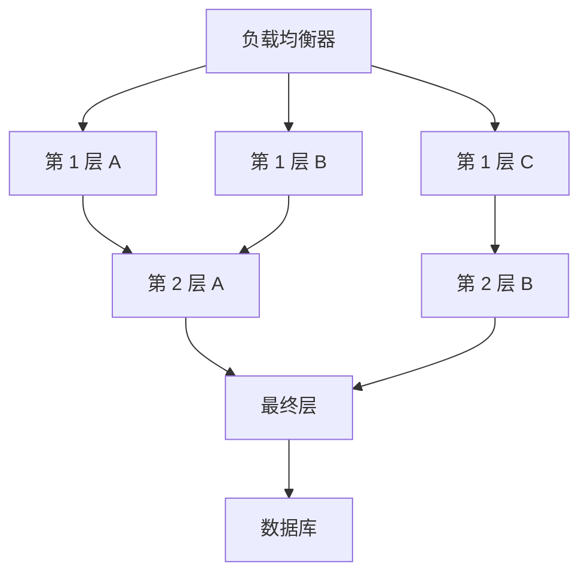

*图 4.5 多层聚合示意。它与多级复制在结构上近似互为反向。*

### 4.5.3 分区

这要求使用七层负载均衡器（level 7 load balancer，简要说明参见 3.1.2 节）。负载均衡器可以被配置为处理输入事件，并根据事件内容把它们转发到不同主机。

参考图 4.6，如果事件只是 A–Z 之间的值，那么负载均衡器可以把 A–I 的事件转发到某些主机，J–R 的事件转发到另一些主机，而 S–Z 的事件再转发到其他主机。第一层主机中的哈希表会被聚合到第二层主机，再聚合到最终的哈希表主机，最后该哈希表会发送给一个 max-heap 主机，由它构建最终的 max-heap。

我们可以预计事件流量会服从正态分布，这意味着某些分区会接收到明显更高的流量。为了解决这个问题，图 4.6 展示了：我们可以给不同分区分配不同数量的主机。分区 A–I 有三台主机，J–R 有一台主机，S–Z 有两台主机。之所以这样做，是因为分区间流量并不均衡，某些主机会接收到不成比例的高流量（即变成“热点”），超过其处理能力。

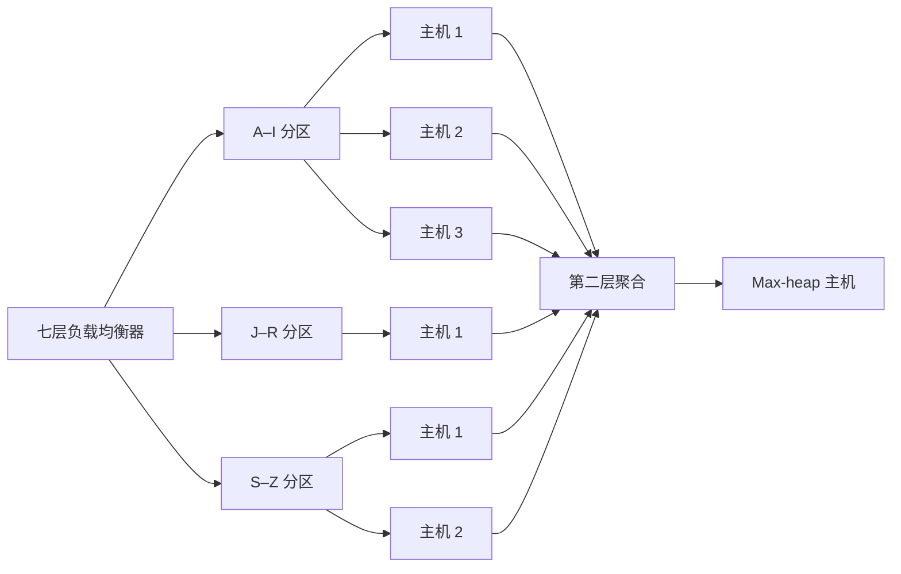

*图 4.6 带分区的多层聚合示意。*

我们也可以看到，J–R 分区只有一台主机，因此它没有第二层。作为设计者，我们可以根据实际情况做出这种选择。

除了给不同分区分配不同数量的主机，另一种更均匀分配流量的方法是调整分区的数量和宽度。例如，不再使用 `{A-I, J-R, S-Z}`，而改成 `{{A-B, D-F}, {C, G-J}, {K-S}, {T-Z}}`。也就是说，我们把三个分区改成四个分区，并把 C 放进第二个分区。为满足系统的可扩展性要求，我们可以创造性、动态地调整这些方案。

### 4.5.4 处理大键空间

前一节图 4.6 展示的是一个只有 26 个键（A–Z）的小键空间。真实实现里，键空间会大得多。我们必须确保某一层的键空间总和，不会导致下一层内存溢出。较早层级的主机应将自身键空间限制在低于本机可实际承载的大小，这样较后层级的主机才有足够内存容纳所有键。这意味着，较早层级主机可能需要更频繁地刷写。

例如，图 4.7 展示了一个只有两层的简单聚合服务。第一层有两台主机，第二层有一台主机。第一层的两台主机，应把各自键空间限制在它们实际可容纳的一半，这样第二层主机才能容纳全部键。

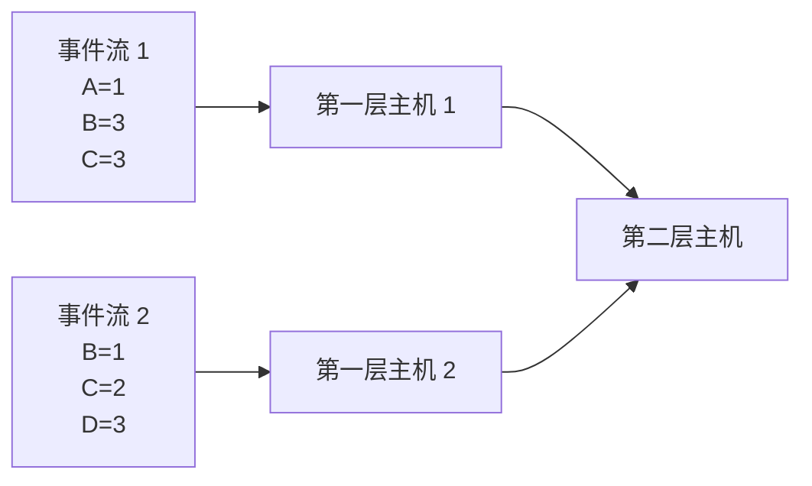

*图 4.7 一个只有两层的简单聚合服务：第一层两台主机，第二层一台主机。*

我们也可以为较早层级配置内存更小的主机，而在较后层级配置内存更大的主机。

### 4.5.5 复制与容错

到目前为止，我们还没有讨论复制与容错。如果某台主机宕机，它会丢失自己聚合的全部事件。而且这是一种级联故障：更早层级的主机可能因此溢出，从而这些聚合事件也一起丢失。

我们可以使用 3.3.6 节和 3.3.7 节讨论过的 checkpointing 与死信队列（dead letter queue）。但是，如果一个很深层的主机故障影响到大量主机，就必须重复大量处理，浪费资源，也会给聚合增加明显延迟。

一种可能的解决办法是：把每个节点改造成一个独立服务，该服务由多个无状态节点构成集群，并向共享内存数据库（如 Redis）发起请求。图 4.8 展示了这样的服务。该服务可以有多台主机（例如 3 台无状态主机），由共享负载均衡服务把请求分散到这些主机上。这里不太担心可扩展性，因此每个服务只需要少量主机（例如 3 台）即可实现容错。

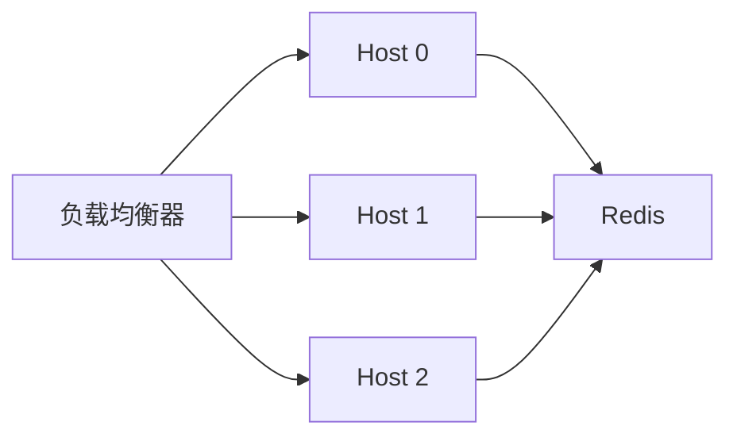

*图 4.8 我们可以用一个服务替代单个节点，这里称为一个聚合单元（aggregation unit）。该单元有 3 台无状态主机用于容错；如有需要，也可以使用更多主机。*

在本章开头，我们讨论过希望避免数据库写入，而这里看起来像是自相矛盾。然而，每个服务都有自己独立的 Redis 集群，因此不会争抢写同一个键。而且，这些聚合事件在每次成功刷写后都会删除，因此数据库规模不会失控增长。

> [!NOTE] 注
> 我们可以用 Terraform 来定义整个聚合服务。每个聚合单元都可以是一个 Kubernetes 集群，包含 3 个 pod，并且每个 pod 1 台主机（如果使用 sidecar 服务模式，则每个 pod 2 台主机）。

## 4.6 批处理与流式 ETL

ETL（Extract, Transform, Load）是一种通用过程：把数据从一个或多个来源复制到目标系统中，而目标系统会以不同于来源的方式、或在不同语境下表示这些数据。批处理（batch）指按批次处理数据，通常是周期性的，但也可以手动触发。流处理（streaming）指对连续不断的数据流做实时处理。

我们可以把 batch 和 streaming 类比为轮询（polling）与中断（interrupt）。类似轮询，批处理任务总会按定义好的频率运行，无论是否有新事件待处理；而流任务则会在触发条件满足时运行，通常是某个新事件被发布时。

批处理的一个例子是为客户生成月度账单（例如 PDF 或 CSV 文件）。如果生成这些账单所需的数据只会在每月某个日期到齐（例如供应商账单月末出具，我们再基于它们为客户生成账单），这种批处理就尤其合适。如果生成这些周期文件所需的数据全部在组织内部产生，我们可以考虑 Kappa 架构（见第 17 章），改用流任务，在每条数据一旦可用时立即处理。这样做的好处是：月度文件几乎可以在月末一结束就可用；数据处理成本会分散到整个月；而且逐条处理小数据块的函数，也比处理 GB 级数据的批处理任务更容易调试。

Airflow 和 Luigi 是常见的批处理工具。Kafka 和 Flink 是常见的流处理工具。Flume 和 Scribe 是面向日志的专用流工具，它们会聚合来自大量服务器的实时日志流。这里简要介绍一些 ETL 概念。

一个 ETL 管道由有向无环图（DAG）的任务组成。图中的一个节点对应一个任务，而它的祖先节点就是它的依赖。一个 job 则是一次 ETL 管道的单次运行。

### 4.6.1 一个简单的批处理 ETL 管道

一个简单的批处理 ETL 管道，可以用 `crontab`、两张 SQL 表，以及每个任务对应的一个脚本（即用脚本语言编写的程序）来实现。`cron` 适用于小型、非关键、没有并行性且单机足够承载的任务。下面是两张示例 SQL 表：

```sql
CREATE TABLE cron_dag (
  id INT,         -- ID of a job.
  parent_id INT,      -- Parent job. A job can have 0, 1, or multiple
     parents.
  PRIMARY KEY (id),
  FOREIGN KEY (parent_id) REFERENCES cron_dag (id)
);
CREATE TABLE cron_jobs (
  id INT,
  name VARCHAR(255),
  updated_at INT,
  PRIMARY KEY (id)
);
```

`crontab` 的内容可以是一串脚本调用。在这个例子里，脚本用 Python 写成，但也可以使用任意脚本语言。我们可以把所有脚本都放到公共目录 `/cron_dag/dag/` 下，其余 Python 文件/模块放在其他目录中。文件如何组织没有固定规则，应由我们自己选择最合适的方式：

```bash
0 * * * * ~/cron_dag/dag/first_node.py
0 * * * * ~/cron_dag/dag/second_node.py
```

每个脚本可以遵循以下算法，其中第 1、2 步可以抽象成可复用模块：

1. 检查相关任务的 `updated_at` 是否小于其依赖任务。
2. 必要时触发监控。
3. 执行具体任务。

这种方案的主要缺点是：

- **不可扩展**。所有任务都跑在一台主机上，会带来单机的所有常见问题：
  - 单点故障。
  - 某些时间点计划执行的任务太多，计算资源可能不足。
  - 主机存储容量可能被耗尽。
- 一个任务可能由许多更小的子任务组成，比如向数百万台设备发送通知。如果这类任务失败并需要重试，我们必须避免重复执行那些已经成功的子任务（即单个子任务应当是幂等的）。这种简单设计无法提供这种幂等性。
- 没有校验工具来保证 Python 脚本中的 job ID 与 SQL 表中的 job ID 一致，因此容易受到编程错误影响。
- 没有 GUI（除非我们自己做一个）。
- 我们还没有实现日志、监控与告警。这非常重要，应当作为下一步。例如，如果任务运行时失败，或主机在任务执行中崩溃了，会怎样？我们必须确保已调度的任务能成功完成。

> [!QUESTION] 问题
> 我们如何把这个简单的批处理 ETL 管道做水平扩展，以改进它的可扩展性与可用性？

专用任务调度系统包括 Airflow 和 Luigi。这些工具自带 Web UI，可视化 DAG，也更便于图形化使用。它们还可以纵向扩展，并能运行在集群上以管理大量任务。本书中，只要需要批处理 ETL 服务，我们都会使用组织级共享的 Airflow 服务。

### 4.6.2 消息传递术语

本节澄清技术讨论或文献中经常遇到的一些消息与流式处理术语。

#### 消息系统（Messaging system）

消息系统是一个通用术语，指把数据从一个应用传输到另一个应用的系统，以降低应用中数据传输与共享的复杂度，让应用开发者能专注于数据处理。

#### 消息队列（Message queue）

一条消息包含一个工作对象（work object）或指令，从一个服务发送到另一个服务，并在队列中等待处理。每条消息只会被单个消费者处理一次。

#### 生产者/消费者（Producer/consumer）

Producer/consumer，也称 publisher/subscriber 或 pub/sub，是一种异步消息系统，用来解耦“产生事件的服务”和“处理事件的服务”。一个 producer/consumer 系统包含一个或多个消息队列。

#### 消息代理（Message broker）

消息代理是一个程序，负责把发送方的正式消息协议翻译为接收方的正式消息协议。消息代理本质上是一层翻译层。Kafka 和 RabbitMQ 都属于消息代理。RabbitMQ 自称是“部署最广泛的开源消息代理”（`https://www.rabbitmq.com/`）。AMQP 是 RabbitMQ 支持的消息协议之一；AMQP 的详细介绍不在本书范围内。Kafka 则实现了自己的定制消息协议。

#### 事件流（Event streaming）

事件流是一个通用术语，指持续不断、实时处理的事件流。一个事件包含状态变化的信息。Kafka 是最常见的事件流平台。

#### Pull 与 Push

服务之间的通信可以通过 pull 或 push 完成。总体来说，pull 比 push 更好，而这正是 producer-consumer 架构背后的通用理念。

在 pull 模式中，消费者控制消息消费速率，因此不会被压垮。

在消费者开发过程中，我们可以对它进行负载测试和压力测试；通过监控它在生产流量下的吞吐与性能，并与测试结果对比，团队就能较准确地判断是否需要投入更多工程资源来改进测试。消费者还可以长期监控自身吞吐和生产者队列长度，团队也可据此按需扩容。

如果生产系统长期处于高负载状态，那么队列几乎不太可能长时间为空，消费者就可以持续轮询消息。如果我们必须维持一个大型流处理集群，以便在几分钟内处理不可预测的流量尖峰，那么最好让这个集群同时处理其他低优先级消息（例如组织内共享的 Flink、Kafka 或 Spark 服务）。

另一种 pull 优于 push 的情况，是用户侧处于防火墙之后，或者依赖方变化频繁，会导致过多 push 请求。相比 push，pull 还少一个配置步骤：用户本来就会向依赖方发请求，而依赖方通常不会向用户发请求。

但反过来，如果我们的系统通过爬虫从很多数据源采集数据（`https://engineering.linkedin.com/blog/2019/data-hub`），那么开发和维护所有这些爬虫可能会过于复杂且枯燥。让各个数据提供方把信息 push 到我们的中心仓库，可能更可扩展；push 也能提供更及时的更新。

另外一种 push 优于 pull 的例外，是有损应用（lossy applications），例如音频和视频直播。这类应用不会重发第一次传输失败的数据，而且通常使用 UDP 来把数据 push 给接收方。

### 4.6.3 Kafka 与 RabbitMQ

在实践中，多数公司都会有一个共享 Kafka 服务，供其他服务使用。本书后续只要需要消息或事件流服务，都会采用 Kafka。面试中，与其冒着惹恼某位有强烈偏好的面试官的风险，不如展示你对 Kafka 和 RabbitMQ 细节及差异的了解，并讨论它们的权衡。

两者都可以用来平滑不均匀流量，防止服务被流量尖峰压垮，并让服务更具成本效率，因为我们无需只为了处理流量高峰而预配大量主机。

Kafka 比 RabbitMQ 更复杂，而且提供的是 RabbitMQ 能力的超集。换句话说，Kafka 总能替代 RabbitMQ，但反过来不成立。

如果 RabbitMQ 已经足够满足系统需求，我们可以建议使用 RabbitMQ；同时也可以说明，组织里很可能已经有 Kafka 服务可用，从而避免再去搭建和维护（包括日志、监控和告警）另一个组件（如 RabbitMQ）的麻烦。表 4.1 列出了 Kafka 与 RabbitMQ 的一些差异。

**表 4.1 Kafka 与 RabbitMQ 的一些差异**

| Kafka | RabbitMQ |
|---|---|
| 为可扩展性、可靠性和可用性而设计。搭建比 RabbitMQ 更复杂。 | 易于搭建，但默认并不可扩展。我们可以在应用层自行实现可扩展性，例如把应用挂在负载均衡器上，并向/从负载均衡器生产与消费消息。但这比 Kafka 需要更多搭建工作，而且成熟度低得多，几乎肯定在很多方面都更差。 |
| 需要 ZooKeeper 管理 Kafka 集群，包括在 ZooKeeper 中配置每台 Kafka 主机的 IP 地址。 | 不需要 ZooKeeper。 |
| 是持久消息代理，因为它有复制机制。我们可以在 ZooKeeper 中调整复制因子，并把复制安排到不同机架与数据中心。 | 默认不可扩展，因此默认也不持久。发生停机时消息会丢失。它有“lazy queue”特性，可把消息持久化到磁盘上以增强耐久性，但这并不能防止主机磁盘故障。 |
| 队列中的事件在消费后不会移除，因此同一事件可以被重复消费。这是为了容错：如果消费者在处理完成前失败，就可以重新处理该事件。从这个角度看，把 Kafka 称作“queue”在概念上并不准确；它其实更像 list。但“Kafka queue”这一说法很常见。 | 消息在出队后会被移除，这符合“队列”的定义。（RabbitMQ 3.9 于 2021 年 7 月 26 日发布了 stream：`https://www.rabbitmq.com/streams.html`，允许每条消息被重复消费，因此这一差异只适用于更早版本。）我们也可以创建多个队列来让每条消息被多个消费者处理，即每个消费者一个队列，但这并不是多队列设计的本意。 |
| 可以为 Kafka 设置保留期，默认是 7 天，因此无论事件是否被消费，7 天后都会删除。我们也可以把保留期设为无限，把 Kafka 当数据库使用。没有优先级概念。 | 支持 AMQP 标准中的单条消息队列优先级。我们也可以创建多个不同优先级的队列。只有高优先级队列为空时，低优先级队列消息才会出队。它没有公平性（fairness）或饥饿（starvation）控制概念。 |

### 4.6.4 Lambda 架构

Lambda 架构是一种大数据处理架构，它并行运行批处理和流处理管道。用更通俗的话说，它指的是同时存在一条“快管道”和一条“慢管道”，二者都更新同一个目标。快管道用一致性和准确性换取更低延迟（更快更新）；慢管道则相反。快管道通常采用以下技术：

- 近似算法（在 17.7 节讨论）。
- Redis 这类内存数据库。
- 为了更快处理，快管道中的节点可能不会复制自己处理的数据，因此在节点故障时可能会造成部分数据丢失，准确性也会降低。

慢管道通常使用 MapReduce 型数据库，例如 Hive 和 Spark with HDFS。对于涉及大数据且同时需要一致性和准确性的系统，我们可以建议采用 Lambda 架构。

#### 关于各种数据库方案的说明

数据库方案非常多。常见的有各类 SQL 发行版、Hadoop 与 HDFS、Kafka、Redis 和 Elasticsearch。较少见的还有 MongoDB、Neo4j、AWS DynamoDB 和 Google Firebase Realtime Database 等。一般而言，系统设计面试并不要求候选人掌握这些较少见的数据库，尤其是不常见的专有数据库。专有数据库很少被采用；如果创业公司真的采用了某个专有数据库，也应尽早考虑迁移到开源数据库。数据库规模越大，厂商锁定（vendor lock-in）就越严重，因为迁移会更困难、更容易出错、成本也更高。

Lambda 架构的替代方案之一是 Kappa 架构。Kappa 架构是一种处理流数据的软件架构模式，它使用单一技术栈同时完成批处理和流处理。它使用 Kafka 这类只追加不可变日志来存储输入数据，随后进行流处理，并把结果存入数据库供用户查询。关于 Lambda 与 Kappa 的详细比较，可参见 17.9.1 节。

## 4.7 反规范化

如果服务的数据能放进单台主机，一个典型做法是选择 SQL，并对 schema 做规范化。规范化的好处包括：

- 数据一致、没有重复，因此不会出现表之间数据互相矛盾。
- 插入和更新更快，因为只需查询一张表。在反规范化 schema 中，一次插入或更新可能需要查询多张表。
- 数据库体积更小，因为没有重复数据。更小的表意味着更快的读操作。
- 规范化表往往列更少，因此索引也更少。索引重建更快。
- 查询可以只 `JOIN` 真正需要的表。

规范化的缺点包括：

- `JOIN` 查询远慢于单表查询。实践中，很多反规范化正是出于这个原因。
- 事实表（fact tables）中保存的是代码而不是数据，因此无论是服务内查询还是临时分析查询，大多数都会包含 `JOIN`。`JOIN` 查询通常比单表查询更冗长，因此更难编写和维护。

面试中经常提到的一种提升读性能的办法，是用存储空间换速度：通过反规范化 schema 来避免 `JOIN` 查询。

## 4.8 缓存

对于把数据存放在磁盘中的数据库，我们可以把高频或近期查询缓存在内存中。在组织内部，不同数据库技术往往会作为共享数据库服务提供给用户，例如 SQL 服务，或 Spark with HDFS。这些服务同样也可以使用缓存，例如配套 Redis 缓存。

本节简要介绍各种缓存策略。缓存的收益包括以下方面的改善：

- **性能（Performance）**：这是缓存的直接收益，下面其他收益都可视为附带效果。缓存使用内存，而内存比使用磁盘的数据库更快，也更昂贵。
- **可用性（Availability）**：如果数据库不可用，服务仍可用，应用还可以从缓存取数据。但这只适用于已被缓存的数据。为了节省成本，缓存里通常只包含数据库中部分数据。然而，缓存的设计目标是高性能和低延迟，而不是高可用。为了获得高性能，缓存设计可能会牺牲可用性和其他非功能需求。我们的数据库应当是高可用的，绝不能依赖缓存来保障服务可用性。
- **可扩展性（Scalability）**：缓存通过承担高频请求，能吸收服务很大一部分负载。而且它比数据库更快，响应更快意味着任意时刻处于打开状态的 HTTP 连接更少，因此更小的后端集群也能承载同样流量。然而，如果你的缓存主要为低延迟而设计，并可能用牺牲可用性的方式来换性能，那么把它作为扩展性手段并不明智。例如，人们通常不会跨数据中心复制缓存，因为跨数据中心请求本身很慢，违背了缓存改善延迟的初衷。因此，一旦某个数据中心发生故障（例如网络问题），缓存会不可用，所有负载都会转移到数据库，数据库可能无法承受。后端服务应有速率限制，并且该限制要根据后端与数据库容量进行设置。

缓存可以发生在很多层级，包括客户端、API Gateway（Rob Vettor、David Coulter、Genevieve Warren，《Caching in a cloud-native application》，Microsoft Docs，2020-05-17，`https://docs.microsoft.com/en-us/dotnet/architecture/cloud-native/azure-caching`），以及每个服务内部（Cornelia Davis，《Cloud Native Patterns》，Manning Publications，2019）。图 4.9 展示了 API Gateway 层的缓存。这个缓存可以独立于服务扩缩容，以承载任意时刻的流量。

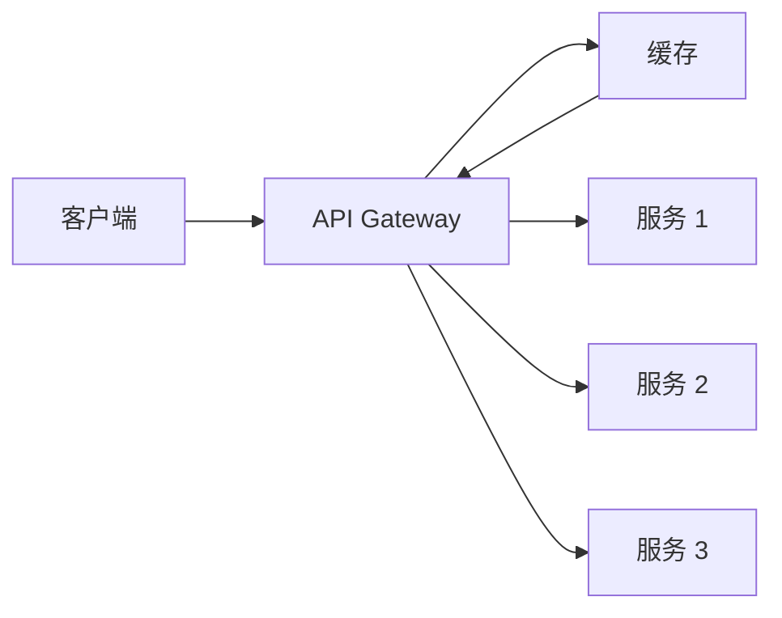

*图 4.9 在 API Gateway 处缓存。图改编自 Rob Vettor、David Coulter、Genevieve Warren 于 2020 年 5 月 17 日发表于 Microsoft Docs 的《Caching in a cloud-native application》。*

### 4.8.1 读取策略

读取策略以提升读性能为目标。

#### Cache-aside（惰性加载）

Cache-aside 指缓存“位于”数据库一旁。图 4.10 展示了 cache-aside。在读取请求中，应用先向缓存发起读取；若缓存命中，则直接返回数据。若缓存未命中，应用再向数据库发起读取，然后把数据写入缓存，以便后续请求命中。因此，数据只在第一次读取时加载，这称为惰性加载（lazy load）。

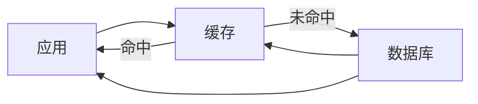

*图 4.10 Cache-aside 示意图。*

Cache-aside 最适合读多写少的负载。优点如下：

- Cache-aside 能把读请求数和资源消耗降到最低。
- 为了进一步减少请求数，应用还可以把多个数据库请求的结果，合并为一个缓存值（即：用单个缓存键保存多个数据库请求的结果）。
- 只有真正被请求的数据才会写入缓存，因此我们很容易估算所需缓存容量，并按需调整以节省成本。
- 实现简单。

如果缓存集群宕机，所有请求都会落到数据库上。我们必须确保数据库能够承受这部分负载。其缺点如下：

- 缓存数据可能变旧/不一致，特别是当写入是直接写数据库时。为了降低陈旧性，我们可以设置 TTL，或者使用 write-through（见下文），让每次写入都经过缓存。
- 一次缓存未命中的请求，反而比直接访问数据库更慢，因为它多了一次对缓存的读取和一次对缓存的写入。

#### Read-through

在 read-through、write-through 或 write-back 缓存中，应用都只向缓存发请求；必要时由缓存去向数据库发请求。

图 4.11 展示了 read-through、write-through 或 write-back 缓存的架构。在 read-through 缓存上发生读未命中时，缓存会向数据库发起请求，把数据存入缓存（也属于惰性加载，和 cache-aside 一样），然后再把数据返回给应用。


*图 4.11 在 read-through、write-through 或 write-back 缓存中，应用向缓存发请求，必要时由缓存向数据库发请求。因此，这张简单架构图可以同时表示这三种缓存策略。*

Read-through 最适合读多写少负载。由于应用不直接访问数据库，数据库请求的实现负担就从应用转移到了缓存。它的代价是：不同于 cache-aside，read-through 不能把多个数据库请求合并成一个缓存值。

### 4.8.2 写入策略

写入策略的目标是尽量减少缓存陈旧性，代价是更高的延迟或更高的复杂度。

#### Write-through

每次写都先经过缓存，再写入数据库。优点：

- 一致性好。缓存永不过时，因为每次数据库写入都会同步更新缓存。

缺点：

- 写更慢，因为每次写都同时落到缓存和数据库。
- 冷启动问题（cold start）：新缓存节点没有数据，会产生大量缓存未命中。可以用 cache-aside 缓解。
- 大多数数据从未被读取，因此会带来不必要成本。可以配置 TTL（time-to-live）减少浪费空间。
- 如果缓存比数据库小，我们必须决定最合适的缓存淘汰策略。

#### Write-back / Write-behind

应用把数据写到缓存，但缓存不会立刻写入数据库，而是周期性地把更新数据刷写到数据库。优点：

- 平均写入速度比 write-through 更快，因为写数据库不是阻塞式的。

缺点：

- 除“写更慢”之外，具备与 write-through 相同的其他缺点。
- 更复杂，因为缓存本身必须高可用，不能为了性能/延迟而牺牲可用性。设计会更加复杂，因为它必须同时满足高可用和高性能。

#### Write-around

在 write-around 中，应用只写数据库。结合图 4.12，write-around 通常与 cache-aside 或 read-through 一起使用。缓存只在读未命中时更新。

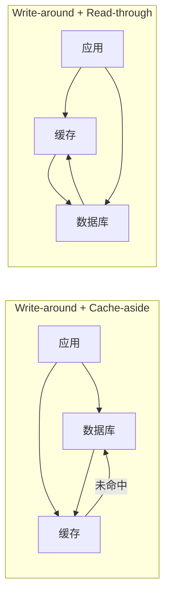

*图 4.12 Write-around 的两种可能架构。（左）Write-around + Cache-aside。（右）Write-around + Read-through。*

## 4.9 作为独立服务的缓存

为什么缓存是一个独立服务？为什么不直接把缓存放在服务主机的内存里？

- 服务按设计应保持无状态，因此每次请求会随机分配到某台主机。由于每台主机缓存的数据都可能不同，因此某台主机更不容易命中它接收到的特定请求。这与数据库不同：数据库是有状态的，而且可以分区，因此每个数据库节点更可能持续服务同一批数据。
- 延续上一点，缓存尤其适合处理不均匀请求模式所导致的热点分片（hot shards）。如果请求或响应都是唯一的，那么缓存毫无意义。
- 如果把缓存放在主机内存中，那么每次服务部署都会把缓存清空，而部署可能一天发生多次。
- 我们可以独立于服务扩展缓存（当然也伴随本章前面讨论过的风险）。缓存服务可以使用针对缓存这种非功能需求优化过的专用硬件或虚拟机，而这些要求可能与它所服务的业务服务不同。
- 如果很多客户端同时发送相同请求，而该请求恰好缓存未命中，那么数据库服务会重复执行同一个查询很多次。缓存可以对请求去重，只向服务发送一个请求。这称为请求合并（request coalescing），可减少业务服务的流量。

除了在后端服务上做缓存，我们还应尽量在客户端（浏览器或移动应用）上缓存，以避免网络请求开销。也应考虑使用 CDN。

## 4.10 不同类型数据应如何缓存的示例

我们既可以缓存 HTTP 响应，也可以缓存数据库查询。可以缓存 HTTP 响应体，并使用请求的 HTTP 方法和 URI 作为缓存键。在应用内部，我们可以使用 cache-aside 模式来缓存关系型数据库查询。

缓存可以是私有的，也可以是公共/共享的。私有缓存位于客户端，适合个性化内容。公共缓存位于代理（例如 CDN）或我们的服务上。

不应被缓存的信息包括：

- 私密信息绝不能进入缓存，例如银行账户信息。
- 实时公共信息，例如股票价格，或近期航班到达时间、酒店房间可用性。
- 对于需要付费的内容或受版权保护的内容（如书籍、视频），不要使用私有缓存。
- 可能变化的公共信息可以缓存，但应重新向源站校验。例如下个月的机票或酒店房间可用性。此时服务端返回的可能只是一个 `304` 状态码，用来确认缓存仍然新鲜，因此这个响应会比“无缓存时返回完整响应”小得多，也就改善了网络延迟与吞吐。我们会设置一个 `max-age`，表示我们判断该缓存响应能保持新鲜多久。但如果未来条件变化，导致这个 `max-age` 变得过长，我们可能希望在后端中实现逻辑，快速校验缓存是否仍然新鲜。若采用这种做法，就应在响应中返回 `must-revalidate`，这样客户端在使用缓存前会先向后端重新校验。

对于长时间不会变化的公共信息，可以设置较长缓存过期时间。例如公交或火车时刻表。

一般来说，公司可以通过尽可能把处理和存储下推到客户端设备上来节省硬件成本，而数据中心只负责关键数据备份和用户间通信。例如，WhatsApp 会存储用户认证信息和联系人关系，但不会存储消息本身（消息通常占据用户存储的大头）。它提供 Google Drive 备份，因此把消息备份成本转嫁给了另一家公司。省掉这部分成本后，WhatsApp 才能继续对用户免费，而超出免费存储额度后则由用户向 Google 付费。

不过，我们不应假设 `localStorage` 缓存一定能按预期工作，所以必须始终预期缓存未命中，并让服务准备好接收这些请求。我们应在每一层做缓存（客户端/浏览器、负载均衡器、前端/API Gateway/sidecar 以及后端），让请求尽可能少地穿过服务层级，从而降低延迟与成本。

浏览器只有在下载并处理完网页全部 CSS 文件后才会开始渲染，因此浏览器对 CSS 的缓存可以显著改善浏览器应用性能。

> [!NOTE] 注
> 关于如何让浏览器尽快下载并处理网页的所有 CSS，以优化页面性能，可参考 `https://csswizardry.com/2018/11/css-and-network-performance/`。

在客户端做缓存的一个缺点是会使使用分析（usage analytics）变复杂，因为后端收不到“客户端访问了这份数据”的信号。如果确实有必要知道客户端访问了其本地缓存的数据，我们就需要在客户端额外记录这些使用计数，并把这些日志发回后端。

## 4.11 缓存失效

缓存失效（cache invalidation）是指替换或移除缓存条目的过程。缓存破坏（cache busting）则特指针对文件的缓存失效。

### 4.11.1 浏览器缓存失效

对于浏览器缓存，我们通常会为每个文件设置 `max-age`。如果文件在过期前就被新版本替换了怎么办？我们会使用一种叫指纹化（fingerprinting）的技术，为这些文件赋予新标识（版本号、文件名或查询字符串哈希）。

例如，一个名为 `style.css` 的文件可以改名为 `style.b3d716.css`，而文件名里的哈希可以在新部署时更新。再例如，一个包含图片文件名的 HTML 标签 ``，可以改成 ``；我们用查询参数 hash 来表示文件版本。有了 fingerprinting，我们还可以使用 `immutable` 这个 `cache-control` 选项，避免不必要的源站请求。

对于会相互依赖的多个 GET 请求或多个文件，fingerprinting 非常重要。GET 请求的缓存头无法表达“这些文件或响应彼此依赖”，这会导致旧版本文件被部署出来。

例如，我们通常会缓存 CSS 和 JavaScript，但不会缓存 HTML（除非网页是静态的；我们构建的许多浏览器应用每次访问显示内容都不同）。然而，在浏览器应用的一次新部署中，它们都可能发生变化。如果我们给用户提供了新的 HTML，却配上旧的 CSS 或 JavaScript，网页就可能损坏。用户也许会本能地点击浏览器刷新按钮，这能解决问题，因为刷新时浏览器会重新向源站校验。但这显然是很差的用户体验，而且这类问题很难在测试中发现。Fingerprinting 能确保 HTML 中引用的是正确版本的 CSS 与 JavaScript 文件名。

我们也许会尝试不用 fingerprinting，而是通过同时缓存 HTML、CSS 和 JavaScript，并给它们设置相同的 `max-age`，让它们同时过期，以规避这个问题。但浏览器请求这些文件的时间往往相隔数秒；如果这些请求恰好发生在新部署进行过程中，浏览器仍然可能拿到新旧混杂的一组文件。

除了文件依赖外，应用中还可能存在依赖性的 GET 请求。例如，用户先发一个获取商品列表的 GET 请求（例如促销商品、酒店房间、飞往旧金山的航班、照片缩略图等），然后再发一个获取某个商品详情的 GET 请求。如果第一个请求被缓存，就可能导致后续详情请求指向一个已不存在的商品。REST 架构最佳实践认为请求默认是可缓存的，但基于这些考量，我们应当要么不缓存，要么设置较短过期时间。

### 4.11.2 缓存服务中的缓存失效

我们无法直接访问客户端缓存，因此对客户端缓存的失效手段只能局限于设置 `max-age` 或 fingerprinting 等技术。但对缓存服务，我们可以直接创建、替换或删除条目。网上有很多关于缓存替换策略的资料，其实现细节超出本书范围，因此这里只简要定义一些常见策略：

- **随机替换（Random replacement）**：缓存满时随机替换一个条目。最简单。
- **最近最少使用（LRU）**：优先替换最近最少访问的条目。
- **先进先出（FIFO）**：按条目加入缓存的顺序替换，而不考虑其使用频率。
- **后进先出（LIFO）/先进后出（FILO）**：按条目加入缓存的逆序替换，同样不考虑其使用频率。

## 4.12 缓存预热

缓存预热（cache warming）是指在第一次请求到来前，先把条目填入缓存中，这样每个条目的首次请求也能直接由缓存命中，而不是发生缓存未命中。缓存预热适用于 CDN、前端服务或后端服务这类系统，不适用于浏览器缓存。

缓存预热的优点是：对于被预热的数据，第一位访问者也能得到与后续访问者相同的低延迟体验。然而，缓存预热也有许多缺点，包括：

- 实现缓存预热会带来额外复杂度和成本。一个缓存服务可能包含上千台主机，给它们做预热会是复杂且昂贵的过程。可以通过只填充最常被访问的部分数据，来降低成本。关于 Netflix 的 cache warmer 系统设计，可参考 `https://netflixtechblog.com/cache-warming-agility-for-a-stateful-service-2d3b1da82642`。
- 为填充缓存而向我们的服务发起额外查询，会增加前端、后端和数据库服务的流量。服务本身可能承受不了预热负载。
- 假设我们有数百万用户，那么真正体验到“首次访问慢”的，只有第一个访问那条数据的用户。这种收益可能不足以支撑缓存预热带来的复杂度与成本。高频数据在第一次请求后自然就会进缓存，而低频数据本来就不值得缓存，更不值得预热。
- 缓存过期时间不能太短，否则条目可能在真正被使用前就过期，导致预热白费。因此，我们要么设置较长过期时间，让缓存服务变得比必要规模更大、更昂贵；要么为不同条目设置不同过期时间，这又会引入额外复杂度和出错风险。

不使用缓存时，请求的 P99 通常应小于 1 秒。即便放宽要求，也不应超过 10 秒。与其做缓存预热，不如先确保“不依赖缓存服务的请求”本身就有一个合理的 P99。

## 4.13 延伸阅读

本章使用了 Artur Ejsmont 的 *Web Scalability for Startup Engineers*（McGraw Hill，2015）中的材料。

### 4.13.1 缓存参考资料

- Kevin Crawley，“Scaling Microservices — Understanding and Implementing Cache”，2019-08-22（`https://dzone.com/articles/scaling-microservices-understanding-and-implementi`）
- Rob Vettor、David Coulter、Genevieve Warren，“Caching in a cloud-native application”，Microsoft Docs，2020-05-17（`https://docs.microsoft.com/en-us/dotnet/architecture/cloud-native/azure-caching`）
- Cornelia Davis，*Cloud Native Patterns*（Manning Publications，2019）
- `https://jakearchibald.com/2016/caching-best-practices/`
- `https://developer.mozilla.org/en-US/docs/Web/HTTP/Headers/Cache-Control`
- Tom Barker，*Intelligent Caching*（O’Reilly Media，2017）

## 总结（Summary）

- 设计有状态服务远比设计无状态服务更复杂，也更容易出错，因此系统设计通常尽量保持服务无状态，并使用共享的有状态服务。
- 每种存储技术都属于某一类别。我们应能区分这些类别，包括：
  - 数据库，可分为 SQL 或 NoSQL；NoSQL 又可分为列式与键值型。
  - 文档型。
  - 图型。
  - 文件存储。
  - 块存储。
  - 对象存储。
- 决定如何存储服务数据，本质上是在决定使用数据库还是其他存储类别。
- 扩展数据库有多种复制技术，包括单 leader 复制、多 leader 复制、无 leader 复制，以及像 HDFS 复制这种不完全符合前三类的技术。
- 当数据库超出单台主机存储能力时，就需要分片。
- 数据库写入昂贵且难以扩展，因此应尽量减少写入。聚合事件有助于降低数据库写入速率。
- Lambda 架构通过并行的批处理与流处理管道处理同一份数据，从而同时利用两者的优点，并让二者互相弥补缺点。
- 反规范化经常被用来优化读取延迟和简化 `SELECT` 查询，其代价包括一致性变差、写入变慢、存储需求增加，以及索引重建更慢。
- 在内存中缓存高频查询，可以降低平均查询延迟。
- 读取策略面向“更快读取”，代价是缓存可能陈旧。
- Cache-aside 最适合读多写少负载，但缓存数据可能变旧，而且缓存未命中时比没有缓存更慢。
- Read-through 缓存会向数据库发起请求，从而把这部分负担从应用中移走。
- Write-through 缓存不会陈旧，但更慢。
- Write-back 缓存会周期性把更新数据刷到数据库。与其他缓存设计不同，它必须具备高可用，以防故障导致潜在数据丢失。
- Write-around 缓存写入慢，而且缓存更容易陈旧。它适合缓存内容不太可能变化的场景。
- 独立的缓存服务，通常比在业务服务主机内存里缓存，更能为用户提供良好服务。
- 不要缓存私有数据。公共数据可以缓存，但是否需要重校验以及缓存过期时间多长，应取决于数据变化的频率和概率。
- 缓存服务与客户端的失效策略不同，因为前者的主机我们可直接控制，而后者不行。
- 缓存预热能让第一位访问者也获得与后续访问者相同的低延迟，但它也有很多缺点。
