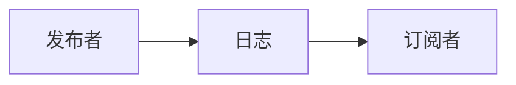
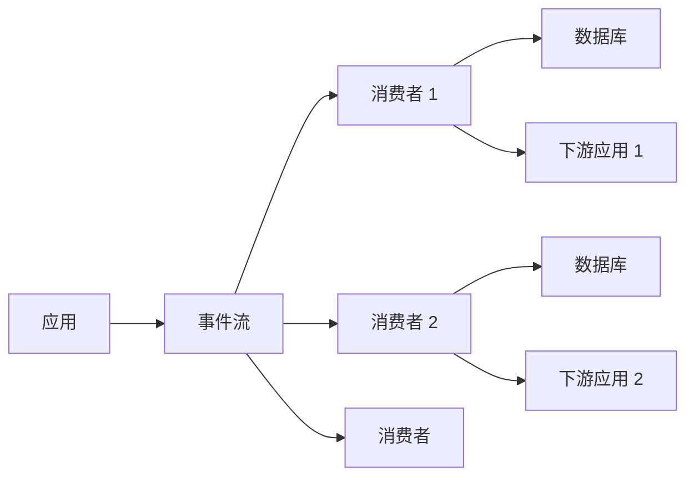
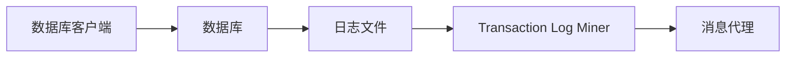
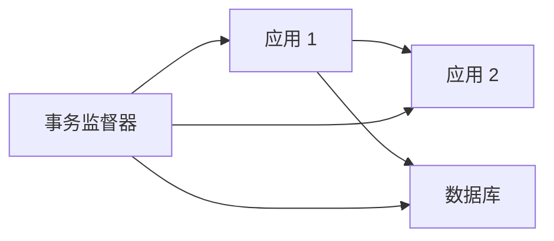
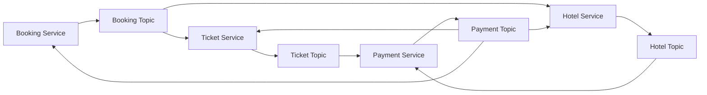
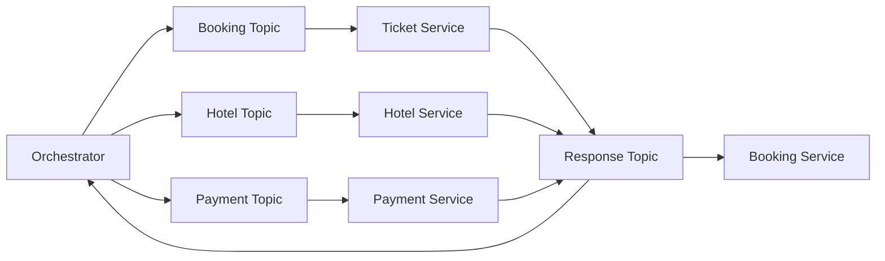

# 05 第 5 章：分布式事务（Distributed Transactions）

本章包括：

- 在多个服务之间创建数据一致性
- 使用事件溯源（event sourcing）实现可扩展性、可用性、更低成本与一致性
- 使用变更数据捕获（Change Data Capture, CDC）把一次变更写入多个服务
- 用编排（choreography）与编排器（orchestration）执行事务

在一个系统中，一项工作单元可能需要把数据写入多个服务。对每个服务的每次写入，都是一个单独请求/事件。任意一次写入都可能失败，原因可能是 bug、主机故障或网络故障。这会导致服务之间出现数据不一致。

例如，如果客户购买了一个同时包含机票和酒店房间的旅游套餐，系统就可能需要同时写入机票服务、房间预订服务和支付服务。只要其中任何一次写入失败，系统就会处于不一致状态。另一个例子是消息系统：它既要把消息发送给接收方，又要在数据库中记录“消息已发送”。如果消息成功发送到了接收方设备，但写数据库失败，就会表现得像消息尚未送达。

事务（transaction）是一种把多次读写组合成一个逻辑单元的方法，用来在多个服务之间保持数据一致性。它们以原子方式执行，作为单个操作整体运行，整个事务要么成功（commit），要么失败（abort、rollback）。事务具有 ACID 属性，不过不同数据库对 ACID 的理解并不完全相同，因此实现也不同。

如果我们可以使用 Kafka 这样的事件流平台来分发这些写入，让下游服务以 pull 而非 push 的方式获取这些写入，就应该这样做。（pull 与 push 的讨论见 4.6.2 节。）对于其他情况，我们引入“分布式事务”的概念，它把这些分离的写请求合并为一个分布式（原子）事务。我们还会引入“共识（consensus）”的概念——即所有服务都同意某个写事件已经发生（或没有发生）。为了保证服务之间的一致性，这种共识应在写事件过程中即便出现故障时也能达成。本章将介绍在分布式事务中维持一致性的算法：

- 事件溯源（event sourcing）、变更数据捕获（CDC）和事件驱动架构（EDA）这几个相关概念。
- Checkpointing 与死信队列已在 3.3.6 与 3.3.7 节讨论过。
- Saga。
- 两阶段提交（two-phase commit）。本书不展开讨论；附录 D 会对两阶段提交做简短说明。

两阶段提交与 Saga 追求的是共识（全部提交或全部回滚）；而其他技术则更多是在写失败导致不一致时，指定某个特定数据库作为唯一事实来源（source of truth）。

## 5.1 事件驱动架构（EDA）

Artur Ejsmont 在 *Scalability for Startup Engineers*（2015）中写道：“事件驱动架构（EDA）是一种架构风格，其中大多数不同组件之间的交互，是通过宣布已经发生的事件来完成，而不是通过请求某项工作被执行。”（第 295 页）

EDA 是异步且非阻塞的。一个请求不需要立刻被处理完——那可能耗时很久，并导致高延迟。它只需要发布一个事件即可。如果事件发布成功，服务器就返回成功响应。该事件随后再被处理；如果有必要，服务器可以稍后再向请求方返回结果。EDA 促进了松耦合、可扩展性与响应性（低延迟）。

EDA 的替代方式，是一个服务直接向另一个服务发请求。不论该请求是阻塞还是非阻塞，只要任何一方不可用或性能很差，整个系统就不可用。并且，这种请求还会消耗每个服务中的一个线程，因此在请求处理期间，每个服务都少了一个可用线程。若请求处理时间很长，或发生在流量尖峰期间，这个效应尤其明显。流量尖峰可能淹没服务，并引发 `504` 超时。请求方也会受影响，因为每个请求方只要请求未完成，就必须一直占着一个线程，从而设备可用于其他工作的资源变少。

为了防止流量尖峰导致故障，我们需要采用复杂的自动扩缩容方案，或维持一个很大的主机集群，这都会增加成本。（速率限制是另一种可能方案，见第 8 章。）

这些替代方案成本更高、更复杂、更容易出错，也更难扩展。而它们所提供的强一致性和低延迟，对用户来说未必真的有必要。

一种资源消耗更低的方法，是把事件发布到事件日志（event log）中。发布者服务无需持续占用线程等待订阅者服务完成事件处理。

在实践中，我们可能不会完全遵循 EDA 的“非阻塞”哲学，例如仍会在请求到达时先做请求校验。比如，服务器可以校验请求是否包含所有必填字段且字段值有效；字符串字段可能要求非空、非 `null`，还可能要求最小和最大长度。这样做是为了让非法请求尽快失败，而不是白白浪费资源和时间把非法数据持久化，最后才发现错误。事件溯源和 CDC 都是 EDA 的例子。

## 5.2 事件溯源

事件溯源（event sourcing）是一种把数据或数据变更以事件形式存储到只追加日志中的模式。根据 Cornelia Davis 在 *Cloud Native Patterns*（Manning Publications，2019）中的表述，事件溯源的思想是：事件日志才是真正的事实来源，而其他数据库都只是这个事件日志的投影（projections）。任何一次写入都必须先写入事件日志。写入成功后，一个或多个事件处理器再消费这个新事件，并把它写到其他数据库中。

事件溯源并不绑定于某种特定数据源。它可以捕获多种来源的事件，例如用户交互、外部系统和内部系统。参见图 5.1，事件溯源包含：把实体的细粒度状态变化事件按顺序发布并持久化。这些事件会存放在日志中，而订阅者则按顺序处理这些日志事件，以确定该实体的当前状态。因此，发布者服务是通过事件日志，以异步方式与订阅者服务通信的。

*图 5.1 在事件溯源中，发布者把表示实体状态变化的一系列事件发布到日志中。订阅者按顺序处理这些日志事件，以确定实体的当前状态。*

这可以通过多种方式实现。发布者可以把事件发布到事件存储或只追加日志中，例如 Kafka topic；也可以向关系型数据库（SQL）写一行；写入 MongoDB 或 Couchbase 这类文档数据库中的一个文档；甚至也可以写入 Redis 或 Apache Ignite 之类的内存数据库，以换取低延迟。

> [!QUESTION] 问题
> 如果某个订阅者主机在处理事件时崩溃了，订阅者服务如何知道它必须再次处理这个事件？

事件溯源提供了系统内全部事件的完整审计轨迹（audit trail），并允许通过重放事件来重建系统的过去状态，以便调试或分析。事件溯源也允许我们通过引入新的事件类型和处理器来改变业务逻辑，而不影响已有数据。

事件溯源会增加系统设计与开发复杂度，因为我们必须管理事件存储、事件重放、版本控制和 schema 演进。它还会增加存储需求。随着日志越来越大，重放事件会变得更昂贵、更耗时。

## 5.3 变更数据捕获（CDC）

变更数据捕获（Change Data Capture, CDC）的核心，是把数据变化事件记录到一个变更日志事件流中，并通过 API 提供这个事件流。

图 5.2 展示了 CDC。一次单独变更，或一组变更，都可以作为单个事件发布到变更日志事件流中。这个事件流有多个消费者，每个消费者都对应某个服务/应用/数据库。每个消费者消费事件，再把它交给自己的下游服务处理。

*图 5.2 使用变更日志事件流同步数据变更。除了消费者，也可以使用无服务器函数把变更传播到下游应用或数据库。*

CDC 能提供一致性，并且延迟低于事件溯源。每个请求都接近实时地被处理；不像在事件溯源中，一个请求可能会在日志中停留一段时间后，订阅者才开始处理它。

事务日志尾随（transaction log tailing）模式（Chris Richardson，*Microservices Patterns: With Examples in Java*，第 99–100 页，Manning Publications，2019）也是一种系统设计模式，用于避免“某个进程既要写数据库又要向 Kafka 生产消息”时可能出现的不一致。因为这两次写中的任何一次都可能失败，导致系统不一致。

图 5.3 展示了事务日志尾随模式。在 transaction log tailing 中，一个称为 transaction log miner 的进程会持续读取数据库事务日志，并把每次更新产出为一个事件。

*图 5.3 事务日志尾随模式示意。服务向数据库执行写查询，数据库把该查询记录进日志文件。Transaction log miner 持续读取日志文件并拾取这个查询，然后向消息代理生产一个事件。*

CDC 平台包括 Debezium（`https://debezium.io/`）、Databus（`https://github.com/linkedin/databus`）、DynamoDB Streams（`https://docs.aws.amazon.com/amazondynamodb/latest/developerguide/Streams.html`）以及 Eventuate CDC Service（`https://github.com/eventuate-foundation/eventuate-cdc`）。它们都可以用作 transaction log miner。

Transaction log miner 可能会生成重复事件。处理重复事件的一种方式，是使用消息代理提供的 exactly-once 交付机制。另一种方式，是把事件定义成幂等的，并以幂等方式处理它们。

## 5.4 事件溯源与 CDC 的比较

事件驱动架构（EDA）、事件溯源和 CDC 都是分布式系统中的相关概念，它们都用于把数据变化传播给感兴趣的消费者和下游服务。它们通过异步通信模式传播这些变化，从而解耦服务。在某些系统设计中，你甚至会同时使用事件溯源与 CDC。例如，在某个服务内部使用事件溯源，把数据变化记录为事件；同时使用 CDC，把这些事件传播给其他服务。它们在用途、粒度和事实来源等方面有所不同。表 5.1 讨论了这些差异。

**表 5.1 事件溯源与变更数据捕获（CDC）的差异**

| | Event Sourcing | Change Data Capture (CDC) |
|---|---|---|
| 目的 | 把事件记录为事实来源。 | 通过把事件从源服务传播到下游服务来同步数据变化。 |
| 事实来源 | 日志，或发布到日志中的事件，就是事实来源。 | 发布者服务中的数据库才是事实来源；发布出来的事件并不是事实来源。 |
| 粒度 | 表示具体动作或状态变化的细粒度事件。 | 数据库层面的单条变化，例如新增、更新或删除的行/文档。 |

## 5.5 事务监督器

事务监督器（transaction supervisor）是一个过程，用于确保事务要么成功完成，要么被补偿（compensated）。它可以实现为一个周期性批处理任务，或者无服务器函数。图 5.4 展示了事务监督器的一个例子。

*图 5.4 事务监督器示例。一个应用可能会同时写入多个下游应用和数据库。事务监督器会周期性地同步这些目标，以应对任何写入失败。*

事务监督器通常首先应被实现为一个用于**人工审核不一致数据**以及**人工执行补偿事务**的界面。自动化补偿事务通常风险很高，必须非常谨慎。任何补偿事务在实现自动化之前，都必须经过充分测试。同时，还要确保系统里不存在其他分布式事务机制，否则它们可能互相干扰，导致数据丢失，或造成难以调试的问题。

无论补偿事务是人工执行还是自动执行，都必须始终被记录日志。

## 5.6 Saga

Saga 是一种长生命周期事务，它可以表示为一系列事务。所有事务都必须成功完成；否则就要执行补偿事务，把已经执行的事务回滚。Saga 是一种用于管理失败的模式。Saga 本身没有状态。

一个典型的 Saga 实现，会让服务通过 Kafka 或 RabbitMQ 之类的消息代理通信。本书中凡是涉及 Saga 的讨论，都会使用 Kafka。

Saga 的一个重要使用场景是：只有当若干服务都满足特定要求时，才执行一个分布式事务。例如在预订旅游套餐时，一个旅游服务可能会同时向机票服务发送写请求，也向酒店房间服务发送写请求。如果没有可用航班或酒店房间，那么整个 Saga 都应被回滚。

机票服务和酒店房间服务也可能需要写入一个独立的支付服务。支付服务独立于机票服务和酒店服务，可能有以下原因：

- 在机票服务确认机票可用、酒店房间服务确认房间可用之前，支付服务不应处理任何付款。否则，它可能会在旅游套餐整体还未确认前就先向用户收款。
- 机票服务和酒店房间服务可能属于其他公司，我们不能把用户的私密支付信息传给它们。相反，应由我们自己的公司处理用户支付，再由我们向其他公司付款。

如果写支付服务的事务失败了，则整个 Saga 都应按相反顺序，通过对前两个服务执行补偿事务来回滚。

协调 Saga 有两种方式：choreography（并行）或 orchestration（线性）。接下来本节会分别讨论一个 choreography 示例和一个 orchestration 示例，然后对比二者。另一个示例可参考：`https://microservices.io/patterns/data/saga.html`。

### 5.6.1 编舞（Choreography）

在 choreography 中，开启 Saga 的服务会与两个 Kafka topic 通信：它向其中一个 topic 生产消息，以启动分布式事务；同时从另一个 topic 消费消息，以执行最终逻辑。Saga 中的其他服务则通过 Kafka topics 彼此直接通信。

图 5.5 展示了一个通过 choreography 预订旅游套餐的 Saga。在本章中，凡是图中出现 Kafka topic，表示“消费事件”的箭头方向，采用的是箭头从 topic 指向外部服务。而本书其他章节中，消费事件则通常画成箭头指向 topic。本章采用不同画法，是因为如果沿用其他章节的画法，这里的图会更难读。因为本章图示需要表现多个服务从多个 topic 消费，又向其他多个 topic 生产，采用当前箭头方向更清晰。

*图 5.5 通过 choreography 预订机票和酒店房间的 Saga。相同数字但不同字母的标签，表示并行发生的步骤。*

一次成功预订的步骤如下：

1. 用户向 booking service 发起预订请求。booking service 向 booking topic 生产一个 booking request 事件。
2. ticket service 与 hotel service 都消费这个 booking request 事件，并确认各自请求可被满足。两个服务都可能把该事件记录到各自数据库中，并保存 booking ID 与类似 `AWAITING_PAYMENT` 的状态。
3. ticket service 与 hotel service 分别向 ticket topic 和 hotel topic 生产 payment request 事件。
4. payment service 从 ticket topic 和 hotel topic 消费这些 payment request 事件。由于这两个事件会在不同时间、很可能由不同主机消费，因此 payment service 需要在数据库中记录“这些事件已收到”，这样它的各个主机才知道是否所有必需事件都到齐了。所有必需事件到齐后，payment service 才会处理付款。
5. 如果支付成功，payment service 向 payment topic 生产一个 payment success 事件。
6. ticket service、hotel service 与 booking service 都消费这个事件。ticket service 与 hotel service 会确认本次预订，这可能意味着把对应 booking ID 的状态更新为 `CONFIRMED`，或执行其他必要处理与业务逻辑。booking service 则可以通知用户预订已确认。

步骤 1–4 都是可补偿事务（compensable transactions），可以通过补偿事务回滚。步骤 5 是枢纽事务（pivot transaction）。在枢纽事务之后的事务可以不断重试直到成功。步骤 6 中的事务是可重试事务（retriable transactions）；这也是 5.3 节所述 CDC 的一个例子。booking service 不需要等待 ticket service 或 hotel service 的响应。

一个常被问到的问题是：外部公司如何订阅我们公司的 Kafka topics？答案是：它们不会这么做。出于安全原因，我们绝不会允许外部直接访问我们的 Kafka 服务。为了表述清晰，这里简化了很多细节。实际上，ticket service 与 hotel service 都属于我们自己的公司。它们直接与我们的 Kafka 服务/topics 通信，再由它们去请求外部服务。图 5.5 没画出这些细节，是为了避免设计图过于杂乱。

如果 payment service 返回错误，表示机票无法预订（例如该航班已满员或被取消），那么步骤 6 会有所不同：ticket service 和 hotel service 不会确认预订，而是取消预订；booking service 则可能向用户返回适当的错误响应。由 hotel service 或 payment service 的错误响应触发的补偿事务，与这个场景类似，因此这里不再展开。关于 choreography，还需注意以下几点：

- 没有双向连线；也就是说，一个服务不会同时向同一个 topic 生产并从中订阅。
- 不会有两个服务向同一个 topic 生产消息。
- 一个服务可以订阅多个 topics。如果某个服务必须先收到来自多个 topics 的多个事件，才能执行某个动作，那么它就需要在数据库中记录“已经收到哪些事件”，这样才能读取数据库并判断所需事件是否都已收到。
- topic 与 service 之间的关系可以是 1:many 或 many:1，但不能是 many:many。
- 可以存在环。例如图 5.5 中就有一个环：`hotel topic > payment service > payment topic > hotel service > hotel topic`。

在图 5.5 中，多个 topics 与多个 services 之间已经有很多连线。若 choreography 涉及更多 topics 和 services，就会变得过于复杂、容易出错，也很难维护。

### 5.6.2 编排（Orchestration）

在 orchestration 中，开启 Saga 的服务就是 orchestrator。orchestrator 通过 Kafka topic 与每个服务通信。在 Saga 的每一步中，orchestrator 都必须向某个 topic 生产一个事件，请求该步骤开始；同时它还必须从另一个 topic 消费该步骤的结果。

Orchestrator 是一个有限状态机（finite-state machine），它对事件做出反应并发出命令。Orchestrator 只应包含步骤顺序，除补偿机制外，不应包含其他业务逻辑。

图 5.6 展示了一个通过 orchestration 预订旅游套餐的 Saga。成功预订的流程如下。

*图 5.6 通过 orchestration 预订机票和酒店房间的 Saga。*

1. orchestrator 向 booking topic 生产一个 ticket request 事件。
2. ticket service 消费这个 ticket request 事件，并以 `AWAITING_PAYMENT` 状态为该 booking ID 预留机票。
3. ticket service 向 response topic 生产一个 `ticket pending payment` 事件。
4. orchestrator 消费这个 `ticket pending payment` 事件。
5. orchestrator 向 hotel topic 生产一个酒店预订请求事件。
6. hotel service 消费这个酒店预订请求事件，并以 `AWAITING_PAYMENT` 状态为该 booking ID 预留酒店房间。
7. hotel service 向 response topic 生产一个 `room pending payment` 事件。
8. orchestrator 消费这个 `room pending payment` 事件。
9. orchestrator 向 payment topic 生产一个 payment request 事件。
10. payment service 消费这个 payment request 事件。
11. payment service 处理付款，然后向 response topic 生产一个 payment confirmation 事件。
12. orchestrator 消费这个 payment confirmation 事件。
13. orchestrator 向 booking topic 生产一个 payment confirmation 事件。
14. ticket service 消费这个 payment confirmation 事件，并把对应 booking 的状态改为 `CONFIRMED`。
15. ticket service 向 response topic 生产一个 ticket confirmation 事件。
16. orchestrator 从 response topic 消费这个 ticket confirmation 事件。
17. orchestrator 向 hotel topic 生产一个 payment confirmation 事件。
18. hotel service 消费这个 payment confirmation 事件，并把对应 booking 的状态改为 `CONFIRMED`。
19. hotel service 向 response topic 生产一个 hotel room confirmation 事件。
20. orchestrator 消费这个 hotel room confirmation 事件，然后执行后续步骤，例如向用户发送成功响应，或执行 booking service 内部的其他逻辑。

步骤 18 和 19 看起来似乎没必要，因为步骤 18 理论上不会失败，它可以持续重试直到成功。步骤 18 与步骤 20 也可以并行完成。但这里仍按线性方式执行，以保持方案一致。

步骤 1–13 都是可补偿事务。步骤 14 是枢纽事务。步骤 15 之后都是可重试事务。

如果这三个服务中的任意一个向 booking topic 生产了错误响应，那么 orchestrator 就可以向其他相关服务生产事件，以执行补偿事务。

### 5.6.3 比较

表 5.1 对比了 choreography 与 orchestration。我们应理解它们的差异与权衡，以判断某个具体系统设计更适合哪一种方式。最终选择在一定程度上可能是任意的，但理解了它们的差异，也就理解了选择某一方案时，我们究竟牺牲了什么、换来了什么。

**表 5.1 Choreography Saga 与 Orchestration Saga 的对比**

| Choreography | Orchestration |
|---|---|
| 对服务的请求是并行发起的。这对应于观察者（observer）面向对象设计模式。 | 对服务的请求是线性发起的。这对应于控制器（controller）面向对象设计模式。 |
| 开启 Saga 的服务与两个 Kafka topics 通信：它向一个 Kafka topic 生产消息以启动分布式事务，并从另一个 Kafka topic 消费消息以执行最终逻辑。 | Orchestrator 通过 Kafka topic 与每个服务通信。在 Saga 的每一步中，orchestrator 都要向某个 topic 生产一个事件以请求该步骤开始，并从另一个 topic 消费该步骤结果。 |
| 开启 Saga 的服务，只包含向 Saga 第一个 topic 生产消息，以及从 Saga 最后一个 topic 消费消息的代码。开发者若想理解其步骤，必须阅读 Saga 中每个服务的代码。 | Orchestrator 中包含对 Saga 各步骤对应 Kafka topics 的生产与消费代码，因此只要阅读 orchestrator 代码，就能理解分布式事务中的服务与步骤。 |
| 某个服务可能需要订阅多个 Kafka topics，例如 Richardson 一书图 5.5 中的 Accounting Service。这是因为它只有在先消费了来自多个服务的某些事件之后，才能生产某个事件。因此它必须在数据库中记录自己已经消费过哪些事件。 | 除 orchestrator 外，每个服务通常只订阅一个来自其他服务的 Kafka topic。服务之间的关系更容易理解。与 choreography 不同，一个服务不需要在生产某个事件前，先消费来自多个独立服务的多个事件，因此也许可以减少数据库写入次数。 |
| 资源消耗更低、交互更少、网络流量更少，因此整体延迟更低。并行请求也会进一步降低延迟。 | 因为每一步都要经过 orchestrator，事件总数大约是 choreography 的两倍。整体上 orchestration 更耗资源、交互更多、网络流量更大，因此整体延迟更高。请求是线性的，所以延迟也更高。 |
| 服务的软件开发生命周期独立性较差，因为开发者若想修改任一服务，就必须理解所有相关服务。 | 服务彼此更独立。对某个服务的改动，只影响 orchestrator，而不影响其他服务。 |
| 不存在像 orchestration 那样的单点故障（即除了 Kafka 服务外，没有任何服务必须高度可用）。 | 如果 orchestration 服务失败，整个 Saga 都无法执行（因此 orchestrator 与 Kafka 服务都必须高可用）。 |
| 补偿事务由 Saga 中各个服务自行触发。 | 补偿事务由 orchestrator 触发。 |

## 5.7 其他事务类型

以下共识算法通常更适合在大量节点之间实现共识，尤其是在分布式数据库中。本书不讨论它们。详情请参考 Martin Kleppmann 的 *Designing Data-Intensive Applications*。

- Quorum writes
- Paxos 和 EPaxos
- Raft
- Zab（ZooKeeper atomic broadcast protocol）——Apache ZooKeeper 使用它。

## 5.8 延伸阅读

- Martin Kleppmann，*Designing Data-Intensive Applications: The Big Ideas Behind Reliable, Scalable, and Maintainable Systems*（O'Reilly Media，2017）
- Boris Scholl、Trent Swanson、Peter Jausovec，*Cloud Native: Using Containers, Functions, and Data to Build Next-Generation Applications*（O’Reilly Media，2019）
- Cornelia Davis，*Cloud Native Patterns*（Manning Publications，2019）
- Chris Richardson，*Microservices Patterns: With Examples in Java*（Manning Publications，2019）。其中 3.3.7 节讨论了 transaction log tailing 模式，第 4 章则是关于 Saga 的详细章节。

## 总结（Summary）

- 分布式事务会把同一份数据写入多个服务，以实现最终一致性或共识。
- 在事件溯源中，写入事件被存入日志；日志既是事实来源，也是可用于重放事件、重建系统状态的审计轨迹。
- 在变更数据捕获（CDC）中，一个事件流有多个消费者，每个消费者对应一个下游服务。
- Saga 是一系列事务，要么全部成功完成，要么全部回滚。
- Choreography（并行）与 orchestration（线性）是协调 Saga 的两种方式。
