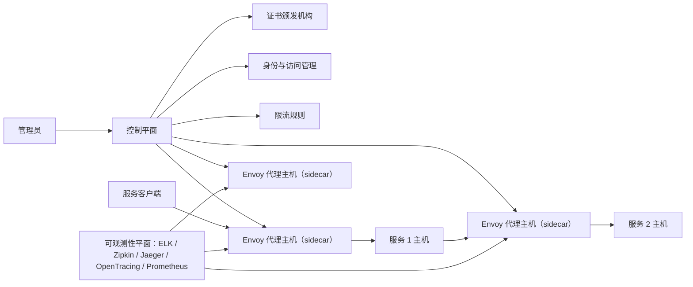
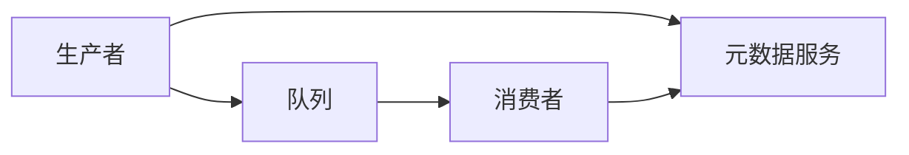
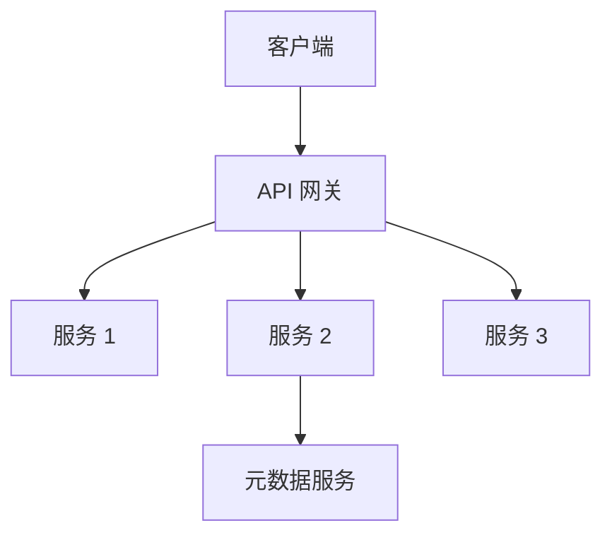
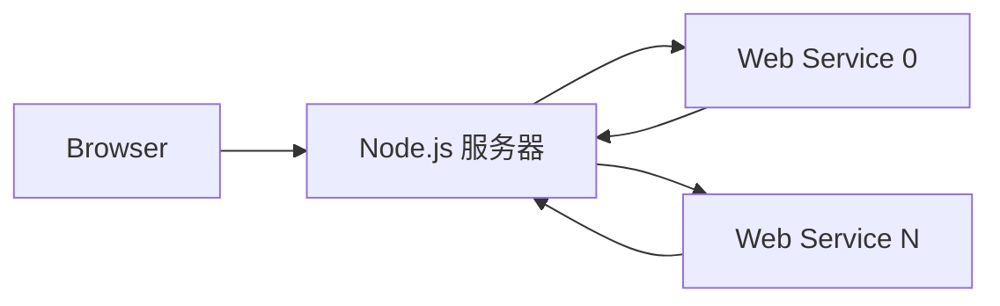

# 06 第 6 章：功能分区中的常见服务（Common Services for Functional Partitioning）

本章包括：

- 用 API 网关或 service mesh/sidecar 将横切关注点集中化
- 通过元数据服务最小化网络流量
- 考虑使用 Web 和移动框架来满足需求
- 将功能实现为库还是服务
- 在 REST、RPC 和 GraphQL 之间选择合适的 API 范式

在本书前面的部分，我们把功能分区（functional partitioning）当作一种可扩展性技术：把后端中的特定功能拆分出来，让它们在各自专用的集群上运行。本章先讨论 API 网关，再讨论 sidecar 模式（也称 service mesh），这是一个较新的创新。接着，我们讨论把公共数据集中到元数据服务中的做法。这些服务有一个共同主题：它们都包含许多后端服务共有的功能，因此可以从这些服务中拆分出来，变成共享的公共服务。

> [!NOTE]
> Istio 是一种流行的 service mesh 实现，于 2018 年首次发布生产版本。

## 6.1 各种服务的公共功能

一个服务可能有许多非功能性需求，而不同功能需求的服务也可能共享相同的非功能性需求。比如，一个计算销售税的服务和一个检查酒店房态的服务，都可能利用缓存来提升性能，或者只接受已注册用户的请求。

如果工程师为每个服务分别实现这些功能，就可能出现重复劳动或重复代码。由于稀缺的工程资源被分散到更多工作上，错误或低效也更容易发生。

一种可能的解决方案，是把这些代码放入库中，让各个服务使用。不过，这种方案有第 6.7 节中讨论的缺点。库的版本升级由用户控制，因此服务可能继续运行旧版本，而这些旧版本里可能包含在新版本中已修复的 bug 或安全问题。运行服务的每台主机也会运行这些库，因此不同功能无法独立扩缩容。

一种解决方案，是用 API 网关把这些横切关注点集中起来。API 网关是一个轻量级 Web 服务，由分布在多个数据中心中的无状态机器组成。它为组织内的许多服务提供公共功能，用于跨多个服务集中处理横切关注点，即使这些服务使用不同的编程语言。尽管职责很多，它仍应尽可能保持简单。Amazon API Gateway（https://aws.amazon.com/api-gateway/）和 Kong（https://konghq.com/kong）都是云厂商提供的 API 网关示例。

API 网关的功能可以分为以下几类。

### 6.1.1 安全

这些功能用于防止未授权访问服务数据：

- 认证（Authentication）：验证请求是否来自已授权用户。
- 授权（Authorization）：验证用户是否被允许发起该请求。
- SSL 终止（SSL termination）：通常并不是 API 网关本身负责终止，而是由运行在同一主机上的独立 HTTP 代理进程负责。这里我们把终止放在 API 网关上，是因为在负载均衡器上做终止的代价较高。虽然“SSL termination”这一说法更常见，但实际协议是 TLS，它是 SSL 的继任者。
- 服务端数据加密：如果我们需要把数据安全地存储在后端主机或数据库中，API 网关可以在存储前加密数据，并在发送给请求方前解密数据。

### 6.1.2 错误检查

错误检查可以阻止无效请求或重复请求到达服务主机，让它们只处理有效请求：

- 请求校验：一种校验是确保请求格式正确。例如，POST 请求体应当是有效 JSON。它还应确保所有必需参数都存在，并且其取值满足约束。我们可以在 API 网关上配置这些要求。
- 请求去重：当成功响应未能到达请求方/客户端时，可能会发生重复，因为请求方/客户端可能会重新尝试该请求。通常会使用缓存来保存之前见过的请求 ID，以避免重复。如果我们的服务是幂等的、无状态的，或者采用“至少一次”投递，那么它就能处理重复请求，去重不会造成错误。但如果服务期望“恰好一次”或“至多一次”投递，请求重复就可能导致错误。

### 6.1.3 性能与可用性

API 网关可以通过提供缓存、限流和请求分发来提升服务的性能与可用性。

- 缓存：API 网关可以缓存对数据库或其他服务的常见请求，例如：
  - 在我们的服务架构中，API 网关可能会向元数据服务发起请求（参见第 6.3 节）。它可以缓存使用最频繁的实体信息。
  - 利用身份信息减少对认证与授权服务的调用。
- 限流（Rate Limiting，也称 throttling）：防止我们的服务被请求淹没。（第 8 章会讨论一个限流服务示例。）
- 请求分发：API 网关会向其他服务发起远程调用。它会为这些服务创建 HTTP 客户端，并确保发往这些服务的请求彼此隔离。当某个服务变慢时，发往其他服务的请求不会受到影响。bulkhead 和 circuit breaker 等常见模式有助于实现资源隔离，并在远程调用失败时提升服务韧性。

### 6.1.4 日志与分析

API 网关提供的另一项常见功能是请求日志记录或使用数据收集，也就是收集实时信息，用于分析、审计、计费和调试等目的。

## 6.2 Service mesh/sidecar 模式

第 1.4.6 节简要讨论了用 service mesh 来弥补 API 网关的缺点，这里重申一下：

- 每次请求都会增加额外时延，因为请求必须经过额外的服务。
- 需要一个很大的主机集群，因此必须通过扩缩容来控制成本。

图 6.1 是图 1.8 的重复，展示了一个 service mesh。这个设计有一个轻微的缺点：如果 sidecar 不可用，那么即使服务本身仍然运行，该服务所在主机也会不可用；这也是我们通常不会在一台主机上运行多个服务或容器的原因。



*图 6.1 service mesh 示意图，重复自图 1.8。*

Istio 的文档指出，service mesh 由控制平面和数据平面组成（https://istio.io/latest/docs/ops/deployment/architecture/），而 Nginx 的 Jenn Gile 还描述过一个可观测性平面（https://www.nginx.com/blog/how-to-choose-a-service-mesh/）。图 6.1 包含这三类平面。

管理员可以通过控制平面来管理代理并与外部服务交互。例如，控制平面可以连接到证书颁发机构以获取证书，或者连接到身份与访问控制服务以管理某些配置。它还可以把证书 ID 或身份与访问控制服务的配置下发给代理主机。服务间和服务内请求发生在 Envoy（https://www.envoyproxy.io/）代理主机之间，我们称之为 mesh 流量。sidecar 代理之间的通信可以使用多种协议，包括 HTTP 和 gRPC（https://docs.microsoft.com/en-us/dotnet/architecture/cloud-native/service-mesh-communication-infrastructure）。可观测性平面提供日志、监控、告警和审计。

限流也是一种可以由 service mesh 管理的公共共享服务。第 8 章会更详细地讨论这一点。AWS App Mesh（https://aws.amazon.com/app-mesh）是一个云厂商提供的 service mesh。

> [!NOTE]
> 参见第 1.4.6 节，了解无 sidecar 的 service mesh 的简要讨论。

## 6.3 元数据服务

元数据服务存储系统中多个组件都会使用的信息。如果这些组件彼此传递这类信息，它们可以只传递 ID，而不是传递全部信息。接收 ID 的组件可以向元数据服务请求与该 ID 对应的信息。这样系统中的重复信息更少，类似 SQL 规范化，因此一致性更好。

一个例子是 ETL 管道。设想一个用于给用户注册过的某些产品发送欢迎邮件的 ETL 管道。邮件内容可能是一份几 MB 的 HTML 文件，其中包含许多随产品而变化的文本和图片。参照图 6.2，当生产者向管道队列发送消息时，它不必把整份 HTML 文件都放进消息里，而只需包含该文件的 ID。文件可以存放在元数据服务中。当消费者消费消息时，它可以向元数据服务请求该 ID 对应的 HTML 文件。这样可以避免队列中包含大量重复数据。



*图 6.2 我们可以使用元数据服务来减小队列中单条消息的大小：把大对象放在元数据服务中，在单条消息里只排队 ID。*

使用元数据服务的权衡是复杂度和整体时延都会增加。现在生产者必须同时写入元数据服务和队列。在某些设计中，我们可能会在更早的步骤里填充元数据服务，这样生产者就不需要再写入元数据服务。

如果生产者集群经历流量尖峰，它就会向元数据服务发起高频读请求，因此元数据服务应当能够支撑高读负载。

总之，元数据服务就是用来做 ID 查找的。我们会在第 2 部分的许多示例问题讨论中使用元数据服务。

图 6.3 展示了引入 API 网关和元数据服务后的架构变化。客户端不再直接请求后端，而是请求 API 网关；API 网关会执行部分功能，并可能向元数据服务和/或后端发送请求。图 1.8 展示了 service mesh。



*图 6.3 将服务进行功能分区（上图）后，把 API 网关和元数据服务拆分出来（下图）。在分区前，客户端直接查询服务；分区后，客户端查询 API 网关，API 网关执行部分功能，并可能把请求路由到某个服务，而该服务又可能为某些共享功能查询元数据服务。*

## 6.4 服务发现

服务发现是一个微服务概念，在面试中可能会在管理多个服务的语境里被简要提及。服务发现通常发生在底层实现中，大多数工程师不需要理解其细节。大多数工程师只需要知道，每个内部 API 服务通常都会分配一个端口号，客户端通过该端口号访问它；外部 API 服务和大多数 UI 服务则会分配 URL。对于开发基础设施的团队，面试中可能会问到服务发现。对于其他工程师而言，通常不会深入讨论服务发现的细节，因为它提供的面试信号不多。

简而言之，服务发现是一种帮助客户端识别可用服务主机的方法。服务注册表（service registry）是一个数据库，用来记录某个服务有哪些可用主机。关于 Kubernetes 和 AWS 中服务注册表的细节，可参见 https://docs.aws.amazon.com/whitepapers/latest/microservices-on-aws/service-discovery.html。关于客户端发现（client-side discovery）与服务端发现（server-side discovery）的细节，可参见 https://microservices.io/patterns/client-side-discovery.html 和 https://microservices.io/patterns/server-side-discovery.html。

## 6.5 功能分区与各种框架

本节讨论系统设计图中各种组件可能使用的无数框架中的一部分。新框架不断出现，各种框架也会随行业潮流而兴衰。框架数量之多，会让初学者感到困惑；更复杂的是，某些框架可用于多个组件，使整体图景更加混乱。本节是对多种框架与语言的概览，包括：

- Web
- Mobile，包括 Android 和 iOS
- 后端
- PC

语言与框架的世界远比本节所能覆盖的更大，本节也无意把它们全部讲完。本节的目的，是让你对若干框架和语言有一些基本认知。读完后，你应该能更容易阅读框架文档，并理解它的用途以及在系统设计中的位置。

### 6.5.1 应用的基础系统设计

图 1.1 介绍了一个应用的基础系统设计。今天几乎所有情况下，一家开发移动应用并向后端服务发起请求的公司，都会在 iOS 应用商店中提供 iOS 应用，并在 Google Play 中提供 Android 应用。它也可能开发一个与移动应用功能相同的浏览器应用，或者一个仅用于引导用户下载移动应用的简单页面。变体很多，例如公司也可能开发 PC 应用。但试图解释所有可能组合只会适得其反，我们不会这样做。

我们先讨论围绕图 1.1 的以下问题，然后再扩展到各种框架及其语言：

- 为什么 Web 服务器应用要和后端以及浏览器应用分开？
- 为什么浏览器应用要先向这个 Node.js 应用发请求，再由它向与 Android 和 iOS 应用共享的后端发请求？

### 6.5.2 Web 服务器应用的作用

Web 服务器应用的作用包括：

- 当用户使用浏览器访问某个 URL（例如 `https://google.com/`）时，浏览器会从 Node.js 应用下载浏览器应用。正如第 1.4.1 节所说，浏览器应用最好尽可能小，这样才能快速下载。
- 当浏览器请求某个特定 URL（例如带有特定路径的 `https://google.com/about`）时，Node.js 负责路由该 URL，并提供相应页面。
- URL 可能包含某些路径和查询参数，需要触发特定的后端请求。Node.js 应用会处理该 URL，并发起适当的后端请求。
- 浏览器应用上的某些用户动作，例如填写并提交表单或点击按钮，可能需要后端请求。一次动作可能对应多个后端请求，因此 Node.js 应用会向浏览器应用暴露自己的 API。参照图 6.4，对于每个用户动作，浏览器应用都会向 Node.js 应用/服务器发起一个 API 请求，然后 Node.js 再发起一个或多个合适的后端请求，并把所需数据返回。



*图 6.4 Node.js 服务器可以通过向一个或多个 Web 服务发起合适请求、汇总并处理它们的响应，再把适当的响应返回给浏览器。*

为什么浏览器不直接向后端发请求？如果后端是一个 REST 应用，它的 API 端点可能不会返回浏览器真正需要的精确数据。浏览器可能不得不发起多次 API 请求，并获取比实际需要更多的数据。这些数据传输发生在互联网中，跨越用户设备和数据中心，非常低效。由 Node.js 应用发起这些大请求更高效，因为数据传输大概率发生在同一数据中心中的相邻主机之间。随后，Node.js 应用可以返回浏览器所需的精确数据。

GraphQL 应用允许用户请求精确所需的数据，但 GraphQL 端点的安全性比 REST 应用更难处理，因此开发时间更多，也更容易出现安全漏洞。其他缺点包括：

- 灵活查询意味着需要更多工作来优化性能。
- 客户端代码更多。
- 定义 schema 需要更多工作。
- 请求体更大。

### 6.5.3 Web 和移动框架

本节列出以下类别中的一些框架：

- Web/浏览器应用开发
- 移动应用开发
- 后端应用开发
- PC（也就是桌面应用开发，适用于 Windows、Mac 和 Linux）

完整清单会非常长，其中会包含许多你在职业生涯中不太可能遇到、甚至不太可能读到的框架；在作者看来，这对读者并没有太大帮助。下面只列出一些知名或曾经知名的框架。

这些领域的灵活性，使得完整而客观的讨论变得困难。框架和语言的演化方式千差万别，有些合理，有些则不然。

#### 浏览器应用开发

浏览器只接受 HTML、CSS 和 JavaScript，因此为了兼容性，浏览器应用必须使用这些语言。浏览器安装在用户设备上，因此只能由用户自己升级，很难也不现实去说服或强制用户下载一个支持其他语言的浏览器。你可以用原生 JavaScript（也就是不用任何框架）开发浏览器应用，但对除最小型应用之外的情况来说，这并不现实，因为框架已经提供了许多你否则必须在原生 JavaScript 中重写的功能（例如动画，或者像排序表格、绘制图表这样的数据渲染）。

虽然浏览器应用必须使用这三种语言，但框架可以提供其他语言。使用这些语言编写的浏览器应用代码会被转译为 HTML、CSS 和 JavaScript。

最流行的浏览器应用框架包括 React、Vue.js 和 Angular。其他框架包括 Meteor、jQuery、Ember.js 和 Backbone.js。这些框架的一个共同特点是：开发者把标记和逻辑混在同一个文件里，而不是把标记放在独立的 HTML 文件、把逻辑放在 JavaScript 文件里。这些框架也可能包含自己的标记和逻辑语言。例如，React 引入了 JSX，这是一种类似 HTML 的标记语言。JSX 文件可以同时包含标记、JavaScript 函数和类。Vue.js 还有 template 标签，类似 HTML。

一些较有代表性的、会被转译成 JavaScript 的 Web 开发语言包括：

- TypeScript（https://www.typescriptlang.org/）：静态类型语言，是 JavaScript 的包装/超集。几乎任何 JavaScript 框架也都可以使用 TypeScript，只是需要一些配置工作。
- Elm（https://elm-lang.org/）：可以直接转译为 HTML、CSS 和 JavaScript，也可以在 React 等其他框架中使用。
- PureScript（https://www.purescript.org/）：目标语法与 Haskell 类似。
- Reason（https://reasonml.github.io/）。
- ReScript（https://rescript-lang.org/）。
- Clojure（https://clojure.org/）是通用语言。ClojureScript（https://clojurescript.org/）框架会把 Clojure 转译为 JavaScript。
- CoffeeScript（https://coffeescript.org/）。

这些浏览器应用框架属于浏览器/客户端侧。下面是一些服务器端框架。任何服务器端框架也都可以请求数据库，并用于后端开发。实践中，公司常常会选一个框架做服务器开发，再选另一个框架做后端开发。初学者常常会把“服务端前端”框架与“后端”框架混淆，这里并没有严格界限。

- Express（https://expressjs.com/）是一个 Node.js（https://nodejs.org/）服务器框架。Node.js 是建立在 Chrome V8 JavaScript 引擎之上的 JavaScript 运行时环境。V8 最初是为 Chrome 构建的，但也可以运行在 Linux 或 Windows 这样的操作系统上。Node.js 的作用，是让 JavaScript 代码可以在操作系统上运行。大多数把 Node.js 列为要求的前端或全栈岗位，实际上指的是 Express。
- Deno（https://deno.land/）支持 JavaScript 和 TypeScript。它由 Node.js 的原始创造者 Ryan Dahl 创建，用来弥补他对 Node.js 的一些遗憾。
- Goji（https://goji.io/）是 Golang 框架。
- Rocket（https://rocket.rs/）是 Rust 框架。更多 Rust Web 服务器和后端框架示例，可参见 https://blog.logrocket.com/the-current-state-of-rust-web-frameworks/。
- Vapor（https://vapor.codes/）是 Swift 语言的框架。
- Vert.x（https://vertx.io/）支持 Java、Groovy 和 Kotlin 开发。
- PHP（https://www.php.net/）。（关于 PHP 到底是语言还是框架，并没有统一共识。作者认为，争论这种语义问题没有实际价值。）常见解决方案栈是 LAMP（Linux, Apache, MySQL, PHP/Perl/Python）缩写。PHP 代码可以运行在 Apache（https://httpd.apache.org/）服务器上，而 Apache 又运行在 Linux 主机上。PHP 在 ~2010 年前后很流行（https://www.tiobe.com/tiobe-index/php/），但就作者经验而言，如今很少直接用于新项目。PHP 仍然通过 WordPress 平台在 Web 开发中占有一席之地，它适合构建简单网站。更复杂的用户界面和定制化，通常更适合由 Web 开发者使用 React、Vue.js 这类需要大量编码的框架来完成。Meta（前身为 Facebook）曾是 PHP 的重要用户。Facebook 浏览器应用以前就是用 PHP 开发的。2014 年，Facebook 引入了 Hack 语言（https://hacklang.org/）和 HipHop Virtual Machine（HHVM）（https://hhvm.com/）。Hack 是一种类似 PHP 的语言，不会有 PHP 那样糟糕的安全性和性能问题。它运行在 HHVM 上。Meta 大量使用 Hack 和 HHVM。

#### 移动应用开发

主流移动操作系统是 Android 和 iOS，分别由 Google 和 Apple 开发。Google 和 Apple 都提供自己的 Android 或 iOS 应用开发平台，通常称为“原生”平台。原生 Android 开发语言是 Kotlin 和 Java，而原生 iOS 开发语言是 Swift 和 Objective-C。

#### 跨平台开发

跨平台开发框架在理论上可以通过让同一份代码运行在多个平台上来减少重复工作。实践中，可能还需要为每个平台编写额外代码，从而抵消一部分收益。当操作系统提供的 UI（用户界面）组件彼此差异过大时，就会出现这种情况。可跨 Android 与 iOS 的框架包括：

- React Native 与 React 不同。后者只用于 Web 开发。还有一个叫 React Native for Web 的框架（https://github.com/necolas/react-native-web），它允许用 React Native 进行 Web 开发。
- Flutter（https://flutter.dev/）可跨 Android、iOS、Web 和 PC。
- Ionic（https://ionicframework.com/）可跨 Android、iOS、Web 和 PC。
- Xamarin（https://dotnet.microsoft.com/en-us/apps/xamarin）可跨 Android、iOS 和 Windows。

Electron（https://www.electronjs.org/）可在 Web 与 PC 之间跨平台。

Cordova（https://cordova.apache.org/）是一个使用 HTML、CSS 和 JavaScript 进行移动与 PC 开发的框架。借助 Cordova，可以把 Ember.js 之类的 Web 开发框架用于跨平台开发。

另一种技术是编写渐进式 Web 应用（PWA）。PWA 是一种浏览器应用或 Web 应用，它既能提供典型的桌面浏览器体验，也能利用 service worker 和 app manifest 等浏览器特性，为移动设备提供类似原生移动应用的体验。例如，借助 service worker，PWA 可以提供推送通知，并在浏览器中缓存数据，从而提供类似原生移动应用的离线体验。开发者可以通过配置 app manifest，让 PWA 安装到桌面或移动设备上。用户可以把应用图标添加到设备的主屏幕、开始菜单或桌面上，再点击图标打开应用；这与从 Android 或 iOS 应用商店安装应用的体验类似。由于不同设备的屏幕尺寸不同，设计师和开发者应采用响应式 Web 设计（responsive web design），以便让 Web 应用在不同屏幕尺寸或用户调整浏览器窗口大小时都能良好渲染。开发者可以使用媒体查询（https://developer.mozilla.org/en-US/docs/Web/CSS/Media_Queries/Using_media_queries）或 ResizeObserver（https://developer.mozilla.org/en-US/docs/Web/API/ResizeObserver）等方法，确保应用在各种浏览器或屏幕尺寸下都能正常渲染。

#### 后端开发

下面列出一些后端开发框架。后端框架可以分为 RPC、REST 和 GraphQL。某些后端开发框架也是全栈框架；也就是说，它们也可以用于开发一个会请求数据库的单体浏览器应用。我们也可以把它们用于浏览器应用开发，再向用其他框架开发的后端服务发请求，但作者从未听说过这些框架以这种方式被使用：

- gRPC（https://grpc.io/）是一个 RPC 框架，可用 C#、C++、Dart、Golang、Java、Kotlin、Node、Objective-C、PHP、Python 或 Ruby 开发。未来它可能扩展到更多语言。
- Thrift（https://thrift.apache.org/）和 Protocol Buffers（https://developers.google.com/protocol-buffers）用于序列化数据对象，并通过压缩减少网络流量。对象可以定义在定义文件中。然后我们可以根据定义文件生成客户端和服务器端（后端，而不是 Web 服务器）代码。客户端可以用客户端代码把请求序列化到后端，后端则用后端代码反序列化请求，响应则反之。定义文件也有助于通过限制可做的修改来保持向后和向前兼容。
- Dropwizard（https://www.dropwizard.io/）是 Java REST 框架的一个例子。Spring Boot（https://spring.io/projects/spring-boot）也可用于创建 Java 应用，包括 REST 服务。
- Flask（https://flask.palletsprojects.com/）和 Django（https://www.djangoproject.com/）是 Python 中两个 REST 框架的例子。它们也可用于 Web 服务器开发。

下面是一些全栈框架示例：

- Dart（https://dart.dev）是一门为任何方案都提供框架的语言。它可用于全栈、后端、服务器、浏览器和移动应用。
- Rails（https://rubyonrails.org/）是 Ruby 的全栈框架，也可用于 REST。Ruby on Rails 往往作为单一解决方案使用，而不是 Ruby 配其他框架，或 Rails 配其他语言。
- Yesod（https://www.yesodweb.com/）是一个 Haskell 框架，也可仅用于 REST。使用它的 Shakespearean 模板语言（https://www.yesodweb.com/book/shakespearean-templates）时，还可以进行浏览器应用开发，并转译为 HTML、CSS 和 JavaScript。
- Integrated Haskell Platform（https://ihp.digitallyinduced.com/）也是另一个 Haskell 框架。
- Phoenix（https://www.phoenixframework.org/）是 Elixir 语言的框架。
- JavaFX（https://openjfx.io/）是 Java 客户端应用平台，可用于桌面、移动和嵌入式系统。它源自 Java Swing（https://docs.oracle.com/javase/tutorial/uiswing/），用于开发 Java 程序的 GUI。
- Beego（https://beego.vip/）和 Gin（https://gin-gonic.com/）是 Golang 框架。

## 6.6 库 vs. 服务

在确定了系统组件之后，我们可以讨论把每个组件实现为客户端侧还是服务器侧、实现为库还是服务的优缺点。不要立刻假设某种方案对某个组件一定最好。在大多数情况下，库和服务之间没有显而易见的最佳选择，因此我们需要能够讨论两种方案的设计、实现细节与权衡。

库可以是一个独立代码包，也可以是一个只负责在客户端和服务器之间转发请求与响应的薄层，或者二者兼具。换句话说，某些 API 逻辑可能实现在库中，而其余部分由库调用的服务实现。在本章中，为了比较库与服务，“库”指的是一个独立库。

表 6.1 总结了库与服务的对比。下面大部分观点会在本章其余部分详细讨论。

| 库 | 服务 |
| --- | --- |
| 用户选择要使用的版本/构建，并且对升级到新版本有更大的选择权。 | 开发者选择构建版本，并控制升级发生的时间。 |
| 缺点是，用户可能继续使用包含 bug 或安全问题的旧版本库，而这些问题已在新版本中修复。 |  |
| 如果用户希望始终使用频繁更新的库的最新版本，就必须自己实现程序化升级。 |  |
| 没有设备间通信或数据共享的限制。 | 没有这种限制。多个主机之间的数据同步可以通过彼此请求或通过数据库来完成。用户无需关心这一点。 |
| 语言相关。 | 技术无关。 |
| 时延可预测。 | 由于依赖网络条件，时延更不可预测。 |
| 行为可预测、可复现。 | 网络问题不可预测且难以复现，因此行为可能更不可预测、也更难复现。 |
| 如果需要提升库的负载，整个应用都必须一起扩容。扩容成本由用户的服务承担。 | 可独立扩容。扩容成本由服务承担。 |
| 用户可能能够反编译代码并窃取知识产权。 | 代码不会暴露给用户。（不过 API 可能被逆向工程。这超出本书范围。） |

### 6.6.1 语言相关 vs. 技术无关

为了便于使用，库应当使用客户端的语言，因此同一个库必须为每种受支持的语言重新实现。

大多数库会针对一组明确界定的相关任务进行优化，因此通常可以在单一语言中得到最佳实现。不过，某些库可能部分或全部用另一种语言编写，因为某些语言和框架更适合特定用途。若完全用同一种语言实现这些逻辑，在使用时可能会导致低效。此外，在开发库时，我们也可能希望利用其他语言编写的库。有各种工具库可用于开发包含其他语言组件的库，但这超出了本书范围。现实中的一个难点是，开发这个库的团队或公司需要工程师精通所有这些语言。

服务之所以技术无关，是因为客户端无论采用何种技术栈，都可以使用该服务。服务可以用最适合其用途的语言和框架来实现。客户端需要付出的额外开销很小：它们只需实例化并维护到该服务的 HTTP、RPC 或 GraphQL 连接。

### 6.6.2 时延的可预测性

库没有网络时延，响应时间有保证且可预测，并且可以用 flame graph 等工具轻松分析。

服务的时延更不可预测，也更难控制，因为它取决于许多因素，例如：

- 网络时延，取决于用户互联网连接的质量。
- 服务处理当前流量的能力。

### 6.6.3 行为的可预测性与可复现性

由于依赖更多因素，服务的行为比库更不可预测、也更难复现：

- 部署通常是渐进式的（即一次只把构建部署到少量服务主机）。请求可能被负载均衡器路由到运行不同构建的主机，从而导致不同行为。
- 用户并不能完全控制服务的数据，数据可能在两次请求之间被服务开发者修改。这与库不同，后者由用户完全控制其机器上的文件系统。
- 服务可能会请求其他服务，并受到它们不可预测、难以复现的行为影响。

尽管如此，服务通常比库更容易调试，因为：

- 服务开发者可以访问日志，而库开发者无法访问用户设备上的日志。
- 服务开发者可以控制其环境，并可借助虚拟机和 Docker 为主机搭建统一环境。库则运行在各种不同环境中，例如不同硬件、固件和操作系统（Android 与 iOS）的组合。用户可能会把崩溃日志发送给开发者，但如果无法访问用户设备及其精确环境，调试仍然很困难。

### 6.6.4 库的扩容考量

库无法独立扩容，因为它包含在用户应用中。讨论在单个用户设备上扩容一个库没有意义。如果用户的应用在多台设备上并行运行，用户可以通过扩容使用该库的应用来扩容这个库。若只想单独扩容库，用户可以自己创建一个包裹该库的服务并扩容那个服务。但那样它就不再是库了，而只是由用户拥有的服务，因此扩容成本由用户承担。

### 6.6.5 其他考虑

本节简要描述了一些来自作者个人经验的轶事性观察。

有些工程师对把代码打包进库里会有心理顾虑，但对连接服务则比较接受。他们可能担心库会增大构建体积，尤其是 JavaScript bundle。他们也担心库里可能存在恶意代码，而服务则没有这类担心，因为工程师控制发送给服务的数据，并且能够完全看到服务的响应。

人们通常能接受库的破坏性变更，但对服务中的破坏性变更容忍度更低，尤其是内部服务。服务开发者可能被迫采用笨拙的 API 端点命名方式，例如在端点名里加入“/v2”、“/v3”等。

轶闻证据表明，使用库时比使用服务时更常采用 adapter pattern。

## 6.7 常见 API 范式

本节介绍并比较以下常见通信范式。选择服务的通信范式时，应考虑它们之间的权衡：

- REST（Representational State Transfer）
- RPC（Remote Procedure Call）
- GraphQL
- WebSocket

### 6.7.1 开放系统互连（OSI）模型

7 层 OSI 模型是一个概念性框架/模型，它在不考虑底层内部结构和技术的情况下，刻画网络系统的功能。表 6.2 简要描述了每一层。理解这一模型的一个方便方法是：每一层的协议都是通过更低层的协议实现的。

Actor、GraphQL、REST 和 WebSocket 都构建在 HTTP 之上。RPC 被归类为第 5 层，因为它直接处理连接、端口和会话，而不是依赖 HTTP 这样的更高层协议。

| 层号 | 名称 | 描述 | 示例 |
| --- | --- | --- | --- |
| 7 | 应用层 | 用户界面。 | FTP、HTTP、Telnet |
| 6 | 表示层 | 表示数据；加密发生在这一层。 | UTF、ASCII、JPEG、MPEG、TIFF |
| 5 | 会话层 | 区分不同应用的数据；维护连接；控制端口和会话。 | RPC、SQL、NFS、X Windows |
| 4 | 传输层 | 端到端连接；定义可靠或不可靠传输以及流量控制。 | TCP、UDP |
| 3 | 网络层 | 逻辑寻址；定义数据使用的物理路径；路由器工作在这一层。 | IP、ICMP |
| 2 | 数据链路层 | 网络格式；可能纠正物理层错误。 | Ethernet、wi-fi |
| 1 | 物理层 | 物理介质上的原始比特。 | Fiber、coax、repeater、modem、network adapter、USB |

### 6.7.2 REST

我们假设读者已经了解 REST 的基本概念：它是一种无状态通信架构，使用 HTTP 方法，而请求/响应体通常编码为 JSON 或 XML。在本书中，我们用 REST 表示 API，并使用 JSON 作为 POST 请求和响应体。我们可以使用 JSON Schema 组织（https://json-schema.org/）的规范来表示 JSON schema，但本书不会这么做，因为在 50 分钟的系统设计面试里，详细讨论 JSON schema 通常过于冗长且过于底层。

REST 易于学习、搭建、实验和调试（可借助 curl 或 REST 客户端）。它的其他优点包括超媒体和缓存能力，下面会讨论。

#### 超媒体

超媒体控制（HATEOAS）或超媒体，是指在响应里向客户端提供“下一步可执行动作”的信息。这通常表现为响应 JSON 中的一个字段，比如 “links”，其中包含客户端下一步可能会查询的 API 端点。

例如，在一个电子商务应用显示发票后，下一步就是支付。发票端点的响应体可能包含一个指向支付端点的链接，例如：

```json
{
  "data": {
    "type": "invoice",
    "id": "abc123"
  },
  "links": {
    "pay": "https://api.acme.com/payment/abc123"
  }
}
```

其中响应包含一个发票 ID，而下一步是针对该发票 ID 发起支付的 POST 请求。

还有 HTTP 的 OPTIONS 方法，用于获取端点元数据，例如可执行操作、可更新字段，或某些字段期望何种数据。

在实践中，超媒体和 OPTIONS 对客户端开发者来说都比较难用，因此更合理的做法是为客户端开发者提供每个端点或函数的 API 文档，例如 REST 使用 OpenAPI（https://swagger.io/specification/），或者 RPC 与 GraphQL 框架自带的文档工具。

关于请求/响应 JSON body 的规范，可参见 https://jsonapi.org/。

其他通信架构，如 RPC 或 GraphQL，则不提供超媒体。

#### 缓存

开发者应尽可能把 REST 资源声明为可缓存，这样做有以下好处：

- 由于避免了一些网络调用，时延更低。
- 即使服务不可用，资源仍然可用，因此可用性更高。
- 服务器负载更低，因此可扩展性更好。

缓存时可使用 Expires、Cache-Control、ETag 和 Last-Modified HTTP 头。

Expires 头指定缓存资源的绝对过期时间。服务可以把它设置为当前时钟时间之后最多一年。示例头如下：`Expires: Mon, 11 Dec 2021 18:00 PST`。

Cache-Control 头由逗号分隔的指令组成，用于在请求和响应中控制缓存。示例头如下：`Cache-Control: max-age=3600`，表示响应可缓存 3600 秒。POST 或 PUT 请求（noun）也可能包含 Cache-Control 头作为给服务器的指令，要求服务器缓存这些数据，但这并不意味着服务器一定会遵守，而且这类指令未必会出现在这些数据的响应中。关于所有缓存请求和响应指令，可参见 https://developer.mozilla.org/en-US/docs/Web/HTTP/Headers/Cache-Control。

ETag 值是一个不透明字符串 token，用作某个资源特定版本的标识符。（不透明 token 是一种只有发行方知道其格式的专有 token。要验证一个不透明 token，接收方需要调用发行该 token 的服务器。）客户端可以在 GET 请求中包含 ETag 值，以更高效地刷新资源。只有当资源的 ETag 不同时，服务器才会返回资源的值。换句话说，如果客户端已经拥有该值，服务器就不会无谓地再次返回它。

Last-Modified 头包含资源最后修改的日期和时间，如果 ETag 不可用，可以把它作为后备方案。相关头还有 If-Modified-Since 和 If-Unmodified-Since。

#### REST 的缺点

一个缺点是，除了超媒体或 OPTIONS 端点之外，它没有集成式文档机制，而开发者也可以选择不提供这些端点。

必须为使用 REST 框架实现的服务额外添加 OpenAPI 文档框架。否则，客户端无法知道可用的请求端点，或其路径、查询参数以及请求和响应体字段等细节。REST 也没有标准化的版本管理流程；常见约定是在路径中使用“/v2”、“/v3”等来做版本控制。REST 的另一个缺点是没有统一规范，这会导致混淆。OData 和 JSON-API 是两种流行规范。

### 6.7.3 RPC（Remote Procedure Call）

RPC 是一种让过程在另一个地址空间（即另一台主机）中执行的技术，而程序员无需处理网络细节。流行的开源 RPC 框架包括 Google 的 gRPC、Facebook 的 Thrift，以及 Python 中的 RPyC。

在面试中，你应当熟悉以下常见编码格式。你应理解编码（也称序列化或 marshalling）与解码（也称解析、反序列化或 unmarshalling）是如何完成的。

- CSV、XML、JSON
- Thrift
- Protocol Buffers（protobuf）
- Avro

像 gRPC 这样的 RPC 框架，相比 REST 的主要优点是：

- RPC 以资源优化为设计目标，因此非常适合低功耗设备，例如智能家居这类 IoT 设备。对于大型 Web 服务来说，随着规模扩大，它比 REST 或 GraphQL 更低的资源消耗会变得很重要。
- Protobuf 是一种高效编码。JSON 冗余且冗长，会让请求和响应变大。随着规模增长，网络流量节省会变得非常显著。
- 开发者在文件中定义端点的 schema。常见格式包括 Avro、Thrift 和 protobuf。客户端使用这些文件创建请求并解释响应。由于 schema 文档是开发 API 的必要步骤，客户端开发者总能得到良好的 API 文档。这些编码格式也有 schema 修改规则，能清楚说明开发者应如何保持向后和/或向前兼容。

RPC 的主要缺点也来自它作为二进制协议的本质。客户端必须更新到最新版本的 schema 文件，这件事很麻烦，尤其是在组织外部。另外，如果组织希望监控其内部网络流量，文本协议（如 REST）比二进制协议（如 RPC）更容易监控。

### 6.7.4 GraphQL

GraphQL 是一种查询语言，支持声明式数据获取，客户端可以精确指定自己需要从 API 获取哪些数据。它提供一种 API 数据查询和操作语言，用于精确请求；同时还提供集成式 API 文档工具，这对于驾驭这种灵活性至关重要。其主要优点是：

- 客户端决定自己想要什么数据，以及数据的格式。
- 服务器效率更高，能够精确返回客户端所请求的内容，而不会出现少取（需要多次请求）或多取（导致响应体膨胀）。

权衡如下：

- 对简单 API 来说可能过于复杂。
- 学习曲线比 RPC 和 REST 更高，包括安全机制。
- 用户社区比 RPC 和 REST 更小。
- 只使用 JSON 编码，因此继承了 JSON 的所有权衡。
- 用户分析可能更复杂，因为每个 API 用户执行的查询都略有不同。在 REST 和 RPC 中，我们可以很容易看出每个 API 端点被查询了多少次，但在 GraphQL 中这不那么明显。
- 用 GraphQL 暴露外部 API 时应当谨慎。它类似于暴露数据库并允许客户端编写 SQL 查询。

GraphQL 的许多优点都可以在 REST 中实现。一个简单的 API 可以从简单的 REST HTTP 方法（GET、POST、PUT、DELETE）和简单的 JSON body 开始。随着需求变复杂，它可以使用更多 REST 能力，例如 OData（https://www.odata.org/）或 JSON-API 能力（例如 https://jsonapi.org/format/#fetching-includes），把多个资源中的相关数据合并成一次请求。GraphQL 可能比 REST 更方便来满足复杂需求，因为它提供了标准化的实现与能力文档。相对地，REST 没有统一标准。

### 6.7.5 WebSocket

WebSocket 是一种在持久 TCP 连接上进行全双工通信的通信协议，这与 HTTP 不同；HTTP 每个请求都会建立新连接，并在每个响应后关闭连接。REST、RPC、GraphQL 和 Actor model 是设计模式或设计哲学，而 WebSocket 和 HTTP 是通信协议。不过，把 WebSocket 与其他几种作为 API 架构风格进行比较是有意义的，因为我们可以选择用 WebSocket 而不是其他四种方式来实现 API。

要建立 WebSocket 连接，客户端会向服务器发送 WebSocket 请求。WebSocket 先通过 HTTP 握手建立初始连接，并请求服务器从 HTTP 升级到 WebSocket。后续消息可以在这条持久 TCP 连接上使用 WebSocket。

WebSocket 会保持连接打开，这会增加各方开销。这意味着 WebSocket 是有状态的（相对地，REST 和 HTTP 是无状态的）。一个请求必须由包含相关状态/连接的主机处理，不像 REST 中任何主机都可以处理任何请求。WebSocket 的有状态特性，以及维持连接所需的资源开销，都会使它的可扩展性较低。

WebSocket 支持 p2p 通信，因此不需要后端。它用可扩展性换取更低时延和更高性能。

### 6.7.6 比较

在面试中，我们可能需要评估这些架构风格的权衡，以及选择某种风格与协议时应考虑的因素。REST 和 RPC 最常见。初创公司通常为了简单会使用 REST，而大型组织可以从 RPC 的效率以及向后/向前兼容性中受益。GraphQL 是一种相对较新的范式。WebSocket 适合双向通信，包括 p2p 通信。其他参考资料包括 https://apisyouwonthate.com/blog/picking-api-paradigm/ 和 https://www.baeldung.com/rest-vs-websockets。

## Summary

- API 网关是一种设计为无状态且轻量级的 Web 服务，却能覆盖许多横切关注点；这些关注点可以分为安全、错误检查、性能与可用性，以及日志。
- service mesh 或 sidecar 模式是一种替代方案。每台主机都有自己的 sidecar，因此不会出现某个服务占用不公平份额的情况。
- 为了最小化网络流量，我们可以考虑使用元数据服务来存储系统中多个组件会处理的数据。
- 服务发现用于让客户端识别哪些服务主机可用。
- 一个浏览器应用可以有两个或更多后端服务，其中一个是 Web 服务器服务，用于拦截来自其他后端服务的请求与响应。
- Web 服务器服务通过在浏览器与数据中心之间执行聚合和过滤操作，来最小化网络流量。
- 浏览器应用框架用于浏览器应用开发。服务端框架用于 Web 服务开发。移动应用开发可以使用原生框架或跨平台框架。
- 也存在用于开发浏览器应用、移动应用和 Web 服务器的跨平台或全栈框架。它们各有权衡，可能并不适合你的具体需求。
- 后端开发框架可以分为 RPC、REST 和 GraphQL 框架。
- 某些组件既可以实现为库，也可以实现为服务。两种方式各有权衡。
- 大多数通信范式都构建在 HTTP 之上。RPC 是一种更底层、效率更高的协议。
- REST 易于学习和使用；我们应尽可能把 REST 资源声明为可缓存。
- REST 需要像 OpenAPI 这样的独立文档框架。
- RPC 是一种为资源优化而设计的二进制协议；它的 schema 修改规则也允许向后和向前兼容。
- GraphQL 允许精确请求，并带有集成式 API 文档工具。但它更复杂，也更难保障安全。
- WebSocket 是一种用于全双工通信的有状态通信协议。与其他通信范式相比，它在客户端和服务器两侧都有更多开销。
