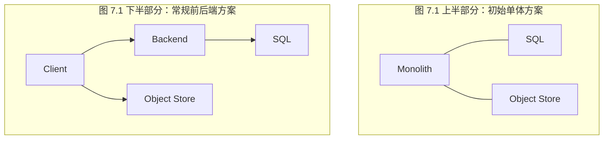
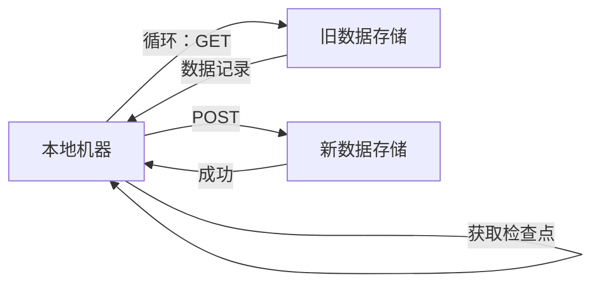
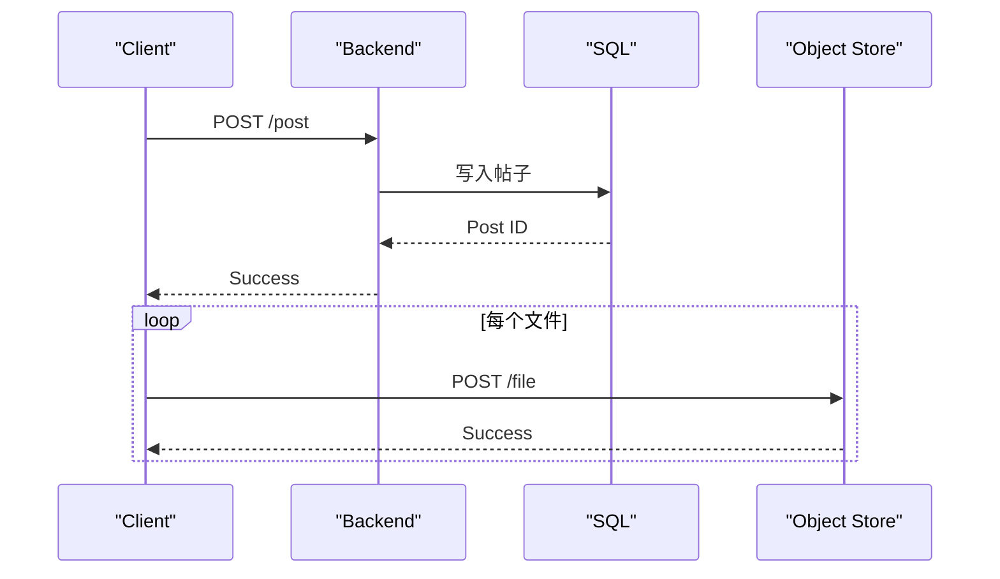
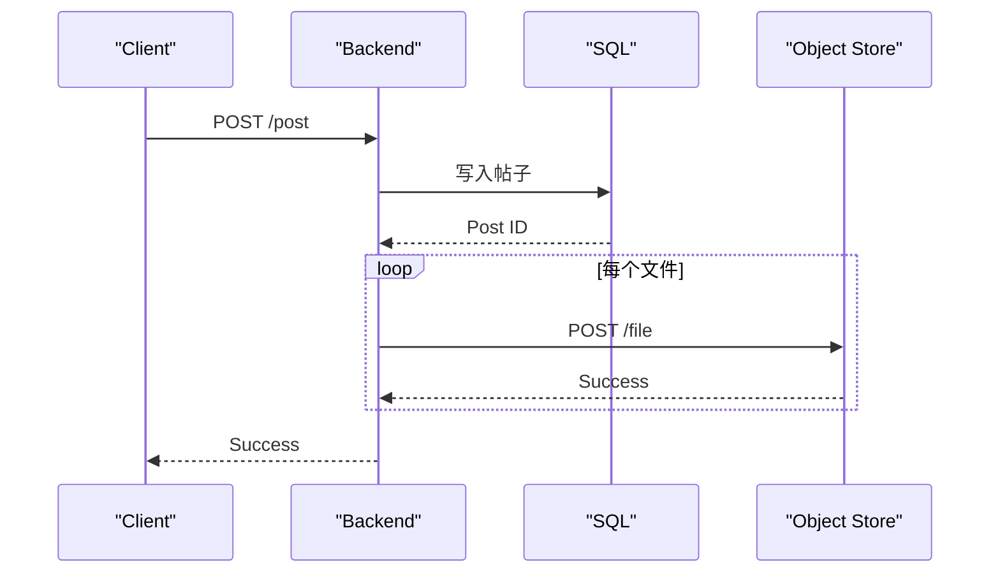
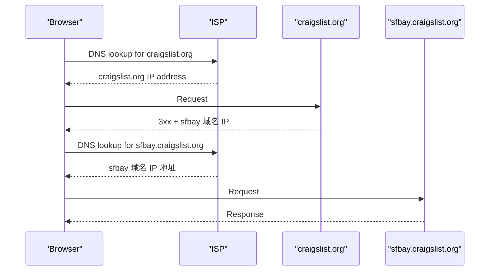
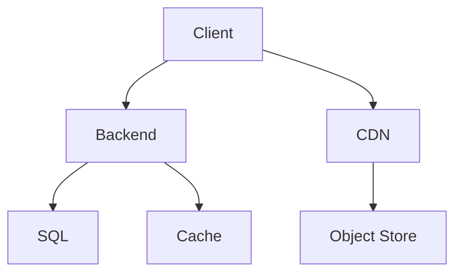
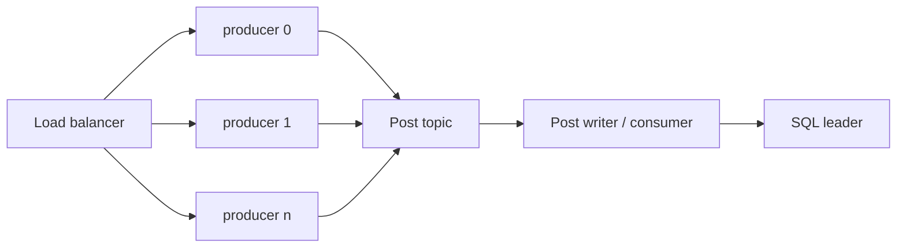
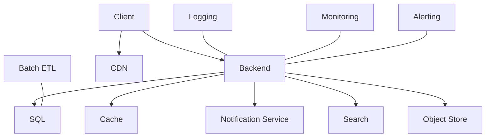
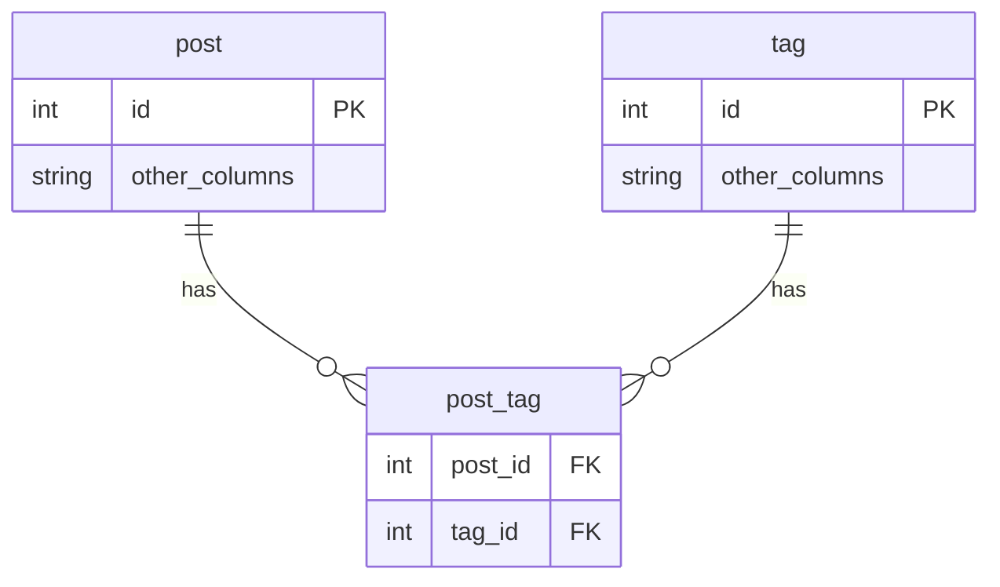

# 07 第 7 章：设计 Craigslist（Design Craigslist）

本章包括：

- 设计具有两类不同用户的应用
- 考虑使用地理位置路由来对用户分区
- 设计读多写少应用
- 处理面试中的轻微偏离

我们要设计一个用于发布分类广告的网页应用。Craigslist 是一个典型的网页应用示例，可能拥有超过十亿用户，并按地理位置进行分区。我们可以讨论整个系统，包括浏览器和移动端应用、无状态后端、简单的存储需求以及分析能力。还可以在开放式讨论中加入更多用例和约束。本章的独特之处在于：这是本书中唯一一个把单体架构作为可能系统设计来讨论的章节。

## 7.1 用户故事与需求

我们先讨论 Craigslist 的用户故事。我们区分两类主要用户：浏览者（viewer）和发布者（poster）。

发布者应当能够创建和删除帖子，并搜索自己发过的帖子，因为他们可能会发很多帖子，尤其是在程序化生成时。帖子应包含以下信息：

- 标题。
- 若干段描述。
- 价格。假设只有单一货币，并忽略货币换算。
- 位置。
- 最多 10 张照片，每张 1 MB。
- 视频，不过这可以放到应用的后续迭代中再添加。

发布者可以每 7 天续期一次帖子，并会收到一封带有点击续期链接的邮件通知。

浏览者应当能够：

1. 查看所有帖子，或搜索任意城市中最近 7 天内发布的帖子。结果列表可以采用无限滚动。
2. 对结果应用过滤条件。
3. 点击单个帖子查看详情。
4. 联系发布者，例如通过邮件。
5. 举报欺诈和误导性帖子（例如，一种可能的点击诱饵技巧是在帖子里写低价，但在描述中写更高的价格）。

非功能性需求如下：

- **可扩展性**——单个城市最多可支持 1000 万用户。
- **高可用性**——99.9% 的正常运行时间。
- **高性能**——浏览者应在帖子创建后数秒内就能看到它们；搜索和查看帖子的 P99 延迟应为 1 秒。
- **安全性**——发布者在创建帖子前应先登录。我们可以使用认证库或认证服务。附录 B 讨论了 OpenID Connect，这是一种流行的认证机制。后文不再展开。

大部分所需存储都用于 Craigslist 帖子。所需存储量很低：

- 我们可能只向某个 Craigslist 用户展示其本地区域的帖子。这意味着，服务任一用户的数据中心只需存储全部帖子中的一小部分（尽管它也可能备份其他数据中心的帖子）。
- 帖子是人工创建的（不是程序化生成），所以存储增长会很慢。
- 我们不处理任何程序化生成的数据。
- 帖子可能在一周后被自动删除。

低存储需求意味着所有数据都能放进单台主机，因此不需要分布式存储方案。假设一条帖子平均包含 1000 个字母，也就是 1 KB 文本；再假设一个大城市有 1000 万人口，其中 10% 是发布者，每天平均发布 10 条帖子（即 10 GB/天），那么我们的 SQL 数据库很容易存下数月的帖子。

## 7.2 API

我们先草拟一些 API 端点，分为帖子管理和用户管理两部分。（在面试中，我们没有时间写正式的 API 规范，比如 OpenAPI 格式或 GraphQL schema，所以可以告诉面试官：我们可以用正式规范定义 API，但为了节省时间，面试时先用草图表达。后文不再重复此点。）

帖子 CRUD：

- `GET` 和 `DELETE /post/{id}`
- `GET /post?search={search_string}`。这可以作为获取所有帖子的端点，也可以带一个 `search` 查询参数来搜索帖子内容。我们也可以实现用于分页的查询参数，后文 12.7.1 节会讨论。
- `POST` 和 `PUT /post`
- `POST /contact`
- `POST /report`
- `DELETE /old_posts`

用户管理：

- `POST /signup`。这里不需要讨论用户账户管理。
- `POST /login`
- `DELETE /user`

其他：

- `GET /health`。通常由框架自动生成。我们的实现可以简单到发起一个小的 GET 请求并验证其返回 200，也可以更详细，包含诸如 P99 和各个端点可用性等统计信息。

还有一些过滤条件，可能会因产品类别而变化。为简单起见，我们假设过滤器集合是固定的。过滤器既可以在前端实现，也可以在后端实现：

- 邻里/社区：枚举类型
- 最低价格
- 最高价格
- 商品成色：枚举类型。值包括 `NEW`、`EXCELLENT`、`GOOD` 和 `ACCEPTABLE`。

`GET /post` 端点可以带一个 `search` 查询参数来搜索帖子。

## 7.3 SQL 数据库模式

我们可以为 Craigslist 的用户和帖子数据设计如下 SQL 模式：

- `User`: `id PRIMARY KEY`, `first_name text`, `last_name text`, `signup_ts integer`
- `Post`：该表是反规范化的，因此无需 JOIN 查询就能获取帖子的全部细节。`id PRIMARY KEY`, `created_at integer`, `poster_id integer`, `location_id integer`, `title text`, `description text`, `price integer`, `condition text`, `country_code char(2)`, `state text`, `city text`, `street_number integer`, `street_name text`, `zip_code text`, `phone_number integer`, `email text`
- `Images`: `id PRIMARY KEY`, `ts integer`, `post_id integer`, `image_address text`
- `Report`: `id PRIMARY KEY`, `ts integer`, `post_id integer`, `user_id integer`, `abuse_type text`, `message text`
- 图片存储：我们可以把图片存到对象存储中。AWS S3 和 Azure Blob Storage 很流行，因为它们可靠、易于使用和维护，而且成本效益高。
- `image_address`：用于从对象存储中检索图片的标识符。

当需要低延迟时，例如响应用户查询时，我们通常使用 SQL 或 Redis 这类低延迟内存数据库。使用 HDFS 等分布式文件系统的 NoSQL 数据库更适合大规模数据处理作业。

## 7.4 初始高层架构

参考图 7.1，我们可以按复杂度由低到高讨论 Craigslist 初始设计的几种可能性。接下来两节会讨论这两种设计。

1. 一个使用用户认证服务进行认证、使用对象存储保存帖子的单体。
2. 一个客户端前端服务、一个后端服务、一个 SQL 服务、一个对象存储以及一个用户认证服务。

无论哪种设计，我们都要加入日志服务，因为日志几乎总是必需的，这样我们才能有效地调试系统。为了简单起见，我们可以暂时不考虑监控和告警。不过，大多数云厂商都提供容易配置的日志、监控和告警工具，我们应该使用它们。



图 7.1  我们高层架构的两个简单初始设计。（上）高层架构只包含一个单体和一个对象存储。（下）一个常规高层架构，包含 UI 前端服务和后端服务。图片文件存放在对象存储中，由客户端直接请求；帖子其余部分存放在 SQL 中。

## 7.5 单体架构

我们建议的第一个设计是使用单体，这听起来并不直观，面试官甚至可能会有些意外。职业生涯中，人们不太可能在 Web 服务上使用单体架构。然而，我们应当记住：任何设计决策都关乎权衡，不应害怕提出这种方案并讨论其权衡。

我们可以把应用实现为一个单体，同时包含 UI 和后端功能，并将整个网页存储在对象存储中。一个关键设计决策是：我们可以把一个帖子的整张网页连同照片一起完整存储在对象存储中。这样的设计意味着，我们可能不会使用 7.3 节讨论的 `Post` 表中的许多列；这张表是供本章后面讨论的图 7.1 下半部分的高层架构使用的。

参考图 7.2，主页是静态的，除了位置导航栏（包含一个区域位置，例如 “SF bay area”，以及更细位置的链接，例如 “sfc”、“sby”等）和 “nearby cl” 区块（包含其他城市列表）之外，其他内容都静态。左侧导航栏上的站点（如 “craigslist app” 和 “about craigslist”）是静态的；底部导航栏上的站点（如 “help”、“safety”、“privacy” 等）也是静态的。


图 7.2  Craigslist 主页。（来源：https://sfbay.craigslist.org/）

这种方法实现和维护都很简单。其主要权衡如下：

1. HTML 标签、CSS 和 JavaScript 会在每个帖子中重复。
2. 如果我们开发原生移动应用，它无法与浏览器应用共享后端。一个可能的解决方案是开发渐进式 Web 应用（第 6.5.3 节讨论），它可以安装在移动设备上，也可以在任意设备的浏览器中使用。
3. 对帖子进行任何分析都需要解析 HTML。这只是个小缺点。我们可以自行开发和维护工具脚本，抓取帖子页面并解析 HTML。

第一个权衡的缺点是：需要额外存储来保存重复的页面组件。另一个缺点是：新特性或新字段无法应用到旧帖子，不过由于帖子会在一周后自动删除，这在某些需求下也许可以接受。我们可以把这件事当作一个例子，与面试官讨论：在设计系统时不要假定任何需求。

我们可以通过两种方式部分缓解第二个权衡：其一，用响应式设计来编写浏览器应用；其二，把移动应用做成一个基于 WebView 的浏览器应用包装层。`react-native-webview` 是 React Native 的 WebView 库。`https://developer.android.com/reference/android/webkit/WebView` 是 Android 原生的 WebView 库，而 `https://developer.apple.com/documentation/webkit/wkwebview` 是 iOS 原生的 WebView 库。我们可以使用 CSS 媒体查询（`https://developer.mozilla.org/en-US/docs/Learn/CSS/CSS_layout/Responsive_Design#media_queries`）为手机、平板、笔记本和台式机显示不同的页面布局。这样我们就不需要使用移动框架中的 UI 组件了。本书不讨论这种方式与传统移动开发框架 UI 组件方案在用户体验上的比较。

对于后端服务和对象存储服务的认证，我们可以使用第三方用户认证服务，也可以自行维护。关于 Simple Login 和 OpenID Connect 认证机制的详细讨论，参见附录 B。

## 7.6 使用 SQL 数据库和对象存储

图 7.1 的下半部分展示了一个更传统的高层架构。我们有一个 UI 前端服务，它向后端服务和对象存储服务发起请求；后端服务再向 SQL 服务发起请求。

在这种方法中，对象存储用于存放图片文件，而 SQL 数据库存放帖子其余数据，如 7.4 节所述。我们本来也可以把所有数据（包括图片）都直接存入 SQL 数据库，而不使用对象存储。但这样客户端就必须通过后端主机来下载图片文件，这会增加后端主机的负担、增加图片下载延迟，并提高因突发网络连接问题而导致下载失败的整体概率。

如果我们希望初始实现尽量简单，也可以先不实现帖子图片功能，等需要实现时再引入对象存储。

不过，鉴于每个帖子最多只有 10 个、每个 1 MB 的图片文件，而且我们不会存储大型图片文件，我们可以和面试官讨论：这个需求在未来是否会变化。如果我们预计不会需要更大的图片，就可以直接把图片存入 SQL。图片表可以有一个 `post_id` 文本列和一个 `image blob` 列。这种设计的优点是简单。

## 7.7 迁移很棘手

在讨论如何为非功能性需求选择合适的数据存储时，我们先讨论数据迁移问题，然后再继续讨论其他功能和需求。

将图片文件存储在 SQL 中的另一个缺点是：未来我们需要迁移到对象存储。把一种数据存储迁移到另一种数据存储通常既棘手又繁琐。

我们先讨论一个可能的简单迁移流程，假设如下：

1. 我们可以把两个数据存储视为单一实体。也就是说，复制细节对我们来说是抽象掉的；我们无需考虑数据如何分布在各个数据中心中以优化延迟或可用性等非功能需求。
2. 允许停机。数据迁移期间我们可以禁用应用写入，这样用户在数据从旧存储转移到新存储时不会向旧存储新增数据。
3. 当停机开始时，我们可以断开/终止正在进行的请求，因此发起写请求（`POST`、`PUT`、`DELETE`）的用户会收到 500 错误。我们可以通过邮件、浏览器和移动端推送通知，或者客户端上的横幅通知，提前告知用户这次停机。

我们可以写一个运行在开发者笔记本上的 Python 脚本，从一个存储读取记录并写入另一个存储。参见图 7.3，这个脚本会向后端发送 `GET` 请求以获取当前数据记录，并向新的对象存储发送 `POST` 请求。一般来说，如果数据迁移可以在数小时内完成且只需执行一次，这种简单技术就足够了。开发者写这个脚本只需几个小时，所以与其花更多时间去优化它以加快迁移，不如把时间花在别的地方。

我们应当预期迁移任务可能会因 bug 或网络问题而突然中断，届时需要重新启动脚本。写入端点应当具备幂等性，以防新数据存储中出现重复记录。脚本还应做检查点（checkpointing），这样就不会重新读取和重写已经迁移过的记录。一个简单的检查点机制就够了：每次写入后，都把对象 ID 保存到本地硬盘。如果任务中途失败，在修复 bug 后重新启动时，就可以从检查点继续。



图 7.3  一个简单数据迁移流程的序列图。本地机器首先查找是否存在检查点，然后通过相关请求把每条记录从旧数据存储迁移到新数据存储。

细心的读者会注意到，要让这个检查点机制生效，脚本每次运行时都必须以相同顺序读取记录。实现这一点的方法很多，包括：

- 如果我们能拿到一份完整且有序的记录 ID 列表，并把它存到本地硬盘上，那么脚本在开始迁移前就可以先把这份列表载入内存。脚本按 ID 逐条读取记录，写入新存储，并把已经迁移的 ID 记录到硬盘。由于磁盘写入很慢，我们可以按批次写入/检查点这些已完成的 ID。使用这种批处理时，任务可能在一个批次被检查点记录之前就失败，因此这些对象可能会被重新读取和重写，而幂等写入端点会防止重复记录。
- 如果我们的数据对象有任何序数（表示位置）的字段，比如时间戳，那么脚本可以用这个字段做检查点。例如，如果按日期做检查点，那么脚本先迁移最早日期的记录，记录这个日期的检查点，日期加 1，再迁移该日期的记录，如此反复，直到迁移完成。

这个脚本必须把数据对象的字段读写到正确的表和列中。迁移前添加的功能越多，迁移脚本就越复杂。功能越多，类和属性就越多；数据库表和列也会更多，我们还需要编写更多 ORM/SQL 查询，这些查询语句也会更复杂，并且可能涉及表之间的 JOIN。

如果数据迁移量太大，无法用这种技术完成，我们就需要在数据中心内部运行脚本。如果数据分布在多个主机上，我们可以在每台主机上分别运行脚本。使用多台主机可以让迁移在没有停机的情况下完成。如果数据存储分布在很多主机上，那是因为用户很多，而在这种情况下，停机对于收入和声誉来说代价太高。

要逐台下线旧数据存储，我们可以在每台主机上执行以下步骤：

1. 排空主机上的连接。连接排空是指：让已有请求完成，但不再接收新请求。更多信息可参考 `https://cloud.google.com/load-balancing/docs/enabling-connection-draining`、`https://aws.amazon.com/blogs/aws/elb-connection-draining-remove-instances-from-service-with-care/` 和 `https://docs.aws.amazon.com/elasticloadbalancing/latest/classic/config-conn-drain.html`。
2. 主机排空后，在该主机上运行数据迁移脚本。
3. 脚本运行结束后，我们就不再需要这台主机了。

应该如何处理写错误？如果这次迁移需要很多小时甚至很多天才能完成，那么每次读写数据出错就让迁移任务崩溃并终止，是不切实际的。脚本应当记录错误并继续运行。每次出错时，记录正在读写的那条记录，然后继续处理其他记录。我们可以检查这些错误，必要时修复 bug，然后重新运行脚本来迁移这些特定记录。

从中得到的一个教训是：数据迁移是一项复杂且成本高昂的工作，如果可能，应尽量避免。当我们决定为某个系统选择哪些数据存储时，除非我们是在构建一个概念验证，而且只会处理少量数据（最好还是可以无后果丢弃的不重要数据），否则我们应该一开始就把合适的数据存储搭建好，而不是以后再搭，再做迁移。

## 7.8 写入和读取帖子

图 7.4 是在 7.6 节架构下，发布者写入帖子时的时序图。虽然我们会向多个服务写数据，但不需要使用分布式事务来保证一致性。流程如下：

1. 客户端向后端发送 `POST` 请求，内容是帖子本身，但不包含图片。后端把帖子写入 SQL 数据库，并把帖子 ID 返回给客户端。
2. 客户端可以一次上传一个图片文件到对象存储，也可以 fork 线程并行发起上传请求。



图 7.4  写入新帖子的时序图，由客户端负责图片上传。

在这种方法中，后端返回 200 成功时，并不知道图片文件是否已经成功上传到对象存储。若要让后端确保整个帖子都上传成功，它必须自己把图片上传到对象存储。



图 7.5  写入新帖子的时序图，由后端负责图片上传。

我们来讨论这两种方法的权衡。排除后端参与图片上传的优点包括：

- **资源更少**——把上传图片的负担压给客户端。如果图片上传经过后端，那么后端必须随着对象存储一起扩容。
- **总体延迟更低**——图片文件不需要再经过额外的一台主机。如果我们决定使用 CDN 来存储图片，这个延迟问题会更严重，因为客户端无法利用靠近自己位置的 CDN 边缘节点。

把后端纳入图片上传的优点如下：

- 我们不需要在对象存储上实现和维护认证与授权机制。由于对象存储不暴露给外部世界，系统整体攻击面更小。
- 可以保证浏览者一定能看到帖子中的所有图片。在前一种方法中，如果部分或全部图片未成功上传，浏览者在查看帖子时就看不到它们。我们可以和面试官讨论：这是否是可接受的权衡。

一种兼顾两种方案大部分优点的方法，是客户端把图片文件写到后端，但从 CDN 读取图片文件。

> [!question]
> 每个图片文件单独发一个请求上传，与一次性在单个请求里上传所有文件相比，有什么权衡？

客户端真的需要为每个图片文件单独上传吗？这种复杂性可能是不必要的。写请求的最大大小会略大于 10 MB，这个大小足以在几秒内上传完成。但这也意味着重试会更昂贵。把这些权衡与面试官讨论。

浏览者读取帖子的时序图与图 7.4 相同，只不过请求从 `POST` 变成了 `GET`。浏览者读取帖子时，后端从 SQL 数据库获取帖子并返回给客户端；接着客户端从对象存储中获取并展示帖子的图片。图片获取请求可以并行，因此文件可以放在不同的存储主机上，并从彼此独立的存储主机并行下载。

## 7.9 功能分区

扩展规模的第一步可以是按地理区域进行功能分区，例如按城市。这通常称为地理位置路由（geolocation routing），也就是根据 DNS 查询发起位置所在的地理区域来提供流量服务。比如，我们可以把应用部署到多个数据中心，并把每个用户路由到服务其所在城市的数据中心，而这通常也是最近的数据中心。因此，每个数据中心中的 SQL 集群只包含它所服务城市的数据。我们可以像第 4.3.2 节讲的基于 MySQL binlog 的复制那样，把每个 SQL 集群复制到另外两个位于不同数据中心的 SQL 服务中。

Craigslist 通过为每个城市分配一个子域名来做地理分区（例如 `sfbay.craigslist.org`、`shanghai.craiglist.org` 等）。如果我们在浏览器里访问 `craigslist.org`，会发生如下步骤。图 7.6 给出了示例。

1. 我们的互联网服务提供商会对 `craigslist.org` 做 DNS 查询并返回其 IP 地址。（浏览器和操作系统都缓存 DNS，所以浏览器未来可以使用自己的 DNS 缓存或操作系统的 DNS 缓存，这比把 DNS 请求发送给 ISP 更快。）
2. 浏览器向 `craigslist.org` 的 IP 地址发起请求。服务器根据 IP 地址里包含的位置判断我们的地理位置，并返回一个与该位置对应的子域名的 3xx 响应。这个返回地址可以被浏览器以及中间经过的其他缓存层（例如用户的操作系统和 ISP）缓存。
3. 还需要再做一次 DNS 查询来获取这个子域名的 IP 地址。
4. 浏览器向该子域名的 IP 地址发起请求。服务器返回该子域名对应的网页和数据。



图 7.6  使用 GeoDNS 将用户请求导向合适 IP 地址的时序图。

我们可以在 Craigslist 中使用 GeoDNS。浏览器只需要对 `craigslist.org` 做一次 DNS 查询，返回的 IP 地址就是对应我们位置的数据中心。然后浏览器可以向这个数据中心发请求，获取我们所在城市的帖子。与其在浏览器地址栏里指定子域名，不如在 UI 中通过下拉菜单显示城市。用户可以在下拉菜单里选择城市，向对应数据中心发请求并查看该城市的帖子。我们的 UI 也可以提供一个简单的静态网页，列出所有 Craigslist 城市，用户点击后即可进入目标城市。

AWS 等云服务提供了配置地理位置路由的指南：`https://docs.aws.amazon.com/Route53/latest/DeveloperGuide/routing-policy-geo.html`。

## 7.10 缓存

某些帖子可能非常热门，读请求率很高，例如展示的商品价格远低于市场价的帖子。为了满足我们的延迟 SLA（例如 1 秒 P99）并防止 504 超时错误，我们可以缓存热门帖子。

我们可以使用 Redis 实现一个 LRU 缓存。键可以是帖子 ID，值可以是整张帖子 HTML 页面。我们也可以在对象存储前面实现一个图片服务，让它拥有自己的缓存，把对象标识符映射到图片。

帖子的静态特性限制了缓存失效的可能性，尽管发布者可能会更新自己的帖子。如果他们更新了，主机应该刷新相应的缓存项。

## 7.11 CDN

参考图 7.7，我们可以考虑使用 CDN，不过 Craigslist 几乎没有会展示给所有用户的静态媒体（即图片和视频）。它现有的静态内容只有 CSS 和 JavaScript 文件，总量也不过几 MB。我们还可以对这些 CSS 和 JavaScript 文件使用浏览器缓存。（浏览器缓存在第 4.10 节中已经讨论过。）



图 7.7  在添加缓存和 CDN 后的 Craigslist 架构图。

## 7.12 用 SQL 集群扩展读取

如果只做到功能分区和缓存，大概率就已经足够了。若确实需要扩展读取，我们可以采用第 3 章讨论过的方法，其中之一就是 SQL 复制。

## 7.13 扩展写入吞吐量

在本章开头我们说过，这是一个读多写少的应用。我们不太可能需要支持程序化创建帖子。本节是假设一种情况：我们确实允许这么做，也许还会提供一个公开 API 供帖子创建。

如果插入和更新 SQL 主机的流量出现峰值，所需吞吐量可能超过它的最大写入吞吐量。参考 `https://stackoverflow.com/questions/2861944/how-to-do-very-fast-inserts-to-sql-server-2008`，某些 SQL 实现提供了快速 `INSERT` 的方法，例如 SQL Server 的 `ExecuteNonQuery` 每秒可以完成数千次 `INSERT`。另一种解决方案是使用批量提交，而不是单条 `INSERT`，这样每条 `INSERT` 就不会都有日志刷盘开销。

### 使用消息中间件 Kafka

为了应对写流量峰值，我们可以使用 Kafka 这类流式方案，在 SQL 服务前面放一个 Kafka 服务。

图 7.8 展示了一个可能的设计。当发布者提交新帖子或更新帖子时，Post Writer Service 的主机可以向 `Post` topic 生产消息。这个服务是无状态的，可以水平扩展。我们可以新建一个名为 “Post Writer” 的服务，它持续从 `Post` topic 消费并写入 SQL 服务。这个 SQL 服务可以使用第 3 章讨论过的主从复制。



图 7.8  使用水平扩展和消息中间件来应对写流量峰值。

这种方法的主要权衡是复杂性和最终一致性。我们的组织很可能已经有可用的 Kafka 服务，因此无需自行实现 Kafka 服务，这在某种程度上抵消了复杂性。由于写入到达 SQL follower 的时间会更长，最终一致性持续时间也会增加。

如果所需写吞吐量超过单个 SQL 主机的平均写吞吐量，我们可以进一步对 SQL 集群做功能分区，为写入流量大的类别设置专用 SQL 集群。这个方案并不理想，因为查看帖子的应用逻辑必须根据类别从特定的 SQL 集群读取数据。查询逻辑不再封装在 SQL 服务中，而是也进入了应用层。此时 SQL 服务不再独立于后端服务，两者的维护都会更复杂。

如果需要更高的写吞吐量，我们可以使用 Cassandra 这类 NoSQL 数据库，或者使用带 HDFS 的 Kafka。

我们也可以考虑在后端集群前面加一个限流器（参见第 8 章），以防止 DDoS 攻击。

## 7.14 邮件服务

我们的后端可以向共享邮件服务发送请求来发邮件。

为了在帖子满 7 天时向发布者发送续期提醒，可以把这件事实现为一个批处理 ETL 作业：查询 SQL 数据库中满 7 天的帖子，然后请求邮件服务为每个帖子发送一封邮件。

其他应用中的通知服务可能还会有一些要求，例如要处理不可预测的流量峰值、低延迟、并且通知应在较短时间内送达。下一章会讨论这样的通知服务。

## 7.15 搜索

参考第 2.6 节，我们可以在 `Post` 表上创建 Elasticsearch 索引，让用户搜索帖子。我们也可以讨论是否允许用户在搜索前后对帖子进行过滤，例如按用户、价格、成色、位置、帖子新旧程度等进行过滤，并据此修改索引。

## 7.16 删除旧帖子

Craigslist 帖子会在若干天后过期，过期后将无法访问。这个功能可以通过 cron 作业或 Airflow 实现，每天调用 `DELETE /old_posts` 端点。`DELETE /old_posts` 可能需要与 `DELETE /post/{id}` 分开，因为后者只是一次简单的数据库删除操作，而前者需要先计算合适的时间戳，再删除早于该时间戳的帖子。这两个端点还可能都需要从 Redis 缓存中删除相应键。

这个作业简单且非关键，因为即使应该删除的帖子多存在几天也是可以接受的，所以 cron 作业可能已经足够，而 Airflow 反而会引入不必要的复杂性。我们必须小心，不要在帖子到期前误删，因此此功能的任何改动在生产部署前都必须在 staging 中彻底测试。与像 Airflow 这样的复杂工作流管理平台相比，cron 更简单，更利于维护，尤其是在实现该功能的工程师离开之后，维护工作由其他工程师接手时更是如此。

删除旧帖子，或者更一般地删除旧数据，有以下优点：

- 节省存储容量 provisioning 和维护成本。
- 数据库操作（例如读和索引）更快。
- 需要把所有数据复制到新位置的维护操作会更快、更简单、成本更低，例如添加数据库或迁移到另一个数据库方案。
- 对组织而言隐私顾虑更少，也能减轻数据泄露的影响，不过由于这些是公开数据，这一优势不会特别强。

缺点如下：

- 会妨碍分析和从保留数据中获得有价值的洞察。
- 政府法规可能要求我们保留数据一段时间。
- 有极小概率，已删除帖子的 URL 会被新帖子复用，浏览者可能误以为自己看到的是旧帖子。如果使用短链接服务，这种概率会更高。不过这种风险极低，对用户影响也很小，因此是可接受的；但如果可能暴露敏感个人数据，这个风险就不可接受了。

如果成本是问题，而旧数据又很少被访问，那么删除数据的替代方案是先压缩，再存到低成本的归档硬件（例如磁带）中，或使用在线数据归档服务，例如 AWS Glacier 或 Azure Archive Storage。当某些旧数据需要被使用时，可以在数据处理操作前把它写入磁盘驱动器。

## 7.17 监控与告警

除了第 2.5 节讨论的内容之外，我们还应针对以下情况进行监控并发送告警：

- 我们的数据库监控方案（第 10 章讨论）应在旧帖子未被删除时触发一个低紧急级别的告警。
- 对以下内容进行异常检测：
  - 新增或删除的帖子数量。
  - 某个特定搜索词的高搜索量。
  - 被标记为不当内容的帖子数量。

## 7.18 我们目前为止对架构的讨论总结

图 7.9 展示了 Craigslist 的架构，其中包含我们前面讨论过的大部分服务，分别是客户端、后端、SQL、缓存、通知服务、搜索服务、对象存储、CDN、日志、监控、告警以及批处理 ETL。



图 7.9  我们的 Craigslist 架构，其中包含通知服务、搜索、日志、监控和告警。日志、监控和告警可以服务于很多组件，所以在图中把它们画成松散组件。我们还可以在批处理 ETL 服务上定义作业，例如周期性删除旧帖子。

## 7.19 其他可能的讨论主题

我们的系统设计已经满足了本章开头提出的需求。面试的剩余部分可能会围绕新的约束和需求展开。

### 7.19.1 举报帖子

我们还没有讨论用户举报帖子的功能，因为这很直接。围绕这一点的系统设计讨论可能包括满足如下需求：

- 如果举报数量达到某个阈值，帖子会被下架，发布者会收到邮件通知。
- 发布者账户和邮箱可能会被自动封禁，这样发布者就不能登录 Craigslist 或创建帖子。不过，他们仍然可以在不登录的情况下继续浏览帖子，也可以继续给其他发布者发邮件。
- 发布者应当能够联系管理员申诉这一决定。我们可能需要和面试官讨论，是否需要一个系统来追踪和记录这些交互与决策。
- 如果发布者希望屏蔽邮件，他们需要自行在邮件账户中配置发送者邮箱地址的拦截规则。Craigslist 不负责这件事。

### 7.19.2 优雅降级

我们如何处理各个组件的故障？哪些边界情况可能导致故障，我们又该如何处理？

### 7.19.3 复杂性

Craigslist 被设计成一个简单的分类广告应用，重点是让小型工程团队易于维护。它的功能集刻意保持有限且定义明确，很少引入新功能。我们也许需要讨论如何实现这一点。

#### 最小化依赖

任何包含库和/或服务依赖的应用，都会随着时间自然衰减，并要求开发者不断维护它，以维持当前功能。旧版本的库乃至整个库都会被废弃，服务也可能被退役，迫使开发者安装更新版本或寻找替代品。新版本库或新服务部署也可能破坏我们的应用。如果当前使用的库存在 bug 或安全漏洞，也可能需要更新。尽量减少系统功能集，就能尽量减少依赖，从而简化调试、排障和维护。

这种做法要求公司文化合适，重点是提供最小但有用的一组功能，而且这些功能不需要针对每个市场做大量定制。例如，Craigslist 之所以不提供支付功能，可能主要是因为处理支付的业务逻辑在不同城市会不同。

我们必须考虑不同货币、税费、支付处理器（MasterCard、Visa、PayPal、WePay 等），并且需要持续跟进这些因素的变化。许多大厂工程文化会奖励项目经理和工程师去构想并构建新服务；这种文化并不适合我们这里。

#### 使用云服务

在图 7.9 中，除了客户端和后端之外，其他所有服务都可以部署到云服务上。例如，我们可以为图 7.9 中的各个服务使用以下 AWS 服务。Azure 或 GCP 也提供类似服务：

- `SQL`: RDS (`https://aws.amazon.com/rds/`)
- `Object Store`: S3 (`https://aws.amazon.com/s3/`)
- `Cache`: ElastiCache (`https://aws.amazon.com/elasticache/`)
- `CDN`: CloudFront (`https://www.amazonaws.cn/en/cloudfront/`)
- `Notification service`: Simple Notification Service (`https://aws.amazon.com/sns`)
- `Search`: CloudSearch (`https://aws.amazon.com/cloudsearch/`)
- `Logging, monitoring, and alerting`: CloudWatch (`https://aws.amazon.com/cloudwatch/`)
- `Batch ETL`: 带速率和 cron 表达式的 Lambda 函数 (`https://docs.aws.amazon.com/lambda/latest/dg/services-cloudwatchevents-expressions.html`)

#### 将整个网页存为 HTML 文档

网页通常由一个 HTML 模板构成，中间穿插若干 JavaScript 函数，这些函数会发起后端请求来填充细节。对于 Craigslist 来说，一个帖子的 HTML 页面模板可能包含标题、描述、价格、照片等字段，每个字段的值都可以由 JavaScript 填入。

Craigslist 帖子网页这种简单且小巧的设计，使得我们前面在 7.5 节讨论的更简单替代方案成为可行，我们也可以在这里继续讨论。一个帖子的网页可以作为单个 HTML 文档存储在数据库或 CDN 中。这可以简单到一个键值对：键是帖子 ID，值是 HTML 文档。这样做要牺牲一些存储空间，因为每个数据库条目里都会有重复的 HTML。搜索索引可以基于这一组帖子 ID 来构建。

这种方法还使得为新帖子添加或删除字段变得不那么复杂。如果我们决定增加一个新的必填字段（例如副标题），就可以直接改字段，而不用做 SQL 数据库迁移。我们也不需要修改旧帖子的字段，因为它们有保留期，最终会自动删除。`Post` 表也因此变得更简单，只需把帖子字段替换为帖子的 CDN URL。其列会变成 `id, ts, poster_id, location_id, post_url`。

#### 可观测性

任何关于可维护性的讨论都必须强调可观测性的重要性，这一点在第 2.5 节有详细讨论。我们必须投入日志、监控、告警、自动化测试，并采用良好的 SRE 实践，包括完善的监控仪表板、runbook，以及调试自动化。

### 7.19.4 商品类别/标签

我们可以提供商品类别/标签，例如 “automotive”、“real estate”、“furniture” 等，并允许发布者在一个列表上放置不超过某个数量的标签（例如 3 个）。我们可以为标签创建一个 SQL 维度表。我们的 `Post` 表也可以包含一个逗号分隔的标签列表列。另一种做法是使用一个关联/连接表 `post_tag`，如图 7.10 所示。



图 7.10  帖子与标签的关联/连接表。这个 schema 归一化通过避免重复数据来维持一致性。如果数据只放在单表中，行与行之间会出现重复值。

我们还可以把这个扁平列表扩展成层级列表，让用户应用更精确的过滤条件，从而查看与自己兴趣更相关的帖子。例如，“real estate” 可以有如下嵌套子类别：

- `Real estate > Transaction type > Rent`
- `Real estate > Transaction type > Sale`
- `Housing type > Apartment`
- `Housing type > Single-family house`
- `Housing type > Townhouse`

### 7.19.5 分析与推荐

我们可以编写每日批处理 ETL 作业，查询 SQL 数据库并为各类指标填充仪表板：

- 按标签统计的项目数量。
- 点击次数最多的标签。
- 让浏览者联系发布者次数最高的标签。
- 销售速度最快的标签，可通过帖子发布后多久被删除来衡量。
- 被举报、被怀疑以及已确认欺诈帖子的数量，以及其地理与时间分布。

Craigslist 不提供个性化推荐，帖子按最新时间排序。我们可以讨论个性化推荐，包括追踪用户活动并推荐帖子。

### 7.19.6 A/B 测试

如 1.4.5 节简要讨论的那样，当我们为应用开发新功能和新的视觉设计时，可能希望逐步向越来越多的用户灰度发布，而不是一次性向所有用户开放。

### 7.19.7 订阅与保存搜索

我们可以为浏览者提供一个 API 端点，用于保存搜索词（有字符数限制），并在有任何新帖子匹配其保存搜索时，通过邮件、短信、应用内消息等方式通知他们。对这个端点发起的 `POST` 请求可以向我们命名为 `saved_search` 的 SQL 表写入一行（`timestamp, user_id, search_term`）。

这个保存搜索订阅服务本身就可能是一个复杂系统，如本节所述。

用户每天应收到一条汇总其所有保存搜索的通知。该通知可以包含搜索词列表，以及每个搜索词最多 10 个对应结果。每个结果又由该搜索词对应的一组帖子数据组成。数据可以包含帖子链接和一些摘要信息（标题、价格、描述前 100 个字符）用于在通知中展示。

例如，如果用户保存了两个搜索词，`san francisco studio apartment` 和 `systems design interview book`，通知可能包含如下内容。（面试中当然不会把这些全写出来。你可以草草写几段，然后口头解释它们的含义。）

```json
[
  {
    "search_term": "san francisco studio apartment",
    "results": [
      {
        "link": "sfbay.craigslist.org/12345",
        "title": "Totally remodeled studio",
        "price": 3000,
        "description_snippet": "Beautiful cozy studio apartment in the Mission. Nice views in a beautiful and safe neighborhood. Clo"
      },
      {
        "link": "sfbay.craigslist.org/67890",
        "title": "Large and beautiful studio",
        "price": 3500,
        "description_snippet": "Amenities\nComfortable, open floor plan\nIn unit laundry\nLarge closets\nPet friendly\nCeiling fan\nGar"
      },
      ...
    ]
  },
  {
    "search_term": "systems design interview book",
    "results": [
      ...
    ]
  }
]
```

为了把新的搜索结果发送给用户，我们可以实现一个每日批处理 ETL 作业。我们至少可以提出两种实现方式：一种更简单，允许对搜索服务发出重复请求；另一种更复杂，避免这些重复请求。

### 7.19.8 允许向搜索服务发出重复请求

Elasticsearch 会缓存高频搜索请求（`https://www.elastic.co/blog/elasticsearch-caching-deep-dive-boosting-query-speed-one-cache-at-a-time`），因此相同搜索词的频繁请求不会浪费太多资源。我们的批处理 ETL 作业可以按用户和其各自的搜索词逐个处理。每个流程都是：把用户的搜索词作为独立请求发送给搜索服务，汇总结果，然后向通知服务发送请求（该服务在第 9 章中介绍）。

### 7.19.9 避免向搜索服务发出重复请求

我们的批处理 ETL 作业按如下步骤运行：

1. 去重搜索词，这样每个词只需要搜索一次。我们可以运行类似下面的 SQL：`SELECT DISTINCT LOWER(search_term) FROM saved_search WHERE timestamp >= UNIX_TIMESTAMP(DATEADD(CURDATE(), INTERVAL -1 DAY)) AND timestamp < UNIX_TIMESTAMP(CURDATE())`，以去重昨天的搜索词。我们的搜索可以是大小写不敏感的，因此在去重时把搜索词转为小写。由于 Craigslist 设计按城市分区，搜索词总数不应超过 1 亿。假设每个搜索词平均 10 个字符，那么总数据量为 1 GB，完全可以放进单台主机内存中。
2. 对于每个搜索词：
   - 向（Elasticsearch）搜索服务发请求并获取结果。
   - 查询 `saved_search` 表，找出与这个搜索词关联的用户 ID。
   - 对于每个（用户 ID、搜索词、结果）三元组，向通知服务发送请求。

如果作业在第 2 步中失败怎么办？我们如何避免向用户重复发送通知？

我们可以使用第 5 章中描述的分布式事务机制。或者，我们可以在客户端实现逻辑：在显示通知前，先检查通知是否已经展示过（并且可能已被关闭）。这对浏览器或移动应用这类客户端可行，但对邮件或短信不行。

如果保存搜索会过期，我们可以通过每日批处理作业清理比过期时间更早的旧表行，执行 `DELETE` SQL 语句。

### 7.19.10 限流

所有请求都可以先经过限流器，以防单个用户过于频繁地发送请求，从而消耗过多资源。限流器的设计会在第 8 章讨论。

### 7.19.11 大量帖子

如果我们想提供一个所有列表对任何人都可访问的单一 URL（不受位置限制），会怎样？那么 `Post` 表可能会大到单台主机无法承载，帖子搜索的 Elasticsearch 索引也可能大到单台主机无法承载。不过，我们仍应坚持让一次搜索查询由单台主机处理。任何让查询由多台主机处理、再在返回浏览者前由单台主机聚合结果的设计，都会有很高的延迟和成本。那我们如何继续让搜索查询由单台主机处理？可能的方案包括：

- 强制设置帖子过期时间（保留期）为一周，并实现每日批处理作业删除过期帖子。较短的保留期意味着需要搜索和缓存的数据更少，从而降低系统成本和复杂性。
- 减少每个帖子中存储的数据量。
- 对帖子类别做功能分区。也许可以为不同类别创建单独的 SQL 表。但应用可能需要包含到正确表的映射。或者也可以把这种映射存到 Redis 缓存中，应用再查询 Redis 来确定要查哪张表。
- 我们可能不考虑压缩，因为在压缩数据上搜索的成本高得不可承受。

### 7.19.12 本地法规

每个司法辖区（国家、州、县、市等）都可能有影响 Craigslist 的不同法规。示例包括：

- Craigslist 上允许的商品或服务类型可能因辖区而异。我们的系统如何处理这一需求？第 15.10.1 节讨论了一种可能的方法。
- 客户数据和隐私法规可能不允许公司把客户数据导出到境外。也可能要求在客户要求下删除客户数据，或向政府共享数据。这些考虑大概率超出了面试范围。

我们需要讨论具体需求。对于客户端应用来说，仅根据用户 IP 地址所属国家/地区选择性显示某些商品和服务版块是否足够，还是我们也需要防止用户查看或发布被禁止的商品和服务？

一种初步做法，是在客户端加入逻辑，依据用户 IP 地址所属国家来显示或隐藏版块。如果这些法规很多，或者变化频繁，我们可能需要创建一个法规服务，让 Craigslist 管理员可以配置法规，而客户端会向该服务发请求，以确定要显示或隐藏哪些 HTML。由于该服务会承受很重的读流量，而写流量较轻，我们可以采用 CQRS 技术来确保写入成功。例如，我们可以为管理员和浏览者分别准备独立的法规服务，它们分别扩展，并在二者之间进行周期性同步。

如果我们需要确保 Craigslist 上绝对不会发布任何被禁止的内容，我们可能还需要讨论检测禁词或短语的系统，或者机器学习方法。

最后一点是，Craigslist 并不会尝试根据国家定制其列表。一个很好的例子是：它在 2018 年为了响应美国新法规，移除了 Personals 版块；它并没有尝试在其他国家保留这一版块。我们可以讨论这种方法的权衡。

## 总结

- 我们讨论了用户及其所需的数据类型（例如文本、图片或视频），以确定 Craigslist 系统中的非功能需求，即可扩展性、高可用性和高性能。
- CDN 是提供图片或视频的常见方案，但不要想当然地认为它总是合适。如果这些媒体只会被少数用户访问，就应使用对象存储。
- 通过 GeoDNS 做功能分区，是讨论扩展的第一步。
- 接下来是缓存和 CDN，主要用于提升帖子服务的可扩展性和延迟表现。
- 我们的 Craigslist 服务是读多写少的。如果使用 SQL，扩展读取时要考虑主从复制。
- 若要处理写流量峰值，可以考虑对后端进行水平扩展，并使用消息中间件。这样的方案可以通过把写请求分发到多台后端主机来服务写请求，并把它们缓冲在消息中间件里。消费者集群可以从消息中间件中消费请求并据此处理。
- 对于任何不需要实时延迟的功能，都应考虑批处理或流式 ETL 作业。这样虽然更慢，但可扩展性更好、成本更低。
- 面试的其余部分可能会围绕新的约束和需求展开。本章中我们提到的新约束和需求包括：举报帖子、优雅降级、降低复杂性、增加帖子类别/标签、分析与推荐、A/B 测试、订阅与保存搜索、限流、向每个用户展示更多帖子，以及本地法规。
