# 08 第 8 章：设计限流服务（Design a Rate-Limiting Service）

本章包括：

- 使用限流
- 讨论限流服务
- 理解各种限流算法

限流是系统设计面试中几乎总会提到的一项常见能力，本书的大多数示例题也都会涉及它。本章旨在解决两类情况：一是当我们在面试中提到限流时，面试官可能要求我们进一步展开；二是题目本身就是设计一个限流服务。

限流定义了消费者可以向 API 端点发起请求的速率。限流可以防止客户端，尤其是机器人，意外或恶意地过度使用服务。在本章中，我们把这类客户端称为“过量客户端”。

意外过度使用的例子包括：

- 我们的客户端是另一项 Web 服务，而它遇到了合法或恶意的流量激增。
- 该服务的开发者决定在生产环境上运行压测。

这种意外过度使用会造成“吵闹邻居”问题：某个客户端占用了我们服务过多的资源，导致其他客户端遭遇更高时延或更高的失败率。

恶意攻击包括以下几类。限流并不能阻止所有机器人攻击（更多信息可参见 `https://www.cloudflare.com/learning/bots/what-is-bot-management/`）：

- 拒绝服务（DoS）或分布式拒绝服务（DDoS）攻击——DoS 用请求淹没目标，使正常流量无法处理；DoS 只使用一台机器，而 DDoS 使用多台机器发起攻击。这个区别在本章中并不重要，我们把它们统称为“DoS”。
- 暴力破解攻击——反复试错以获取敏感数据，例如破解密码、加密密钥、API key 和 SSH 登录凭据。
- Web 爬虫——使用机器人对 Web 应用的许多 GET 请求进行抓取，以获取大量数据。例如抓取 Amazon 商品页上的价格和评论。

限流可以实现为一个库，也可以实现为由前端、API 网关或 service mesh 调用的独立服务。在本题中，我们将它实现为一个服务，以获得第 6 章讨论过的功能分离优势。图 8.1 展示了本章讨论的限流器设计。

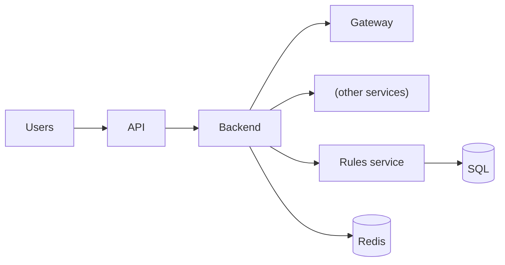

*图 8.1 限流器的初始高层架构。前端、后端和 Rules service 还会把日志写入共享日志服务，这里未画出。Redis 数据库通常由共享 Redis 服务实现，而不是由我们的服务自己预配 Redis 数据库。Rules service 的用户可以通过浏览器应用向 Rules service 发起 API 请求。规则可以存放在 SQL 中。*

## 8.1 限流服务的替代方案及其不可行之处

为什么不通过监控负载、在需要时增加更多主机来横向扩展服务，而要做限流呢？我们可以把服务设计成可水平扩展的，因此在流量增加时，增加更多主机来承接额外负载会很直接。我们可以考虑自动扩缩容。

但当检测到流量激增后再加主机，这一过程可能太慢。添加新主机会涉及一系列耗时步骤，例如预配主机硬件、下载所需的 Docker 容器、在新主机上启动服务，然后更新负载均衡配置把流量导向新主机。等新主机就绪时，我们的服务可能已经崩了。即使是自动扩缩容方案，也可能太慢。

负载均衡器可以限制发往每台主机的请求数。那为什么不直接让负载均衡器确保主机不会过载，并在集群没有空闲容量时丢弃请求呢？

我们不应该服务恶意请求。限流通过识别它们的 IP 地址并直接丢弃请求来防御这类请求。稍后我们会看到，限流器通常可以返回 `429 Too Many Requests`，但如果我们确信某些请求是恶意的，也可以选择下面两种做法之一：

- 丢弃请求，不返回任何响应，让攻击者以为服务正在故障。
- 通过返回 `200` 和空或误导性的响应，把用户做成“影子封禁”。

为什么限流必须是一个独立服务？每台主机不能独立追踪其请求者的请求速率并对它们限流吗？

原因在于，某些请求比其他请求更昂贵。某些用户的请求会返回更多数据，或者需要更昂贵的过滤与聚合，或者涉及更大数据集之间的 JOIN。某台主机可能因为处理某个客户端的大量昂贵请求而变慢。

四层负载均衡器无法处理请求内容。若要做粘性会话（把某个用户的请求路由到同一台主机），我们需要七层负载均衡器，这会引入成本和复杂性。如果我们没有其他七层负载均衡器的用途，那么只为了这个目的去使用它可能不划算，专门的共享限流服务可能是更好的方案。表 8.1 总结了我们的讨论。

| 方案 | 优点 | 缺点 |
| --- | --- | --- |
| 限流 | 通过返回 `429 Too Many Requests` 响应来应对流量峰值；可对高请求速率的用户返回响应；可通过提供误导性响应来处理 DoS 攻击；可对发出昂贵请求的用户限流。 | — |
| 增加新主机 | — | 应对流量峰值可能太慢；服务可能在新主机就绪前就崩溃；会处理恶意请求，而我们不应这样做；仍然会让服务承担处理昂贵请求的成本。 |
| 使用七层负载均衡器 | 可拒绝昂贵请求。 | 不是处理流量峰值的方案；可能过于昂贵和复杂，难以作为独立解决方案。 |

## 8.2 什么时候不应该做限流

限流并不一定适用于任何客户端过量使用的场景。

例如，考虑我们设计过的一个社交媒体服务。用户可能订阅某个标签的更新。如果用户在一段时间内发起太多订阅请求，社交媒体服务可以直接告诉用户：“你在过去几分钟里发起了太多订阅请求。” 如果我们做限流，就会直接丢弃用户请求并返回 `429`（Too Many Requests），或者什么都不返回，由客户端自己判断为 `500`。这会带来很差的用户体验。如果请求来自浏览器或移动端应用，应用可以直接向用户展示“你发起的请求太多了”，从而提供更好的体验。

另一个例子是按请求速率收费的订阅服务（例如每小时 1,000 次或 10,000 次请求对应不同费用）。如果客户端在某个时间区间内超出配额，那么在下一个时间区间之前，后续请求都不应被处理。共享限流服务并不是防止客户端超出订阅配额的合适方案。如下文更详细说明的那样，共享限流服务应当只支持简单用例，而不应支持“给每个客户端设置不同限速”这类复杂用例。

## 8.3 功能需求

我们的限流服务是一个共享服务，主要用户是公司外部使用的服务，而不是员工等内部用户。我们把这类服务称为“用户服务”。用户应该能够设置一个最大请求速率：一旦同一请求者超过该速率，后续请求将被延迟或拒绝，并返回 `429` 响应。我们可以假设时间窗口可以是 10 秒或 60 秒。我们可以设定每 10 秒最多 10 个请求。其他功能需求如下：

- 我们假设，每个用户服务都必须在其各个主机之间对请求者做限流，但同一用户不需要跨服务限流。限流是按用户服务独立生效的。
- 一个用户可以设置多个限流规则，每个端点一个。我们不需要更复杂的用户级配置，例如对特定请求者/用户设置不同限速。我们希望限流器是一个廉价、可扩展且易于理解和使用的服务。
- 我们的用户应当能够查看哪些用户被限流，以及这些限流事件的开始和结束时间戳。我们为此提供一个端点。
- 我们可以和面试官讨论是否应该记录每一条请求，因为这会占用大量存储，成本很高。这里我们假设需要记录，并讨论如何节省存储以降低成本。
- 我们应当把被限流的请求者记录下来，供人工跟进和分析。这对于疑似攻击尤其必要。

## 8.4 非功能需求

限流是几乎所有服务都需要的基础功能。它必须具备可扩展性、高性能、尽可能简单、安全以及隐私保护。限流对服务可用性并非刚性依赖，因此我们可以在高可用性和容错上做权衡。准确性和一致性相当重要，但并不需要特别严格。

### 8.4.1 可扩展性

我们的服务应当能够扩展到每天数十亿次请求，用于查询某个请求者是否应该被限流。修改限流规则的请求只会由组织内部的人工用户发起，因此我们不需要把这个能力暴露给外部用户。

需要多少存储？假设我们的服务有 10 亿用户，并且需要在任意时刻为每个用户存储最多 100 个请求。只需要记录用户 ID 和每个用户一个包含 100 个时间戳的队列；两者都用 64 位存储。我们的限流器是共享服务，因此还需要把请求与被限流的服务关联起来。一个典型的大公司会有成千上万的服务。假设其中最多 100 个需要限流。

我们还应当询问：限流器真的需要为 10 亿用户都存储数据吗？保留时间是多久？限流器通常只需要保留 10 秒，因为它根据最近 10 秒内的请求速率做决策。此外，我们还可以和面试官讨论：在一个 10 秒窗口内，会不会有超过 100 万到 1,000 万个用户？我们取一个保守的最坏情况：1,000 万用户。总存储需求为 `100 * 64 * 101 * 10M = 808 GB`。如果使用 Redis，并且每个用户一个 key，那么一个 value 的大小就是 `64 * 100 = 800 bytes`。由于不能在数据超过 10 秒后立刻删除它们，实际所需存储量取决于服务删除旧数据的速度。

### 8.4.2 性能

当另一项服务接收到来自其用户的请求时（我们把这类请求称为用户请求），它会向我们的限流服务发起请求（我们把这类请求称为限流器请求），以确定是否应该对该用户请求进行限流。限流器请求是阻塞式的；在限流器请求完成之前，其他服务不能向其用户响应。限流器请求的响应时间会叠加到用户请求的响应时间上。因此，我们的服务需要非常低的延迟，可能 P99 需要达到 100ms。是否对用户请求进行限流必须快速决定。我们对日志的查看和分析不要求低延迟。

### 8.4.3 复杂度

我们的服务会是一个共享服务，被组织内许多其他服务使用。它的设计应该尽可能简单，以降低 bug 和故障风险，便于排障，让它专注于“限流器”这一单一功能，并降低成本。

### 8.4.4 安全与隐私

第 2 章讨论了外部服务和内部服务的安全与隐私预期。这里我们可以讨论一些可能的安全与隐私风险：我们用户服务中的安全与隐私实现可能不足以阻止外部攻击者访问限流服务；我们的（内部）用户服务也可能尝试攻击限流器，例如伪造来自其他用户服务的请求以限流它；我们的用户服务还可能通过请求其他用户服务中关于限流器请求者的数据而侵犯隐私。

因此，我们会在限流器的系统设计中实现安全和隐私。

### 8.4.5 可用性与容错

我们可能并不需要高可用性或容错。如果我们的服务可用性低于三个 9，并且平均每天宕机几分钟，用户服务可以在这段时间内直接处理所有请求而不执行限流。此外，可用性越高，成本也越高。提供 99.9% 的可用性相当便宜，而 99.99999% 可能贵得离谱。

如下文所述，我们可以设计一个简单但高可用的缓存，用来缓存过量客户端的 IP 地址。如果限流服务在宕机前刚刚识别出过量客户端，这个缓存就可以在宕机期间继续为限流器请求提供服务，因此这些过量客户端仍会被限流。统计上看，过量客户端恰好出现在限流服务宕机的那几分钟里是很不可能的。如果真的发生了，我们可以使用防火墙等其他技术来避免服务宕机，但代价是在这几分钟内用户体验变差。

### 8.4.6 准确性

为了避免糟糕的用户体验，我们不应该错误地识别过量客户端并对其限流。若有疑问，就不应对该用户限流。限流值本身也不需要完全精确。例如，如果限制是 10 秒内 10 次请求，那么偶尔在 10 秒内对 8 次或 12 次请求进行限流都是可以接受的。如果我们有 SLA 要求最低请求速率，那么可以把限流值设高一些，例如 10 秒内 12 次以上。

### 8.4.7 一致性

前面对准确性的讨论自然引出了一致性。对于我们的任何用例，都不需要强一致性。当用户服务更新限流规则时，这个新规则不必立即作用于新请求；几秒钟的一致性偏差是可以接受的。对于查看哪些用户被限流、或者对这些日志做分析，最终一致性同样可以接受。采用最终一致性而非强一致性，可以让设计更简单、成本更低。

## 8.5 讨论用户故事与所需服务组件

一条限流器请求包含必需的用户 ID 和用户服务 ID。由于限流是按用户服务独立生效的，所以 ID 格式可以由每个用户服务自行定义和维护，而不是由我们的限流服务定义。我们可以使用用户服务 ID 来区分来自不同用户服务但可能相同的用户 ID。由于每个用户服务的限流值不同，我们的限流器也需要使用用户服务 ID 来确定应应用的限流值。

我们的限流器需要把这些（用户 ID、服务 ID）数据保存 60 秒，因为它必须利用这些数据计算用户的请求速率，判断其是否超过限流值。为了尽量降低查询任意用户请求速率或任意服务限流值的延迟，这些数据必须存放在内存存储中（或被缓存）。由于日志对一致性和延迟不敏感，我们可以把日志存储在像 HDFS 这样的最终一致性存储中，它通过复制来避免主机故障导致的数据丢失。

最后，用户服务可以低频地向限流服务发起请求，以创建和更新其端点的限流规则。这个请求可以包含用户服务 ID、端点 ID 以及期望的限流值（例如每 10 秒最多 10 次请求）。

综合这些需求，我们需要：

- 一个用于计数的高速读写数据库。其模式会很简单，通常不复杂于 `(user ID, service ID)`。我们可以使用 Redis 这类内存数据库。
- 一个可以定义和获取规则的服务，我们把它叫作 Rules service。
- 一个向 Rules service 和 Redis 数据库发起请求的服务，我们可以把它叫作 Backend service。

这两个服务要分离，是因为添加或修改规则的请求不应干扰限流器对“该请求是否应该被限流”的判定请求。

## 8.6 高层架构

图 8.2（重复自图 8.1）展示了结合这些需求和故事后的高层架构。当客户端向限流服务发起请求时，请求首先经过前端或 service mesh。如果前端的安全机制允许该请求，那么请求会进入后端，在后端执行以下步骤：

1. 从 Rules service 获取该服务的限流值。这个值可以被缓存，以降低延迟并减少对 Rules service 的请求量。
2. 计算该服务当前的请求速率，包括这一次请求。
3. 返回一个指示该请求是否应该被限流的响应。

步骤 1 和步骤 2 可以并行执行：为每一步 fork 一个线程，或者使用公共线程池中的线程，以降低整体延迟。

图 8.2 中的前端和 Redis（分布式缓存）服务是为了横向扩展，这就是第 3.5.3 节讨论的分布式缓存方案。

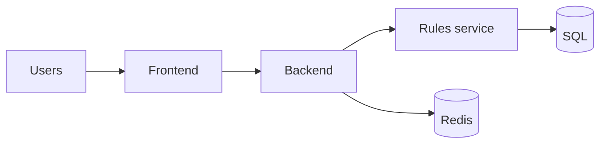

*图 8.2 限流器的初始高层架构。前端、后端和 Rules service 还会把日志写入共享日志服务，这里未画出。Redis 数据库通常由共享 Redis 服务实现，而不是由我们的服务自己预配 Redis 数据库。Rules service 的用户可以通过浏览器应用向 Rules service 发起 API 请求。*

我们可能会注意到，图 8.2 中的 Rules service 有来自两个不同服务（Backend 和 Rules service users）的用户，它们的请求量差异很大，其中 Rules service users 还承担了全部写操作。

回顾第 3.3.2 节和第 3.3.3 节讨论的 leader-follower 复制概念，如图 8.3 所示，Rules service users 可以把所有 SQL 查询（读和写）都发往 leader 节点。Backend 应该把 SQL 查询（仅读/SELECT）发往 follower 节点。这样，Rules service users 可以获得更高的一致性和性能。

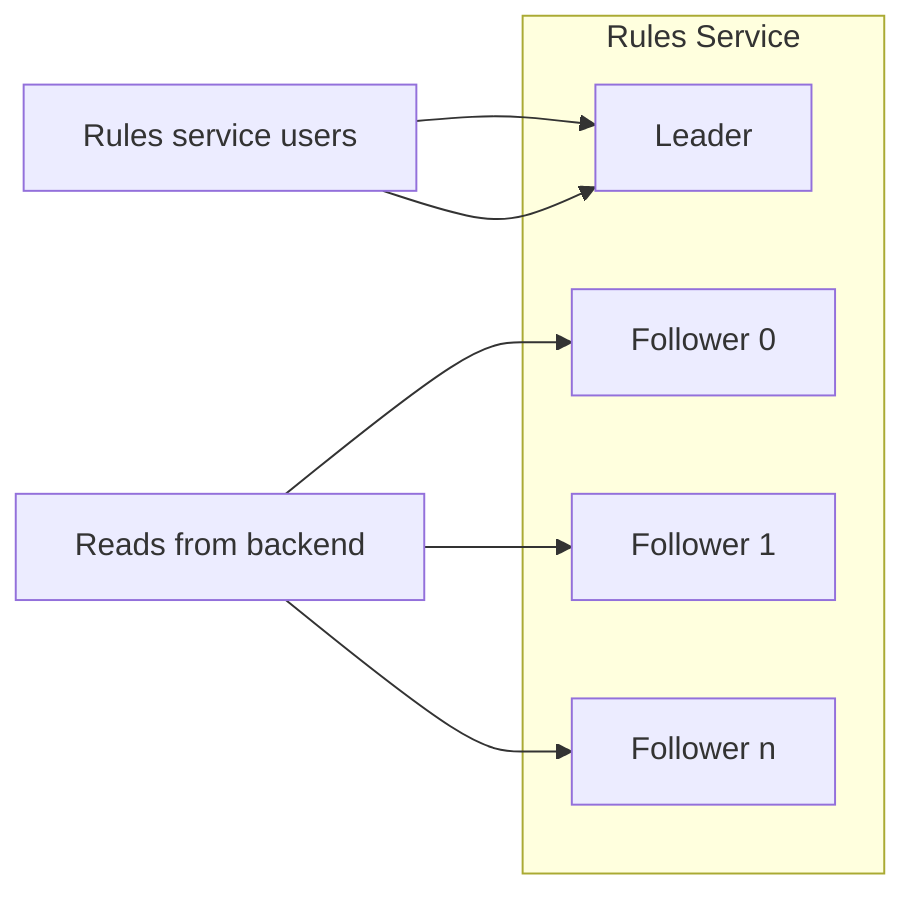

*图 8.3 Leader 主机应处理所有来自 Rules service users 的请求，以及所有写操作。来自 Backend 的读取可以分散到各个 follower 主机上。*

由于我们不期望规则经常变化，如图 8.4 所示，我们可以在 Rules service 上增加一个 Redis 缓存，以进一步提升读取性能。图 8.4 展示的是 cache-aside 缓存，但我们也可以使用第 3.8 节中的其他缓存策略。我们的 Backend service 也可以把规则缓存到 Redis 中。如前文 8.4.5 节所述，我们还可以缓存过量用户的 ID。一旦某个用户超过限流值，我们就把它的 ID 以及一个过期时间缓存下来，该时间之后用户就不再被限流。这样，Backend 就不必再去查询 Rules service 来拒绝用户请求。

如果我们使用 AWS（Amazon Web Services），可以考虑用 DynamoDB 代替 Redis 和 SQL。DynamoDB 每秒可以处理数百万请求（`https://aws.amazon.com/dynamodb/`），它既可以最终一致，也可以强一致（`https://docs.aws.amazon.com/whitepapers/latest/comparing-dynamodb-and-hbase-for-nosql/consistency-model.html`），但这会让我们面临供应商锁定。

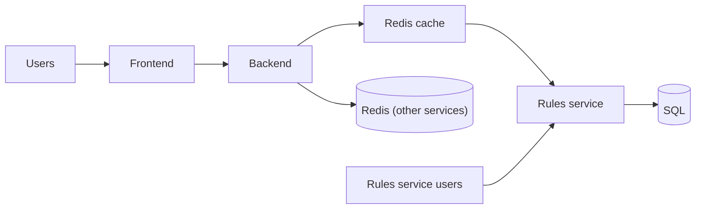

*图 8.4 在 Rules service 上带有 Redis 缓存的限流器。来自 Backend 的高频请求可以由这个缓存而不是 SQL 数据库来提供。*

Backend 满足我们所有的非功能需求。它可扩展、性能高、复杂度低、安全且隐私友好，并且是最终一致的。带有 leader-leader 复制的 SQL 数据库是高可用和高容错的，这已经超出了我们的需求。我们会在后文讨论准确性。对于 Rules service users 来说，这个设计并不具备可扩展性，不过如 8.4.1 节所述，这可以接受。

结合我们的需求，初始架构可能过度设计、过于复杂且成本高。这个设计在准确性和强一致性上都很高，而这并不是我们的非功能需求。我们能否用一些准确性和一致性来换取更低成本？先讨论限流器扩容的两种可能方法：

1. 主机不保存状态，而是从共享数据库获取数据，因此任意用户都可以由任意主机提供服务。这是本书大多数题目采用的无状态方案。
2. 主机为固定的一组用户提供服务，并保存这些用户的数据。这是下一节要讨论的有状态方案。

## 8.7 有状态方案 / 分片

图 8.5 展示了一个更接近我们非功能需求的有状态后端方案。当请求到达时，负载均衡器把它路由到对应的主机。每台主机把其客户端的计数存放在内存中。主机判断用户是否超过限流值，并返回 true 或 false。如果用户发起请求时其主机宕机，我们的服务会返回 `500`，且该请求不会被限流。

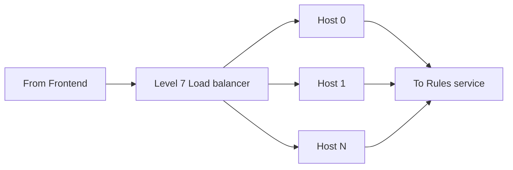

*图 8.5 采用有状态分片方案的限流器后端架构。计数存放在主机内存中，而不是像 Redis 这样的分布式缓存中。*

有状态方案需要七层负载均衡器。这看起来似乎与 8.1 节关于使用七层负载均衡器的讨论相矛盾，但注意这里我们讨论的是把它用于分布式限流方案，而不仅仅是用于粘性会话，从而让每台主机能够拒绝昂贵请求并执行自己的限流。

这种方案立刻会引出一个问题：我们是否需要在主机宕机时防止数据丢失？如果需要，就会引申到复制、故障切换、热分片和重平衡等话题。正如第 3.1 节简要讨论的那样，我们可以在复制中使用粘性会话。但在本章前面的需求分析里，我们已经讨论过：我们不需要一致性、高可用或容错。如果某台包含某些用户数据的主机宕机，我们可以直接把这些用户分配给另一台主机，并把受影响用户的请求速率计数从 0 重新开始。与之相关的重点将是检测主机故障、分配并预配替代主机，以及重新平衡流量。

`500` 错误应当触发自动化响应以预配新主机。新主机应当从配置服务读取它的地址列表。这个配置服务可以是存储在 AWS S3 之类分布式对象存储中的一个手动更新文件（为了高可用，这个文件必须存储在分布式存储上，而不能放在单台主机上），也可以是像 ZooKeeper 这样的复杂方案。当我们开发限流服务时，应该确保主机初始化过程不会超过几分钟。我们还应该监控主机初始化时长，并在其超过几分钟时触发低优先级告警。

我们应该监控热点分片，并定期在主机之间重新平衡流量。我们可以周期性运行一个批处理 ETL 作业，读取请求日志，识别接收大量请求的主机，确定合适的负载均衡配置，然后把这个配置写入配置服务。ETL 作业也可以把新配置推送给负载均衡服务。之所以写入配置服务，是为了防止某台负载均衡主机宕机；当主机恢复或新负载均衡主机被预配后，它可以从配置服务中读取配置。

图 8.6 展示了带有重平衡作业的后端架构。这个重平衡可以防止大量重度用户被分配到某台主机，从而把它压垮。由于我们的方案没有把失败主机的用户流量分散到其他主机的故障切换机制，因此不存在死亡螺旋的风险：某台主机因流量过大而失败，然后它的流量被重新分配到剩余主机上，进而增加这些主机的流量，最终又导致它们失败。

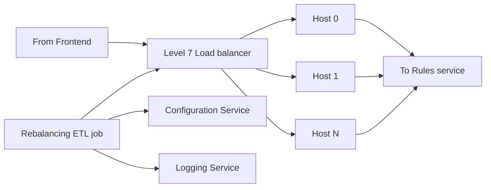

*图 8.6 带有重平衡 ETL 作业的后端架构*

这种方案的一个权衡是，它对 DoS/DDoS 攻击的韧性更差。如果某个用户的请求速率非常高，例如每秒数百个请求，它被分配到的主机就无法处理这些请求，而所有被分配到该主机的用户也都无法被限流。我们可以为这类情况设置告警，并且应当跨所有服务阻止来自该用户的请求。负载均衡器应丢弃来自该 IP 地址的请求——也就是说，不把请求发送给任何后端主机，也不返回任何响应，但要记录日志。

与无状态方案相比，有状态方案更复杂，具有更高的一致性和准确性，但有更低的：

- 成本
- 可用性
- 容错性

总的来说，这种方案像是一个简化版的分布式数据库。我们试图自己设计分布式存储，而它不会像广泛使用的分布式数据库那样成熟。它针对简单性和低成本进行了优化，但既没有强一致性，也没有高可用性。

## 8.8 将所有计数存储在每台主机中

8.6 节讨论的无状态后端设计使用 Redis 存储请求时间戳。Redis 是分布式的，具有可扩展性和高可用性，同时延迟低，也是一个准确的方案。然而，这个设计要求我们使用 Redis 数据库，而 Redis 通常由共享服务实现。我们能否避免依赖外部 Redis 服务，从而减少限流器对该服务故障或降级的暴露？

8.7 节讨论的有状态后端设计通过把状态保存在后端中，避免了这类查询，但它要求负载均衡器处理每一个请求以决定把请求发给哪台主机，而且还需要在热点分片之间重排流量。有没有可能把存储需求降到足以让所有用户请求时间戳都装进单台主机的内存？

### 8.8.1 高层架构

怎么降低存储需求？我们可以把 808GB 的存储需求降低为 `8.08 GB ≈ 8 GB`：为大约 100 个使用该服务的业务分别创建一个限流服务实例，并使用前端按业务把请求路由到相应实例。8GB 可以放进主机内存。由于请求速率很高，我们不能只用一台主机做限流。如果使用 128 台主机，那么每台主机只需要存 64MB。最终决定的主机数大概率介于 1 和 128 之间。

图 8.7 展示了这种方案的后端架构。当一台主机收到请求时，它会并行做两件事：

- 做出限流判断并返回结果。
- 异步地把自己的时间戳同步给其他主机。

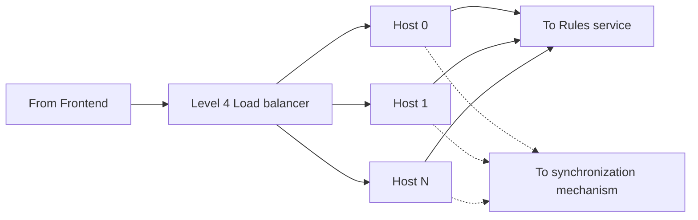

*图 8.7 这样一种限流服务的高层架构：所有用户请求时间戳都能装进单个后端主机，请求在各主机之间随机负载均衡，每台主机都能在不先请求其他服务或主机的情况下直接返回限流判断。主机通过单独的进程彼此同步时间戳。*

我们的四层负载均衡器会在主机之间随机均衡请求，因此同一个用户在不同的限流请求中可能会被导向不同主机。为了准确计算限流值，我们需要让各主机上的限流数据保持同步。同步主机的方法有多种，我们会在下一节详细讨论。这里先说明，我们会使用流式更新而不是批量更新，因为批量更新频率太低，会导致用户在远高于设定值的请求速率下仍被限流。

与前面讨论的两种设计（无状态后端设计和有状态后端设计）相比，这种设计牺牲了一致性和准确性，以换取更低延迟和更高性能（它可以处理更高的请求速率）。由于主机在做限流决策前可能还没有把所有时间戳都放进内存，所以它计算出的请求速率可能低于真实值。它还具有以下特点：

- 使用四层负载均衡器，把请求像无状态服务一样导向任意主机（经由前端）。
- 主机可以使用自己内存中的数据做限流判断。
- 数据同步可以通过一个独立进程完成。

如果主机宕机并丢失数据会怎样？某些本应被限流的用户将被允许发出更多请求，然后才被限流。正如前文所述，这可以接受。关于 leader 失效及其潜在问题，可参见 Martin Kleppmann 的《Designing Data-Intensive Systems》157–158 页。表 8.2 总结了我们讨论过的三种方法。

| 方案 | 存储 | 路由 | 可扩展性 | 存储开销 | 一致性与准确性 | 可用性与容错性 | 依赖性 |
| --- | --- | --- | --- | --- | --- | --- | --- |
| 无状态后端设计 | 把计数存放在分布式数据库中。 | 无状态，因此用户可以被路由到任意主机。 | 可扩展。我们依赖分布式数据库来承载高读高写流量。 | 存储效率高。可以为分布式数据库配置所需的复制因子。 | 最终一致。主机在做限流判断时可能先于同步完成，因此判断可能略有偏差。 | 后端是无状态的，因此使用分布式数据库的高可用和高容错能力。 | 依赖外部数据库服务。此类服务宕机可能影响我们的服务，而且修复这类故障通常不在我们的控制范围内。 |
| 有状态后端设计 | 把每个用户的计数存放在后端主机中。 | 需要七层负载均衡器把每个用户路由到其分配的主机。 | 可扩展。负载均衡器是一个昂贵且可垂直扩展的组件，能够处理高请求速率。 | 默认情况下没有备份，因此存储开销最低。我们可以设计一个集群内或集群外的存储服务，如第 13.5 节所述。没有备份时，它是最便宜的方案。 | 最准确、最一致，因为用户总是访问同一组主机。 | 没有备份时，任何主机故障都会导致其保存的所有用户计数丢失。这是三种设计里可用性和容错性最低的。 | 不依赖外部数据库服务。但负载均衡器需要处理每个请求来决定发到哪台主机，这也需要在热分片之间重排流量。 |
| 每台主机都存储所有计数 | 每台主机都保存每个用户的计数。 | 每台主机都拥有所有用户的计数，因此用户可以被路由到任意主机。 | 不可扩展，因为每台主机都必须存储所有用户的计数。需要把用户拆分到不同的服务实例中，并要求另一个组件（例如前端）把用户路由到对应实例。 | 成本最高。存储开销很大，而且主机之间需要进行 n–n 通信来同步计数，网络流量也很高。 | 最不准确、最不一致，因为在所有主机之间同步计数需要时间。 | 主机可以互换，因此这是三种设计里可用性和容错性最高的。 | 不依赖外部数据库服务。避免了下游服务宕机带来的风险，也更容易实现，尤其是在大型组织中，预配或修改数据库服务往往要经历很多流程。 |

### 8.8.2 同步计数

主机之间如何同步用户请求计数？本节我们讨论几种可能的算法。除了 all-to-all 之外，其余算法对我们的限流器都可行。

同步机制应该是 pull 还是 push？我们可以选择 push，以在一致性和准确性上做一些牺牲，换取更高性能、更低资源消耗和更低复杂度。如果某台主机宕机，我们可以直接忽略它的计数，允许用户在被限流前发出更多请求。基于这些考虑，我们可以决定让主机使用 UDP 而不是 TCP 异步共享时间戳。

我们应当考虑，主机必须能承受两类主要请求流量：

1. 做限流判断的请求。这类请求受负载均衡器以及必要时更大规模集群的限制。
2. 更新主机内存中时间戳的请求。我们的同步机制必须确保主机不会收到过高的请求速率，尤其是在集群主机数量增加时。

#### all-to-all

all-to-all 指的是一个节点组里的每个节点都向其他每个节点发送消息。它比广播更一般，广播是指向多个接收者同时传递消息。回顾图 3.3（在图 8.8 中重复），all-to-all 要求全互联拓扑，即网络中的每个节点都与其他每个节点相连。all-to-all 的规模随节点数呈平方增长，因此不可扩展。如果我们用 128 台主机做 all-to-all 通信，那么每次 all-to-all 通信都需要 `128 * 128 * 64 MB`，这会大于 1TB，根本不可行。

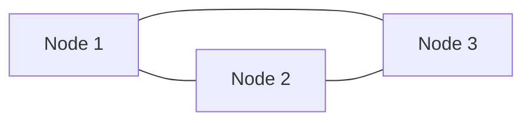

*图 8.8 全互联拓扑。网络中的每个节点都与其他每个节点相连。在我们的限流器中，每个节点都会接收用户请求、计算请求速率，并批准或拒绝请求。*

#### Gossip 协议

在 gossip 协议中，回顾图 3.6（在图 8.9 中重复），节点会周期性地随机选择其他节点并向其发送消息。Yahoo 的分布式限流器就使用 gossip 协议同步主机（`https://yahooeng.tumblr.com/post/111288877956/cloud-bouncer-distributed-rate-limiting-at-yahoo`）。这种方案在一致性和准确性上做出一些牺牲，以换取更高性能和更低资源消耗，但它也更复杂。

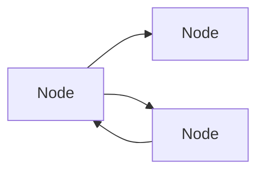

*图 8.9 Gossip 协议。每个节点会周期性地随机选择其他节点并向其发送消息。*

在本节中，all-to-all 和 gossip 协议都要求所有节点直接彼此发送消息。这意味着所有节点都必须知道其他节点的 IP 地址。由于节点会持续加入和移出集群，每个节点都需要向配置服务（例如 ZooKeeper）请求其他节点的 IP 地址。

在其他同步机制中，主机会通过某个特定主机或服务彼此通信。

#### 外部存储 / 协调服务

回顾图 8.10（与图 3.4 几乎相同），这两种方式使用外部组件来让主机彼此通信。

主机可以通过一个 leader 主机彼此通信。这个 leader 由集群的配置服务（例如 ZooKeeper）选出。每台主机只需要知道 leader 主机的 IP 地址，而 leader 主机则需要周期性更新自己的主机列表。

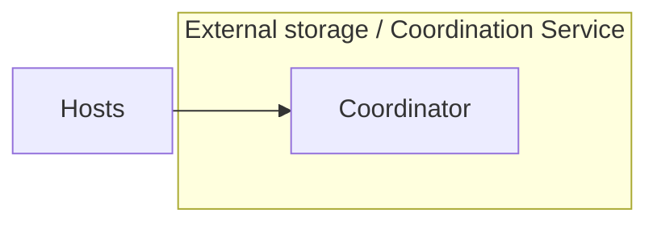

*图 8.10 主机可以通过外部组件通信，例如外部存储服务或协调服务。*

#### 随机 leader 选举

我们也可以使用一个简单的算法来选举 leader，以牺牲更高的资源消耗换取更低的复杂度。回顾图 3.7（在图 8.11 中重复），这可能导致选出多个 leader。只要每个 leader 都与所有其他主机通信，每台主机就能拿到所有请求时间戳。不过这会产生不必要的消息开销。

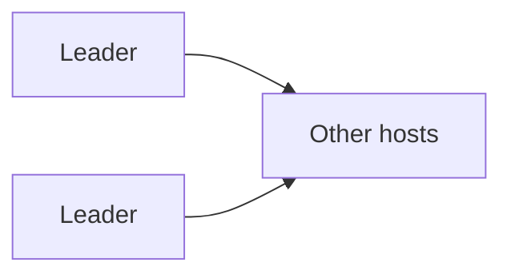

*图 8.11 随机 leader 选举可能会选出多个 leader。这会带来额外的消息开销，但不会造成其他问题。*

## 8.9 限流算法

到目前为止，我们一直假设用户的请求速率由其请求时间戳决定，但我们还没有讨论如何计算这个请求速率。此时的核心问题之一，是我们的分布式限流服务如何确定请求者当前的请求速率。常见的限流算法包括：

- 令牌桶
- 漏桶
- 固定窗口计数器
- 滑动窗口日志
- 滑动窗口计数器

在继续之前，我们说明一点：某些系统设计面试题看起来会涉及专门知识和经验，而这可能是大多数候选人此前没有接触过的。面试官未必期望我们熟悉限流算法。这是他们考察候选人沟通能力和学习能力的机会。面试官可能会向我们描述一种限流算法，并考察我们是否能与他们合作，围绕它设计出满足需求的方案。

面试官甚至可能做出一些过度概括或错误陈述，而我们则需要展示自己能否批判性地评估它们，并以得体、坚定、清晰且简洁的方式提出有见地的问题和技术观点。

我们可以考虑在服务中实现不止一种限流算法，并允许该服务的每个用户选择最适合自己需求的算法。在这种方案中，用户选择所需算法，并在 Rules service 中设置相应配置。

为了便于讨论，本节中的各个限流算法都假设限流值是 10 秒内 10 次请求。

### 8.9.1 令牌桶

回顾图 8.12，令牌桶算法基于一个装满令牌的桶的类比。一个桶有三个特征：

- 最大令牌数
- 当前可用令牌数
- 令牌补充速率

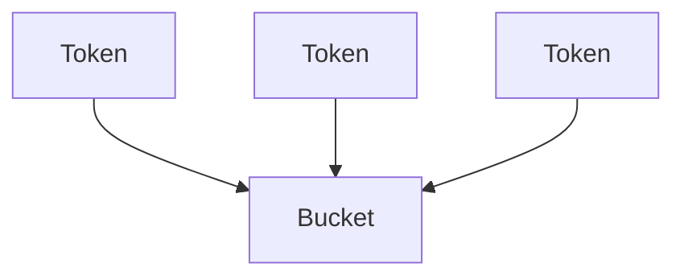

*图 8.12 每秒补充一次的令牌桶*

每当请求到达时，我们从桶中移除一个令牌。如果没有令牌，请求就会被拒绝或限流。桶以固定速率补充。

在这个算法的一个直接实现中，每个用户请求会触发以下过程。主机可以用哈希表存储键值对。如果主机中没有该用户 ID 的键，系统就初始化一条记录，用户 ID 对应 9 个令牌（10-1）。如果主机中有该用户 ID 的键，并且其值大于 0，系统就把它减 1。如果值为 0，则返回 true，也就是该用户应被限流。如果返回 false，则用户不应被限流。系统还需要在每秒钟把所有小于 10 的值都加 1。

令牌桶的优点是易于理解和实现，而且内存效率高（每个用户只需要一个整数变量来计数令牌）。这个实现的一个明显问题是，每台主机都需要对哈希表中的每个键做加 1。若哈希表在主机内存中，这样做是可行的。如果存储在主机外部，比如 Redis 数据库中，Redis 提供了 `MSET`（`https://redis.io/commands/mset/`）命令来批量更新多个键，但单次 `MSET` 操作可更新的键数可能会有限制（`https://stackoverflow.com/questions/49361876/mset-over-400-000-map-entries-in-redis`）。不过，Stack Overflow 不是学术可信来源，而且 Redis 官方文档并未说明 `MSET` 请求中的键数上限。然而，在设计系统时，我们必须始终提出合理问题，不能连官方文档都完全相信。此外，如果每个键是 64 位，那么更新 1,000 万个键的请求大小会达到 `8.08 GB`，太大了。

如果我们需要把更新命令拆成多个请求，那么每个请求都会带来资源开销和网络延迟。

此外，系统没有删除键的机制（即删除那些近期未请求过的用户），因此系统不知道何时删除用户以降低令牌补充请求速率，或者释放 Redis 中的空间给近期有请求的其他用户。我们的系统需要另一个存储机制来记录用户请求的最后时间戳，以及一个删除旧键的进程。

在第 8.8 节那样的分布式实现中，每台主机都可以有自己的令牌桶，并用这个桶做限流判断。主机可以使用第 8.8.2 节讨论过的技术来同步这些桶。如果主机在与其他主机同步之前就用自己的桶做出限流判断，用户可能会以高于设定限速的速率发起请求。例如，如果两台主机几乎同时收到请求，它们各自都会减去一个令牌并剩下 9 个令牌，然后再与其他主机同步。虽然实际上有两次请求，但所有主机同步后都会变成 9 个令牌。

Cloud Bouncer（`https://yahooeng.tumblr.com/post/111288877956/cloud-bouncer-distributed-rate-limiting-at-yahoo`）是 Yahoo 在 2014 年开发的一个分布式限流库示例，它基于令牌桶。

### 8.9.2 漏桶

漏桶有最大令牌数，以固定速率泄漏，并在空时停止泄漏。每当请求到达时，我们向桶里加一个令牌。如果桶满了，请求就会被拒绝或限流。

回顾图 8.13，漏桶的一种常见实现是使用固定大小的 FIFO 队列。队列会按周期出队。当请求到达时，如果队列还有容量，就把一个令牌入队。由于队列大小固定，这种实现比令牌桶的内存效率更差。

*图 8.13 每秒出队一次的漏桶*

这个算法有一些与令牌桶相同的问题：

- 每秒钟，主机都需要对每个 key 下的每个队列执行出队。
- 我们需要一个单独机制来删除旧键。
- 队列不能超过容量，因此在分布式实现中，可能会有多台主机在同步之前同时把各自的桶/队列填满。这意味着用户已经超出了限流值。

另一种设计是把时间戳而不是令牌入队。当请求到达时，我们先出队时间戳，直到队列中剩余的时间戳都早于保留时间，然后如果队列还有空间，就把当前请求的时间戳入队。如果入队成功则返回 false，否则返回 true。这样就不需要每秒对每个队列都执行出队。

> [!question]
> 你能发现任何潜在的一致性问题吗？

敏锐的读者会立刻发现两种会给限流判断带来不准确性的潜在一致性问题：

1. 当主机把键值对写入 leader 主机后，另一个主机可能立即覆盖它，导致竞争条件。
2. 各主机时钟不同步，主机可能使用其他主机写入的、带有轻微时钟偏差的时间戳做限流判断。

这种轻微的不准确性是可以接受的。这两个问题也适用于本节讨论的所有基于时间戳的分布式限流算法，即固定窗口计数器和滑动窗口日志，不过我们不会再重复说明。

### 8.9.3 固定窗口计数器

固定窗口计数器通过键值对实现。键可以是客户端 ID 和时间戳的组合（例如 `user0_1628825241`），值则是请求计数。当客户端发起请求时，如果键存在就自增，否则创建该键。若计数在设定限流值内，请求被接受；若计数超过限流值，请求被拒绝。

窗口区间是固定的。例如，一个窗口可以是每分钟的 `[0, 60)` 秒。窗口结束后，所有键都过期。例如，键 `user0_1628825241` 在 GMT 时间 3:27:00 到 3:27:59 之间有效，因为 `1628825241` 对应的时间是 GMT 3:27:21，落在 3:27 这一分钟内。

> [!question]
> 请求速率最多可以超过设定限流值多少？

固定窗口计数器的一个缺点是，它允许请求速率最高达到设定限流值的两倍。例如，回顾图 8.13，如果限流值是每分钟 5 次请求，那么客户端可以在 `[8:00:00 AM, 8:01:00 AM)` 内发出最多 5 次请求，又可以在 `[8:01:00 AM, 8:01:30 AM)` 内再发出 5 次请求。客户端实际上在 1 分钟内发出了 10 次请求，是每分钟 5 次这一设定值的两倍（见图 8.14）。

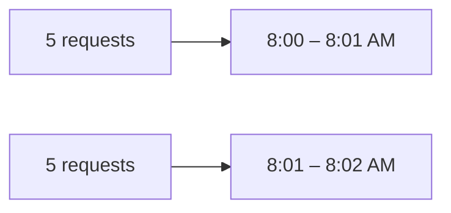

*图 8.14 用户在 `[8:00:30 AM, 8:01:30 AM)` 内发了 5 次请求，又在 `[8:01:00 AM, 8:01:30 AM)` 内再发了 5 次。虽然它在固定窗口内并未超限，但实际上在 1 分钟内发出了 10 次请求。*

应用到我们的限流器时，每当主机收到用户请求，它会用哈希表执行以下步骤。图 8.15 是这些步骤的时序图：

1. 确定要查询的键。例如，如果限流窗口是 10 秒，且 `user0` 在 `1628825250` 时请求，那么对应键就是 `["user0_1628825241", "user0_1628825242", ..., "user0_1628825250"]`。
2. 请求这些键。如果我们把键值对存储在 Redis 而不是主机内存中，可以使用 `MGET`（`https://redis.io/commands/mget/`）一次返回所有指定键的值。虽然 `MGET` 命令的复杂度是 `O(N)`（`N` 为要取回的键数），但单次请求总比多次请求带来的网络延迟和资源开销更低。
3. 如果没有找到键，就创建一个新的键值对，例如 `(user0_1628825250, 1)`。如果找到一个键，就把它的值加 1。如果找到多个键（由于竞争条件），则把返回的所有键的值相加，再加 1。这就是过去 10 秒内的请求数。
4. 并行执行：
   - 把新的或更新后的键值对写入 leader 主机（或 Redis 数据库）。如果存在多个键，就删除除最旧键以外的所有键。
   - 如果计数大于 10，则返回 true；否则返回 false。

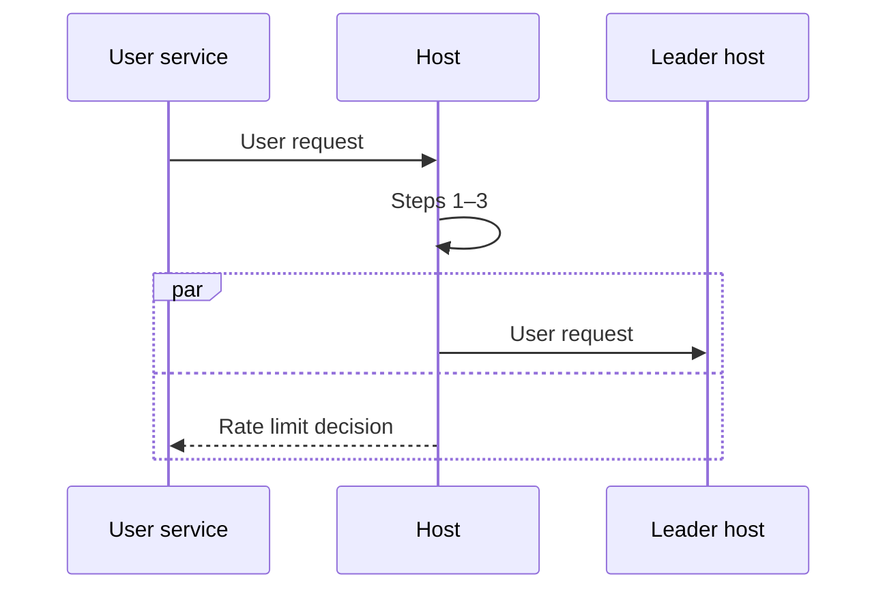

*图 8.15 我们的固定窗口计数器方案的时序图。该图展示了使用主机内存存储请求时间戳，而不是 Redis。限流判断会立即在主机上完成，只使用主机内存中的数据。之后在 leader 主机上进行同步的步骤未画出。*

> [!question]
> 竞争条件会如何导致第 5 步中找到多个键？

Redis 键可以设置过期时间（`https://redis.io/commands/expire/`），因此我们应该让这些键在 10 秒后过期。否则，我们需要一个单独进程持续查找并删除过期键。如果需要这个进程，那么固定窗口计数器的一个优势是：键删除进程与主机解耦。这个独立删除进程可以单独扩展，也可以独立开发，因此更容易测试和调试。

### 8.9.4 滑动窗口日志

滑动窗口日志通过“每个客户端一个键值对”来实现。键是客户端 ID，值是一个有序时间戳列表。滑动窗口日志会为每一次请求存储一个时间戳。

图 8.16 是滑动窗口日志的一个简单示意。当新请求到来时，我们先追加它的时间戳，并检查第一个时间戳是否过期。如果过期，就执行二分查找找到最后一个过期时间戳，然后删除它之前的所有时间戳。这里使用列表而不是队列，是因为队列不支持二分查找。如果列表中的时间戳超过 10 个，就返回 true，否则返回 false。

*图 8.16 滑动窗口日志的简单示意。当新请求到达时会追加一个时间戳。接着使用二分查找找出最后一个过期时间戳，然后移除所有过期时间戳。如果列表大小没有超过限制，请求就允许通过。*

滑动窗口日志是准确的（除分布式实现中受 8.9.2 节最后一段讨论因素影响之外），但为每次请求存储一个时间戳会比令牌桶消耗更多内存。

滑动窗口日志算法会在超过限流值之后继续计数，因此它也允许我们测量用户的请求速率。

### 8.9.5 滑动窗口计数器

滑动窗口计数器是固定窗口计数器和滑动窗口日志的进一步发展。它使用多个固定窗口区间，每个区间长度是限流时间窗口的 1/60。

例如，如果限流区间是一小时，那么我们使用 60 个一分钟窗口，而不是 1 个一小时窗口。当前速率通过把最近 60 个窗口相加来确定。它可能会略微少计请求。例如，在 `11:00:35` 统计时，会把从 `[10:01:00, 10:01:59]` 到 `[11:00:00, 11:00:59]` 的 60 个一分钟窗口相加，而忽略 `[10:00:00, 10:00:59]` 窗口。尽管如此，这种方式仍然比固定窗口计数器更准确。

## 8.10 使用 sidecar 模式

这就引出了把 sidecar 模式应用到限流策略上的讨论。图 1.8 展示了使用 sidecar 模式的限流服务架构。和第 1.4.6 节讨论的一样，管理员可以在控制平面中配置某个用户服务的限流策略，由控制平面把这些策略分发到 sidecar 主机。

在这种把用户服务的限流策略放入 sidecar 主机的设计里，用户服务主机就不需要向我们的限流服务发请求来查找自己的限流策略，从而节省了这些请求的网络开销。

## 8.11 日志、监控与告警

除了第 2.5 节讨论的日志、监控和告警实践之外，我们还应为以下内容配置监控和告警。我们可以在共享监控服务中针对共享日志服务里的日志配置监控任务，并让这些任务触发共享告警服务，从而提醒开发者注意这些问题：

- 可能的恶意活动迹象，例如某些用户即使被影子封禁后仍然持续高频请求。
- 可能的 DDoS 攻击迹象，例如在短时间内有异常数量的用户被限流。

## 8.12 在客户端库中提供功能

用户服务是否需要为每个请求都查询限流器服务？另一种做法是：用户服务先聚合用户请求，然后在某些情况下再去查询限流器服务，例如当它：

- 累积了一批用户请求
- 发现请求速率突然上升

进一步说，限流能不能实现为一个库而不是一个服务？第 6.7 节对库与服务做了总体讨论。如果我们完全把它实现成库，就需要采用第 8.7 节那种方案：一台主机可以把所有用户请求都放在内存中，并彼此同步这些请求。主机之间必须能够通信以同步用户请求时间戳，因此，使用我们这个库的服务开发者必须配置像 ZooKeeper 这样的配置服务。这对大多数开发者来说可能过于复杂且容易出错。作为替代，我们可以提供一个库：它通过在客户端做一些处理来提升限流服务的性能，从而减少发往服务端的请求量。

这种把处理分摊到客户端和服务端的模式可以推广到任何系统，但它通常会导致客户端与服务端紧耦合，而这一般是反模式。服务端应用的开发必须长期兼容旧版本客户端。因此，客户端 SDK（software development kit）通常只是 REST 或 RPC 端点之上的一层，而不会做任何数据处理。如果我们希望在客户端做数据处理，那么至少应满足以下条件之一：

- 处理应当足够简单，以便未来版本的服务端仍然容易继续支持这个客户端库。
- 处理本身资源消耗高，因此把这类处理放到客户端的维护成本，相比服务成本的大幅降低，是值得的权衡。
- 应当有明确的支持生命周期，清楚告知用户客户端何时不再受支持。

关于向限流器批量发送请求，我们可以通过实验批大小来确定准确性与网络流量之间的最佳平衡。

如果客户端自己也测量请求速率，并且只在请求速率超过某个阈值时才使用限流服务，会怎样？问题在于客户端之间不会相互通信，因此客户端只能测量它安装所在那台主机上的请求速率，而无法测量特定用户的请求速率。这意味着限流的触发是基于所有用户的总体请求速率，而不是针对特定用户。用户可能已经习惯了某个限流值，如果突然在某个请求速率下被限流，而之前并没有，他们可能会抱怨。

另一种方法是：客户端使用异常检测发现请求速率的突然增长，然后再开始向服务器发送限流请求。

## Summary

- 限流可以防止服务故障和不必要的成本。
- 增加更多主机或使用负载均衡器做限流等替代方案都不可行。增加主机以应对流量峰值可能太慢，而仅为了限流使用七层负载均衡器可能会引入过多成本和复杂度。
- 如果限流会导致糟糕的用户体验，或者用于订阅这类复杂场景，就不要使用限流。
- 限流器的非功能需求是可扩展性、性能和低复杂度。为了优化这些需求，我们可以在可用性、容错性、准确性和一致性上做权衡。
- 限流服务的主要输入是用户 ID 和服务 ID，它们会依据管理员定义的规则处理，并返回限流的“是”或“否”。
- 有多种限流算法，每种都有各自的权衡。令牌桶易于理解和实现，且内存效率高，但同步与清理较棘手。漏桶易于理解和实现，但略有不准确。固定窗口日志易于测试和调试，但不准确且实现更复杂。滑动窗口日志很准确，但需要更多内存。滑动窗口计数器比滑动窗口日志占用更少内存，但准确性也更低。
- 我们可以为限流服务考虑 sidecar 模式。

## 8.13 进一步阅读

- Smarshchok, Mikhail, 2019. System Design Interview YouTube 频道，`https://youtu.be/FU4WlwfS3G0`。
- 固定窗口计数器、滑动窗口日志和滑动窗口计数器的讨论改编自 `https://www.figma.com/blog/an-alternative-approach-to-rate-limiting/`。
- Madden, Neil, 2020. *API Security in Action*. Manning Publications.
- Posta, Christian E. 和 Maloku, Rinor, 2022. *Istio in Action*. Manning Publications.
- Bruce, Morgan 和 Pereira, Paulo A., 2018. *Microservices in Action*，第 3.5 章。Manning Publications。
