# 09 第 9 章：设计通知/告警服务（Design a Notification/Alerting Service）

本章包括：

- 限定功能范围并讨论一个服务
- 设计一个委托给平台特定通道的服务
- 设计一个支持灵活配置与模板的系统
- 处理服务的其他典型问题

我们编写源代码中的函数和类，是为了避免代码、调试和测试上的重复，提升可维护性，并便于复用。同样地，我们也会将多个服务共用的通用能力进行泛化，也就是把横切关注点集中起来。

发送用户通知是常见的系统需求。在任何系统设计讨论中，只要谈到发送通知，我们都应该建议组织使用一个统一的通知服务。

## 9.1 功能需求

我们的通知服务应尽可能简单，同时又能满足广泛用户的需求，这会使功能需求相当复杂。通知服务可以提供很多可能的功能。考虑到时间有限，我们应该清楚定义一些用例和功能，使其足以服务预期的广泛用户群。清晰的功能范围还能帮助我们识别并优化非功能需求。在设计完初始系统后，我们可以继续讨论并设计更多可能的功能。

这个问题也很适合作为设计 MVP 的练习。我们可以预见未来的功能，并把系统设计成由松耦合组件组成，以便适应新增功能和服务，并随着用户反馈与业务需求变化而演进。

### 9.1.1 不用于在线可用性监控

我们的通知服务很可能位于各种消息服务之上（例如电子邮件、SMS 等）。负责发送这类消息的服务（例如邮件服务）本身就是复杂服务。在本题中，我们会使用共享消息服务，但不会设计它们。我们将设计一个让用户通过多种通道发送消息的服务。

将这种做法推广到共享消息服务之外，我们也会使用其他共享服务来实现存储、事件流和日志等功能。我们还会使用组织开发其他服务时所共用的同一套基础设施（裸机或云基础设施）。

> [!QUESTION]
> 在线可用性监控能否使用与它所监控的其他服务相同的共享基础设施或共享服务？

基于这种方法，我们假设该服务不应被用于在线可用性监控（也就是在其他服务宕机时触发告警）。否则，它就不能建立在与组织内其他服务相同的基础设施或共享服务之上，因为影响它们的故障也会影响这个服务，导致无法触发宕机告警。在线可用性监控服务必须运行在与被监控服务相互独立的基础设施上。这也是 PagerDuty 等外部在线可用性监控服务如此流行的一个重要原因。

不过，第 9.14 节会讨论一种将该服务用于在线可用性监控的可能方案。

### 9.1.2 用户与数据

我们的通知服务有三类用户：

- 发送者：创建、读取、更新和删除通知，并将其发送给接收者的人或服务。
- 接收者：接收通知的应用用户。我们也会把设备或应用本身称为接收者。
- 管理员：拥有通知服务管理权限的人。管理员可以授予其他用户发送或接收通知的权限，也可以创建和管理通知模板（见 9.5 节）。我们假设作为通知服务开发者的我们拥有管理员权限，不过在实际生产环境中，只有部分开发者可能有管理员权限。

我们既有手动发送者，也有程序化发送者。程序化用户可以发送 API 请求，尤其是发送通知。手动用户可能会通过 Web UI 完成所有用例，包括发送通知，以及配置通知、查看已发送和待发送通知等管理功能。

我们可以将单条通知大小限制为 1 MB，这足以容纳数千字符和一张缩略图。用户不应在通知中发送视频或音频，而应在通知中包含指向媒体内容或其他大文件的链接；接收方系统应具备独立于通知服务开发的功能来下载和查看这些内容。黑客可能会试图冒充服务并发送包含恶意网站链接的通知。为防止这种情况，通知应包含数字签名。接收方可以使用证书颁发机构验证该签名。更多信息请参阅密码学相关资料。

### 9.1.3 接收通道

我们应该支持通过多种通道发送通知，包括以下内容。我们的通知服务需要与为这些通道发送消息的服务集成：

- 浏览器
- Email
- SMS。为简单起见，我们不考虑 MMS。
- 自动电话呼叫
- Android、iOS 或浏览器上的推送通知
- 应用内的定制通知，例如银行或金融应用中那些对隐私与安全要求严格、使用内部消息与通知系统的场景

### 9.1.4 模板

某种消息系统会提供一个默认模板，以及一组用户在发送消息前要填写的字段。例如，Email 有发件人邮箱地址字段、收件人邮箱地址字段、主题字段、正文字段和附件列表；SMS 有发件人电话号码字段、收件人电话号码字段和正文字段。

同一条通知可能会发送给许多接收者。例如，应用可能会向刚注册的新用户发送一封 Email 或一条推送通知，内容包含欢迎信息。该消息对所有用户都可以完全相同，例如：“欢迎来到 Beigel。请享受首次购买 20% 的折扣。”

消息也可能包含个性化参数，例如用户姓名和折扣百分比；例如：“欢迎 ${first_name}。请享受首次购买 ${discount}% 的折扣。” 另一个例子是，在线市场应用可能希望在客户刚提交订单后发送一封订单确认 Email、短信或推送通知。消息中可能包含客户姓名、订单确认码、商品列表（单个商品也可能包含多个参数）以及价格。消息中的参数可能很多。

我们的通知服务可以提供一个用于创建、读取、更新和删除模板的 API。每次用户想发送通知时，要么自己创建完整消息，要么选择某个模板并填充该模板的值。

模板功能还能减少发往通知服务的流量，这一点后文会讨论。

我们可以提供很多用于创建和管理模板的功能，而这本身就可以成为一项服务（模板服务）。这里我们只讨论最初的 CRUD 模板。

### 9.1.5 触发条件

通知可以手动触发，也可以程序化触发。我们可以提供一个浏览器应用，供用户创建通知、添加接收者，然后立即发送。通知也可以程序化发送，并且既可以在浏览器应用中配置，也可以通过 API 配置。程序化通知可配置为按计划触发，或者由 API 请求触发。

### 9.1.6 管理订阅者、发送者组和接收者组

如果用户希望将通知发送给多个接收者，我们可能需要提供管理接收者组的功能。用户可以直接使用接收者组来发送通知，而不必每次都提供一份接收者列表。

> [!WARNING]
> 接收者组包含 PII（Personally-Identifiable Information，个人身份信息），因此受 GDPR 和 CCPA 等隐私法规约束。

用户应能够对接收者组进行 CRUD。我们也可以考虑基于角色的访问控制（RBAC）。例如，一个组可以有读写角色。用户需要该组的读角色才能查看其成员和其他细节，需要写角色才能添加或移除成员。组的 RBAC 不在本章讨论范围内。

接收者应能够选择订阅通知，也应能够退出不想接收的通知；否则，它们就只是垃圾信息了。本章会跳过这部分讨论，后续主题中可能会再谈。

### 9.1.7 用户功能

我们还可以提供以下功能：

- 服务应识别发送者发来的重复通知请求，并且不要向接收者发送重复通知。
- 我们应允许用户查看自己过去的通知请求。一个重要场景是，用户需要检查自己是否已经发起过某条通知请求，从而避免重复请求。尽管通知服务也可以自动识别并处理重复请求，但我们不会完全信任这个实现，因为用户对“重复”的定义可能与通知服务不同。
- 用户会存储很多通知配置和模板。系统应支持按名称、描述等各种字段查找配置或模板。用户也可以保存收藏通知。
- 用户应能够查看通知状态。通知可能处于计划中、进行中（类似发件箱中的邮件）或失败状态。如果通知发送失败，用户应能看到是否安排了重试，以及已经重试了多少次。
- （可选）用户设置的优先级。我们可以先处理高优先级通知，再处理低优先级通知，或者使用加权方式避免饥饿。

### 9.1.8 分析

我们可以假设分析不在本题范围内，不过在设计通知服务时也可以顺带讨论。

## 9.2 非功能需求

我们可以讨论以下非功能需求：

- 可扩展性：我们的通知服务应能每天发送数十亿条通知。若每条通知 1 MB，那么服务每天将处理和发送 PB 级数据。可能会有成千上万的发送者和十亿级接收者。
- 性能：通知应在数秒内送达。为了提升关键通知的投递速度，我们可以考虑允许用户把某些通知优先于其他通知。
- 高可用：五个 9。
- 容错：如果接收者当前无法接收通知，它应在下一个可用机会收到该通知。
- 安全：只有授权用户才应能够发送通知。
- 隐私：接收者应能够选择退出通知。

## 9.3 初始高层架构

我们可以按以下思路设计系统：

- 发起通知创建请求的用户通过一个单一服务和单一接口完成。用户通过这个单一服务/接口指定所需通道和其他参数。
- 但是，每个通道可以由一个独立服务处理。每个通道服务提供与其通道相关的逻辑。例如，浏览器通知通道服务可以使用 Web Notification API 创建浏览器通知。可参考 “Using the Notifications API”（https://developer.mozilla.org/en-US/docs/Web/API/Notifications_API/Using_the_Notifications_API） 和 “Notification”（https://developer.mozilla.org/en-US/docs/Web/API/notification）。某些浏览器（如 Chrome）也提供自己的通知 API。关于带图片和进度条等富元素的富通知，可参考 “chrome.notifications”（https://developer.chrome.com/docs/extensions/reference/notifications/） 和 “Rich Notifications API”（https://developer.chrome.com/docs/extensions/mv3/richNotifications/）。
- 我们可以把通道服务中的通用逻辑集中到另一个服务中，我们称之为“job constructor”。
- 各种通道的通知可能由外部第三方服务处理，如图 9.1 所示。Android 推送通知通过 Firebase Cloud Messaging（FCM）发送。iOS 推送通知通过 Apple Push Notification Service 发送。我们也可能为 Email、SMS/短信和电话呼叫使用第三方服务。向第三方服务发请求意味着我们必须限制请求速率并处理请求失败。

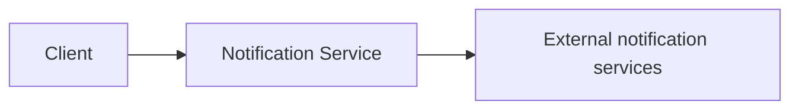

*图 9.1 我们的通知服务可能会向外部通知服务发起请求，因此前者必须限制请求速率并处理失败请求。*

- 完全通过同步机制发送通知并不可扩展，因为请求和响应在网络中传输时会占用线程。为了支持成千上万的发送者和数十亿的接收者，我们应使用事件流等异步技术。

基于这些考虑，图 9.2 和图 9.3 展示了我们的初始高层架构。要发送通知时，客户端会向我们的通知服务发起请求。请求先经过前端服务或 API 网关，再发送到后端服务。后端服务包含 producer 集群、notification Kafka topic 和 consumer 集群。producer 主机只需向 notification Kafka topic 生成一条消息，然后返回 200 成功。consumer 集群消费这些消息，生成通知事件，并把它们发送到相关的通道队列中。每个通知事件对应单个接收者/目的地。这种异步、事件驱动的方式，使通知服务能够处理不可预测的流量高峰。

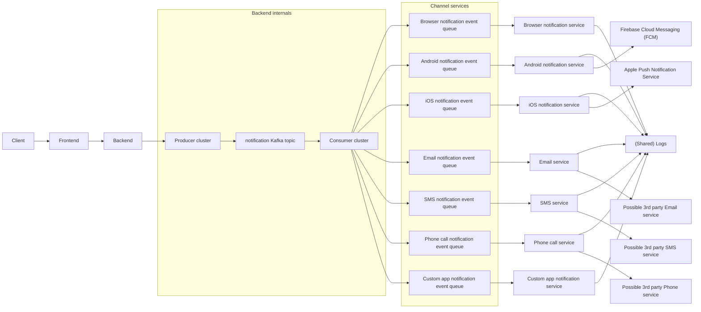

*图 9.2 通知服务的高层架构，展示了客户端/用户发送通知时可能发生的所有请求。我们把各种 Kafka consumer（每个 consumer 都是某个特定通道的通知服务）统称为通道服务。图中展示后端和通道服务使用共享日志数据库，但通知服务的所有组件都应写入共享日志服务。*

在队列的另一侧，我们为每个通知通道都有一个独立服务。其中一些服务可能依赖外部服务，例如 Android 的 Firebase Cloud Messaging（FCM）和 iOS 的 Apple Push Notification Service（APNs）。浏览器通知服务还可以进一步按浏览器类型拆分（例如 Firefox 和 Chrome）。

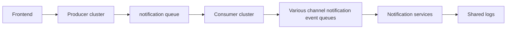

*图 9.3 图 9.2 中后端服务的放大图。后端服务由 producer 集群、notification Kafka topic 和 consumer 集群组成。后续插图中，我们会省略后端服务的放大图。*

每个通知通道都必须实现为独立服务（我们可以称之为通道服务），因为在某一通道发送通知需要特定的服务器应用，而且每个通道都有不同的能力、配置和协议。Email 通知使用 SMTP。要通过 Email 通知系统发送一封邮件时，用户需要提供发件人邮箱地址、收件人邮箱地址、标题、正文和附件。还有其他 Email 类型，比如日历事件。SMS 网关会使用多种协议，包括 HTTP、SMTP 和 SMPP。要发送一条 SMS 消息时，用户需要提供源号码、目标号码和文本。

在本讨论中，我们把“destination”或“address”用于指代一个字段，该字段标识单条通知对象应发送到哪里，例如电话号码、电子邮件地址、推送通知的设备 ID，或内部消息中的用户 ID 等自定义目的地。

每个通道服务都应专注于其核心功能：把通知发送到某个目的地。它应处理完整的通知内容并将其投递到目的地。但在某些通道下，我们可能需要使用第三方 API 来投递消息。例如，除非我们的组织是一家电信公司，否则我们会使用电信公司的 API 来投递电话呼叫和 SMS。对于移动端推送通知，我们会分别对 iOS 使用 Apple Push Notification Service、对 Android 使用 Firebase Cloud Messaging。只有浏览器通知和我们自定义应用通知，才能在不使用第三方 API 的情况下投递消息。凡是需要使用第三方 API 的地方，相应的通道服务都应当是通知服务中唯一直接向该 API 发起请求的组件。

通道服务与通知服务中其他服务之间没有耦合，这会让系统更具容错性，并带来以下好处：

- 通道服务可被通知服务之外的其他服务使用。
- 通道服务可独立于其他服务扩展。
- 各服务可以独立变更内部实现细节，并由掌握各自专门知识的不同团队维护。例如，自动电话呼叫服务团队应懂得如何发送自动电话呼叫，Email 服务团队应懂得如何发送 Email，但每个团队都不需要了解另一方的服务如何工作。
- 可以开发定制化通道服务，并让通知服务向其发起请求。例如，我们可能希望在浏览器或移动应用内部实现通知，以自定义 UI 组件的形式展示，而不是推送通知。通道服务的模块化设计使其更易开发。

我们可以在前端服务上使用认证（例如可参见附录中关于 OpenID Connect 的讨论），以确保只有授权用户，例如服务层主机，才能请求通道服务发送通知。前端服务会处理到 OAuth2 授权服务器的请求。

为什么用户不直接使用他们所需通道自己的通知系统？额外这些层带来的开发与维护开销有什么好处？

通知服务可以为其客户端（即通道服务）提供一个统一 UI（图 13.1 中未展示），这样用户就可以通过一个服务管理所有通道上的通知，而不必学习和维护多个服务。

前端服务提供一组通用操作：

- 限流——防止通知客户端因请求过多而被 5xx 错误淹没。限流可以是一个独立的通用服务，第 8 章已讨论。我们可以通过压力测试确定合适的限额。限流器还可以在某个通道的请求速率持续高于或远低于设定阈值时通知维护者，以便我们做出合适的扩缩容决策。自动扩缩容也是一个可考虑的选项。
- 隐私——组织可能有特定的隐私政策，用于规范发往设备或账户的通知。服务层可以用于在所有客户端之间配置并强制执行这些策略。
- 安全——所有通知的认证与授权。
- 监控、分析和告警——该服务可以记录通知事件，并计算如通知成功率、失败率等在不同滑动窗口上的聚合统计。用户可以监控这些统计并设置失败率阈值。
- 缓存——请求可以通过缓存服务发出，使用第 8 章讨论过的某种缓存策略。

我们为每个通道预置一个 Kafka topic。如果一条通知包含多个通道，我们可以为每个通道生成一条事件，并把各事件发送到对应的 topic。我们还可以为每个优先级设置一个 Kafka topic，因此如果有 5 个通道和 3 个优先级，我们就会有 15 个 topic。

使用 Kafka 而不是同步请求-响应，遵循了云原生中“事件驱动优于同步”的原则。其好处包括更少耦合、服务中各组件可独立开发、更易排障（我们可以在任何时间点重放过去的消息）以及更高吞吐量且没有阻塞调用。代价是存储成本。如果我们每天处理 10 亿条消息，按 1 天 1 PB 计算，那么保留一周大约需要 10 PB 存储。

为了让 job constructor 的负载更稳定，每个通道服务 consumer 主机都有自己的线程池。每个线程一次消费并处理一条事件。

后端和每个通道服务都可以记录其请求，用于排障和审计。

## 9.4 对象存储：配置并发送通知

通知服务会向通道服务输出一条事件流。每条事件对应单个接收对象的一项单独通知任务。

> [!QUESTION]
> 如果一条通知包含大文件或对象怎么办？让多条 Kafka 事件都包含同一个大文件/对象并不高效。

在图 9.3 中，后端可能会把一整条 1 MB 的通知发送到 Kafka topic。然而，一条通知也可能包含大文件或对象。例如，一条电话通知可能包含一个很大的音频文件，或者一条 Email 通知可能包含多个视频附件。我们的后端可以先把这些大对象 POST 到对象存储中，后者会返回对象 ID。随后后端可以生成一条包含这些对象 ID 而不是原始对象的通知事件，并把它发送到合适的 Kafka topic。某个通道服务消费这条事件后，会从对象存储中 GET 这些对象，组装通知，然后将其投递给接收者。在图 9.4 中，我们把元数据服务加入到了高层架构里。

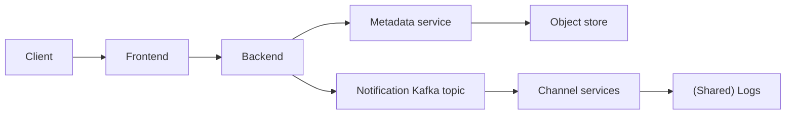

*图 9.4 带有元数据服务的高层架构。后端服务可以把大对象 POST 到元数据服务，因此通知事件可以保持较小体积。*

如果某个大对象要投递给多个接收者，我们的后端会将其多次 POST 到对象存储。从第二次 POST 开始，对象存储可以返回 304 Not Modified 响应。

## 9.5 通知模板

一个拥有数百万目的地的接收者组可能会导致数百万条事件被生成。这可能会占用 Kafka 中的大量内存。上一节讨论了如何使用元数据服务减少事件中的重复内容，从而减小事件大小。

### 9.5.1 通知模板服务

许多通知事件几乎相同，只是带有少量个性化内容。例如，图 9.5 展示了一条可以发送给数百万用户的推送通知，它包含所有接收者共有的一张图片，并且只包含一段随接收者姓名变化的字符串。另一个例子是发送 Email 时，邮件标题和正文对不同接收者可能只有轻微差异（比如用户姓名不同，或每个用户的折扣百分比不同），而附件很可能对所有接收者都相同。

*图 9.5 一条推送通知示例：其中包含一张对所有接收者都相同的图片，并且可以带有一段仅随接收者姓名变化的字符串。公共内容可以放入模板中，例如 “Hi ${name}! Welcome to Deliver & Dine.”。Kafka 队列事件可以只包含形如（“name”、接收者姓名、destination ID）的键值对。图片来源：`https://buildfire.com/what-is-a-push-notification/`。*

在 9.1.4 节中我们讨论过，模板对用户管理这类个性化内容很有帮助。模板还有助于提升通知服务的可扩展性。我们可以把所有公共数据放进模板中，从而最小化通知事件的大小。模板的创建与管理本身也可以是一个复杂系统。我们可以称之为 notification template service，简称 template service。图 9.6 展示了引入 template service 之后的高层架构。客户端只需要在通知中包含模板 ID，通道服务在生成通知时再从 template service 中 GET 模板。

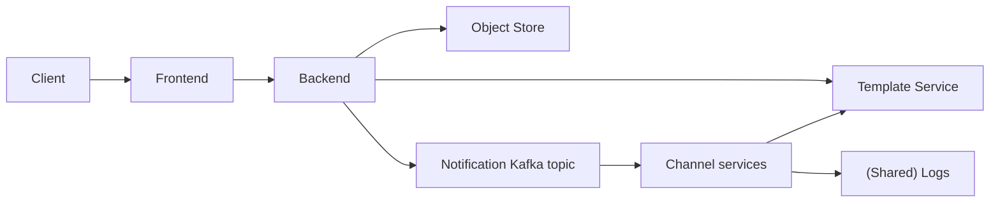

*图 9.6 包含 template service 的高层架构。通知服务用户可以对模板执行 CRUD。template service 应具备自己的认证、授权和 RBAC（基于角色的访问控制）。job constructor 应只有只读权限。管理员应拥有管理员权限，以便创建、更新和删除模板，或者向其他用户授予角色。*

把这种方法与元数据服务结合起来时，一条事件只需要包含通知 ID（它也可以作为通知模板键）、以键值对形式表达的个性化数据，以及 destination。如果通知没有任何个性化内容（也就是它对所有 destination 都完全相同），那么元数据服务中实际上就包含了几乎全部通知内容，而一条事件只需要包含 destination 和 notification content ID。

用户可以在发送通知前预先设置通知模板。用户可以通过服务层向通知模板发出 CRUD 请求，服务层再把这些请求转发给元数据服务，由它对元数据数据库执行相应查询。根据我们可用的资源或者易用性考虑，我们也可以允许用户不必预先建立通知模板，而是直接向我们的服务发送完整通知事件。

### 9.5.2 附加功能

我们可能会决定，模板还需要以下额外功能。这些附加功能可以在面试接近结尾时作为后续讨论主题简要提及。面试中通常不太可能有足够时间深入讨论。工程成熟度和良好面试信号的一个体现，就是既能预见这些功能，又能展示自己能够在这些系统的细节之间流畅拉远和拉近视角，并清晰简洁地向面试官描述它们。

**编写、访问控制与变更管理**

用户应能够编写模板。系统应存储模板数据，包括其内容以及创建详情，例如作者 ID、创建时间戳和更新时间戳。

用户角色包括 admin、write、read 和 none。它们分别对应用户对某个模板拥有的访问权限。我们的通知模板服务可能需要与组织内部的用户管理服务集成，而该服务可能使用 LDAP 一类协议。

我们可能希望记录模板的变更历史，包括精确的变更内容、进行变更的用户以及时间戳。进一步地，我们还可能希望开发变更审批流程。某些角色做出的更改，可能需要一个或多个管理员审批。再往前一步，这还可以泛化成一个共享审批服务，供任何应用使用：由一个或多个用户提出写操作，再由一个或多个其他用户批准或拒绝该操作。

进一步扩展变更管理时，用户可能还需要回滚之前的变更，或者恢复到某个特定版本。

**可复用、可扩展的模板类与函数**

一个模板可以由多个可复用的子模板组成，每个子模板都可以独立归属并管理。我们可以把它们称为 template classes。

模板的参数可以是变量，也可以是函数。函数对于接收设备上的动态行为很有用。

变量可以有数据类型（例如 integer、varchar(255) 等）。当客户端基于模板创建通知时，我们的后端可以校验参数值。通知服务还可以提供附加约束/校验规则，比如整数最小值、最大值，或字符串长度限制。我们也可以对函数定义校验规则。

模板的参数既可以通过简单规则来填充（例如接收者姓名字段或货币符号字段），也可以通过机器学习模型来填充（例如为每位接收者提供不同折扣）。这将需要与能够提供动态参数填充数据的系统集成。内容管理和个性化是不同的职能，由不同团队负责；相应服务及其接口应在设计上清楚体现这种所有权和职责划分。

**搜索**

我们的模板服务可能会存储很多模板和 template classes，其中一些可能重复，或者彼此极为相似。我们可能希望提供搜索功能。2.6 节讨论了如何在一个服务中实现搜索。

**其他**

可能性几乎无穷。例如，如何在模板中管理 CSS 和 JavaScript？

## 9.6 定时通知

我们的通知服务可以使用共享的 Airflow 服务或 job scheduler 服务来提供定时通知。参见图 9.7，后端服务应提供一个用于安排通知时间的 API endpoint，并生成适当请求，将其发送给 Airflow 服务以创建定时通知。

当用户设置或修改周期性通知时，Airflow 作业的 Python 脚本会被自动生成，并合并到调度器的代码仓库中。对 Airflow 服务的详细讨论超出了本题范围。出于面试目的，面试官也可能要求我们自己设计一个任务调度系统，而不是使用 Airflow 或 Luigi 这样的现成方案。我们可以使用 4.6.1 节中讨论的基于 cron 的方案。

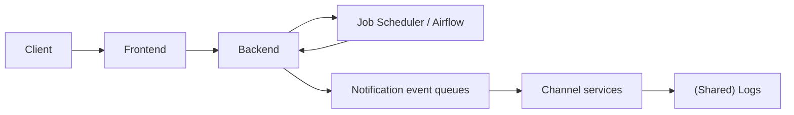

*图 9.7 带有 Airflow/job scheduler 服务的高层架构。job scheduler 服务用于让用户配置周期性通知。在设定时间到达时，job scheduler 服务会向后端生成通知事件。*

周期性通知可能会与临时通知竞争资源，因为两者都可能受到限流器限制。每当限流器阻止某个通知请求立即继续时，都应记录日志。我们应该有一个仪表盘，用于展示限流事件的发生速率。我们还需要增加一条告警：当限流事件频繁发生时触发。基于这些信息，我们可以扩容集群、为外部通知服务分配更多预算，或者要求某些用户减少过度通知行为。

## 9.7 通知收件人组

一条通知可能有数百万个 destination/address。如果用户必须显式指定每一个 destination，那么每个用户都需要维护自己的地址列表，而且不同用户之间会存在大量重复的接收者数据。此外，把这数百万个 destination 传给通知服务意味着巨大的网络流量。对用户来说，更方便的做法是把 destination 列表维护在通知服务中，并在发送通知请求时使用该列表的 ID。我们把这样的列表称为“notification addressee group”。当用户发起一个投递通知的请求时，请求中既可以包含一个 destination 列表（在上限以内），也可以包含一组 Addressee Group ID。

我们可以设计一个 address group service 来处理通知收件人组。这个服务的其他功能需求还可能包括：

- 针对不同角色的访问控制，例如只读、仅追加（可以添加但不能删除地址）和 admin（完全访问）。这里的访问控制是重要的安全特性，因为未经授权的用户可能会向我们超过 10 亿接收者的整个用户群发送通知，造成垃圾信息，甚至更恶意的行为。
- 还可以允许收件人把自己从通知组中移除，以防止垃圾信息。这些移除事件可以记录下来用于分析。
- 这些功能可以暴露为 API endpoint，而且所有这些 endpoint 都通过服务层访问。

对于向大量接收者发送通知的请求，我们还可能需要人工审核与审批流程。测试环境中的通知不需要审批，而生产环境中的通知需要人工审批。比如，向 100 万接收者发送通知的请求可能需要运维人员审批；1000 万接收者需要经理审批；1 亿接收者需要高级经理审批；而面向整个用户群的通知则可能需要总监级审批。我们可以为发送者设计一个系统，使其能在发送通知之前提前获得审批。这超出了本题范围。

图 9.8 展示了加入 address group service 后的高层架构。用户可以在通知请求中指定某个 address group。后端可以向 address group service 发起 GET 请求，以取得该 address group 中的用户 ID。由于一个组中可能有超过 10 亿个用户 ID，单个 GET 响应不可能包含全部用户 ID，而应只返回一批最多数量的用户 ID。Address Group Service 必须提供 `GET /address-group/count/{name}` endpoint，用于返回该组地址总数；还要提供 `GET /address-group/{name}/start-index/{start-index}/end-index/{end-index}` endpoint，使后端能够分批次 GET 地址。

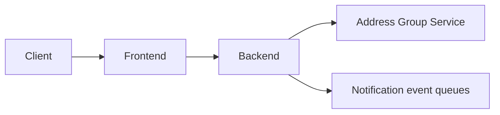

*图 9.8 图 9.6 的放大图，并加入了 address group service。address group 包含接收者列表。通过指定单个 address group，用户就能向多个用户发送通知，而不必逐一指定每个接收者。*

我们可以使用 choreography saga（5.6.1 节）来 GET 这些地址，并生成通知事件。这能应对 address group service 上的流量激增。图 9.9 展示了为完成该任务而设计的后端架构。

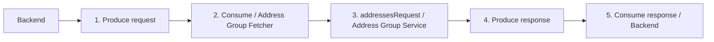

*图 9.9 用于从 address group 构建通知事件的后端架构。*

参见图 9.10 的时序图，producer 可以为这样的任务创建一条事件。某个 consumer 消费该事件后，会做以下事情：

1. 使用 GET 从 address group service 获取一批地址
2. 针对每个地址生成一条通知事件
3. 将其发送到相应的 notification event Kafka topic

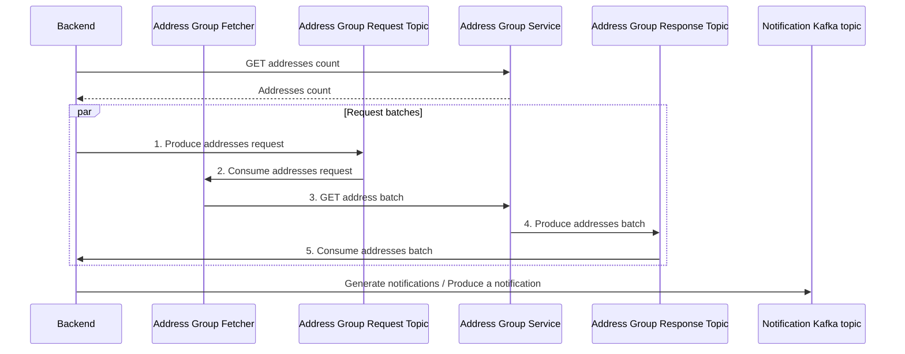

*图 9.10 我们的后端服务根据 address group 构造通知事件的时序图。*

我们是否应该把后端服务拆成两个服务，从而让第 5 步之后的工作由另一项服务完成？我们没有这样做，因为后端未必一定需要向 address group service 发请求。

> [!TIP]
> 这个后端会从一个 topic 消费，再向另一个 topic 生产。如果你需要一个“从一个 topic 消费、再向另一个 topic 生产”的程序，可以考虑使用 Kafka Streams（`https://kafka.apache.org/10/documentation/streams/`）。

> [!QUESTION]
> 如果在 address group fetcher 正在拉取地址时，又有新用户被加入到了该 address group，该怎么办？

这个设计会立刻暴露出一个问题：大的 address group 变化很快。由于各种原因，新接收者会不断被加入或移出：

- 有人可能更改了电话号码或邮箱地址。
- 我们的应用在任何时间段内都可能新增用户，也可能流失现有用户。
- 在一个 10 亿人的随机总体中，每天都有成千上万人出生与死亡。

一条通知什么时候才算“已投递给所有接收者”？如果后端不断拉取新增接收者批次来创建通知事件，那么对一个足够大的 group 来说，这个事件创建过程将永远不会结束。我们应只把通知投递给那些在通知被触发时已经属于该 address group 的接收者。

关于 address group service 的架构和实现细节讨论，超出了本题范围。

## 9.8 退订请求

每一条通知都应包含一个按钮、链接或其他 UI，让接收者可以退订类似通知。如果某个接收者请求将来不再接收通知，那么发送者应被告知这一请求。

我们也可以像图 9.11 那样，在应用中增加一个通知管理页面。应用用户可以选择自己希望接收的通知类别。我们的通知服务应提供通知类别列表，而通知请求中应包含一个 category 字段，并把它设为必填字段。

*图 9.11 YouTube Android 应用中的通知管理。我们可以定义一组通知类别，让应用用户选择订阅哪些类别。*

> [!QUESTION]
> 退订应该在客户端实现，还是在服务端实现？

答案是：要么在服务端实现，要么两端都实现。不要只在客户端实现。如果退订只在客户端实现，通知服务仍会继续向接收者发送通知，而接收者设备上的应用会把通知拦截掉。我们可以在浏览器和移动应用上这么做，但无法在 Email、电话呼叫或 SMS 上这么做。此外，生成并发送一条最终被客户端拦截的通知，也是在浪费资源。不过，即使服务端已经实现了退订拦截，我们仍可能希望在客户端也做通知拦截，以防服务端实现存在 bug，仍继续发送本应被拦截的通知。

如果退订是在服务端实现，那么通知服务将直接拦截发往该接收者的通知。我们的后端应提供一个 API endpoint，用于订阅或退订通知，而按钮/链接则应向这个 API 发请求。

实现通知拦截的一种方式，是修改 Address Group Service API，使其接受 category。新的 GET API endpoint 可以像 `GET /address-group/count/{name}/category/{category}` 和 `GET /address-group/{name}/category/{category}/start-index/{start-index}/end-index/{end-index}` 这样。address group service 只会返回那些接受该 category 通知的接收者。其架构及进一步实现细节不在本题范围内。

## 9.9 处理投递失败

通知投递可能因为与通知服务本身无关的原因而失败：

- 接收者设备无法联系。可能原因包括：
  - 网络问题。
  - 接收者设备已关机。
  - 第三方投递服务不可用。
  - 应用用户卸载了移动应用，或者注销了账号。如果应用用户已经注销账号或卸载了移动应用，本应已有机制去更新 address group service，只是该更新尚未生效。此时通道服务可以简单丢弃该请求，而不再做其他事情。我们可以假设 address group service 将来会被更新，于是之后来自 address group service 的 GET 响应就不会再包含这个接收者。
- 接收者已经屏蔽了这个通知类别，而接收者设备也拦截了该通知。这条通知本不应被投递，但仍被投递了，这很可能是 bug 导致的。对此我们应配置一条低紧急度告警。

第一种情况中的各个子情况应区别处理。影响整个数据中心的网络问题极不可能发生；即使发生，相关团队通常也早已通过不依赖该数据中心的渠道向所有相关团队广播告警了。因此面试中不太可能继续深入讨论这一点。

如果是只影响特定接收者的网络问题，或者接收者设备关机，那么第三方投递服务会向我们的通道服务返回相应信息。通道服务可以把重试次数加入通知事件；如果该字段已经存在（也就是说，这次投递本身已经是重试），则将其递增。接着，它会把这条通知发送到一个充当 dead letter queue 的 Kafka topic。通道服务可以从 dead letter queue 中消费，并再次尝试投递请求。在图 9.12 中，我们把 dead letter queue 加入到高层架构中。如果重试三次仍失败，通道服务可以记录日志，并向 address group service 发请求，记录该用户当前不可联系。address group service 应提供相应 API endpoint。它还应在将来的 GET 请求中停止返回该用户。实现细节不在本题范围内。

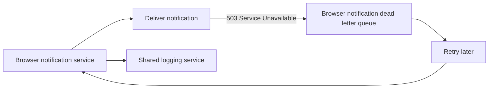

*图 9.12 图 9.6 的放大图，加入了浏览器通知 dead letter queue。其他通道服务的 dead letter queue 与此类似。如果浏览器通知服务在投递通知时遇到 `503 Service Unavailable`，它会把该通知事件写入 dead letter queue，稍后重试。如果三次重试后仍失败，浏览器通知服务会记录该事件（写入共享日志服务）。我们也可以选择为这类投递失败配置一条低紧急度告警。*

如果第三方投递服务不可用，通道服务应触发一条高紧急度告警，采用指数退避，并基于同一条事件重试投递。通道服务可以逐步增大重试间隔。

我们的通知服务还应提供一个 API endpoint，供接收方应用请求错过的通知。当接收者的 Email、浏览器或移动应用重新准备好接收通知时，它可以向这个 API endpoint 发起请求。

## 9.10 关于重复通知的客户端侧考虑

直接向接收设备发送通知的通道服务，必须同时支持 push 和 pull 请求。当通知被创建时，通道服务应立即将其 push 给接收者。然而，接收者设备可能处于离线状态，或者由于其他原因不可用。当设备重新上线后，它应从 notifications service 中 pull 通知。这适用于那些不使用外部通知服务的通道，比如浏览器通知或自定义应用通知。

我们如何避免重复通知？前面我们讨论过如何避免外部通知服务下的重复通知（也就是 push 请求中的重复）。而对于 pull 请求中的重复通知，应在客户端侧实现去重。我们的服务不应拒绝重复请求（限流除外），因为客户端可能有充分理由重复发起请求。客户端应记录那些已经向用户展示过（并被用户关闭过）的通知，例如记录在浏览器的 localStorage，或者移动设备的 SQLite 数据库中。当客户端在一次 pull 请求（或者也许在 push 请求）中接收到通知时，它应查询设备上的存储，以判断某条通知是否已经展示过，再决定是否向用户展示新的通知。

## 9.11 优先级

通知可能具有不同优先级。参见图 9.13，我们可以决定需要多少个优先级层级，例如 2 到 5 个，并为每个优先级单独创建一个 Kafka topic。

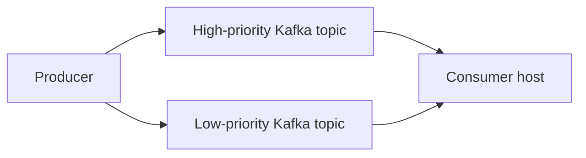

*图 9.13 具有两个优先级层级时的示意图。*

为了先处理高优先级通知，再处理低优先级通知，consumer 主机可以先持续消费高优先级 Kafka topic，直到它们为空，再去消费低优先级 topic。如果采用加权方案，那么每次 consumer 主机准备消费一条事件时，它可以先通过加权随机选择来决定要从哪个 Kafka topic 中消费。

> [!QUESTION]
> 把该系统设计扩展为：允许每个通道都拥有不同的优先级配置。

## 9.12 搜索

我们可以为用户提供搜索能力，用于搜索和查看已有的通知/告警配置。我们可以对通知模板和通知地址组建立索引。参见 2.6.1 节，对于这个用例，一个前端搜索库（如 match-sorter）就足够了。

## 9.13 监控与告警

除了 2.5 节讨论过的内容之外，我们还应监控并告警以下事项。

用户应能够追踪自己通知的状态。这可以通过另一项从日志服务读取数据的服务来提供。我们可以为用户提供一个 notification service UI，用于创建和管理通知，包括模板，以及追踪通知状态。

我们可以围绕多种统计信息创建监控仪表盘。除了前面已经提到的成功率和失败率外，其他有用统计还包括：队列中的事件数量、事件大小在时间上的分位数（按通道和优先级拆分），以及 CPU、内存、磁盘存储消耗等操作系统统计。高内存占用和队列中事件数过大，说明存在不必要的资源消耗，我们可以检查这些事件，判断是否有数据可以转移到元数据服务中，以减小队列中事件的大小。

我们可以做周期性审计，以发现静默错误。例如，我们可以与所使用的外部通知服务协商，对比以下两个数字：

- 我们那些向外部通知服务发请求的通知服务，收到 `200` 响应的次数
- 这些外部通知服务实际收到的有效通知数量

我们还可以使用异常检测，来判断通知速率或消息大小是否出现异常变化，可按发送者、接收者和通道等不同参数维度分析。

## 9.14 在通知/告警服务上做可用性监控与告警

我们在 9.1.1 节讨论过：通知服务不应被用于在线可用性监控，因为它与所监控服务共享同一基础设施和共享服务。但如果我们坚持要找到一种方式，让这个通知服务也成为一个用于宕机告警的通用共享服务呢？如果它自己也失败了怎么办？告警服务又该如何向用户发出告警？一种解决方案，是使用外部设备，例如位于多个数据中心的服务器。

我们可以提供一个客户端守护进程，把它安装在这些外部设备上。服务会定期向这些外部设备发送 heartbeat，而这些设备会被配置为期望收到这些 heartbeat。如果某个设备在预期时间内未收到 heartbeat，它可以向服务发起查询，以核实服务健康状况。如果系统返回 2xx 响应，设备就假设只是临时网络连通性问题，不再采取进一步动作。如果请求超时或返回错误，设备就可以通过自动电话呼叫、短信、Email、推送通知和/或其他通道向其用户发出告警。这本质上是一个独立、专门化、小规模的监控告警服务：它只服务于一个特定目的，而且只向极少数用户发送告警。

## 9.15 其他可能的讨论主题

如有必要，我们还可以对 Kafka 集群的内存规模进行扩缩容。如果队列中的事件数量随时间单调增加，那就说明通知没有被成功投递，我们必须要么扩容 consumer 集群来处理和投递这些通知事件，要么实施限流，并把相关用户的过度使用行为通知给他们。

我们可以考虑为这个共享服务使用自动扩缩容。不过，自动扩缩容方案在实践中往往并不容易用好。实际中，我们可以把自动扩缩容配置为：在不可预见的流量高峰时，自动将服务各组件集群规模扩展到某个上限，以避免宕机；同时向开发者发送告警，以便在必要时进一步增加资源配置。我们还可以人工复盘那些触发过自动扩缩容的实例，并据此不断调整自动扩缩容配置。

通知服务的详细讨论足以写满整整一本书，还会涉及许多共享服务。为了聚焦于通知服务的核心组件，并把讨论控制在合理长度内，本章对很多主题都只是轻描淡写。面试中若有剩余时间，我们还可以讨论这些主题：

- 接收者应能够选择订阅通知，也应能够退出不想接收的通知；否则这些通知就只是垃圾信息。我们可以讨论这一功能。
- 当我们需要修正一条已经发给大量用户的通知时，该怎么办？
  - 如果我们在通知仍在发送过程中发现了这个错误，我们可能希望取消该过程，不再向剩余接收者发送这条通知。
  - 对于那些尚未真正触发通知的设备，我们可以取消尚未触发的通知。
  - 对于那些已经触发过通知的设备，我们则需要再发送一条后续通知来澄清这个错误。
- 不要只按发送者整体限流，而是设计一个系统，使其还支持对单个通道分别限流。
- 可供考虑的分析能力包括：
  - 对各通道的通知投递时间做分析，从而提升性能。
  - 通知响应率，以及对用户动作和其他通知响应做跟踪与分析。
  - 把我们的通知系统与 A/B 测试系统集成。
- 我们在 9.5.2 节讨论过的那些模板服务附加功能，其 API 和架构该如何设计。
- 一个可扩展且高可用的 job scheduler 服务。
- 为支持 9.7 节中所讨论特性的 address group service 做系统设计。我们也可以讨论其他功能，例如：
  - 应采用批处理还是流处理方式来处理退订请求？
  - 如何手动为某个接收者重新订阅通知。
  - 如果接收者设备或账号向组织内任何其他服务发出请求，是否自动为其恢复通知订阅。
- 一个审批服务，用来获取并追踪向大量接收者发送通知所需的相关审批。我们也可以把讨论继续扩展到：如何通过系统设计来防止滥用或防止发送不需要的通知。
- 关于监控与告警的更多细节，包括应定义哪些精确指标与告警的例子和展开说明。
- 关于客户端守护进程方案的进一步讨论。
- 设计我们的各种消息服务（例如设计 Email 服务、SMS 服务、自动电话呼叫服务等）。

## 9.16 最后说明

我们的方案是可扩展的。每个组件都可以水平扩展。容错在这个共享服务中极其重要，而我们始终都在持续关注它。监控与可用性设计也足够稳健；不存在单点故障，而且系统可用性与健康状态的监控和告警还依赖独立设备。

## Summary

- 一个必须为许多不同平台提供同一类功能的服务，可以由一个统一后端组成，由它集中处理公共逻辑，并把请求转发到适合各个平台的组件（或其他服务）。
- 使用元数据服务和/或对象存储，来减小消息代理队列中消息的大小。
- 思考如何使用模板来自动化用户操作。
- 我们可以使用任务调度服务来支持周期性通知。
- 一种去重消息的方式，是在接收端设备上完成去重。
- 通过 saga 等异步手段在系统组件之间通信。
- 我们应创建监控仪表盘，用于分析与错误追踪。
- 进行周期性审计和异常检测，以发现其他指标遗漏的潜在错误。
