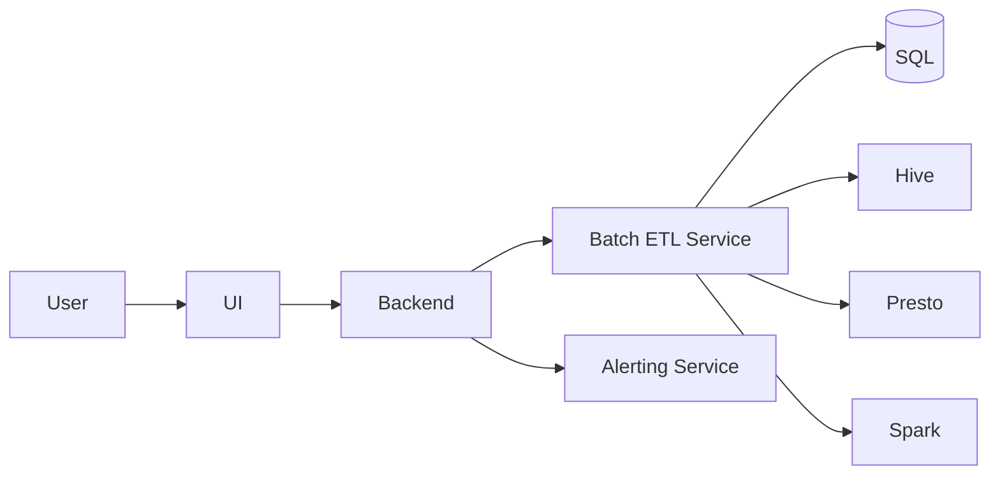
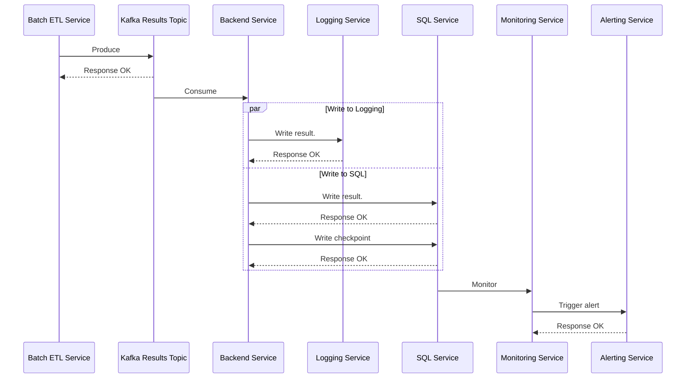
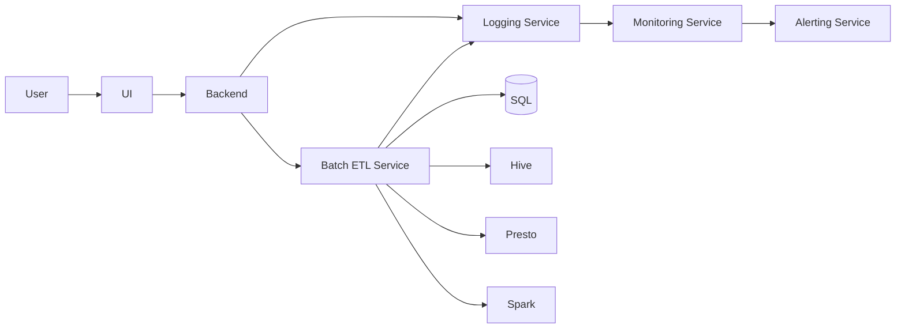
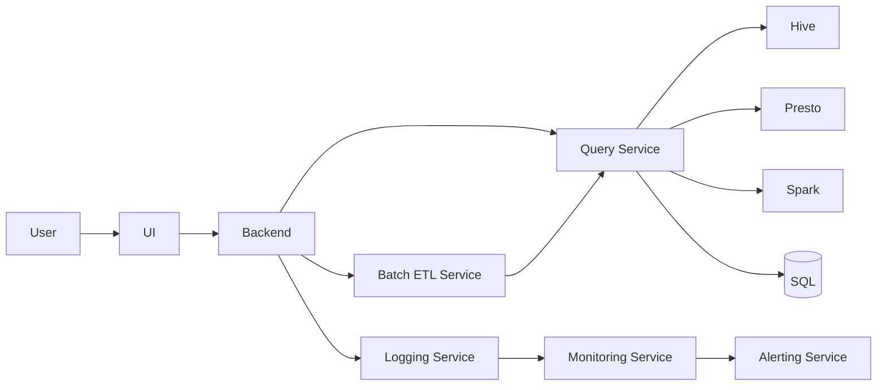
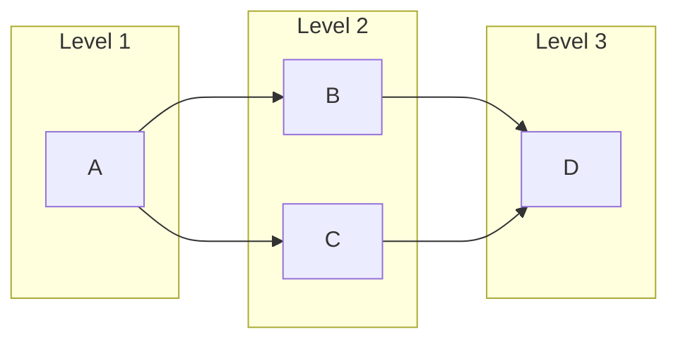
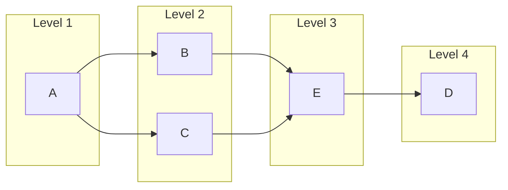

# 10 第 10 章：设计数据库批量审计服务（Design a Database Batch Auditing Service）

本章包括：

- 审计数据库表以发现无效数据
- 设计一个可扩展且准确的方案来审计数据库表
- 探索若要回答一个不寻常的问题，系统还可能具备哪些功能

让我们来设计一个用于手工定义校验规则的共享服务。即使以系统设计面试通常的标准来看，这也是一个异常开放式的问题，而本章讨论的方法，也只是众多可能方案中的一种。

本章先介绍数据质量（data quality）的概念。数据质量有许多定义。一般来说，数据质量既可以指一个数据集是否适合其用途，也可以指那些提升该数据集适用性的活动。数据质量有很多维度。我们可以采用 https://www.heavy.ai/technical-glossary/data-quality 中给出的维度：

- 准确性（Accuracy）——一个测量值与真实值有多接近。
- 完整性（Completeness）——数据是否包含了我们为达成目的所需的全部值。
- 一致性（Consistency）——不同位置上的数据具有相同的值，而且这些不同位置会在同一时间开始提供相同的数据变更。
- 有效性（Validity）——数据格式正确，且取值处于适当范围内。
- 唯一性（Uniqueness）——不存在重复或重叠的数据。
- 时效性（Timeliness）——数据在需要时能够被提供。

验证数据质量的两种方法，是我们在 2.5.6 节讨论过的异常检测（anomaly detection），以及手工定义的校验规则。本章只讨论手工定义的校验规则。举例来说，某张表可能每小时更新一次，偶尔也会有几小时没有更新，但两次更新相隔超过 24 小时则很不寻常。此时，校验条件就是“最新时间戳距离现在少于 24 小时”。

带有手工定义校验规则的批量审计，是一个常见需求。事务监督器（5.5 节）就是许多可能使用场景之一，不过事务监督器不仅检查数据是否有效，它还会返回所比较的多个服务/数据库之间的任何数据差异，以及恢复这些服务/数据库一致性所需的操作。

## 10.1 为什么需要审计？

这个问题给人的第一印象，也许是它并不合理。我们可能会争辩说，除了事务监督器这种场景之外，批量审计甚至可能鼓励糟糕实践。

例如，如果我们遇到的数据无效，是由于数据库或文件系统发生了数据丢失，而这些系统既没有复制也没有备份，那么我们应该实现复制或备份，而不是等数据丢了以后再去审计。然而，复制或备份可能需要数秒甚至更久，主机领导者（leader host）也可能在数据成功复制或备份之前就发生故障。

**防止数据丢失**

一种防止因复制延迟而导致数据丢失的技术，是仲裁一致性（quorum consistency），也就是在向客户端返回成功响应之前，先把写入操作写到集群中的多数主机/节点上。在 Cassandra 中，一次写入会先被复制到多个节点上的一个内存数据结构——Memtable——之后才返回成功响应。写入内存也远快于写入磁盘。Memtable 会在周期性时机，或当其达到一定大小（例如 4 MB）时刷盘为 SSTable。

如果领导者主机恢复，数据也许可以被恢复，再复制到其他主机上。不过，这在某些数据库中并不成立，例如 MongoDB。根据其配置不同，MongoDB 可能会为了维持一致性，故意丢弃领导者主机上的数据（Arthur Ejsmont, *Web Scalability for Startup Engineers*, McGraw Hill Education, 2015, pp. 198–199）。在 MongoDB 中，如果 write concern（https://www.mongodb.com/docs/manual/core/replica-set-write-concern/）设置为 1，那么所有节点都必须与领导者节点保持一致。如果写入领导者节点成功，但领导者在复制发生前就故障了，那么其余节点会使用共识协议选出新的领导者。若原领导者节点随后恢复，它会回滚任何与新领导者不同的数据，包括这类写入。

我们也可以争辩说，数据应该在服务接收它的时候被校验，而不是在它已经存入数据库或文件之后才校验。例如，当服务接收到无效数据时，应返回合适的 4xx 响应，而不是将这些数据持久化。以下是对携带无效数据的写请求可能返回的 4xx 状态码。更多信息可参考 https://developer.mozilla.org/en-US/docs/Web/HTTP/Status#client_error_responses ：

- `400 Bad Request`——对服务器看来无效的任意请求的兜底响应。
- `409 Conflict`——请求与某条规则冲突。例如，上传一个比服务器上现有版本更旧的文件。
- `422 Unprocessable Entity`——请求实体语法有效，但无法被处理。例如，一个 `POST` 请求的 JSON body 中包含无效字段。

另一个反对审计的理由是：校验应当在数据库和应用中完成，而不是借助外部审计进程。我们可以尽量使用数据库约束，因为应用变化的速度通常比数据库快得多。相较于修改数据库 schema（执行数据库迁移），修改应用代码更容易。在应用层，应用应该对输入和输出都进行校验，而且应当对这些输入输出校验函数编写单元测试。

**数据库约束**

也有人认为数据库约束有害（https://dev.to/jonlauridsen/database-constraints-considered-harmful-38）：它们是过早优化，无法覆盖所有数据完整性要求，并使系统更难测试，也更难适应变化中的需求。一些公司如 GitHub（https://github.com/github/gh-ost/issues/331#issuecomment-266027731）和 Alibaba（https://github.com/alibaba/Alibaba-Java-Coding-Guidelines#sql-rules）禁止使用外键约束。

在实践中，bug 和静默错误总会存在。下面是作者亲自调试过的一个例子：某个 `POST` 接口的 JSON body 中有一个日期字段，它应当是未来日期。`POST` 请求在经过校验后，会被写入一张 SQL 表。同时，还有一个按日运行的批量 ETL 任务，会处理日期标记为当天的对象。每当客户端发起 `POST` 请求时，后端都会校验客户端传入的日期值格式正确，并且最多只允许设置到一周后的时间。

然而，这张 SQL 表里却有一行数据的日期被设置到了五年之后。这个问题在五年里一直没被发现，直到那个每日批量 ETL 任务处理到这行数据，才在一系列 ETL 管道的末端发现了无效结果。写这段代码的工程师已经离开公司，这使得问题更难排查。作者查看 git 历史后发现，这条“一周限制”的规则，是在 API 首次发布到生产环境几个月之后才实现的，于是推断，是某个无效的 `POST` 请求写入了这条有问题的记录。由于 `POST` 请求日志只保留两周，因此已经无法确认这一点。如果当时对 SQL 表定期运行审计任务，那么无论这个任务是在数据写入很久之后才实现并启动，它都能发现这个错误。

尽管我们已经尽最大努力防止任何无效数据被持久化，但我们仍必须假设这件事会发生，并为此做好准备。审计是另一层校验检查。

批量审计的一个常见实际场景，是校验大型文件（例如大于 1 GB），尤其是那些来自组织外部、我们无法控制其生成方式的文件。让单台主机逐行处理并校验这些数据会非常慢。如果我们把数据存入 MySQL 表，就可以使用 `LOAD DATA`（https://dev.mysql.com/doc/refman/8.0/en/load-data.html），它比 `INSERT` 快得多，然后再运行 `SELECT` 语句来审计数据。`SELECT` 语句会比在文件上跑脚本更快，而且通常也更容易，特别是在它利用了索引的情况下。如果我们使用像 HDFS 这样的分布式文件系统，那么也可以使用 Hive 或 Spark 这样的 NoSQL/大数据方案来做快速并行处理。

此外，即使发现了无效值，我们也可能认为“脏数据总比没有数据强”，从而仍然把它们存入数据库表。

最后，有些问题只有批量审计才能发现，例如重复数据或缺失数据。某些数据校验还需要依赖此前已摄入的数据；例如，异常检测算法就会利用历史数据来处理并识别当前摄入数据中的异常。

## 10.2 用 SQL 查询结果上的条件语句来定义校验

术语澄清：表由行和列组成。某个特定 `(row, column)` 坐标上的条目，可以称为 `cell`、`element`、`datapoint` 或 `value`。本章中我们交替使用这些术语。

下面讨论，如何通过对 SQL 查询结果施加比较运算符，来定义一个手工编写的校验。SQL 查询的结果是一个二维数组，我们将其命名为 `result`。然后我们可以在 `result` 上定义一个条件语句。下面看一些例子。所有例子都是按日校验，因此我们只校验昨天的行；示例查询里都包含 `WHERE` 子句 `Date(timestamp) > Curdate() - INTERVAL 1 DAY`。在每个例子中，我们先描述一个校验，再给出其 SQL 查询，最后给出可能的条件语句。

手工定义的校验可以定义在以下对象上：

- **某一列中的单个数据点**——前面提到的“最新时间戳距离现在 < 24 小时”就是一个例子。

  ```sql
  SELECT COUNT(*) AS cnt
  FROM Transactions
  WHERE Date(timestamp) >= Curdate() - INTERVAL 1 DAY
  ```

  可能为真的条件语句有 `result[0][0] > 0` 和 `result['cnt'][0] > 0`。

  再看另一个例子。如果某个特定的优惠券编码 ID 会在某天过期，那么我们就可以在交易表上定义一个周期性校验：如果这个编码 ID 在该日期之后仍然出现，就触发告警。这可能意味着优惠券编码 ID 被错误记录了。

  ```sql
  SELECT COUNT(*) AS cnt
  FROM Transactions
  WHERE code_id = @code_id AND Date(timestamp) > @date
  AND Date(timestamp) = Curdate() - INTERVAL 1 DAY
  ```

  可能为真的条件语句是 `result[0][0] == 0` 和 `result['cnt'][0] == 0`。

- **某一列中的多个数据点**——例如，某个应用用户一天内最多只能购买五次。我们可以在交易表上定义一个每日校验：如果自前一天以来，任一 `user_id` 的记录数超过五条，就触发告警。这可能意味着系统有 bug、某个用户在那天被错误地允许购买超过五次，或购买记录被错误记录了。

  ```sql
  SELECT user_id, count(*) AS cnt
  FROM Transactions
  WHERE Date(timestamp) = Curdate() - INTERVAL 1 DAY
  GROUP BY user_id
  ```

  条件语句是 `result.length <= 5`。另一种写法：

  ```sql
  SELECT *
  FROM (
    SELECT user_id, count(*) AS cnt
    FROM Transactions
    WHERE Date(timestamp) = Curdate() - INTERVAL 1 DAY
    GROUP BY user_id
  ) AS yesterday_user_counts
  WHERE cnt > 5;
  ```

  条件语句是 `result.length == 0`。

- **单行中的多列**——例如，使用某个特定优惠券编码的销售总数每天不能超过 100。

  ```sql
  SELECT count(*) AS cnt
  FROM Transactions
  WHERE Date(timestamp) = Curdate() - INTERVAL 1 DAY
  AND coupon_code = @coupon_code
  ```

  条件语句是 `result.length <= 100`。另一种查询和条件语句如下：

  ```sql
  SELECT *
  FROM (
    SELECT count(*) AS cnt
    FROM Transactions
    WHERE Date(timestamp) = Curdate() - INTERVAL 1 DAY
    AND coupon_code = @coupon_code
  ) AS yesterday_user_counts
  WHERE cnt > 100;
  ```

  条件语句是 `result.length == 0`。

- **多张表**——例如，如果我们有一张事实表 `sales_na` 用于记录北美销售数据，并且它有一个 `country_code` 列，那么我们可以建立一张维表 `country_codes`，其中列出每个地理区域的国家编码。我们可以定义一个周期性校验，检查所有新行的 `country_code` 是否都属于北美国家：

  ```sql
  SELECT *
  FROM sales_na S JOIN country_codes C ON S.country_code = C.id
  WHERE C.region != 'NA';
  ```

  条件语句是 `result.length == 0`。

- **建立在多个查询之上的条件语句**——例如，如果某一天的销售数量相较于上周同一天变化超过 10%，我们可能希望触发告警。我们可以运行两个查询并比较它们的结果。此时我们把查询结果追加到 `result` 数组里，因此这个 `result` 数组将是三维，而不是二维：

  ```sql
  SELECT COUNT(*)
  FROM sales
  WHERE Date(timestamp) = Curdate()
  ```

  ```sql
  SELECT COUNT(*)
  FROM sales
  WHERE Date(timestamp) = Curdate() - INTERVAL 7 DAY
  ```

  条件语句是 `Math.abs(result[0][0][0] - result[1][0][0]) / result[0][0][0] < 0.1`。

手工定义校验还有无数其他可能，例如：

- 某张表中每小时至少要写入一定数量的新行。
- 某个字符串列不能包含 `null` 值，且字符串长度必须在 1 到 255 之间。
- 某个字符串列的值必须匹配指定正则表达式。
- 某个整数列应当非负。

这些约束中，有些也可以通过 ORM 库中的函数注解（例如 Hibernate 中的 `@NotNull` 和 `@Length(min = 0, max = 255)`）或 Golang `SQL` 包中的约束类型来实现。在这种情况下，我们的审计服务充当的是额外的一层校验。审计失败意味着服务中存在静默错误，我们应该调查它。

本节示例使用的是 SQL。这个概念也可以泛化到 HiveQL、Trino（原名 PrestoSQL）或 Spark 等其他查询语言。虽然我们的设计重点放在用数据库查询语言定义查询，但我们同样可以用通用编程语言来定义校验函数。

## 10.3 一个简单的 SQL 批量审计服务

本节先讨论一个用于审计 SQL 表的简单脚本。然后，再讨论如何基于这个脚本创建一个批量审计任务。

### 10.3.1 审计脚本

批量审计任务最简单的形式，是一个执行以下步骤的脚本：

1. 运行一个数据库查询。
2. 把结果读入一个变量。
3. 根据某些条件检查这个变量的值。

下面代码清单中的 Python 脚本会运行一个 MySQL 查询，检查 `Transactions` 表中的最新时间戳是否距离现在小于 24 小时，并把结果打印到控制台。

**代码清单 10.1 使用 Python 脚本和 MySQL 查询检查最新时间戳**

```python
import mysql

cnx = mysql.connector.connect(user='admin', password='password',
                              host='127.0.0.1',
                              database='transactions')
cursor = cnx.cursor()

query = """
SELECT COUNT(*) AS cnt
FROM Transactions
WHERE Date(timestamp) >= Curdate() - INTERVAL 1 DAY
"""

cursor.execute(query)
results = cursor.fetchall()
cursor.close()
cnx.close()

# result[0][0] > 0 is the condition.
print(result[0][0] > 0) # result['cnt'][0] > 0 also works.
```

我们可能还需要运行多个数据库查询并比较它们的结果。代码清单 10.2 给出了一个可能的示例。

**代码清单 10.2 比较多个查询结果的示例脚本**

```python
import mysql

queries = [
    {
        'database': 'transactions',

        'query': """
               SELECT COUNT(*) AS cnt
            FROM Transactions
            WHERE Date(timestamp) >= Curdate() - INTERVAL 1 DAY
        """,
    },
    {
        `database': 'transactions`,
        'query': """
            SELECT COUNT(*) AS cnt
            FROM Transactions
            WHERE Date(timestamp) >= Curdate() - INTERVAL 1 DAY
            """
        }
    ]

results = []
for query in queries:
     cnx = mysql.connector.connect(user='admin', password='password',
                                  host='127.0.0.1',
                                  database=query['database'])
        cursor = cnx.cursor()
     cursor.execute(query['query'])
      results.append(cursor.fetchall())
cursor.close()
cnx.close()

print(result[0][0][0] > result[1][0][0])
```

### 10.3.2 审计服务

接下来，把它扩展成批量审计服务。我们可以把这个脚本泛化，使用户能够指定：

1. SQL 数据库及查询。
2. 作用于查询结果上的条件。

让我们实现一个 Python 文件模板，可以命名为 `validation.py.template`。代码清单 10.3 是这个文件的一种可能实现。这是一个简化版实现。批量审计任务分成两个阶段：

1. 运行数据库查询，并用其结果判断审计通过还是失败。
2. 如果审计失败，则触发告警。

在实际实现中，登录凭证会由密钥管理服务提供，而主机地址会从配置文件中读取。这些细节超出了本题范围。这个服务的用户故事可以是：

1. 用户登录服务并创建一个新的批量审计任务。
2. 用户输入 `database`、`queries` 和 `condition` 的值。
3. 我们的服务基于这个 `validation.py.template` 生成一个 `validation.py` 文件，并将 `{database}` 之类的参数替换为用户输入值。
4. 我们的服务再创建一个新的 Airflow 或 cron 任务，它会导入 `validation.py` 并运行其中的 `validation` 函数。

我们会注意到，这些 `validation.py` 文件本质上就是函数。一个批量 ETL 服务存储的是函数，而不是对象。

我们在 `validation.py.template` 中注释说明了：应当为每个数据库查询创建一个 Airflow task。我们的后端应当生成这样一个 `validation.py` 文件。这会是一个很好的编码面试练习，但超出了系统设计面试的范围。

**代码清单 10.3 审计服务的 Python 文件模板**

```python
from datetime import datetime, timedelta
from airflow import DAG
from airflow.operators.bash import BranchPythonOperator
import mysql.connector
import os
import pdpyras

# Example user inputs:
# {name} – ''
# {queries} – ['', '']
# {condition} – result[0][0][0] result[1][0][0]

def _validation():
  results = []
  # Database queries are expensive. An issue with running every query here
  # is that if a query fails, all queries need to be rerun.
  # We can consider instead creating an Airflow task for each query.
  for query in {queries}:
    cnx = mysql.connector.connect(user='admin', password='password',
                               host='127.0.0.1',
                               database=query['database'])
    cursor = cnx.cursor()
    cursor.execute(query['query'])
  results.append(cursor.fetchall())
  cursor.close()
  cnx.close()
  # XCom is an Airflow feature to share data between tasks.
  ti.xcom_push(key='validation_result_{name}', value={condition})

def _alert():
  # Some sample code to trigger a PagerDuty alert if the audit failed.
  # This is just an example and should not be taken as working code.

  # We may also wish to send this result to our Backend Service.
  # This is discussed later in this chapter.
  result = ti.xcom_pull(key='validation_result_{name}')
  if result:
    routing_key = os.environ['PD_API_KEY']
    session = pdpyras.EventsAPISession(routing_key)
    dedup_key = session.trigger("{name} validation failed", "audit")

with DAG(
    {name},
    default_args={
       'depends_on_past': False,
       'email': ['zhiyong@beigel.com'],
       'email_on_failure': True,
       'email_on_retry': False,
       'retries': 1,
       'retry_delay': timedelta(minutes=5),
 },
 description={description},
 schedule_interval=timedelta(days=1),
 start_date=datetime(2023, 1, 1),
 catchup=False,
 tags=['validation', {name}],
) as dag:
 t1 = BranchPythonOperator(
     task_id='validation',
     python_callable=_validation
 )
 # Alerting is a separate Airflow task, so in case the alert fails,
 # the Airflow job does not rerun the expensive validation function.
 t2 = BranchPythonOperator(
     task_id='alert',
     python_callable=_alert
 )
 t1 >> t2
```

## 10.4 需求

让我们来设计一个系统，允许用户为其数据库表定义周期性批量审计查询，这些查询可以是 SQL、Hive 或 Trino（原名 Presto）。功能性需求如下：

- CRUD 审计任务。一个审计任务具有以下字段：
  - 间隔，例如分钟、小时、天，或自定义时间间隔
  - 所有者
  - 一个用 SQL 或相关方言（如 HQL、Trino、Cassandra 等）编写的校验数据库查询
  - 作用于 SQL 查询结果上的条件语句
- 失败任务应触发告警
- 查看过去和当前运行任务的日志，包括是否发生错误，以及其条件语句的结果。用户还应能够查看任何已触发告警的状态与历史，例如触发时间、是否被标记为已解决，以及若已解决则是什么时候解决的
- 一个任务必须在 6 小时内完成
- 一个数据库查询必须在 15 分钟内完成。我们的系统应禁止长时间运行查询的任务

非功能性需求如下：

- 可扩展性（Scale）——预计总任务数小于 10000（即少于 10000 条数据库语句）。这些任务及其日志只通过我们的 UI 读取，因此流量较低。
- 可用性（Availability）——这是一个内部系统，没有其他系统直接依赖它，不要求高可用。
- 安全性（Security）——任务具有访问控制。一个任务只能由其所有者执行 CRUD。
- 准确性（Accuracy）——审计任务结果应当按照任务配置被准确计算。

## 10.5 高层架构

图 10.1 是一个初始高层架构图，描述的是一个假想服务：用户可以为自己的表定义周期性校验检查。我们假设批量 ETL 服务是一个 Airflow 服务，或其工作方式与 Airflow 类似。它存储批处理任务的 Python 文件，按定义好的调度运行它们，存储这些任务的状态与历史，并返回布尔值，表示其审计条件为真还是假。用户通过 UI 与系统交互，而 UI 通过我们的后端发起请求：

1. 用户向一个共享的批量 ETL 服务发起请求，对批量审计任务执行 CRUD，也包括查询这些任务的状态与历史。
2. 共享批量 ETL 服务不是告警服务，因此它没有用于触发告警或查看任何已触发告警状态与历史的 API 端点。用户通过 UI 和后端向共享告警服务发起请求，以查看这些信息。



*图 10.1 一个假想服务的初始高层架构：用户可用它为自己的数据定义周期性校验检查。*

当用户提交一个创建批量审计任务的请求时，会发生以下步骤：

1. 我们的后端服务通过把用户输入值替换进模板，生成 `validation.py` 文件。由于这个模板只是一个较短的字符串，因此它可以存储在每台后端服务主机的内存中。
2. 我们的后端服务携带这个文件向批量 ETL 服务发起请求。批量 ETL 服务创建该批量 ETL 任务并存储这个文件，然后向我们的后端服务返回 `200` 成功响应。

我们的批量审计服务，本质上是对一个共享批量 ETL 服务的封装。一个审计任务的配置包含诸如任务所有者、cron 表达式、数据库类型（Hive、Trino、Spark、SQL 等）以及要执行的查询等字段。主 SQL 表将存储审计任务配置，我们可以把它命名为 `job_config`。还可以创建一张 `owner` 表，用来把任务映射到其所有者，这张表可以有 `job_id` 和 `owner_id` 两列。

由于校验查询可以用多种类 SQL 方言定义，因此我们的批量 ETL 服务会连接到各种共享数据库，例如 SQL、Hive、Trino、Spark、Cassandra 等。如果某个任务失败，或存在失败审计，那么批量 ETL 服务会向一个共享告警服务发起请求，通知相关人员。为了安全，我们可以使用一个共享 OpenID Connect 服务进行身份认证，这将在附录 B 讨论。

### 10.5.1 运行一个批量审计任务

一个审计任务按配置时间间隔周期性运行，主要包括两个步骤：

1. 运行数据库查询。
2. 使用数据库查询结果来运行条件语句。

参照 4.6.1 节，一个批量 ETL 任务会被创建成一个脚本（例如 Airflow 服务中的 Python 脚本）。当用户创建一个审计任务时，我们的后端就可以生成对应的 Python 脚本。这种生成可以利用一个预先定义并实现好的模板脚本。模板脚本中可以包含多个占位区块，用来替换适当参数（间隔、数据库查询和条件语句）。

主要的可扩展性挑战，集中在批量 ETL 服务上，也可能包括告警服务。因此，关于可扩展性的讨论，实际上是在讨论如何设计一个可扩展的批量 ETL 服务和一个可扩展的告警服务。关于告警服务的详细讨论，请参见第 9 章。

由于用户的审计任务，本质上主要就是一个执行 SQL 语句的校验函数，因此我们也建议使用函数即服务（Function as a Service，FaaS）平台，利用其内建的可扩展性。我们还可以为异常查询设置保护措施，例如把查询执行时间限制为 15 分钟，或者在查询结果无效时暂停该任务。

每次审计任务运行的结果，都可以存储到我们的 SQL 数据库中，并由用户通过 UI 访问。

### 10.5.2 处理告警

关于失败审计的告警，应由批量 ETL 服务触发，还是由我们的后端触发？我们的第一反应，可能是批量 ETL 服务在运行这些审计任务，所以理应由它来触发告警。但这样一来，我们的批量审计服务中与告警相关的功能就被拆散到了两个组件中：

- 触发告警的请求由批量 ETL 服务发出。
- 查看告警状态与历史的请求则由后端服务发出。

这意味着，连接告警服务所需的配置必须在两个服务上都完成，这会增加维护成本。未来接手维护该批量审计服务的团队，可能由一些不熟悉代码的新工程师组成；一旦告警出现问题，他们起初可能会误以为与告警服务的交互都在同一个服务里，于是先在错误的服务上排查，浪费时间，直到后来才发现问题在另一个服务上。

因此，我们也可以决定：所有与告警服务的交互都统一放到后端服务中。批量 ETL 任务只负责检查条件是真是假，并把这个布尔值发送给我们的后端服务。如果这个值为 `false`，则由后端服务调用告警服务触发告警。

不过，这种做法可能引入一个 bug。如果负责生成并发出告警请求的后端服务主机宕机或不可用，那么告警就可能发不出去。防止这个 bug 的一些可能方法如下：

- 从批量 ETL 服务到后端服务的请求可以设计成阻塞式；只有当后端服务成功发出告警请求后，它才返回 `200`。我们可以依赖批量 ETL 服务的重试机制（例如 Airflow 中的重试机制）来确保告警请求最终被发出。不过，这种做法意味着，本质上仍然是批量 ETL 服务在发起告警请求，而且使两个服务之间耦合得很紧。
- 批量 ETL 服务可以往一个分区化的 Kafka topic 生产消息，而我们的后端服务主机可以从这些分区消费，并对每个分区进行检查点记录（checkpoint，可能使用 SQL）。不过，这可能导致重复告警，因为某台后端服务主机可能在发出告警请求之后、写入 checkpoint 之前就失败。于是，告警服务需要具备对告警去重的能力。

我们当前的架构同时承担日志记录（logging）和监控（monitoring）功能。它把审计结果记录到 SQL；它还监控这些审计任务：如果任务失败，我们的批量审计服务就触发告警。只有告警是由共享服务完成的。

另一种做法，是把审计任务结果同时记录到 SQL 和一个共享日志服务中。我们还可以再使用一张 SQL 表，每处理若干条结果就写一次检查点（checkpoint）。

参照图 10.2 中的时序图，每当一台主机从故障中恢复时，它都可以查询这张 SQL 表，以拿到最近一次检查点（checkpoint）。向 SQL 重复写日志不是问题，因为我们可以简单使用 `INSERT INTO <table> IF NOT EXISTS...` 语句。向日志服务重复写结果，则可以通过三种方式处理：

1. 假设重复日志的后果无足轻重，直接写入日志服务。
2. 由日志服务负责处理重复。
3. 在写入之前先查询日志服务，判断结果是否已存在。不过这样会使我们对日志服务的流量翻倍。



*图 10.2 一个时序图：结果会并行写入日志服务和 SQL 服务。我们可以基于 SQL 服务做监控和告警。*

图 10.3 展示了使用共享日志服务与共享监控服务之后的修订版高层架构。日志与告警从批量 ETL 服务中解耦。批量 ETL 服务的开发者无需关心告警服务的变更，反之亦然；批量 ETL 服务也不需要配置成可直接请求告警服务。



*图 10.3 使用共享服务的高层架构。每个服务都会向共享日志服务写日志，不过这里我们只画出了它与后端和监控服务之间的关系。*

## 10.6 对数据库查询施加约束

数据库查询是许多服务中最昂贵、运行时间也最长的计算之一，这个服务也不例外。出于以下原因，我们应当约束批量 ETL 服务被允许执行的查询速率和持续时间：

- 各种数据库服务都是共享服务。任何用户运行长时间且高成本的查询，都会显著降低服务剩余容量，使其更难服务其他用户，也会整体提高时延。查询会消耗其所在主机的 CPU 和内存。到数据库服务的每个连接也会消耗一个线程；该线程上的进程负责执行查询、收集并返回查询结果。我们可以分配一个线程池，并限制线程总数，从而保证永远不会有过多并发查询。
- 我们的数据库服务可能由按使用量计费的第三方云厂商提供，而高成本、长时间运行的查询会花很多钱。
- 批量 ETL 服务有一组待执行的调度查询。它必须保证每条查询都能在其调度周期内执行完。例如，一个按小时运行的查询，必须在一小时内完成。

我们可以在用户编写任务配置中的查询定义时，或在他们连同其余任务配置一起向后端提交查询时，实现一些技术来解析用户定义的查询。

本节讨论我们可以施加在用户查询上的约束，以满足系统需求并控制成本。

### 10.6.1 限制查询执行时间

防止高成本查询的一种简单办法，是把查询执行时间限制为：用户创建或编辑任务配置时最多 10 分钟，而任务实际运行时最多 15 分钟。当用户在任务配置中编写或编辑查询时，我们的后端应要求用户先运行该查询，并在确认其耗时少于 10 分钟之后，才允许用户保存这个查询字符串。这样可以训练用户把查询控制在 10 分钟以内。另一种做法，是提供一种非阻塞/异步体验：允许用户先保存查询、执行查询，然后在 10 分钟内通过邮件或聊天工具通知用户其查询是否成功运行，从而决定该任务配置被接受还是拒绝。这种用户体验（UX）的代价是，任务所有者可能会不愿修改自己的查询字符串，因此潜在 bug 或优化改进可能迟迟得不到处理。

我们可能还希望防止多个用户同时编辑同一个查询并互相覆盖更新。关于如何防止这一点，请参考 2.4.2 节。

如果某个查询执行时间超过 15 分钟，就终止该查询，禁用该任务，直到其所有者编辑并重新校验该查询，并向其所有者触发高紧急度告警。

如果某个查询执行时间超过 10 分钟，则向任务配置所有者发送低紧急度告警，提醒他们其查询未来可能会超过 15 分钟，以及这会带来的后果。

### 10.6.2 在提交前检查查询字符串

与其让用户在保存任务配置前等待几分钟，或在保存配置 10 分钟之后才告知其配置被拒绝，不如让 UI 在用户编写查询字符串时就立刻给出反馈，以避免他们提交无效或昂贵的查询。这类校验可以包括以下内容。

不允许全表扫描。只允许在包含分区键的表上运行查询，而且查询必须包含对分区键的过滤。我们还可以更进一步，限制单条查询中可包含的分区键值数量。要确定某张表的分区键，后端需要在相关数据库服务上执行 `DESCRIBE` 查询。不允许包含 `JOIN` 的查询，因为它们可能非常昂贵。

当用户定义好查询后，我们可以把查询执行计划展示给用户，这有助于用户调优查询、缩短执行时间。这个功能应当配套相应数据库查询语言的调优指南。关于 SQL 查询调优，可参考 https://www.toptal.com/sql-server/sql-database-tuning-for-developers 。关于 Hive 查询调优，可参考 https://cwiki.apache.org/confluence/display/Hive/LanguageManual+Explain ，或 Dayang Du, *Apache Hive Essentials*, Packt Publishing, 2018 中题为“Performance Considerations”的章节。

### 10.6.3 应尽早培训用户

那些负责编写查询的用户，应当尽早被告知这些约束，以便他们学会适应这些约束。我们还应提供良好的用户体验（UX）和具有指导性的文档，帮助用户理解这些限制。此外，这些约束最好在数据库批量审计服务的早期版本中就定义并启用，而不是在首次发布数月后再追加。如果在我们施加这些约束之前，用户已经被允许提交高成本查询，那么他们可能会抵触这些约束，反对它们，而我们也可能很难、甚至不可能说服他们修改自己的查询。

## 10.7 防止过多的同时查询

我们应当为批量 ETL 服务能够同时执行的查询数配置一个上限。每当用户提交一个任务配置时，其中会包含一个按特定调度执行的查询；后端可以检查：在同一个数据库上，被安排在同一时刻执行的查询数有多少；如果这个数接近估算容量，就向我们服务的开发者触发告警。我们还可以监控每个查询在开始执行前的等待时间；如果等待时间超过 30 分钟，或我们决定的其他基准值，就触发低紧急度告警。我们也可以研究如何设计压测方案，以估算容量。修订后的高层架构如图 10.4 所示。



*图 10.4 修订后的高层架构：增加了一个共享查询服务，其他服务都通过它来向数据库发起请求。*

图 10.4 中新增了一个数据库查询服务。由于数据库本身是共享服务，因此像“同时查询数上限”这样的横切关注点，应当存放在数据库查询服务中，而不是在我们的数据库审计服务里。

另一种可能的优化是：批量 ETL 服务可以在运行数据库查询之前，先通过后端服务查询告警服务，看是否存在任何未解决告警。如果有，就没有必要继续执行该审计任务。

## 10.8 数据库 schema 元数据的其他使用者

为了帮助用户编写查询，我们的服务可以根据 schema 元数据自动派生任务配置。例如，`WHERE` 过滤通常定义在分区列上，因此 UI 可以向用户展示查询模板，提示他们使用这些列，或者建议他们编写只测试最新分区的查询。默认情况下，如果某个新分区通过了审计，我们的服务就不应再为这个分区继续安排更多审计。用户也可能有理由在一个已经通过的分区上重新运行同一个审计。例如，某个审计任务本身可能存在 bug 并错误地通过，于是任务所有者需要编辑审计任务，并重新运行那些曾经通过的审计。因此，我们的服务可以允许用户手动重跑某次审计，或在该分区上安排有限次数的审计。

表可能具有新行追加频率方面的新鲜度 SLA。这与数据新鲜度（data freshness）的概念有关，也就是数据有多“新”。在数据尚未准备好之前，不应对该表执行审计，因为这既浪费资源，也会触发误报。也许数据库查询服务可以提供一个功能，让表所有者为自己的表配置新鲜度 SLA；或者，我们也可以为组织构建一个数据库元数据目录/平台，采用如 Amundsen（https://www.amundsen.io/）、DataHub（https://datahubproject.io/）或 Metacat（https://github.com/Netflix/metacat）这样的工具。

数据库元数据平台的另一个有用功能，是记录与表相关的故障事件（incident）。表所有者或我们的服务，都可以更新数据库元数据平台，标记某张表正在出现问题。于是，我们的数据库查询服务就能向任何查询该表的人或服务发出警告，说明这张表的审计失败了。一个查询某张表的用户，未来可能还会再次查询这张表，因此数据库元数据平台中一个有用的功能，是允许用户订阅该表元数据的变化，或者在有问题影响到该表时收到告警。

我们的批量 ETL 服务还可以监控数据库 schema 的变化，并据此作出响应。如果某个列名被修改，它就应当在包含该列名的审计任务配置查询字符串中更新这个列名。如果某列被删除，它就应当禁用所有相关任务，并告警其所有者。

## 10.9 审计一个数据管道

图 10.5 展示了一个数据管道（例如一个 Airflow DAG）及其多个任务。每个任务都可能写入某些表，而下一阶段会读取这些表。任务配置中可以包含 `pipeline name` 和 `level` 字段，它们可以作为我们 `job_config` 表中的新增列。



*图 10.5 一个具有多个阶段的示例数据管道。我们可以为每个阶段创建审计任务。*

当某个审计任务失败时，我们的服务应当执行以下操作：

- 禁用下游审计，以节省资源，因为如果上游任务已经失败，那么继续执行这些审计任务就是没有意义的浪费。
- 禁用其他所有包含对这张表的查询的任务，以及它们的下游任务。
- 向所有被禁用任务的所有者，以及所有下游任务的所有者，触发高紧急度告警。

我们还应当更新数据库元数据平台，标记这张表存在问题。任何使用这张表的数据管道，都应禁用该表下游的所有任务，否则这张表中的坏数据就可能传播到下游表中。例如，机器学习管道就可以用审计结果来决定自己是否应该运行，从而避免使用坏数据来执行实验。Airflow 本身已经允许用户配置 trigger rules（https://airflow.apache.org/docs/apache-airflow/stable/concepts/dags.html#trigger-rules），从而让每个任务仅在其所有依赖项，或至少一个依赖项成功完成后才运行。我们新增的批量 ETL 服务功能，是对 Airflow 以及其他工作流管理平台的一种增强。

所有这些都说明，我们的批量 ETL 服务可以进一步泛化为一个共享服务，从而向整个组织中的批量 ETL 任务提供这种能力。

当用户向一个管道中新增一个 level 时，他们还需要更新所有下游任务的 level 值。正如图 10.6 所示，我们的后端可以通过自动递增下游任务的 level 编号来帮助他们完成这件事。



*图 10.6 当我们在 level 2 和 level 3 之间新增一个任务 “E” 时，可以自动递增相应 level 的编号，因此原先的 level 3 变成 level 4。*

## 10.10 日志、监控与告警

在 2.5 节讨论的基础上，我们还应当针对以下事项做监控并发送告警。下面这些日志对用户可能有帮助，也可以显示在 UI 上：

- 当前任务状态（例如 started、in progress、succeeded、failed）以及记录该状态的时间
- 批量 ETL 服务中失败的数据库查询。告警里还应包含失败原因，例如查询超时或查询执行错误
- 如前所述，监控数据库查询执行耗时，并在其超过我们选定的基准值时发出告警
- 如前所述，在上游任务失败时告警任务所有者
- 我们后端端点的 1 秒 P99 以及 4xx 和 5xx 响应
- 请求外部服务时的 1 秒 P99 以及 4xx 和 5xx 响应
- 高流量，即请求速率高于通过压测确定的负载上限
- CPU、内存或 I/O 利用率过高
- SQL 服务中的存储利用率过高（如果我们管理的是自己的 SQL 服务，而不是使用共享服务）

4xx 响应应当触发高紧急度告警，而其他问题则可以触发低紧急度告警。

## 10.11 其他可能的审计类型

除了目前讨论过的这些审计/测试之外，我们还可以讨论其他类型的测试，例如下面这些。

### 10.11.1 跨数据中心一致性审计

同一份数据被存储在多个数据中心中，是很常见的。为了保证跨数据中心的数据一致性，我们的数据库批量审计服务可以提供运行抽样测试的能力，用于比较不同数据中心之间的数据。

### 10.11.2 比较上游与下游数据

参照 7.7 节关于数据迁移的讨论，用户可能需要把数据从一张表复制到另一张表。他们可以创建一个审计任务，比较上游表与下游表中的最新分区，以确保数据一致性。

## 10.12 其他可能的讨论话题

面试过程中，还可以讨论以下一些话题：

- 设计一个可扩展的批量 ETL 服务，或者一个可扩展的告警服务。这两个服务都需要像 Kafka 这样的分布式事件流平台。
- 编写一个函数，基于 `validation.py.template` 和其他合适的模板，生成 Airflow Python 任务，并为每个查询生成一个单独的 Airflow task。不过这属于编码题，而不是系统设计题。
- 一个审计任务会向数据库表所有者告警其表中的数据完整性问题，但我们并没有讨论他们如何排障、如何发现这些问题的原因。表所有者该如何排查数据完整性问题？我们能否增强审计服务，或者还有哪些其他可能性来帮助他们？
- 某些审计任务可能在某次运行中失败，但在所有者排障时再次运行同一查询时又通过了。所有者应如何排查这类任务？我们的服务可以提供哪些日志或功能来帮助他们？
- 我们如何发现并去重那些完全相同或相似的审计任务？
- 我们的数据库批量审计服务会发送大量告警。一张表上的一个问题可能影响多个审计任务，并向同一用户触发多条告警。我们如何对这些告警去重？这部分去重逻辑中，哪些应当实现于数据库批量审计服务中，哪些应当实现于共享告警服务中？
- 我们的服务还可以允许测试由某些事件触发，而不仅仅是按调度运行。例如，我们可以追踪每个查询后变更的行数，对这些数字求和，并在变更行数达到某个指定值时触发测试。我们可以继续讨论：哪些事件可以触发测试，以及它们的系统设计应当如何。

## 10.13 参考资料

本章的灵感来自 Uber 的 Trust 数据质量平台，不过本章讨论的许多实现细节，可能与 Trust 有相当大的不同。关于 Uber 数据质量的讨论，可见 https://eng.uber.com/operational-excellence-data-quality/ 。虽然这篇文章没有直接提到 Trust 这个名字，但它概述了 Uber 的数据质量平台，包括其组成服务，以及这些服务彼此之间、与用户之间的交互。

## 总结

- 在系统设计面试中，我们可以把审计作为维护数据完整性的一种常见方法来讨论。本章讨论了一种可能的批量审计系统设计。
- 我们可以周期性地运行数据库查询，以发现数据中的异常，这些异常可能来自意外的用户行为、静默错误，或恶意行为等问题。
- 我们定义了一种用于检测数据异常的通用方案，它覆盖了许多这类周期性数据库查询的使用场景，并设计了一个具备可扩展性、可用性和准确性的系统。
- 我们可以使用 Airflow 这样的任务调度平台来调度审计任务，而不是自己定义可扩展性更差、也更容易出错的 cron 任务。
- 我们应定义合适的监控与告警，使用户能够及时了解审计任务成功还是失败。这个周期性数据库审计服务还会使用第 9 章讨论过的告警服务，以及附录 B 讨论过的 OpenID Connect。
- 我们可以提供一个查询服务，供用户执行临时查询。
