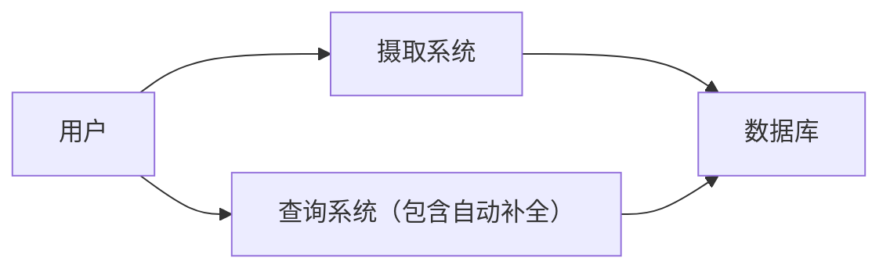
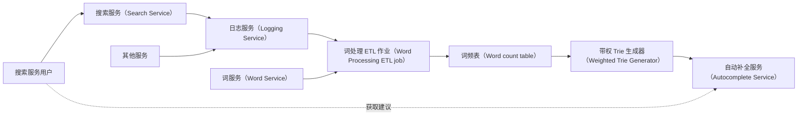
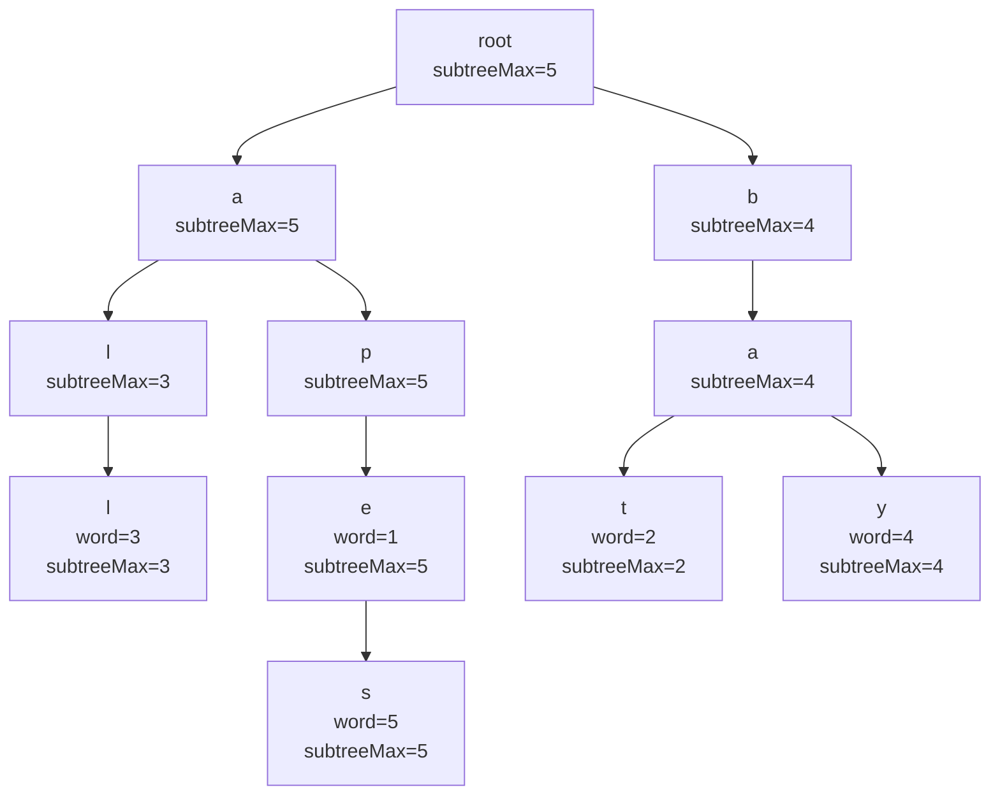
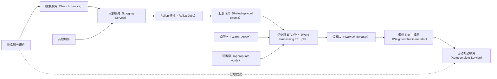

# 11 第 11 章：自动补全/Typeahead（Autocomplete/Typeahead）

本章包括：

- 比较自动补全与搜索
- 将数据收集与处理同查询过程分离
- 处理连续数据流
- 将大型聚合作业拆分为多个阶段以降低存储成本
- 将数据处理流水线的副产品用于其他用途

我们希望设计一个自动补全系统。自动补全是一个很适合用于考察候选人能力的问题：它要求候选人设计一个分布式系统，该系统持续摄取并处理海量数据，最后生成一个很小（几 MB）的数据结构，供用户围绕某个特定目的进行查询。自动补全系统从最多可达数十亿用户提交的字符串中获取数据，再将这些数据处理成一个带权 Trie（weighted trie）。当用户输入字符串时，这个带权 Trie 会为他们提供自动补全建议。我们也可以在自动补全系统中加入个性化和机器学习元素。

## 11.1 自动补全的可能用途

我们先讨论并明确这个系统的预期使用场景，以确保能够推导出合适的需求。自动补全的可能用途包括：

- 作为搜索服务的补充。当用户输入搜索查询时，自动补全服务会在每次击键后返回一组自动补全建议。如果用户选择了某个建议，搜索服务就接受该建议并返回结果列表。
  - 通用搜索，例如 Google、Bing、Baidu 或 Yandex。
  - 在特定文档集合内搜索。例如 Wikipedia 和视频分享应用。
- 文字处理器可以提供自动补全建议。当用户开始输入一个单词时，系统可以为当前前缀返回常见单词的自动补全建议。借助一种称为模糊匹配（fuzzy matching）的技术，自动补全功能也可以成为拼写检查功能，为那些与用户当前输入前缀接近但并不完全相同的前缀提供单词建议。
- 集成开发环境（IDE，用于编程）也可能具备自动补全功能。自动补全功能可以记录项目目录中的变量名或常量值，并在用户声明变量或常量时将其作为自动补全建议返回。这里要求精确匹配（不做模糊匹配）。

针对上述每一种使用场景，自动补全服务都会有不同的数据源和架构。在这道面试题里（以及一般的系统设计面试中），一个潜在陷阱是过早下结论，立刻假设这里的自动补全一定是用于搜索服务的。之所以容易犯这个错误，是因为你最熟悉的自动补全往往来自 Google 或 Bing 这样的搜索引擎。

即使面试官给出的是一个明确问题，比如“设计一个像 Google 那样为通用搜索应用提供自动补全的系统”，你仍然可以花半分钟讨论自动补全的其他可能用途。要展示出你能跳出题面思考，而不是草率假设、仓促下结论。

## 11.2 搜索与自动补全

我们必须区分搜索与自动补全，不能把它们的需求混在一起。这样我们设计出来的才是自动补全服务，而不是搜索服务。自动补全与搜索有哪些相似点和不同点？相似点包括：

- 两种服务都会试图根据用户输入的搜索字符串判断其意图，并返回按最可能匹配其意图排序的结果列表。
- 为了避免向用户返回不适当内容，两种服务都可能需要对候选结果做预处理。
- 两种服务都可能记录用户输入，并利用这些数据改进它们的建议/结果。例如，两者都可以记录返回了哪些结果，以及用户点击了哪一个。如果用户点击了第一个结果，这表明对该用户来说这个结果更相关。

从概念上说，自动补全比搜索更简单。表 11.1 描述了一些高层次差异。除非面试官对此感兴趣，否则在面试中不要花超过一分钟停留在这些差异上。这里的重点是展示你的批判性思维，以及从全局视角看问题的能力。

**表 11.1  搜索与自动补全的一些差异**

| 搜索 | 自动补全 |
| --- | --- |
| 结果通常是网页 URL 或文档列表。这些文档会先被预处理以生成索引。搜索时，搜索字符串会与索引匹配，以检索相关文档。 | 结果是字符串列表，基于用户搜索字符串生成。 |
| P99 延迟达到几秒通常也可以接受。在某些场景中，延迟高到一分钟也可能可以接受。 | 为了获得良好用户体验，希望 P99 延迟约为 100 ms。用户期望在每次输入字符后几乎立刻看到建议。 |
| 结果类型可能很多样，包括字符串、复杂对象、文件或媒体。 | 结果类型只有字符串。 |
| 每个结果都会被赋予相关性分数。 | 不一定总有相关性分数。例如，IDE 的自动补全结果列表可能按字典序排序。 |
| 会投入大量精力尽可能准确地计算相关性分数，而这种准确性是用户可以感知到的。 | 准确性要求（例如，用户是否点击前几个建议之一而不是后面的建议）可能不像搜索那样严格。这高度依赖业务需求，在某些使用场景中也可能要求很高的准确性。 |
| 搜索结果可能返回任意一份输入文档。这意味着每份文档都必须被处理、建立索引，并且能够出现在搜索结果中。为了降低复杂度，我们可以对文档内容采样，但仍然必须处理每一份文档。 | 如果不要求很高准确性，可以使用采样和近似算法等技术来降低复杂度。 |
| 可能返回数百条结果。 | 通常返回 5–10 条结果。 |
| 用户可以点击多个结果，例如点击“返回”按钮后再点击另一个结果。这是一种反馈机制，我们可以从中推导出许多可能结论。 | 反馈机制不同。如果自动补全建议都不匹配，用户会继续把搜索字符串输完，然后再提交。 |

## 11.3 功能需求

我们可以通过与面试官进行如下问答，来讨论自动补全系统的功能需求。

### 11.3.1 我们自动补全服务的范围

我们可以先明确范围的一些细节，例如应该支持哪些使用场景、哪些语言：

- 这个自动补全是用于通用搜索服务，还是用于文字处理器、IDE 等其他场景？
  - 它用于通用搜索服务中的搜索字符串建议。
- 只支持英语吗？
  - 是的。
- 需要支持多少个单词？
  - Webster 英语词典大约有 47 万个单词（https://www.merriam-webster.com/help/faq-how-many-english-words），而 Oxford 英语词典有超过 17.1 万个单词（https://www.lexico.com/explore/how-many-words-are-there-in-the-english-language）。我们不知道其中有多少单词长度至少为 6 个字符，因此先不要做额外假设。

我们可能希望支持一些词典中没有、但很流行的单词，因此先支持最多 10 万个单词。按照英语单词平均长度为 4.7 个字母（四舍五入为 5）且 1 byte/letter 计算，存储需求只有 5 MB。允许人工（但不是程序化地）添加单词和短语，对存储需求的增加可以忽略不计。

> [!NOTE]
> IBM 350 RAMAC 于 1956 年推出，是第一台配备 5 MB 硬盘的计算机（https://www.ibm.com/ibm/history/exhibits/650/650_pr2.html）。它重量超过一吨，占地 9 m（30 ft）× 15 m（50 ft）。编程方式是机器语言加插线板上的导线跳线。那时候还没有系统设计面试。

### 11.3.2 一些 UX 细节

我们可以澄清自动补全建议的一些 UX（用户体验）细节，例如自动补全是针对句子还是单个单词，或者用户输入多少个字符后才开始显示自动补全建议：

- 自动补全针对单词还是句子？
  - 我们可以先只考虑单词；如果有时间，再扩展到短语或句子。
- 是否有最少输入字符数，达到后才显示建议？
  - 3 个字符听起来比较合理。
- 建议项是否也要有最短长度？如果用户输入了 3 个字符，就给出 4 或 5 个字母的单词建议，其实意义不大，因为那只多了 1 或 2 个字母。
  - 我们先考虑长度至少为 6 的单词。
- 是否考虑数字或特殊字符，还是只考虑字母？
  - 只考虑字母。忽略数字和特殊字符。
- 一次显示多少条自动补全建议，按什么顺序排列？
  - 我们一次显示 10 条建议，按出现频率从高到低排序。首先，可以提供一个 suggestions API 的 GET endpoint，它接收一个字符串并返回按优先级递减排列的 10 个词典单词列表。之后可以再扩展，使其也接收用户 ID，从而返回个性化建议。

### 11.3.3 考虑搜索历史

我们需要考虑，自动补全建议是否只基于用户当前输入，还是还要结合其搜索历史和其他数据源。

- 将建议限制为一组单词，意味着我们需要处理用户提交的搜索字符串。如果这种处理的输出是一个用于获取自动补全建议的索引，那么在手工添加或删除单词/短语后，是否需要重新处理此前已经处理过的数据，才能把这些人工添加和删除的项包含进来？
  - 这类问题体现了工程经验。我们可以和面试官讨论：需要重新处理的历史数据量会相当大。但为什么会手工添加某个新单词或短语？它本身就会基于对历史用户搜索字符串的分析。我们可以考虑一条 ETL 流水线，用来生成便于做分析和洞察查询的数据表。
- 建议的数据源是什么？只是用户之前提交的查询，还是还包括用户画像等其他数据源？
  - 能想到其他数据源是个不错的思路。先只使用已提交的查询。设计上如果能做成可扩展、未来允许接入其他数据源，会是个好主意。
- 应该基于所有用户数据来显示建议，还是基于当前用户数据（即个性化自动补全）？
  - 先从所有用户数据开始，然后再考虑个性化。
- 建议应基于多长时间范围内的数据？
  - 先考虑全量历史，然后再考虑去掉一年前的数据。我们可以设置一个截止日期，例如不考虑去年 1 月 1 日之前的数据。

### 11.3.4 内容审核与公平性

我们还可以考虑内容审核与公平性等其他可能特性：

- 是否需要一种机制，让用户可以举报不适当的建议？
  - 这会很有用，但这里我们先忽略。
- 是否需要考虑：是否是少数用户提交了大部分搜索？我们的自动补全服务是否应该通过“每个用户处理相同数量的搜索”来更好服务大多数用户？
  - 不需要。这里只考虑搜索字符串本身，不考虑是谁提交了这些字符串。

## 11.4 非功能需求

讨论完功能需求后，我们可以通过类似的问答来讨论非功能需求。这可能包括一些权衡，例如可用性与性能之间的取舍：

- 系统应具备可扩展性，以服务全球用户群体。
- 不需要高可用。这不是关键功能，因此可以在一定程度上牺牲容错性。
- 需要高性能和高吞吐。用户必须在半秒内看到自动补全建议。
- 不要求强一致性。允许建议落后数小时；新的用户搜索不需要立刻更新到建议中。
- 出于隐私与安全考虑，使用自动补全不需要授权或认证，但用户数据应当保持私密。
- 关于准确性，我们可以这样推理：
  - 我们可能希望按搜索频率返回建议，因此可以统计搜索字符串的频率。我们可以决定：在第一版设计中，这个计数不必非常精确，近似值就足够。如果有时间，再考虑更高精度，并定义准确性指标。
  - 我们暂不考虑拼写错误或混合语言查询。拼写检查会很有用，但这道题先忽略。
  - 对于潜在的不适当单词和短语，我们可以先把建议限制在一组单词中，这样可以防止不适当单词，但防不了不适当短语。我们把这组词称为“词典单词（dictionary words）”，尽管其中也可能包含我们额外加入的、并非词典原生收录的词。如果愿意，我们可以设计一个机制，允许管理员手工向这个集合中添加和删除单词与短语。
  - 关于建议需要有多新，我们可以给出一个较宽松的要求：1 天。

## 11.5 规划高层架构

在系统设计面试中，我们可以先画出一个非常高层的初始架构图，如图 11.1 所示，以此开启设计思考。用户提交搜索查询，摄取系统（ingestion system）对其进行处理，然后存入数据库。用户在输入搜索字符串时，通过查询系统从数据库中获得自动补全建议。在用户真正得到自动补全建议之前，也许还会有其他中间步骤，我们统一用查询系统来表示。这个图可以引导我们的推理过程。



*图 11.1  我们自动补全服务的一个非常高层的初始架构。用户把字符串提交给摄取系统，后者将其保存到数据库。用户向查询系统请求自动补全建议。我们尚未讨论数据处理发生在何处。*

接下来，我们可以推理出系统可以拆成以下组件：

1. 数据摄取
2. 数据处理
3. 查询已处理数据以获得自动补全建议

数据处理通常比数据摄取更消耗资源。摄取系统只需要接收并记录请求，同时必须能应对流量尖峰。因此，为了扩展系统，我们把数据处理系统从摄取系统中拆分出来。这是第 1 章讨论过的命令查询职责分离（Command Query Responsibility Segregation，CQRS）设计模式的一个例子。

另一个需要考虑的因素是，摄取系统实际上也可以就是搜索服务的日志服务，而这个日志服务也可以进一步成为整个组织共享的日志服务。

## 11.6 带权 Trie 方法与初始高层架构

图 11.2 展示了我们的自动补全系统（Autocomplete System）的初始高层架构。自动补全系统并不是单一服务，而是一个系统：用户只查询其中一个服务（自动补全服务），并不会直接与系统其余部分交互。系统其余部分负责收集用户的搜索字符串，并周期性地生成并交付一个带权 Trie 给自动补全服务。

共享日志服务是原始数据源，自动补全服务正是基于它派生出向用户提供的自动补全建议。搜索服务的用户把查询发送给搜索服务，搜索服务再把这些查询写入日志服务。其他服务也会向这个共享日志服务写日志。如果我们发现其他服务的日志对改进自动补全建议也有帮助，自动补全服务也可以查询这些日志，而不仅仅是搜索服务的日志。



*图 11.2  我们自动补全系统的初始高层架构。搜索服务用户提交搜索字符串给搜索服务，这些字符串会被记录到共享日志服务中。词处理 ETL 作业（Word Processing ETL job）可以是批处理作业，也可以是流式作业，用来读取并处理这些已记录的搜索字符串。带权 Trie 生成器（Weighted Trie Generator）读取词频统计并生成带权 Trie，然后把它发送给自动补全服务（Autocomplete Service），用户从该服务获得自动补全建议。*

共享日志服务应该提供基于 topic 和时间戳拉取日志消息的 API。我们可以告诉面试官，它的实现细节——例如底层使用哪种数据库（MySQL、HDFS、Kafka、Logstash 等）——与当前讨论无关，因为我们现在设计的是自动补全服务，而不是组织级共享日志服务。我们也可以补充：如果有需要，我们准备好讨论共享日志服务的实现细节。

用户从自动补全服务的后端获取自动补全建议。自动补全建议通过带权 Trie 生成，如图 11.3 所示。当用户输入一个字符串时，这个字符串会与带权 Trie 匹配。结果列表从匹配字符串对应节点的子节点中生成，并按权重递减排序。例如，搜索字符串 `ba` 会返回结果 `["bay", "bat"]`。`bay` 的权重是 4，而 `bat` 的权重是 2，所以 `bay` 排在 `bat` 前面。



*图 11.3  单词 `all`、`apes`、`bat` 和 `bay` 的一个带权 Trie。（来源：https://courses.cs.duke.edu/cps100/spring16/autocomplete/trie.html。）*

下面我们来讨论这些步骤的详细实现。

## 11.7 详细实现

带权 Trie 生成器可以是一条每日批处理 ETL 流水线（如果要求实时更新，也可以是流式流水线）。这条流水线中包含词处理 ETL 作业。在图 11.2 中，词处理 ETL 作业和带权 Trie 生成器是分离的流水线阶段，因为词处理 ETL 作业本身还可以服务许多其他用途和服务，而将它们拆分为独立阶段，则便于独立实现、测试、维护与扩展。

我们的词频统计流水线可以包含如下任务/步骤，并以 DAG 的形式如图 11.4 所示：

1. 从日志服务的搜索 topic（以及可能的其他 topic）拉取相关日志，并将其放入临时存储。
2. 将搜索字符串拆分为单词。
3. 过滤掉不适当单词。
4. 统计单词并写入词频表。根据准确性要求，我们可以统计每一个单词，也可以使用诸如 count-min sketch（见 17.7.1 节）之类的近似算法。
5. 过滤出适当单词，并记录流行但未知的新词。
6. 根据词频表生成带权 Trie。
7. 将带权 Trie 发送到后端主机。


*图 11.4  我们词频统计流水线的 DAG。记录流行未知词与过滤适当单词可以独立完成。*

对于原始搜索日志，我们可以考虑多种数据库技术：

- 按天分区的 Elasticsearch index，作为典型 ELK stack 的一部分，默认保留期为 7 天。
- 每天的日志也可以是一个 HDFS 文件（即按天分区）。用户搜索可以写入一个 Kafka topic，其保留期设为几天（而不是仅 1 天，以防我们出于某些原因需要查看更早的消息）。每天在某个固定时间点，流水线的第一阶段持续消费消息，直到读到一条时间戳晚于该固定时间的消息（这意味着会多消费一条消息，但这种轻微不精确可以接受），或者直到 topic 为空。消费者为对应日期分区新建一个 HDFS 目录，并把所有消息追加到该目录中的单个文件。每条消息可以包含时间戳、用户 ID 和搜索字符串。
- HDFS 本身不提供配置保留期的机制，因此对于这些选项，我们需要在流水线中额外增加一个阶段来删除旧数据。
- SQL 不可行，因为它要求所有数据都能装入单个节点。

我们假设日志服务是一个 ELK 服务。正如 4.3.5 节提到的，HDFS 是 MapReduce 编程模型中的常见存储系统。我们使用 MapReduce 编程模型，将数据处理并行化到许多节点上。

我们可以在 HDFS 之上使用 Hive 或 Spark。如果使用 Hive，也可以使用 Hive on Spark（https://spark.apache.org/docs/latest/sql-data-sources-hive-tables.html），因此无论是 Hive 方案还是 Spark 方案，本质上都在使用 Spark。Spark 可以把数据从 HDFS 读入内存，在内存中处理，再写回 HDFS；它的速度比在磁盘上处理快得多。后面的几个小节里，我们会简要讨论使用 Elasticsearch、Hive 和 Spark 的实现方式。对代码进行深入讨论超出了系统设计面试的范围，简要说明已经足够。

这是一条典型的 ETL 作业链路。在每一个阶段，我们从上一阶段的数据库存储中读取数据，对其处理，再写入下一个阶段要使用的数据库存储。

### 11.7.1 每一步都应当是独立任务

再次参考图 11.4 中的批处理 ETL DAG，为什么每一步都要是独立阶段？在最开始做 MVP 时，我们可以把带权 Trie 的生成实现成单个任务，简单地把所有函数串起来调用。这种方式很简单，但不可维护。（复杂度与可维护性看起来往往相关，简单系统通常更容易维护，但这里我们看到了存在权衡的一个例子。）

我们可以对各个独立函数做充分的单元测试，以尽量减少 bug；也可以增加日志，在生产环境中识别遗漏的问题；还可以把任何可能抛错的函数包裹在 try-catch 中，并记录这些错误。尽管如此，我们仍可能漏掉某些问题；一旦带权 Trie 生成流程中的任何错误导致进程崩溃，整个流程就必须从头开始重启。这些 ETL 操作计算量很大，可能要运行数小时，因此这种做法性能很差。我们应当把这些步骤实现为独立任务，并使用诸如 Airflow 之类的任务调度系统，使得每个任务只有在前一个任务成功完成后才运行。

### 11.7.2 从 Elasticsearch 拉取相关日志到 HDFS

对于 Hive，我们可以使用 `CREATE EXTERNAL TABLE` 命令（https://www.elastic.co/guide/en/elasticsearch/hadoop/current/hive.html#_reading_data_from_elasticsearch），在 Elasticsearch topic 上定义一个 Hive 表。接着，可以使用类似下面这样的 Hive 命令，把日志写入 HDFS：`INSERT OVERWRITE DIRECTORY '/path/to/output/dir' SELECT * FROM Log WHERE created_at = date_sub(current_date, 1);`。（这个命令假设我们需要的是昨天的日志。）

对于 Spark，我们可以使用 SparkContext 的 `esRDD` 方法（https://www.elastic.co/guide/en/elasticsearch/hadoop/current/spark.html#spark-read）连接到 Elasticsearch topic，随后用 Spark 的 `filter` 查询（https://spark.apache.org/docs/latest/api/sql/index.html#filter）读取合适日期范围内的数据，再用 Spark 的 `saveAsTextFile` 函数（https://spark.apache.org/docs/latest/api/scala/org/apache/spark/api/java/JavaRDD.html#saveAsTextFile(path:String):Unit）写入 HDFS。

在面试里，即使我们并不知道 Hive 或 Spark 是否真的有 Elasticsearch 集成，也可以告诉面试官：由于这些都是主流数据平台，类似集成大概率存在。如果这些集成不存在，或者面试官要求我们展开，我们也可以简要讨论如何编写一个脚本，从一个平台读取数据并写到另一个平台。这个脚本应当利用各个平台自身的并行处理能力。我们还可以讨论分区策略：在这一步里，输入日志可以按服务分区，而输出则按日期分区。在这个阶段，我们也可以顺便把搜索字符串两端的空白裁掉。

### 11.7.3 将搜索字符串拆分为单词，以及其他简单操作

接下来，我们使用 `split` 函数按空白把搜索字符串拆成单词。（我们也可能需要考虑一些常见问题，比如用户漏写空格，例如 `HelloWorld`，或者使用句点、破折号、逗号等其他分隔符。本章里我们假设这些问题不常见，因此可以忽略。我们也可以对搜索日志做分析，看看这些问题到底有多常见。）我们把这些拆分后的字符串称为“搜索单词（search words）”。Hive 的 `split` 函数请见 https://cwiki.apache.org/confluence/display/Hive/LanguageManual+UDF#LanguageManualUDF-StringFunctions，Spark 的 `split` 函数请见 https://spark.apache.org/docs/latest/api/sql/index.html#split。我们从前一步的 HDFS 文件读取数据，然后将字符串拆分开来。

在这个阶段，我们还可以执行多种在系统生命周期中不太会变化的简单操作，例如过滤出长度至少为 6 且只包含字母（即不含数字或特殊字符）的字符串，并把所有字符串都转换为小写，这样后续处理就无需再考虑大小写。然后，我们把这些字符串写成另一个 HDFS 文件。

### 11.7.4 过滤掉不适当单词

在“筛出适当单词”或“过滤掉不适当单词”这个问题上，我们要考虑两个部分：

1. 管理我们的适当词与不适当词列表。
2. 将搜索单词列表与这些适当/不适当词列表进行过滤匹配。

**Words service**

我们的 words service 提供 API endpoint，用于返回已经排序好的适当词列表或不适当词列表。这些列表最多只有几 MB，并且是有序的，因此可以用二分查找。由于体积很小，任何拉取了这些列表的主机都可以把它们缓存到内存中，以应对 words service 不可用的情况。即便如此，我们仍然可以为 words service 使用典型的水平扩展架构：无状态 UI 和无状态后端服务，再加一个复制型 SQL 服务，正如 3.3.2 节所讨论的。图 11.5 展示了 words service 的高层架构，它本质上是一个简单应用，用来对 SQL 数据库中的单词进行读写。适当词和不适当词两张 SQL 表都可以包含一个字符串列用于存放单词，以及其他辅助信息列，例如该单词被加入表中的时间戳、加入它的用户，以及一个可选字符串备注列，用来记录该单词为何被判定为适当或不适当。words service 为管理员用户提供 UI，用于查看适当词和不适当词列表，并手工添加或删除单词；这些操作本身也都是 API endpoint。后端也可以提供按类别过滤单词或搜索单词的 endpoint。


*图 11.5  words service 的高层架构*

**过滤掉不适当单词**

我们的词频统计 ETL 流水线会向 words service 请求不适当词列表，然后把这份列表写入一个 HDFS 文件。我们手头可能已经有上一次请求生成的 HDFS 文件。此后 words service 的管理员可能已经删除了其中某些词，因此新的列表可能不再包含旧 HDFS 文件里存在的那些词。HDFS 是 append-only 的，所以我们不能从 HDFS 文件里删除单个单词，而必须删除旧文件并写入一个新文件。

有了这个不适当词 HDFS 文件后，我们可以使用 `LOAD DATA` 命令在该文件上注册一个 Hive 表，然后用一个简单查询过滤掉不适当单词，再把输出写入另一个 HDFS 文件。

我们也可以使用 Spark 这样的分布式分析引擎，判断哪些搜索字符串属于不适当单词。可以用 PySpark 或 Scala 编码，也可以使用 Spark SQL 查询，把用户单词与适当单词做 `JOIN`。

在面试中，我们应当把写 SQL 的时间控制在 30 秒以内，只需草草写下核心逻辑即可。我们可以简要说明：希望把 50 分钟用在更关键的地方，所以不想把宝贵时间浪费在写一条完美 SQL 上。面试官很可能会同意：这超出了系统设计面试的范围，我们来这里不是为了展示 SQL 技巧，并允许我们继续推进。一个可能的例外是：如果我们面试的是数据工程岗位。

- 各类过滤条件，例如 `WHERE` 子句
- `JOIN` 条件
- 聚合操作，例如 `AVG`、`COUNT`、`DISTINCT`、`MAX`、`MIN`、`PERCENTILE`、`RANK`、`ROW_NUMBER` 等

```sql
SELECT word FROM words WHERE word NOT IN (SELECT word from inappropriate_
words);
```

由于不适当词表很小，我们可以使用 map join（由 MapReduce 作业中的 mappers 执行 join。参见 https://cwiki.apache.org/confluence/display/hive/languagemanual+joins）以获得更好的性能：

```sql
SELECT /*+ MAPJOIN(i) */ w.word FROM words w LEFT OUTER JOIN inappropriate_
words i ON i.word = w.word WHERE i.word IS NULL;
```

Spark 中的 broadcast hash join 与 Hive 中的 map join 类似。broadcast hash join 发生在一张足够小、可以装进每个节点内存中的变量或表（在 Spark 中，这个阈值由 `spark.sql.autoBroadcastJoinThreshold` 属性控制，默认是 10 MB），与一张需要分散到多个节点上的大表之间。broadcast hash join 的过程如下：

1. 在较小的表上构建一张哈希表，其中 key 是 join 字段，value 是整行数据。例如在我们当前场景里，join 的字段是单词字符串，因此 `inappropriate_words` 表如果有 `("word", "created_at", "created_by")` 这些列，那么生成的哈希表可能包含如下条目：

   `{("apple", ("apple", 1660245908, "brad")), ("banana", ("banana", 1550245908, "grace")), ("orange", ("orange", 1620245107, "angelina")) . . . }`。

2. 将这张哈希表广播/复制到所有执行 join 的节点上。
3. 每个节点把这张小表与自己所持有的大表分片执行 `JOIN`。

如果两张表都装不进内存，就要执行 shuffled sort merge join：先对两边数据集做 shuffle，按 key 排序，然后一边迭代一边基于 join key 做 merge join。这种做法假设我们不需要保留关于不适当单词的统计信息。下面是一些关于 Spark join 的延伸阅读资源：

- https://spark.apache.org/docs/3.3.0/sql-performance-tuning.html#join-strategy-hints-for-sql-queries 或 https://spark.apache.org/docs/3.3.0/rdd-programming-guide.html#broadcast-variables。Spark 官方文档里关于多种 JOIN 策略以提升 JOIN 性能的说明。它给出了多种 JOIN 策略，但没有详细讲解其内部机制。若想深入理解，可参考下面的资料。
- https://spark.apache.org/docs/3.3.0/sql-performance-tuning.html#join-strategy-hints-for-sql-queries
- Damiji, J. et al. *A Family of Spark Joins*. In *Learning Spark, 2nd Edition*. O’Reilly Media, 2020.
- Chambers, B. and Zaharia, M. *Joins*. In *Spark: The Definitive Guide: Big Data Processing Made Simple*. O’Reilly Media, 2018.
- https://docs.qubole.com/en/latest/user-guide/engines/hive/hive-mapjoin-options.html
- https://towardsdatascience.com/strategies-of-spark-join-c0e7b4572bcf

### 11.7.5 模糊匹配与拼写纠错

在开始统计单词之前，最后一个处理步骤是纠正用户搜索单词中的拼写错误。我们可以编写一个函数，接收字符串作为输入，调用带有模糊匹配算法的库来纠正可能的拼写错误，并返回原始字符串或模糊匹配后的字符串。（模糊匹配，也叫 approximate string matching，是一种寻找与给定模式近似匹配字符串的技术。对模糊匹配算法的综述超出了本书范围。）随后，我们可以用 Spark 并行地在被均匀切分成多个子列表的单词集合上运行这个函数，再把输出写回 HDFS。

之所以把拼写纠错做成独立任务/阶段，是因为我们有多种模糊匹配算法以及库或服务可供选择，因此可以根据需求选择不同算法进行优化。将这一阶段保持独立，意味着我们可以轻松切换所使用的模糊匹配库或服务，因为对这个阶段的修改不会影响其他阶段。如果使用的是第三方库，我们还可能需要不断更新它，以适应变化中的趋势和新的流行词。

### 11.7.6 统计单词

现在我们已经准备好开始统计单词了。这可以是一个直接的 MapReduce 操作，也可以使用诸如 count-min sketch 之类的算法（参见 17.7.1 节）。

下面的 Scala 代码实现了 MapReduce 方法。这段代码略微改写自 https://spark.apache.org/examples.html。我们把输入 HDFS 文件中的单词映射为名为 `counts` 的 `(String, Int)` 对，按 `counts` 降序排序，然后将其保存为另一个 HDFS 文件：

```scala
val textFile = sc.textFile("hdfs://...")
val counts = textFile.map(word => (word, 1)).reduceByKey(_ + _).map(item =>
item.swap).sortByKey(false).map(item => item.swap)
counts.saveAsTextFile("hdfs://...")
```

### 11.7.7 过滤出适当单词

统计单词这一步会显著减少后续需要过滤的单词数量。过滤适当单词与 11.7.4 节中过滤不适当单词非常相似。

我们可以使用一个简单的 Hive 命令，例如 `SELECT word FROM counted_words WHERE word IN (SELECT word FROM appropriate_words);` 来筛出适当单词；或者使用 Map Join / broadcast hash join，例如 `SELECT /*+ MAPJOIN(a) */ c.word FROM counted_words c JOIN appropriate_words a on c.word = a.word;`。

### 11.7.8 管理新的流行未知词

在上一步完成单词统计后，我们可能会在 top 100 中发现此前未知的新流行词。在这个阶段，我们把这些单词写入 Words Service，而后者再将其写入 SQL 的 `unknown_words` 表。与 11.7.4 节类似，我们的 words service 提供 UI 功能和后端 endpoint，使运维人员能够手工决定把这些词加入适当词列表还是不适当词列表。

正如图 11.4 的词频统计批处理 ETL DAG 所示，这一步可以与“过滤适当单词”并行且独立地执行。

### 11.7.9 生成并交付带权 Trie

现在我们已经有了用于构建带权 Trie 的高频适当单词列表。这个列表只有几 MB，因此带权 Trie 可以在单台主机上生成。构建带权 Trie 的算法超出了系统设计面试的范围；它更适合作为编码面试问题。下面给出一个局部 Scala 类定义，但在实际实现中我们会使用后端所选语言：

```scala
class TrieNode(var children: Array[TrieNode], var weight: Int) {
  // Functions for
  // - create and return a Trie node.
  // - insert a node into the Trie.
  // - getting the child with the highest weight.
}
```

我们把带权 Trie 序列化为 JSON。Trie 的大小只有几 MB，这可能仍然大到不适合在每次向用户展示搜索栏时都下载到客户端，但又足够小，可以复制到所有主机上。我们可以把这个 Trie 写到一个共享对象存储中，例如 AWS S3，或者文档数据库中，例如 MongoDB 或 Amazon DocumentDB。可以把后端主机配置为每天查询一次对象存储，并拉取最新的 JSON 字符串。各主机可以在随机时刻发起查询，也可以配置成在同一时刻附近、带一点 jitter 地查询，以避免大量同时请求压垮对象存储。

如果一个共享对象很大（例如 GB 级），我们就应当考虑把它放到 CDN 上。这个小型 Trie 的另一个优点是：当用户加载搜索应用时，可以直接把整个 Trie 下载到本地，这样 Trie 查找就发生在客户端，而不是服务端。这会显著减少后端请求量，带来的好处包括：

- 如果网络不可靠或缓慢，用户在输入搜索字符串时可能会偶发性地拿不到建议，这会带来很差的用户体验。
- 当 Trie 被更新时，正在输入搜索字符串的用户可能会注意到变化。例如，如果旧 Trie 中的字符串之间存在某种关联，新 Trie 里这些关联可能不再存在，用户会察觉到这种突然变化。又或者，用户回删几个字符后，可能会发现建议与刚才不同。

如果我们的用户群体在地理上分布广泛，那么在高性能要求下，网络时延就会变得不可接受。我们可以在多个数据中心部署主机，但这可能成本较高，并引入复制延迟。CDN 是更具成本效益的选择。

我们的自动补全服务应当提供一个 `PUT` endpoint，用于更新其带权 Trie，这个阶段会通过该接口把生成好的带权 Trie 交付给自动补全服务。

## 11.8 采样方法

如果我们的自动补全不要求很高的准确性，就应当采用采样。这样，生成带权 Trie 的大部分操作都可以在单台主机内完成，其优势包括：

- Trie 的生成速度会快得多。
- 由于 Trie 生成更快，部署到生产环境前测试代码改动会更容易。整个系统也会更容易开发、调试和维护。
- 占用的硬件资源会少得多，包括计算、存储和网络资源。

在大多数步骤中都可以进行采样：

1. 从日志服务中对搜索字符串进行采样。这种方法准确性最低，但复杂度也最低。为了获得在统计上显著、且长度至少为 6 的单词数量，我们可能需要一个较大的样本。
2. 在把搜索字符串拆分成单词并过滤出长度至少为 6 的单词之后，再对这些单词做采样。这种方法避免了“过滤适当单词”这一步的计算开销，而且所需样本量可能也不必像前一种方法那么大。
3. 在过滤出适当单词之后再做采样。这种方法准确性最高，但复杂度也最高。

## 11.9 处理存储需求

基于我们的高层架构，我们可以创建具有如下列的表，并让每一张表为下一张表提供数据：

1. 原始搜索请求表，包含时间戳、用户 ID 和搜索字符串。这张表除了自动补全外，还可以用于许多其他目的（例如分析用户兴趣和发现热门搜索词）。
2. 将原始搜索字符串拆分后，单个单词可以追加到一张包含日期和单词两列的表中。
3. 判断哪些搜索字符串属于词典单词，并生成一张包含日期（从上一张表复制而来）、用户 ID 和词典单词的表。
4. 将这些词典单词聚合成一张词频统计表。
5. 创建一个带权 Trie，用于提供自动补全建议。

下面估算所需存储量。假设有 10 亿用户；每个用户每天提交 10 次搜索，每次搜索平均 20 个字符。那么每天的搜索字符串总量大约是 `1B * 10 * 20 = 200 GB`。如果我们每月删除旧数据，那么任意时刻最多会保留 12 个月的数据，因此搜索日志仅搜索字符串这一列就需要 `200 GB * 365 = 73 TB`。如果我们希望降低存储成本，可以考虑多种方式。

一种方式是牺牲准确性，采用近似与采样技术。例如，我们可以只采样并存储大约 10% 的用户搜索，然后仅基于这个样本生成 Trie。

另一种方式如图 11.6 所示。图 11.6 展示了一条批处理 ETL 作业链路，它在不同时间粒度上对数据做聚合与 roll up，以减少存储的数据量。在每一个阶段，我们都可以用 roll up 后的数据覆盖输入数据。这样，任意时刻我们最多只保留一天的原始数据、四周按周 roll up 后的数据，以及 11 个月按月 roll up 后的数据。我们还可以进一步降低存储需求：在每次 rollup 作业中，只保留前 10% 或 20% 的高频字符串。


*图 11.6  我们批处理流水线的流程图。我们有一条 rollup 作业链路，随着时间粒度逐步增大而持续 roll up，从而减少每个阶段需要处理的行数。*

这种方法也提升了可扩展性。如果没有 rollup 作业，词频统计批处理 ETL 作业就必须处理 73 TB 数据，这将耗费很多小时，并且成本高昂。rollup 作业减少了最终供带权 Trie 生成器使用的词频统计数据量。

我们可以为日志服务配置较短的保留期，例如 14–30 天，这样它的存储需求就只有 2.8–6 TB。我们的每日带权 Trie 生成批处理 ETL 作业可以基于按周或按月 roll up 后的数据来完成。图 11.7 展示了加入 rollup 作业后的新高层架构。



*图 11.7  带有 rollup 作业的自动补全系统高层架构。通过在逐步增大的时间区间上对词频做聚合/roll up，我们可以降低整体存储需求，以及词处理 ETL 作业所需集群规模。*

## 11.10 处理短语而非单个单词

本节讨论两个在把系统从“处理单词”扩展到“处理短语”时需要考虑的问题。Trie 会变得更大，但我们仍然可以只保留最流行的短语，从而把它控制在几 MB 之内。

### 11.10.1 自动补全建议的最大长度

我们可以沿用之前的决定：自动补全建议的最短长度是 5 个字符。但自动补全建议的最大长度应该是多少？更长的最大长度对用户更有用，但会带来成本与性能上的权衡。系统需要更多硬件资源，或者花更长时间来记录和处理更长的字符串；Trie 也可能变得过大。

我们必须决定这个最大长度。这个值可能会因语言和文化而异。某些语言（比如 Arabic）会比 English 更冗长。我们的系统这里只考虑 English，但如果未来这成为功能需求，我们也应准备好扩展到其他语言。

一种可能的解决方案是：实现一条批处理 ETL 流水线，找出用户搜索字符串长度的第 90 百分位数，并把这个值作为最大长度。要计算中位数或百分位数，需要先排序，再取处于相应位置的值。在分布式系统中计算中位数或百分位数超出了本书范围。我们也可以简单地对搜索字符串做采样，再在样本上计算第 90 百分位数。

我们也可能认为：为了做这个决策而专门做分析有些过度设计，因此可以直接采用简单启发式。比如先设为 30 个字符，再根据用户反馈、性能和成本考量进行调整。

### 11.10.2 防止不适当建议

我们仍然需要过滤掉不适当单词。我们可以做出如下决定：

- 如果一个短语里包含哪怕一个不适当单词，就过滤掉整个短语。
- 不再过滤“适当单词”，而是对任意单词或短语都给出自动补全建议。
- 不对短语中的拼写错误单词做纠正。假设拼写错误足够少见，不至于出现在自动补全建议中。我们也假设热门短语大多会被正确拼写，因此会出现在自动补全建议中。

困难之处在于：我们需要过滤的不只是“不适当单词”，还包括“不适当短语”。这是一个复杂问题，连 Google 都尚未找到完整解法（https://algorithmwatch.org/en/auto-completion-disinformation/），因为问题空间极其庞大。可能的不适当自动补全建议包括：

- 针对宗教、性别及其他群体的歧视或负面刻板印象。
- 错误信息，包括关于气候变化或疫苗的政治性错误信息，或由商业议程驱动的错误信息。
- 针对知名人士的诽谤，或者针对仍在法律程序中的被告、尚未有判决结果时产生的不当建议。

当前的解决方案通常结合启发式与机器学习。

## 11.11 日志、监控与告警

除了第 9 章中提到的常规动作外，我们还应记录那些没有返回任何自动补全结果的搜索，因为这通常意味着 Trie 生成器里存在 bug。

## 11.12 其他考虑与进一步讨论

随着面试推进，还可能出现以下需求与讨论点：

- 有许多长度超过 3 个字母的常见单词，例如 `then`、`continue`、`hold`、`make`、`know` 和 `take`。其中一些词可能会长期稳定地处于最流行单词列表中。持续重复统计这些热门词，可能是对计算资源的浪费。我们的自动补全系统能否维护这样一份单词列表，并在用户输入时使用近似技术来决定返回哪些词？
- 正如前面提到的，这些用户日志除自动补全外，还可以用于许多其他目的。例如，可以基于它做一个提供热门搜索词的服务，并应用于推荐系统。
- 设计一个分布式日志服务。
- 过滤不适当搜索词。过滤不适当内容是大多数服务都要面对的一般性问题。
- 我们可以考虑接入其他数据输入并增加相应处理，以实现个性化自动补全。
- 我们可以考虑 Lambda architecture。Lambda architecture 包含一条快速流水线，使用户查询可以在数秒或数分钟内迅速传递到带权 Trie 生成器，从而以牺牲准确性为代价，让自动补全建议快速更新。Lambda architecture 同时也包含一条慢速流水线，用于更准确但更慢的更新。
- 当上游组件不可用时，优雅降级为返回过期建议。
- 在服务前增加 rate limiter，以防止 DoS 攻击。
- 与自动补全相关但又不同的一个服务，是拼写建议服务：当用户输入拼写错误的单词时，系统返回单词建议。我们可以设计一个拼写建议服务，并使用 A/B testing 或 multi-armed bandit 等实验技术，来衡量不同模糊匹配函数对用户流失（user churn）的影响。

## 总结

- 自动补全系统是这样一种系统的例子：它持续摄取并处理海量数据，最终生成一个小型数据结构，供用户围绕某个特定目的进行查询。
- 自动补全有许多使用场景。自动补全服务可以成为一个共享服务，被许多其他服务复用。
- 自动补全与搜索有一些重叠，但它们显然服务于不同目标。搜索用于查找文档，而自动补全用于提示用户可能想输入什么。
- 这个系统涉及大量数据预处理，因此应把预处理与查询拆分为独立组件，以便独立开发和扩展。
- 我们可以把搜索服务和日志服务作为自动补全服务的数据输入。自动补全服务处理这些服务从用户那里记录下来的搜索字符串，并基于这些字符串提供自动补全建议。
- 自动补全可以使用带权 Trie。查找速度快，存储需求低。
- 可以把大型聚合作业拆分为多个阶段，以降低存储和处理成本。代价是复杂度和维护成本更高。
- 其他考虑包括：处理后数据的其他用途、采样、内容过滤、个性化、Lambda architecture、优雅降级以及限流。
