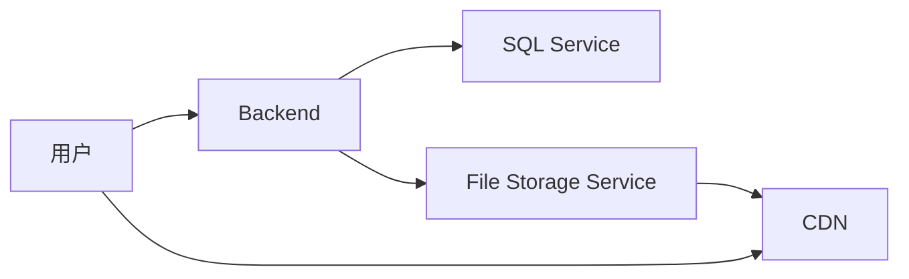
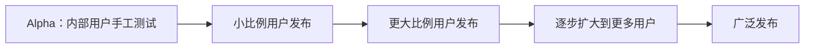
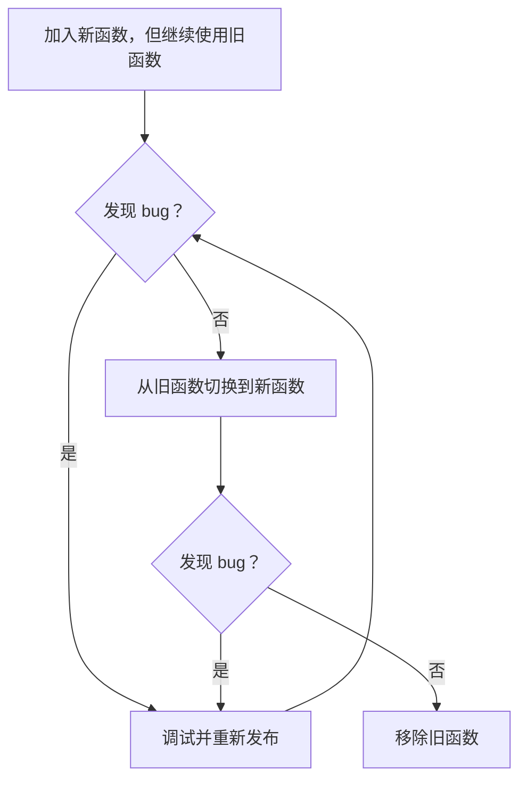
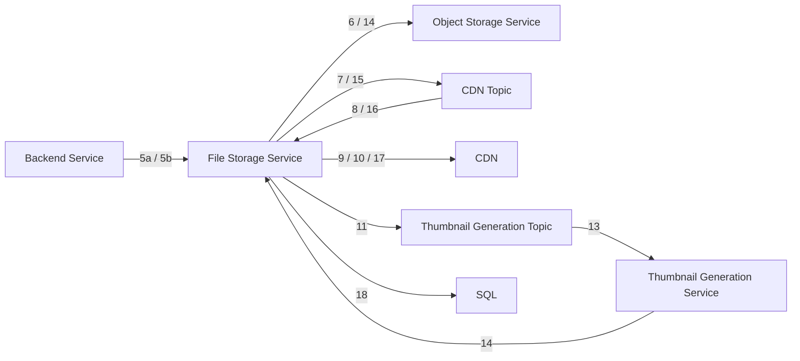
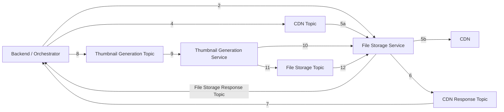

# 12 第 12 章：设计 Flickr（Design Flickr）

本章包括：

- 根据非功能需求选择存储服务
- 最小化对关键服务的访问
- 使用 saga 处理异步流程

本章我们设计一个类似 Flickr 的图片分享服务。除了分享文件/图片之外，用户还可以给文件以及其他用户追加元数据，例如访问控制、评论或收藏。

在几乎所有社交应用中，分享和互动图片与视频都是基础功能，也是常见的面试题目。本章中，我们讨论一个面向十亿用户（包括人工用户和程序化用户）的图片分享与互动分布式系统设计。我们将看到，这件事远不只是简单挂一个 CDN。我们还会讨论：在上传内容可供下载之前，系统如何为必须执行的预处理操作进行可扩展设计。

## 12.1 用户故事与功能需求

让我们和面试官讨论用户故事，并把它们随手记下来：

- 用户可以查看他人分享的照片。我们把这类用户称为查看者（viewer）。
- 我们的应用应生成并展示宽度为 50 px 的缩略图。用户应能以网格形式查看多张照片，并可一次选择一张查看其全分辨率版本。
- 用户可以上传照片。我们把这类用户称为分享者（sharer）。
- 分享者可以对其照片设置访问控制。我们可以问的一个问题是：访问控制应当作用于单张照片级别，还是分享者只能允许查看者查看其全部照片或完全不可见。为简化起见，我们选择后者。
- 一张照片有预定义的元数据字段，这些字段的值由分享者提供。示例字段包括位置或标签。
- 动态元数据的一个例子是：拥有该文件读取权限的查看者列表。之所以称其为动态元数据，是因为它可以被修改。
- 用户可以对照片发表评论。分享者可以开启或关闭评论功能。用户可以收到新评论通知。
- 用户可以收藏一张照片。
- 用户可以按照片标题和描述进行搜索。
- 照片可以通过程序方式下载。在本讨论中，“查看照片”和“下载照片”是同义的。我们不讨论一个较小的细节：用户是否可以把照片下载到设备存储中。
- 我们会简要讨论个性化。

以下几点我们不讨论：

- 用户可以按照片元数据筛选照片。这个需求可以通过简单的 SQL 路径参数满足，因此我们不展开。
- 由客户端记录的照片元数据，例如位置（来自 GPS 等硬件）、时间（来自设备时钟）以及相机细节（来自操作系统）。
- 我们不讨论视频。视频的很多细节讨论（例如编解码器）需要专门的领域知识，这超出了通用系统设计面试的范围。

## 12.2 非功能需求

以下是一些我们可以讨论的非功能需求问题：

- 我们预期会有多少用户，以及通过 API 的下载量有多大？
  - 我们的系统必须具备可扩展性。它应服务于分布在全球的一十亿用户。我们预期流量很大。假设 1% 的用户（1000 万）每天上传 10 张高分辨率（10 MB）图片。换算下来，每天上传量为 1 PB，10 年则是 3.65 EB。平均流量超过 1 GB/秒，但我们应预期流量尖峰，因此应按 10 GB/秒进行规划。
- 照片在上传后是否必须立即可用？删除是否需要立即生效？隐私设置变更是否必须立即生效？
  - 照片可以在几分钟后才对全部用户可用。为了更低成本，我们可以在某些非功能特性上做权衡，例如一致性或时延；评论也是如此。最终一致性是可接受的。
  - 隐私设置必须更快生效。被删除的照片不必在几分钟内从我们所有存储中彻底抹除；几个小时是可以接受的。但它应在几分钟内对所有用户不可访问。
- 高分辨率照片需要很高的网络速度，而这可能很昂贵。我们如何控制成本？
  - 经过讨论后，我们决定：用户一次只能下载一张高分辨率照片，但可以同时下载多张低分辨率缩略图。用户上传文件时，我们也可以一次只上传一个。

其他非功能需求包括：

- 高可用性，例如五个 9 的可用性。不应发生阻止用户下载或上传照片的故障。
- 高性能与低时延：缩略图下载的 P99 为 1 秒；高分辨率照片则不需要这一要求。
- 上传不需要高性能。

关于缩略图，需要说明的是，我们可以使用 CSS 的 `img` 标签及其 `width`（`https://developer.mozilla.org/en-US/docs/Web/HTML/Element/img#attr-width`）或 `height` 属性，从全分辨率图片显示出缩略图。移动应用中也有类似的标记标签。这种方式网络成本很高，且不可扩展。为了在客户端显示缩略图网格，每张图片都需要以全分辨率下载。我们可以向面试官建议在 MVP（minimum viable product，最小可行产品）中这样实现。当服务扩展到承载高流量时，我们可以考虑两种可能的缩略图生成方式。

第一种方式是：每当客户端请求缩略图时，由服务端基于全分辨率图片现时生成缩略图。如果生成缩略图的计算成本很低，这种方式也许可以扩展。然而，全分辨率图片文件大小通常是几十 MB。查看者通常会在一次请求中请求一个包含 >10 张缩略图的网格。假设一张全分辨率图片为 10 MB（实际上可能更大），这意味着服务端为了满足 1 秒 P99，需要在远小于 1 秒的时间内处理 >100 MB 数据。而且，查看者在滚动缩略图时，可能会在几秒内连续发出很多这样的请求。如果存储和处理都在同一台机器上完成，并且该机器使用 SSD 而不是机械硬盘，那么从计算上也许可行。但这种方法会昂贵到难以接受。此外，我们也无法把处理与存储进行功能分区，拆成独立服务。每秒在处理服务和存储服务之间传输许多 GB 数据所带来的网络时延，不可能满足 1 秒 P99。因此，这种方式总体上不可行。

唯一可扩展的方法是在文件上传后立刻生成并存储缩略图，并在查看者请求时直接提供这些缩略图。每张缩略图只有几 KB，因此存储成本很低。我们还可以在客户端缓存缩略图和全分辨率图片文件，这将在 12.7 节讨论。本章会讨论这种方案。

## 12.3 高层架构

图 12.1 展示了我们的初始高层架构。分享者和查看者都通过后端发起请求，以上传或下载图片文件。后端与 SQL 服务通信。



*图 12.1 图片分享服务的初始高层架构。用户可以直接从 CDN 下载图片文件。上传到 CDN 的过程可以先经由一个独立的分布式文件存储服务做缓冲。其他数据，例如用户信息或图片文件访问权限，则可以存储在 SQL 中。*

第一部分是用于存放图片文件和图片元数据的 CDN（每份图片元数据都是格式化后的 JSON 或 YAML 字符串）。这很可能是第三方服务。

由于以下原因，我们也可能需要一个独立的分布式文件存储服务，供分享者上传图片文件，并由这个服务负责与 CDN 交互。我们可以把它称为文件存储服务。

- 取决于与 CDN 提供商签订的 SLA，CDN 可能需要几小时才能把图片复制到其各个数据中心。在这段时间里，查看者下载这张图片可能会比较慢，尤其是在很多查看者都想下载它、请求速率很高的情况下。
- 把图片文件上传到 CDN 的时延，对分享者而言可能高得无法接受。我们的 CDN 也许无法同时支持很多分享者上传图片。我们可以按需扩展文件存储服务，以处理高上传/写入流量。
- 我们可以选择在文件上传到 CDN 之后，从文件存储服务中删除它；或者保留它作为备份。选择后者的一个可能原因是，我们不想完全信任 CDN 的 SLA，并希望在 CDN 发生故障时，把文件存储服务作为 CDN 的备份。CDN 也可能只保留文件数周或数月，之后将其删除，并在需要时再从指定的 origin/source 下载回来。另一种可能情况是：我们突然发现 CDN 存在安全问题，需要紧急将其断开。

## 12.4 SQL 模式

我们对会显示在客户端应用中的动态数据使用 SQL 数据库，例如哪些照片与哪些用户相关。我们可以定义如代码清单 12.1 所示的 SQL 表结构。`Image` 表包含图片元数据。我们可以为每个分享者分配自己的 CDN 目录，并用 `ImageDir` 表进行跟踪。模式说明已包含在 `CREATE` 语句中。

代码清单 12.1 `Image` 和 `ImageDir` 表的 SQL `CREATE` 语句

```sql
CREATE TABLE Image (
cdn_path VARCHAR(255) PRIMARY KEY COMMENT="Image file path on the
➥ CDN.",
cdn_photo_key VARCHAR(255) NOT NULL UNIQUE COMMENT="ID assigned by the
➥ CDN.",
file_key VARCHAR(255) NOT NULL UNIQUE COMMENT="ID assigned by our File
➥ Storage Service. We may not need this column if we delete the image from
➥ our File Storage Service after it is uploaded to the CDN.",
resolution ENUM(‘thumbnail’, ‘hd’) COMMENT="Indicates the image is a
➥ thumbnail or high resolution",
owner_id VARCHAR(255) NOT NULL COMMENT="ID of the user who owns the
➥ image.",
is_public BOOLEAN NOT NULL DEFAULT 1 COMMENT="Indicates if the image is
➥ public or private.",
INDEX thumbnail (Resolution, UserId) COMMENT="Composite index on the
➥ resolution and user ID so we can quickly find thumbnail or high
➥ resolution images that belong to a particular user."
) COMMENT="Image metadata.";

CREATE TABLE ImageDir (
cdn_dir VARCHAR(255) PRIMARY KEY COMMENT="CDN directory assigned to the
➥ user.",
user_id INTEGER NOT NULL COMMENT="User ID."
) COMMENT="Record the CDN directory assigned to each sharer.";
```

由于按用户 ID 和分辨率获取照片是常见查询，因此我们会按这些字段为表建立索引。我们可以遵循第 4 章讨论的方法来扩展 SQL 读操作。

我们还可以定义如下模式，用于允许分享者授予查看者查看其照片的权限，以及允许查看者收藏照片。除了使用两张表之外，另一种方案是在 `Share` 表中定义 `is_favorite` 布尔列，但其权衡是：它会成为一个稀疏列，浪费不必要的存储空间：

```sql
CREATE TABLE Share (
  id            INT PRIMARY KEY
  cdn_photo_key VARCHAR(255),
  user_id       VARCHAR(255)
);

CREATE TABLE Favorite (
  id INT PRIMARY KEY
  cdn_photo_key VARCHAR(255) NOT NULL UNIQUE,
  user_id VARCHAR(255) NOT NULL UNIQUE
);
```

## 12.5 在 CDN 上组织目录与文件

我们来讨论一种组织 CDN 目录的方法。一个目录层级可以是 user > album > resolution > file。我们也可以考虑日期，因为用户可能会对较新的文件更感兴趣。

每个用户都有自己的 CDN 目录。我们可以允许用户创建相册，每个相册包含 0 张或多张照片。相册到照片的映射是一对多；也就是说，每张照片只能属于一个相册。对于不在任何相册中的照片，我们可以在 CDN 上把它们放进一个名为 `default` 的相册。因此，一个用户目录可以有一个或多个相册目录。

一个相册目录可以存放该图片在多个分辨率下的多个文件，每种分辨率放在自己的目录中，同时还可以包含一个 JSON 图片元数据文件。例如，`original` 目录中可以放置原始上传文件 `swans.png`，而 `thumbnail` 目录中可以放置生成后的缩略图 `swans_thumbnail.png`。

`CdnPath` 值模板为 `<album_name>/<resolution>/<image_name.extension>`。用户 ID 或用户名不需要包含在其中，因为它已经在 `UserId` 字段中。

例如，用户名为 `alice` 的用户可以创建一个名为 `nature` 的相册，并在其中放入一张名为 `swans.png` 的图片。其 `CdnPath` 值为 `nature/original/swans.png`。对应缩略图的 `CdnPath` 为 `nature/thumbnail/swans_thumbnail.png`。在我们的 CDN 上执行 `tree` 命令会显示如下内容。`bob` 是另一位用户：

```text
$ tree ~ | head -n 8
.
├── alice
│  └── nature
│      ├── original
│      │   └── swans.png
│      └── thumbnail
│         └── swans_thumbnail.png
├── bob
```

在本章余下讨论中，我们交替使用“image”和“file”这两个术语。

## 12.6 上传照片

缩略图应当在客户端生成，还是在服务端生成？正如前言所说，我们应预期讨论多种方案，并评估它们之间的权衡。

### 12.6.1 在客户端生成缩略图

在客户端生成缩略图可以节省后端计算资源，而且缩略图很小，因此它对网络流量贡献极少。100 px 的缩略图大约为 40 KB，相比高分辨率照片的几 MB 到几十 MB，几乎可以忽略不计。

在上传流程开始前，客户端可以先检查该缩略图是否已经上传到 CDN。上传过程中会发生如下步骤，如图 12.2 所示：

1. 生成缩略图。
2. 将两个文件放入一个文件夹中，然后使用 Gzip 或 Brotli 之类的编码进行压缩。对几 MB 到几十 MB 的文件进行压缩，能够节省显著的网络流量，但我们的后端需要消耗 CPU 和内存资源来解压该目录。
3. 使用 `POST` 请求把压缩文件上传到我们的 CDN 目录。请求体是一个 JSON 字符串，用来描述正在上传的图片数量与分辨率。
4. 在 CDN 上，按需创建目录，解压缩文件，并把文件写入磁盘。然后将其复制到其他数据中心（参见下一个问题）。


*图 12.2 客户端向图片分享服务上传照片的流程*

> [!NOTE]
> 正如前言中暗示的那样，在面试中，我们并不被要求了解压缩算法、密码学安全哈希算法、认证算法、像素与 MB 的换算，或者 “thumbnail” 这个术语的细节。我们被要求的是：能够进行理性推导，并清晰表达。面试官期望我们能推理出：缩略图比高分辨率图片更小；压缩有助于在网络中传输大文件；而且对文件和用户都需要认证与授权。如果我们不知道 “thumbnail” 这个词，也可以使用清晰的说法，如“由许多小预览照片组成的网格”或“小网格照片”，并说明这里的“小”是指像素数量少，也就是文件尺寸小。

客户端生成的缺点

不过，客户端处理的缺点并不轻微。我们无法控制客户端设备，也不了解其环境的细节，这使得 bug 难以复现。与服务端相比，我们的代码还需要预判更多可能出现在客户端上的失败场景。例如，图片处理可能失败，因为客户端磁盘空间耗尽、其他应用占用了过多 CPU 或内存，或者网络连接突然中断。

我们无法控制许多发生在客户端上的情况。我们可能会在实现和测试中遗漏某些失败场景，而调试也更加困难，因为与我们拥有并具有管理员权限的服务端相比，更难复现客户端设备上的问题。

许多可能因素都会影响应用，例如以下这些，这也使得我们很难决定该记录什么日志：

- 在客户端生成意味着需要在每一种客户端类型（即浏览器、Android 和 iOS）中分别实现并维护缩略图生成逻辑。除非我们使用 Flutter、React Native 这类跨平台框架，否则每种客户端都会使用不同语言；而这些框架也自带它们自己的权衡。
- 硬件因素，例如 CPU 太慢或内存不足，可能会使缩略图生成慢到不可接受。
- 客户端运行的特定操作系统版本，可能存在 bug 或安全问题，导致在其上处理图片有风险，或引发极难预判或排查的问题。比如，如果操作系统在上传图片过程中突然崩溃，可能会上传损坏文件，这将影响查看者。
- 客户端上运行的其他软件可能占用过多 CPU 或内存，导致缩略图生成失败或慢到不可接受。客户端还可能运行恶意软件，例如干扰我们应用的病毒。我们无法切实检查客户端是否存在此类恶意软件，也无法确保客户端遵循安全最佳实践。
- 与上一点相关，我们可以在自己的系统上遵循安全最佳实践，以防御恶意活动，但我们几乎无法影响客户端是否同样这样做。正因如此，我们可能希望尽量减少客户端上的数据存储与处理，只在服务端存储和处理数据。
- 客户端的网络配置也可能干扰文件上传，例如被阻断的端口、主机，或可能存在的 VPN。
- 某些客户端的网络连接可能不可靠。我们可能需要逻辑来处理突然断网。例如，客户端在把生成好的缩略图上传到服务器之前，应先把它保存到设备存储中。如果上传失败，客户端在重试上传前就不需要再次生成缩略图。
- 仍然与上一点相关，设备存储空间可能不足以保存缩略图。在客户端实现中，我们需要记得在生成缩略图前检查是否有足够设备存储，否则分享者可能会经历较差的用户体验：等待缩略图生成完毕，随后却因存储不足而出错。
- 同样与这一点相关，客户端侧缩略图生成可能会使我们的应用需要更多权限，例如写本地存储的权限。有些用户可能不愿意授予我们的应用对设备存储的写权限。即使我们并不滥用该权限，外部或内部人员也可能攻破我们的系统，黑客随后可能通过我们的系统在用户设备上实施恶意活动。

一个现实问题是：每一个单独的问题也许只会影响少量用户，我们可能会决定不值得为这些少数用户投入资源去修复；但累积起来，这些问题可能会影响到我们潜在用户群中一个不可忽略的比例。

更繁琐且更漫长的软件发布生命周期

由于客户端侧处理具有更高的 bug 概率和更高的修复成本，我们在每次部署前都需要投入相当多的资源和时间去测试每一次软件迭代，这会减慢开发速度。我们无法像开发服务那样利用 CI/CD（continuous integration/continuous deployment，持续集成/持续部署）。我们需要采用如图 12.3 所示的软件发布生命周期。每个新版本都先由内部用户手工测试，然后逐步发布给越来越大比例的用户。我们无法快速发布和回滚小改动。由于发布缓慢而繁琐，每次发布通常会包含很多代码变更。



*图 12.3 软件发布生命周期示例。新版本在 Alpha 阶段由内部用户手工测试，随后在各后续阶段中逐步发布给越来越大比例的用户群体。一些公司的软件发布生命周期包含比这里展示更多的阶段。改编自 Heyinsun（`https://commons.wikimedia.org/w/index.php?curid=6818861`），CC BY 3.0（`https://creativecommons.org/licenses/by/3.0/deed.en`）。*

在一种发布/部署代码变更（无论是客户端还是服务端）都很慢的情况下，另一种防止新版本引入 bug 的方式是：在不移除旧代码的前提下加入新代码，方式如图 12.4 所示。这个例子假设我们在发布一个新函数，但这种做法可以泛化到一般的新代码：

1. 加入新函数。让新函数在与旧函数相同的输入上运行，但继续使用旧函数的输出，而不是新函数的输出。把新函数的使用位置包裹在 `try-catch` 语句中，这样异常不会导致应用崩溃。在 `catch` 语句中，记录异常并把日志发送到日志服务，以便我们排障和调试。
2. 调试该函数，并不断发布新版本，直到不再观察到 bug。
3. 将代码从使用旧函数切换到使用新函数。同样使用 `try catch` 包裹；在 `catch` 语句中记录异常，并回退使用旧函数作为备份。发布这一版本并观察是否有问题。如果观察到问题，就切回旧函数（即回到上一步）。
4. 当我们确信新函数已经足够成熟（我们永远无法确定它绝对没有 bug）时，从代码中移除旧函数。这样清理是为了代码可读性和可维护性。



*图 12.4 一种分阶段发布新代码的软件发布流程图，只有在逐步确认后才会移除旧代码。*

这种做法的一个限制是，很难引入不向后兼容的代码。另一个缺点是代码库会更大、可维护性更差。此外，我们的开发团队需要有纪律坚持把这个流程完整执行下去，而不是被诱惑去跳过步骤，或忽略最后一步。

这种方式还会在客户端消耗更多计算资源与能源，这对移动设备而言可能是重要问题。

最后，这些额外代码会增加客户端应用的体积。对于少量函数而言，这种影响微不足道；但如果大量逻辑都需要这样的保护措施，影响就会逐渐累积。

### 12.6.2 在后端生成缩略图

我们刚刚讨论了在客户端生成缩略图的权衡。在服务端生成需要更多硬件资源，以及额外的工程投入来创建和维护这个后端服务，但该服务可以与其他服务使用相同的语言和工具。我们可能会决定：前者的成本大于后者。

本节讨论在后端生成缩略图的过程。主要有三个步骤：

1. 在上传文件前，先检查该文件是否已经上传过。这样可以防止代价高昂且没有必要的重复上传。
2. 将文件上传到文件存储服务和 CDN。
3. 生成缩略图，并将其上传到文件存储服务和 CDN。

当文件被上传到后端时，后端会先把文件写入文件存储服务和 CDN，然后触发一个流处理作业来生成缩略图。文件存储服务的主要目的是作为上传到 CDN 之前的缓冲层，因此我们可以只在数据中心内各主机之间实现复制，而不在其他数据中心之间复制。如果发生严重数据中心故障并伴随数据丢失，我们也可以用 CDN 中的文件执行恢复操作。文件存储服务和 CDN 可以互为备份。

为了支持可扩展的图片文件上传，其中部分上传步骤可以是异步的，因此我们可以采用 saga 方法。关于 saga 的介绍可参见 5.6 节。

编排式（choreography）saga 方法

图 12.5 展示了这个编排式 saga 中的各类服务与 Kafka topic。详细步骤如下。图中的箭头编号也对应这些步骤：

1. 用户先对图片做哈希，然后向后端发起一个 `GET` 请求，检查该图片是否已经上传过。之所以会发生这种情况，是因为用户可能在之前的某次请求中已经成功上传了图片，但在文件存储服务或后端返回成功响应时连接失败，因此用户可能正在重试上传。
2. 我们的后端把该请求转发给文件存储服务。
3. 文件存储服务返回响应，指出该文件是否已经成功上传过。
4. 后端把这个响应返回给用户。
5. 这一步取决于该文件此前是否已经成功上传。
   a. 如果这份文件此前没有成功上传过，用户就经由后端把该文件上传到文件存储服务。（用户也可能在上传前先压缩该文件。）
   b. 另一种情况是，如果该文件此前已经成功上传过，我们的后端可以向 Kafka topic 产出一个缩略图生成事件。我们可以直接跳到第 8 步。
6. 文件存储服务把文件写入对象存储服务。
7. 在成功写入文件之后，文件存储服务向 CDN Kafka topic 产出一个事件，然后经由后端向用户返回成功响应。
8. 文件存储服务消费来自第 6 步的事件，其中包含图片哈希。
9. 与第 1 步类似，文件存储服务使用图片哈希向 CDN 发起请求，以判断该图片是否已经上传到 CDN。这种情况可能发生：文件存储服务中的某台主机此前已经把图片文件上传到 CDN，但在把相关检查点写入 CDN topic 之前就失败了。
10. 文件存储服务把文件上传到 CDN。这一步是异步进行的，并且独立于上传到文件存储服务，因此即使上传到 CDN 很慢，也不会影响用户体验。
11. 文件存储服务向缩略图生成 Kafka topic 产出一个包含文件 ID 的缩略图生成事件，并从 Kafka 服务接收成功响应。
12. 后端向用户返回成功响应，表示其图片文件已成功上传。只有在缩略图生成事件成功产出之后，后端才返回这个响应，以确保该事件确实被产出，而这又是确保后续缩略图生成会发生的必要条件。如果向 Kafka 产出事件失败，用户将收到 `504 Timeout` 响应。用户可以从第 1 步重新开始这一过程。如果我们多次向 Kafka 产出同一个事件会怎样？Kafka 的 exactly once 保证确保这不会成为问题。
13. 缩略图生成服务从 Kafka 消费该事件，开始生成缩略图。
14. 缩略图生成服务从文件存储服务获取文件，生成缩略图，并经由文件存储服务把生成结果缩略图写入对象存储服务。

为什么缩略图生成服务不直接写入 CDN？

- 缩略图生成服务应当是一个自包含服务：接收生成缩略图的请求、从文件存储服务拉取文件、生成缩略图，并把结果缩略图写回文件存储服务。若直接写入 CDN 这类其他目的地，会引入额外复杂度。比如，如果 CDN 当前负载很高，缩略图生成服务就必须周期性检查 CDN 是否准备好接收文件，同时还要确保自身在此期间不会耗尽存储。如果把写入 CDN 的职责交给文件存储服务，设计会更简单，也更易维护。
- 每增加一个被允许写入 CDN 的服务或主机，都会增加额外的安全维护开销。通过不让缩略图生成服务访问 CDN，我们缩小了攻击面。

15. 缩略图生成服务向 CDN topic 写入一个 `ThumbnailCdnRequest`，请求文件存储服务把缩略图写入 CDN。
16. 文件存储服务从 CDN topic 消费该事件，并从对象存储服务获取缩略图。
17. 文件存储服务把缩略图写入 CDN。CDN 返回该文件的 key。
18. 文件存储服务把这个 key 插入到保存 user ID 到 key 映射关系的 SQL 表中（如果该 key 尚不存在）。注意第 16–18 步是阻塞的。如果文件存储服务主机在这个插入步骤中发生故障，其替代主机会从第 16 步重新执行。缩略图尺寸只有几 KB，因此这种重试带来的计算资源和网络开销都微不足道。
19. 取决于 CDN 多快能提供这些（高分辨率和缩略图）图片文件，我们可以立即从文件存储服务中删除这些文件，或者实现一个周期性批处理 ETL 作业，删除一小时前创建的文件。这样的作业也可以向 CDN 查询，以确认文件已复制到多个数据中心，然后再从文件存储服务中删除，但这可能属于过度设计。文件存储服务可以保留文件哈希，以便响应“该文件是否之前已上传”的检查请求。我们还可以实现一个批处理 ETL 作业，删除一小时前创建的哈希。



*图 12.5 从第 5a 步开始的缩略图生成编排。箭头表示正文中描述的步骤编号。为简洁起见，图中未画出用户。文件存储服务向 Kafka topics 生产和消费的一些事件，是为了通知其在对象存储服务与 CDN 之间传输图片文件。还存在用于触发缩略图生成，以及把 CDN 元数据写入 SQL 服务的事件。*

**识别事务类型**

哪些是可补偿事务（compensable transactions）、枢轴事务（pivot transaction）和可重试事务（retriable transactions）？

第 11 步之前的步骤都属于可补偿事务，因为我们尚未向用户发送上传成功的确认响应。第 11 步是枢轴事务，因为在这之后我们会向用户确认上传成功，因此无需回滚。第 12–16 步是可重试事务。我们拥有持续重试这些（缩略图生成）事务所需的（图片文件）数据，因此它们保证能够成功。

如果我们不只是要生成一张缩略图和一份原始分辨率版本，而是希望生成多张不同分辨率的图片，那么两种方案之间的权衡会更加明显。

如果我们使用 FTP 而不是 HTTP `POST` 或 RPC 来上传照片，会怎样？FTP 会先写磁盘，因此任何后续处理都需要再消耗时延和 CPU 资源，把它从磁盘读入内存。如果我们上传的是压缩文件，要解压它，首先就得把它从磁盘加载到内存。如果我们使用的是 `POST` 请求或 RPC，这一步就完全不需要。

文件存储服务的上传速度会限制缩略图生成请求的速率。如果文件存储服务上传文件的速度快于缩略图生成服务生成并上传缩略图的速度，Kafka topic 就能防止缩略图生成服务被请求压垮。

编排式（orchestration）saga 方法

我们也可以把文件上传和缩略图生成过程实现为一个 orchestration saga。我们的后端服务就是编排器。参考图 12.6，缩略图生成 orchestration saga 的步骤如下：

1. 第一步与 choreography 方法相同。客户端向后端发起 `GET` 请求，检查该图片是否已经上传过。
2. 我们的后端服务经由文件存储服务，把文件上传到对象存储服务（图 12.6 中未展示）。文件存储服务向文件存储响应 topic 产出一个事件，表示上传成功。
3. 我们的后端服务消费来自文件存储响应 topic 的事件。
4. 我们的后端服务向 CDN topic 产出一个事件，请求把文件上传到 CDN。
5. （a）文件存储服务从 CDN topic 消费；（b）将文件上传到 CDN。这一步与上传到对象存储服务分离，因此如果上传 CDN 失败，重复该步骤并不会导致对象存储服务上的重复上传。一种更符合 orchestration 的做法是：由后端服务从文件存储服务下载文件，再将其上传到 CDN。我们可以选择始终坚持 orchestration，或者在这里偏离它，以避免文件在三个服务之间来回移动。请记住，如果我们选择这种偏离，就需要把文件存储服务配置为能够向 CDN 发起请求。
6. 文件存储服务向 CDN 响应 topic 产出一个事件，表示文件已成功上传到 CDN。
7. 我们的后端服务从 CDN 响应 topic 消费。
8. 我们的后端服务向缩略图生成 topic 产出事件，请求缩略图生成服务基于已上传图片生成缩略图。
9. 缩略图生成服务从缩略图生成 topic 消费。
10. 缩略图生成服务从文件存储服务拉取文件，生成缩略图，并将其写入文件存储服务。
11. 缩略图生成服务向文件存储 topic 产出一个事件，表示缩略图生成成功。
12. 文件存储服务从文件存储 topic 消费该事件，并把缩略图上传到 CDN。第 4 步中关于 orchestration 与网络流量之间的同样讨论，在这里也同样适用。



*图 12.6 从第 2 步开始的缩略图生成编排。图 12.5 中展示了对象存储服务；为简洁起见，这里省略。为清晰起见，这里也没有画出用户。*

### 12.6.3 同时实现服务端和客户端生成

我们可以同时实现服务端和客户端侧的缩略图生成。首先实现服务端生成，这样我们就能为任何客户端生成缩略图。然后再针对每一种客户端类型实现客户端生成，从而获得客户端生成的好处。客户端可以先尝试自行生成缩略图；如果失败，再由服务端生成。采用这种方式，客户端生成的初始实现就不必考虑所有可能的失败场景，我们可以选择迭代式地改进客户端生成能力。

这种方式比仅做服务端生成更复杂、成本更高，但也可能比仅做客户端生成更便宜、更容易，因为客户端生成有服务端生成兜底，所以客户端 bug 和崩溃的代价会更低。我们可以给客户端附加版本号，客户端在请求中带上这些版本号。如果我们发现某个特定版本存在 bug，就可以把服务端配置为：对这些客户端发出的所有请求都执行服务端生成。

我们可以修复这些 bug，提供新的客户端版本，并通知受影响用户更新客户端。即使部分用户不执行更新，也不是严重问题，因为我们可以在服务端完成这些操作，而这些客户端设备会逐渐老化，最终停止使用。

## 12.7 下载图片和数据

图片与缩略图已经上传到 CDN，因此它们已经可供查看者使用。查看者请求获取某个分享者的缩略图时，流程如下：

1. 查询 `Share` 表，获取允许该查看者查看其图片的分享者列表。
2. 查询 `Image` 表，获取该用户所有缩略图分辨率图片的 `CdnPath` 值。返回这些 `CdnPath` 值，以及一个用于从 CDN 读取的临时 OAuth2 token。
3. 客户端随后可以从 CDN 下载这些缩略图。为确保客户端已获授权下载请求文件，我们的 CDN 可以使用 13.3 节将详细介绍的 token 授权机制。

动态内容可能会被更新或删除，因此我们把它们存储在 SQL 中，而不是存储在 CDN 上。这包括照片评论、用户资料信息和用户设置。我们可以对热门缩略图和热门全分辨率图片使用 Redis 缓存。当查看者收藏一张图片时，我们可以利用图片不可变的特性，如果客户端有足够存储空间，就把缩略图和全分辨率图片都缓存在客户端上。这样，查看者请求查看其收藏图片网格时，将不消耗任何服务端资源，而且响应也会是瞬时的。

出于面试目的，如果我们不允许使用现成的 CDN，那么这个面试题就会变成“如何设计一个 CDN”，这会在下一章讨论。

### 12.7.1 下载按页分页的缩略图

考虑这样一种用例：用户一次查看一页缩略图，每页大约 10 张。第 1 页包含缩略图 1–10，第 2 页包含缩略图 11–20，以此类推。如果当用户位于第 1 页时，有一张新缩略图（记作缩略图 0）准备好了，那么当用户切换到第 2 页时，我们如何确保用户请求下载第 2 页时，返回的仍是缩略图 11–20，而不是 10–19？

一种技术是给分页加版本，例如 `GET thumbnails?page=<page>&page_version=<page_version>`。如果省略 `page_version`，后端可以默认替换为最新版本。这个请求的响应应包含 `page_version`，这样用户就可以在后续请求中继续使用相同的 `page_version` 值。这种方式下，用户可以平滑地翻页。当用户返回第 1 页时，可以省略 `page_version`，此时会展示最新的第 1 页缩略图。

不过，这种技术只在缩略图是从列表开头插入或删除时有效。如果在用户翻页的过程中，缩略图是在其他位置被加入或删除，那么用户将看不到新增的缩略图，或继续看到已删除的缩略图。更好的方法是让客户端把当前第一页元素或最后一项传给后端。如果用户向前翻页，就使用 `GET thumbnails?previous_last=<last_item>`。如果用户向后翻页，就使用 `GET thumbnails?previous_first=<first_item>`。至于为什么如此，这里留给读者作为一个简单练习。

## 12.8 监控与告警

除 2.5 节中讨论的内容外，我们还应监控并告警文件上传、文件下载，以及对 SQL 数据库的请求。

## 12.9 一些其他服务

我们还可以讨论许多其他服务，不分优先级顺序，包括广告和高级功能等变现方式、支付、审查、个性化等。

### 12.9.1 高级功能

我们的图片分享服务可以提供免费层，包含迄今讨论的全部功能。我们可以向分享者提供如下高级功能。

分享者可以声明其照片受版权保护，查看者若要下载其全分辨率照片并在其他地方使用，则必须付费。我们可以设计一个让分享者向其他用户出售其照片的系统。我们需要记录销售情况，并跟踪照片所有权。我们还可以向卖家提供销售指标、仪表盘和分析功能，帮助他们做出更好的商业决策。我们也可以提供推荐系统，向卖家推荐应出售何种类型的照片，以及如何定价。所有这些功能都可以是免费的，也可以是付费的。

我们可以为免费账户提供最多 1,000 张照片的免费额度，并为各种订阅方案提供更大的额度。我们还需要为这些高级功能设计用量统计与计费服务。

### 12.9.2 支付与税务服务

高级功能需要支付服务和税务服务，用于管理交易以及向用户付款和从用户收款。正如 15.1 节中讨论的那样，支付是非常复杂的话题，通常不会在系统设计面试中被问到。面试官可能会把它作为挑战题提出。税务也有同样的问题。税种可能很多，例如销售税、所得税和企业税。每一种税都可能包含很多组成部分，例如国家、州、省、郡和城市税。还可能存在关于收入水平、特定产品或行业的免税规则。税率也可能是累进的。我们可能还需要为照片买卖发生地提供相关的商业税表与所得税表。

### 12.9.3 审查/内容审核

审查（也常被称为内容审核）在任何用户彼此分享数据的应用中都很重要。无论内容是公开的，还是只共享给特定查看者，我们都有道德上的责任（而且在很多情况下还有法律上的责任）去监管我们的应用，并移除不适当或冒犯性的内容。

我们将需要设计一套内容审核系统。内容审核既可以人工进行，也可以自动进行。人工方法包括：允许查看者举报不当内容，以及允许运营人员查看并删除这些内容。我们也可能希望实现启发式方法或机器学习方法来做内容审核。我们的系统还必须提供管理功能，例如警告或封禁分享者，并使运营人员能方便地与当地执法机构协作。

### 12.9.4 广告

我们的客户端可以向用户展示广告。常见做法是把第三方广告 SDK 接入客户端。这类 SDK 由广告网络提供（例如 Google Ads）。广告网络会向广告主（也就是我们）提供一个控制台，用于选择我们偏好的广告类别，或者不希望展示的广告类别。例如，我们可能不想展示成人广告，或者竞争对手公司的广告。

另一种可能是：在我们的客户端内部，为分享者设计一个展示广告的系统。分享者可能希望在我们的客户端内部投放广告，以提升其照片销售。我们的应用有一个使用场景：查看者搜索可购买并用于自身目的的照片。当查看者加载应用首页时，首页可以展示推荐照片，而分享者可以付费让他们的照片出现在首页。我们也可以在查看者搜索照片时展示“赞助”搜索结果。

我们还可以向用户提供付费订阅套餐，以换取无广告体验。

### 12.9.5 个性化

当我们的服务扩展到大量用户时，我们会希望提供个性化体验，以满足广泛用户群体的需求并提高收入。基于用户在应用内的行为，以及从其他来源获得的用户数据，用户可以收到个性化广告、个性化搜索结果和内容推荐。

数据科学与机器学习算法通常超出系统设计面试的范围，讨论重点会放在如何设计实验平台：把用户划分到不同实验组，让每组用户由不同的机器学习模型服务，收集并分析结果，并把成功模型推广到更广泛的用户群体。

## 12.10 其他可能的讨论话题

其他可能的讨论话题包括以下内容：

- 我们可以基于照片元数据（例如标题、描述和标签）建立 Elasticsearch 索引。当用户提交搜索查询时，搜索可以对标签以及标题和描述进行模糊匹配。关于如何创建 Elasticsearch 集群，可参见 2.6.3 节。
- 我们讨论了分享者如何向查看者授予其图片的查看权限。我们还可以进一步讨论更细粒度的图片访问控制，例如单张图片级别的访问控制、下载不同分辨率图片的权限，或者允许查看者把图片分享给有限数量其他查看者的权限。我们也可以讨论用户资料的访问控制。用户可以允许任何人查看其资料，也可以逐个授权。私密资料应被排除在搜索结果之外。
- 我们可以讨论更多组织照片的方式。例如，分享者可以把照片加入群组。一个群组可以包含来自多个分享者的照片。用户可能需要成为群组成员，才能查看和/或向其中分享照片。群组还可以有管理员用户，他们可以向群组添加和移除用户。我们还可以讨论多种打包和出售照片集合的方式，以及相关的系统设计。
- 我们可以讨论版权管理与水印系统。用户可以为每张照片指定特定版权许可。我们的系统可以给照片附加不可见水印，也可以在用户之间交易时附加额外水印。这些水印可用于跟踪所有权和版权侵权。
- 这个系统上的用户数据（图片文件）既敏感又有价值。我们可以讨论可能的数据丢失、预防与缓解。这包括安全入侵和数据窃取。
- 我们可以讨论控制存储成本的策略。例如，我们可以针对旧文件与新文件，或热门图片与其他图片，使用不同的存储系统。
- 我们可以创建用于分析的批处理管道。一个例子是：计算最热门照片，或按小时、天、月统计上传照片数量的管道。此类管道会在第 17 章讨论。
- 用户可以关注其他用户，并在对方发布新照片和/或新评论时收到通知。
- 我们可以把系统扩展为支持音频和视频流。关于视频流的讨论需要领域专门知识，而通用系统设计面试并不要求这种知识，因此这个话题可能会出现在需要该专长的特定岗位面试中，或者作为探索题/挑战题被提出。

## Summary

- 文件或图片分享服务需要可扩展性、可用性和高下载性能。不需要高上传性能，也不需要强一致性。
- 哪些服务被允许写入我们的 CDN？应将 CDN 用于静态数据，但要保护并限制像 CDN 这类敏感服务的写访问权限。
- 哪些处理操作应放在客户端，哪些应放在服务端？一个考虑因素是：在客户端处理可以节省公司硬件资源和成本，但也可能由于复杂性而显著增加额外成本。
- 客户端侧和服务端侧各有其权衡。在可能的情况下，通常优先选择服务端侧，因为开发和升级更容易。两者都做，则可以同时获得客户端侧较低计算成本和服务端侧较高可靠性。
- 哪些流程可以异步化？对这些流程使用 saga 等技术，可以提升可扩展性并降低硬件成本。
