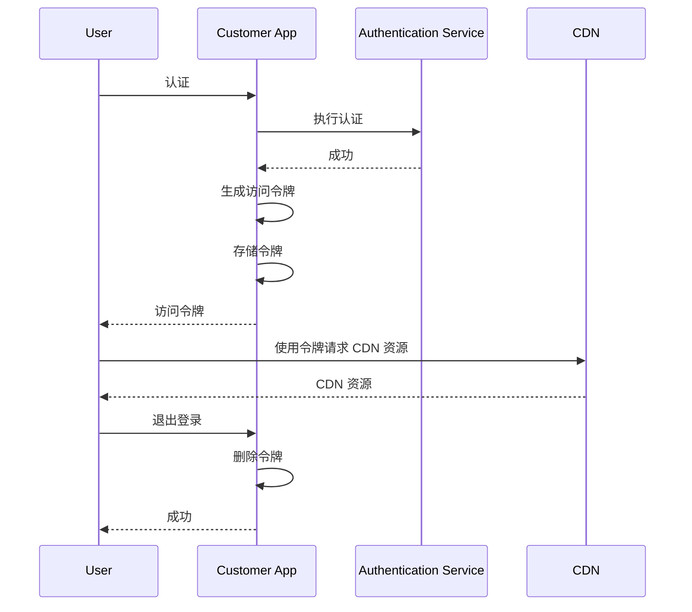
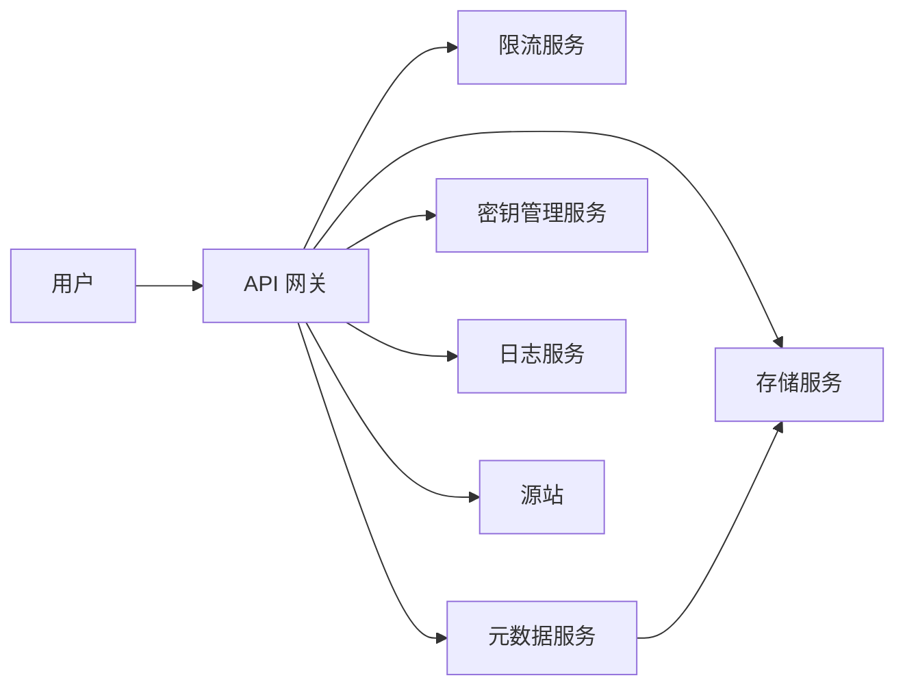
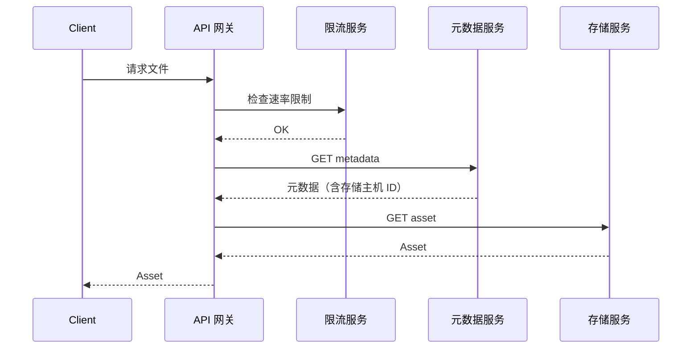
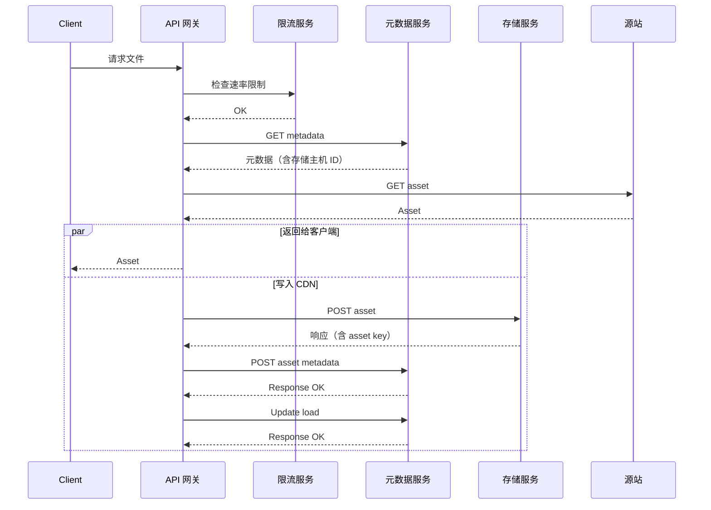
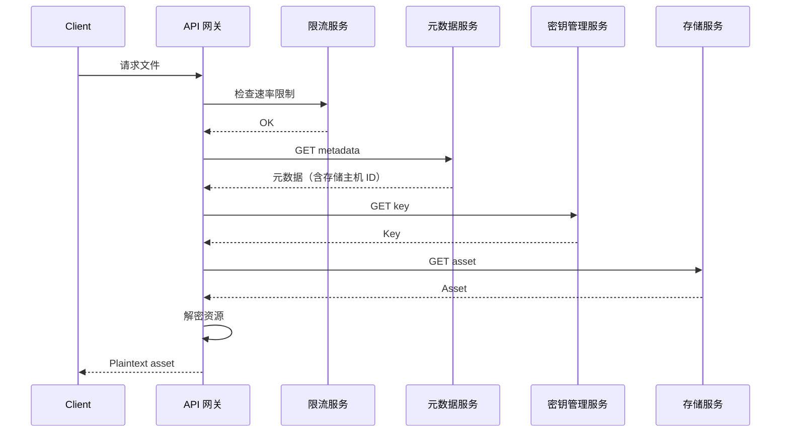
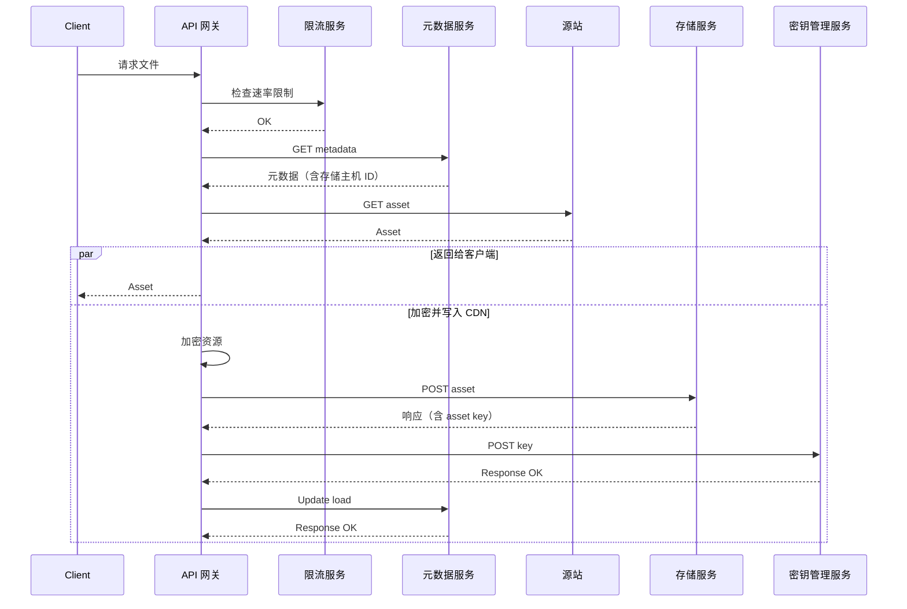
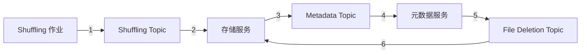
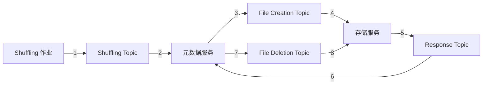

# 13 第 13 章：设计内容分发网络（Design a Content Distribution Network）

本章包括：

- 讨论 CDN 的优点、缺点与意外情况
- 用前端元数据存储架构满足用户请求
- 设计一个基础的分布式存储系统

CDN（Content Distribution Network，内容分发网络）是一种具有成本效益、按地理位置分布的文件存储服务。它被设计为在多个数据中心之间复制文件，从而能够快速向大量地理分散的用户提供静态内容，并让每个用户都从能最快服务其请求的数据中心获取内容。它还有一些次要收益，例如容错：如果某个数据中心不可用，用户仍可由其他数据中心提供服务。下面我们讨论一个 CDN 设计，我们将其命名为 CDNService。

## 13.1 CDN 的优点与缺点

在讨论 CDN 的需求和系统设计之前，我们先讨论使用 CDN 的优点与缺点，这有助于我们理解后续需求。

### 13.1.1 使用 CDN 的优点

如果我们的公司把服务部署在多个数据中心，那么我们很可能已经拥有一个在这些数据中心之间复制的共享对象存储，用来提供冗余和可用性。这个共享对象存储已经具备 CDN 的许多好处。如果我们的用户群在地理上高度分散，并且能够从 CDN 广泛分布的数据中心网络中获益，我们就会考虑使用 CDN。

在 1.4.4 节中已经讨论过考虑使用 CDN 的原因，这里重复其中一些：

- **更低的延迟**——用户由附近的数据中心提供服务，因此延迟更低。若不使用第三方 CDN，我们就需要自己把服务部署到多个数据中心，这会带来相当大的复杂性，例如为保证可用性而进行监控。更低的延迟还可能带来其他收益，例如提升 SEO（search engine optimization，搜索引擎优化）。搜索引擎往往会直接或间接惩罚加载缓慢的网页。一个间接惩罚的例子是：如果网站加载过慢，用户可能会离开该网站；这类网站可被描述为跳出率高，而搜索引擎会惩罚跳出率高的网站。
- **可扩展性**——如果使用第三方提供商，我们就不需要自己扩展系统；第三方会负责扩展性。
- **更低的单位成本**——第三方 CDN 通常提供批量折扣，因此随着我们服务更多用户、承载更高负载，单位成本会更低。它之所以能提供更低成本，是因为它为很多公司提供流量服务，从而具备规模经济，并能把硬件和合适技术人员的成本分摊到更大的业务体量上。多个公司的硬件与网络需求波动还能相互平滑，从而比只服务单一公司时更稳定。
- **更高的吞吐量**——CDN 为我们的服务提供额外的主机，因此我们能够服务更多并发用户和更高流量。
- **更高的可用性**——这些额外主机可以在我们的服务主机故障时作为回退，尤其是当 CDN 能履行其 SLA 时更是如此。跨多个数据中心的地理分布也有利于可用性，因为导致单个数据中心中断的灾难不会影响远处的其他数据中心。此外，单个数据中心出现意外流量高峰时，还可以把流量重定向并分摊到其他数据中心。

### 13.1.2 使用 CDN 的缺点

很多资料会讨论 CDN 的优点，但很少也讨论其缺点。工程师成熟度的一个面试信号，是其是否有能力讨论并评估任何技术决策中的权衡，并预判其他工程师会提出的挑战。面试官几乎总会质疑你的设计决策，并探查你是否考虑过各种非功能性需求。使用 CDN 的一些缺点包括：

- 在系统中引入另一个服务所带来的额外复杂性。这些复杂性的例子包括：
  - 额外的一次 DNS 查询
  - 额外的一个故障点
- 对于低流量场景，CDN 的单位成本可能很高。还可能存在隐藏成本，例如按 GB 计费的数据传输成本，因为 CDN 可能会使用第三方网络。
- 迁移到另一个 CDN 可能耗时数月且成本高昂。迁移到其他 CDN 的原因包括：
  - 某个 CDN 可能没有在靠近我们用户的地方部署主机。如果我们在该 CDN 未覆盖的地区获得了大量用户，就可能需要迁移到更合适的 CDN。
  - 某家 CDN 公司可能倒闭。
  - 某家 CDN 公司可能提供很差的服务，例如未履行 SLA，进而影响我们的用户；客户支持很差；或者发生数据丢失、安全泄露等事故。
- 某些国家或组织可能会封锁某些 CDN 的 IP 地址。
- 把数据存储在第三方上，可能带来安全与隐私方面的顾虑。我们可以实现静态加密（encryption at rest），使 CDN 无法查看我们的数据，但这会带来额外成本和延迟（加密与解密都会产生开销）。设计与实现必须由合格的安全工程师完成或审核，这会给团队带来额外成本与沟通开销。
- 另一个潜在的安全问题是，JavaScript 库中可能被插入恶意代码，而我们无法亲自确保这些远程托管库的安全性与完整性。
- 允许第三方来保证高可用性的另一面，是如果 CDN 出现技术问题，我们并不知道它多久才能修复。任何服务降级都可能影响我们的客户，而与外部公司沟通的开销也可能高于公司内部沟通。CDN 公司可能会提供 SLA，但我们无法确信它一定会被履行，而正如前面所说，迁移到另一个 CDN 的成本又很高。此外，我们自己的 SLA 也会依赖第三方。
- CDN，或更一般地说任何第三方工具/服务的配置管理，对某些用例来说可能缺乏足够的可定制性，从而引发意外问题。下一节给出一个示例。

### 13.1.3 使用 CDN 提供图片时的一个意外问题示例

本节讨论一个使用 CDN，或更一般地说使用第三方工具或服务时，可能出现的意外问题。

CDN 可能会读取 GET 请求中的 User-Agent（https://developer.mozilla.org/en-US/docs/Web/HTTP/Headers/User-Agent）头，以判断请求是否来自 Web 浏览器；若是，就返回 WebP（https://developers.google.com/speed/webp）格式的图片，而不是上传时的原始格式（如 PNG 或 JPEG）。在某些服务中，这样做很理想；但对于另一些希望图片以原始格式返回的浏览器应用来说，有三种选择：

1. 在我们的 Web 应用中覆盖 User-Agent 头。
2. 把 CDN 配置为：某些服务返回 WebP 图片，而其他服务返回原始格式图片。
3. 让请求经过一个后端服务。

关于方案 1，截至本书出版时，Chrome 浏览器不允许应用覆盖 User-Agent 头，而 Firefox 允许（参见 https://bugs.chromium.org/p/chromium/issues/detail?id=571722、https://bugzilla.mozilla.org/show_bug.cgi?id=1188932 和 https://stackoverflow.com/a/42815264）。方案 1 会把我们的用户限制在特定浏览器上，这可能不可行。

关于方案 2，CDN 可能并不提供按单个服务自定义这一设置的能力。它可能只允许对我们全部服务统一打开或关闭“以 WebP 格式提供图片”的设置。即使它确实支持这种细粒度配置，公司中负责管理 CDN 配置的基础设施团队，也可能无力或无意为各个服务单独设置。在大公司中，这个问题可能更常见。

方案 3 要求开发者仅仅为了从 CDN 获取原始图片，就额外暴露一个 API 端点。这个方案最好避免，因为它抵消了 CDN 的大部分收益。它增加了额外延迟与复杂性（包括文档和维护开销）。后端主机可能离用户很远，因此用户失去了 CDN 就近服务的好处。这个后端服务还必须随着图片请求量扩展；如果图片请求率很高，那么 CDN 和后端服务都要扩容。与其采用该方案，不如把文件存储在一个更便宜的对象存储中，而该对象存储的主机与后端服务位于同一个数据中心。不幸的是，我亲眼见过大公司采用这种“方案”，因为应用和 CDN 由不同团队负责，而管理层又无意促进它们之间的协作。

## 13.2 需求

功能需求很简单：经授权的用户应能够创建目录、上传文件（文件大小上限 10 GB），以及下载文件。

> [!NOTE]
> 我们不讨论内容审核。内容审核在任何“用户能看到他人创建内容”的应用中都是必不可少的。这里我们假设，它由使用我们 CDN 的组织负责，而不是由提供 CDN 的公司负责。

大多数非功能需求，正是 CDN 的优点：

- **可扩展**——CDN 可以扩展到支持 PB 级存储，以及每天 TB 级的下载量。
- **高可用**——要求达到四个 9 或五个 9 的可用性。
- **高性能**——文件应当从能最快服务请求者的数据中心下载。不过，同步需要时间，因此只要文件在同步完成前至少在一个数据中心可用，上传性能的重要性就低一些。
- **持久性**——文件不能损坏。
- **安全与隐私**——CDN 需要对外部数据中心的目的地提供请求服务并发送文件。文件只能被授权用户上传和下载。

## 13.3 CDN 认证与授权

如附录 B 所述，认证（authentication）的目的，是验证用户身份；授权（authorization）的目的，则是确保访问资源（例如我们 CDN 中某个文件）的用户确实拥有访问权限。这些措施可以防止 hotlinking，也就是某个网站或服务未经许可访问 CDN 资源。这样会让我们的 CDN 承担服务这些用户的成本，却得不到报酬；而未经授权访问文件或数据，也可能构成版权侵犯。

> [!TIP]
> 如需认证与授权的入门介绍，请参见附录 B。

CDN 的认证与授权既可以用基于 Cookie 的认证，也可以用基于 Token 的认证。正如 B.4 节所讨论的，基于 Token 的认证占用更少内存、可以借助具有更多安全专业能力的第三方服务，并且支持更细粒度的访问控制。除此之外，对于我们的 CDN，Token 认证还允许把请求方限制在允许的 IP 地址范围或特定用户账号之内。

本节讨论一种典型的 CDN 认证与授权实现方式。后续各节会讨论一个在面试中可以展开的 CDN 系统设计，并包括在该设计中如何完成这一认证与授权过程。

### 13.3.1 CDN 认证与授权的步骤

在本讨论中，我们把 CDN 客户（customer）称为：向 CDN 上传资源，然后再把自己的用户/客户端引导到 CDN 的站点或服务。我们把 CDN 用户（user）称为：从 CDN 下载资源的客户端。

CDN 会向每位客户发放一个 secret key，并提供一个 SDK 或库，用于根据如下信息生成访问令牌。参见图 13.1，访问令牌生成过程如下：

1. 用户向客户应用发送认证请求。客户应用可以使用认证服务完成认证。（认证机制本身的细节与 CDN 访问令牌生成过程无关。关于各种认证协议，例如 Simple Login 和 OpenID Connect，可参见附录 B。）
2. 客户应用使用 SDK 生成访问令牌，输入包括：
   1. **Secret key**——客户的 secret key。
   2. **CDN URL**——生成的访问令牌所适用的 CDN URL。
   3. **Expiry**——访问令牌的过期时间戳；过期之后，用户需要新的访问令牌。当用户携带过期令牌访问 CDN 时，CDN 可以返回一个 302 响应，将用户重定向到客户侧。客户生成新的访问令牌，然后再通过一个 302 响应把新令牌返回给用户，以便其重试对 CDN 的请求。
   4. **Referrer**——这是一个 Referrer HTTP 请求头。
   5. **Allowed IPs**——这可以是一组被授权下载 CDN 资源的 IP 地址范围。
   6. **Allowed countries or regions**——我们可以包含国家/地区黑名单或白名单。“Allowed IPs” 字段其实已经暗示了允许哪些国家/地区，但为了方便，仍可保留这个字段。
3. 客户应用存储该令牌，然后把令牌返回给用户。为了额外安全，令牌也可以以加密形式存储。
4. 每当客户应用给用户一个 CDN URL，且用户对该 CDN 资源发起 GET 请求时，该 GET 请求都应携带访问令牌签名。这称为 **URL signing**。一个带签名 URL 的例子是 `http://12345.r.cdnsun.net/photo.jpeg?secure=DMF1ucDxtHCxwYQ`（来自 https://cdnsun.com/knowledgebase/cdn-static/setting-a-url-signing-protect-your-cdn-content）。其中 `secure=DMF1ucDxtHCxwYQ` 是把访问令牌传给 CDN 的查询参数。CDN 执行授权：验证用户令牌有效、该令牌确实有权下载对应资源，并验证用户的 IP 或国家/地区是否在允许范围内。最后，CDN 把资源返回给用户。
5. 当用户退出登录时，客户应用销毁该用户的令牌。用户在下次登录时需要重新生成一个令牌。

> [!WARNING]
> **Referrer header 和安全性**
>
> 当客户端/用户向 CDN 发起 HTTP 请求时，它应把客户的 URL 放在 Referrer HTTP 头中。CDN 只允许被授权的 referrer，因此这看起来可以阻止未授权 referrer 使用 CDN。
>
> 但这并不是一种真正可靠的安全机制。客户端很容易伪造 Referrer 头，只需把另一个 URL 填进去即可。某个站点/服务也可以通过伪装成已授权站点/服务来伪造 referrer，从而诱导客户端误以为自己正在与被授权站点/服务通信。

*图 13.1 令牌生成流程的时序图；随后用户使用该令牌请求 CDN 资源，并在用户退出登录时销毁令牌。销毁令牌可以像图中这样异步执行，也可以同步执行，因为退出登录并不是高频事件。*

删除令牌可以像图 13.1 所示那样异步执行；也可以同步执行，因为退出登录并不是高频事件。如果令牌删除是异步的，那么处理删除动作的客户应用主机一旦突然故障，就有令牌未被删除的风险。一种解决方案是简单忽略这个问题，允许有些令牌不被销毁。另一种方案是使用事件驱动方式：客户应用主机向 Kafka 队列产生一个“令牌删除事件”，由消费者集群消费这些事件并在 CDN 上删除令牌。第三种方案是把令牌删除做成同步/阻塞操作。如果由于客户应用主机突然故障而导致令牌删除失败，那么用户/客户端会收到一个 500 错误，此时客户端可以重试退出登录请求。这种方式会增加退出请求的延迟，但可能是可接受的。

关于 CDN Token 认证与授权的更多信息，可参见以下资料：https://docs.microsoft.com/en-us/azure/cdn/cdn-token-auth、https://cloud.ibm.com/docs/CDN?topic=CDN-working-with-token-authentication、https://blog.cdnsun.com/protecting-cdn-content-with-token-authentication-and-url-signing 。

### 13.3.2 密钥轮换

客户的密钥可以定期更换，这样即便黑客设法窃取了密钥，其造成的损害也会受限，因为该密钥只会在被更换之前这段时间内有用。

这里采用的是密钥轮换（key rotation），而不是突然替换。密钥轮换是一种密钥续期过程，其中存在一个旧密钥和新密钥都有效的时间段。新密钥传播到客户所有系统中需要时间，因此在此期间客户可能会同时使用旧密钥和新密钥。到达设定的过期时间后，旧密钥失效，用户将无法再使用已过期的密钥访问 CDN 资源。

当我们已知黑客窃取了密钥时，事先建立这一流程也很有价值。CDN 可以轮换该密钥，并为旧密钥设置很短的过期时间；客户则应尽快切换到新密钥。

## 13.4 高层架构

图 13.2 展示了我们 CDN 的高层架构。我们采用典型的 API 网关–元数据服务–存储/数据库架构。用户请求由 API 网关处理；API 网关是一个会向其他多个服务发起请求的层/服务。（API 网关的概览可参见 1.4.6 节。）这些请求包括 SSL termination、认证与授权、速率限制（参见第 8 章），以及把日志写入共享日志服务，以支持分析和计费等用途。我们可以把 API 网关配置为查询元数据服务，以决定任一用户请求应从哪个存储服务主机读取或写入。如果 CDN 资源采用静态加密，那么元数据服务也可以记录这一点，而我们则使用密钥管理服务来管理加密密钥。

*图 13.2 我们 CDN 的高层架构。用户请求先经过 API 网关，再由其访问相应服务，包括速率限制和日志服务。资源存储在存储服务中，而元数据服务负责跟踪哪些存储主机和文件目录保存了各个资源。如果资源经过加密，则使用密钥管理服务管理密钥。如果请求的资源缺失，API 网关会从源站（origin，即我们的服务；它在元数据服务中配置）取回资源，将其加入存储服务，并更新元数据服务。*

我们可以把操作概括为读取（下载）与写入（目录创建、上传和文件删除）。为了简化初始设计，每个文件都可以复制到每个数据中心。否则，我们的系统就必须处理如下复杂性：

- 元数据服务需要跟踪哪些数据中心包含哪些文件。
- 需要一个文件分发系统，定期利用用户查询元数据来决定文件在各数据中心之间的最优分布，包括副本数和副本位置。

## 13.5 存储服务

存储服务是一个由主机/节点组成的集群，用于保存文件。正如 4.2 节所讨论的，我们不应使用数据库存储大文件，而应把文件存储在主机的文件系统中。为保证可用性与持久性，文件应被复制，每个文件分配到多个（例如三个）主机上。我们需要可用性监控和故障切换流程，以便更新元数据服务并预配替换节点。

主机管理器可以是集群内（in-cluster）或集群外（out-cluster）的。集群内管理器直接管理节点；集群外管理器管理若干彼此独立的小集群，而每个小集群自行管理自己。

### 13.5.1 集群内（In-cluster）

我们可以使用像 HDFS 这样的分布式文件系统，它包含 ZooKeeper 作为集群内管理器。ZooKeeper 负责 leader election，并维护文件、leader 和 follower 之间的映射。集群内管理器是一个高度复杂的组件，它本身也需要可靠性、可扩展性和高性能。一个避免这种组件的替代方案，是使用集群外管理器。

### 13.5.2 集群外（Out-cluster）

由集群外管理器管理的每个集群，都由三个或更多节点构成，并分布在多个数据中心中。要读取或写入一个文件时，元数据服务会识别它当前所在或应当所在的集群，然后从该集群中随机选中的某个节点读取或写入该文件。这个节点负责把文件复制到集群中的其他节点。这里不需要 leader election，但需要把文件映射到集群；集群外管理器负责维护文件到集群的映射关系。

### 13.5.3 评估

在实践中，集群外管理器其实并不一定比集群内管理器更简单。表 13.1 对比了这两种方式。

*表 13.1 集群内管理器与集群外管理器的比较*

| 集群内管理器 | 集群外管理器 |
| --- | --- |
| 元数据服务不向集群内管理器发请求。 | 元数据服务会向集群外管理器发请求。 |
| 管理文件在集群内部各个角色之间的分配。 | 管理文件被分配到哪个集群，而不是分配到哪个具体节点。 |
| 需要了解集群中的每一个节点。 | 可以不必了解每一个独立节点，但需要了解每一个集群。 |
| 监控节点的 heartbeat。 | 监控每个独立集群的健康状态。 |
| 处理主机故障。节点可能宕机，也可能有新节点加入集群。 | 跟踪每个集群的利用率，并处理过热集群。达到容量上限的集群将不再分配新文件。 |

## 13.6 常见操作

当客户端使用我们 CDN 服务的域名（例如 `cdnservice.flickr.com`）而不是 IP 地址发起请求时，GeoDNS（参见 1.4.2 节和 7.9 节）会分配最近主机的 IP 地址，再由负载均衡器将请求导向某个 API 网关主机。正如 6.2 节所述，API 网关会执行多项操作，包括缓存。前端服务及其关联的缓存服务，也可以帮助缓存频繁访问的文件。

### 13.6.1 读：下载

对于下载，请求的下一步是选择一个存储主机来提供服务。元数据服务通过维护并提供以下元数据，来帮助完成该选择。它可以使用 Redis 和/或 SQL：

- 包含该文件的存储服务主机。有些或全部主机可能位于其他数据中心，因此也必须存储这些信息。文件在各主机之间复制需要时间。
- 每个数据中心的元数据服务都会跟踪其主机的当前负载。主机负载可以近似为它当前正在提供的文件大小总和。
- 用于估算某个文件从某个主机下载所需时间，或用于区分同名文件（不过这通常通过 MD5 或 SHA 哈希完成）。
- 文件所有权与访问控制。
- 主机健康状态。

**下载流程**

图 13.3 给出了 API 网关下载文件时的步骤时序图，这里假设 CDN 中已经有该资源。我们省略了一些步骤，例如 SSL termination、认证与授权，以及日志。

1. 查询限流服务，检查请求是否超过客户端的速率限制。这里假设限流器允许该请求通过。
2. 查询元数据服务，获取包含该资源的存储服务主机。
3. 选择一个存储主机，并把资源流式传输给客户端。
4. 把该存储主机的负载增加情况更新到元数据服务。如果元数据服务已记录该资源大小，那么这一步可以与第 3 步并行执行。否则，API 网关需要自行测量资源大小，才能向元数据服务更新正确的负载增量。

*图 13.3 客户端发起一次 CDN 下载的时序图。这里假设限流器允许该请求通过。如果资源存在，整体流程较为直接。*

细心的读者可能会注意到，API 网关向元数据服务更新负载的最后一步，可以异步执行。如果 API 网关主机在更新过程中发生故障，元数据服务可能就收不到这次更新。我们可以选择忽略这个错误，从而允许用户超出原本被允许的额度使用 CDN。另一种做法是，由 API 网关主机把这个事件写入某个 Kafka topic；然后由元数据服务直接消费这个 topic，或者使用专门的消费者集群消费该 topic，再去更新元数据服务。

CDN 也可能并不包含该资源。可能的原因包括：

- 资源存在一个设定好的保留期，例如几个月或几年，而该资源已经超过了这个期限。保留期也可能依据资源上次被访问的时间来决定。
- 另一种较不常见的原因是：由于 CDN 存储空间耗尽（或其他错误），该资源实际上从未成功上传，但客户却误以为它已经上传成功。
- CDN 中出现其他错误。

参见图 13.4，如果 CDN 没有该资源，它就需要从源站（origin）下载它。源站是客户提供的一个备份位置。这会增加延迟。随后，CDN 还需要把资源存储下来，即上传到存储服务，并更新元数据服务。为了尽量降低延迟，存储过程可以与把资源返回给客户端并行执行。

*图 13.4 当 CDN 不包含请求资源时的下载流程时序图。CDN 需要先从源站（origin，客户提供的备份位置）下载该资源并返回给用户，同时还要把该资源存起来以供未来请求使用。为简化起见，这里把 `POST asset metadata` 与 `Update load` 画成两个请求；实际中也可以合并为一个请求。*

**带静态加密的下载流程**

如果我们需要以加密形式存储资源，该怎么办？参见图 13.5，我们可以把加密密钥存储在一个密钥管理服务中（它本身需要认证）。当某个 API 网关主机初始化时，它可以先与密钥管理服务完成认证，后者会向其发放一个供后续请求使用的 token。参见图 13.5，当某个授权用户请求资源时，该主机可以先从密钥管理服务获取该资源的加密密钥，再从存储服务拉取加密后的资源，解密后返回给用户。如果该资源很大，它可能在存储服务中被拆成多个块存储，那么每个块都需要分别获取并解密。

*图 13.5 下载以静态加密形式存储的资源的时序图，这里假设该资源已经存在于 CDN 中。如果资源很大，它可能在存储服务中被分成多个块，每个块都需要单独获取并解密。*

图 13.6 展示了：当请求的是一个经过加密、且 CDN 当前并不持有的资源时，会发生什么。与图 13.5 类似，API 网关需要先从源站获取该资源。然后，API 网关可以一边把资源返回给用户，一边把它存入存储服务。API 网关可以生成一个随机加密密钥，对资源加密，把资源写入存储服务，并把密钥写入密钥管理服务。

*图 13.6 下载加密文件时的步骤时序图。`POST asset` 与 `POST key` 也可以并行执行。*

### 13.6.2 写：目录创建、文件上传与文件删除

一个文件是通过其 ID 识别的，而不是通过其内容识别。（我们不能用文件名作为标识符，因为不同用户可能给不同文件起相同名字；即使是同一个用户，也可能给不同文件起相同名字。）对于 ID 不同但内容相同的文件，我们将其视为不同文件。具有不同所有者但内容相同的文件，是分别存储，还是为了节省空间而只保留一份？如果要通过后者来节省存储，我们就必须增加一层复杂性，用于管理所有者分组，使得任一所有者看到的是自己认识的其他所有者共享此文件，而不是属于其他组的所有者。我们假设，内容完全相同的文件只占全部文件中的很小一部分，因此这可能属于过度设计。我们的初始设计应当把这类文件分开存储；但也要记住，系统设计中不存在绝对真理（因此系统设计是一门艺术，而不是科学）。我们可以与面试官讨论：随着 CDN 使用的总存储量越来越大，通过文件去重节省存储所带来的成本收益，也许值得为之付出额外复杂度和成本。

一个文件可能有 GB 甚至 TB 级大小。如果文件上传或下载在完成之前失败了怎么办？若从头开始重新上传或下载，代价会很高。我们应当采用类似 checkpointing 或 bulkhead 的过程，把文件切分为多个 chunk，这样客户端只需重试那些尚未成功完成的 chunk 的上传或下载。这样的上传过程称为 **multipart upload**，同样的原则也可以用于下载。

我们可以为 multipart upload 设计一种协议。在该协议中，上传一个 chunk 可以等价于上传一个独立文件。为简化起见，chunk 可以使用固定大小，例如 128 MB。当客户端开始上传某个 chunk 时，可以先发送一个初始消息，包含常见元数据，例如用户 ID、文件名和文件大小；也可以包含将要上传的 chunk 编号。在 multipart upload 中，存储主机需要先在磁盘上分配合适的地址范围来存储该文件，并记录这些信息。当它开始接收 chunk 上传时，应把该 chunk 写入对应地址。元数据服务可以跟踪哪些 chunk 已经上传完成。当客户端完成最后一个 chunk 的上传后，元数据服务会把该文件标记为可复制、可下载。如果某个 chunk 上传失败，客户端只需重新上传这个 chunk，而不必重新上传整个文件。

如果客户端在所有 chunk 成功上传之前就停止上传文件，那么这些 chunk 会白白占据存储主机的空间。我们可以实现一个简单的 cron job，或者一个批处理 ETL 作业，定期删除这些未完成上传文件的 chunk。其他可讨论的话题还包括：

- 允许客户端自行选择 chunk 大小。
- 在文件上传的同时就进行复制，这样文件就可以更快地在整个 CDN 上可供下载。这样会引入额外复杂性，通常不太需要；但如果确实要求极高性能，我们可以讨论这种系统。
- 客户端一下载到第一个 chunk，就可以开始播放媒体文件。我们会在 13.9 节简要讨论这一点。

> [!NOTE]
> 这里讨论的带 checkpointing 的 multipart upload，与 `multipart/form-data` HTML 编码无关。后者用于上传包含文件的表单数据。详情可参见 https://swagger.io/docs/specification/describing-request-body/multipart-requests/ 和 https://developer.mozilla.org/en-US/docs/Web/HTTP/Methods/POST 。

另一个问题是：在这个分布式系统上，如何处理文件的新增、更新（内容更新）和删除。4.3 节讨论了更新与删除操作的复制、其复杂性以及一些解决方案。这里可以借用其中的一些思路：

- 使用 single-leader 方案，指定某个特定数据中心执行这些操作，再把变更传播到其他数据中心。如果我们不要求这些变更迅速在所有数据中心可见，这种方案可能已经足够满足需求。
- 使用前面讨论过的 multi-leader 方案，包括 tuples。（关于 tuples，可参见 Martin Kleppmann 的《Designing Data-Intensive Systems》。）
- 客户端在每个数据中心上为该文件获取一个锁，在每个数据中心执行该操作，然后释放这些锁。

在上述每一种方法中，前端都会把该文件在各数据中心上的可用性更新到元数据服务。

**不要在所有数据中心都保留文件副本**

某些文件可能主要被特定区域使用（例如主要在某个地区使用的人类语言对应的音频或文本文件），因此并非所有数据中心都需要保存一份副本。我们可以设置复制准则，以决定何时应把某个文件复制到特定数据中心（例如过去一个月内该文件在该地区的请求数或用户数达到某个阈值）。不过，这意味着该文件仍然需要在数据中心内部进行复制，以保证容错。

某些内容之所以被拆分成多个文件，是因为应用要求向特定用户提供特定文件组合。例如，一个视频文件可能面向所有用户提供，同时还附带某种特定语言的音频文件。这种逻辑可以放在应用层处理，而不是由 CDN 处理。

**对批处理 ETL 作业进行再平衡**

我们可以有一个按周期运行（每小时或每天）的批处理作业，用于把文件分布到各个数据中心，并把文件复制到足够数量的主机上，以满足需求。这个批处理作业会从日志服务获取上一周期的文件下载日志，统计各文件请求次数，并据此调整每个文件应拥有的存储主机数量。然后，它会生成一张映射表，描述每个节点应该新增或删除哪些文件，并依据这张映射表执行相应的 shuffle。

如果要做实时同步，我们可以进一步增强元数据服务，使其持续分析文件位置与访问情况，并重新分布文件。

跨数据中心复制是一个复杂话题。除非你面试的岗位特别要求这方面专长，否则你不太可能在系统设计面试中深入展开。本节我们讨论一种可能的设计，用于更新元数据服务中的文件映射，以及存储服务中的文件。

> [!NOTE]
> 关于如何在 ZooKeeper 上配置跨数据中心复制，可参见 https://serverfault.com/questions/831790/how-to-manage-failover-in-zookeeper-across-datacenters-using-observers、https://zookeeper.apache.org/doc/r3.5.9/zookeeperObservers.html 和 https://stackoverflow.com/questions/41737770/how-to-deploy-zookeeper-across-multiple-data-centers-and-failover 。关于 Solr（一个使用 ZooKeeper 管理节点的搜索平台）如何配置跨数据中心复制，可参见 https://solr.apache.org/guide/8_11/cross-data-center-replication-cdcr.html 。

下面讨论一种方法：把新的文件元数据写入元数据服务，并在数据中心之间（在 in-cluster 方案中）或主机之间（在 out-cluster 方案中）相应地 shuffle 文件。我们的方案需要向存储服务发起请求，以在不同数据中心的各个主机之间传输文件。为了防止写请求失败时元数据服务与存储服务出现不一致，元数据服务只有在收到存储服务返回的成功响应、确认文件已成功写入新位置后，才应更新其文件位置元数据。存储服务依赖其自身的管理器（in-cluster 或 out-cluster）来确保内部节点/主机之间的一致性。这样可以确保元数据服务不会在文件真正写入新位置之前，就把这些位置返回给请求方。

此外，文件只有在成功写入新节点之后，才应从旧节点中删除；这样如果写入新位置失败，文件仍然保留在旧位置，元数据服务在收到这些文件的请求时仍可以返回旧位置。

我们可以使用 saga 方案（参见 5.6 节）。图 13.7 展示的是 choreography 方法，而图 13.8 展示的是 orchestration 方法，其中元数据服务充当 orchestrator。

图 13.7 的步骤如下：

1. shuffling job 向 shuffling topic 产生一个事件，对应于把某个文件从一些位置移动到另一些位置。这个事件也可以包含该文件推荐的 replication factor，对应于应该包含该文件的 leader node 数量。
2. 存储服务消费这个事件，并把文件写入它们的新位置。
3. 存储服务向 metadata topic 产生一个事件，请求元数据服务更新文件位置元数据。
4. 元数据服务从 metadata topic 消费事件，并更新文件位置元数据。
5. 元数据服务向 file deletion topic 产生一个事件，请求存储服务删除旧位置上的文件。
6. 存储服务消费这个事件，并从旧位置删除该文件。

*图 13.7 用于更新元数据服务与存储服务的 choreography saga。*

**识别事务类型**

哪些是 compensable transaction、pivot transaction，以及 retriable transaction？

在第 6 步之前的所有事务都可以补偿。第 6 步是 pivot transaction，因为文件删除是不可逆的。它又是最后一步，因此不存在 retriable transaction。

不过，我们也可以把文件删除实现为 soft delete（把数据标记为已删除，但并不真正删除）。然后定期对数据库中的数据执行 hard delete（从存储硬件中删除数据，且无意再次使用或恢复）。在这种情况下，所有事务都变成 compensable transaction，也就不存在 pivot transaction。

图 13.8 的步骤如下：

1. 这一步与前面 choreography 方案中的第 1 步相同。
2. 元数据服务消费这个事件。
3. 元数据服务向 file creation topic 产生一个事件，请求存储服务在新位置创建该文件。
4. 存储服务消费这个事件，并把文件写入其新位置。
5. 存储服务向 response topic 产生一个事件，通知元数据服务文件写入已经成功完成。
6. 元数据服务消费这个事件。
7. 元数据服务向 file deletion topic 产生一个事件，请求存储服务从旧位置删除该文件。
8. 存储服务消费这个事件，并从旧位置删除该文件。

*图 13.8 用于更新元数据服务与存储服务的 orchestration saga。*

## 13.7 缓存失效

由于 CDN 面向的是静态文件，缓存失效的问题要小得多。我们可以像 4.11.1 节中讨论的那样，对文件做 fingerprint。我们还讨论过各种缓存策略（4.8 节），以及如何设计一个系统来监控缓存中的陈旧文件。这个系统必须能够预期并承受高流量。

## 13.8 日志、监控与告警

在 2.5 节中，我们讨论了在面试中必须提到的日志、监控与告警的关键概念。除 2.5 节提到的内容之外，我们还应监控并告警以下内容：

- 上传者应能够跟踪其文件状态：上传进行中、已完成或失败。
- 记录 CDN miss，并对其进行监控，在必要时触发低优先级告警。
- 前端服务可以记录文件请求率。这可以写入共享日志服务。
- 监控异常或恶意活动。

## 13.9 关于下载媒体文件的其他可能讨论

我们可能希望媒体文件在尚未完整下载之前就可以播放。一种方案是把媒体文件拆成更小的文件，这些文件可以按顺序下载，再拼装成原始媒体文件的一个部分版本。这样的系统要求客户端侧具备一个媒体播放器，能够一边播放一边完成这种拼装。其细节可能超出系统设计面试的范围；其中涉及把各个文件的字节串拼接起来。

由于顺序很重要，我们需要元数据来指示哪些文件应先下载。我们的系统会把一个文件拆成多个小文件，并为每个小文件分配一个序号；同时还会生成一个元数据文件，记录这些文件的顺序及总数。如何高效地按特定顺序下载这些文件？我们也可以进一步讨论其他可能的视频流优化策略。

## 小结（Summary）

- CDN 是一种可扩展且具韧性的分布式文件存储服务，几乎任何面向大量用户或地理分散用户群的 Web 服务都需要这种基础设施能力。
- CDN 是一种按地理位置分布的文件存储服务，它允许每个用户从能够最快服务自己的数据中心访问文件。
- CDN 的优点包括更低延迟、可扩展性、更低单位成本、更高吞吐量和更高可用性。
- CDN 的缺点包括额外复杂性、低流量下较高单位成本及隐藏成本、迁移昂贵、可能的网络限制、安全与隐私顾虑，以及可定制能力不足。
- 存储服务可以与元数据服务分离，后者负责跟踪哪些存储服务主机保存了哪些文件。这样存储服务的实现就可以聚焦在主机预配与健康管理上。
- 我们可以记录文件访问，并利用这些数据在数据中心之间重新分布或复制文件，以优化延迟和存储成本。
- CDN 可以使用第三方的基于 Token 的认证与授权，并结合 key rotation，以实现安全、可靠且细粒度的访问控制。
- 一种可能的 CDN 高层架构，是典型的 API 网关–元数据服务–存储/数据库架构。我们会按具体功能性与非功能性需求来定制和扩展各个组件。
- 我们的分布式文件存储服务既可以采用 in-cluster 管理，也可以采用 out-cluster 管理；两者各有权衡。
- 频繁访问的文件可以缓存在 API 网关上，以获得更快的读取速度。
- 对于静态加密，CDN 可以使用密钥管理服务来管理加密密钥。
- 大文件应通过 multipart upload 流程上传，把文件拆分成多个 chunk，并分别管理各个 chunk 的上传。
- 为了在控制成本的同时保持较低下载延迟，可以使用周期性的批处理作业，在数据中心之间重新分布文件，并把文件复制到适当数量的主机上。
