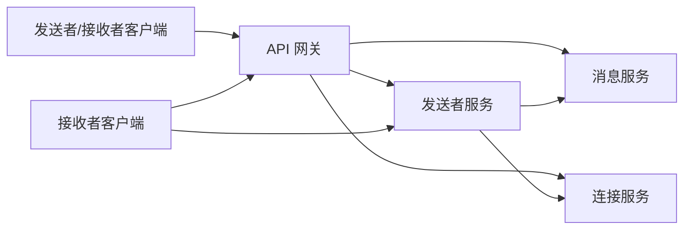
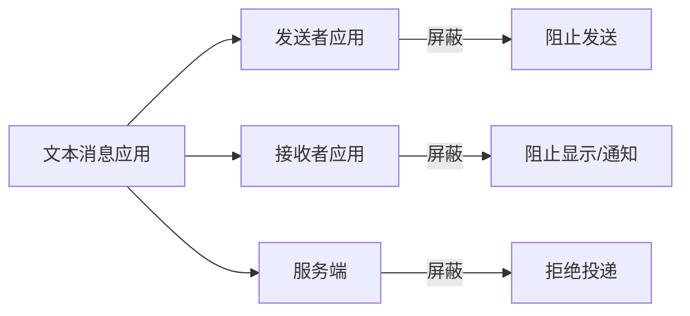
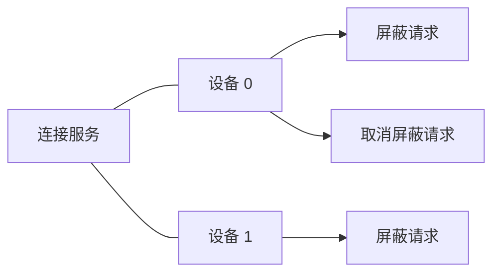
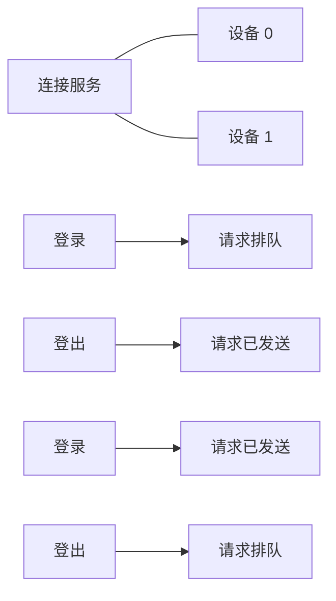
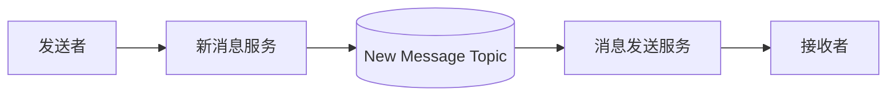
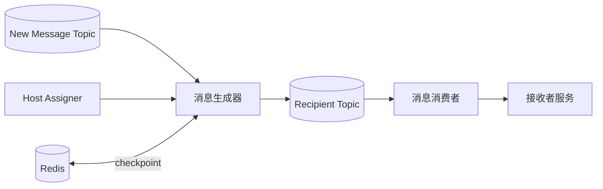
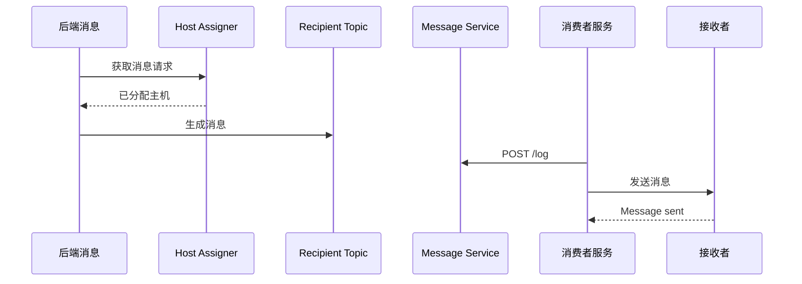
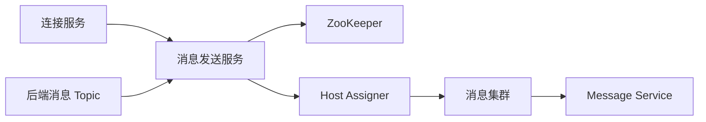
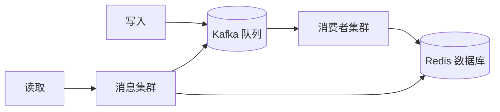

# 14 第 14 章：设计文本消息应用（Design a Text Messaging App）

本章包括：

- 为数十亿客户端设计短消息发送应用
- 考虑在延迟与成本之间权衡的方案
- 为容错进行设计

让我们来设计一个文本消息应用：一个供 10 万用户在数秒内彼此发送消息的系统。不要考虑视频或语音聊天。用户发送消息的速率不可预测，因此系统应该能够应对流量突增。这是本书中第一个明确考虑“恰好一次投递（exactly-once delivery）”的示例系统。消息既不能丢失，也不能被发送两次。

## 14.1 需求

经过讨论，我们确定了以下功能需求：

- 实时还是最终一致？两种情况都要考虑。
- 一个聊天室最多有多少用户？聊天室可容纳 2 到 1000 名用户。
- 一条消息有没有字符限制？设为 1000 个 UTF-8 字符。在每个字符最多 32 位的情况下，一条消息最大约为 4 KB。
- 通知是平台相关细节，不必考虑。Android、iOS、Chrome 和 Windows 应用都有各自的平台通知库。
- 投递确认和已读回执。
- 记录消息。用户可以查看并搜索最多 10 MB 的历史消息。若有 10 亿用户，则总计约为 10 PB 存储。
- 消息正文是私密的。我们可以和面试官讨论是否可以查看任何消息信息，包括诸如“消息从一个用户发送给另一个用户”之类的信息。不过，诸如发送失败之类的错误事件应触发我们可见的错误。此类错误日志与监控应保护用户隐私。理想情况下应采用端到端加密。
- 不需要考虑用户注册/接入（即新用户加入消息应用的过程）。
- 不需要考虑同一组用户的多个聊天室/频道。
- 一些聊天应用提供模板消息，用户可以快速选择并发送，例如“早上好！”或“现在不方便，稍后回复。”这可以是客户端特性，这里不考虑。
- 一些消息应用允许用户查看联系人是否在线。这里不考虑。
- 这里只考虑文本，不考虑语音消息、照片或视频等媒体。

非功能需求：

- 可扩展性：10 万并发用户。假设每个用户每分钟发送一条 4 KB 消息，则写入速率为 400 MB/分钟。一个用户最多有 1000 个联系人，一条消息最多可发给 1000 个收件人，而每个收件人最多有 5 台设备。
- 高可用性：四个 9 的可用性。
- 高性能：消息投递的 P99 延迟为 10 秒。
- 安全与隐私：要求用户认证。消息应保持私密。
- 一致性：不需要严格的消息排序。如果多个用户几乎同时互相发送消息，这些消息可以在不同用户那里以不同顺序出现。

## 14.2 初步思考

乍一看，这似乎与我们在第 9 章讨论过的通知/告警服务类似。细看之下，会发现一些差异，如表 14.1 所示。我们不能机械地复用通知/告警服务的设计，但可以把它当作起点。我们识别相似需求及其对应的设计组件，并利用差异来按需增减设计复杂度。

**表 14.1  我们的消息应用与通知/告警服务的差异**

| 消息应用 | 通知/告警服务 |
|---|---|
| 所有消息优先级相同，且要求 10 秒 P99 投递时间。 | 事件可以有不同优先级。 |
| 消息从一个客户端发送到其他客户端，且都在单一服务的单一通道中传递。无需考虑其他通道或服务。 | 可以有多个通道，例如电子邮件、短信、自动语音电话、推送通知，或应用内通知。 |
| 只有人工触发条件。 | 事件可以由人工、程序化或周期性触发。 |
| 没有消息模板。（也许只有消息建议。） | 用户可以创建并管理通知模板。 |
| 由于端到端加密，我们看不到用户消息，因此没有那么大的自由度去把常见元素抽象成函数，也就更难降低计算资源消耗。 | 没有端到端加密。我们在抽象上有更多自由，例如模板服务。 |
| 用户可能请求历史消息。 | 大多数通知只需要发送一次。 |
| 投递确认和已读回执是应用的一部分。 | 我们通常无法接触大多数通知通道，如电子邮件、短信或推送通知，因此可能无法得到投递和已读确认。 |

## 14.3 初始高层设计

用户首先从联系人列表中选择消息接收者（按姓名）。接着，用户在移动端、桌面端或浏览器应用中编写消息，然后点击发送按钮。应用先用接收者的公钥加密消息，再向我们的消息服务发起投递请求。我们的消息服务把消息发送给接收者。接收者会向发送者发送投递确认和已读回执。这个设计带来如下影响：

- 我们的应用需要存储每个接收者的元数据，包括姓名和公钥。
- 我们的消息服务需要为每个接收者维持一个打开的 WebSocket 连接。
- 如果有多个接收者，发送者需要用每个接收者的公钥分别加密消息。
- 我们的消息服务需要处理来自大量发送者在短时间内突然发消息所造成的不可预测流量突增。

参考图 14.1，我们创建若干独立服务，以分别满足不同的功能需求，并针对各自不同的非功能需求进行优化。

- 发送者服务（Sender service）：接收发送者发来的消息，并立即投递给接收者。它也会把这些消息记录到消息服务中，后者稍后介绍。
- 消息服务（Message service）：发送者可以向该服务查询自己发送过的消息，而接收者可以查询自己已收到和未收到的消息。
- 连接服务（Connection service）：负责存储和读取用户当前激活与已屏蔽的连接、把其他用户加入联系人列表、以及阻止其他用户发送消息。连接服务还会存储连接元数据，例如姓名、头像和公钥。

我们的用户通过 API 网关向服务发起请求。发送者服务会向消息服务发请求来记录消息，包括那些未能投递给接收者的消息。它还会向连接服务发请求，检查接收者是否已屏蔽消息发送者。我们会在后续章节中讨论更多细节。

图 14.1  我们各服务之间关系的高层架构。接收者可以向发送者发送投递确认与已读回执。任何用户（发送者或接收者）都可以向消息服务请求历史消息或未投递消息。

## 14.4 连接服务

连接服务应提供以下端点：

- `GET /connection/user/{userId}`：获取某个用户的全部连接及其元数据，包括活跃与已屏蔽连接，以及活跃连接的公钥。我们也可以增加其他路径或查询参数，用于按连接组或其他类别过滤。
- `POST /connection/user/{userId}/recipient/{recipientId}`：从 userId 用户向 recipientId 用户发起新的连接请求。
- `PUT /connection/user/{userId}/recipient/{recipientId}/request/{accept}`：`accept` 是一个布尔变量，用于接受或拒绝连接请求。
- `PUT /connection/user/{userId}/recipient/{recipientId}/block/{block}`：`block` 是一个布尔变量，用于屏蔽或取消屏蔽连接。
- `DELETE /connection/user/{userId}/recipient/{recipientId}`：删除连接。

### 14.4.1 建立连接

用户的连接（包括活跃连接和已屏蔽连接）应存储在用户设备上（即桌面或移动应用中），或存储在浏览器 Cookie 或 `localStorage` 中，因此连接服务只是这些数据的备份，以防用户更换设备，或用于在同一用户的多台设备之间同步这些数据。我们不期望这里有很大的写流量或大量数据，因此可以将其实现为一个简单的无状态后端服务，使用共享 SQL 服务存储数据。

### 14.4.2 发送者屏蔽

我们把被屏蔽的连接称为“被屏蔽的发送者连接”，如果某个用户屏蔽了这个发送者；如果某个发送者被这个接收者屏蔽，则称为“被屏蔽的接收者连接”。本节讨论一种屏蔽发送者的方法，以最大化消息应用的性能和离线功能。参考图 14.2，我们应该在每一层都实现屏蔽——也就是在客户端（发送者设备和接收者设备）以及服务器端。以下讨论这种方法的若干相关考虑。

图 14.2  屏蔽应在每一层实现。当被屏蔽的发送者尝试发送消息时，他的设备应先阻止它；如果这一阻止失败而消息到达服务器，服务器应阻止它；如果服务器也未能阻止，而消息到达接收者设备，接收者设备应阻止它。

#### 降低流量

为了减少发往服务器的流量，被屏蔽的接收者连接应存储在用户设备上，这样设备就可以阻止用户与该接收者交互，而服务器也就不必阻止这类不希望发生的交互。是否要通知某个用户“另一个用户屏蔽了你”，属于 UX 设计决策，由我们决定。

#### 允许立即屏蔽/取消屏蔽

当用户在客户端发起屏蔽某个发送者的请求时，客户端也应发送相应的 `PUT` 请求去屏蔽发送者。不过，如果这个端点暂时不可用，客户端也可以记录自己已经屏蔽了该发送者，这样它就能隐藏来自该发送者的任何消息，并且不显示新的消息通知。客户端对取消屏蔽发送者也执行类似操作。这些请求可以先发送到设备上的死信队列（dead letter queue），等端点恢复后再发往服务器。这是“优雅降级”的一个例子：即使系统某一部分失败，也能维持有限功能。

这意味着，用户的其他设备可能仍然会收到来自原本应被屏蔽的发送者的消息，或者可能错误地阻止来自原本应取消屏蔽的发送者的消息。

我们的连接服务可以跟踪哪些设备已经与服务同步过连接。如果一个已同步设备向一个已屏蔽发送者的接收者发送消息，这表明可能存在 bug 或恶意活动，连接服务应该向开发者触发告警。我们会在第 14.6 节进一步讨论这一点。

#### 黑掉应用

无法实质性地阻止发送者尝试入侵应用，去删除那些已屏蔽自己的接收者信息。如果我们在发送者设备上加密已屏蔽接收者，那么唯一安全存储密钥的方法就是放在服务器上；这又意味着发送者设备必须向服务器查询已屏蔽接收者，从而破坏了把这些数据存储在发送者设备上的初衷。这种安全顾虑也是我们应该在每一层实现屏蔽的另一个原因。关于安全和入侵的详细讨论超出本书范围。

#### 可能的一致性问题

用户可能从多台设备发送相同的屏蔽或取消屏蔽请求。起初看起来这不会有问题，因为 `PUT` 请求是幂等的。然而，仍可能出现不一致。我们的优雅降级机制使这个特性变得更复杂。参考图 14.3，如果用户在一台设备上先发起屏蔽请求再发起取消屏蔽请求，而在另一台设备上又发起一个屏蔽请求，那么最终状态到底是屏蔽还是取消屏蔽就不清楚了。正如本书其他地方提到的，给请求附加设备时间戳来判定顺序，并不是一个解决方案，因为设备时钟不可能完全同步。

图 14.3  如果多个设备都能向连接服务发请求，就可能出现不一致。如果设备 0 先发屏蔽请求再发取消屏蔽请求，而设备 1 在设备 0 之后又发了屏蔽请求，就不清楚用户最终的意图是屏蔽还是取消屏蔽。

只允许一个设备同时在线并不能解决这个问题，因为如果某个请求无法发往服务器，我们允许这些请求排队在用户设备上。参考图 14.4，用户可能先连接到一台设备并发出一些排队中的请求，再连接到另一台设备并发出其他已成功的请求，然后第一台设备又成功把请求发送到服务器。

图 14.4  即使设备需要登录后才能发请求，也仍可能出现不一致，因为请求可能先在设备上排队，之后才在用户已经登出的情况下发送到连接服务。

这个普遍的一致性问题，出现在应用提供离线写操作时。

一种解决方法是让用户确认每台设备的最终状态。（作者写的这个应用采用了这种做法：`https://play.google.com/store/apps/details?id=com.zhiyong.tingxie`。）步骤可能如下：

1. 用户在一台设备上执行某个写操作，然后该设备把它更新到服务器。
2. 另一台设备与服务器同步后，发现自己的状态与服务器不同。
3. 设备向用户展示一个 UI，要求用户确认最终状态。

另一种解决方法是限制写操作（和离线功能）的范围，以防止不一致。此时，当设备发送屏蔽请求后，在所有其他设备都与服务器同步之前，不允许取消屏蔽；反之亦然。

这两种方法的缺点都是 UX 不够顺滑。可用性与一致性之间存在权衡。若设备可以不管网络连通性如何都自由执行任意写操作，UX 会更好，但这又无法保持一致。

#### 公钥

当某台设备首次安装（或重新安装）我们的应用并第一次启动时，它会生成一对公私钥。它应把公钥存到连接服务中。连接服务应通过它们的 WebSocket 连接，立即把新的公钥更新给用户的连接对象。

由于一个用户最多可有 1000 个连接，每个连接最多还有 5 台设备，一次密钥变更可能需要最多 5000 个请求，其中部分请求可能失败，因为接收者可能不可用。密钥变更很可能是低频事件，因此不应引发不可预期的流量突增，连接服务也不需要使用消息代理或 Kafka。没有收到更新的连接可以在后续 `GET` 请求中再拿到。

如果发送者用过期公钥加密消息，接收者解密后会得到乱码。为了防止接收者设备把这种错误显示给接收者用户，发送者可以用诸如 SHA-2 之类的密码学哈希函数对消息做哈希，并把这个哈希作为消息的一部分。接收者设备可以对解密后的消息做哈希，并且只有当两个哈希一致时，才把解密后的消息显示给接收者用户。发送者服务（下一节会详细介绍）可以提供一个特殊消息端点，让接收者请求发送者重新发送消息。接收者可以把自己的公钥带上，这样发送者就不会重复这个错误，也可以把过期公钥替换成新的。

一种防止这种错误的方法，是让公钥变更不要立即生效。变更公钥的请求可以包含一个宽限期（例如 7 天），在此期间两个密钥都有效。如果接收者收到一条用旧密钥加密的消息，它可以向 Sender Service 发送一个特殊消息请求，并把新密钥带上；然后 sender service 会请求发送者更新后者的密钥。

## 14.5 发送者服务

发送者服务针对单一功能进行了可扩展性、可用性和性能优化：接收发送者发来的消息，并近乎实时地投递给接收者。它应尽可能简单，以优化这一关键功能的可调试性和可维护性。如果出现不可预期的流量突增，它应能够把这些消息缓冲到临时存储中，以便在资源足够时再处理和投递。

图 14.5 是发送者服务的高层架构。它由两个服务组成，中间通过一个 Kafka topic 连接。我们把它们命名为“新消息服务（new message service）”和“消息发送服务（message-sending service）”。这种做法与第 9.3 节中的通知服务后端类似。不过，这里不使用元数据服务，因为内容是加密的，我们无法解析它来把通用组件替换成 ID。

图 14.5  发送者服务的高层架构。发送者通过 API 网关（此处未画出）向发送者服务发送消息。

消息包含以下字段：sender ID、最多 1000 个 recipient ID 的列表、body 字符串，以及 message sent status 枚举（可能的状态是“message sent”、“message delivered”和“message read”）。

### 14.5.1 发送消息

发送消息的过程如下。客户端上，用户编写一条包含 sender ID、recipient ID 和 body 字符串的消息。投递确认和已读回执初始值都为 `false`。客户端先对 body 加密，然后把消息发送给 sender service。

新消息服务接收消息请求，将其生产到 new message Kafka topic，然后向发送者返回 200 成功。来自一个发送者的消息请求最多可包含 5000 个接收者，因此应当以这种异步方式处理。新消息服务还可以执行一些简单校验，例如检查请求格式是否正确，并对无效请求返回 400 错误（同时触发相应的开发者告警）。

图 14.6 展示了消息发送服务的高层架构。message generator 消费 new message Kafka topic，并为每个接收者生成一条独立消息。主机可以 fork 一个线程或维护线程池来生成消息。主机把消息生产到一个 Kafka topic，我们称之为 recipient topic。主机也可以向 Redis 这样的分布式内存数据库写入 checkpoint。如果主机在生成消息时失败，其替代者可以查询这个 checkpoint，这样就不会生成重复消息。

图 14.6  消息发送服务的高层架构。这里画出的消息消费者服务，可能会经由其他服务来投递消息，而不是像图中这样直接发给接收者。

消息消费者服务消费 recipient topic，然后执行以下步骤。

1. 检查发送者是否应该被屏蔽。消息发送服务应该存储这些数据，而不是每条消息都去请求连接服务。如果某条消息对应被屏蔽的发送者，这表明客户端的屏蔽机制失败，可能是 bug 或恶意活动。此时应向开发者触发告警。
2. 每个消息发送服务主机都维护着与一批接收者的 WebSocket 连接。我们可以实验这个数量，以找到一个合适的平衡。使用 Kafka topic 允许每台主机在准备好投递消息之前，只在需要时再消费 topic，从而为更多接收者提供服务。系统可以使用 ZooKeeper 这样的分布式配置服务来把主机分配给设备。ZooKeeper 也可以被另一层服务包裹，该服务提供适当的 API 端点，返回为某个接收者提供服务的主机。我们可以把它叫做 host assigner service。
   - 处理当前消息的 message-sending service 主机可以向 host assigner service 查询合适的主机，然后请求该主机向接收者投递消息。更多细节见第 14.6.3 节。
   - 同时，message-sending service 还应把消息记录到 message service 中，下一节会进一步讨论。第 14.6 节会更详细地讨论 message-sending service。
3. 发送者服务把消息发送到接收者客户端。如果消息无法投递到接收者客户端（最可能的原因是接收者设备关闭或没有网络连接），我们可以直接丢弃这条消息，因为它已经记录在消息服务中，设备稍后可以取回。
4. 接收端可以先确认消息不是重复的，然后把它展示给用户。接收端应用也可以触发设备通知。
5. 当用户读了消息后，应用可以向发送者发送已读回执，该回执也可以用类似方式投递。

步骤 1–4 如图 14.7 所示。

图 14.7  消费 recipient Kafka topic 中的消息并将其发送给接收者的时序图。

**练习** 这些步骤如何通过 choreography saga 或 orchestration saga 来执行？请画出相关的 choreography 和 orchestration saga 图。

#### 14.5.2 其他讨论

我们可能会讨论以下问题：

- 如果用户向后端主机发送消息，但后端主机在向用户返回“已收到”之前就死掉了，会怎样？

  如果后端主机死掉，客户端会收到 5xx 错误。我们可以实现处理失败请求的常规技术，例如指数重试、退避以及死信队列。客户端可以一直重试，直到某个 producer 主机成功把消息入队，并返回 200 给后端主机，后端主机再返回 200 给发送者。

  如果消费者主机死掉，我们可以实现自动或手动故障转移，使另一台消费者主机可以从该 Kafka 分区消费消息，然后更新该分区的 offset。

- 应该采用什么方法来解决消息排序问题？

  我们可以使用一致性哈希，让发往某个接收者的消息都进入某个特定的 Kafka 分区。这样能保证针对该接收者的消息会按顺序被消费并接收。

  如果一致性哈希导致某些分区负载过高，我们可以增加分区数量，并调整一致性哈希算法，把消息更均匀地分布到更多分区上。另一种方法是使用像 Redis 这样的内存数据库存储接收者到分区的映射，并根据需要调整该映射，避免某个分区负载过重。

  最后，客户端也可以确保消息按顺序到达。如果消息乱序到达，它可以触发低优先级告警以便进一步调查。客户端还可以对消息去重。

- 如果消息是 n:n/多对多，而不是 1:1，该怎么办？

  我们可以限制聊天室中的人数。

这个架构是可扩展的。它可以在成本高效的前提下扩容或缩容。它使用了共享服务，例如 API 网关和共享 Kafka 服务。使用 Kafka 可以在不宕机的情况下处理流量尖峰。

它的主要缺点是延迟，尤其是在流量尖峰期间。使用队列这类拉取机制可以实现最终一致性，但不适合实时消息传递。如果我们要求实时消息传递，就不能使用 Kafka 队列，而必须降低主机与设备的比率，并维护一个更大的主机集群。

## 14.6 消息服务

我们的消息服务充当消息日志。用户可能出于以下目的请求它：

- 如果用户刚登录到一台新设备，或者设备上的应用存储被清空，那么该设备需要下载历史消息（包括发出和收到的消息）。
- 某条消息可能无法投递。可能原因包括设备关机、被操作系统禁用，或者无法连接到我们的服务。当客户端重新上线时，可以向消息服务请求自己在离线期间收到的消息。

出于隐私和安全考虑，我们的系统应使用端到端加密，因此经过系统的消息都是加密的。端到端加密的另一个好处是，消息在传输中和静态存储中都会自动加密。

> [!NOTE]
> 端到端加密
>
> 我们可以用三个简单步骤理解端到端加密：
>
> 1. 接收者生成一对公私钥。
> 2. 发送者用接收者的公钥加密消息，然后把消息发送给接收者。
> 3. 接收者用自己的私钥解密消息。

在客户端成功接收消息之后，消息服务可以设置几周的保留期，之后删除消息，以节省存储并提升隐私与安全性。这样做还能防止黑客利用我们服务中的潜在安全漏洞来窃取消息内容。即使黑客从用户设备偷到了私钥，这也限制了他们能从系统中窃取并解密的数据量。

不过，用户可能在多台设备上运行这个消息应用。若我们希望消息能投递到所有设备，该怎么办？

一种方法是把消息保留在未投递消息服务中，并可能通过周期性批处理作业删除死信队列中超过设定时间的数据。另一种方法是只允许用户任意时刻登录一部手机，并提供一个桌面应用，让它通过用户手机收发消息。如果用户在另一部手机上登录，那么他们不会看到前一部手机上的旧消息。我们也可以提供一个功能，让用户把数据备份到云存储服务（如 Google Drive 或 Microsoft OneDrive），然后在另一部手机上下载。

我们的消息服务预期会有高写入、低读取，非常适合 Cassandra。消息服务的架构可以是一个无状态后端服务加一个共享 Cassandra 服务。

## 14.7 消息发送服务

第 14.5 节讨论了 sender service：它包含一个 new message service，用于过滤无效消息，然后把消息缓冲到 Kafka topic 中。消息投递的大部分处理工作由 message-sending service 承担，本节详细讨论它。

### 14.7.1 引言

sender service 不能在接收者还没有先与它建立会话的情况下，直接把消息发送给接收者，因为接收者设备不是服务器。让用户设备充当服务器通常是不可行的，原因包括：

- 安全：恶意方可以向设备发送恶意程序，例如把它们劫持为 DDoS 攻击的工具。
- 设备网络流量增加：设备在未先建立连接的情况下就可以接收其他人的网络流量，这可能导致其所有者为额外流量支付过高费用。
- 电量消耗：如果每个应用都要求设备充当服务器，增加的电量消耗会显著缩短电池寿命。

我们可以使用类似 BitTorrent 的 P2P 协议，但它也有前面讨论过的权衡，我们不再展开。

设备必须先发起连接这一要求意味着，我们的消息服务必须持续维持大量连接——每个客户端一条连接。我们需要一个大型主机集群，这也削弱了使用消息队列的初衷。

WebSocket 也帮不上太多忙，因为打开的 WebSocket 连接同样会消耗主机内存。

消费者集群可能需要成千上万台主机来服务多达 10 万并发接收者/用户。这意味着每台后端主机必须与一批用户维持开放的 WebSocket 连接，如图 14.1 所示。这种有状态特性是不可避免的。我们需要像 ZooKeeper 这样的分布式协调服务来把主机分配给用户。如果某台主机宕机，ZooKeeper 应检测到这一点并调度一个替代主机。

让我们考虑消息发送服务主机死亡时的故障转移流程。主机应该向其设备发送心跳。如果主机死掉，其设备可以请求我们的 message-sending service 建立新的 WebSocket 连接。我们的容器编排系统（例如 Kubernetes）应当调度新主机，使用 ZooKeeper 确定其对应设备，并与这些设备建立 WebSocket 连接。

在旧主机死掉之前，它可能已经把消息成功投递给部分接收者，但不是全部。新主机如何避免重复投递同一条消息？

一种方法是每条消息后都做 checkpoint。我们可以使用像 Redis 这样的内存数据库，并对 Redis 集群做分区以保证强一致性。主机每成功向某个接收者投递一次消息，就写入 Redis。主机在投递消息前也会先读 Redis，这样就不会重复投递。

另一种方法是直接把消息重新发送给所有接收者，并依靠接收者设备去重。

第三种方法是：如果发送者在几分钟内没有收到确认，就让发送者重新发送消息。这条消息可能会被另一台消费者主机处理和投递。如果这个问题持续存在，可以向共享的监控与告警服务触发告警，通知开发者。

### 14.7.2 高层架构

图 14.8 展示了 message-sending service 的高层架构。主要组件如下：

1. 消息集群（messaging cluster）。这是一个大型主机集群，每台主机被分配给一批设备。每个单独设备都可以有一个 ID。
2. host assigner service。这是一个后端服务，使用 ZooKeeper 服务维护设备 ID 到主机的映射。我们的集群管理系统（如 Kubernetes）也可能使用 ZooKeeper 服务。在故障转移期间，Kubernetes 会更新 ZooKeeper，删除旧主机记录，并添加新预配主机的记录。
3. 前面章节讨论过的 connection service。
4. message service：如图 14.6 所示。每条发往设备或从设备发出的消息，也都会记录在 message service 中。

图 14.8  为客户端分配专用主机的消息发送服务高层架构。消息备份未画出。

所有客户端都通过 WebSocket 连接到 sender service，因此主机可以以近实时延迟向客户端发送消息。这意味着我们需要相当数量的消息集群主机。一些工程团队已经成功在单台主机上建立了数百万并发连接（`https://migratorydata.com/2013/10/10/scaling-to-12-million-concurrent-connections-how-migratorydata-did-it/`）。每台主机还需要存储其连接的公钥。我们的消息服务需要一个端点，让这些连接在需要时把它们新的公钥发送给各自主机。

不过，这并不意味着一台主机就能同时处理数百万客户端的来回消息。必须做出权衡。若消息要求在几秒内投递完成，它们就必须很小，限制在几百个字符的文本。我们可以为处理文件（如照片和视频）创建一个独立的消息服务，并让它与处理文本消息的消息服务独立扩容。流量高峰期间，用户仍可在几秒延迟内互发消息，但发送文件可能需要几分钟。

每台主机可以保留最近几天的消息，并定期从内存中删除旧消息。参考图 14.9，当主机收到消息时，它可以把消息存入内存，同时 fork 一个线程将消息生产到 Kafka 队列。消费者集群可以消费该队列，并把消息写入共享 Redis 服务。Redis 写入速度很快，但我们仍然可以使用 Kafka 来缓冲写入，从而获得更高容错性。当客户端请求旧消息时，请求会经由后端转发给其主机，而主机从共享 Redis 服务中读取这些旧消息。这个整体方案优先读而非写，因此读请求可以有低延迟。另外，由于写流量远大于读流量，使用 Kafka 队列可以确保流量尖峰不会压垮 Redis 服务。

图 14.9  消息集群与 Redis 数据库之间的交互。我们可以用 Kafka 队列缓冲写入，以提高容错性。

host assigner service 可以保存客户端/聊天室 ID 到主机的映射，并把这些映射存入 Redis 缓存。我们可以使用一致性哈希、轮询或加权轮询来给主机分配 ID，但这很快会导致热分片问题（某些主机处理了不成比例的负载）。metadata service 可以保存每台主机的流量信息，因此 host assigner service 可以利用这些信息决定将某个客户端或聊天室分配给哪台主机，以避免热分片问题（某些主机处理过多负载）。我们可以做负载均衡，使每台主机都能服务相同比例的高流量客户与低流量客户。

metadata service 也可以保存每个用户设备的信息。

主机可以把请求活动（即消息处理活动）记录到 logging service，而该服务可以把日志存储在 HDFS 中。我们可以定期运行批处理作业，重新分配客户端与主机，并更新 metadata service。为了进一步改善负载再均衡，我们还可以考虑更复杂的统计方法，例如机器学习。

### 14.7.3 发送消息的步骤

现在我们可以更详细地讨论第 14.5.1 节中的第 3a 步。当后端服务向某个单独设备或聊天室发送消息时，文本内容和文件内容可以分别执行以下步骤：

1. 后端主机请求 host assigner service，后者查询 ZooKeeper，以确定哪台主机为目标单个客户端或聊天室提供服务。如果还没有分配主机，ZooKeeper 可以分配一台。
2. 后端主机把消息发送给这些主机，我们称之为接收主机（recipient hosts）。

### 14.7.4 一些问题

我们可能会被面试官问到关于有状态性的内容。这个设计打破了云原生的原则，而云原生崇尚最终一致性。我们可以讨论这对于文本消息应用、尤其是群聊来说并不适用。云原生做出的某些权衡，例如更高的写延迟、换取低读延迟与更高可用性，并不完全适合我们所要求的低写延迟与强一致性。还可能讨论以下问题：

- 如果服务器在把消息投递给接收者或把“已发送”通知发给发送者之前就死掉，会怎样？我们已经讨论过如何处理接收者的任意设备离线的情况。如何确保“已发送”通知能送达发送者？一种方法是让客户端和接收主机存储最近的“message sent”事件。我们可以利用 Cassandra 的快速写入。如果发送者在一段时间后没有收到响应，它可以查询我们的消息服务，判断消息是否已发送。客户端或接收主机可以向发送者返回成功响应。另一种方法是把“已发送”通知视作一条单独消息，让接收主机把“已发送”通知发给发送者设备。
- 应该采用什么方法解决消息排序？每条消息都有来自发送者客户端的时间戳。后发消息可能先被成功处理并投递。如果接收者设备按顺序显示消息，而用户正盯着设备看，那么更早的消息可能突然插到更晚消息前面，这会让用户困惑。一个办法是：如果某条更早的消息已经在更晚消息之后投递到了接收者设备，那么就丢弃这条更早的消息。当接收者客户端收到消息时，它可以判断是否存在时间戳更晚的消息；如果有，则返回 422 错误和合适的错误信息。错误会传回发送者设备。发送者可以根据这个结果决定是否再次发送该消息，知道它会出现在那条已成功投递的更晚消息之后。
- 如果消息是 n:n/多对多，而不是 1:1，该怎么办？我们会限制聊天室人数。

### 14.7.5 提升可用性

在图 14.8 的高层架构中，每个客户端都被分配到单独一台主机。即使有一个接收主机心跳的监控服务，从主机故障中恢复也至少要十几秒。host assigner 需要执行复杂算法，才能把客户端重新分配到各主机。

我们可以通过设置一组备用主机来提升可用性。这些主机通常不服务客户端，只发送心跳。当某台主机失效时，host assigner 可以立即把它的所有客户端分配给一台备用主机。这样可以把停机时间缩短到几秒，我们可以和面试官讨论这是否可接受。

另一种尽量降低停机时间的设计，是创建迷你集群。为每台主机分配一到两台次级主机。我们可以把前者称为主主机（primary host）。这台主主机会持续把所有请求转发给它的次级主机，确保次级主机与主主机保持同步，并且随时准备接管为主主机。当主主机失败时，可以立即切换到次级主机。

我们可以用 Terraform 定义这一基础设施，定义一个由 3 个 pod 组成的 Kubernetes 集群。每个 pod 对应一个节点。总体而言，这个方案可能过于昂贵和复杂。

## 14.8 搜索

每个用户只能搜索自己的消息。我们可以直接在文本消息里做 search-to-search，而不为每个客户端构建倒排索引，从而避免设计、实现和维护倒排索引的成本。普通客户端的消息存储大小大概远小于 1 GB（不含媒体文件）。把这些消息加载到内存并搜索是很直接的。

我们可以搜索媒体文件名，但不搜索文件内容本身。对字节串进行搜索超出本书范围。

## 14.9 日志、监控与告警

在第 2.5 节中，我们已经讨论过面试中应当提到的日志、监控与告警关键概念。除了第 2.5 节讨论的内容之外，我们还应记录以下内容：

- 记录服务之间的请求，例如 API 网关到后端服务的请求。
- 记录消息发送事件。为了保护用户隐私，我们可以记录某些细节，但不能记录其他细节。
- 出于用户隐私考虑，永远不要记录消息内容，包括它的所有字段（即 sender、receiver、body、delivery confirmation 和 read receipt）。
- 记录消息是在数据中心内发送，还是从一个数据中心发送到另一个数据中心。
- 记录错误事件，例如发送消息、投递确认和已读回执中的错误。

除了第 2.5 节讨论的内容之外，我们还应监控并针对以下事项发出告警：

- 像往常一样，我们监控错误和超时，并监控各服务的利用率，以便做扩容决策。我们监控 Undelivered Message Service 的存储消耗。
- 如果后端服务没有错误，而未投递消息服务的存储利用率一直很小，这表明我们可以考虑缩小 sender service 集群。
- 我们还要监控欺诈和异常情况，例如客户端发送高频消息。禁止程序化发送。可以在 API 网关或后端服务前面放置速率限制器。遇到这类客户端时，应直接阻止其发送或接收消息，直到我们调查完问题。

## 14.10 其他可能的讨论主题

以下是这个系统的其他一些可讨论主题：

- 如果一个用户想给另一个用户发消息，前者必须先向后者申请权限。后者可以接受或屏蔽。后者之后也可以改变主意并在屏蔽后重新授予权限。
- 用户可以在任何时候屏蔽另一个用户。后者不能再选择前者作为消息接收对象。这些用户不能处于同一个聊天室。屏蔽用户会把自己从包含该用户的任何聊天室中移除。
- 如果从不同设备登录怎么办？我们应该只允许同一时间只有一台设备登录。
- 我们的系统并不保证消息按发送顺序接收。而且，如果一个聊天室有多个参与者并且他们在接近的时间内发消息，其他参与者也可能无法按顺序收到这些消息。对于不同参与者，消息可能以不同顺序到达。我们如何设计一个系统来保证消息按顺序展示？我们做哪些假设？如果参与者 A 在设备未联网时发了一条消息，而其他联网参与者在稍后不久发了消息，那么这些消息应该在其他人设备上以什么顺序显示？又应该在参与者 A 的设备上以什么顺序显示？
- 我们怎样扩展系统来支持文件附件、语音和视频聊天？我们可以简要讨论新的组件和服务。
- 我们没有讨论消息删除。典型消息应用可能允许用户删除消息，而删除后不应再次收到这些消息。即使设备离线，也应允许用户删除消息，并且这些删除应与服务器同步。这个同步机制可以进一步讨论。
- 我们可以进一步讨论屏蔽/取消屏蔽用户的机制。
- 我们当前设计与可能的解决方案有哪些安全与隐私风险？
- 我们的系统如何支持用户多设备同步？
- 当用户向聊天中添加或移除其他用户时，可能出现哪些竞态条件？如果发生静默错误怎么办？服务如何检测并解决不一致？
- 我们没有讨论像 Skype 或 BitTorrent 这类基于 P2P 协议的消息系统。由于客户端是动态 IP 而不是静态 IP（静态 IP 是用户向 ISP 支付的一项服务），客户端可以运行一个守护进程，在 IP 地址变化时更新我们的服务。可能有哪些复杂性？
- 为降低计算资源和成本，发送者可以先压缩消息，再加密并发送。接收者在接收并解密后可以解压消息。
- 讨论一个用户接入/注册系统的设计。新用户如何加入消息应用？新用户如何添加或邀请联系人？用户可以手动输入联系人，也可以通过蓝牙或二维码添加联系人。或者，我们的移动应用可以访问手机通讯录，这需要 Android 或 iOS 的相应权限。用户也可以把 URL 发送给别人，让对方下载或注册我们的应用。
- 我们的架构是中心化方案。每条消息都必须经过后端。我们也可以讨论去中心化方案，例如 P2P 架构，其中每个设备都是服务器，可以接收其他设备的请求。

### 总结

- 一个简单的文本消息应用系统设计，核心讨论是如何在大量客户端之间路由大量消息。
- 聊天系统类似于通知/告警服务。两者都要把消息发送给大量接收者。
- 处理流量尖峰的可扩展且成本高效的技术是使用消息队列。但在流量尖峰期间，延迟会受影响。
- 我们可以通过把更少的用户分配给一台主机来降低延迟，但代价是成本更高。
- 这两种方案都必须处理主机故障，并把某台主机的用户重新分配到其他主机。
- 接收者设备可能不可用，因此应提供一个 GET 端点来获取消息。
- 我们应该记录服务之间的请求，以及消息发送事件和错误事件的细节。
- 我们可以监控使用指标来调整集群规模，并监控欺诈行为。
