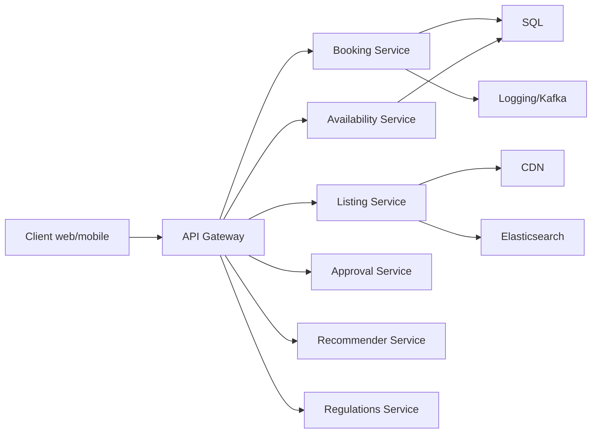
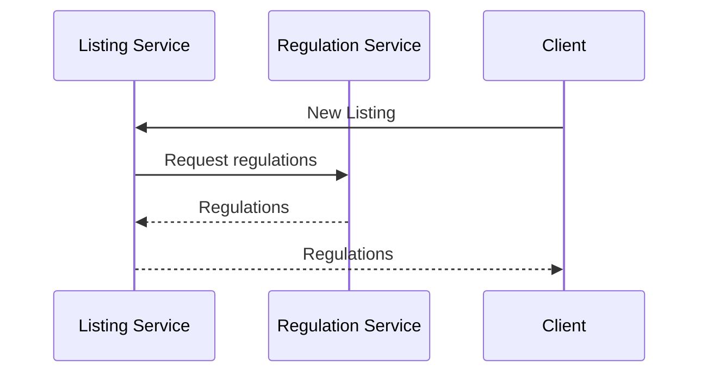
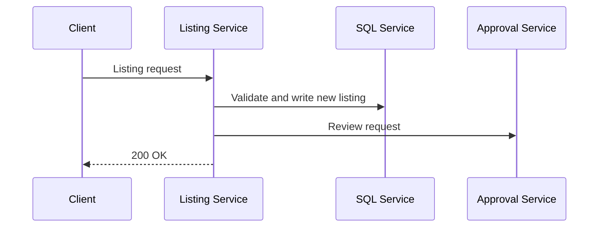
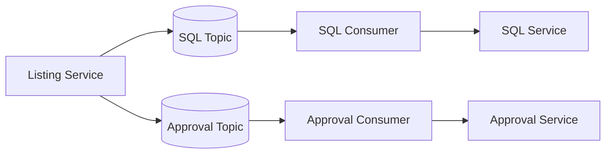
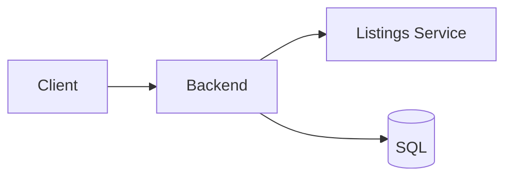
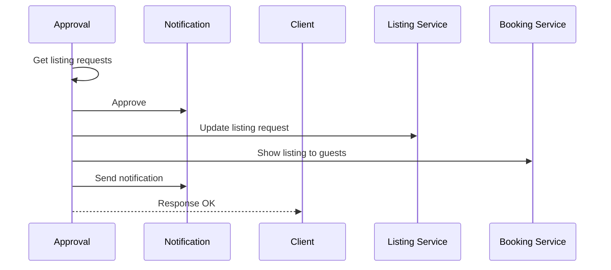
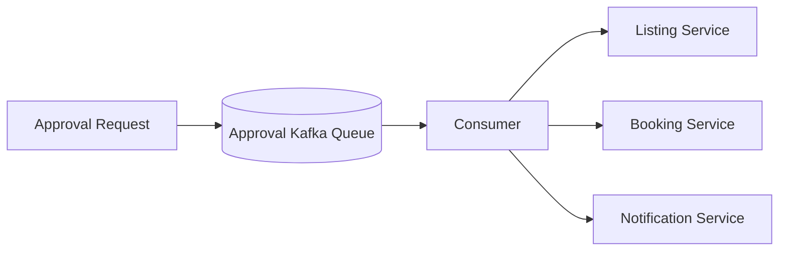
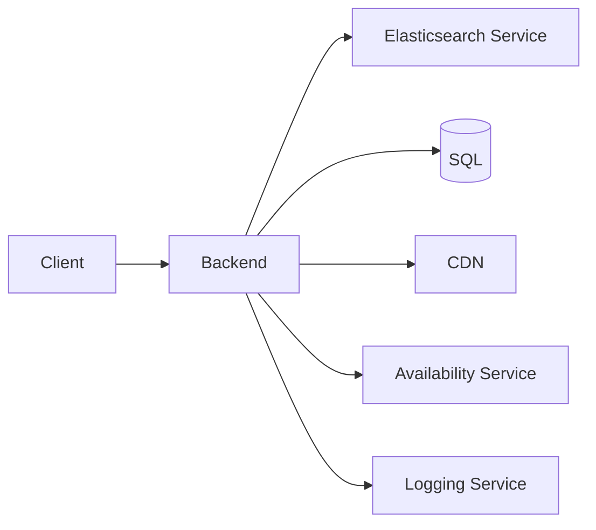
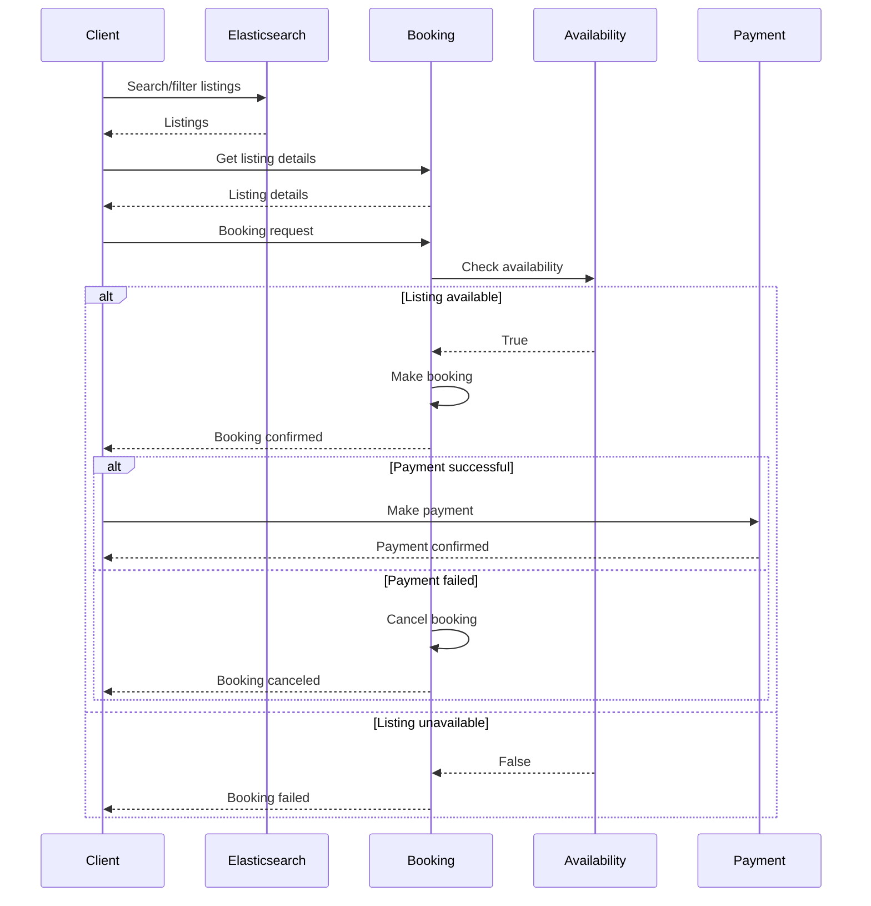
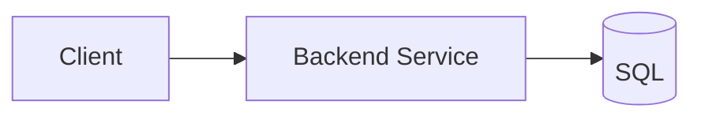

# 15 第 15 章：设计 Airbnb（Design Airbnb）

本章包括：

- 设计一个预约系统
- 设计供运营人员管理条目和预约的系统
- 为复杂系统划定范围

题目是为房东设计一个短租房间出租服务给旅行者。这既可能是编码题，也可能是系统设计题。编码讨论通常会以多类对象的编码和面向对象编程（OOP）方案形式出现。本章假设这个题目也可以应用到一般预约系统，例如：

- 电影票
- 机票
- 停车场
- 出租车或网约车，不过它们的非功能需求和系统设计会不同

## 15.1 需求

在讨论需求之前，我们先讨论一下我们正在设计的系统类型。Airbnb 是：

1. 一个预约应用，因此存在一种在有限资源上进行预订的用户类型。Airbnb 把他们称为“guest（房客）”。也存在一种创建这些资源列表的用户类型，Airbnb 把他们称为“host（房东）”。
2. 一个市场应用。它把出售产品和服务的人与购买这些产品和服务的人匹配起来。Airbnb 将房东与房客匹配。
3. 它还处理支付并收取佣金。这意味着还存在内部用户，即做客服和运营的人（通常缩写为“ops”），用于调解纠纷并监控和应对欺诈。这使 Airbnb 区别于 Craigslist 这类更简单的应用。像 Airbnb 这样的公司里，绝大多数员工都是客服和运营人员。

此时，我们可以向面试官确认，本次面试的范围是否仅限于房东和房客，还是也包含其他类型的用户。本章将讨论房东、房客、运营和分析。

房东的用例如下。这个列表可能非常长，因此我们只讨论以下用例。

- 入门与更新：添加、更新和删除 listings。更新可能包括像修改 listing 照片这样的小任务，也可能包含很多复杂业务逻辑。例如，一个 listing 可能有最短和/或最长预订时长，定价可能按星期几或其他标准变化。应用可能展示定价建议。listing 也可能受当地法规约束。例如，旧金山的短租法律限制房东不在场时的出租时长每年最多 90 天。某些 listing 变更在发布前也可能需要运营人员批准。
- 处理预订，例如接受或拒绝预订请求：
  - 房东在接受或拒绝房客预订请求前，可能可以查看房客评分和其他房东写的评价。
  - Airbnb 可能提供额外选项，例如在满足某些房东指定条件时自动接受，比如房客平均评分很高。
  - 在接受后取消预订。这可能触发金钱处罚或暂停 listing 权限。具体规则可能很复杂。
- 与房客沟通，例如通过应用内消息。
- 发布对房客的评分和评价，并查看房客的评分和评价。
- 从房客那里收款（扣除 Airbnb 的佣金）。
- 接收税务申报文件。
- 分析，例如查看随着时间变化的收入、评分和评价内容。
- 与运营人员沟通，包括请求调解（例如要求房客赔偿损失）或举报欺诈。

房客的用例如下：

- 搜索和查看 listings。
- 提交预订请求和付款，并查看预订请求状态。
- 与房东沟通。
- 发布对 listing 的评分和评价，并查看房东的评分和评价。
- 与运营人员沟通，类似于房东。

Ops 的用例如下：

- 审核 listing 请求并移除不合适的 listing。
- 与客户沟通，用于纠纷调解、提供替代 listing 和发送退款等。

我们不会详细讨论支付，因为支付非常复杂。支付方案必须考虑不同国家、州、市以及其他层级政府的众多货币和法规（包括税收），而且对于各种产品和服务也不同。我们可能会按支付类型设定不同的交易费（例如，对支票设置最大交易金额，或者对礼品卡支付提供折扣以促进礼品卡销售）。退款机制和监管规则因支付类型、产品、国家、客户以及很多其他因素而不同。接受支付的方式可能有数百甚至数千种，例如：

- 现金。
- 各种借记卡和信用卡处理方，如 MasterCard、Visa 等。每个都有自己的 API。
- 在线支付处理器，如 PayPal 或 Alipay。
- 支票/cheque。
- 存储信用（store credit）。
- 可能属于某些公司和国家组合特定的支付卡或礼品卡。
- 加密货币。

回到需求讨论，在经过大约 5–10 分钟快速讨论和涂写之后，我们明确了以下功能需求：

- 房东可以发布一个房间。假设一个房间只供一人入住。房间属性是城市和价格。房东可以为一个房间提供最多 10 张照片和一个 25 MB 的视频。
- 房客可以按城市、入住日期和退房日期筛选房间。
- 房客可以预订一个房间，带入住和退房日期。预订不需要房东批准。
- 房东或房客可以在预订开始前随时取消预订。
- 房东或房客可以查看他们的预订列表。
- 对于任何特定日期，房客只能预订一间房。
- 房间不能被重复预订。
- 为简化起见，与真实 Airbnb 不同，我们排除以下特性：
  - 让房东手动接受或拒绝预订请求。
  - 预订在创建后再取消（由房客或房东发起）超出范围。
  - 我们可以简要讨论通知（如推送或邮件）给房客和房东，但不深入展开。
  - 用户之间的消息，例如房客与房东之间、运营与房客/房东之间的消息。

以下内容超出本次面试范围。提及这些可能的功能需求很有帮助，可以展示你的批判性思维和对细节的关注。

- 一个地点的其他细节，例如：
  - 精确地址。只需要城市字符串。忽略州和国家等其他位置细节。
  - 我们假设每个 listing 只允许一位房客。
  - 整套房源 vs. 独立房间 vs. 合住房间。
  - 设施细节，例如独立或共用浴室、厨房细节。
  - 适合儿童。
  - 适合宠物。
- 分析。
- Airbnb 可能向房东提供定价建议。一个 listing 可以设置最低和最高每晚价格，而 Airbnb 可以在此范围内调整价格。
- 其他定价选项和属性，例如清洁费及其他费用、节假日和周末等高峰日期的不同价格，或税费。
- 支付或退款，包括取消罚金。
- 客户支持，包括纠纷调解。一个很好的澄清问题是：我们是否需要讨论 Ops 如何审核 listing 请求。我们也可以问，这里超出范围的客户支持是仅指预订流程，还是也包括 listing 流程期间的客户支持。我们可以澄清，术语“customer”指房东和房客。在本次面试中，我们假设面试官可能会要求简要讨论 Ops 对 listing 的审核。
- 保险。
- 任何一方之间的聊天或其他沟通，例如房东与房客之间。这超出范围，因为那是消息服务或通知服务（我们在其他章节讨论过），而不是预约服务。
- 注册和登录。
- 对因服务中断而对房东和房客的补偿。
- 用户评价，例如房客评价自己的住宿或房东评价房客行为。

如果我们需要讨论房源列表和预订房间的 API 端点，它们可以是：

- `findRooms(cityId, checkInDate, checkOutDate)`
- `bookRoom(userId, roomId, checkInDate, checkOutDate)`
- `cancelBooking(bookingId)`
- `viewBookings(hostId)`
- `viewBookings(guestId)`

我们的非功能需求如下：

- 可扩展到 10 亿间房源或每天 1 亿次预订。历史预订数据可以删除。没有程序化生成的用户数据。
- 预订，或者更准确地说房源可用性，需要强一致性，这样就不会出现重复预订或对不可用日期的预订。对描述或照片等其他房源信息，最终一致性可能是可以接受的。
- 高可用性，因为丢失预订会带来金钱后果。不过，如第 15.2.5 节所述，如果我们想防止重复预订，就无法完全避免丢失预订。
- 高性能并非必要。P99 几秒即可接受。
- 典型的安全与隐私要求。需要认证。用户数据是私密的。授权不是本次范围内功能所要求的。

## 15.2 设计决策

在讨论房源列表和预订设计时，我们很快会遇到两个问题。

1. 应该把房间复制到多个数据中心吗？
2. 数据模型应该如何表示房间可用性？

### 15.2.1 复制

我们的 Airbnb 系统与 Craigslist 类似，因为产品是本地化的。搜索只能在一个城市内进行。我们可以利用这一点，把数据中心主机分配给有大量 listings 的城市，或者分配给少量 listings 的多个城市。由于写性能不是关键，我们可以使用单主复制（single-leader replication）。为了最小化读延迟，次级主机和 follower 可以地理上分散在不同数据中心。我们可以使用一个元数据服务，保存城市到 leader/follower 主机 IP 地址的映射，以便我们的服务查找某个城市最近的 follower 主机来读取房源，或查找该城市对应的 leader 主机来写入。这个映射规模很小，而且只有管理员会偶尔修改，因此我们可以把它复制到所有数据中心，管理员在更新映射时手动确保一致性。

我们可以使用 CDN 存储房间照片和视频，以及像往常一样的 JavaScript 和 CSS 等静态内容。

与常见做法相反，我们可能选择不使用内存缓存。在搜索结果里，我们只展示可用的房间。如果某个房间非常抢手，它很快就会被预订并不再出现在搜索里。如果某个房间总是出现在搜索里，那么它可能并不受欢迎，我们可以选择不承担缓存带来的成本和额外复杂性。换句话说，缓存新鲜度很难维护，缓存数据很快会过时。

和往常一样，这些决策都可以讨论其权衡。

### 15.2.2 房间可用性的数据模型

我们应该快速头脑风暴几种方式来表示房间可用性，并讨论其权衡。在面试中，必须体现出评估多种方案的能力，而不只是提出一种方案：

- `(room_id, date, guest_id)` 表——概念上很简单，但代价是会包含多行只在日期上不同的记录。例如，如果 1 号房间被 1 号房客整个月 1 月预订，就会有 31 行。
- `(room_id, guest_id, check_in, check_out)` 表——更紧凑。当房客提交带入住和退房日期的搜索时，我们需要一个算法判断是否存在日期重叠。这个算法应该写在数据库查询中还是后端中？前者更难维护和测试。但如果后端主机必须从数据库里读取这些可用性数据，就会产生 I/O 成本。编码面试里可以问这两种方法的代码。

可能的数据库模式有很多。

### 15.2.3 处理重叠预订

如果多个用户尝试预订同一房间且日期重叠，那么应把第一个用户的预订授予成功，而我们的 UI 应告知其他用户，该房间在他们选择的日期已不可用，并引导他们寻找其他可用房间。这可能会带来负面的 UX，因此我们可能想快速头脑风暴几种替代方案。你也可以提出其他可能性。

### 15.2.4 随机化搜索结果

我们可以随机化搜索结果的顺序，以减少这类情况，尽管这可能会干扰个性化（如推荐系统）。

### 15.2.5 在预订流程中锁定房源

当用户点击一个搜索结果查看房间详情并可能提交预订请求时，我们可以把这个房间的这些日期锁定几分钟。在这段时间里，其他日期重叠的用户搜索不会把这个房间返回到结果列表中。如果在其他用户已经收到搜索结果之后才锁定这个房间，那么点击房间详情时，应向那些用户显示这个锁定通知，并在他们愿意重试时显示剩余时长，以防该用户其实并没有预订这个房间。

这意味着我们会丢失一些预订。我们可以决定：防止重复预订是否值得以丢失部分预订为代价。这一点与酒店不同。酒店可以允许便宜房间超卖，因为它预期会发生少量取消；如果某天便宜房间超卖了，酒店可以把多出来的客人升级到更贵的房间。Airbnb 房东做不到这一点，所以我们不能允许重复预订。

第 2.4.2 节描述了一种机制，可防止来自多个用户同时更新共享配置时产生并发冲突。

## 15.3 高层架构

根据前一节的需求讨论，我们得出高层架构，如图 15.1 所示。每个服务都服务于一组相关功能需求。这使我们可以分别开发和扩展这些服务：

- Booking service——供房客进行预订。这个服务是我们的直接收入来源，具有最严格的可用性和延迟要求。更高的延迟会直接转化为更低的收入。该服务宕机对收入和声誉的影响最大。不过，强一致性可能没有那么重要，我们可以用一致性去换可用性和延迟。
- Listing service——供房东创建和管理 listings。它很重要，但没有 booking 和 availability service 那么关键。之所以把它拆成一个独立服务，是因为它与 booking 和 availability 服务有不同的功能和非功能需求，所以不应与它们共享资源。
- Availability service——负责跟踪 listing 的可用性，并被 booking 和 listing 服务共同使用。它对可用性和延迟的要求与 booking service 一样严格。读取必须可扩展，但写入频率较低，可能不需要特别强调扩展性。我们会在第 15.8 节进一步讨论。
- Approval service——某些操作，例如新增 listing 或更新某些 listing 信息，可能需要 Ops 在发布前审批。我们可以为这些场景设计一个 approval service。我们把它称为“approval service”，而不是更含糊的“review service”。
- Recommender service——给房客提供个性化 listing 推荐。可以把它看作内部广告服务。详细讨论不在面试范围内，但我们可以把它画进图里并简单谈一下。
- Regulations service——如前所述，listing service 和 booking service 都需要考虑当地法规。regulations service 可以向 listing service 提供 API，让后者能够为房东提供符合当地法规的创建 listing 的 UX。listing service 与 regulation service 可以由不同团队开发，这样每个团队成员都能专注于各自服务相关的领域知识。处理法规可能一开始超出面试范围，但面试官可能仍想看看我们如何处理它。
- 其他服务：内部用途的某些服务的统称，例如分析等，这些大多超出本次面试范围。

图 15.1  高层架构。和往常一样，在 listing 和 booking 服务中，我们也可以用 service mesh 代替 API 网关。

## 15.4 功能分区

我们可以按地理区域进行功能分区，类似于第 7.9 节中讨论的 Craigslist 方法。Listings 可以放在某个数据中心中。我们把应用部署到多个数据中心，并把每个用户路由到服务其所在城市的数据中心。

## 15.5 创建或更新 listing

创建 listing 可以分成两个任务。第一个任务是让房东获取适用的 listing 法规。第二个任务是让房东提交 listing 请求。在本章中，我们把创建和更新 listing 都称为 listing request。

图 15.2 是获取适用法规的时序图。流程如下：

1. 房东当前在客户端（网页或移动应用组件）上，该组件提供一个按钮用于创建新的 listing。点击按钮后，应用向 listing service 发送包含用户位置的请求。（房东的位置可以通过让房东手动提供，或者请求其授权访问位置来获取。）
2. listing service 将位置转发给 regulation service（参见第 15.10.1 节）。regulation service 返回相应法规。
3. listing service 将法规返回给客户端。客户端可以根据法规调整 UX。例如，如果有一条规则要求最短预订期必须为 14 天，那么当房东输入小于 14 天的最短预订期时，客户端会立即显示错误。

图 15.2  获取适用 listing 法规的时序图。

图 15.3 是一个简化 listing 请求的时序图。房东输入 listing 信息并提交。这会作为一个 POST 请求发送给 listing service。listing service 执行以下操作：

1. 验证请求体。
2. 写入 listings 的 SQL 表，我们可以称之为 Listing table。新的 listing 和某些更新需要 Ops 人员手动批准。Listing SQL 表可以包含一个名为 `Approved` 的布尔列，表示某个 listing 是否已获 Ops 批准。
3. 如果需要 Ops 批准，则向 Approval service 发送一个 POST 请求，通知 Ops 审核该 listing。
4. 向客户端返回 200 响应。

图 15.3  创建或更新 listing 的简化请求时序图。

参考图 15.4，步骤 2 和 3 可以用 CDC 并行完成。所有步骤都是幂等的。我们可以在 SQL 表上使用 `INSERT IGNORE` 来防止重复写入（`https://stackoverflow.com/a/1361368/1045085`）。我们也可以使用第 5.3 节讨论过的事务日志 tailing。

图 15.4  使用 CDC 对 SQL service 和 approval service 做分布式事务。

这是一个简化设计。在真实实现中，listing 流程可能包含对 listing service 的多次请求。创建 listing 的表单可能分成多个部分，房东可以分别填写并提交，每次提交都是一个独立请求。例如，添加照片可以一次单独提交。

房东也可以在 listing 仍处于待审状态时继续更新它。每次更新都应对对应的 listing 表行执行 `UPDATE`。

我们不会详细讨论通知，因为通知的具体业务逻辑可能很复杂，而且经常变化。通知可以实现为一个批量 ETL 作业：它向 listing service 发请求，然后再向共享通知服务发请求以发送通知。该批处理作业可以查询未完成的 listings，然后：

- 提醒房东他们还没有完成 listing 流程。
- 提醒 Ops 有未完成的 listings，以便 Ops 联系房东，鼓励并引导他们完成 listing 流程。

## 15.6 审批服务

面试官可能更关心预订流程，所以这部分关于 approval service 的讨论可能会比较简短。

approval service 是一个低流量的内部应用，因此可以有一个简单架构。参考图 15.5，设计由一个客户端 Web 应用和一个后端服务构成，后端服务会向 listings service 和共享 SQL service 发请求。我们假设所有请求都需要人工批准；例如，我们无法自动批准或拒绝。

图 15.5  approval service 的高层架构，供 Ops 人员审核某些操作，例如新增或更新 listings。

approval service 提供一个 POST 端点，供 listing service 提交需要审核的 listing 请求。我们可以把这些请求写入一个 SQL 表，命名为 `listing_request`，其中包含以下列：

- `id`——ID，主键。
- `listing_id`——listing service 中 Listing 表的 listing ID。如果两张表在同一个服务里，这里就会是一个外键。
- `created_at`——该 listing 请求创建或更新的时间戳。
- `listing_hash`——我们可以把这一列作为额外机制的一部分，确保 Ops 人员在审核期间如果某个 listing 请求发生了变化，就不会对过期版本提交批准或拒绝。
- `status`——listing 请求的枚举值，可取 “none”、“assigned” 和 “reviewed”。
- `last_accessed`——该 listing 请求上次被获取并返回给 Ops 人员的时间戳。
- `review_code`——枚举。对于批准的 listing 请求，可以简单地是 “APPROVED”。拒绝原因可能对应多个枚举，例如 `VIOLATE_LOCAL_REGULATIONS`、`BANNED_HOST`、`ILLEGAL_CONTENT`、`SUSPICIOUS`、`FAIL_QUALITY_STANDARDS` 等。
- `reviewer_id`——被分配审核该 listing 请求的运营人员 ID。
- `review_submitted_at`——Ops 人员提交批准或拒绝的时间戳。
- `review_notes`——Ops 人员可以写一些关于批准或拒绝原因的备注。

假设我们有 1 万名运营人员，每人每周审核最多 5000 个新增或更新的 listing，那么 Ops 每周会向 SQL 表写入 5000 万行。

如果每行占 1 KB，那么审批表每月将增长 1 KB * 50M * 30 天 = 1.5 TB。我们可以只在 SQL 表中保留 1–2 个月的数据，然后定期运行批处理作业把旧数据归档到对象存储中。

我们还可以为每个 Ops 人员设计端点和一张 SQL 表，用于获取并处理他们分配到的审核任务。Ops 人员可以先发一个包含自己 ID 的 GET 请求，从 `listing_request` 表中获取一个请求。为了防止多个员工被分配到同一个 listing 请求，后端可以执行一个 SQL 事务，步骤如下：

1. 如果某个员工已经被分配了 listing 请求，则返回这个已分配请求。选择 `status = 'assigned'` 且 `reviewer_id` 等于该员工 ID 的行。
2. 如果没有已分配请求，则选择 `status = 'none'` 且 `created_at` 最小的那一行作为分配请求。
3. 将状态更新为 `assigned`，并把 `reviewer_id` 更新为该 Ops 员工 ID。

后端把这个 listing 请求返回给 Ops 人员，由其审核并批准或拒绝。图 15.6 是同步审批流程的时序图。批准或拒绝是发往 Approval 的 POST 请求，它会触发以下步骤：

1. 更新 `listing_request` 表中的一行。更新列 `status`、`review_code`、`review_submitted_at` 和 `review_notes`。
   存在一个竞态条件：房东可能在 Ops 人员审核时更新了自己的 listing_request，所以这个 POST 请求应包含 approval service 先前返回给 Ops 人员的 listing hash，后端应确保该 hash 与当前 hash 相同。如果 hash 不同，就把更新后的 listing_request 返回给 Ops 人员，由其重新审核。
   我们也许会尝试通过检查 `listing_request.last_accessed` 时间戳是否比 `listing_request.review_submitted_at` 更晚来识别这个竞态条件。然而这种方法不可靠，因为各主机的时钟并不完全同步。此外，时间可能因为各种原因发生变化，例如夏令时、服务器重启、服务器时钟与参考服务器定期同步等。在分布式系统中，不可能依赖时钟来保证一致性（Martin Kleppmann, *Designing Data-Intensive Applications*，O’Reilly，2017）。

> [!NOTE]
> Lamport clock 和 vector clock
>
> Lamport clock（`https://martinfowler.com/articles/patterns-of-distributed-systems/lamport-clock.html`）是一种在分布式系统中对事件排序的技术。Vector clock 是一种更复杂的技术。更多细节可参考 George Coulouris、Jean Dollimore、Tim Kindberg 和 Gordon Blair 的《Distributed Systems: Concepts and Design》一书第 11 章，Pearson，2011。

2. 向 Listing Service 发送一个 PUT 请求，更新 `listing_request.status` 和 `listing_request.reviewed_at` 列。同样，先 SELECT 该 hash 并验证它与提交的 hash 相同。把这两个 SQL 查询包裹在事务中。
3. 向 Booking Service 发送一个 POST 请求，使 booking service 可以开始向房客展示这个 listing。图 15.7 给出了另一种方法。
4. 后端还会请求共享通知服务（第 9 章）通知房东审批结果。
5. 最后，后端向客户端返回 200 响应。这些步骤都应以幂等方式编写，这样如果房东在某一步失败时重试，任何一步或全部步骤都可以重复执行。

请讨论这个 POST 请求在部分步骤失败并需要重试同一请求时，如何做到幂等。例如：

- 后端可以在发出通知请求之前，查询通知服务，检查某个通知请求是否已经发起过。
- 为避免审批表中出现重复行，SQL 行插入可以使用 `IF NOT EXISTS` 操作符。

正如我们所见，这个同步请求会涉及多个服务，请求延迟可能很高。任何一个服务失败都会引入不一致。

图 15.6  先获取 listing 请求，再同步审批 listing 请求的时序图。approval service 可以作为 saga orchestrator。

我们应该改用 change data capture（CDC）吗？图 15.7 展示了这种异步方法。在审批请求中，approval service 将事件生产到一个 Kafka 队列并返回 200。一个消费者消费该 Kafka 队列，并向所有这些其他服务发请求。由于审批速率较低，消费者可以使用指数退避和重试，避免在队列为空时快速轮询 Kafka 队列，并且在队列为空时每分钟只轮询一次。

图 15.7  使用 change data capture 对 listing 请求进行审批的异步方法。由于所有请求都可重试，因此我们不需要 saga。

通知服务只有在 listing 和 booking 服务都更新之后才通知房东，所以它会消费两个 Kafka topic，分别对应每个服务。当通知服务从某个 topic 中消费到与某个 listing approval event 对应的事件时，必须等待另一个服务中与同一 approval event 对应的事件，然后才能发送通知。因此，通知服务需要一个数据库来记录这些事件。这个数据库未在图 15.7 中显示。

作为防止服务之间出现静默错误导致不一致的额外保险，我们可以实现一个批量 ETL 作业来审计这三个服务。如果发现不一致，它可以向开发者触发告警。

我们之所以在这里使用 CDC 而不是 saga，是因为我们不期望这些服务之间有任何必须补偿的事务。listing service 和 booking service 没有理由阻止 listing 上线，而 notification service 也没有理由不向用户发送通知。

但如果用户在 listing 获批前刚好注销了账户怎么办？我们需要一个 CDC 流程来停用或删除其 listings，并在适当时向其他服务发请求。如果图 15.6 中参与审批流程的各服务在审批请求到达之前先收到用户删除请求，它们可以记录该 listing 无效，或者删除该 listing。这样审批请求就不会让 listing 变为活跃状态。我们应该和面试官讨论各种方案的权衡以及其他想到的相关问题。他们会欣赏这种对细节的关注。

还可能有其他需求。例如，一个 listing 审核可能涉及多名 Ops 人员。如果面试官感兴趣，我们可以提出这些点并讨论。

某些 Ops 人员可能专门审核特定司法辖区的 listing 请求，那么如何把合适的 listing 请求分配给他们？我们的应用已经按地理区域做了功能分区，所以如果某位员工只能审核某个数据中心中的 listing 请求，设计中无需额外变化。否则，我们可以讨论以下几种可能：

- 在 `listing_request` 表和 listing 表之间做 JOIN，获取特定国家或城市的 listing 请求。由于这两张表位于不同服务中，我们需要其他方案：
  - 重新设计系统：把 listing 和 approval 服务合并，使两张表处于同一个服务中。
  - 在应用层处理 join 逻辑，但这有数据在服务之间传输所带来的 I/O 成本等缺点。
  - 反规范化或复制 listing 数据，例如在 `listing_request` 表中添加 location 列，或在 approvals 服务中复制 listing 表。listing 的物理位置不会改变，因此由于反规范化或复制导致不一致的风险很低，不过仍然可能因为 bug，或因为最初输入的位置错误后来被更正而发生不一致。
- `listing ID` 可以包含 `city ID`，这样就可以通过 listing ID 判断其城市。公司可以维护一份 `(ID, city)` 列表，任何服务都可以访问。这个列表应当是只追加（append-only）的，这样就不需要昂贵而易出错的数据迁移。

如这里所述，已批准的 listings 会被复制到 booking service。由于 booking service 可能流量很高，这一步可能失败率最高。按常规做法，我们可以实现指数退避和重试，或者死信队列。approval service 到 booking service 的流量与房客流量相比微不足道，因此我们不会通过减少 approval service 的流量来降低 booking service 宕机的概率。

最后，我们也可以讨论自动批准或拒绝的一些方法。我们可以在一个名为 `Rules` 的 SQL 表中定义规则，并由一个函数取出这些规则并应用到 listing 内容上。我们也可以使用机器学习：在 machine-learning service 中训练机器学习模型，并把选定的 model ID 放入 `Rules` 表，这样函数就可以把 listing 内容连同 model ID 一起发给 machine-learning service，由它返回批准、拒绝或不确定（即需要人工审核）。`listing_request.reviewer_id` 可以是像 `AUTOMATED` 这样的值，而不确定审核的 `listing_request.review_code` 可以是 `INCONCLUSIVE`。

## 15.7 预订服务

一个简化的预订/预约流程如下：

1. 房客提交与 listing 匹配的搜索查询，并收到一组可用 listings。结果列表中的每个 listing 可能包含缩略图和一些简要信息。如需求部分所述，其他细节超出范围。
   - 城市
   - 入住日期
   - 退房日期
2. 房客可以按价格和其他 listing 细节过滤结果。
3. 房客点击某个 listing 查看更多详情，包括高分辨率照片和视频（如果有）。在这里，房客可以返回结果列表。
4. 房客决定预订哪个 listing。他们提交预订请求，并收到确认或错误。
5. 如果房客收到确认，则被引导去付款。
6. 房客可能改变主意并提交取消请求。

与前面讨论的 listing service 类似，我们也可以选择发送如下通知：

- 在预订成功完成或取消后，通知房客和房东。
- 如果房客填好了预订请求的细节但没有完成预订请求，几小时或几天后提醒其完成。
- 基于房客过去的预订、看过的 listings、其他线上活动、人口统计信息等，用推荐系统向其推荐 listings。
- 关于支付的通知。关于支付，我们可以选择在房东接受前先托管款项，或者只在房东接受后再请求付款。通知逻辑会随之变化。

让我们快速讨论可扩展性需求。如前所述，我们可以按城市进行功能分区。我们可以假设某个城市最多有 100 万个 listing。我们可以非常宽松地估计一天有 1000 万次搜索、筛选和 listing 详情请求。即便假设这 1000 万次请求集中在一天中的一个小时内，也只相当于每秒不到 3000 次查询，这单台或少量主机即可处理。尽管如此，本节讨论的架构仍能处理更大的流量。

图 15.8 是 booking service 的高层架构。所有查询都由一个后端服务处理，后端服务会按需要查询共享 Elasticsearch 或 SQL 服务。

图 15.8  booking service 的高层架构。

搜索和筛选请求由 Elasticsearch service 处理。Elasticsearch service 也可以负责分页（`https://www.elastic.co/guide/en/elasticsearch/reference/current/paginate-search-results.html`），这样只需一次返回少量结果，就能节省内存和 CPU。Elasticsearch 支持模糊搜索，这对拼错地点或地址的房客很有用。

对某个 listing 的 CRUD 详情请求，会通过 ORM 组织成 SQL 查询并发给 SQL service。照片和视频则从 CDN 下载。

预订请求会转发给 availability service，下一节会详细介绍。对 booking service 的 SQL 数据库的写操作主要有：

1. 预订请求。
2. 前一节中所述的 approval service。approval service 会对 listing 细节做不频繁的更新。
3. 取消预订并让 listing 重新可用的请求。如果支付失败，就会发生这种情况。

这个 booking service 使用的 SQL service 可以采用第 4.3.2 节讨论的 leader-follower 架构。写入频率不高，因此会写入 leader 主机，再复制到 follower 主机。SQL service 可能包含一个 Booking 表，列如下：

- `id`——分配给预订的主键 ID。
- `listing_id`——由 Listing service 分配的 listing ID。如果这张表在 listing service 中，这一列会是外键。
- `guest_id`——发起预订的房客 ID。
- `check_in`——入住日期。
- `check_out`——退房日期。
- `timestamp`——这一行被插入或更新的时间。这个列只是用于记录。

这个流程中的其他写操作发生在 availability service：

1. 预订或取消请求会改变某个 listing 在相关日期上的可用性。
2. 我们可以考虑在预订流程的第 3 步（请求更多房源详情）把 listing 锁定五分钟，因为房客可能会发起预订请求。这样，其他在日期上有重叠的房客就不会在搜索结果里看到该 listing。反过来，如果房客发起搜索或筛选请求，表明他们不太可能预订该 listing，我们也可以提前解锁。

当 listing 可用性或细节变化时，需要更新 Elasticsearch 索引。新增或更新 listing 时，需要同时向 SQL service 和 Elasticsearch service 写请求。正如第 5 章所讨论的，这可以通过分布式事务来处理，以防任一服务写入失败而导致不一致。预订请求需要向 booking service 和 availability service 中的 SQL 服务写入（下一节会讨论 availability service），也应通过分布式事务处理。

如果某次预订导致 listing 不再适合后续预订，booking service 必须更新自己的数据库以阻止进一步预订，同时还要更新 Elasticsearch service，让这个 listing 不再出现在搜索中。

Elasticsearch 结果可能按房客评分降序排序。结果也可能由机器学习实验服务排序。这些内容超出范围。

图 15.9 是我们简化预订流程的时序图。

图 15.9  我们简化预订流程的时序图。许多细节被略去了。例如，获取 listing 详情可能涉及 CDN；我们没有让房东手动接受或拒绝预订请求；付款会涉及大量与多个服务的请求；我们也没有画出通知服务的请求。

最后，我们可以考虑：许多房客会在发起预订请求之前搜索并查看许多 listings 的详情，因此我们可以考虑把搜索与查看功能和预订功能拆成不同服务，让它们分别扩展。负责搜索和查看 listings 的服务会收到更多流量，因此应分配更多资源，而负责发起预订请求的服务则相对少一些。

## 15.8 可用性服务

availability service 需要避免以下情况：

- 重复预订。
- 房客的预订对房东不可见。
- 房东把某些日期标记为不可用，但房客仍然预订了这些日期。
- 我们的客户支持部门会被来自房客和房东的投诉压得喘不过气，因为体验太差。

availability service 提供以下端点：

- 给定 location ID、listing type ID、入住日期和退房日期，返回可用 listings。
- 把某个 listing 在指定入住到退房日期的时间段锁定几分钟（例如 5 分钟）。
- 对某个预订/预约执行 CRUD，时间范围是指定入住到退房日期。

图 15.10 是 availability service 的高层架构。它由一个后端服务组成，后端服务向共享 SQL service 发请求。共享 SQL service 采用 leader-follower 架构，如图 4.1 和 4.2 所示。

图 15.10  availability service 的高层架构。

SQL service 可以包含一个 availability table，其列如下。没有主键：

- `listing_id`——由 listing service 分配的 listing ID。
- `date`——可用性日期。
- `booking_id`——房客预订时由 booking service 分配的 booking/reservation ID。
- `available`——一个字符串字段，作为枚举使用。它表示 listing 是可用、锁定还是已预订。我们可以通过在 `(listing_id, date)` 组合既未锁定也未预订时删除该行来节省空间。不过，我们的目标是高入住率，所以这种节省空间的收益并不大。另一个缺点是，SQL service 必须为所有可能的行预留足够存储；如果我们通过只在需要时才插入行来节省空间，那么只有在 listing 高入住率时，我们才可能意识到存储预留不足。
- `timestamp`——该行插入或更新的时间。

我们在上一节讨论过 listing 锁定流程。我们可以在客户端（Web 或移动应用）上显示一个 6 分钟的计时器。客户端上的计时器应该比后端上的计时器稍长，因为客户端与后端主机的时钟不可能完全同步。

这种锁定 listing 的机制可以减少，但不能彻底阻止，多个房客提交重叠的预订请求。我们可以使用 SQL 行锁来防止重叠预订。（参见 `https://dev.mysql.com/doc/refman/8.0/en/glossary.html#glos_exclusive_lock` 和 `https://www.postgresql.org/docs/current/explicit-locking.html#LOCKING-ROWS`。）后端服务必须在 leader 主机上使用 SQL 事务。第一步，执行 `SELECT` 查询检查 listing 在请求日期是否可用。第二步，执行 `INSERT` 或 `UPDATE` 查询以相应地标记 listing。

leader-follower SQL 架构的一个一致性权衡是：搜索结果可能包含不可用 listings。如果房客尝试预订某个不可用 listing，booking service 可以返回 409 响应。我们不认为这会对用户体验造成太严重的影响，因为用户本就应该预期 listing 在查看期间可能已被预订。不过，我们应该在监控服务中增加一个指标来监控此类情况，这样一旦频繁发生，我们就会收到告警并采取必要措施。

前面我们已经讨论过为什么不会缓存热门 `(listing, date)` 对。如果我们决定缓存，可以实现一种适合读多写少负载的缓存策略；这在第 4.8.1 节中讨论。

需要多少存储？如果每列占 64 位，一行会占 40 字节。100 万 listings 在 180 天的数据下会占用 7.2 GB，可以轻松放进单台主机。我们可以按需手动删除旧数据来释放空间。

另一种 SQL 表模式可以类似前一节的 Booking 表，只是还可以多一个名为 `status` 或 `availability` 的列，用来表示 listing 是锁定还是已预订。判断某个 listing 在某个入住与退房日期之间是否可用的算法，可以作为编码面试题。你也许会被要求在编码面试中写代码，但在系统设计面试中不需要。

## 15.9 日志、监控与告警

除了第 2.5 节讨论的内容，例如 Redis 的 CPU、内存、磁盘使用量，以及 Elasticsearch 的磁盘使用量之外，我们还应监控并对以下事项发出告警。我们应该对异常预订、listing 或取消速率进行异常检测。其他例子包括 listing 被手动或程序化标记为异常的比率异常偏高。

定义端到端用户故事，例如房东创建 listing 的步骤，或房客完成预订的步骤。监控完整与未完成用户故事/流程的比例，并对用户没有走完整个故事/流程的异常高发生率发出告警。这种情况也叫做漏斗转化率过低（low funnel conversion rate）。

我们可以定义并监控不希望出现的用户故事比例，例如房客与房东沟通之后没有发起预订请求，或者预订请求被取消。

## 15.10 其他可能的讨论主题

本章中讨论的各种服务和业务逻辑，读起来像是零散主题的拼凑，也像是对复杂业务的一种粗略简化。在面试中，我们可以继续设计更多服务，并讨论它们的需求、用户和服务间通信。我们也可以考虑各类用户故事及其在系统设计中的复杂性：

- 用户可能对不完全符合搜索条件的 listings 感兴趣。例如，可入住日期和/或退房日期可能略有不同，或者附近城市的 listings 也可以接受。我们该如何设计一个返回这类结果的搜索服务？是把搜索查询在提交给 Elasticsearch 之前修改，还是应该如何设计一个能把这类结果视为相关结果的 Elasticsearch 索引？
- 还可以为房东、房客、Ops 和其他用户设计哪些功能？例如，我们能否设计一个系统让房客举报不当 listing？我们能否设计一个监控房东与房客行为并推荐可能的惩罚措施（例如限制使用服务或停用账户）的系统？
- 前面定义为“超出范围”的功能需求。它们的架构细节，例如这些需求是由我们当前服务满足，还是应该拆成独立服务。
- 我们没有讨论搜索。我们可以考虑让房客按关键词搜索 listings。我们需要对 listings 建索引。我们可以使用 Elasticsearch，或者设计自己的搜索服务。
- 扩展产品范围，例如提供适合商务旅客的 listings。
- 允许重复预订，类似酒店。如果房间不可用，就升级房客，因为更贵的房间通常有更高空置率。
- 第 17 章讨论了一个分析系统示例。
- 向用户展示一些统计数据（例如某个 listing 有多受欢迎）。
- 个性化，例如房间推荐系统。比如，recommender service 可以推荐新 listings，这样它们会很快得到房客，这对新房东会很鼓舞。
- 前端工程师或 UX 设计师面试可能会涉及 UX 流程讨论。
- 欺诈防护与缓解。

### 15.10.1 处理法规

我们可以考虑设计并实现一个专门的 regulation service，为法规通信提供一个标准 API。所有其他服务都必须设计成能与这个 API 交互，这样它们就能灵活应对不断变化的法规，或者至少更容易在法规变化时重构。

根据作者经验，很多公司在把服务设计成能够适应法规变化这件事上存在盲点，而每当法规变化时，公司都会投入大量资源进行重新架构、实现和迁移。

**练习**

一个可能的练习是讨论 Airbnb 和 Craigslist 在法规需求上的差异。

许多公司都需要考虑数据隐私法律。例如 COPPA（`https://www.ftc.gov/enforcement/rules/rulemaking-regulatory-reform-proceedings/childrens-online-privacy-protection-rule`）、GDPR（`https://gdpr-info.eu/`）和 CCPA（`https://oag.ca.gov/privacy/ccpa`）。某些政府可能要求公司共享其辖区内发生的活动数据，或者要求其公民数据不能离开本国。

法规可能影响公司的核心业务。以 Airbnb 为例，直接作用于房东和房客的法规就很多。这样的法规可能包括：

- 一个 listing 每年只能出租最多若干天。
- 只有在某个年份之前或之后建造的房产才能挂牌。
- 某些日期不能预订，例如某些公共假日。
- 某个城市中预订可能有最短或最长期限。
- 某些城市或地址可能完全不允许挂牌。
- listing 可能需要安全设备，例如一氧化碳探测器、烟雾探测器和消防逃生通道。
- 还可能有其他居住与安全法规。

在一个国家内，某些法规可能只适用于满足特定条件的 listings，而且具体内容会因国家、州、市，甚至地址而不同（例如某些公寓楼可能有自己的规则）。

### 总结

- Airbnb 是一个预约应用、一个市场应用，也是一个客服与运营应用。房东、房客和 Ops 是主要用户群体。
- Airbnb 的产品是本地化的，因此 listings 可以按地理位置分组到数据中心。
- listing 和 booking 涉及的服务数量太多，无法在系统设计面试中全面展开。我们可以列出少数几个主要服务，并简要讨论其功能。
- 创建 listing 可能涉及房东发起的多次请求，以确保 listing 符合当地法规。
- Airbnb 房东提交 listing 请求后，可能需要 Ops/管理员人工审批。审批后，房客就可以找到并预订它。
- 这些服务之间的交互，如果不需要低延迟，就应该是异步的。我们使用分布式事务技术来允许异步交互。
- 缓存并不总是降低延迟的合适策略，尤其是当缓存很快过时的时候。
- 架构图和时序图对于设计复杂事务至关重要。
