# 16 第 16 章：设计信息流（Design a News Feed）

本章包括：

- 设计一个可个性化、可扩展的系统
- 过滤信息流条目
- 设计一个同时提供图片和文本的信息流

设计一个信息流：为用户提供一组新闻条目，按近似倒序排列，且这些条目属于用户选择的主题。一个新闻条目可以归类到 1–3 个主题中；用户在任意时刻最多可选择三个感兴趣主题。

这是一个常见的系统设计面试题。本章中，“news item”和“post”可以互换使用。在 Facebook 或 Twitter 这类社交媒体应用中，用户的信息流通常由好友/关系人发布的帖子组成；而在这里，用户获取的是其他人发布的一般帖子，而不是其社交关系内的帖子。

## 16.1 需求

这是我们信息流系统的功能性需求，通常可以通过与面试官约 5 分钟的问答来讨论/挖掘：

- 用户可以选择感兴趣的主题。最多有 100 个标签。（我们用“tag”代替“news topic”，以避免与 “Kafka topic” 混淆。）
- 用户一次可以每 10 条获取一页英文新闻条目，最多 1,000 条。
- 虽然用户只需获取最多 1,000 条，但系统应归档所有条目。
- 先让所有用户无论身处何地都能看到相同条目，然后再考虑基于位置、语言等因素的个性化。
- 最新新闻优先；也就是说，新闻条目应按倒序时间排列，但可以是近似排序。
- 新闻条目的组成：
  - 通常包含若干文本字段，例如标题（可能限制 150 个字符）和正文（可能限制 10,000 个字符）。为简化起见，我们这里只考虑一个 10,000 字符限制的文本字段。
  - 表示条目创建时间的 UNIX 时间戳。
  - 一开始不考虑音频、图片或视频；如果有时间，再考虑 0–10 个图片文件，每个最多 1 MB。

> [!tip]
> 初始功能需求排除图片，因为图片会显著增加系统设计复杂度。我们可以先只设计文本系统，再考虑如何扩展到图片和其他媒体。

- 我们可以考虑：某些条目可能不应被提供，因为它们包含不适当内容。

以下内容大多或完全超出功能性需求范围：

- 不考虑版本控制，因为一篇文章可能有多个版本。作者可能追加文本或媒体，或编辑文章以修正错误。
- 一开始不需要考虑用户数据分析（例如兴趣主题、展示给用户的文章、用户选择阅读的文章）或复杂推荐系统。
- 不需要任何其他个性化或社交功能，例如分享或评论。
- 不需要考虑新闻条目的来源。只需要提供一个 POST API 端点来添加新闻条目。
- 一开始不需要考虑搜索。我们可以在满足其他需求后再考虑搜索。
- 不考虑货币化，例如用户登录、支付或订阅。我们可以假设所有文章都是免费的，也不考虑广告。

系统的非功能性需求可以如下：

- 可扩展到支持 100K 日活用户，每人每天平均 10 次请求，以及每天 100 万条新闻。
- 读取需要高性能，P99 需要 1 秒。
- 用户数据是私密的。
- 最终一致性可接受，容忍最多几小时的延迟。用户不必在上传后立刻看到文章，但几秒钟内可见更好。某些新闻应用支持“突发新闻”模式，需要立即高优先级送达，但本信息流不需要。
- 写入需要高可用。读取的高可用是加分项，但不是必须，因为用户可以在设备上缓存旧新闻。

## 16.2 高层架构

我们先画出一个非常高层的信息流架构，如图 16.1。新闻来源把条目提交到后端的接入服务，然后写入数据库。用户查询我们的信息流服务，它从数据库中获取新闻并返回给用户。

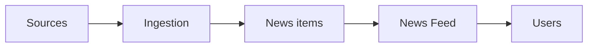

*图 16.1 信息流的初始高层架构。新闻来源把新闻条目提交给接入服务，接入服务处理后持久化到数据库。另一侧，用户向信息流服务查询，服务从数据库获取新闻条目。*

从这个架构可以得到几点观察：

- 接入服务必须高可用，并能处理大而不可预测的流量。可以考虑使用 Kafka 这类事件流平台。
- 数据库需要归档所有条目，但只需向用户提供最多 1,000 条。这意味着我们可以用一个数据库归档所有条目，用其他数据库服务所需条目。不同用途可选最合适的数据库技术。一个新闻条目约 10,000 个字符，约 10 KB；若按 UTF-8 字符计算，文本大小约 40 KB：
  - 用于提供 1,000 条和 100 个标签时，所有新闻条目的总大小约 1 GB，完全可以放入 Redis 缓存。
  - 用于归档时，可以使用 HDFS 这类分布式分片文件系统。
- 如果最终一致性可接受几小时，那么用户设备不需要比每小时更频繁地更新信息流，这能减少服务负载。

图 16.2 展示了高层架构。队列和 HDFS 数据库是 CDC（Change Data Capture，参见第 5.3 节）的例子，而从 HDFS 读取并写入 Redis 的 ETL 作业则是 CQRS（Command Query Responsibility Segregation，参见 1.4.6 节）的例子。

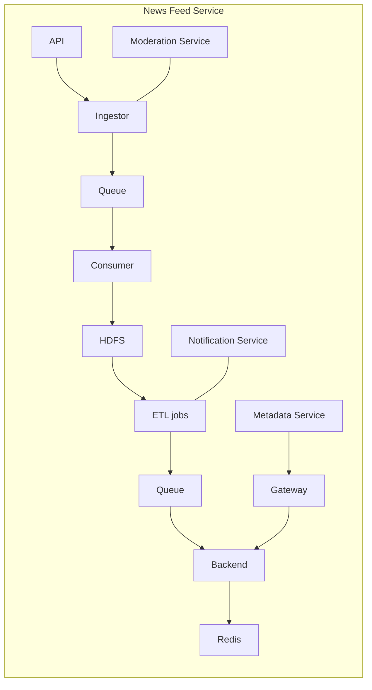

*图 16.2 信息流服务的高层架构。客户端向信息流服务提交帖子；接入器接收后执行简单校验，校验通过则将其写入 Kafka 队列。消费者集群消费该帖子并写入 HDFS。批处理 ETL 作业处理帖子并写入另一条 Kafka 队列，也可能通过通知服务触发通知。用户请求经 API 网关进入，网关可能先从元数据服务获取用户标签，再通过后端服务从 Redis 表中获取帖子。后端主机空闲时会消费队列并更新 Redis 表。*

信息流服务的来源把新帖子推送给接入器。接入器只执行可以仅依据新闻条目本身完成的验证，不执行依赖其他条目或其他数据的验证。示例如下：

- 清理字段值，避免 SQL 注入。
- 过滤与审查任务，例如检测不适当语言。这里可以分成两类标准：一类是立即拒绝，满足这些标准的条目会被直接拒绝；另一类是需要人工审查，满足这些标准的条目会被标记。这个标记可以在写入队列前附加到条目上。我们会在下一节进一步讨论。
- 条目不是来自被封禁的来源/用户。接入器会从审核服务获取被封禁用户列表，这些用户可由运维人员手动添加，或在某些事件后自动加入。
- 必填字段长度非零。
- 有最大长度限制的字段不能超长。
- 不能包含某些字符（例如标点）的字段，不应出现这些字符。

这些验证任务也可以在来源客户端向接入器提交前在应用端完成。但如果客户端因为 bug 或恶意行为跳过了某些验证，接入器可以重复执行这些验证。如果接入器中的任何验证失败，应触发告警，让开发者调查为何客户端和接入器给出不同的验证结果。

某些来源发起的请求在到达接入器前，可能需要先通过认证与授权服务。图 16.2 中未画出这一点。OAuth 认证和 OpenID 授权的讨论见附录 B。

我们使用 Kafka 队列处理这种不可预测流量。如果接入器验证通过，就将帖子写入 Kafka 队列并返回 200 Success；如果验证失败，则返回 400 Bad Request，并可附带失败原因说明。

消费者只是轮询队列并写入 HDFS。我们至少需要两张 HDFS 表：一张用于消费者提交的原始新闻条目，一张用于可供用户展示的新闻条目。我们可能还需要一张单独的表来存放需要人工审核后才能展示的条目。人工审核系统的详细讨论很可能超出面试范围。这些 HDFS 表按标签和小时分区。

用户通过 API 网关发起 GET /post 请求，网关先向元数据服务查询用户标签，再通过后端服务从 Redis 缓存中查询对应新闻条目。Redis 缓存键可以是 `(tag, hour)` 元组，值是对应的新闻条目列表。我们可以将该结构表示为 `{(tag, hour), [post]}`，其中 tag 是字符串，hour 是整数，post 是包含 post ID 字符串和正文/内容字符串的对象。

API 网关也承担 6.1 节中讨论的常规职责，例如认证授权与限流。如果主机数量增加到很大，而前端的常规职责与查询元数据服务和 Redis 服务所需硬件资源不同，我们可以把后两项功能拆成独立的后端服务，以便独立扩展。

关于最终一致性，以及“用户设备可能不需要比每小时更频繁地更新”的观察，如果用户在上一次请求后一小时内再次请求，我们可以用以下两种方式之一减少服务负载：

1. 设备直接忽略该请求。
2. 设备可以发起请求，但若响应是 504 超时，则不要重试。

ETL 作业会写入另一条 Kafka 队列。当后端主机不在为用户帖子请求服务时，它们可以消费 Kafka 队列并更新 Redis 表。

ETL 作业承担以下功能：

- 在原始新闻条目对用户可见之前，可能需要先执行依赖其他条目或其他数据的验证/内容审查任务。为简化起见，我们把所有这类任务统称为“validation tasks”。参见图 16.3，这些可以是并行 ETL 任务。我们可能需要为每个任务建立一个额外的 HDFS 表，每个表包含通过验证的条目 ID。示例如下：
  - 查找重复条目。
  - 如果某个标签/主题在最近一小时内可提交的新闻条目数量有限制，则可以有一个专门的验证任务来检查。
  - 求多个中间 HDFS 表中条目 ID 的交集。这个交集就是通过所有验证的 ID。将该集合写入最终 HDFS 表，再从最终 HDFS 表读取 ID，把对应新闻条目复制并覆盖到 Redis 缓存中。

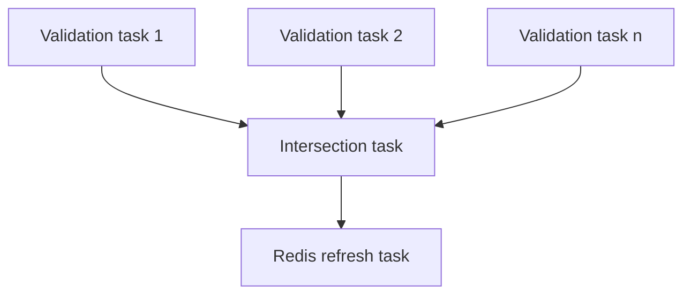

*图 16.3 ETL 作业 DAG。验证任务并行运行，每个任务输出一组有效的 post ID。任务完成后，交集任务求出这些集合的交集，也就是用户可见帖子 ID。*

我们也可能有 ETL 作业通过通知服务触发通知。通知渠道可能包括移动端和浏览器应用、电子邮件、短信和社交媒体。通知服务的详细讨论见第 9 章，这里不展开。

可以看到，审核在信息流服务中扮演关键角色，如图 16.2 所示，也体现在 ETL 作业中。我们还可能需要针对特定用户进行审核，例如前面提到的被封禁用户不能发请求。参见图 16.4，我们可以把这些审核统一到一个审核服务中。我们会在 16.4 节进一步讨论。

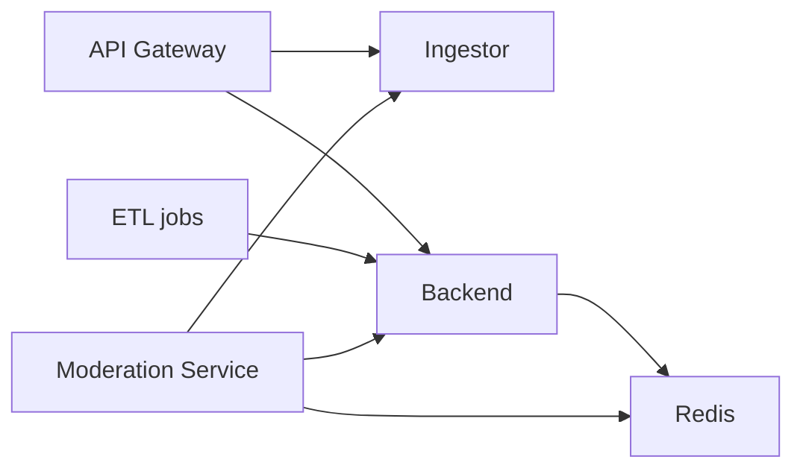

*图 16.4 把所有内容审核集中到一个审核服务后的高层架构。开发者可以在这个服务中定义全部内容审核逻辑。*

## 16.3 预先准备信息流

在图 16.2 的设计里，每个用户都需要对每个 `(tag, hour)` 组合执行一次 Redis 查询。为了拿到相关或期望的条目，一个用户可能要做很多次查询，这会给信息流服务带来高读取流量和潜在高延迟。

我们可以用更多存储换更低延迟和流量：提前准备好用户的信息流。我们可以准备两张哈希表：`{user ID, post ID}` 和 `{post ID, post}`。假设有 100 个 tag、每个 tag 下 1K 条 10K 字符的条目，后者哈希表大约占 1 GB。前者哈希表则需要存储 10 亿个 user ID，以及最多 100*1000 个可能的 post ID。一个 ID 是 64 位，总存储需求高达 800 TB，这可能超出 Redis 集群容量。一个可行方案是按区域分区用户，并在每个数据中心只保存两到三个区域，这样每个数据中心最多 2,000 万用户，约 16 TB。另一种方案是把存储限制在 1 TB 内，例如只保存少量 post ID，但这无法满足 1,000 条的需求。

另一个方案是使用分片 SQL 实现 `{user ID, post ID}` 对，如 4.3 节所述。我们可以按哈希后的 user ID 对这张表分片，使用户 ID 随机分布在节点间，活跃用户也会随机分散，从而避免热点分片问题。当后端收到某个 user ID 的帖子请求时，它可以先对 user ID 取哈希，再请求对应的 SQL 节点。（稍后我们会讨论它如何找到合适的 SQL 节点。）包含 `{post ID, post}` 的表可以复制到每个节点，这样我们就能在这两张表之间做 JOIN。（这张表还可以包含时间戳、标签等维度列。）图 16.5 展示了分片与复制策略。

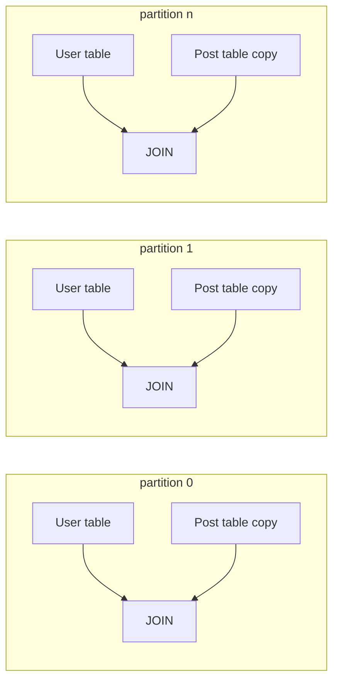

*图 16.5 我们的分片与复制策略。包含 `{hashed user ID, post ID}` 的表被分片到多个 leader 主机，并复制到 follower 主机。包含 `{post ID, post}` 的表复制到每个主机。我们可以按 post ID 做 JOIN。*

参见图 16.6，我们可以把 64 位哈希 user ID 地址空间分给不同集群：cluster 0 管 `[0, (2^64-1)/4)`，cluster 1 管 `[(2^64-1)/4, (2^64-1)/2)`，cluster 2 管 `[(2^64-1)/2, 3*(2^64-1)/4)`，cluster 3 管 `[3*(2^64-1)/4, 2^64-1)`。我们可以先这样平均划分；由于各集群流量不均衡，再通过调整划分数量与大小来平衡流量。

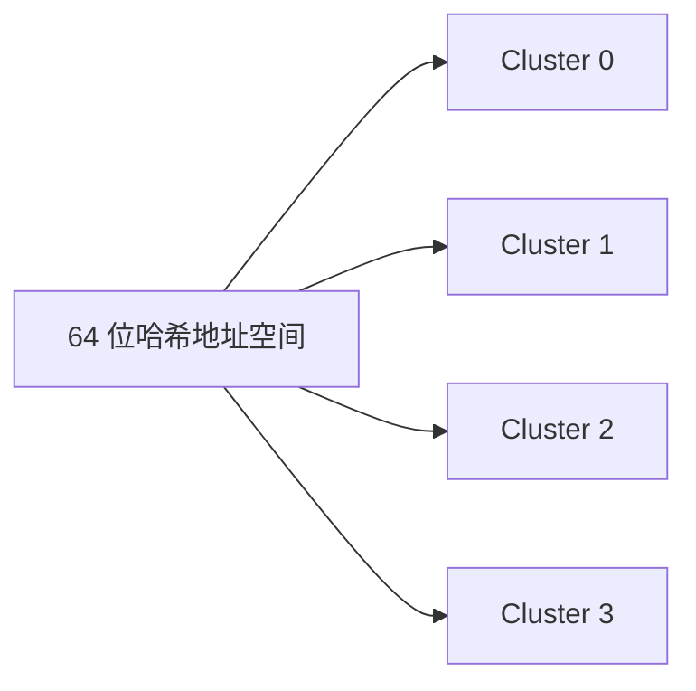

*图 16.6 哈希后的 user ID 到集群名的映射示意。这里假设有四个集群，因此每个集群占四分之一地址空间。*

后端如何找到合适的 SQL 节点？我们需要一份从哈希 user ID 到集群名的映射。每个集群可有多个 A 记录，每个 follower 一条，因此后端主机会随机分配到合适集群中的某个 follower 节点。

我们需要监控各集群的流量，以发现热点分片，并通过适当扩缩集群来重新平衡流量。我们可以调整主机磁盘容量来省成本；如果使用云厂商，也可以调整所用 VM 大小。

图 16.7 展示了采用这一设计后的信息流高层架构。用户发起请求时，后端先对 user ID 取哈希，再查 ZooKeeper 获取合适的集群名，并把 SQL 查询发送到该集群。查询发给随机 follower 节点执行，然后把结果帖子列表返回给用户。

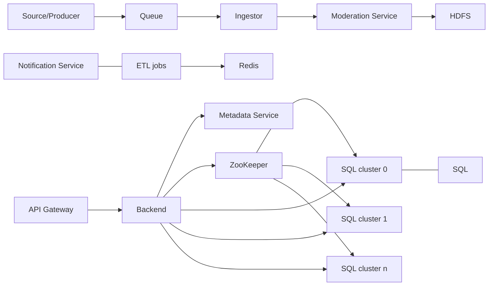

*图 16.7 预先准备用户信息流后的高层架构。与图 16.4 的差异已加粗说明。用户请求到达后端时，后端先获取合适的 SQL 集群名，再查询相应 SQL 集群中的帖子。后端也可以把 SQL 路由交给单独的 SQL 服务。*

如果我们唯一的客户端是移动应用（没有 Web 应用），可以把帖子存储在客户端上来节省存储。我们可以假设用户只需获取一次帖子，然后在获取后删除对应行。如果用户登录另一台移动设备，他们看不到之前设备上已获取的帖子。这个情况可能并不常见，因此可接受，尤其是新闻很快过时，用户在几天后也不会对某条帖子太感兴趣。

另一种方式是增加一个时间戳列，并由 ETL 作业定期删除 24 小时前的行。

我们也可以结合两种方案：当用户打开移动应用时，使用预先准备好的信息流只服务其第一次帖子请求，并只保存单节点能容纳的 post ID 数量；如果用户继续下滑，后续请求可以由 Redis 提供。图 16.8 展示了这一带 Redis 的高层架构。该方案的代价是更高的复杂度和维护开销，但能带来更低延迟和更低成本。

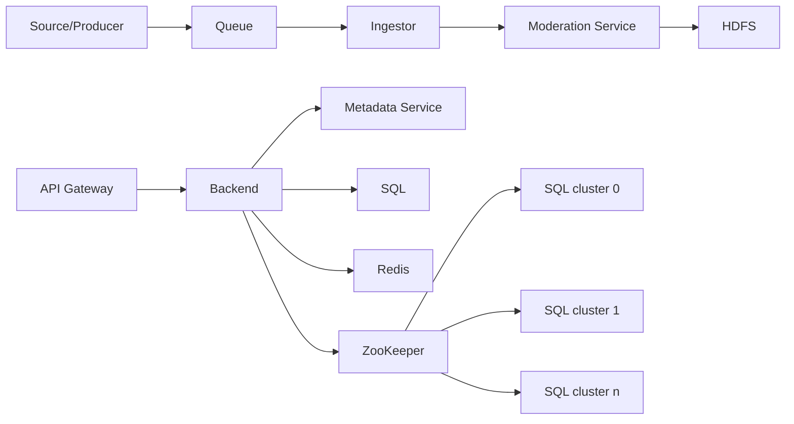

*图 16.8 同时使用预先准备的信息流和 Redis 服务的高层架构。与图 16.7 的差别是新增了 Redis 服务。*

下面讨论客户端如何避免多次从 Redis 获取相同帖子：

1. 客户端可以在 GET /post 请求里带上当前已有的 post ID，这样后端就能返回客户端尚未获取的帖子。
2. Redis 表按小时给帖子打标签。客户端可以请求某一小时的帖子；如果返回内容太多，我们可以改为更小的时间粒度（例如每 10 分钟一个块）。另一种方式是提供一个 API 端点，返回某一小时的所有 post ID，并在 GET /post 请求体中允许用户指定想取回的 post ID。

## 16.4 验证与内容审核

本节讨论验证相关问题及其解决方案。验证未必能发现所有问题，帖子也可能被错误地送达用户。内容过滤规则还可能因用户群体不同而不同。

第 15.6 节讨论了 Airbnb 的审批服务，它也是验证与内容审核的一种做法。这里我们简要讨论一下。图 16.9 展示了带审批服务的高层架构。某些 ETL 作业可能会把某些帖子标记为人工审核。我们可以把这些帖子送到审批服务做人工审核。若审核员批准帖子，它会经 Kafka 队列发送给后端并展示给用户；若审核员拒绝帖子，审批服务可以通过消息服务通知来源/客户端。

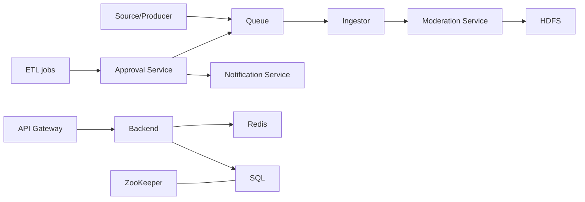

*图 16.9 ETL 作业可以把某些帖子标记为人工审批。这些帖子可以发送到审批服务（加粗，作为图 16.8 的新增服务）进行人工审核，而不是直接进入 Kafka 队列。*

### 16.4.1 改变用户设备上的帖子

某些验证很难自动化。例如，帖子可能被截断。为简单起见，考虑只有一句话的帖子：“This is a post.” 截断后的帖子可能是：“This is a.” 拼写错误的帖子容易检测，但这个帖子没有拼写错误，却明显无效。此类问题很难自动验证。

某些不适当内容，例如不当词汇，容易检测；但更复杂的不当内容，例如与年龄不符的内容、炸弹威胁或假新闻，则极难自动筛查。

在任何系统设计中，我们都不应试图防止所有错误和故障。我们应假设错误和故障不可避免，并设计机制便于检测、排查和修复。某些本不该发给用户的帖子可能会被误发。我们需要一种机制，能在信息流服务中删除这些帖子或用修正后的帖子覆盖它们。如果用户设备会缓存帖子，它们也应被删除或覆盖为修正版。

为此，我们可以修改 GET /posts 端点。每次用户获取帖子时，响应中应包含一份需要修正的帖子列表和一份需要删除的帖子列表。移动客户端应显示修正后的帖子并删除相应帖子。

一种做法是在帖子中添加一个 `event` 枚举，值可以是 `REPLACE` 和 `DELETE`。如果要替换或删除客户端上的旧帖子，我们应创建一个与旧帖子具有相同 post ID 的新帖子对象。该帖子对象的 `event` 值在替换时为 `REPLACE`，在删除时为 `DELETE`。

为了让信息流服务知道客户端上哪些帖子需要修改，前者需要知道客户端拥有哪些帖子。信息流服务可以记录客户端下载过的帖子 ID，但存储需求可能太大且太昂贵。

如果我们为客户端设置保留期（例如 24 小时或 7 天），让其自动删除旧帖子，那么这些旧日志也可以相应删除，但存储可能仍然昂贵。另一种方案是让客户端在 GET /post 请求中带上当前帖子 ID；后端可以处理这些 post ID，以决定应发送哪些新帖子（如前文所述），也可决定哪些帖子需要变更或删除。

在 16.4.3 节中，我们会讨论一种审核服务，其中一个关键功能是管理员可以查看当前信息流服务中可用的帖子，并做出变更或删除的审核决定。

### 16.4.2 给帖子打标签

我们可以假设批准或拒绝作用于整个帖子。也就是说，如果帖子任何部分验证或审核不通过，我们直接拒绝整个帖子，而不是试图只提供部分内容。对于验证失败的帖子，我们应如何处理？可以直接丢弃、通知来源，或者人工审核。第一种做法可能造成糟糕的用户体验，第三种做法在大规模下可能过于昂贵。我们可以选择第二种。

我们可以扩展图 16.3 中的交集任务，让它在任一验证失败时也向负责的来源/用户发送消息。交集任务可以汇总所有失败的验证，并一次性发给来源/用户。它可以借助共享消息服务发送消息。每个验证任务都可以有一个 ID 和简短描述。消息可以包含失败验证的 ID 与描述，供用户参考，以便在必要时联系公司讨论对帖子所作的更改，或对拒绝决定提出异议。

另一个可能需要讨论的需求是：我们是否需要区分全局规则与区域规则。某些规则可能只适用于特定国家，因为地方文化敏感性或政府法律法规不同。进一步推广来看，某些帖子应根据用户声明的偏好以及其人口属性（例如年龄或地区）不向其展示。更重要的是，我们不能在接入器中直接拒绝这些帖子，因为那样会把这些验证施加到所有用户，而不仅仅是特定用户。我们必须改为给帖子打上某些元数据标签，用于按用户过滤。为了避免与用户兴趣标签混淆，我们把这类标签称为过滤标签，简称 “filters”。一个帖子可以同时拥有 tags 和 filters。二者的关键区别在于：用户配置自己的 tags，而 filters 完全由我们控制。正如下一个小节所述，这意味着 filters 会在审核服务中配置，而 tags 不会。

我们假设：当新增一个 tag/filter 或删除现有 tag/filter 时，这一变化只对未来的帖子生效，不需要给历史帖子重新打标。

单次 Redis 查询已不足以让用户获取帖子。我们需要三张 Redis 哈希表，键值对如下：

- `{post ID, post}`：按 ID 获取帖子
- `{tag, [post ID]}`：按 tag 过滤帖子 ID
- `{post ID, [filter]}`：按过滤条件排除帖子

需要执行多次键值查询，步骤如下：

1. 客户端向信息流服务发起 GET /post 请求。
2. API 网关向元数据服务查询客户端的 tags 和 filters。客户端也可以自己保存这些 tags 和 filters，并在 GET /post 请求中直接提供，这样就可以跳过这一步。
3. API 网关查询 Redis，获取该用户 tags 和 filters 对应的 post ID。
4. 它再查询 Redis，获取每个 post ID 对应的 filter，并把包含任一用户 filter 的 post ID 排除掉。
5. 它查询 Redis，获取每个 post ID 对应的帖子，然后把这些帖子返回给客户端。

注意，根据 tag 过滤 post ID 的逻辑必须在应用层完成。另一种做法是使用 SQL 表代替 Redis 表。我们可以建立 post 表（`post_id, post`）、tag 表（`tag, post_id`）和 filter 表（`filter, post_id`），并通过 SQL JOIN 获取客户端帖子：

```sql
SELECT post
FROM post p JOIN tag t ON p.post_id = t.post_id
LEFT JOIN filter f ON p.post_id = f.post_id
WHERE p.post_id IS NULL
```

第 16.3 节讨论过通过 `{user_id, post_id}` 预先准备用户信息流。即使有本节讨论的帖子过滤需求，我们仍然可以通过 ETL 作业来准备这张 Redis 表。

最后，我们指出：对于区域化信息流，我们可能需要按区域分割 Redis 缓存，或者在 Redis 键中增加一个 `region` 列。如果需要支持多语言，也可以这样做。

### 16.4.3 审核服务

我们的系统在四个地方进行验证：客户端、接入器、ETL 作业，以及 GET /post 请求过程中的后端。我们在各种浏览器和移动应用以及接入器中实现相同的验证，即使这意味着重复开发与维护，并增加 bug 风险。验证会增加 CPU 开销，但会减少进入信息流服务的流量，从而缩小集群规模并降低成本。这种方式也更安全。如果黑客绕过客户端验证、直接向信息流服务发送 API 请求，服务器端验证仍会拦截这些无效请求。

对于服务器端验证来说，接入器、ETL 作业和后端的验证并不相同。不过，如图 16.4 所示，我们可以考虑把它们合并抽象成一个单独的服务，即审核服务。

正如前一小节关于 tags 与 filters 的提示，审核服务的通用目的，是让我们（而不是用户）控制用户是否会看到提交的帖子。到目前为止，审核服务会为管理员提供以下功能：

1. 配置验证任务和过滤器。
2. 执行审核决策，对帖子进行修改或删除。

将审核集中到一个服务中，能确保信息流服务各团队不会意外实现重复验证，也让非技术内容审核人员无需工程师协助就能完成所有审核任务。审核服务还会记录这些决策，便于复核、审计或回滚（反向撤销一次审核决定）。

> [!info]
> 一般来说，与工程团队沟通并推动工程工作优先级很难，尤其是在大型组织中。任何能让人不必频繁沟通就能完成工作的工具，通常都是很好的投资。

这个审核请求可以按信息流服务中的其他写请求相同方式处理。与 ETL 作业类似，审核服务把事件写入信息流 topic，而信息流服务消费该事件并把相关数据写入 Redis。

## 16.5 日志、监控与告警

在第 2.5 节中，我们讨论了日志、监控和告警的关键概念。除此之外，还应监控并对以下情况发出告警：

- 某个来源的流量速率异常大或异常小。
- 所有条目范围内，以及每个单独来源范围内，验证失败条目比例异常高。
- 负面用户反馈，例如用户因滥用或错误举报文章。
- 某条目在流水线中的处理耗时异常长。可通过比较条目上传时的时间戳与其到达 Redis 数据库时的当前时间来监控。处理过久可能意味着某些流水线组件需要扩容，也可能是存在需要重新审视的低效操作。

### 16.5.1 同时提供图片和文本

现在允许新闻条目包含 0–10 张图片，每张最多 1 MB。我们把图片视为帖子对象的一部分，tag 或 filter 作用于整个帖子对象，而不是帖子正文或任一图片这样的单独属性。

这会显著增加 GET /post 请求的开销。图片文件与帖子正文字符串有明显差异：

- 图片通常比正文大得多，因此可以考虑不同的存储技术。
- 图片可能在多个帖子之间复用。
- 图片验证算法很可能会使用图像处理库，这与正文字符串的验证方式明显不同。

### 16.5.2 高层架构

我们首先观察到：文章文本所需的 40 KB 存储，与其图片可能需要的 10 MB 相比可以忽略不计。这意味着上传或处理文章文本很快，而上传或处理图片需要更多时间和计算资源。

图 16.10 展示了带媒体服务的高层架构。媒体上传必须是同步的，因为来源需要知道上传成功还是失败。这意味着在加入媒体后，接入器服务集群会比以前大得多。媒体服务可以把媒体存储到共享对象存储服务中，该服务跨多个数据中心复制，因此用户可以从离自己最近的数据中心访问媒体。

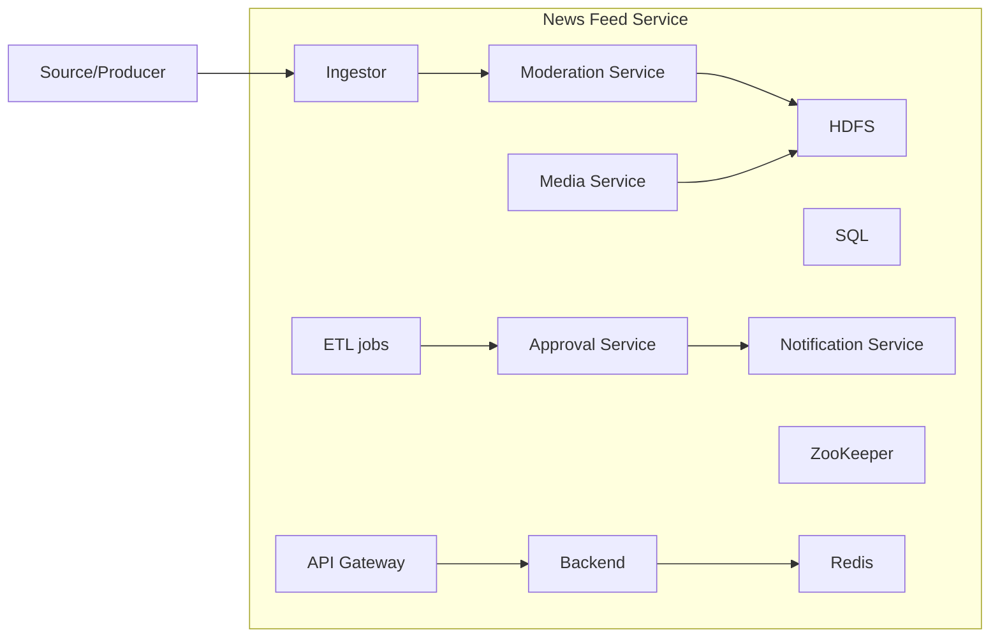

*图 16.10 增加媒体服务（加粗；该服务是图 16.9 的新增部分），使新闻条目可包含音频、图片和视频。独立的媒体服务也更便于单独管理和分析媒体，而不与新闻条目混在一起。*

图 16.11 是来源上传文章的时序图。由于媒体上传的数据量远大于元数据或文本，因此媒体上传应先于把文章元数据和文本写入 Kafka 队列。如果媒体上传成功但写队列失败，我们可以向来源返回 500 错误。在上传过程中，接入器可以先对文件做哈希并把哈希值发给媒体服务，以检查该文件是否已上传；若已存在，媒体服务可返回 304 响应，从而避免昂贵的网络传输。我们注意到，在这个设计里，消费者集群可以比媒体服务集群小得多。

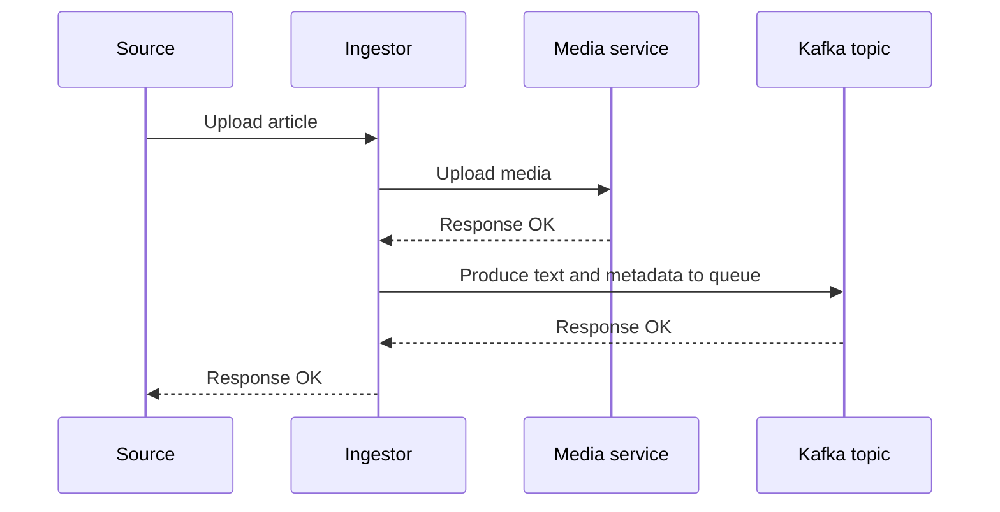

*图 16.11 来源上传文章的时序图。媒体通常远大于文本，因此接入器先把媒体上传到 Media Service。媒体成功上传后，接入器再把文本和元数据写入 Kafka topic，供消费者写入 HDFS。*

如果接入器主机在媒体成功上传之后、但还没来得及向 Kafka topic 写入之前就失败了，那么保留媒体是合理的，因为上传过程代价很高。来源会收到错误响应并可以重试；这次媒体服务可以像前文所述返回 304，然后接入器再生成相应事件。来源也可能不重试，那我们可以定期运行审计作业，找出没有对应元数据和文本的媒体并删除。

如果用户地理分布很广，或者媒体服务流量过重，可以使用 CDN。关于 CDN 系统设计可参见第 13 章。下载图片的授权令牌可以由 API 网关通过服务网格架构签发。图 16.12 展示了使用 CDN 的高层架构。新条目会包含标题、正文和媒体 URL 等文本字段。参见图 16.12，来源可以把图片上传到图像服务，把文本内容上传到信息流服务。客户端可以：

- 从 Redis 下载文章文本和媒体 URL。
- 从 CDN 下载媒体。

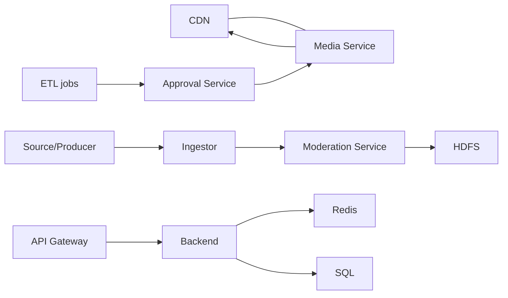

*图 16.12 使用 CDN（加粗；该服务是图 16.10 的新增部分）托管媒体。用户直接从 CDN 下载图片，享受 CDN 带来的低延迟和高可用等优势。*

图 16.10 与图 16.12 的主要区别如下：

- 媒体服务把媒体写入 CDN，用户则从 CDN 下载媒体。
- ETL 作业和审批服务会向媒体服务发起请求。

我们同时使用媒体服务和 CDN，是因为某些文章不会被展示给用户，所以它们的图片不必存入 CDN，这可以降低成本。某些 ETL 作业可能是对文章的自动批准，因此这些作业需要通知媒体服务文章已获批准，由媒体服务把文章媒体上传到 CDN 供用户访问。审批服务也会向媒体服务发起类似请求。

我们可以讨论把文本和媒体拆成独立服务与合并成单一服务的权衡。可参见第 13 章讨论把图片托管到 CDN 的更多细节。

> [!info]
> 进一步说，我们也可以把完整文章（包括文本和媒体）都托管到 CDN 上。Redis 的值可以缩减为 article ID。虽然文章文本通常比媒体小得多，但把文本放到 CDN 上，尤其是在热门文章被频繁请求时，也可能带来性能收益。Redis 可以水平扩展，但跨数据中心复制较复杂。

在审批服务中，文章的图片和文本应分开审还是一起审？为简化起见，可以把文章文本和媒体作为一篇完整文章一起审核。

如何更高效地审核媒体？人工审核成本高，而且审核员需要完整听完音频或看完视频才能决定。我们可以考虑转写音频，让审核员阅读而不是收听音频，这也能让听障人员参与审核，提升公司的包容文化。审核视频时，工作人员可以把视频以 2x 或 3x 速度播放，并把转写后的音频与视频分开阅读。我们也可以考虑使用机器学习方案来审核文章。

## 16.6 其他可能的讨论主题

以下是在面试推进过程中，面试官或候选人可能提出的其他主题：

- 创建动态的 hashtags，而不是固定主题集合。
- 用户可能希望把新闻条目分享给其他用户或群组。
- 更详细地讨论给创作者和读者发送通知。
- 文章的实时传播：ETL 作业必须是流式而不是批处理。
- 通过 boosting 对某些文章进行优先级提升。

还可以考虑功能需求讨论中的范围外项：

- 分析。
- 个性化。把所有用户都看到的 1,000 条新闻改为每个用户看到一组个性化的 100 条新闻，这会复杂得多。
- 以英文以外的语言提供文章。可能会有 UTF 或语言翻译等问题。
- 信息流货币化。主题包括：
  - 设计订阅系统。
  - 为订阅者保留某些帖子。
  - 为非订阅者设置文章上限。
  - 广告与推广帖子。

## 总结

- 在绘制信息流系统的初始高层架构时，要考虑主要关注的数据，并画出读写这些数据到数据库的组件。
- 先考虑读写数据所需的非功能需求，再选择合适的数据库类型，并考虑配套服务，例如 Kafka 和 Redis。
- 把不需要低延迟的操作放入批处理和流式任务中以提高可扩展性。
- 找出必须在写入和读取前后执行的处理步骤，并把它们封装进服务。前置处理可能包括压缩、内容审核以及从其他服务查找相关 ID 或数据；后置处理可能包括通知和索引。本章信息流系统中的示例服务包括接入器、消费者、ETL 作业和后端服务。
- 日志、监控和告警应针对失败和异常事件进行。
