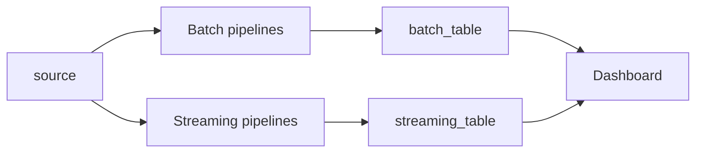
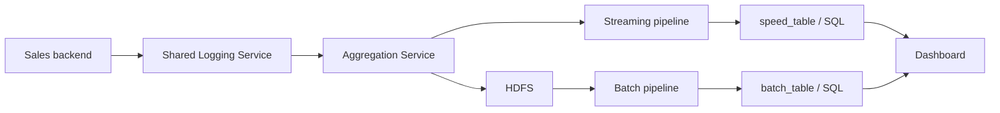
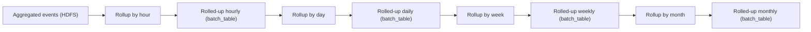
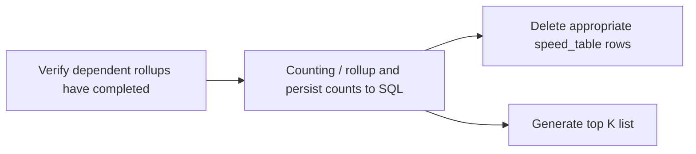
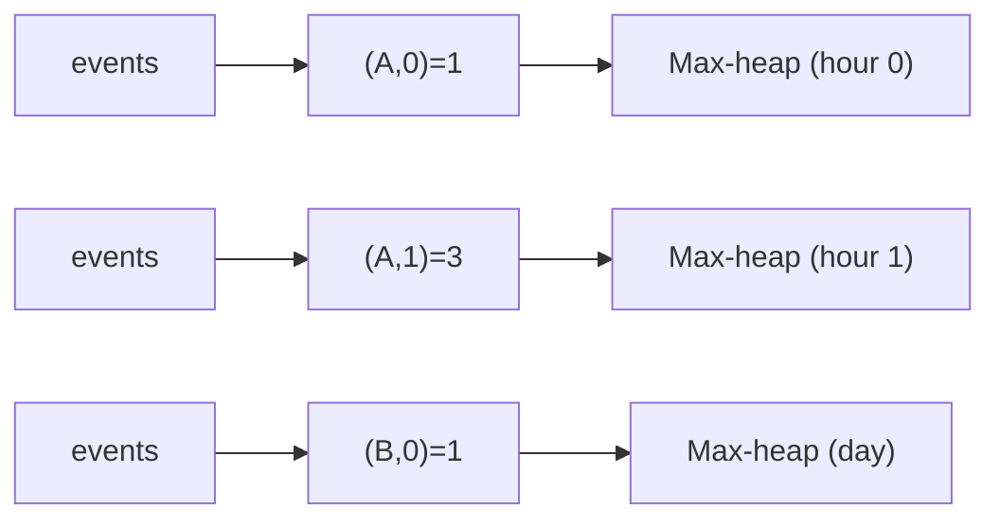
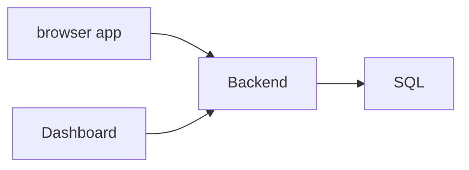
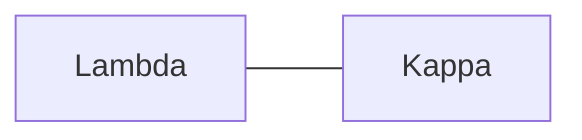
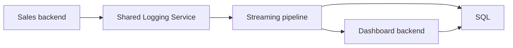

# 17 第 17 章：设计按销量统计 Amazon 前 10 商品仪表盘（Design a Dashboard of Top 10 Products on Amazon by Sales Volume）

本章包括：

- 扩展大规模数据流上的聚合操作
- 使用 Lambda 架构获得快速的近似结果和较慢的精确结果
- 使用 Kappa 架构作为 Lambda 架构的替代方案
- 通过近似方法加快聚合操作

分析是系统设计面试中的常见话题。我们总会记录某些网络请求和用户交互，并基于收集到的数据做分析。

Top K 问题（Heavy Hitters）是常见的仪表盘类型。根据某些商品的受欢迎程度或不受欢迎程度，我们可以决定推广还是停售它们。这类决策并不总是直观。例如，如果某商品不受欢迎，我们可以选择停售以节省销售成本，也可以投入更多资源推广它来提升销量。

Top K 问题既可能作为分析话题在面试中讨论，也可能是一个独立的面试题。它可以有很多形式，例如：

- 电商应用中销量最高或最低的商品（本题）或营收最高或最低的商品。
- 电商应用中浏览量最高或最低的商品。
- 应用商店中下载量最多的应用。
- 视频应用（如 YouTube）中观看量最高的视频。
- 音乐应用（如 Spotify）中最受欢迎（播放最多）或最不受欢迎的歌曲。
- 交易所（如 Robinhood 或 E*TRADE）中交易最活跃的股票。
- 社交媒体应用中转发最多的帖子，例如 Twitter 上转推最多的推文，或 Instagram 上分享最多的帖子。

## 17.1 需求

让我们通过问几个问题来确定功能与非功能性需求。假设我们能访问 Amazon 或其他电商应用的数据中心。

- 如何处理并列？

高准确性可能并不重要，因此并列时可以任意选择一个项目。

- 我们关注哪些时间区间？

系统应能按指定区间聚合，例如小时、天、周或年。

- 使用场景会影响所需准确性（以及其他要求，如可扩展性）。这些信息的使用场景是什么？所需准确性、所需一致性/延迟是什么？

这是个好问题。你想表达什么？

计算实时精确销量和排名会非常消耗资源。也许可以采用 Lambda 架构，提供一个最终一致的方案：对最近几小时给出近似销量和排名，对更早时间段给出准确结果。

我们也可以在准确性、可扩展性、成本、复杂度和可维护性之间做权衡。我们预计某个 Top K 列表会在对应时间段结束至少数小时后才需要计算，所以一致性不是问题。低延迟也不是问题；生成一个列表可能需要很多分钟。

- 我们只需要 Top K 或 top 10，还是需要任意数量商品的销量和排名？

和前一个问题类似，我们可以接受这样一种方案：对最近几小时提供近似的 top 10 商品销量和排名，对更早的任意时间段提供准确的任意数量商品销量和排名，甚至可以超过 10 个商品。

- 我们是否需要在 Top K 列表里显示销量，还是只显示排名？

我们会同时显示排名和计数。这个问题看起来多余，但如果不需要显示某些数据，可能会简化设计。

- 是否需要考虑销售之后发生的事件？例如退款、换货，或商品被召回。

这是一个很能体现行业经验和细节关注的问题。假设我们只考虑初始销售事件，忽略之后的争议或召回。

- 讨论可扩展性需求。销售事务速率是多少？Heavy Hitters 仪表盘的请求率是多少？我们有多少商品？

假设每天有 100 亿条销售事件（即高强度销售流量）。按每个事件 1 KB 计算，写入速率是 10 TB/天。Heavy Hitters 仪表盘只供员工查看，所以请求率很低。假设我们有约 100 万个商品。

我们没有其他非功能需求。高可用或低延迟（以及它们带来的复杂性）不是必须的。

## 17.2 初始思路

我们的第一个想法可能是把事件记录到分布式存储（如 HDFS 或 Elasticsearch），在需要计算某个时间段的 Top K 时再跑 MapReduce、Spark 或 Elasticsearch 查询。然而这种方式计算量大，可能太慢。计算一个月或一年的 Top K 可能需要数小时甚至数天。

如果除了生成这个列表外没有其他用途，把原始销售日志保存几个月或几年只是为了这个目的就太浪费了。如果每秒记录数百万请求，全年累计会达到 PB 级。我们也许确实想保留几个月或几年原始事件，用于处理客户争议与退款、故障排查或合规，但这个保留周期仍可能不足以支持我们想要的 Top K 列表。

在计算 Top K 列表之前，我们需要预处理数据。我们应该周期性聚合并统计商品销量，按小时、天、周、月和年分桶。之后在需要 Top K 列表时：

1. 如有需要，先按所需周期汇总对应桶的计数。例如，若需要某个月的 Top K，直接使用该月桶；若需要三个月区间，则把该区间内各月桶相加。这样，在求和后可删除原始事件以节省存储。
2. 再对这些和进行排序，得到 Top K 列表。

我们需要保存这些桶，因为销量可能极不均匀。在极端情况下，商品 A 可能在某一年中的某一小时卖出 100 万件，而该年其他时间卖出 0 件；其他商品全年总销量远低于 100 万。只要某个时间段包含该小时，商品 A 就会出现在 Top K 列表中。

本章剩余部分讨论如何在分布式环境中大规模执行这些操作。

## 17.3 初始高层架构

我们先考虑 Lambda 架构。Lambda 架构是一种通过同时使用批处理和流处理来处理海量数据的方法。参见图 17.1，我们的 Lambda 架构由两条并行的数据处理流水线和一个组合两者结果的服务层组成：

1. 一个流式层/流水线，从所有发生销售交易的数据中心实时摄取事件，并使用近似算法计算最热门商品的销量和排名。
2. 一个批处理层，或定期运行的批处理流水线（每小时、每天、每周、每年），用于计算准确的销量和排名。为了让用户在准确结果可用时看到这些结果，我们的批处理 ETL 作业可以包含一个任务，用批处理结果覆盖流式流水线的结果。



*图 17.1 Lambda 架构高层草图。箭头表示请求方向。数据流经并行的流式与批处理流水线。每条流水线都把最终输出写入数据库表。流式流水线写入 speed_table，批处理流水线写入 batch_table。仪表盘结合两张表生成 Top K 列表。*

沿着事件驱动架构（EDA）的思路，销售后端服务把事件发送到 Kafka topic，这个 topic 可供所有下游分析使用，包括我们的 Top K 仪表盘。

## 17.4 聚合服务

Lambda 架构的一个初始优化，是先对销售事件做一些聚合，再把这些聚合后的销售事件同时送入流式和批处理流水线。聚合可以缩小两条流水线的集群规模。图 17.2 展示了更详细的初始架构。流式和批处理流水线都写入 RDBMS（SQL），仪表盘可以低延迟查询。若只需要简单键值查找，也可以用 Redis，但我们的仪表盘及未来服务很可能还需要过滤和聚合操作。



*图 17.2 Lambda 架构：包含一个初始聚合服务，以及流式和批处理流水线。销售后端把事件记录到共享日志服务，聚合服务消费这些事件、聚合后把它们刷新到流式流水线和 HDFS。批处理流水线基于 HDFS 计算计数并写入 SQL 的 batch_table。流式流水线比批处理更快但不那么精确，并写入 SQL 的 speed_table。仪表盘结合 batch_table 与 speed_table 生成 Top K 列表。*

> [!note]
> 事件驱动架构（EDA）使用事件来触发并在解耦服务之间通信。可参见 AWS 相关文档及其他资料了解更多。

我们在第 4.5 节讨论过聚合及其收益与权衡。我们的聚合服务由一组主机构成，它们订阅记录销售事件的 Kafka topic，聚合这些事件，并把聚合后的事件写入 HDFS（通过 Kafka）以及流式流水线。

### 17.4.1 按 product ID 聚合

例如，原始销售事件可能包含 `(timestamp, product ID)` 这样的字段，而聚合事件可以是 `(product_id, start_time, end_time, count, aggregation_host_id)`。由于精确时间戳并不重要，所以可以聚合这些事件。如果某些时间区间很重要（例如按小时），则应确保 `(start_time, end_time)` 始终落在同一小时内。例如 `(0100, 0110)` 可以，但 `(0155, 0205)` 不可以。

### 17.4.2 匹配 host ID 与 product ID

我们的聚合服务可以按 product ID 分区，因此每个主机负责聚合一组特定 ID。为简单起见，我们可以手动维护 `(host ID, product ID)` 映射。这个配置有多种实现方式，包括：

1. 包含在服务源代码中的配置文件。每次修改后都必须重启整个集群。
2. 放在共享对象存储中的配置文件。服务的每个主机启动时读取该文件，并把自己负责的 product ID 存入内存。服务还需要一个用于更新其 product ID 的端点；修改文件后，可以调用这个端点让将消费不同 product ID 的主机更新。
3. 将映射存为 SQL 或 Redis 中的数据库表。
4. Sidecar 模式：主机向 sidecar 发起 fetch 请求，sidecar 获取相应 product ID 的事件并返回给主机。

我们通常会选方案 2 或 4，这样每次配置变更就不必重启整个集群。之所以选文件而不是数据库，原因如下：

- YAML、JSON 等配置文件格式可以很容易解析成 hash map，使用数据库表则需要更多代码：ORM、数据库查询、DAO，以及把 DAO 与 hash map 对齐。
- 主机数量大概率不会超过几百或几千，配置文件会很小，每个主机都能把整个文件读入。我们不需要数据库那种低延迟读性能。
- 配置变更不够频繁，没必要承担 SQL 或 Redis 这类数据库的额外开销。

### 17.4.3 存储时间戳

如果确实需要把精确时间戳存到某处，这个存储应由销售服务负责，而不是分析或 Heavy Hitters 服务负责。我们应维持职责分离。除 Heavy Hitters 外，还会有很多分析流水线围绕销售事件定义；我们应该能自由开发和下线这些流水线，而不必受其他服务约束。换言之，在决定其他服务是否应成为这些分析服务的依赖时要非常谨慎。

### 17.4.4 主机上的聚合过程

一个聚合主机包含一个以 product ID 为键、计数为值的哈希表。它还会对自己消费的 Kafka topic 做 checkpoint，把检查点写入 Redis。检查点包含已聚合事件的 ID。虽然聚合服务可以拥有比 Kafka topic 分区更多的主机，但通常这没必要，因为聚合是简单且快速的操作。每个主机会重复执行：

1. 从 topic 消费一个事件。
2. 更新哈希表。

聚合主机可以按固定周期刷新哈希表，或者在内存快用尽时刷新，以先发生者为准。刷新的可能实现如下：

1. 把聚合事件写入一个 Kafka topic，我们可以把它命名为 “Flush”。如果聚合数据很小（例如几 MB），可以把它作为单个事件写出，内容是若干 product ID 聚合元组列表，字段为 `("product ID", "earliest timestamp", "latest timestamp", "number of sales")`，例如 `[(123, 1620540831, 1620545831, 20), (152, 1620540731, 1620545831, 18), ...]`。
2. 使用 CDC（参见 5.3 节），每个目标端都有一个 consumer 来消费该事件并把它写入：
   - 写入 HDFS。
   - 向 Redis 写入一个状态为 “complete” 的 checkpoint 元组（例如 `{"hdfs": "1620540831, complete"}`）。
   - 对流式流水线重复步骤 2a–c。

如果没有这个 “Flush” Kafka topic，且某个 consumer 主机在向特定目标写入聚合事件时失败，那么聚合服务将不得不重新聚合这些事件。

为什么需要写两个 checkpoint？这只是维持一致性的若干可能算法之一。

如果主机在步骤 1 失败，另一台主机可以消费 flush 事件并执行写入。如果主机在步骤 2a 失败，写入 HDFS 可能成功也可能失败，另一台主机可以从 HDFS 读取以检查写入是否成功，或是否需要重试。读取 HDFS 是昂贵操作，而主机故障很少发生，所以这个昂贵操作也会很少发生。如果担心这种昂贵的故障恢复机制，我们可以把它做成周期性操作，去读取所有一两分钟前到几分钟前的 “processing” checkpoint。

故障恢复机制本身也应具备幂等性，以防它在执行过程中失败而需要重做。

我们应该考虑容错。任何写操作都可能失败。聚合服务、Redis 服务、HDFS 集群或流式流水线中的任一主机都可能在任何时刻失败。网络问题也可能中断对服务任一主机的写请求。某次写事件可能返回 200，但实际上发生了静默错误。这些情况会导致三个服务状态不一致。因此，我们为 HDFS 和流式流水线分别写独立 checkpoint。写事件应带有 ID，以便目标服务在需要时做去重。

在需要把一个事件写入多个服务时，有哪些防止不一致的方法？

1. 在每次写入各服务后都做 checkpoint，也就是我们刚讨论的方式。
2. 如果需求允许不一致，可以什么都不做。例如，我们也许能容忍流式流水线的一些不准确，但批处理流水线必须准确。
3. 周期性审计（也称 supervisor）。如果数值对不上，就丢弃不一致结果并重新处理相关数据。
4. 使用分布式事务技术，如 2PC、Saga、Change Data Capture 或 Transaction Supervisor。这些内容在第 4 章和附录 D 中讨论过。

如第 4.5 节所述，聚合的另一面是：实时结果会因聚合和刷新所需时间而延迟。如果仪表盘要求低延迟更新，聚合可能并不合适。

## 17.5 批处理流水线

批处理流水线在概念上比流式流水线更直接，所以我们先讨论它。

图 17.3 展示了批处理流水线的简化流程图。批处理流水线由一系列按更大时间间隔进行的聚合/rollup 任务组成。我们先按小时，再按天、周、月和年进行 rollup。若有 100 万个 product ID：

1. 按小时 rollup 会得到每天 2,400 万行或每周 1.68 亿行。
2. 按月 rollup 会得到每月 2,800–3,100 万行或每年 3.36–3.72 亿行。
3. 按天 rollup 会得到每周 700 万行或每年 3.64 亿行。



*图 17.3 批处理流水线中的 rollup 任务简化流程图。我们有一个 rollup 作业，按递增时间区间逐步聚合，从而减少每个阶段处理的行数。*

让我们估算存储需求。4 亿行、每行 10 个 64 位列，占用约 32 GB。这很容易放入单机。按小时的 rollup 作业可能需要处理数十亿销售事件，因此可以用 Hive 查询从 HDFS 读取并把结果计数写入 SQL 的 batch_table。其他区间的 rollup 可以利用小时 rollup 后行数大幅减少的结果，只需读取和写入这个 batch_table。

在这些 rollup 中，我们可以按计数降序排序，并把 Top K（或者为了灵活性取 K*2）行写入 SQL 数据库供仪表盘展示。

图 17.4 是批处理流水线中某一阶段（即某个 rollup 作业）的简化 ETL DAG。每个 rollup 都会有一个 DAG（总共四个 DAG）。一个 ETL DAG 包含四个任务，其中第 3 和第 4 是同级任务。这里使用 Airflow 的 DAG、task 和 run 术语：

1. 对于高于小时级别的 rollup，需要一个任务验证其依赖的 rollup 是否已成功完成。或者也可以验证所需 HDFS/SQL 数据是否可用，但这会带来昂贵的数据库查询。
2. 运行 Hive 或 SQL 查询，汇总计数并按降序写入 batch_table。
3. 删除 speed_table 中对应行。这个任务要独立于任务 2，因为前者可以单独重跑，而不需要重跑昂贵的 Hive/SQL 查询。如果任务 3 在删除行时失败，应当重试删除，而不必重跑第 2 步。
4. 使用这些新的 batch_table 行生成或重新生成适当的 Top K 列表。如 17.5 节后文所述，这些 Top K 列表大概率已经使用 batch_table 与不准确的 speed_table 生成过了，因此这里会用只有 batch_table 的数据重新生成。这个任务并不昂贵，但也应可独立重跑，因此将其作为独立任务实现。



*图 17.4 一个 rollup 作业的 ETL DAG。组成任务包括验证依赖 rollup 是否完成、执行 rollup/计数并持久化到 SQL，然后删除相应 speed_table 行，因为它们已不再需要。*

关于任务 1，日级 rollup 只能在其依赖的所有小时级 rollup 写入 HDFS 后进行；周级和月级同理。一个日级 rollup run 依赖 24 个小时级 run；一个周级 run 依赖 7 个日级 run；一个月级 run 依赖 28–30 个日级 run，视月份而定。如果使用 Airflow，可以在日、周、月 DAG 中使用合适 `execution_date` 参数的 `ExternalTaskSensor` 实例来验证依赖 run 是否成功完成。

## 17.6 流式流水线

批处理作业可能需要很多小时才能完成，这会影响所有区间的 rollup。例如，最新小时 rollup 的 Hive 查询可能要 30 分钟，这样其后的 rollup 以及相应 Top K 列表都会不可用：

- 该小时的 Top K 列表不可用。
- 包含该小时的那一天的 Top K 列表不可用。
- 包含该天的那一周和那一月的 Top K 列表不可用。

流式流水线的目的，就是提供批处理流水线尚未提供的那些计数（和 Top K 列表）。流式流水线必须比批处理快得多，并且可以使用近似技术。

在初始聚合之后，下一步是计算最终计数并按降序排序，然后就能得到 Top K 列表。本节先考虑单机方案，再讨论如何水平扩展。

### 17.6.1 单机的哈希表与最大堆

我们的第一个尝试是使用哈希表，再用大小为 K 的最大堆按频次排序。清单 17.1 是一个采用该方法的 Go 示例函数。

```go
type HeavyHitter struct {
  identifier string
  frequency int
}

func topK(events []String, int k) (HeavyHitter) {
  frequencyTable := make(map[string]int)
  for _, event := range events {
    value := frequencyTable[event]
    if value == 0 {
      frequencyTable[event] = 1
    } else {
      frequencyTable[event] = value + 1
    }
  }

  pq = make(PriorityQueue, k)
  i := 0
  for key, element := range frequencyTable {
    pq[i++] = &HeavyHitter{
      identifier: key,
      frequency: element
    }
    if pq.Len() > k {
      pq.Pop(&pq).(*HeavyHitter)
    }
  }

  /*
   * Write the heap contents to your destination.
   * Here we just return them in an array.
   */
  var result [k]HeavyHitter
  i := 0
  for pq.Len() > 0 {
    result[i++] = pq.Pop(&pq).(*HeavyHitter)
  }
  return result
}
```

在我们的系统里，可以并行运行这个函数的多个实例，分别处理不同时间桶（即小时、天、周、月、年）。每个周期结束时，我们可以存储最大堆内容，把计数重置为 0，并开始统计新周期。

### 17.6.2 扩展到多主机与多层聚合

图 17.5 展示了水平扩展到多主机以及多层聚合。中间列的两台主机会汇总左列上游主机的 `(product, hour)` 计数，而右列中的最大堆会聚合中间列上游主机的 `(product, hour)` 计数。



*图 17.5 如果流向最终哈希表主机的流量过高，我们可以在流式流水线中使用多层方案。为简洁起见，键按 `(product, hour)` 的格式展示。最终层主机可以包含多个最大堆，每个滚动区间一个。这与 4.5.2 节讨论的多层聚合服务非常相似。*

在这个方案中，我们在第一层主机和最终哈希表主机之间插入更多层，这样没有任何主机接收到超出处理能力的流量。这本质上只是把实现多层聚合服务的复杂度从聚合服务转移到了流式流水线。该方案会引入延迟，如 4.5.2 节所述。我们还会按照 4.5.3 节与图 4.6 的分区思路进行分区。关于热点分区的讨论也同样适用。我们按 product ID 分区，也可以按销售事件时间戳分区。

### 聚合

注意，我们按 product ID 与时间戳的组合来聚合。继续阅读之前，先想想为什么。

为什么按 product ID 与时间戳组合聚合？因为 Top K 列表有时间段，包含开始时间和结束时间。我们需要确保每个销售事件都被聚合到正确的时间范围里。例如，发生在 `2023-01-01 10:08 UTC` 的销售事件，应聚合到：

1. `[2023-01-01 10:08 UTC, 2023-01-01 11:00 UTC)` 的小时范围。
2. `[2023-01-01, 2023-01-02)` 的天范围。
3. `[2022-12-28 00:00 UTC, 2023-01-05 00:00 UTC)` 的周范围。`2022-12-28` 和 `2023-01-05` 都是星期一。
4. `[2023-01-01, 2013-02-01)` 的月范围。
5. `[2023, 2024)` 的年范围。

我们的做法是按最小周期（即小时）进行聚合。我们预计任何事件经过集群所有层级只需几秒，因此某个键在集群中存在超过一小时的情况不太可能。每个 product ID 有自己的键。把小时范围附加到每个键后，键的数量很可能不会超过商品数的两倍。

在一个周期结束后一分钟——例如，对于 `[2023-01-01 10:08 UTC, 2023-01-01 11:00 UTC)` 在 `2023-01-01 11:01 UTC`，或者对于 `[2023-01-01, 2023-01-02)` 在 `2023-01-02 00:01 UTC`——最终层主机可以把自己的堆写入 SQL 的 speed_table，然后我们的仪表盘就可以展示这个时间段的 Top K 列表了。偶尔某个事件需要超过一分钟才能穿过所有层，最终层主机只需把更新后的堆重新写入 speed_table 即可。我们可以让最终层主机保留几小时或几天的旧聚合键，之后再删除。

另一种做法不是等待一分钟，而是跟踪事件穿过各主机的过程，并只在所有相关事件都到达最终主机后触发其把堆写入 speed_table。不过这可能过于复杂，而且会阻止仪表盘在所有事件完全处理前就展示近似结果。

## 17.7 近似

为了降低延迟，我们可能需要减少聚合服务中的层数。图 17.6 是这类设计的一个例子。我们只保留由最大堆组成的层。这种方式以准确性换取更快的更新和更低成本。更慢但高度准确的聚合则可以交给批处理流水线。

为什么最大堆单独放在主机里？这是为了在扩容集群时简化新主机的供应。正如第 3.1 节所述，系统可扩展的标准是能容易地上下扩缩。我们可以为哈希表主机和最大堆主机分别准备不同 Docker 镜像，因为哈希表主机数量可能经常变化，而最大堆主机同时活跃的不会超过一台（及其副本）。


*图 17.6 多层最大堆。聚合会更快，但准确性更低。为简洁起见，此图不显示时间桶。*

然而，该设计生成的 Top K 列表可能不准确。我们不能仅仅在每个主机上都放一个最大堆然后合并它们，因为这样最终的最大堆未必真的包含 Top K 商品。例如，若主机一的哈希表是 `{A: 7, B: 6, C: 5}`，主机二的哈希表是 `{A: 2, B: 4, C: 5}`，而堆大小为 2，则主机 1 的最大堆会包含 `{A: 7, B: 6}`，主机 2 的最大堆会包含 `{B: 4, C: 5}`。最终合并后的堆会是 `{A: 7, B: 10}`，这会错误地把 C 排除在前两名之外。正确的最终最大堆应为 `{B: 10, C: 11}`。

### 17.7.1 Count-min sketch

前面的示例方案要求每台主机都维护一个与商品数量同规模的哈希表（本例约 100 万）。我们可以通过使用近似算法，在牺牲准确性的前提下减少内存占用。Count-min sketch 是一种合适的近似算法。

我们可以把它看作一个二维表，具有宽度和高度。宽度通常是几千，而高度很小，表示哈希函数的数量（例如 5）。每个哈希函数的输出都限制在宽度范围内。新项到来时，我们对它应用每个哈希函数，并递增对应单元格。

下面以序列 “A C B C C” 为例。C 是最常见的字母，出现 3 次。表 17.1–17.5 展示了 count-min sketch 的状态变化。我们在每一步中把哈希命中的值加粗以便突出。

1. 使用五个哈希函数对第一个字母 “A” 取哈希。表 17.1 显示每个哈希函数都把 “A” 映射到不同值。
2. 再加入第二个字母 “C”。表 17.2 显示前四个哈希函数把 “C” 映射到了与 “A” 不同的位置，第五个哈希函数发生碰撞，因此该值加 1。
3. 再加入第三个字母 “B”。表 17.3 显示第四和第五个哈希函数发生了碰撞。
4. 再加入第四个字母 “C”。表 17.4 显示只有第五个哈希函数发生碰撞。
5. 再加入第五个字母 “C”。该操作与上一步相同。表 17.5 是序列 “A C B C C” 后的 count-min sketch。

要找出现次数最高的项，我们先取每一行的最大值集合 `{3, 3, 3, 3, 5}`，再取这些最大值中的最小值 “3”。要找第二高的项，我们先取每一行的第二高值集合 `{1, 1, 1, 2, 5}`，再取这些值中的最小值 “1”。依此类推。通过取最小值，我们降低了高估的概率。

有公式可以根据所需准确性及达到该准确性的概率来计算宽度和高度，这超出本书范围。

count-min sketch 的二维数组取代了前面方案中的哈希表。我们仍然需要一个堆来存储 heavy hitters 列表，但用一个预定义大小、且不随数据集规模变化的 count-min sketch 二维数组，替代了一个可能很大的哈希表。

## 17.8 带 Lambda 架构的仪表盘

参见图 17.7，我们的仪表盘可以是一个浏览器应用，它向后端服务发出 GET 请求，而后者再执行 SQL 查询。到目前为止的讨论都围绕批处理流水线写入 batch_table、流式流水线写入 speed_table，而仪表盘应当从这两张表构造 Top K 列表。



*图 17.7 我们的仪表盘结构很简单：浏览器应用向后端服务发 GET 请求，后端再发 SQL 请求。浏览器应用的功能需求可能会逐步增长，从只显示某个时间段（例如上个月）的前 10 名列表，扩展到更大的列表、更多时间段、过滤或聚合（如百分位数、均值、众数、最大值、最小值）。*

然而，SQL 表不保证顺序，对 batch_table 和 speed_table 做过滤与排序可能要花几秒。为了实现 P99 < 1 秒，SQL 查询应当只是对一个单独视图的简单 SELECT；该视图包含排名与计数，我们把它称为 top_1000 view。这个视图可以通过从 speed_table 和 batch_table 的每个周期中选取前 1,000 个商品构造而成。它还可以包含一个额外列，指示每行来自 speed_table 还是 batch_table。当用户请求某个区间的 Top K 仪表盘时，后端可以查询这个视图，尽可能从 batch 表获取数据，再用 speed 表补全空缺。参见 4.10 节，浏览器应用与后端服务也可以缓存查询响应。

> [!note]
> 练习：定义 top_1000 view 的 SQL 查询。

## 17.9 Kappa 架构方案

Kappa 架构是一种处理流数据的软件架构模式，它使用单一技术栈同时进行批处理和流处理。它使用类似 Kafka 的只追加、不可变日志来存储输入数据，然后通过流处理和数据库存储供用户查询。

本节比较 Lambda 与 Kappa 架构，并讨论本仪表盘的 Kappa 架构方案。

### 17.9.1 Lambda 与 Kappa 架构

Lambda 架构之所以复杂，是因为批处理层和流处理层各自都需要独立的代码库与集群，以及相应的运维、开发、维护、日志、监控和告警开销。

Kappa 架构是 Lambda 架构的简化版：只有流处理层，没有批处理层。它类似于在单一技术栈上同时执行流处理和批处理。服务层提供由流处理层计算出的数据。所有数据在进入消息引擎后立即被读取和转换，并通过流式技术处理。这使它适用于低延迟、近实时的数据处理，例如实时仪表盘或监控。如前文讨论过的 Lambda 流处理层一样，我们可以选择在准确性与性能之间做权衡；但也可以不做这种权衡，直接计算高精度数据。

Kappa 架构最初的观点是：批处理作业根本不需要，流处理可以处理所有数据处理操作与需求。相关参考见：

- https://www.oreilly.com/radar/questioning-the-lambda-architecture/
- https://www.kai-waehner.de/blog/2021/09/23/real-time-kappa-architecture-mainstream-replacing-batch-lambda/

除了这些参考链接中的观点外，与流处理相比，批处理还有一个缺点：它的开发和运维开销更高，因为使用 HDFS 这类分布式文件系统的批处理作业，即使在少量数据上运行，往往也至少要花几分钟。这是因为 HDFS 的块大小很大（64 或 128 MB，而 UNIX 文件系统只有 4 KB），用空间换取吞吐而牺牲低延迟。相比之下，处理少量数据的流处理作业可能只需几秒。

批处理作业在软件开发生命周期的开发、测试和生产阶段都几乎不可避免会失败，失败后必须重新运行。减少等待时间的一种常见方法，是把批作业拆成多个阶段。每个阶段把数据输出到中间存储，供下一阶段使用。这就是 Airflow DAG 的理念。作为开发者，我们可以把批作业设计成单个作业不超过 30 分钟或 1 小时，但开发者和运维仍需等这么久才能知道作业成功还是失败。良好的测试覆盖能减少但不能消除生产问题。

总体而言，批处理中的错误代价比流处理更高。批处理中一个 bug 可能让整个批作业崩掉；流处理中一个 bug 只会影响某个特定事件的处理。

Kappa 相比 Lambda 的另一个优点是更简单，因为前者使用单一处理框架，而后者可能需要分别为批处理与流处理使用不同框架。我们可能会使用 Redis、Kafka 和 Flink 作为流式框架。

> [!note]
> 在 Kafka 这类事件流平台中存储大量数据很昂贵，也难以扩展到几 PB 以上；而 HDFS 则是为大规模数据而设计。Kafka 通过 log compaction 提供“无限保留”，只保留每个消息 key 的最新值并删除更早的值。另一种做法是使用 S3 这类对象存储来保存很少访问的长期数据。



*表 17.6 Lambda 与 Kappa 架构比较*

| Lambda | Kappa |
|---|---|
| 批处理与流处理分别有独立的流水线、集群、代码库和处理框架；每个都需要自己的基础设施、监控、日志和支持。 | 单一流水线、集群、代码库和处理框架。 |
| 批处理流水线适合大规模数据处理，性能更高。 | 处理大量数据比 Lambda 更慢、更贵。不过数据在摄取后就会立即被处理，而批作业按计划运行，因此后者可能更快给出数据。 |
| 批处理作业中的错误可能需要从头重新处理全部数据。 | 流处理作业中的错误只需重新处理受影响的数据点。 |

### 17.9.2 用于我们仪表盘的 Kappa 架构

我们这个 Top K 仪表盘的 Kappa 架构可以采用 17.3.2 节中的方法，也就是按 product ID 与时间范围聚合每个销售事件。我们不把销售事件存进 HDFS 再跑批处理。100 万商品的计数可以轻松放进单机，但单机无法摄取每天 10 亿条事件；我们仍然需要多层聚合。

严重 bug 可能影响很多事件，因此我们需要记录并监控错误，以及错误率。当错误率超过我们定义的临界值时，可以停止流水线（停止 Kafka consumer 继续消费和处理事件），以避免进一步扩散。

图 17.8 展示了高层架构。它只是把图 17.2 中的批处理流水线和聚合服务去掉后的 Lambda 架构。



*图 17.8 使用 Kappa 架构的高层架构。它只是图 17.2 的 Lambda 架构去掉了批处理流水线和聚合服务。*

## 17.10 日志、监控与告警

除第 2.5 节讨论的内容外，我们还应监控并对以下情况发出告警：

- 我们共享的批处理 ETL 平台应该已经接入日志、监控和告警系统。若 rollup 作业中的任一任务运行时间异常长或失败，我们应收到告警。
- Rollup 任务会写入 HDFS 表。我们可以使用第 10 章中描述的数据质量监控工具来检测无效数据点并发出告警。

## 17.11 其他可能的讨论主题

- 按其他特征对这些列表分区，例如国家或城市。
- 如果要按营收而不是销量返回 Top K 商品，需要做哪些设计变更？
- 如何跟踪销量和/或营收变化最大的 Top K 商品？
- 可能有必要按名称或描述匹配模式去查找某些商品的排名和统计信息。我们可以为此设计一个搜索系统。
- 可以讨论 Top K 列表的程序化用户，例如机器学习和实验平台。前文假设请求率低，并且不需要高可用和低延迟；当程序化用户出现后，这些假设将不再成立，因为它们会引入新的非功能性需求。
- 仪表盘能否在事件完全计数前，甚至在事件发生前，就显示 Top K 列表的近似结果？
- 计数销售时有一个复杂问题：争议，例如客户退款或换货请求。销量是否应包含正在处理中的争议？如果退款、退货或换货发生，是否需要修正历史数据？如果退款被批准或拒绝，或者同一商品/其他商品发生换货，如何重新统计销售事件？
- 我们可能提供长达数年的保修，因此争议可能在销售多年后才发生。数据库查询可能需要查找多年以前的销售事件，这类作业可能内存溢出。这是一个至今仍困扰许多工程师的挑战。
- 还可能发生突发事件，例如商品召回。比如某玩具突然被发现对儿童不安全，我们可能需要讨论在此类问题发生时是否调整销售计数。
- 除了因为前述原因重建 Top K 列表外，我们还可以把它推广为：针对任何数据变化重新生成 Top K 列表。

## 17.12 参考

本章使用了 System Design Interview YouTube 频道上 Mikhail Smarshchok 的 Top K Problem (Heavy Hitters) 讲解材料：

- https://youtu.be/kx-XDoPjoHw

## 总结

- 当精确的大规模聚合操作耗时过长时，可以并行运行一个使用近似技术的流式流水线，以准确性换速度。并行运行一个快速但不精确的流水线和一个缓慢但精确的流水线，称为 Lambda 架构。
- 大规模聚合的一步，是按之后还会聚合的键进行分区。
- 与聚合无直接关系的数据，应存放在不同服务中，以便被其他服务轻松使用。
- 分布式事务中，若涉及一个读取便宜（如 Redis）和一个读取昂贵（如 HDFS）的目标，checkpoint 是一种可行技术。
- 可以结合堆与多层水平扩展，完成近似的大规模聚合。
- Count-min sketch 是一种计数近似技术。
- 对于大数据流处理，可以考虑 Kappa 或 Lambda 架构。
