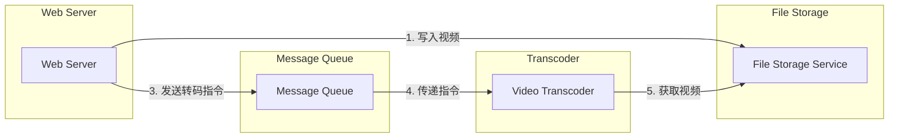
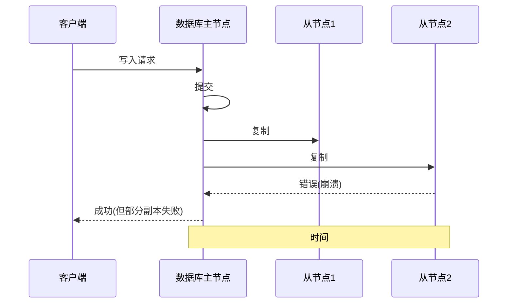

# 第10章 一致性与共识

古语有云：“出海航行，切勿携带两个时计；要么带一个，要么带三个。”

——Frederick P. Brooks Jr., 《人月神话：软件工程论文集》（1995）

在第9章中，我们讨论了分布式系统中可能出现的各种问题。如果希望服务在面对这些问题时仍能正确运行，就需要找到容错的方法。

实现容错的最佳工具之一是[[复制]]。然而，正如第6章所述，在多个副本上保留数据的多个副本增加了不一致的风险。读取可能由一个未及时更新的副本处理，从而返回过时结果。如果多个副本都能接受写入，我们就必须处理在不同副本上并发写入的值之间可能产生的冲突。从高层次来看，处理这些问题有两种相互竞争的哲学：

> [!NOTE] 两种一致性哲学
> - **最终一致性** (Eventual consistency)：在这种哲学下，系统复制的事实对应用程序是可见的，作为应用开发者，您需要处理可能出现的**不一致和冲突**。这种方法常用于多主复制（参见第215页的“[[多主复制]]”）和无主复制（参见第229页的“[[无主复制]]”）的系统中。
> - **强一致性** (Strong consistency)：这种哲学认为应用程序不应担心复制的内部细节，系统应表现得**像单个节点一样**。这种方法的优点是对于应用开发者来说更简单。缺点则是更强的一致性会带来性能代价，并且某些最终一致系统可以容忍的故障类型，在强一致系统中会导致停机。

哪一种方法更好取决于您的应用。如果您的应用允许用户离线修改数据，那么最终一致性是不可避免的，如第220页的“[[同步引擎与本地优先软件]]”中所讨论。然而，最终一致性可能给应用带来处理难度。如果您的副本位于通信快速可靠的数据中心内，强一致性通常更合适，因为其代价可以接受。

在本章中，我们将更深入地探讨强一致性方法，重点关注三个领域：

- 一个挑战是“强一致性”相当模糊，因此我们将对所需目标做出更精确的定义：[[线性一致性]] (linearizability)。
- 我们将研究生成ID和时间戳的问题。这听起来与一致性无关，但实际上紧密相关。
- 我们将探讨分布式系统如何在保持容错的同时实现线性一致性——答案是[[共识算法]] (consensus algorithms)。

在此过程中，我们会看到分布式系统中存在一些根本性的限制。

本章讨论的主题以其难以正确实现而臭名昭著。很容易构建出在没有故障时表现良好，但在面对设计者未曾考虑的不利故障组合或消息顺序时完全崩溃的系统。大量理论已被开发出来以帮助我们思考这些边界情况，从而使我们能够构建能够稳健容忍故障的系统。

本章只是触及表面。我们将坚持非正式的直觉，避免算法细节、形式化模型和证明。如果您想认真从事共识系统及相关基础设施的工作，并希望系统具有鲁棒性，您需要更深入地研究理论。像往常一样，本章的文献参考文献提供了初步的指引。

---

## 线性一致性 (Linearizability)

如果您希望一个复制数据库使用起来尽可能简单，您应该让它表现得像一个一致的单节点数据库。这样用户就不必担心复制延迟、冲突和其他不一致性；它为您提供了容错性的优势，同时无需考虑多副本的复杂性。

这就是线性一致性[1]（也称为原子一致性[2]、强一致性、即时一致性或外部一致性[3]）的理念。线性一致性的确切定义相当微妙，我们将在本节余下部分探讨它。但其基本思想是使系统表现得**好像只有一份数据副本**，并且所有操作在该副本上是原子的。有了这个保证，尽管现实中可能存在多个副本，应用程序也不必担忧它们。

在[[线性一致性]]系统中，一旦某个客户端成功完成一次写操作，所有从数据库读取的客户端**都必须能够看到刚刚写入的值**。维持单份数据副本的假象意味着保证读到的值是最新的、最新的值，并且不会来自过时的缓存或副本。换句话说，**线性一致性是一种最近性保证** (recency guarantee)。为了澄清这一概念，我们来看一个非[[线性一致性]]系统的例子。

  
图10-1展示了一个非[[线性一致性]]的体育网站[4]。Aaliyah和Bryce坐在同一个房间里，两人都在手机上查看他们最喜爱球队的比赛结果。最终比分刚刚公布，Aaliyah刷新页面，看到了胜者宣布，并兴奋地告诉Bryce。Bryce难以置信地在自己手机上重新加载，但他的请求发送到了一个延迟的数据库副本，因此他的手机显示比赛仍在进行。

图10-1. 该系统不是[[线性一致性]]的，导致体育迷困惑。

如果Aaliyah和Bryce同时点击刷新，那么他们得到不同查询结果就不那么令人惊讶了，因为他们不知道各自的请求在服务器上被处理的确切时间。但是，Bryce知道他在听到Aaliyah欢呼最终比分之后才点击了刷新按钮（发起了查询），因此他期望他的查询结果至少应该与Aaliyah的结果一样新。他的查询返回过时结果的事实违反了线性一致性。

---

### 什么使系统线性一致？

为了更好地理解线性一致性，我们再来看更多例子。图10-2显示了三个客户端在一个[[线性一致性]]数据库中并发读写同一个对象x。在分布式系统理论中，x被称为寄存器 (register)——在实践中，它可以是键值存储中的一个键、关系数据库中的一行，或者文档数据库中的一个文档等。

  
图10-2. 如果读请求与写请求并发，它可能返回旧值或新值。

为简单起见，图10-2只显示了客户端的请求，没有显示数据库内部细节。每条横线是客户端发起的一个请求。横线起点是请求发送的时间，终点是客户端收到响应的时间。由于网络延迟可变，客户端不知道数据库何时处理了它的请求。它只知道处理一定发生在客户端发送请求和收到响应之间的某个时刻。

在此示例中，寄存器有两种操作类型：

- `Read(x) ⇒ v` 表示客户端请求读取寄存器x的值，数据库返回值v。
- `Write(x, v) ⇒ r` 表示客户端请求将寄存器x设置为v，数据库返回响应r（可能是OK或Error）。

在图10-2中，x的初始值为0，客户端C发起写请求将其设置为1。与此同时，客户端A和B正在轮询数据库以读取最新值。A和B的读请求可能得到哪些响应呢？

让我们分解一下：

- 客户端A的第一个读操作在写开始前完成，因此它必须返回旧值0。
- 客户端A的最后一个读操作在写完成后开始，因此如果数据库是[[线性一致性]]的，它必须返回新值1，因为读必须在写之后处理。
- 任何与写操作时间上重叠的读操作都可能返回0或1，因为我们不知道读操作处理时写是否已经生效。这些操作与写操作并发。

然而，这还不足以完全描述线性一致性。如果与写并发的读可能返回旧值或新值，那么读者可能会在写进行过程中多次看到值在新旧之间来回跳变。这不是我们对模拟“单份数据副本”的系统的期望。

为了使系统线性一致，我们需要添加另一个约束，如图10-3所示。

  
图10-3. 任何一个读返回新值之后，所有后续读（在同一或其它客户端上）也必须返回新值。

在一个[[线性一致性]]系统中，我们设想在写操作的开始和结束之间必须存在某个时间点，x的值从0原子地翻转为1。因此，如果一个客户端的读返回了新值1，那么所有后续的读也必须返回新值，即使写操作尚未完成。

这个时序依赖关系用图10-3中的箭头说明。客户端A是第一个读到新值1的。在A的读返回之后，B立即开始一个新的读。由于B的读严格发生在A的读之后，它也必须返回1，尽管C的写仍在进行中。（这与图10-1中Aaliyah和Bryce的情况相同：在Aaliyah读到新值后，Bryce也期望读到新值。）

我们可以进一步细化这个时序图，将每个操作视为在某个时间点原子地生效[5]，就像图10-4中更复杂的例子所示。在这个例子中，除了读和写之外，我们增加了第三种操作类型：

- `CAS(x, vold, vnew) ⇒ r` 表示客户端请求一个原子[[比较并交换]] (CAS) 操作（参见第302页的“[[条件写入（比较并设置）]]”）。如果寄存器x的当前值等于vold，则应原子地将其设置为vnew。如果x的值与vold不同，则操作应保持寄存器不变并返回错误。r是数据库的响应（OK或Error）。

图10-4中的每个操作都标记了一条竖线（在每个操作条内部），表示我们认为该操作被执行的时刻。这些标记按顺序连接起来，结果必须是对寄存器有效的读写序列（每个读必须返回最近一次写设置的值）。线性一致性的要求是：**连接操作标记的线始终向前（从左到右）移动，永不后退**。这个要求确保了前面讨论的最近性保证：一旦一个新值被写入或读取，所有后续读都将看到该值，直到它被再次覆盖。

  
图10-4. 可视化读写看起来生效的时间点——B的最后一次读不是[[线性一致性]]的。

图10-4中有几个有趣的细节需要指出：

- 首先，客户端B发送了一个读x的请求，然后客户端D发送了一个将x设置为0的请求，然后客户端A发送了一个将x设置为1的请求。然而，B的读返回的值是1（A写入的值）。这是可以的：这意味着数据库先处理了D的写，然后处理了A的写，最后处理了B的读。尽管这不是请求发送的顺序，但这是一个可接受的顺序，因为……（原文此处似乎截断，但已保留所有可恢复内容。）

# 第10章：一致性与共识

## 线性一致性

将 x 设置为 1。然而，返回给 B 的读取结果是 1（A 写入的值）。这是可以的：这意味着数据库先处理了 D 的写入，然后处理了 A 的写入，最后处理了 B 的读取。虽然这不是请求发送的顺序，但这是一个可接受的顺序，因为这三个请求是并发的。也许 B 的读取请求在网络中稍有延迟，因此它在两次写入之后才到达数据库。

- 客户端 B 的读取在客户端 A 收到数据库响应（确认将值 1 写入成功）之前返回了 1。这也是可以的，因为这只是意味着从数据库到客户端 A 的 OK 响应在网络中稍有延迟。
- 该模型不假定任何事务隔离；另一个客户端可以随时更改值。例如，C 先读取 1，然后读取 2，因为值在两次读取之间被 B 更改了。可以使用原子 CAS 操作来检查该值是否未被另一个客户端并发更改：B 和 C 的 CAS 请求成功，但 D 的 CAS 请求失败（当数据库处理它时，x 的值不再是 0）。
- 客户端 B 的最后一次读取（在阴影条中）不是线性一致的。该操作与 C 的 CAS 写入并发，后者将 x 从 2 更新为 4。在没有其他请求的情况下，B 的读取返回 2 是可以的。然而，在 B 的读取开始之前，客户端 A 已经读取了新值（4），因此 B 不允许读取比 A 更旧的值。再次强调，这与图 10-1 中 Aaliyah 和 Bryce 的情况相同。

这就是线性一致性的直觉背后含义；正式定义 [1] 更精确地描述了它。通过记录所有请求和响应的时序，并检查它们是否可以排列成有效的顺序次序，可以测试系统行为是否线性一致（尽管计算成本很高）[6, 7]。

正如除了可串行化之外还有各种较弱的事务隔离级别（参见第 288 页的“弱隔离级别”），除了线性一致性之外，还有各种较弱的复制系统一致性模型 [8]。我们在第 209 页“复制延迟问题”中看到的写后读一致性、单调读取和一致前缀读取的保证就是其中的例子。线性一致性包含所有这些保证以及更多；它是常用的一致性模型中最强的一个。

> [!INFO] 线性一致性 vs 可串行化
> 线性一致性容易与可串行化混淆（参见第 308 页的“可串行化”），因为这两个词似乎都意味着“可以排列成顺序次序”。然而，它们是截然不同的保证，区分它们很重要：
> 
> **可串行化** 是事务的隔离级别，每个事务可能读取和写入多个对象（行、文档、记录）。它保证事务的行为与它们以某种串行顺序执行时相同——也就是说，就好像您先执行了一个事务的所有操作，然后执行了另一个事务的所有操作，依此类推，没有交错。该串行顺序可以与事务实际执行的顺序不同 [9]。
> 
> **线性一致性** 是对寄存器（单个对象）的读写保证。它不将操作分组到事务中，因此无法防止涉及多个对象的问题，例如写偏斜（参见第 303 页的“写偏斜与幻读”）。然而，线性一致性是一种新近性保证：它要求如果一个操作在另一个操作开始之前完成，那么后一个操作必须观察到一个至少和前一个操作一样新的状态。可串行化没有这个要求——例如，可串行化允许读取旧数据 [10]。
> 
> 顺序一致性是另一种东西 [8]，但我们在这里不讨论。
> 
> 数据库可以同时提供可串行化和线性一致性；这种组合被称为**严格可串行化**或**强单副本可串行化（strong-1SR）** [11, 12]。
> 
> 单节点数据库通常是线性一致的。对于使用诸如 SSI 等乐观方法的分布式数据库（参见第 317 页的“可串行化快照隔离”），情况更加复杂。例如，CockroachDB 提供可串行化以及一些读取的新近性保证，但不提供严格可串行化 [13]，因为这需要事务之间昂贵的协调 [14]。另一方面，Spanner 和 FoundationDB 提供严格可串行化 [15, 16]。
> 
> 也可以将较弱的隔离级别与线性一致性结合，或将较弱的一致性模型与可串行化结合；事实上，一致性模型和隔离级别在很大程度上可以相互独立地选择 [17, 18]。

## 依赖线性一致性

在什么情况下线性一致性有用？查看体育比赛的最终得分也许是一个轻浮的例子；一个过时几秒的结果在这种情景下不太可能造成真正的伤害。然而，在少数领域，线性一致性是使系统正确工作的重要要求。

### 锁定与领导选举

使用单领导者复制的系统需要确保确实只有一个领导者，而不是多个（脑裂）。选举领导者的方法之一是使用租约。每个启动的节点尝试获取租约，成功的那个成为领导者 [19]。无论这个机制如何实现，它必须是线性一致的。不可能两个节点同时获取租约。

诸如 Apache ZooKeeper [20] 和 etcd 的协调服务通常用于实现分布式租约和领导者选举。它们使用共识算法（我们将在本章后面讨论此类算法）以容错的方式实现线性一致操作。正确实现租约和领导者选举涉及许多微妙的细节（例如第 373 页“分布式锁与租约”中的围栏问题），而像 Apache Curator 这样的库通过在 ZooKeeper 之上提供更高级的配方来提供帮助。然而，线性一致的存储服务是这些协调任务的基础。

> [!TIP] ZooKeeper 与 etcd 的线性一致性
> 严格来说，ZooKeeper 提供线性一致的写入，但读操作可能是过时的，因为没有保证从当前领导者提供读服务 [20]。从版本 3 开始，etcd 默认提供线性一致的读。

分布式锁定还在某些分布式数据库中以更细粒度使用，例如 Oracle Real Application Clusters (RAC) [21]。RAC 使用每个磁盘页面的锁，多个节点共享对同一磁盘存储系统的访问。由于这些线性一致的锁位于事务执行的关键路径上，RAC 部署通常有一个专用的集群互连网络用于数据库节点之间的通信。

### 约束与唯一性保证

唯一性约束在数据库中很常见——例如，用户名或电子邮件地址必须唯一标识一个用户，在文件存储服务中不能有两个具有相同路径和文件名的文件。如果您想在写入时强制执行此约束（例如，如果两个人尝试同时创建一个具有相同名称的用户或文件，其中一人将收到错误），您需要线性一致性。

这种情况类似于锁；当用户注册您的服务时，您可以认为他们获取了所选用户名的锁。该操作也非常类似于原子 CAS，将用户名设置为声称它的用户的 ID，前提是该用户名尚未被占用。

类似的问题也会出现，如果您想确保银行账户余额永远不会为负，或者您不卖出比仓库中库存更多的商品，或者两个人不会同时预订同一航班或剧院的座位。这些约束都需要所有节点同意的单一最新值（账户余额、库存水平、座位占用情况）。

在实际应用中，有时可以宽松地对待这类约束——例如，如果航班超额预订，您可以将客户转移到其他航班并提供补偿。在这种情况下，可能不需要线性一致性（我们将在第 571 页的“及时性与完整性”中讨论这种宽松解释的约束）。

然而，硬性的唯一性约束（如通常在关系数据库中遇到的那种）需要线性一致性。其他类型的约束（如外键或属性约束）可以在没有线性一致性的情况下实现 [22]。

### 跨通道时序依赖

在图 10-1 中需要注意一个重要细节：如果 Aaliyah 没有喊出比分，Bryce 就不会知道他的查询结果是过时的。他只会几秒后再次刷新页面，最终看到最终比分。线性一致性违规之所以被注意到，是因为系统中存在额外的通信通道（Aaliyah 的声音传到 Bryce 的耳朵）。

类似的场景也可能出现在计算机系统中。例如，假设您的网站允许用户上传视频，后台进程将视频转码为较低质量，以便在慢速网络连接上流式传输。此系统的架构和数据流如图 10-5 所示。视频转码器需要被明确指示执行转码作业，此指令通过消息队列从 Web 服务器发送到转码器（参见第 12 章）。Web 服务器不会将整个视频放入队列，因为大多数消息代理是为小消息设计的，而视频可能有数兆字节的大小。相反，视频首先被写入文件存储服务，一旦写入完成，对转码器的指令就被放入队列。

**图 10-5.** Web 服务器和视频转码器通过文件存储和消息队列进行通信，从而产生竞争条件的可能性。

如果文件存储服务是线性一致的，那么该系统应该能够正常工作。如果它不是线性一致的，则存在竞争条件的风险：消息队列（图 10-5 中的步骤 3 和 4）可能比存储服务内部的复制更快。在这种情况下，当转码器获取原始视频（步骤 5）时，它可能会看到文件的旧版本或什么也没有。如果它处理了旧版本的视频，文件存储中的原始视频和转码视频就会变得永久不一致。

这个问题之所以出现，是因为 Web 服务器和转码器之间存在两个通信通道：文件存储和消息队列。如果没有线性一致性，这两个通道之间的时序关系无法保证。

### 第10章：一致性与共识

#### 线性一致性（续）

由于这两个通信渠道之间缺乏线性一致性的最新性保证，可能导致竞态条件。这种情况与图10-1类似，那里也存在两个通信渠道之间的竞态条件：数据库复制和Aaliyah与Bryce之间的真实音频渠道。

类似地，如果手机应用能接收推送通知，并在收到通知后从服务器获取某些数据，也会出现竞态条件。如果数据获取请求发往了滞后的副本，推送通知可能快速送达，但后续的获取请求却看不到通知所涉及的数据。

线性一致性并非避免此竞态条件的唯一方式，但却是最容易理解的。如果能控制额外的通信渠道（如消息队列，而非Aaliyah与Bryce的情况），可以采用类似于我们在“读取自己的写入”一节（第210页）讨论的替代方法，但代价是增加复杂性。

---

### 实现线性一致性系统

在了解了几个线性一致性有用的例子后，我们思考如何实现提供线性一致性语义的系统。

由于线性一致性本质上是“表现得好像数据只存在一个副本，且所有操作都是原子的”，最简单的答案就是真的只使用一个数据副本。然而，这种方法无法容忍故障：如果持有那个副本的节点失效，数据将丢失，或至少在节点恢复之前不可访问。

让我们回顾第6章中的复制方法，看看它们是否能实现线性一致性：

*   **单主复制（潜在线性一致性）**：在单主复制系统中，主节点持有用于写入的主数据副本，从节点在其他节点上维护备份副本。只要所有读写都在主节点上进行，它们很可能是线性一致的。但这假设你确切地知道谁是主节点。正如“分布式锁与租约”一节（第373页）所讨论的，节点可能误认为自己仍是主节点，而实际上已经不是了——如果这个“妄想”的主节点继续处理请求，很可能违反线性一致性[23]。使用异步复制时，故障切换甚至可能导致已提交的写入丢失，同时违反持久性和线性一致性。对单主数据库进行分片，每个分片有独立的主节点，这不会影响线性一致性，因为它只是单对象保证。跨分片事务则是另一回事（见“分布式事务”一节，第323页）。

*   **共识算法（很可能线性一致）**：一些共识算法本质上是带有自动主节点选举和故障切换的单主复制。它们被精心设计以防止脑裂，从而能安全地实现线性一致的存储。例如，ZooKeeper使用Zab共识算法[24]，etcd使用Raft[25]。然而，仅仅使用共识并不保证其所有操作都是线性一致的。如果允许在未检查节点是否仍是主节点的情况下进行读取，那么当新主节点刚刚被选举出来时，读取结果可能是过时的。

*   **多主复制（不线性一致）**：多主复制系统通常不是线性一致的，因为它们同时在多个节点上处理写入，并异步复制到其他节点。因此，它们可能产生需要解决的冲突写入（见“处理冲突写入”一节，第222页）。

*   **无主复制（可能不线性一致）**：对于无主复制系统（Dynamo风格；见“无主复制”一节，第229页），人们有时声称通过要求法定票数的读写（`w + r > n`）可以获得“强一致性”。但根据具体算法和强一致性的定义，这并不完全正确。基于时钟时间戳的LWW冲突解决方法（例如Cassandra和ScyllaDB中）几乎肯定是不线性一致的，因为由于时钟偏差，时钟时间戳无法保证与实际事件顺序一致（见“依赖同步时钟”一节，第362页）。即使在法定票数下，也可能出现非线性一致的行为，如下一节所示。

直观上，Dynamo风格的模型中法定票数读写似乎是线性一致的。然而，当网络延迟可变时，可能会出现竞态条件，如图10-6所示。

在图10-6中，`x`的初始值为0，一个写入客户端通过向所有三个副本发送写入来将`x`更新为1（`n = 3, w = 3`）。同时，客户端A从两个节点的法定票数中读取（`r = 2`），在一个节点上看到新值1，在另一个节点上看到旧值0。与写入同时，客户端B从另一个两个节点的法定票数中读取，从两个节点都得到旧值0。

法定票数条件满足（`w + r > n`），但这次执行仍然不是线性一致的。B的请求在A的请求完成后开始，但B返回旧值而A返回新值。（这再次是图10-1中Aaliyah和Bryce的情况。）

可以通过降低性能来使Dynamo风格的法定票数实现线性一致性。读者必须在返回结果给应用之前同步执行读修复（见“弥补缺失写入”一节，第231页）[26]。此外，写入者必须在写入之前读取一个法定票数节点的最新状态，以获取任何先前写入的最新时间戳，并确保新写入具有更大的时间戳[27, 28]。然而，Riak由于性能损失而不执行同步读修复。Cassandra在法定票数读取时确实等待读修复完成[29]，但由于它使用时钟时间戳而失去了线性一致性。

此外，只有线性一致的读写操作可以通过这种方式实现；线性一致的CAS操作则不行，因为它需要共识算法[30]。总之，最安全的做法是假设采用Dynamo风格复制的无主系统不提供线性一致性，即使使用法定票数读写。

---

### 线性一致性的代价

既然某些复制方法可以提供线性一致性，而另一些不能，那么深入探讨线性一致性的利弊是很有趣的。

我们已经在第6章讨论了一些不同复制方法的使用案例；例如，我们看到多主复制通常是多区域复制的良好选择（见“地理分布操作”一节，第216页）。图10-7展示了这样一个部署的例子。

考虑两个区域之间发生网络中断的情况。假设每个区域内的网络正常工作，客户端可以到达各自的区域，但区域之间无法连接。这被称为网络分区。

使用多主数据库，每个区域可以继续正常运行。由于一个区域的写入异步复制到另一个区域，写入被简单地排队，并在网络连接恢复时交换。

另一方面，如果使用单主复制，主节点必须位于其中一个区域。任何写入和任何线性一致的读取都必须发送到主节点。因此，对于连接到从属区域的客户端，这些读写请求必须通过网络同步发送到主区域。

在单主设置中，如果区域之间的网络中断，连接到从属区域的客户端无法联系主节点，因此无法对数据库进行任何写入或线性一致的读取。它们仍然可以从从属节点读取，但结果可能是过时的（非线性一致）。如果应用需要线性一致的读写，则网络中断会导致无法联系主节点的区域中的应用变得不可用。

如果客户端可以直接连接到主区域，这不成问题，因为应用在那里可以继续正常工作。但只能到达从属区域的客户端将经历停机，直到网络链路修复。

---

#### CAP定理

这个问题并不仅仅是单主复制和多主复制的后果。任何线性一致的数据库，无论其如何实现，都存在这个问题。这个问题也不限于多区域部署，它可能发生在任何不可靠的网络中，甚至在一个区域内也是如此。权衡如下：

# 第10章：一致性与共识

- 如果你的应用要求线性一致性，并且由于网络问题某些副本与其他副本断开连接，那么这些副本将暂时无法处理请求：它们必须等待网络问题修复或返回一个错误（无论哪种方式，它们都变得不可用）。这种选择有时被称为 **CP（网络分区下的一致性）**。
- 如果你的应用不要求线性一致性，那么它可以被设计成每个副本即使与其他副本断开连接（例如，多主复制）也能独立处理请求。在这种情况下，应用可以在网络问题面前保持可用，但其行为不是线性一致的。这种选择被称为 **AP（网络分区下的可用性）**。

因此，不需要线性一致性的应用可以更好地容忍网络问题。这一洞见广为人知，即 **CAP 定理** [31, 32, 33, 34]，由 Eric Brewer 在 2000 年命名，尽管分布式数据库的设计者自 1970 年代以来就已了解这一权衡 [35, 36, 37]。

CAP 最初是作为一个没有精确定义的启发式规则提出的，目的是引发关于数据库中权衡的讨论。当时，许多分布式数据库专注于在具有共享存储的机器集群上提供线性一致性语义 [21]，而 CAP 鼓励数据库工程师探索更广阔的分布式无共享系统设计空间，这些系统更适合实现大规模 Web 服务 [38]。CAP 对这种文化转变功不可没——它帮助触发了 NoSQL 运动，这是 2000 年代中期涌现的一波新数据库技术。

正式定义的 CAP 定理 [32] 适用范围非常狭窄。它只考虑了一种一致性模型（即线性一致性）和一种故障类型（网络分区，根据 Google 的数据，网络分区占不到 8% 的事故 [39]）。它没有提及网络延迟、死节点或其他权衡。因此，尽管 CAP 在历史上具有影响力，但它对设计系统的实际价值很小 [4, 45]。

人们曾试图推广 CAP。例如，**PACELC 原则** 观察到，系统设计者也可能选择在网络正常工作的情况下为了降低延迟而减弱一致性 [40, 46, 47]。因此，在网络分区（P）期间，我们需要在可用性（A）和一致性（C）之间做出选择；否则（E），当没有分区时，我们可以在低延迟（L）和一致性（C）之间做出选择。然而，这一定义继承了 CAP 的几个问题，例如对一致性和可用性的反直觉定义。分布式系统中还有许多更有趣的不可能性结果 [41]，而 CAP 现在已被更精确的结果 [42, 43] 所取代，因此它今天主要具有历史意义。

## 无益的 CAP 定理

CAP 有时被表述为：一致性、可用性、分区容忍性：三者选二。不幸的是，这种说法具有误导性 [34]。因为网络分区是一种故障，它不是你选择的东西，而是无论你是否喜欢都会发生。保证没有网络分区的唯一方法是根本没有网络——即只有一个副本——但那样你也无法获得高可用性。

在网络正常工作的时期，系统可以同时提供一致性（线性一致性）和可用性。当网络故障发生时，你必须在它们之间做出选择。因此，CAP 的更好表述是：**分区时要么一致，要么可用** [44]。一个更可靠的网络会减少这种选择的发生频率，但最终选择是不可避免的。

CP/AP 分类方案还有其他几个缺陷 [4]。一致性被形式化为线性一致性（该定理没有提及较弱的一致性模型），而可用性的形式化 [32] 并不符合该术语的通常含义 [45]。许多高可用（容错）系统实际上并不满足 CAP 对可用性的特殊定义。此外，一些系统设计者（有充分理由）选择既不提供线性一致性也不提供 CAP 定理所假设的那种可用性，因此这些系统既不是 CP 也不是 AP [46, 47]。总之，CAP 存在大量误解和混淆，并且它无助于我们更好地理解系统，因此最好不要再纠结于它。

## 线性一致性与网络延迟

尽管线性一致性是一种有用的保证，但令人惊讶的是，在实践中很少有系统是线性一致的。例如，即使是现代多核 CPU 上的 RAM 也不是线性一致的 [48]。如果一个 CPU 核心上的线程向一个内存地址写入，而另一个 CPU 核心上的线程稍后读取同一地址，并不能保证读取到第一个线程写入的值（除非使用了内存屏障或栅栏 [49]）。

这种行为的原因在于每个 CPU 核心都有自己的内存缓存和存储缓冲区。读取默认从缓存服务，所有更改异步写入主内存。由于访问缓存数据比访问主内存快得多 [50]，这一特性对于现代 CPU 的良好性能至关重要。然而，这意味着现在有数据的多个副本（一个在主内存中，可能还有几个在各种缓存中），并且这些副本是异步更新的，因此线性一致性丢失了。

为什么要做这种权衡？用 CAP 定理来证明多核内存一致性模型是说不通的。在一台计算机内部，我们通常假设通信是可靠的，并且我们不期望一个 CPU 核心在与计算机其余部分断开连接时还能继续正常运行。放弃线性一致性的原因是性能，而不是容错 [46]。

许多选择不提供线性一致性保证的分布式数据库也是如此：它们这样做主要是为了提高性能，而不是为了容错 [40]。线性一致性系统往往具有更高的延迟——而且这是始终存在的，而不仅仅是在网络故障期间。

难道我们不能找到一种更高效的线性存储实现吗？答案似乎是否定的。Attiya 和 Welch [51] 证明，如果你想要线性一致性，读写请求的响应时间至少与网络延迟的不确定性成正比。在延迟变化很大的网络中，比如大多数计算机网络（参见第 352 页的“超时与无界延迟”），线性一致读写的响应时间不可避免地会很高。不存在更快的线性一致性算法，但较弱的一致性模型可以快得多，因此这种权衡对于延迟敏感的应用非常重要。在第 13 章中，我们将讨论一些在不牺牲正确性的情况下避免线性一致性的方法。

# ID 生成器与逻辑时钟

在许多应用中，你需要在创建数据库记录时分配某种唯一 ID，这为你提供了引用这些记录的主键。在单节点数据库中，通常使用自增整数，它的优势在于可以只存储 64 位（如果你确定永远不会超过 40 亿条记录，甚至可以用 32 位，但这有风险）。

自增 ID 的另一个优势是 ID 的顺序告诉你记录被创建的顺序。例如，图 10-8 展示了一个聊天应用，它在聊天消息发布时分配自增 ID。你可以按 ID 递增的顺序显示消息，结果聊天线程就会变得有意义：Aaliyah 发布了一个问题，被分配了 ID 1，Bryce 对该问题的回答被分配了一个更大的 ID——即 3。

这种单节点 ID 生成器是另一种线性一致性系统的例子。每个获取 ID 的请求都是一个原子递增计数器并返回旧计数器值的操作（一个 fetch-and-add 操作）；线性一致性确保如果 Aaliyah 的消息发布在 Bryce 开始发布之前完成，那么 Bryce 消息的 ID 一定大于 Aaliyah 的。图 10-8 中 Aaliyah 和 Caleb 的消息是并发的，因此线性一致性并不规定它们的 ID 必须如何排序，只要它们唯一即可。

**图 10-8.** 一个 ID 生成器，为聊天应用中的消息分配自增整数 ID

一个内存中的单节点 ID 生成器很容易实现。你可以使用 CPU 提供的原子递增指令，它允许多个线程安全地递增同一个计数器。要使计数器持久化（这样节点崩溃重启后不会重置计数器值，否则会导致重复 ID）需要更多工作。但真正的问题如下：

- 单节点 ID 生成器不具备容错性，因为该节点是单点故障。
- 如果你想在另一个区域创建记录，它很慢，因为你可能需要跨半个地球来回往返只是为了获取一个 ID。
- 如果你有高写入吞吐量，这个单节点可能成为瓶颈。

你可以考虑 ID 生成器的各种替代方案：

**分片 ID 分配**
你可以有多个节点分配 ID——例如，一个只生成偶数，另一个只生成奇数。通常，你可以在 ID 中保留一些位来包含分片编号。这些 ID 仍然紧凑，但你失去了排序属性——例如，如果你有 ID 为 16 和 17 的聊天消息，你不知道消息 16 是否真的先发送，因为 ID 是由不同节点分配的，一个节点可能比另一个节点超前。

**预分配 ID 块**
不是分配单个 ID，单节点 ID 生成器可以分发 ID 块。例如，节点 A 可以声明 ID 块 1 到 1,000，节点 B 可以声明块 1,001 到 2,000。然后每个节点可以独立地从其块中分发 ID，并在用完时向 ID 生成器请求新的块。

# 第10章：一致性与共识

## ID 生成器与逻辑时钟

### 随机 UUID

你可以使用通用唯一标识符（UUID），也称为全局唯一标识符（GUID）。它们的一大优势是可以在任意节点本地生成，无需通信，但需要更多空间（128 位）。UUID 有多个版本；最简单的是版本 4，它本质上是一个足够长的随机数，两个节点恰好选中相同值的概率极低。不幸的是，此类 ID 的顺序也是随机的，因此比较两个 ID 无法判断哪个更新。

### 通过挂钟时间戳实现唯一性

如果节点的挂钟时间通过 NTP 保持大致准确，你可以将此时钟的时间戳放在最高有效位，并用额外信息填充剩余位以确保即使时间戳不唯一时 ID 也是唯一的——例如，分片编号和每分片递增序列号，或一个长的随机值。版本 7 UUID[[52]]、X 的 Snowflake[[53]]、ULIDs[[54]]、Hazelcast 的 Flake ID 生成器、MongoDB ObjectIDs 以及许多类似方案都使用了这种方法[[52]]。你可以在应用程序代码或数据库内部实现这些 ID 生成器[[55]]。

所有这些方案生成的 ID 都是唯一的（至少概率足够高，碰撞极少），但与单节点自增方案相比，其排序保证要弱得多。

正如“用于事件排序的时间戳”第 362 页所讨论的，挂钟时间戳最多只能提供近似排序。如果较早的写入从一个稍快的时钟获得时间戳，而较晚的写入从一个稍慢的时钟获得时间戳，那么时间戳顺序可能与事件实际发生的顺序不一致。由于使用非单调时钟导致的时钟跳跃，即使是单节点生成的时间戳也可能排序错误。因此，基于挂钟时间的 ID 生成器不太可能实现线性一致性。

你可以通过依赖高精度时钟同步、使用原子钟或 GPS 接收器来减少此类排序不一致。但如果能生成无需特殊硬件、唯一且排序正确的 ID，那也会很好。接下来，我们将研究一种恰好能实现这一点的时钟类型。

### 逻辑时钟

在“不可靠的时钟”第 358 页中，我们讨论了挂钟时间和单调时钟。两者都是物理时钟：测量时间流逝的硬件设备（秒、毫秒、微秒等）。

在分布式系统中，通常还会使用另一种时钟，称为逻辑时钟。与物理时钟相反，逻辑时钟是一种对已发生事件进行计数的算法。因此，来自逻辑时钟的时间戳不告诉你具体时间，但你可以比较两个逻辑时钟的时间戳，判断哪个更早、哪个更晚。

逻辑时钟的一般要求如下：

- 其时间戳紧凑（大小仅几个字节）且唯一。
- 你可以比较任意两个时间戳，确定哪个更早（即它们具有全序关系）。
- 时间戳的顺序与因果关系一致。也就是说，如果操作 A 发生在操作 B 之前，那么 A 的时间戳小于 B 的时间戳。（我们之前在“发生在先关系与并发”第 238 页讨论过因果关系。）

单节点 ID 生成器满足这些要求，但我们刚才讨论的分布式 ID 生成器不满足因果排序要求。

#### Lamport 时间戳

幸运的是，有一种生成逻辑时间戳的简单方法与因果关系一致，你可以将其用作分布式 ID 生成器。它被称为 Lamport 时钟，由 Leslie Lamport 于 1978 年提出[[56]]，该论文现在已成为分布式系统领域被引用最多的论文之一。

尽管 Lamport 时钟提供了全序，但它们不提供线性一致性——即，它们不能确保值的更新是最新的。它们只是一种为事件分配 ID 的方法，使得如果事件 A 发生在事件 B 之前，则 A 的 ID 小于 B 的 ID。

图 10-9 展示了 Lamport 时钟在来自图 10-8 的聊天示例中如何工作。每个节点都有一个唯一标识符，在图 10-9 中是名字 Aaliyah、Bryce 或 Caleb，但在实践中可以是随机 UUID 或类似的东西。每个节点还维护一个它已处理的操作计数。Lamport 时间戳简单地说就是一对（计数器，节点 ID）。两个节点有时可能有相同的计数器值，但通过将节点 ID 包含在时间戳中，每个时间戳都是唯一的。

图 10-9. Lamport 时间戳提供了与因果关系一致的全序。

每当节点生成时间戳时，它会递增其计数器值并使用新值。每当节点看到来自另一个节点的时间戳时，如果该时间戳中的计数器值大于其本地计数器值，它就会将其本地计数器增加以匹配该时间戳中的值。

在图 10-9 中，Aaliyah 在发布自己的消息时还没有看到 Caleb 的消息，反之亦然。假设两个用户都以初始计数器值 0 开始，那么两者都递增本地计数器并将新计数器值 1 附加到他们的消息上。当 Bryce 收到这些消息时，他将本地计数器值增加到 1。最后，Bryce 回复 Aaliyah 的消息，递增他的本地计数器并将新值 2 附加到消息上。

要比较两个 Lamport 时间戳，我们先比较它们的计数器值——例如，(2, “Bryce”) 大于 (1, “Aaliyah”) 也大于 (1, “Caleb”)。如果两个时间戳具有相同的计数器值，我们接着比较它们的节点 ID，使用通常的字典序字符串比较。因此，此示例中的时间戳顺序为 (1, “Aaliyah”) < (1, “Caleb”) < (2, “Bryce”)。

#### 混合逻辑时钟

Lamport 时间戳善于捕捉事件发生的顺序，但它们有一些局限性：

- 由于它们与物理时间没有直接关系，你不能用它们来查找，比如，特定日期发布的所有消息；你需要单独存储物理时间。
- 如果两个节点从不通信，一个节点的计数器增量永远不会反映在另一个节点的计数器中。因此，不同节点上大约同时发生的事件可能具有截然不同的计数器值。

混合逻辑时钟结合了物理挂钟时间的优点和 Lamport 时钟的排序保证[[57]]。像物理时钟一样，它计数秒或微秒。像 Lamport 时钟一样，当一个节点看到来自另一个节点且大于其本地时钟值的时间戳时，它会将本地值向前移动以匹配另一个节点的时间戳。结果是，如果一个节点的时钟运行得快，其他节点在通信时也会相应地向前移动它们的时钟。

每次生成混合逻辑时钟的时间戳时，它也会递增，这确保即使底层物理时钟向后跳跃（例如，由于 NTP 调整），时钟也会单调向前移动。因此，混合逻辑时钟可能略领先于底层物理时钟。该算法的细节确保了这种差异尽可能小。

因此，你可以将混合逻辑时钟的时间戳几乎当作传统挂钟时间的时间戳来对待，附加属性是其顺序与 happens-before 关系一致。它不依赖任何特殊硬件，只需要大致同步的时钟。例如，CockroachDB 使用了混合逻辑时钟。

#### Lamport/混合逻辑时钟与向量时钟

在“多版本并发控制”第 295 页中，我们讨论了快照隔离通常是如何实现的：本质上，通过为每个事务分配一个事务 ID，允许每个事务看到具有较低 ID 的事务所做的写入，而具有较高 ID 的事务的写入则不可见。Lamport 时钟和混合逻辑时钟是生成这些事务 ID 的好方法，因为它们确保了快照与因果关系一致[[58]]。

当多个时间戳并发生成时，这些算法会任意地对它们排序。这意味着，当你查看两个时间戳时，通常无法判断它们是并发生成的还是一个发生在另一个之前。（在图 10-9 中，你实际上可以判断 Aaliyah 和 Caleb 的消息必然是并发的，因为它们具有相同的计数器值；然而，当计数器值不同时，你无法判断它们是否并发。）

如果你希望能够确定记录是何时并发创建的，则需要另一种算法，例如向量时钟。向量时钟为每个节点维护一个计数器，并将所有计数器值存储在每次写入中。如果写入 A 在一个节点上的计数器值高于 B，而写入 B 在另一个节点上的计数器值高于 A，那么 A 和 B 必然是并发的（参见“检测并发写入”第 237 页）。缺点是，向量时钟的时间戳比我们讨论的其他时间戳占用更多空间——系统中每个节点可能就需要一个整数。

> [!INFO] 关键点
> - Lamport 时钟提供全序但非线性一致性；混合逻辑时钟结合物理时间与 Lamport 保证；向量时钟可检测并发但空间开销大。
> - 在分布式系统中，ID 生成器可选择基于物理时间、Lamport 时钟或向量时钟，各有权衡。

# 第10章：一致性与共识

## 线性一致性 ID 生成器

尽管 Lamport 时钟和混合逻辑时钟提供了有用的排序保证，但这种排序仍然弱于我们之前讨论过的线性一致性单节点 ID 生成器。回忆一下，线性一致性要求：如果请求 A 在请求 B 开始之前完成，那么即使 A 和 B 从未相互通信，B 也必须具有更高的 ID。另一方面，Lamport 时钟只能确保一个节点生成的时间戳大于该节点所见过的任何其他时间戳；对于它未曾见过的时间戳，则无法做出这样的保证。

图 10-10 展示了一个非线性一致性 ID 生成器可能引发的问题。设想在一个社交媒体网站上，用户 A 希望私下与朋友分享一张尴尬的照片。用户 A 的账户最初是公开的，但他们使用笔记本电脑将账户设置改为私密。然后他们用手机上传了照片。由于用户 A 按顺序执行了这些更新，他们可能会合理地期望照片上传受限于新的、受限制的账户权限。然而，如图中所示，情况并非一定如此。

> [!NOTE] 图 10-10 说明
> 图 10-10 展示了用户 A 首先将账户设置为私密，然后分享了一张照片。由于使用了非线性一致性 ID 生成器，未授权的查看者可能看到该照片。

账户权限和照片存储在两个独立的数据库中（或同一数据库的不同分片），并且假设它们使用 Lamport 时钟或混合逻辑时钟为每次写入分配时间戳。由于照片数据库没有从账户数据库读取数据，因此照片数据库中的本地计数器可能略微落后，从而导致照片上传被分配了比账户设置更新更低的时间戳。

现在，假设一个查看者（不是 A 的朋友）正在查看 A 的个人资料，并且他们的读取使用了基于 MVCC 的快照隔离实现。可能发生的情况是：查看者读取的时间戳大于照片上传的时间戳，但小于账户设置更新的时间戳。因此，系统会判定此时账户仍为公开状态，从而向查看者展示了他们本不该看到的尴尬照片。

ID 生成器与逻辑时钟 | **423**

你可以想象几种解决此问题的方法。或许照片数据库在执行写入之前应该读取用户的账户状态，但这种检查很容易被遗忘。如果 A 的操作是在同一设备上执行的，那么该设备上的应用也许可以跟踪该用户写入的最新时间戳——但如同本例所示，如果用户同时使用笔记本电脑和手机，这就不太容易了。这种情况下最简单的解决方案是使用线性一致性 ID 生成器，这将确保照片上传被分配一个比账户权限更改更大的 ID。

### 实现线性一致性 ID 生成器

确保 ID 分配具有线性一致性的最简单方法是实际使用单个节点来完成此任务。该节点只需做三件事：原子性地递增计数器并在收到请求时返回其值，持久化计数器值（以便节点崩溃重启后不会生成重复的 ID），以及为实现容错而复制它（使用单领导复制）。这种方法在实践中有所应用——例如，TiDB/TiKV 将其称为时间戳预言机，灵感来源于 Google 的 Percolator [59]。

作为优化，你可以避免对每个请求都执行磁盘写入和复制。相反，ID 生成器可以写入一条描述一批 ID 的记录；一旦该记录被持久化并复制，节点就可以按顺序将这些 ID 分发给客户端。在耗尽这批 ID 之前，它可以持久化并复制下一批的记录。这样一来，如果节点崩溃重启，或者你故障转移到追随者，一些 ID 将被跳过，但不会发出任何重复或乱序的 ID。

你不能轻易地对 ID 生成器进行分片，因为如果有多个分片独立分发 ID，就无法再保证它们的顺序是线性一致的。你也不能轻易地将 ID 生成器分布到多个区域；因此，在地理分布式的数据库中，所有 ID 请求都必须发送到单个区域的一个节点。好处是，ID 生成器的工作非常简单，因此单个节点可以处理很大的请求吞吐量。

如果你不想使用单节点 ID 生成器，可以像 Google Spanner 那样做，正如“用于全局快照的同步时钟”第 365 页所讨论的。它依赖于一个物理时钟，该时钟不仅返回单个时间戳，还返回一个时间戳范围，表示时钟读数的不确定性。然后 Spanner 会等待该不确定性间隔的持续时间过去后再返回。

假设不确定性间隔是正确的（即真实的当前物理时间始终落在该间隔内），这个过程也保证：如果一个请求在另一个请求开始之前完成，则较晚的请求将具有更大的时间戳。这种方法无需任何通信即可确保这种线性一致性 ID 分配；即使不同区域的请求也能被正确排序，而无需等待跨区域请求。缺点是，你需要硬件和软件支持以实现时钟的紧密同步，并计算必要的不确定性间隔。

424 | 第10章：一致性与共识

### 使用逻辑时钟实施约束

在“约束与唯一性保证”第 409 页中，我们看到线性一致性的 CAS 操作可用于实现分布式系统中的锁、唯一性约束以及类似构造。这就引出了一个问题：逻辑时钟或线性一致性 ID 生成器是否也足以实现这些？

答案是：不完全能。当多个节点都试图获取同一个锁或注册同一个用户名时，你可以使用逻辑时钟为这些请求分配时间戳，并选择时间戳最低的作为胜出者。如果时钟是线性一致性的，你就知道任何未来的请求总会生成更大的时间戳，因此你可以确信不会有未来的请求获得比胜出者更低的时间戳。

不幸的是，问题的一部分仍未解决：节点如何知道自己的时间戳是最低的？为了确定，它需要从所有可能生成时间戳的其他节点那里获知信息 [56]。如果其中一个节点在这期间发生故障，或者由于网络问题无法到达，那么这个系统就会陷入停顿，因为我们无法确定该节点的时间戳是否更低。这不是我们需要的容错系统。

为了以容错方式实现锁、租约以及类似构造，我们需要比逻辑时钟或 ID 生成器更强的东西。我们需要**共识**。

## 共识

在本章中，我们已经看到了几个例子，说明当只有一个节点时事情很容易，但一旦需要容错就变得困难得多：

- 如果你只有一个领导者，并且所有读取和写入都在该领导者上进行，数据库可以是线性一致的。但如果该领导者发生故障，你如何进行故障切换，同时避免脑裂？如何确保一个自认为是领导者的节点实际上没有被投票出局，而只是暂时暂停？
- 单个节点上的线性一致性 ID 生成器只是一个带有原子获取并递增指令的计数器——如果它崩溃了怎么办？
- 原子 CAS 操作用于决定当多个进程竞争获取锁或租约时谁获胜，或者用于确保文件或给定用户名的唯一性。在单个节点上，CAS 可能简单到只是一个 CPU 指令，但如何使其具备容错能力？

事实证明，所有这些都属于同一个基本的分布式系统问题：**共识**。共识的标准表述是让多个节点就单个值达成一致。这是分布式计算中最重要和最基本的问题之一；同时也以其难以正确实现而臭名昭著 [60, 61]，许多系统过去都在这方面犯过错误。在讨论了复制（第6章）、事务（第8章）、系统模型（第9章）和线性一致性（本章）之后，我们终于准备好解决共识问题了。

最著名的共识算法包括：Viewstamped Replication [62, 63]、Paxos [60, 64, 65, 66]、Raft [25, 67, 68] 和 Zab [20, 24, 69]。这些算法有很多相似之处，但并不完全相同 [70, 71]。它们都在非拜占庭系统模型中运行——也就是说，网络通信可能被任意延迟或丢弃，节点可能崩溃、重启和断连，但算法假设节点在其他方面正确遵循协议，并且不会恶意行为。

还有一些共识算法能够容忍部分拜占庭节点（即不正确遵循协议的节点，例如，向其他节点发送矛盾消息）。常见的假设是少于三分之一的节点是拜占庭故障的 [28, 72]。这类算法被用于区块链中，例如 [73]。然而，如“拜占庭故障”第 377 页所述，拜占庭容错算法超出了本书的讨论范围。

Consensus | **425**

### 共识的不可能性

你可能听说过 FLP 结果 [74]——以作者 Fischer、Lynch 和 Paterson 的名字命名——该结果证明，如果存在节点崩溃的风险，则没有任何算法能够始终达成共识。在分布式系统中，我们必须假设节点可能崩溃，因此可靠的共识是不可能的。然而，我们现在正在讨论如何达成共识的算法。这是怎么回事？

首先，FLP 并没有说永远无法达成共识；它只是说不能保证共识算法一定会终止。此外，FLP 结果是基于异步系统模型中的确定性算法证明的（参见“系统模型与现实”第 380 页），这意味着算法不能使用任何时钟或超时。如果它可以使用超时来怀疑另一个节点可能已崩溃（即使怀疑有时是错误的），那么共识就变得可解 [75]。即使允许算法使用随机数也足以解决 [76]。

因此，尽管 FLP 关于共识不可能性的结果具有重要的理论意义，但分布式系统在实践中通常能够达成共识。

426 | 第10章：一致性与共识

# 第10章 一致性与共识

## 共识的多种形式

共识可以用多种方式表达。例如：

- **单值共识** 与原子 CAS 操作非常相似。它可以用来实现锁、租约和唯一性约束。
- **构建仅追加日志** 也需要共识，这通常被形式化为全序广播。有了日志，你就可以实现状态机复制、基于领导者的复制、事件溯源以及其他有用的模式。
- **原子取并加（或原子递增）操作** 也被证明等同于共识。
- **多数据库或多分片事务的原子提交** 要求所有参与者就提交还是中止事务达成一致。

事实上，这些问题都是等价的。如果你有一个解决其中一个问题的算法，你就可以将它转化为解决其他任何问题的方案。这是一个相当深刻且可能令人惊讶的洞察。这也是为什么我们可以将所有这些东西统称为“共识”，尽管它们在表面上看起来截然不同。让我们逐一仔细查看每一个，以理解为什么会这样。

### 单值共识

让多个节点对一个单一值达成一致的能力非常有用。例如：

- 当采用单领导者复制的数据库首次启动，或现有领导者发生故障时，多个节点可能同时尝试成为领导者。类似地，多个节点可能竞相获取锁或租约。共识允许它们决定哪一个胜出。
- 如果多人同时尝试预订飞机上的最后一个座位、剧院中的同一个座位，或尝试使用同一个用户名注册账户，那么当不清楚谁先到达时，共识算法可以决定哪一个应该成功。

更一般地说，一个或多个节点可能会提议值，共识算法会从这些值中决定一个。在给出的示例中，每个节点可以提议自身的ID，算法将决定哪个节点ID应该成为新的领导者、租约持有者，或飞机/剧院座位的购买者。在这种形式中，共识算法必须满足以下属性[28]：

> [!IMPORTANT] 共识算法的属性
> - **一致同意 (Uniform agreement)**：没有两个节点做出不同的决定。
> - **完整性 (Integrity)**：在一个节点决定了一个值之后，它不能改变主意去决定另一个值。
> - **有效性 (Validity)**：如果一个节点决定了一个值 v，那么 v 必须是由某个节点提议的。
> - **终止性 (Termination)**：每个不崩溃的节点最终都会决定一个值。

如果你想决定多个值，你可以为每个值运行一个单独的共识实例。例如，你可以为剧院中每个可预订的座位运行一个单独的共识，这样每个座位都会得到一个决定（一个购买者）。

一致同意和完整性属性定义了共识的核心思想：每个人都对相同的结果做出决定，并且在决定之后不能改变主意。有效性属性排除了琐碎的解决方案——例如，你可以有一个算法，无论提议什么，它总是决定 null；这个算法满足一致同意和完整性属性，但不满足有效性属性。

如果你不关心容错，满足前三个属性很容易。你可以简单地将一个节点硬编码为“独裁者”，让那个节点做出所有决定。然而，如果那个节点发生故障，系统就无法再做出任何决定——就像没有故障切换的单领导者复制一样。所有困难都源于对容错的需求。

终止性属性形式化了容错的概念。它本质上说，共识算法不能只是永远空转什么都不做——换句话说，它必须取得进展。即使某些节点发生故障，其他节点仍然必须达成一个决定。（终止性是一个活性属性，而其他三个是安全性属性——参见“区分安全性与活性”第382页。）

如果崩溃的节点可能恢复，你可以等待它回来。然而，共识算法必须确保即使崩溃的节点突然消失且永不回来，它也能做出决定。（不要想象软件崩溃，想象一场地震导致包含你节点的数据中心被山体滑坡摧毁。你必须假设你的节点被埋在30英尺深的泥浆下，永远不会再上线。）

当然，如果所有节点都崩溃且没有节点在运行，任何算法都不可能决定任何事情。算法能容忍的故障数量是有限的。事实上，可以证明任何共识算法都需要至少多数节点正常运行才能保证终止性[75]。这个多数可以安全地形成一个法定人数（见“使用法定人数进行读写”第231页）。

因此，终止性属性受制于假设少于一半的节点不可达。然而，大多数共识算法确保安全性属性——一致同意、完整性和有效性——总是得到满足，即使多数节点发生故障或出现严重的网络问题[77]。因此，大规模中断可能会阻止系统处理请求，但不会破坏共识系统，导致其做出不一致的决定。

### 比较并设置（CAS）作为共识

CAS 操作检查一个对象的当前值是否等于期望值。如果是，它原子性地将对象更新为一个新值；如果不是，它保持对象不变并返回一个错误。

如果你有一个容错、线性化的 CAS 操作，解决共识问题就很容易。首先将对象设置为空值，然后每个想要提议值的节点执行一次 CAS，期望值为空，新值为它想要提议的值（假设它非空）。那么决定的值就是对象被设置成的那个值。

同样，如果你有共识的解决方案，你也可以实现 CAS。每当一个或多个节点想要用相同的期望值执行 CAS 时，你使用共识协议来提议 CAS 调用中的新值，然后将对象设置为共识决定的任何值。任何提议值未被决定的 CAS 调用都返回错误。具有不同期望值的 CAS 调用使用单独的共识协议运行。

这表明 CAS 和共识是等价的[30, 75]。同样，两者在单个节点上都很简单，但做到容错则具有挑战性。作为分布设置中 CAS 的一个例子，我们在“对象存储支持的数据库”第202页中看到了对象存储的条件写入操作，该操作允许仅在自当前客户端上次读取以来，没有其他客户端创建或修改同名对象时，才进行写入。

### 共享日志作为共识

我们已经看到几个日志的例子，例如复制日志、事务日志和预写式日志。日志存储一系列日志条目，任何读取它的人都会看到相同的条目且顺序相同。有时日志只有一个允许追加新条目的写入者，但共享日志是多个节点可以请求追加条目的日志。一个例子是单领导者复制：任何客户端可以请求领导者进行写入，领导者将写入追加到复制日志中，然后所有跟随者按照与领导者相同的顺序应用写入。

更正式地说，共享日志支持两个操作：你可以请求将一个值添加到日志中，你可以读取日志中的条目。它必须满足以下属性：

> [!IMPORTANT] 共享日志的属性
> - **最终追加 (Eventual append)**：如果一个节点请求将一个值添加到日志中，并且该节点没有崩溃，那么该节点最终必须在一个日志条目中读取到该值。
> - **可靠传递 (Reliable delivery)**：没有日志条目丢失——如果一个节点读取到一个日志条目，那么最终每个不崩溃的节点也必须读取到该日志条目。
> - **仅追加 (Append-only)**：在一个节点读取到一个日志条目后，该条目是不可变的，新的日志条目只能添加在它之后，不能之前。如果节点重新读取日志，它将看到与最初读取时相同的日志条目，顺序相同（即使节点崩溃并重启）。
> - **一致同意 (Agreement)**：如果两个节点都读取到一个日志条目 e，那么在 e 之前它们必须读取到完全相同的日志条目序列，且顺序相同。
> - **有效性 (Validity)**：如果一个节点读取到一个包含某值的日志条目，那么之前一定有某个节点请求将该值添加到日志中。

共享日志可以使用全序广播协议来实现，也称为原子广播或全序多播协议[28, 78, 79]。要向日志添加一个值，我们使用该协议“广播”它，当协议“传递”它时，该值成为可读取的日志条目的一部分。

如果你有一个共享日志的实现，解决共识问题就很容易。每个想要提议值的节点请求将该值添加到日志中，而在第一个日志条目中读取回的值就是决定的值。由于所有节点以相同顺序读取日志条目，它们保证就哪个值被首先传递达成一致[30]。

反之，如果你有共识的解决方案，你也可以实现共享日志。细节稍微复杂一些，但基本思路如下[75]：

1.  你为每个未来的日志条目在日志中预留一个槽位，并为每个这样的槽位运行一个单独的共识实例，以决定什么值应该放在该条目中。
2.  当一个节点想要向日志添加一个值时，它将该值提议给一个尚未被决定的槽位。
3.  当共识算法为一个槽位做出决定，并且所有之前的槽位都已经决定时，该决定的值被附加为一个新的日志条目。

# 第10章：一致性与共识

## 共识

2. 当一个节点想要将一个值添加到日志中时，它会为该日志中的一个尚未确定的槽位提议该值。
3. 当共识算法为某个槽位做出决定，并且所有之前的槽位都已被确定，那么被决定的值将被追加为新的日志条目，同时任何连续的已确定槽位也会将其决定的值追加到日志中。
4. 如果一个提议的值没有被某个槽位选中，想要添加该值的节点会重试，为后续的槽位再次提议。

这表明共识等价于全序广播和共享日志。没有故障转移的单领导者复制不满足活性要求，因为如果领导者崩溃，它将停止传递消息。一如既往，挑战在于安全且自动地执行故障转移。

### 取后加作为共识

我们在“线性化ID生成器”（第423页）中看到的线性化ID生成器接近解决共识问题，但稍有不足。我们可以通过取后加（fetch-and-add）操作来实现这样的ID生成器，该操作原子性地递增一个计数器并返回旧的计数器值。

如果你有一个CAS操作，实现取后加很容易。首先读取计数器值，然后执行一个CAS操作，其中期望值是你读取的值，新值是读取值加1。如果CAS失败，你重试整个过程直到CAS成功。当存在争用时，这比原生的取后加操作效率低，但功能上等价。既然可以用共识实现CAS，你也可以用共识实现取后加。

反过来，如果你有一个容错的取后加操作，你能解决共识问题吗？假设你将计数器初始化为0，每个想要提议一个值的节点调用取后加操作来递增计数器。由于取后加操作是原子性的，一个节点会读取初始值0，而所有其他节点会读取至少递增了一次的值。

现在假设读取0的那个节点是获胜者，它的值被决定。这对读取0的节点有效，但其他节点遇到了问题：它们知道它们不是获胜者，但不知道哪个其他节点获胜了。获胜者可以发送消息给其他节点告知它赢了，但如果获胜者在发送消息之前崩溃了怎么办？这种情况下，其他节点被挂起，无法决定任何值，因此共识不会终止。其他节点不能回退到另一个节点，因为读取0的节点可能会回来并正确地决定它提议的值。

一个例外情况是如果我们确知不超过两个节点会提议值。在这种情况下，节点可以互相发送它们想要提议的值，然后每个节点执行取后加操作。读取0的节点决定自己的值，而读取1的节点决定另一个节点的值。这解决了两个节点的共识问题，因此我们可以说取后加具有共识数2 [30]。相比之下，CAS和共享日志可以解决任意数量节点（可能提议值）的共识问题，因此它们具有共识数∞（无穷大）。

### 原子提交作为共识

在“分布式事务”（第323页）中，我们看到了原子提交问题，即确保分布式事务中涉及的数据库或分片要么全部提交，要么全部中止事务。我们还看到了两阶段提交算法，它依赖于一个作为单点故障的协调者。

共识和原子提交之间有什么关系？乍一看，它们非常相似——都要求节点达成某种一致。然而，有一个重要区别：对于共识，决定任何提议的值都是可以的；而对于原子提交，如果任何参与者投票中止，算法必须中止。更精确地说，原子提交要求以下性质 [80]：

- **全局一致（Uniform agreement）**：不可能一个节点提交而另一个节点中止。
- **完整性（Integrity）**：一旦节点提交，就不能改变主意而中止，反之亦然。
- **有效性（Validity）**：如果一个节点提交，所有节点必须事先投票提交。如果任何节点投票中止，所有节点必须中止。
- **非平凡性（Nontriviality）**：如果所有节点投票提交，且没有通信超时发生，那么所有节点必须提交。
- **终止性（Termination）**：每个未崩溃的节点最终要么提交要么中止。

有效性性质确保事务只有在所有节点同意时才能提交，非平凡性性质确保算法不能简单地总是中止（但如果节点间通信超时，它允许中止）。其他三个性质基本上与共识相同。

如果你有共识的解决方案，你可以通过多种方式解决原子提交 [80, 81]。一种方式如下：当你想要提交事务时，每个节点将其投票（提交或中止）发送给所有其他节点。收到来自自身和所有其他节点的提交投票的节点通过共识算法提议“提交”；收到中止投票或遇到超时的节点通过共识算法提议“中止”。当节点得知共识算法决定的结果时，它就相应地提交或中止。

在这种算法中，只有所有节点都投票提交时，才会提议“提交”。如果任何节点投票中止，共识算法中的所有提议都将是“中止”。可能发生的情况是：如果所有节点都投票提交但某些通信超时，一些节点提议“中止”而另一些提议“提交”；在这种情况下，只要所有节点做相同的事情，提交或中止都无关紧要。

如果你有一个容错的原子提交协议，你也可以解决共识问题。每个想要提议一个值的节点在法定数量的节点上启动一个事务，并在每个节点上执行单节点CAS，将寄存器设置为提议的值（如果该值尚未被其他事务设置）。如果CAS成功，节点投票提交，否则投票中止。如果原子提交协议提交了一个事务，其值就是共识决定的值；如果原子提交中止，提议节点用新事务重试。

这表明原子提交和共识也是彼此等价的。

## 实践中的共识

我们已经看到单值共识、CAS、共享日志和原子提交都是等价的：你可以将其中一个问题的解决方案转化为任何其他问题的解决方案。这是一个有价值的理论洞见，但它没有回答这个问题：这些众多共识公式中，哪一个在实践中最有用？

答案是大多数共识系统都提供共享日志（一种等价于全序广播的抽象）。[[Raft]]、[[Viewstamped Replication]] 和 [[Zab]] 直接提供共享日志。[[Paxos]] 提供单值共识，但在实践中，大多数使用 Paxos 的系统实际上使用称为 Multi-Paxos 的扩展，它也提供共享日志。

### 使用共享日志

共享日志非常适合数据库复制。如果每个日志条目代表一次数据库写入，并且每个副本通过确定性逻辑以相同顺序处理相同的写入，那么所有副本最终将处于一致状态。这个想法被称为状态机复制 [82]，也是我们在“事件溯源和CQRS”（第101页）中看到的事件溯源的原理。共享日志对于流处理也很有用，我们将在第12章看到。

类似地，共享日志可用于实现可序列化事务。正如“实际串行执行”（第309页）中所讨论的，如果每个日志条目代表一个要作为存储过程执行的确定性事务，并且如果每个节点以相同顺序执行这些事务，那么这些事务将是可序列化的 [83, 84]。

> [!TIP]
> 具有强一致性模型的[[分片数据库]]通常为每个分片维护一个单独的日志，这提高了可扩展性，但限制了它们在分片之间所能提供的一致性保证（例如一致快照、外键引用）。跨分片的可序列化事务是可能的，但需要额外的协调 [85]。

共享日志也很强大，因为它可以轻松地适用于其他形式的共识：
- 我们之前看到如何使用它来实现单值共识和CAS：只需决定日志中首先出现的值即可。
- 如果你想要多个单值共识实例——例如，剧场中每个座位一个实例，多个人试图预订座位——将座位号包含在日志条目中，并决定包含给定座位号的第一个日志条目。
- 如果你想要一个原子性的取后加操作，将要加到计数器的数值放入日志条目，并将当前计数器值设为迄今为止所有日志条目的总和。日志条目上的简单计数器可用于生成栅栏令牌（参见“阻挡僵尸和延迟请求”第374页）；例如，在[[ZooKeeper]]中，这个序列号被称为 zxid [20]。

### 从单领导者复制到共识

我们之前看到，如果你有一个单一的“独裁者”节点做出决策，单值共识就很容易；同样，如果只有一个领导者被允许追加日志条目，共享日志也很容易。问题在于如果那个节点失败，如何提供容错。

传统上，具有单领导者复制的数据库并没有解决这个问题：它们将领导者故障转移作为需要人工管理员手动执行的操作。不幸的是，这意味着大量的停机时间，因为人类反应的速度有限，并且不满足共识的终止性质。对于共识，我们要求算法能够自动选择一个新的领导者。（并非所有共识算法都有领导者，但常用的算法确实有 [86, 87]。）

这并非易事。我们之前讨论过脑裂问题，并确定所有节点需要就谁是指事者达成一致——否则，两个节点可能各自认为自己就是领导者并做出不一致的决定。因此，看起来我们需要共识来选举领导者，又需要领导者来解决共识。我们如何打破这个困境？

实际上，共识算法并不要求在任何时刻只有一个领导者。相反，它们做出一个较弱的保证：它们定义一个纪元号（epoch number），称为

# 第10章：一致性与共识

## 共识

达成共识需要选举领导者，而解决共识又需要领导者。如何打破这个困境？实际上，共识算法并不要求在任何时刻只能有一个领导者。相反，它们做出了一个更弱的保证：它们定义一个**纪元编号**（在Paxos中称为**投票编号**，在Viewstamped Replication中称为**视图编号**，在Raft中称为**任期编号**），并保证在每个纪元内，领导者是唯一的。

当一个节点因超过超时时间未收到领导者的响应而认为当前领导者已死亡时，它可能会发起投票以选举新的领导者。这次选举会获得一个比之前所有纪元编号都大的新纪元编号。如果两个纪元中的领导者之间发生冲突（可能是因为之前的领导者实际上并未死亡），则具有更高纪元编号的领导者胜出。

在领导者被允许将下一个条目追加到共享日志之前，它必须首先检查是否存在另一个可能追加不同条目的、具有更高纪元编号的领导者。它可以通过从法定数量的节点（通常是，但并非总是，多数派节点）收集选票来实现这一点[88]。一个节点只有在不知道任何其他具有更高纪元的领导者时，才会投赞成票。

因此，我们有两轮投票：第一轮是选举领导者，第二轮是对领导者关于下一个要追加到日志的条目的提案进行投票。这两轮投票的法定人数必须重叠：如果对某个提案的投票成功，则至少有一个投票支持该提案的节点也必须参与了最近一次成功的领导者选举[88]。如果对提案的投票通过且没有暴露出任何更高编号的纪元，那么当前领导者可以断定，没有更高纪元的领导者被选举出来，因此可以安全地将提案条目追加到日志中[28, 89]。

这两轮投票表面上类似于[[2PC|两阶段提交（2PC）]]（参见第324页的“两阶段提交”），但它们是截然不同的协议。在共识算法中，任何节点都可以发起选举，并且只需要法定数量的节点响应即可；而在2PC中，只有协调者可以请求投票，并且在提交之前需要所有参与者投赞成票。

### 共识的微妙之处

这种基本结构在Raft、Multi-Paxos、Viewstamped Replication和Zab中很常见：由法定数量的节点投票选出一个领导者，然后领导者希望追加到日志的每个条目都需要另一轮法定人数投票[70, 71]。每个新的日志条目在确认给请求写入的客户端之前，都会同步复制到法定数量的节点。这确保了如果当前领导者失效，日志条目不会丢失。

然而，魔鬼在于细节，这也是这些算法采用不同方法的地方。例如，当旧领导者失效并选出新领导者时，算法需要确保新领导者尊重旧领导者在失效前已追加的任何日志条目。Raft通过允许一个节点仅当其日志至少与多数跟随者一样新时，才能成为新领导者来实现这一点[71]。相比之下，Paxos允许任何节点成为新领导者，但在开始追加自己的新条目之前，要求其将日志与其他节点保持一致。

### 领导者选举中的一致性与可用性

如果你希望共识算法严格遵守第429页“共享日志作为共识”中列出的属性，那么新领导者必须在处理任何写入或线性化读取之前，与所有已确认的日志条目保持最新。如果一个具有陈旧数据的节点成为新领导者，它可能会向旧领导者已写入的日志条目写入新值，从而违反共享日志的只追加属性。

在某些情况下，你可能会选择削弱共识属性，以便更快地从领导者失效中恢复，或者完全能够恢复。例如，Kafka提供了启用非清洁领导者选举的选项，允许任何副本成为领导者，即使它并非最新。此外，在使用异步复制的数据库中，当领导者失效时，你无法保证任何跟随者是最新的。

如果你放弃对新领导者必须保持最新的要求，可能会提高性能和可用性，但这将如履薄冰，因为共识理论不再适用。虽然在无故障情况下一切正常，但第9章讨论的问题很容易导致数据丢失或损坏。

另一个微妙之处在于，算法如何处理旧领导者在失效前已提出但尚未完成日志追加投票的日志条目。你可以在本章的参考文献中找到关于这些细节的讨论[25, 71, 89]。

对于使用共识算法进行复制的数据库而言，将写入转化为日志条目并将其复制到法定数量节点并非全部所需。如果你希望保证线性化读取，它们也必须像写入一样经历法定人数投票，以确认自认为领导者的节点确实仍然是最新的。例如，etcd中的线性化读取就是这样工作的。

在其标准形式中，大多数共识算法假定一个固定的节点集合——即，节点可以宕机并重新上线，但允许投票的节点集合在集群创建时是固定的。在实践中，通常需要在系统配置中添加新节点或移除旧节点。共识算法已经通过重新配置功能进行了扩展，使之成为可能。这在向系统添加新区域，或从一个位置迁移到另一个位置时（先添加新节点，再移除旧节点）特别有用。

## 共识的利与弊

尽管共识算法复杂且微妙，但它们对分布式系统来说是一个巨大的突破。共识本质上是“做对了的单领导者复制”，在领导者失效时自动进行故障切换，确保没有已提交的数据丢失，并且不会出现[[脑裂]]问题，即使面对我们在第9章讨论的所有问题也是如此。

任何提供自动故障切换但未使用经过验证的共识算法的系统，很可能是不安全的[90]。使用经过验证的共识算法并不能保证整个系统的正确性——还有很多其他地方可能潜伏着错误——但它是一个良好的开端。

尽管如此，共识并没有被普遍使用，因为其好处伴随着代价。共识系统始终需要严格多数派才能运行——三个节点可以容忍一个故障，五个节点可以容忍两个故障。你执行的每个操作都需要与法定人数通信，因此你无法通过添加更多节点来提高吞吐量（实际上，每增加一个节点都会使算法变慢）。如果网络分区将某些节点与其余节点隔开，则只有网络的多数派部分才能取得进展，而其他节点则被阻塞。

共识系统通常依赖超时来检测失效节点。在网络延迟高度可变的环境中，尤其是在跨多个地理区域分布的系统上，调整这些超时可能很困难。如果超时太大，从故障中恢复需要很长时间；如果超时太小，会发生大量不必要的领导者选举，导致系统最终花在选举领导者上的时间比做有用工作的时间还多，从而导致性能极差。

有时共识算法对网络问题特别敏感。例如，Raft已被证明存在令人不快的边界情况[91, 92]。如果整个网络除了某个特定网络链路持续不可靠之外都正常工作，Raft可能会陷入领导者不断在两个节点间来回跳转，或当前领导者持续被迫辞职的情况，从而使系统实际上永远无法取得进展。原始Raft算法已通过预投票阶段进行了扩展以解决此问题[67]。Paxos也依赖于领导者，这可能导致类似的性能问题。Egalitarian Paxos (EPaxos) 及其衍生算法使用一种无领导者协议，该协议对性能不佳的节点或网络连接具有更强的鲁棒性[86]。

## 协调服务

共识算法在任何希望提供线性化操作的分布式数据库中都非常有用，许多现代分布式数据库都使用它们进行复制。但有一类系统是共识算法的特别突出用户：协调服务，例如[[ZooKeeper]]、[[etcd]]和[[Consul]]。尽管这些系统表面上看起来像其他键值存储，但它们并非为高写入量或通用数据存储而设计，不像大多数数据库那样。

相反，它们的设计目的是协调另一个分布式系统中的各个节点。例如，[[Kubernetes]]依赖于etcd，而高可用模式下的[[Spark]]和[[Flink]]则依赖后台运行的ZooKeeper。协调服务旨在保存可完全放入内存的小量数据（尽管它们仍然写入磁盘以实现持久性），并通过容错共识算法在多个节点之间进行复制。

协调服务是以Google的Chubby锁服务[19, 60]为模型设计的。它们将共识算法与几个构建分布式系统时特别有用的其他功能结合在一起：

- **锁和租约**：我们之前看到共识系统如何实现原子、容错的[[CAS|比较并交换（CAS）]]操作。协调服务依赖这种方法来实现锁和租约。如果多个节点同时尝试获取同一个租约，只有一个会成功。
- **支持栅栏**：正如第373页“分布式锁和租约”所述，当资源受租约保护时，你需要栅栏来防止客户端在进程暂停或网络大延迟的情况下相互干扰。共识系统可以通过为每个日志条目分配一个单调递增的ID（ZooKeeper中的zxid和cversion，etcd中的revision号码）来生成[[栅栏令牌]]。
- **故障检测**：客户端在协调服务上维护一个长连接会话，并定期交换心跳以检查其他节点是否仍然存活。即使连接暂时中断或服务器故障，客户端持有的任何租约仍然有效。然而，如果心跳缺失超过租约的超时时间，协调服务会假定客户端已死亡并释放租约（ZooKeeper将这些称为**临时节点**）。
- **变更通知**：客户端可以请求协调服务在特定键发生变化时向其发送通知。这使得客户端能够了解其他客户端何时加入集群（基于其写入协调服务的值），或者另一个客户端何时失效（因为其会话超时并且其临时节点消失），等等。这些通知避免了客户端需要频繁轮询服务以了解变更情况。

故障检测和变更通知并不需要共识，但它们与需要共识的原子操作和栅栏支持一起，对于分布式协调非常有用。

## 10.1 一致性与共识

### 使用协调服务管理配置

应用程序和基础设施通常具有超时、线程池大小等配置参数。协调服务有时被用于存储此类配置数据，以键值对的形式表示。进程在启动时加载最新设置，并订阅以接收任何更改的通知。当配置更改时，进程可以立即开始使用新设置，或重启自身以加载最新更改。

配置管理并不需要协调服务的共识方面，但如果你已经在运行该服务，使用它并依赖其通知功能会很方便。或者，进程可以定期轮询文件或URL以获取配置更新，从而避免对专门服务的需求。

#### 将工作分配给节点

如果你有多个进程或服务实例，并且其中需要被选为领导者或主节点，那么协调服务非常有用。如果领导者发生故障，其他节点之一应接管。这对单领导者数据库是必要的，同样也适用于作业调度程序和类似的有状态系统。

另一个用例是当你拥有分片资源（数据库、消息流、文件存储、分布式Actor系统等）时，需要决定哪个分片分配给哪个节点。随着新节点加入集群，某些分片需要从现有节点迁移到新节点以重新平衡负载。当节点被移除或发生故障时，其他节点需要接管故障节点的工作。

这些任务可以通过巧妙使用原子操作、临时节点和通知来实现。如果操作正确，这种方法允许应用程序自动从故障中恢复，无需人工干预。尽管已有诸如Apache Curator之类的库在ZooKeeper客户端API之上提供更高级的工具，但这并不容易——但仍然比从头实现必要的共识算法要好得多，因为后者极易出现错误。

专用的协调服务还有一个优势：它可以运行在固定数量的节点上（通常为3或5个），而不管依赖它进行协调的分布式系统中有多少节点。例如，在具有数千个分片的存储系统中，在数千个节点上运行共识算法将极其低效；将共识“外包”给运行协调服务的小型节点群要好得多。

通常，协调服务管理的数据变化非常缓慢。这些数据代表诸如“运行在IP地址10.1.1.23上的节点是分片7的领导者”之类的信息，此类分配通常以分钟或小时为单位变化。协调服务并非用于存储每秒可能变化数千次的数据。对于这种情况，最好使用传统数据库；或者，可以使用Apache BookKeeper[93, 94]等工具来复制服务快速变化的内部状态。

#### 服务发现

ZooKeeper、etcd和Consul也常用于服务发现——即找出需要连接哪个IP地址才能到达特定服务（参见“负载均衡器、服务发现和服务网格”第184页）。在云环境中，虚拟机经常来来去去，你通常事先不知道服务的IP地址。相反，你可以配置服务，使其在启动时在网络端点注册到服务注册中心，然后其他服务可以在那里找到它们。

使用协调服务进行服务发现可能很方便，因为其故障检测和变更通知功能使客户端能够轻松跟踪服务实例的上下线。而且，如果你已经在使用协调服务进行租约、锁定或领导者选举，那么也将其用于服务发现是合理的，因为它已经知道哪个节点应接收服务的请求。

然而，将共识用于服务发现通常是大材小用。此用例通常不需要线性一致性，更重要的是服务发现需要高可用性和快速性，因为没有它一切都会停滞。因此，通常更可取的做法是缓存服务发现信息。客户端若无法连接到服务，可以绕过缓存，使用最新值重试，并在必要时更新缓存。缓存也可以使用生存时间配置定期刷新。例如，基于DNS的服务发现使用多层缓存来实现良好的性能和可用性。

为了支持此用例，ZooKeeper支持观察者。这些副本接收日志并维护ZooKeeper中存储数据的副本，但不参与共识算法的投票过程。从观察者读取的数据不是线性一致的（可能过期），但即使在网络中断的情况下它们仍然可用，并且通过缓存提高了系统可支持的读取吞吐量。

### 小结

在本章中，我们考察了容错系统中的强一致性话题：它是什么以及如何实现。我们深入研究了线性一致性，这是一种流行的强一致性形式化定义，确保复制后的数据看起来只有一份副本，所有操作都原子性地作用于该副本。我们看到，当你需要读取最新数据，或者需要解决竞争条件（例如，多个节点同时尝试执行相同操作，如创建同名文件）时，线性一致性非常有用。

尽管线性一致性因其易于理解——它使数据库的行为类似于单线程程序中的变量——而具有吸引力，但其缺点在于速度慢，尤其是在网络延迟较大的环境中。许多复制算法不保证线性一致性，尽管表面上它们似乎提供了强一致性。

接下来，我们将线性一致性的概念应用于ID生成器。单节点自增计数器是线性一致的，但不容错。许多分布式ID生成方案不保证ID的顺序与事件实际发生的顺序一致。诸如Lamport时钟和混合逻辑时钟之类的逻辑时钟提供了与因果关系一致的排序，但不保证线性一致性。

这使我们引出了共识算法，它使得实现容错、线性一致的复制成为可能。线性一致性意味着系统必须表现得好像只有一份数据副本，所有操作按顺序依次发生在这份副本上。共识通过使一组节点就单个操作序列达成一致来提供这一点，即使消息延迟或某些节点发生故障。该操作序列使分布式系统的行为如同只有一个节点按顺序处理操作，尽管实际上是一组节点共同工作。

共识的经典表述涉及以所有节点都同意所决定的值且不能改变主意的方式决定单个值。实际上，广泛的问题都可以归结为共识，并且彼此等价（即，如果你有其中一个问题的解决方案，就可以将其转化为所有其他问题的解决方案）。这些等价问题包括：

*   **线性化CAS操作**：寄存器需要根据当前值是否等于操作中给定的参数，原子性地决定是否设置其值。
*   **锁和租约**：当多个客户端同时尝试获取锁或租约时，锁决定哪个成功获取。
*   **唯一性约束**：当多个事务同时尝试创建具有相同键的冲突记录时，约束必须决定允许哪一个，哪一个应因违反约束而失败。
*   **共享日志**：当多个节点同时想向日志追加条目时，日志决定它们追加的顺序。共享日志通过全序广播协议实现。
*   **原子事务提交**：参与分布式事务的数据库节点必须就提交还是中止事务达成一致决定。
*   **线性化提取-加操作**：此类操作可用于实现ID生成器。多个节点可以同时调用该操作，它决定它们递增计数器的顺序。此情况实际上只解决了两个节点之间的共识，而其他情况适用于任意数量的节点。

所有这些问题，如果只有一个节点，或者你愿意将决策能力分配给单个节点，就很简单。这就是单领导者数据库中发生的情况：所有决策权都赋予领导者，这就是为什么此类数据库能够提供线性化操作、唯一性约束、复制日志等。

然而，如果该单个领导者发生故障，或者网络中断使领导者无法访问，则此类系统将无法取得任何进展，直到有人执行手动故障切换。广泛使用的共识算法如Raft和Paxos本质上是单领导者复制，内嵌了自动领导者选举和当前领导者故障时的故障切换。

共识算法经过精心设计，以确保在故障切换期间不会丢失任何已提交的写入，并且系统不会进入多个节点接受写入的脑裂状态。这要求每次写入以及每次线性化读取都必须由法定人数（通常是大多数）节点确认。这可能代价高昂，尤其是在跨地理区域时，但如果你想要共识所提供的强一致性和容错性，这是不可避免的。

诸如ZooKeeper和etcd之类的协调服务也是建立在共识算法之上的。它们提供锁定、租约、故障检测和变更通知功能，对于管理分布式应用程序的状态非常有用。如果你发现自己想要执行那些可归结为共识的事情之一，并且希望它具有容错性，建议使用协调服务。它不能保证你完全正确，但可能会有所帮助。

共识算法复杂且微妙，但它们得到了自20世纪80年代以来发展的丰富理论体系的支持。这一理论使得构建能够容忍我们在第9章中讨论的所有故障、同时确保数据不被损坏的系统成为可能。这是一项了不起的成就，本章末尾的参考文献列举了这项工作中的一些亮点。

442 |

# 第10章：一致性与共识

尽管如此，共识并非总是正确的工具。在某些系统中，它所提供的强一致性属性并非必需，而采用较弱的一致性、更高的可用性和更好的性能则更为合适。在这些情况下，通常会使用我们在第6章讨论的无领导或多领导者复制。我们在本章中讨论的逻辑时钟在这种上下文中很有帮助。

## 参考文献

[1] Maurice P. Herlihy and Jeannette M. Wing. “Linearizability: A Correctness Condition for Concurrent Objects.” *ACM Transactions on Programming Languages and Systems (TOPLAS)*, volume 12, issue 3, pages 463–492, July 1990. doi:10.1145/78969.78972

[2] Leslie Lamport. “On Interprocess Communication.” *Distributed Computing*, volume 1, issue 2, pages 77–101, June 1986. doi:10.1007/BF01786228

[3] David K. Gifford. “Information Storage in a Decentralized Computer System.” Xerox Palo Alto Research Centers, CSL-81-8, June 1981. Archived at perma.cc/2XXP-3JPB

[4] Martin Kleppmann. “Please Stop Calling Databases CP or AP.” martin.kleppmann.com, May 2015. Archived at perma.cc/MJ5G-75GL

[5] Kyle Kingsbury. “Jepsen: MongoDB Stale Reads.” aphyr.com, April 2015. Archived at perma.cc/DXB4-J4JC

[6] Kyle Kingsbury. “Computational Techniques in Knossos.” aphyr.com, May 2014. Archived at perma.cc/2X5M-EHTU

[7] Kyle Kingsbury and Peter Alvaro. “Elle: Inferring Isolation Anomalies from Experimental Observations.” *Proceedings of the VLDB Endowment*, volume 14, issue 3, pages 268–280, November 2020. doi:10.14778/3430915.3430918

[8] Paolo Viotti and Marko Vukolić. “Consistency in Non-Transactional Distributed Storage Systems.” *ACM Computing Surveys (CSUR)*, volume 49, issue 1, article no. 19, June 2016. doi:10.1145/2926965

[9] Peter Bailis. “Linearizability Versus Serializability.” bailis.org, September 2014. Archived at perma.cc/386B-KAC3

[10] Daniel Abadi. “Correctness Anomalies Under Serializable Isolation.” dbmsmusings.blogspot.com, June 2019. Archived at perma.cc/JGS7-BZFY

[11] Peter Bailis, Aaron Davidson, Alan Fekete, Ali Ghodsi, Joseph M. Hellerstein, and Ion Stoica. “Highly Available Transactions: Virtues and Limitations.” *Proceedings of the VLDB Endowment*, volume 7, issue 3, pages 181–192, November 2013. doi:10.14778/2732232.2732237, extended version published as arXiv:1302.0309

[12] Philip A. Bernstein, Vassos Hadzilacos, and Nathan Goodman. *Concurrency Control and Recovery in Database Systems*. Addison-Wesley, 1987. ISBN: 9780201107159. Available online at microsoft.com.

[13] Andrei Matei. “CockroachDB’s Consistency Model.” cockroachlabs.com, February 2021. Archived at perma.cc/MR38-883B

[14] Murat Demirbas. “Strict-Serializability, but at What Cost, for What Purpose?” muratbuffalo.blogspot.com, August 2022. Archived at perma.cc/T8AY-N3U9

[15] Doug Judd. “Spanner Under the Hood: Understanding Strict Serializability and External Consistency.” cloud.google.com, April 2023. Archived at perma.cc/KJ9F-BJ5T

[16] FoundationDB project authors. “Developer Guide.” apple.github.io. Archived at perma.cc/F53L-TM9P

[17] Ben Darnell. “How to Talk About Consistency and Isolation in Distributed DBs.” cockroachlabs.com, February 2022. Archived at perma.cc/53SV-JBGK

[18] Daniel Abadi. “An Explanation of the Difference Between Isolation Levels vs. Consistency Levels.” dbmsmusings.blogspot.com, August 2019. Archived at perma.cc/QSF2-CD4P

[19] Mike Burrows. “The Chubby Lock Service for Loosely-Coupled Distributed Systems.” At *7th USENIX Symposium on Operating System Design and Implementation (OSDI)*, November 2006.

[20] Flavio P. Junqueira and Benjamin Reed. *ZooKeeper: Distributed Process Coordination*. O’Reilly Media, 2013. ISBN: 9781449361303

[21] Murali Vallath. *Oracle 10g RAC Grid, Services & Clustering*. Elsevier Digital Press, 2006. ISBN: 9781555583217

[22] Peter Bailis, Alan Fekete, Michael J. Franklin, Ali Ghodsi, Joseph M. Hellerstein, and Ion Stoica. “Coordination Avoidance in Database Systems.” *Proceedings of the VLDB Endowment*, volume 8, issue 3, pages 185–196, November 2014. doi:10.14778/2735508.2735509, extended version published as arXiv:1402.2237

[23] Kyle Kingsbury. “Jepsen: etcd and Consul.” aphyr.com, June 2014. Archived at perma.cc/XL7U-378K

[24] Flavio P. Junqueira, Benjamin C. Reed, and Marco Serafini. “Zab: High-Performance Broadcast for Primary-Backup Systems.” At *41st IEEE International Conference on Dependable Systems and Networks (DSN)*, June 2011. doi:10.1109/DSN.2011.5958223

[25] Diego Ongaro and John K. Ousterhout. “In Search of an Understandable Consensus Algorithm.” At *USENIX Annual Technical Conference (ATC)*, June 2014.

[26] Hagit Attiya, Amotz Bar-Noy, and Danny Dolev. “Sharing Memory Robustly in Message-Passing Systems.” *Journal of the ACM*, volume 42, issue 1, pages 124–142, January 1995. doi:10.1145/200836.200869

[27] Nancy Lynch and Alex Shvartsman. “Robust Emulation of Shared Memory Using Dynamic Quorum-Acknowledged Broadcasts.” At *27th Annual International Symposium on Fault-Tolerant Computing (FTCS)*, June 1997. doi:10.1109/FTCS.1997.614100

[28] Christian Cachin, Rachid Guerraoui, and Luís Rodrigues. *Introduction to Reliable and Secure Distributed Programming*, 2nd edition. Springer, 2011. ISBN: 9783642152597, doi:10.1007/978-3-642-15260-3

[29] Niklas Ekström, Mikhail Panchenko, and Jonathan Ellis. “Possible Issue with Read Repair?” Email thread on cassandra-dev mailing list, October 2012. Archived at perma.cc/49GF-QMWA

[30] Maurice P. Herlihy. “Wait-Free Synchronization.” *ACM Transactions on Programming Languages and Systems (TOPLAS)*, volume 13, issue 1, pages 124–149, January 1991. doi:10.1145/114005.102808

[31] Armando Fox and Eric A. Brewer. “Harvest, Yield, and Scalable Tolerant Systems.” At *7th Workshop on Hot Topics in Operating Systems (HotOS)*, March 1999. doi:10.1109/HOTOS.1999.798396

[32] Seth Gilbert and Nancy Lynch. “Brewer’s Conjecture and the Feasibility of Consistent, Available, Partition-Tolerant Web Services.” *ACM SIGACT News*, volume 33, issue 2, pages 51–59, June 2002. doi:10.1145/564585.564601

[33] Seth Gilbert and Nancy Lynch. “Perspectives on the CAP Theorem.” *IEEE Computer Magazine*, volume 45, issue 2, pages 30–36, February 2012. doi:10.1109/MC.2011.389

[34] Eric A. Brewer. “CAP Twelve Years Later: How the ‘Rules’ Have Changed.” *IEEE Computer Magazine*, volume 45, issue 2, pages 23–29, February 2012. doi:10.1109/MC.2012.37

[35] Susan B. Davidson, Hector Garcia-Molina, and Dale Skeen. “Consistency in Partitioned Networks.” *ACM Computing Surveys*, volume 17, issue 3, pages 341–370, September 1985. doi:10.1145/5505.5508

[36] Paul R. Johnson and Robert H. Thomas. “RFC 677: The Maintenance of Duplicate Databases.” Network Working Group, January 1975.

[37] Michael J. Fischer and Alan Michael. “Sacrificing Serializability to Attain High Availability of Data in an Unreliable Network.” At *1st ACM Symposium on Principles of Database Systems (PODS)*, March 1982. doi:10.1145/588111.588124

[38] Eric A. Brewer. “NoSQL: Past, Present, Future.” At *QCon San Francisco*, November 2012.

[39] Eric Brewer. “Spanner, TrueTime & The CAP Theorem.” research.google.com, February 2017. Archived at perma.cc/59UW-RH7N

[40] Daniel J. Abadi. “Consistency Tradeoffs in Modern Distributed Database System Design.” *IEEE Computer Magazine*, volume 45, issue 2, pages 37–42, February 2012. doi:10.1109/MC.2012.33

[41] Nancy A. Lynch. “A Hundred Impossibility Proofs for Distributed Computing.” At *8th ACM Symposium on Principles of Distributed Computing (PODC)*, August 1989. doi:10.1145/72981.72982

[42] Prince Mahajan, Lorenzo Alvisi, and Mike Dahlin. “Consistency, Availability, and Convergence.” University of Texas at Austin, Department of Computer Science, Tech Report UTCS TR-11-22, May 2011. Archived at perma.cc/SAV8-9JAJ

[43] Hagit Attiya, Faith Ellen, and Adam Morrison. “Limitations of Highly-Available Eventually-Consistent Data Stores.” At *ACM Symposium on Principles of Distributed Computing (PODC)*, July 2015. doi:10.1145/2767386.2767419

[44] Adrian Cockcroft. “Migrating to Microservices.” At *QCon London*, March 2014.

[45] Martin Kleppmann. “A Critique of the CAP Theorem.” arXiv:1509.05393, September 2015.

[46] Daniel Abadi. “Problems with CAP, and Yahoo’s Little Known NoSQL System.” dbmsmusings.blogspot.com, April 2010. Archived at perma.cc/4NTZ-CLM9

[47] Daniel Abadi. “Hazelcast and the Mythical PA/EC System.” dbmsmusings.blogspot.com, October 2017. Archived at perma.cc/J5XM-U5C2

[48] Peter Sewell, Susmit Sarkar, Scott Owens, Francesco Zappa Nardelli, and Magnus O. Myreen. “x86-TSO: A Rigorous and Usable Programmer’s Model for x86 Multiprocessors.” *Communications of the ACM*, volume 53, issue 7, pages 89–97, July 2010. doi:10.1145/1785414.1785443

[49] Martin Thompson. “Memory Barriers/Fences.” mechanical-sympathy.blogspot.co.uk, July 2011. Archived at perma.cc/7NXM-GC5U

[50] Ulrich Drepper. “What Every Programmer Should Know About Memory.” akkadia.org, November 2007. Archived at perma.cc/NU6Q-DRXZ

[51] Hagit Attiya and Jennifer L. Welch. “Sequential Consistency Versus Linearizability.” *ACM Transactions on Computer Systems (TOCS)*, volume 12, issue 2, pages 91–122, May 1994. doi:10.1145/176575.176576

[52] Kyzer R. Davis, Brad G. Peabody, and Paul J. Leach. “Universally Unique IDentifiers (UUIDs).” RFC 9562, IETF, May 2024.

# 第10章：一致性与共识

[53] Ryan King. “Announcing Snowflake.” blog.x.com, June 2010. Archived at archive.org

[54] Alizain Feerasta. “Universally Unique Lexicographically Sortable Identifier.” github.com, 2016. Archived at perma.cc/NV2Y-ZP8U

[55] Rob Conery. “A Better ID Generator for PostgreSQL.” bigmachine.io, May 2014. Archived at perma.cc/K7QV-3KFC

[56] Leslie Lamport. “Time, Clocks, and the Ordering of Events in a Distributed System.” Communications of the ACM, volume 21, issue 7, pages 558–565, July 1978. doi:10.1145/359545.359563

[57] Sandeep S. Kulkarni, Murat Demirbas, Deepak Madeppa, Bharadwaj Avva, and Marcelo Leone. “Logical Physical Clocks.” 18th International Conference on Principles of Distributed Systems (OPODIS), December 2014. doi:10.1007/978-3-319-14472-6_2

[58] Manuel Bravo, Nuno Diegues, Jingna Zeng, Paolo Romano, and Luís Rodrigues. “On the Use of Clocks to Enforce Consistency in the Cloud.” IEEE Data Engineering Bulletin, volume 38, issue 1, pages 18–31, March 2015. Archived at perma.cc/68ZU-45SH

[59] Daniel Peng and Frank Dabek. “Large-Scale Incremental Processing Using Distributed Transactions and Notifications.” At 9th USENIX Conference on Operating Systems Design and Implementation (OSDI), October 2010.

[60] Tushar Deepak Chandra, Robert Griesemer, and Joshua Redstone. “Paxos Made Live—An Engineering Perspective.” At 26th ACM Symposium on Principles of Distributed Computing (PODC), June 2007. doi:10.1145/1281100.1281103

[61] Will Portnoy. “Lessons Learned from Implementing Paxos.” blog.willportnoy.com, June 2012. Archived at perma.cc/QHD9-FDD2

[62] Brian M. Oki and Barbara H. Liskov. “Viewstamped Replication: A New Primary Copy Method to Support Highly-Available Distributed Systems.” At 7th ACM Symposium on Principles of Distributed Computing (PODC), August 1988. doi:10.1145/62546.62549

[63] Barbara H. Liskov and James Cowling. “Viewstamped Replication Revisited.” Massachusetts Institute of Technology, Tech Report MIT-CSAIL-TR-2012-021, July 2012. Archived at perma.cc/56SJ-WENQ

[64] Leslie Lamport. “The Part-Time Parliament.” ACM Transactions on Computer Systems, volume 16, issue 2, pages 133–169, May 1998. doi:10.1145/279227.279229

[65] Leslie Lamport. “Paxos Made Simple.” ACM SIGACT News, volume 32, issue 4, pages 51–58, December 2001. Archived at perma.cc/82HP-MNKE

## 总结
| 
447

[66] Robbert van Renesse and Deniz Altinbuken. “Paxos Made Moderately Complex.” ACM Computing Surveys (CSUR), volume 47, issue 3, article no. 42, February 2015. doi:10.1145/2673577

[67] Diego Ongaro. “Consensus: Bridging Theory and Practice.” PhD thesis, Stanford University, August 2014. Archived at perma.cc/5VTZ-2ADH

[68] Heidi Howard, Malte Schwarzkopf, Anil Madhavapeddy, and Jon Crowcroft. “Raft Refloated: Do We Have Consensus?” ACM SIGOPS Operating Systems Review, volume 49, issue 1, pages 12–21, January 2015. doi:10.1145/2723872.2723876

[69] André Medeiros. “ZooKeeper’s Atomic Broadcast Protocol: Theory and Practice.” Aalto University School of Science, March 2012. Archived at perma.cc/FVL4-JMVA

[70] Robbert van Renesse, Nicolas Schiper, and Fred B. Schneider. “Vive la Différence: Paxos vs. Viewstamped Replication vs. Zab.” IEEE Transactions on Dependable and Secure Computing, volume 12, issue 4, pages 472–484, September 2014. doi:10.1109/TDSC.2014.2355848

[71] Heidi Howard and Richard Mortier. “Paxos vs Raft: Have We Reached Consensus on Distributed Consensus?” At 7th Workshop on Principles and Practice of Consistency for Distributed Data (PaPoC), April 2020. doi:10.1145/3380787.3393681

[72] Miguel Castro and Barbara H. Liskov. “Practical Byzantine Fault Tolerance and Proactive Recovery.” ACM Transactions on Computer Systems, volume 20, issue 4, pages 396–461, November 2002. doi:10.1145/571637.571640

[73] Shehar Bano, Alberto Sonnino, Mustafa Al-Bassam, Sarah Azouvi, Patrick McCorry, Sarah Meiklejohn, and George Danezis. “SoK: Consensus in the Age of Blockchains.” At 1st ACM Conference on Advances in Financial Technologies (AFT), October 2019. doi:10.1145/3318041.3355458

[74] Michael J. Fischer, Nancy Lynch, and Michael S. Paterson. “Impossibility of Distributed Consensus with One Faulty Process.” Journal of the ACM, volume 32, issue 2, pages 374–382, April 1985. doi:10.1145/3149.214121

[75] Tushar Deepak Chandra and Sam Toueg. “Unreliable Failure Detectors for Reliable Distributed Systems.” Journal of the ACM, volume 43, issue 2, pages 225–267, March 1996. doi:10.1145/226643.226647

[76] Michael Ben-Or. “Another Advantage of Free Choice: Completely Asynchronous Agreement Protocols.” At 2nd ACM Symposium on Principles of Distributed Computing (PODC), August 1983. doi:10.1145/800221.806707

[77] Cynthia Dwork, Nancy Lynch, and Larry Stockmeyer. “Consensus in the Presence of Partial Synchrony.” Journal of the ACM, volume 35, issue 2, pages 288–323, April 1988. doi:10.1145/42282.42283

448 
| 
第10章：一致性与共识

[78] Xavier Défago, André Schiper, and Péter Urbán. “Total Order Broadcast and Multicast Algorithms: Taxonomy and Survey.” ACM Computing Surveys, volume 36, issue 4, pages 372–421, December 2004. doi:10.1145/1041680.1041682

[79] Hagit Attiya and Jennifer Welch. Distributed Computing: Fundamentals, Simulations and Advanced Topics, 2nd edition. John Wiley & Sons, 2004. ISBN: 9780471453246, doi:10.1002/0471478210

[80] Rachid Guerraoui. “Revisiting the Relationship Between Non-Blocking Atomic Commitment and Consensus.” At 9th International Workshop on Distributed Algorithms (WDAG), September 1995. doi:10.1007/BFb0022140

[81] Jim N. Gray and Leslie Lamport. “Consensus on Transaction Commit.” ACM Transactions on Database Systems (TODS), volume 31, issue 1, pages 133–160, March 2006. doi:10.1145/1132863.1132867

[82] Fred B. Schneider. “Implementing Fault-Tolerant Services Using the State Machine Approach: A Tutorial.” ACM Computing Surveys, volume 22, issue 4, pages 299–319, December 1990. doi:10.1145/98163.98167

[83] Alexander Thomson, Thaddeus Diamond, Shu-Chun Weng, Kun Ren, Philip Shao, and Daniel J. Abadi. “Calvin: Fast Distributed Transactions for Partitioned Database Systems.” At ACM International Conference on Management of Data (SIGMOD), May 2012. doi:10.1145/2213836.2213838

[84] Mahesh Balakrishnan, Dahlia Malkhi, Ted Wobber, Ming Wu, Vijayan Prabhakaran, Michael Wei, John D. Davis, Sriram Rao, Tao Zou, and Aviad Zuck. “Tango: Distributed Data Structures over a Shared Log.” At 24th ACM Symposium on Operating Systems Principles (SOSP), November 2013. doi:10.1145/2517349.2522732

[85] Mahesh Balakrishnan, Dahlia Malkhi, Vijayan Prabhakaran, Ted Wobber, Michael Wei, and John D. Davis. “CORFU: A Shared Log Design for Flash Clusters.” At 9th USENIX Symposium on Networked Systems Design and Implementation (NSDI), April 2012.

[86] Iulian Moraru, David G. Andersen, and Michael Kaminsky. “There Is More Consensus in Egalitarian Parliaments.” At 24th ACM Symposium on Operating Systems Principles (SOSP), November 2013. doi:10.1145/2517349.2517350

[87] Vasilis Gavrielatos, Antonios Katsarakis, and Vijay Nagarajan. “Odyssey: the Impact of Modern Hardware on Strongly-Consistent Replication Protocols.” At 16th European Conference on Computer Systems (EuroSys), April 2021. doi:10.1145/3447786.3456240

[88] Heidi Howard, Dahlia Malkhi, and Alexander Spiegelman. “Flexible Paxos: Quorum Intersection Revisited.” At 20th International Conference on Principles of Distributed Systems (OPODIS), December 2016. doi:10.4230/LIPIcs.OPODIS.2016.25

## 总结
| 
449

[89] Martin Kleppmann. “Distributed Systems.” Lecture Notes. University of Cambridge, October 2024. Archived at perma.cc/SS3Q-FNS5

[90] Kyle Kingsbury. “Jepsen: Elasticsearch 1.5.0.” aphyr.com, April 2015. Archived at perma.cc/37MZ-JT7H

[91] Heidi Howard and Jon Crowcroft. “Coracle: Evaluating Consensus at the Internet Edge.” At Annual Conference of the ACM Special Interest Group on Data Communication (SIGCOMM), August 2015. doi:10.1145/2829988.2790010

[92] Tom Lianza and Chris Snook. “A Byzantine failure in the Real World.” blog.cloudflare.com, November 2020. Archived at perma.cc/83EZ-ALCY

[93] Ivan Kelly. “BookKeeper Tutorial.” github.com, October 2014. Archived at perma.cc/37Y6-VZWU

[94] Jack Vanlightly. “Apache BookKeeper Insights Part 1—External Consensus and Dynamic Membership.” medium.com, November 2021. Archived at perma.cc/3MDB-8GFB

450 
| 
第10章：一致性与共识

---

## 图片上下文

### 第427页，图片1
图片无法加载，未能获取图像内容，无法进行分析。请重新上传可识别的图片。

### 第428页，图片1

### 第429页，图片1
无法获取图片内容，无法进行分析。

### 第430页，图片1
图片无法显示，请提供图片内容或描述以便分析。

### 第433页，图片1
图片未显示，无法分析内容。

### 第434页，图片1

### 第437页，图片1
图片无法显示，无法分析其内容。

### 第438页，图片1
无法分析图片，因为图片未提供或无法识别。请重新上传图片。

### 第442页，图片1
图片内容无法识别，请重新提供图片（当前显示“[Unsupported Image]”）。

### 第445页，图片1
图片无法显示，请重新提供可支持的图片文件。

### 第447页，图片1
该图片是分布式系统书中第10章“一致性与共识”的页面，包含章节标题以及弗雷德里克·P·布鲁克斯的引言：“永远不要带着两个天文钟出海；带一个或三个。” 页面背景为白色，文字为黑色。

### 第454页，图片1
由于图片无法加载，无法识别具体内容，无法按规则输出分析结果。

### 第458页，图片1
图片无法加载或无有效内容，请重新提供图片。