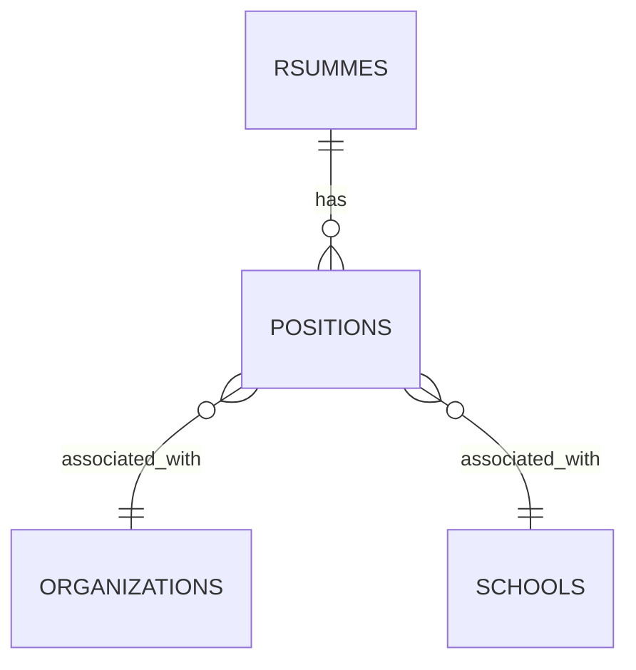
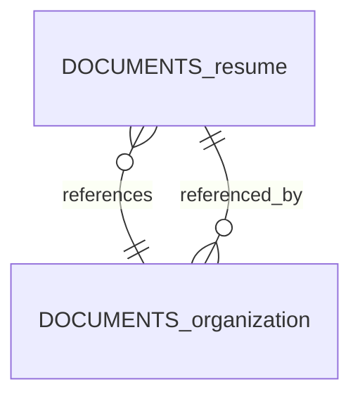
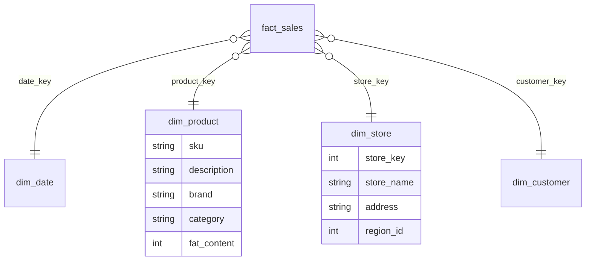

# 第三章 数据模型与查询语言

我的语言的界限意味着我的世界的界限。  
——路德维希·维特根斯坦，《逻辑哲学论》（1922）

数据模型或许是软件开发中最重要的部分，因为它们不仅深刻地影响着软件的编写方式，还影响着我们思考所要解决的问题的方式。

大多数应用程序是通过一层层堆叠数据模型构建起来的。对于每一层，关键问题在于它如何用下一层来表述。以下是从最高层级到最低层级的应用层示例：

1.  作为应用程序开发者，你审视现实世界（包括人、组织、商品、行为、资金流、传感器等），并以对象或数据结构以及操作这些数据结构的API（这些通常特定于你的应用程序）来对其进行建模。
2.  当你想存储这些数据结构时，你用通用数据模型来表达它们，比如JSON或XML文档、关系型数据库中的表，或图中的顶点和边。这些数据模型正是本章的主题。
3.  构建数据库软件的工程师决定了如何用内存、磁盘或网络上的字节来表示这些文档、关系型或图数据。这种表示方式可能允许以各种方式查询、搜索、操作和处理数据。我们将在第4章讨论这些存储引擎的设计。
4.  在更低的层级上，硬件工程师已经弄清楚了如何用电信号、光脉冲、磁场等来表示字节。

在复杂的应用程序中，可能还有更多的中间层级，比如API之上再构建API，但基本思想是相同的：每一层通过提供一个干净的数据模型来隐藏其下各层的复杂性。这些抽象使得不同群体的人——例如，数据库供应商的工程师和使用他们数据库的应用程序开发者——能够有效地协同工作。

在实践中，几种数据模型被广泛使用，通常服务于不同的目的。某些类型的数据和某些查询在一种模型中很容易表达，而在另一种模型中则很笨拙。在本章中，我们将通过比较关系模型、文档模型、基于图的数据模型、[[事件溯源]]和[[DataFrames]]来探讨这些权衡。我们还将简要介绍允许你使用这些模型的查询语言。这种比较将帮助你决定何时使用哪种模型。

> [!INFO] 术语：声明式查询语言
> 
> 本章讨论的许多查询语言（如SQL、Cypher、SPARQL和Datalog）都是声明式的，这意味着你指定你想要的数据模式——结果必须满足什么条件，以及你希望如何转换数据（例如，排序、分组和聚合）——但不指定如何实现该目标。数据库系统的查询优化器可以决定使用哪些索引和连接算法，以及按何种顺序执行查询的各个部分。
> 
> 相比之下，使用大多数编程语言（如Python和Java），你需要编写一个算法，告诉计算机按何种顺序执行哪些操作。声明式查询语言的吸引力在于，它通常比显式算法更简洁、更易编写。更重要的是，它隐藏了查询引擎的实现细节，这使得数据库系统能够在不要求查询发生变化的情况下引入性能改进[1, 2]。
> 
> 例如，数据库可能能够在多个CPU核心和机器上并行执行声明式查询，而你无需担心如何实现这种并行性[3]。在手写算法中，要自行实现这样的并行执行将会非常困难。

---

## 关系型模型与文档模型

目前最著名的数据模型可能是SQL，它基于1970年Edgar Codd提出的关系模型[4]。在这个模型中，数据被组织成关系（在SQL中称为表），每个关系是元组（在SQL中称为行）的无序集合。

关系模型最初是一个理论上的提议，当时很多人怀疑它能否被高效实现。然而，到了20世纪80年代中期，关系型数据库管理系统（RDBMS）和SQL已成为大多数需要存储和查询具有某种规则结构数据的人的首选工具。许多数据管理用例——例如，业务分析（参见第77页的“星型与雪花型：用于分析的模式”）——数十年后仍然以关系型数据为主导。

多年来，出现了许多竞争性的数据存储和查询方法。在20世纪70年代和80年代初期，网状模型和层次模型是主要的替代方案，但关系模型最终占据主导地位。对象数据库（不要与用于大文件的对象存储混淆，后者是当今流行的云服务）在20世纪80年代末和90年代初出现又消失。XML数据库在21世纪初出现，但仅获得了小众采用。关系模型的每个竞争对手在当时都引发了大量炒作，但无一持久[5]。相反，SQL不断发展以融入其他类型的数据——例如，增加了对XML、JSON和图数据的支持[6]。

在2010年代，NoSQL是最新的试图推翻关系型数据库主导地位的流行词。NoSQL并非指单一技术，而是一组松散的思想，围绕新的数据模型、模式灵活性、可扩展性以及转向开源许可模式。一些数据库自称NewSQL，反映了它们的目标是提供NoSQL系统的可扩展性以及传统关系型数据库的数据模型和事务保证。NoSQL和NewSQL的思想在数据系统设计中极具影响力，但随着这些原则被广泛采用，这些术语的使用已经减少。

NoSQL运动的一个持久影响是文档模型的流行，该模型通常将数据表示为JSON。这种模型最初由专门的文档数据库（如MongoDB和Couchbase）推广，但现在大多数关系型数据库也已添加了JSON支持。与通常被视为具有僵化、固定模式的关系型表相比，JSON文档被认为更加灵活。

文档数据和关系型数据的优缺点已被广泛争论。让我们审视一下这场争论中的一些关键点。

---

### 对象-关系的不匹配

当今许多应用程序开发都是用面向对象编程语言完成的，这导致了对SQL数据模型的一个常见批评：如果数据存储在关系型表中，则需要在应用程序代码中的对象与数据库的表、行、列模型之间建立一个笨拙的翻译层。这种模型之间的脱节有时被称为**阻抗不匹配**。

> [!NOTE] 阻抗不匹配的由来
> 
> 术语“阻抗不匹配”借用于电子学。每个电路在其输入和输出上都有一定的阻抗（对交流电的电阻）。当你将一个电路的输出连接到另一个电路的输入时，如果两个电路的输出和输入阻抗匹配，则跨连接点的功率传输最大。阻抗不匹配可能导致信号反射和其他问题。

#### 对象关系映射

像ActiveRecord和Hibernate这样的**对象关系映射（ORM）**框架减少了该翻译层所需的样板代码量，但它们经常受到批评[7]。一些常见的被提及问题如下：

-   ORM很复杂，无法完全隐藏两种模型之间的差异，因此开发者最终仍然需要同时考虑数据的关系型和对象表示。
-   ORM通常仅用于OLTP应用程序开发（参见第5页的“表征事务处理与分析”）；为分析目的提供数据的数据工程师需要处理底层的关系型表示，因此在使用ORM时，关系型模式的设计仍然很重要。
-   许多ORM仅适用于关系型OLTP数据库。那些拥有多样化数据系统（如搜索引擎、图数据库和NoSQL系统）的组织可能会发现ORM支持不足。
-   一些ORM会自动生成关系型模式，但这对于直接访问关系型数据的用户来说可能很笨拙，并且在底层数据库上可能效率低下。自定义ORM的模式和查询生成可能很复杂，并抵消了使用ORM的首要好处。
-   ORM很容易让人无意中编写出低效的查询。一个例子是N+1查询问题[8]。例如，假设你想在一个页面上显示用户评论列表，因此你执行一个查询，返回N条评论，每条评论包含其作者的ID。为了显示每个评论作者的名字，你需要对每条评论额外执行一个查询来获取作者信息，最终总共执行了N+1个查询。虽然ORM可以让你通过配置或懒加载来掩盖这个问题，但开发者需要理解底层原理才能高效使用。

你可能会意外写出低效的查询。一个示例是N+1查询问题[8]。例如，假设你想在一个页面上显示用户评论列表，于是你执行一次查询返回N条评论，每条评论包含其作者的ID。要显示每条评论的作者姓名，你需要在users表中查找该ID。在手写SQL中，你可能会在查询中执行这个连接，并在返回每条评论的同时返回作者姓名。然而，使用ORM，你可能会最终为每条评论在users表上单独执行一次查询来查找其作者，总共导致N+1次数据库查询，这比在数据库中执行连接要慢。为避免此问题，你可能需要告诉ORM在获取评论的同时获取作者信息。

尽管如此，ORM也有其优势：
- 对于非常适合关系模型的数据，持久化的关系表示与内存中的对象表示之间的某种转换是不可避免的，而ORM减少了这种转换所需的样板代码量。复杂的查询可能仍需在ORM外部处理，但ORM可以帮助处理简单和重复的情况。
- 某些ORM有助于缓存数据库查询的结果，这有助于减轻数据库的负载。
- ORM还可以帮助管理模式迁移和其他管理活动。

### 文档数据模型与一对多关系

并非所有数据都适合关系表示。让我们看一个例子来探索关系模型的局限性。图3-1展示了如何使用关系模式表示一份简历（LinkedIn个人资料）。整个个人资料可以通过唯一标识符`user_id`来识别。像`first_name`和`last_name`这样的字段每个用户只出现一次，因此它们可以作为`users`表中的列来建模。

大多数人在职业生涯中有过多次工作（职位），人们可能有不同数量的教育经历和任意数量的联系信息。表示这种一对多关系的一种方法是将职位、教育经历和联系信息放在单独的表中，每个表都包含指向`users`表的外键引用，如图3-1所示。

另一种表示相同信息的方法——也许更自然，且更贴近应用程序代码中的对象结构——是作为JSON文档，如示例3-1所示。

**图3-1：使用关系模式表示LinkedIn个人资料**

（此处为图3-1的占位描述：该图展示了关系模式，包含`users`表（主键`user_id`，字段`first_name`，`last_name`等）以及与`users`表通过外键关联的`positions`、`education`、`contact_info`表。每个子表有各自的ID列，并通过`user_id`引用用户。）

**示例3-1：将LinkedIn个人资料表示为JSON文档**

```json
{
  "user_id":     251,
  "first_name":  "Barack",
  "last_name":   "Obama",
  "headline":    "Former President of the United States of America",
  "region_id":   "us:91",
  "photo_url":   "/p/7/000/253/05b/308dd6e.jpg",
  "positions": [
    {"job_title": "President", "organization": "United States of America"},
    {"job_title": "US Senator (D-IL)", "organization": "United States Senate"}
  ],
  "education": [
    {"school_name": "Harvard University",  "start": 1988, "end": 1991},
    {"school_name": "Columbia University", "start": 1981, "end": 1983}
  ],
  "contact_info": {
    "website": "https://barackobama.com",
    "x": "https://x.com/barackobama"
  }
}
```

一些开发者认为JSON模型减少了应用程序代码与存储层之间的**[[阻抗不匹配]]**。缺乏模式也常被引为一个优势；我们将在第80页的“文档模型中的模式灵活性”中讨论这一点。然而，正如我们将在第5章中看到的，JSON作为一种数据编码格式也存在问题。

JSON表示比图3-1中的多表模式具有更好的局部性（参见第82页的“读写的数据局部性”）。如果你想在关系示例中获取一份个人资料，你需要执行多次查询（按`user_id`查询每个表）或执行用户表与其子表之间复杂的多路连接[9, 10]。在JSON表示中，所有相关信息都在一处，使得查询更快、更简单。

从用户个人资料到用户的职位、教育历史和联系信息的一对多关系意味着数据中的树状结构，JSON表示使得这种树状结构明确（见图3-2）。

**图3-2：一对多关系形成树状结构**

（此处为图3-2的占位描述：该图显示一个根节点“用户个人资料”，下面有分支“职位”、“教育”、“联系信息”，每个分支下又有多个项目（如多个职位），形成树状结构。）

> [!info] 一对多有时称为“一对少”
> 一对多关系有时被称为“一对少”（one-to-few），因为一份简历通常只有少量的职位[11, 12]。如果你有大量相关项——比如名人社交媒体帖子下的评论，可能有成千上万条——将它们全部嵌入同一个文档可能过于臃肿，因此图3-1中的关系方法更可取。

### 规范化、反规范化和连接

在前面的示例3-1中，`region_id`被赋予一个ID，而不是纯文本字符串“Washington, DC, United States”。为什么？

如果UI有一个自由文本字段用于输入地区，那么将其存储为纯文本字符串是有意义的。但拥有标准化的地理区域列表并让用户从下拉列表或自动完成中选择具有以下优势：
- 各个人资料之间的风格和拼写一致
- 避免多个地方同名时的歧义（如果字符串只是“Washington, DC”，是指华盛顿特区还是华盛顿州？）
- 易于更新——名称只存储在一个地方，因此如果需要更改（例如，由于政治事件导致城市名称变更），全局更新很容易
- 支持本地化——当网站被翻译成其他语言时，标准化列表可以被本地化，因此地区可以以查看者的语言显示
- 更好的搜索功能（例如，搜索美国东海岸的人可以匹配此个人资料，因为区域列表可以编码华盛顿位于东海岸这一事实——这从字符串“Washington, DC”本身无法看出）

存储ID还是文本字符串是一个**规范化**的问题。当你使用ID时，你的数据更加规范化：对人类有意义的信息（如文本“Washington, DC”）只存储在一个地方，所有引用它的事物都使用一个ID（该ID仅在数据库中有意义）。当你直接存储文本时，你是在每个使用该信息的记录中复制了人类有意义的信息；这种表示是**反规范化**的。

使用ID的好处是，由于它对人类没有意义，它永远不需要改变：即使它所标识的信息发生了变化，ID也可以保持不变。任何对人类有意义的事物都可能在未来某个时候需要更改——如果该信息被复制，所有冗余的副本都需要更新。这需要更多的代码、更多的写操作和更多的磁盘空间，并且存在不一致的风险（因为部分信息副本被更新而其他副本未更新）。

规范化表示的缺点在于，每次你想显示包含ID的记录时，都必须执行一次额外的查询来将ID解析为人类可读的内容。在关系数据模型中，这是通过连接来完成的。例如：

```sql
SELECT users.*, regions.region_name
FROM users
JOIN regions ON users.region_id = regions.id
WHERE users.id = 251;
```

文档数据库可以存储规范化和反规范化的数据，但它们常常与反规范化联系在一起——部分原因是JSON数据模型使得存储额外的反规范化字段变得容易，部分原因是许多文档数据库对连接的支持较弱，使得规范化变得不便。一些文档数据库根本不支持连接，因此你必须在应用程序代码中执行连接——也就是说，你先获取一个包含ID的文档，然后执行第二次查询以将该ID解析为另一个文档。在[[MongoDB]]中，也可以使用聚合管道中的`$lookup`操作符执行连接：

```javascript
db.users.aggregate([
  { $match: { _id: 251 } },
  { $lookup: {
      from: "regions",
      localField: "region_id",
      foreignField: "_id",
      as: "region"
  } }
])
```

#### 规范化的权衡

在简历示例中，虽然`region_id`字段是对标准化区域集的引用，但`organization`（人员工作的公司或政府）和`school_name`（他们学习的地方）只是字符串。这种表示是反规范化的：许多人可能在同一个公司工作过，但没有ID将它们联系起来。

值得考虑是否应将组织和学校名称建模为实体，而让个人资料引用它们的ID。用于引用区域ID的同样论点也适用于这里。例如，假设我们想在名称之外包含学校或公司的Logo：
- 在反规范化表示中，我们会在每个人的个人资料中包含Logo的图像URL。这使得JSON文档自包含，但如果我们需要更改Logo，就会带来麻烦，因为我们需要找到所有旧URL的出现并更新它们[11]。
- 在规范化表示中，我们会创建一个表示组织或学校的实体，并将其名称、Logo URL以及可能的其他属性（描述、新闻提要等）作为该实体的一部分只存储一次。每个提到该组织的简历只需引用其ID，更新Logo将变得容易。

作为一般原则，规范化的数据通常写入更快（因为只有一个副本），但查询更慢（因为需要连接）；反规范化的数据通常读取更快（更少的连接），但写入更昂贵（需要更新更多副本，占用更多磁盘空间）。你可以将反规范化视为一种**衍生数据**形式（参见第10页的“记录系统与衍生数据”），因为你需要设置一个流程来更新数据的冗余副本。

除了执行所有这些更新的成本外，你还需要考虑更新过程中途崩溃时的数据库一致性。提供原子事务（参见第280页的“原子性”）的数据库更容易保持一致性，但并非所有数据库都支持跨多个文档的原子性。也可以通过**流处理**来确保一致性，我们将在后面的章节中讨论。

## 规范化与反规范化

规范化通常更适合在线事务处理（OLTP）系统，此类系统需要快速执行读取和更新操作；而分析型系统通常更适合采用反规范化数据，因为此类系统批量执行更新，并且只读查询的性能是主要关注点。在中小型系统中，规范化的数据模型通常是最佳选择，因为你不必担心保持数据的多个副本之间的一致性，而且执行连接的成本可以接受。然而，在超大规模系统中，连接的成本可能变得十分棘手。

### 社交网络案例研究中的反规范化

在[[第2章案例研究：社交网络主页时间线|“案例研究：社交网络主页时间线”（第34页）]]中，我们比较了规范化表示（图2-1）和反规范化表示（预计算的物化时间线）。在这里，帖子和关注之间的连接成本过高，而物化时间线是该连接结果的缓存。将新帖子插入关注者时间线的扇出过程是我们保持反规范化表示一致性的方法。

然而，X（原Twitter）的物化时间线实现并不存储每个帖子的实际文本。每个条目只存储帖子ID、发布者的用户ID以及一些用于标识转发和回复的额外信息[13]。换句话说，它是以下查询（大致上）的预计算结果：

```sql
SELECT posts.id, posts.sender_id FROM posts
  JOIN follows ON posts.sender_id = follows.followee_id
  WHERE follows.follower_id = current_user
  ORDER BY posts.timestamp DESC
  LIMIT 1000
```

这意味着每当读取时间线时，服务仍然需要执行两次连接：它根据帖子ID查找实际帖子内容（以及点赞数和回复数等统计数据），并根据发送者ID查找发送者个人资料（以获取用户名、头像和其他详细信息）。这种通过ID查找人类可读信息的过程称为**充实ID**（hydrating the IDs），本质上是在应用程序代码中执行的连接[13]。

在预计算的时间线中只存储ID的原因是，它们所引用的数据变化很快。热门帖子上的点赞数和回复数每秒可能变化多次，有些用户会定期更改用户名或头像。由于时间线在查看时应显示最新的点赞数和头像，将这些信息反规范化到物化时间线中是没有意义的。此外，这种反规范化会显著增加存储成本。

这个例子表明，在读取数据时执行连接并非像有时声称的那样，是实现高性能、可扩展服务的障碍。充实帖子和用户ID实际上是一个相当容易扩展的操作，因为它可以很好地并行化，并且成本不依赖于你关注了多少账户或你有多少关注者。

如果你需要在应用程序中决定是否对某些内容进行反规范化，社交网络案例研究表明，选择并不是显而易见的；最具可扩展性的方法可能涉及对某些内容进行反规范化，而保持其他内容规范化。你需要仔细考虑信息变化的频率以及读写成本（这些成本可能由异常值主导，例如在典型社交网络中拥有大量关注/关注者的用户）。规范化和反规范化本身没有好坏之分——它们只是在读写性能和实现难度之间进行权衡。

---

## 多对一和多对多关系

虽然图3-1中的职位和教育表是多对一或多对少关系的例子（一份简历有多个职位，但每个职位只属于一份简历），但`region_id`字段是多对一关系的例子（许多人生活在同一个地区，但我们假设每个人在任何时候只居住在一个地区）。

如果我们引入组织和学校实体，并通过ID从简历中引用它们，那么我们还会遇到多对多关系（一个人可能为多个组织工作过，一个组织有多个过去或现在的员工）。在关系模型中，这种关系通常用关联表或连接表来表示，如图3-3所示：每个职位将一个用户ID与一个组织ID关联起来。



**图3-3. 关系模型中的多对多关系**（此图为Mermaid示例，基于原文描述生成，实际图3-3为关系图）

多对一和多对多关系不容易适合一个自包含的JSON文档；它们更倾向于规范化的表示。在文档模型中，一种可能的表示方式在示例3-2中给出，并在图3-4中说明。每个虚线矩形内的数据可以分组到一个文档中，但对组织和学校的引用最好表示为对其他文档的引用。

**示例3-2. 通过ID引用组织的简历**

```json
{
  "user_id":    251,
  "first_name": "Barack",
  "last_name":  "Obama",
  "positions": [
    {"start": 2009, "end": 2017, "job_title": "President",         "org_id": 513},
    {"start": 2005, "end": 2008, "job_title": "US Senator (D-IL)", "org_id": 514}
  ],
  ...
}
```

多对多关系通常需要“双向”查询——例如，找出特定个人曾工作过的所有组织，以及找出曾在特定组织工作过的所有人。启用此类查询的一种方法是在两侧存储ID引用，这样简历包含该人工作过的每个组织的ID，而组织文档则包含提及该组织的简历的ID。这种表示是反规范化的，因为关系存储在两个位置，可能变得不一致。



**图3-4. 文档模型中的多对多关系——每个虚线框内的数据可以分组到一个文档中**（此图为Mermaid示例，基于原文描述生成，实际图3-4为示意图）

规范化的表示将关系仅存储在一个位置，并依赖次要索引（我们将在第4章讨论）来允许关系在双向高效查询。在图3-3所示的关系模式中，我们会告诉数据库在职位表的`user_id`和`org_id`列上创建索引。

在示例3-2的文档模型中，数据库需要对职位数组中对象的`org_id`字段建立索引。许多文档数据库和支持JSON的关系数据库能够对文档内部的值创建此类索引。

---

## 星型与雪花型：用于分析的模式

数据仓库（参见[[数据仓库|“数据仓库”（第7页）]]）通常是关系型的，并且数据仓库中表的结构有一些广泛使用的约定，包括**星型模式**（star schema）、**雪花型模式**（snowflake schema）、**维度建模**（dimensional modeling）[14]和**大宽表**（one big table, OBT）。这些结构针对业务分析师的需求进行了优化。ETL过程将数据从操作型系统转换到选定的模式中。

图3-5展示了一个在杂货零售商数据仓库中可能看到的星型模式示例。该模式的中心是一个所谓的**事实表**（在此示例中称为`fact_sales`）。事实表中的每一行代表某个时间发生的事件（这里，每一行代表一个客户购买一件产品）。如果我们分析的是网站流量而不是零售销售，那么每一行可能代表用户的一次页面浏览或一次点击。



**图3-5. 用于数据仓库的星型模式**（此图为Mermaid示例，基于原文描述生成，实际图3-5为完整星型模式示意图，包含`dim_date`, `dim_product`, `dim_store`, `dim_customer`四个维度表）

通常，事实被捕获为单个事件，因为这允许以后最大的分析灵活性。然而，这意味着事实表可能变得极其庞大。大型企业的数据仓库中可能有数PB的交易历史，大部分以事实表的形式表示。

事实表中的某些列是属性，例如产品的售价和从供应商处购买的成本（允许计算利润边际）。事实表中的其他列是引用其他表的**外键**，这些其他表称为**维度表**。由于事实表中的每一行代表一个事件，维度则代表事件的**谁、什么、哪里、何时、如何以及为什么**。

例如，在图3-5中，其中一个维度是售出的产品。`dim_product`表中的每一行代表一种待售产品类型，包括其库存单位（SKU）、描述、品牌名称、类别、脂肪含量，以及……（原文在此中断，但根据上下文，应继续描述其他维度，如时间、商店、客户等。）

> [!INFO] 说明
> 原文在此处结束，但基于讨论内容，`dim_product`表还会包含其他属性，例如包装尺寸等。星型模式的命名源于其结构：事实表在中心，维度表呈放射状排列，类似星星的线条。雪花型模式是星型模式的变体，其中某些维度表被进一步规范化，分成多个关联的表，形成类似雪花的分支结构。


## 关系模型与文档模型

### 星型与雪花型模式

在数据仓库中，事实表（fact table）的每一行代表一个事件，记录了事件发生的时间、地点、方式及原因。例如，图3-5中，其中一个维度是已售产品。`dim_product` 表中的每一行代表一种在售产品，包含其库存单位（SKU）、描述、品牌名称、类别、脂肪含量以及包装尺寸。`fact_sales` 表中的每一行通过外键指明该笔交易中售出的产品。查询通常涉及多个维度表的多次连接。

甚至日期和时间也常用维度表表示，因为这可以编码关于日期（如公共假日）的附加信息，使查询能够区分假日与非假日的销售。

**星型模式**（star schema）的名称来源于直观的表格关系：事实表位于中心，周围环绕其维度表（如图3-5所示）；与这些表的连接如同星芒。

该模式的一个变体是**雪花型模式**（snowflake schema），其中维度被进一步分解为子维度。例如，品牌和产品类别可以单独建表，`dim_product` 表中的每一行通过外键引用品牌和类别，而不是在 `dim_product` 表中直接存储字符串。雪花型模式比星型模式更规范化，但星型模式通常更受分析师青睐，因为其结构更简单[14]。

在典型的数据仓库中，表往往相当宽：事实表常有超过一百列，有时甚至几百列。维度表也可能很宽，因为它们包含所有可能与分析相关的元数据——例如，`dim_store` 表可能包含每个门店提供的服务详情、是否有店内面包房、建筑面积、首次开业日期、最近一次装修时间以及距最近高速公路的距离。

星型或雪花型模式主要由多对一关系组成（例如，多笔销售对应某个特定产品、某家特定门店），通过事实表中的外键指向维度表，或维度指向子维度来表示。原则上，其他关系类型也可能存在，但通常会被反规范化以简化查询。例如，如果客户一次性购买多个不同产品，该多商品交易不会显式表示；相反，事实表为每件已购商品单独一行，这些行恰好共享相同的客户ID、门店ID和时间戳。

某些数据仓库模式将反规范化推得更远，完全省略维度表，将维度信息折叠为事实表中的反规范化列（本质上是预计算事实表与维度表的连接）。这种方法称为 **大宽表**（one big table, OBT），虽然需要更多存储空间，但有时能加快查询速度[15]。

在分析场景中，这种反规范化并无大碍，因为数据通常代表历史日志，不会发生变化（偶尔修正错误除外）。在OLTP系统中，反规范化会导致数据一致性和写入开销问题，而在分析场景中这些并不紧迫。

### 何时使用哪种模型

支持文档数据模型的主要论点包括：schema灵活性、由于局部性带来的更好性能，以及对于某些应用而言更接近应用所使用的对象模型。关系模型则通过更好地支持连接以及多对一和多对多关系来回击。下面我们详细审视这些论点。

如果应用中的数据具有类似文档的结构（即一对多关系的树形结构，且通常一次性加载整棵树），那么使用文档模型可能是个好主意。关系技术中的“拆解”（shredding）——将文档状结构拆分为多个表（如图3-1中的职位、教育和联系方式）——可能导致笨重的schema和不必要的复杂应用代码。

文档模型也有局限性。例如，你无法直接引用文档中的嵌套项；相反，你需要说类似“用户251的职位列表中的第二项”。如果需要引用嵌套项，关系方法更适用，因为它可以直接通过ID引用任何项。

某些应用允许用户选择项目的顺序——例如，想象一个待办事项列表或问题追踪器，用户可以拖动任务来重新排序。文档模型很好地支持这类应用，因为项目（或其ID）可以简单地存储在JSON数组中来确定顺序。在关系数据库中，没有表示这种可重排列表的标准方式，而是使用各种技巧，例如按整数列排序（在中间插入时需要重新编号）、维护ID链表或使用分数索引[16, 17, 18]。

#### 文档模型中的Schema灵活性

大多数文档数据库以及关系数据库中的JSON支持，并不对文档中的数据强制任何schema。关系数据库中的XML支持通常带有可选的schema验证。没有schema意味着可以向文档添加任意键和值，读取时客户端对文档可能包含哪些字段没有保证。

文档数据库有时被称为 **无模式**（schemaless），但这具有误导性，因为读取数据的代码通常假定某种结构——即存在 **隐式schema**，但不由数据库强制[19]。更准确的术语是 **读时模式**（schema-on-read，数据的结构是隐式的，仅在读取时解释），与之相对的是 **写时模式**（schema-on-write，关系数据库的传统方法，schema是显式的，数据库在写入时确保所有数据都符合它）[20]。

读时模式类似于编程语言中的动态（运行时）类型检查，而写时模式类似于静态（编译时）类型检查。就像静态和动态类型检查的支持者就各自优劣激烈辩论一样[21]，数据库中schema的强制也是一个有争议的话题，总体而言没有明确的赢家。

当应用想要更改数据格式时，两种方法的差异尤为明显。例如，假设当前每个用户的全名存储在一个字段中，现在想将名字和姓氏分开存储[22]。在文档数据库中，你只需开始写入包含新字段的新文档，并在应用中添加处理旧文档读取情况的代码。例如：

```javascript
if (user && user.name && !user.first_name) {
    // 2023年12月8日之前写入的文档没有 first_name
    user.first_name = user.name.split(" ")[0];
}
```

这种方法的缺点是，应用中读取数据库的每个部分现在都需要处理可能很久以前写入的旧格式文档。另一方面，在写时模式数据库中，你通常会执行类似于以下的迁移：

```sql
ALTER TABLE users ADD COLUMN first_name text DEFAULT NULL;
UPDATE users SET first_name = split_part(name, ' ', 1);      -- PostgreSQL
UPDATE users SET first_name = substring_index(name, ' ', 1);      -- MySQL
```

在大多数关系数据库中，添加带有默认值的列即使在大表上也是快速且无问题的。然而，对于大表执行 `UPDATE` 语句可能很慢，因为每一行都需要重写，其他schema操作（如更改列的数据类型）通常也需要复制整个表。

有多种工具允许在后台进行此类schema更改而无需停机[23, 24, 25, 26]，但在大型数据库上执行此类迁移在操作上仍然具有挑战性。可以通过添加 `first_name` 列并将其默认值设为 `NULL`（速度很快）并在读取时填充来避免复杂的迁移，就像在文档数据库中那样。

如果集合中的项目并非都具有相同结构（即数据异构），读时模式方法是有利的；例如：

- 有多种类型的对象，且将每种类型的对象放入各自的表不切实际。
- 数据的结构由你无法控制且可能随时变化的外部系统决定。

在这种情况下，schema可能弊大于利，而无模式文档可能是更自然的数据模型。但当所有记录预期具有相同结构时，schema是记录和强制该结构的有用机制。我们将在第5章更详细地讨论schema及schema演化。

#### 读取和写入的数据局部性

文档通常存储为单条连续字符串，编码为JSON、XML或其二进制变体（如MongoDB的BSON）。如果应用经常需要访问整个文档（例如在网页上渲染它），这种存储局部性具有性能优势。如果数据像图3-1那样分散在多个表中，则需要多次索引查找才能检索全部数据，这可能需要更多的磁盘寻道并花费更多时间。

只有当同时需要文档的大部分内容时，局部性优势才适用。数据库通常需要加载整个文档，如果只需要访问大文档的一小部分，则可能造成浪费。此外，更新文档时通常需要重写整个文档。出于这些原因，一般建议保持文档较小，避免频繁的小规模更新。

然而，将相关数据存储在一起以获得局部性并非文档模型独有。例如，Google的Spanner数据库通过允许schema声明一个表的行应交错（嵌套）在父表内，在关系数据模型中提供了相同的局部性特性[27]。Oracle通过名为“多表索引簇表”（multi-table index cluster tables）的特性实现了同样的事情[28]。由Google的Bigtable推广并在HBase和Accumulo中使用的宽列数据模型具有列族（column families），其管理局部性的目的类似[29]。

#### 文档的查询语言

关系数据库与文档数据库的另一个区别是用于查询的语言或API。大多数关系数据库使用SQL进行查询，而文档数据库则更加多样。有些仅允许通过主键进行键值访问，另一些则提供二级索引来查询文档内的值，还有一些提供丰富的查询语言。

XML数据库通常使用XQuery和XPath进行查询，它们设计用于支持复杂查询（包括跨多个文档的连接）并将结果格式化为XML[30]。JSON Pointer[31]和JSONPath[32]为JSON提供了与XPath等价的功能。MongoDB的聚合管道（其连接操作`$lookup`我们在第72页的“规范化、反规范化和连接”中见过）是JSON文档集合查询语言的一个例子。

 

让我们再看一个例子，以便更直观地理解这种语言——这次是一个聚合查询，这在分析场景中尤其常用。假设你是一名海洋生物学家，每次在海洋中看到动物时都会向数据库添加一条观测记录。现在你想要生成一份报告，显示每月你看到了多少条鲨鱼。在 PostgreSQL 中，你可以这样表达查询：

```sql
SELECT date_trunc('month', observation_timestamp) AS observation_month, 
       sum(num_animals) AS total_animals
FROM observations
WHERE family = 'Sharks'
GROUP BY observation_month;
```

`date_trunc('month', observation_timestamp)` 函数确定包含时间戳的日历月份，并返回代表该月开始的另一个时间戳。换句话说，该函数将时间戳向下舍入到最近的月份。

该查询首先过滤观测数据，只显示鲨鱼科（Sharks）的物种，然后按观测发生的日历月份分组，最后对当月所有观测中看到的动物数量求和。同样的查询可以用 MongoDB 的聚合管道表达如下：

```javascript
db.observations.aggregate([
    { $match: { family: "Sharks" } },
    { $group: {
        _id: {
            year:  { $year:  "$observationTimestamp" },
            month: { $month: "$observationTimestamp" }
        },
        totalAnimals: { $sum: "$numAnimals" }
    } }
]);
```

聚合管道语言在表达能力上与 SQL 的子集相似，但它使用基于 JSON 的语法，而不是 SQL 的英文句子式语法。这种差异或许只是品味问题。

## 文档数据库与关系数据库的趋同

文档数据库和关系数据库最初作为截然不同的数据管理方法出现，但随着时间的推移，它们变得越来越相似 [33]。关系数据库增加了对 JSON 类型和查询运算符的支持，以及对文档内部属性进行索引的能力。而一些文档数据库（如 MongoDB、Couchbase 和 RethinkDB）则增加了对连接、二级索引和声明式查询语言的支持。

> [!NOTE]
> Codd 最初对关系模型的描述 [4] 允许在关系模式中使用类似 JSON 的结构。他称之为**非简单域**。其思想是：行中的值不必是原始数据类型（如数字或字符串），也可以是一个嵌套关系（表），因此你可以将任意嵌套的树状结构作为值。这一构造与 30 多年后添加到 SQL 中的 JSON 和 XML 支持相当。

模型的这种趋同对应用程序开发者来说是个好消息，因为当你能在同一数据库中结合关系模型和文档模型时，两者都能发挥最佳效果。许多文档数据库需要类似关系型的方式引用其他文档，而许多关系数据库则在某些部分受益于模式的灵活性。关系-文档混合体是一种强大的组合。

## 图数据模型

我们之前看到，关系类型是区分数据模型的重要特征。如果你的应用主要是**一对多关系**（树形结构数据），且记录之间其他关系很少，那么文档模型是合适的。

但如果**多对多关系**在你的数据中非常普遍呢？关系模型可以处理多对多关系的简单情况，但随着数据中的连接变得更为复杂，将数据建模为图就变得更自然了。

一个**图**由两种对象组成：**顶点**（也称为节点或实体）和**边**（也称为关系或弧）。许多类型的数据都可以建模为图。典型的例子包括：

- **社交图谱**：顶点是人，边表示哪些人互相认识。
- **网络图**：顶点是网页，边表示指向其他页面的 HTML 链接。
- **道路或铁路网络**：顶点是路口，边表示连接它们的道路或铁路线。

著名的算法可以作用于这些图——例如，地图导航应用在道路网络中搜索两点之间的最短路径，PageRank 可以用于网页图以确定网页的流行度，从而在搜索结果中确定其排名 [34]。

图可以通过多种方式表示。在**邻接表模型**中，每个顶点存储与其相隔一条边的邻居顶点的 ID。或者，你可以使用**邻接矩阵**，这是一个二维数组，其中每一行和每一列对应一个顶点，当行顶点和列顶点之间没有边时值为 0，有边时值为 1。邻接表适合图遍历，而矩阵适合机器学习（参见第 105 页的“DataFrames、矩阵和数组”）。

在刚刚给出的例子中，图的所有顶点都表示同一种事物（人、网页或路口）。然而，图并不局限于这种同构数据。图的一个同样强大的用途是提供一种一致的方式，在单个数据库中存储完全不同类型的对象。例如：

- Facebook 维护着一个包含多种顶点和边类型的单一图。顶点代表人、地点、事件、签到以及用户的评论；边表示哪些人是朋友，哪个签到发生在哪个地点，谁评论了哪个帖子，谁参加了哪个活动，等等 [35]。
- 搜索引擎使用**知识图谱**记录关于经常出现在搜索查询中的实体（如组织、人物和地点）的事实 [36]。这些信息通过爬取和分析网站上的文本获得；一些网站（如 Wikidata）也以结构化形式发布图数据。

图提供了几种不同但又相关的结构化数据和查询数据的方式。在本节中，我们将讨论**属性图模型**（由 Neo4j、Memgraph、KùzuDB [37] 以及其他数据库实现 [38]）和**三元组存储模型**（由 Datomic、AllegroGraph、Blazegraph 等实现）。这些模型在表达能力上相当相似，一些图数据库（如 Amazon Neptune）同时支持两者。

我们还将介绍四种图查询语言（Cypher、SPARQL、Datalog 和 GraphQL），以及 SQL 对图查询的支持。还有其他的图查询语言（如 Gremlin [39]），但上述四种将给我们提供一个代表性的概览。

为了说明这些语言和模型，本节以图 3-6 作为贯穿示例。它可以来自社交网络或家谱数据库；它显示了两个人：来自爱达荷州的 Lucy 和来自法国圣洛的 Alain。他们已婚并住在伦敦。每个人和每个位置都表示为一个顶点，它们之间的关系表示为边。这个例子将有助于演示在图数据库中很容易但在其他数据模型中很困难的一些查询。

  
**图 3-6. 图结构化数据（矩形表示顶点，箭头表示边）**

## 属性图

在**属性图**（也称为**带标签的属性图**）模型中，每个顶点由以下部分组成：

- 一个唯一标识符
- 一个标签（字符串），用于描述该顶点表示的对象类型
- 一组出边
- 一组入边
- 一组属性（键值对）

每条边由以下部分组成：

- 一个唯一标识符
- 边的起始顶点（尾部顶点）
- 边的结束顶点（头部顶点）
- 一个标签，用于描述两个顶点之间的关系类型
- 一组属性（键值对）

## 属性图模型

你可以将图存储视为由两个关系表组成：一个用于顶点，一个用于边，如示例3-3所示（该模式使用PostgreSQL的`jsonb`数据类型来存储每个顶点或边的属性）。每条边存储其头顶点和尾顶点；如果你想要某个顶点的所有入边或出边，可以分别通过`head_vertex`或`tail_vertex`查询边表。

**示例3-3. 使用关系模式表示属性图**

```sql
CREATE TABLE vertices (
    vertex_id   integer PRIMARY KEY,
    label       text,
    properties  jsonb
);

CREATE TABLE edges (
    edge_id     integer PRIMARY KEY,
    tail_vertex integer REFERENCES vertices (vertex_id),
    head_vertex integer REFERENCES vertices (vertex_id),
    label       text,
    properties  jsonb
);

CREATE INDEX edges_tails ON edges (tail_vertex);
CREATE INDEX edges_heads ON edges (head_vertex);
```

该模型的一些重要特性如下：

- 任何顶点都可以与任何其他顶点相连。没有模式限制哪些事物可以或不可以关联。
- 给定任意顶点，你可以高效地找到其所有的入边和出边，从而能够正向和反向遍历图（即沿着顶点链走出一条路径）。（这就是示例3-3同时在`tail_vertex`和`head_vertex`列上建立索引的原因。）
- 通过对不同类型的顶点和关系使用不同的标签，你可以在单个图中存储多种信息，同时仍保持清晰的数据模型。

`edges`表就像我们在“多对一和多对多关系”（第75页）中看到的多对多关联表或连接表，但泛化到允许在同一表中存储多种类型的关系。还可以在标签和属性上建立索引，以便高效地找到具有特定属性的顶点或边。

> [!INFO] 图模型的限制
> 图模型的一个限制是，一条边只能关联两个顶点，而关系连接表可以通过单行上的多个外键引用表示三元甚至更高度的关系。此类关系可以在图中通过创建一个额外的顶点（对应于连接表的每一行）以及与该顶点相连的边来表示，或者使用超图。

这些特性为数据建模赋予了极大的灵活性，如图3-6所示。该图展示了一些在传统关系模式中难以表达的事物，例如不同国家中不同类型的区域结构（法国有省和大区，而美国有县和州）、历史奇事（如国中之国，暂时忽略主权国家和民族的复杂性）以及数据的粒度差异（Lucy的当前居住地指定为城市，而出生地仅指定到州级别）。

你可以设想扩展此图以包含关于Lucy和Alain的更多事实，或其他人的信息。例如，你可以用图来表示他们的食物过敏情况（为每种过敏原引入一个顶点，并在人与过敏原之间建立一条边来表示过敏），并将过敏原与一组顶点链接起来，显示哪些食物含有哪些物质。然后你可以编写查询，找出每个人可以安全食用的食物。图非常适合[[演化性]]：随着你为应用添加功能，图可以轻松扩展以适应应用数据结构的变更。

## Cypher查询语言

[[Cypher]]是一种用于属性图的查询语言，最初为[[Neo4j]]图数据库创建，后来发展为开放标准[[openCypher]] [40]。除了Neo4j，Cypher还被[[Memgraph]]、[[KùzuDB]] [37]、[[Amazon Neptune]]、[[Apache AGE]]（借用PostgreSQL存储）等支持。该语言以电影《黑客帝国》中的一个角色命名，与密码学中的密码无关 [41]。

示例3-4展示了将图3-6左侧部分插入到图数据库的Cypher查询。图的其余部分可以类似地添加。每个顶点被赋予一个符号名称，如`usa`或`idaho`。该名称不存储在数据库中，仅在查询内部用于在顶点之间创建边，使用箭头表示法：`(idaho) -[:WITHIN]-> (usa)` 创建一条标签为`WITHIN`的边，以`idaho`为尾节点，`usa`为头节点。

**示例3-4. 图3-6中数据的子集，表示为Cypher查询**

```cypher
CREATE
  (namerica :Location {name:'North America',  type:'continent'}),
  (usa      :Location {name:'United States',  type:'country'  }),
  (idaho    :Location {name:'Idaho',          type:'state'    }),
  (lucy     :Person   {name:'Lucy' }),
  (idaho) -[:WITHIN ]-> (usa)  -[:WITHIN]-> (namerica),
  (lucy)  -[:BORN_IN]-> (idaho)
```

当图3-6中的所有顶点和边都添加到数据库后，我们就可以开始提出有趣的问题了。例如，假设我们想找出所有从美国移民到欧洲的人的姓名。我们可以通过查找所有满足以下条件的顶点：有一条`BORN_IN`边指向美国境内的某个位置，并且有一条`LIVING_IN`边指向欧洲境内的某个位置，然后返回每个这样的顶点的`name`属性。

示例3-5展示了如何用Cypher表达该查询。相同的箭头表示法用于`MATCH`子句，以在图中查找模式：`(person) -[:BORN_IN]-> ()` 匹配任意两个由标签为`BORN_IN`的边关联的顶点。该边的尾顶点绑定到变量`person`，头顶点未命名。

**示例3-5. 找到从美国移民到欧洲的人的Cypher查询**

```cypher
MATCH
  (person) -[:BORN_IN]->  () -[:WITHIN*0..]-> (:Location {name:'United States'}),
  (person) -[:LIVES_IN]-> () -[:WITHIN*0..]-> (:Location {name:'Europe'})
RETURN person.name
```

该查询可以解读为：

找出任意顶点（称为`person`），它同时满足以下两个条件：
1. `person`有一条出边的标签为`BORN_IN`，指向某个顶点。从该顶点出发，你可以沿着一条`WITHIN`出边链（零次或多次）最终到达一个类型为`Location`、`name`属性等于`'United States'`的顶点。
2. 同一个`person`顶点还拥有一条出边的标签为`LIVES_IN`。沿着该边，再沿着一条`WITHIN`出边链，最终到达一个类型为`Location`、`name`属性等于`'Europe'`的顶点。

对于每个这样的`person`顶点，返回其`name`属性。

执行该查询有多种可能的方式。这里给出的描述建议你从扫描数据库中所有人员开始，检查每个人的出生地和居住地，只返回符合条件的人。

但等价地，你也可以从两个`Location`顶点开始向后回溯。如果`name`属性上有索引，你可以高效地找到代表美国和欧洲的两个顶点。然后，通过追踪所有入边的`WITHIN`边，分别找出美国和欧洲境内的所有位置（州、地区、城市等）。最后，在这些位置顶点上，通过入边的`BORN_IN`或`LIVES_IN`边查找人员。

## SQL中的图查询

示例3-3表明，图数据可以用关系数据库表示。但如果我们把图数据放在关系结构中，我们能否也用SQL进行查询呢？答案是肯定的，但有些困难。在图查询中，你遍历的每条边实际上是对`edges`表的一次连接。在关系数据库中，你通常预先知道查询中需要哪些连接。另一方面，在图查询中，你可能需要遍历可变数量的边才能找到要找的顶点——也就是说，连接的数量不是事先固定的。

在我们的例子中，这体现在Cypher查询的`() -[:WITHIN*0..]-> ()`模式中。一个人的`LIVES_IN`边可能指向任何类型的位置，如街道、城市、区、地区或州。一个城市可能位于一个地区内，一个地区位于一个州内，一个州位于一个国家内，等等。`LIVES_IN`边可能直接指向你要找的位置顶点，也可能在位置层次结构中隔了几层。

在Cypher中，`:WITHIN*0..`非常简洁地表达了这一事实：它的意思是“沿`WITHIN`边走零次或多次”。就像正则表达式中的`*`运算符。

这种在查询中可变长度遍历路径的概念，可以使用递归公用表表达式（`WITH RECURSIVE`语法）来表达。示例3-6展示了用该技术编写的相同查询——找出从美国移民到欧洲的人的姓名。正如你所见，与Cypher相比，该语法非常笨拙。

**示例3-6. 与示例3-5相同的查询，使用SQL递归公用表表达式编写**

```sql
WITH RECURSIVE
  -- in_usa 是位于美国境内的所有位置的顶点ID集合
  in_usa(vertex_id) AS (
      SELECT vertex_id FROM vertices
        WHERE label = 'Location' AND properties->>'name' = 'United States' 
    UNION
      SELECT edges.tail_vertex FROM edges 
        JOIN in_usa ON edges.head_vertex = in_usa.vertex_id
        WHERE edges.label = 'within'
  ),
  -- in_europe 是位于欧洲境内的所有位置的顶点ID集合
  in_europe(vertex_id) AS (
      SELECT vertex_id FROM vertices
        WHERE label = 'location' AND properties->>'name' = 'Europe'
      UNION
      SELECT edges.tail_vertex FROM edges 
        JOIN in_europe ON edges.head_vertex = in_europe.vertex_id
        WHERE edges.label = 'within'
  )
SELECT vertices.properties->>'name'
FROM vertices
-- 查找那些出生在美国境内位置的人
WHERE vertices.vertex_id IN (
    SELECT edges.tail_vertex FROM edges
      JOIN in_usa ON edges.head_vertex = in_usa.vertex_id
      WHERE edges.label = 'born_in'
)
-- 并且居住在欧洲境内位置的人
AND vertices.vertex_id IN (
    SELECT edges.tail_vertex FROM edges
      JOIN in_europe ON edges.head_vertex = in_europe.vertex_id
      WHERE edges.label = 'lives_in'
);
```

UNION
      SELECT edges.tail_vertex FROM edges
        JOIN in_europe ON edges.head_vertex = in_europe.vertex_id
        WHERE edges.label = 'within'
  ),
  -- born_in_usa is the set of vertex IDs of all people born in the US
  born_in_usa(vertex_id) AS ( 
    SELECT edges.tail_vertex FROM edges
      JOIN in_usa ON edges.head_vertex = in_usa.vertex_id
      WHERE edges.label = 'born_in'
  ),
  -- lives_in_europe is the set of vertex IDs of all people living in Europe
  lives_in_europe(vertex_id) AS ( 
    SELECT edges.tail_vertex FROM edges
      JOIN in_europe ON edges.head_vertex = in_europe.vertex_id
      WHERE edges.label = 'lives_in'
  )
SELECT vertices.properties->>'name'
FROM vertices
-- join to find those people who were both born in the US *and* live in Europe
JOIN born_in_usa     ON vertices.vertex_id = born_in_usa.vertex_id 
JOIN lives_in_europe ON vertices.vertex_id = lives_in_europe.vertex_id;

首先找到 `name` 属性值为 **United States** 的顶点，并将其作为顶点集合 `in_usa` 的第一个元素。  
然后沿着所有从 `in_usa` 集合中顶点出发的 **入边**，其中边标签为 `within`，将这些边的尾顶点（tail vertex）加入 `in_usa` 集合，直到所有 `within` 入边都被遍历完毕。  
接着对 `name` 属性值为 **Europe** 的顶点执行相同操作，构建顶点集合 `in_europe`。  
对于 `in_usa` 集合中的每个顶点，沿着标签为 `born_in` 的入边，找到出生于美国境内某地的人。  
类似地，对于 `in_europe` 集合中的每个顶点，沿着标签为 `lives_in` 的入边，找到居住在欧洲的人。  

最后，通过连接操作，将出生于美国的人与居住在欧洲的人取交集。

一个仅需 4 行的 Cypher 查询，在 SQL 中却需要 31 行，这充分说明了正确选择数据模型和查询语言能带来多大的差异。而这还只是冰山一角；还有更多的细节需要考虑，例如如何处理循环，以及如何在广度优先遍历和深度优先遍历之间选择 [42]。Oracle 针对递归查询提供了不同的 SQL 扩展，称为层次查询（hierarchical queries）[43]。其他图查询语言包括 TigerGraph 的 GSQL [44] 和属性图查询语言（PGQL）[45]。

基于 Cypher 的图查询语言（GQL）ISO 标准已于 2024 年发布 [46, 47, 48]。虽然目前尚未广泛采用，但希望在未来几年它能推动图数据库走向更高的统一性。

## 三元组存储与 SPARQL

三元组存储模型与属性图模型基本等价，只是使用不同的术语来描述相同的概念。尽管如此，它仍然值得讨论，因为三元组存储的各种工具和语言可以为你的应用构建工具箱增添有价值的内容。

在三元组存储中，所有信息都以非常简单的三部分陈述形式存储：**(主语, 谓语, 宾语)**。例如，在三元组 `(Jim, likes, bananas)` 中，`Jim` 是主语，`likes` 是谓语（动词），`bananas` 是宾语。

> [!NOTE] **精确起见**  
> 提供三元组类似数据模型的数据库通常需要在每个元组上存储额外的元数据。例如，AWS Neptune 通过为每个三元组添加一个图 ID 来使用四元组（4 元组）[49]；Datomic 使用五元组（5 元组），为每个三元组扩展一个事务 ID 和一个布尔值来指示删除 [50]。由于这些数据库保留了这里解释的基本主语-谓语-宾语结构，本书仍然称它们为三元组存储。

三元组的主语相当于图中的顶点。宾语可以是以下两种之一：

- **基本数据类型的值**，例如字符串或数字。此时，三元组的谓语和宾语相当于主语顶点上属性的键和值。以图 3-6 中的例子为例，`(lucy, birthYear, 1989)` 就像顶点 `lucy` 拥有属性 `{"birthYear": 1989}`。
- **图中的另一个顶点**。此时，谓语是图中的一条边，主语是边的尾顶点，宾语是边的头顶点。例如，在 `(lucy, marriedTo, alain)` 中，主语和宾语 `lucy` 和 `alain` 都是顶点，谓语 `marriedTo` 是连接它们的边的标签。

示例 3-7 展示了与示例 3-4 相同的数据，但采用了一种称为 Turtle 的格式（它是 Notation3 (N3) 的子集 [51]）编写为三元组。

**示例 3-7. 图 3-6 中数据的子集，表示为 Turtle 三元组**

```turtle
@prefix : <urn:example:>.
_:lucy     a       :Person.
_:lucy     :name   "Lucy".
_:lucy     :bornIn _:idaho.
_:idaho    a       :Location.
_:idaho    :name   "Idaho".
_:idaho    :type   "state".
_:idaho    :within _:usa.
_:usa      a       :Location.
_:usa      :name   "United States".
_:usa      :type   "country".
_:usa      :within _:namerica.
_:namerica a       :Location.
_:namerica :name   "North America".
_:namerica :type   "continent".
```

在这个例子中，图的顶点写作 `_:someName`。这个名称在此文件之外没有任何意义；它只是为了让我们知道哪些三元组指向同一个顶点。当谓语表示一条边时，宾语是一个顶点，例如 `_:idaho :within _:usa`。当谓语是一个属性时，宾语是一个字符串字面量，例如 `_:usa :name "United States"`。

为了更紧凑的表示，你可以使用分号来表述同一主语的多个事实，如示例 3-8 所示。这使得 Turtle 格式相当易读。

**示例 3-8. 示例 3-7 数据的更简洁写法**

```turtle
@prefix : <urn:example:>.
_:lucy     a :Person;   :name "Lucy";          :bornIn _:idaho.
_:idaho    a :Location; :name "Idaho";         :type "state";   :within _:usa.
_:usa      a :Location; :name "United States"; :type "country"; :within _:namerica.
_:namerica a :Location; :name "North America"; :type "continent".
```

## 语义网

三元组存储的一些研究和开发工作源于语义网（Semantic Web），这是 2000 年代早期的一项努力，旨在通过不仅以人类可读的网页形式发布数据，还以标准化的机器可读格式发布数据，来促进互联网范围内的数据交换。尽管最初设想的语义网并未成功 [52, 53]，但该项目的遗产依然留存，例如：链接数据标准如 JSON-LD [54]、生物医学科学中使用的本体 [55]、Facebook 的 Open Graph 协议 [56]（用于链接预览展开 [57]）、知识图谱如 Wikidata，以及由 Schema.org 维护的结构化数据标准化词汇表。

三元组存储是另一种语义网技术，它已在其原始用例之外找到用途；即使你对语义网毫无兴趣，三元组也可以成为应用程序良好的内部数据模型。

### RDF 数据模型

我们在示例 3-8 中使用的 Turtle 语言实际上是资源描述框架（Resource Description Framework, RDF）[58] 的一种数据编码方式，RDF 是一种专为语义网设计的数据模型。RDF 数据还可以用其他方式编码，包括（更冗长的）XML，如示例 3-9 所示。像 Apache Jena 这样的工具可以自动在不同的 RDF 编码之间进行转换。

**示例 3-9. 采用 RDF/XML 语法表达的示例 3-8 数据**

```xml
<rdf:RDF xmlns="urn:example:"
    xmlns:rdf="http://www.w3.org/1999/02/22-rdf-syntax-ns#">
  <Location rdf:nodeID="idaho">
    <name>Idaho</name>
    <type>state</type>
    <within>
      <Location rdf:nodeID="usa">
        <name>United States</name>
        <type>country</type>
        <within>
          <Location rdf:nodeID="namerica">
            <name>North America</name>
            <type>continent</type>
          </Location>
        </within>
      </Location>
    </within>
  </Location>
  <Person rdf:nodeID="lucy">
```

（本部分结束）

# 第 3 章：数据模型与查询语言

```xml
<name>Lucy</name>
<bornIn rdf:nodeID="idaho"/>
  </Person>
</rdf:RDF>
```

RDF 有一些特别之处，因为它设计用于互联网范围内的数据交换。三元组的主体、谓词和对象通常是 URI。例如，谓词可能是像 `<http://my-company.com/namespace#within>` 或 `<http://my-company.com/namespace#lives_in>` 这样的 URI，而不仅仅是 WITHIN 或 LIVES_IN。这种设计背后的理由是，你应该能够将你的数据与别人的数据合并，如果他们对单词 `within` 或 `lives_in` 附加了不同的含义，你也不会产生冲突，因为他们的谓词实际上是 `<http://other.org/foo#within>` 和 `<http://other.org/foo#lives_in>`。

URL `<http://my-company.com/namespace>` 不一定需要解析到任何东西——从 RDF 的角度来看，它仅仅是一个命名空间。为了避免与 `http://` URL 的潜在混淆，本节中的示例使用不可解析的 URI，如 `urn:example:within`。幸运的是，你可以在文件顶部指定一次这个前缀，然后就可以忽略它。

## SPARQL 查询语言

SPARQL 是用于采用 RDF 数据模型的三元组存储的查询语言 [59]。（该名称是 SPARQL 协议与 RDF 查询语言的递归缩写，发音为 “sparkle”。）它早于 Cypher，并且由于 Cypher 的模式匹配是借鉴自 SPARQL，因此它们看起来非常相似。

与之前相同的查询——找出从美国迁移到欧洲的人——在 SPARQL 中同样简洁，如同在 Cypher 中一样（见示例 3-10）。

**示例 3-10. 与示例 3-5 相同的查询，用 SPARQL 表达**

```sparql
PREFIX : <urn:example:>
SELECT ?personName WHERE {
  ?person :name ?personName.
  ?person :bornIn  / :within* / :name "United States".
  ?person :livesIn / :within* / :name "Europe".
}
```

其结构与 Cypher 非常相似。以下两个表达式是等价的（在 SPARQL 中变量以问号开头）：

```cypher
(person) -[:BORN_IN]-> () -[:WITHIN*0..]-> (location)   # Cypher
```

```sparql
?person :bornIn / :within* ?location.                   # SPARQL
```

因为 RDF 不区分属性和边，而是对两者都使用谓词，所以你可以使用相同的语法来匹配属性。在以下表达式中，变量 `usa` 绑定到任何一个具有 `name` 属性且属性值为字符串 `"United States"` 的顶点：

```cypher
(usa {name:'United States'})   # Cypher
```

```sparql
?usa :name "United States".    # SPARQL
```

SPARQL 受 Amazon Neptune、AllegroGraph、Blazegraph、OpenLink Virtuoso、Apache Jena 以及其他各种三元组存储的支持 [38]。

## Datalog：递归关系查询

Datalog 是一门比 SPARQL 或 Cypher 古老得多的语言，起源于 1980 年代的学术研究 [60, 61, 62]。它在软件工程师中知名度较低，并且未在主流数据库中得到广泛支持，但它应该被更多人知晓，因为它是一种表现力非常强的语言，尤其擅长处理复杂查询。包括 Datomic、LogicBlox、CozoDB 以及 LinkedIn 的 LIquid [63] 在内的几个小众数据库都使用 Datalog 作为其查询语言。它基于关系数据模型，而不是图模型，但我们在此讨论它，因为图上的递归查询是 Datalog 的一个特别优势。

Datalog 数据库的内容被称为**事实**，每个事实对应关系表中的一行。例如，假设我们有一个包含位置的 location 表，它有三列：ID、name 和 type。美国是一个国家的事实可以写成 `location(2, "United States", "country")`，其中 2 是美国的 ID。一般来说，语句 `table(val1, val2, …)` 表示表 `table` 包含一行，该行的第一列包含 `val1`，第二列包含 `val2`，依此类推。

示例 3-11 展示了如何将图 3-6 左侧的数据用 Datalog 表示。图的边（`within`、`born_in` 和 `lives_in`）被表示为两列的连接表。例如，Lucy 的 ID 是 100，Idaho 的 ID 是 3，因此关系“Lucy 出生在 Idaho”被表示为 `born_in(100, 3)`。

**示例 3-11. 图 3-6 中数据的一个子集，表示为 Datalog 事实**

```prolog
location(1, "North America", "continent").
location(2, "United States", "country").
location(3, "Idaho", "state").
within(2, 1).    /* US is in North America */
within(3, 2).    /* Idaho is in the US     */
person(100, "Lucy").
born_in(100, 3). /* Lucy was born in Idaho */
```

现在我们已经定义了数据，可以像示例 3-12 那样编写与之前相同的查询。它看起来与 Cypher 或 SPARQL 中的等价物有些不同，但不要因此而退却。Datalog 是 Prolog 的一个子集，如果你学过计算机科学，你可能见过 Prolog 这门编程语言。

**示例 3-12. 与示例 3-5 相同的查询，用 Datalog 表达**

```prolog
within_recursive(LocID, PlaceName) :- location(LocID, PlaceName, _). /* Rule 1 */
within_recursive(LocID, PlaceName) :- within(LocID, ViaID),          /* Rule 2 */
                                      within_recursive(ViaID, PlaceName).
migrated(PName, BornIn, LivingIn)  :- person(PersonID, PName),       /* Rule 3 */
                                      born_in(PersonID, BornID),
                                      within_recursive(BornID, BornIn),
                                      lives_in(PersonID, LivingID),
                                      within_recursive(LivingID, LivingIn).
us_to_europe(Person) :- migrated(Person, "United States", "Europe"). /* Rule 4 */
/* us_to_europe contains the row "Lucy". */
```

Cypher 和 SPARQL 立即使用 SELECT，而 Datalog 则循序渐进。我们定义**规则**，从底层事实中推导出新的虚拟表。这些推导出的表类似于（虚拟的）SQL 视图：它们并不存储在数据库中，但你可以像查询包含存储事实的表一样查询它们。

在示例 3-12 中，我们定义了三个推导出的表：`within_recursive`、`migrated` 和 `us_to_europe`。虚拟表的名称和列由每个规则中 `:-` 符号之前的内容定义。例如，`migrated(PName, BornIn, LivingIn)` 是一个包含三列的虚拟表：一个人的姓名、出生地名称和居住地名称。

虚拟表的内容由规则中 `:-` 符号之后的部分定义，我们在这里尝试在表中查找匹配特定模式的行。例如，`person(PersonID, PName)` 匹配行 `person(100, "Lucy")`，变量 `PersonID` 绑定到值 100，变量 `PName` 绑定到值 `"Lucy"`。如果系统能够为 `:-` 运算符右侧的所有模式找到匹配，则规则生效。当规则生效时，就好像 `:-` 的左侧被添加到数据库中（变量被替换为它们匹配的值）。

应用规则的一种可能方式如下（如图 3-7 所示）：

1. `location(1, "North America", "continent")` 存在于数据库中，因此规则 1 生效。它生成 `within_recursive(1, "North America")`。
2. `within(2, 1)` 存在于数据库中，并且上一步生成了 `within_recursive(1, "North America")`，因此规则 2 生效。它生成 `within_recursive(2, "North America")`。
3. `within(3, 2)` 存在于数据库中，并且上一步生成了 `within_recursive(2, "North America")`，因此规则 2 生效。它生成 `within_recursive(3, "North America")`。

通过重复应用规则 1 和规则 2，`within_recursive` 虚拟表可以告诉我们数据库中包含的北美（或任何其他位置）的所有位置。

**图 3-7. 使用示例 3-12 中的 Datalog 规则，确定 Idaho 位于北美洲**

```mermaid
graph TD
    A[location(1, "North America", "continent")] -- Rule1 --> B[within_recursive(1, "North America")]
    C[within(2, 1)] --> B
    B -- Rule2 --> D[within_recursive(2, "North America")]
    E[within(3, 2)] --> D
    D -- Rule2 --> F[within_recursive(3, "North America")]
```

现在规则 3 可以找出那些出生在某个位置 `BornIn` 并居住在某个位置 `LivingIn` 的人。规则 4 以 `BornIn = 'United States'` 和 `LivingIn = 'Europe'` 调用规则 3，并只返回匹配搜索的人员姓名。通过查询虚拟表 `us_to_europe` 的内容，Datalog 系统最终得到了与前面 Cypher 和 SPARQL 查询相同的答案。

与本章讨论的其他查询语言相比，Datalog 方法需要一种不同的思维方式。它允许规则逐步构建复杂查询，一个规则可以引用其他规则，类似于将代码分解为互相调用的函数。就像函数可以递归一样，Datalog 规则也可以调用自身，例如示例 3-12 中的规则 2，这使得 Datalog 查询能够进行图遍历。

## GraphQL

GraphQL 是一种查询语言，其设计初衷比本章中看到的其他语言更具限制性。它旨在用于 OLTP 查询；其目的是允许运行在用户设备上的客户端软件（例如移动应用或 JavaScript Web

 

## GraphQL

GraphQL 是一种查询语言，其设计比本章中讨论的其他语言严格得多。它旨在用于 OLTP 查询；其目的是允许运行在用户设备上的客户端软件（例如移动应用或 JavaScript Web 应用前端）请求一个具有特定结构的 JSON 文档，该文档包含渲染其用户界面所需的字段。

GraphQL 接口允许开发者快速更改客户端代码中的查询，而无需更改服务端 API。然而，这种灵活性是有代价的。采用 GraphQL 的组织通常需要工具将查询转换为对内部服务的请求，这些内部服务通常使用 REST 或 gRPC（参见第5章）。授权、速率限制和性能挑战是额外的关注点 [64]。

该语言也刻意受限，因为 GraphQL 查询来自不可信的来源。它不允许任何可能执行成本高昂的操作，否则用户（可能无意中）可能通过运行大量昂贵的查询导致服务器上的拒绝服务条件。特别地，GraphQL 不允许递归查询（不像 Cypher、SPARQL、SQL 或 Datalog），也不允许任意搜索条件（例如我们的“找出在美国出生且现居欧洲的人”），除非服务所有者特意选择提供此类搜索功能。

尽管如此，GraphQL 仍然非常有用。示例 3-13 展示了如何使用 GraphQL 实现如 Discord 或 Slack 这样的群聊应用。该查询请求用户有权访问的所有频道，包括频道名称和每个频道中最近的 50 条消息。对于每条消息，查询请求时间戳、消息内容以及发送者的姓名和个人资料图片 URL。如果一条消息是另一条消息的回复，查询还会请求该消息的发送者姓名和内容（可能以较小字体呈现在回复上方，以提供一些上下文）。

**示例 3-13. 用于群聊应用的 GraphQL 查询**

```graphql
query ChatApp {
  channels {
    name
    recentMessages(latest: 50) {
      timestamp
      content
      sender {
        fullName
        imageUrl
      }
      replyTo {
        content
        sender {
          fullName
        }
      }
    }
  }
}
```

示例 3-14 展示了对示例 3-13 中查询的可能响应。该响应是一个 JSON 文档，其结构与查询镜像：它恰好包含所请求的那些属性，不多不少。这种方法的好处是，服务端不需要知道客户端渲染用户界面需要哪些属性；客户端只需请求它所需的属性。例如，此查询没有请求 `replyTo` 消息发送者的个人资料图片 URL，但如果用户界面更改为包含该个人资料图片，客户端只需在查询中添加所需的 `imageUrl` 属性，服务端无需任何更改。

**示例 3-14. 对示例 3-13 中查询的可能响应**

```json
{
  "data": {
    "channels": [
      {
        "name": "#general",
        "recentMessages": [
          {
            "timestamp": 1693143014,
            "content": "Hey! How are y'all doing?",
            "sender": {"fullName": "Aaliyah", "imageUrl": "https://..."},
            "replyTo": null
          },
          {
            "timestamp": 1693143024,
            "content": "Great! And you?",
            "sender": {"fullName": "Caleb", "imageUrl": "https://..."},
            "replyTo": {
              "content": "Hey! How are y'all doing?",
              "sender": {"fullName": "Aaliyah"}
            }
          },
          ...
```

在此示例中，消息发送者的姓名和图片 URL 直接嵌入在消息对象中。如果同一用户发送多条消息，这些信息将在每条消息中重复。原则上，可以减少这种重复，但 GraphQL 的设计选择是接受更大的响应大小，以便根据请求的数据更简单地渲染用户界面。

`replyTo` 字段类似：在示例 3-14 中，第二条消息是对第一条消息的回复，并且内容（“Hey…”）和发送者姓名（Aaliyah）在 `replyTo` 下重复。可以改为返回被回复消息的 ID，但如果该 ID 不在返回的 50 条最近消息中，客户端就必须另外向服务器发起请求。重复内容使得数据处理更加简单。

> [!TIP]
> 服务器的数据库可以以更规范化的形式存储数据，并执行必要的连接以处理查询。例如，服务器可能存储消息及其发送者的用户 ID 和回复消息的 ID；当收到类似示例 3-13 的查询时，服务器会解析这些 ID 以查找它们引用的记录。然而，只有那些在 GraphQL 模式中显式声明的连接才能被客户端请求。

尽管 GraphQL 查询的响应看起来很像文档数据库的响应，并且其名称中带有“graph”，但 GraphQL 可以在任何类型的数据库之上实现——关系型、文档型或图型。

## 事件溯源与 CQRS

在我们迄今为止讨论的所有数据模型中，数据的查询形式与写入形式相同——无论是 JSON 文档、表中的行，还是图中的顶点和边。然而，在复杂应用中，有时很难找到单一的数据表示形式能够满足数据需要被查询和呈现的所有方式。在这种情况下，以一种形式写入数据，然后从中派生出针对不同类型读取进行优化的表示形式，可能会很有益处。

我们之前在“记录系统与派生数据”（第10页）中看到过这个想法，而 ETL（参见“数据仓库”，第7页）就是此类派生过程的一个例子。现在我们将进一步探讨这个想法。既然我们无论如何都要从一种数据表示派生出另一种，那么我们可以分别选择针对写入和读取优化的不同表示形式。如果你只想优化写入性能，而高效查询无关紧要，你会如何建模数据？

也许最简单、最快、最具表现力的数据写入方式就是**事件日志**：每次你想要写入某些数据时，将其编码为一个自包含的字符串（例如 JSON），包含时间戳，然后附加到一个事件序列中。该日志中的事件是不可变的；你永远不会修改或删除它们，只会不断向日志追加更多事件（这些事件可能会取代较早的事件）。一个事件可以包含任意属性。

图 3-8 展示了一个可能来自会议管理系统的示例。会议可能是一个复杂的业务领域：不仅个人参会者可以注册并通过信用卡付款，公司也可以批量订购座位，通过发票付款，然后将座位分配给个人。一定数量的座位可能预留给演讲者、赞助商、志愿者等。预订也可能被取消，会议组织者可能通过将活动移至不同房间来更改活动的容量。面对所有这些情况，仅仅计算可用座位数量就成了一项具有挑战性的查询。

**图 3-8. 使用不可变事件日志作为真相源，并从中派生物化视图**

```
[图 3-8 描述:一个日志流,包含事件如“注册已开启”、“A 预订了座位 X”、“B 预订了座位 Y”、“A 取消了预订”、“容量已更改”.从日志流中,箭头指向三个不同的物化视图:一个用于预订状态,一个用于仪表板图表,一个用于徽章打印文件.]
```

在图 3-8 中，会议状态的每一次更改（例如组织者开启注册，或参会者进行或取消注册）首先作为事件存储。每当一个事件被追加到日志中时，多个**物化视图**（也称为**投影**或**读取模型**）也会被更新以反映该事件的影响。在会议示例中，可能有一个物化视图收集与每个预订状态相关的所有信息，另一个为会议组织者的仪表板计算图表，第三个生成用于打印参会者徽章的文件。

> [!INFO]
> 使用事件作为真相源，并将每个状态变更表示为事件的想法，被称为**[[事件溯源]]** [65, 66]。维护独立的读取优化表示，并将其从写入优化表示中派生的原则称为**[[命令查询职责分离]]（CQRS）** [67]。这些术语起源于 DDD 社区，尽管类似的想法已经存在很久——例如，在状态机复制中（参见“使用共享日志”，第433页）。

当来自用户的请求到达时，它被称为**命令**，首先需要被验证。一旦命令被执行并被确定为有效（例如，请求的预订有足够的可用座位），它就成为一个**事实**。

# 第 3 章：数据模型与查询语言

## 事件溯源与 CQRS

当一个用户请求到来时，它被称为**命令**，首先需要经过验证。一旦命令被执行并被确定为有效（例如，预订请求有足够的可用座位），它就成为一个**事实**，相应的事件被追加到日志中。因此，事件日志应仅包含有效事件，而构建物化视图的事件日志消费者不允许拒绝事件。

在以事件溯源风格建模数据时，建议使用过去时态命名事件（例如“the seats were booked”），因为事件是对已发生事实的记录。即使用户后来决定更改或取消预订，他们以前拥有预订这一事实仍然成立，而更改或取消是一个稍后添加的单独事件。

事件溯源与“星型与雪花型：分析用模式”第 77 页讨论的星型模式事实表之间的相似之处在于，两者都是过去发生的事件的集合。但是，事实表中的行都具有相同的列集，而在事件溯源中可能有多种事件类型，每种类型具有不同的属性。此外，事实表是无序集合，而事件溯源中事件的顺序很重要：如果先进行预订然后取消，按错误顺序处理这些事件将没有意义。

事件溯源和 CQRS 有几个优点：

- [!TIP] **意图清晰**：对于开发系统的人来说，事件能更好地传达某事发生的原因。例如，理解事件“the booking was canceled”比理解“bookings 表第 4001 行的 active 列被设置为 false，与该预订关联的三行从 seat_assignments 表中删除，并且在 payments 表中插入了一行表示退款”要容易得多。当物化视图处理取消事件时，这些行修改仍可能发生，但当它们由事件驱动时，更新的原因变得清晰得多。

- [!INFO] **可重现的派生**：事件溯源的一个关键原则是物化视图以可重现的方式从事件日志派生。你应该始终能够删除物化视图，并通过使用相同代码、按相同顺序重新处理相同事件来重新计算它们。如果视图维护代码中存在错误，只需删除视图并用新代码重新计算。发现错误也更容易，因为你可以根据需要多次重新运行视图维护代码并检查其行为。

- [!TIP] **多种优化视图**：你可以拥有多个针对应用程序所需查询优化的物化视图。这些视图可以存储在与事件相同的数据库中，也可以存储在不同的数据库中，具体取决于需要。它们可以使用任何数据模型，并且可以反规范化以实现快速读取。你甚至可以将视图仅保留在内存中而不持久化，只要在服务重启时从事件日志重新计算视图是可以接受的。

- [!TIP] **轻松演进**：如果你决定以新方式呈现现有信息，从现有事件日志构建新的物化视图很容易。你还可以通过添加新的事件类型或向现有事件类型添加新属性来演进系统以支持新功能（旧事件保持不变）。你还可以从现有事件中链式触发新行为（例如，当会议参与者取消时，他们的座位可以提供给候补名单上的下一个人）。

- [!TIP] **可逆性**：如果写入了错误的事件，你可以写入后续的删除事件来撤销它。下游视图会自动合并此删除，从而纠正数据。另一方面，在直接更新和删除数据的数据库中，已提交的事务通常难以撤销。因此，事件溯源可以减少系统中不可逆转操作的数量，使更改更容易（参见“可演进性：让改变变得简单”第 55 页）。

- [!TIP] **审计日志**：事件日志还可以作为系统中所发生事件的审计日志，这对需要此类审计能力的受监管行业非常有价值。

- [!INFO] **高写入吞吐量**：由于日志的顺序访问模式，事件日志通常可以比数据库处理更高的写入吞吐量。如果你有临时的突发事件，日志可以吸收它，而维护物化视图的下游系统可以按自己的节奏追赶，而不会被压垮。

然而，事件溯源和 CQRS 也有缺点：

- [!WARNING] **外部信息处理**：如果涉及外部信息，你需要小心。例如，假设一个事件包含一种货币的价格，而对于某个视图，需要将其转换为另一种货币。由于汇率可能波动，如果在处理事件时从外部来源获取汇率，则在重新计算物化视图的不同日期会得到不同的结果。为了使事件处理逻辑确定性，你必须要么在事件本身中包含汇率，要么有一种方法查询事件时间戳指示的历史汇率，确保对于相同时间戳，该查询始终返回相同结果。

- [!WARNING] **不可变性与个人数据**：事件不可变的要求会在事件包含用户个人数据时产生问题，因为用户可能行使其权利（例如 GDPR 下）请求删除其数据。如果事件日志是按用户划分的，你可以直接删除该用户的整个日志；但如果事件日志包含与多个用户相关的事件，则此方法无效。你可以尝试将个人数据存储在实际事件之外，或者使用稍后可以选择删除的密钥对其进行加密（一种称为“密码粉碎”的技术 [68]），但这也会使需要时重新计算派生状态变得更加困难。

- [!WARNING] **外部可见副作用**：如果存在外部可见的副作用，重新处理事件需要小心。例如，每次重建物化视图时，你可能不希望重新发送确认电子邮件。

你可以在任何数据库之上实现事件溯源，但有些系统专门设计用于支持此模式，例如 EventStoreDB、MartenDB（基于 PostgreSQL）和 Axon Framework。你也可以使用消息代理（如 Apache Kafka）来存储事件日志，流处理器可以保持物化视图更新；我们将在第 12 章中回到这些主题。

唯一重要的要求是事件存储系统必须保证所有物化视图以与日志中完全相同的顺序处理事件。正如我们将在第 10 章中看到的，这在分布式系统中并不总是容易实现。

---

## DataFrame、矩阵与数组

到目前为止，我们在本章中看到的数据模型通常用于事务处理和分析目的（参见“操作型系统与分析型系统”第 3 页）。还有一些数据模型你可能会在分析或科学环境中遇到，但很少出现在 OLTP 系统中，包括 **DataFrame** 和数字的多维数组（如矩阵）。

**DataFrame** 数据模型由 R 语言、Python 的 Pandas 库、Apache Spark、ArcticDB、Dask 等系统支持。DataFrames 是数据科学家为训练 ML 模型准备数据时常用的工具，但也被广泛用于数据探索、统计数据分析、数据可视化和类似目的。

乍一看，DataFrame 类似于关系数据库中的表或电子表格。DataFrame 支持类似关系的操作符，对其内容执行批量操作；例如，对所有行应用函数、基于条件过滤行、按某些列分组并聚合其他列、以及将一个 DataFrame 中的行与另一个 DataFrame 基于键连接（关系数据库中的连接通常在 DataFrame 中称为合并）。

与使用 SQL 等声明式查询语言不同，DataFrame 通常通过一系列修改其结构和内容的命令来操作。这符合数据科学家的典型工作流程，他们逐步“整理”数据，使其能够找到所问问题的答案。这些操作通常发生在数据科学家的私有数据集副本上，通常在其本地机器上，尽管最终结果可能与其他用户共享。

DataFrame API 还提供了远超关系数据库所提供的各种操作，并且该数据模型的使用方式通常与典型的关系数据建模有很大不同 [69]。例如，DataFrames 的一个常见用途是将数据从类似关系的表示转换为矩阵或多维数组表示，这是许多 ML 算法期望的输入形式。

这种转换的一个简单示例如图 3-9 所示。左侧是一个关系表，表示用户对各种电影的评分（1 到 5 分），右侧的数据已被转换为一个矩阵，其中每一列是一部电影，每一行是一个用户（类似于电子表格中的数据透视表）。该矩阵是稀疏的，这意味着许多用户-电影组合没有数据，但这没问题。该矩阵可能有数千列，因此不太适合关系数据库，但 DataFrame 和提供稀疏数组的库（如 Python 的 NumPy）可以轻松处理此类数据。

> **图 3-9.** 将电影评分的关系数据库转换为矩阵

矩阵只能包含数字，并且使用各种技术将非数值数据转换为矩阵中的数字。例如：

- 日期（在图 3-9 的示例矩阵中省略）可以缩放为适当范围内的浮点数。
- 对于只能取小型固定值集之一的列（例如电影数据库中的电影类型），通常使用**独热编码**。我们为每个可能的值（“喜剧”、“剧情”、“恐怖”等）创建一个列，对于表示电影的每一行，我们在该电影类型对应的列中放入 1，在所有其他列中放入 0。这种表示也很容易推广到属于多种类型的电影。

一旦数据以数字矩阵的形式存在，它就适用于线性代数运算，这是许多 ML 算法的基础。例如，图 3-9 中的数据可以是用于推荐用户可能喜欢的电影的系统的一部分。DataFrames 足够灵活，允许数据从关系形式逐步演变为矩阵表示，同时为数据科学家提供

# 第3章 数据模型与查询语言

对数据表示的控制，使其最适合实现数据分析或模型训练过程的目标。

一些数据库，如 TileDB [70]，专门存储大型多维数字数组；它们被称为数组数据库，最常用于科学数据集，如地理空间测量（规则网格上的栅格数据）、医学影像或天文望远镜观测数据 [71]。DataFrame 也用于金融行业表示时间序列数据，例如资产价格和随时间变化的交易 [72]。由于在数据科学家中的流行，DataFrame 已被添加到 Spark 和 Flink 等批处理框架中；我们将在第11章回到这个主题。

## 总结

数据模型是一个庞大的主题，在本章中我们快速浏览了多种不同的模型。我们没有空间深入每个模型的全部细节，但希望这个概述足以激发您进一步了解最适合您应用需求的模型的兴趣。

尽管已有半个多世纪的历史，关系模型仍然是许多应用的重要数据模型——尤其是在数据仓库和商业分析中，关系型星型或雪花模式以及 SQL 查询无处不在。然而，关系数据的若干替代方案在其他领域变得流行：

* **文档模型** 针对数据以自包含的 JSON 文档形式出现、且文档之间关系罕见的用例。
* **图数据模型** 走向相反的方向，针对任何事物都可能与所有事物相关、且查询可能需要遍历多跳才能找到感兴趣数据的用例（可以通过 Cypher、SPARQL 或 Datalog 中的递归查询满足这一需求）。
* **[[DataFrame]]** 将关系数据泛化为大量列，提供了数据库与构成许多机器学习、统计数据分析和科学计算基础的多维数组之间的桥梁。

在一定程度上，一种模型往往可以用另一种模型来模拟——例如，图数据可以用关系数据库表示——但结果可能很笨拙，正如我们在 SQL 递归查询支持中所见。

因此，针对每种数据模型开发了各种专门的数据库，提供了针对该模型优化的查询语言和存储引擎。然而，也存在一种趋势，即数据库通过添加对其他数据模型的支持来扩展到相邻领域——例如，关系数据库以 JSON 列的形式添加了对文档数据的支持，文档数据库添加了类似关系的连接，SQL 中对图数据的支持也在逐步改进。

我们讨论的另一个模型是**事件溯源**，它将数据表示为仅追加的不可变事件日志，对于建模复杂业务领域中的活动可能是有利的。仅追加日志有利于写入数据（我们将在第4章看到）；为了支持高效查询，事件日志通过 [[CQRS]] 转换为读取优化的物化视图。

非关系数据模型的一个共同点是，它们通常不强制要求存储的数据具有模式，这使得应用程序更容易适应不断变化的需求。然而，您的应用程序很可能仍然假定数据具有某种结构；问题只在于模式是显式的（写入时强制）还是隐式的（读取时假定）。

尽管我们已经涵盖了很多内容，但仍有一些数据模型未提及。仅举几个简要示例：

* 研究基因组数据的研究人员通常需要执行序列相似性搜索，这需要一个非常长的字符串（代表一个 DNA 分子）并与一个包含相似但不完全相同字符串的大型数据库进行匹配。这里描述的任何数据库都无法处理这种用法，这就是为什么研究人员编写了专门的基因组数据库软件，如 GenBank [73]。
* 许多金融系统使用复式记账的分类账作为其数据模型。这类数据可以用关系数据库表示，但也有专门针对该数据模型的数据库（如 TigerBeetle）。加密货币和区块链通常基于分布式账本，它们的数据模型中也内置了价值转移。
* 全文搜索可以说是一种经常与数据库一起使用的数据模型。信息检索是一个庞大的专业主题，我们不会在本书中详细讨论，但我们将在第146页的“全文搜索”中触及搜索索引和向量搜索。

我们现在必须就此打住。在下一章中，我们将讨论实现本章描述的数据模型时所涉及的一些权衡。

## 参考文献

[1] Jamie Brandon. “Unexplanations: Query Optimization Works Because SQL Is Declarative.” scattered-thoughts.net, February 2024. Archived at perma.cc/P6W2-WMFZ

[2] Neel Krishnaswami. “What Declarative Languages Are.” semantic-domain.blogspot.com, July 2013. Archived at perma.cc/R4LP-T2RV

[3] Joseph M. Hellerstein. “The Declarative Imperative: Experiences and Conjectures in Distributed Logic.” Tech report UCB/EECS-2010-90, Electrical Engineering and Computer Sciences, University of California at Berkeley, June 2010. Archived at perma.cc/K56R-VVQM

[4] Edgar F. Codd. “A Relational Model of Data for Large Shared Data Banks.” Communications of the ACM, volume 13, issue 6, pages 377–387, June 1970. doi:10.1145/362384.362685

[5] Michael Stonebraker and Joseph M. Hellerstein. “What Goes Around Comes Around.” In Readings in Database Systems, 4th edition, MIT Press, 2005, pages 2–41. ISBN: 9780262693141

[6] Markus Winand. “Modern SQL: Beyond Relational.” modern-sql.com, 2015. Archived at perma.cc/D63V-WAPN

[7] Martin Fowler. “Orm Hate.” martinfowler.com, May 2012. Archived at perma.cc/VCM8-PKNG

[8] Vlad Mihalcea. “N+1 Query Problem with JPA and Hibernate.” vladmihalcea.com, January 2023. Archived at perma.cc/79EV-TZKB

[9] Jens Schauder. “This Is the Beginning of the End of the N+1 Problem: Introducing Single Query Loading.” spring.io, August 2023. Archived at perma.cc/6V96-R333

[10] Jamie Brandon. “SQL Needed Structure.” scattered-thoughts.net, September 2025. Archived at perma.cc/9EVK-HLVR

[11] William Zola. “6 Rules of Thumb for MongoDB Schema Design.” mongodb.com, June 2014. Archived at perma.cc/T2BZ-PPJB

[12] Sidney Andrews and Christopher McClister. “Data Modeling in Azure Cosmos DB.” learn.microsoft.com, February 2023. Archived at archive.org

[13] Raffi Krikorian. “Timelines at Scale.” At QCon San Francisco, November 2012. Archived at perma.cc/V9G5-KLYK

[14] Ralph Kimball and Margy Ross. The Data Warehouse Toolkit: The Definitive Guide to Dimensional Modeling, 3rd edition. John Wiley & Sons, 2013. ISBN: 9781118530801

[15] Michael Kaminsky. “Data Warehouse Modeling: Star Schema vs. OBT.” fivetran.com, August 2022. Archived at perma.cc/2PZK-BFFP

[16] Joe Nelson. “User-defined Order in SQL.” begriffs.com, March 2018. Archived at perma.cc/GS3W-F7AD

[17] Evan Wallace. “Realtime Editing of Ordered Sequences.” figma.com, March 2017. Archived at perma.cc/K6ER-CQZW

[18] David Greenspan. “Implementing Fractional Indexing.” observablehq.com, October 2020. Archived at perma.cc/5N4R-MREN

[19] Martin Fowler. “Schemaless Data Structures.” martinfowler.com, January 2013.

[20] Amr Awadallah. “Schema-on-Read vs. Schema-on-Write.” At Berkeley EECS RAD Lab Retreat, May 2009. Archived at perma.cc/DTB2-JCFR

[21] Martin Odersky. “The Trouble with Types.” At Strange Loop, September 2013. Archived at perma.cc/85QE-PVEP

[22] Conrad Irwin. “MongoDB—Confessions of a PostgreSQL Lover.” At HTML5DevConf, October 2013. Archived at perma.cc/C2J6-3AL5

[23] “Percona Toolkit Documentation: pt-online-schema-change.” docs.percona.com, 2023. Archived at perma.cc/9K8R-E5UH

[24] Shlomi Noach. “gh-ost: GitHub’s Online Schema Migration Tool for MySQL.” github.blog, August 2016. Archived at perma.cc/7XAG-XB72

[25] Shayon Mukherjee. “pg-osc: Zero Downtime Schema Changes in PostgreSQL.” shayon.dev, February 2022. Archived at perma.cc/35WN-7WMY

[26] Carlos Pérez-Aradros Herce. “Introducing pgroll: Zero-Downtime, Reversible, Schema Migrations for Postgres.” xata.io, October 2023. Archived at archive.org

[27] James C. Corbett, Jeffrey Dean, Michael Epstein, Andrew Fikes, Christopher Frost, JJ Furman, Sanjay Ghemawat, Andrey Gubarev, Christopher Heiser, Peter Hochschild, Wilson Hsieh, Sebastian Kanthak, Eugene Kogan, Hongyi Li, Alexander Lloyd, Sergey Melnik, David Mwaura, David Nagle, Sean Quinlan, Rajesh Rao, Lindsay Rolig, Dale Woodford, Yasushi Saito, Christopher Taylor, Michal Szymaniak, and Ruth Wang. “Spanner: Google’s Globally-Distributed Database.” At 10th USENIX Symposium on Operating System Design and Implementation (OSDI), October 2012.

[28] Donald K. Burleson. “Reduce I/O with Oracle Cluster Tables.” dba-oracle.com. Archived at perma.cc/7LBJ-9X2C

[29] Fay Chang, Jeffrey Dean, Sanjay Ghemawat, Wilson C. Hsieh, Deborah A. Wallach, Mike Burrows, Tushar Chandra, Andrew Fikes, and Robert E. Gruber. “Bigtable: A Distributed Storage System for Structured Data.” At 7th USENIX Symposium on Operating System Design and Implementation (OSDI), November 2006.

[30] Priscilla Walmsley. XQuery, 2nd edition. O’Reilly Media, 2015. ISBN: 9781491915080

[31] Paul C. Bryan, Kris Zyp, and Mark Nottingham. “JavaScript Object Notation (JSON) Pointer.” RFC 6901, IETF, April 2013.

 

[32] Stefan Gössner, Glyn Normington, and Carsten Bormann. “JSONPath: Query Expressions for JSON.” RFC 9535, IETF, February 2024.

[33] Michael Stonebraker and Andrew Pavlo. “What Goes Around Comes Around… And Around….” ACM SIGMOD Record, volume 53, issue 2, pages 21–37, July 2024. doi:10.1145/3685980.3685984

[34] Lawrence Page, Sergey Brin, Rajeev Motwani, and Terry Winograd. “The PageRank Citation Ranking: Bringing Order to the Web.” Technical Report 1999-66, Stanford University InfoLab, November 1999. Archived at perma.cc/UML9-UZHW

[35] Nathan Bronson, Zach Amsden, George Cabrera, Prasad Chakka, Peter Dimov, Hui Ding, Jack Ferris, Anthony Giardullo, Sachin Kulkarni, Harry Li, Mark Marchukov, Dmitri Petrov, Lovro Puzar, Yee Jiun Song, and Venkat Venkataramani. “TAO: Facebook’s Distributed Data Store for the Social Graph.” At USENIX Annual Technical Conference (ATC), June 2013.

[36] Natasha Noy, Yuqing Gao, Anshu Jain, Anant Narayanan, Alan Patterson, and Jamie Taylor. “Industry-Scale Knowledge Graphs: Lessons and Challenges.” Communications of the ACM, volume 62, issue 8, pages 36–43, August 2019. doi:10.1145/3331166

[37] Xiyang Feng, Guodong Jin, Ziyi Chen, Chang Liu, and Semih Salihoğlu. “KÙZU Graph Database Management System.” At 13th Annual Conference on Innovative Data Systems Research (CIDR 2023), January 2023. Archived at perma.cc/PS6J-ZBZU

[38] Maciej Besta, Emanuel Peter, Robert Gerstenberger, Marc Fischer, Michał Podstawski, Claude Barthels, Gustavo Alonso, Torsten Hoefler. “Demystifying Graph Databases: Analysis and Taxonomy of Data Organization, System Designs, and Graph Queries.” arXiv:1910.09017, October 2019.

[39] “Apache TinkerPop. TinkerPop 3.6.3 Documentation.” tinkerpop.apache.org, May 2023. Archived at perma.cc/KM7W-7PAT

[40] Nadime Francis, Alastair Green, Paolo Guagliardo, Leonid Libkin, Tobias Lindaaker, Victor Marsault, Stefan Plantikow, Mats Rydberg, Petra Selmer, and Andrés Taylor. “Cypher: An Evolving Query Language for Property Graphs.” At International Conference on Management of Data (SIGMOD), May 2018. doi:10.1145/3183713.3190657

[41] Emil Eifrem. Twitter correspondence, January 2014. Archived at perma.cc/WM4S-BW64

[42] Francesco Tisiot. “Explore the New SEARCH and CYCLE Features in PostgreSQL® 14.” aiven.io, December 2021. Archived at perma.cc/J6BT-83UZ

[43] Gaurav Goel. “Understanding Hierarchies in Oracle.” towardsdatascience.com, May 2020. Archived at perma.cc/5ZLR-Q7EW

**Summary** | 111

[44] Alin Deutsch, Yu Xu, and Mingxi Wu. “Seamless Syntactic and Semantic Integration of Query Primitives over Relational and Graph Data in GSQL.” tigergraph.com, November 2018. Archived at perma.cc/JG7J-Y35X

[45] Oskar van Rest, Sungpack Hong, Jinha Kim, Xuming Meng, and Hassan Chafi. “PGQL: A Property Graph Query Language.” At 4th International Workshop on Graph Data Management Experiences and Systems (GRADES), June 2016. doi:10.1145/2960414.2960421

[46] Philip Rathle and Brad Bebee. “GQL: The ISO Standard for Graphs Has Arrived.” aws.amazon.com, April 2024. Archived at perma.cc/5TEU-N2Y8

[47] Alin Deutsch, Nadime Francis, Alastair Green, Keith Hare, Bei Li, Leonid Libkin, Tobias Lindaaker, Victor Marsault, Wim Martens, Jan Michels, Filip Murlak, Stefan Plantikow, Petra Selmer, Oskar van Rest, Hannes Voigt, Domagoj Vrgoč, Mingxi Wu, and Fred Zemke. “Graph Pattern Matching in GQL and SQL/PGQ.” At International Conference on Management of Data (SIGMOD), June 2022. doi:10.1145/3514221.3526057

[48] Alastair Green. “SQL...And Now GQL.” opencypher.org, September 2019. Archived at perma.cc/AFB2-3SY7

[49] Amazon Web Services. “Neptune Graph Data Model.” Amazon Neptune User Guide, docs.aws.amazon.com. Archived at perma.cc/CX3T-EZU9

[50] Cognitect. “Datomic Data Model.” Datomic Cloud Documentation, docs.datomic.com. Archived at perma.cc/LGM9-LEUT

[51] David Beckett and Tim Berners-Lee. “Turtle—Terse RDF Triple Language.” W3C Team Submission, March 2011.

[52] Sinclair Target. “Whatever Happened to the Semantic Web?” twobithistory.org, May 2018. Archived at perma.cc/M8GL-9KHS

[53] Gavin Mendel-Gleason. “The Semantic Web Is Dead—Long Live the Semantic Web!” terminusdb.com, August 2022. Archived at perma.cc/G2MZ-DSS3

[54] Manu Sporny. “JSON-LD and Why I Hate the Semantic Web.” manu.sporny.org, January 2014. Archived at perma.cc/7PT4-PJKF

[55] University of Michigan Library. “Biomedical Ontologies and Controlled Vocabularies.” guides.lib.umich.edu/ontology. Archived at perma.cc/Q5GA-F2N8

[56] Facebook. “The Open Graph Protocol.” ogp.me. Archived at perma.cc/C49A-GUSY

[57] Matt Haughey. “Everything You Ever Wanted to Know About Unfurling but Were Afraid to Ask /or/ How to Make Your Site Previews Look Amazing in Slack.” medium.com, November 2015. Archived at perma.cc/C7S8-4PZN

112 | **第3章：数据模型与查询语言**

[58] W3C RDF Working Group. “Resource Description Framework (RDF).” w3.org, February 2004.

[59] Steve Harris, Andy Seaborne, and Eric Prud’hommeaux. “SPARQL 1.1 Query Language.” W3C Recommendation, March 2013.

[60] Todd J. Green, Shan Shan Huang, Boon Thau Loo, and Wenchao Zhou. “Datalog and Recursive Query Processing.” Foundations and Trends in Databases, volume 5, issue 2, pages 105–195, November 2013. doi:10.1561/1900000017

[61] Stefano Ceri, Georg Gottlob, and Letizia Tanca. “What You Always Wanted to Know About Datalog (And Never Dared to Ask).” IEEE Transactions on Knowledge and Data Engineering, volume 1, issue 1, pages 146–166, March 1989. doi:10.1109/69.43410

[62] Serge Abiteboul, Richard Hull, and Victor Vianu. *Foundations of Databases*. Addison-Wesley, 1995. ISBN: 9780201537710. Available online at webdam.inria.fr/Alice.

[63] Scott Meyer, Andrew Carter, and Andrew Rodriguez. “LIquid: The Soul of a New Graph Database, Part 2.” engineering.linkedin.com, September 2020. Archived at perma.cc/K9M4-PD6Q

[64] Matt Bessey. “Why, After 6 Years, I’m over GraphQL.” bessey.dev, May 2024. Archived at perma.cc/2PAU-JYRA

[65] Dominic Betts, Julián Domínguez, Grigori Melnik, Fernando Simonazzi, and Mani Subramanian. *Exploring CQRS and Event Sourcing*. Microsoft Patterns & Practices, 2012. ISBN: 9781621140164. Archived at perma.cc/7A39-3NM8

[66] Greg Young. “CQRS and Event Sourcing.” At Code on the Beach, August 2014.

[67] Greg Young. “CQRS Documents.” cqrs.wordpress.com, November 2010. Archived at perma.cc/X5R6-R47F

[68] Brent Robinson. “Crypto Shredding: How It Can Solve Modern Data Retention Challenges.” medium.com, January 2019. Archived at perma.cc/4LFK-S6XE

[69] Devin Petersohn, Stephen Macke, Doris Xin, William Ma, Doris Lee, Xiangxi Mo, Joseph E. Gonzalez, Joseph M. Hellerstein, Anthony D. Joseph, and Aditya Parameswaran. “Towards Scalable Dataframe Systems.” *Proceedings of the VLDB Endowment*, volume 13, issue 11, pages 2033–2046, July 2020. doi:10.14778/3407790.3407807

[70] Stavros Papadopoulos, Kushal Datta, Samuel Madden, and Timothy Mattson. “The TileDB Array Data Storage Manager.” *Proceedings of the VLDB Endowment*, volume 10, issue 4, pages 349–360, November 2016. doi:10.14778/3025111.3025117

**Summary** | 113

[71] Florin Rusu. “Multidimensional Array Data Management.” *Foundations and Trends in Databases*, volume 12, issues 2–3, pages 69–220, February 2023. doi:10.1561/1900000069

[72] Ed Targett. “Bloomberg, Man Group Team Up to Develop Open Source ‘ArcticDB’ Database.” thestack.technology, March 2023. Archived at perma.cc/M5YD-QQYV

[73] Dennis A. Benson, Ilene Karsch-Mizrachi, David J. Lipman, James Ostell, and David L. Wheeler. “GenBank.” *Nucleic Acids Research*, volume 36, issue suppl_1, pages D25–D30, January 2008. doi:10.1093/nar/gkm929

114 | **第3章：数据模型与查询语言**

---

## 图片上下文

以下图片位于原始文档相应页面中，但视觉模型未能成功提取内容。此处仅保留图像标识符。

- [Image 105 on Page 92]
- [Image 1859 on Page 94]
- [Image 105 on Page 95]
- [Image 1870 on Page 95]
- [Image 1933 on Page 100]
- [Image 1941 on Page 101]
- [Image 1966 on Page 102]
- [Image 105 on Page 108]
- [Image 2171 on Page 110]
- [Image 105 on Page 112]
- [Image 105 on Page 116]
- [Image 2454 on Page 122]
- [Image 2508 on Page 126]
- [Image 2585 on Page 130]

> [!NOTE]
> 视觉模型未能提取这些图片的具体内容，因此无法提供文字描述或替代说明。