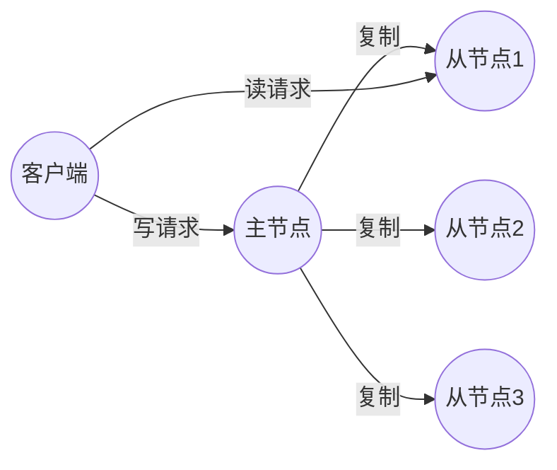

# 第六章 复制

> 可能出错的事情与不可能出错的事情之间的主要区别在于，当一件不可能出错的事情出错时，通常结果会是无法接近或修复。
> — 道格拉斯·亚当斯，《基本无害》（1992）

复制是指将相同数据的副本保存在多台通过网络连接的机器上。如“第19页的分布式与单节点系统”所述，你可能有多个理由需要复制数据，包括：

- 使数据在地理上靠近用户（从而减少访问延迟）
- 允许系统在部分组件出现故障时继续工作（从而提高可用性和持久性）
- 扩展可服务读取查询的机器数量（从而提高读取吞吐量）

在本章中，我们假设你的数据集足够小，每台机器都可以保存整个数据集的副本。在第7章中，我们将放宽这一假设，讨论超出单台机器容量的数据集的[[分片]]（分区）问题。在后续章节中，我们将讨论复制数据系统中可能发生的各种故障类型以及如何处理它们。

如果你要复制的数据不随时间变化，复制就很简单：你只需将数据复制到每个节点一次，然后就可以完成。复制的所有困难在于处理复制数据的变化，而这正是本章的内容。我们将讨论三种用于在节点间复制变化的算法族：[[单主复制]]、[[多主复制]]和[[无主复制]]。几乎所有分布式数据库都使用这三种方法之一。每种方法都有优缺点，我们将详细探讨。

复制涉及许多权衡——例如，使用同步复制还是异步复制，以及如何处理失败的副本。这些通常是数据库中的可配置选项，尽管细节因数据库而异，但一般原则在许多实现中是相似的。我们将在本章中讨论此类选择的后果。

数据库复制是一个古老的话题。自1970年代研究以来，其原理变化不大[1]，因为网络的基本约束保持不变。尽管如此，像[[最终一致性]]这样的概念仍然引起困惑。在“第209页的复制滞后问题”中，我们将更精确地讨论最终一致性以及诸如[[读己之写]]和[[单调读]]保证之类的内容。

## 备份与复制

你可能想知道，如果有了复制，是否还需要备份。答案是肯定的，因为两者目的不同：副本快速将写入从一个节点传播到另一个节点，而备份存储数据的旧快照，以便你可以回溯时间。如果你意外删除了一些数据，复制无济于事，因为删除操作也会传播到副本；如果你想恢复已删除的数据，你需要备份。

实际上，复制和备份通常是互补的。备份有时是设置复制过程的一部分，正如我们在“第201页的设置新从节点”中所述。相反，存档复制日志可以是备份过程的一部分。

某些数据库在内部维护过去状态的不可变快照，作为某种内部备份。然而，这意味着将旧版本的数据保存在与当前状态相同的存储介质上。如果你有大量数据，将旧数据的备份存储在针对不常访问数据优化的对象存储中，而只在主存储中保存数据库的当前状态，可能会更便宜。

# 单主复制

存储数据库副本的每个节点称为一个[[副本]]。对于多个副本，不可避免地会出现一个问题：我们如何确保所有数据最终都出现在所有副本上？

数据库的每次写入都需要由每个副本处理；否则，副本将不再包含相同的数据。最常见的解决方案称为基于领导者的复制、主备份或主从复制。其工作方式如下（见图6-1）：

1. 其中一个副本被指定为[[领导者]]（也称为主节点或源节点[2]）。当客户端想要写入数据库时，它们必须将请求发送给领导者，领导者首先将新数据写入其本地存储。
2. 其他副本称为[[从节点]]（或只读副本、从属节点、热备份）。每当领导者将新数据写入其本地存储时，它也会将数据更改作为[[复制日志]]或更改流的一部分发送给所有从节点。每个从节点从领导者获取日志，并通过按与领导者处理写入相同的顺序应用所有写入来更新其本地数据库副本。
3. 当客户端想要从数据库读取时，它可以查询领导者或任何从节点。然而，写入仅由领导者接受（从客户端角度来看，从节点是只读的）。

**图6-1：单主复制将所有写入路由到指定的领导者，领导者将更改流发送给从副本。**

如果数据库被分片（参见第7章），每个分片有一个领导者。不同的分片可能具有位于不同节点上的领导者，但每个分片仍然必须有一个领导者节点。在“第215页的多主复制”中，我们将讨论另一种模型，其中系统可能同时对同一分片有多个领导者。

单主复制非常广泛地使用。它是许多关系数据库的内置功能，例如PostgreSQL、MySQL、Oracle Data Guard [3]和SQL Server的Always On可用性组[4]。它也被用于一些文档数据库（如MongoDB和DynamoDB [5]）、消息代理（如Kafka）、复制块设备（如DRBD）以及一些网络文件系统。许多共识算法——例如用于CockroachDB [6]、TiDB [7]、etcd和RabbitMQ仲裁队列（等等）复制的Raft——也基于单个领导者，并在旧领导者失效时自动选举新领导者（我们将在第10章更详细地讨论共识）。

> [!NOTE]
> 在较旧的文档中，你可能会看到术语“主从复制”。它含义与基于领导者的复制相同，但应避免使用，因为它被认为具有冒犯性[8]。

## 同步复制与异步复制

复制系统中一个重要的细节是复制是同步还是异步。（在关系数据库中，这通常是可配置选项；其他系统通常硬编码为其中一种。）

考虑图6-1中的情况：网站用户更新其个人资料图片。在某个时间点，客户端将更新请求发送给领导者；不久之后，领导者接收到请求。然后领导者将数据更改转发给从节点，并通知客户端更新成功。图6-2展示了时间的一种可能安排。

**图6-2：基于领导者的复制，一个同步从节点和一个异步从节点**

在此示例中，对从节点1的复制是同步的：领导者等待从节点1确认已收到写入，然后才向用户报告成功，并使该写入对其他客户端可见。对从节点2的复制是异步的（或非阻塞的）：领导者发送消息，但不等待从节点的响应。

图中显示从节点2处理消息前有显著延迟。通常，复制相当快；大多数数据库系统在不到一秒内将更改应用到从节点。然而，没有保证需要多长时间。在某些情况下，从节点可能落后领导者几分钟或更长时间——例如，如果从节点正从故障中恢复，或者系统接近最大容量。

# 第6章：复制

在某些情况下，追随者可能会落后领导者几分钟甚至更久——例如，当追随者从故障中恢复、系统接近最大容量运行，或节点之间存在网络问题时。

同步复制的优势在于，可以保证追随者拥有与领导者一致的最新数据副本。如果领导者突然发生故障，我们可以确信数据在追随者上仍然可用。其缺点在于，如果同步追随者无响应（由于崩溃、网络故障或其他原因），写入操作将无法处理。领导者必须阻塞所有写入，等待同步副本恢复可用为止。

因此，将所有追随者都设置为同步是不切实际的；任何一个节点故障都会导致整个系统停滞。在实践中，如果数据库提供同步复制，通常意味着其中一个追随者是同步的，而其他追随者是异步的。如果同步追随者不可用或变慢，则会将其中一个异步追随者提升为同步状态。这保证了至少有两个节点（领导者和一个同步追随者）拥有最新的数据副本。这种配置有时也称为半同步。

在某些系统中，大多数副本（例如，包括领导者在内的五分之三）是同步更新的，其余少数副本是异步的。这是法定人数的示例，我们将在第231页的“使用法定人数进行读写”中进一步讨论。多数法定人数通常用于最终一致性系统或使用共识协议进行自动领导者选举的系统。我们将在第10章中再次讨论这些系统。

有时，基于领导者的复制被配置为完全异步。在这种情况下，如果领导者发生故障且无法恢复，则尚未复制到追随者的任何写入都会丢失。这意味着即使写入已向客户端确认，也不能保证持久性。然而，完全异步配置的优势在于，即使所有追随者都已落后，领导者仍可以继续处理写入。

弱化持久性听起来可能是一个糟糕的权衡，但异步复制仍然被广泛使用，特别是在有许多追随者或它们在地理上分布的情况下[9]。我们将在第209页的“复制滞后问题”中再次讨论这个问题。

## 设置新追随者

有时，你需要设置新的追随者——可能是为了增加副本数量或替换故障节点。你如何确保新追随者拥有领导者数据的准确副本？

简单地将数据文件从一个节点复制到另一个节点通常是不够的。客户端不断向数据库写入数据，数据始终在变化，因此标准文件复制会在不同时间点看到数据库的不同部分。结果可能毫无意义。

你可以通过锁定数据库（使其无法写入）来使磁盘上的文件保持一致，但这与高可用性的目标相悖。幸运的是，设置追随者通常可以在不停机的情况下完成。从概念上讲，过程如下：

1.  在某个时间点获取领导者数据库的一致性快照——如果可能的话，无需锁定整个数据库。大多数数据库都具备此功能，因为备份也需要它。在某些情况下，需要第三方工具，例如用于MySQL的Percona XtraBackup。
2.  将快照复制到新的追随者节点。
3.  追随者连接到领导者，并请求自快照创建以来发生的所有数据更改。这要求快照与领导者复制日志中的确切位置相关联。该位置有各种名称——例如，PostgreSQL称之为日志序列号；MySQL有两种机制，binlog坐标和全局事务标识符（GTID）。
4.  当追随者处理完自快照以来的数据更改积压后，我们称其已赶上。现在它可以继续处理来自领导者的实时数据更改。

设置追随者的实际步骤因数据库而异。在某些系统中，该过程完全自动化，而在其他系统中，则可能是一个相当复杂的多步骤工作流，需要管理员手动执行。

你还可以将复制日志与整个数据库的周期性快照一起归档到对象存储中。这是实现数据库备份和灾难恢复的好方法，你可以通过从对象存储下载这些文件来执行设置新追随者的步骤1和2。例如，WAL-G为PostgreSQL、MySQL和SQL Server执行此操作，而Litestream则对SQLite执行等效操作。

### 由对象存储支持的数据库

对象存储可用于归档数据之外的其他用途。许多数据库开始使用Amazon S3、Google Cloud Storage和Azure Blob Storage等对象存储来为实时查询提供数据服务。将数据库数据存储在对象存储中有许多好处：

*   对象存储比其他云存储选项便宜。这使得云数据库能够将较少查询的数据存储在更便宜、更高延迟的存储上，同时从内存、SSD和NVMe提供工作集服务。
*   对象存储提供多可用区、双区域或多区域复制，具有非常高的持久性保证。这也使数据库能够绕过区域间网络费用。
*   数据库可以使用对象存储的条件写入功能——本质上是一个比较并设置（CAS）操作——来实现事务和领导者选举[10, 11]。
*   将来自多个数据库的数据存储在同一个对象存储中可以简化数据集成（参见第135页的“云数据仓库”），特别是在使用Parquet和Iceberg等开放格式时。

这些好处通过将事务、领导者选举和复制的责任转移到对象存储，极大地简化了数据库架构。

然而，采用对象存储进行复制的系统必须权衡利弊。值得注意的是，对象存储的读写延迟远高于本地磁盘或Amazon EBS等虚拟块设备。许多云提供商还按API调用收费，这迫使系统批量读写以降低成本。这种批处理进一步增加了延迟。对象通常是不可变的，这使得在大对象中进行随机写入成为一项极其消耗资源的操作。最后，许多对象存储不提供标准文件系统接口，这阻止了缺乏对象存储集成的系统利用对象存储。用户空间文件系统（FUSE）等接口允许操作员将对象存储桶挂载为文件系统，应用程序可以在不知道数据存储在对象存储上的情况下使用它。尽管如此，许多对象存储的FUSE接口缺乏系统可能依赖的POSIX特性，如非顺序写入或符号链接。

不同的系统以各种方式处理这些权衡。有些引入了分层存储架构，将不常访问的数据放在对象存储上，而将新的或频繁访问的数据保留在更快的存储设备（如SSD或NVMe）上，甚至放在内存中。其他系统将对象存储用作主存储层，但使用单独的低延迟存储系统（如Amazon EBS或Neon的Safekeepers[12]）来存储其WAL。最近，一些系统更进一步，采用了零磁盘架构（ZDA）。基于ZDA的系统将所有数据持久化到对象存储，而磁盘和内存仅用于缓存。这使得节点没有持久状态，从而极大地简化了操作。WarpStream、Confluent Freight、Buf的Bufstream和Redpanda Serverless都是使用零磁盘架构构建的Kafka兼容系统。几乎所有现代云数据仓库也都采用这种架构，Turbopuffer（向量搜索引擎）和SlateDB（云原生LSM存储引擎）也是如此。

## 处理节点中断

系统中的任何节点都可能发生故障，可能由于意外故障，也可能由于计划维护（例如，重启机器以安装内核安全补丁）。能够在不中断服务的情况下重启单个节点，对于运维而言是一个巨大的优势。因此，我们的目标是保持整个系统在个别节点故障的情况下继续运行，并将节点故障的影响降至最低。

如何通过基于领导者的复制实现高可用性？

### 追随者故障：追赶式恢复

每个追随者在本地磁盘上维护一个日志，记录从领导者接收到的数据更改。如果追随者崩溃后重新启动，或者领导者和追随者之间的网络暂时中断，追随者可以相当容易地恢复：从其日志中，它知道故障发生前处理的最后一个事务。因此，追随者可以连接到领导者，并请求在追随者断开连接期间发生的所有数据更改。当它应用完这些更改后，它就赶上了领导者，并可以像以前一样继续接收数据更改流。

尽管追随者恢复在概念上很简单，但在性能方面可能具有挑战性。如果数据库具有高写入吞吐量，或者追随者长时间离线，则可能需要追赶大量写入操作。在追赶过程中，恢复中的追随者和领导者（需要向追随者发送积压的写入）都会面临高负载。

在所有追随者确认已处理后，领导者可以删除其写入日志，但如果追随者长时间不可用，领导者将面临一个选择：保留日志直到追随者恢复并赶上（冒着领导者磁盘空间耗尽的风险），或者删除不可用追随者尚未确认的日志（在这种情况下，追随者将无法从日志中恢复，必须在重新上线时从备份中恢复）。

### 领导者故障：故障切换

处理领导者故障更为棘手。需要将其中一个追随者提升为新的领导者，需要重新配置客户端以将写入发送到新的领导者，其他追随者需要开始从新的领导者消费数据更改。这个过程称为故障切换。

故障切换可以手动执行（管理员被告知领导者发生故障，并采取必要步骤选举新领导者），也可以自动执行。自动故障切换过程通常包括以下步骤：

# 第6章 复制

## 单主节点复制

1. **判定主节点已失效**。许多事情可能出错：崩溃、断电、网络问题等。没有绝对可靠的方法检测发生了什么，因此大多数系统仅使用超时；节点之间频繁地互相发送心跳消息，如果某个节点在一段时间内（例如30秒）没有响应，则假定它已死亡。（如果主节点是为了计划维护而故意下线，则不适用此情况，因为主节点可以在关闭前触发安全交接。）

2. **选择新主节点**。这可以通过选举过程来完成（即由剩余副本中的多数节点选出新主节点），或者由先前指定的控制节点来任命新主节点[13]。最适合成为主节点的候选者通常是拥有来自旧主节点最新数据变更的副本（以最小化数据丢失）。让所有节点就新主节点达成一致是一个共识问题，将在第10章详细讨论。

3. **重新配置系统以使用新主节点**。客户端现在需要将写请求发送到新主节点（我们在第265页的“请求路由”中讨论这一点）。如果旧主节点重新上线，它可能仍然认为自己是主节点，而不知道其他副本已强制其下台。系统需要确保旧主节点成为从节点并承认新主节点。

故障切换充满了可能出错的情况：

- 如果使用异步复制，新主节点可能尚未收到旧主节点在失效前产生的所有写入。如果在前主节点被选为新主节点后，旧主节点重新加入集群，应该如何处理这些写入？新主节点在此期间可能已收到冲突的写入。最常见的解决方案是直接丢弃旧主节点未复制的写入，这意味着你认为已提交的写入实际上并未持久化。

- 丢弃写入尤其危险，如果数据库之外的其他存储系统需要与数据库内容协调。例如，在GitHub的一次事故中[14]，一个落后的MySQL从节点被提升为主节点。数据库使用自增计数器为新行分配主键，但由于新主节点的计数器落后于旧主节点，它重用了旧主节点先前已分配的一些主键。这些主键也用于Redis存储，因此主键重用导致MySQL和Redis之间的不一致，从而使一些私有数据泄露给了错误的用户。

- 在某些故障场景下（见第9章），两个节点可能都认为自己就是主节点。这种情况称为**脑裂**，非常危险；如果两个主节点都接受写入，并且没有冲突解决过程（见第215页的“多主节点复制”），数据很可能丢失或损坏。作为安全措施，一些系统在检测到两个主节点时会有关闭其中一个节点的机制。然而，如果该机制设计不当，可能导致两个节点都被关闭[15]。此外，存在这样的风险：当脑裂被检测到并且旧节点被关闭时，可能已经为时已晚，数据已经损坏。

- 决定在宣告主节点死亡之前的正确超时时间可能很棘手。较长的超时意味着在主节点失效时需要更长的恢复时间。然而，如果超时太短，可能发生不必要的故障切换。例如，临时负载峰值可能导致节点响应时间超过超时，或者网络故障可能导致数据包延迟。如果系统已经在高负载或网络问题下挣扎，不必要的故障切换可能会使情况更糟，而不是更好。

通过限制或关闭旧主节点来防止脑裂被称为**围栏**；我们在第373页的“分布式锁与租约”中更详细地讨论它。然而，这些问题没有简单的解决方案。因此，一些运维团队更喜欢手动执行故障切换，即使软件支持自动故障切换。

故障切换中最重要的是选择一个最新的从节点作为新主节点。如果使用同步或半同步复制，这将是旧主节点在确认写入之前等待的那个从节点。对于异步复制，你可以选择具有最高日志序列号的从节点。这可以最小化故障切换期间丢失的数据量；丢失不到一秒的写入可能是可以容忍的，但选择一个落后好几天的从节点可能是灾难性的。

这些问题——节点故障、不可靠的网络，以及围绕副本一致性、持久性、可用性和延迟的权衡——实际上是分布式系统的基本问题。我们将在第9章和第10章更深入地讨论它们。

## 复制日志的实现

基于主节点的复制在底层是如何工作的？实践中使用了几种复制方法。让我们逐一简要介绍。

### 基于语句的复制

在最简单的情况下，主节点记录它执行的每个写请求（语句），并将该语句日志发送给它的从节点。对于关系数据库，这意味着每个`INSERT`、`UPDATE`或`DELETE`语句都会被转发给从节点，每个从节点解析并执行该SQL语句，就像它是由客户端收到的一样。

尽管这种复制方法听起来合理，但它可能在多种情况下失效：

- 任何调用非确定性函数的语句，例如`NOW()`获取当前日期和时间或`RAND()`获取随机数，很可能在每个副本上生成不同的值。
- 如果语句使用自增列，或者依赖于数据库中的现有数据（例如`UPDATE ... WHERE <some condition>`），它们必须在每个副本上以完全相同的顺序执行，否则可能产生不同的效果。当有多个并发执行的事务时，这可能成为限制。
- 具有副作用的语句（例如触发器、存储过程、用户定义函数）可能导致每个副本上发生不同的副作用，除非副作用是绝对确定性的。

可以解决这些问题——例如，主节点可以在记录语句时将任何非确定性函数调用替换为固定返回值，以便所有从节点获得相同的值。以固定顺序执行确定性语句的想法类似于我们在第101页“事件溯源与CQRS”中讨论的事件溯源模型。这种方法也称为**状态机复制**，我们将在第433页“使用共享日志”中讨论其理论。

基于语句的复制在MySQL 5.1版本之前使用。现在有时仍在使用，因为它非常紧凑，但默认情况下，如果语句中存在任何非确定性，MySQL现在会切换到基于行的复制（稍后讨论）。VoltDB使用基于语句的复制，并通过要求事务具有确定性来确保其安全[16]。然而，在实践中保证确定性可能很难，因此许多数据库更喜欢其他复制方法。

### 预写式日志传输

在第4章中，我们看到预写式日志（WAL）对于B树存储引擎的鲁棒性是必要的；每次修改首先写入WAL，以便在崩溃后可以将树恢复到一致状态。由于WAL包含恢复索引和堆到一致状态所需的所有信息，我们可以使用完全相同的日志在另一个节点上构建副本；除了将日志写入磁盘外，主节点还通过网络将其发送给从节点。当从节点处理此日志时，它会构建与主节点上完全相同的文件副本。

这种复制方法用于PostgreSQL和Oracle等数据库[17,18]。主要缺点是日志在非常低的级别描述数据——WAL包含哪些字节在哪些磁盘块中被更改的详细信息。这使得复制与存储引擎紧密耦合。如果数据库从一个版本到另一个版本更改了存储格式，通常不可能在主节点和从节点上运行不同版本的数据库软件。

这看起来像是一个实现细节，但它可能会产生重大的运维影响。如果复制协议允许从节点使用比主节点更新的软件版本，你可以先升级从节点，然后执行故障切换使其中一个升级后的节点成为新主节点，从而实现数据库软件的零停机升级。如果复制协议不允许这种版本不匹配，就像WAL传输通常的情况那样，这种升级需要停机。

### 逻辑（基于行）日志复制

另一种方法是为复制和存储引擎使用不同的日志格式，这允许复制日志与存储引擎内部解耦。这种复制日志称为**逻辑日志**，以区别于存储引擎的（物理）数据表示。

关系数据库的逻辑日志通常是一系列记录，以行粒度描述对数据库表的写入：

- 对于插入的行，日志包含所有列的新值。
- 对于删除的行，日志包含足以唯一标识被删除行的信息。通常这会是主键，但如果表上没有主键，则需要记录所有列的旧值。
- 对于更新的行，日志包含足以唯一标识被更新行的信息，以及所有列的新值（或者至少是所有值已更改的列）。

一个修改多行的事务会生成多个这样的日志记录，后面跟着一条指示事务已提交的记录。当配置为使用基于行的复制时，MySQL除了WAL之外，还保留一个单独的逻辑复制日志，称为**binlog**。PostgreSQL通过将物理WAL解码为行插入/更新/删除事件来实现逻辑复制[19]。

由于逻辑日志与存储引擎内部解耦，它可以更容易地保持向后兼容，允许主节点和从节点运行不同版本的数据库软件。这反过来可以以最小停机时间升级到新版本[20]。

逻辑日志格式也更容易被外部应用程序解析。如果你希望将数据库内容发送到外部系统（例如用于离线分析的数据仓库，或用于构建自定义索引和缓存的专门系统），这一方面非常有用[21]。这种技术称为**变更数据捕获**，我们将在第12章中回到这个话题。

# 第6章：复制

## 复制滞后产生的问题

节点故障容错只是我们想要复制的一个原因。正如第19页“分布式系统与单节点系统”中提到的，其他原因还包括可扩展性（处理超过单机能力的请求）和延迟（将副本地理上放置在离用户更近的位置）。

基于领导者的复制要求所有写入都经过单个节点，但只读查询可以发送到任何副本。对于主要由读取组成且只有少量写入的工作负载（在线服务通常如此），有一个有吸引力的选项：创建多个追随者，并将读取请求分布到这些追随者上。这样消除了领导者的负载，并允许由附近的副本处理读取请求。

在这种读扩展架构中，你可以简单地通过添加更多追随者来增加处理只读请求的能力。然而，这种方法实际上只适用于异步复制。如果你尝试同步复制到所有追随者，那么单个节点故障或网络中断将使整个系统无法写入。而且节点越多，其中一个宕机的可能性就越大，因此完全同步的配置将非常不可靠。

不幸的是，从异步追随者读取的应用程序可能会看到过时的信息，如果追随者落后了。这会导致数据库中明显的[不一致性]；如果你同时在领导者和追随者上运行相同的查询，可能会得到不同的结果，因为并非所有写入都已在追随者中反映出来。这种不一致性是暂时的状态——如果你停止向数据库写入并等待一段时间，追随者最终会赶上并与领导者保持一致。因此，这种效果被称为[[最终一致性]] [22]。

> **术语“最终一致性”** 由Douglas Terry等人 [23] 提出，并由Werner Vogels [24] 推广，成为许多NoSQL项目的口号。然而，并非只有NoSQL数据库是最终一致的；异步复制的关系型数据库中的追随者也具有相同的特性。

“最终”一词故意模糊；一般来说，副本落后程度没有限制。在正常操作中，从领导者写入到追随者反映写入之间的延迟（复制滞后）可能只有几分之一秒，在实践中不易察觉。然而，如果系统接近容量运行，或者网络出现问题，滞后很容易增加到几秒甚至几分钟。

当滞后如此之大时，它引入的不一致性不仅是理论问题，而且对应用程序来说是实际问题。在本节中，我们将重点介绍三个由复制滞后可能导致的问题实例，并概述一些解决方法。

### 读自己写入

许多应用程序允许用户提交一些数据，然后查看他们提交的内容。这可能是客户数据库中的记录，讨论线程中的评论，或其他类似的内容。当新数据提交时，必须发送到领导者，但用户查看数据时，可以从追随者读取。这在数据频繁查看但偶尔写入的情况下特别合适。

使用异步复制时，会出现一个问题，如图6-3所示：如果用户在写入后不久查看数据，新数据可能尚未到达副本。对用户来说，看起来他们提交的数据丢失了，因此他们会很不高兴。

**图6-3. 用户进行写入后从陈旧副本读取时可能出现的不一致性。**

在这种情况下，我们需要**读后写一致性**，也称为**读自己所写一致性** [23]。这是一种保证：如果用户重新加载页面，他们总是会看到自己提交的任何更新。它不对其他用户做任何承诺；其他用户的更新可能要到稍后才能看到。然而，它让用户确信自己的输入已正确保存。

如何在基于领导者的复制系统中实现读后写一致性？有各种可能的技术。列举几个：

*   **当读取的内容可能已被用户修改时，从领导者或同步更新的追随者读取；否则，从异步更新的追随者读取**。这要求你有某种方法知道某些内容是否可能已被修改，而不需要实际查询它。例如，社交网络上的用户个人资料通常只能由个人资料所有者编辑，而不能由其他人编辑。因此，一个简单的规则是：总是从领导者读取用户自己的个人资料，而从追随者读取其他用户的资料。
*   **如果应用程序中的大多数内容都可能被用户编辑，那么这种方法就不太有效，因为大多数内容都必须从领导者读取（抵消了读扩展的好处）**。在这种情况下，可以使用其他标准来决定是否从领导者读取。例如，你可以跟踪上次更新的时间，并在上次更新后的一分钟内，所有读取都从领导者进行 [25]。你也可以监控追随者的复制滞后，并阻止任何滞后超过一分钟的追随者处理查询。
*   **客户端可以记住其最近一次写入的时间戳，系统可以确保为该用户提供服务的副本反映了至少到该时间戳的更新**。如果副本不够新，要么可以由另一个副本处理该读取，要么查询可以等待副本赶上 [26]。时间戳可以是逻辑时间戳（指示写入顺序的东西，如日志序列号）或实际的系统时钟（此时时钟同步变得至关重要；见第358页“不可靠的时钟”）。
*   **如果你的副本分布在不同区域（为了实现与用户的地理接近性、可用性或持久性），则会有额外的复杂性**。任何需要由领导者服务的请求都必须路由到包含领导者的区域。

当同一用户从多个设备访问服务时，还会出现另一个复杂情况，例如桌面网络浏览器和移动应用。在这种情况下，你可能希望提供**跨设备读后写一致性**：如果用户在一个设备上输入某些信息，然后在另一个设备上查看，他们应该看到刚刚输入的信息。

这里需要考虑一些额外的问题：

*   需要记住用户上次更新时间戳的方法变得更加困难，因为在一个设备上运行的代码不知道另一个设备上发生了什么更新。这些元数据需要集中化。
*   如果你的副本分布在多个区域，则无法保证来自不同设备的连接会路由到同一区域。（例如，如果用户的台式计算机使用家庭宽带连接，而移动设备使用蜂窝数据网络，则设备的网络路由可能完全不同。）如果你的方法要求从领导者读取，则可能需要首先将用户所有设备的请求路由到同一区域。

> **区域与可用区**
>
> 我们使用术语**区域**指代单个地理位置中的一个或多个数据中心。云提供商在同一个地理区域内放置多个数据中心。每个数据中心被称为一个**可用区**或简称为**区**。因此，一个云区域由多个区组成。每个区都是一个单独的数据中心，位于独立的物理设施中，拥有自己的供电、冷却等设施。
>
> 同一区域内的区通过非常高速的网络连接相连。延迟足够低，以至于大多数分布式系统可以将节点分布在同一区域的多个区中运行，就好像它们在一个区中一样。多区配置允许分布式系统在某个区离线时经受住区域中断，但它们不能防范区域级故障，即某个区域的所有区都不可用。为了经受住区域级故障，分布式系统必须跨多个区域部署，这可能导致更高的延迟、更低的吞吐量以及增加的云网络费用。我们将在第218页的“多领导者复制拓扑”中更详细地讨论这些权衡。目前只需知道，当我们说**区域**时，我们指的是单个地理位置中一组区/数据中心。

### 单调读

从异步追随者读取时可能出现的第二个异常例子是，用户可能看到事物在时间上**向后移动**。

如果用户从不同的副本进行多次读取，就可能发生这种情况。例如，图6-4显示了用户2345对同一查询进行了两次操作，首先发送给一个滞后较小的追随者，然后发送给一个滞后较大的追随者。（如果用户刷新网页且每个请求路由到随机服务器，这种场景非常可能。）第一次查询返回了用户1234最近添加的评论，但第二次查询没有返回任何内容，因为滞后的追随者尚未接收到该写入。实际上，第二次查询观察到的系统状态比第一次查询更早。如果第一次查询没有返回任何内容，情况还不算太糟糕，因为用户2345可能不知道用户1234最近添加了评论。但如果用户2345先看到用户1234的评论出现，然后又看到它消失，那将非常令人困惑。

**单调读** [22] 提供了一种保证，即不会发生这种异常。它比强一致性弱，但比最终一致性更强。当你读取数据时，你可能看到旧值；单调读取意味着，如果一个用户连续进行多次读取，他们不会看到时间倒流（即，他们不会在之前读取了较新数据之后，又读取到更旧的数据）。

实现单调读的一种方法是确保每个用户始终从**同一个副本**进行读取（不同用户可以从不同副本读取）。

# 第6章：复制

例如，可以根据用户 ID 的哈希值来选择副本，而不是随机选择。但是，如果该副本发生故障，用户的查询将需要重新路由到另一个副本。

图 6-4. 当用户先从一个新副本读取，然后从一个陈旧副本读取时，时间似乎倒退了。

图 6-4. 当用户先从一个新副本读取，然后从一个陈旧副本读取时，时间似乎倒退了。

## 一致前缀读（Consistent Prefix Reads）

复制滞后异常的第三个示例涉及违反因果关系。想象一下普恩斯先生和凯克夫人之间的以下简短对话：

普恩斯先生：凯克夫人，你能看到多远的未来？
凯克夫人：通常大约10秒，普恩斯先生。

这两个句子之间存在因果依赖关系：凯克夫人听到了普恩斯先生的问题并回答了它。

现在，想象有第三个人通过从追随者读取来收听这段对话。凯克夫人说的话通过追随者传播时延迟很小，但普恩斯先生说的话复制延迟较长（见图 6-5）。这个观察者会听到以下内容：

凯克夫人：通常大约10秒，普恩斯先生。
普恩斯先生：凯克夫人，你能看到多远的未来？

对于观察者来说，听起来凯克夫人似乎是在普恩斯先生提问之前就回答了问题。这种心灵感应的能力令人印象深刻，但也非常令人困惑 [27]。

图 6-5. 如果某些分片的复制速度比其他分片慢，观察者可能会在看到问题之前看到答案。

防止这种异常需要另一种保证：一致前缀读（consistent prefix reads）[22]。这种保证指出，如果写入以特定顺序发生，那么任何读取这些写入的人都会看到它们以相同的顺序出现。

这在分片（分区）数据库中尤其是个问题，我们将在第 7 章中讨论。如果数据库始终以相同顺序应用写入，则读取总是看到一致的前缀，因此这种异常不会发生。然而，在许多分布式数据库中，不同分片独立运行，因此没有全局写入顺序。当用户从数据库读取时，他们可能看到数据库的某些部分处于较旧状态，而其他部分处于较新状态。

一种解决方案是确保任何因果相关的写入都写入同一个分片——但在某些应用程序中，这无法高效实现。一些算法会显式跟踪因果依赖关系，我们将在第 238 页的“happens-before 关系和并发”中回到这个主题。

## 复制滞后的解决方案

在使用最终一致性系统时，值得思考如果复制延迟增加到几分钟甚至几小时，应用程序的行为会如何。如果答案是“没问题”，那很好。但是，如果结果是给用户带来糟糕的体验，那么设计系统以提供更强的保证（例如读后写一致性）就很重要。假装复制是同步的而实际上是异步的，会为后续问题埋下隐患。

如前所述，应用程序可以通过某些方式提供比底层数据库更强的保证——例如，在主库或同步更新的从库上执行某些类型的读取。然而，在应用程序代码中处理这些问题很复杂，且容易出错。

对于应用程序开发者来说，最简单的编程模型是选择一个为副本提供强一致性保证（如线性一致性，见第 10 章）并支持 ACID 事务（见第 8 章）的数据库。这允许你基本忽略复制带来的挑战，将数据库视为只有单个节点。在 2010 年代初期，NoSQL 运动宣扬这些特性限制了可扩展性，大规模系统必须拥抱最终一致性。

然而，自那时以来，许多数据库开始提供强一致性和事务支持，同时具有分布式数据库的容错、高可用性和可扩展性优势。正如第 67 页“关系模型与文档模型”中提到的，这一趋势被称为 NewSQL，以与 NoSQL 形成对比（尽管它更多地是关于可扩展事务管理的新方法，而非特指 SQL）。

尽管可扩展的强一致性分布式数据库现在已可用，但仍有一些很好的理由让应用程序选择使用提供较弱一致性保证的不同形式的复制。值得注意的是，它们可以在网络中断时提供更强的恢复能力，并且相比事务系统开销更低。我们将在本章其余部分探讨这些方法。

# 多主复制（Multi-Leader Replication）

到目前为止，本章只考虑了使用单一主库的复制架构。尽管这是一种常见方法，但也有有趣的替代方案。

单主复制有一个主要缺点：所有写入都必须经过一个主库。如果你因任何原因无法连接到主库——例如，由于你和主库之间的网络中断——你就无法向数据库写入。

单主复制模型的一个自然扩展是允许多个节点接受写入。复制仍然以相同的方式发生：每个处理写入的节点必须将该数据更改转发给所有其他节点。我们称之为多主配置（也称为主动/主动或双向复制）。在这种设置中，每个主库同时作为其他主库的从库。

与单主复制一样，可以选择同步或异步复制。假设你有两个主库 A 和 B，并且你试图向 A 写入。如果写入从 A 同步复制到 B，并且两个节点之间的网络中断，那么直到连接恢复之前你都无法写入 A。因此，同步多主复制提供了一种非常类似于单主复制的模型，例如，你可以将 B 设为主库，而 A 只将任何写入请求转发给 B 执行。

出于这个原因，我们不再深入探讨同步多主复制，而将其视为等同于单主复制。本节其余部分专注于异步多主复制，在这种复制中，任何主库都可以处理写入，即使它与其它主库的连接中断。

## 地理分布操作（Geographically Distributed Operation）

在同一区域中使用多主配置很少有意义，因为其收益很少超过增加的复杂性。然而，在某些情况下这种配置是合理的。

想象一下，你有一个数据库，副本分布在多个区域（也许是为了容忍整个区域的故障，或者为了靠近你的用户）。这被称为地理分布、地理分布式或地理复制设置。在单主复制中，主库必须位于其中一个区域，所有写入都必须经过该区域。

图 6-6. 跨多个区域的多主复制

在多主配置中，你可以在每个区域有一个主库。图 6-6 展示了这种架构可能的样子。在每个区域内部，使用常规的主-从复制（从库可能位于与主库不同的可用区）；在区域之间，每个区域的主库将其变更复制到其他区域的主库……

# 第6章：复制

## 多主复制

### 多主复制对比单主复制

图6-6展示了多区域部署中多主复制架构的示例。在每个区域内，使用常规的主从复制（从节点可能位于与主节点不同的可用区）；在区域之间，每个区域的主节点将其变更复制到其他区域的主节点。让我们比较一下单主和多主配置在多区域部署中的表现：

- **性能**  
  在单主配置中，每次写入都必须通过互联网传输到主节点所在的区域。这会显著增加写入延迟，并可能使拥有多个区域的目的失效。在多主配置中，每次写入可以在本地区域处理，然后异步复制到其他区域。因此，跨区域网络延迟对用户隐蔽，感知性能可能更好。

- **区域中断容忍**  
  在单主配置中，如果主节点所在区域不可用，故障切换可以将另一个区域的从节点提升为主节点。在多主配置中，每个区域可以独立于其他区域继续运行，当离线区域重新上线时，复制会补上缺失的数据。

- **网络问题容忍**  
  即使使用专用连接，区域间的流量也可能比同一区域内或同一可用区内的流量更不可靠。单主配置对此类跨区域链路的问题非常敏感，因为当一个区域的客户端要向另一个区域的主节点写入时，它必须通过该链路发送请求并等待响应才能完成。采用异步复制的多主配置能更好地容忍网络问题；在网络临时中断期间，每个区域的主节点可以独立继续处理写入。

- **一致性**  
  单主系统可以提供强一致性保证，例如可序列化事务（我们将在第8章讨论）。多主系统最大的缺点是它们能够实现的一致性要弱得多。例如，无法保证银行账户不会透支或用户名唯一；不同主节点可能各自处理在单个节点上合法的写入（例如从账户中支取一些钱、注册特定用户名），但合并时与其他主节点上的写入一起违反约束。这本质上是分布式系统的基本限制[28]。如果需要强制此类约束，最好使用单主系统。然而，正如我们在第222页“处理写入冲突”中看到的，多主系统仍然可以为许多不需要此类约束的应用程序实现有用的一致性属性。

多主复制不如单主复制常见，但许多数据库仍支持它，包括MySQL、Oracle、SQL Server和YugabyteDB。在某些情况下，它是一个外部附加功能——例如Redis Enterprise、EDB Postgres Distributed和pglogical[29]。

> [!WARNING]  
> 由于多主复制在许多数据库中是后加的功能，通常存在细微的配置陷阱和与其他数据库功能的意外交互。例如，自增键、触发器和完整性约束可能引发问题。因此，多主复制通常被视为危险领域，应尽可能避免[30]。

### 多主复制拓扑

复制拓扑描述了写入从一个节点传播到另一个节点的通信路径。如果有两个主节点（如图6-6所示），只有一种拓扑是可行的：主节点1必须将所有写入发送给主节点2，反之亦然。对于多于两个主节点的情况，各种拓扑都是可能的。图6-7展示了一些示例。

**图6-7. 多主复制的三种示例拓扑**

最通用的拓扑是全互联（all-to-all），如图6-7(c)所示，其中每个主节点将其写入发送给所有其他主节点。但也使用更受限的拓扑。例如，环形拓扑（图6-7(a)）中，每个节点从一个节点接收写入，并将这些写入（加上自身的写入）转发给另一个节点。星形拓扑（图6-7(b)）也很流行；这里，一个指定的根节点将写入转发给所有其他节点。星形拓扑可以推广为树形。

> [!NOTE]  
> 星形网络拓扑与星型模式（见第77页“星型和雪花型：分析用模式”）无关，后者描述的是数据模型的结构。

在环形和星形拓扑中，一次写入可能需要经过多个节点才能到达所有副本。因此，节点需要转发从其他节点接收的数据变更。为了防止无限复制循环，每个节点被分配一个唯一标识符，并且在复制日志中，每个写入都标记有它经过的所有节点的标识符[31]。当一个节点接收到标记有自身标识符的数据变更时，它忽略该变更，因为节点知道它已经处理过了。

### 不同拓扑的问题

环形和星形拓扑的一个问题是，只要一个节点发生故障，就可能中断其他节点之间的复制消息流，导致它们无法通信，直到该节点修复。可以重新配置拓扑以绕过故障节点，但在大多数部署中，这种重新配置必须手动完成。更密集连接的拓扑（如全互联）的容错性更好，因为它允许消息沿不同路径传输，避免单点故障。

然而，全互联拓扑也有问题。特别地，某些网络链路可能比其他链路快（例如，由于网络拥塞），导致某些复制消息可能“超车”其他消息，如图6-8所示。

在图6-8中，客户端A向主节点1插入一行，客户端B向主节点3更新该行。然而，主节点2可能以不同的顺序接收写入。它可能先收到更新（从其角度看，是对数据库中尚不存在的行的更新），稍后才收到对应的插入（本应在更新之前）。

**图6-8. 多主复制中，写入可能以错误的顺序到达某些副本。**

这是一个因果性问题，类似于我们在第213页“一致前缀读”中看到的。更新依赖于之前的插入，因此我们需要确保所有节点先处理插入，再处理更新。简单地给每个写入附加时间戳是不够的，因为时钟无法充分同步以正确排序主节点2上的这些事件（见第9章）。

为了正确排序这些事件，可以使用一种称为版本向量的技术，我们将在第237页“检测并发写入”中讨论。然而，许多多主复制系统没有采用良好的排序技术，容易遭受图6-8所示的问题。如果使用多主复制，值得意识到这些问题，仔细阅读文档，并彻底测试数据库以确保它确实提供了你认为的保证。

### 同步引擎和本地优先软件

如果应用程序需要在断开互联网连接时继续工作，多主复制也适用。例如，考虑手机、笔记本电脑和其他设备上的日历应用。你需要能够随时查看会议（读请求）和输入新会议（写请求），无论设备当前是否有互联网连接。如果离线时做了任何更改，当设备下次联网时，这些更改需要与服务器和其他设备同步。

在这种情况下，每个设备都有一个本地数据库副本充当主节点（接受写请求），并且所有设备上日历副本之间存在异步多主复制过程（同步）。复制延迟可能长达数小时甚至数天，具体取决于何时有互联网连接。

从架构角度来看，这种设置与区域间的多主复制非常相似，只是将其推向了极端。每个设备是一个“区域”，它们之间的网络连接极不可靠。

#### 实时协作、离线优先和本地优先应用

许多现代Web应用提供实时协作功能，例如Google Docs和Sheets（文本文档和电子表格）、Figma（图形设计）以及Linear（项目管理）。这些应用之所以响应迅速，是因为用户输入立即反映在用户界面上，无需等待网络往返到服务器，并且一个用户的编辑以低延迟显示给协作者[32,33,34]。

这再次导致多主架构：每个打开共享文件的Web浏览器选项卡是一个副本，你对文件的任何更新都异步复制到其他已打开该文件的用户的设备上。

# 第6章：复制

同一个文件。即使应用程序不允许你在离线时继续编辑文件，多个用户可以在不等待服务器响应的情况下进行编辑这一事实已经使其成为多主架构。

离线编辑和实时协作都需要类似的复制基础设施。应用程序需要捕获用户对文件所做的任何更改，并立即将这些更改发送给协作者（如果在线），或者存储在本地以便稍后发送（如果离线）。此外，应用程序需要接收来自协作者的更改，将这些更改合并到用户的本地文件副本中，并更新用户界面以反映最新版本。如果多个用户同时更改了文件，则可能需要冲突解决逻辑来合并这些更改。

支持此过程的软件库称为**同步引擎**。尽管这个想法已经存在很长时间，但最近该术语才受到关注[35, 36, 37]。允许用户在离线时继续编辑文件（可能通过同步引擎实现）的应用程序称为**离线优先**[38]。术语**本地优先软件**指的是协作应用程序，它们不仅离线优先，而且设计为即使开发者关闭了所有在线服务也能继续工作[39]。这可以通过使用具有开放标准同步协议的同步引擎来实现，该协议有多个服务提供商可用[40]。例如，Git 是一个本地优先协作系统（尽管不支持实时协作），因为你可以通过 GitHub、GitLab 或任何其他仓库托管服务进行同步。

### 同步引擎的优缺点

如今构建 Web 应用的主要方式是在客户端保留非常少的持久状态，并在需要显示新数据或更新某些数据时依赖向服务器发出请求。相比之下，使用同步引擎时，你在客户端拥有持久状态，与服务器的通信被移到后台进程中。同步引擎方法有许多优点：

- 数据在本地意味着用户界面可以比必须等待服务调用来获取数据时快得多。一些应用旨在在图形系统的下一帧响应用户输入，这意味着在刷新率为 60 Hz 的显示器上，需要在 16 ms 内完成渲染。
- 允许用户在离线时继续工作非常有价值，尤其是在具有间歇性连接的移动设备上。借助同步引擎，应用不需要单独的离线模式：离线的效果等同于网络延迟非常大。
- 与在应用代码中执行显式服务调用相比，同步引擎简化了前端应用的编程模型。每个服务调用都需要错误处理，如第 183 页的“远程过程调用的问题”所述；例如，如果更新服务器上数据的请求失败，用户界面需要以某种方式反映该错误。同步引擎允许应用对本地数据执行读写操作；这些操作几乎从不失败，从而带来更具声明性的编程风格[41]。
- 要在实时中显示来自其他用户的编辑，你需要接收这些编辑的通知并高效更新 UI。同步引擎与响应式编程模型相结合是实现这一点的好方法[42]。

同步引擎在用户可能需要的数据全部预先下载并持久存储在客户端时效果最佳。这意味着数据在需要时可用于离线访问，但这也意味着对于用户能够访问非常大量数据的情况，同步引擎不适合。例如，下载用户创建的所有文件可能没问题（单个用户通常不会产生那么多数据），但下载整个电子商务网站的目录可能没有意义。

同步引擎由 Lotus Notes 在 1980 年代率先推出[43]（没有使用该术语），特定应用（如日历）的同步也已经存在很长时间。今天，我们有许多通用的同步引擎。有些使用专有后端服务（例如 Google Firestore、Realm 或 Ditto），另一些则拥有开源后端，适合创建本地优先软件（例如 PouchDB/CouchDB、Automerge 和 Yjs）。

多人视频游戏也有类似的需求：立即响应用户的本地操作，并与通过网络异步接收的其他玩家的操作进行协调。在游戏开发术语中，同步引擎的等效物称为**网络代码**（netcode）。网络代码中使用的技术非常特定于游戏的需求[44]，并且不能直接迁移到其他类型的软件，因此本书不再进一步讨论。

## 处理冲突写入

多主复制的最大问题——无论是在地理分布的服务器端数据库中，还是在终端设备上的本地优先同步引擎中——是不同主节点上的并发写入可能导致需要解决的冲突。

例如，考虑一个维基页面被两个用户同时编辑，如图 6-9 所示。用户 1 将页面标题从 A 改为 B，用户 2 独立地将标题从 A 改为 C。每个用户的更改都成功应用到了他们的本地主节点。然而，当更改被异步复制时，检测到了冲突。这个问题在单主数据库中不会发生。

**图 6-9. 两个主节点并发更新同一条记录导致的写入冲突**

> [!NOTE]  
> 我们说图 6-9 中的两次写入是**并发的**，因为在最初进行写入时，两个操作彼此“不感知”。这并不取决于写入是否实际上在同一时间发生；实际上，如果写入是在离线时进行的，它们可能相隔了一段时间。重要的是，一次写入是否发生在另一次写入已经生效的状态下。

在第 237 页的“检测并发写入”中，我们将探讨数据库如何确定两次写入是否并发。现在我们假设我们可以检测到冲突，并希望找出解决冲突的最佳方法。

### 冲突避免

处理冲突的一种策略是首先防止它们发生。例如，如果应用程序可以确保特定记录的所有写入都通过同一个主节点，那么即使数据库整体上是多主的，也不会发生冲突。这种方法对于正在离线更新的同步引擎客户端不可行，但在地理复制的服务器系统中有时是可行的[30]。

例如，在用户只能编辑自己数据的应用程序中，你可以确保来自特定用户的请求始终路由到同一个区域，并使用该区域的主节点进行读写。不同用户可能有不同的“归属”区域（或许根据用户的地理距离选择），但就任何单个用户而言，配置本质上是单主的。

然而，有时你可能想要更改记录指定的主节点——可能是因为某个区域不可用，你需要将流量重新路由到另一个区域，或者因为用户已移动到不同位置，现在更靠近另一个区域。此时存在风险：用户在更改指定主节点的过程中执行写入，导致冲突，必须使用以下方法之一解决。因此，如果允许更改主节点，冲突避免就会失效。

冲突避免的另一个例子：假设你想插入新记录，并基于自动递增计数器为它们生成唯一 ID。如果你有两个主节点，可以设置它们，使得一个主节点只生成奇数，另一个只生成偶数。这样，你可以确保两个主节点不会同时为不同记录分配相同的 ID。我们将在第 417 页的“ID 生成器和逻辑时钟”中讨论其他 ID 分配方案。

### 最后写入者获胜（丢弃并发写入）

如果无法避免冲突，最简单的解决方法是对每次写入附加一个时间戳，并始终使用最新（最大）时间戳的值。例如，在图 6-9 中，假设用户 1 写入的时间戳大于用户 2 写入的时间戳。在这种情况下，两个主节点都会确定页面的新标题应为 B，并丢弃将其设置为 C 的写入。如果写入巧合地具有相同的时间戳，则可以通过比较值来决定胜者（例如，对于字符串，取字母顺序中靠前的那个）。

这种方法称为**最后写入者获胜（LWW）**，因为具有最大时间戳的写入可以被认为是“最后的”写入。不过，这个术语具有误导性，因为当两次写入并发时（如图 6-9 所示），哪一次是最近的未定义，因此并发写入的时间戳顺序本质上是随机的。

因此，LWW 的真正含义是：当同一条记录在不同主节点上被并发写入时，随机选择其中一个写入作为胜者，其他写入被静默丢弃，尽管它们已被各自的主节点成功处理。这实现了最终所有副本达到一致状态的目标，但代价是数据丢失。

如果你可以避免冲突——例如，仅插入具有唯一键的记录且从不更新它们——那么 LWW 没有问题。但是，如果你更新现有记录，或者不同主节点可能插入具有相同键的记录，那么你必须确定丢失的更新对应用程序是否构成问题。如果丢失更新不可接受，你需要使用接下来描述的冲突解决方法之一。

LWW 的另一个问题是，如果使用实时时钟（例如 Unix 时间戳）作为写入的时间戳，系统会对时钟同步变得非常敏感。如果一个节点的时钟快于其他节点，并且你试图覆盖该节点写入的值，你的写入可能会被忽略，因为它可能具有一个

# 第6章：复制

较低的时间戳，即使它明显发生在更晚的时间。此问题可以通过使用逻辑时钟来解决，我们将在“ID生成器与逻辑时钟”（第417页）中讨论。

## 手动冲突解决

如果随机丢弃某些写入不可取，下一个选项是手动解决冲突。你可能从Git和其他版本控制系统中熟悉手动冲突解决：如果两个分支上的提交编辑了同一文件的同一行，并且你尝试合并这些分支，就会产生合并冲突，需要在合并完成前解决。

在数据库中，让冲突阻止整个复制过程直到人工解决是不现实的。相反，数据库通常存储给定记录的所有并发写入值——例如，图6-9中的B和C。这些值有时被称为**兄弟值**。下次查询该记录时，数据库返回所有那些值，而不仅仅是最后一个。然后你可以以任何方式解决这些值，要么在应用代码中自动解决（例如，你可以将B和C拼接成B/C），要么询问用户。然后你向数据库写回一个新值来解决冲突。

这种冲突解决方法用于某些系统，如CouchDB。然而，它也存在以下问题：

- 数据库的API会发生变化——例如，以前维基页面的标题只是一个字符串，现在变成了一个字符串集合，通常包含一个元素，但有时可能包含多个元素（如果有冲突）。这可能使数据在应用代码中难以处理。

- 要求用户手动合并兄弟值工作量很大，无论是对于应用开发者（需要构建冲突解决的UI）还是用户（可能对要求他们做什么以及为什么感到困惑）。在许多情况下，自动合并比打扰用户更好。

- 如果不仔细处理，自动合并兄弟值可能导致令人惊讶的行为。例如，亚马逊的购物车曾经允许并发更新，然后通过保留所有兄弟值中出现的购物车商品来合并（即取购物车的集合并集）。这意味着如果客户在一个兄弟值中从购物车中移除了一个商品，但另一个兄弟值仍然包含那个旧商品，被移除的商品会意外地重新出现在客户购物车中[45]。在图6-10中，设备1从购物车中移除了“书”，同时设备2移除了“DVD”，但在合并兄弟值后，两个商品都重新出现了。

- 如果多个节点观察到冲突并同时解决它，冲突解决过程本身可能引入新的冲突。这些解决甚至可能不一致——例如，一个节点可能将B和C合并成B/C，而另一个节点可能合并成C/B，如果你没有注意一致地排序它们。当B/C和C/B之间的冲突被合并时，可能导致B/C/C/B或其他类似令人惊讶的结果。

> [!figure] 图6-10. 亚马逊购物车异常的例子：如果通过取集合的并集来合并冲突，被删除的商品可能会重新出现

## 自动冲突解决

对于许多应用来说，处理冲突的最佳方式是使用一种算法，自动将并发写入合并到一致状态。自动冲突解决确保所有副本收敛到相同状态——即，所有处理了相同写入集的副本具有相同状态，无论写入到达的顺序如何。将最终一致性与收敛保证相结合，被称为**强最终一致性**[46]。

LWW是冲突解决算法的一个简单示例。针对不同类型的数据，已经开发了更复杂的合并算法，其目标是尽可能保留所有更新的预期效果，从而避免数据丢失：

- 如果数据是文本（例如，维基页面的标题或正文），我们可以检测从一个版本到下一个版本插入了或删除了哪些字符。合并结果随后保留所有兄弟值中进行的插入和删除。如果用户同时在相同位置插入文本，可以确定性排序，以便所有节点得到相同的合并结果。

- 如果数据是项目集合（有序如待办列表，或无序如购物车），我们可以通过跟踪插入和删除来类似文本地合并它。为了避免图6-10中的购物车问题，算法跟踪“书”和“DVD”已被删除，因此合并结果为Cart = {Soap}。

- 如果数据是表示可递增或递减的计数器（例如，社交媒体帖子的点赞数），合并算法可以判断每个兄弟值上发生了多少递增和递减，并正确地将它们相加，使结果不会重复计数且不会丢失更新。

- 如果数据是键值映射，我们可以通过对该键下的值应用其他冲突解决算法来合并对同一键的更新。对不同键的更新可以相互独立处理。

冲突解决有其局限性。例如，如果你想强制列表不超过五个项目，并且多个用户同时向列表添加项目导致总数超过五个，你唯一的选择是丢弃一些项目。尽管如此，自动冲突解决足以构建许多有用的应用。如果你从想要构建协作离线优先或本地优先应用的需求出发，那么冲突解决是不可避免的，自动化它通常是最佳方法。

### 无冲突复制数据类型与操作转换

有两类算法常用于实现自动冲突解决：**无冲突复制数据类型（CRDT）**[46] 和 **操作转换（OT）**[47]。它们有不同的设计理念和性能特征，但两者都能对上述所有数据类型执行自动合并。

图6-11展示了OT和CRDT如何合并对文本的并发更新。假设你有两个副本，都从文本 `ice` 开始。一个副本前置字母 `n` 得到 `nice`，同时另一个副本追加感叹号得到 `ice!`。

> [!figure] 图6-11. 两个并发插入到字符串中，分别由OT和CRDT合并

合并结果 `nice!` 通过两种类型的算法以不同方式实现：

**OT**：我们记录字符插入或删除的索引：`n` 插入在索引0，`!` 插入在索引3。接下来，副本交换它们的操作。`n` 在索引0的插入可以原样应用，但如果将 `!` 在索引3的插入应用到状态 `nice`，会得到 `nic!e`，这是不正确的。因此，我们需要转换每个操作的索引，以考虑已经应用的并发操作。在这种情况下，`!` 的插入被转换为索引4，以考虑先前索引处 `n` 的插入。

**CRDT**：大多数CRDT为每个字符分配一个唯一的、不可变的ID，并使用这些ID来确定插入/删除的位置，而不是使用索引。例如，在图6-11中，我们给 `i` 分配ID 1A，给 `c` 分配ID 2A，依此类推。当插入感叹号时，我们生成一个操作，包含新字符的ID（4B）以及要在其后插入该字符的现有字符的ID（3A）。要插入到字符串的开头，我们给前一个字符ID设为nil。在同一位置的并发插入通过字符的ID进行排序。这确保了副本在不执行任何转换的情况下收敛。

许多算法基于这些思想的变体。列表和数组可以通过类似方式支持，使用列表元素代替字符，而其他数据类型（如键值映射）可以很容易地添加。OT和CRDT在性能和功能上各有权衡，但可以在一个算法中结合两者的优势[48]。

OT最常用于实时协作编辑文本，如Google Docs [32]，而CRDT则出现在分布式数据库中，如Redis Enterprise、Riak和Azure Cosmos DB [49]。JSON数据的同步引擎既可以用CRDT（例如Automerge或Yjs）实现，也可以用OT（例如ShareDB）实现。

## 冲突的类型

某些类型的冲突很明显。在图6-9的例子中，两个写入并发修改了同一记录中的同一字段，将其设置为两个不同的值。这毫无疑问是一个冲突。

其他类型的冲突可能更难以检测。例如，考虑一个会议室预订系统：它跟踪哪个房间在什么时间被哪个团体预订。在预订会议时，该系统不是更新特定字段，而是为每个预订插入一条新记录到数据库中。应用程序需要确保每个房间在任何时间只能被一个团体预订（即，同一房间不能有重叠的预订）。在这种情况下，一个

# Chapter 6: Replication

[CONTEXT_OVERLAP] 部分跳过，不输出。

## 无主复制

到目前为止，本章讨论的复制方法——单主复制和多主复制——都基于一个构想：客户端向一个节点（主节点）发送写请求，数据库系统负责将该写入复制到其他副本。主节点决定写操作的处理顺序，从节点按相同顺序应用主节点的写入。

一些数据存储系统采用不同的方法，放弃主节点的概念，允许任何副本直接接受来自客户端的写入。一些最早的复制数据系统是无主的 [1, 50]，但在关系型数据库主导的时代，这一构想几乎被遗忘。2007 年，亚马逊将其用于内部 Dynamo 系统后，它再次成为数据库领域的流行架构 [45]。Riak、Cassandra 和 ScyllaDB 是受 Dynamo 启发的、采用无主复制模型的开源数据存储，因此这类数据库也被称为 Dynamo 风格。

> [!NOTE] 关于 DynamoDB
> 原始 Dynamo 系统架构在一篇论文 [45] 中有描述，但从未在亚马逊外部发布。亚马逊后来推出的云数据库 DynamoDB 名称相似，但其架构截然不同：它基于 Multi-Paxos 共识算法 [5, 51] 采用单主复制。

在某些无主实现中，客户端直接将写入发送到多个副本；而在其他实现中，由一个协调节点代替客户端执行此操作。然而，与主节点数据库不同，该协调节点不强制规定写入的特定顺序。正如我们将看到的，这种设计差异对数据库的使用方式产生了深远影响。

### 节点失效时写入数据库

假设你有一个包含三个副本的数据库，其中一个副本当前不可用——可能正在重启以安装系统更新。在单主配置中，如果要继续处理写入，可能需要进行故障切换（参见第 204 页的“处理节点宕机”）。

另一方面，在无主配置中，不存在故障切换，因为所有副本都是平等的，没有主节点。图 6-12 展示了会发生什么。

客户端（用户 1234）将写入并行发送到所有三个副本，两个可用副本接受写入，但不可用的副本错过了该写入。假设两个副本（共三个）确认写入就足够了。在用户 1234 收到两个 OK 响应后，我们认为写入成功。客户端简单地忽略其中一个副本错过写入的事实。

现在假设不可用的节点重新上线，客户端开始从它读取。节点离线期间发生的任何写入都缺失了。因此，如果从该节点读取，可能会得到过时（过期）的值。

为了解决这个问题，当客户端从数据库读取时，它不只是将请求发送到一个副本：读取请求也并行发送到多个节点。客户端可能从不同节点得到不同响应；例如，从一个节点得到最新值，从另一个节点得到过时值。

为了确定哪些响应是最新的、哪些是过时的，每个写入的值都需要标记一个版本号或时间戳，类似于我们在第 224 页的“最后写入获胜（丢弃并发写入）”中看到的。当客户端在读取响应中收到多个值时，它使用时间戳最大的那个（即使该值只由一个副本返回，而其他几个副本返回了更旧的值）。更多细节见第 237 页的“检测并发写入”。

### 追回丢失的写入

复制系统应确保最终所有数据都复制到每个副本。当一个不可用节点重新上线后，它如何追回错过的写入？Dynamo 风格的数据存储使用了几种机制：

- **读修复**  
  当客户端并行从多个节点读取时，它可以检测到任何过时响应。例如，在图 6-12 中，用户 2345 从副本 3 得到版本 6 的值，从副本 1 和 2 得到版本 7 的值。客户端发现副本 3 有陈旧值，便将较新的值写回该副本。这种方法适用于经常被读取的值。

- **提示移交**  
  如果一个副本不可用，另一个副本可以以提示的形式存储本应写入它的数据。当本应接收这些写入的副本恢复后，存储提示的副本将这些提示发送给恢复的副本，然后删除提示。这个移交过程有助于使副本保持最新，即使对于从未被读取（因此读修复无法处理）的值也有效。

- **反熵**  
  此外，一个后台进程会定期检查副本之间的数据差异，然后将任何缺失的数据从一个副本复制到另一个。与基于主节点的复制日志不同，反熵过程不按特定顺序复制写入，并且在数据复制之前可能会有显著延迟。

## 用法定人数进行读写

在图 6-12 中，尽管写入仅在三个副本中的两个上处理，我们仍认为写入成功。如果只有三个副本中的一个接受了写入呢？我们能将要求放宽到什么程度？

如果我们知道每次成功写入都保证至少存在于三个副本中的两个，这意味着最多一个副本可能过时。因此，如果我们从至少两个副本读取，可以确保这两个副本中至少有一个是最新的。即使第三个副本宕机或响应缓慢，读取仍能继续返回最新值。

更一般地，如果有 n 个副本，每次写入必须由 w 个节点确认才算成功，并且每次读取必须至少查询 r 个节点。（在我们的例子中，n = 3, w = 2, r = 2。）只要 w + r > n，我们期望在读取时能得到最新值，因为我们读取的 r 个节点中至少有一个必须是最新的。遵循这些 r 和 w 值的读写称为法定人数读取和写入 [50]。你可以将 r 和 w 视为读或写有效所需的最小投票数。

在 Dynamo 风格的数据库中，参数 n、w 和 r 通常是可配置的。常见的选择是让 n 为奇数（通常为 3 或 5），并设置 w = r = (n + 1) / 2（向上取整）。不过，你可以根据需要调整这些数字。例如，一个写入少、读取多的工作负载可能受益于设置 w = n 和 r = 1。这使读取更快，但缺点是只要一个节点失效，所有数据库写入都会失败。

> [!NOTE] 关于 n 的含义
> 集群中可能有超过 n 个节点，但任何给定的值仅存储在 n 个节点上。这样可以实现数据分片，支持比单个节点所能容纳的更大的数据集。我们将在第 7 章回到分片这个话题。

法定人数条件 w + r > n 允许系统容忍节点不可用，具体如下：

- 如果 w < n，当节点不可用时，我们仍能处理写入。
- 如果 r < n，当节点不可用时，我们仍能处理读取。
- 当 n = 3, w = 2, r = 2 时，我们可以容忍一个不可用节点，如图 6-12 所示。
- 当 n = 5, w = 3, r = 3 时，我们可以容忍两个不可用节点。这种情况如图 6-13 所示。

## 第6章：复制

通常，读取和写入操作总是并行发送到所有 n 个副本。参数 w 和 r 决定了我们等待多少个节点——即在认为读取或写入成功之前，需要有多少个 n 个节点报告成功。

如果可用的节点数少于所需的 w 或 r 个，则写入或读取会返回错误。节点不可用的原因有很多：节点宕机（例如崩溃、断电）、执行操作时发生错误（例如磁盘已满无法写入）、客户端与节点之间的网络中断，或任何其他原因。我们只关心节点是否返回了成功响应，不需要区分不同类型的故障。

### 理解仲裁一致性的局限性

如果你有 n 个副本，并且选择 w 和 r 使得 w + r > n，那么通常可以期望每次读取都能返回某个键最新的已写入值。这是因为你写入的节点集和你读取的节点集必然存在重叠。也就是说，在你读取的节点中，必须至少有一个节点拥有最新值（如图 6-13 所示）。

通常，r 和 w 被选为多数节点（超过 n/2），因为这确保了 w + r > n，同时仍然能容忍最多 n/2（向下取整）个节点故障。但仲裁不一定是多数——重要的是读取和写入操作所使用的节点集在至少一个节点上重叠。也可以采用其他仲裁分配方式，这为分布式算法的设计提供了一定的灵活性 [52]。

你也可以将 w 和 r 设为更小的数字，使得 w + r ≤ n（即不满足仲裁条件）。在这种情况下，读取和写入仍然会发送到 n 个节点，但操作成功所需的成功响应数量更少。使用较小的 w 和 r，你更有可能读取到过期的值，因为你的读取更可能不包含拥有最新值的节点。有利的一面是，这种配置允许更低的延迟，这在同步（阻塞）复制中尤其有益。这种设置也提供了更高的可用性；如果出现网络中断，许多副本变得不可达，你仍有更大的机会继续处理读取和写入。只有当可达副本的数量分别低于 w 或 r 时，数据库才会变得不可写入或不可读取。

然而，即使在 w + r > n 的情况下，一致性特性在某些边缘情况下也可能令人困惑。一些场景包括：

- 如果一个持有新值的节点发生故障，并且其数据从一个持有旧值的副本恢复，那么存储新值的副本数量可能会低于 w，从而破坏仲裁条件。
- 在进行重新平衡期间，当一些数据从一个节点移动到另一个节点时（参见第 7 章），节点可能对特定值的 n 个副本应由哪些节点持有持有不一致的视图。这可能导致读取和写入仲裁不再重叠。
- 如果一次读取与一次写入操作并发，读取可能看到也可能看不到并发写入的值。特别是，可能一次读取看到新值，而后续读取看到旧值，正如我们将在第 411 页“实现线性化系统”中看到的那样。
- 如果一次写入在某些副本上成功，但在其他副本上失败（例如，因为某些节点上的磁盘已满），并且总体上成功数少于 w 个副本，则在成功的副本上不会回滚。这意味着，如果写入被报告为失败，后续的读取可能返回也可能不返回该写入的值 [53]。
- 如果数据库使用实时时钟的时间戳来确定哪个写入更新（例如 Cassandra 和 ScyllaDB 就是这样做的），那么如果另一个时钟更快的节点已写入同一个键，写入可能会被静默丢弃——这是我们在第 224 页“最后写入获胜（丢弃并发写入）”中看到的问题。我们将在第 362 页“依赖同步时钟”中更详细地讨论这一点。
- 如果两次写入并发发生，其中一个可能在一个副本上先被处理，而另一个在另一个副本上先被处理。这会导致冲突，类似于我们在多主复制中看到的情况（参见第 222 页“处理冲突写入”）。我们将在第 237 页“检测并发写入”中回到这个主题。

因此，尽管仲裁似乎保证读取返回最新的写入值，但在实践中并非如此简单。Dynamo 风格的数据库通常针对可以容忍最终一致性的用例进行优化。参数 w 和 r 允许你调整读取到过期值的概率 [54]，但明智的做法是不将它们视为绝对保证。

### 监控陈旧性

从运维角度来看，监控你的数据库是否返回最新结果非常重要。即使你的应用程序可以容忍过期读取，你也需要了解复制运行状况。如果复制严重落后，应该触发警报，以便你调查原因（例如网络问题或节点过载）。

对于基于主节点的复制，数据库通常会暴露复制延迟的指标，你可以将其输入监控系统。这是因为写入以相同顺序应用到主节点和从节点，每个节点在复制日志中都有一个位置（它已本地应用的写入数）。通过将从节点的当前位置减去主节点的当前位置，你可以测量复制延迟的量。

然而，在无主复制的系统中，写入应用的顺序不固定，这使得监控更加困难。副本为提示移交存储的提示数量可以作为系统健康状况的一个衡量指标，但很难有用地解释 [55]。最终一致性是一种故意模糊的保证，但为了可运维性，能够量化“最终”很重要。

## 单主与无主复制的性能

基于单主节点的复制系统可以提供强一致性保证，这在无主系统中很难或不可能实现。然而，正如我们在第 209 页“复制滞后问题”中看到的，如果从异步更新的从节点读取，基于主节点复制的系统也可能返回过期值。

从主节点读取可以确保响应是最新的，但会带来性能问题：

- 读取吞吐量受限于主节点处理请求的能力（与读取扩缩相比，读取扩缩将读取分布到异步更新的副本上，这些副本可能返回过期值）。
- 如果主节点发生故障，你必须等待故障被检测到并且故障转移完成，才能继续处理请求。即使故障转移过程非常快，用户也会因为响应时间的暂时增加而注意到；如果故障转移耗时较长，系统在其持续时间内将不可用。
- 系统对主节点的性能问题非常敏感。如果主节点响应缓慢（例如由于过载或资源竞争），增加的响应时间也会立即影响用户。

无主架构的一大优势是它对此类问题更具弹性。因为没有故障转移，而且请求无论如何都并行发送到多个副本，一个副本变慢或不可用对响应时间的影响非常小；客户端只需使用来自其他响应更快的副本的响应。使用最快的响应称为请求对冲，可以显著降低尾部延迟 [56]。

从根本上说，无主系统的弹性来自于它不区分正常情况和故障情况。这在处理灰色故障时尤其有帮助——灰色故障是指节点并非完全宕机，而是处于降级状态，处理请求异常缓慢 [57]；或者节点只是单纯过载（例如，如果节点离线一段时间，通过提示移交进行恢复可能会导致大量额外负载）。基于主节点的系统必须判断情况是否糟糕到需要触发故障转移（这本身可能造成进一步的中断），而在无主系统中，这个问题甚至不会出现。

尽管如此，无主系统也可能存在性能问题：

- 尽管系统不需要执行故障转移，但一个副本确实需要检测另一个副本何时不可用，以便存储有关不可用副本错过的写入的提示。当不可用副本恢复时，移交过程需要将这些提示发送给它。这在系统已经承受压力的时候给副本增加了额外负载 [55]。
- 副本越多，仲裁规模越大，请求完成前需要等待的响应就越多。即使你只等待最快的 r 或 w 个副本响应，并且并行发出请求，更大的 r 或 w 会增加你遇到慢副本的机会，从而增加整体响应时间（参见第 41 页“响应时间度量的使用”）。在实践中，仲裁很少超过七节点中的四节点或九节点中的五节点。
- 大规模网络中断导致客户端与大量副本断开连接，可能使得无法形成仲裁。一些无主数据库提供配置选项，允许任何可达的副本接受写入，即使它不是该键的常规副本之一（Riak 和 Dynamo 称之为松弛仲裁 [45]；Cassandra 和 ScyllaDB 称之为一致性级别 ANY）。不能保证后续读取会看到写入的值，但根据应用程序的不同，这仍然比写入失败要好。

多主复制可以提供比无主复制更强的网络中断弹性，因为读取和写入只需要与一个主节点通信，该主节点可以与客户端位于同一位置。然而，由于一个主节点上的写入会异步传播到其他主节点，读取可能任意过期。仲裁读取和写入提供了一种折中：良好的容错性和读取最新数据的高可能性。

## 多区域操作

我们之前讨论过跨区域复制作为多主复制的一个用例（参见第 215 页“多主复制”）。无主复制也适用于多区域操作，因为它旨在容忍冲突的并发写入、网络中断和延迟峰值。

在 Cassandra 和 ScyllaDB 中，想要执行多区域写入的客户端首先在其本地区域选择一个节点，称为协调节点，并将其写入发送到该协调节点。

## 第6章：复制

客户端想要执行跨区域写入时，先在本地区域选择一个节点（称为协调节点），并将写入发送到该节点。协调节点将写入转发到本区域内的所有副本，以及每个其他区域中的一个副本，该副本再将写入转发到该区域的其他副本。这种优化避免了多次跨区域请求。

你可以选择多种一致性级别，决定请求成功所需响应的数量。例如，你可以请求所有区域的副本构成法定人数、每个区域分别构成法定人数，或者仅客户端本地区域的法定人数。本地法定人数无需等待其他区域的慢速请求，但也更可能返回过期结果。

Riak保持客户端与数据库节点之间的所有通信都局限在一个区域内，因此`n`描述的是单个区域内的副本数量。跨区域复制在数据库集群之间以异步方式在后台进行，类似于多主复制。

### 检测并发写入

与多主复制一样，无主数据库允许对同一个键进行并发写入，从而产生需要解决的冲突。这种冲突可能在写入发生时就被检测到，但并非总是如此：也可能在之后读修复、带提示的移交或反熵过程中才被检测到。

问题是，由于网络延迟变化和部分故障，事件在不同节点上的到达顺序可能不同。例如，图6-14展示了两个客户端A和B同时向三节点数据存储中的键X写入：

- 节点1收到A的写入，但由于暂时中断，从未收到B的写入。
- 节点2先收到A的写入，然后收到B的写入。
- 节点3先收到B的写入，然后收到A的写入。

如果每个节点在收到客户端的写入请求时简单覆盖该键的值，节点将变得永久不一致，如图6-14中的最终get请求所示：节点2认为X的最终值是B，而其他节点认为值是A。

为了实现最终一致性，副本应收敛到相同的值。为此，我们可以使用之前“处理冲突写入”一节（第222页）讨论的任何冲突解决机制，例如LWW（Cassandra和ScyllaDB使用）、手动解决或CRDT（Riak使用）。

LWW实现简单。每次写入都带有时间戳，时间戳更高的值总是覆盖时间戳更低的值。然而，时间戳并不能告诉你两个值是否真的冲突（即并发写入），还是顺序写入的（一个接一个）。如果你想显式解决冲突，系统需要更仔细地检测并发写入。

#### 发生前关系与并发

如何判断两个操作是否并发？为了建立直觉，我们来看一些例子：

- 在图6-8中，两个写入不是并发的：A的插入发生在B的递增之前，因为B递增的值是A插入的值。换句话说，B的操作建立在A的操作之上，因此B必须发生在之后。我们也说B因果依赖于A。
- 另一方面，图6-14中的两个写入是并发的：当每个客户端开始操作时，它不知道另一个客户端也在对同一键执行操作。因此，操作之间没有因果依赖。

如果操作B知道操作A，或依赖于A，或以某种方式建立在A之上，则操作A发生在B之前。一个操作是否发生在另一个操作之前，是定义并发含义的关键。事实上，我们可以简单地说：如果两个操作都不在另一个之前发生，则它们是并发的[58]。

因此，任何时候只要你有两个操作A和B，就有三种可能性：A发生在B之前，或B发生在A之前，或A和B是并发的。我们需要一个算法来告诉我们两个操作是否并发。如果一个操作发生在另一个之前，那么后面的操作应覆盖前面的操作；但如果操作是并发的，我们就有一个需要解决的冲突。

> [!INFO] 并发、时间与相对论
> 似乎两个操作如果“同时”发生就应称为并发——但实际上，它们是否在时间上真正重叠并不重要。由于分布式系统中的时钟问题，判断两个事情是否恰好同时发生实际上非常困难——我们将在第9章详细讨论这个问题。
>
> 对于定义并发，确切时间并不重要。我们简单地将两个操作称为并发，如果它们彼此不知道对方的存在，无论它们发生的物理时间如何。人们有时会将这一原理与物理学中的狭义相对论[58]联系起来，该理论提出信息不能超过光速传播。因此，相隔一定距离发生的两个事件，如果事件之间的时间小于光在它们之间传播所需的时间，就不可能相互影响。
>
> 在计算机系统中，即使光速原则上允许一个操作影响另一个操作，两个操作仍可能是并发的。例如，如果网络当时缓慢或中断，两个操作可能相隔一段时间发生却仍然是并发的，因为网络问题阻止了一个操作知晓另一个操作的存在。

#### 捕捉发生前关系

我们来看一个确定两个操作是并发还是一个发生在另一个之前的算法。为了简单起见，假设数据库只有一个副本。一旦我们在单个副本上解决了问题，就可以将这种方法推广到具有多个副本的无主数据库。算法工作方式如下：

- 服务器为每个键维护一个版本号，每次写入该键时递增版本号，并将新版本号与写入的值一起存储。
- 当客户端读取一个键时，服务器返回所有兄弟值——所有未被覆盖的值——以及最新的版本号。客户端在写入键之前必须先读取该键。
- 当客户端写入一个键时，它必须包含先前读取的版本号，并且必须合并先前读取中收到的所有值（例如，使用CRDT并结合用户输入）。写请求的响应也会返回所有兄弟值，这样我们就可以链式地进行多次写入（就像第222页“处理冲突写入”中讨论的购物车例子）。
- 当服务器收到带有特定版本号的写入时，它可以覆盖该版本号及以下的所有值（因为知道它们已被合并到新值中），但必须保留所有更高版本号的值（因为这些值与传入的写入是并发的）。

注意：服务器可以通过查看版本号来判断两个操作是否并发。服务器不需要解释值本身，因此值可以是任何数据结构。

当写入包含来自先前读取的版本号时，这告诉我们该写入是基于哪个先前状态的。如果写入时没有包含版本号，则它与所有其他写入是并发的，因此不会覆盖任何内容——它只会作为后续读取中的值之一返回。图6-15展示了这个算法的实际运行。

在这个例子中，两个客户端同时向同一个购物车中添加商品。（如果你觉得这个例子太琐碎，不妨想象两个空中交通管制员同时向它们跟踪的扇区中添加飞机。）初始时，购物车为空。两个客户端之间，它们对数据库进行了五次写入：

# 第6章：复制

1.  客户端1向购物车添加牛奶。这是对该键的首次写入，因此服务器成功存储它并赋予版本号1。服务器还将该值连同版本号回显给客户端。
2.  客户端2向购物车添加鸡蛋，不知道客户端1同时添加了牛奶（客户端2认为它的鸡蛋是购物车中的唯一商品）。服务器为该写入赋予版本号2，并将鸡蛋和牛奶存储为两个单独的值（兄弟值）。然后它将两个值连同版本号2返回给客户端。
3.  客户端1不知道客户端2的写入，想要添加面粉，之后它假设购物车的内容将为\[牛奶，面粉\]。它将此值连同服务器之前给它的版本号（1）发送给服务器。服务器通过版本号可以判断\[牛奶，面粉\]的写入取代了先前的值\[牛奶\]，但与\[鸡蛋\]是并发的。因此，服务器为\[牛奶，面粉\]赋予版本号3，覆盖版本号1的值\[牛奶\]，但保留版本号2的值\[鸡蛋\]，并将两个剩余值返回给客户端。
4.  同时，客户端2想要添加火腿，不知道客户端1刚刚添加了面粉。客户端2在上一次响应中从服务器收到了两个值\[牛奶\]和\[鸡蛋\]，因此客户端合并这些值并添加火腿，形成新值\[鸡蛋，牛奶，火腿\]。它将此值连同先前的版本号（2）发送给服务器。服务器检测到版本号2覆盖了\[鸡蛋\]，但与\[牛奶，面粉\]并发，因此两个剩余值为版本号3的\[牛奶，面粉\]和版本号4的\[鸡蛋，牛奶，火腿\]。
5.  最后，客户端1想要添加培根。它先前从服务器收到了版本号3的\[牛奶，面粉\]和\[鸡蛋\]，因此合并它们，添加培根，并将最终值\[牛奶，面粉，鸡蛋，培根\]连同版本号3发送给服务器。此操作覆盖了\[牛奶，面粉\]（注意\[鸡蛋\]在上一步已经被覆盖），但与\[鸡蛋，牛奶，火腿\]并发，因此服务器保留这两个并发值。

图6-15中的操作之间的数据流在图6-16中以图形方式展示。箭头指示哪个操作发生在哪个其他操作之前，从后一个操作知道或依赖于前一个操作的意义上讲。在此示例中，客户端从未完全与服务器上的数据同步，因为始终有另一个操作同时发生。但旧版本的值最终会被覆盖，且没有写入丢失。

**无主复制** | 241

图6-16. 图6-15中因果依赖关系的图

## 版本向量

图6-15中的示例仅使用单个副本。当有多个副本但没有领导者时，算法如何变化？

图6-15使用单个版本号来捕获操作之间的依赖关系，但当有多个副本同时接受写入时，这就不够了。相反，我们需要对每个副本以及每个键使用一个版本号。每个副本在处理写入时增加自己的版本号，并跟踪它从其他每个副本看到的版本号。该信息指示哪些值应该被覆盖，哪些值应该保留为兄弟值。

所有副本的版本号的集合称为**版本向量**[59]。该思想有几种变体在使用，但最有趣的可能是**点版本向量**[60, 61]，用于Riak 2.0 [62, 63]。我们不会深入细节，但其工作方式与我们购物车示例中看到的非常相似。

与图6-15中的版本号一样，版本向量在读取值时从数据库副本发送到客户端，并在随后写入值时需要发送回数据库。（Riak将版本向量编码为一个字符串，称为因果上下文。）版本向量允许数据库区分覆盖写入和并发写入。

版本向量还确保从一个副本读取然后写入另一个副本是安全的。这样做可能会导致兄弟值的产生，但只要兄弟值被正确合并，就不会丢失数据。

> [!NOTE] 版本向量和向量时钟
> 版本向量有时也被称为向量时钟，尽管它们并不完全相同。区别很微妙[61, 64, 65]。详情请参阅参考文献；简而言之，在比较副本状态时，版本向量是正确的数据结构。

## 总结

在本章中，我们探讨了复制的问题。复制可以服务于几个目的：

- **高可用性**：即使一台机器（或多台机器、一个可用区，甚至整个区域）宕机，系统仍能保持运行。
- **持久性**：确保即使整台机器（甚至整个区域）永久性故障，也不会丢失数据。
- **断开操作**：允许应用程序即使在网络中断的情况下也能继续工作。
- **延迟**：将数据地理上靠近用户放置，以便用户更快地交互。
- **可伸缩性**：通过在副本上执行读取，能够处理比单台机器更高的读取量。

尽管概念很简单——在多台机器上保存同一数据的副本——但复制竟然是一个非常棘手的问题。它需要仔细思考并发性、所有可能出错的事情，以及如何处理这些故障的后果。至少，我们需要处理不可用的节点和网络中断（这还没有考虑更隐蔽的故障类型，例如由于软件错误或硬件错误导致的静默数据损坏）。

我们讨论了三种主要的复制方法：

- **单领导者复制**：客户端将所有写入发送到一个节点（领导者），该节点将数据变更事件流发送给其他副本（追随者）。读取可以在任何副本上执行，但从追随者读取可能过期。
- **多领导者复制**：客户端将每个写入发送到几个领导者节点之一，任何领导者都可以接受写入。领导者将数据变更事件流发送给彼此和任何追随者节点。
- **无主复制**：客户端将每个写入发送到多个节点，并并行从多个节点读取，以检测和纠正具有过期数据的节点。

每种方法都有优点和缺点。单领导者复制很流行，因为它相当容易理解并提供强一致性。多领导者和无主复制在存在故障节点、网络中断和延迟峰值的情况下可能更健壮，但代价是需要冲突解决并提供较弱的保证。

复制可以是同步的或异步的，这对系统在故障时的行为有深远影响。尽管异步复制在系统平稳运行时可以很快，但重要的是要弄清楚当复制滞后增加且服务器故障时会发生什么。如果领导者故障并且您将一个异步更新的追随者提升为新的领导者，最近提交的数据可能丢失。

我们研究了复制滞后可能导致的一些奇怪影响，并讨论了几个有助于决定应用程序在复制滞后下应如何行为的一致性模型：

- **[[读后写一致性]]**：用户应始终看到他们自己提交的数据。
- **[[单调读]]**：用户在某个时间点看到数据后，不应再看到更早时间点的数据。
- **[[一致前缀读]]**：用户应看到数据处于有因果意义的状态——例如，正确顺序地看到问题和其回复。

最后，我们讨论了多领导者和无主复制如何确保所有副本最终收敛到一致状态：通过使用版本向量或类似算法检测哪些写入是并发的，并通过使用冲突解决算法（如[[CRDT]]）合并并发写入的值。[[最后写入者获胜（LWW）]]和人工冲突解决也是可能的。

本章假设每个副本存储整个数据库的完整副本，这对于大型数据集是不现实的。在下一章中，我们将讨论分片，它允许每台机器仅存储数据的一个子集。

## 参考文献

[1] B. G. Lindsay, P. G. Selinger, C. Galtieri, J. N. Gray, R. A. Lorie, T. G. Price, F. Putzolu, I. L. Traiger, and B. W. Wade. “Notes on Distributed Databases.” IBM Research, Research Report RJ2571(33471), July 1979. Archived at perma.cc/EPZ3-MHDD

[2] Kenny Gryp. “MySQL Terminology Updates.” dev.mysql.com, July 2020. Archived at perma.cc/S62G-6RJ2

# Chapter 6: Replication

[3] Oracle Corporation. “Oracle (Active) Data Guard 19c: Real-Time Data Protection and Availability.” White Paper, oracle.com, March 2019. Archived at perma.cc/P5ST-RPKE

[4] Microsoft. “What Is an Always On Availability Group?” learn.microsoft.com, September 2024. Archived at perma.cc/ABH6-3MXF

[5] Mostafa Elhemali, Niall Gallagher, Nicholas Gordon, Joseph Idziorek, Richard Krog, Colin Lazier, Erben Mo, Akhilesh Mritunjai, Somu Perianayagam, Tim Rath, Swami Sivasubramanian, James Christopher Sorenson III, Sroaj Sosothikul, Doug Terry, and Akshat Vig. “Amazon DynamoDB: A Scalable, Predictably Performant, and Fully Managed NoSQL Database Service.” At USENIX Annual Technical Conference (ATC), July 2022.

[6] Rebecca Taft, Irfan Sharif, Andrei Matei, Nathan VanBenschoten, Jordan Lewis, Tobias Grieger, Kai Niemi, Andy Woods, Anne Birzin, Raphael Poss, Paul Bardea, Amruta Ranade, Ben Darnell, Bram Gruneir, Justin Jaffray, Lucy Zhang, and Peter Mattis. “CockroachDB: The Resilient Geo-Distributed SQL Database.” At ACM SIGMOD International Conference on Management of Data (SIGMOD), June 2020. doi:10.1145/3318464.3386134

[7] Dongxu Huang, Qi Liu, Qiu Cui, Zhuhe Fang, Xiaoyu Ma, Fei Xu, Li Shen, Liu Tang, Yuxing Zhou, Menglong Huang, Wan Wei, Cong Liu, Jian Zhang, Jianjun Li, Xuelian Wu, Lingyu Song, Ruoxi Sun, Shuaipeng Yu, Lei Zhao, Nicholas Cameron, Liquan Pei, and Xin Tang. “TiDB: A Raft-Based HTAP Database.” Proceedings of the VLDB Endowment, volume 13, issue 12, pages 3072–3084, August 2020. doi:10.14778/3415478.3415535

[8] Mallory Knodel and Niels ten Oever. “Terminology, Power, and Inclusive Language in Internet-Drafts and RFCs.” IETF Internet-Draft, August 2023. Archived at perma.cc/5ZY9-725E

[9] Buck Hodges. “Postmortem: VSTS 4 September 2018.” devblogs.microsoft.com, September 2018. Archived at perma.cc/ZF5R-DYZS

[10] Gunnar Morling. “Leader Election with S3 Conditional Writes.” www.morling.dev, August 2024. Archived at perma.cc/7V2N-J78Y

[11] Vignesh Chandramohan, Rohan Desai, and Chris Riccomini. “SlateDB Manifest Design.” github.com, May 2024. Archived at perma.cc/8EUY-P32Z

[12] Stas Kelvich. “Why Does Neon Use Paxos Instead of Raft, and What’s the Difference?” neon.tech, August 2022. Archived at perma.cc/SEZ4-2GXU

[13] Dimitri Fontaine. “An Introduction to the pg_auto_failover Project.” tapoueh.org, November 2021. Archived at perma.cc/3WH5-6BAF

Summary 
| 
245

[14] Jesse Newland. “GitHub Availability This Week.” github.blog, September 2012. Archived at perma.cc/3YRF-FTFJ

[15] Mark Imbriaco. “Downtime Last Saturday.” github.blog, December 2012. Archived at perma.cc/M7X5-E8SQ

[16] John Hugg. “‘All In’ with Determinism for Performance and Testing in Distributed Systems.” At Strange Loop, September 2015.

[17] Hironobu Suzuki. “The Internals of PostgreSQL.” interdb.jp, 2017. Archived at archive.org

[18] Amit Kapila. “WAL Internals of PostgreSQL.” At PostgreSQL Conference (PGCon), May 2012. Archived at perma.cc/6225-3SUX

[19] Amit Kapila. “Evolution of Logical Replication.” amitkapila16.blogspot.com, September 2023. Archived at perma.cc/F9VX-JLER

[20] Aru Petchimuthu. “Upgrade Your Amazon RDS for PostgreSQL or Amazon Aurora PostgreSQL Database, Part 2: Using the pglogical Extension.” aws.amazon.com, August 2021. Archived at perma.cc/RXT8-FS2T

[21] Yogeshwer Sharma, Philippe Ajoux, Petchean Ang, David Callies, Abhishek Choudhary, Laurent Demailly, Thomas Fersch, Liat Atsmon Guz, Andrzej Kotulski, Sachin Kulkarni, Sanjeev Kumar, Harry Li, Jun Li, Evgeniy Makeev, Kowshik Prakasam, Robbert van Renesse, Sabyasachi Roy, Pratyush Seth, Yee Jiun Song, Benjamin Wester, Kaushik Veeraraghavan, and Peter Xie. “Wormhole: Reliable Pub-Sub to Support Geo-Replicated Internet Services.” At 12th USENIX Symposium on Networked Systems Design and Implementation (NSDI), May 2015.

[22] Douglas B. Terry. “Replicated Data Consistency Explained Through Baseball.” Microsoft Research, Technical Report MSR-TR-2011-137, October 2011. Archived at perma.cc/F4KZ-AR38

[23] Douglas B. Terry, Alan J. Demers, Karin Petersen, Mike J. Spreitzer, Marvin M. Theher, and Brent B. Welch. “Session Guarantees for Weakly Consistent Replicated Data.” At 3rd International Conference on Parallel and Distributed Information Systems (PDIS), September 1994. doi:10.1109/PDIS.1994.331722

[24] Werner Vogels. “Eventually Consistent.” ACM Queue, volume 6, issue 6, pages 14–19, October 2008. doi:10.1145/1466443.1466448

[25] Simon Willison. Reply to: “My thoughts about Fly.io (so far) and other newish technology I’m getting into”. news.ycombinator.com, May 2022.

[26] Nithin Tharakan. “Scaling Bitbucket’s Database.” atlassian.com, October 2020. Archived at perma.cc/JAB7-9FGX

246 | Chapter 6: Replication

[27] Terry Pratchett. Reaper Man: A Discworld Novel. Victor Gollancz, 1991. ISBN: 9780575049796

[28] Peter Bailis, Alan Fekete, Michael J. Franklin, Ali Ghodsi, Joseph M. Hellerstein, and Ion Stoica. “Coordination Avoidance in Database Systems.” Proceedings of the VLDB Endowment, volume 8, issue 3, pages 185–196, November 2014. doi:10.14778/2735508.2735509

[29] Yaser Raja and Peter Celentano. “PostgreSQL Bi-Directional Replication Using pglogical.” aws.amazon.com, January 2022. Archived at perma.cc/BUQ2-5QWN

[30] Robert Hodges. “If You *Must* Deploy Multi-Master Replication, Read This First.” scale-out-blog.blogspot.com, April 2012. Archived at perma.cc/C2JN-F6Y8

[31] Lars Hofhansl. “HBASE-7709: Infinite Loop Possible in Master/Master Replication.” issues.apache.org, January 2013. Archived at perma.cc/24G2-8NLC

[32] John Day-Richter. “What’s Different About the New Google Docs: Making Collaboration Fast.” drive.googleblog.com, September 2010. Archived at perma.cc/5TL8-TSJ2

[33] Evan Wallace. “How Figma’s Multiplayer Technology Works.” figma.com, October 2019. Archived at perma.cc/L49H-LY4D

[34] Tuomas Artman. “Scaling the Linear Sync Engine.” linear.app, June 2023.

[35] Amr Saafan. “Why Sync Engines Might Be the Future of Web Applications.” nilebits.com, September 2024. Archived at perma.cc/5N73-5M3V

[36] Isaac Hagoel. “Are Sync Engines the Future of Web Applications?” dev.to, July 2024. Archived at perma.cc/R9HF-BKKL

[37] Sujay Jayakar. “A Map of Sync.” stack.convex.dev, October 2024. Archived at perma.cc/82R3-H42A

[38] Alex Feyerke. “Designing Offline-First Web Apps.” alistapart.com, December 2013. Archived at perma.cc/WH7R-S2DS

[39] Martin Kleppmann, Adam Wiggins, Peter van Hardenberg, and Mark McGranaghan. “Local-First Software: You Own Your Data, in Spite of the Cloud.” At ACM SIGPLAN International Symposium on New Ideas, New Paradigms, and Reflections on Programming and Software (Onward!), October 2019. doi:10.1145/3359591.3359737

[40] Martin Kleppmann. “The Past, Present, and Future of Local-First.” At Local-First Conference, May 2024.

[41] Conrad Hofmeyr. “API Calling Is to Sync Engines as jQuery Is to React.” powersync.com, November 2024. Archived at perma.cc/2FP9-7WJJ

247 | Summary

[42] Peter van Hardenberg and Martin Kleppmann. “PushPin: Towards Production-Quality Peer-to-Peer Collaboration.” At 7th Workshop on Principles and Practice of Consistency for Distributed Data (PaPoC), April 2020. doi:10.1145/3380787.3393683

[43] Leonard Kawell, Jr., Steven Beckhardt, Timothy Halvorsen, Raymond Ozzie, and Irene Greif. “Replicated Document Management in a Group Communication System.” At ACM Conference on Computer-Supported Cooperative Work (CSCW), September 1988. doi:10.1145/62266.1024798

[44] Ricky Pusch. “Explaining How Fighting Games Use Delay-Based and Rollback Netcode.” words.infil.net and arstechnica.com, October 2019. Archived at perma.cc/DE7W-RDJ8

[45] Giuseppe DeCandia, Deniz Hastorun, Madan Jampani, Gunavardhan Kakulapati, Avinash Lakshman, Alex Pilchin, Swaminathan Sivasubramanian, Peter Vossall, and Werner Vogels. “Dynamo: Amazon’s Highly Available Key-Value Store.” At 21st ACM Symposium on Operating Systems Principles (SOSP), October 2007. doi:10.1145/1323293.1294281

[46] Marc Shapiro, Nuno Preguiça, Carlos Baquero, and Marek Zawirski. “Conflict-Free Replicated Data Types.” At 13th International Symposium on Stabilization, Safety, and Security of Distributed Systems (SSS), October 2011. doi:10.1007/978-3-642-24550-3_29

[47] Chengzheng Sun and Clarence Ellis. “Operational Transformation in Real-Time Group Editors: Issues, Algorithms, and Achievements.” At ACM Conference on Computer Supported Cooperative Work (CSCW), November 1998. doi:10.1145/289444.289469

[48] Joseph Gentle and Martin Kleppmann. “Collaborative Text Editing with Egwalker: Better, Faster, Smaller.” At 20th European Conference on Computer Systems (EuroSys), March 2025. doi:10.1145/3689031.3696076

[49] Dharma Shukla. “Azure Cosmos DB: Pushing the Frontier of Globally Distributed Databases.” azure.microsoft.com, September 2018. Archived at perma.cc/UT3B-HH6R

[50] David K. Gifford. “Weighted Voting for Replicated Data.” At 7th ACM Symposium on Operating Systems Principles (SOSP), December 1979. doi:10.1145/800215.806583

[51] Marc Brooker. “Dynamo, DynamoDB, and Aurora DSQL.” brooker.co.za, August 2025. Archived at perma.cc/XG3C-ALDQ

[52] Heidi Howard, Dahlia Malkhi, and Alexander Spiegelman. “Flexible Paxos: Quorum Intersection Revisited.” At 20th International Conference on Principles of Distributed Systems (OPODIS), December 2016. doi:10.4230/LIPIcs.OPODIS.2016

## Chapter 6: 复制

[53] Joseph Blomstedt。*Bringing Consistency to Riak*（在 Riak 中实现一致性）。发表于 RICON West，2012 年 10 月。存档于 archive.org

[54] Peter Bailis，Shivaram Venkataraman，Michael J. Franklin，Joseph M. Hellerstein 和 Ion Stoica。*Quantifying Eventual Consistency with PBS*（使用 PBS 量化最终一致性）。*The VLDB Journal*，第 23 卷，第 2 期，第 279–302 页，2014 年 4 月。doi:10.1007/s00778-013-0330-1

[55] Colin Breck。*Shared-Nothing Architectures for Server Replication and Synchronization*（服务器复制与同步的无共享架构）。blog.colinbreck.com，2019 年 12 月。存档于 perma.cc/48P3-J6CJ

[56] Jeffrey Dean 和 Luiz André Barroso。*The Tail at Scale*（规模下的尾部延迟）。*Communications of the ACM*，第 56 卷，第 2 期，第 74–80 页，2013 年 2 月。doi:10.1145/2408776.2408794

[57] Peng Huang，Chuanxiong Guo，Lidong Zhou，Jacob R. Lorch，Yingnong Dang，Murali Chintalapati 和 Randolph Yao。*Gray Failure: The Achilles’ Heel of Cloud-Scale Systems*（灰度故障：云规模系统的阿喀琉斯之踵）。发表于第 16 届热操作系统研讨会 (HotOS)，2017 年 5 月。doi:10.1145/3102980.3103005

[58] Leslie Lamport。*Time, Clocks, and the Ordering of Events in a Distributed System*（时间、时钟与分布式系统中事件的排序）。*Communications of the ACM*，第 21 卷，第 7 期，第 558–565 页，1978 年 7 月。doi:10.1145/359545.359563

[59] D. Stott Parker Jr.，Gerald J. Popek，Gerard Rudisin，Allen Stoughton，Bruce J. Walker，Evelyn Walton，Johanna M. Chow，David Edwards，Stephen Kiser 和 Charles Kline。*Detection of Mutual Inconsistency in Distributed Systems*（分布式系统中相互不一致性的检测）。*IEEE Transactions on Software Engineering*，第 SE-9 卷，第 3 期，第 240–247 页，1983 年 5 月。doi:10.1109/TSE.1983.236733

[60] Nuno Preguiça，Carlos Baquero，Paulo Sérgio Almeida，Victor Fonte 和 Ricardo Gonçalves。*Dotted Version Vectors: Logical Clocks for Optimistic Replication*（点分隔版本向量：用于乐观复制的逻辑时钟）。arXiv:1011.5808，2010 年 11 月。

[61] Giridhar Manepalli。*Clocks and Causality—Ordering Events in Distributed Systems*（时钟与因果关系——分布式系统中的事件排序）。exhypothesi.com，2022 年 11 月。存档于 perma.cc/8REU-KVLQ

[62] Sean Cribbs。*A Brief History of Time in Riak*（Riak 时间简史）。发表于 RICON，2014 年 10 月。存档于 perma.cc/7U9P-6JFX

[63] Russell Brown。*Vector Clocks Revisited Part 2: Dotted Version Vectors*（向量时钟再探第 2 部分：点分隔版本向量）。riak.com，2015 年 11 月。存档于 perma.cc/96QP-W98R

[64] Carlos Baquero。*Version Vectors Are Not Vector Clocks*（版本向量并非向量时钟）。haslab.wordpress.com，2011 年 7 月。存档于 perma.cc/7PNU-4AMG

[65] Reinhard Schwarz 和 Friedemann Mattern。*Detecting Causal Relationships in Distributed Computations: In Search of the Holy Grail*（检测分布式计算中的因果关系：追寻圣杯）。*Distributed Computing*，第 7 卷，第 3 期，第 149–174 页，1994 年 3 月。doi:10.1007/BF02277859

**摘要** | 249

---

### 图片上下文

[Image 4900 on Page 223]  
[Image 105 on Page 224]  
[Image 4935 on Page 224]  
[Image 105 on Page 233]  
[Image 5144 on Page 234]  
[Image 5183 on Page 237]  
[Image 5200 on Page 238]  
[Image 5240 on Page 240]  
[Image 105 on Page 242]  
[Image 5273 on Page 242]  
[Image 5288 on Page 243]  
[Image 105 on Page 247]  
[Image 5377 on Page 247]  
[Image 5413 on Page 250]  
[Image 5437 on Page 251]  
[Image 105 on Page 253]  
[Image 5489 on Page 254]  
[Image 105 on Page 256]  
[Image 5514 on Page 256]  
[Image 5606 on Page 262]  
[Image 5634 on Page 264]  
[Image 105 on Page 266]  
[Image 5649 on Page 266]

---

#### 图片内容分析（由视觉模型提取）

<!-- image-analysis: page 223, image 1 -->  
图片未能显示，无法分析其内容。  
<!-- /image-analysis -->

<!-- image-analysis: page 224, image 1 -->  
无法获取图片内容，请提供图片描述。  
<!-- /image-analysis -->

<!-- image-analysis: page 224, image 2 -->  
图片内容不可见，无法进行具体分析。请重新提供图片。  
<!-- /image-analysis -->

<!-- image-analysis: page 233, image 1 -->  
图片内容无法获取，请提供有效图片。  
<!-- /image-analysis -->

<!-- image-analysis: page 234, image 1 -->  
图片无法显示或不存在，无法分析其内容。请提供可读的图片。  
<!-- /image-analysis -->

<!-- image-analysis: page 237, image 1 -->  
图片未加载或无法显示，无法分析内容。  
<!-- /image-analysis -->

<!-- image-analysis: page 238, image 1 -->  
该图片无法被识别或加载，因此无法分析其内容。  
<!-- /image-analysis -->

<!-- image-analysis: page 240, image 1 -->  
该图片无法直接显示，根据上下文推测可能为复制拓扑图或同步延迟示意图。如需准确分析，请提供清晰的图片内容或文本描述。  
<!-- /image-analysis -->

<!-- image-analysis: page 242, image 1 -->  
图片未能显示，无法分析其具体内容。根据上下文，该图片可能属于数据库复制（Replication）章节的示意图或表格，但细节未知。  
<!-- /image-analysis -->

<!-- image-analysis: page 242, image 2 -->  
图片未显示，无法分析其内容。  
<!-- /image-analysis -->

<!-- image-analysis: page 243, image 1 -->  
图片无法显示，无法提供分析。  
<!-- /image-analysis -->

<!-- image-analysis: page 247, image 1 -->  
图片内容未知。  
<!-- /image-analysis -->

<!-- image-analysis: page 247, image 2 -->  
图片为[Unsupported Image]，无法获取内容进行分析。  
<!-- /image-analysis -->

<!-- image-analysis: page 250, image 1 -->  

<!-- /image-analysis -->

<!-- image-analysis: page 251, image 1 -->  
图片无法加载，因此无法分析其内容。  
<!-- /image-analysis -->

<!-- image-analysis: page 253, image 1 -->  
图片无法加载，请重新上传。  
<!-- /image-analysis -->

<!-- image-analysis: page 254, image 1 -->  
图片无法显示，请确认图片格式或重新上传。  
<!-- /image-analysis -->

<!-- image-analysis: page 256, image 1 -->  
图片无法加载或不被支持，无法分析具体内容。  
<!-- /image-analysis -->

<!-- image-analysis: page 256, image 2 -->  
由于图片未能加载，无法分析其具体内容。请提供有效的图片文件或描述。  
<!-- /image-analysis -->

<!-- image-analysis: page 262, image 1 -->  
图片未能显示，无法分析其内容。  
<!-- /image-analysis -->

<!-- image-analysis: page 264, image 1 -->  
该图片无法显示，根据上下文推测可能是说明数据复制原因（如地理接近、容错等）的示意图。由于无具体视觉信息，无法进一步分析。  
<!-- /image-analysis -->

<!-- image-analysis: page 266, image 1 -->  
图片内容未知，无法分析。  
<!-- /image-analysis -->

<!-- image-analysis: page 266, image 2 -->  
由于提供的图片为“Unsupported Image”，无法识别其内容，因此无法进行分析或重建。请提供有效的图片。  
<!-- /image-analysis -->