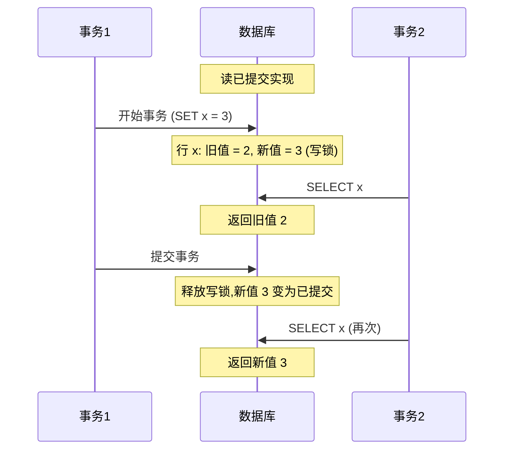

# 第8章 事务

> 一些作者声称，由于性能或可用性问题，通用的两阶段提交过于昂贵而难以支持。我们认为，与其让应用程序员总是围绕缺乏事务进行编码，不如在瓶颈出现时，让应用程序员处理因过度使用事务而导致的性能问题，这样更好。
> ——James Corbett 等，《Spanner：谷歌的全球分布式数据库》(2012)

在数据系统的严酷现实中，许多事情都可能出错：

- 数据库软件或硬件可能随时发生故障（包括在写操作的中途）。
- 应用程序可能随时崩溃（包括在一系列操作的中途）。
- 网络中断可能意外地切断应用程序与数据库的连接，或一个数据库节点与另一个节点的连接。
- 多个客户端可能同时写入数据库，相互覆盖对方的更改。
- 客户端可能读取到无意义的数据，因为数据仅被部分更新。
- 客户端之间的[[竞态条件]]可能导致令人惊讶的错误。

为了可靠，系统必须处理所有这些类型的故障，并确保它们不会导致灾难性故障。然而，实现容错机制需要大量工作。它需要仔细思考所有可能出错的事情，并进行严格测试以确保已实现的解决方案确实有效。

几十年来，事务一直是简化这些问题的首选机制。事务是应用程序将若干次读取和写入组合成一个逻辑单元的一种方式。从概念上讲，事务中的所有读取和写入作为一个操作执行：要么整个事务成功，导致[[提交]]，要么失败，导致[[中止]]或[[回滚]]。如果失败，应用程序可以安全地重试。有了事务，应用程序的错误处理变得简单得多，因为它不必担心部分失败（出于某种原因，部分操作成功而部分失败的情况）。

如果你习惯使用事务，它们可能看起来显而易见，但我们不应视其为理所当然。事务不是自然法则；它们是为了一个目的而创造的——即简化访问数据库的应用程序的编程模型。使用事务允许应用程序忽略某些潜在的错误场景和并发问题，因为数据库会代其处理这些问题（我们称这些为**安全保证**）。

并非每个应用程序都需要事务，有时削弱甚至完全放弃事务保证也有其优势（例如，为了实现更好的性能或更高的可用性）。有些安全属性可以在没有事务的情况下实现。另一方面，事务可以防止许多麻烦；例如，Post Office Horizon 丑闻（见第48页的“可靠性有多重要？”）的技术原因很可能就是底层会计系统中缺乏ACID事务[1]。

如何判断你是否需要事务？要回答这个问题，我们首先需要理解事务能够提供的确切安全保证以及与之相关的成本。尽管事务乍看起来简单直白，但许多微妙而重要的细节需要纳入考虑。

[[并发控制]]既适用于单节点数据库，也适用于分布式数据库。在本章中，我们将仔细探讨这一主题，讨论可能发生的各种竞态条件，以及数据库如何实现诸如[[读已提交]]、[[快照隔离]]和[[可串行化]]等隔离级别。我们还将研究[[两阶段提交]]协议，以及在分布式事务中实现[[原子性]]所面临的挑战。

## 事务究竟是什么？

如今几乎所有[[关系数据库]]，以及一些[[非关系数据库]]，都支持事务。它们大多遵循1975年由第一个SQL数据库IBM System R所引入的风格[2, 3, 4]。尽管一些实现细节已经改变，但在过去的50年里，总体思想几乎保持不变：MySQL、PostgreSQL、Oracle、SQL Server等中的事务支持与System R惊人地相似。

在21世纪后期，非关系（NoSQL）数据库开始流行起来。它们旨在通过提供新的数据模型（见第3章）的选择，并默认包含复制和分片（在第6章和第7章中讨论），来改进关系型数据库的现状。事务是这场运动的主要牺牲品：这一代的许多数据库完全放弃了事务，或者将这个词重新定义为一系列比之前所理解的弱得多的保证。

围绕NoSQL分布式数据库的热潮导致了一种普遍的信念：事务从根本上说是不可扩展的，任何大规模系统都必须放弃事务以维持良好的性能和高可用性。然而，最近这种信念被证明是错误的。所谓“NewSQL”数据库，如CockroachDB [5]、TiDB [6]、Spanner [7]、FoundationDB [8]和YugabyteDB，已经证明事务系统可以扩展到大数据量和高吞吐量。这些系统将分片与[[共识协议]]（我们将在第10章中探讨）结合起来，以在规模上提供强大的ACID保证。

但这并不意味着每个系统都必须是事务性的；与任何其他技术设计选择一样，事务既有优势也有局限性。为了理解这些权衡，在本章中我们将深入探讨事务能够提供的保证的细节，无论是在正常操作中还是在各种极端（但现实）的情况下。

## ACID的含义

事务提供的安全保证通常用众所周知的缩写词**ACID**来描述，它代表**原子性、一致性、隔离性和持久性**。该术语由Theo Härder和Andreas Reuter于1983年提出[9]，旨在为数据库中的容错机制建立精确的术语。

然而，在实践中，一个数据库对ACID的实现并不等于另一个数据库的实现。例如，正如我们将看到的，关于隔离性的含义存在大量歧义[10]。高层次的想法是正确的，但魔鬼在细节中。如今，当一个系统声称“符合ACID”时，你实际上能期望什么保证并不清楚。“ACID”不幸地已主要成为一个营销术语。

> [!INFO] BASE
> 不符合ACID标准的系统有时被称为**BASE**，代表**基本可用、软状态和最终一致性**[11]。这比ACID的定义更加模糊。看来BASE唯一合理的定义就是“非ACID”（即它几乎可以指任何你想要的东西）。

让我们深入探讨原子性、一致性、隔离性和持久性的定义，这将有助于我们细化对事务的理解。

### 原子性

**原子**通常指不能被分解成更小部分的东西。在计算的不同分支中，这个词的意义相似但略有不同。例如，在多线程编程中，如果一个线程执行一个**原子操作**，这意味着另一个线程不可能看到该操作未完成的结果。系统只能处于操作之前的状态或操作之后的状态，而不能处于中间状态。

相反，在ACID的上下文中，[[原子性]]*不是*关于并发的。它并不描述多个进程同时访问同一数据时会发生什么，因为那属于字母I（隔离性）的范畴（见第281页的“隔离性”）。ACID原子性描述的是，如果客户端想要执行多次写入，但在部分写入已处理之后发生故障（例如，进程崩溃、网络连接中断、磁盘已满或违反完整性约束），会发生什么。如果这些写入被分组到一个原子事务中，并且由于故障而无法完成（提交），那么该事务将被中止，并且数据库必须丢弃或撤销它在该事务中迄今为止所做的任何写入。

如果没有原子性，当在多次更改的中途发生错误时，很难知道哪些更改已经生效，哪些没有生效。应用程序可以重试，但这有风险，可能导致某些更改被执行两次，从而产生重复或不正确的数据。原子性简化了这个问题：如果事务被中止，应用程序可以确信它没有更改任何内容，因此可以安全地重试。

在出错时中止事务并丢弃该事务的所有写入，这是ACID原子性的定义性特征。也许“可中止性”是一个比原子性更好的术语，但我们将坚持使用原子性，因为这是常用的词。

### 一致性

**一致性**这个词的使用极其过载：

- 在第6章中，我们讨论了[[副本一致性]]以及异步复制系统中出现的[[最终一致性]]问题（见第209页的“复制滞后问题”）。
- 数据库的**一致快照**（例如用于备份）是数据库在某一时刻存在的整个数据库的快照。更准确地说，一致快照与[[happens-before关系|happens-before关系]]一致（见第238页的“happens-before关系与并发”）：如果快照包含在特定时间写入的值，那么该快照也反映了在该值被写入之前发生的所有写入。

# 第8章：事务

- **一致性哈希** 是一些系统用于重新平衡的分片方法（参见第263页的“一致性哈希”）。
- 在CAP定理（第10章讨论）中，“一致性”一词用于表示线性一致性（参见第402页的“线性一致性”）。
- 在ACID的上下文中，“一致性”指的是数据库处于“良好状态”的应用专用概念。

同一个词语至少有五种含义，这很不幸。

ACID一致性的理念是：你对数据有一些必须始终为真的陈述（不变性）。例如，在会计系统中，所有账户的贷方和借方必须始终保持平衡。如果一个事务开始时数据库根据这些不变性是有效的，并且事务期间的任何写入都保持有效性，那么你可以确信这些不变性总是得到满足。（在执行事务期间，不变性可能会暂时被违反，但在事务提交时应再次满足。）

如果你希望数据库强制执行你的不变性，你需要将它们作为约束声明在模式中。例如，外键约束、唯一性约束和检查约束（限制单个行中可以出现的值）通常用于建模特定类型的不变性。更复杂的一致性要求有时可以使用触发器或物化视图来建模 [12]。

然而，复杂的不变性通常难以甚至不可能使用数据库通常提供的约束来建模。在这种情况下，应用程序有责任正确定义其事务，使它们保持一致性。如果你编写了违反不变性的错误数据，但你没有声明这些不变性，数据库无法阻止你。因此，ACID中的C通常取决于应用程序如何使用数据库，而不仅仅是数据库本身的属性。

## 隔离性

大多数数据库同时被多个客户端访问。如果它们读取和写入数据库的不同部分，这不是问题，但如果它们访问相同的数据库记录，就会遇到并发问题（[[竞态条件]]）。图8-1是这类问题的一个简单示例。假设有两个客户端同时递增存储在数据库中的一个计数器。每个客户端需要读取当前值，加1，然后写回新值（假设数据库没有内置的递增操作）。在图8-1中，计数器本应从42增加到44，因为发生了两次递增，但由于竞态条件，实际上只变成了43。

**图8-1：两个客户端并发递增计数器时的竞态条件**

ACID意义上的隔离性意味着并发执行的事务彼此隔离；它们不能相互干扰。经典数据库教科书将隔离性形式化为[[可串行化]]，这意味着每个事务可以假装它是整个数据库上唯一运行的事务。数据库确保当事务提交时，结果与它们串行运行（一个接一个）相同，即使实际上它们可能是并发运行的 [13]。

然而，可串行化有性能代价。在实践中，许多数据库使用弱于可串行化的隔离形式——即它们允许并发事务以有限的方式相互干扰。一些流行的数据库，如Oracle，甚至不实现它（Oracle有一个称为“可串行化”的隔离级别，但实际上它实现了[[快照隔离]]，这是一种比可串行化更弱的保证 [10, 14]）。这意味着某些种类的竞态条件仍然可能发生。我们将在第288页的“[[弱隔离级别]]”中探讨快照隔离和其他形式的隔离。

## 持久性

数据库系统的目的是提供一个安全的地方，数据可以存储而不用担心丢失。持久性是这样一个承诺：在一个事务成功提交后，它写入的任何数据都不会被遗忘，即使发生硬件故障或数据库崩溃。

在单节点数据库中，持久性通常意味着数据已写入非易失性存储，如硬盘或SSD。常规的文件写入通常先在内存中缓冲，然后稍后发送到磁盘，这意味着如果突然断电，它们可能会丢失；因此许多数据库使用`fsync`系统调用来确保数据真正写入磁盘。数据库通常还有一个[[预写日志]]或类似功能（参见第127页的“使B树可靠”），这允许它们在写入过程中发生崩溃时进行恢复。许多数据库（如MySQL、MongoDB和PostgreSQL）将其数据存储为带有校验和的形式，这使得它们能够检测到损坏或不完整的日志条目，从而有助于在崩溃后将数据库恢复到一致的快照。

在复制数据库中，持久性可能意味着数据已成功复制到一定数量的节点。为了提供持久性保证，数据库必须等待这些写入或复制完成，然后才将事务报告为成功提交。然而，正如第43页的“[[可靠性与容错]]”中所讨论的，完美的持久性并不存在；如果你的所有硬盘和所有备份同时被销毁，数据库显然无法拯救你。

### 复制与持久性

历史上，持久性意味着写入归档磁带。然后它被理解为写入磁盘或SSD。最近，它已被调整为意味着复制。哪种实现更好？

事实上，没有什么是完美的：

- 如果你写入磁盘且机器死亡，即使数据没有丢失，在你修复机器或将磁盘转移到另一台机器之前，数据也是不可访问的。复制系统可以保持可用性。
- 一种相关故障——例如断电，或某个导致每个节点在特定输入上崩溃的bug——可以同时击垮所有副本（参见第43页的“[[可靠性与容错]]”），导致任何仅在内存中的数据丢失。因此，写入磁盘对于复制数据库仍然相关。
- 在异步复制系统中，当领导者变得不可用时，最近的写入可能会丢失（参见第204页的“[[处理节点宕机]]”）。
- 突然断电时，特别是SSD已被证明有时会违反它们本应提供的保证；甚至`fsync`也不能保证正常工作 [15]。磁盘固件可能存在bug，就像任何其他类型的软件一样 [16, 17]——例如，导致驱动器在恰好32,768小时运行后失效 [18]。而且`fsync`难以使用；就连PostgreSQL也错误地使用了它超过20年 [19, 20, 21]。
- 存储引擎与文件系统实现之间的微妙交互可能导致难以追踪的bug，并可能在崩溃后导致磁盘上的文件损坏 [22, 23]。一个副本上的文件系统错误有时也会传播到其他副本 [24]。
- 磁盘上的数据可能会逐渐损坏而不被检测到 [25, 26]。如果数据已损坏一段时间，副本和最近的备份也可能已损坏。在这种情况下，你将需要尝试从历史备份中恢复数据。
- 一项对SSD的研究发现，30%到80%的驱动器在运行的前四年中至少出现一个坏块，其中只有一部分可以通过固件纠正 [27]。与SSD相比，机械硬盘的坏扇区率较低，但完全故障率较高 [27]。
- 当一块磨损的SSD（经历了多次写/擦除循环）断开电源时，根据温度，它可能在数周到数月的时间尺度内开始丢失数据 [28]。对于磨损程度较低的驱动器，这个问题不那么严重 [29]。

在实践中，没有一种技术能够提供绝对保证。只有各种降低风险的技术——包括写入磁盘、复制到远程机器和备份——它们可以而且应该一起使用。一如既往，明智的做法是带着合理的怀疑态度对待任何理论上的“保证”。

## 单对象与多对象操作

回顾一下，在ACID中，原子性和隔离性描述了当一个客户端在同一个事务中执行多次写入时数据库应该做什么：

- **原子性**：如果在写入序列中途发生错误，事务应被中止，并且到该点为止所做的写入应被丢弃。换句话说，数据库通过提供全有或全无的保证，使你不必担心部分失败。
- **隔离性**：并发运行的事务不应相互干扰。例如，如果一个事务进行了多次写入，那么另一个事务应该看到所有这些写入或全部不看到，而不是一个子集。

这些定义假设你希望一次修改多个对象（行、文档、记录）。如果多个数据片段需要保持同步，通常需要这种多对象事务。图8-2显示了一个来自电子邮件应用程序的例子。为了显示用户的未读消息数量，你可以查询如下：

```sql
SELECT COUNT(*) FROM emails WHERE recipient_id = 2 AND unread_flag = true
```

然而，如果存在大量电子邮件，你可能会发现这个查询太慢，于是决定将未读消息的数量存储在一个单独的字段中（一种反规范化形式，我们在第72页的“[[规范化、反规范化和连接]]”中讨论）。现在，每当新消息到达时，你还必须递增未读计数器，每当消息被标记为已读时，你还必须递减未读计数器。

在图8-2中，用户2遇到了一个异常：邮箱列表显示有一条未读消息，但计数器显示零条未读消息，因为计数器递增尚未发生。（如果电子邮件应用程序中的错误计数器似乎太微不足道，那么想想客户账户余额而不是未读计数器，以及支付交易而不是电子邮件。）隔离性本可以防止这个问题……

# 第8章：事务

通过确保用户2要么看到插入的邮件和更新后的计数器两者，要么两者都看不到，而不是一个不一致的中间状态，隔离性本可以防止这个问题。

**图8-2. 违反隔离性：一个事务读取另一个事务未提交的写入（"脏读"）**

图8-3说明了原子性的必要性：如果在事务过程中某处发生错误，邮箱内容和未读计数器可能会变得不同步。在原子事务中，如果计数器的更新失败，事务会被中止，邮件插入会被回滚。

**图8-3. 原子性确保如果发生错误，该事务中的任何先前写入都会被撤销，以避免不一致状态。**

多对象事务需要某种方式来判定哪些读写操作属于同一个事务。在关系数据库中，这通常基于客户端到数据库服务器的TCP连接来完成。在任一特定连接上，`BEGIN TRANSACTION` 和 `COMMIT` 语句之间的所有内容都被视为同一事务的一部分。如果TCP连接中断，该事务必须被中止。

另一方面，许多非关系数据库并没有这样的方式将操作分组在一起。即使有一个多对象API（例如，键值存储可能有一个多写入操作，在一次操作中更新多个键），这也不一定意味着它具有事务语义：该命令可能对某些键成功而对另一些键失败，从而使数据库处于部分更新状态。

## 单对象写入

原子性和隔离性也适用于单个对象的更改。例如，假设你正在向数据库写入一个20 kB的JSON文档：

*   如果网络连接在前10 kB发送完毕后中断，数据库会存储那个无法解析的10 kB JSON片段吗？
*   如果数据库正在覆盖磁盘上的旧值时发生电源故障，旧值和新值会被拼接在一起吗？
*   如果另一个客户端在写入过程中读取该文档，它会看到部分更新后的值吗？

这些结果中的每一个都会令人难以置信地混淆，因此存储引擎几乎普遍旨在单个节点上单个对象（例如键值对）的级别提供原子性和隔离性。原子性可以通过使用日志进行崩溃恢复来实现（参见第127页的“使B树可靠”），隔离性可以通过对每个对象使用锁来实现（每次只允许一个线程访问一个对象）。

有些数据库还提供了更复杂的原子操作，例如增量操作，它消除了像图8-1中那样的读-修改-写循环的需要。条件写入操作同样流行，它允许只有在值未被其他人同时更改时才进行写入（参见第302页的“条件写入（比较并设置）”），类似于共享内存并发中的比较并设置或比较并交换（CAS）操作。

> [!NOTE]
> 严格来说，术语**原子增量**使用的是多线程编程意义上的“原子”。在ACID的上下文中，它应该被称为隔离的或可串行化的增量，但这并非惯常用法。

这些单对象操作很有用，因为它们可以防止当多个客户端试图同时写入同一对象时发生丢失更新（参见第299页的“防止丢失更新”）。然而，它们并不是通常意义上的事务。例如，Aerospike的“强一致性”模式和Cassandra及ScyllaDB的“轻量级事务”功能提供了单个对象上的线性化读取（参见第402页的“线性化”）和条件写入，但不提供跨多个对象的保证。

## 多对象事务的必要性

我们究竟是否需要多对象事务？是否可能只使用键值数据模型和单对象操作来实现任何应用程序？

在某些用例中，单对象的插入、更新和删除就足够了。然而，在许多其他情况下，需要对多个对象的写入进行协调：

*   在关系数据模型中，一个表中的行通常有指向另一个表行的外键引用。类似地，在图状数据模型中，一个顶点有到其他顶点的边。多对象事务允许你确保这些引用保持有效；当插入多条相互引用的记录时，外键必须正确且最新，否则数据会变得毫无意义。
*   在文档数据模型中，需要一起更新的字段通常位于同一个文档内，该文档被视为一个单对象；更新单个文档时不需要多对象事务。然而，缺乏连接功能的文档数据库也鼓励反规范化（参见第80页的“何时使用哪个模型”）。当需要更新反规范化的信息时，就像图8-2的例子那样，你需要一次性更新多个文档。在这种情况下，事务对于防止反规范化数据失去同步非常有用。
*   在具有二级索引的数据库中（几乎所有除了纯键值存储之外的数据存储），每次更改值时，索引也需要更新。从事务的角度来看，这些索引是不同的数据库对象——例如，没有事务隔离，一条记录可能出现在一个索引中但不在另一个索引中，因为对第二个索引的更新尚未发生（参见第268页的“分片与二级索引”）。

这样的应用程序仍然可以在没有事务的情况下实现。然而，没有原子性，错误处理会变得复杂得多，而缺乏隔离性会导致并发问题。我们将在第288页的“弱隔离级别”中讨论这些问题，并在第13章中探讨替代方法。

## 处理错误与中止

事务的一个关键特性是，如果发生错误，它可以被中止并安全地重试。ACID数据库基于这样的理念：如果数据库有违反其原子性、隔离性或持久性保证的危险，它宁愿完全放弃该事务，也不允许它半途而废。

不过，并非所有系统都遵循这一理念。特别是，无主复制（参见第229页的“无主复制”）的数据存储更多地基于“尽力而为”的原则，可以概括为“数据库会尽力而为，如果遇到错误，它不会撤销已经完成的操作”——因此，从错误中恢复是应用程序的责任。

错误不可避免地会发生，但许多软件开发人员宁愿只考虑乐观路径，而不考虑错误处理的复杂性。例如，流行的对象关系映射（ORM）框架如Rails ActiveRecord和Django不会重试中止的事务——错误通常会导致异常沿栈向上冒泡，任何用户输入都会被丢弃，用户会看到一条错误消息。这很可惜，因为回滚事务的全部意义在于启用安全重试。

尽管重试中止的事务是一种简单有效的错误处理机制，但它并非完美：

*   如果事务实际上成功了，但服务器试图向客户端确认成功提交时网络中断（因此从客户端的角度来看超时了），那么重试事务会导致它被执行两次，除非你有额外的应用程序级去重机制。
*   如果错误是由于过载或并发事务之间的高竞争引起的，重试事务会使问题变得更糟，而不是更好。为了避免这种反馈循环，你可以限制重试次数，使用指数退避，并将由过载引起的错误与其他错误区别对待（参见第38页的“当过载系统无法恢复时”）。
*   只有在瞬时错误（例如由于死锁、隔离违规、临时网络中断或故障转移）之后才值得重试。在永久性错误（例如违反约束）之后，重试将毫无意义。
*   如果事务在数据库之外也有副作用，即使事务被中止，这些副作用也可能发生。例如，如果你正在发送一封电子邮件，你不会希望每次重试事务时都再次发送该电子邮件。如果你希望确保多个系统要么一起提交要么一起中止，两阶段提交可以提供帮助（我们将在第324页的“两阶段提交”中讨论这一点）。
*   如果客户端进程在重试时崩溃，它试图写入数据库的任何数据都会丢失。

# 弱隔离级别

如果两个事务不访问相同的数据，或者两者都是只读的，那么它们可以安全地并行运行，因为彼此不依赖。并发问题（竞态条件）只有在以下情况下才会出现：一个事务读取了另一个事务同时修改的数据，或者两个事务试图同时修改相同的数据。

出于这个原因，大多数数据库会采用另一种方式来防止脏读：对于每个被写入的对象，数据库会记住旧的值（已提交的）和当前持有写锁的事务设置的新值。当事务仍在进行中时，同一对象的其他读取操作会获得旧的值。只有当事务提交后，才会向新的读取操作返回新的值。

这种方法如图 8-6 所示。对于防止脏写，行级锁是必要的（如“防止脏写”部分所述），但对于防止脏读，保持旧的值就足够了，而无需锁住写入。

**图 8-6. 在读已提交隔离级别下，使用行级锁防止脏写，并使用旧值防止脏读**



> [!INFO] 注意
> 图 8-6 展示了读已提交的常见实现：写操作获取行级锁以防止脏写，而读操作则通过保持旧提交值来避免脏读，无需等待写入完成。这解决了长写入事务阻塞大量只读事务的性能问题。

然而，读已提交并非万无一失。它并不能防止其他类型的竞态条件，例如**不可重复读**或**读倾斜**。我们接下来会讨论这些情况。

> [!TIP] 关键点
> 尽管读已提交是一个实用且广泛的隔离级别，但它只是事务隔离的起点。许多应用程序需要更强的保证来应对更复杂的并发问题，比如丢失更新和写入倾斜。

接下来，我们将探讨**快照隔离**和**可重复读**，它们能解决读已提交未能覆盖的一些竞态条件。

# 第8章：事务

尽管如此，在某些数据库中，锁仍然被用来防止脏读，例如IBM Db2和设置`read_committed_snapshot=off`的Microsoft SQL Server [30]。一种更常用的防止脏读的方法如图8-4所示。对于每一行被写入的数据，数据库同时记住旧的已提交值和当前持有写锁的事务设置的新值。当事务正在进行时，任何其他读取该行的事务只会被给予旧值。只有当新值被提交时，事务才会切换到读取新值（详见第295页的“多版本并发控制”）。

有些数据库支持一种更弱的隔离级别，称为**读未提交（read uncommitted）**。它能防止脏写，但不能防止脏读。也就是说，它会立即返回最新写入的值，即使写入事务尚未提交。这可以提供更好的性能，因为数据库不需要存储该行的两个版本。它还能降低（但无法防止）丢失更新的概率，我们将在第299页的“防止丢失更新”中讨论这一点。

## 快照隔离与可重复读

如果你肤浅地看待读已提交隔离，你可能会认为它已经完成了事务所需的一切：它允许中止（原子性所需），它防止读取未完成的事务结果，并且它防止并发写入相互交错。确实，这些都是有用的特性，并且它们比不支持事务的系统提供的保证要强得多。

然而，即使使用这种隔离级别，仍有很多方式会出现并发错误。例如，图8-6说明了在读已提交隔离下可能发生的一个问题。

假设Aaliyah在银行有$1,000的储蓄，分在两个账户中，每个$500。一个事务从她的一个账户向另一个账户转账$100。如果她在处理该事务的同一时刻查看她的账户余额列表，她可能会看到一个账户在收款到达之前的余额（仍为$500），以及另一个账户在转出之后的余额（新余额为$400）。对Aaliyah来说，她现在看起来账户总额只有$900——似乎$100凭空消失了。

这种异常称为**读偏斜（read skew）**，它是**不可重复读（nonrepeatable read）**的一个实例：如果Aaliyah在事务结束时再次读取账户1的余额，她会看到一个与她之前查询不同的值（$600）。在读已提交隔离下，读偏斜被认为是可接受的：Aaliyah看到的账户余额在她读取时确实是已提交的。

---

**弱隔离级别 | 293**


> [!NOTE]
> 术语“偏斜”不幸地被过度使用。我们之前用它表示热点导致的不均衡工作负载（见第263页“偏斜工作负载与缓解热点”），而这里它表示一种时序异常。

在Aaliyah的例子中，这不是一个持久的问题，因为如果她几秒钟后重新加载网上银行网站，她很可能会看到一致的账户余额。然而，这种暂时的不一致性在以下情况中是不可容忍的：

- **备份**：备份需要复制整个数据库，对于大型数据库可能需要数小时。在备份过程运行期间，数据库会继续有写入。因此，你最终可能会得到备份的某些部分包含旧版本数据，而其他部分包含新版本数据。如果你需要从这样的备份中恢复，不一致性（例如钱消失）就会变得永久。

- **分析查询与完整性检查**：有时你可能想要运行一个扫描数据库大部分区域的查询。这类查询在分析中很常见（见第3页“操作型系统与分析型系统”），或者可能是定期完整性检查的一部分（监控数据损坏）。如果这些查询在不同时间点观察到数据库的不同部分，它们很可能返回无意义的结果。

**快照隔离（Snapshot isolation）** [38] 是解决这个问题的最常见方案。其思想是：每个事务从数据库的一个**一致性快照（consistent snapshot）**中读取——也就是说，它看到事务开始时数据库中所有已提交的数据。即使该数据随后被另一个事务更改，每个事务也只能看到来自那个特定时间点的旧数据。

快照隔离对于长时间运行的只读查询（如备份和分析）非常有用。如果查询执行的同时数据正在变化，那么要理解查询的含义就非常困难。当事务能看到冻结在特定时间点的数据库一致性快照时，理解起来就容易得多。

快照隔离是一项流行的功能：PostgreSQL、使用InnoDB存储引擎的MySQL、Oracle、SQL Server等都支持其变体，尽管具体行为因系统而异 [30, 42, 43]。某些数据库（如Oracle、TiDB和Aurora DSQL）甚至将快照隔离作为其最高隔离级别。像BigQuery这样的云数据仓库也经常使用快照隔离，因为它为分析查询提供了数据库的时间点视图。

---

**294 | 第8章：事务**

### 多版本并发控制

与读已提交隔离一样，快照隔离的实现通常使用写锁来防止脏写（见第292页“实现读已提交”），这意味着一个进行写入的事务可以阻塞另一个写入同一行的事务的进度。但是，读取不需要任何锁。从性能角度来看，快照隔离的一个关键原则是：**读取者永远不会阻塞写入者，写入者也永远不会阻塞读取者**。这使得数据库能够同时处理基于一致性快照的长时读取查询和正常的写入操作，两者之间没有任何锁争用。

为了实现快照隔离，数据库使用了我们在图8-4中看到的防止脏读机制的推广。不是每行只保留两个版本（已提交的版本和被覆盖但尚未提交的版本），数据库可能需要保留一行数据的多个已提交版本，因为正在进行的不同事务可能需要看到不同时间点的数据库状态。由于它并排维护了行的多个版本，这种技术被称为**多版本并发控制（MVCC）**。

图8-7说明了PostgreSQL中基于MVCC的快照隔离实现方式 [42, 44, 45]（其他实现类似）。当事务开始时，它会被赋予一个唯一的、始终递增的**事务ID（txid）**。每当一个事务向数据库写入任何数据时，它写入的数据都会被标记上写入者的事务ID。（准确地说，PostgreSQL中的事务ID是32位整数，因此在大约40亿个事务后会溢出。真空进程会进行清理，确保溢出不影响数据。）

---

**弱隔离级别 | 295**


表中的每一行都有一个`inserted_by`字段，包含插入该行的事务的ID。每一行还有一个`deleted_by`字段，初始为空。如果某个事务删除了某行，该行不会从数据库中移除，而是通过将`deleted_by`字段设置为请求删除的事务的ID来标记为待删除。稍后，当确定没有任何事务还能访问已删除或已覆盖的数据时，数据库中的垃圾回收（GC）进程会删除标记为删除的行并释放其空间。

一个**更新**在内部被转换为一个**删除**加一个**插入** [46]。例如，在图8-7中，事务13从账户2扣除了$100，将余额从$500改为$400。账户表现在包含账户2的两行：一行余额为$500（被事务13标记为删除），另一行余额为$400（由事务13插入）。

行的所有版本都存储在同一个数据库堆中（见第133页“在索引中存储值”），无论写入它们的事务是否已提交。同一行的版本形成一个链表，从……

# 第8章：事务

### 可见性规则：观察一致快照

当事务从数据库读取数据时，事务ID被用来决定它可以看见哪些行版本、哪些是不可见的。通过仔细定义可见性规则，数据库可以向应用呈现其内容在某个时间点的一致快照。其大致工作方式如下 [45]：

1. 在每个事务开始时，数据库会列出当时所有正在进行中（尚未提交或中止）的其他事务。这些事务所做的任何写入均被忽略，即使这些事务随后提交。这确保了应用看到一个不受另一个事务提交影响的一致快照。
2. 任何由具有更晚事务ID（即，在当前事务开始之后才开始，因此不在进行中事务列表中的事务）的事务所做的写入均被忽略，无论这些事务是否已提交。
3. 任何由已中止事务所做的写入均被忽略，无论中止发生在何时。这带来了一个好处：当事务中止时，我们不需要立即从存储中移除它写入的行，因为可见性规则会过滤掉它们。垃圾回收（GC）进程可以在之后移除它们。
4. 所有其他写入对应用的查询可见。

这些规则同时适用于行的插入和删除。在图8-7中，当事务12从账户2读取时，它看到余额为500美元，因为删除500美元余额的操作是由事务13执行的（根据规则2，事务12看不到事务13所做的删除），而插入400美元余额的操作也尚不可见（根据同样的规则）。

换句话说，当以下两个条件都成立时，行是可见的：
* 在读取事务开始时，插入该行的事务已经提交。
* 该行未被标记为删除，或者如果被标记为删除，请求删除的事务在读取事务开始时尚未提交。

长时间运行的事务可以长时间使用一个快照，继续读取（从其他事务的角度来看）早已被覆盖或删除的值。通过从不原地更新值，而是每次值被更改时插入一个新版本，数据库可以提供一致快照，同时只带来很小的开销。

### 索引与快照隔离

在多版本数据库中，索引如何工作？最常见的方法是每个索引条目指向匹配该条目的行版本之一（最旧或最新版本）。每个行版本可能包含一个指向下一个最旧或下一个最新版本的引用。使用该索引的查询然后必须遍历各行，以找到一个可见且值匹配查询条件的行。当GC移除对任何事务不再可见的旧行版本时，相应的索引条目也可以被移除。

许多实现细节影响多版本并发控制的性能 [47, 48]。例如，PostgreSQL有优化，如果同一行的不同版本可以放在同一页面内，则避免索引更新 [42]。其他一些数据库避免存储完整修改后的行，而只存储版本之间的差异以节省空间。

另一种方法用于CouchDB、Datomic和LMDB。尽管它们也使用B树（参见第125页的“B树”），但它们使用不可变的（写时复制）变体，这种变体不会在更新时覆盖树页面，而是为每个修改过的页面创建新副本。父页面，一直到树根，都会被复制并更新以指向它们新的子页面版本。任何不受写入影响的页面都不需要复制，并可以与新树共享 [49]。

对于不可变B树，每个写事务（或一批事务）创建一个新的B树根，特定根就是数据库在创建时该时间点的一致快照。不需要基于事务ID过滤行，因为后续写入不能修改已有的B树；它们只能创建新的树根。这种方法也需要一个后台进程来进行压缩和GC。

### 快照隔离、可重复读与命名混淆

MVCC是数据库常用的实现技术，通常用于实现快照隔离。然而，不同的数据库有时使用不同的术语来指代同一事物——例如，PostgreSQL中快照隔离被称为“可重复读”，而在Oracle中被称为“可序列化” [30]。此外，有时不同的系统使用相同的术语但含义不同——例如，在PostgreSQL中“可重复读”意味着快照隔离，而在MySQL中它意味着一种一致性弱于快照隔离的MVCC实现 [43]，IBM Db2则使用“可重复读”来指代可序列化性 [10]。

这种命名混淆的原因是SQL标准没有快照隔离的概念，因为标准基于System R在1975年对隔离级别的定义 [3]，而快照隔离当时尚未被发明。相反，标准定义了可重复读隔离，这在表面上与快照隔离相似。PostgreSQL将其快照隔离级别称为可重复读，因为它满足了标准的要求，从而可以声称符合标准。

不幸的是，SQL标准对隔离级别的定义是有缺陷的——它模糊、不精确，并且不像一个标准应该的那样与实现无关 [38]。尽管多个数据库实现了可重复读隔离，但它们在提供的保证上存在巨大差异，尽管这些保证名义上是被标准化的 [30]。研究文献中已正式定义了这种隔离级别 [39, 40]，但大多数实现并不满足那个正式定义。结果，没有人真正知道可重复读隔离意味着什么。

## 防止丢失更新

我们关于读已提交和快照隔离级别的讨论主要关注在存在并发写入时，只读事务可以看到什么保证。我们基本上忽略了两个事务同时写入的问题——我们只讨论了脏写（参见第291页的“无脏写”），一种特定类型的写-写冲突。

在并发写入事务之间可能发生其他几种有趣的冲突。其中最著名的是**丢失更新问题**，在图8-1中通过两个并发计数器递增的例子进行了说明。

如果应用从数据库读取一个值，修改它，然后写回修改后的值（前面提到的读-修改-写循环），就可能发生丢失更新问题。如果两个事务并发执行此操作，其中一个修改可能会丢失，因为第二次写入不包含第一次修改。（我们有时说后来的写入覆盖了前面的写入。）这种模式出现在各种场景中，例如：

* 递增计数器或更新账户余额（需要读取当前值，计算新值，并写回更新后的值）
* 对复杂值进行本地修改——例如，向JSON文档中的列表添加一个元素（需要解析文档，进行修改，并写回修改后的文档）
* 两个用户同时编辑一个wiki页面，每个用户通过将整个页面内容发送到服务器来保存他们的更改，覆盖数据库中当前的内容

由于这是一个如此常见的问题，已经开发出了多种解决方案 [50]。我们在这里看一下最常见的几种。

### 原子写操作

许多数据库提供原子更新操作，这消除了在应用代码中实现读-修改-写循环的需要。如果你的代码可以用这些操作表达，它们通常是最好的解决方案。例如，以下指令在大多数关系型数据库中是并发安全的：

```sql
UPDATE counters SET value = value + 1 WHERE key = 'foo';
```

类似地，诸如MongoDB这样的文档数据库提供原子操作来对JSON文档的一部分进行本地修改，Redis提供原子操作来修改数据结构（如优先级队列）。并非所有写入都能轻易地用原子操作表达——例如，对wiki页面的更新涉及任意文本编辑，这可以使用第227页“无冲突复制数据类型和操作转换”中讨论的算法来处理——但在可以使用这些操作的情况下，它们通常是最佳选择。

原子操作通常通过在对对象读取时独占锁定该对象来实现，这样其他事务必须等到更新完成才能读取它。另一种选择是简单地在单个线程上强制执行所有原子操作。

不幸的是，ORM框架很容易让你意外地编写执行不安全的读-修改-写循环的代码，而不是使用数据库提供的原子操作 [51, 52, 53]。这可能是难以通过测试发现的细微bug的来源。

### 显式锁定

如果数据库的内置原子操作不能提供所需功能，另一种防止丢失更新的方法是让应用显式锁定将要更新的对象。然后应用可以执行读-修改-写循环，如果任何其他事务试图同时更新或锁定同一对象，它将被强制等待，直到第一个读-修改-写循环完成。

例如，考虑一个多人游戏，其中多个玩家可以同时移动同一个角色。在这种情况下，原子操作可能不够，因为应用还需要确保玩家的移动遵守游戏规则，这涉及一些无法合理实现为数据库查询的逻辑。相反，你可以使用锁来防止两个玩家同时移动同一块棋子，如示例8-1所示。

> [!NOTE]
> 由于原始文本在“Example 8-1”后截断，后续内容可能包含代码示例，但这里我们只翻译所提供的文本。

# 8.1 事务

## Chapter 8: Transactions

Example 8-1. 显式锁定行以防止丢失更新

```sql
BEGIN TRANSACTION;
SELECT * FROM figures
  WHERE name = 'robot' AND game_id = 222
  FOR UPDATE; 
-- 检查移动是否有效,然后更新前一个 SELECT 返回的棋子位置.
UPDATE figures SET position = 'c4' WHERE id = 1234;
COMMIT;
```

`FOR UPDATE` 子句指示数据库锁定此查询返回的所有行。

这确实有效，但需要仔细考虑应用逻辑。很容易忘记在代码的某处添加必要的锁，从而引入[[竞争条件]]。

此外，锁定多个对象存在[[死锁]]风险，即两个或多个事务相互等待对方释放锁。许多数据库会自动检测死锁并中止其中一个涉及的事务，以便系统能够继续推进。你可以在应用层面通过重试被中止的事务来处理这种情况。

### 自动检测丢失更新

原子操作和锁是通过强制读-修改-写周期顺序执行来防止丢失更新的方法。另一种替代方案是允许它们并行执行，如果事务管理器检测到丢失更新，则中止该事务并强制其重试读-修改-写周期。

这种方法的优势在于，数据库可以结合[[快照隔离]]高效地执行此检查。实际上，PostgreSQL 的可重复读、Oracle 的可串行化以及 SQL Server 的快照隔离级别会自动检测丢失更新何时发生，并中止违规事务。然而，MySQL/InnoDB 的可重复读隔离级别不会检测丢失更新 [30, 43]。一些作者 [38, 40] 认为，数据库必须防止丢失更新才能被认定为提供快照隔离，因此 MySQL 在此定义下不提供快照隔离。

丢失更新检测的一大优势是它不需要应用代码使用任何特殊的数据库特性。你可能会忘记使用锁或原子操作从而引入错误，但丢失更新检测会自动进行，且不易出错。不过，你仍然需要在应用层面重试被中止的事务。

### 条件写入（比较并设置）

在不提供事务的数据库中，有时会找到一种条件写入操作，它通过仅允许在值自你上次读取后未发生改变时进行更新来防止丢失更新（之前在第 286 页的“单对象写入”中提到）。如果当前值与之前读取的值不匹配，则更新无效，并且必须重试读-修改-写周期。这相当于许多 CPU 支持的原子 CAS（比较并交换）指令的数据库版本。

例如，为了防止两个用户同时更新同一个维基页面，你可以尝试如下操作，期望仅当页面内容自用户开始编辑以来未发生变化时才进行更新：

```sql
-- 这可能安全也可能不安全,取决于数据库实现
UPDATE wiki_pages SET content = 'new content'
  WHERE id = 1234 AND content = 'old content';
```

如果内容已更改且不再与旧内容匹配，此更新将无效，因此你需要检查更新是否生效，并在必要时重试。除了比较全部内容外，你还可以使用版本号列，每次更新时递增它，并且仅当当前版本号未发生变化时才应用更新。这种方法有时被称为[[乐观锁]] [54]。

请注意，如果另一个事务同时修改了内容，新内容可能在 MVCC 可见性规则下不可见（参见第 297 页的“用于观察一致快照的可见性规则”）。许多 MVCC 实现为此场景提供了可见性规则的例外情况：其他事务所做的写入在评估 `UPDATE` 和 `DELETE` 查询的 `WHERE` 子句时是可见的，即使这些写入在快照中原本不可见。

### 冲突解决与复制

在[[复制数据库]]（参见第 6 章）中，防止丢失更新具有另一层维度。由于这些数据库在多个节点上拥有数据副本，并且数据可能在不同节点上同时修改，因此需要采取额外步骤。

锁和条件写入操作假设存在单一最新数据副本。然而，具有多主或[[无主复制]]的数据库通常允许多个写入同时发生并异步复制，因此无法保证单一最新数据副本。因此，基于锁或条件写入的技术在此上下文中不适用。（我们将在第 402 页的“[[线性一致性]]”中更详细地重新讨论这个问题。）

相反，正如第 222 页的“处理写入冲突”中所讨论的，此类复制数据库的常见方法是允许并发写入生成多个冲突版本的值（也称为**兄弟版本**），然后使用应用代码或特殊数据结构事后解析并合并这些版本。

如果更新是可交换的（即可以在不同副本上以不同顺序应用并得到相同结果），合并冲突值可以防止丢失更新。例如，递增计数器和向集合添加元素就是可交换操作。这正是不冲突复制数据类型（CRDTs）背后的思想，我们在第 227 页的“无冲突复制数据类型与操作变换”中介绍过。然而，某些操作（例如条件写入）无法变得可交换。此外，许多复制数据库中默认的[[最后写入为准（LWW）]]冲突解决方法容易导致丢失更新，如第 224 页的“最后写入为准（丢弃并发写入）”所述。

## 写偏差与幻读

在前面的章节中，我们讨论了脏写和丢失更新，这是当不同事务同时尝试写入同一对象时可能发生的两种竞争条件。为了避免数据损坏，需要防止这些竞争条件——要么通过数据库自动处理，要么通过手动防护措施（例如使用锁或原子写入操作）。

然而，并发写入之间可能出现的竞争条件列表并未就此终结。在本节中，我们将看到一些更微妙的冲突示例。

首先，假设你在编写一个应用程序，用于管理医院医生的值班安排。医院通常希望在任何时候都有多名医生值班，但绝对必须有至少一名医生在岗。医生可以放弃自己的值班（例如，如果生病了），但前提是同一值班时段至少还有一名同事在岗 [55, 56]。

现在假设 Aaliyah 和 Bryce 是某个时段的两位值班医生。两人都感觉不舒服，于是决定请假。不幸的是，他们恰好几乎同时点击了下班按钮。接下来发生的事情如图 8-8 所示。

在每个事务中，你的应用程序首先检查当前是否有两名或更多医生在值班；如果是，则假定一名医生下班是安全的。由于数据库使用[[快照隔离]]，两次检查都返回 2，因此两个事务都进入下一阶段。Aaliyah 更新自己的记录以使自己下班，Bryce 也类似地更新自己的记录。两个事务都提交，现在没有医生在值班。你的“至少有一名医生值班”的要求被违反了。

**图 8-8. 写偏差导致应用程序错误**

### 写偏差的特征

这种异常称为**写偏差** [38]。它既不是脏写也不是丢失更新，因为两个事务分别更新了两个不同的对象（Aaliyah 和 Bryce 的值班记录）。这里是否发生了冲突不太明显，但显然是一个[[竞争条件]]：如果两个事务一个接一个地执行，第二个医生就会被阻止下班。异常行为之所以可能发生，仅仅是因为这两个事务并发执行。

你可以将写偏差视为丢失更新问题的泛化。如果两个事务读取了相同的对象，然后更新了其中部分对象（不同事务可能更新不同对象），就可能发生写偏差。在特殊情况中，不同事务更新同一个对象时，你会得到脏写或丢失更新的异常（取决于时间）。

我们看到有多种防止丢失更新的方法。对于写偏差，我们的选择更为有限：

- 原子单对象操作没有帮助，因为涉及多个对象。

# Chapter 8: 事务

更新同一个对象时，就会发生脏写或丢失更新异常（取决于时序）。我们看到有各种防止丢失更新的方法。而面对写偏斜，我们的选择更加受限：

- 原子单对象操作无济于事，因为涉及多个对象。
- 某些快照隔离实现中自动检测丢失更新的功能，遗憾的是也无济于事——在 PostgreSQL 的可重复读、MySQL/InnoDB 的可重复读、Oracle 的可串行化或 SQL Server 的快照隔离级别中，写偏斜不会被自动检测到 [30]。要自动防止写偏斜，需要真正的可串行化隔离（参见第 308 页的“可串行化”）。
- 某些数据库允许你配置约束，并由数据库强制执行（例如唯一性约束、外键约束或对特定值的限制）。但要指定“至少有一名医生在值班”，你需要一个涉及多个对象的约束。大多数数据库并不内置支持此类约束，但你或许可以通过触发器或物化视图来实现，如第 280 页的“一致性”所述 [12]。
- 如果你无法使用可串行化隔离级别，那么次优选择可能是显式锁定事务所依赖的行。在医生示例中，你可以编写如下代码：

```sql
BEGIN TRANSACTION;
SELECT * FROM doctors
  WHERE on_call = true
  AND shift_id = 1234 FOR UPDATE; 
UPDATE doctors
  SET on_call = false
  WHERE name = 'Aaliyah'
  AND shift_id = 1234;
COMMIT;
```

如之前所述，`FOR UPDATE` 告诉数据库锁定此查询返回的所有行。

## 更多写偏斜示例

写偏斜乍看之下可能是一个深奥的问题，但一旦你意识到它的存在，就可能在其他场景中发现它的踪迹。以下是一些更多示例：

### 会议室预订系统

假设你想强制执行：同一间会议室在同一时间不能有两个预订 [57]。当有人想要预订时，首先检查是否有任何冲突的预订（即同一房间、时间范围重叠的预订），如果没有则创建会议（见示例 8-2）。

**示例 8-2. 试图避免重复预订的会议室预订系统（在快照隔离下不安全）**

```sql
BEGIN TRANSACTION;
-- 检查是否有任何现有预订与中午 12 点到下午 1 点的时间段重叠
SELECT COUNT(*) FROM bookings
  WHERE room_id = 123 AND
    end_time > '2025-01-01 12:00' AND start_time < '2025-01-01 13:00';
-- 如果上一个查询返回 0:
INSERT INTO bookings
  (room_id, start_time, end_time, user_id)
  VALUES (123, '2025-01-01 12:00', '2025-01-01 13:00', 666);
COMMIT;
```

遗憾的是，快照隔离并不能阻止另一个用户并发插入冲突的会议。要保证不会出现调度冲突，你再次需要可串行化隔离。

### 多人游戏

在示例 8-1 中，我们使用锁来防止丢失更新（确保两个玩家不能同时移动同一个棋子）。然而，锁并不能阻止玩家将两个不同的棋子移动到棋盘上的同一个位置，或做出其他违反游戏规则的移动。根据你要执行的规则类型，你或许可以使用唯一性约束，否则仍然容易受到写偏斜的影响。

### 用户名申领

在网站上，每个用户必须拥有唯一的用户名。两个用户可能同时尝试使用相同的用户名创建账户。你可以使用事务检查该用户名是否已被占用，如果没有，则用该用户名创建账户。但是，就像前面的例子一样，这在快照隔离下是不安全的。幸运的是，唯一性约束是一个简单的解决方案（第二个尝试注册该用户名的事务将因违反约束而中止）。

### 防止重复消费

一个允许用户花钱或积分的服务需要检查用户花费的金额不超过其拥有的数额。你可以通过向用户账户中插入一条试探性消费条目，列出账户中的所有条目，并检查总和是否为正来实现。然而，在写偏斜的情况下，可能会同时插入两条消费条目，导致余额为负，但两个事务都没有注意到对方的存在。

## 幻读导致写偏斜

前面所有的例子都遵循一个类似的模式：

1. 执行一个 `SELECT` 查询，通过搜索满足条件的行来检查某个条件是否满足（例如：至少有两名医生值班、该房间在该时段没有现有预订、该棋盘位置上没有其他棋子、用户名尚未被占用、账户中还有余额）。
2. 根据第一个查询的结果，应用程序代码决定如何继续（或许继续执行操作，或许向用户报告错误并中止）。
3. 如果应用程序决定继续，它会对数据库进行写入（INSERT、UPDATE 或 DELETE），并提交事务。

这次写入的效果改变了第 2 步决策的前提条件。换句话说，如果在提交写入后重复第 1 步的 `SELECT` 查询，将得到不同的结果，因为写入改变了匹配搜索条件的行集（现在值班医生少了一位、该会议室在该时段已被预订、该棋盘位置已被移动的棋子占据、用户名已被占用、账户中的余额变少了）。

步骤的顺序可能不同。例如，你可以先执行写入，然后执行 `SELECT` 查询，最后根据查询结果决定是中止还是提交。

在值班医生的例子中，第 3 步修改的行正是第 1 步返回的行之一，因此你可以通过在第 1 步锁定那些行（`SELECT FOR UPDATE`）来使事务安全并避免写偏斜。然而，其他四个例子则不同：它们检查的是没有行匹配搜索条件，而写入则添加了一行匹配同一条件。如果第 1 步的查询没有返回任何行，那么 `SELECT FOR UPDATE` 就无法将锁附加到任何对象上 [58]。

这种一个事务中的写操作改变了另一个事务中查询结果的现象，称为**幻读** [4]。快照隔离可以在只读查询中避免幻读，但在像我们讨论的这类读写事务中，幻读可能导致特别棘手的写偏斜情况。ORM 生成的 SQL 也容易产生写偏斜 [52, 53]。

## 物化冲突

如果幻读的问题在于没有对象可以加锁，那么或许我们可以人为地在数据库中引入一个锁对象？

例如，在会议室预订场景中，可以想象创建一个时间槽和房间的表。该表的每一行对应特定房间的特定时间段（比如 15 分钟）。你可以预先为所有可能的房间和时间段组合创建行（例如未来六个月）。

现在，一个想要创建预订的事务可以锁定（`SELECT FOR UPDATE`）表中对应所需房间和时间段的行。获取锁之后，事务可以照常检查是否有重叠的预订并插入新预订。注意，这个额外的表并不用于存储预订信息——它纯粹是一个锁的集合，用于防止同一房间和时间范围同时被预订。

这种方法称为**物化冲突**，因为它将幻读转化为对数据库中具体存在的一组行上的锁冲突 [14]。不幸的是，如何物化冲突可能难以确定而且容易出错，并且让并发控制机制渗入应用程序数据模型也很丑陋。因此，只有在没有其他替代方案时，才应考虑将物化冲突作为最后手段。在大多数情况下，可串行化隔离级别是更优的选择。

# 可串行化

在本章中，我们看到了多个易产生竞态条件的事务示例。读已提交和快照隔离级别可防止某些竞态条件，但其他则不能。我们遇到了一些特别棘手的写偏斜和幻读例子。这是一个令人遗憾的状况：

- 隔离级别难以理解，且在不同数据库中的实现不一致（例如，“可重复读”的含义差异很大）。
- 仅通过查看应用程序代码来判断在特定隔离级别下运行是否安全是困难的——尤其是在大型应用中，你可能无法意识到所有可能同时发生的事情。
- 没有好的工具帮助我们检测竞态条件。原则上，静态分析可能会有帮助 [35]，但研究技术尚未进入实际应用。测试并发问题很困难，因为它们通常是非确定性的——只有当时机不佳时才会出现问题。

这并非一个新问题。自 1970 年代弱隔离级别首次引入以来，一直如此 [3]。一直以来，研究人员的答案都很简单：使用可串行化隔离！

**可串行化隔离**是最强的隔离级别。它保证即使事务可能并行执行，最终结果与它们一个接一个、串行执行（没有任何并发）时的结果相同。因此，数据库保证如果事务在可串行化下运行，它们就是正确的——没有竞态条件。这一承诺听起来很诱人，但我们也知道，可串行化是有代价的，这促使人们在过去三十年里一直使用较弱的隔离级别。我们稍后会讨论这个代价，但首先，让我们看看实现可串行化的三种主流方法，以及它们各自的权衡。

> [!INFO] 注意
> 原文中第 308 页的“Serializability”部分至此结束。后续内容（如实现可串行化的三种方法）将在本部分的后续页面中展开，但此处给出的文本截止于此，因此无法继续翻译。如需完整内容，请提供后续文本。

# 第8章：事务

## 可串行化

可串行化隔离是最强的隔离级别。它保证即使事务可能并行执行，最终结果也如同它们一个一个地串行执行、没有任何并发一样。因此，数据库保证：当事务单独运行时行为正确，那么并发运行时也依然正确——换句话说，数据库防止了所有可能的[[竞态条件]]。

但是，如果可串行化隔离比混乱的弱隔离级别要好得多，为什么不是所有人都在使用它呢？要回答这个问题，我们需要审视实现可串行化的选项及其性能表现。当今大多数提供可串行化的数据库使用以下三种技术之一，我们将在本章剩余部分探讨：

- **真正串行执行事务**（见下文）
- **两阶段锁定**（见第313页的“两阶段锁定”），几十年来曾是唯一可行的选项
- **乐观并发控制技术**，例如可串行化快照隔离（见第317页的“可串行化快照隔离”）

## 真正的串行执行

避免并发问题的最简单方法是完全消除并发：在单个线程上一次只执行一个事务，按串行顺序进行。通过这样做，我们完全绕过了检测和防止事务之间冲突的问题；由此产生的隔离性根据定义就是可串行化的。

尽管这个想法看似显而易见，但直到2000年代，数据库设计者才认定用单线程循环来执行事务是可行的[59]。如果在前30年中，多线程并发被认为是获得良好性能的关键，那么是什么变化使得单线程执行成为可能？

两个发展引发了这种重新思考：

- RAM变得足够便宜，以至于许多使用场景下，将整个活跃数据集保存在内存中已经可行（见第133页的“将所有内容保存在内存中”）。当事务需要访问的所有数据都在内存中时，事务的执行速度远快于必须等待数据从磁盘加载的情况。
- 数据库设计者意识到，OLTP事务通常很短，只进行少量读写（见第3页的“操作型系统与分析型系统”）。相比之下，长时间运行的分析查询通常是只读的，因此可以在串行执行循环之外，使用[[快照隔离]]在一致快照上运行。

串行执行事务的方法已在VoltDB/H-Store、Redis和Datomic等系统中实现[60, 61, 62]。为单线程执行设计的系统有时可能比支持并发的系统性能更好，因为它可以避免锁定的协调开销。然而，其吞吐量受限于单个CPU核心。为了充分利用那个单线程，事务需要以不同于传统形式的方式组织。

### 将事务封装在存储过程中

在数据库早期，意图是数据库事务可以包含整个用户活动流程。例如，预订机票是一个多阶段过程（搜索航线、票价和可用座位；决定行程；预订行程中每个航班的座位；输入乘客详细信息；付款）。数据库设计者认为，如果整个流程是一个事务，那么它可以原子性地提交，那该有多好。

不幸的是，人类做出决定和响应的速度非常慢。如果数据库事务需要等待用户输入，数据库需要支持可能大量的并发事务，其中大多数处于空闲状态。大多数数据库无法高效地做到这一点，因此几乎所有OLTP应用程序都通过避免在事务内交互式等待用户来保持事务简短。在Web上，这意味着事务在同一个HTTP请求内提交——一个事务不会跨越多个请求。一个新的HTTP请求会启动一个新的事务。

尽管人类已经从关键路径中移除，但事务仍然以交互式客户端/服务器风格逐条语句执行。应用程序发出一个查询，读取结果，可能根据第一个查询的结果再发出另一个查询，依此类推。查询和结果在应用程序代码（运行在一台机器上）和数据库服务器（在另一台机器上）之间来回发送。

在这种交互式事务风格中，大量时间花费在应用程序和数据库之间的网络通信上。如果你禁止数据库中的并发，一次只处理一个事务，那么吞吐量将非常糟糕，因为数据库大部分时间都在等待应用程序为当前事务发出下一个查询。在这种数据库中，必须同时处理多个并发事务才能获得合理的性能。

因此，采用单线程串行事务处理的系统不允许交互式的多语句事务。相反，应用程序必须要么将自身限制为只包含单一语句的事务，要么预先将整个事务代码作为存储过程提交给数据库[63]。

交互式事务与存储过程之间的区别如图8-9所示。只要事务所需的所有数据都在内存中，存储过程就可以非常快速地执行，无需等待任何网络或磁盘I/O。


*图8-9. 交互式事务与存储过程之间的区别（使用图8-8中的示例事务）*

### 存储过程的优缺点

存储过程在关系数据库中已经存在了一段时间，并且自1999年以来一直是SQL标准（SQL/PSM）的一部分。由于各种原因，它们的名声有些不好：

- 传统上，每个数据库厂商都有自己的存储过程语言（Oracle有PL/SQL，SQL Server有T-SQL，PostgreSQL有PL/pgSQL等）。这些语言没有跟上通用编程语言的发展，从今天的角度来看显得相当丑陋和过时，并且缺乏你在大多数现代编程语言中能找到的库生态系统。
- 在数据库中运行的代码难以管理。与应用程序服务器相比，调试更难、版本控制和部署更麻烦、测试更棘手，并且难以与监控的指标收集系统集成。
- 数据库通常比应用程序服务器对性能更敏感，因为单个数据库实例通常由许多应用程序服务器共享。在数据库中编写糟糕的存储过程（例如，使用大量内存或CPU时间，甚至导致崩溃）比在应用程序服务器中编写同样糟糕的代码造成的问题要大得多。
- 在允许多租户编写自己的存储过程的多租户系统中，在与数据库内核相同的进程中执行不受信任的代码存在安全风险[64]。

然而，这些问题是可以克服的。现代存储过程实现已经放弃了PL/SQL，转而使用现有的通用编程语言。VoltDB使用Java或Groovy，Datomic使用Java或Clojure，Redis使用Lua，MongoDB使用JavaScript。

当应用程序逻辑不易嵌入其他地方时，存储过程也很有用。例如，使用GraphQL的应用程序可能通过GraphQL代理直接暴露其数据库。如果代理不支持复杂的验证逻辑，你可以通过使用存储过程将这些逻辑直接嵌入数据库。如果数据库不支持存储过程，你将不得不在代理和数据库之间部署一个验证服务来执行验证。

有了存储过程和内存数据，在单个线程上执行所有事务变得可行。当存储过程不需要等待I/O并避免其他并发控制机制的开销时，它们可以在单个线程上实现相当高的吞吐量。

VoltDB还使用存储过程进行复制。它不是将事务的写入从一个节点复制到另一个节点，而是在每个副本上执行相同的存储过程。因此，VoltDB要求存储过程是确定性的（在不同节点上运行时必须产生相同的结果）。例如，如果事务需要使用当前日期和时间，则必须通过特殊的确定性API来实现（关于确定性操作的更多细节，请参见第187页的“持久执行与工作流”）。这种方法称为状态机复制，我们将在第10章中再次讨论。

### 分区

将所有事务串行执行使得并发控制变得简单得多，但它将数据库的事务吞吐量限制在单个机器上一个CPU核心的速度。只读事务可以在别处使用快照隔离执行，但对于写入吞吐量高的应用程序，单线程事务处理器可能成为严重的瓶颈。

为了扩展到多CPU核心和多节点，你可以对数据进行[[分区]]（参见第7章），VoltDB支持这一点。如果你能找到一种分区数据集的方法，使得每个事务只需要在单个分区内读写数据，那么每个分区就可以拥有自己独立运行的事务处理线程。在这种情况下，你可以为每个CPU核心分配一个分区，从而使事务吞吐量随CPU核心数量线性扩展[61]。

# 第8章：事务

然而，对于任何需要访问多个分片的事务，数据库必须协调该事务所触及的所有分片。存储过程需要在所有分片上同步执行，以确保整个系统的可串行化。

由于跨分片事务具有额外的协调开销，它们比单分片事务慢得多。VoltDB 报告每秒约 1,000 次跨分片写入，这比其单分片吞吐量低数个数量级，并且无法通过增加更多机器来提高 [[63]]。最近的研究探索了使多分片事务更具可扩展性的方法 [[65]]。

事务能否是单分片的，很大程度上取决于应用程序所使用的数据结构。简单的键值数据通常很容易分片，但具有多个二级索引的数据可能需要大量的跨分片协调（参见第 268 页的“分片与二级索引”）。

## 串行执行总结

在特定约束条件下，串行执行事务已成为实现可串行化隔离的一种可行方式：

- 每个事务必须既小又快，因为只要一个慢事务就会阻塞所有事务处理。
- 当活跃数据集可以放入内存时最为合适。极少访问的数据可以转移到磁盘，但如果需要在单线程事务中访问这些数据，系统会变得非常慢。
- 写入吞吐量必须足够低，以能在单个 CPU 核上处理；否则需要对事务进行分片，且不能要求跨分片协调。
- 跨分片事务是可能的，但其吞吐量难以扩展。

# 两阶段锁定（2PL）

大约 30 年来，数据库中只有一种算法被广泛用于可串行化：两阶段锁定（2PL），有时称为强严格两阶段锁定（SS2PL），以区别于 2PL 的其他变体。

> [!INFO] 2PL 不是 2PC
> 2PL 和 2PC 是完全不同的东西。2PL 提供可串行化隔离，而 2PC 提供分布式数据库中的原子提交（参见第 324 页的“两阶段提交”）。为避免混淆，最好将它们视为完全独立的概念，并忽略名称上不幸的相似性。

我们之前看到锁通常用于防止脏写（参见第 291 页的“无脏写”）。如果两个事务并发地尝试写入同一个对象，锁确保第二个写入者必须等待第一个写入者完成其事务（中止或提交）后才能继续。

2PL 类似，但它的锁要求要严格得多。只要没有人在写，多个事务可以并发地读取同一个对象。但一旦有人想要写入（修改或删除）一个对象，就需要独占访问：

- 如果事务 A 已经读取了一个对象，而事务 B 想要写入该对象，那么 B 必须等待 A 提交或中止后才能继续。（这确保了 B 不能背着 A 意外地修改对象。）
- 如果事务 A 已经写入了一个对象，而事务 B 想要读取该对象，那么 B 必须等待 A 提交或中止后才能继续。（在 2PL 下，读取对象的旧版本（如图 8-4 所示）是不可接受的。）

在 2PL 中，写入者不仅阻塞其他写入者，还阻塞读取者，反之亦然。之前提到的“读取者从不阻塞写入者，写入者从不阻塞读取者”这一快照隔离的座右铭（参见第 295 页的“多版本并发控制”）抓住了快照隔离与 2PL 之间的关键区别。另一方面，由于 2PL 提供可串行化，它可以防止之前讨论过的所有竞争条件，包括丢失更新和写偏斜。

## 2PL 的实现

MySQL/InnoDB 和 SQL Server 的可串行化隔离级别以及 Db2 的可重复读隔离级别都使用了 2PL [[30]]。

读取和写入的阻塞是通过对数据库中每个对象加锁来实现的。锁可以是共享模式或独占模式（也称为多读取者单写入者锁）。其使用方式如下：

- 如果事务想要读取一个对象，它必须首先以共享模式获取锁。多个事务可以同时持有共享模式的锁，但如果有另一个事务已经持有该对象的独占锁，那么这些事务必须等待。
- 如果事务想要写入一个对象，它必须首先以独占模式获取锁。其他事务不能同时持有该锁（无论是共享模式还是独占模式），因此如果该对象上存在任何现有锁，事务必须等待。
- 如果事务先读取然后写入一个对象，它可以将它的共享锁升级为独占锁。升级的方式与直接获取独占锁相同。

- 一旦事务获得了锁，它必须一直持有该锁，直到事务结束（提交或中止）。这就是“两阶段”名称的由来：第一阶段（增长阶段，即事务执行期间）是获取锁的阶段；第二阶段（收缩阶段，即事务结束时）是释放所有锁的阶段。这两个阶段不能重叠；一旦释放了某个锁，在该事务中不能再获取新的锁。

由于使用了这么多锁，很容易发生事务 A 正在等待事务 B 释放其锁，而事务 B 也在等待事务 A 释放其锁的情况。这种情况称为死锁。数据库会自动检测事务之间的死锁，并中止其中一个事务，以便其他事务能够继续执行。被中止的事务需要由应用程序重试。

## 2PL 的性能

2PL 的一大缺点，也是自 20 世纪 70 年代以来它没有成为大多数系统默认选项的原因，是性能问题。在 2PL 下，事务吞吐量和查询响应时间明显比弱隔离差。

部分原因是获取和释放所有这些锁的开销，但更重要的原因是并发性的降低。按照设计，如果两个并发事务试图以任何可能导致竞争条件的方式执行任何操作，其中一个必须等待另一个完成。

例如，如果一个事务需要读取整个表（例如备份、分析查询或完整性检查，如第 293 页的“快照隔离与可重复读”所述），那么该事务必须对整个表加共享锁。因此，读取事务首先必须等待所有正在写入该表的事务完成；然后，在读取整个表期间（对于大表可能需要很长时间），所有想要写入该表的事务都会被阻塞，直到这个大只读事务提交。实际上，数据库在相当长的时间内无法写入。

因此，运行 2PL 的数据库可能具有相当不稳定的延迟，并且在存在工作负载争用的情况下，在高百分位可能会非常慢（参见第 37 页的“描述性能”）。仅仅一个慢事务，或者一个访问大量数据并获取许多锁的事务，就可能导致系统的其余部分陷入停滞。事务超时和慢查询监控用于检测和限制行为异常的查询。

尽管在基于锁的读提交隔离级别下也可能发生死锁，但在 2PL 可串行化隔离下，死锁发生得更频繁（取决于事务的访问模式）。这可能是另一个性能问题：当事务因死锁而被中止并重试时，它需要重新执行所有工作。如果死锁频繁发生，可能意味着巨大的浪费。

# 谓词锁

在前面对锁的描述中，我们忽略了一个微妙但重要的细节。在第 307 页的“导致写偏斜的幻读”中，我们讨论了幻读的问题——即一个事务改变了另一个事务搜索查询的结果。具有可串行化隔离的数据库必须防止幻读。

在会议室预订示例中，这意味着如果一个事务已经搜索了某个房间在某个时间窗口内的现有预订（参见示例 8-2），则不允许另一个事务同时为同一房间和同一时间范围插入或更新另一个预订。（为其他房间，或为同一房间但不同时间（不影响建议预订的时间）同时插入预订是可以的。）

我们如何实现这一点？概念上，我们需要一个谓词锁 [[4]]。它的工作原理类似于前面描述的共享/独占锁，但它不属于特定的对象（例如表中的一行），而是属于所有匹配搜索条件的对象，例如：

```sql
SELECT * FROM bookings
  WHERE room_id = 123 AND
    end_time   > '2026-01-01 12:00' AND
    start_time < '2026-01-01 13:00';
```

谓词锁的限制方式如下：

- 如果事务 A 想要读取与条件匹配的对象（如该 SELECT 查询），它必须首先在查询条件上获取共享模式的谓词锁。如果另一个事务 B 当前持有与这些条件匹配的任何对象的独占锁，那么 A 必须等待 B 释放其锁之后才能执行其查询。
- 如果事务 A 想要插入、更新或删除任何对象，它必须首先检查旧值或新值是否与任何现有的谓词锁匹配。如果存在着由事务 B 持有的匹配谓词锁，那么 A 必须等到 B 提交或中止后才能继续。

这里的关键思想是，谓词锁甚至适用于数据库中尚不存在但将来可能被添加的对象（幻影）。如果 2PL 包含谓词锁，数据库就可以防止所有形式的写偏斜和其他竞争条件，因此其隔离性就变成了可串行化。

# 第8章：事务

## 索引范围锁

不幸的是，谓词锁性能不佳：如果活跃事务持有大量锁，检查匹配锁会变得耗时。因此，大多数实现2PL的数据库采用**索引范围锁**（也称为**next-key locking**），它是谓词锁的一种简化近似 [56, 66]。

通过让谓词匹配更大的对象集来进行简化是安全的。例如，如果你有对房间123在中午到下午1点之间预订的谓词锁，你可以通过锁定房间123任意时间的预订来近似，或者通过锁定所有房间（不仅仅是房间123）在中午到下午1点之间的预订来近似。这是安全的，因为任何匹配原始谓词的写入都必然也会匹配这些近似条件。

在房间预订数据库中，你可能会在 `room_id` 列上建立索引，或者在 `start_time` 和 `end_time` 上建立索引（否则，前面的查询在大数据库上会非常慢）：

- 假设你的索引在 `room_id` 上，并且数据库使用该索引查找房间123的现有预订。此时数据库可以简单地将一个共享锁附加到此索引条目上，表示一个事务已经搜索过房间123的预订。
- 或者，如果数据库使用基于时间的索引来查找现有预订，它可以向该索引中某个值范围附加一个共享锁，表示一个事务已经搜索过在指定日期中午到下午1点时间段内重叠的预订。

无论哪种方式，搜索条件的近似都会被附加到其中一个索引上。现在，如果另一个事务想要插入、更新或删除同一房间和/或重叠时间段的预订，它必须更新索引的同一部分。在此过程中，它将遇到共享锁，并被迫等待直到该锁被释放。

这提供了对幻读和写倾斜的有效防护。索引范围锁不如谓词锁那样精确（它们可能会锁定比严格维持可串行化所需更大的对象范围），但由于开销更低，它们是一个很好的折衷。

如果没有合适的索引可以附加范围锁，数据库可以退而使用整个表上的共享锁。这对性能不利，因为它会阻止所有其他事务向该表写入，但这是一个安全的回退方案。

## 可串行化快照隔离

本章描绘了数据库中并发控制的黯淡图景。一方面，我们有性能不佳（2PL）或扩展性差（串行执行）的可串行化实现。另一方面，我们有性能良好但容易受到各种竞态条件影响的弱隔离级别（丢失更新、写倾斜、幻读等）。可串行化隔离与高性能是否从根本上相互矛盾？

似乎并非如此：一种称为**可串行化快照隔离**（SSI）的算法提供了完全的可串行化，同时相比快照隔离只有很小的性能损失。SSI相对较新；它于2008年首次被描述 [55, 67]。

如今，SSI及类似算法被用于单节点数据库（PostgreSQL [56]、SQL Server 的内存OLTP/Hekaton [68] 和 HyPer [69] 中的可串行化隔离级别）、分布式数据库（CockroachDB [5] 和 FoundationDB [8]）以及嵌入式存储引擎（如 BadgerDB）。

### 悲观与乐观并发控制

2PL 是一种**悲观并发控制**机制：它基于这样的原则——如果任何可能出错的事情（由另一个事务持有的锁指示），最好等到情况再次安全后再做任何事情。它类似于互斥锁，用于保护多线程编程中的数据结构。

从某种意义上说，串行执行是极端的悲观：它基本上等同于每个事务在其持续时间内对整个数据库（或数据库的一个分片）持有排他锁。我们通过使每个事务执行得非常快来补偿这种悲观，这样它只需要持有"锁"很短的时间。

相反，可串行化快照隔离是一种**乐观并发控制**技术。此处的乐观意味着，当事务遇到可能危险的情况时，它不会阻塞，而是继续执行，希望一切顺利。当事务想要提交时，数据库会检查是否发生了任何坏事情（即隔离性是否被违反）；如果是，则事务被中止并需要重试。只有以可串行化方式执行的事务才被允许提交。

乐观并发控制是一个古老的想法 [70]，其优缺点长期以来一直存在争议 [71]。如果存在高竞争（许多事务试图访问相同的对象），它的性能会很差，因为这会导致很高比例的事务需要中止。如果系统已经接近其最大吞吐量，来自重试事务的额外负载可能会使性能更差。

然而，如果有足够的备用容量，并且事务之间的竞争不太高，乐观并发控制技术往往比悲观技术表现更好。可以通过可交换的原子操作来减少竞争：
318 | 第8章：事务

例如，如果多个事务同时想要递增一个计数器，递增应用的顺序无关紧要（只要计数器不在同一个事务中被读取），因此这些并发递增可以全部应用而不发生冲突。

顾名思义，SSI 基于**快照隔离**——即事务中的所有读取都来自数据库的一个一致性快照（参见第293页的“快照隔离与可重复读”）。在快照隔离之上，SSI 添加了一种算法，用于检测读取和写入之间的序列化冲突，并确定哪些事务需要中止。

### 基于过时前提的决策

之前讨论快照隔离下的写倾斜时（参见第303页的“写倾斜与幻读”），我们观察到一个重复出现的模式：一个事务从数据库读取数据，检查查询结果，然后基于所见结果决定采取行动（写入数据库）。然而，在快照隔离下，到事务提交时，原始查询的结果可能已经过时，因为数据在这期间可能已被修改。

换句话说，该事务是基于一个**前提**（在事务开始时成立的事实，例如“当前有两个医生值班”）采取行动。稍后，当事务想要提交时，原始数据可能已经改变——前提可能不再成立。

当应用程序执行查询（例如，“当前有多少医生值班？”）时，数据库不知道应用程序逻辑如何使用该查询结果。为了安全起见，数据库需要假设查询结果（前提）的任何更改意味着该事务中的写入可能是无效的。换句话说，查询和写入之间可能存在因果关系。为了提供可串行化隔离，数据库必须检测事务可能基于过时前提行动的情况，并在这种情况下中止该事务。

数据库如何知道查询结果可能已经改变？考虑两种情况：

- 检测对陈旧MVCC对象版本的读取（在读取之前发生了未提交的写入）
- 检测影响先前读取的写入（写入发生在读取之后）

#### 检测陈旧的MVCC读取

回想一下，快照隔离通常通过MVCC实现（参见第295页的“多版本并发控制”）。当事务在MVCC数据库中从一致性快照读取时，它会忽略在快照创建时尚未提交的任何其他事务所做的写入。

序列化性 | 319

在图8-10中，事务43看到Aaliyah的 `on_call = true`，因为事务42（修改了Aaliyah的值班状态）尚未提交。然而，当事务43想要提交时，事务42已经提交。这意味着在从一致性快照读取时被忽略的写入现在已经生效，事务43的前提不再成立。当写入方插入之前不存在的数据时，情况会更加复杂（参见第307页的“幻读导致写倾斜”）。我们将在下一节讨论针对SSI的幻写检测。

**图8-10. 检测事务何时从MVCC快照中读取过时值**

为了防止这种异常，数据库需要跟踪事务因MVCC可见性规则而忽略另一个事务写入的情况。当事务想要提交时，数据库检查被忽略的写入中是否有任何现在已经提交。如果是，则必须中止该事务。

为什么要等到提交时才检查？为什么不在检测到陈旧读取时立即中止事务43？嗯，如果事务43是只读事务，则无需中止，因为没有写倾斜的风险。当事务43进行读取时，数据库尚不知道该事务后续是否会执行写入。此外，事务42可能尚未中止，或者在事务43提交时仍未提交，因此该读取可能最终并非陈旧。通过避免不必要的中止，SSI保留了快照隔离对从一致性快照进行长时间读取的支持。

320 | 第8章：事务

# 第8章：事务

## 检测影响先前读取的写入操作

需要考虑的第二种情况是，另一个事务在数据被读取后对其进行了修改。图8-11展示了这种情况。

在2PC（两阶段锁定）的上下文中，我们讨论了[[索引范围锁]]（见第317页的“索引范围锁”），它允许数据库锁定与搜索查询（如 `WHERE shift_id = 1234`）匹配的所有行的访问。我们可以在此处采用类似的技术，不同之处在于 SSI（可串行化快照隔离）的锁不会阻塞其他事务。

在图8-11中，事务42和事务43都在搜索班次1234的待命医生。如果在 `shift_id` 上有索引，数据库可以使用索引条目1234来记录事务42和事务43已读取此数据。（如果没有索引，这种信息可以在表级别进行跟踪。）此信息仅需保留一段时间；当事务完成（提交或中止）且所有并发事务都完成后，数据库可以忘记它所读取的数据。

> [!figure] 图8-11. 在可串行化快照隔离中，检测一个事务何时修改了另一个事务已读取的数据

当某个事务向数据库写入数据时，它必须在索引中查找最近是否还有其他事务读取了受影响的数据。这个过程类似于在受影响键范围上获取写锁，但不同之处在于，锁的作用类似于绊线（tripwire），它不会阻塞直到读取者提交，而是仅通知事务：它们所读取的数据可能不再是最新的。

在图8-11中，事务43通知事务42其先前的读取已过时，反之亦然。事务42首先提交并成功；尽管事务43的写入影响了事务42，但事务43尚未提交，因此该写入尚未生效。然而，当事务43想要提交时，来自事务42的冲突写入已经提交，因此事务43必须中止。

## 可串行化快照隔离的性能

一如既往，许多工程细节会影响算法在实际中的表现。例如，一个权衡是事务读写追踪的粒度。如果数据库<mark style="background: #FF5582A6;">非常详细地</mark>跟踪每个事务的活动，它可以精确判断哪些事务需要中止，但记账开销可能变得显著。较不详细的追踪速度更快，但可能导致不必要的中止事务数量增加。

在某些情况下，事务读取被另一个事务覆盖的数据是可以接受的。根据其他事件的发生情况，有时可以证明执行结果仍然是可串行化的。PostgreSQL 利用这一理论减少了不必要的中止[14, 56]。

与2PL相比，可串行化快照隔离的一大优势是：一个事务不需要等待另一个事务持有的锁。与快照隔离一样，写入者不会阻塞读取者，反之亦然。这一设计原则使查询延迟更加可预测且变化更小。特别是，只读查询可以在一致快照上运行，无需任何锁，这对于读密集型工作负载非常有吸引力。

与串行执行相比，可串行化快照隔离不受单个CPU核心吞吐量的限制——例如，FoundationDB 将串行化冲突检测分布到多台机器上，从而允许扩展到非常高的吞吐量。即使数据可能被分片到多台机器上，事务也可以跨多个分片读取和写入数据，同时确保可串行化隔离。

与不可串行化的快照隔离相比，检查可串行化违规会增加一些性能开销。这些开销有多显著是一个有争议的问题：一些人认为检查可串行化不值得[72]，而另一些人则认为可串行化的性能现在已经足够好，无需再使用较弱的快照隔离[69]。

中止率显著影响SSI的整体性能。例如，长时间读取和写入数据的事务很容易遇到冲突并中止，因此SSI要求读写事务相当短（长时间运行的只读事务是可以的）。然而，SSI对慢事务的敏感度低于2PL或串行执行。

---

# 分布式事务

在单节点事务中，有一台机器负责执行事务逻辑（例如用于事务隔离的并发控制算法）。如果数据库使用单主复制，事务执行仅在主节点上进行，从节点仅应用主节点上事务提交的写入日志。

但是，如果事务涉及多个节点呢？例如，你可能有一个需要触及分片数据库多个分片的事务，或触及全局二级索引的事务（索引条目可能位于与主数据不同的节点上；见第268页的“分片与二级索引”）。这被称为**分布式事务**。

分布式事务中用于并发控制的算法与单节点并发控制的算法大致相似。我们之前讨论过在分片数据库上的串行执行；2PL在分布式环境下同样有效，对于SSI也有分布式的可串行化检查器[8]。我们不再深入讨论这些细节。

然而，在分布式事务中实现**原子性**是一个全新的挑战，本章剩余部分将重点关注这一点。

对于单节点事务，原子性通常由存储引擎实现。当客户端要求数据库节点提交事务时，数据库将事务的写入持久化（通常使用预写日志；见第127页的“使B树可靠”），然后在磁盘日志上追加一条提交记录。如果数据库在此过程中崩溃，则节点重启时从事务日志中恢复。如果崩溃前提交记录已成功写入磁盘，则事务被视为已提交；否则，该事务的所有写入都会被回滚。

因此，在单节点上，事务提交的关键取决于数据持久写入磁盘的顺序：先写数据，再写提交记录[22]。事务提交或中止的决定性时刻发生在磁盘完成写入提交记录时——在此之前，仍有可能中止（由于崩溃），但在此之后，事务已提交（即使数据库崩溃）。因此，是一个单一设备（特定节点上特定磁盘驱动器的控制器）使提交具有原子性。

在分布式事务中，确定事务是否已提交则不那么简单。例如，当事务想要提交时，仅仅向所有节点发送提交请求并让每个节点独立提交是不够的。很容易出现以下情况：提交在某些节点上成功，而在另一些节点上失败（如图8-12所示），原因多种多样：

- 某些节点可能检测到约束违规或冲突，从而需要中止，而其他节点却能成功提交。
- 某些提交请求可能在网络中丢失，最终因超时而中止，而其他提交请求则顺利到达。
- 某些节点可能在提交记录完全写入前崩溃，并在恢复时回滚事务，而其他节点则成功提交。

> [!figure] 图8-12. 当事务涉及多个数据库节点时，它可能在某些节点上提交而在另一些节点上失败。

如果某些节点提交了事务而另一些节点中止了它，则节点之间变得不一致。并且，一旦事务在一个节点上提交，如果后来发现它在另一个节点上被中止，也无法撤回。这是因为一旦数据提交，在读取已提交或更强的隔离级别下，它对其他事务可见。例如，在图8-12中，当用户1注意到其在数据库1上的提交失败时，用户2已经读取了同一事务在数据库2上的数据。如果用户1的事务后来被中止，用户2的事务也必须被回滚，因为它基于的数据被追溯声明为不存在。

一个更好的方法是确保参与事务的节点要么全部提交，要么全部中止，防止出现混合状态。实现这一目标的问题被称为**原子提交问题**。

---

## 两阶段提交（2PC）

两阶段提交是一种用于在多个节点上实现原子事务提交的算法。它是分布式数据库中的经典算法[13, 73, 74]。2PC 在某些数据库内部使用，也以 [[XA 事务]] [75] 的形式提供给应用程序使用（例如，由 Java Transaction API 支持），或通过 WS-AtomicTransaction 用于 SOAP Web 服务 [76, 77]。

> [!INFO] 2PC 是一种分布式协调协议，确保所有参与节点要么全部提交，要么全部中止，从而维持原子性。

---

**页码：324**

# 第8章：事务

## 分布式事务的两阶段提交（2PC）

2PC的基本流程如图8-13所示。与单节点事务中的单一提交请求不同，2PC中的提交/中止过程分为两个阶段（因此得名）。

> [!NOTE]
> 图8-13展示了2PC的成功执行流程。该图描述了一个协调者（事务管理器）与多个参与者（数据库节点）之间的交互：第一阶段（Prepare）中协调者向所有参与者发送准备请求，参与者回复“是”或“否”；第二阶段（Commit/Abort）中协调者根据所有参与者的回复决定提交或中止，并通知所有参与者。

2PC引入了一个在单节点事务中通常不存在的组件：**协调者**（也称为**事务管理器**）。该协调者通常作为库嵌入在请求事务的同一应用程序进程中（例如，嵌入在Java EE容器中），但它也可以是一个独立的进程或服务。此类协调者的示例包括Narayana、JOTM、BTM和MSDTC。

当使用2PC时，分布式事务以应用程序正常在多个数据库节点上读写数据开始。我们称这些数据库节点为事务的**参与者**。当应用程序准备提交时，协调者开始**阶段1**，向每个节点发送**准备请求**，询问它们是否能够提交。协调者随后跟踪参与者的响应：

- 如果所有参与者都回复“是”（表示它们已准备好提交），协调者在**阶段2**发送**提交请求**，提交执行。
- 如果任何参与者回复“否”，协调者在阶段2向所有节点发送**中止请求**。

这个过程有点像西方文化中的传统婚礼仪式：主婚人分别询问每位伴侣是否愿意与对方结婚，通常从双方那里得到“我愿意”的回答。收到双方确认后，主婚人宣布这对夫妇结为夫妻——事务已提交——这一幸福事实被广播给所有出席者。如果任何一方没有说“是”，则该仪式被中止[78]。

### 承诺系统

从这段简短描述中，可能还不清楚为什么2PC能确保原子性，而跨多个节点的一阶段提交却不行。当然，准备和提交请求在二阶段情况下也很容易丢失。是什么让2PC不同？

为了理解其工作原理，我们必须更详细地分解这个过程：

1.  当应用程序想要开始一个分布式事务时，它向协调者请求一个**事务ID**。该事务ID是全局唯一的。
2.  应用程序在每个参与者上开始一个单节点事务，并将全局唯一的事务ID附加到该单节点事务上。所有读写操作都在这些单节点事务之一中完成。如果在此阶段出现任何问题（例如节点崩溃或请求超时），协调者或任何参与者都可以中止。
3.  当应用程序准备提交时，协调者向所有参与者发送**准备请求**，并标记有全局事务ID。如果这些请求中的任何一个失败或超时，协调者向所有参与者发送针对该事务ID的**中止请求**。
4.  当参与者收到准备请求时，它确保自己能在任何情况下都**肯定能够提交**该事务。这包括将所有事务数据写入磁盘（崩溃、电源故障或磁盘空间不足不能成为以后拒绝提交的可接受借口），并检查是否有任何冲突或约束违反。通过向协调者回复“是”，节点承诺在请求时能够无误地提交该事务。换句话说，参与者放弃了中止事务的权利，但实际上并没有提交它。
5.  当协调者收到所有准备请求的响应后，它做出关于提交还是中止事务的**最终决定**（仅在所有参与者都投票“是”时才提交）。协调者必须将该决定写入其磁盘上的事务日志中，以便在随后崩溃时知道自己做出了什么决定。这被称为**提交点**。
6.  一旦协调者的决定写入磁盘，**提交或中止请求**将发送给所有参与者。如果此请求失败或超时，协调者必须**永久重试**直到成功。已经没有回头路；如果决定是提交，那么无论需要多少次重试，都必须执行该决定。如果参与者在此期间崩溃，事务将在其恢复时提交——因为参与者已投票“是”，它无法在恢复时拒绝提交。

因此，该协议包含两个关键的“**不归点**”：当参与者投票“是”时，它承诺以后肯定能够提交（尽管协调者仍可能选择中止）；一旦协调者做出决定，该决定就不可撤销。这些承诺确保了2PC的原子性。（单节点原子提交将这两个事件合并为一个：将提交记录写入事务日志。）

回到婚姻类比，在说“我愿意”之前，你和你的伴侣有自由通过说“绝不！”（或类似的话）来中止事务。然而，在说“我愿意”之后，你无法收回那句话。如果你在说“我愿意”后晕倒，没有听到主婚人宣布你们结婚，这并不能改变事务已提交的事实。当你稍后恢复意识时，你可以通过向主婚人查询你的全局事务ID的状态来了解你是否已婚，或者你可以等待主婚人下一次重试提交请求（因为在你昏迷期间，重试会持续进行）。

### 协调者故障

我们已经讨论了在2PC中如果某个参与者或网络发生故障会发生什么：如果任何准备请求失败或超时，协调者中止事务；如果任何提交或中止请求失败，协调者无限期地重试它们。然而，不太清楚的是，如果**协调者崩溃**会发生什么。

如果协调者在发送准备请求之前崩溃，参与者可以安全地中止事务。但是，一旦参与者收到准备请求并投票“是”，它就不能再单方面中止了——它必须等待协调者的回音，以了解事务是已提交还是已中止。如果此时协调者崩溃或网络故障，参与者除了等待别无选择。处于这种状态的参与者的事务称为**存疑**或**不确定**。

> [!WARNING]
> 图8-14说明了这种情况。在此特定示例中，协调者实际上决定提交，并且数据库2收到了提交请求。然而，协调者在能够向数据库1发送提交请求之前崩溃了，因此数据库1不知道是提交还是中止。即使超时也无济于事：如果数据库1在超时后单方面中止，它将与已提交的数据库2不一致。同样，单方面提交也不安全，因为另一个参与者可能已经中止了。

在不收到协调者消息的情况下，参与者无法知道是提交还是中止。原则上，参与者可以相互沟通以了解每个参与者如何投票并达成一致，但这并不属于2PC协议的一部分。

2PC能够完成的唯一方法是等待协调者恢复。这就是为什么协调者必须在向参与者发送提交或中止请求之前将其提交或中止决定写入磁盘上的事务日志：当协调者恢复时，它通过读取其事务日志来确定所有存疑事务的状态。任何在协调者日志中没有提交记录的事务都将被中止。因此，2PC的提交点最终归结为协调者上的常规单节点原子提交。

此外，如果协调者的磁盘故障且其日志丢失，系统将无法自动恢复。唯一的选择是由管理员手动提交或中止存疑事务。如果只有最近部分事务日志丢失，恢复的协调者可能认为尚未提交的已提交事务已被提交并尝试中止它们，从而违反原子性。

## 三阶段提交

2PC被称为**阻塞原子提交协议**，因为2PC可能会卡在等待协调者恢复的过程中。可以制造一个**非阻塞**的原子提交协议，使其不会在节点故障时卡住。然而，在实际中实现这一点并不那么简单。

作为2PC的替代方案，提出了一种称为**三阶段提交（3PC）** 的算法[13, 79]。然而，3PC假设网络具有有界延迟，节点具有有界响应时间；在大多数具有无界网络延迟和进程暂停的实际系统中（见第9章），3PC无法保证原子性。

在实践中更好的解决方案是用**容错共识协议**替换单节点协调者。我们将在第10章中看到如何做到这一点。

## 跨不同系统的分布式事务

分布式事务和2PC具有混合的声誉。一方面，它们被视为提供了一种重要的安全保证，否则很难实现；另一方面，它们因导致操作问题而受到批评，...

# 分布式事务

## 跨不同系统的分布式事务

分布式事务和两阶段提交（2PC）的声誉毁誉参半。一方面，它们被认为提供了重要的安全保障，否则很难实现；另一方面，它们被批评为引起操作问题、降低性能，并且承诺的比能兑现的更多 [80, 81, 82, 83]。许多云服务选择不实现分布式事务，因为会带来操作问题 [84]。

一些分布式事务的实现会带来严重的性能代价。2PC中性能开销的大部分来自崩溃恢复所需的额外 `fsync` 操作以及额外的网络往返。

然而，与其彻底否定分布式事务，我们应该更详细地审视它们，因为可以从中汲取重要的经验教训。首先，我们应该精确理解“分布式事务”的含义。经常有两种截然不同的分布式事务类型被混淆：

- **数据库内部分布式事务**：某些分布式数据库（即在标准配置中使用[[复制]]和[[分片]]的数据库）支持该数据库节点间的内部事务。例如，YugabyteDB、TiDB、FoundationDB、Spanner、VoltDB、Cassandra 和 MySQL Cluster 的 NDB 存储引擎都支持此类内部事务。在这种情况下，参与事务的所有节点运行着相同的数据库软件。
- **异构分布式事务**：在异构事务中，参与者是两种或更多种技术——例如，来自不同供应商的两个数据库，甚至是非数据库系统（如消息代理）。跨越这些系统的分布式事务必须确保原子提交，即使这些系统在底层可能完全不同。

数据库内部事务不必与任何其他系统兼容，因此它们可以使用任何协议并应用特定于该技术的优化。因此，数据库内部分布式事务通常工作得相当好。另一方面，跨越异构技术的事务更具挑战性。我们在这里重点关注后者，并在下一节讨论数据库内部分布式事务。

### 恰好一次消息处理

异构分布式事务允许以强大的方式集成多种系统。例如，当且仅当用于处理消息的数据库事务成功提交时，来自消息队列的消息才能被确认为已处理。这是通过在一个单一事务中原子地提交消息确认和数据库写入来实现的。借助分布式事务支持，即使消息代理和数据库是运行在不同机器上的两种无关技术，这也是可能的。

> [!INFO]
> 如果消息传递或数据库事务中有一个失败，两者都会中止，因此消息代理可以安全地在稍后重新投递消息。通过原子地提交消息及其处理的副作用，我们可以确保消息被有效处理恰好一次，即使需要几次重试才能成功。中止会丢弃部分完成事务的任何副作用。这被称为**恰好一次语义**。

然而，只有当事务影响的所有系统都使用相同的原子提交协议时，这种分布式事务才可能实现。例如，假设处理消息的一个副作用是发送一封电子邮件，而邮件服务器不支持 2PC。如果消息处理失败并重试，电子邮件可能会被发送两次或更多次。但是，如果处理消息的所有副作用在事务中止时都被回滚，那么处理步骤就可以安全地重试，就像什么也没发生过一样。

我们将在本章后面回到恰好一次语义的话题。首先，让我们看一下允许此类异构分布式事务的原子提交协议。

## XA 事务

X/Open XA（eXtended Architecture 的缩写）是一种用于跨异构技术实现 2PC 的标准 [75]。它于 1991 年引入并得到广泛实现。XA 得到许多传统关系数据库（包括 PostgreSQL、MySQL、Db2、SQL Server 和 Oracle）以及消息代理（包括 ActiveMQ、HornetQ、MSMQ 和 IBM MQ）的支持。

> [!NOTE]
> XA 不是网络协议——它只是一个用于与事务协调器交互的 C API。其他语言中存在此 API 的绑定；例如，在 Java EE 应用程序世界中，XA 事务使用 Java 事务 API (JTA) 实现，而 JTA 又受到许多使用 Java 数据库连接 (JDBC) 的数据库驱动程序和消息代理驱动程序（使用 Java 消息服务 (JMS) API）的支持。

XA 假设你的应用程序使用网络驱动程序或客户端库与参与者数据库或消息服务通信。如果驱动程序支持 XA，意味着它会调用 XA API 来判断一个操作是否应该成为分布式事务的一部分——如果是，它会将必要的信息发送到数据库服务器。驱动程序还暴露回调函数，协调者可以通过这些回调函数要求参与者准备、提交或中止。

事务协调器实现了 XA API。标准没有规定它应该如何实现，但在实践中，协调者通常只是一个被加载到发起事务的应用程序同一进程中的库（而不是一个单独的服务）。它跟踪一个事务中的参与者，收集参与者在要求它们准备（通过驱动程序的回调）后的响应，并使用本地磁盘上的日志来跟踪每个事务的提交/中止决策。

如果应用程序进程崩溃，或者运行应用程序的机器宕掉，协调者也会随之消失。任何已准备好但未提交的事务参与者将陷入**怀疑**状态。由于协调者的日志位于应用服务器的本地磁盘上，因此必须重启该服务器，协调者库必须读取日志以恢复每个事务的提交/中止结果。只有这样，协调者才能使用数据库驱动程序的 XA 回调来要求参与者适当地提交或中止。数据库服务器不能直接联系协调者，因为所有通信都必须通过其客户端库进行。

### 处于怀疑状态时持有锁

为什么我们如此关心事务陷入怀疑状态？难道系统的其余部分不能继续其工作，忽略那些最终会被清理的怀疑事务吗？

问题出在**锁**上。如 [[第 7 章：事务#读已提交]] 所述，数据库事务通常会在其修改的任何行上获取行级排他锁，以防止脏写。如果你想要可序列化隔离，使用 2PL 的数据库还必须获取事务读取的任何行上的共享锁。数据库在事务提交或中止之前不能释放这些锁（如图 8-13 中的阴影区域所示）。因此，使用 2PC 时，事务必须在整个怀疑期间持有锁。如果协调者崩溃并需要 20 分钟才能重新启动，这些锁就会持有 20 分钟。如果协调者的日志由于某种原因完全丢失，这些锁将永远持有——或者至少直到管理员手动解决该情况。

> [!WARNING]
> 当锁被持有时，没有其他事务可以修改这些行。根据隔离级别，其他事务甚至可能被阻止读取这些行。因此，其他事务无法简单地继续其业务——如果它们想要访问相同的数据，它们将被阻塞。这可能导致应用程序的大部分功能变得不可用，直到怀疑事务被解决。

### 从协调者故障中恢复

理论上，如果协调者崩溃并重新启动，它应该从日志中干净地恢复其状态并解决任何怀疑事务。然而，在实践中，确实会出现孤立的怀疑事务 [85, 86]——即由于某种原因（例如，由于软件错误导致事务日志丢失或损坏）协调者无法决定结果的事务。这些事务无法自动解决，因此它们永远留在数据库中，持有锁并阻塞其他事务。

即使重新启动数据库服务器也无法解决此问题，因为正确的 2PC 实现即使在重启后也必须保留怀疑事务的锁（否则，可能会违反原子性保证）。这是一个棘手的情况。

唯一的出路是管理员手动决定是提交还是回滚这些事务。管理员必须检查每个怀疑事务的参与者，确定是否有参与者已经提交或中止，然后将相同的结果应用于其他参与者。解决这个问题可能需要大量的人工工作，而且很可能会在严重生产故障期间在高度紧张和时间压力下进行（否则，为什么协调者会处于如此糟糕的状态？）。

许多 XA 实现有一个称为**启发式决策**的紧急逃生舱口：允许参与者在没有来自协调者的明确决策的情况下单方面决定中止或提交一个怀疑事务 [75]。需要明确的是，这里的启发式是“可能破坏原子性”的委婉说法，因为启发式决策违反了 2PC 中的承诺体系。因此，启发式决策仅用于摆脱灾难性情况，不用于常规使用。

### XA 事务的问题

单节点协调者是整个系统的单点故障，将其作为应用服务器的一部分也是有问题的，因为协调者在其本地磁盘上的日志成为了持久系统状态的关键部分——与数据库本身一样重要。

原则上，XA 事务的协调者可以是高可用且复制的，就像我们对任何其他重要数据库的期望一样。不幸的是，这仍然不能解决 XA 的一个根本问题：它没有为协调者和事务参与者提供直接相互通信的方式。它们只能通过调用事务的应用程序代码以及通过应用程序代码调用参与者的数据库驱动程序进行通信。即使协调者被复制，应用程序代码因此成为单点故障。解决这个问题需要完全重新设计应用程序代码的运行方式，使其可复制或可重启，这可能类似于[[持久执行和工作流]]（参见第 187 页）。然而，在实践中似乎没有工具采用这种方法。

另一个问题是，由于 XA 需要与广泛的数据系统兼容，它必然是**最低公分母**。例如，它不能检测跨系统的[[死锁]]（因为需要一个标准化协议让系统交换每个事务正在等待的锁的信息），并且它不适用于 SSI（参见[[可序列化快照隔离]]，第 332 页）。

## 8.1 事务

### 异构分布式事务的问题

\[!WARNING]
> 异构分布式事务（如XA）存在以下固有问题：
> - 无法检测跨不同系统的死锁（因为这需要各系统之间交换锁信息的标准化协议）
> - 不与SSI（可串行化快照隔离，见第317页“可串行化快照隔离”）兼容，因为需要跨系统识别冲突的协议。

这些问题的根源在于跨异构技术执行事务。然而，保持多个异构数据系统之间的数据一致性仍然是一个真实且重要的问题，因此我们需要寻找不同的解决方案。这可以通过下文及第12章中介绍的方法实现。

### 数据库内部的分布式事务

如前所述，跨多种异构存储技术的分布式事务与系统内部（即所有参与节点属于运行相同软件的同一个数据库）的分布式事务之间存在巨大差异。这种内部分布式事务是“NewSQL”数据库（例如CockroachDB[[5]]、TiDB[[6]]、Spanner[[7]]、FoundationDB[[8]]和YugabyteDB）的一个标志性特征。一些消息代理（如Kafka）也支持内部分布式事务[[87]]。

许多此类系统使用2PC来确保跨多个分片写入的事务的原子性，但不会遇到与XA事务相同的问题。由于它们的分布式事务不需要与任何其他技术交互，因此避免了“最小公分母”陷阱——这些系统的设计者可以自由使用更可靠、更快速的协议。

XA最大的问题可以通过以下方式解决：
- 复制协调器，当主协调器崩溃时自动故障转移到另一个协调器节点。
- 允许协调器和数据分片直接通信，无需中间应用程序代码。
- 复制参与分片，降低因某个分片故障而中止事务的风险。
- 将原子提交协议与支持死锁检测和跨分片一致读取的分布式并发控制协议相结合。

共识算法通常用于复制协调器和数据库分片。我们将在第10章中看到如何使用共识算法实现分布式事务的原子提交。这些算法通过自动从故障节点切换到另一个节点（无需人工干预）来容忍故障，同时继续保证强大的强一致性属性。

分布式事务提供的隔离级别取决于系统，但跨分片可以实现快照隔离[[6]]和可串行化快照隔离[[5, 8]]。

---

### 重温“恰好一次”消息处理

我们在第329页的“恰好一次消息处理”中看到，分布式事务的一个重要用例是确保操作即使在处理过程中发生崩溃并需要重新重试时，也恰好执行一次。如果您能够在消息代理和数据库之间原子地提交事务，那么只有当消息被成功处理且处理过程中产生的数据库写入已提交时，您才能向代理确认该消息。

然而，实际上并不需要分布式事务来实现“恰好一次”语义。以下替代方法仅需要数据库内的事务：

1.  假设每条消息都有一个唯一ID，并在数据库中保存一个已处理消息ID的表。当您开始处理来自代理的消息时，在数据库上开始一个新事务，并检查该消息ID。如果数据库中已存在相同的消息ID，您就知道该消息已被处理过，因此可以向代理确认该消息并将其丢弃。
2.  如果消息ID不在数据库中，则将其添加到表中。然后处理消息，这可能会导致在同一事务中对数据库进行额外写入。处理完消息后，提交数据库事务。
3.  数据库事务成功提交后，您可以向代理确认该消息。
4.  一旦消息成功确认给代理，您就知道它不会再次尝试处理同一消息，因此可以从数据库中删除该消息ID（在单独的事务中）。

如果消息处理器在提交数据库事务之前崩溃，则事务中止，消息代理将重试处理。如果在提交之后、向代理确认之前崩溃，也会重试处理，但重试时会看到数据库中的消息ID并将其丢弃。如果在确认消息之后、从数据库中删除消息ID之前崩溃，将会留下一个旧的消息ID，这除了占用一点存储空间外，不会造成任何危害。如果在数据库事务中止之前发生重试（可能发生在消息处理器与数据库通信中断时），消息ID表上的唯一性约束应阻止两个并发事务插入相同的消息ID。

因此，实现恰好一次处理只需要数据库内的事务——对于这个用例，不需要跨数据库和消息代理的原子性。在数据库中记录消息ID使消息处理成为幂等操作，从而可以安全地重试消息处理而不会产生重复副作用。流处理框架（如Kafka Streams）也使用类似的方法来实现恰好一次语义，我们将在第12章中看到。

尽管如此，数据库内部的分布式事务对于此类模式的可扩展性仍然很有用；例如，它们允许将消息ID存储在一个分片中，而将消息处理更新的主数据存储在另一个分片中，并确保跨这些分片的事务提交的原子性。

---

### 总结

事务是一个抽象层，允许应用程序假装某些并发问题以及某些硬件和软件故障不存在。大量错误被简化为简单的事务中止，应用程序只需重试即可。

在本章中，我们看到了许多事务有助于防止的问题的例子。并非所有应用程序都容易受到所有这些问题的困扰；访问模式非常简单的应用程序（例如仅读写单个记录）可能无需事务也能正常运行。然而，对于更复杂的访问模式，事务可以极大地减少您需要考虑的潜在错误情况数量。

没有事务，各种错误场景（进程崩溃、网络中断、停电、磁盘已满、意外并发等）意味着数据可能以各种方式变得不一致。例如，非规范化数据很容易与源数据不同步。没有事务，就很难推理复杂交互访问对数据库产生的影响。

我们深入探讨了并发控制主题，讨论了几种广泛使用的隔离级别：特别是读已提交、快照（有时称为可重复读）和可串行化。我们通过讨论各种竞态条件的示例来表征这些隔离级别，总结在表8-1中。

**表8-1. 各种隔离级别下可能发生的异常总结**

| 隔离级别 | 脏读 | 读偏移 | 幻读 | 丢失更新 | 写偏移 |
| :--- | :--- | :--- | :--- | :--- | :--- |
| 读未提交 | ✗ 可能 | ✗ 可能 | ✗ 可能 | ✗ 可能 | ✗ 可能 |
| 读已提交 | ✓ 防止 | ✗ 可能 | ✗ 可能 | ✗ 可能 | ✗ 可能 |
| 快照隔离 | ✓ 防止 | ✓ 防止 | ✓ 防止 | ? 取决于实现 | ✗ 可能 |
| 可串行化 | ✓ 防止 | ✓ 防止 | ✓ 防止 | ✓ 防止 | ✓ 防止 |

以下是简要回顾：

-   **脏读**：一个客户端读取另一个客户端尚未提交的写入。读已提交隔离级别及更强的级别可防止脏读。
-   **脏写**：一个客户端覆盖另一个客户端已写入但尚未提交的数据。几乎所有事务实现都防止脏写（因此表中未包含）。
-   **读偏移**：一个客户端在不同时间点看到数据库的不同部分。某些读偏移情况也称为不可重复读。此问题通常通过快照隔离来防止，该隔离级别允许事务从对应于某个特定时间点的一致快照中读取。快照隔离通常使用多版本并发控制实现。
-   **幻读**：一个事务读取满足搜索条件的对象。另一个客户端进行了影响该搜索结果的写入。快照隔离可防止直接的幻读，但在写偏移上下文中的幻读需要特殊处理，例如索引范围锁。
-   **丢失更新**：两个客户端并发执行读取-修改-写入周期。一个覆盖了另一个的写入而未纳入其更改，导致数据丢失。某些快照隔离实现会自动防止此异常，而其他实现需要手动加锁（SELECT FOR UPDATE）。
-   **写偏移**：一个事务读取某些内容，根据所见值做出决策，并将该决策写入数据库。然而，当写入发生时，决策的前提已不再成立。只有可串行化隔离才能防止此异常。

弱隔离级别可防止其中一些异常，但将其他异常（例如使用显式锁）留给应用程序开发人员手动处理。只有可串行化隔离才能防止所有这些问题。我们讨论了实现可串行化事务的三种方法：

-   **严格串行顺序执行事务**：如果可以使每个事务执行得非常快（通常通过使用存储过程），并且事务吞吐量足够低以至于可以在单个CPU核心上处理或可以分片，那么这是一个简单有效的选择。

# 第 8 章：事务

## 两阶段锁定

几十年来，2PL 一直是实现可串行化的标准方法，但许多应用程序因其性能不佳而避免使用它。

## 可串行化快照隔离

SSI 是一种相对较新的算法，避免了先前方法的大部分缺点。它采用乐观方法，允许事务无阻塞地执行。当事务准备提交时，会进行检查，如果执行不是可串行化的，则中止该事务。

最后，我们研究了如何使用 2PC 在事务跨多个节点分布时实现原子性。如果这些节点都运行相同的数据库软件，分布式事务可以很好地工作。然而，跨不同存储技术（使用 XA 事务）时，2PC 存在问题；它对协调器和驱动事务的应用程序代码中的故障非常敏感，并且与并发控制机制的交互不佳。幸运的是，幂等性可以确保恰好一次语义，而无需跨不同存储技术进行原子提交；我们将在后续章节中看到更多相关内容。

本章中的示例使用了关系数据模型。然而，正如“多对象事务的需求”第 287 页所述，无论使用何种数据模型，事务都是一项有价值的数据库特性。

## 参考文献

[1] Steven J. Murdoch. “What Went Wrong with Horizon: Learning from the Post Office Trial.” *benthamsgaze.org*, 2021 年 7 月. 存档于 perma.cc/CNM4-553F

[2] Donald D. Chamberlin, Morton M. Astrahan, Michael W. Blasgen, James N. Gray, W. Frank King, Bruce G. Lindsay, Raymond Lorie, James W. Mehl, Thomas G. Price, Franco Putzolu, Patricia Griffiths Selinger, Mario Schkolnick, Donald R. Slutz, Irving L. Traiger, Bradford W. Wade, and Robert A. Yost. “A History and Evaluation of System R.” *Communications of the ACM*, 第 24 卷, 第 10 期, 页码 632–646, 1981 年 10 月. doi:10.1145/358769.358784

[3] Jim N. Gray, Raymond A. Lorie, Gianfranco R. Putzolu, and Irving L. Traiger. “Granularity of Locks and Degrees of Consistency in a Shared Data Base.” 在 *Modelling in Data Base Management Systems: Proceedings of the IFIP Working Conference on Modelling in Data Base Management Systems* 中, 由 G. M. Nijssen 编辑, 页码 364–394, Elsevier/North Holland Publishing, 1976. 也收录于 *Readings in Database Systems*, 第 4 版, 由 Joseph M. Hellerstein 和 Michael Stonebraker 编辑, MIT Press, 2005. ISBN: 9780262693141

[4] Kapali P. Eswaran, Jim N. Gray, Raymond A. Lorie, and Irving L. Traiger. “The Notions of Consistency and Predicate Locks in a Database System.” *Communications of the ACM*, 第 19 卷, 第 11 期, 页码 624–633, 1976 年 11 月. doi:10.1145/360363.360369

[5] Rebecca Taft, Irfan Sharif, Andrei Matei, Nathan VanBenschoten, Jordan Lewis, Tobias Grieger, Kai Niemi, Andy Woods, Anne Birzin, Raphael Poss, Paul Bardea, Amruta Ranade, Ben Darnell, Bram Gruneir, Justin Jaffray, Lucy Zhang, and Peter Mattis. “CockroachDB: The Resilient Geo-Distributed SQL Database.” 在 *ACM SIGMOD International Conference on Management of Data (SIGMOD)*, 2020 年 6 月. doi:10.1145/3318464.3386134

[6] Dongxu Huang, Qi Liu, Qiu Cui, Zhuhe Fang, Xiaoyu Ma, Fei Xu, Li Shen, Liu Tang, Yuxing Zhou, Menglong Huang, Wan Wei, Cong Liu, Jian Zhang, Jianjun Li, Xuelian Wu, Lingyu Song, Ruoxi Sun, Shuaipeng Yu, Lei Zhao, Nicholas Cameron, Liquan Pei, and Xin Tang. “TiDB: A Raft-Based HTAP Database.” *Proceedings of the VLDB Endowment*, 第 13 卷, 第 12 期, 页码 3072–3084, 2020 年 8 月. doi:10.14778/3415478.3415535

[7] James C. Corbett, Jeffrey Dean, Michael Epstein, Andrew Fikes, Christopher Frost, JJ Furman, Sanjay Ghemawat, Andrey Gubarev, Christopher Heiser, Peter Hochschild, Wilson Hsieh, Sebastian Kanthak, Eugene Kogan, Hongyi Li, Alexander Lloyd, Sergey Melnik, David Mwaura, David Nagle, Sean Quinlan, Rajesh Rao, Lindsay Rolig, Dale Woodford, Yasushi Saito, Christopher Taylor, Michal Szymaniak, and Ruth Wang. “Spanner: Google’s Globally-Distributed Database.” 在 *10th USENIX Symposium on Operating System Design and Implementation (OSDI)*, 2012 年 10 月.

[8] Jingyu Zhou, Meng Xu, Alexander Shraer, Bala Namasivayam, Alex Miller, Evan Tschannen, Steve Atherton, Andrew J. Beamon, Rusty Sears, John Leach, Dave Rosenthal, Xin Dong, Will Wilson, Ben Collins, David Scherer, Alec Grieser, Young Liu, Alvin Moore, Bhaskar Muppana, Xiaoge Su, and Vishesh Yadav. “FoundationDB: A Distributed Unbundled Transactional Key Value Store.” 在 *ACM International Conference on Management of Data (SIGMOD)*, 2021 年 6 月. doi:10.1145/3448016.3457559

[9] Theo Härder and Andreas Reuter. “Principles of Transaction-Oriented Database Recovery.” *ACM Computing Surveys*, 第 15 卷, 第 4 期, 页码 287–317, 1983 年 12 月. doi:10.1145/289.291

[10] Peter Bailis, Alan Fekete, Ali Ghodsi, Joseph M. Hellerstein, and Ion Stoica. “HAT, not CAP: Towards Highly Available Transactions.” 在 *14th USENIX Workshop on Hot Topics in Operating Systems (HotOS)*, 2013 年 5 月.

[11] Armando Fox, Steven D. Gribble, Yatin Chawathe, Eric A. Brewer, and Paul Gauthier. “Cluster-Based Scalable Network Services.” 在 *16th ACM Symposium on Operating Systems Principles (SOSP)*, 1997 年 10 月. doi:10.1145/268998.266662

[12] Tony Andrews. “Enforcing Complex Constraints in Oracle.” *tonyandrews.blogspot.co.uk*, 2004 年 10 月. 存档于 archive.org

[13] Philip A. Bernstein, Vassos Hadzilacos, and Nathan Goodman. *Concurrency Control and Recovery in Database Systems*. Addison-Wesley, 1987. ISBN: 9780201107159. 在线获取于 microsoft.com.

[14] Alan Fekete, Dimitrios Liarokapis, Elizabeth O’Neil, Patrick O’Neil, and Dennis Shasha. “Making Snapshot Isolation Serializable.” *ACM Transactions on Database Systems*, 第 30 卷, 第 2 期, 页码 492–528, 2005 年 6 月. doi:10.1145/1071610.1071615

[15] Mai Zheng, Joseph Tucek, Feng Qin, and Mark Lillibridge. “Understanding the Robustness of SSDs Under Power Fault.” 在 *11th USENIX Conference on File and Storage Technologies (FAST)*, 2013 年 2 月.

[16] Laurie Denness. “SSDs: A Gift and a Curse.” *laur.ie*, 2015 年 6 月. 存档于 perma.cc/6GLP-BX3T

[17] Adam Surak. “When Solid State Drives Are Not That Solid.” *blog.algolia.com*, 2015 年 6 月. 存档于 perma.cc/CBR9-QZEE

[18] Hewlett Packard Enterprise. “Bulletin: (Revision) HPE SAS Solid State Drives—Critical Firmware Upgrade Required for Certain HPE SAS Solid State Drive Models to Prevent Drive Failure at 32,768 Hours of Operation.” *support.hpe.com*, 2019 年 11 月. 存档于 perma.cc/CZR4-AQBS

[19] Craig Ringer et al. “PostgreSQL’s Handling of fsync() Errors Is Unsafe and Risks Data Loss at Least on XFS.” Email thread on *pgsql-hackers* mailing list, *postgresql.org*, 2018 年 3 月. 存档于 perma.cc/5RKU-57FL

[20] Anthony Rebello, Yuvraj Patel, Ramnatthan Alagappan, Andrea C. Arpaci-Dusseau, and Remzi H. Arpaci-Dusseau. “Can Applications Recover from fsync Failures?” 在 *USENIX Annual Technical Conference (ATC)*, 2020 年 7 月.

[21] Thanumalayan Sankaranarayana Pillai, Vijay Chidambaram, Ramnatthan Alagappan, Samer Al-Kiswany, Andrea C. Arpaci-Dusseau, and Remzi H. Arpaci-Dusseau. “Crash Consistency: Rethinking the Fundamental Abstractions of the File System.” *ACM Queue*, 第 13 卷, 第 7 期, 页码 20–28, 2015 年 7 月. doi:10.1145/2800695.2801719

[22] Thanumalayan Sankaranarayana Pillai, Vijay Chidambaram, Ramnatthan Alagappan, Samer Al-Kiswany, Andrea C. Arpaci-Dusseau, and Remzi H. Arpaci-Dusseau. “All File Systems Are Not Created Equal: On the Complexity of Crafting Crash-Consistent Applications.” 在 *11th USENIX Symposium on Operating Systems Design and Implementation (OSDI)*, 2014 年 10 月.

[23] Chris Siebenmann. “Unix’s File Durability Problem.” *utcc.utoronto.ca*, 2016 年 4 月. 存档于 perma.cc/VSS8-5MC4

[24] Aishwarya Ganesan, Ramnatthan Alagappan, Andrea C. Arpaci-Dusseau, and Remzi H. Arpaci-Dusseau. “Redundancy Does Not Imply Fault Tolerance: Analysis of Distributed Storage Reactions to Single Errors and Corruptions.” 在 *15th USENIX Conference on File and Storage Technologies (FAST)*, 2017 年 2 月.

[25] Lakshmi N. Bairavasundaram, Garth R. Goodson, Bianca Schroeder, Andrea C. Arpaci-Dusseau, and Remzi H. Arpaci-Dusseau. “An Analysis of Data Corruption in the Storage Stack.” 在 *6th USENIX Conference on File and Storage Technologies (FAST)*, 2008 年 2 月.

[26] Richard van der Hoff. “How We Discovered, and Recovered from, Postgres Corruption on the matrix.org Homeserver.” *matrix.org*, 2025 年 7 月. 存档于 perma.cc/CDF5-NRBK

[27] Bianca Schroeder, Raghav Lagisetty, and Arif Merchant. “Flash Reliability in Production: The Expected and the Unexpected.” 在 *14th USENIX Conference on File and Storage Technologies (FAST)*, 2016 年 2 月.

[28] Don Allison. “SSD Storage—Ignorance of Technology Is No Excuse.” *blog.korelogic.com*, 2015 年 3 月. 存档于 perma.cc/9QN4-9SNJ

[29] Gordon Mah Ung. “Debunked: Your SSD Won’T Lose Data If Left Unplugged After All.” *pcworld.com*, 2015 年 5 月. 存档于 perma.cc/S46H-JUDU

[30] Martin Kleppmann. “Hermitage: Testing the ‘I’ in ACID.” *martin.kleppmann.com*, 2014 年 11 月. 存档于 perma.cc/KP2Y-AQGK

[31] Vlad Mihalcea. “The Race Condition That Led to Flexcoin Bankruptcy.” *vladmihalcea.com*, 2025 年 2 月. 存档于 perma.cc/RRK5-TFAU

[32] Todd Warszawski and Peter Bailis. “ACIDRain: Concurrency-Related Attacks on Database-Backed Web Applications.” 在 *ACM International Conference on Management of Data (SIGMOD)*, 2017 年 5 月. doi:10.1145/3035918.3064037

[33] Tristan D’Agosta. “BTC Stolen from Poloniex.” *bitcointalk.org*, 2014 年 3 月. 存档于 perma.cc/YHA6-4C5D

[34] bitcointhief2. “How I Stole Roughly 100 BTC from an Exchange and How I Could Have Stolen More!” *reddit.com*, 2014 年 2 月. 存档于 archive.org

[35] Sudhir Jorwekar, Alan Fekete, Krithi Ramamritham, and S. Sudarshan. “Automating the Detection of Snapshot Isolation Anomalies.” 在 *33rd International Conference on Very Large Data Bases (VLDB)*, 2007 年 9 月.

[36] Michael Melanson. “Transactions: The Limits of Isolation.” *michaelmelanson.net*, 2014 年 11 月. 存档于 perma.cc/RG5R-KMYZ

[37] Edward Kim. “How ACH Works: A Developer Perspective—Part 1.” *engineering.gusto.com*, 2014 年 4 月. 存档于 perma.cc/7B2H-PU94

# Chapter 8: Transactions

## 参考文献

[38] Hal Berenson, Philip A. Bernstein, Jim N. Gray, Jim Melton, Elizabeth O’Neil, and Patrick O’Neil. “A Critique of ANSI SQL Isolation Levels.” *At ACM International Conference on Management of Data (SIGMOD)*, May 1995. doi:10.1145/568271.223785

[39] Atul Adya. “Weak Consistency: A Generalized Theory and Optimistic Implementations for Distributed Transactions.” PhD thesis, Massachusetts Institute of Technology, March 1999. Archived at perma.cc/E97M-HW5Q

[40] Peter Bailis, Aaron Davidson, Alan Fekete, Ali Ghodsi, Joseph M. Hellerstein, and Ion Stoica. “Highly Available Transactions: Virtues and Limitations.” *Proceedings of the VLDB Endowment*, volume 7, issue 3, pages 181–192, November 2013. doi:10.14778/2732232.2732237.

[41] Natacha Crooks, Youer Pu, Lorenzo Alvisi, and Allen Clement. “Seeing Is Believing: A Client-Centric Specification of Database Isolation.” *At ACM Symposium on Principles of Distributed Computing (PODC)*, July 2017. doi:10.1145/3087801.3087802

[42] Bruce Momjian. “MVCC Unmasked.” momjian.us, July 2014. Archived at perma.cc/KQ47-9GYB

[43] Peter Alvaro and Kyle Kingsbury. “MySQL 8.0.34.” jepsen.io, December 2023. Archived at perma.cc/HGE2-Z878

[44] Egor Rogov. *PostgreSQL 14 Internals*. Postgres Professional, April 2023. Archived at perma.cc/FRK2-D7WB

[45] Hironobu Suzuki. “The Internals of PostgreSQL.” interdb.jp, 2017.

[46] Rohan Reddy Alleti. “Internals of MVCC in Postgres: Hidden Costs of Updates vs Inserts.” medium.com, March 2025. Archived at perma.cc/3ACX-DFXT

[47] Andy Pavlo and Bohan Zhang. “The Part of PostgreSQL We Hate the Most.” cs.cmu.edu, April 2023. Archived at perma.cc/XSP6-3JBN

[48] Yingjun Wu, Joy Arulraj, Jiexi Lin, Ran Xian, and Andrew Pavlo. “An Empirical Evaluation of In-Memory Multi-Version Concurrency Control.” *Proceedings of the VLDB Endowment*, volume 10, issue 7, pages 781–792, March 2017. doi:10.14778/3067421.3067427

[49] Nikita Prokopov. “Unofficial Guide to Datomic Internals.” tonsky.me, May 2014. Archived at perma.cc/ULM2-T2FW

[50] Daniil Svetlov. “A Practical Guide to Taming Postgres Isolation Anomalies.” dansvetlov.me, March 2025. Archived at perma.cc/L7LE-TDLS

[51] Nate Wiger. “An Atomic Rant.” nateware.com, February 2010. Archived at perma.cc/5ZYB-PE44

**Summary** | **341**

[52] James Coglan. “Reading and Writing, Part 3: Web Applications.” blog.jcoglan.com, October 2020. Archived at perma.cc/A7EK-PJVS

[53] Peter Bailis, Alan Fekete, Michael J. Franklin, Ali Ghodsi, Joseph M. Hellerstein, and Ion Stoica. “Feral Concurrency Control: An Empirical Investigation of Modern Application Integrity.” *At ACM International Conference on Management of Data (SIGMOD)*, June 2015. doi:10.1145/2723372.2737784

[54] Jaana Dogan. “Things I Wished More Developers Knew About Databases.” rakyll.medium.com, April 2020. Archived at perma.cc/6EFK-P2TD

[55] Michael J. Cahill, Uwe Röhm, and Alan Fekete. “Serializable Isolation for Snapshot Databases.” *At ACM International Conference on Management of Data (SIGMOD)*, June 2008. doi:10.1145/1376616.1376690

[56] Dan R. K. Ports and Kevin Grittner. “Serializable Snapshot Isolation in PostgreSQL.” *Proceedings of the VLDB Endowment*, volume 5, issue 12, pages 1850–1861, August 2012. doi:10.14778/2367502.2367523

[57] Douglas B. Terry, Marvin M. Theimer, Karin Petersen, Alan J. Demers, Mike J. Spreitzer and Carl H. Hauser. “Managing Update Conflicts in Bayou, a Weakly Connected Replicated Storage System.” *At 15th ACM Symposium on Operating Systems Principles (SOSP)*, December 1995. doi:10.1145/224056.224070

[58] Hans-Jürgen Schönig. “Constraints over Multiple Rows in PostgreSQL.” cybertec-postgresql.com, June 2021. Archived at perma.cc/2TGH-XUPZ

[59] Michael Stonebraker, Samuel Madden, Daniel J. Abadi, Stavros Harizopoulos, Nabil Hachem, and Pat Helland. “The End of an Architectural Era (It’s Time for a Complete Rewrite).” *At 33rd International Conference on Very Large Data Bases (VLDB)*, September 2007.

[60] John Hugg. “H-Store/VoltDB Architecture vs. CEP Systems and Newer Streaming Architectures.” *At Data @Scale Boston*, November 2014.

[61] Robert Kallman, Hideaki Kimura, Jonathan Natkins, Andrew Pavlo, Alexander Rasin, Stanley Zdonik, Evan P. C. Jones, Samuel Madden, Michael Stonebraker, Yang Zhang, John Hugg, and Daniel J. Abadi. “H-Store: A High-Performance, Distributed Main Memory Transaction Processing System.” *Proceedings of the VLDB Endowment*, volume 1, issue 2, pages 1496–1499, August 2008. doi:10.14778/1454159.1454211

[62] Rich Hickey. “The Architecture of Datomic.” infoq.com, November 2012. Archived at perma.cc/5YWU-8XJK

[63] John Hugg. “Debunking Myths About the VoltDB In-Memory Database.” dzone.com, May 2014. Archived at perma.cc/2Z9N-HPKF

**342** | **Chapter 8: Transactions**

[64] Xinjing Zhou, Viktor Leis, Xiangyao Yu, and Michael Stonebraker. “OLTP Through the Looking Glass 16 Years Later: Communication Is the New Bottleneck.” *At 15th Annual Conference on Innovative Data Systems Research (CIDR)*, January 2025. Archived at perma.cc/Q33D-K9YE

[65] Xinjing Zhou, Xiangyao Yu, Goetz Graefe, and Michael Stonebraker. “Lotus: Scalable Multi-Partition Transactions On Single-Threaded Partitioned Databases.” *Proceedings of the VLDB Endowment (PVLDB)*, volume 15, issue 11, pages 2939–2952, July 2022. doi:10.14778/3551793.3551843

[66] Joseph M. Hellerstein, Michael Stonebraker, and James Hamilton. “Architecture of a Database System.” *Foundations and Trends in Databases*, volume 1, issue 2, pages 141–259, November 2007. doi:10.1561/1900000002

[67] Michael J. Cahill. “Serializable Isolation for Snapshot Databases.” PhD thesis, University of Sydney, July 2009. Archived at perma.cc/727J-NTMP

[68] Cristian Diaconu, Craig Freedman, Erik Ismert, Per-Åke Larson, Pravin Mittal, Ryan Stonecipher, Nitin Verma, and Mike Zwilling. “Hekaton: SQL Server’s Memory-Optimized OLTP Engine.” *At ACM SIGMOD International Conference on Management of Data (SIGMOD)*, June 2013. doi:10.1145/2463676.2463710

[69] Thomas Neumann, Tobias Mühlbauer, and Alfons Kemper. “Fast Serializable Multi-Version Concurrency Control for Main-Memory Database Systems.” *At ACM SIGMOD International Conference on Management of Data (SIGMOD)*, May 2015. doi:10.1145/2723372.2749436

[70] D. Z. Badal. “Correctness of Concurrency Control and Implications in Distributed Databases.” *At 3rd International IEEE Computer Software and Applications Conference (COMPSAC)*, November 1979. doi:10.1109/CMPSAC.1979.762563

[71] Rakesh Agrawal, Michael J. Carey, and Miron Livny. “Concurrency Control Performance Modeling: Alternatives and Implications.” *ACM Transactions on Database Systems (TODS)*, volume 12, issue 4, pages 609–654, December 1987. doi:10.1145/32204.32220

[72] Marc Brooker. “Snapshot Isolation vs. Serializability.” brooker.co.za, December 2024. Archived at perma.cc/5TRC-CR5G

[73] B. G. Lindsay, P. G. Selinger, C. Galtieri, J. N. Gray, R. A. Lorie, T. G. Price, F. Putzolu, I. L. Traiger, and B. W. Wade. “Notes on Distributed Databases.” IBM Research, Research Report RJ2571(33471), July 1979. Archived at perma.cc/EPZ3-MHDD

[74] C. Mohan, Bruce G. Lindsay, and Ron Obermarck. “Transaction Management in the R* Distributed Database Management System.” *ACM Transactions on Database Systems*, volume 11, issue 4, pages 378–396, December 1986. doi:10.1145/7239.7266

**Summary** | **343**

[75] X/Open Company Ltd. “Distributed Transaction Processing: The XA Specification.” Technical Standard XO/CAE/91/300, December 1991. ISBN: 9781872630243, archived at perma.cc/Z96H-29JB

[76] Ivan Silva Neto and Francisco Reverbel. “Lessons Learned from Implementing WS-Coordination and WS-AtomicTransaction.” *At 7th IEEE/ACIS International Conference on Computer and Information Science (ICIS)*, May 2008. doi:10.1109/ICIS.2008.75

[77] James E. Johnson, David E. Langworthy, Leslie Lamport, and Friedrich H. Vogt. “Formal Specification of a Web Services Protocol.” *At 1st International Workshop on Web Services and Formal Methods (WS-FM)*, February 2004. doi:10.1016/j.entcs.2004.02.022

[78] Jim Gray. “The Transaction Concept: Virtues and Limitations.” *At 7th International Conference on Very Large Data Bases (VLDB)*, September 1981.

[79] Dale Skeen. “Nonblocking Commit Protocols.” *At ACM International Conference on Management of Data (SIGMOD)*, April 1981. doi:10.1145/582318.582339

[80] Gregor Hohpe. “Your Coffee Shop Doesn’t Use Two-Phase Commit.” *IEEE Software*, volume 22, issue 2, pages 64–66, March 2005. doi:10.1109/MS.2005.52

[81] Pat Helland. “Life Beyond Distributed Transactions: An Apostate’s Opinion.” *At 3rd Biennial Conference on Innovative Data Systems Research (CIDR)*, January 2007. Archived at perma.cc/FC4F-AHGH

[82] Jonathan Oliver. “My Beef with MSDTC and Two-Phase Commits.” blog.jonathanoliver.com, April 2011. Archived at perma.cc/K8HF-Z4EN

[83] Oren Eini (Ahende Rahien). “The Fallacy of Distributed Transactions.” ayende.com, July 2014. Archived at perma.cc/VB87-2JEF

[84] Clemens Vasters. “Transactions in Windows Azure (with Service Bus)—An Email Discussion.” learn.microsoft.com, July 2012. Archived at perma.cc/4EZ9-5SKW

[85] Ajmer Dhariwal. “Orphaned MSDTC Transactions (-2 spids).” eraofdata.com, December 2008. Archived at perma.cc/YG6F-U34C

[86] Paul Randal. “Real World Story of DBCC PAGE Saving the Day.” sqlskills.com, June 2013. Archived at perma.cc/2MJN-A5QH

[87] Guozhang Wang, Lei Chen, Ayusman Dikshit, Jason Gustafson, Boyang Chen, Matthias J. Sax, John Roesler, Sophie Blee-Goldman, Bruno Cadonna, Apurva Mehta, Varun Madan, and Jun Rao. “Consistency and Completeness: Rethinking Distributed Stream Processing in Apache Kafka.” *At ACM International Conference on Management of Data (SIGMOD)*, June 2021. doi:10.1145/3448016.3457556

**344** | **Chapter 8: Transactions**

## 图片上下文

[Image 105 on Page 303]
[Image 6596 on Page 306]
[Image 6661 on Page 309]
[Image 6665 on Page 309]
[Image 105 on Page 310]
[Image 105 on Page 313]
[Image 6763 on Page 314]
[Image 6786 on Page 316]
[Image 105 on Page 318]
[Image 6819 on Page 318]
[Image 6858 on Page 320]
[Image 7006 on Page 328]
[Image 7113 on Page 335]
[Image 105 on Page 337]
[Image 7285 on Page 344]
[Image 7297 on Page 345]
[Image 7345 on Page 348]
[Image 7367 on Page 349]
[Image 7410 on Page 352]

---

**图片内容分析（由视觉模型提取）：**
<!-- image-analysis: page 303, image 1 -->
由于图片未加载或无法识别，无法分析其内容。
<!-- /image-analysis -->

<!-- image-analysis: page 306, image 1 -->
图片内容无法识别，请提供有效的图片。
<!-- /image-analysis -->

<!-- image-analysis: page 309, image 1 -->
图片无法加载，无法分析其内容。
<!-- /image-analysis -->

<!-- image-analysis: page 309, image 2 -->
图片无法加载，无法分析其具体内容。
<!-- /image-analysis -->

<!-- image-analysis: page 310, image 1 -->
图片未能显示，无法提取信息。
<!-- /image-analysis -->

<!-- image-analysis: page 313, image 1 -->
图片不可见，无法分析其内容。
<!-- /image-analysis -->

<!-- image-analysis:<!-- image-analysis: page 314, image 1 -->
图片内容不可见，无法分析。
<!-- /image-analysis -->

<!-- image-analysis: page 316, image 1 -->
图片无法加载，请提供图片的实际内容以便分析。
<!-- /image-analysis -->

<!-- image-analysis: page 318, image 1 -->
图片无法显示，无法分析其具体内容。请提供一张可识别的图片。
<!-- /image-analysis -->

<!-- image-analysis: page 318, image 2 -->
图片无法加载，请提供图片内容。
<!-- /image-analysis -->

<!-- image-analysis: page 320, image 1 -->
图片无法加载，请提供图片内容。
<!-- /image-analysis -->

<!-- image-analysis: page 328, image 1 -->
该图片在文档中无法正常显示（Unsupported Image），因此无法分析其具体内容。上下文提及第8章“事务”及相关引用，但图片信息缺失。
<!-- /image-analysis -->

<!-- image-analysis: page 335, image 1 -->
图片无法加载，无法分析具体内容。根据上下文推测，该图片可能与“事务”主题相关，可能是事务处理流程图或性能对比图。
<!-- /image-analysis -->

<!-- image-analysis: page 337, image 1 -->
图片无法加载或不受支持，因此无法分析其内容。
<!-- /image-analysis -->

<!-- image-analysis: page 344, image 1 -->
无法分析图片内容，因为图片无法加载或显示。
<!-- /image-analysis -->

<!-- image-analysis: page 345, image 1 -->
图片为不支持格式，无法分析其内容。
<!-- /image-analysis -->

<!-- image-analysis: page 348, image 1 -->
图片内容不可见，无法分析。
<!-- /image-analysis -->

<!-- image-analysis: page 349, image 1 -->
图片内容不可见，无法分析。
<!-- /image-analysis -->

<!-- image-analysis: page 352, image 1 -->
图片内容不可见，无法分析。
<!-- /image-analysis -->

## 8.1 事务

<!-- image-analysis: page 349, image 1 -->
图片不可见，无法分析内容。请重新提供有效图片。
<!-- /image-analysis -->

<!-- image-analysis: page 352, image 1 -->
图片无法显示，无法分析其具体内容。
<!-- /image-analysis -->