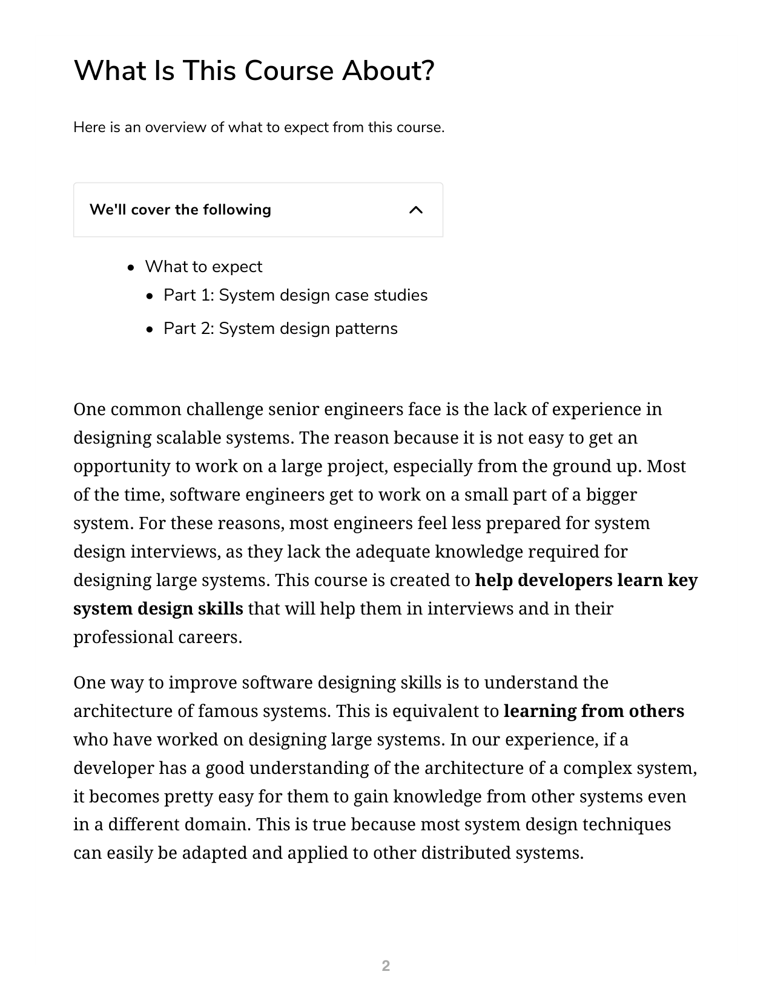
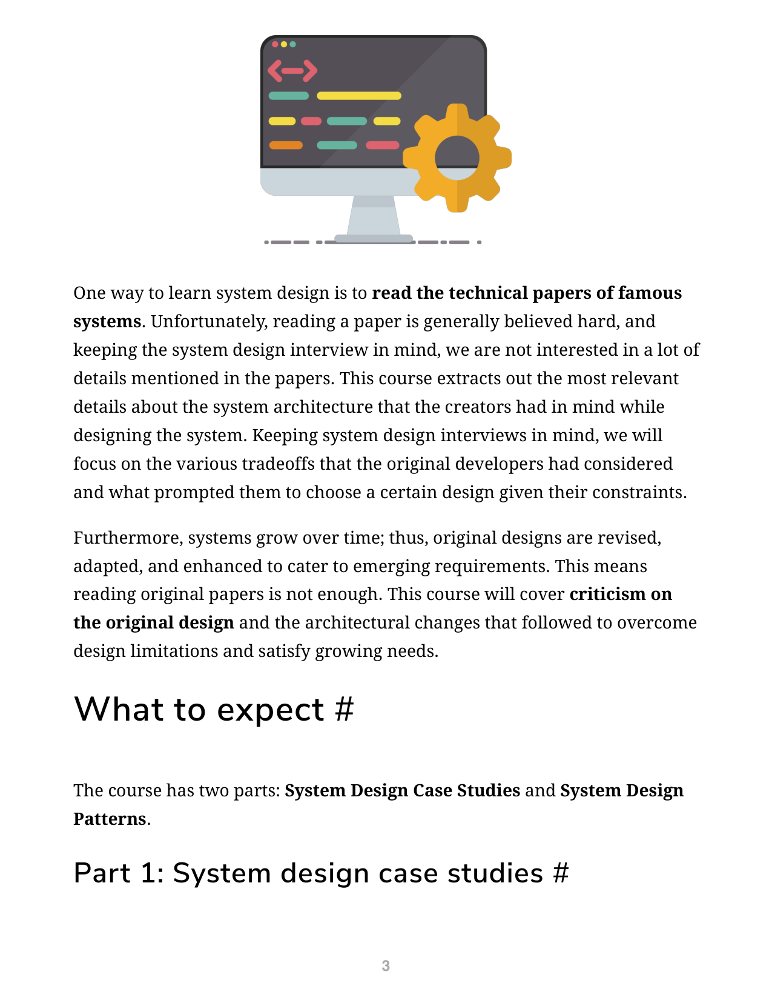

# 0 课程介绍

## 本课程概览

本课程旨在帮助高级工程师掌握设计可扩展系统的技能。许多工程师在系统设计面试中感到准备不足，因为他们缺乏设计大型系统的实战经验——大多数时候，软件工程师只负责大型系统中的一小部分。本课程通过剖析经典分布式系统的架构设计，帮助开发者建立系统设计的核心能力。

### 学习路径

本课程分为两大部分：

**第一部分：系统设计案例研究**

我们将深入分析以下精选分布式系统的架构：

1. **Dynamo 键值存储**：[[Dynamo]]——Amazon 的高可用键值存储。Dynamo 是一个完全去中心化的分布式键值存储系统，在 Amazon 内部用于购物车、畅销榜单、销售排名等只需主键访问的服务。它的设计影响力巨大，启发了许多 NoSQL 数据库。
2. **Cassandra 宽列 NoSQL 数据库**：[[Cassandra]] 和 [[BigTable]]——Cassandra 结合了 Dynamo 的分布式特性和 BigTable 的列式数据模型，是一个高性能、高可用的宽列数据库。
3. **Kafka 分布式消息系统**：[[Kafka]]——Apache 开源的高吞吐量分布式消息系统，广泛用于日志聚合、流处理和事件驱动架构。
4. **Chubby 分布式锁服务**：[[Chubby]]——Google 内部的分布式锁和协调服务，用于 GFS 和 BigTable 等系统的领导者选举和配置存储。
5. **GFS 分布式文件系统**：[[GFS]]（Google File System）——Google 为其大规模数据处理应用设计的分布式文件系统。
6. **HDFS 分布式文件系统**：[[HDFS]]——受 GFS 启发的 Hadoop 分布式文件系统，是大数据生态系统的核心组件。
7. **BigTable 宽列存储**：[[BigTable]]——Google 的分布式结构化数据存储系统，用于支撑 Google 搜索、地图、Gmail 等核心产品。
8. **系统设计模式**：覆盖 20 种分布式系统的常见设计模式。

**第二部分：系统设计模式**

我们将介绍一组分布式系统中常见的设计问题及其解决方案。这些"系统设计模式"可应用于各类分布式系统，在系统设计面试中尤为实用：

| 模式 | 用途 |
|------|------|
| [[预写日志]]（Write-ahead Logging） | 保证数据持久性和一致性 |
| [[布隆过滤器]]（Bloom Filters） | 高效集合成员查询 |
| [[心跳]]（Heartbeat） | 节点存活检测 |
| [[仲裁]]（Quorum） | 分布式一致性决策 |
| [[校验和]]（Checksum） | 数据完整性校验 |
| [[租约]]（Lease） | 分布式锁与授权 |
| [[脑裂]]（Split Brain） | 分区容忍性与一致性 |
| 共 20 种模式 | 详见第 8 章 |

### 阅读建议

本课程的最佳学习方式是**从论文中提取最相关的架构细节**，而非通读原始论文。我们将聚焦于原作者在设计系统时的各种权衡考量，以及特定约束下选择特定方案的原因。例如，为什么 Amazon 的 Dynamo 选择了最终一致性而非强一致性？为什么 Google 的 Chubby 选择了粗粒度锁而非细粒度锁？理解这些权衡比记住具体实现更重要。

此外，系统会随时间演化——原始设计被修订、适配和增强以满足新兴需求。本课程也将涵盖对原始设计的批评及其后的架构改进，帮助读者了解系统设计的活力和演化过程。

祝学习愉快！

---

## 选择题

1. 本课程第一部分的重点是什么？
   a. 学习编程语言基础
   b. 分析经典分布式系统的架构设计
   c. 练习算法题
   d. 学习数据库管理

2. Dynamo 属于 CAP 定理中的哪一类？
   a. CP 系统（一致性和分区容忍性）
   b. AP 系统（可用性和分区容忍性）
   c. CA 系统（一致性和可用性）
   d. 以上都不是

3. 以下哪个不是本课程涵盖的分布式系统？
   a. Dynamo
   b. Cassandra
   c. MySQL
   d. Kafka

4. 系统设计模式部分涵盖了多少种模式？
   a. 10
   b. 15
   c. 20
   d. 25

5. 本课程的学习方法是什么？
   a. 通读全部原始论文
   b. 只关注最终系统实现
   c. 聚焦架构细节和设计权衡
   d. 只学习编程实现

**答案**
1. b
2. b
3. c
4. c
5. c
