# 1 Dynamo：如何设计键值存储

## Dynamo 简介

### 目标

设计一个**高可用**（即可靠）、**高可扩展**且**完全去中心化**的分布式键值存储系统。

### 什么是 Dynamo？

[[Dynamo]] 是 Amazon 为其内部服务开发的高可用键值存储。Amazon 的许多服务——如购物车、畅销榜单、销售排名、产品目录等——只需要对数据进行主键访问。多表关系型数据库对这些服务来说过于笨重，还会限制可扩展性和可用性。Dynamo 提供了灵活的设计，让应用可以根据需求选择所需的可用性和一致性水平。

Dynamo（不要与受其启发的 [[DynamoDB]] 混淆）是一个分布式键值存储系统，在超大规模下提供"始终在线"（高可用）体验。用 [[CAP 定理]] 的术语来说，Dynamo 属于 AP 系统（可用性和分区容忍性），以牺牲强一致性为代价换取高可用和分区容忍性。

设计 Dynamo 的核心动机来自一个观察：**系统的可用性与服务的客户数量直接相关**。即使系统不完美，只要对客户可用，就能带来更高的客户满意度。而不一致性问题可以在后台解决，大多数时候客户并不会察觉。基于这一核心原则，Dynamo 激进地优化了可用性。

Dynamo 的设计极具影响力，启发了许多 NoSQL 数据库，如 [[Cassandra]]、Riak 和 Voldemort——当然也包括 Amazon 自己的 DynamoDB。

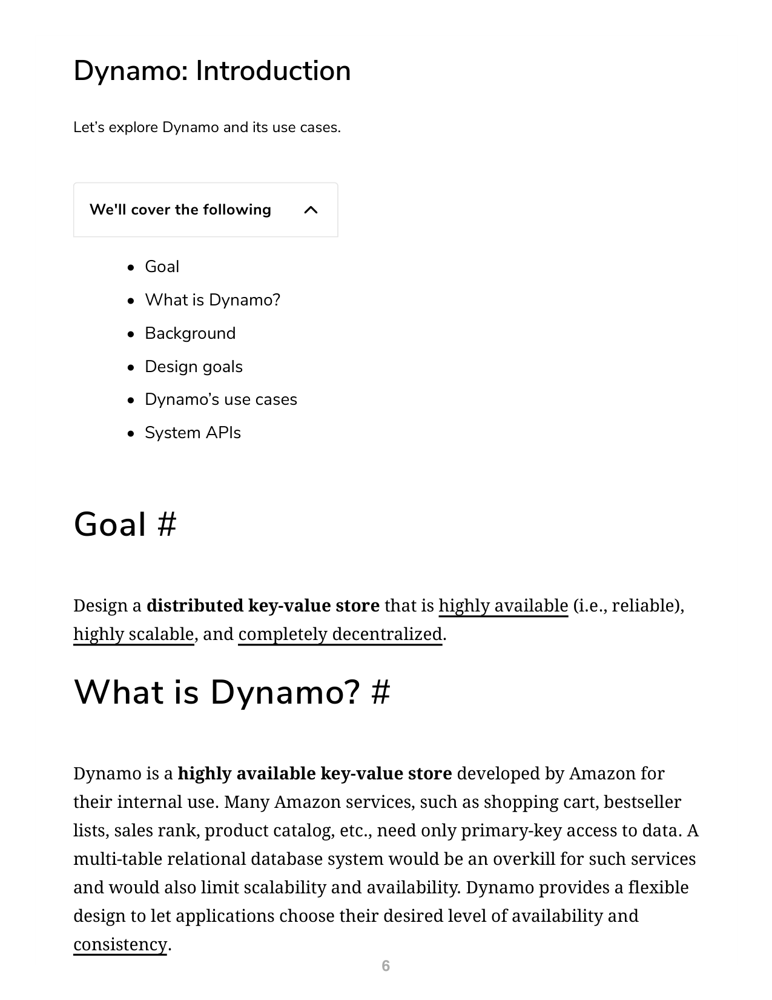

### 设计目标

- **可扩展**：系统应高度可扩展，添加机器即可获得接近线性的性能提升
- **去中心化**：避免单点故障和性能瓶颈，不应存在中央/领导者进程
- **最终一致性**：数据通过乐观复制实现最终一致性，在读取时解决不一致问题

### Dynamo 的用例

Dynamo 默认是最终一致性数据库，适用于不强要求强一致性的应用。虽然 Dynamo 也能支持强一致性，但会有性能损耗。Amazon 将 Dynamo 用于具有极高可靠性需求、需要精细控制可用性/一致性/成本效益/性能权衡的服务。

### 系统 API

Dynamo 客户端使用 `put()` 和 `get()` 操作来读写数据：

- **`get(key)`**：找到给定 key 所在的节点，返回单个对象或带有冲突版本的列表，以及一个 context（包含版本等元数据）
- **`put(key, context, object)`**：找到 key 应存储的节点，将对象写入磁盘。context 由 `get()` 返回并在 `put()` 时传回，用于验证对象有效性

Dynamo 将 key 和 object 都视为任意字节数组（通常小于 1MB）。它使用 MD5 哈希算法对 key 生成 128 位标识符，用于确定负责存储的节点。

---

## 高层架构

Dynamo 本质上是一个**分布式哈希表**（DHT），数据在集群中复制以实现高可用和容错。

| 问题 | 技术 | 优势 |
|------|------|------|
| 分区 | 一致性哈希 | 增量可扩展性 |
| 写入高可用 | 向量时钟 + 读取时协调 | 版本大小与更新速率解耦 |
| 临时故障处理 | 松弛仲裁 + 提示移交 | 副本不可用时的高可用和持久性保证 |
| 永久故障恢复 | Merkle 树反熵 | 后台同步分歧副本 |
| 成员管理与故障检测 | Gossip 协议 | 保持对称性，避免集中监控 |

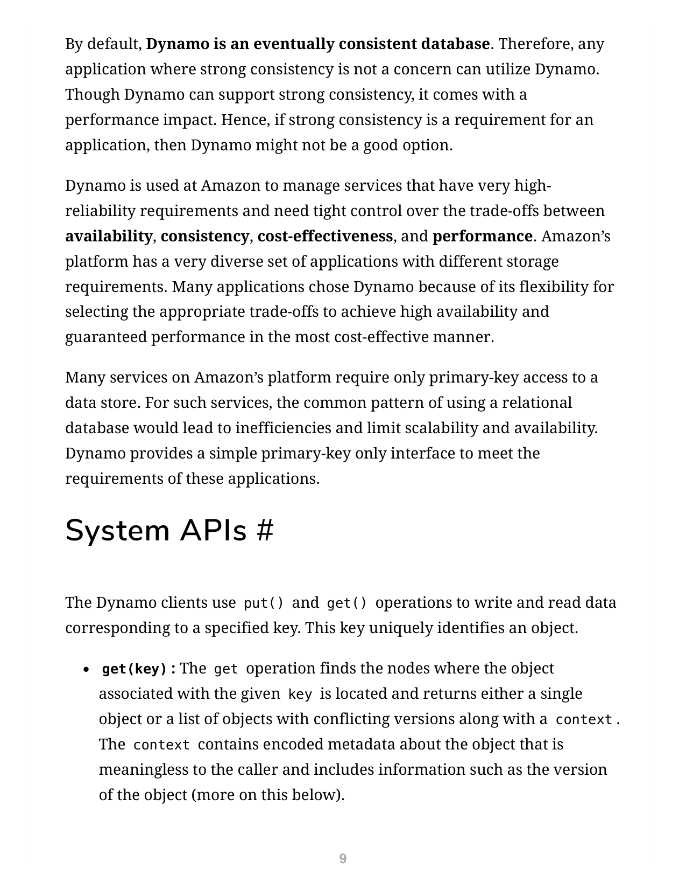

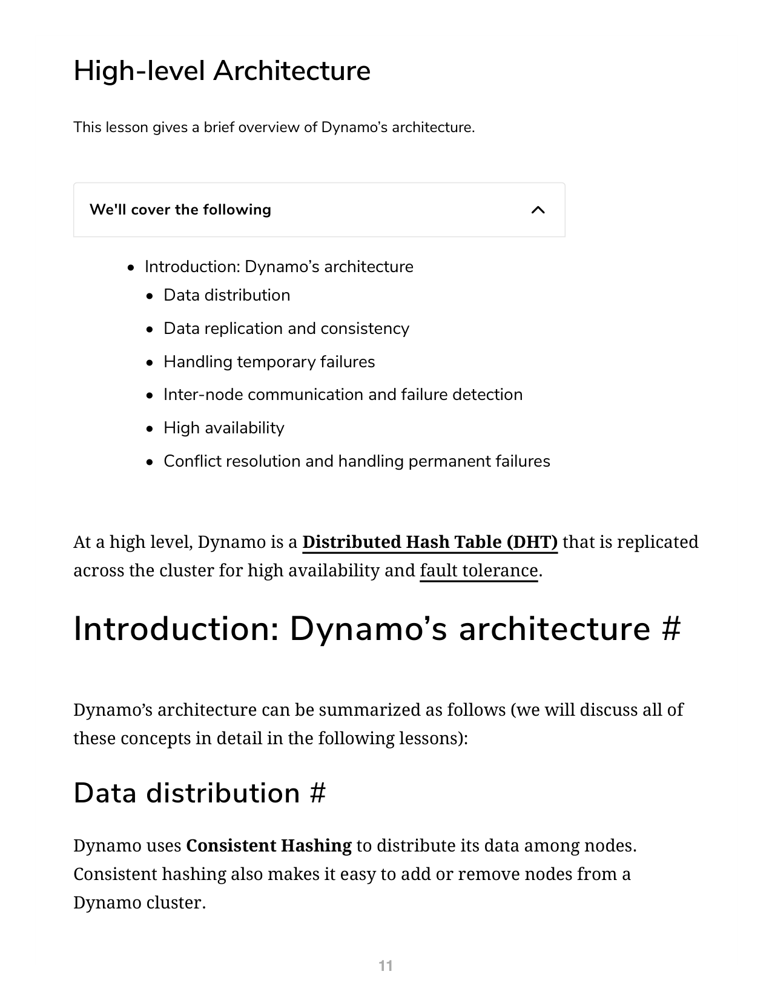

### 数据分布

Dynamo 使用[[一致性哈希]]在节点间分布数据。

### 数据复制与一致性

数据采用乐观复制，提供最终一致性。

### 临时故障处理

Dynamo 使用**松弛仲裁**（sloppy quorum）将数据复制到其他节点，而非严格多数仲裁。

### 节点间通信与故障检测

Dynamo 节点使用[[Gossip 协议]]跟踪集群状态。

### 高可用

Dynamo 通过[[提示移交]]（hinted handoff）使系统"始终可写"。

### 冲突解决与永久故障处理

- 使用[[向量时钟]]记录值的历史，在读取时协调分歧
- 使用 [[Merkle 树]]进行反熵（anti-entropy）以处理永久性故障

<!-- 图: page 11 - Dynamo 系统组件与数据流示意图 -->

---

## 数据分区

### 简单哈希的问题

一种朴素的方法是使用哈希函数将 key 映射到数字，然后对服务器总数取模。例如 `hash("California") % 5 = 2`。但这在添加或删除服务器时需要重新映射所有 key 和移动数据，代价巨大。

假设有 5 台服务器，现在需要增加到 6 台。取模哈希会导致几乎所有 key 被重新映射到不同的服务器，产生大量数据迁移。这种"突变式"的再平衡在大型生产系统中是不可接受的。

### 一致性哈希

Dynamo 使用一致性哈希来解决上述问题。一致性哈希将数据表示为环状结构，环上每个节点被分配一个数据范围。在 Dynamo 的术语中，范围的起始点称为**令牌**（token）。

当 Dynamo 处理 `put()` 或 `get()` 请求时，首先对 key 应用 MD5 哈希，输出决定数据落在哪个范围，从而确定数据存储在哪个节点。

一致性哈希的核心优势在于：添加或删除节点时，只影响环上相邻节点的数据映射，大多数 key 的映射关系保持不变。这使得集群的扩缩容操作轻量且可预测。

### 虚拟节点（Vnodes）

基本一致性哈希中每个物理节点分配单个令牌（或连续哈希范围），存在以下问题：

- **添加/删除节点**需要重新计算令牌，管理开销大
- **热点问题**：如果数据分布不均，某些节点可能成为热点
- **节点重建**：数据复制到固定数量的节点，重建时副本节点压力大

Dynamo 引入**虚拟节点**（Vnodes）解决这些问题：将哈希范围划分为多个更小的子范围，每个物理节点分配多个子范围。

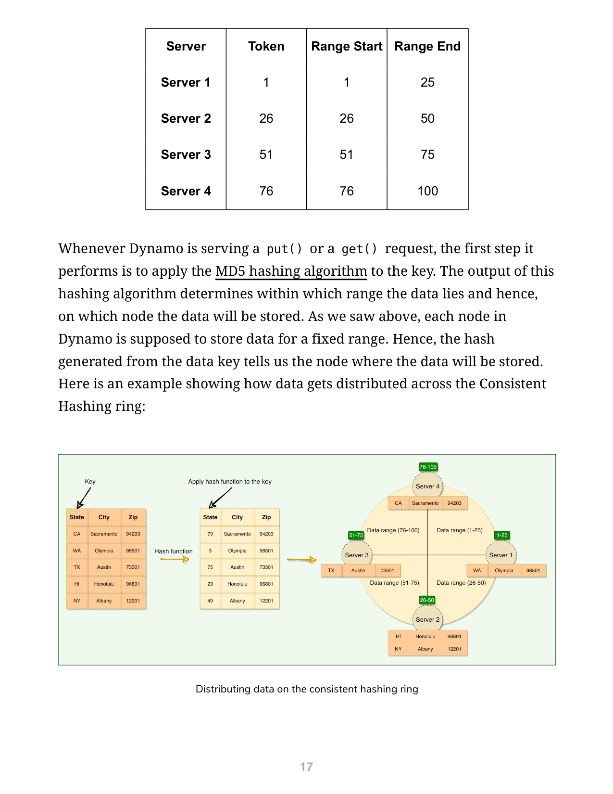

Vnodes 的优势：

1. **负载均衡**：Vnodes 在集群中随机分布，帮助均匀分散负载。添加或移除节点时加速再平衡
2. **异构机器支持**：强大的服务器可分配更多 Vnodes，性能较差的分配更少
3. **降低热点概率**：每个物理节点负责多个小范围，热点概率远低于单个大范围的方案

---

## 复制

### 乐观复制

为确保高可用和持久性，Dynamo 将每个数据项复制到系统中的 N 个节点（N 为可配置的复制因子）。每个 key 被分配给一个协调节点，协调节点先存储数据到本地，然后异步复制到环上顺时针方向的 N-1 个后继节点。这种复制技术称为**乐观复制**，意味着副本不保证在所有时刻都一致。

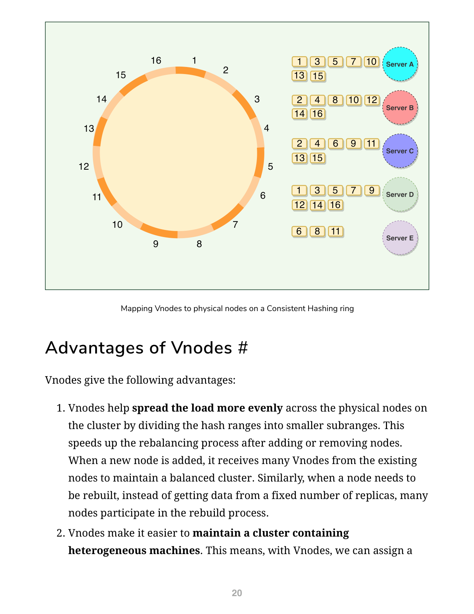

### 偏好列表

负责存储特定 key 的节点列表称为**偏好列表**（preference list）。列表包含多于 N 个节点以应对故障，并跳过虚拟节点确保只包含不同的物理节点。

### 松弛仲裁与临时故障处理

Dynamo 不使用严格的仲裁要求，而是使用**松弛仲裁**（sloppy quorum）。所有读写操作在偏好列表中的前 N 个健康节点上执行（这可能并非顺时针遇到的第一个 N 个节点）。

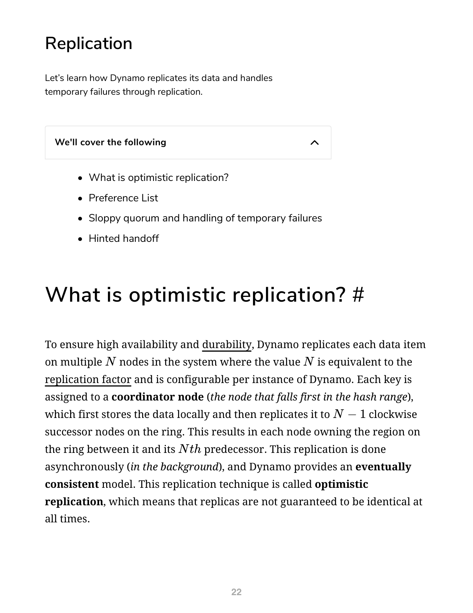

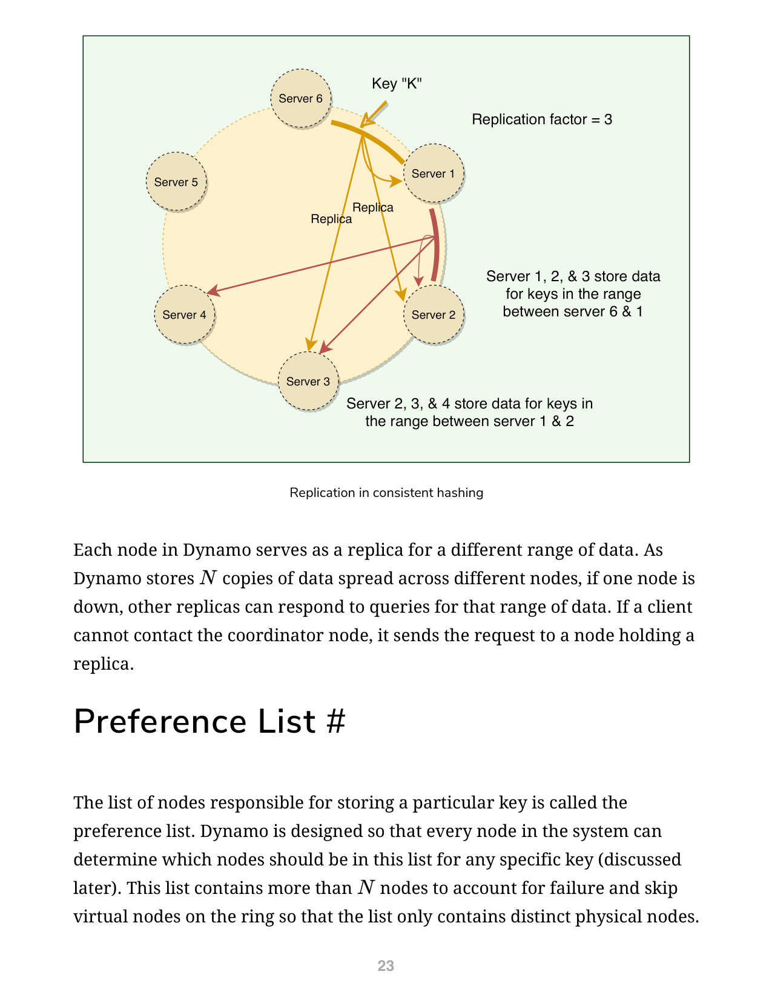

例如 N=3 时，如果 Server 1 临时宕机，其数据会写入 Server 4。Server 4 在元数据中标记提示（hint），标明真正的目标节点是 Server 1。当 Server 1 恢复后，Server 4 将副本交付给 Server 1 后删除本地副本。

### 提示移交（Hinted Handoff）

上述提高可用性的技术称为**提示移交**。当节点不可达时，其他节点代其接受写入，写入保存在本地缓冲区，目标节点恢复后发送过去。这使得 Dynamo"始终可写"——即使在极端情况下只有单个节点存活，写入请求也能被接受并最终处理。

由于松弛仲裁不是严格多数，数据会发生分歧——同一 key 的两个并发写入可能被不重叠的节点集合接受。Dynamo 允许这种情况，并使用向量时钟解决冲突。

<!-- 图: page 23 - 提示移交完整工作流程示意图 -->

---

## 向量时钟与冲突数据

### 时钟偏移问题

在单机上，使用绝对时钟时间即可判断写入顺序。但在分布式系统中，不同机器的时钟速率不同（时钟偏移），即使使用 NTP 也无法保证所有时钟始终同步。因此不能仅依赖墙钟时间戳。

### 向量时钟

Dynamo 使用**向量时钟**来捕获同一对象不同版本之间的因果关系。向量时钟本质上是一个 `（节点，计数器）` 对。

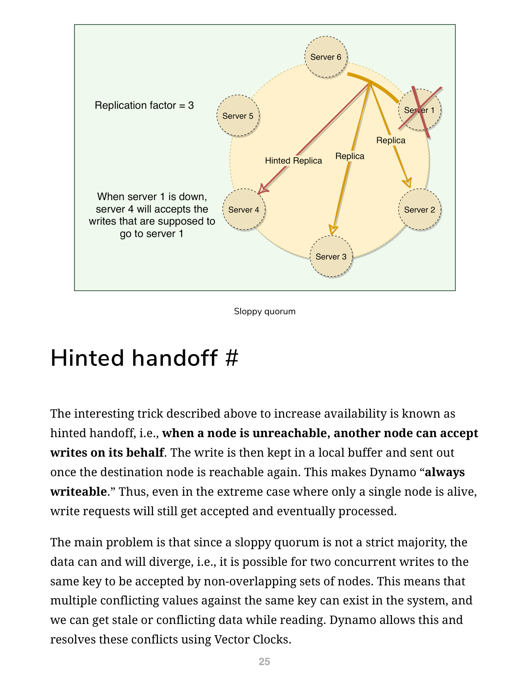

工作原理示例如下：

1. Server A 写入 key k1，值为 foo，版本为 [A:1]。复制到 Server B
2. Server A 再次写入 k1，值为 bar，版本为 [A:2]。复制到 Server B
3. 网络分区发生，A 和 B 无法通信
4. Server A 写入 k1，值为 baz，版本为 [A:3]（无法复制到 B）
5. Server B 写入 k1，值为 bax，版本为 [B:1]（无法复制到 A）
6. 网络恢复
7. 读取 k1 时，看到两个不同版本 [A:3] 和 [A:2][B:1]，无法判断哪个更新，返回两者让客户端解决

向量时钟过大时，Dynamo 会截断最旧的条目。如果截断了解决冲突所需的向量时钟，将无法达到最终一致性。Dynamo 的作者指出这是潜在问题，但在生产系统中尚未出现。

### 无冲突复制数据类型（CRDT）

处理冲突的更简单方法是使用 [[CRDT]]。我们需要以某种方式对数据建模，使并发更改以任意顺序应用都能产生相同的最终结果。Amazon 的购物车是 CRDT 的绝佳示例：用户添加两个商品 A 和 B 到购物车，这两个操作可以在任何节点以任意顺序执行，最终结果都是两个商品在购物车中。（从购物车中移除被建模为负向添加。）

### 最后写入者获胜（LWW）

将数据建模为 CRDT 并不容易。Dynamo 也提供服务器端自动解决冲突的策略：**最后写入者获胜**（LWW），基于墙钟时间戳。但 LWW 容易丢失数据：两个冲突写入同时发生时，相当于抛硬币决定丢弃哪个。

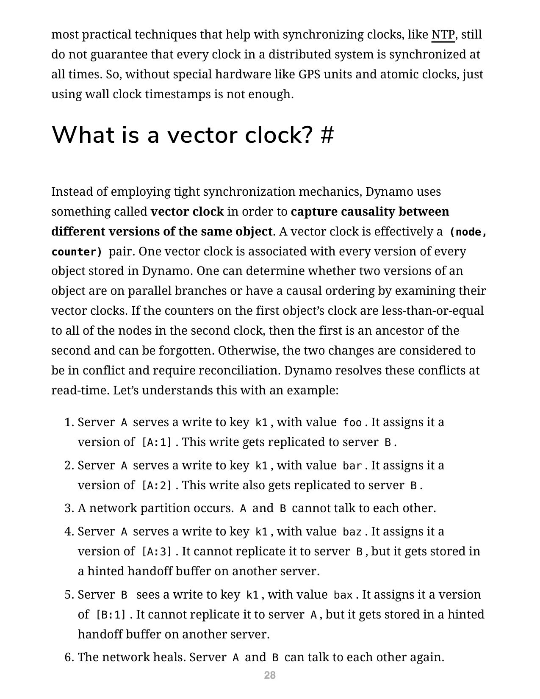

---

## put() 和 get() 操作的生命周期

### 协调节点的选择策略

Dynamo 客户端可选择两种策略：

1. **通过负载均衡器路由**：客户端不感知 Dynamo 环，有助于松耦合。但负载均衡器可能将请求转发到不在偏好列表中的节点，导致额外跳转
2. **分区感知客户端库**：客户端维护环的副本，直接转发到偏好列表中的合适节点，延迟更低。这种方式下 Dynamo 被称为零跳 DHT

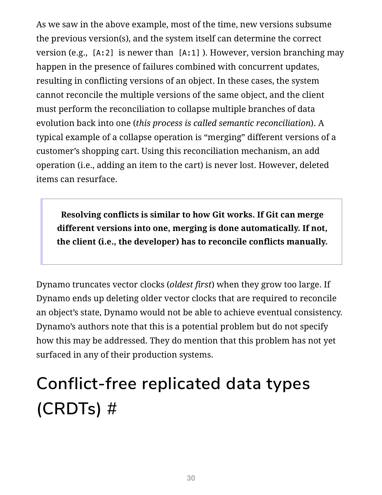

### 一致性协议

Dynamo 使用类似仲裁系统的一致性协议。设 R 为成功读取所需的最少节点数，W 为成功写入所需的最少节点数：

- **R + W > N** 产生类仲裁系统
- 常见配置 (N, R, W) = (3, 2, 2)
- (3, 3, 1)：写入快，读取慢，持久性不高
- (3, 1, 3)：读取快，写入慢，持久性高

`get()` 和 `put()` 操作的延迟取决于最慢的副本，因此 R 和 W 通常配置为小于 N 以提供更好的延迟。

### put() 流程

1. 协调节点生成新数据版本和向量时钟组件
2. 新数据保存在本地
3. 将写入请求发送给偏好列表中 N-1 个最高排名的健康节点
4. 收到 W-1 个确认后视为成功

### get() 流程

1. 协调节点从偏好列表中 N-1 个健康节点请求数据版本
2. 等待 R-1 个回复
3. 协调节点通过向量时钟处理因果数据版本
4. 返回所有相关数据版本给调用者

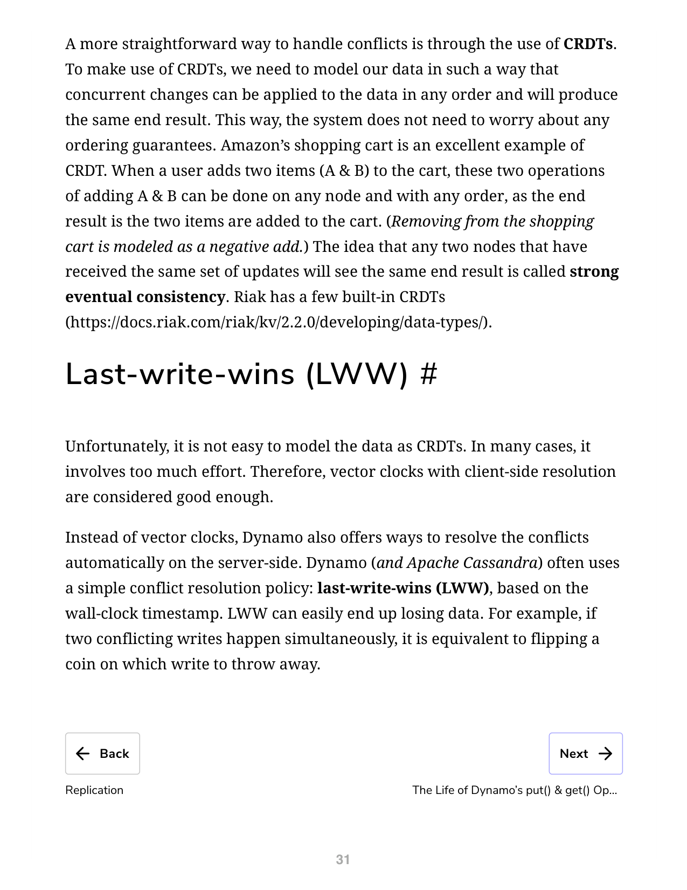

### 状态机

每个客户端请求在接收节点上创建一个状态机，包含识别节点、发送请求、等待响应、重试、处理回复和打包响应的全部逻辑。读取操作后，状态机会等待短暂时间以接收任何未完成的响应。如果返回了过期版本，协调节点会用最新版本更新那些节点——这个过程称为**读修复**（Read Repair）。

---

## 通过 Merkle 树进行反熵

当一个副本显著落后于其他副本时，仅使用向量时钟解决冲突可能需要很长时间。Dynamo 使用 [[Merkle 树]] 快速比较不同副本上的数据范围，找出差异部分。

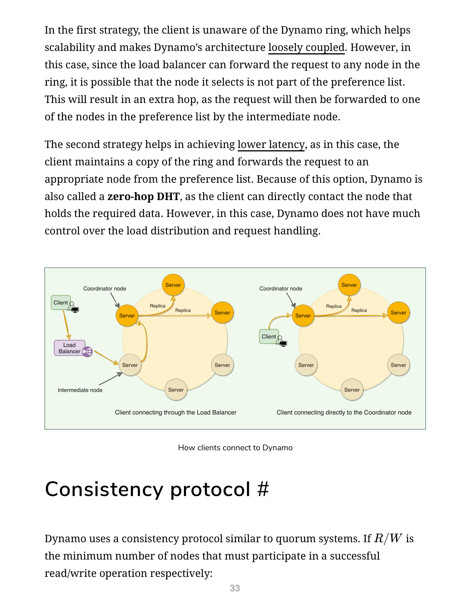

Merkle 树是哈希的二叉树，每个内部节点是其两个孩子哈希的哈希，每个叶节点是原始数据一部分的哈希。

比较 Merkle 树的概念很简单：
1. 比较两个树的根哈希
2. 如果相等，停止
3. 否则递归到左右子节点

最终，副本精确知道范围的哪些部分不同，交换的数据量被最小化。

**优点**：树的每个分支可独立检查，无需下载整棵树或整个数据集，最小化同步所需传输的数据量。

**缺点**：节点加入或离开时许多 key 范围可能变化，需要重新计算树。

---

## Gossip 协议

Dynamo 没有跟踪所有节点的中央节点，而是使用 [[Gossip 协议]]。每个节点每秒与其他随机节点交换状态信息（可达节点、负责的 key 范围等），本质上是在同步哈希环的副本。

Gossip 协议是点对点通信机制，节点周期性交换自身及其他已知节点的状态信息。任何新事件最终会传播到整个系统，所有节点快速了解集群中所有其他节点。

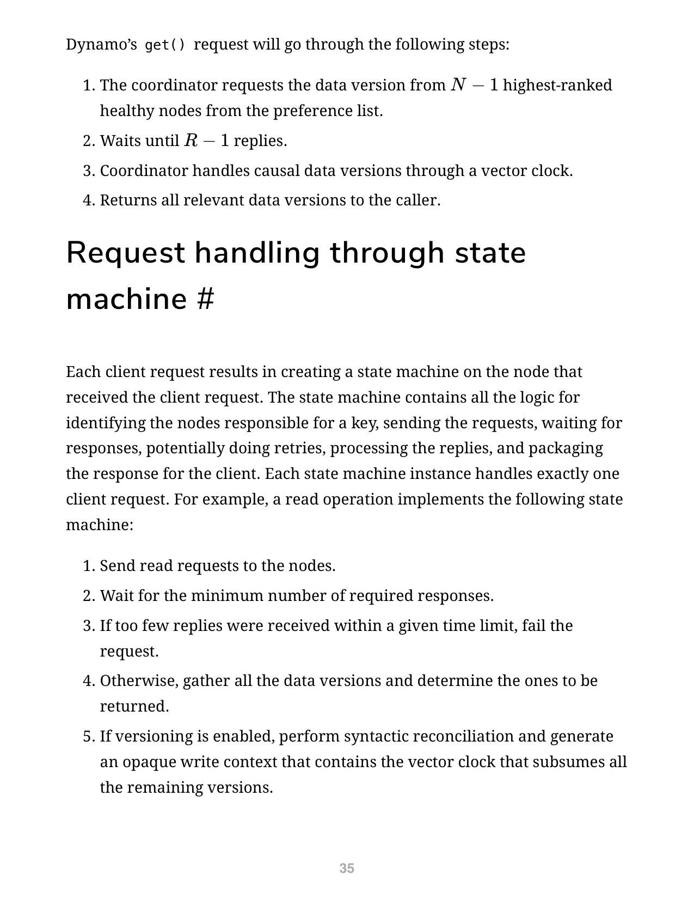

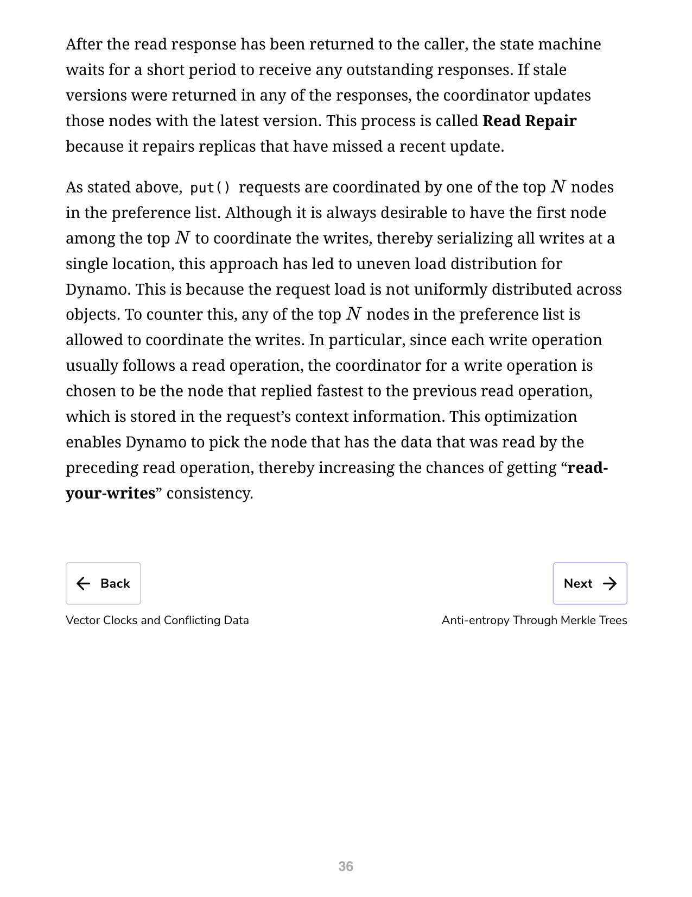

### 通过种子节点进行外部发现

为防止逻辑分区（如节点 A 和 B 先后加入环但彼此不知道对方），Dynamo 引入**种子节点**（seed nodes）。种子节点是完全功能的节点，可从静态配置或配置服务获取。每个节点通过 Gossip 协议与种子节点通信以协调成员变更，从而极大降低逻辑分区的可能性。

<!-- 图: page 36 - 种子节点引导示意图 -->

---

## Dynamo 特性与批评

### Dynamo 节点的职责

由于 Dynamo 完全去中心化，每个节点承担三个功能：
1. **管理 get() 和 put() 请求**：可作为协调节点或转发请求
2. **跟踪成员关系和检测故障**：使用 Gossip 协议跟踪其他节点及其哈希范围
3. **本地持久化存储**：根据应用需求使用不同存储引擎（BerkeleyDB、MySQL 或内存缓冲区）

### Dynamo 的特性

- **分布式**：可在大量机器上运行
- **去中心化**：无需中央协调器，所有节点对等
- **可扩展**：水平扩展，接近线性可扩展性
- **高可用**：即使节点或数据中心宕机，数据仍然可用
- **容错可靠**：数据复制到多个节点
- **可调一致性**：应用可调整可用性和一致性之间的权衡
- **持久化**：数据永久存储
- **最终一致性**：以强一致性换取高可用

### 对 Dynamo 的批评

1. **路由表膨胀**：每个节点包含完整路由表，节点增多时路由表不断增长，可能影响可扩展性
2. **对称性被破坏**：种子节点是特殊节点，可能违反对称性原则
3. **安全性不足**：Dynamo 为内部使用设计，未考虑安全问题
4. **泄漏抽象**：客户端应用需要处理不一致性，用户体验不完美（如购物车中商品不一致可能让用户认为网站有 Bug）

### 基于 Dynamo 原则的数据存储

- **Riak**：分布式 NoSQL 键值存储，高可用、可扩展、容错
- **Cassandra**：分布式 NoSQL 宽列数据库

两者对不同算法的采纳对比：

| 技术 | Cassandra | Riak |
|------|-----------|------|
| 一致性哈希 + 虚拟节点 | 支持 | 支持 |
| 提示移交 | 支持 | 支持 |
| Merkle 树反熵 | 支持 | 手动修复 |
| 向量时钟 | 支持 | LWW |
| Gossip 协议 | 支持 | 支持 |

---

## 总结

Dynamo 是一个 Amazon 为其内部使用开发的高可用键值存储，展示了业务需求如何驱动系统设计。Amazon 选择牺牲强一致性以换取更高可用性。

Dynamo 使用的一致性哈希算法自动在节点间分布数据，通过虚拟节点解决负载不均和热点问题。数据跨节点复制以实现容错和冗余，Dynamo 将写入复制到松弛仲裁而非严格多数仲裁。对于反熵和解决冲突，Dynamo 使用 Merkle 树。不同存储引擎可插入 Dynamo 的本地存储。Dynamo 使用 Gossip 协议进行节点间通信。通过提示移交使系统"始终可写"。Dynamo 的设计理念是"始终允许写入"——支持并发写入，即使由不同服务器执行，导致对象的多版本。Dynamo 尝试使用向量时钟跟踪和协调这些变更；当无法协调时，发送给客户端应用进行协调。

Dynamo 成功地将多种分布式技术（一致性哈希、反熵、Gossip、向量时钟、仲裁、Merkle 树）组合成一个复杂系统，仅供 Amazon 内部使用，因此未考虑安全问题。

### 使用的系统设计模式

| 问题 | 技术 | 优势 |
|------|------|------|
| 分区 | 一致性哈希 | 增量可扩展性 |
| 写入高可用 | 向量时钟 + 读取时协调 | 版本大小与更新速率解耦 |
| 临时故障处理 | 松弛仲裁 + 提示移交 | 副本不可用时的高可用和持久性保证 |
| 永久故障恢复 | Merkle 树反熵 | 后台同步分歧副本 |
| 成员管理与故障检测 | Gossip 协议 | 保持对称性，避免集中监控 |

---

## 选择题

1. Dynamo 使用什么算法在节点间分布数据？
   a. 取模哈希
   b. 一致性哈希
   c. 轮询调度
   d. 随机分配

2. 什么是提示移交（Hinted Handoff）？
   a. 将所有写入同步到所有节点
   b. 节点宕机时由其他节点代收写入，恢复后转发
   c. 从主节点复制数据
   d. 定期删除过期数据

3. Dynamo 如何处理冲突的写入？
   a. 丢弃所有冲突写入
   b. 使用向量时钟追踪版本，让客户端协调
   c. 始终使用最新时间戳
   d. 锁定数据直到写入完成

4. Dynamo 使用什么技术进行反熵（检测和修复副本间差异）？
   a. 一致性哈希
   b. Gossip 协议
   c. Merkle 树
   d. 提示移交

5. 以下哪项不是 Dynamo 的设计目标？
   a. 高可用
   b. 去中心化
   c. 强一致性
   d. 可扩展

**答案**
1. b
2. b
3. b
4. c
5. c
