# 3 Kafka：如何设计分布式消息系统

## 消息系统简介

### 目标

设计一个分布式消息系统，能够在不同实体之间可靠地传输高吞吐量的消息。

### 背景

分布式系统面临的一个常见挑战是处理来自多个来源的持续数据涌入。设想一个日志聚合服务，每秒从不同来源接收数百条日志条目。该服务需要将这些日志存储到共享服务器的磁盘上，并构建索引以便后续搜索。面临的挑战包括：

1. **消息突发处理**：如果服务每秒只能处理（缓冲）500 条消息，但开始接收到更高数量的消息会怎样？如果决定运行该日志聚合服务的多个实例，如何在这些实例之间分配工作？
2. **异构消息源**：产生（或消费）这些日志的来源需要约定通用协议和数据格式来发送日志消息，这导致生产者和消费者之间紧密耦合
3. **服务不可用**：当日志聚合服务宕机或无响应时，日志消息会怎样？

为了高效管理这些场景，分布式系统依赖**消息系统**。

### 什么是消息系统？

消息系统负责在服务、应用、进程或服务器之间传输数据。它通过提供发送方和接收方之间的异步消息传递，帮助解耦分布式系统的不同部分。因此，所有发送方（生产者）和接收方（消费者）只需关注数据/消息本身，无需关心数据共享的机制。

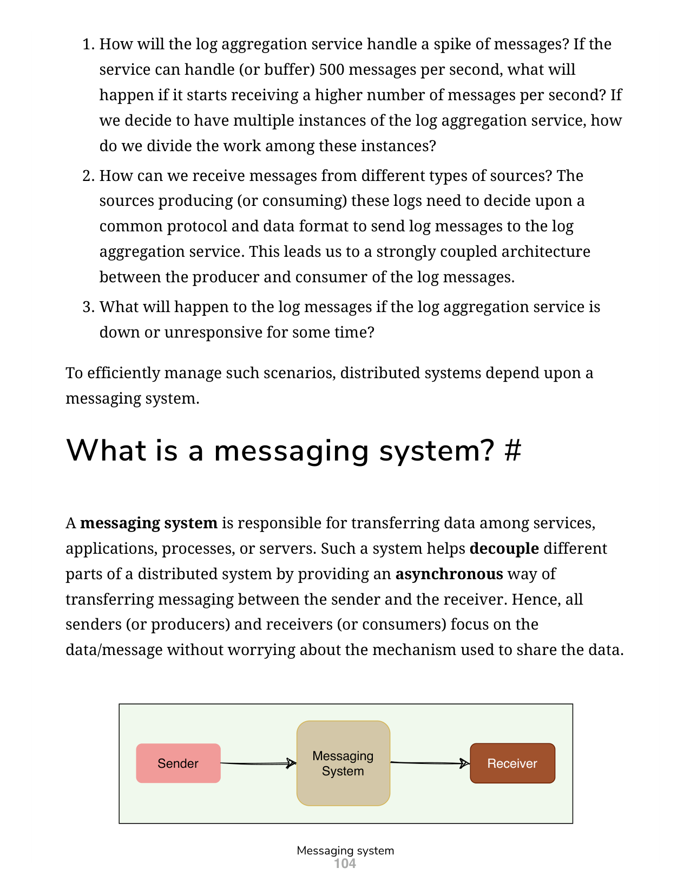

### 队列模式

在队列模型中，消息按顺序存储在队列中。生产者将消息推送到队列尾部，消费者从队列头部提取消息。

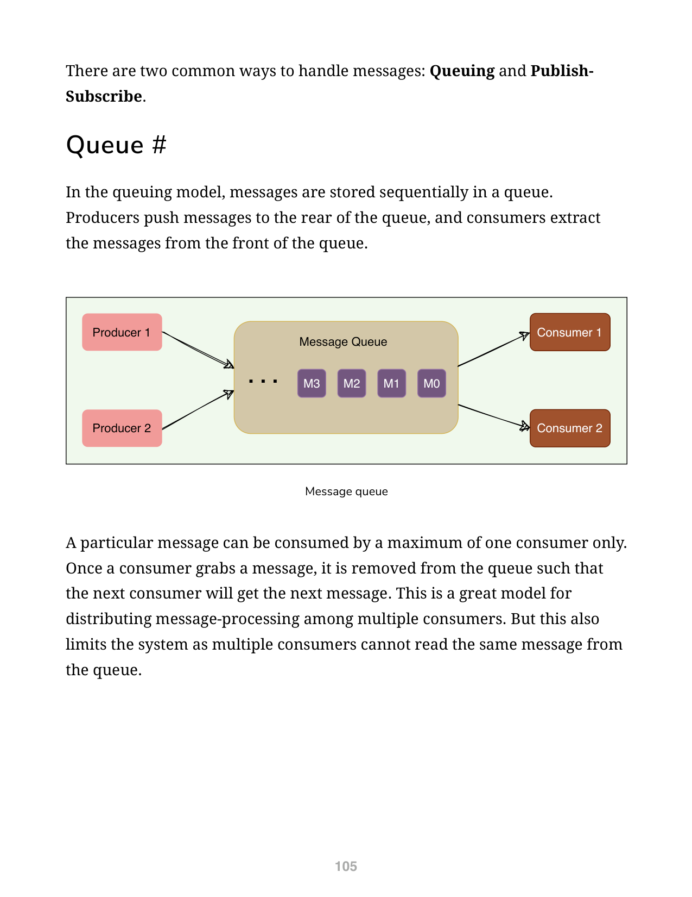

每条特定消息最多只能被一个消费者消费。一旦消费者获取了一条消息，该消息就会从队列中移除。这是将消息处理分布在多个消费者之间的优秀模型，但也限制了系统——多个消费者无法从队列中读取同一条消息。

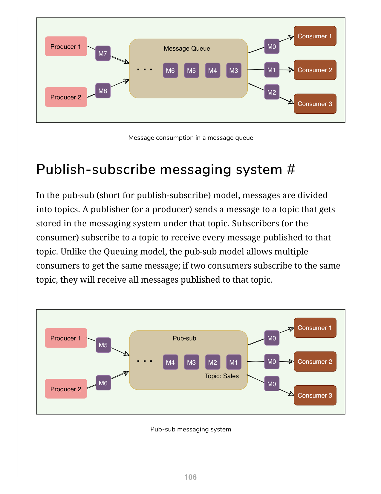

### 发布-订阅模式

在发布-订阅（pub-sub）模型中，消息被分为**主题**（Topic）。发布者（生产者）将消息发送到主题，消息存储在消息系统的该主题下。订阅者（消费者）订阅一个主题以接收发布到该主题的每一条消息。与队列模型不同，发布-订阅允许多个消费者获取同一条消息——如果两个消费者订阅了同一个主题，它们将收到发布到该主题的所有消息。

### 消息代理

存储和维护消息的系统组件通常称为**消息代理**（Message Broker）。它在数据生产者和消费者之间提供松耦合：

- 发布者将消息发布到代理
- 代理将消息存储到队列中
- 订阅者从代理读取消息

因此，订阅者和发布者无需同步。这种松耦合使订阅者和发布者能够以不同的速率读写消息。消息系统的存储能力提供了容错性，确保消息在生产到消费之间不会丢失。

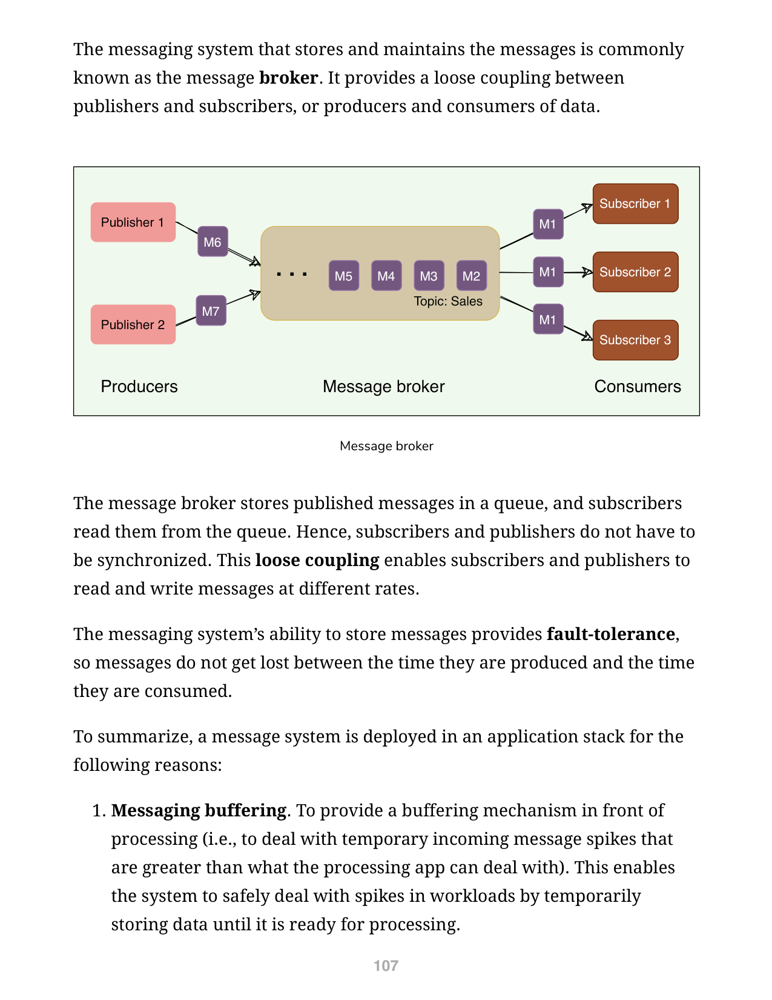

### 使用消息系统的原因

1. **消息缓冲**：在处理程序前提供缓冲机制，应对临时消息突发（尖峰）。系统可以安全地处理工作负载的突发，临时存储数据直到准备好处理
2. **消息投递保证**：允许生产者发布消息，确保即使消费应用在发布时无法接收，消息最终也会被投递
3. **抽象分离**：提供消息消费者与消息生产者之间的架构分离
4. **可扩展性**：提供灵活且高度可配置的架构，支持多生产者向多消费者投递消息

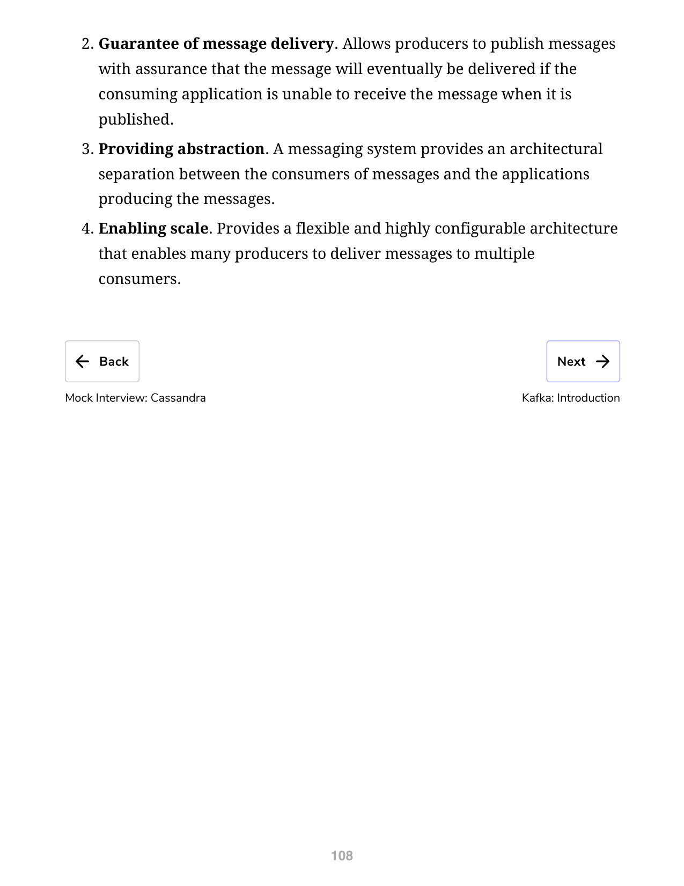

---

## Kafka 简介

### 什么是 Kafka？

[[Kafka]] 是 Apache 开源项目，基于发布-订阅模式的消息系统（Kafka 也可以作为消息队列工作，稍后会详细讨论）。它本身是分布式、持久化、容错且高度可扩展的。从根本上说，它是一个从称为生产者的应用程序接收消息流、将它们可靠地存储在中央集群（包含一组 Broker）上，并允许称为消费者的应用程序获取这些消息的系统。

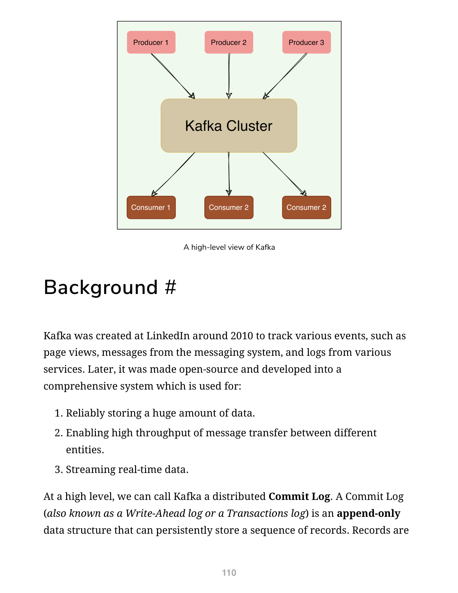

### 背景

Kafka 于 2010 年左右在 LinkedIn 创建，用于跟踪各种事件——如页面浏览量、消息系统中的消息以及来自各种服务的日志。后来它被开源并发展为一个综合性系统，用于：

1. 可靠存储海量数据
2. 在不同实体之间实现高吞吐量的消息传输
3. 流式处理实时数据

从高层看，我们可以将 Kafka 称为**分布式提交日志**（Distributed Commit Log）。提交日志（也称为[[预写日志]]或事务日志）是一种仅追加的数据结构，可以持久化存储记录序列。记录始终追加到日志末尾，一旦添加就无法删除或修改。从提交日志读取始终是从左到右（从旧到新）。

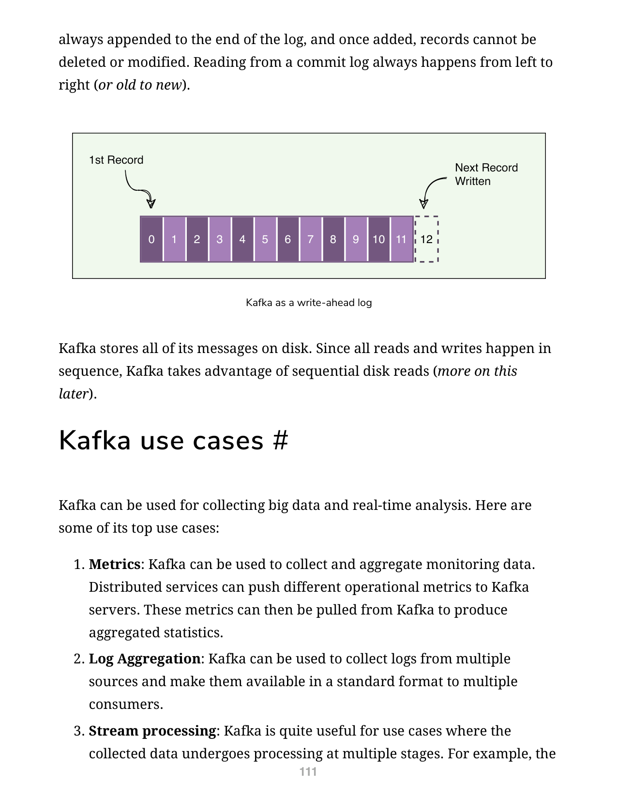

Kafka 将所有消息存储在磁盘上。由于所有读写都是顺序的，Kafka 充分利用了顺序磁盘读写的优势。

### Kafka 的用例

1. **指标收集**：Kafka 可用于收集和聚合监控数据。分布式服务可以将不同的运维指标推送到 Kafka 服务器，然后从 Kafka 拉取生成聚合统计
2. **日志聚合**：从多个来源收集日志，以标准格式提供给多个消费者
3. **流处理**：收集的数据经过多阶段处理。例如，从一个主题消费的原始数据经过转换、丰富或聚合后推送到新主题供进一步消费
4. **提交日志**：作为任何分布式系统的外部提交日志。分布式服务可以将事务记录到 Kafka，用于节点间的复制，在灾难恢复中帮助故障节点恢复状态
5. **网站活动跟踪**：Kafka 最初的用例之一。用户活动如页面点击、搜索等发布到 Kafka 的不同主题，供实时处理、监控或加载到 Hadoop/数据仓库
6. **产品推荐**：跟踪每个消费者行为（搜索查询、产品点击、停留时间等），消费应用读取消息找到关联产品实时展示，或批处理生成推荐邮件

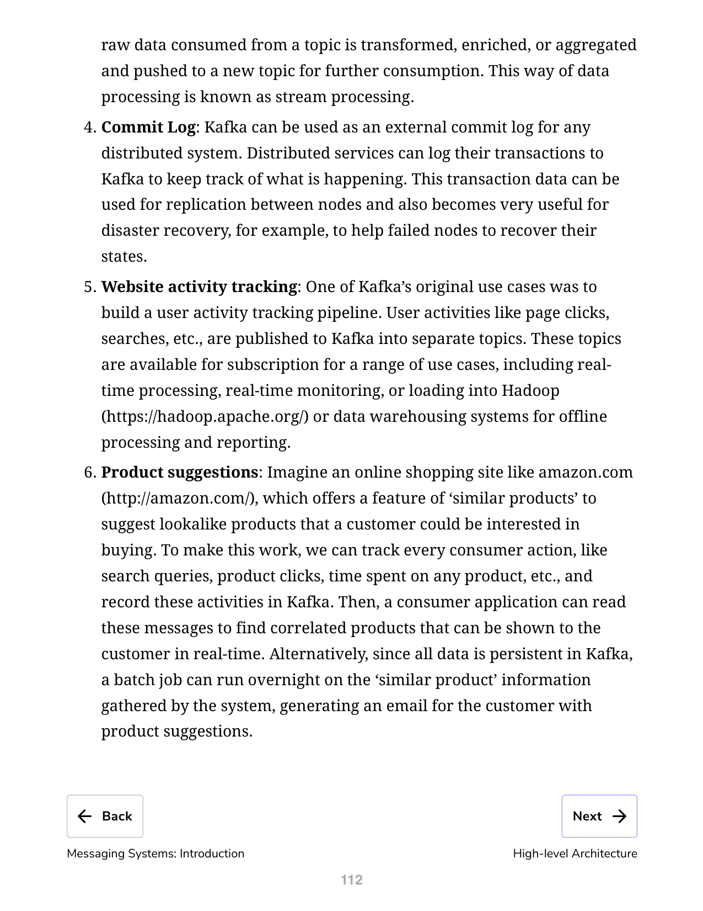

---

## 高层架构

### 基本术语

**Broker**：Kafka 服务器也称为 Broker。Broker 负责可靠存储生产者提供的数据，并使其可供消费者使用。

**记录（Record）**：存储在 Kafka 中的消息或事件。本质上是从生产者经过 Kafka 到消费者传输的数据。记录包含键、值、时间戳和可选的元数据头（Headers）。

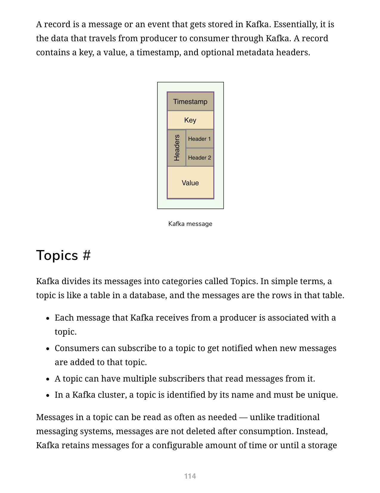

**主题（Topic）**：Kafka 将消息分为称为"主题"的类别。简单来说，主题就像数据库中的表，消息是表中的行。Kafka 从生产者收到的每条消息都与一个主题关联。消费者可以订阅主题以在有新消息时收到通知。主题可以有多个订阅者。主题名称在集群中必须唯一。

与传统消息系统不同，消息在消费后不会被删除。相反，Kafka 将消息保留**可配置的时间**或**超过存储大小**。Kafka 的性能在数据大小上实际上是恒定的，因此长时间存储数据完全没有问题。

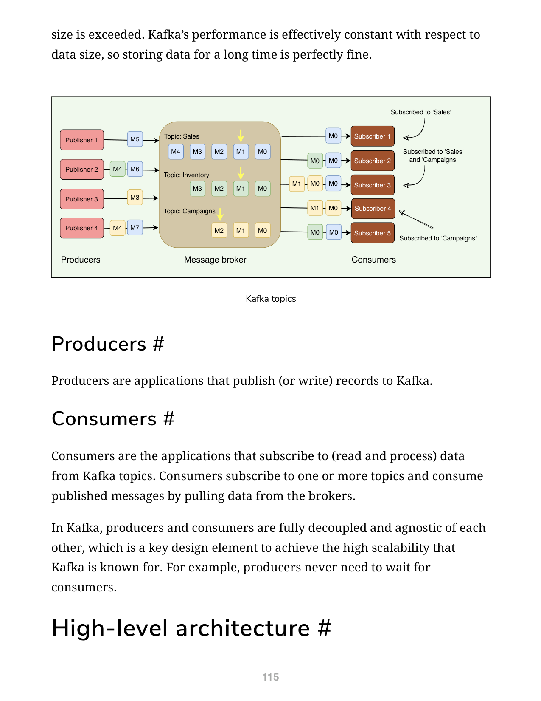

**生产者（Producer）**：向 Kafka 发布（写入）记录的应用程序。

**消费者（Consumer）**：订阅（读取和处理）来自 Kafka 主题的数据的应用程序。消费者订阅一个或多个主题，通过从 Broker 拉取数据来消费发布的消息。

在 Kafka 中，生产者和消费者完全解耦且互不感知——这是 Kafka 实现高可扩展性的关键设计。例如，生产者从不需要等待消费者。

### Kafka 集群

Kafka 作为由一台或多台服务器组成的集群运行，每台服务器负责运行一个 Kafka Broker。

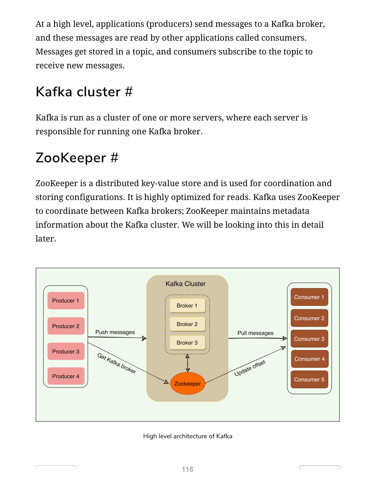

### ZooKeeper

[[ZooKeeper]] 是一个分布式键值存储，用于协调和存储配置。它高度优化了读取性能。Kafka 使用 ZooKeeper 来协调 Kafka Broker 之间的协作；ZooKeeper 维护关于 Kafka 集群的元数据信息。我们稍后将详细讨论。

---

## Kafka 深入

到目前为止，我们已经讨论了 Kafka 的核心概念。现在让我们深入了解 Kafka 的工作流程。

### 主题分区

Kafka 主题是分区的，意味着一个主题分布在多个"片段"上。每个分区可以放在单独的 Kafka Broker 上。当新消息发布到主题时，它被追加到该主题的某个分区。生产者根据数据控制将消息发布到哪个分区。例如，生产者可以决定与特定"城市"相关的所有消息都进入同一个分区。

本质上，分区是有序的消息序列。生产者不断向分区追加新消息。Kafka 保证分区内的所有消息按到达顺序存储。**消息的顺序性只在分区级别维护，不跨主题**。

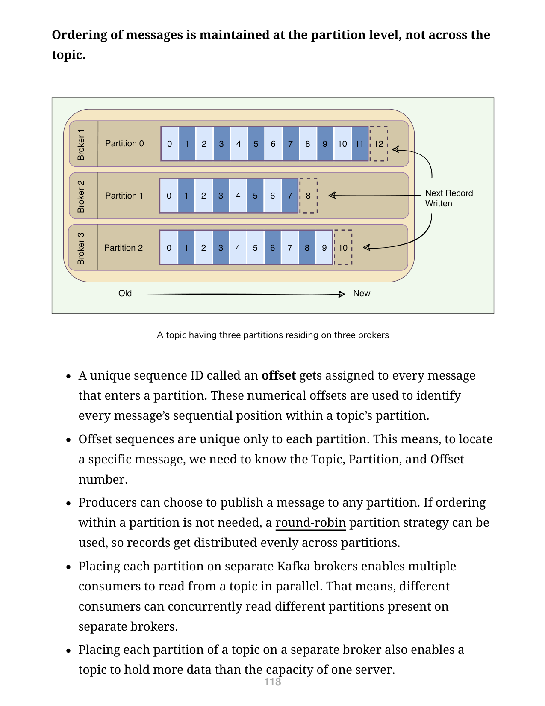

每条消息进入分区时被分配一个唯一的序列 ID，称为**偏移量**（Offset）。这些数字偏移量用于标识消息在主题分区中的顺序位置。

**偏移量序列在每个分区内是唯一的**。这意味着要定位特定消息，需要知道：**主题、分区和偏移量**。

**分区关键特性**：

- 生产者可以选择将消息发布到任一分区。如果不需要分区内排序，可以使用轮询策略均匀分布记录
- 将每个分区放在单独的 Kafka Broker 上，使多个消费者能够**并行读取**——不同消费者可以并发读取不同 Broker 上的不同分区
- 将主题的每个分区放在单独的 Broker 上，使主题能够存储超过单个服务器容量的数据
- 消息一旦写入分区就**不可变**，不能更新
- 生产者可以为消息添加"键"，Kafka 保证相同键的消息写入同一分区
- 每个 Broker 管理属于不同主题的一组分区

Kafka 遵循**哑 Broker、智能消费者**的原则。这意味着 Kafka 不跟踪消费者读取了什么记录。相反，消费者自己轮询 Kafka 获取新消息，并说明想读取哪些记录。这使得消费者可以随意增减偏移量，从而能够重放和重新处理消息。消费者可以从特定的偏移量开始读取，也可以选择从任意偏移量读取。这也使消费者可以在任何时间点加入集群。

每个主题可以复制到多个 Kafka Broker 以实现容错和高可用。每个主题分区有一个 Leader Broker 和多个副本（Follower）Broker。

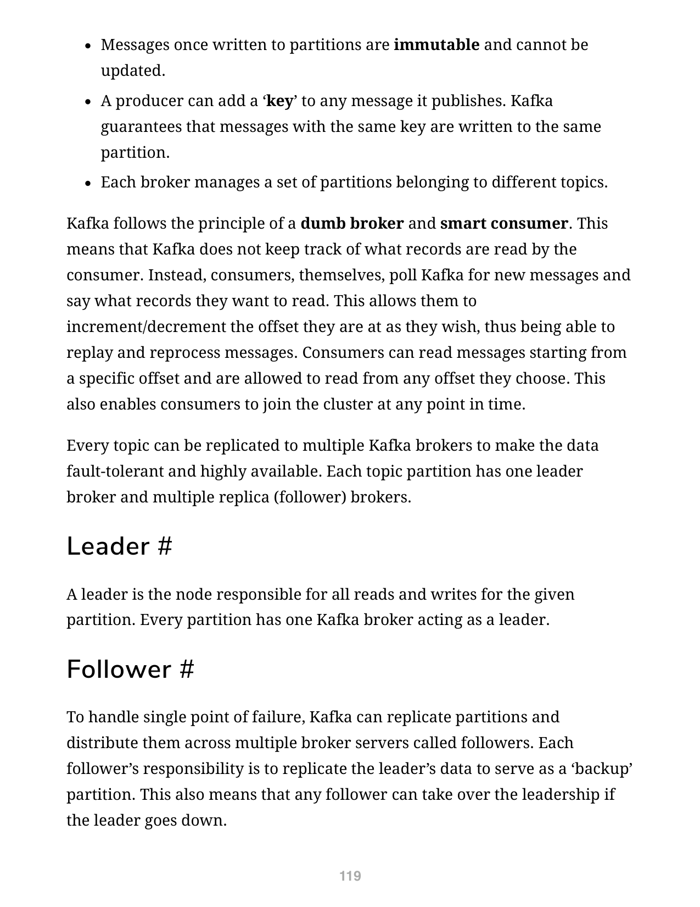

### Leader

Leader 是负责给定分区所有读写操作的节点。每个分区有一个 Kafka Broker 作为 Leader。

### Follower

为了处理单点故障，Kafka 可以复制分区并将其分布在多个称为 Follower 的 Broker 服务器上。每个 Follower 的职责是复制 Leader 的数据作为"备份"分区。这也意味着如果 Leader 宕机，任何 Follower 都可以接替领导权。

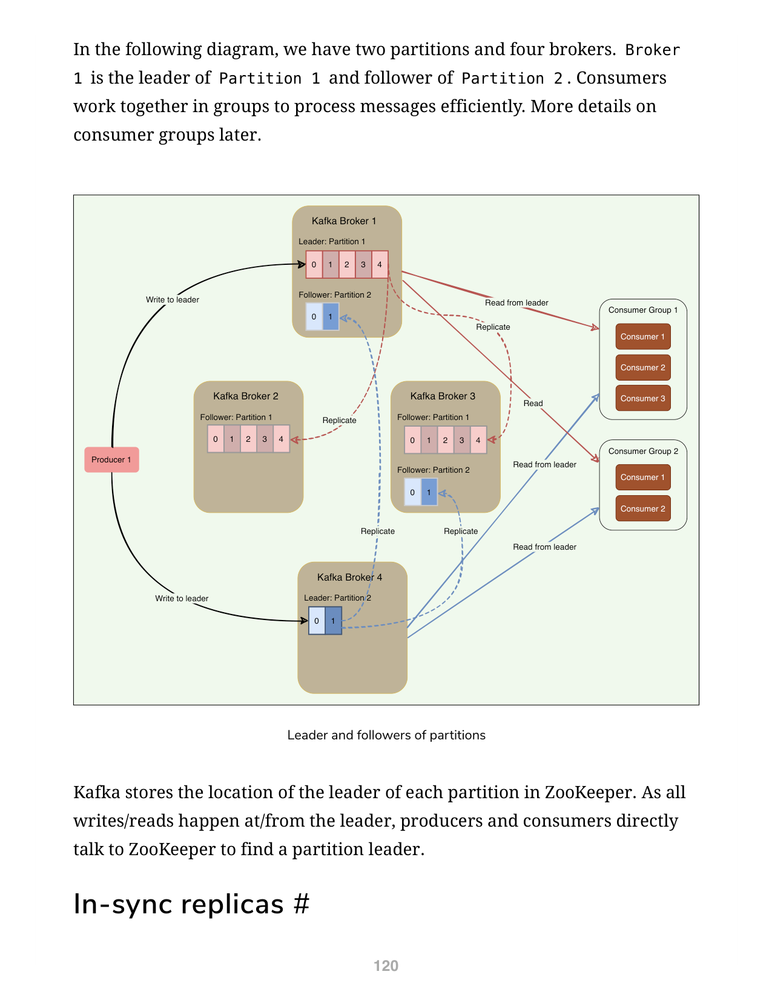

Kafka 将每个分区 Leader 的位置存储在 ZooKeeper 中。由于所有读写都在 Leader 上进行，生产者和消费者直接与 ZooKeeper 通信以找到分区 Leader。

### 同步副本（ISR）

[[ISR]]（In-Sync Replica）是拥有特定分区最新数据的 Broker。Leader 始终是 ISR。Follower 只有在完全跟上所跟随的分区时才被视为 ISR。换句话说，ISR 不能落后于给定分区的最新记录。只有 ISR 才有资格成为分区 Leader。Kafka 可以选择消费者读取数据前所需的最小 ISR 数量。

### 高水位

为确保数据一致性，Leader Broker 从不返回（暴露）尚未复制到最少数 ISR 的消息。为此，Broker 跟踪**高水位**（[[高水位|High-Water Mark]]），即特定分区所有 ISR 共享的最高偏移量。Leader 只暴露高水位偏移量之前的数据，并将高水位偏移量传播给所有 Follower。

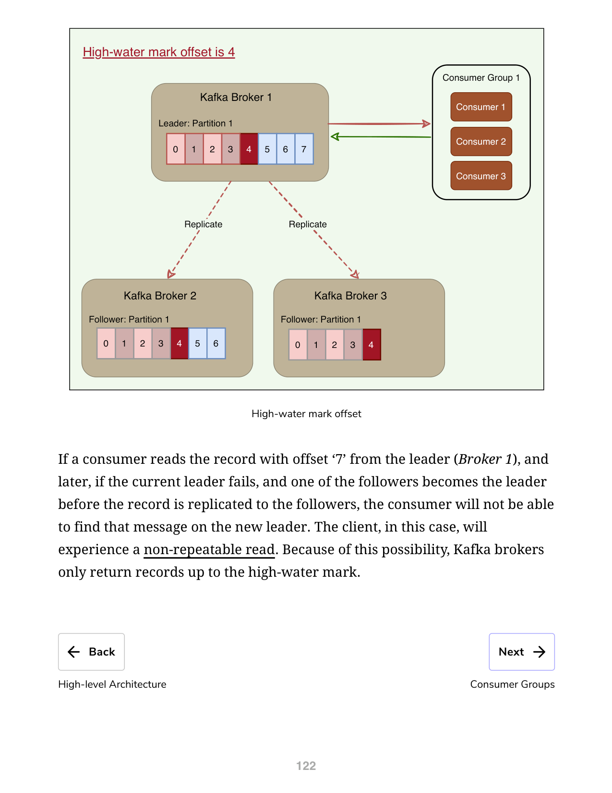

原因如下：如果消费者从 Leader 读取了偏移量 7 的消息，但该消息尚未复制到 Follower，然后 Leader 发生故障，Follower 成为新 Leader。消费者将无法在新 Leader 上找到该消息，导致**不可重复读取**。因此，Kafka Broker 只返回高水位之前的记录。

---

## 消费者组

### 什么是消费者组？

消费者组是**一组并行协作消费主题分区消息的消费者**。消息在组内所有消费者之间平均分配，不会有两个消费者收到同一条消息。

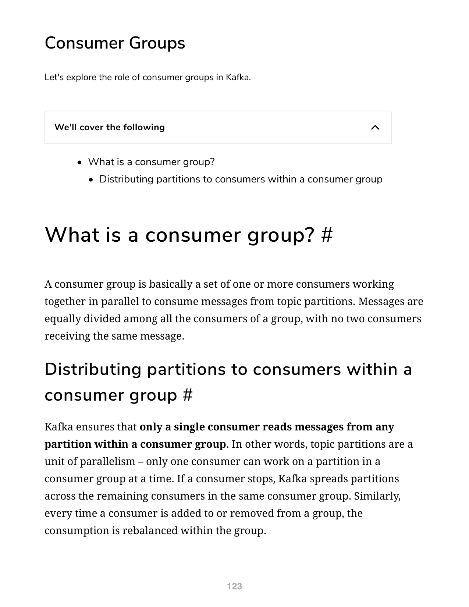

### 分区在消费者组内的分配

Kafka 确保一个消费者组内，每个分区只由一个消费者读取。换句话说，**主题分区是并行度的单位**——一个消费者组内，一个分区同时只能由一个消费者处理。如果某个消费者停止，Kafka 会将分区分配给同一消费者组中的其他消费者。类似地，每次消费者加入或离开组时，组内都会触发消费再平衡。

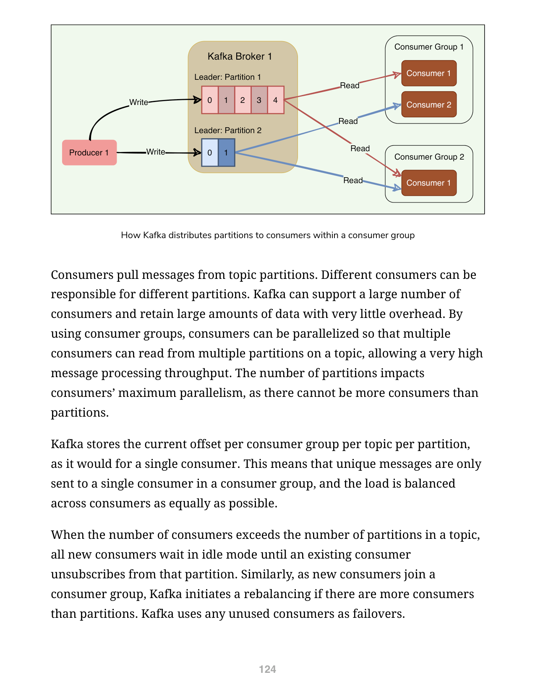

消费者从主题分区**拉取**消息。不同的消费者可以负责不同的分区。Kafka 可以支持大量消费者并以极低的开销保留大量数据。通过使用消费者组，消费者可以被并行化，使多个消费者能够读取一个主题的多个分区，实现非常高的消息处理吞吐量。**分区数量影响消费者的最大并行度**——消费者不能超过分区数量。

Kafka 存储每个消费者组每个主题每个分区的当前偏移量。这意味着唯一的消息只发送给消费者组中的一个消费者，并且负载尽可能均衡地在消费者之间分配。

当消费者数量超过主题分区数时，所有新消费者将处于空闲等待状态，直到现有消费者取消订阅该分区。类似地，当新消费者加入消费者组时，如果消费者数量超过分区数，Kafka 会启动再平衡。Kafka 使用任何空闲消费者作为故障接管。

**总结：**

- 消费者数 = 分区数：每个消费者消费一个分区
- 消费者数 > 分区数：部分消费者空闲
- 消费者数 < 分区数：部分消费者消费多于一个分区

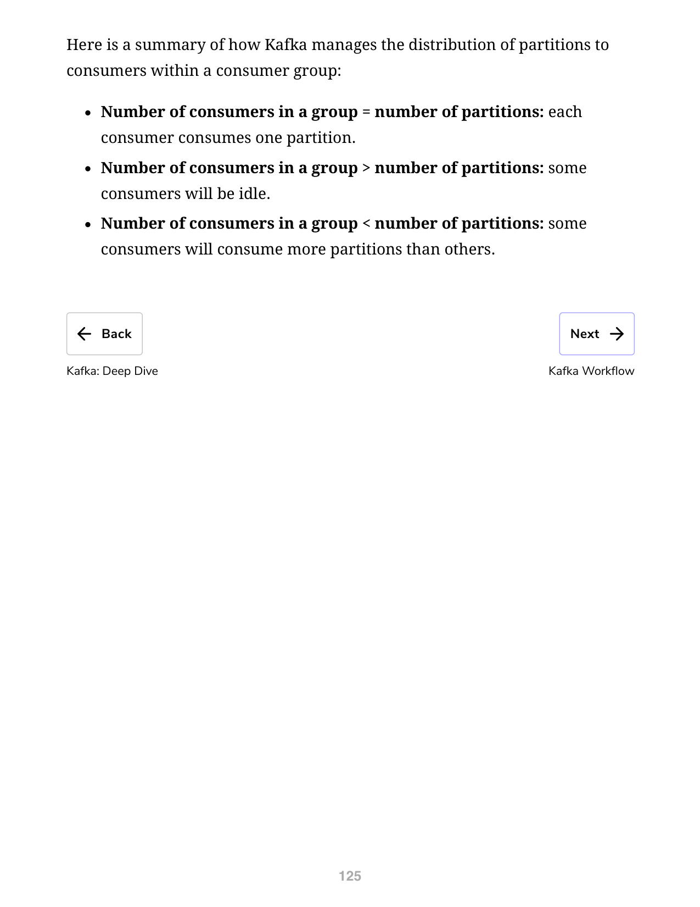

---

## Kafka 工作流程

### 发布-订阅模式工作流程

Kafka 提供发布-订阅和基于队列的消息系统，具有快速、可靠、持久化、容错和零停机等特点。两种模式下，生产者只需将消息发送到主题。以下是发布-订阅模式的分步工作流程：

1. 生产者向主题发布消息
2. Kafka Broker 将消息存储在该主题配置的分区中。如果生产者未指定分片，Broker 确保消息在分片之间均匀共享
3. 消费者订阅特定主题
4. 消费者订阅主题后，Kafka 将提供该主题的当前偏移量给消费者，并在 ZooKeeper 中保存该偏移量
5. 消费者定期向 Kafka 请求新消息
6. Kafka 收到生产者消息后，将这些消息转发给消费者
7. 消费者接收并处理消息
8. 消息处理完成后，消费者向 Kafka Broker 发送确认
9. 收到确认后，Kafka 递增偏移量并在 ZooKeeper 中更新。由于偏移量维护在 ZooKeeper 中，即使在 Broker 故障期间，消费者也能正确读取下一条消息
10. 上述流程重复直到消费者停止发送请求
11. 消费者可以随时回退/跳转到主题的所需偏移量，读取所有后续消息

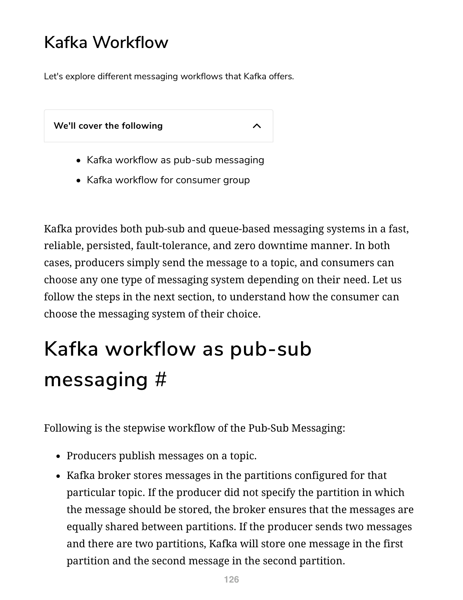

### 消费者组模式工作流程

不是单个消费者，而是来自一个消费者组的消费者组订阅一个主题，消息在它们之间共享：

1. 生产者向主题发布消息
2. Kafka 将所有消息存储在该主题配置的分区中，与前述类似
3. 单个消费者订阅特定主题，假设 Topic-01，组 ID 为 Group-1
4. Kafka 与消费者的交互方式与发布-订阅相同，直到新消费者订阅同一主题 Topic-01，组 ID 为 Group-1
5. 新消费者到达后，Kafka 切换到**共享模式**，每条消息只传递给 Group-1 消费者组的一个订阅者。这种消息传递类似于基于队列的消息传递——组内的一个消费者消费一条消息。与基于队列的消息传递不同，消息消费后不会被删除
6. 这种消息传递可以持续直到消费者数量达到该主题配置的分区数
7. 当消费者数量超过分区数时，新消费者将不会收到任何消息，直到现有消费者取消订阅。这是因为 Kafka 中的每个消费者将被分配至少一个分区。一旦所有分区分配给现有消费者，新消费者必须等待

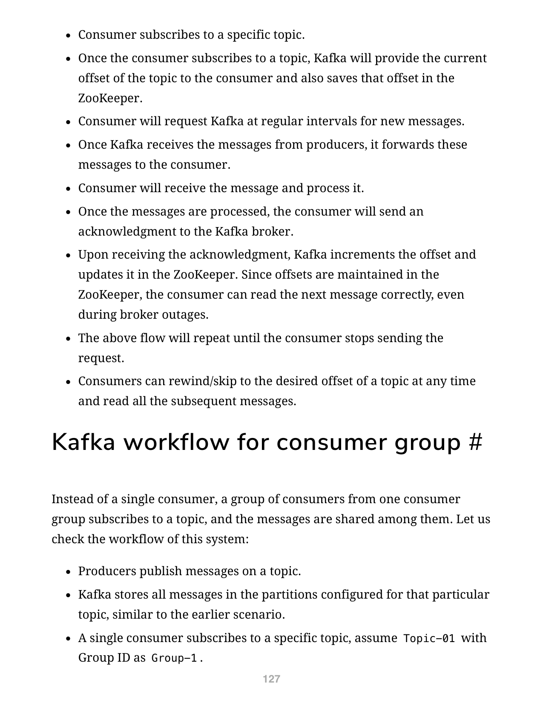

---

## ZooKeeper 的角色

### 什么是 ZooKeeper？

Apache Kafka 的一个关键依赖是 Apache ZooKeeper，它是一个分布式配置和同步服务。ZooKeeper 充当 Kafka Broker、生产者和消费者之间的协调接口。Kafka 在 ZooKeeper 中存储基本元数据，如 Broker 信息、主题、分区、分区 Leader/Follower、消费者偏移量等。

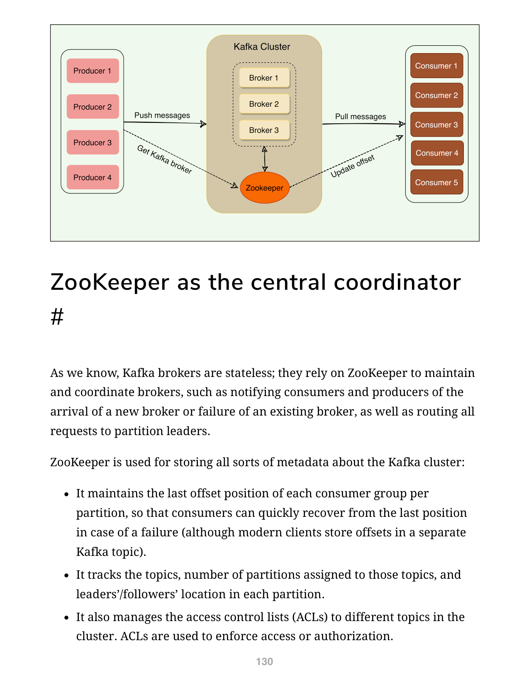

### ZooKeeper 作为中央协调器

Kafka Broker 是无状态的——它们依赖 ZooKeeper 来维护和协调 Broker，例如通知消费者和生产者新 Broker 的到达或现有 Broker 的故障，以及将所有请求路由到分区 Leader。

ZooKeeper 用于存储关于 Kafka 集群的各种元数据：

- 维护每个消费者组在每个分区的最后偏移位置，以便消费者在故障时快速从最后位置恢复（虽然现代客户端将偏移量存储在单独的 Kafka 主题中）
- 跟踪主题、分配给这些主题的分区数以及每个分区中 Leader/Follower 的位置
- 管理集群中不同主题的访问控制列表（ACL），用于强制执行访问或授权

### 生产者和消费者如何找到分区 Leader？

在旧版 Kafka 中，所有客户端（生产者和消费者）直接与 ZooKeeper 通信以找到分区 Leader。Kafka 已经摆脱了这种耦合，在新版 Kafka 中，客户端直接从 Kafka Broker 获取元数据信息；Broker 再与 ZooKeeper 通信以获取最新元数据。

以下步骤展示生产者发布消息前的流程：

1. 生产者连接到任意 Broker，询问"Partition 1"的 Leader
2. Broker 回复负责"Partition 1"的 Leader Broker 的标识
3. 生产者连接到 Leader Broker 以发布消息

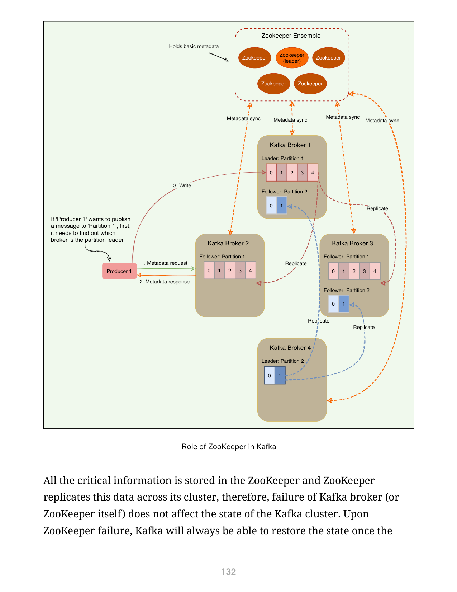

所有关键信息都存储在 ZooKeeper 中，ZooKeeper 在其集群中复制这些数据。因此，Kafka Broker（或 ZooKeeper 本身）的失败不会影响 Kafka 集群的状态。ZooKeeper 失败后，一旦 ZooKeeper 重新启动，Kafka 始终能够恢复状态。ZooKeeper 还负责在 Leader 发生故障时协调 Kafka Broker 之间的分区 Leader 选举。

---

## 控制器 Broker

### 什么是控制器 Broker？

在 Kafka 集群中，一个 Broker 被选举为**控制器**（Controller）。控制器 Broker 负责管理操作：

- 创建/删除主题
- 添加分区
- 分配分区 Leader
- 监控 Broker 故障
- 将分区 Leader 选举结果通知系统中的其他 Broker

此外，控制器定期检查系统中其他 Broker 的健康状况。如果它没有收到特定 Broker 的响应，它会执行故障转移到另一个 Broker。

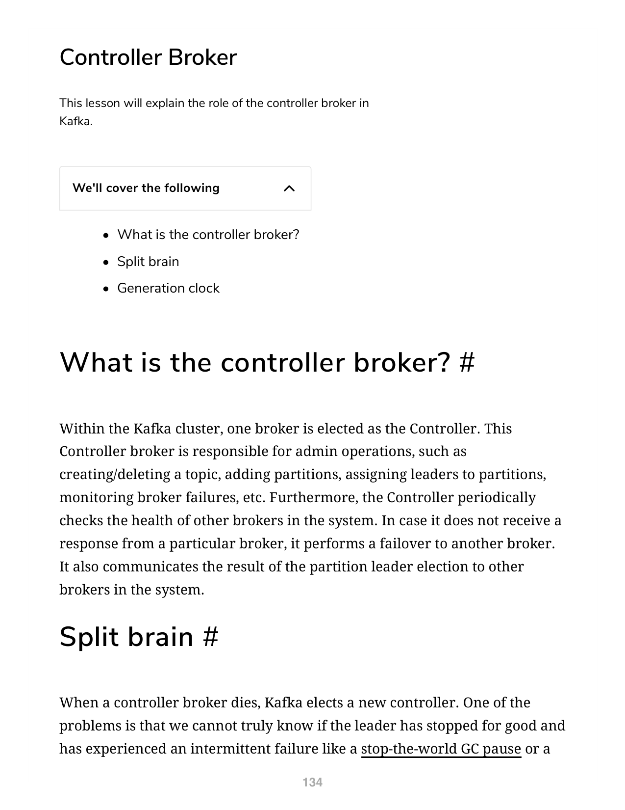

### 脑裂

当控制器 Broker 宕机时，Kafka 会选举新控制器。问题在于我们无法真正知道 Leader 是永久停止了还是出现了间歇性故障（如 Stop-the-World GC 暂停或临时网络中断）。尽管如此，集群必须继续前进并选出新控制器。如果原控制器只是间歇性故障，集群将出现所谓的**僵尸控制器**。

僵尸控制器可定义为之前被集群认定死亡现已恢复的控制器节点。另一个 Broker 已经取代了它的位置，但僵尸控制器可能还不知道。这种分布式系统中存在两个或多个活跃控制器（或中央服务器）的常见场景称为[[脑裂]]。

在脑裂情况下，我们将有两个控制器并行发出可能冲突的命令。如果在集群中发生这种情况，可能导致重大的数据不一致。

### 世代时钟

脑裂通常使用**世代时钟**解决，这只是一个单调递增的数字，用于表示服务器的"代"。在 Kafka 中，世代时钟通过**时代号**（Epoch Number）实现。如果旧 Leader 的时代号为"1"，新 Leader 将为"2"。每个从控制器发送到其他 Broker 的请求都包含此时代号。

这样，Broker 可以通过简单地信任具有最高编号的控制器来轻松区分真正的控制器。具有最高编号的控制器无疑是最近的，因为时代号始终递增。这个时代号存储在 ZooKeeper 中。

---

## 消息投递语义

### 生产者投递语义

生产者只写入 Leader Broker，Follower 异步复制数据。生产者如何知道数据已成功存储在 Leader 上？Kafka 提供三个选项来表示在生产者认为写入成功之前必须收到记录的 Broker 数量：

**异步（Async）**：生产者向 Kafka 发送消息后不等待服务器的确认。这意味着发送请求的瞬间就认为写入成功。这种"发后即忘"的方法提供了最佳性能——可以以网络速度写入数据，但无法保证服务器已收到记录。

**提交到 Leader**：生产者等待 Leader 的确认。这确保数据已在 Leader 上提交——比"异步"选项慢，因为数据必须写入 Leader 的磁盘。在此场景下，Leader 将响应而不等待 Follower 的确认。如果 Leader 在确认给生产者后、Follower 复制之前崩溃，记录将丢失。

**提交到 Leader 和仲裁**：生产者等待 Leader 和仲裁的确认。这意味着 Leader 将等待完整的 ISR 集合确认记录。这将是最慢的写入方式，但只要至少一个 ISR 存活，就能保证记录不会丢失。这是最强的保证。

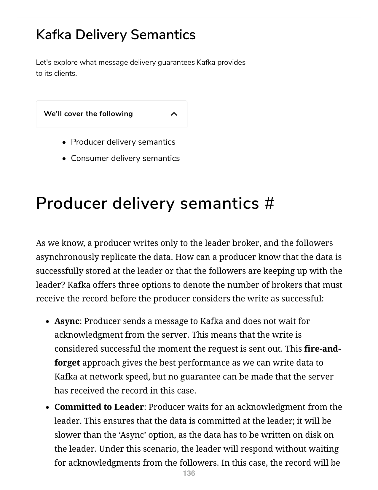

这些选项使我们能够配置持久性和性能之间的权衡：

- 如果要确保记录安全存储在 Kafka 中，必须选择最后一种——提交到 Leader 和仲裁
- 如果更看重延迟和吞吐量而非持久性，可以选择前两种选项

### 消费者投递语义

消费者只能读取已写入 ISR 集合的消息。有三种提供一致性的方式：

**至多一次（At-most-once）**：消息最多投递一次。在此选项下，消费者收到消息后立即将偏移量提交（递增）给 Broker。如果消费者在处理完消息之前崩溃，该消息将丢失——因为消费者重启后将从最后提交的偏移量开始读取下一条消息。

**至少一次（At-least-once）**：消息不会丢失但可能重复投递。消费者从 Kafka 接收到消息后，不立即提交偏移量，而是等待处理完成。如果消费者在处理消息后、提交偏移量前崩溃，重启后必须重新读取消息。因为消费者从未向 Broker 提交偏移量，Broker 会重新投递同一条消息。因此此场景下可能发生重复消息投递。

**恰好一次（Exactly-once）**：每条消息只投递一次且仅一次。除非消费者与事务性系统配合，否则很难实现。在此选项下，消费者将消息处理和偏移量递增放在一个事务中。这确保只有整个事务完成时才提交偏移量。如果消费者在处理时崩溃，事务将回滚，偏移量不会递增。消费者重启后可以重新读取消息。此选项不会导致数据重复或丢失，但吞吐量会降低。

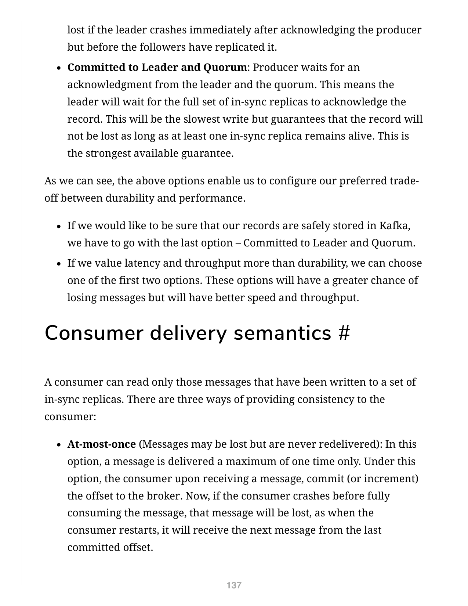

---

## Kafka 特性

### 磁盘存储

Kafka 将消息写入本地磁盘，不在 RAM 中保留任何内容。磁盘存储对持久性至关重要——系统崩溃并重启时消息不会丢失。磁盘通常被认为是慢速的，但顺序访问与随机块访问之间存在巨大性能差异：

- 随机块访问因大量磁盘寻道而缓慢
- 顺序写入或读取比随机访问快数千倍

由于所有读写都是顺序的，Kafka 具有非常高的吞吐量。

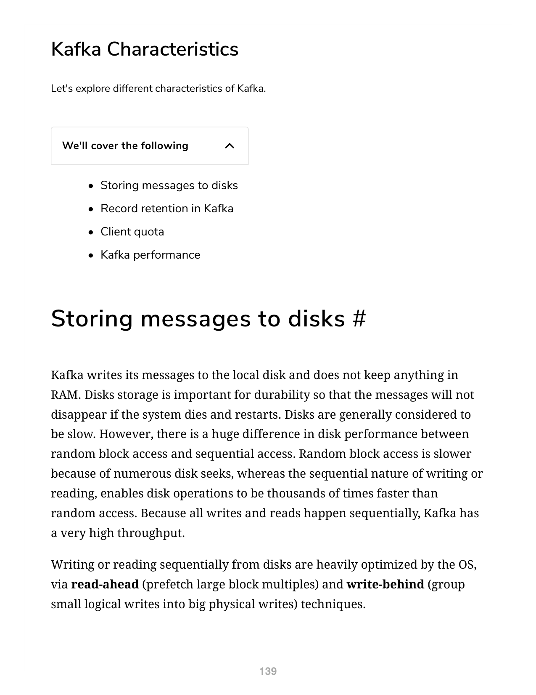

操作系统通过以下技术大幅优化顺序磁盘读写：

- **预读（Read-ahead）**：预取大块数据
- **写后聚合（Write-behind）**：将小的逻辑写入分组为大的物理写入

此外，现代操作系统在空闲 RAM 中缓存磁盘内容，称为**[[页缓存]]**（Pagecache）。由于 Kafka 以标准化的二进制格式存储消息，在整个流程（生产者 → Broker → 消费者）中保持格式不变，因此可以利用**[[零拷贝]]**（Zero-Copy）优化。操作系统将数据从页缓存直接复制到 Socket，完全绕过 Kafka Broker 应用。

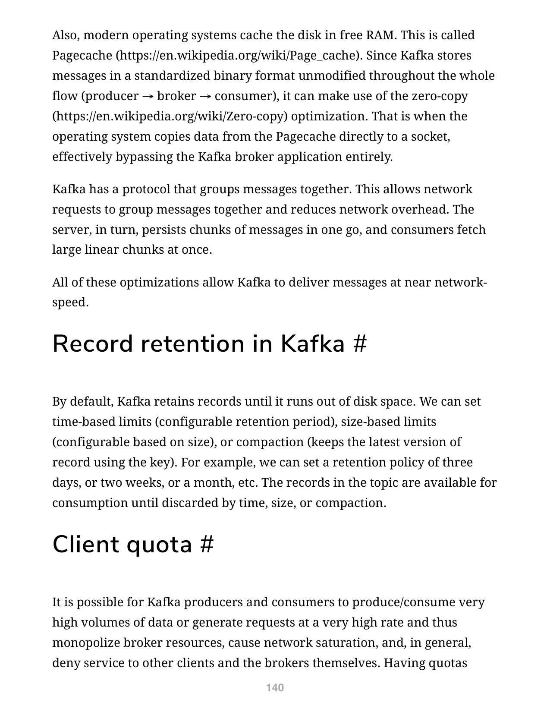

Kafka 的协议将消息分组在一起，这允许网络请求将消息批量发送，减少网络开销。服务器一次性持久化消息块，消费者一次获取大的线性块。所有这些优化使 Kafka 能够以接近网络速度投递消息。

### 消息保留

默认情况下，Kafka 保留记录直到磁盘空间用完。可以设置以下保留策略：

- **基于时间**：可配置的保留期（如 3 天、2 周、1 个月等）
- **基于大小**：根据存储空间限制
- **压缩**：使用键保留最新版本的记录

主题中的记录在被时间、大小或压缩策略丢弃之前，始终可供消费。

### 客户端配额

Kafka 生产者和消费者可能产生/消费非常高容量的数据或以非常高的速率生成请求，从而独占 Broker 资源、导致网络饱和，并对其他客户端和 Broker 本身造成拒绝服务。配额用于防止这些问题。在大型多租户集群中，配额变得更加重要——少数行为不当的客户端可能降低正常客户端的体验。

在 Kafka 中，配额是按客户端 ID 设置的字节速率阈值。一个客户端 ID 逻辑上标识发起请求的应用。单个客户端 ID 可以跨越多个生产者和消费者实例——配额作为单个实体应用于所有实例。例如，如果某客户端 ID 的生产者配额为 10 MB/s，则该配额由所有具有相同 ID 的实例共享。

当客户端超过配额时，Broker 不会返回错误，而是尝试**减缓客户端**。当 Broker 计算到客户端已超过其配额时，它通过保持客户端的响应足够长时间来使客户端保持在配额以下。这种方法使配额违规对客户端透明，也防止客户端必须实现特殊的退避和重试行为。

### Kafka 性能

**可扩展性**：Kafka 集群可以在运行中轻松扩展或缩小（添加或移除 Broker）。Kafka 主题可以增加包含更多分区。分区不能跨越多个 Broker，因此其容量受 Broker 磁盘空间限制。能够增加分区数和 Broker 数意味着单个主题可以存储的数据量没有限制。

**容错性和可靠性**：Kafka 的设计使得 ZooKeeper 和集群中的其他 Broker 能够检测到 Broker 故障。由于每个主题可以在多个 Broker 上复制，集群可以从 Broker 故障中恢复，继续工作而不中断服务。

**吞吐量**：通过使用消费者组，消费者可以被并行化，使多个消费者可以读取主题的多个分区，实现非常高的消息处理吞吐量。

**低延迟**：99.99% 的情况下数据从磁盘缓存和 RAM 读取，极少数情况会访问物理磁盘。

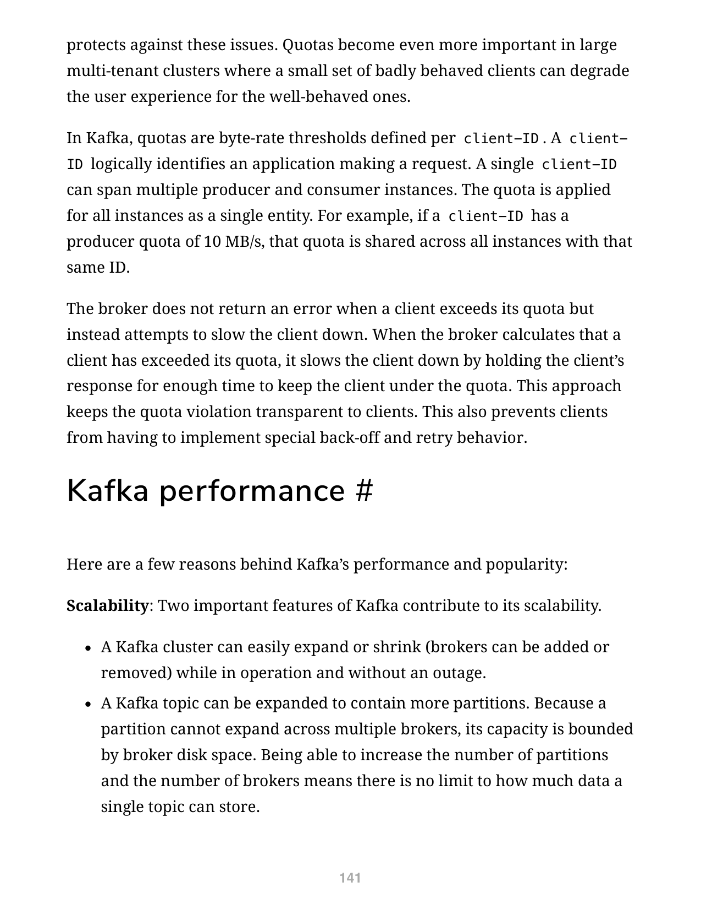

---

## 使用的系统设计模式

| 模式 | 用途 |
|------|------|
| [[高水位|High-Water Mark]] | 处理不可重复读取并确保数据一致性；Broker 跟踪该标记，即特定分区所有 ISR 共享的最大偏移量。消费者只能看到高水位之前的消息 |
| [[领导者与追随者|Leader and Follower]] | 每个 Kafka 分区有一个指定的 Leader 负责所有读写；每个 Follower 的职责是复制 Leader 的数据作为备份 |
| [[脑裂|Split-Brain]] | 通过世代号（Epoch Number）处理——单调递增的数字表示服务器的世代。如果旧控制器代号为 1，新控制器为 2。Broker 只信任具有最高世代号的控制器 |
| [[分段日志|Segmented Log]] | Kafka 使用日志分段来实现分区存储。由于 Kafka 需要定期在磁盘上查找消息进行清除，单个大文件可能成为性能瓶颈且容易出错。为便于管理和提高性能，分区被拆分为段 |

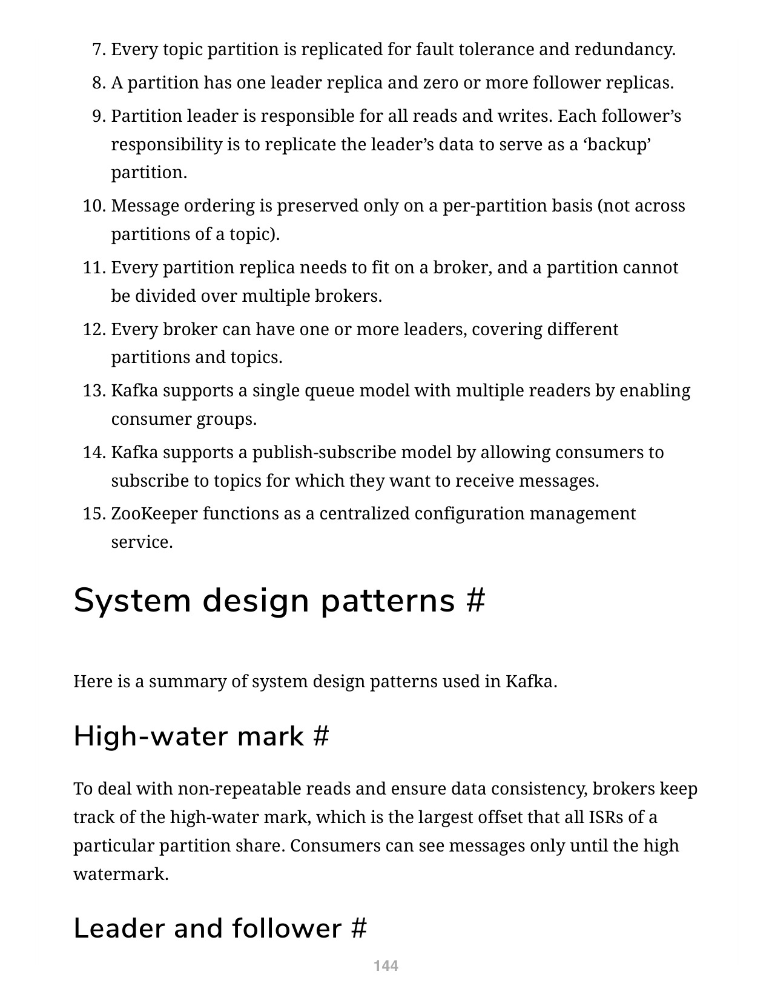

---

## 总结

| 特性 | Kafka 实现 |
|------|-----------|
| 消息模型 | 提供低延迟、高吞吐量的发布和订阅管道，可作为消息队列和发布-订阅系统 |
| 存储结构 | 分布式提交日志——一种仅追加的数据结构 |
| 可扩展性 | 主题分区分布在多个 Broker |
| 容错性 | 分区复制 + Leader/Follower |
| 数据一致性 | 高水位标记 |
| 协调服务 | ZooKeeper |
| 投递保证 | 可配置交付语义 |
| 性能优化 | 顺序 IO、页缓存、零拷贝、批处理 |

Kafka 是一个高性能、分布式、持久化的消息系统，结合了消息队列和发布-订阅两种模式，通过分区实现水平扩展，通过复制实现高可用，广泛应用于日志聚合、流处理、指标收集和事件驱动架构。Kafka 的吞吐量、容错性和可扩展性使其成为现代数据基础设施的核心组件。

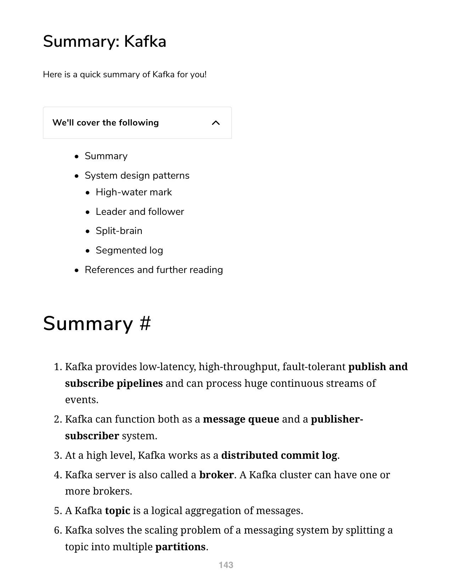

---

## 选择题

1. Kafka 中保证分区内消息顺序的机制是什么？
   a. 消息键的哈希值
   b. 每个分区是仅追加的有序序列
   c. ZooKeeper 的全局锁
   d. 消费者组的协调

2. Kafka 中高水位（High-Water Mark）的作用是什么？
   a. 标记所有已消费的消息
   b. 记录最后一条写入的消息
   c. 确保消费者只读取已复制到所有 ISR 的消息
   d. 控制生产者的最大写入速率

3. Kafka 如何处理脑裂（Split-Brain）问题？
   a. 使用 Paxos 协议
   b. 通过 ZooKeeper 的选举锁
   c. 使用世代时钟（Epoch Number），Broker 只信任最高世代号的控制器
   d. 强制停止旧控制器进程

4. 在 Kafka 消费者组中，当消费者数量超过分区数量时会发生什么？
   a. 所有消费者都能分配到分区
   b. 超出分区的消费者将处于空闲状态
   c. 自动增加分区数量
   d. 消费者会共享同一个分区

5. 以下哪项不是 Kafka 实现高吞吐量的关键优化？
   a. 顺序磁盘读写
   b. 零拷贝技术
   c. 内存数据缓存
   d. 随机磁盘访问

**答案**
1. b
2. c
3. c
4. b
5. d
