# 4 Chubby：如何设计分布式锁服务

## Chubby 简介

### 目标

设计一个高可用、强一致的服务，能够存储小对象并在此类对象上提供锁机制。

### 什么是 Chubby？

[[Chubby]] 是一个提供分布式锁机制并存储小文件的服务。在内部实现上，它是一个键值存储，同时对其存储的每个对象提供锁机制。Chubby 在 Google 内部被广泛用于为 [[GFS]] 和 [[BigTable]] 等系统提供存储和协调服务。[[ZooKeeper]] 是 Chubby 的开源替代方案。

简而言之，Chubby 是一个集中式服务，提供开发者友好的接口（用于获取/释放锁和创建/读取/删除小文件）。而且，现有的应用程序只需添加几行额外代码即可使用 Chubby，无需大幅修改应用逻辑。

<!-- 图: page 148 - Chubby 在 Google 系统中的位置和作用示意图 -->

### Chubby 的用例

Chubby 最初是为提供可靠的锁服务而开发的。随着时间的推移，演化出一些有趣的用法：

1. **主节点/领导者选举（Leader/Master Election）**
2. **命名服务（类似 DNS）**
3. **小对象存储（极少变更的数据）**
4. **分布式锁机制**

### 主节点选举

任何锁服务都可以被视为共识服务，因为它将达成共识的问题转化为分发锁的问题。基本上，一组分布式应用程序竞争获取锁，先获取锁的获得资源。同样，一个应用可以运行多个副本，并希望其中一个被选为领导者。Chubby 可用于一组副本之间的领导者选举，例如 GFS 和 BigTable 的主节点选举。

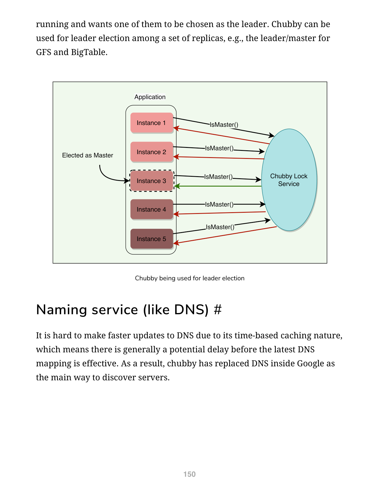

### 命名服务（类似 DNS）

由于 DNS 基于时间的缓存特性，很难对其进行快速更新——最新的 DNS 映射生效通常存在潜在延迟。因此，Chubby 在 Google 内部取代了 DNS 作为发现服务器的主要方式。

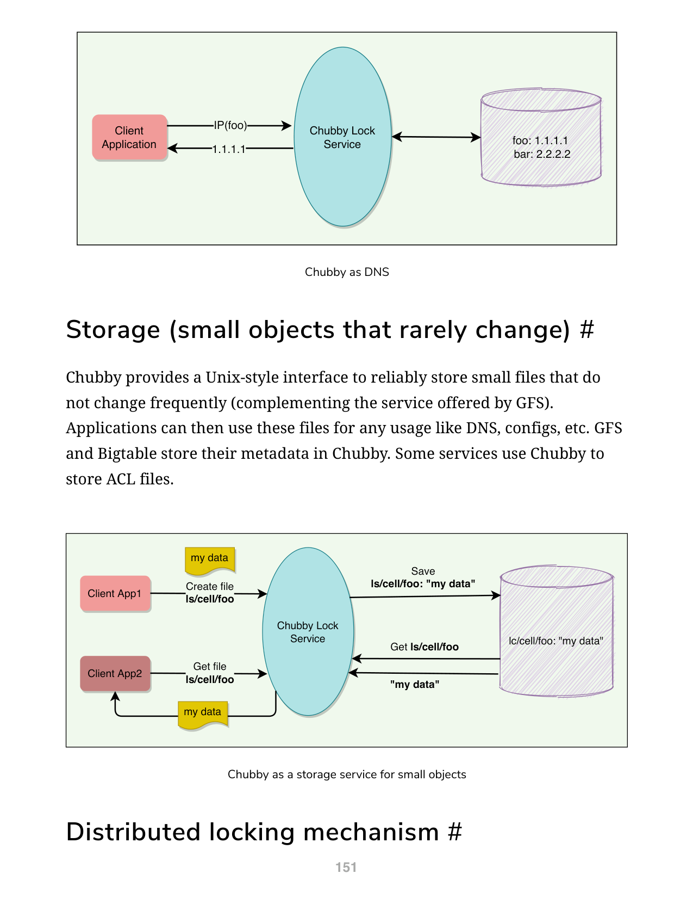

### 小对象存储

Chubby 提供类似 Unix 的接口，用于可靠地存储不频繁变更的小文件（补充 GFS 提供的服务）。应用程序可以将这些文件用于 DNS、配置等。GFS 和 BigTable 将其元数据存储在 Chubby 中。一些服务使用 Chubby 存储 ACL 文件。

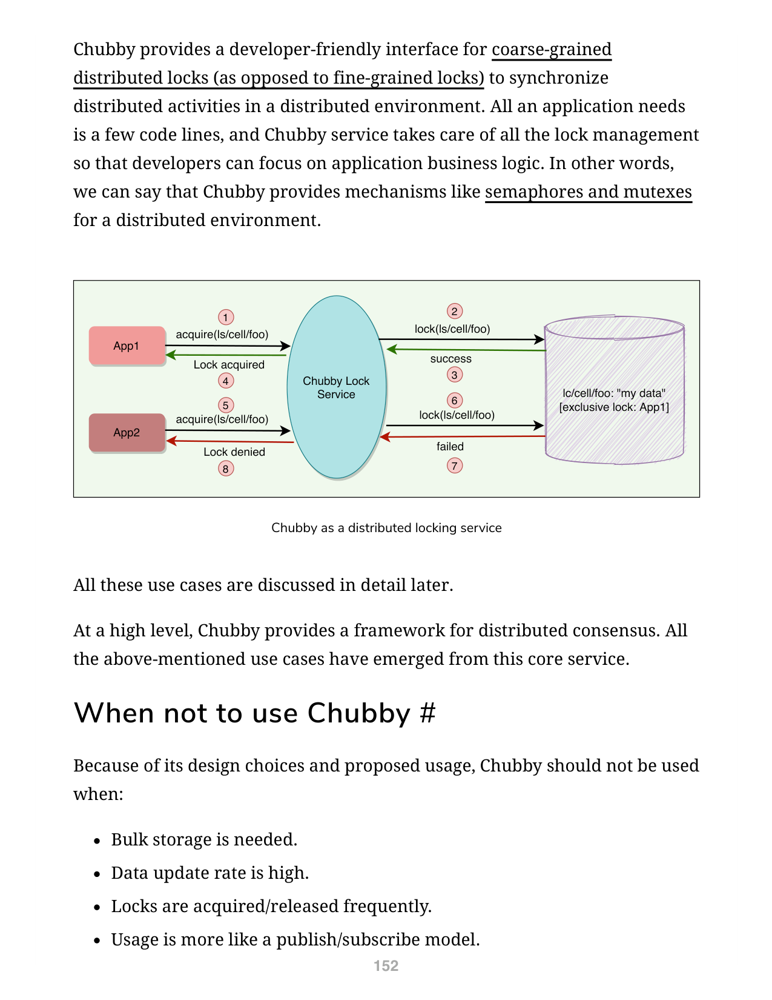

### 分布式锁机制

Chubby 为粗粒度分布式锁（相对于细粒度锁）提供了开发者友好的接口，用于同步分布式环境中的活动。应用程序只需少量代码行，Chubby 服务负责所有锁管理。

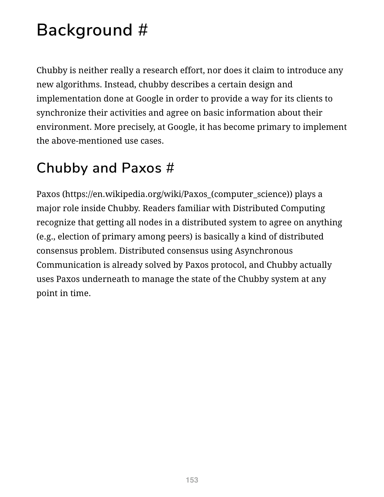

从高层看，Chubby 提供了一个分布式共识框架。以上所有用例都源于这一核心服务。

### 何时不应使用 Chubby

由于它的设计选择和预期用途，以下情况不应使用 Chubby：

- 需要批量存储时
- 数据更新率很高时
- 锁频繁获取/释放时
- 更多用于发布/订阅模型时

<!-- 图: page 154 - Chubby 不适合的场景示意图 -->

### 背景

Chubby 既不是纯粹的研究成果，也不声称引入了任何新算法。相反，它描述了 Google 内部为实现客户端同步活动和就环境基本信息达成一致而进行的特定设计和实现。更准确地说，在 Google，它已成为实现上述用例的主要方式。

### Chubby 与 Paxos

[[Paxos]] 在 Chubby 内部扮演了重要角色。让分布式系统中所有节点就任何事情（例如主节点选举）达成一致，本质上是一个分布式共识问题。Paxos 协议已经解决了异步通信下的分布式共识问题，Chubby 在底层使用 Paxos 来管理 Chubby 系统在任何时间点的状态。

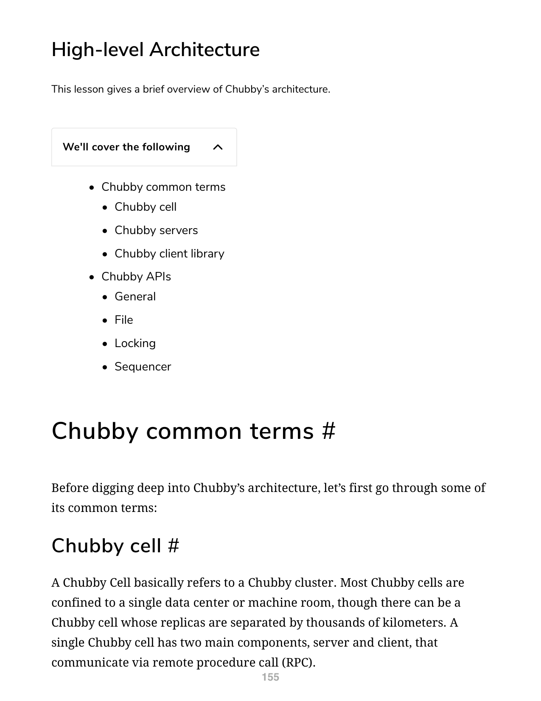

---

## 高层架构

### 基本术语

### Chubby Cell

Chubby Cell 指的是一个 Chubby 集群。大多数 Chubby Cell 限定在单个数据中心或机房内，但也有副本相距数千公里的 Chubby Cell。一个 Chubby Cell 有两个主要组件——服务器和客户端，它们通过远程过程调用（RPC）通信。

<!-- 图: page 156 - Chubby Cell 架构概览图 -->

### Chubby 服务器

一个 Chubby Cell 包含一小组服务器（通常为 5 台），称为副本（Replicas）。

- 使用 Paxos，其中一台服务器被选为主节点（Master），处理所有客户端请求。如果主节点故障，另一个副本成为主节点
- 每个副本维护一个小型数据库，用于存储文件/目录/锁
- 主节点直接写入自己的本地数据库，然后异步同步到所有副本。这就是 Chubby 确保数据可靠性和为客户端提供无缝体验的方式
- 为了容错，Chubby 副本放置在不同的机架上

### Chubby 客户端库

客户端应用程序使用 Chubby 库通过 RPC 与 Chubby Cell 中的副本通信。

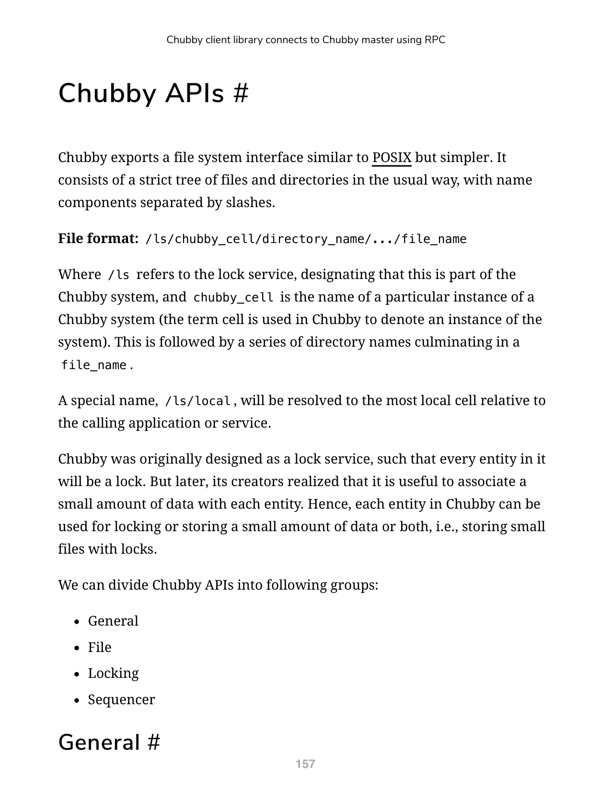

<!-- 图: page 157 - Chubby 客户端库连接 Master 的 RPC 示意图 -->

### Chubby API

Chubby 导出类似 POSIX 但更简单的文件系统接口。它由文件和目录的严格树结构组成，名称组件由斜杠分隔。

**文件格式**：`/ls/chubby_cell/directory_name/.../file_name`

其中 `/ls` 代表锁服务，表明这是 Chubby 系统的一部分；`chubby_cell` 是特定 Chubby 系统实例的名称。后面是一系列目录名，最后是文件名。

特殊名称 `/ls/local` 将解析为相对于调用应用或服务最近的 Cell。

Chubby 最初设计为锁服务，每个实体都是一个锁。但后来创建者意识到为每个实体关联少量数据很有用。因此，Chubby 中的每个实体可以用于锁定或存储小量数据，或两者兼具——即带锁的小文件存储。

**API 分组**：

**通用 API**：
- `Open()`：打开指定名称的文件或目录，返回句柄
- `Close()`：关闭打开的句柄
- `Poison()`：允许客户端取消所有其他线程的 Chubby 调用
- `Delete()`：删除文件或目录

**文件 API**：
- `GetContentsAndStat()`：原子性地返回整个文件内容和元数据。这种读取整个文件的方式旨在阻止创建大文件
- `GetStat()`：仅返回元数据
- `ReadDir()`：返回目录内容——所有子项的名称和元数据
- `SetContents()`：原子性地写入整个文件内容
- `SetACL()`：写入新的访问控制列表信息

**锁 API**：
- `Acquire()`：在文件上获取锁
- `TryAcquire()`：尝试在文件上获取锁，非阻塞版
- `Release()`：释放锁

**序列器 API**：
- `GetSequencer()`：获取锁的序列器
- `SetSequencer()`：将序列器与句柄关联
- `CheckSequencer()`：检查序列器是否有效

Chubby 不支持追加、查找、在目录之间移动文件或创建符号/硬链接等操作。文件只能完全读取或完全写入/覆写，使其只适合存储非常小的文件。

<!-- 图: page 158-159 - Chubby API 概览图 -->

---

## 设计决策背后的原理

### 为什么将 Chubby 构建为服务而非客户端库？

与只提供 Paxos 分布式共识的客户端库相比，锁服务具有以下优势：

1. **开发简化**：高可用性通常不在开发早期规划。系统作为原型启动，负载小，可用性保障差。随着服务成熟并获得更多客户端，可用性变得重要；复制和主节点选举随后加入设计。锁服务器使维护现有程序结构和通信模式更容易——选举领导者只需添加几行代码

2. **基于锁的接口对开发者友好**：程序员通常熟悉锁。在分布式系统中使用锁服务比在本地管理 Paxos 协议状态容易得多——例如 `Acquire()`、`TryAcquire()`、`Release()`

3. **提供仲裁和副本管理**：分布式共识算法需要仲裁来做出决策。锁服务可以视为提供通用选民组的方式，允许客户端应用程序在自身大多数成员不可用时正确做出决策。没有这种服务支持，每个应用都需要拥有并管理自己的仲裁服务器

4. **广播功能**：分布式服务的客户端和副本可能希望知道服务的主节点何时变更——这需要事件通知机制。如果系统中有中央服务，这种机制很容易构建

因此，构建和维护中央锁服务为客户端应用抽象并处理了大量复杂问题。

<!-- 图: page 160-161 - 锁服务 vs 客户端库对比图 -->

### 为什么是粗粒度锁？

Chubby 锁的使用预期不是细粒度的（即持有时间很短，几秒或更短）。例如，选举领导者并不是频繁事件。Chubby 决定只支持粗粒度锁的主要原因：

1. **锁服务器负载更低**：粗粒度锁的获取率远低于客户端的事务率，对服务器施加的负载小得多
2. **抵御服务器故障**：粗粒度锁很少获取，客户端不会因锁服务器的临时不可用而显著延迟。细粒度锁即使短暂不可用也会导致许多客户端停滞
3. **需要更少的锁服务器**：粗粒度锁允许适量锁服务器以较低可用性为大量客户端提供服务

<!-- 图: page 162 - 粗粒度锁 vs 细粒度锁对比图 -->

### 为什么是建议锁？

Chubby 锁是建议锁（Advisory Locks），意味着应用程序自行决定是否遵守锁。Chubby 不会使锁定的对象对未持有锁的客户端不可访问。它更像是记录保存，允许锁请求者发现锁被持有。持有特定锁既不是访问文件的必要条件，也不会阻止其他人访问。

另一种类型是强制锁（Mandatory Locks），使对象对未持有锁的客户端不可访问。Chubby 不采用强制锁的原因：

1. 在其他服务实现的资源上强制锁定需要对这些服务进行更广泛的修改
2. 强制锁阻止用户出于调试或管理目的访问锁定的文件。如果需要访问文件，必须关闭或重启整个应用程序来打破强制锁
3. 良好的开发实践是编写断言（如 `assert("Lock X is held")`），因此强制锁实际上只有很少的好处

### 为什么 Chubby 需要存储？

客户端应用可能需要向其他人通告 Chubby 的结果。例如，应用程序需要存储信息来：

- 通告其选出的主节点（领导者选举用例）
- 将别名解析为绝对地址（命名服务用例）
- 在数据重新分区后公布方案

不设单独的服务来共享结果减少了客户端的依赖服务器数量。Chubby 的存储需求非常简单——存储少量数据（KB 级）且操作支持有限（创建/删除）。

### 为什么使用类 Unix 文件系统接口？

主要原因是为了使应用程序既可以通过专用 API 访问 Chubby，也可以通过其他文件系统使用的接口（如 GFS）访问。这显著减少了编写基本浏览和命名空间管理工具的工作量，也减少了对偶尔使用的 Chubby 用户的教育需求。但这些文件上只能执行非常有限的操作——如创建、删除等。


### 高可用性和可靠性

正如 [[CAP 定理]] 所证明的，没有应用程序能同时做到高可用、强一致和高性能。由于 Chubby 预期用例的性质，Chubby 在性能上做出妥协以换取可用性和一致性。

<!-- 图: page 166 - Chubby CAP 权衡示意图 -->

---

## Chubby 工作原理

### 服务初始化

初始化时，Chubby 执行以下步骤：

1. 使用 Paxos 在 Chubby 副本中选出一个主节点
2. 当前主节点信息持久化到存储中，所有副本都知道主节点

### 客户端初始化

初始化时，Chubby 客户端执行以下步骤：

1. 客户端联系 DNS 获取列出的 Chubby 副本
2. 客户端通过 RPC 直接调用任意 Chubby 服务器
3. 如果该副本不是主节点，它将返回当前主节点的地址
4. 找到主节点后，客户端保持会话，将所有请求发送给主节点，直到主节点指示自己不再是主节点或停止响应

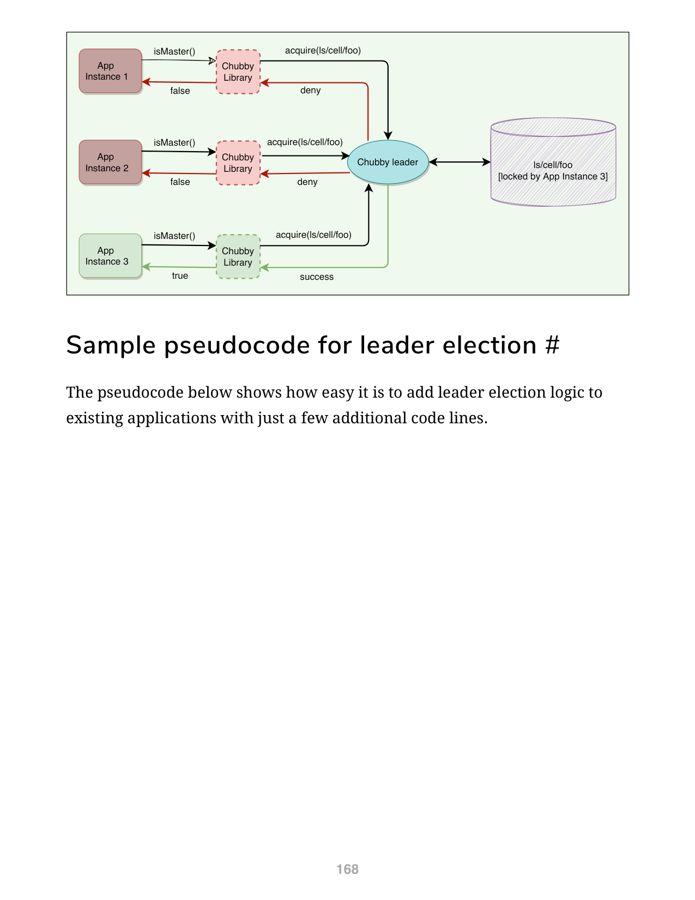

### 使用 Chubby 进行领导者选举的示例

当主节点选举开始时，所有候选者尝试在与选举关联的文件上获取 Chubby 锁。先获取锁的成为主节点。主节点将其身份写入文件，以便其他进程知道当前主节点是谁。

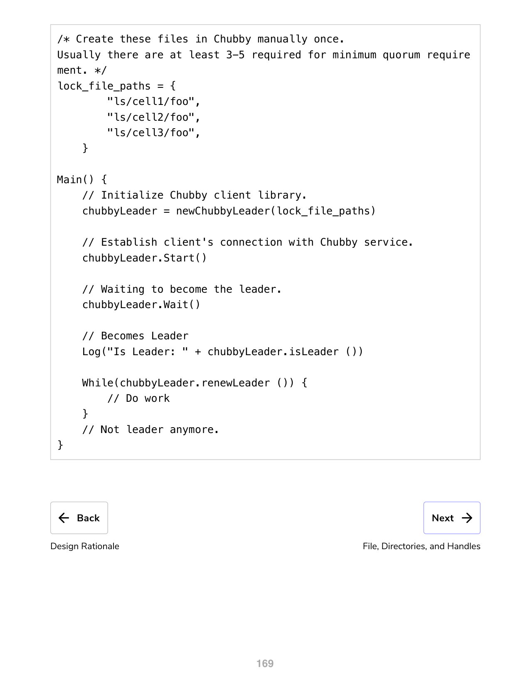

**领导者选举伪代码**：

```
lock_file_paths = {
    "ls/cell1/foo",
    "ls/cell2/foo",
    "ls/cell3/foo",
}

Main() {
    chubbyLeader = newChubbyLeader(lock_file_paths)
    chubbyLeader.Start()
    chubbyLeader.Wait()
    Log("Is Leader: " + chubbyLeader.isLeader())
    While(chubbyLeader.renewLeader()) {
        // 执行工作
    }
}
```

---

## 文件、目录和句柄

Chubby 文件系统接口本质上是文件和目录的树，每个目录包含子文件和子目录的列表。每个文件或目录称为一个**节点**（Node）。

<!-- 图: page 170 - Chubby 文件系统树结构示例图 -->

### 节点

- 任何节点都可以充当建议读写锁
- 节点可以是临时的（Ephemeral）或永久的（Permanent）
- 临时文件用作临时文件，向其他人指示客户端存活
- 如果没有客户端打开临时文件，该文件将被删除
- 空的临时目录也将被删除
- 任何节点都可以被显式删除

### 元数据

每个节点的元数据包括：访问控制列表（ACL）、四个单调递增的 64 位数字和校验和。

- ACL 用于控制对节点的读、写和 ACL 名称更改
- 节点在创建时继承其父目录的 ACL 名称
- ACL 本身是位于 ACL 目录中的文件

**四个单调递增的 64 位数字**允许客户端轻松检测变更：

1. **实例号（Instance Number）**：大于之前同名节点的实例号
2. **内容代号的数字（仅文件）**：每次写入文件内容时递增
3. **锁代号的数字**：节点锁从空闲转为持有时递增
4. **ACL 代号的数字**：写入节点 ACL 名称时递增

**校验和**：Chubby 公开 64 位文件内容校验和，以便客户端判断文件是否不同。

### 句柄

客户端打开节点以获取句柄（类似于 UNIX 文件描述符）。句柄包含：

- **校验数字**：防止客户端创建或猜测句柄，完整的访问控制检查仅在创建句柄时执行
- **序列号**：使主节点能够判断句柄是由它生成还是由前一个主节点生成
- **模式信息（打开时提供）**：使主节点能够在旧句柄呈现给新重启的领导者时重建其状态

---

## 锁、序列器和锁延迟

### 锁

每个 Chubby 节点可以在以下两种模式之一充当读写锁：

- **排他模式（Exclusive）**：一个客户端可以排他（写模式）持有锁
- **共享模式（Shared）**：任意数量的客户端可以共享（读模式）持有锁

<!-- 图: page 173 - 排他锁与共享锁示意图 -->

### 序列器

在分布式系统中，消息乱序接收是一个问题。Chubby 使用序列号来解决这个问题。获取文件锁后，客户端可以立即请求一个**序列器**（Sequencer），这是一个不透明的字节字符串，描述锁的状态：

```
序列器 = 锁的名称 + 锁模式（排他或共享）+ 锁代号的数字
```

应用的主服务器可以生成序列器并将其与内部指令一起发送给其他服务器。接收指令的应用服务器可以向 Chubby 检查序列器是否仍然有效，是否不属于过时的主服务器（处理"脑裂"场景）。

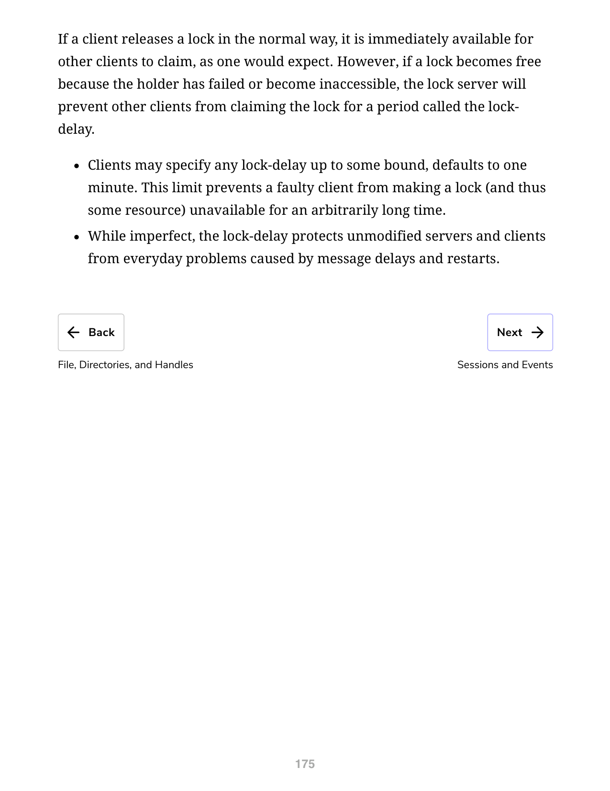

### 锁延迟

对于不支持序列器的文件服务器，Chubby 提供锁延迟期来防止消息延迟和服务器重启。

如果客户端正常释放锁，锁立即可供其他客户端获取。但如果锁因持有者失败或不可达而释放，锁服务器将在称为**锁延迟**（Lock-delay）的期间内阻止其他客户端获取该锁。

客户端可以指定最多一定上限的锁延迟，默认值为 1 分钟。此限制防止故障客户端使锁（以及某些资源）在任意长时间内不可用。

锁延迟保护未修改的服务和客户端免受消息延迟和重启引起的常见问题。

---

## 会话和事件

### 什么是 Chubby 会话？

Chubby 会话是 Chubby Cell 和 Chubby 客户端之间的关系：

- 会话存在一定时间间隔，通过定期握手机制（称为 KeepAlive）维护
- 客户端句柄、锁和缓存数据仅在会话有效时保持有效

### 会话协议

- 客户端首次联系 Chubby Cell 的主节点时请求新会话
- 会话在客户端显式结束或空闲时结束。如果没有打开句柄且一分钟内没有调用，会话被视为空闲
- 每个会话有一个关联的租约（Lease），即主节点保证不会单方面终止会话的时间间隔。这个间隔的结束称为"会话租约超时"
- 主节点在以下三种情况下推进"会话租约超时"：
  1. 会话创建时
  2. 主节点故障转移时
  3. 主节点响应客户端的 KeepAlive RPC 时

### 什么是 KeepAlive？

KeepAlive 是客户端与 Chubby Cell 保持持续会话的方式：

1. 收到 KeepAlive 后，主节点通常会阻塞 RPC（不允许返回），直到客户端先前的租约间隔接近到期
2. 主节点随后允许 RPC 返回给客户端，通知客户端新的租约超时
3. 主节点可以延长任意时长。默认延长 12 秒，但过载的主节点可以使用更高的值来减少必须处理的 KeepAlive 调用次数
4. 客户端收到之前回复后立即发起新的 KeepAlive，确保几乎总有一个 KeepAlive 调用在主节点上阻塞

### 会话优化

- **捎带事件**：KeepAlive 回复用于将事件和缓存失效信息传回客户端
- **本地租约**：客户端维护本地租约超时，是主节点租约超时的保守近似
- **危险状态（Jeopardy）**：如果客户端本地租约超时到期，客户端不确定主节点是否已终止其会话，清空并禁用缓存，称会话处于危险状态
- **宽限期（Grace Period）**：会话危险时，客户端额外等待一段时间称为宽限期——默认 45 秒。如果客户端和主节点在宽限期内成功交换 KeepAlive，客户端重新启用缓存；否则假设会话已过期

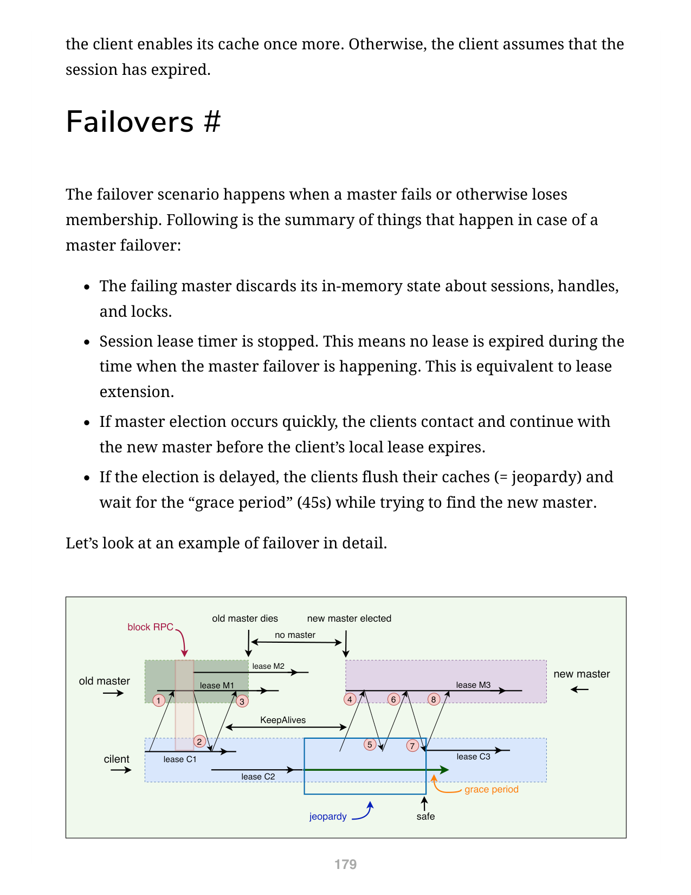

### 故障转移

主节点故障或失去成员资格时：

1. 故障主节点丢弃关于会话、句柄和锁的内存状态
2. 会话租约计时器停止——故障转移期间不会过期任何租约，相当于租约延长
3. 如果主节点选举快速完成，客户端在本地租约到期前联系并继续使用新主节点
4. 如果选举延迟，客户端刷新缓存（= 危险状态）并等待"宽限期"（45 秒），同时尝试寻找新主节点

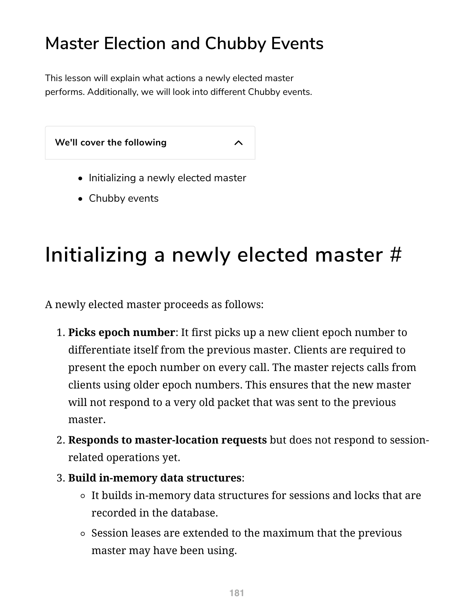

**故障转移详细步骤**：

1. 客户端与服务主节点有会话
2. 主节点响应 KeepAlive 请求
3. 客户端延长本地租约并发出新 KeepAlive。随后主节点在回复前崩溃
4. 新主节点被选出，客户端向其发送 KeepAlive
5. 首次 KeepAlive 被拒绝（主节点时代号不匹配）
6. 客户端重试 KeepAlive
7. 重试成功，客户端延长租约，通知应用会话恢复正常
8. 客户端发出新 KeepAlive 调用
9. 宽限期足够覆盖期间的间隔，客户端只看到延迟；否则客户端将放弃会话

---

## 主节点选举和 Chubby 事件

### 初始化新任主节点

新选出的主节点按以下步骤进行：

1. **选择时代号**：选定新的客户端时代号，将自己与前一个主节点区分。客户端需要在每次调用中提供时代号。主节点拒绝使用旧时代号的调用
2. **响应主节点定位请求**：但不响应与会话相关的操作
3. **构建内存数据结构**：重建数据库中记录的会话和锁的内存数据结构。会话租约延长到前任主节点可能使用的最大值
4. **允许 KeepAlive**：但此时不允许其他会话相关操作
5. **向每个会话发出故障转移事件**：使客户端刷新缓存并警告应用可能丢失了其他事件
6. **等待**：主节点等待每个会话确认故障转移事件或让其会话到期
7. **允许所有操作**继续
8. **处理旧句柄**：如果客户端使用故障转移前创建的句柄，主节点重建句柄的内存表示
9. **删除临时文件**：一定时间后（一分钟），主节点删除没有打开文件句柄的临时文件

### Chubby 事件

Chubby 支持简单的事件机制，让客户端订阅各种事件。事件通过 Chubby 库的回调异步传递给客户端。客户端在创建句柄时订阅一系列事件：

- 文件内容被修改
- 子节点添加、删除或修改
- Chubby 主节点故障转移
- 句柄（及其锁）变为无效
- 锁已获取
- 来自其他客户端的锁冲突请求

此外，客户端向应用发送以下会话事件：

- **危险（Jeopardy）**：会话租约超时且宽限期开始
- **安全（Safe）**：会话已知在通信问题中幸存
- **过期（Expired）**：会话超时

---

## 缓存

### Chubby 缓存

在 Chubby 中，缓存起着重要作用，因为读请求远远超过写请求。为了减少读取流量，Chubby 客户端在客户端内存中的一致性写通缓存中缓存文件内容、节点元数据和打开句柄信息。Chubby 必须通过租约机制维护文件和缓存之间的一致性，并在租约到期时刷新缓存。

### 缓存失效

文件数据或元数据变更时的缓存失效协议：

1. 主节点收到更改文件内容或节点元数据的请求
2. 主节点阻塞修改，向所有缓存了该数据的客户端发送缓存失效通知。主节点必须维护每个客户端缓存内容的列表
3. 失效请求通过 KeepAlive 回复捎带发送
4. 客户端收到失效信号后刷新缓存，在下一次 KeepAlive 调用中向主节点发送确认
5. 收到所有活动客户端的确认后，主节点继续修改。主节点更新本地数据库并向副本发送更新请求
6. 收到 Cell 中大多数副本的确认后，主节点向发起写入的客户端发送确认

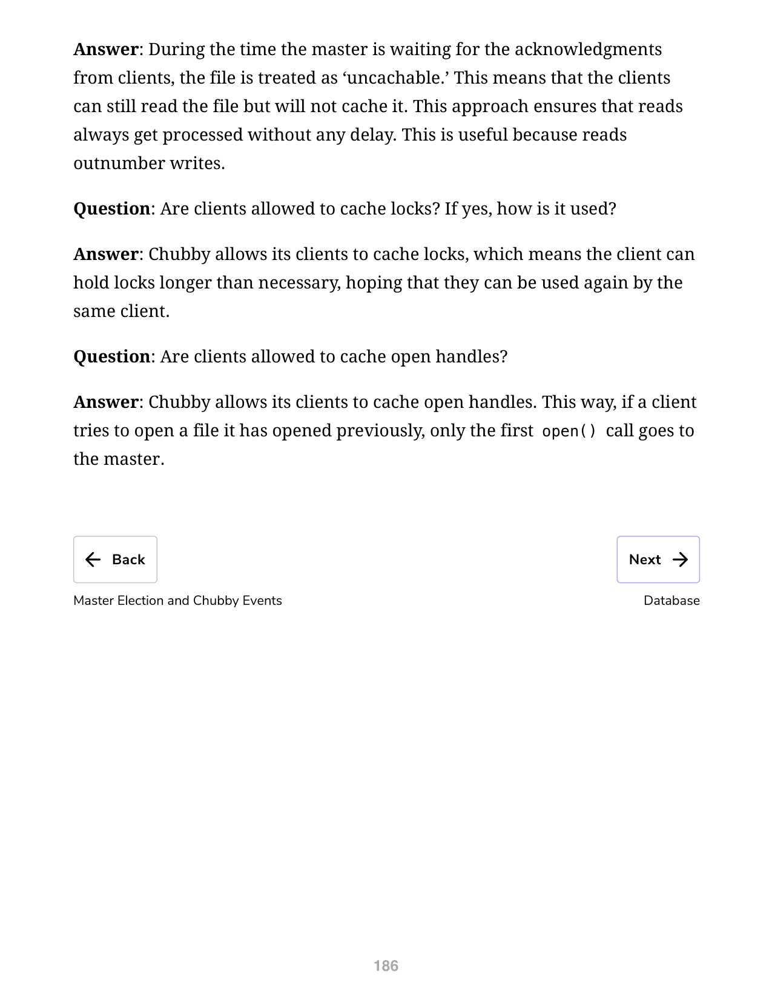

**问题：主节点等待确认期间，其他客户端可以读取文件吗？**

在主节点等待客户端确认期间，文件被视为"不可缓存"。这意味着客户端仍然可以读取文件，但不会缓存它。这种方法确保读取始终得到处理而不延迟。这很有用，因为读操作远多于写操作。

**客户端可以缓存锁吗？**

Chubby 允许客户端缓存锁，这意味着客户端可以持有锁超过必要时间，期望同一客户端可以再次使用。

**客户端可以缓存打开的句柄吗？**

Chubby 允许客户端缓存打开的句柄。这样，如果客户端尝试打开以前打开过的文件，只有第一次 `open()` 调用会访问主节点。

---

## 数据库

Chubby 最初使用 Berkeley DB 的复制版本来存储数据。后来 Chubby 团队认为使用 Berkeley DB 会使 Chubby 面临更多风险，因此决定编写简化的自定义数据库：

- 使用预写日志和快照的简单键/值数据库
- 仅原子操作，不支持一般事务
- 数据库日志使用 Paxos 在副本之间分发

### 备份

为了在故障时恢复，所有数据库事务存储在事务日志（[[预写日志]]）中。由于事务日志会随时间变得非常大，每隔几小时每个 Chubby Cell 的主节点会将其数据库快照写入不同建筑物中的 GFS 服务器。使用不同建筑确保备份能在建筑损坏时幸存，并且备份不引入循环依赖。

快照记录后，之前的事务日志被删除。因此，任何时候系统的完整状态由最后快照加上事务日志中的事务集决定。备份数据库用于灾难恢复和初始化新替换的副本，而不会对其他副本施加负载。

### 镜像

镜像是一种允许系统自动维护多个副本的技术。

- Chubby 允许文件集合从一个 Cell 镜像到另一个 Cell
- 镜像通常用于将配置文件复制到分布在世界各地的各种计算集群
- 由于文件很小，镜像速度很快
- 事件机制在文件添加、删除或修改时立即通知
- 通常变更在不到一秒内反映在世界上数十个镜像中
- 无法访问的镜像保持不变直到连接恢复，然后通过比较校验和识别更新后的文件

特殊的"全局"Cell 子树 `/ls/global/master` 被镜像到其他每个 Chubby Cell 的子树 `/ls/cell/replica`。全局 Cell 的特殊之处在于其副本位于世界上广泛分离的地方。全局 Cell 用于：

- Chubby 自身的访问控制列表（ACL）
- Chubby Cell 和其他系统向监控服务通告其存在的各种文件
- 允许客户端定位大数据集（如 Bigtable Cell）的指针，以及许多其他系统的配置文件

---

## 扩展 Chubby

Chubby 的客户端是单个进程，所以 Chubby 处理的客户端数量超过预期。在 Google，90,000+ 客户端与单个 Chubby 服务器通信。以下技术用于减少与主节点的通信：

- **最小化请求率**：创建更多 Chubby Cell，使客户端始终使用附近 Cell（通过 DNS 找到），避免依赖远程机器
- **最小化 KeepAlive 负载**：KeepAlive 是绝对主导的请求类型；将客户端租约时间从 12 秒增加到 60 秒可降低 KeepAlive 负载
- **缓存**：Chubby 客户端缓存文件数据、元数据、句柄和文件缺失信息
- **简化协议转换**：添加将 Chubby 协议转换为更简单协议的服务器

### 代理

代理是可以代表实际服务器的额外服务器。

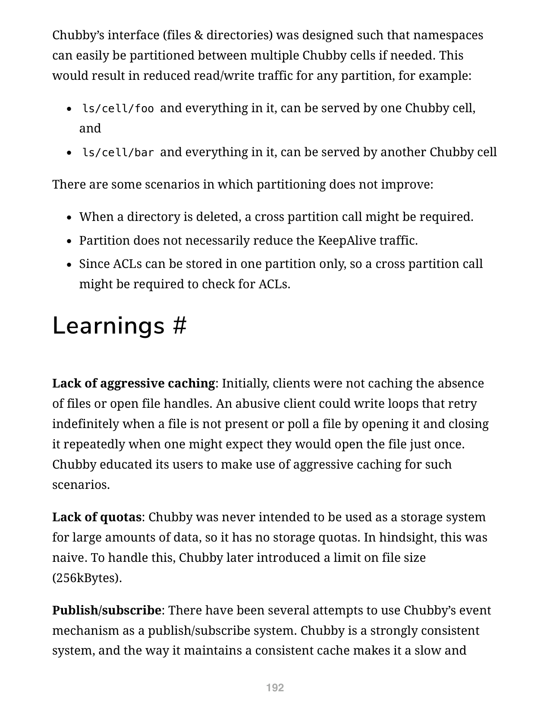

Chubby 代理可以处理 KeepAlive 和读请求。如果代理处理 N 个客户端，KeepAlive 流量减少 N 倍。所有写入和首次读取通过缓存到达主节点——代理为写入和首次读取增加了一次额外 RPC，但这对 Chubby 这种读密集型服务是可以接受的。

### 分区

Chubby 的接口设计使得命名空间可以在需要时轻松在多个 Chubby Cell 之间分区。这将减少任何分区的读/写流量。例如，`ls/cell/foo` 可以由一个 Chubby Cell 服务，`ls/cell/bar` 由另一个服务。

但某些场景下分区没有改善：删除目录时可能需要跨分区调用；分区不一定减少 KeepAlive 流量；ACL 只能存储在一个分区，检查时可能需要跨分区调用。

### 经验教训

1. **缺乏积极缓存**：最初客户端不缓存文件缺失或打开文件句柄。Chubby 教育用户在这种情况下使用积极缓存
2. **缺乏配额**：Chubby 从未打算用作大量数据的存储系统，没有存储配额。后来引入了文件大小限制（256KB）
3. **发布/订阅**：有多次尝试将 Chubby 的事件机制用作发布/订阅系统。Chubby 是强一致性系统，维护一致缓存的方式使其成为发布/订阅的缓慢低效选择
4. **开发者很少考虑可用性**：开发者通常不考虑故障概率，错误假设 Chubby 始终可用。Chubby 教育客户为短期 Chubby 中断做好规划

<!-- 图: page 193 - Chubby 扩展架构总结图 -->

---

## 使用的系统设计模式

| 模式 | 用途 |
|------|------|
| [[预写日志]] | 为了容错和处理主节点崩溃，所有数据库事务存储在事务日志中 |
| [[仲裁]] | 为了确保强一致性，Chubby 主节点将所有写请求发送给副本；收到 Cell 中大多数副本的确认后，向客户端发送确认 |
| [[世代时钟\|Generation Clock]] | 为了忽略来自前一个主节点的请求，每个新选的主节点使用"时代号"，单调递增 |
| [[租约]] | Chubby 客户端通过定期 KeepAlive 与主节点维护有时间限制的会话租约。此期间主节点保证不会单方面终止会话 |

---

## 总结

1. Chubby 是 Google 系统内部使用的分布式锁服务
2. 它提供粗粒度锁定（持续数小时或数天），不建议用于细粒度锁定（秒级）。因此更适合高读取、低频写入场景
3. Chubby 的主要用例包括命名服务、领导者选举、小文件存储和分布式锁
4. Chubby Cell 指的是 Chubby 集群。一个 Chubby Cell 有多个服务器（通常 5 个），称为副本
5. 使用 Paxos，一台服务器被选为主节点处理所有请求。主节点故障时另一个副本成为主节点
6. 每个副本维护一个小型数据库存储文件/目录/锁。主节点直接写入本地数据库，异步同步到所有副本
7. 客户端应用使用 Chubby 库通过 RPC 与 Cell 中的副本通信
8. 类似 Unix，Chubby 文件系统接口是文件和目录的树（节点），每个目录包含子文件和子目录列表
9. 锁：每种模式可以是排他的（一个客户端写模式）或共享的（任意数量客户端读模式）
10. 临时节点用作临时文件，向其他人指示客户端存活。没有客户端打开时自动删除
11. 元数据包括 ACL、单调递增的 64 位数字和校验和
12. 事件：Chubby 支持简单的事件机制，让客户端订阅各种文件事件
13. 缓存：为了减少读流量，客户端在写通缓存中缓存文件内容、元数据和句柄
14. 会话：客户端通过 KeepAlive RPC 维护会话。这占示例 Chubby 集群请求的约 90%
15. 备份：每隔几小时，每个 Cell 的主节点将快照写入其他建筑的 GFS 服务器
16. 镜像：文件可以从一个 Cell 镜像到另一个，通常用于复制配置文件

<!-- 图: page 196 - Chubby 完整架构总结图 -->

---

## 选择题

1. Chubby 使用什么共识协议来管理其系统状态？
   a. Raft
   b. Paxos
   c. Zab
   d. Gossip

2. Chubby 锁的类型是什么？
   a. 强制锁
   b. 建议锁
   c. 乐观锁
   d. 悲观锁

3. Chubby 中临时节点（Ephemeral Node）的作用是什么？
   a. 存储长期数据
   b. 指示客户端存活状态，无客户端打开时自动删除
   c. 作为备份节点
   d. 用于负载均衡

4. Chubby 如何处理主节点故障转移？
   a. 使用预设的备用主节点
   b. 客户端投票选举新主节点
   c. 使用 Paxos 选新主节点，通过时代号区分新旧主节点
   d. 重启整个集群

5. 以下哪个不是 Chubby 的推荐用例？
   a. 领导者选举
   b. 命名服务
   c. 高频数据存储和发布-订阅
   d. 分布式锁

**答案**
1. b
2. b
3. b
4. c
5. c
