# 5 GFS：如何设计分布式文件存储系统

## GFS 简介

### 目标

设计一个分布式文件系统，能够存储海量文件（TB 级及以上），并且系统应具备可扩展性、可靠性和高可用性。

### 什么是 Google File System (GFS)？

[[GFS]]（Google File System）是 Google 为其大规模数据密集型应用开发的分布式文件系统。GFS 专为处理大规模数据集上的批处理而构建，设计目标是系统到系统的交互，而非用户到系统的交互。

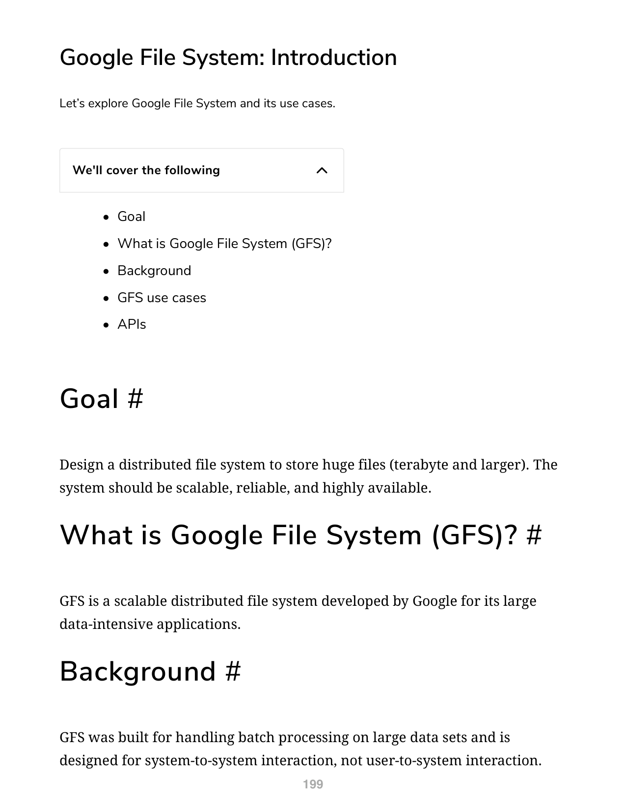

### 背景

Google 构建 GFS 时考虑了以下设计目标：

1. **可扩展**：GFS 应在由通用硬件构建的超大规模系统上可靠运行
2. **容错**：设计必须充分容忍硬件和软件故障，使应用级服务能够在任何可能的故障组合下继续运行
3. **大文件**：GFS 中存储的文件将非常巨大。多 GB 文件是常见情况
4. **大顺序读和小随机读**：工作负载主要包括两种读取：大型流式读取和小型随机读取
5. **顺序写**：工作负载还包括许多大型顺序写入，将数据追加到文件。一旦写入，文件很少被再次修改
6. **不针对小数据优化**：小随机读写确实存在且被支持，但系统不针对此类场景优化
7. **并发访问**：并发访问级别也很高，大量并发追加操作尤其普遍，通常伴随着并发读取
8. **高吞吐量**：GFS 应优化高且持续的读取吞吐量，优先级高于延迟。这不是说延迟不重要，而是 GFS 需要针对高性能读取和追加大量数据进行优化

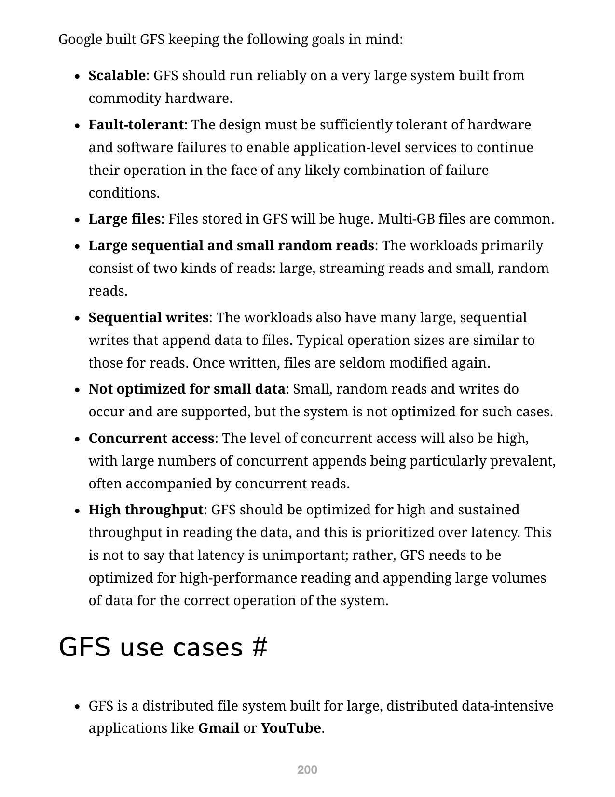

### GFS 的用例

GFS 是为大型分布式数据密集型应用（如 Gmail 或 YouTube）构建的分布式文件系统。最初，它是为存储 Google 大型爬取和索引系统生成的数据而构建的。Google 的 [[BigTable]] 使用 GFS 存储日志和数据文件。

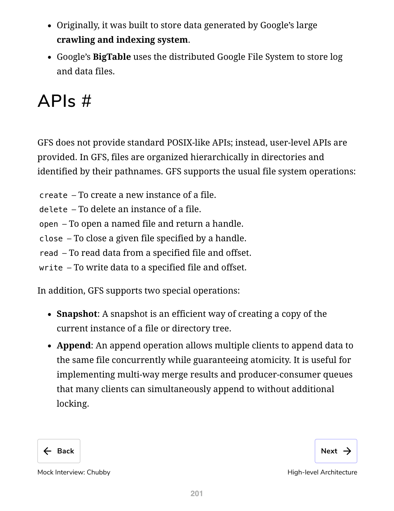

### APIs

GFS 不提供标准的 POSIX 类 API，而是提供用户级 API。GFS 中文件按目录层次组织，通过路径名标识。GFS 支持常规文件系统操作：

- **create** — 创建新文件实例
- **delete** — 删除文件实例
- **open** — 打开命名文件并返回句柄
- **close** — 关闭给定句柄指定的文件
- **read** — 从指定文件和偏移量读取数据
- **write** — 向指定文件和偏移量写入数据

此外，GFS 支持两种特殊操作：

- **Snapshot（快照）**：高效创建文件或目录树的当前实例副本
- **Append（追加）**：允许多个客户端并发地向同一文件追加数据，同时保证原子性。它对于实现多路合并结果和生产-消费者队列非常有用，多个客户端可以同时追加而无需额外加锁

---

## 高层架构

### 基本术语

#### 块（Chunk）

由于 GFS 中存储的文件通常非常大，GFS 将文件拆分为多个固定大小的块，每个块大小为 **64 MB**。

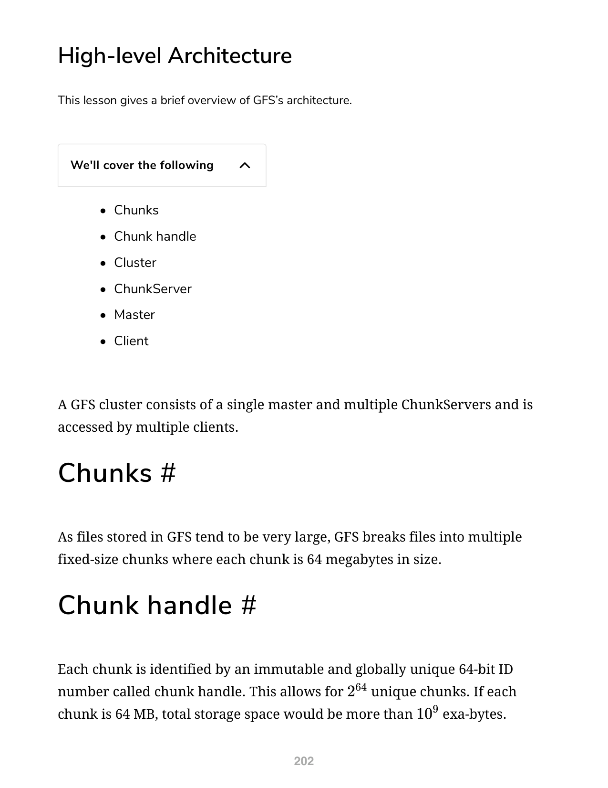

#### 块句柄（Chunk Handle）

每个块由一个不可变的、全局唯一的 64 位 ID 号标识，称为**块句柄**。这允许有 2^64 个唯一的块。如果每个块为 64 MB，总存储空间将超过 10^9 EB（Exabyte）。

由于文件被分割成块，GFS 的工作是提供从文件到块的映射，然后支持对文件的标准操作，最终映射到对单个块的操作。

#### 集群（Cluster）

GFS 组织在一个简单的计算机网络中，称为**集群**。所有 GFS 集群包含三种实体：

1. 一个主服务器（Master）
2. 多个块服务器（ChunkServer）
3. 多个客户端（Client）

主服务器存储系统的所有元数据，而块服务器存储实际的文件数据。

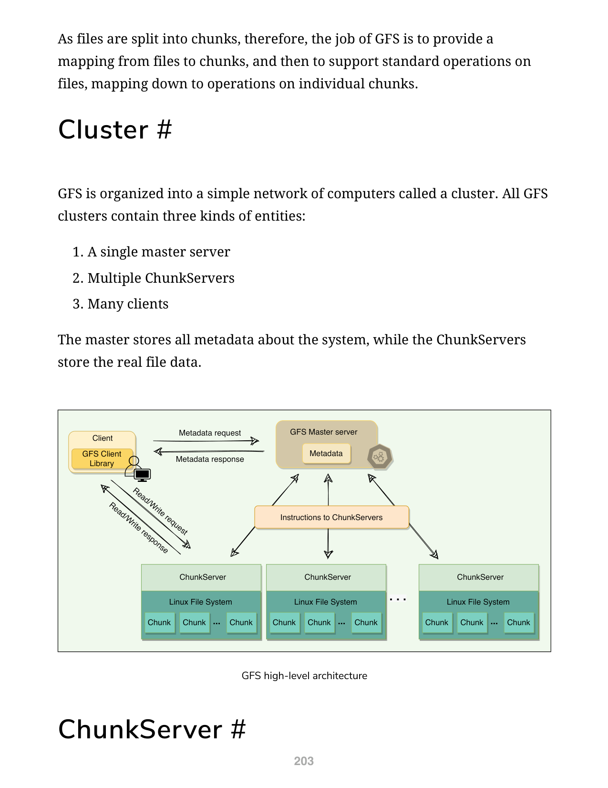

#### 块服务器（ChunkServer）

块服务器将块作为普通 Linux 文件存储在本地磁盘上，并根据块句柄和字节范围读取或写入块数据。为了可靠性，每个块会复制到多个块服务器上。默认情况下，GFS 存储三个副本，但可以为每个文件指定不同的复制因子。

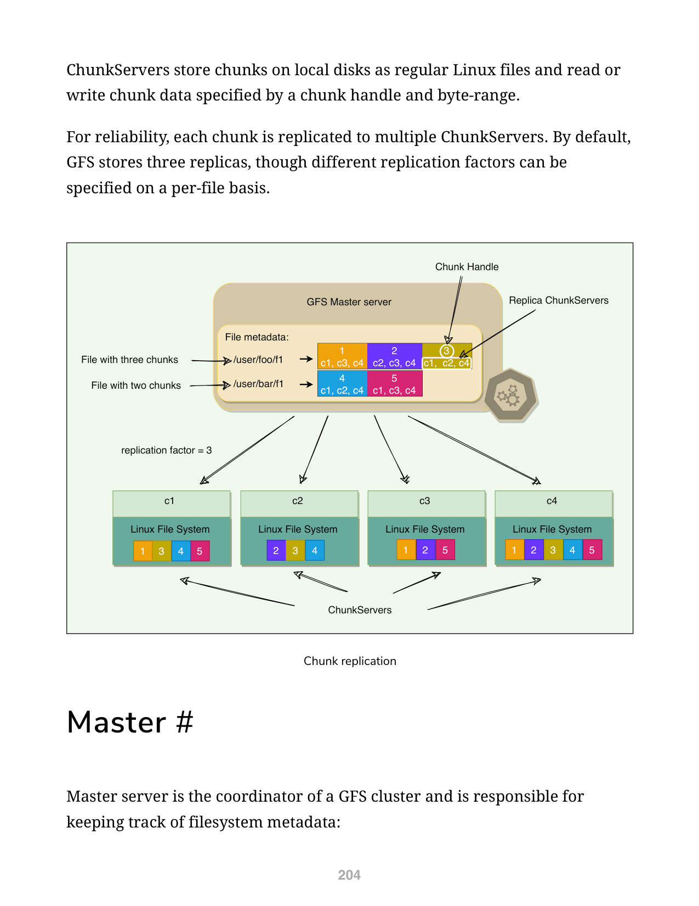

#### 主服务器（Master）

主服务器是 GFS 集群的协调者，负责跟踪文件系统元数据：

1. **存储的元数据包括**：
   - 每个文件的名称和目录
   - 每个文件到其块的映射
   - 块的当前位置
   - 访问控制信息

2. **控制系统级活动**，例如：块租约管理（带过期时间的块锁）、孤立块的垃圾回收、块服务器之间的块迁移。主服务器在创建块时为块分配块句柄

3. **定期与每个块服务器通信**：通过心跳消息发送指令并收集状态

4. **所有元数据存储在内存中**：包括整个文件系统命名空间以及所有名称到块的映射，以实现性能和快速随机访问

5. **容错和崩溃恢复**：所有元数据变更写入磁盘上的操作日志。此操作日志也会复制到远程机器上

6. **主服务器是单点故障**，因此将数据复制到多个远程机器，以便在故障时快速恢复

7. **集中式主服务器的好处**：拥有文件系统的全局视图，可以做出最优管理决策，例如块放置相关的决策

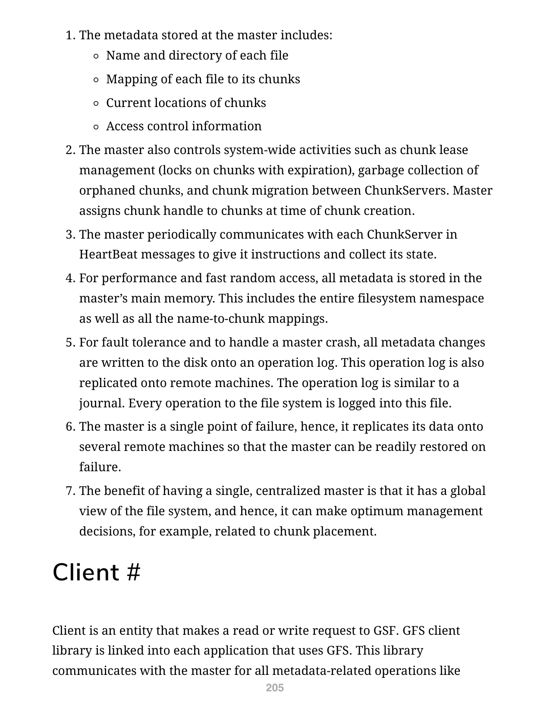

#### 客户端（Client）

客户端是对 GFS 发起读写请求的实体。GFS 客户端库链接到每个使用 GFS 的应用程序。该库与主服务器通信以处理所有元数据相关操作（如创建或删除文件、查找文件等）。要读取或写入数据，客户端直接与持有数据的块服务器交互。

客户端和块服务器都不缓存文件数据。客户端缓存收益很小，因为大多数应用程序流式处理大文件或工作集太大而无法缓存。块服务器依赖 Linux 中的缓冲区缓存在内存中维护频繁访问的数据。

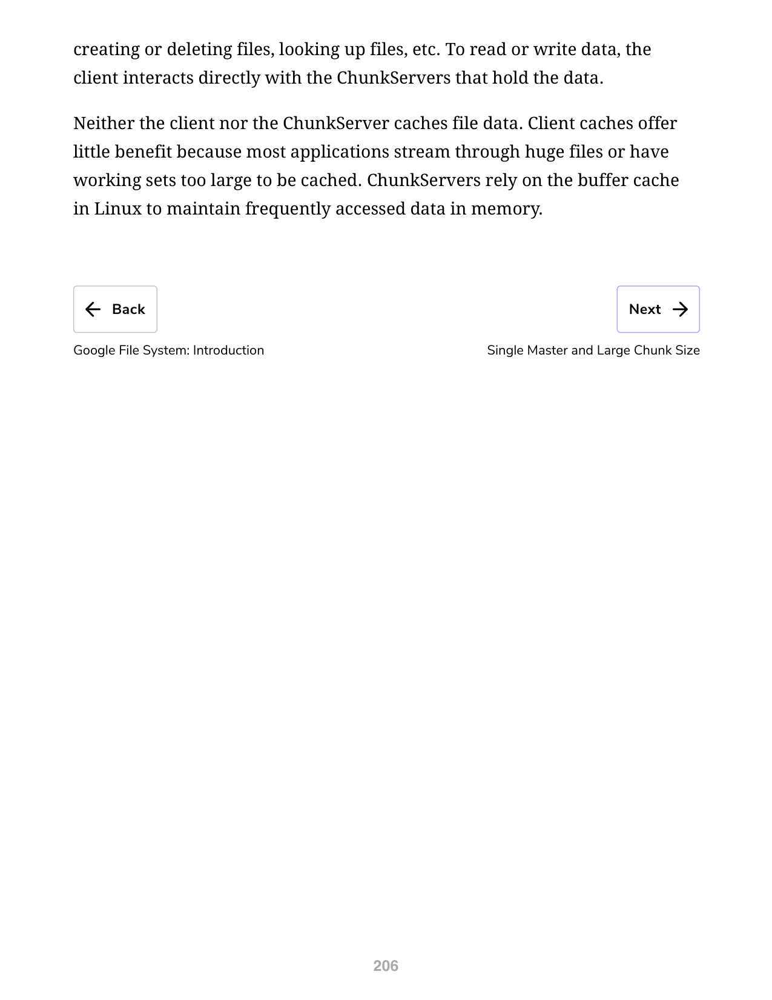

---

## 单一主服务器与大块大小

### 单一主服务器

拥有单一主服务器大大简化了 GFS 设计，并使主服务器能够利用全局知识做出复杂的块放置和复制决策。然而，GFS 最小化主服务器在读写中的参与，使其不会成为瓶颈。客户端从不通过主服务器读取或写入文件数据。相反，客户端询问主服务器应联系哪些块服务器，在有限时间内缓存此信息，然后直接与块服务器交互进行后续操作。

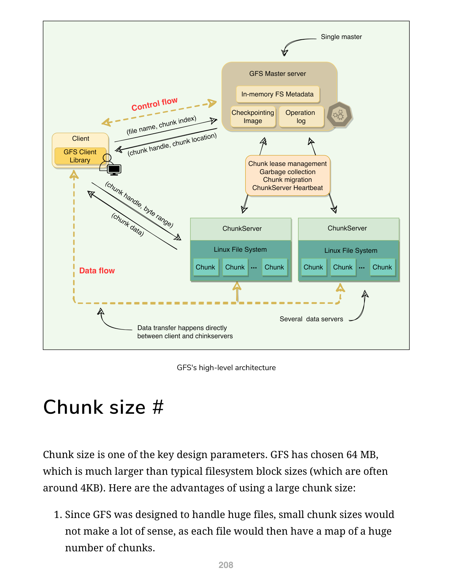

### 块大小

块大小是关键设计参数之一。GFS 选择了 **64 MB**，远大于典型文件系统块大小（通常约 4 KB）。使用大块大小的优势：

1. **针对大文件设计**：小块大小意味着每个文件需要映射的巨大数量的块
2. **减少主服务器负载**：小块大小会显著增加主服务器需要管理的数据量，以及需要与客户端通信的数据量，导致额外网络流量
3. **元数据内存化**：大块大小减少了主服务器上存储的元数据大小，使主服务器能将所有元数据保存在内存中，显著降低控制操作的延迟
4. **减少与主服务器的通信**：客户端可以缓存大文件的所有块位置信息。客户端元数据缓存具有超时机制，降低缓存过期数据的风险
5. **TCP 连接复用**：可以长时间保持与块服务器的 TCP 连接，摊销建立 TCP 连接的时间
6. **简化管理**：简化了检查哪些块服务器接近容量或过载的管理工作
7. **高效顺序读写**：提供大量数据的高效顺序读取和追加

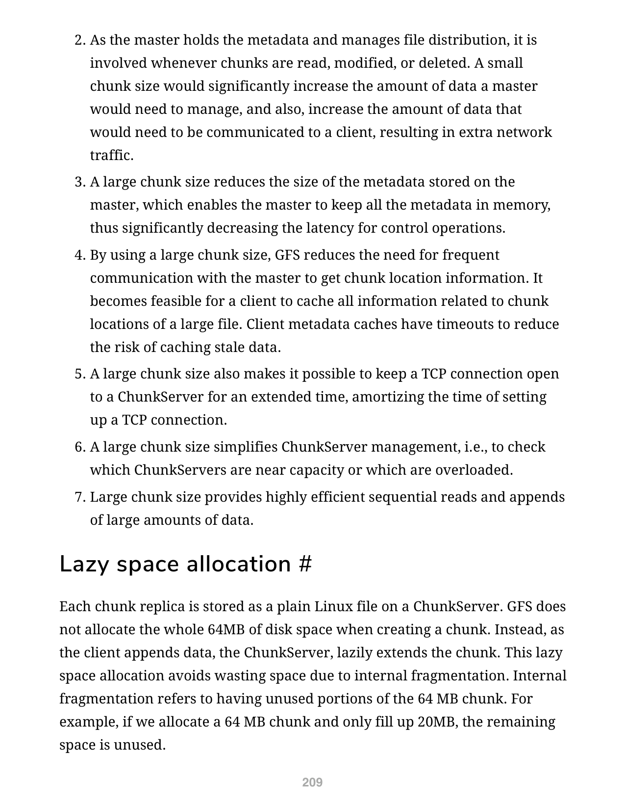

### 惰性空间分配

每个块副本在块服务器上存储为普通的 Linux 文件。GFS 在创建块时不会分配整个 64 MB 磁盘空间，而是当客户端追加数据时，块服务器惰性地扩展块。这种惰性空间分配避免了因内部碎片导致的空间浪费。内部碎片指 64 MB 块中未使用的部分——例如分配 64 MB 块但只填充 20 MB，剩余空间未使用。

大块大小的一个缺点是小文件的处理。由于小文件只有一两个块，如果大量客户端访问同一文件，存储这些块的块服务器可能成为热点。为应对此场景，GFS 以更高的复制因子存储此类文件，并在访问这些文件的应用程序启动时间中添加随机延迟。

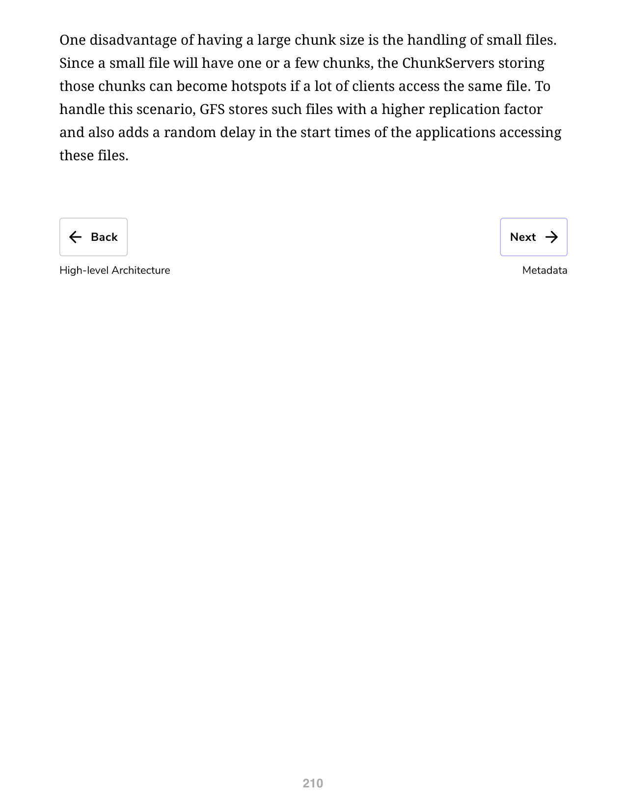

---

## 元数据

### 元数据类型

主服务器存储三种类型的元数据：

1. 文件和块命名空间（即目录层次结构）
2. 从文件到块的映射
3. 每个块副本的位置

主服务器管理元数据的三个方面：

1. 所有元数据保存在内存中
2. 前两种类型（命名空间和文件到块的映射）也持久化在主服务器的本地磁盘上
3. 第三种（块副本的位置）不持久化

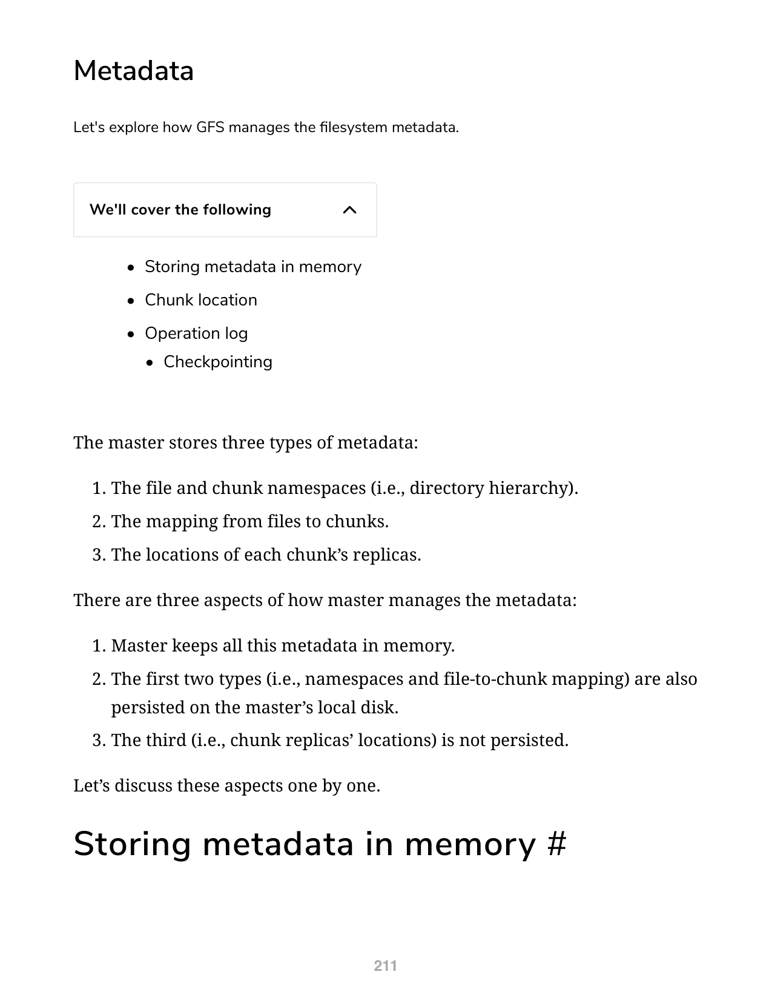

### 元数据存储在内存中

由于元数据存储在内存中，主服务器操作非常快速。此外，主服务器可以轻松高效地在后台定期扫描其整个状态。这种定期扫描用于实现三个功能：

1. **块垃圾回收**
2. **块服务器故障时的重新复制**
3. **块迁移以平衡块服务器之间的负载和磁盘空间使用**

一个潜在问题是主服务器内存限制整个系统的容量。这在实际中不是严重问题——主服务器为每个 64 MB 块维护不到 64 字节的元数据。大多数块是满的，因为大多数文件包含许多块，只有最后一个块可能部分填充。类似地，文件命名空间数据通常每个文件需要不到 64 字节，因为主服务器使用前缀压缩紧凑存储文件名。

如果需要支持更大的文件系统，为主服务器添加额外内存的成本相对于通过将元数据存储在内存中获得的安全性、可靠性、性能和灵活性来说很小。

### 块位置

主服务器不持久记录哪个块服务器拥有给定块的副本；相反，主服务器在主服务器启动时以及每当块服务器加入集群时，询问每个块服务器关于其块的信息。之后，主服务器可以通过控制所有块放置和通过定期心跳消息监控块服务器状态来保持自身更新。

通过将块服务器作为每个块位置的最终权威来源，GFS 消除了保持主服务器和块服务器同步的问题。在主服务器上维护一致的块位置视图并无益处，因为块服务器上的错误可能导致块自动消失（例如磁盘损坏被禁用、块服务器被重命名或故障等）。在有数百台服务器的集群中，这些事件发生得非常频繁。

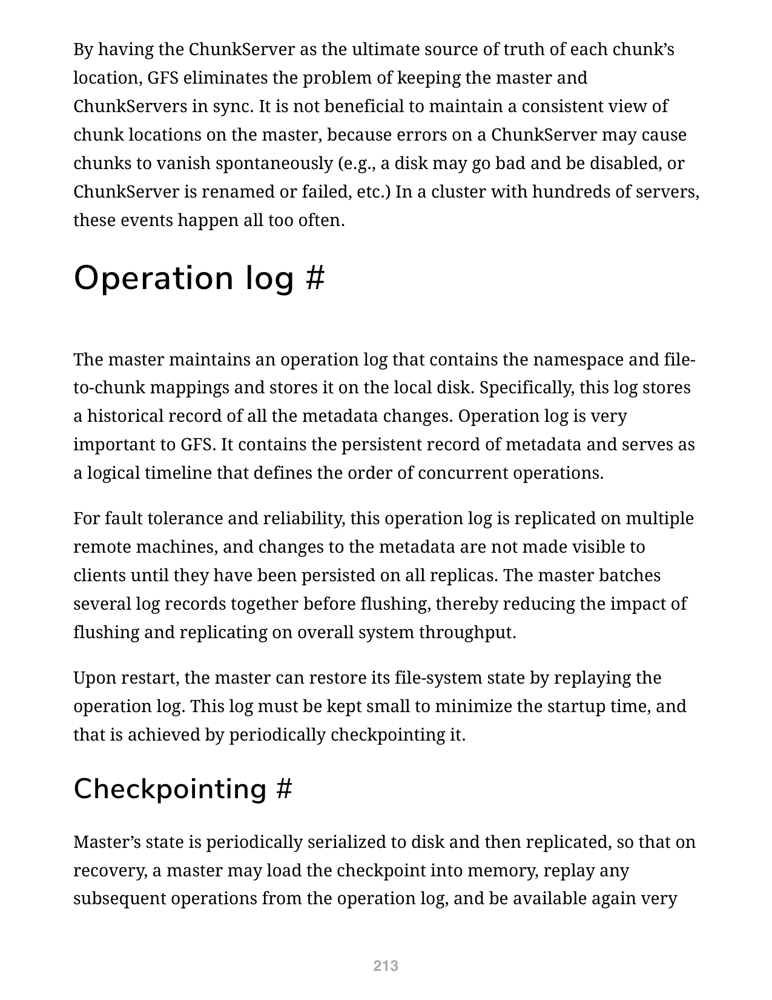

### 操作日志

主服务器维护一个操作日志，包含命名空间和文件到块的映射，并将其存储在本地磁盘上。具体来说，该日志存储了所有元数据变更的历史记录。操作日志对 GFS 非常重要——它包含元数据的持久记录，并作为定义并发操作顺序的逻辑时间线。

为了容错和可靠性，此操作日志在多个远程机器上复制，并且在所有副本上持久化之前，元数据的变更不会对客户端可见。主服务器在刷新前将多个日志记录批处理在一起，从而减少刷新和复制对整体系统吞吐量的影响。

重启时，主服务器可以通过重放操作日志来恢复其文件系统状态。此日志必须保持较小以最小化启动时间，这通过定期创建检查点来实现。

### 检查点

主服务器的状态定期序列化到磁盘然后复制，以便在恢复时，主服务器可以将检查点加载到内存中，从操作日志重放任何后续操作，并很快再次可用。为了进一步加速恢复和提高可用性，GFS 将检查点存储在紧凑的 B 树类格式中，可以直接映射到内存并用于命名空间查找，无需额外解析。

检查点过程可能需要时间，因此为避免延迟传入的变更，主服务器切换到新的日志文件并在单独的线程中创建新检查点。新检查点包含切换前的所有变更。

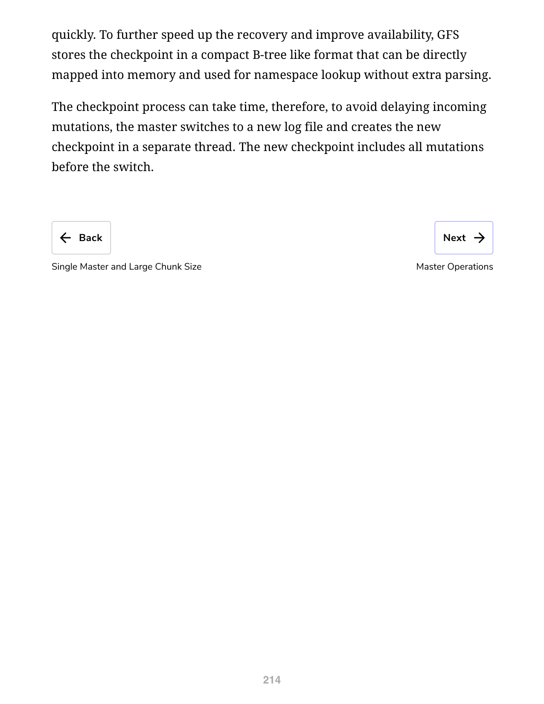

---

## 主服务器操作

### 概述

主服务器执行所有命名空间操作。此外，它管理整个系统中的块副本，负责：

- 做出副本放置决策
- 创建新块及副本
- 确保块按照复制因子完全复制
- 在所有块服务器之间平衡负载
- 回收未使用的存储

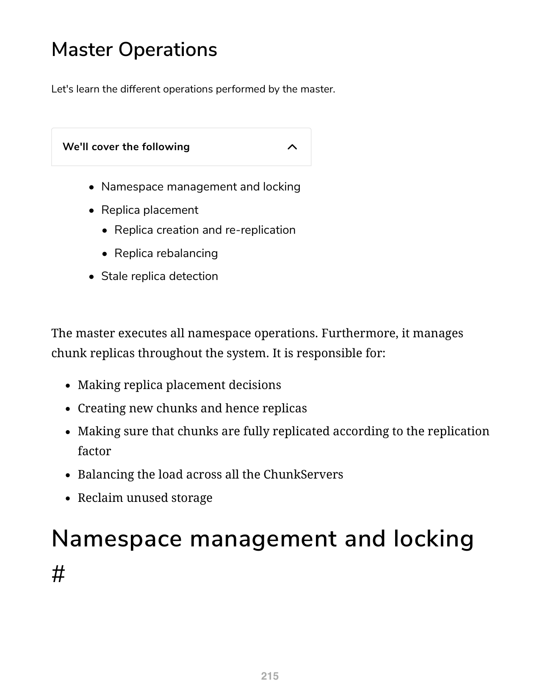

### 命名空间管理和锁定

主服务器在命名空间区域上获取锁以确保正确序列化，并允许多个操作同时进行。GFS 没有像 inode 那样的目录和文件树结构。相反，它有一个哈希映射，将文件名映射到其元数据，并在哈希表的每个节点上应用读写锁以进行同步。

每个绝对文件名或绝对目录名都有一个关联的读写锁。每个主服务器操作在执行前获取一组锁。

例如，对 `/dir1/dir2/leaf` 进行操作需要：
- 对 `/dir1` 的读锁
- 对 `/dir1/dir2` 的读锁
- 对 `/dir1/dir2/leaf` 的读锁或写锁

按照此方案，同一叶子上的并发写入立即被阻止。但与此同时，同一目录中的并发修改是允许的。

文件创建不需要对父目录的写锁；对其名称的读锁足以保护父目录不被删除、重命名或快照。文件名的写锁阻止创建多个同名文件的尝试。

锁按一致顺序获取以防止死锁：
1. 首先按命名空间树中的级别排序
2. 同一级别内按字典顺序排序

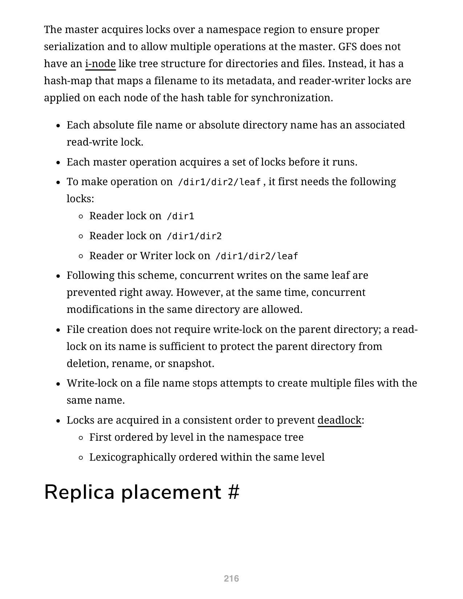

### 副本放置

为确保最大的数据可用性和完整性，主服务器将副本分布在不同机架上，以便在机架故障时客户端仍能读取或写入。由于机架的上行/下行带宽可能小于单台机器带宽的总和，将数据放置在不同机架可以帮助客户端利用来自多个机架的读取。对于写入操作，多个机架实际上是不利的，因为数据必须传输更长的距离。这是 GFS 做出的有意识权衡。

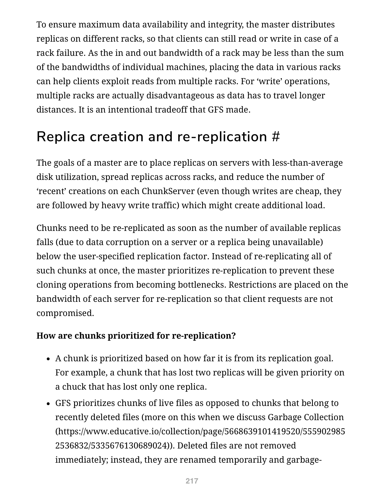

### 副本创建和重新复制

主服务器的目标是将副本放置在磁盘利用率低于平均水平的服务器上，跨机架分布副本，并减少每个块服务器上的"近期"创建数量（尽管写入成本低，但随后会有大量写入流量，可能产生额外负载）。

一旦可用副本数（由于服务器上的数据损坏或副本不可用）低于用户指定的复制因子，就需要重新复制块。为防止这些克隆操作成为瓶颈，主服务器优先处理重新复制而非一次性全部处理。对每个服务器用于重新复制的带宽施加限制，以确保客户端请求不受影响。

**块的重新复制优先级**：
- 根据块与其复制目标的差距进行优先级排序。例如，丢失两个副本的块优先于仅丢失一个副本的块
- GFS 优先处理存活文件的块，而非属于最近删除文件的块（稍后在垃圾回收中讨论）

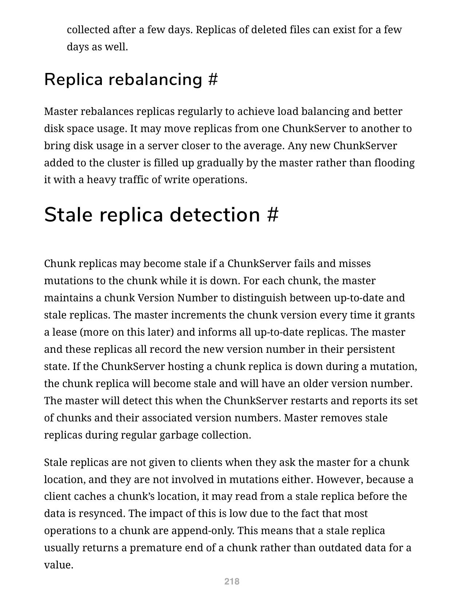

### 副本再平衡

主服务器定期重新平衡副本以实现负载均衡和更好的磁盘空间使用。它可以将副本从一个块服务器移动到另一个，以使服务器的磁盘使用接近平均值。任何添加到集群的新块服务器都会由主服务器逐渐填充，而不是用大量写入流量淹没它。

### 过期副本检测

如果块服务器故障并在宕机期间错过了对块的修改，块副本可能变"过期"。对于每个块，主服务器维护一个**块版本号**来区分最新和过期的副本。每次主服务器授予租约（稍后讨论）时都会递增块版本号，并通知所有最新副本。主服务器和这些副本都将新版本号记录在持久状态中。如果托管块副本的块服务器在修改期间宕机，该块副本将变过期并具有较旧的版本号。当块服务器重启并报告其块集合及关联版本号时，主服务器将检测到此问题。主服务器在常规垃圾回收期间移除过期副本。

过期副本不会在客户端向主服务器询问块位置时提供给客户端，也不会参与修改。但是，由于客户端缓存块位置，它可能在数据重新同步之前从过期副本读取。此影响很小，因为大多数对块的操作是仅追加的——这意味着过期副本通常返回块的不完整结尾，而非过期的值数据。

---

## 读取操作剖析

典型的 GFS 读取交互流程如下：

1. 客户端将应用程序指定的文件名和字节偏移量转换为文件内的块索引。给定固定的块大小，这可以轻松计算
2. 客户端向主服务器发送包含文件名和块索引的 RPC 请求
3. 主服务器回复块句柄和持有该块的副本位置。客户端使用文件名和块索引作为键缓存此元数据。这些信息随后用于访问数据
4. 客户端向其中一个副本（最近的）发送请求。请求指定块句柄和该块内的字节范围
5. 副本块服务器回复请求的数据
6. 从上述工作流可以看出，主服务器仅在开始时参与，然后完全退出，实现了**控制流和数据流的分离**——这种分离对于保持文件访问的高性能至关重要

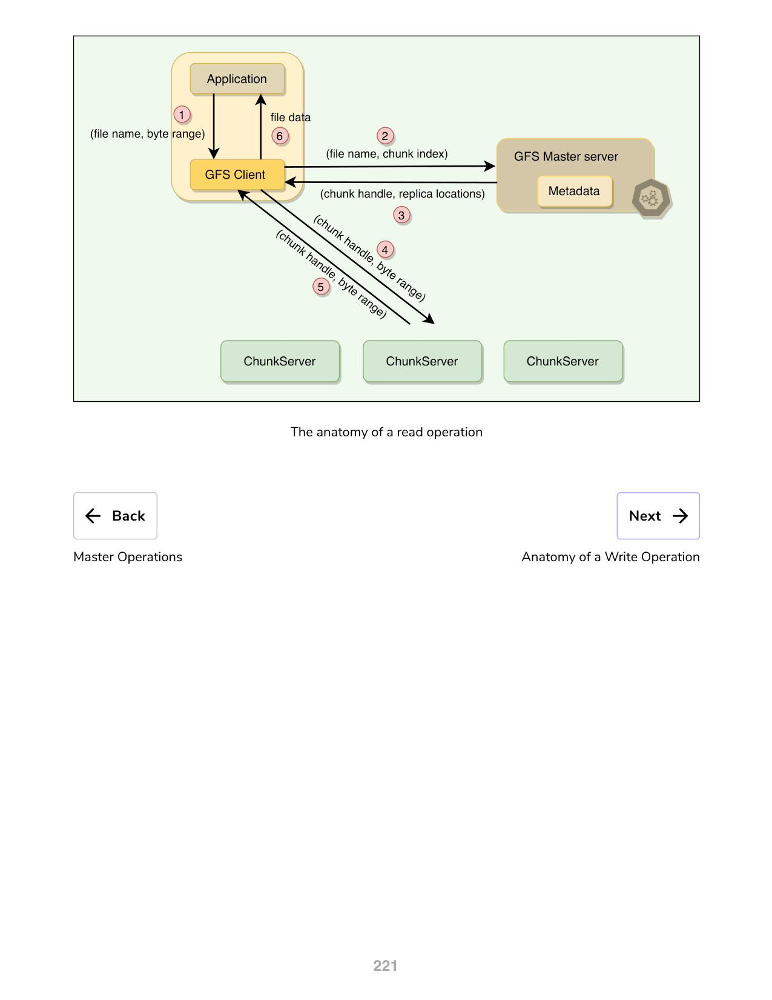

同一个块的后续读取不需要更多的客户端-主服务器交互，直到缓存信息过期或文件被重新打开。实际上，客户端通常在同一个请求中询问多个块，主服务器也可以包含紧随所请求块之后的其他块的信息。

---

## 写入操作剖析

### 什么是块租约？

为防止对块的两个不同副本进行并发写入，GFS 使用**块租约**。当请求对块进行修改（写入、追加或删除操作）时，主服务器找到持有该块的块服务器，并向其中一个授予块租约（60 秒）。持有租约的服务器称为**主副本（Primary）**，负责为该块的所有当前挂起的并发修改提供串行顺序。任何时候每个块只有一个租约，因此如果两个写入请求到达主服务器，两者看到的是同一个租约，标识同一个主副本。

因此，全局排序由块租约的顺序结合主副本确定的顺序提供。主副本可以在需要时请求租约扩展。当主服务器授予租约时，它会递增块版本号并通知包含该块的所有副本新的版本号。

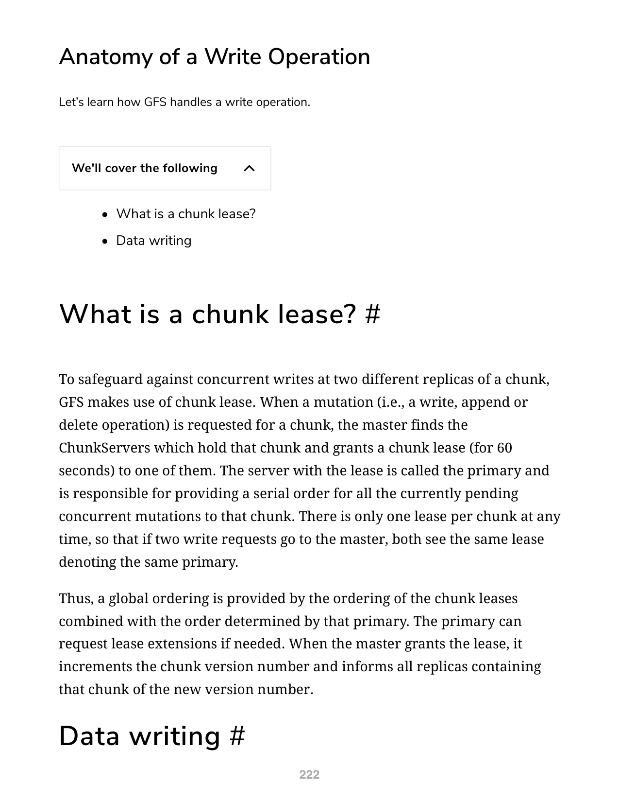

### 数据写入流程

实际的数据写入分为两个阶段：

**发送阶段**：
1. 客户端向主服务器询问哪个块服务器持有当前块的租约以及其他副本的位置
2. 主服务器回复主副本的身份和次要副本的位置
3. 客户端将数据推送到最近的副本。然后副本链式地将数据发送到所有其他副本，以最大化带宽和吞吐量。最终所有副本都收到数据，但数据尚未写入文件，而是存在于缓存中

**写入阶段**：
4. 当客户端收到所有副本已接收数据的确认后，向主副本发送写入请求，标识前一阶段发送的数据
5. 主副本负责写入的序列化。它为接收到的所有写入请求分配连续的序列号，按序列号顺序将写入应用到文件，并按该顺序将写入请求转发到次要副本
6. 次要副本以相同的序列号顺序应用修改
7. 次要副本回复主副本表示操作完成
8. 主副本回复客户端成功或错误消息

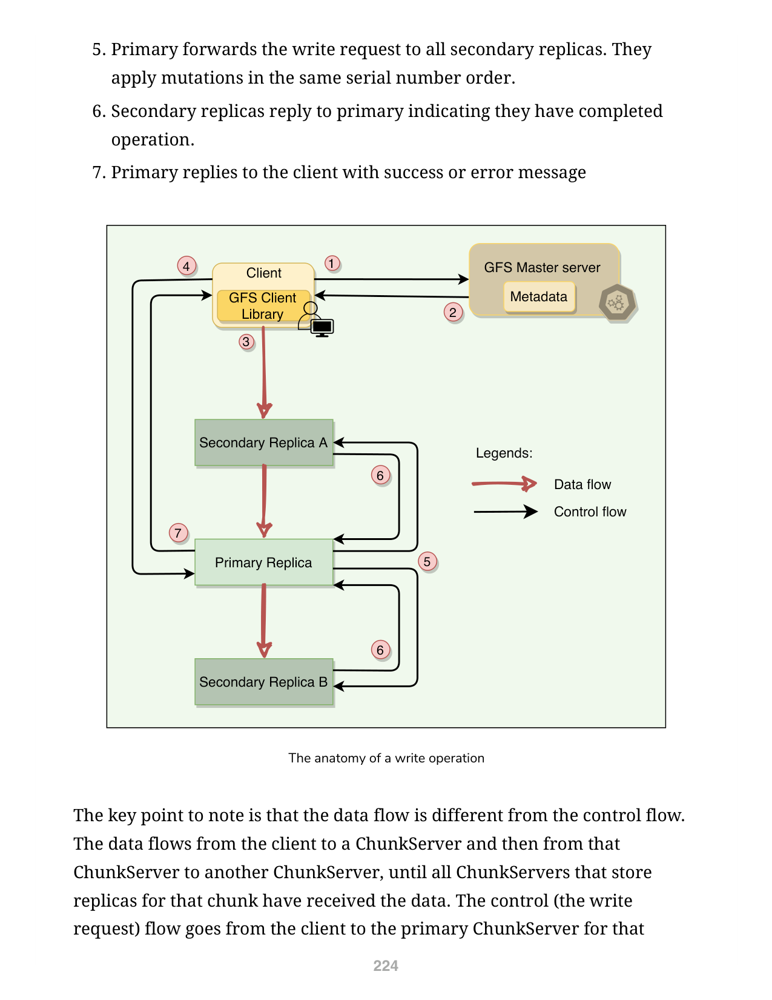

关键点是**数据流与控制流分离**：
- 数据流：客户端 → 最近的块服务器 → 链式传播到所有副本
- 控制流：客户端 → 主副本 → 次要副本

这确保了即使主副本收到多个并发写入请求，也能控制写入顺序。所有副本将以相同顺序写入数据。块版本号用于检测是否有副本由于在更新期间宕机而持有过期数据。

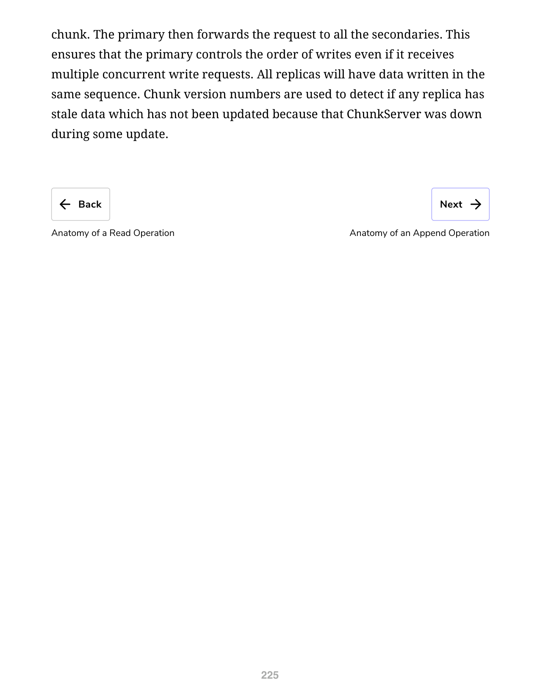

---

## 追加操作剖析

记录追加操作以独特的方式优化，这使 GFS 与其他分布式文件系统区分开来。在普通写入中，客户端指定写入数据的偏移量。并发写入同一区域可能遇到竞态条件，该区域最终可能包含来自多个客户端的数据片段。

而在记录追加中，客户端只指定数据。GFS 以 GFS 选择的偏移量**至少一次原子地**（即作为连续的字节序列）将其追加到文件，并将该偏移量返回给客户端。此过程类似于 POSIX 文件系统上以 `O_APPEND` 模式打开文件的追加操作，但没有多个写入者并发执行时的竞态条件。

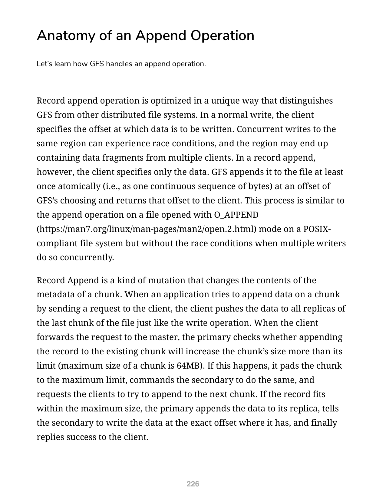

记录追加是一种修改操作，会更改块的元数据内容。当应用尝试通过向客户端发送请求来追加数据到块时：

1. 客户端像写入操作一样将数据推送到文件最后一个块的所有副本
2. 客户端将请求转发到主副本
3. 主副本检查将记录追加到现有块是否会使其大小超过限制（最大 64 MB）
4. **如果会超过限制**：主副本将块填充到最大限制，命令次要副本同样操作，然后请求客户端尝试追加到下一个块
5. **如果记录适合**：主副本将数据追加到其副本，告诉次要副本在完全相同的偏移量写入数据，最后回复客户端成功

如果追加操作在任何副本上失败，客户端会重试操作。因此，同一块的副本可能包含不同的数据，可能包括同一记录的完整或部分重复。GFS 不保证所有副本在字节级别一致；它只保证数据至少一次作为原子单位写入。

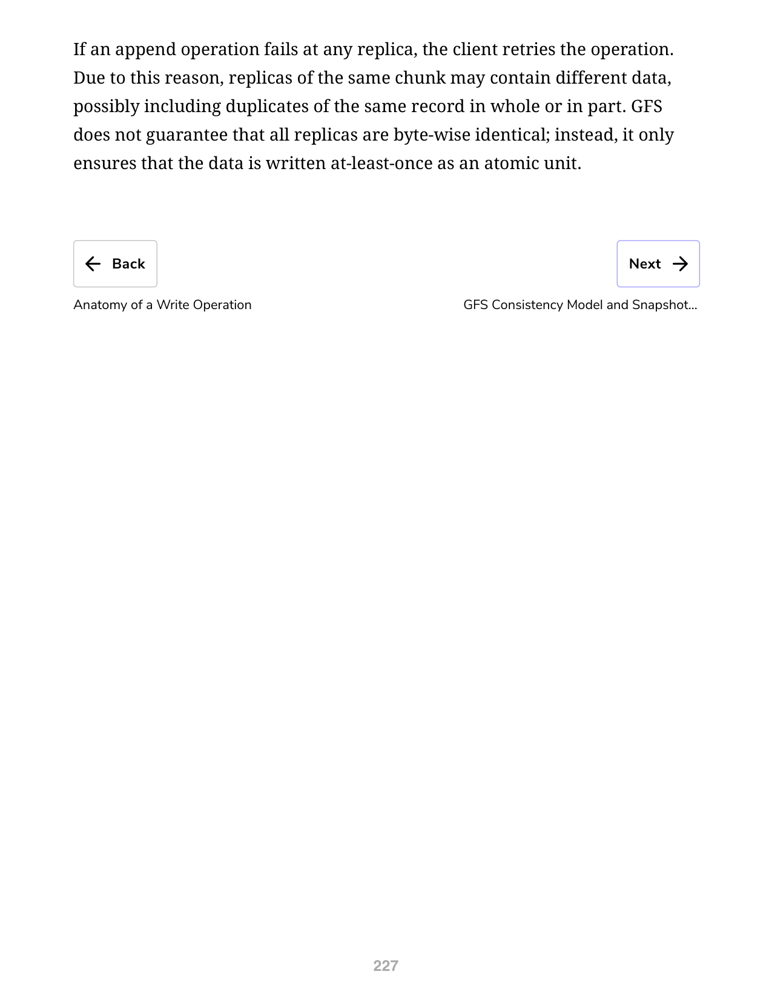

---

## 一致性模型与快照

### GFS 一致性模型

为保持简单高效，GFS 拥有宽松的一致性模型。

**元数据操作**（如文件创建）是原子的。它们完全由主服务器处理。命名空间锁定保证原子性和正确性，而主服务器的操作日志定义了这些操作的全局总顺序。

在数据修改中，**写入**和**追加**操作之间有重要区别：
- **写入**操作指定修改应发生的偏移量。这意味着块中的偏移量是预先确定的
- **追加**始终在文件末尾应用，由系统决定偏移量

对同一位置的并发写入不可序列化，可能导致文件区域的损坏。对于追加操作，GFS 保证追加将**至少一次且原子地**发生（即作为连续的字节序列）。系统不保证块的所有副本相同（有些可能有重复数据）。

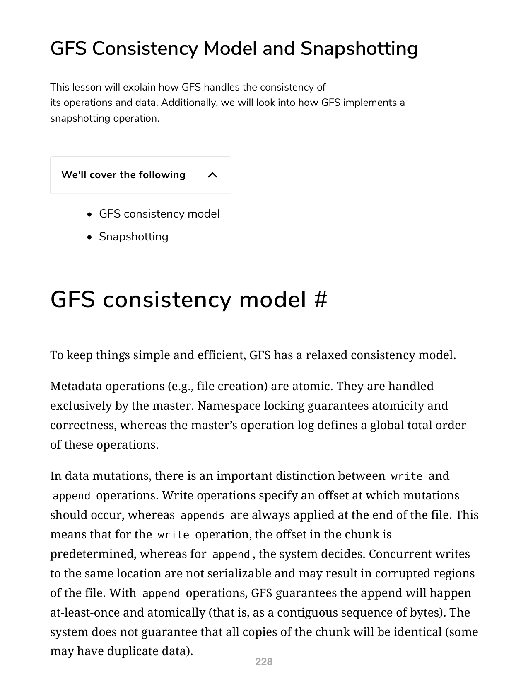

### 快照

快照是全局命名空间某个子树在给定时间点的副本。GFS 客户端使用快照高效地分支同一数据的两个版本。GFS 中的快照最初是**零拷贝**的——这意味着数据副本仅在客户端请求修改块时才创建。此方案称为**写时复制（Copy-on-Write）**。

当主服务器收到快照请求时：

1. 首先撤销要快照的文件中所有块的未完成租约
2. 等待租约被撤销或过期
3. 将快照操作记录到操作日志
4. 通过复制源目录树的元数据来创建快照
5. 新创建的快照文件仍然指向原始块

当客户端请求写入这些块之一时，主服务器通过检查其引用计数（将大于 1）检测到这是写时复制块。此时，主服务器要求持有副本的每个块服务器在本地制作块副本并存储。这些本地副本是为了避免通过网络复制块。复制完成后，主服务器为新副本发出租约，写入继续进行。

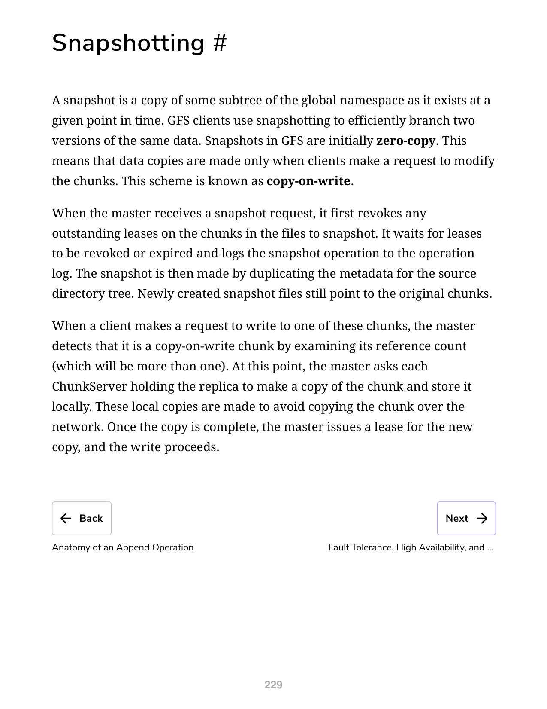

---

## 容错、高可用与数据完整性

### 容错策略

GFS 使用两种简单策略实现容错和高可用：

1. **组件故障时的快速恢复**
2. **复制以实现高可用**

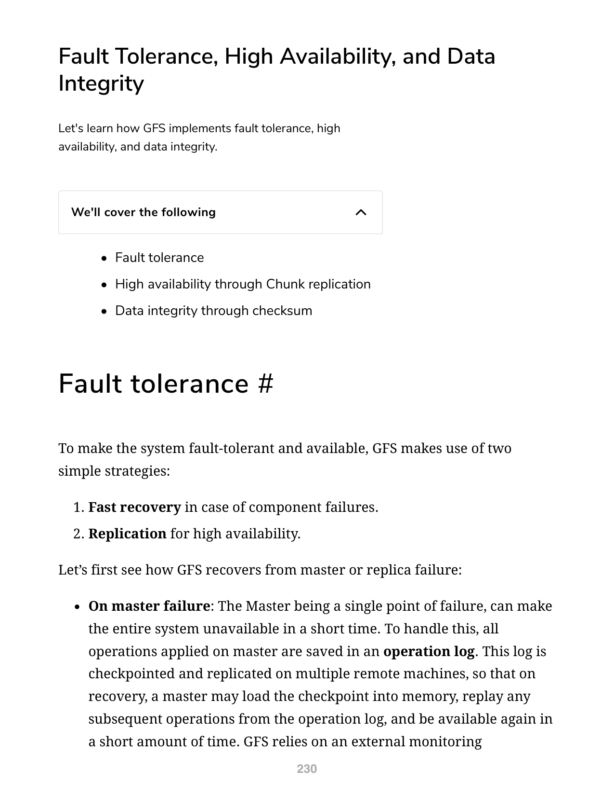

#### 主服务器故障

主服务器作为单点故障，可能在短时间内使整个系统不可用。为处理此问题：

- 所有在主服务器上应用的操作都保存在**操作日志**中
- 此日志被**检查点化**并在多个远程机器上**复制**
- 恢复时，主服务器可以将检查点加载到内存中，从操作日志重放任何后续操作，并在短时间内再次可用
- GFS 依赖外部监控基础设施检测主服务器故障并将流量切换到**备用主服务器**

**影子主服务器**（Shadow Master）是主服务器的副本，即使在主服务器宕机时也提供对文件系统的只读访问。所有影子主服务器通过读取主服务器的操作日志，以与主服务器完全相同的更新序列保持自身更新。影子主服务器可能稍滞后于主服务器，但它们增强了未积极更改的文件或不介意获取略微过期元数据的应用程序的读取可用性。由于文件内容是从块服务器读取的，应用程序不会观察到过期的文件内容。

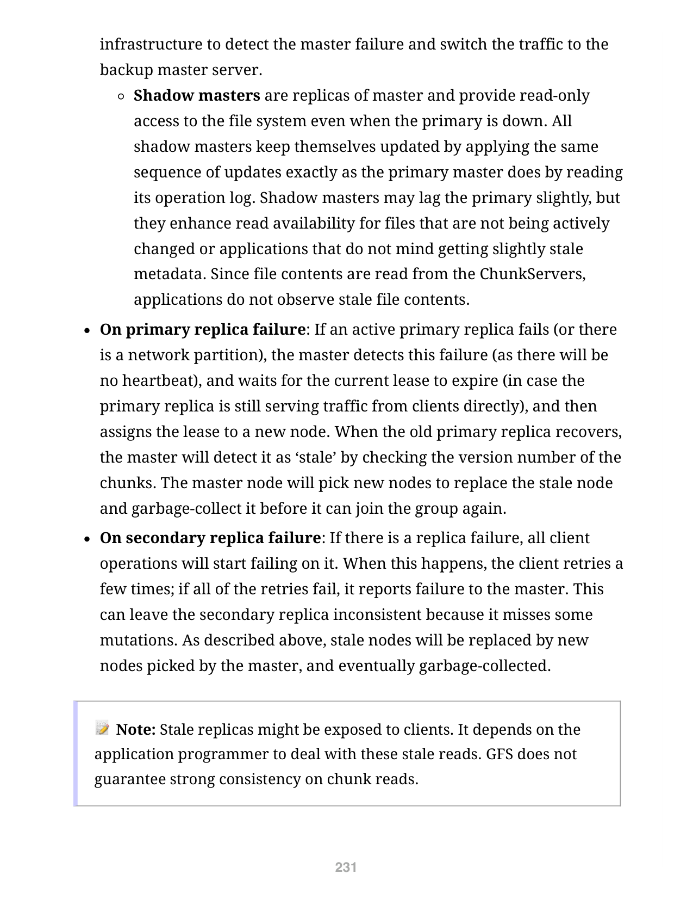

#### 主副本故障

如果活跃的主副本故障（或发生网络分区），主服务器通过心跳超时检测到此故障，等待当前租约过期（以防主副本仍直接为客户端提供流量），然后将租约分配给新节点。当旧主副本恢复时，主服务器通过检查块的版本号将其检测为"过期"。主服务器会选择新节点替换过期节点，并在其重新加入组之前进行垃圾回收。

#### 次要副本故障

如果有副本故障，所有客户端操作在其上开始失败。发生这种情况时，客户端重试几次；如果所有重试都失败，向主服务器报告失败。这可能导致次要副本因错过某些修改而不一致。如前所述，过期节点将被主服务器选择的新节点替换，并最终被垃圾回收。

注意：过期副本可能暴露给客户端。这取决于应用程序开发者处理这些过期读取。GFS 不保证块读取的强一致性。

### 通过块复制实现高可用

如前所述，每个块在多个不同机架的块服务器上复制。用户可以为文件命名空间的不同部分指定不同的复制级别。默认值为三个副本。主服务器克隆现有副本以保持每个块完全复制——当块服务器离线或主服务器通过校验和验证检测到损坏的副本时。

只有当所有副本在 GFS 能够做出反应之前全部丢失时，块才会不可逆转地丢失。即使在这种情况下，数据变得不可用但不会损坏，这意味着应用程序会收到明确的错误而非损坏的数据。

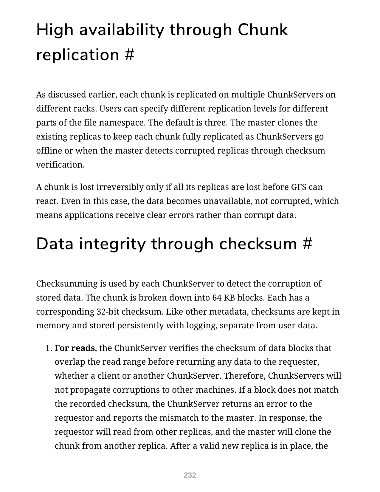

### 通过校验和实现数据完整性

每个块服务器使用**校验和**来检测存储数据的损坏。块被分解为 64 KB 的块。每个块有一个对应的 32 位校验和。像其他元数据一样，校验和保存在内存中，并使用日志持久存储，与用户数据分开。

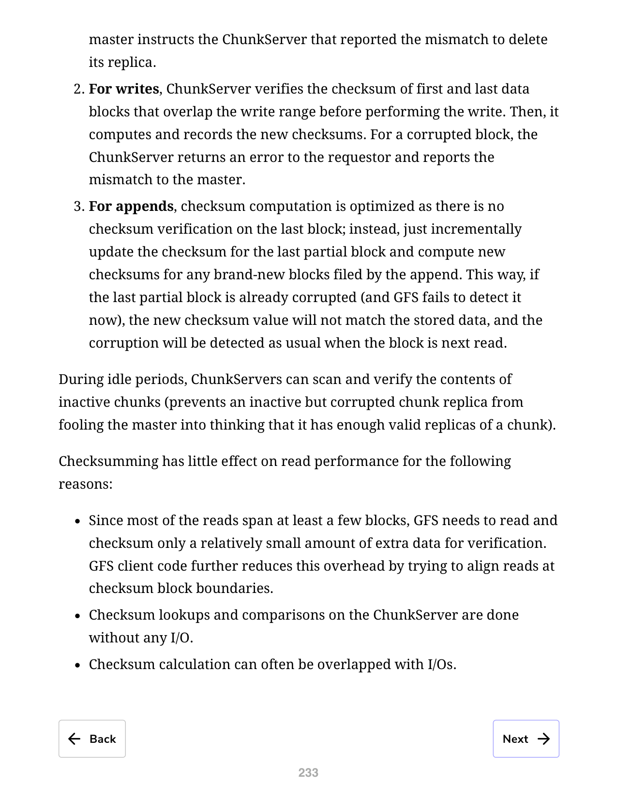

**读取时的校验和**：
- 块服务器在向请求者（无论是客户端还是其他块服务器）返回数据之前，验证与读取范围重叠的数据块的校验和
- 因此，块服务器不会将损坏传播到其他机器
- 如果块与记录的校验和不匹配，块服务器向请求者返回错误并向主服务器报告不匹配
- 请求者将从其他副本读取，主服务器将从另一个副本克隆块
- 有效的新副本就位后，主服务器指示报告不匹配的块服务器删除其副本

**写入时的校验和**：
- 块服务器在执行写入前验证与写入范围重叠的第一个和最后一个数据块的校验和
- 然后计算并记录新的校验和
- 对于损坏的块，块服务器向请求者返回错误并向主服务器报告不匹配

**追加时的校验和优化**：
- 不对最后一个块进行校验和验证；而是增量更新最后一个部分块的校验和，并计算追加填充的任何全新块的校验和
- 这样，如果最后一个部分块已经损坏（而 GFS 现在未能检测到），新的校验和值将与存储的数据不匹配，下次读取该块时将照常检测到损坏

**空闲期间**，块服务器可以扫描和验证非活跃块的内容（防止非活跃但损坏的块副本欺骗主服务器认为它有足够有效副本）。

**校验和对读取性能影响很小**的原因：
- 大多数读取跨度至少几个块，GFS 只需要读取和校验相对较少的额外数据用于验证
- GFS 客户端代码通过尝试在校验和块边界对齐读取来进一步减少此开销
- 块服务器上的校验和查找和比较无需任何 I/O
- 校验和计算通常可以与 I/O 重叠

---

## 垃圾回收

### 通过惰性删除进行垃圾回收

当文件被删除时，GFS 不会立即回收该文件使用的物理空间。而是采用**惰性垃圾回收策略**。

当客户端发起删除文件操作时，GFS 执行两个步骤：

1. 主服务器像其他更改一样记录删除操作
2. 删除的文件被重命名为包含删除时间戳的隐藏名称

文件在新特殊名称下仍可读取，也可以通过重命名回正常名称来"取消删除"。为回收物理存储，主服务器在执行文件系统定期扫描时，移除存在超过三天（此间隔可配置）的此类隐藏文件，并删除其内存中的元数据。这种惰性删除方案为误删文件的用户提供了恢复文件的窗口期。

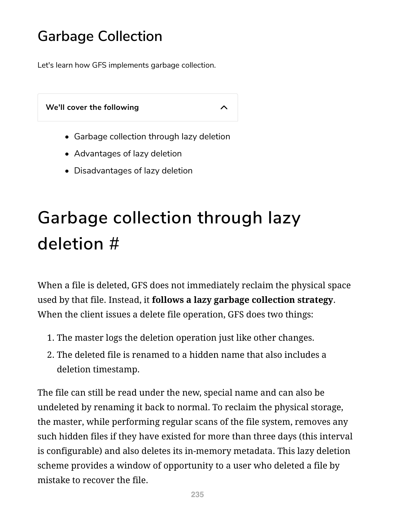

主服务器在执行块命名空间的定期扫描时，删除不属于任何文件的所有块的元数据。此外，在通过常规心跳消息与主服务器交换期间，每个块服务器报告其拥有的块的子集，主服务器回复该子集中不再存在于主服务器数据库中的块列表；然后从块服务器中删除这些块。

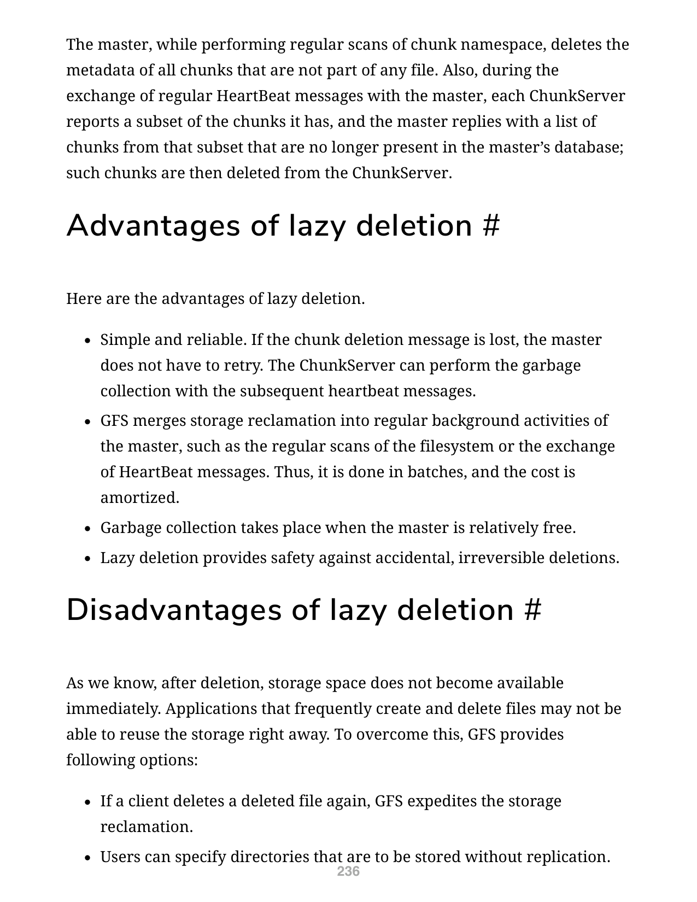

### 惰性删除的优势

1. **简单可靠**：如果块删除消息丢失，主服务器无需重试。块服务器可以在后续心跳消息中执行垃圾回收
2. **成本摊销**：GFS 将存储回收合并到主服务器的常规后台活动中，如文件系统的定期扫描或心跳消息的交换。因此批量完成，成本摊销
3. **主服务器相对空闲时执行**垃圾回收
4. **安全性**：惰性删除防止意外不可逆删除

### 惰性删除的劣势

删除后存储空间不会立即可用。频繁创建和删除文件的应用程序可能无法立即重用存储。为解决此问题，GFS 提供以下选项：

- 如果客户端再次删除已删除的文件，GFS 加速存储回收
- 用户可以指定不进行复制的目录
- 用户也可以指定立即执行删除的目录

---

## 对 GFS 的批评

### 单一主服务器的问题

随着 GFS 使用的增长，Google 开始看到集中式主服务器方案存在以下问题：

1. **主服务器成为瓶颈**：尽管分离了控制流（元数据操作）和数据流，但随着客户端数量增长，单个主服务器因 CPU 能力不足而无法服务所有客户端
2. **元数据增长**：尽管大块大小减少了元数据量，但主服务器存储的元数据正增长到难以将所有元数据保留在主内存中的水平

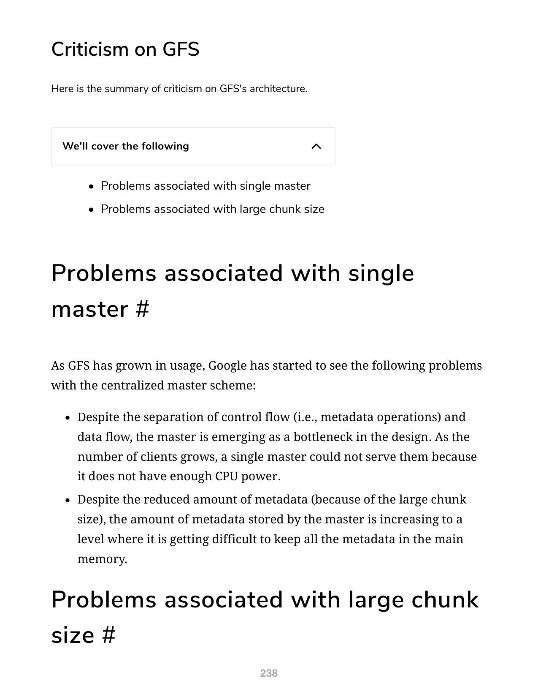

### 大块大小的问题

GFS 中 64 MB 的大块大小在读取时也有缺点。由于小文件只有一两个块，如果大量客户端访问同一文件，存储这些块的块服务器可能成为热点。作为解决方法，GFS 存储额外的副本以将负载分布到多个块服务器。此外，GFS 在访问此类文件的应用程序启动时间中添加随机延迟。

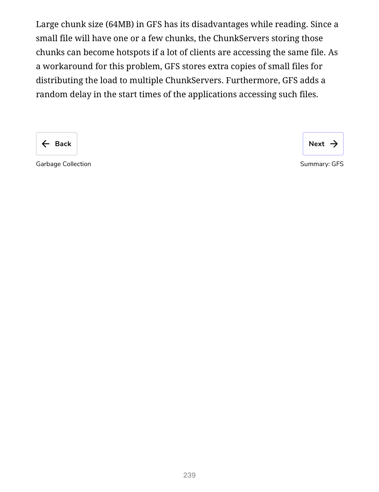

---

## 总结

| 特性 | GFS 实现 |
|------|---------|
| 适用场景 | 大规模数据密集型应用的分布式文件系统 |
| 硬件策略 | 使用通用硬件以降低基础设施成本 |
| 设计前提 | 系统硬件故障是常态而非例外 |
| 工作负载 | 大流式读取 + 小随机读取；大顺序写入追加 |
| 文件大小 | TB 级大文件，多 GB 文件很常见 |
| APIs | 标准文件操作 + 快照和记录追加 |
| 架构 | 单一主服务器 + 多个块服务器 + 多个客户端 |
| 块大小 | 64 MB 固定大小块，通过惰性空间分配避免碎片 |
| 元数据 | 全部在主服务器内存中，通过操作日志持久化 |
| 块位置 | 不持久化，通过心跳从块服务器收集 |
| 复制 | 默认 3 副本，跨机架分布 |
| 一致性 | 宽松一致性模型，保证追加至少一次原子写入 |
| 数据完整性 | 每个块服务器使用 64 KB 块的 32 位校验和 |
| 垃圾回收 | 惰性删除，隐藏文件 3 天后回收 |
| 快照 | 写时复制（Copy-on-Write），初始零拷贝 |
| 控制流与数据流 | 分离，主服务器仅参与元数据操作 |
| 主副本 | 通过 60 秒租约选出，负责序列化写入 |

### 使用的系统设计模式

| 模式 | 用途 |
|------|------|
| [[预写日志]] | 为了容错和处理主服务器崩溃，所有元数据更改写入磁盘上的操作日志 |
| [[心跳]] | GFS 主服务器定期通过心跳消息与每个块服务器通信以发送指令和收集状态 |
| [[校验和]] | 每个块服务器使用校验和检测存储数据的损坏 |
| [[租约]] | 主服务器向一个副本授予块租约（60 秒），使其成为主副本，负责序列化并发修改 |
| [[写时复制]] | 快照最初是零拷贝的；数据副本仅在客户端请求修改块时才创建 |

### 进一步阅读

- [GFS 论文](https://research.google/pubs/pub51/)
- [BigTable 论文](https://research.google/pubs/pub27898/)
- [GFS: Evolution on Fast-forward](https://queue.acm.org/detail.cfm?id=1594206)

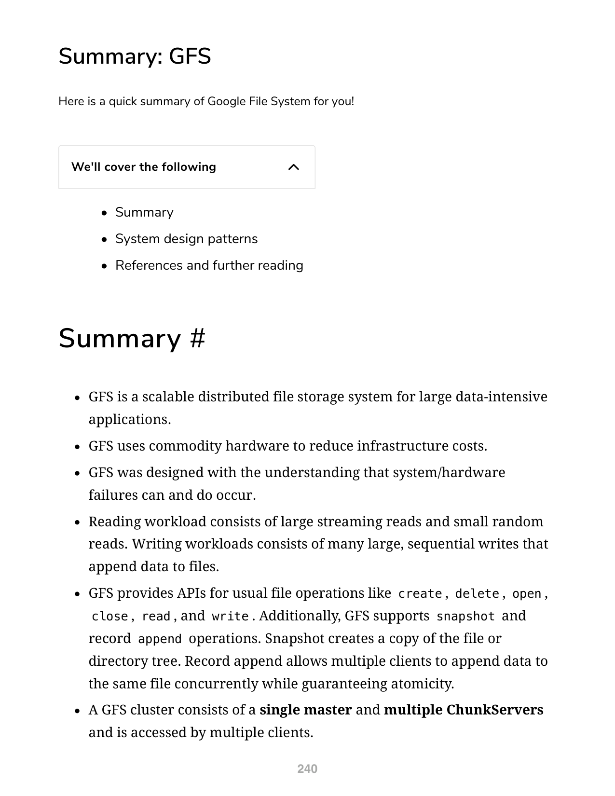

---

## 选择题

1. GFS 中每个块的默认大小是多少？
   a. 4 KB
   b. 64 MB
   c. 1 GB
   d. 256 MB

2. GFS 如何保证并发写入时的数据一致性？
   a. 使用分布式锁服务
   b. 通过块租约选出主副本，由主副本负责序列化写入
   c. 使用 Paxos 协议
   d. 所有写入必须经过主服务器

3. GFS 中控制流与数据流的关系是什么？
   a. 两者都经过主服务器
   b. 两者都经过块服务器
   c. 控制流经过主服务器，数据流直接在客户端和块服务器之间传输
   d. 控制流经过块服务器，数据流经过主服务器

4. GFS 如何处理文件删除操作？
   a. 立即回收物理空间
   b. 将文件重命名为隐藏名称，定期垃圾回收
   c. 仅删除元数据，不删除数据
   d. 将文件移动到回收站

5. 以下哪项不是对 GFS 的批评？
   a. 主服务器随客户端增长成为瓶颈
   b. 元数据增长到难以全量内存存储
   c. 大块大小导致小文件热点问题
   d. 副本数量过多导致存储成本过高

**答案**
1. b
2. b
3. c
4. b
5. d
