# 6 HDFS：如何设计分布式文件存储系统

## HDFS 简介

### 目标

设计一个分布式系统，能够存储海量文件（TB 级及以上），系统应具备可扩展性、可靠性和高可用性。

### 什么是 Hadoop Distributed File System (HDFS)？

[[HDFS]]（Hadoop Distributed File System）是一个分布式文件系统，专为存储非结构化数据而构建。它被设计为可靠地存储海量文件，并以高带宽将这些文件流式传输到用户应用程序。

HDFS 是 [[GFS]]（Google File System）的一种变体和简化版本。HDFS 的许多架构决策都受到 GFS 设计的启发。HDFS 构建在这样一个核心理念之上：**最高效的数据处理模式是一次写入、多次读取**（write-once, read-many-times）的模式。

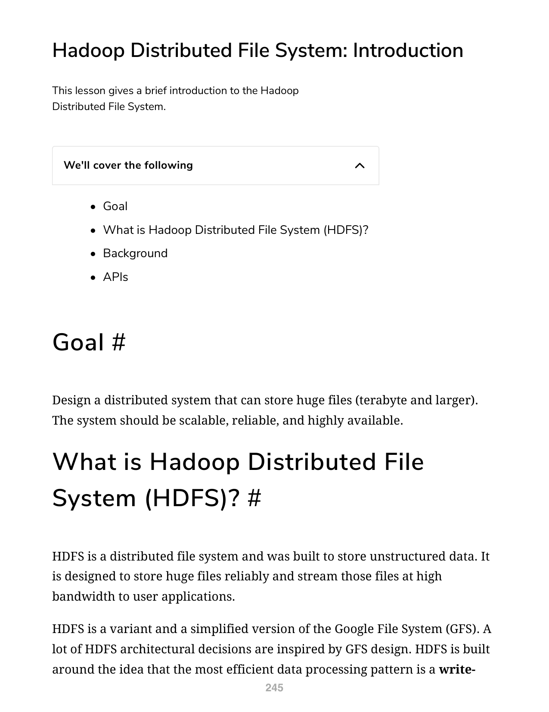

### 背景

[[Apache Hadoop]] 是一个提供分布式文件存储系统和分布式计算的软件框架，使用 [[MapReduce]] 编程模型分析和转换超大数据集。HDFS 是 Hadoop 中的默认文件存储系统。它被设计为分布式、可扩展、容错的文件系统，主要满足 MapReduce 范式的需求。

HDFS 和 GFS 都是为了存储超大文件并扩展到 PB 级存储而构建的。两者都是为处理海量数据集上的批处理而构建的，专为数据密集型应用设计，而非面向最终用户。与 GFS 一样，HDFS 也不符合 POSIX 标准，本身不是可挂载的文件系统。通常通过 HDFS 客户端或使用 Hadoop 库中的 API 调用来访问。

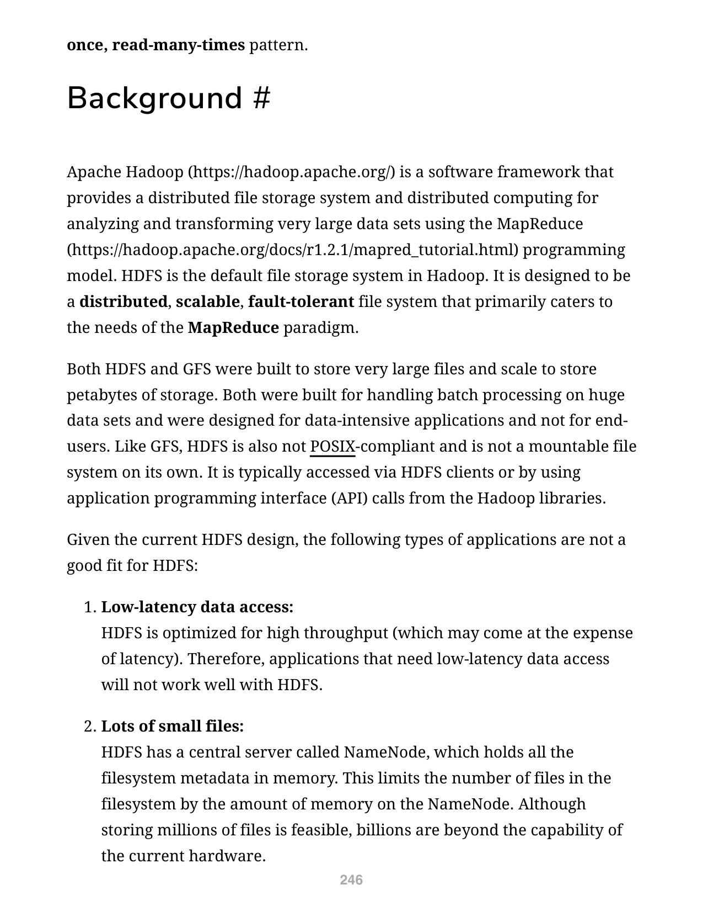

基于当前的 HDFS 设计，以下类型的应用程序不太适合 HDFS：

1. **低延迟数据访问**：HDFS 针对高吞吐量进行了优化（这可能以延迟为代价）。因此，需要低延迟数据访问的应用程序不适合 HDFS

2. **大量小文件**：HDFS 有一个称为 NameNode 的中央服务器，它在内存中保存所有文件系统元数据。这通过 NameNode 的内存容量限制了文件系统中的文件数量。虽然存储数百万个文件是可行的，但数十亿个文件超出了当前硬件的能力

3. **无并发写入者和任意文件修改**：与 GFS 相反，多个写入者不能并发写入 HDFS 文件。此外，写入总是在文件末尾以仅追加的方式进行；不支持在文件中的任意偏移量进行修改

### APIs

HDFS 不提供标准的 POSIX 类 API。相反，它暴露用户级 API。HDFS 中文件按目录层次组织，通过路径名标识。HDFS 支持常规文件系统操作，例如可以创建、删除、重命名、移动文件和目录，以及创建符号链接。所有读写操作都以仅追加的方式进行。

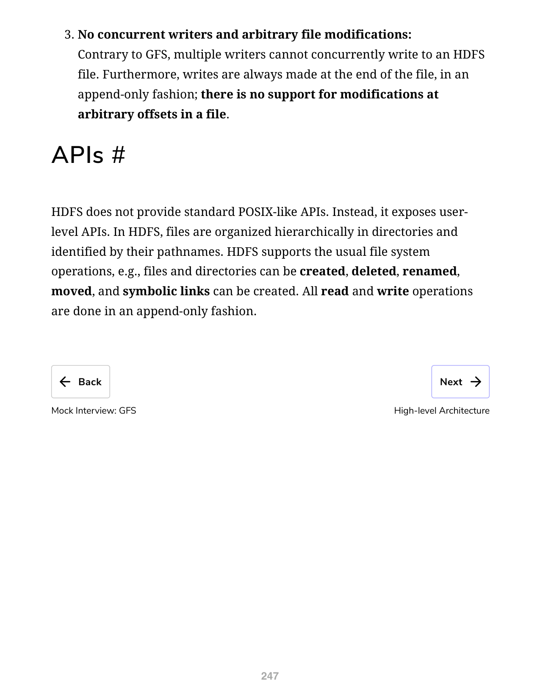

---

## 高层架构

### HDFS 架构

HDFS 中存储的所有文件都被拆分为多个固定大小的块，默认情况下每个块为 **128 MB**（可在每个文件基础上配置）。HDFS 中存储的每个文件由两部分组成：实际文件数据和元数据（即文件有多少个块部分、它们的位置以及总文件大小等）。HDFS 集群主要由管理文件系统元数据的 **NameNode** 和存储实际数据的 **DataNode** 组成。

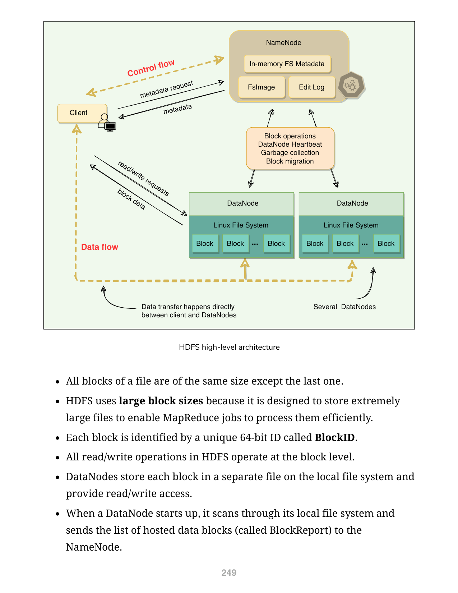

**关键特性**：

- 文件的所有块大小相同，最后一个块除外
- HDFS 使用大块大小，因为它被设计为存储超大文件，使 MapReduce 作业能够高效处理它们
- 每个块由一个唯一的 64 位 ID（称为 BlockID）标识
- HDFS 中的所有读写操作都在块级别执行
- DataNode 将每个块作为本地文件系统上的单独文件存储，并提供读/写访问
- 当 DataNode 启动时，它会扫描其本地文件系统，并将托管的数据库列表（称为 BlockReport）发送到 NameNode

NameNode 维护两个磁盘上的数据结构来存储文件系统状态：

- **FsImage**：文件系统元数据在某个时间点的检查点
- **EditLog**：自上次创建映像文件以来所有文件系统元数据事务的日志

这两个文件帮助 NameNode 从故障中恢复。

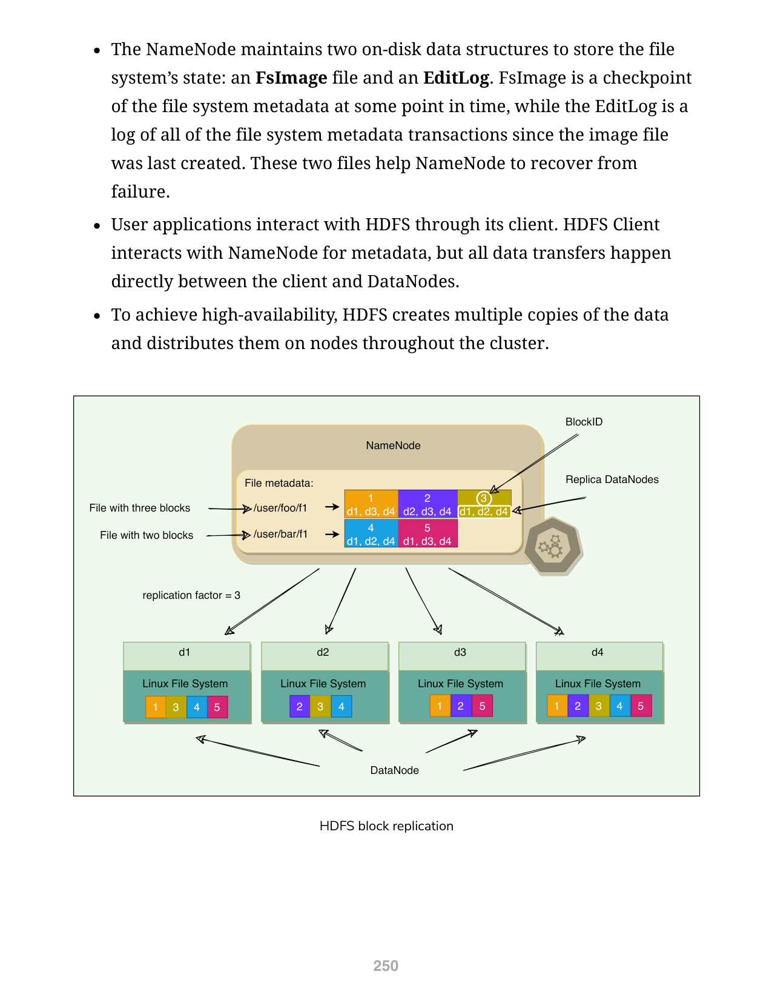

用户应用程序通过 HDFS 客户端与 HDFS 交互。HDFS 客户端与 NameNode 交互以获取元数据，但所有数据传输都直接在客户端和 DataNode 之间发生。为实现高可用性，HDFS 创建数据的多个副本并将其分布在集群中的节点上。

### GFS 与 HDFS 对比

HDFS 架构类似于 GFS，尽管术语存在差异。以下是两个文件系统之间的对比：

| 特性 | GFS | HDFS |
|------|-----|------|
| 存储节点 | ChunkServer | DataNode |
| 文件部分 | Chunk（块） | Block（块） |
| 块大小 | 默认 64 MB | 默认 128 MB |
| 元数据检查点 | Checkpoint | FsImage |
| 预写日志 | Operation log | EditLog |
| 平台 | Linux | 跨平台 |
| 开发语言 | C++ | Java |
| 可用性 | Google 内部使用 | 开源 |
| 监控 | Master 接收 ChunkServer 心跳 | NameNode 接收 DataNode 心跳 |
| 并发性 | 多写入者 + 多读取者 | 不支持多写入者，写入一次读取多次 |
| 文件操作 | 追加和随机写入 | 仅追加 |
| 垃圾回收 | 删除文件重命名到特定文件夹 | 删除文件重命名为隐藏名称 |
| 通信 | 基于 TCP 的 RPC，流水线 | 基于 TCP 的 RPC，流水线 |
| 缓存 | 客户端缓存元数据，不缓存文件数据 | 分布式缓存，显式指定路径缓存 |
| 复制策略 | 跨机架分布，默认 3 副本 | 机架感知复制，默认 2 副本在同机架，第 3 副本在不同机架 |
| 文件系统命名空间 | 目录层次结构 | 传统层次结构 + 支持 S3 等第三方文件系统 |
| 数据库 | BigTable 使用 GFS | HBase 使用 HDFS |

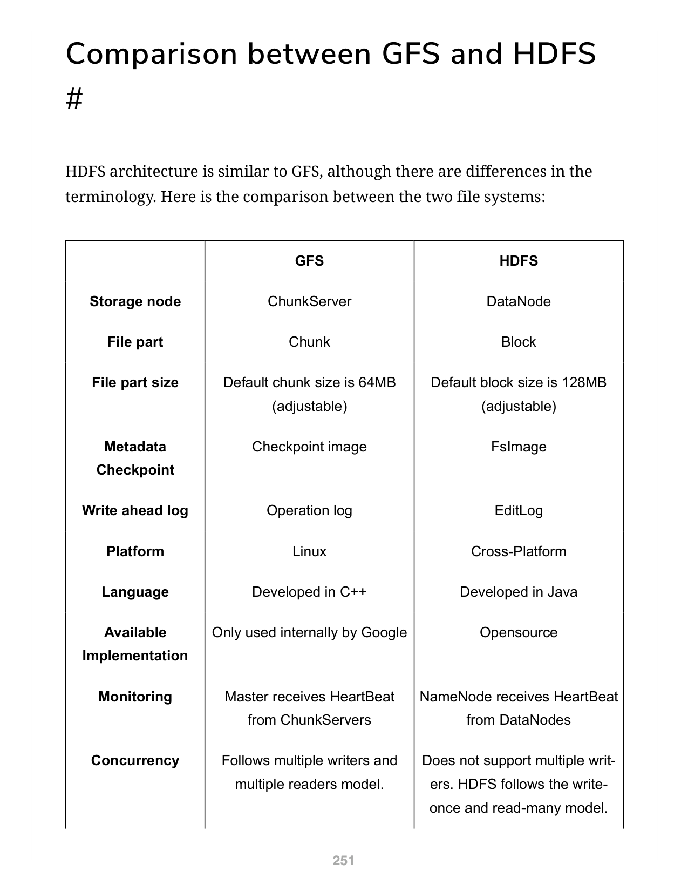

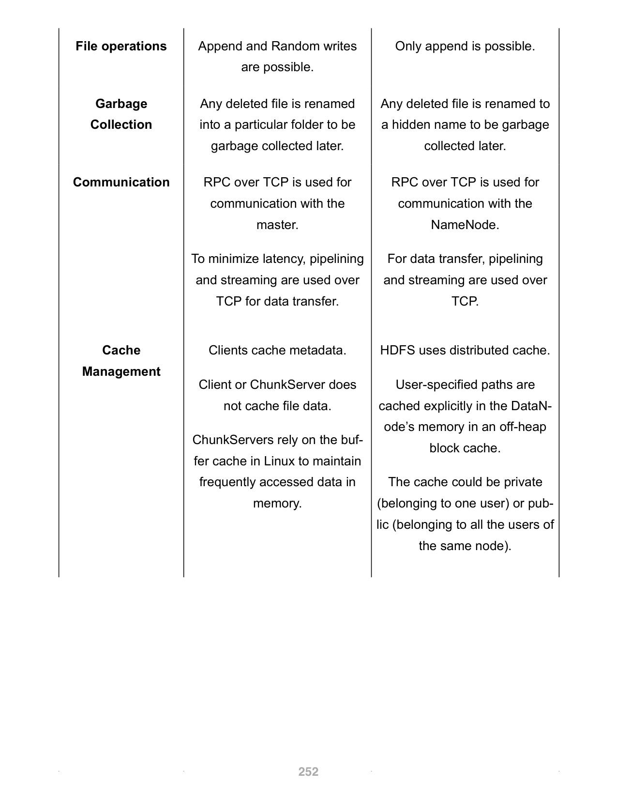

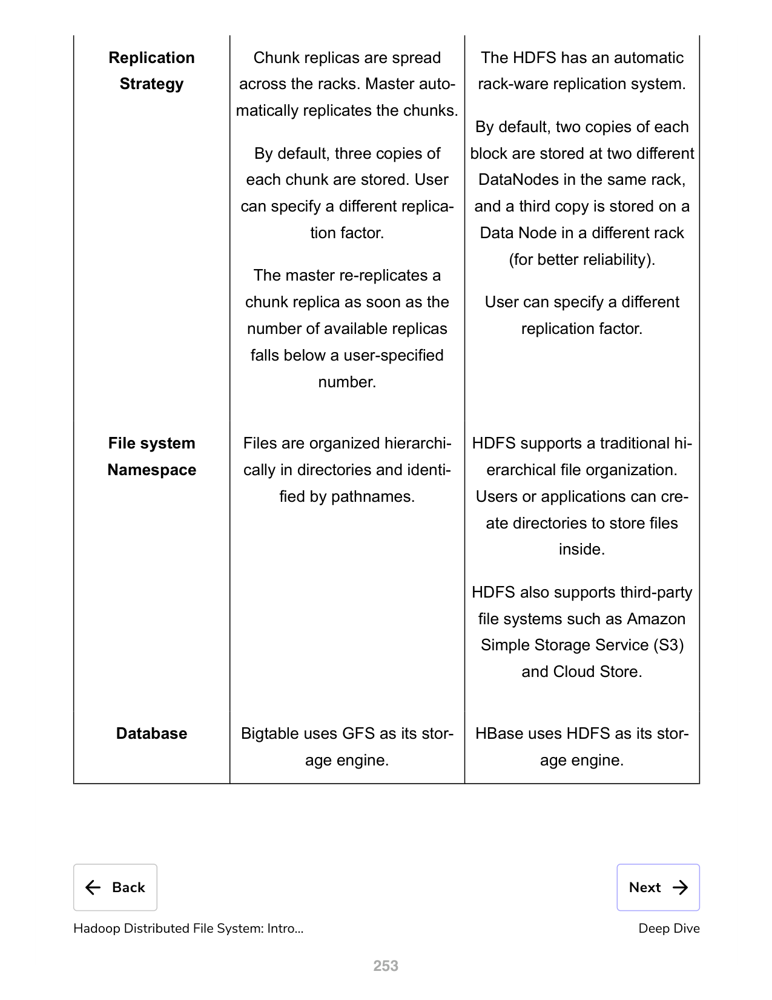

---

## 深入分析

### 集群拓扑

典型的数据中心包含许多服务器机架，通过交换机连接。Hadoop 集群的常见配置是每个机架约 30 到 40 台服务器。每个机架有一个专用的千兆交换机，连接其所有服务器，并通过上行链路连接到核心交换机或路由器，其带宽由数据中心中的许多机架共享。

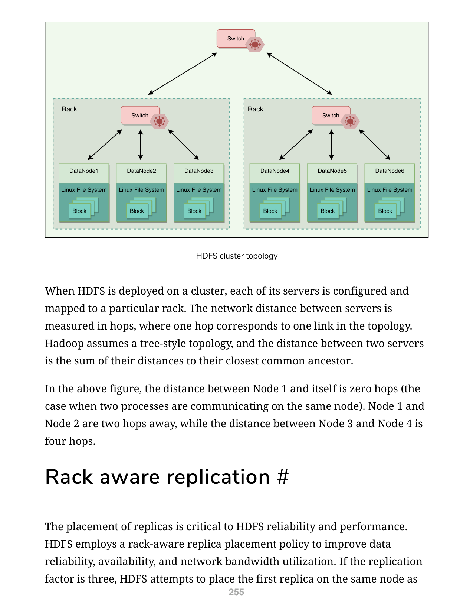

当 HDFS 部署在集群上时，每个服务器都被配置并映射到特定机架。服务器之间的网络距离以跳数衡量，一跳对应拓扑中的一个链路。Hadoop 假设树状拓扑，两台服务器之间的距离是它们到最近公共祖先的距离之和。

在上图中，节点 1 与自身的距离为零跳（两个进程在同一节点上通信的情况）。节点 1 和节点 2 之间是两跳，而节点 3 和节点 4 之间的距离是四跳。

### 机架感知复制

副本的放置对 HDFS 的可靠性和性能至关重要。HDFS 采用**机架感知副本放置策略**，以提高数据可靠性、可用性和网络带宽利用率。

如果复制因子为 3，HDFS 尝试将第一个副本放置在**与写入块的客户端相同的节点**上。如果客户端进程不在 HDFS 集群中运行，则随机选择一个节点。第二个副本写入**与第一个副本不同的机架**上的节点（即跨机架副本）。块的第三个副本然后写入**与第二个副本相同机架**上的另一个随机节点。额外的副本写入集群中的随机节点，但系统尽量避免在同一机架上放置过多副本。

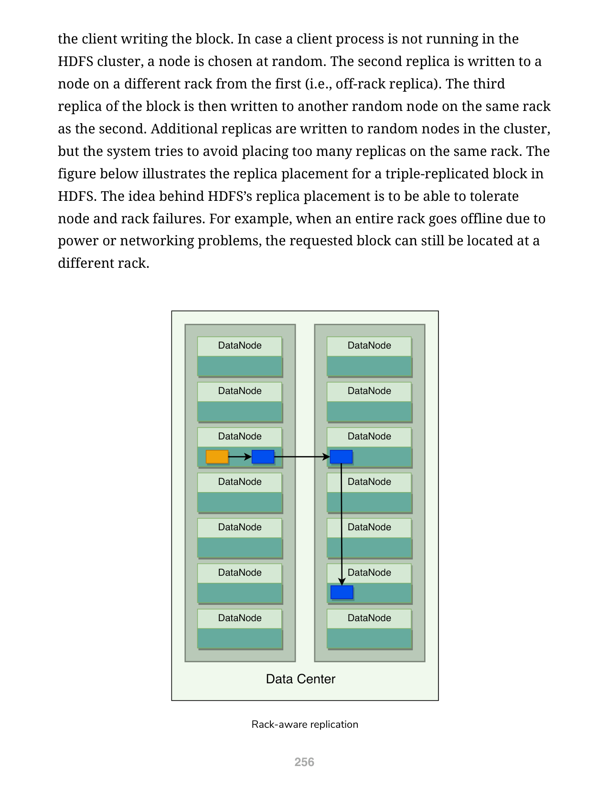

默认的 HDFS 副本放置策略总结如下：

1. 没有 DataNode 会包含任何块的多个副本
2. 如果有足够的机架可用，没有机架会包含同一块的两个以上副本

遵循这种机架感知复制方案会**减慢写入操作**，因为数据需要复制到不同的机架，但这是 HDFS 在可靠性和性能之间做出的有意权衡。

### 同步语义

早期版本的 HDFS 遵循严格的不可变语义。一旦文件被写入，就永远不能再重新打开进行写入；文件仍然可以被删除。然而，当前版本的 HDFS 支持追加。但这仍然相当有限——现有二进制数据一旦写入 HDFS 就无法原地修改。

HDFS 中的这一设计选择是因为一些最常见的 MapReduce 工作负载遵循"写入一次、读取多次"的数据访问模式。MapReduce 是一个具有预定义阶段的受限计算模型。MapReduce 中的 reducer 将独立文件写入 HDFS 作为输出。HDFS 专注于为多个客户端提供快速读取访问。

### HDFS 一致性模型

HDFS 遵循**强一致性模型**。如上所述，写入 HDFS 的每个数据块都会复制到多个节点。为确保强一致性，只有在所有副本成功写入后才声明写入成功。这样，所有客户端看到文件的一致视图。由于 HDFS 不允许多个并发写入者写入一个 HDFS 文件，实现强一致性变得相对容易。

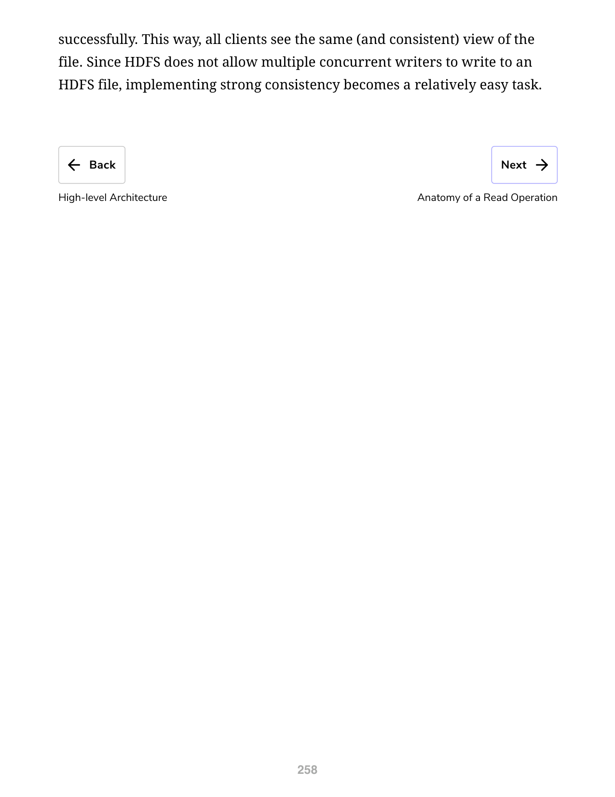

---

## 读取操作剖析

### HDFS 读取流程

HDFS 读取过程概述如下：

1. 当文件被打开读取时，HDFS 客户端通过调用 `DistributedFileSystem` 对象的 `open()` 方法发起读取请求。客户端指定文件名、起始偏移量和读取范围长度
2. `DistributedFileSystem` 对象根据给定的偏移量和范围长度计算需要读取哪些块，并向 NameNode 请求这些块的位置
3. **NameNode 拥有所有块位置的元数据**。它向客户端提供块列表以及每个块副本的位置。由于块是复制的，NameNode 在提供特定块位置时会找到离客户端最近的副本。最近位置的确定顺序如下：
   - 如果所需块与客户端在同一节点上，则首选
   - 然后，首选与客户端在同一机架中的块
   - 最后，读取跨机架块
4. 获取块位置后，客户端调用 `FSDataInputStream` 的 `read()` 方法，该方法处理与 DataNode 的所有交互。一旦客户端调用 `read()` 方法，输入流对象就与包含文件第一个块的最近 DataNode 建立连接
5. 数据以流的形式读取。数据流式传输时传递给请求的应用程序。因此，不需要在客户端应用程序开始处理之前完整传输整个块
6. 一旦 `FSDataInputStream` 接收到一个块的所有数据，它就关闭连接并继续连接下一个块的 DataNode。它重复此过程，直到读完文件的所有所需块
7. 客户端读完所有所需块后，调用输入流对象的 `close()` 方法

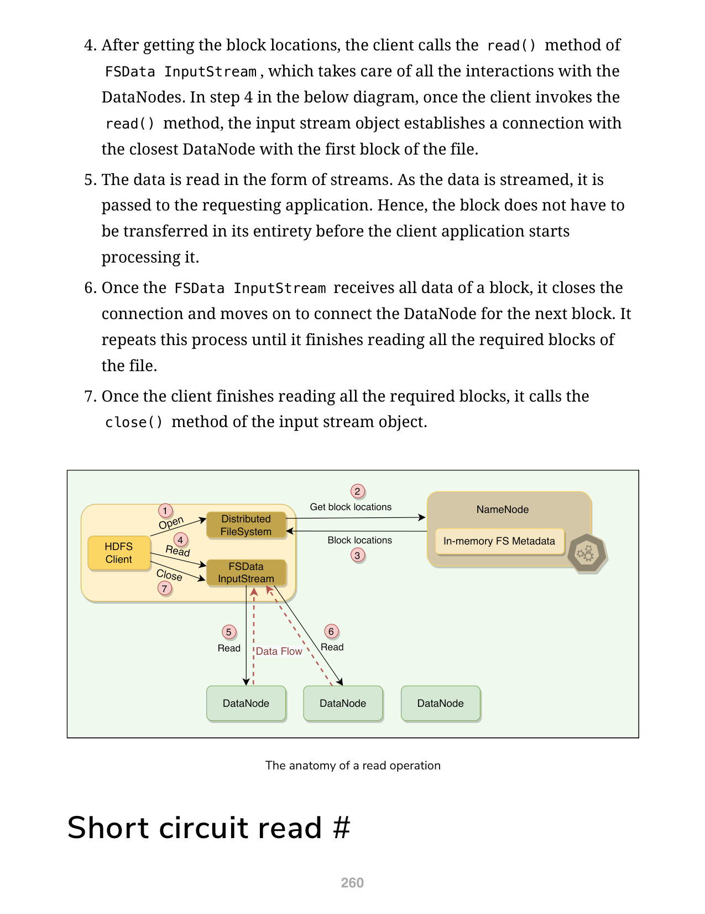

### 短路读取

如上所述，客户端直接从 DataNode 读取数据。客户端使用 TCP 套接字进行此操作。如果数据和客户端在同一台机器上，HDFS 可以直接读取文件，绕过 DataNode。这种方案称为**短路读取**（Short Circuit Read），效率很高，因为它减少了开销和其他处理资源。

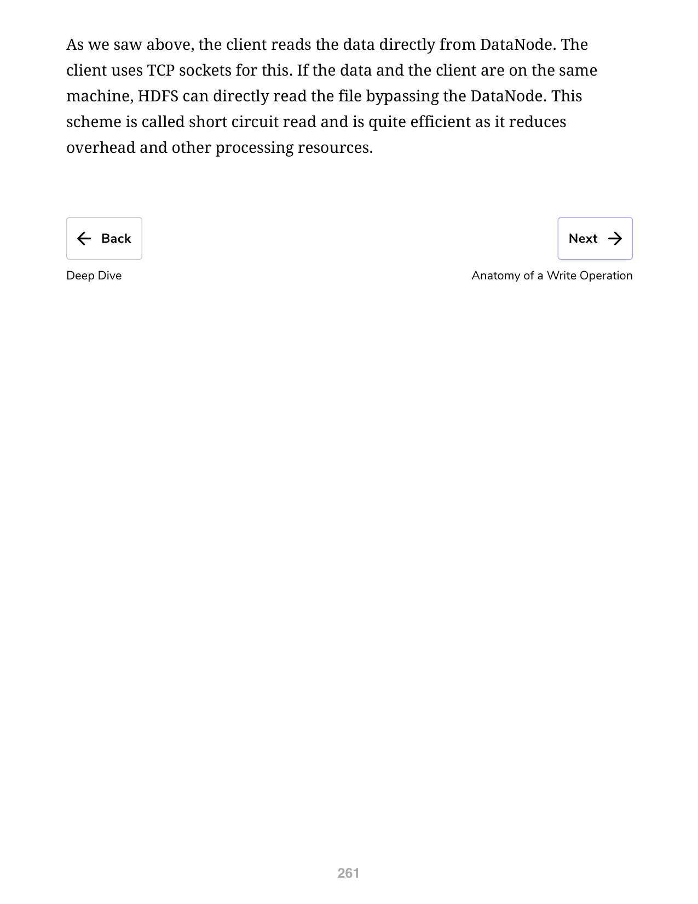

---

## 写入操作剖析

### HDFS 写入流程

HDFS 写入过程概述如下：

1. HDFS 客户端通过调用 `DistributedFileSystem` 对象的 `create()` 方法发起写入请求
2. `DistributedFileSystem` 对象向 NameNode 发送文件创建请求
3. **NameNode 验证文件不存在且客户端有权创建文件**。如果两个条件都满足，NameNode 创建新文件记录并发送确认
4. 客户端然后使用 `FSDataOutputStream` 继续写入文件
5. `FSDataOutputStream` 将数据写入称为 **Data Queue** 的本地队列。数据在队列中保留，直到累积了完整块的数据
6. 队列中有完整块后，通知另一个称为 **DataStreamer** 的组件管理到 DataNode 的数据传输
7. DataStreamer 首先要求 NameNode 在 DataNode 上分配新块，从而选择适合复制的 DataNode
8. NameNode 提供块列表以及每个块副本的位置
9. 从 NameNode 接收到块位置后，**DataStreamer 开始将内部队列中的块传输到最近的 DataNode**
10. 每个块写入第一个 DataNode，然后该 DataNode 将块流水线传输到其他 DataNode 以写入块的副本。这样，**块在文件写入期间就被复制**。重要的是要注意，HDFS 直到所有副本都已由 DataNode 成功写入后才向客户端确认写入
11. DataStreamer 写完所有块后，等待来自所有 DataNode 的确认
12. 收到所有确认后，客户端调用 `OutputStream` 的 `close()` 方法
13. 最后，`DistributedFileSystem` 联系 NameNode 通知文件写入操作完成。此时，NameNode 提交文件创建操作，使文件可被读取。如果 NameNode 在此步骤之前宕机，文件将丢失

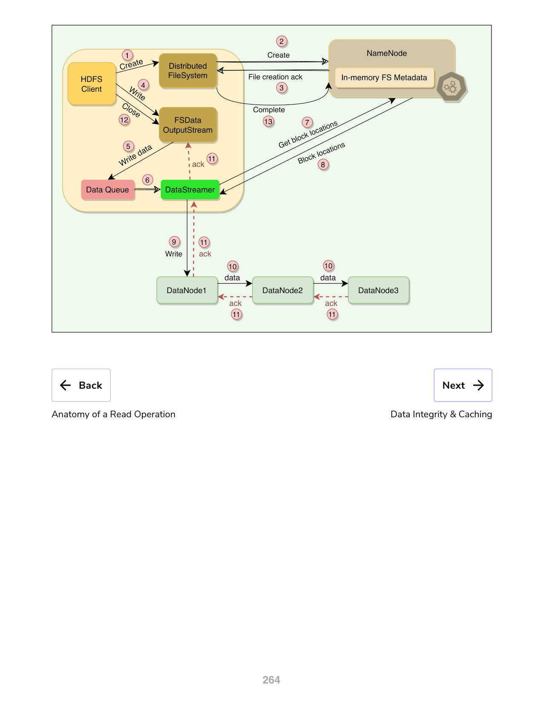

---

## 数据完整性与缓存

### 数据完整性

数据完整性指确保数据正确性。当客户端从 DataNode 检索块时，数据可能已损坏。这种损坏可能由于存储设备、网络或软件本身的故障而发生。

HDFS 客户端使用**校验和**验证文件内容。当客户端在 HDFS 中存储文件时，它为文件的每个块计算校验和，并将这些校验和存储在同一个 HDFS 命名空间中的单独隐藏文件中。当客户端检索文件内容时，它会验证从每个 DataNode 接收的数据是否与关联校验和文件中的校验和匹配。如果不匹配，客户端可以选择从另一个副本检索该块。

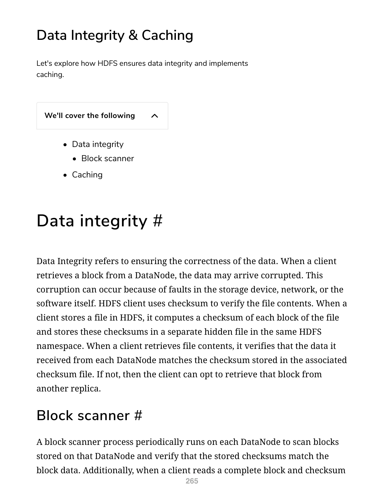

### 块扫描器

每个 DataNode 上定期运行一个**块扫描器**（Block Scanner）进程，以扫描该 DataNode 上存储的块，并验证存储的校验和是否与块数据匹配。此外，当客户端读取完整块并成功校验和验证时，它会通知 DataNode。DataNode 将其视为副本的验证。每当客户端或块扫描器检测到损坏的块时，它会通知 NameNode。NameNode 将副本标记为损坏，并启动创建新的好副本的过程。

### 缓存

通常块从磁盘读取，但对于频繁访问的文件，块可以显式缓存在 DataNode 内存中的**堆外块缓存**中。HDFS 提供**集中式缓存管理**方案，允许其用户指定要缓存的路径。

客户端可以告诉 NameNode 要缓存哪些文件。NameNode 与具有所需块的 DataNode 通信，并指示它们在堆外缓存中缓存块。

集中式缓存管理在 HDFS 中有几个显著优势：

1. **显式指定要缓存的块**可防止频繁访问的数据从内存中驱逐。这在大多数 HDFS 工作负载大于 DataNode 主内存的情况下尤为重要
2. 由于 **NameNode 管理 DataNode 缓存**，应用程序在做出 MapReduce 任务放置决策时可以查询缓存块位置的集合。将任务与缓存块副本放在同一位置可提高读取性能
3. 当 DataNode 缓存了块时，客户端可以使用新的、更高效的**零拷贝读取 API**。由于块已在内存中且 DataNode 已完成校验和验证，客户端在使用此新 API 时几乎可以零开销
4. **集中式缓存可以提高整体集群内存利用率**。当依赖每个 DataNode 上的 OS 缓冲区缓存时，重复读取一个块会导致该块的所有"n"个副本被拉入缓冲区缓存。使用集中式缓存管理，用户可以显式只指定"n"个副本中的"m"个，从而节省"n-m"的内存

---

## 容错

### DataNode 故障处理

#### 复制

当 DataNode 宕机时，其所有数据变得不可用。HDFS 通过**复制**处理这种数据不可用性。如前所述，写入 HDFS 的每个块都会复制到多个（默认三个）DataNode。因此，如果一个 DataNode 变得不可访问，可以从其他副本读取其数据。

#### 心跳

NameNode 通过心跳机制跟踪 DataNode。每个 DataNode 定期（每隔几秒）向 NameNode 发送心跳消息。如果 DataNode 宕机，心跳将停止，NameNode 将检测到 DataNode 已死。NameNode 随后将该 DataNode 标记为死亡，不再向该 DataNode 转发任何读/写请求。由于复制，该 DataNode 上存储的块在其他 DataNode 上有额外的副本。NameNode 定期对文件系统执行状态检查，以发现副本不足的块，并执行集群再平衡过程以复制副本数低于期望值的块。

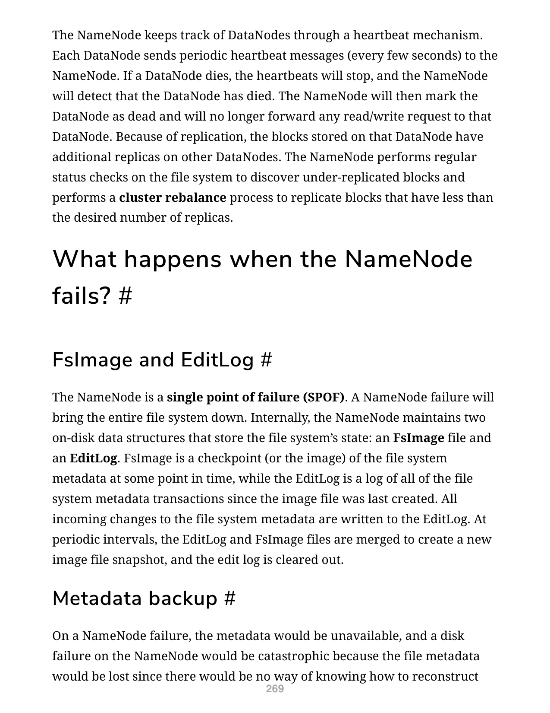

### NameNode 故障处理

#### FsImage 和 EditLog

**NameNode 是单点故障**。NameNode 故障将导致整个文件系统宕机。内部上，NameNode 维护两个磁盘上的数据结构来存储文件系统状态：

- **FsImage**：文件系统元数据在某个时间点的检查点（或映像）
- **EditLog**：自上次创建映像文件以来所有文件系统元数据事务的日志

所有传入的文件系统元数据更改都写入 EditLog。定期地，EditLog 和 FsImage 文件被合并以创建新的映像文件快照，并清除编辑日志。

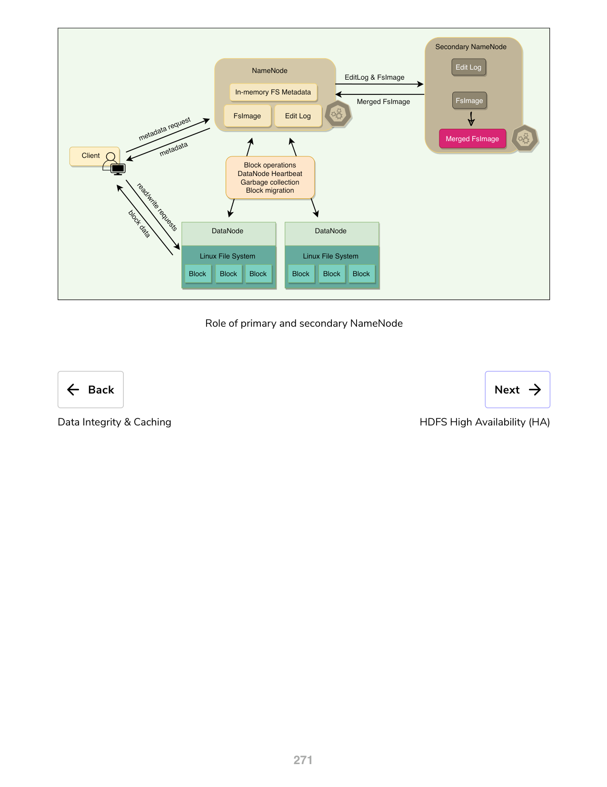

#### 元数据备份

NameNode 故障时，元数据将不可用，NameNode 上的磁盘故障将是灾难性的，因为文件元数据将丢失——无法知道如何从 DataNode 上的块重建文件。因此，使 NameNode 能够抵御故障至关重要，HDFS 提供两种机制：

1. **多副本备份**：备份并存储 FsImage 和 EditLog 的多个副本。NameNode 可以配置为维护文件的多个副本。对 FsImage 或 EditLog 的任何更新都会同步和原子地更新每份 FsImage 和 EditLog 副本。常见配置是在本地磁盘上维护一份副本，在远程网络文件系统（NFS）挂载上维护另一份。这种同步更新多个 FsImage 和 EditLog 副本可能会降低 NameNode 每秒支持的命名空间事务速率。但这种降低是可接受的，因为即使 HDFS 应用程序是数据密集型的，它们也不是元数据密集型的

2. **辅助 NameNode**（Secondary NameNode）：尽管名称如此，但它不是备份 NameNode。其主要作用是帮助主 NameNode 进行文件系统的检查点化。Secondary NameNode 定期将命名空间映像与 EditLog 合并，以防止 EditLog 变得过大。Secondary NameNode 运行在单独的物理机器上，因为它需要大量的 CPU 和与 NameNode 一样多的内存来执行合并。它保留合并后的命名空间映像的副本，可在 NameNode 故障时使用。然而，Secondary NameNode 的状态落后于主 NameNode，因此在主 NameNode 完全故障的情况下，数据丢失几乎是不可避免的。在这种情况下，通常的做法是将 NFS 上的 NameNode 元数据文件复制到 Secondary，并将其作为新的主 NameNode 运行

---

## HDFS 高可用性（HA）

### HDFS 高可用架构

尽管 NameNode 的元数据被复制到多个文件系统以防止数据丢失，但它仍然不能提供文件系统的高可用性。如果 NameNode 故障，客户端将无法读取、写入或列出文件，因为 NameNode 是元数据和文件到块映射的唯一存储库。在这种情况下，整个 Hadoop 系统将有效停止服务，直到新的 NameNode 上线。

要从 NameNode 故障场景中恢复，管理员将使用一个文件系统元数据副本启动新的主 NameNode，并配置 DataNode 和客户端使用这个新的 NameNode。新的 NameNode 在以下步骤完成之前无法服务请求：
1. 将其命名空间映像加载到内存中
2. 重放其 EditLog
3. 从 DataNode 接收足够的块报告

在具有许多文件和块的大型集群上，执行 NameNode 冷启动可能需要半小时或更长时间。此外，这种较长的恢复时间对常规维护来说是个问题。实际上，由于 NameNode 意外故障很少见，计划内停机的情况在实践中更为重要。

为解决此问题，Hadoop 在其 2.0 版本中增加了对 **HDFS 高可用性（HA）** 的支持。在这种实现中，有两个（或更多）NameNode 处于**主动-待命**配置中。在任何时间点，恰好有一个 NameNode 处于**Active**状态，其他处于**Standby**状态。Active NameNode 负责集群中的所有客户端操作，而 Standby 只是作为 Active 的追随者，维护足够的状态以在需要时提供快速故障转移。

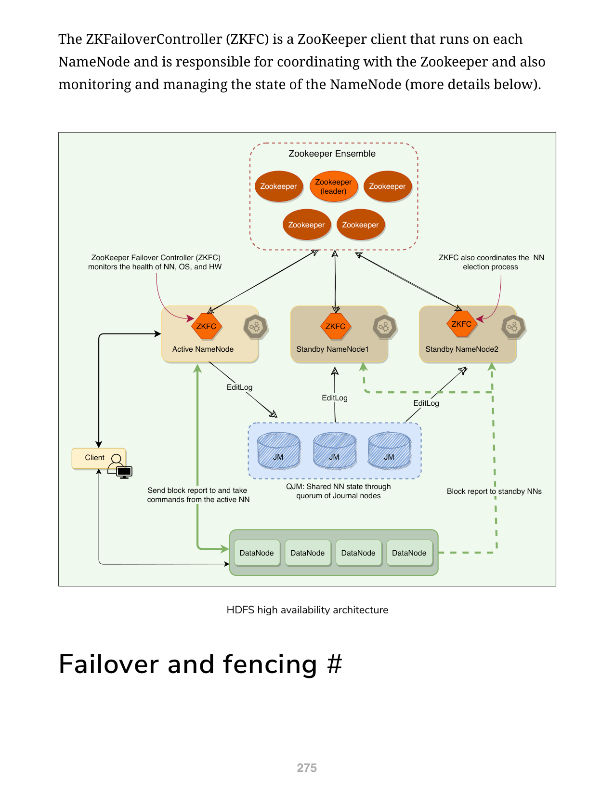

为使 Standby 节点与 Active 节点保持状态同步，HDFS 做了以下架构更改：

- NameNode 必须使用**高可用共享存储**来共享 EditLog（例如，来自网络附加存储（NAS）的网络文件系统（NFS）挂载）
- 当 Standby NameNode 启动时，它会读取到共享 EditLog 的末尾以与 Active NameNode 同步其状态，然后继续在 Active NameNode 写入新条目时读取它们
- DataNode 必须向所有 NameNode 发送块报告，因为块映射存储在 NameNode 的内存中，而不是磁盘上
- 客户端必须配置为处理 NameNode 故障转移，使用对用户透明的机制。客户端故障转移由客户端库透明处理。最简单的实现使用客户端配置来控制故障转移。HDFS URI 使用映射到多个 NameNode 地址的逻辑主机名，客户端库尝试每个 NameNode 地址直到操作成功

### QJM（Quorum Journal Manager）

QJM 的唯一目的是提供**高可用的 EditLog**。QJM 作为一组日志节点运行，每个编辑必须写入日志节点的**仲裁**（多数）。通常有三个日志节点，因此系统可以容忍其中一个的故障。这种安排类似于 ZooKeeper 的工作方式，但重要的是要意识到 QJM 的实现**不使用 ZooKeeper**。

注意：HDFS 高可用性确实使用 ZooKeeper 进行 Active NameNode 选举。更多细节如下。QJM 进程在所有 NameNode 上运行，并使用 RPC 将所有 EditLog 更改传递给日志节点。

由于 Standby NameNode 在内存中拥有最新的元数据状态（包括最新的 EditLog 和最新的块映射），如果 Active NameNode 故障，任何 Standby 都可以非常快速地接管（几秒钟内）。然而，实际的故障转移时间在实践中会更长（大约一分钟左右），因为系统需要保守地判断 Active NameNode 是否已故障。

在极少数情况下，如果所有 Standby 在 Active 故障时都宕机，管理员仍然可以对 Standby 进行冷启动。这不会比非 HA 情况更糟。

### ZooKeeper

**ZKFailoverController（ZKFC）** 是一个 ZooKeeper 客户端，运行在每个 NameNode 上，负责与 ZooKeeper 协调以及监控和管理 NameNode 的状态。

### 故障转移与 Fencing

**故障转移控制器**管理从 Active NameNode 到 Standby 的转换。故障转移控制器的默认实现使用 ZooKeeper 确保只有一个 NameNode 处于 Active 状态。故障转移控制器作为轻量级进程在每个 NameNode 上运行，监控 NameNode 的故障（使用 Heartbeat），并在 Active NameNode 故障时触发故障转移。

- **优雅故障转移**：对于常规维护，管理员可以手动发起故障转移。这称为优雅故障转移，因为故障转移控制器安排从 Active NameNode 到 Standby 的有序过渡
- **非优雅故障转移**：在非优雅故障转移的情况下，无法确定故障的 NameNode 是否已停止运行。例如，慢速网络或网络分区可能触发故障转移，即使之前 Active 的 NameNode 仍在运行并认为它仍然是 Active NameNode

HA 实现使用 **Fencing** 机制来防止这种"脑裂"场景，并确保之前 Active 的 NameNode 被阻止造成任何损害和导致损坏。

**Fencing** 是在先前 Active 的 NameNode 周围设置围栏，使其无法访问集群资源，从而停止服务任何读/写请求。使用两种技术：

1. **资源 fencing**：阻止先前 Active 的 NameNode 访问执行基本任务所需的资源。例如，撤销其对共享存储目录的访问（通常使用供应商特定的 NFS 命令），或通过远程管理命令禁用其网络端口
2. **节点 fencing**：阻止先前 Active 的 NameNode 访问所有资源。常见的方法是关闭或重置节点。这是一个有效的方法，使其无法访问任何内容。此技术也称为 **STONIT**（Shoot The Other Node In The Head）

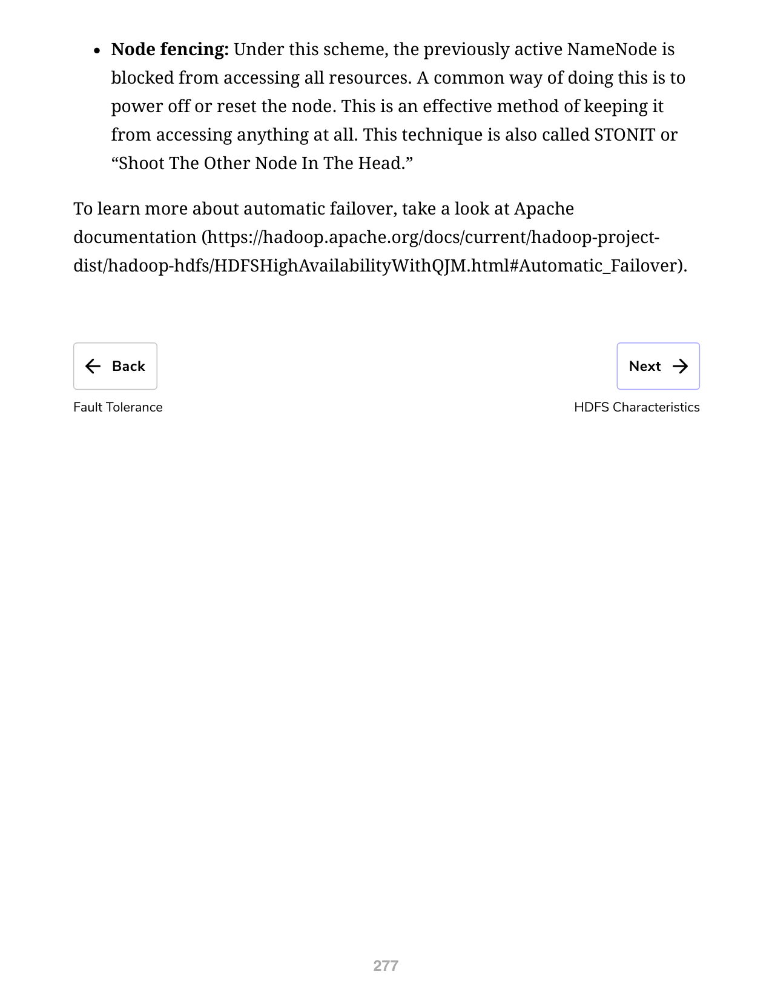

---

## HDFS 特性

### 安全与权限

HDFS 为文件和目录提供类似于 POSIX 的权限模型。每个文件和目录与一个所有者和一个组关联。每个文件或目录为所有者、组成员用户和所有其他用户分别设置不同的权限。有三种类型的权限：

- **读取权限（r）**：对于文件，需要有 r 权限才能读取文件。对于目录，需要有 r 权限才能列出目录的内容
- **写入权限（w）**：对于文件，需要有 w 权限才能写入或追加到文件。对于目录，需要有 w 权限才能在其中创建或删除文件或目录
- **执行权限（x）**：对于文件，x 权限被忽略，因为我们无法在 HDFS 上执行文件。对于目录，需要有 x 权限才能访问目录的子项

HDFS 还可选支持 POSIX ACL（访问控制列表），以通过针对特定命名用户或组的更细粒度规则来增强文件权限。

### HDFS Federation

NameNode 将整个命名空间的元数据保存在内存中，这意味着在具有许多文件的超大集群上，内存成为扩展的限制因素。更严重的问题是，单个 NameNode 服务所有元数据请求可能成为性能瓶颈。

为帮助解决这些问题，HDFS 2.x 版本引入了 **HDFS Federation**，允许集群通过添加 NameNode 来扩展，每个 NameNode 管理文件系统命名空间的一部分。例如，一个 NameNode 可能管理所有根目录在 `/user` 下的文件，第二个 NameNode 处理 `/share` 下的文件。

在 Federation 下：
- 所有 NameNode **独立工作**。NameNode 之间无需协调
- DataNode 被所有 NameNode 用作**公共存储**
- NameNode 故障**不影响其他 NameNode 管理的命名空间的可用性**
- 要访问 Federated HDFS 集群，客户端使用**客户端挂载表**将文件路径映射到 NameNode

多个独立运行的 NameNode 可能最终为其块生成相同的 64 位 Block ID。为避免此问题，命名空间使用一个或多个**块池**（Block Pool），其中唯一 ID 标识集群中的每个块池。块池属于单个命名空间，不跨命名空间边界。扩展块 ID 是（Block Pool ID, Block ID）的元组，用于 HDFS Federation 中的块标识。

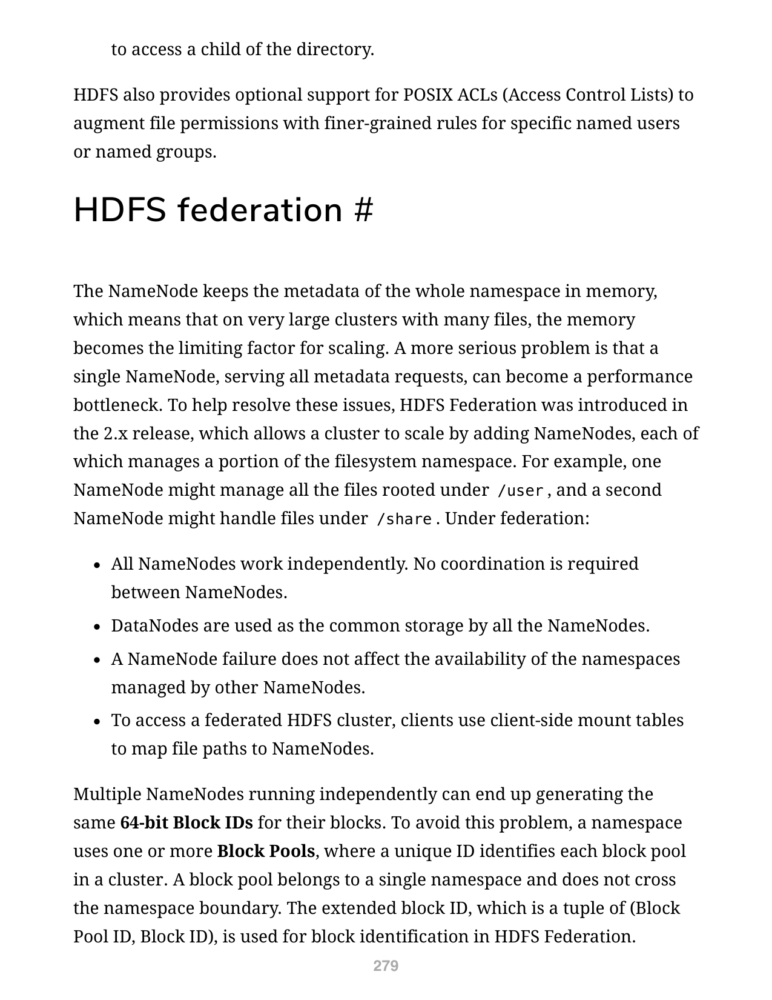

### 纠删码

默认情况下，HDFS 存储每个块的三个副本，导致存储空间和网络带宽等资源的 **200% 开销**（存储两个额外副本）。与此默认复制方案相比，**纠删码**（Erasure Coding，EC）可能是近年来 HDFS 中最大的变化。

EC 以**更少的存储空间提供相同级别的容错**。在典型的 EC 设置中，存储开销不超过 50%。这通过将复制因子从 3 倍降低到 1.5 倍，从根本上使存储空间容量翻倍。

在 EC 下，数据被分解为片段、扩展、用冗余数据片段编码，并存储在不同的 DataNode 上。如果在某个时刻数据因损坏等原因在 DataNode 上丢失，则可以使用存储在其他 DataNode 上的其他片段重建数据。虽然 EC 更消耗 CPU，但它大大减少了可靠存储大数据集所需的存储空间。

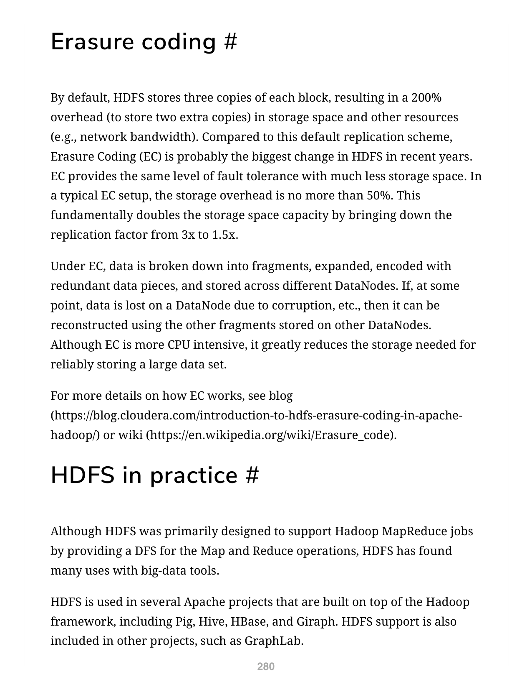

### HDFS 实践

尽管 HDFS 最初设计为通过为 Map 和 Reduce 操作提供分布式文件系统来支持 Hadoop MapReduce 作业，但 HDFS 已在大数据工具中找到许多用途。

HDFS 用于构建在 Hadoop 框架之上的多个 Apache 项目中，包括 Pig、Hive、HBase 和 Giraph。其他项目如 GraphLab 也包含 HDFS 支持。

**主要优势**：

1. **MapReduce 工作负载的高带宽**：已知大型 Hadoop 集群（数千台机器）使用 HDFS 持续写入高达每秒 1 TB 的数据
2. **高可靠性**：容错是 HDFS 的主要设计目标。HDFS 复制提供了高可靠性和可用性，特别是在大型集群中，磁盘和服务器故障的概率显著增加
3. **低字节成本**：与专用的共享磁盘解决方案（如 SAN）相比，HDFS 每 GB 成本更低，因为存储与计算服务器位于同一位置。使用 SAN，我们需要为管理基础设施支付额外成本，如磁盘阵列外壳和更高级别的企业磁盘，以管理硬件故障。HDFS 设计为在通用硬件上运行，冗余通过软件管理以容忍故障
4. **可扩展性**：HDFS 允许向运行中的集群添加 DataNode，并提供工具在添加集群节点时手动再平衡数据块，而无需关闭文件系统

**主要劣势**：

1. **小文件效率低**：HDFS 设计为使用大块大小（128 MB 及以上）。它用于处理大文件（数百 MB、GB 或 TB）并将其分块，然后输入到 MapReduce 作业进行并行处理。当实际文件大小很小（KB 级别）时，HDFS 效率低下。拥有大量小文件会给 NameNode 带来额外压力，因为它必须维护文件系统中所有文件的元数据。通常，HDFS 用户使用序列文件（Sequence File）等技术将许多小文件合并为较大的文件。序列文件可以理解为二进制键值对的容器，其中文件名是键，文件内容是值
2. **非 POSIX 兼容**：HDFS 不设计为 POSIX 兼容的可挂载文件系统；应用程序必须从头编写或修改以使用 HDFS 客户端。存在使用 FUSE 驱动挂载 HDFS 的解决方案，但文件系统语义不允许在文件关闭后进行写入
3. **只写一次模型**：对于需要并发写入同一文件的应用程序来说，一次写入模型是一个潜在缺点。然而，最新版本的 HDFS 现在支持文件追加

简而言之，HDFS 是作为遵循 MapReduce 模型或专门编写为使用 HDFS 的分布式应用程序的存储后端的良好选择。HDFS 可以高效地用于少量大文件，而非大量小文件。

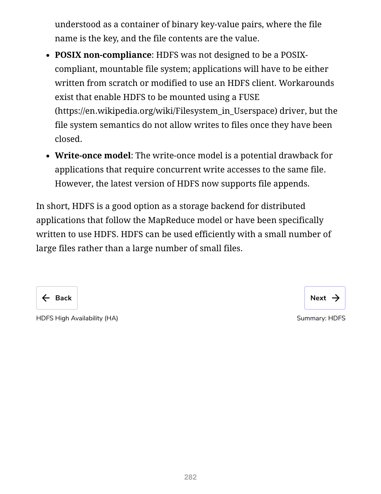

---

## 总结

| 特性 | HDFS 实现 |
|------|---------|
| 适用场景 | 大型分布式数据密集型应用的可扩展分布式文件系统 |
| 硬件策略 | 使用通用硬件以降低基础设施成本 |
| APIs | 标准文件操作（创建、删除、打开、关闭、读取、写入） |
| 随机写入 | 不支持，写入始终以仅追加方式进行 |
| 并发写入 | 不支持多并发写入者 |
| 架构 | 一个 NameNode + 多个 DataNode + 多个客户端 |
| 块大小 | 默认 128 MB，可配置 |
| 复制 | 块跨多个 DataNode 复制，复制因子可配置 |
| NameNode | 存储所有元数据在内存中，通过 EditLog 持久化 |
| 块位置 | 不持久化，通过心跳从 DataNode 收集 |
| FsImage | NameNode 状态定期序列化到磁盘并复制 |
| 心跳 | NameNode 通过心跳消息与每个 DataNode 通信 |
| 客户端 | HDFS 客户端处理元数据，数据传输直接在客户端和 DataNode 之间 |
| 数据完整性 | 每个 DataNode 使用校验和检测存储数据损坏 |
| 垃圾回收 | 删除的文件重命名为隐藏名称以供稍后垃圾回收 |
| 一致性 | 强一致性——所有副本成功写入后才声明写入成功 |
| 缓存 | 频繁访问的块显式缓存在 DataNode 的堆外块缓存中 |
| 纠删码 | 用于降低复制开销（从 3 倍降至 1.5 倍） |

### 使用的系统设计模式

| 模式 | 用途 |
|------|------|
| [[预写日志]] | 为了容错和处理 NameNode 崩溃，所有元数据更改写入磁盘上的 EditLog |
| [[心跳]] | NameNode 通过心跳消息与每个 DataNode 通信以发送指令和收集状态 |
| [[脑裂|Split-Brain]] | ZooKeeper 用于确保只有一个 NameNode 处于 Active 状态；Fencing 用于阻止先前 Active 的 NameNode 访问集群资源 |
| [[校验和]] | 每个 DataNode 使用校验和检测存储数据的损坏 |
| [[仲裁]] | QJM 使用仲裁机制确保 EditLog 在日志节点之间的高可用性 |

### 进一步阅读

- [HDFS 论文](https://storageconference.us/2010/Papers/MSST/Shvachko.pdf)
- [HDFS 高可用架构](https://hadoop.apache.org/docs/stable/hadoop-project-dist/hadoop-hdfs/HDFSHighAvailabilityWithNFS.html)
- [Apache HDFS 架构](https://hadoop.apache.org/docs/current/hadoop-project-dist/hadoop-hdfs/HdfsDesign.html)
- [分布式文件系统：调查](https://jicsit.com/docs/Volume%206/vol6issue14/jicsit2015061415.pdf)

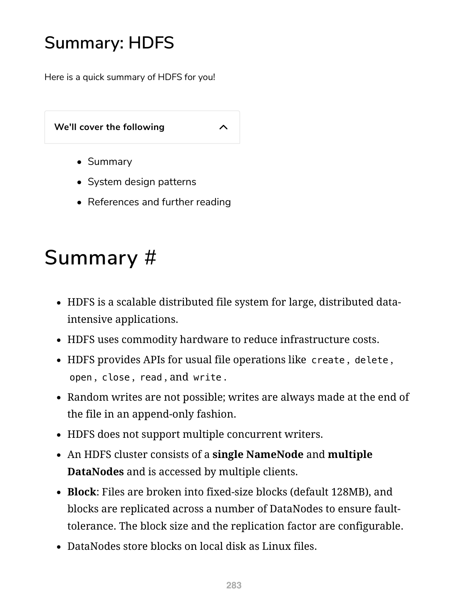

---

## 选择题

1. HDFS 中默认的块大小是多少？
   a. 64 MB
   b. 128 MB
   c. 256 MB
   d. 512 MB

2. HDFS 中 NameNode 的主要作用是什么？
   a. 存储实际文件数据
   b. 管理文件系统元数据
   c. 执行 MapReduce 作业
   d. 处理客户端数据请求

3. HDFS 默认的三副本复制策略如何分布副本？
   a. 所有三个副本在同一机架
   b. 第一个副本在客户端所在节点，第二个在不同机架，第三个在第二个副本同一机架
   c. 所有副本在不同机架上
   d. 随机分布在所有节点

4. HDFS 高可用性（HA）中使用什么机制防止脑裂？
   a. 使用分布式锁
   b. 使用 Paxos 协议
   c. 使用 ZooKeeper 和 Fencing 机制
   d. 所有 NameNode 同时 Active

5. 以下哪项不是 HDFS 的缺点？
   a. 小文件效率低
   b. 非 POSIX 兼容
   c. 写入一次模型限制并发写入
   d. 不支持数据校验和

**答案**
1. b
2. b
3. b
4. c
5. d
