# 7 BigTable：如何设计宽列存储系统

## BigTable 简介

### 目标

设计一个分布式且可扩展的系统，能够存储海量结构化数据。数据将通过行键索引，每行可以有无限数量的列。

### 什么是 BigTable？

[[BigTable]] 是 Google 开发的分布式、大规模可扩展的宽列存储。它被设计为存储海量的结构化数据集。顾名思义，BigTable 为非常大的表提供存储（通常达到 TB 级别）。

用 [[CAP 定理]] 的术语来说，BigTable 是一个 **CP 系统**，即它提供严格一致的读写。BigTable 可以用作 [[MapReduce]] 作业的输入源或输出目标。

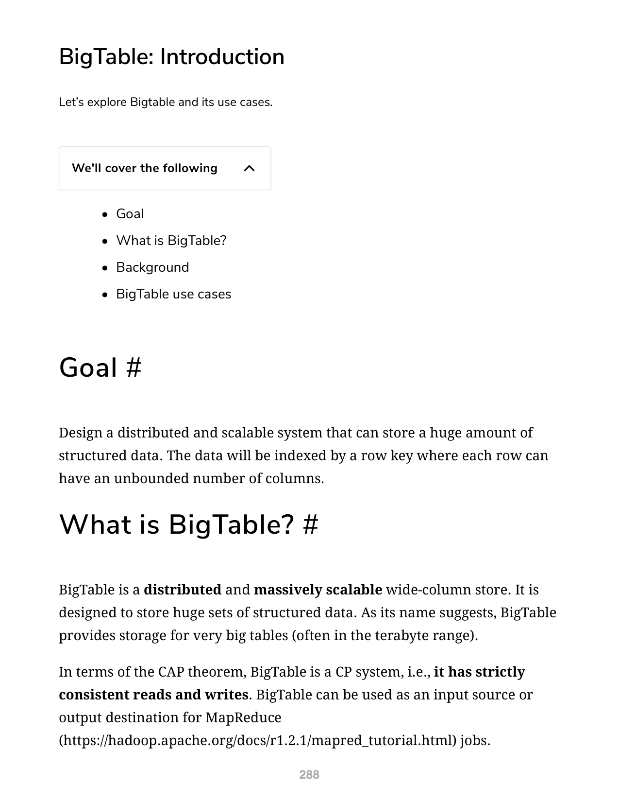

### 背景

BigTable 由 Google 开发，自 2005 年以来已在数十个 Google 服务中使用。由于其服务的大规模，Google 无法使用商业数据库。此外，使用外部解决方案的成本太高。这就是 Google 选择构建内部解决方案的原因。

BigTable 是一个高可用、高性能的数据库，为 Google 的多个应用程序提供支持——每个应用程序在数据大小和延迟要求方面有不同的需求。

虽然 BigTable 本身不是开源的，但其论文对启发强大的开源数据库起到了关键作用，例如 [[Cassandra]]（借用 BigTable 的数据模型）、[[HBase]]（分布式非关系型数据库）和 Hypertable。

### BigTable 的用例

Google 构建 BigTable 用于存储大量数据并在这些数据上每秒执行数千次查询。BigTable 数据的示例包括：数十亿个 URL（每个页面多个版本）、PB 级的 Google 地球数据以及数十亿用户的搜索数据。

BigTable 适合存储大于 1 TB 的大型数据集，其中每行小于 10 MB。由于 BigTable 不提供 ACID 属性或事务支持，涉及事务处理的在线事务处理（OLTP）应用程序不应使用 BigTable。对于 BigTable，数据应以键值对或行列的形式结构化。非结构化数据（如图像或视频）不应存储在 BigTable 中。

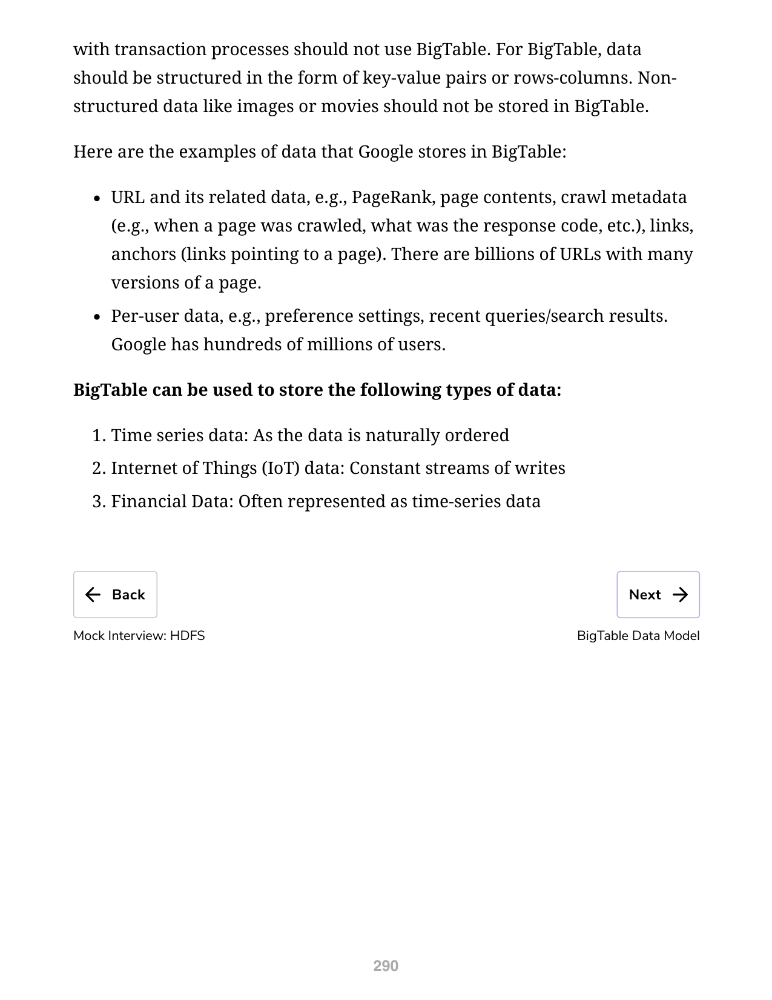

Google 存储在 BigTable 中的数据示例：

- **URL 及其相关数据**：例如 PageRank、页面内容、爬取元数据（如页面爬取时间、响应代码等）、链接、锚文本（指向页面的链接）。有数十亿个 URL，每个页面有多个版本
- **用户数据**：例如偏好设置、最近的查询/搜索结果。Google 有数亿用户

BigTable 可用于存储以下类型的数据：

1. **时序数据**：数据天然有序
2. **物联网（IoT）数据**：持续的写入流
3. **金融数据**：通常表示为时序数据

---

## BigTable 数据模型

简单来说，BigTable 可以描述为一个**稀疏的、分布式的、持久的、多维的排序映射**。传统数据库具有数据的二维布局，其中每个单元格值由"行 ID"和"列名"标识。

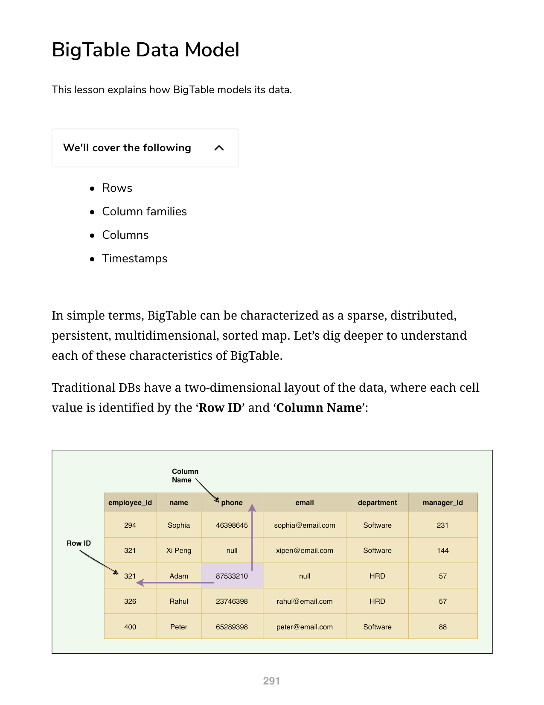

BigTable 拥有一个**四维数据模型**。四个维度是：

1. **行键**：唯一标识一行
2. **列族**：代表一组列
3. **列名**：唯一标识一列
4. **时间戳**：每个列单元格可以有不同的值版本，每个版本由时间戳标识

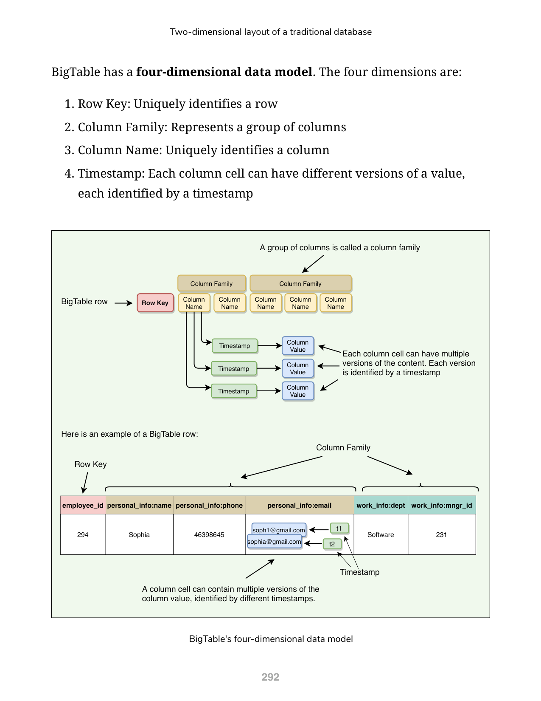

数据按行键、列键和时间戳索引（或排序）。因此，要访问单元格的内容，我们需要所有这三个值。如果未指定时间戳，BigTable 返回最新版本。

```
(row_key: string, column_name: string, timestamp: int64) → cell contents (string)
```

### 行

表中的每一行都有一个关联的行键，它是一个最多 64 KB 大小的任意字符串（尽管大多数键小得多）：

- 每个行由"行键"唯一标识
- 每个"行键"在内部表示为字符串
- **单行下的每次数据读写操作是原子的**。这意味着不保证跨行的原子性，例如更新两行时，一个可能成功，另一个可能失败
- 每个表的数据仅按行键、列键和时间戳索引。没有二级索引
- 列是键值对，其中键表示为"列键"，值表示为"列值"

### 列族

列键被分组为称为**列族**的集合。存储在列族中的所有数据通常是相同类型的。表中不同列族的数量应保持较小（最多几百个），并且列族在操作期间应很少更改。访问控制以及磁盘和内存记账都在列族级别执行。

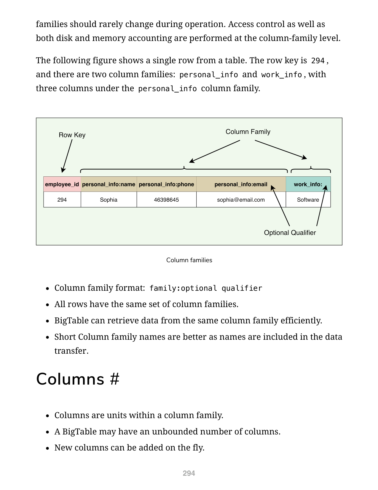

- 列族格式：`family:optional_qualifier`
- 所有行具有相同的列族集合
- BigTable 可以高效地从同一列族检索数据
- 较短的列族名更好，因为名称包含在数据传输中

### 列

列是列族内的单元：

- BigTable 可能拥有无限数量的列
- 可以动态添加新列
- 较短的列名更好，因为名称在每次数据传输中传递，例如 `ColumnFamily:ColumnName` → `Work:Dept`
- BigTable 非常适合稀疏数据。这是因为**空列不会被存储**

### 时间戳

每个列单元格可以包含内容的多个版本。例如，我们可能有同一个员工邮箱的多个带时间戳的版本。一个 64 位时间戳标识每个版本，既可以是实际时间，也可以是客户端分配的自定义值。

读取时，如果未指定时间戳，BigTable 返回最新版本。如果客户端指定了时间戳，则返回早于指定时间戳的最新版本。

BigTable 支持两种按列族的设置，用于自动垃圾回收单元格版本。客户端可以指定只保留单元格的最后"n"个版本，或只保留足够新的版本（例如，只保留过去七天内写入的值）。

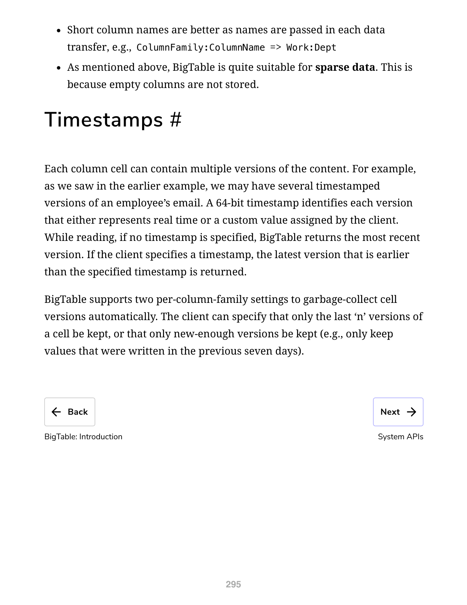

---

## 系统 APIs

BigTable 为两种类型的操作提供 API。

### 元数据操作

BigTable 提供用于创建和删除表及列族的 API。它还提供用于更改集群、表和列族元数据（如访问控制权限）的函数。

### 数据操作

客户端可以在 BigTable 中插入、修改或删除值。客户端还可以从单行查找值，或迭代表中数据的子集。

- BigTable 支持**单行事务**，可用于对存储在单个行键下的数据执行原子读取-修改-写入序列
- BigTable 不支持跨行键的事务，但提供用于跨行键批量写入的客户端接口
- BigTable 允许将单元格用作**整数计数器**
- 一组包装器允许 BigTable 既作为 MapReduce 作业的输入源，也作为输出目标
- 客户端还可以编写 Sawzall（Google 开发的脚本语言）脚本，在网络获取之前指示服务器端数据处理（转换、过滤、聚合）

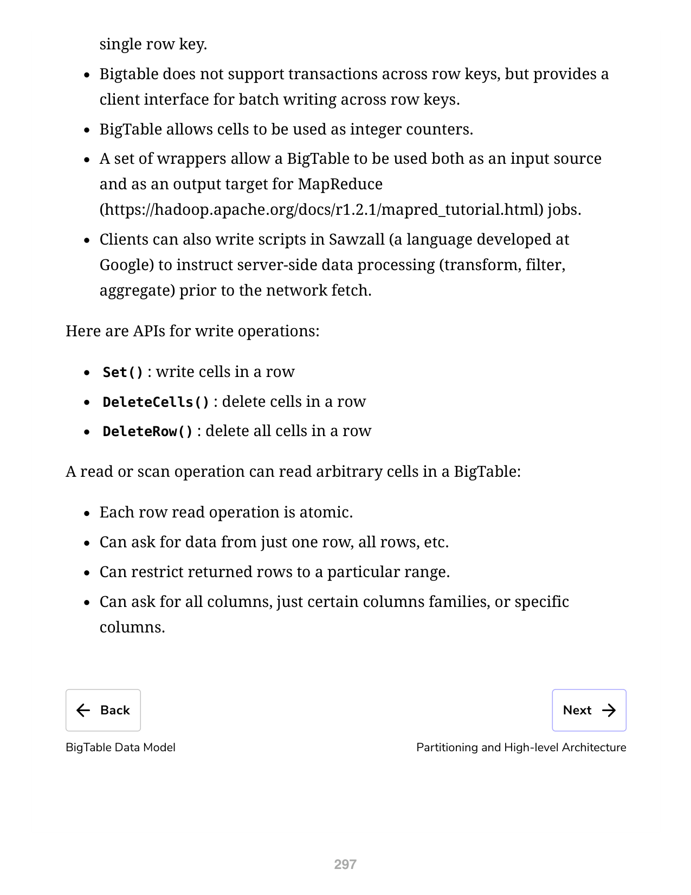

**写入操作的 API**：

- `Set()`：在行中写入单元格
- `DeleteCells()`：删除行中的单元格
- `DeleteRow()`：删除行中的所有单元格

**读取或扫描操作**可以读取 BigTable 中的任意单元格：

- 每行读取操作是原子的
- 可以只从一行、所有行等请求数据
- 可以将返回的行限制为特定范围
- 可以请求所有列、仅某些列族或特定列

---

## 分区与高层架构

### 表分区

BigTable 实现的单个实例称为**集群**。每个集群可以存储多个表，每个表被分割成多个 **Tablet**，每个 Tablet 约 100-200 MB。

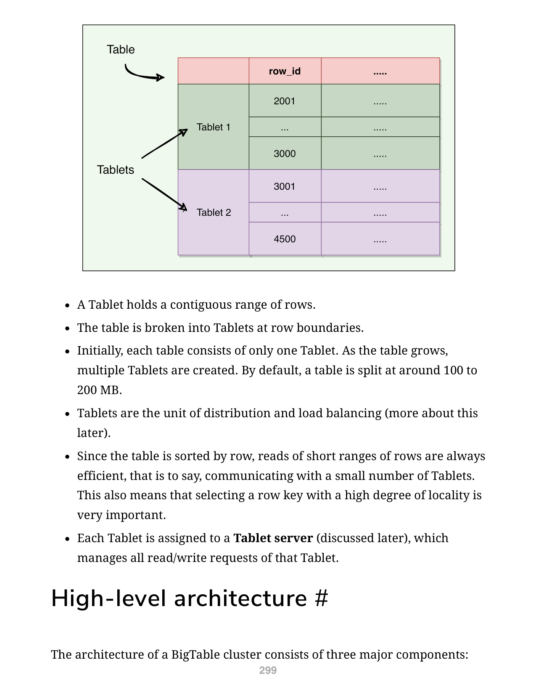

- Tablet 持有**连续的行范围**
- 表在行边界处被分割成 Tablet
- 最初，每个表只由一个 Tablet 组成。随着表的增长，会创建多个 Tablet。默认情况下，表在约 100 到 200 MB 时分割
- **Tablet 是分布和负载均衡的单位**（稍后详细讨论）
- 由于表按行排序，短行范围的读取总是高效的，即只需要与少量 Tablet 通信
- 这也意味着选择具有高度局部性的行键非常重要
- 每个 Tablet 被分配给一个 **Tablet 服务器**（稍后讨论），该服务器管理该 Tablet 的所有读/写请求

### 高层架构

BigTable 集群的架构由三个主要组件组成：

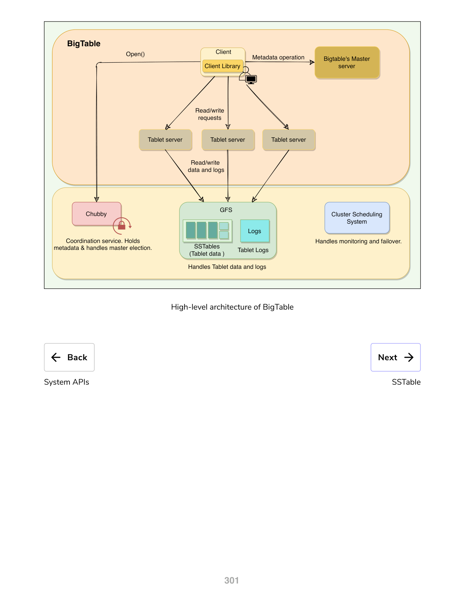

1. **客户端库**：链接到每个客户端的库组件。客户端通过此库与 BigTable 通信
2. **一个主服务器**：负责执行元数据操作，并将 Tablet 分配给 Tablet 服务器并进行管理
3. **多个 Tablet 服务器**：每个 Tablet 服务器为其分配的 Tablet 提供数据读写服务

BigTable 构建在 Google 基础设施的几个其他组件之上：

1. **[[GFS]]**：BigTable 使用 Google 文件系统存储其数据和日志文件
2. **[[SSTable]]**：Google 的 SSTable 文件格式用于存储 BigTable 数据。SSTable 提供从键到值的持久化、有序、不可变的映射（稍后详细讨论）。SSTable 的设计使得任何数据访问至多需要一次磁盘访问
3. **[[Chubby]]**：BigTable 使用名为 Chubby 的高可用、持久的分布式锁服务来处理同步问题并存储配置信息
4. **集群调度系统**：Google 有一个集群管理系统，用于调度、监控和管理 BigTable 的集群

---

## SSTable

### Tablet 在 GFS 中的存储方式

BigTable 使用 GFS（一个持久化的分布式文件存储系统）以文件形式存储数据。BigTable 用于存储文件的文件格式称为 **SSTable**：

- SSTable 是键到值的持久化、有序映射，其中键和值都是任意字节字符串
- 每个 Tablet 以一系列称为 SSTable 的文件存储在 GFS 中
- 一个 SSTable 由一系列数据块（通常为 64 KB）组成

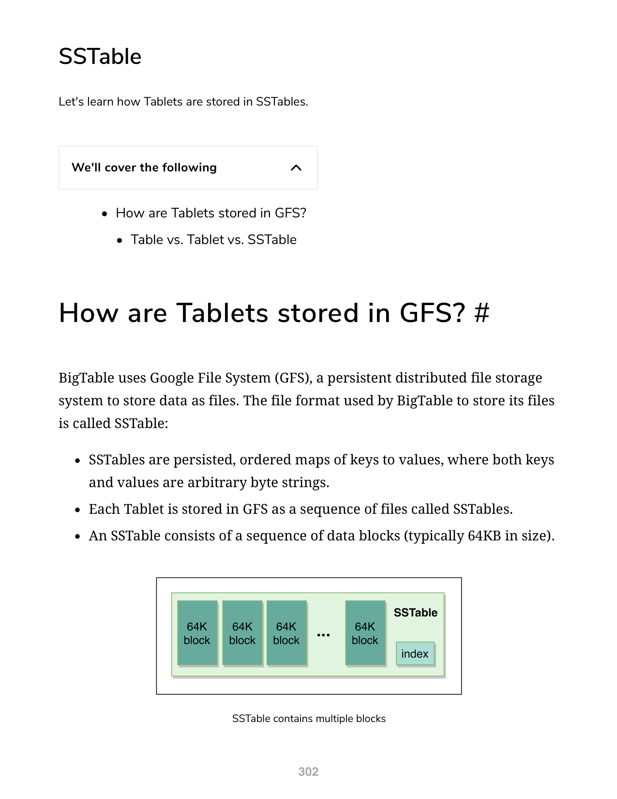

- 使用**块索引**定位块；索引在 SSTable 打开时加载到内存中
- 读取 SSTable 中的数据：通过一次磁盘寻道即可执行查找。首先在内存索引中执行二分查找找到适当的块，然后从磁盘读取该块
- 要读取 SSTable 中的数据，可以将其整个从磁盘复制到内存，也可以只复制索引。前一种方法避免了后续查找的磁盘寻道，后一种方法每次查找需要一次磁盘寻道

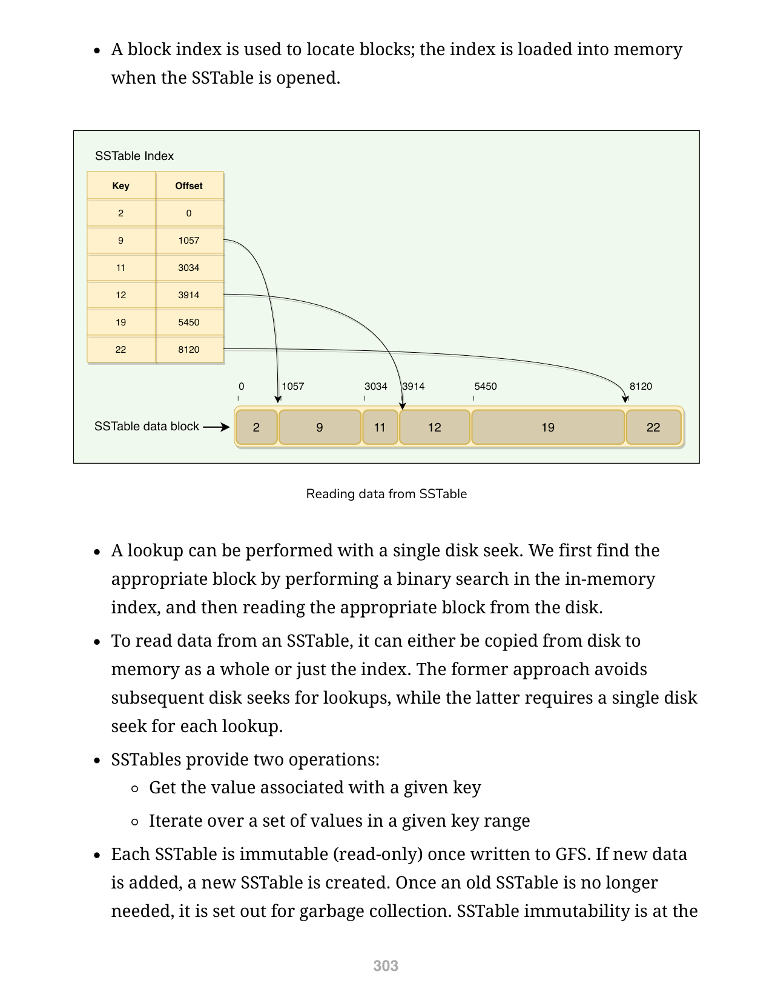

SSTable 提供两种操作：
- 获取给定键关联的值
- 迭代给定键范围内的一组值

每个 SSTable 在写入 GFS 后是**不可变的**（只读）。如果添加了新数据，则创建新的 SSTable。一旦旧的 SSTable 不再需要，就标记为垃圾回收。SSTable 的不可变性是 BigTable 数据检查点和恢复例程的核心。SSTable 的不可变性提供了以下优势：

- 读取操作期间无需同步
- 这也使分割 Tablet 更加容易
- 垃圾回收器处理已删除或过期数据的永久移除

### 表 vs. Tablet vs. SSTable

以下是表、Tablet 和 SSTable 之间的关系：

- 多个 Tablet 组成一个表
- SSTable 可以被多个 Tablet 共享
- Tablet **不重叠**，SSTable **可以重叠**

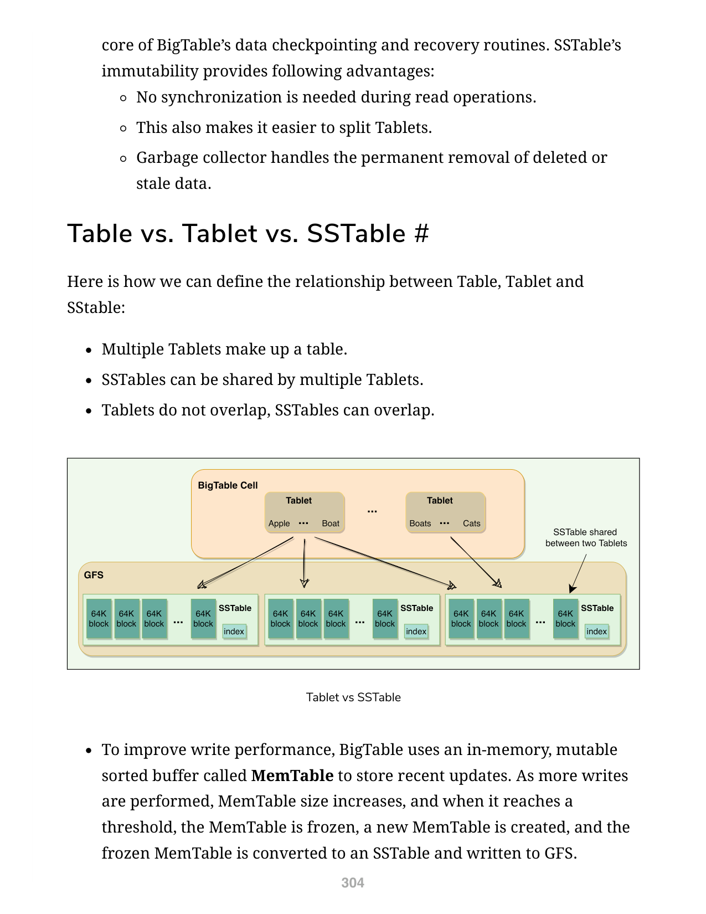

为了提高写入性能，BigTable 使用内存中的可变排序缓冲区称为 **MemTable** 来存储最近的更新。随着更多写入操作，MemTable 大小增加，当达到阈值时，MemTable 被冻结，创建新的 MemTable，并将冻结的 MemTable 转换为 SSTable 写入 GFS。

每个数据更新也写入**提交日志**（存储在 GFS 中）。此日志包含重做记录，用于在 Tablet 服务器在将 MemTable 提交到 SSTable 之前发生故障时的恢复。

读取时，数据可以在 MemTable 或 SSTable 中。由于这两个表都已排序，很容易找到最新的数据。

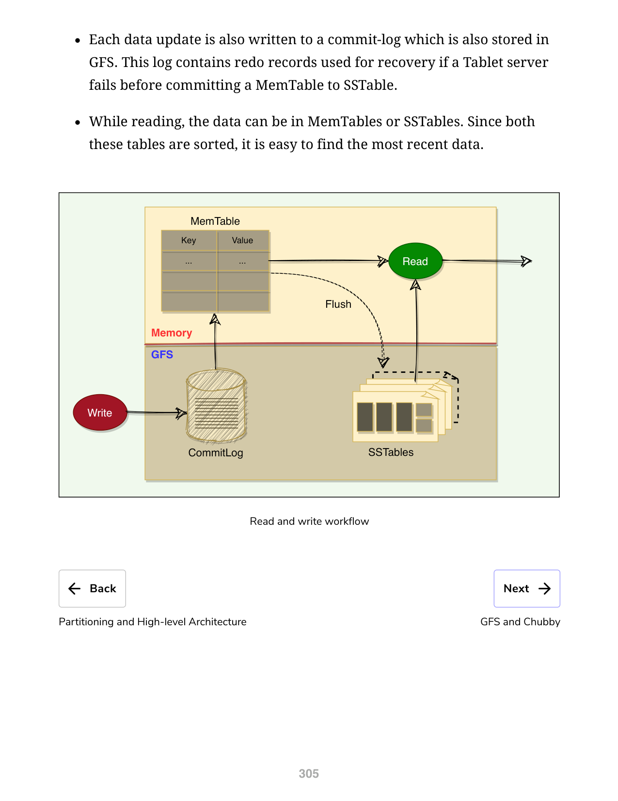

---

## GFS 和 Chubby

### GFS

GFS 是 Google 为其大规模数据密集型应用（如 BigTable）开发的可扩展分布式文件系统：

- GFS 文件被分解为固定大小的块，称为 Chunk
- Chunk 存储在称为 ChunkServer 的数据服务器上
- GFS 主服务器管理元数据
- SSTable 被划分为固定大小的块，这些块存储在 ChunkServer 上
- GFS 中的每个 Chunk 在多个 ChunkServer 之间复制以确保可靠性
- 客户端与 GFS 主服务器交互以获取元数据，但所有数据传输直接发生在客户端和 ChunkServer 之间

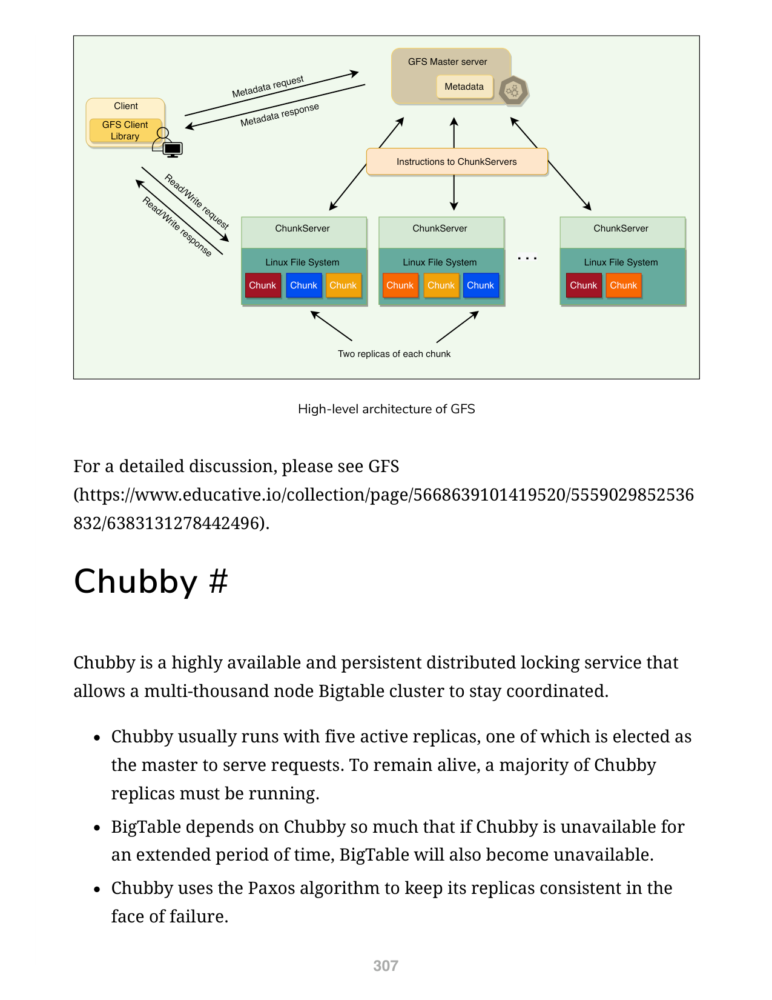

### Chubby

Chubby 是一个高可用、持久的分布式锁服务，允许数千节点的 BigTable 集群保持协调：

- Chubby 通常运行五个活动副本，其中一个被选为主服务器来服务请求。要保持存活，必须运行大多数 Chubby 副本
- BigTable 非常依赖 Chubby，如果 Chubby 长时间不可用，BigTable 也将变得不可用
- Chubby 使用 [[Paxos]] 算法在故障情况下保持其副本一致
- Chubby 提供由文件和目录组成的命名空间。每个文件或目录可以用作锁
- 对 Chubby 文件的读写访问是原子的
- 每个 Chubby 客户端与 Chubby 服务维护一个会话。如果客户端无法在租约到期时间内续约其会话租约，会话将过期。当客户端会话过期时，它会失去所有锁和打开的句柄。Chubby 客户端还可以在 Chubby 文件和目录上注册回调，以接收更改或会话过期的通知

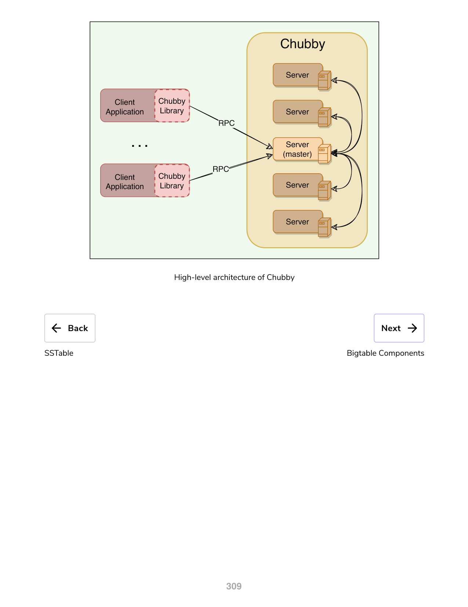

在 BigTable 中，Chubby 用于：

- **确保只有一个 Active 的主服务器**。主服务器与 Chubby 维护会话租约并定期续约以保持主服务器状态
- **存储 BigTable 数据的引导位置**（稍后讨论）
- **发现新的 Tablet 服务器**以及现有服务器的故障
- **存储 BigTable 模式信息**（每个表的列族信息）
- **存储访问控制列表（ACL）**

---

## BigTable 组件

### BigTable 主服务器

BigTable 集群中只有一个主服务器，负责：

- 将 Tablet **分配**给 Tablet 服务器并确保有效的负载均衡
- 监控 Tablet 服务器的状态并管理 Tablet 服务器的加入或故障
- **垃圾回收**存储在 GFS 中的底层文件
- 处理元数据操作，如表和列族的创建

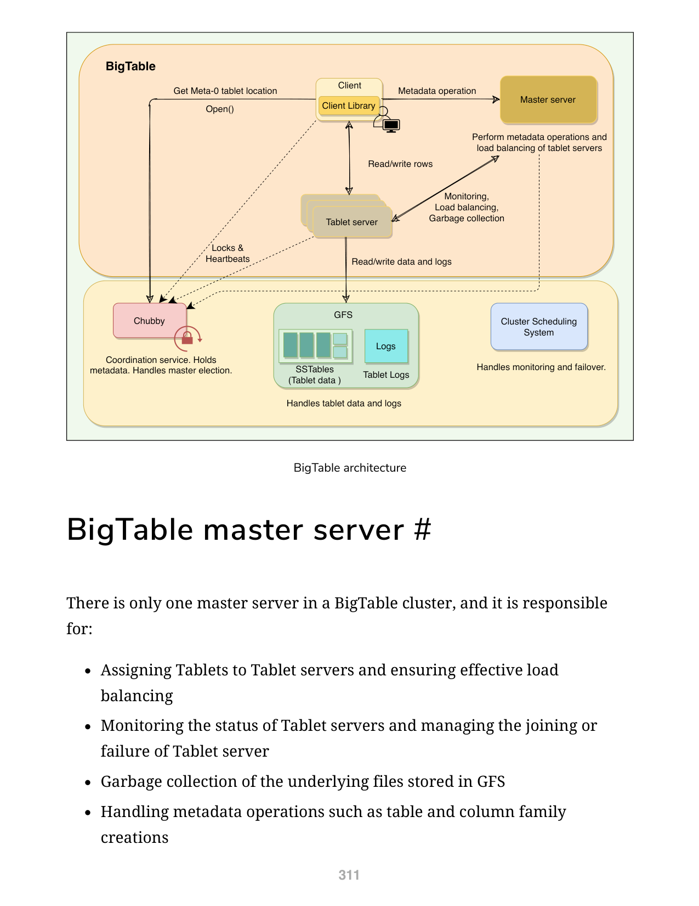

BigTable 主服务器**不参与将 Tablet 映射到 GFS 底层文件的核心任务**（Tablet 服务器处理此任务）。这意味着 BigTable 客户端根本不需要与主服务器通信。这一设计决策显著减少了主服务器的负载以及主服务器成为瓶颈的可能性。

### Tablet 服务器

- 每个 Tablet 服务器由主服务器分配一定数量的 Tablet（通常每个服务器 **10-1,000 个 Tablet**）
- 每个 Tablet 服务器服务其分配到的 Tablet 的数据读写请求。客户端直接与 Tablet 服务器通信以进行读/写
- 可以从集群中动态添加或移除 Tablet 服务器以适应工作负载变化
- Tablet 的创建、删除或合并由主服务器发起，而 Tablet 的分割由 Tablet 服务器处理，并通知主服务器

---

## Tablet 的工作原理

### 定位 Tablet

由于 Tablet 在服务器之间移动（由于负载均衡、Tablet 服务器故障等），给定一行，如何找到正确的 Tablet 服务器？我们需要找到其行范围覆盖目标行的 Tablet。

BigTable 维护一个类似 **B+ 树的三级层次结构**来存储 Tablet 位置信息。

BigTable 创建一个特殊的表，称为 **METADATA 表**，用于存储 Tablet 位置。该元数据表包含每个 Tablet 的一行，告诉我们哪个 Tablet 服务器正在服务此 Tablet。

```
METADATA: Key: table id + end row
          Data: tablet server location
```

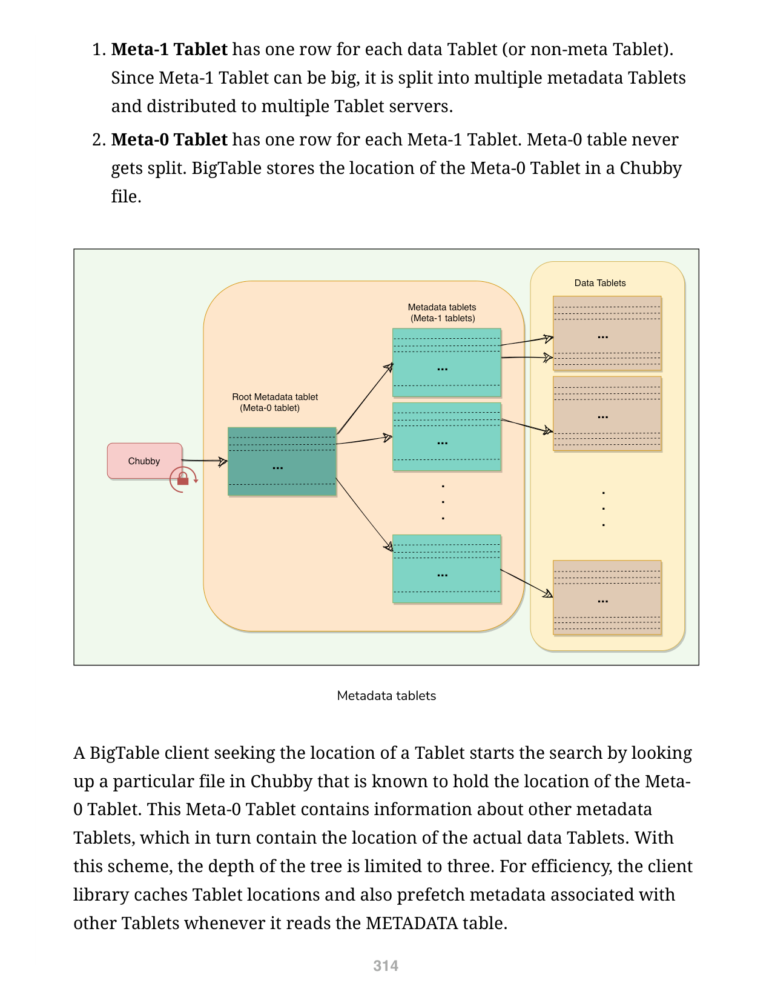

BigTable 将元数据表的信息分为两部分存储：

1. **Meta-1 Tablet**：每个 Meta-1 Tablet 包含每个数据 Tablet（或非元数据 Tablet）的一行。由于 Meta-1 Tablet 可能很大，它会被分割成多个元数据 Tablet 并分布到多个 Tablet 服务器
2. **Meta-0 Tablet**：每个 Meta-0 Tablet 包含每个 Meta-1 Tablet 的一行。**Meta-0 表从不分割**。BigTable 将 Meta-0 Tablet 的位置存储在 **Chubby 文件**中

BigTable 客户端要查找 Tablet 的位置，首先查找 Chubby 中已知保存 Meta-0 Tablet 位置的特定文件。此 Meta-0 Tablet 包含其他元数据 Tablet 的信息，而这些元数据 Tablet 又包含实际数据 Tablet 的位置。通过这种方案，树的深度限制为**三级**。为了提高效率，客户端库缓存 Tablet 位置，并在每次读取 METADATA 表时预取与其他 Tablet 关联的元数据。

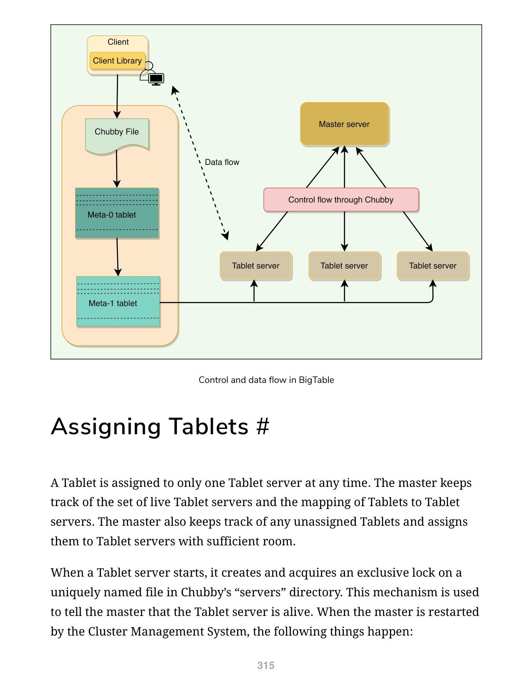

### 分配 Tablet

在任何时候，一个 Tablet 只分配给一个 Tablet 服务器。主服务器跟踪活跃 Tablet 服务器的集合以及 Tablet 到 Tablet 服务器的映射。主服务器还跟踪任何未分配的 Tablet，并将它们分配给有足够空间的 Tablet 服务器。

当 Tablet 服务器启动时，它在 Chubby 的"servers"目录中创建并获取一个具有唯一名称的文件的排他锁。此机制用于告诉主服务器该 Tablet 服务器是活跃的。

当主服务器被集群管理系统重启时，会发生以下事情：

1. 主服务器在 Chubby 中获取一个唯一的**主服务器锁**以防止多个主服务器实例化
2. 主服务器扫描 Chubby 的"servers"目录以找到活跃的 Tablet 服务器
3. 主服务器与每个活跃的 Tablet 服务器通信，以发现每个服务器分配了哪些 Tablet
4. 主服务器扫描 **METADATA 表**以了解完整的 Tablet 集合。当此扫描遇到尚未分配的 Tablet 时，主服务器将该 Tablet 添加到未分配 Tablet 的集合中。类似地，主服务器构建有资格进行 Tablet 分配的未分配 Tablet 服务器的集合。主服务器使用此信息将未分配的 Tablet 分配给适当的 Tablet 服务器

### 监控 Tablet 服务器

BigTable 在 Chubby 中维护一个"Servers"目录，其中包含每个活跃 Tablet 服务器的一个文件。每当新的 Tablet 服务器上线时，它在此目录中创建一个新文件以表明其可用性，并获取此文件的排他锁。只要 Tablet 服务器保留其 Chubby 文件的锁，它就被视为活跃的。

BigTable 的主服务器持续监控"Servers"目录，当它看到此目录中有新文件时，它知道新的 Tablet 服务器已可用并准备好被分配 Tablet。除此之外，主服务器定期检查锁的状态。如果锁丢失，主服务器假设 Tablet 服务器或 Chubby 有问题。在这种情况下，主服务器尝试获取锁，如果成功，则断定 Chubby 工作正常，Tablet 服务器有问题。此时，主服务器删除该文件并**重新分配故障 Tablet 服务器的 Tablet**。文件的删除作为故障 Tablet 服务器终止自身并停止服务 Tablet 的信号。

当 Tablet 服务器丢失其在"servers"目录中创建的文件的锁时，它停止服务其 Tablet。它尝试再次获取锁，如果成功，则认为这是临时网络问题并重新开始服务其 Tablet。如果文件被删除，Tablet 服务器终止自身以重新开始。

### 负载均衡 Tablet 服务器

主服务器负责将 Tablet 分配给 Tablet 服务器。主服务器跟踪所有可用的 Tablet 服务器并维护集群应该服务的 Tablet 列表。除此之外，主服务器定期询问 Tablet 服务器的当前负载。所有这些信息使主服务器拥有集群的全局视图，并有助于分配和负载均衡 Tablet。

---

## BigTable 读写操作的生命周期

### 写入请求

收到写入请求后，Tablet 服务器执行以下步骤：

1. 检查请求格式是否正确
2. 检查发送者是否有权执行修改。此授权基于存储在 Chubby 文件中的访问控制列表（ACL）
3. 如果满足上述两个条件，修改写入 GFS 中存储重做记录的**提交日志**
4. 修改提交到提交日志后，其内容存储在内存中的排序缓冲区中，称为 **MemTable**
5. 将数据插入 MemTable 后，向客户端发送数据已成功写入的确认
6. 定期将 MemTable 刷新到 SSTable，并在压缩期间合并 SSTable（稍后讨论）

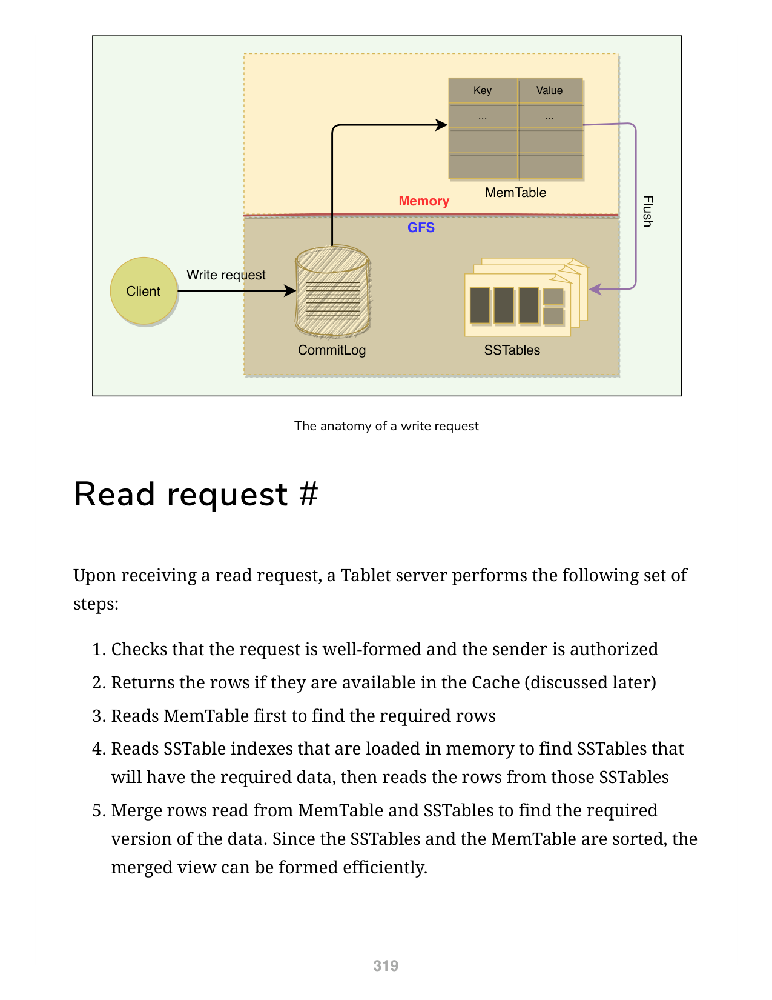

### 读取请求

收到读取请求后，Tablet 服务器执行以下步骤：

1. 检查请求格式是否正确以及发送者是否已授权
2. 如果数据在缓存中可用，则返回行（稍后讨论缓存）
3. 首先读取 **MemTable** 以找到所需行
4. 读取加载到内存中的 **SSTable 索引**以找到包含所需数据的 SSTable，然后从这些 SSTable 中读取行
5. 合并从 MemTable 和 SSTable 读取的行，以找到数据的所需版本。由于 SSTable 和 MemTable 都已排序，可以有效率地形成合并视图

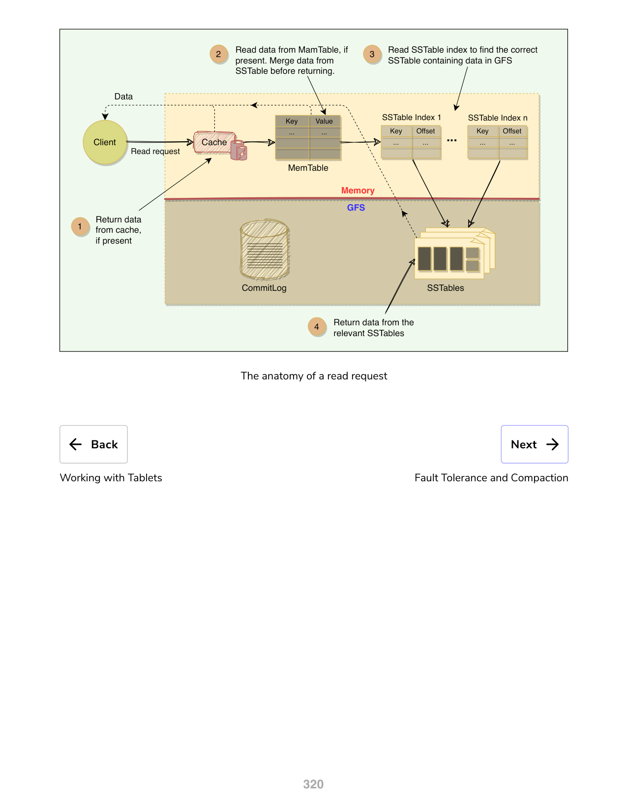

---

## 容错与压缩

### Chubby 和 GFS 中的容错

BigTable 使用两个独立的系统——Chubby 和 GFS。这两个系统都采用复制策略实现容错和更高的可用性。例如，一个 Chubby 单元通常由五个服务器组成，其中一个成为主服务器，其余四个作为副本。如果主服务器故障，其中一个副本被选举为领导者，从而最小化 Chubby 的停机时间。类似地，GFS 将数据的多个副本存储在不同的 ChunkServer 上。

### Tablet 服务器的容错

BigTable 的主服务器负责监控 Tablet 服务器。主服务器通过定期检查每个 Tablet 服务器的 Chubby 锁状态来实现。当主服务器发现 Tablet 服务器已宕机时，它**重新分配故障 Tablet 服务器的 Tablet**。

### 主服务器的容错

主服务器在 Chubby 文件中获取锁并维护一个**租约**。如果在任何时候主服务器的租约到期，它会自行终止。当 Google 的集群管理系统发现没有活跃的主服务器时，它会启动一个新的主服务器。新的主服务器必须在充当主服务器之前获取 Chubby 文件上的锁。

### 压缩

BigTable 中的修改占用额外空间，直到执行压缩。BigTable 在后台管理压缩：

1. **Minor Compaction（小压缩）**：随着写操作的执行，MemTable 增大。当 MemTable 达到某个阈值时，它被冻结，创建新的 MemTable。冻结的 MemTable 被转换为 SSTable 并写入 GFS。此过程称为小压缩。每次小压缩创建一个新的 SSTable，有两个好处：
   - 减少 Tablet 服务器的内存使用，因为将 MemTable 刷新到 GFS。一旦 MemTable 写入 GFS，提交日志中的相应条目也被删除
   - 减少此服务器宕机时恢复期间必须从提交日志读取的数据量

2. **Merging Compaction（合并压缩）**：小压缩不断增加 SSTable 的数量。这意味着读取操作可能需要合并来自任意数量 SSTable 的更新。为减少 SSTable 的数量，执行合并压缩——读取几个 SSTable 和 MemTable 的内容，并写出一个新的 SSTable。输入 SSTable 和 MemTable 在压缩完成后可以丢弃

3. **Major Compaction（主压缩）**：在主压缩中，所有 SSTable 写入一个单一的 SSTable。主压缩产生的 SSTable **不包含任何删除信息或已删除数据**，而非主压缩产生的 SSTable 可能包含已删除条目。主压缩允许 BigTable **回收已删除数据使用的资源**，并确保已删除数据快速从系统中消失，这对存储敏感数据的服务很重要

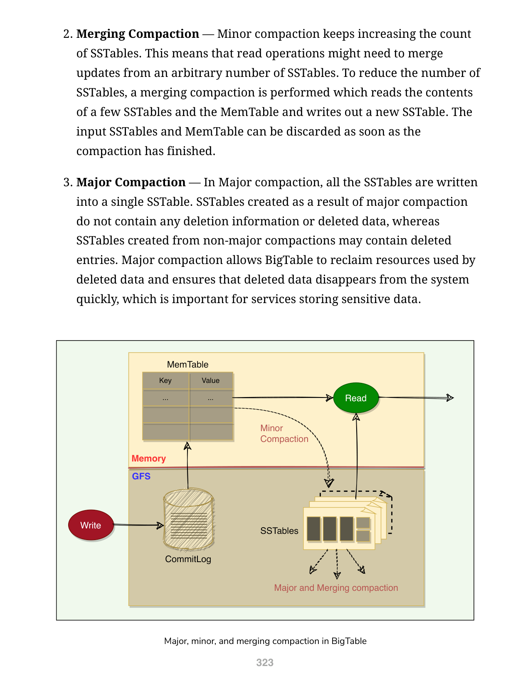

---

## BigTable 优化

### 局部性组

客户端可以将多个列族组合成一个**局部性组**（Locality Group）。BigTable 为每个局部性组生成单独的 SSTable。这有两个好处：

- 将频繁一起访问的列分组到局部性组中可**提高读取性能**
- 客户端可以显式声明任何局部性组为**常驻内存**以实现更快访问。这样，频繁访问的较小局部性组可以保留在内存中
- 对一个局部性组的扫描是 **O(bytes_in_locality_group)**，而不是 O(bytes_in_table)

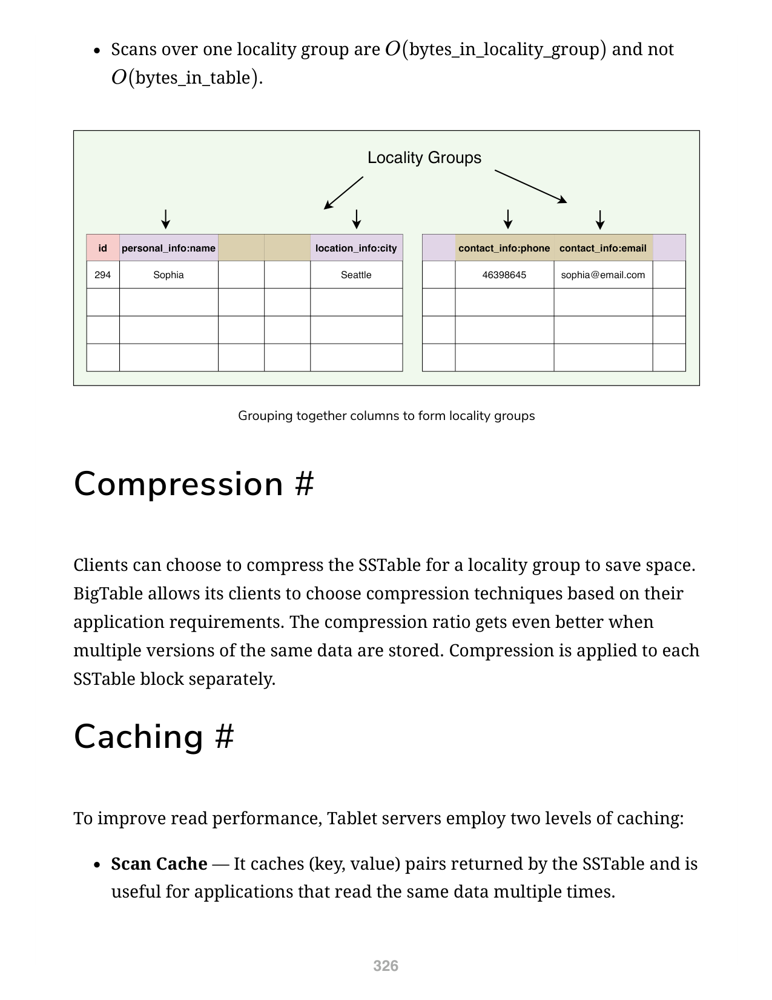

### 压缩

客户端可以选择压缩局部性组的 SSTable 以节省空间。BigTable 允许客户端根据其应用程序要求选择压缩技术。当存储同一数据的多个版本时，压缩比会更好。压缩分别应用于每个 SSTable 块。

### 缓存

为提高读取性能，Tablet 服务器采用两级缓存：

- **扫描缓存（Scan Cache）**：缓存 SSTable 返回的（键，值）对，适用于多次读取相同数据的应用程序
- **块缓存（Block Cache）**：缓存从 GFS 读取的 SSTable 块，适用于倾向于读取接近其最近读取数据的应用程序（例如，在频繁访问的行内的同一局部性组中对不同列的顺序或随机读取）

### 布隆过滤器

任何读取操作都必须读取组成 Tablet 的所有 SSTable。如果这些 SSTable 不在内存中，读取操作可能最终进行许多磁盘访问。为减少磁盘访问次数，BigTable 使用**布隆过滤器**。

布隆过滤器是为 SSTable（特别是局部性组）创建的。它们通过预测 SSTable 是否可能包含特定（行，列）对的数据来帮助减少磁盘访问次数。布隆过滤器占用少量内存，但可以大幅提高读取性能。

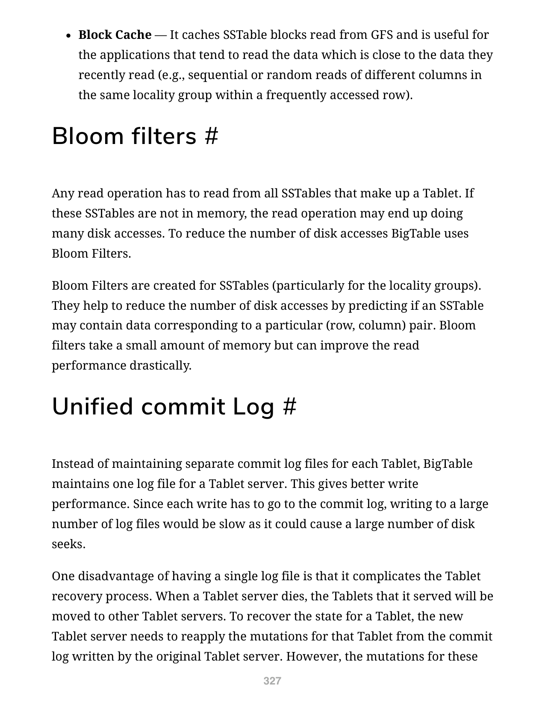

### 统一提交日志

BigTable 不为每个 Tablet 维护单独的提交日志文件，而是为每个 Tablet 服务器维护一个日志文件。这提供了更好的写入性能。由于每次写入都必须写入提交日志，写入大量日志文件会因大量磁盘寻道而变慢。

单一日志文件的一个缺点是它使 Tablet 恢复过程复杂化。当 Tablet 服务器宕机时，它服务的 Tablet 将移动到其他 Tablet 服务器。为恢复 Tablet 的状态，新的 Tablet 服务器需要从原始 Tablet 服务器编写的提交日志中重新应用该 Tablet 的修改。然而，这些 Tablet 的修改在同一个物理日志文件中混合在一起。

一种方法是让每个新的 Tablet 服务器读取此完整提交日志文件，并仅应用其需要恢复的 Tablet 的条目。但是，在这种方案下，如果 100 台机器各分配了故障 Tablet 服务器的一个 Tablet，则日志文件将被读取 100 次。

BigTable 通过首先按 `<table, row name, log sequence number>` 键的顺序对提交日志条目进行排序来避免重复的日志读取。在排序输出中，特定 Tablet 的所有修改是连续的，因此可以高效地读取。

为进一步提高性能，每个 Tablet 服务器维护两个日志写入线程——每个写入自己的独立日志文件。一次只有一个线程活跃。如果一个线程性能不佳（例如由于网络拥塞），写入切换到另一个线程。日志条目具有序列号以允许恢复过程。

### 加速 Tablet 恢复

如上所述，加载 Tablet 时复杂且耗时的任务之一是确保 Tablet 服务器从提交日志加载所有条目。当主服务器将 Tablet 从一个 Tablet 服务器移动到另一个时，源 Tablet 服务器执行压缩以确保目标 Tablet 服务器不必读取提交日志。这分三步完成：

1. 源服务器执行**小压缩**。此压缩减少了提交日志中的数据量
2. 然后，源 Tablet 服务器**停止服务**该 Tablet
3. 最后，源服务器执行另一次（通常非常快的）小压缩，以应用在进行第一次小压缩时到达的任何新日志条目。在此第二次小压缩完成后，Tablet 可以加载到另一个 Tablet 服务器上，而无需恢复任何日志条目

---

## BigTable 特性

### BigTable 性能

BigTable 性能和流行背后的一些原因：

- **分布式多级映射**：BigTable 可以在大量机器上运行
- **可扩展**：BigTable 可以通过向集群添加更多节点轻松水平扩展，而不会影响性能。无需手动干预或再平衡。BigTable 在通用硬件上实现了线性可扩展性和经过验证的容错能力
- **容错可靠**：由于数据复制到多个节点，容错能力相当高
- **持久化**：BigTable 永久存储数据
- **集中式**：BigTable 采用单主服务器方法来维护数据一致性和系统状态的集中视图
- **控制与数据分离**：BigTable 在控制流和数据流之间保持严格分离。客户端与主服务器通信以进行所有元数据操作，而所有数据访问直接发生在客户端和 Tablet 服务器之间

### Dynamo vs. BigTable

| 特性 | Dynamo | BigTable |
|------|--------|----------|
| 架构 | 去中心化，每个节点职责相同 | 集中式，主服务器处理元数据，Tablet 服务器处理读/写 |
| 数据模型 | 键值 | 多维排序映射 |
| 安全性 | — | 列族级别的访问权限 |
| 分区 | 一致性哈希，节点随机在环上 | Tablet，表分割成连续行范围 |
| 复制 | 松弛仲裁，数据项复制到 N 个节点 | GFS Chunk 复制，数据存储在 GFS 中 |
| CAP | AP | CP |
| 操作 | 按键 | 按键范围 |
| 存储 | 可插拔 | GFS 中的 SSTable |
| 成员和故障检测 | 基于 Gossip 的协议 | 主服务器发起的握手 |

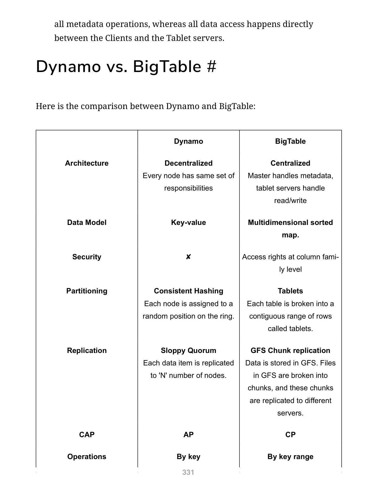

### 基于 BigTable 原则开发的数据存储

Google 的 BigTable 启发了许多 NoSQL 系统：

1. **[[HBase]]**：HBase 是一个开源的分布式非关系型数据库，以 BigTable 为模型。它构建在 Hadoop 分布式文件系统（HDFS）之上
2. **Hypertable**：与 HBase 类似，Hypertable 是 BigTable 的开源实现，用 C++ 编写。与仅使用一个存储层（即 GFS）的 BigTable 不同，Hypertable 能够运行在任何文件系统之上（例如 HDFS、GlusterFS 或 CloudStore）。为实现这一点，系统通过将所有数据请求发送到分布式文件系统代理进程来抽象文件系统的接口
3. **[[Cassandra]]**：Cassandra 是一个分布式、去中心化、高可用的 NoSQL 数据库。其架构基于 Dynamo 和 BigTable。Cassandra 可以描述为在 Dynamo 类基础设施上运行的 BigTable 类数据存储。Cassandra 也是宽列存储，并利用 BigTable 的存储模型，即 SSTable 和 MemTable

---

## 总结

| 特性 | BigTable 实现 |
|------|-------------|
| 类型 | 分布式存储系统，管理大量结构化数据 |
| 数据模型 | 稀疏、分布式、持久化、多维排序映射 |
| 索引 | 按行键、列键和时间戳索引 |
| 行键 | 最多 64 KB 的任意字符串 |
| 列 | 无限数量的列，分组为列族 |
| 时间戳 | 64 位整数，支持每个单元格多个版本 |
| 原子性 | 单行读写原子，不保证跨行原子性 |
| 行键选择 | 高度局部性很重要 |
| APIs | 元数据操作 + 数据操作（Set/DeleteCells/DeleteRow） |
| 分区 | 表分割成 Tablet（100-200 MB），连续行范围 |
| 架构 | 一个主服务器 + 多个 Tablet 服务器 |
| 底层存储 | GFS（数据和日志） |
| 文件格式 | SSTable（不可变、有序、持久映射） |
| 内存缓冲 | MemTable（可变、排序缓冲区） |
| Tablet 位置 | 三级 B+ 树状结构（Chubby → Meta-0 → Meta-1 → 数据） |
| 主服务器职责 | 分配 Tablet、负载均衡、监控、垃圾回收 |
| 容错 | Chubby 锁 + GFS 复制 + 主服务器租约 |
| 压缩 | Minor/Merging/Major 三种类型 |
| 优化 | 局部性组、压缩、两级缓存、布隆过滤器、统一提交日志 |
| 访问控制 | 列族级别，通过 Chubby 文件的 ACL |
| CAP 分类 | CP（强一致性） |

### 进一步阅读

- [BigTable 论文](https://research.google/pubs/pub27898/)
- [SSTable 格式](https://medium.com/databasss/on-disk-io-part-4-b-tree-lsm-tree-sstables-94e7d45e2b1f)
- [Dynamo 论文](https://www.allthingsdistributed.com/2007/10/amazons_dynamo.html)
- [Cassandra](https://cassandra.apache.org/)
- [HBase](https://hbase.apache.org/)

---

## 选择题

1. BigTable 的数据模型有多少个维度？
   a. 二维
   b. 三维
   c. 四维（行键、列族、列名、时间戳）
   d. 五维

2. BigTable 中 Tablet 是什么？
   a. 整个表的完整副本
   b. 表的连续行范围，约 100-200 MB
   c. 表的一个列族
   d. 表的索引结构

3. BigTable 如何定位特定的 Tablet 服务器？
   a. 通过广播查询所有 Tablet 服务器
   b. 通过三级 B+ 树结构（Chubby → Meta-0 → Meta-1 → 数据 Tablet）
   c. 通过 DNS 轮询
   d. 通过一致性哈希环

4. BigTable 中 SSTable 的一个重要特性是什么？
   a. 支持原地更新
   b. 写入后不可变（只读）
   c. 支持事务
   d. 自动分区

5. 以下哪个不是 BigTable 的底层依赖组件？
   a. GFS
   b. Chubby
   c. MapReduce
   d. BigQuery

**答案**
1. c
2. b
3. b
4. b
5. d
