# 8 系统设计模式

## 引言

### 目标

系统设计模式是分布式系统中反复出现的通用设计问题的解决方案。掌握这些模式对于任何系统设计面试都至关重要——它们提供了构建块，可用于设计和讨论各种分布式系统。

本章将讨论以下 20 种系统设计模式：

1. [[布隆过滤器|Bloom Filters]]
2. [[一致性哈希|Consistent Hashing]]
3. [[仲裁|Quorum]]
4. [[领导者与追随者|Leader and Follower]]
5. [[预写日志|Write-ahead Log]]
6. [[分段日志|Segmented Log]]
7. [[高水位|High-Water Mark]]
8. [[租约|Lease]]
9. [[心跳|Heartbeat]]
10. [[Gossip 协议|Gossip Protocol]]
11. Phi Accrual Failure Detection
12. [[脑裂|Split-brain]]
13. [[隔离|Fencing]]
14. [[校验和|Checksum]]
15. [[向量时钟|Vector Clocks]]
16. [[CAP 定理|CAP Theorem]]
17. [[PACELC 定理|PACELC Theorem]]
18. [[手写回传|Hinted Handoff]]
19. [[读修复|Read Repair]]
20. [[默克尔树|Merkle Trees]]


---

## 1. 布隆过滤器

### 背景

如果我们有一组大型结构化数据集，存储在多个数据文件中，如何最高效地知道哪个文件包含我们需要的数据？我们不想读取每个文件——那样太慢，且需要从磁盘读取大量数据。一种解决方案是在每个数据文件上构建索引并将其存储在单独的索引文件中。索引可以将每条记录 ID 映射到其在数据文件中的偏移量。每个索引文件按记录 ID 排序。如果要在该索引中搜索一个 ID，最好的方法是二分查找。但能否做得更好？

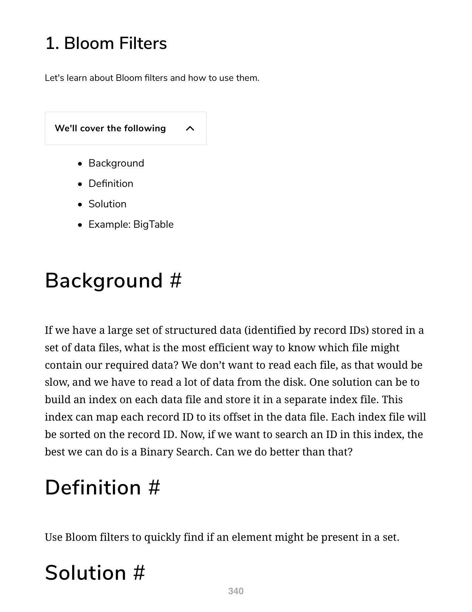

### 定义

使用布隆过滤器快速判断一个元素**可能**存在于集合中，还是**绝对不在**集合中。

### 解决方案

布隆过滤器是一种数据结构，用于判断一个元素是"可能在集合中"还是"绝对不在集合中"。唯一可能的错误是**假阳性**——即搜索一个不存在的元素可能给出错误答案。随着过滤器中元素增多，错误率上升。

一个空的布隆过滤器是一个 **m 位**的位数组，所有位均设为 0。还有 **k** 个不同的哈希函数，每个函数将集合元素映射到 m 位位置之一。

- **添加元素**：将元素送入 k 个哈希函数，得到 k 个位位置，将这些位设为 1
- **测试元素**：将元素送入 k 个哈希函数，得到 k 个位位置。如果其中任何一位是 0，则该元素**绝对不在**集合中；如果全部为 1，则该元素**可能**在集合中


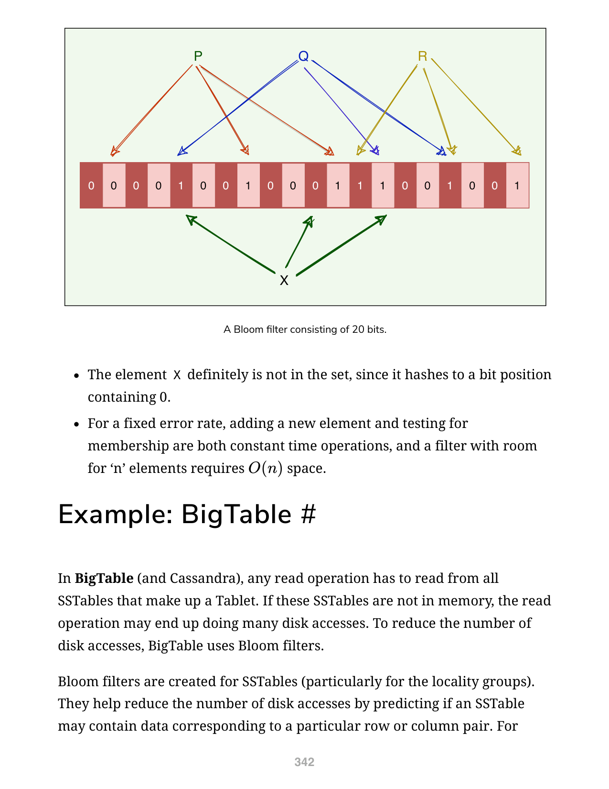

对于固定的错误率，添加新元素和测试成员关系都是常数时间操作，容纳"n"个元素的过滤器需要 O(n) 空间。

### 示例：BigTable

在 [[BigTable]]（和 [[Cassandra]]）中，任何读取操作都必须读取组成 Tablet 的所有 SSTable。如果这些 SSTable 不在内存中，读取操作可能需要进行多次磁盘访问。为了减少磁盘访问次数，BigTable 使用布隆过滤器。

布隆过滤器为 SSTable（特别是局部性组）创建。它们通过预测 SSTable 是否可能包含特定（行，列）对的数据来帮助减少磁盘访问次数。对于某些应用程序，少量 Tablet 服务器内存用于存储布隆过滤器，就能大幅减少磁盘寻道次数，从而提高读取性能。

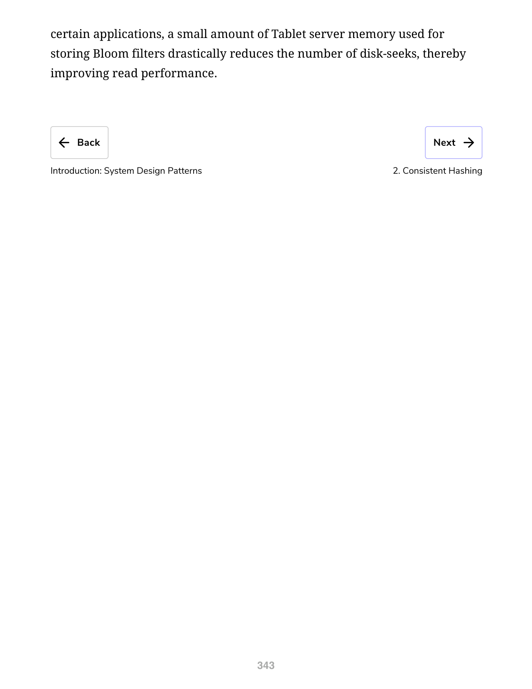

---

## 2. 一致性哈希

### 背景

在节点集合间分布数据的行为称为**数据分区**。分布数据时有两个挑战：

1. 如何知道特定数据存储在哪个节点上？
2. 添加或移除节点时，如何知道哪些数据需要从现有节点移动到新节点？如何最小化数据移动？

朴素的方法是使用合适的哈希函数将数据键映射到一个数字，然后对该数字和服务器总数取模来找到服务器。例如：

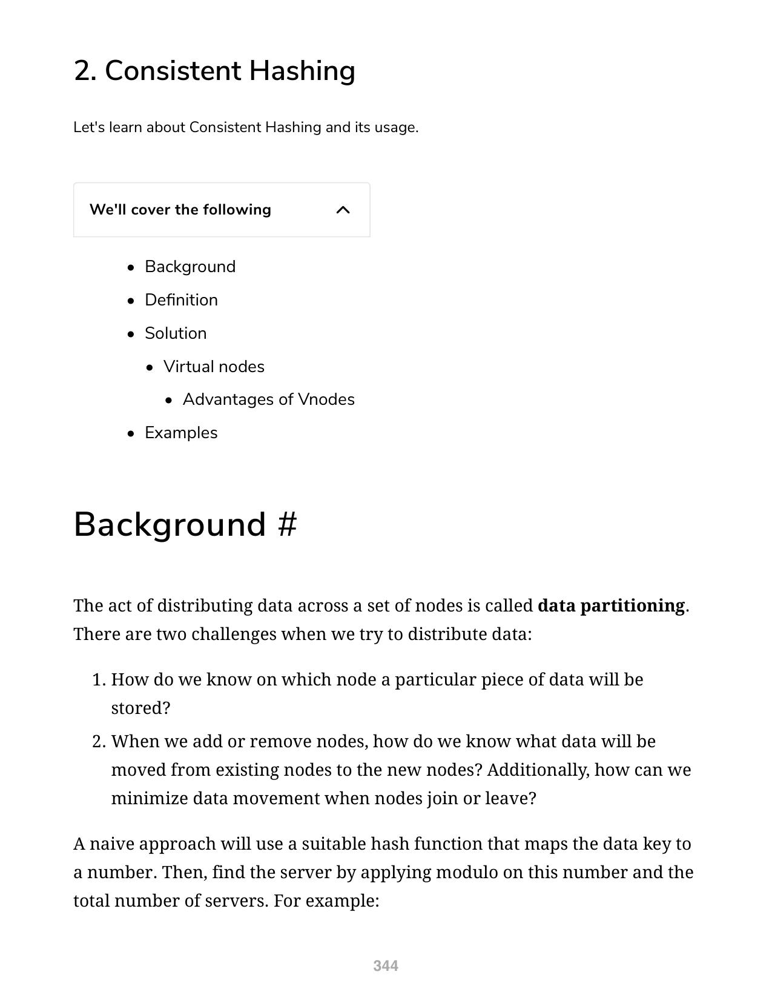

```
key = "California"
hash(key) = 17
17 % 5 = 2 → Server 2
```

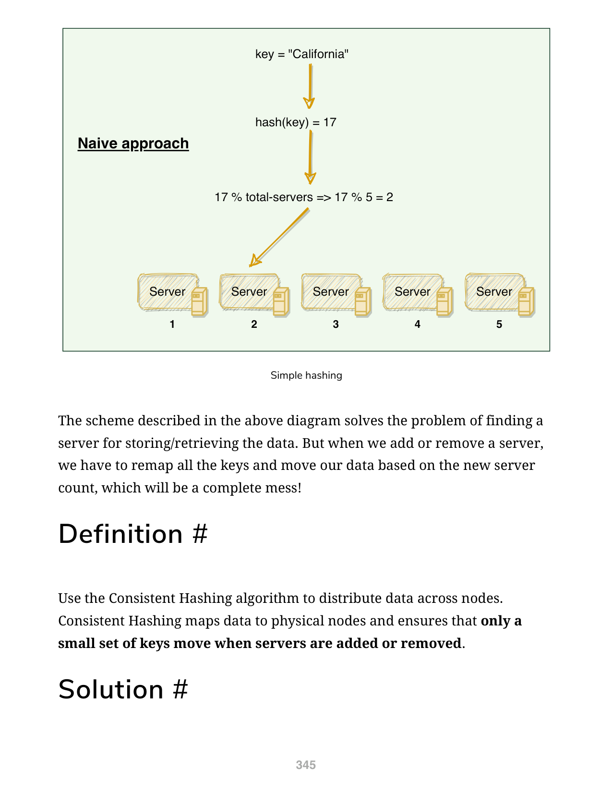

这种方案解决了查找服务器的问题，但添加或移除服务器时，必须根据新的服务器数量重新映射所有键并移动数据——这将是灾难性的！

### 定义

使用一致性哈希算法在节点间分布数据。一致性哈希将数据映射到物理节点，并确保添加或移除服务器时只有少量键需要移动。

### 解决方案

一致性哈希将分布式系统管理的数据存储在一个**环**上。环中的每个节点被分配一个数据范围。

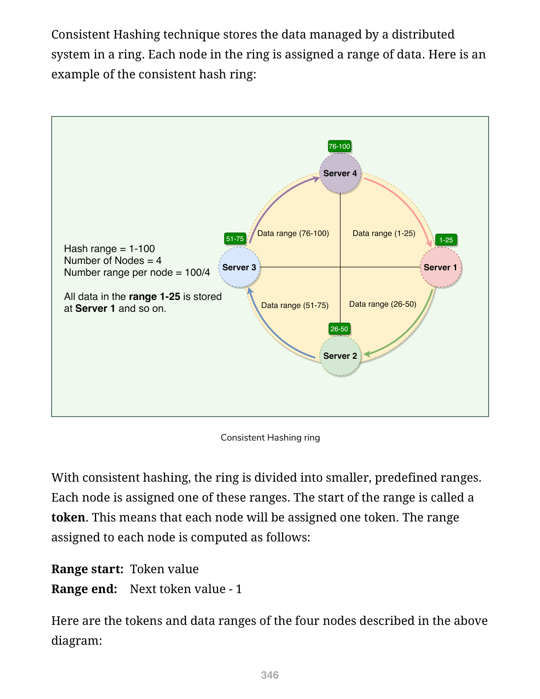

一致性哈希将环划分为更小的预定义范围。每个节点被分配一个范围。范围的起始称为**令牌**（Token）。每个节点被分配一个令牌。分配给每个节点的范围计算如下：

- 范围开始：令牌值
- 范围结束：下一个令牌值 - 1

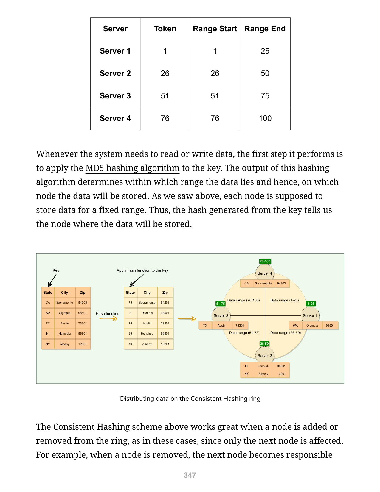

当系统需要读取或写入数据时，首先对键应用 MD5 哈希算法。哈希输出决定了数据落在哪个范围内，从而确定数据存储在哪个节点上。

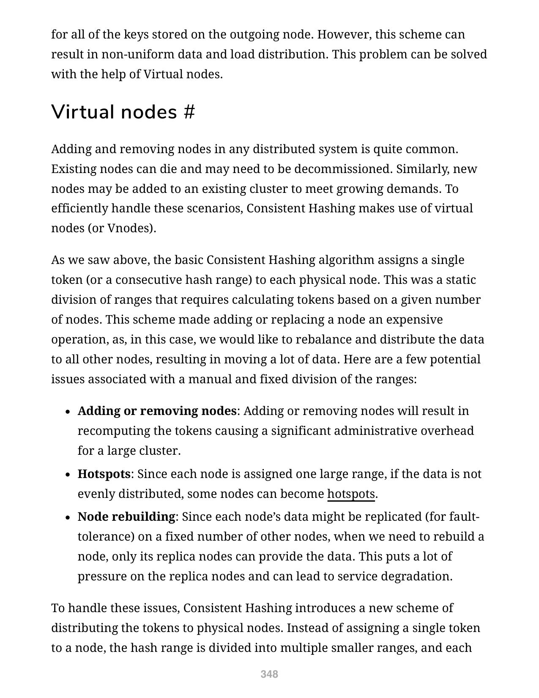

上述方案在添加或移除节点时效果很好——只有下一个节点受到影响。但这种方案可能导致不均匀的数据和负载分布。这个问题可以通过**虚拟节点**解决。

### 虚拟节点

在分布式系统中添加和移除节点相当常见。现有节点可能宕机需要退役，也可能需要添加新节点以满足增长需求。一致性哈希使用虚拟节点高效处理这些场景。

基本的一致性哈希算法为每个物理节点分配单个令牌（或连续的哈希范围）。这种静态范围划分使得添加或替换节点成为昂贵的操作，因为需要重新平衡并将数据分布到所有其他节点，导致大量数据移动。

使用虚拟节点后，哈希范围被划分为多个较小的范围，每个物理节点被分配多个这样的小范围。每个子范围被视为一个**VNode**。使用虚拟节点，节点不再只负责一个令牌，而是负责许多令牌（或子范围）。

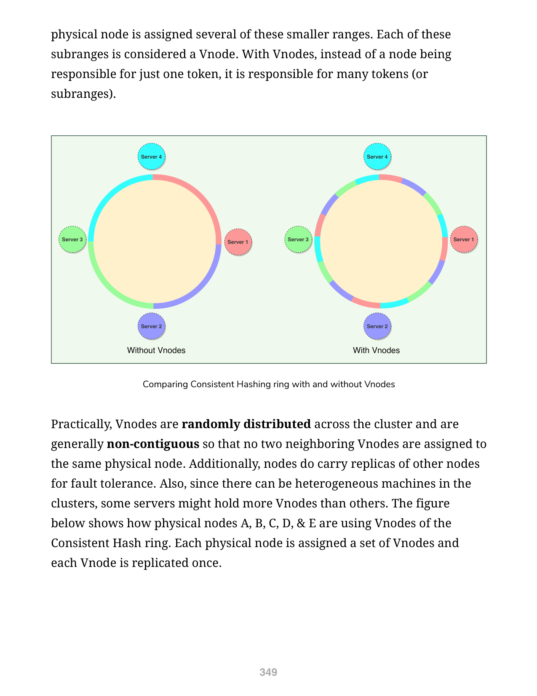

实践中，虚拟节点在集群中随机分布，通常是非连续的，因此没有两个相邻的虚拟节点分配给同一物理节点。此外，节点为容错目的携带其他节点的副本。由于集群中可能存在异构机器，一些服务器可能持有比其它服务器更多的虚拟节点。

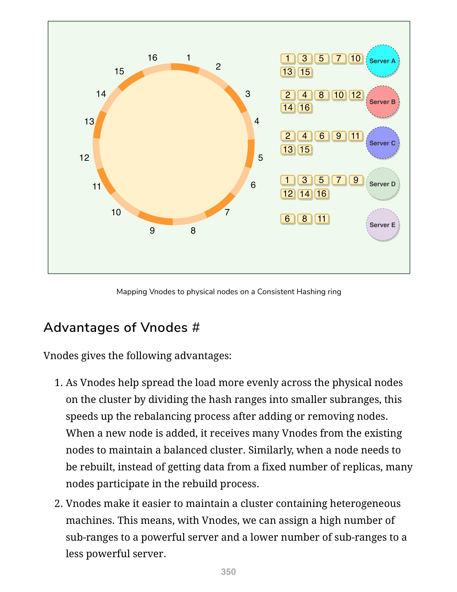

### 虚拟节点的优势

1. **加速再平衡**：虚拟节点通过将哈希范围划分为更小的子范围，更均匀地在物理节点之间分散负载。添加新节点时，它从现有节点接收许多虚拟节点以保持集群平衡。重建节点时，许多节点参与重建过程
2. **支持异构机器**：可以为强大的服务器分配更多子范围，为较弱的服务器分配较少的子范围
3. **降低热点概率**：由于虚拟节点帮助为每个物理节点分配更小的范围，降低了热点出现的概率

### 示例

[[Dynamo]] 和 [[Cassandra]] 使用一致性哈希在节点间分布数据。

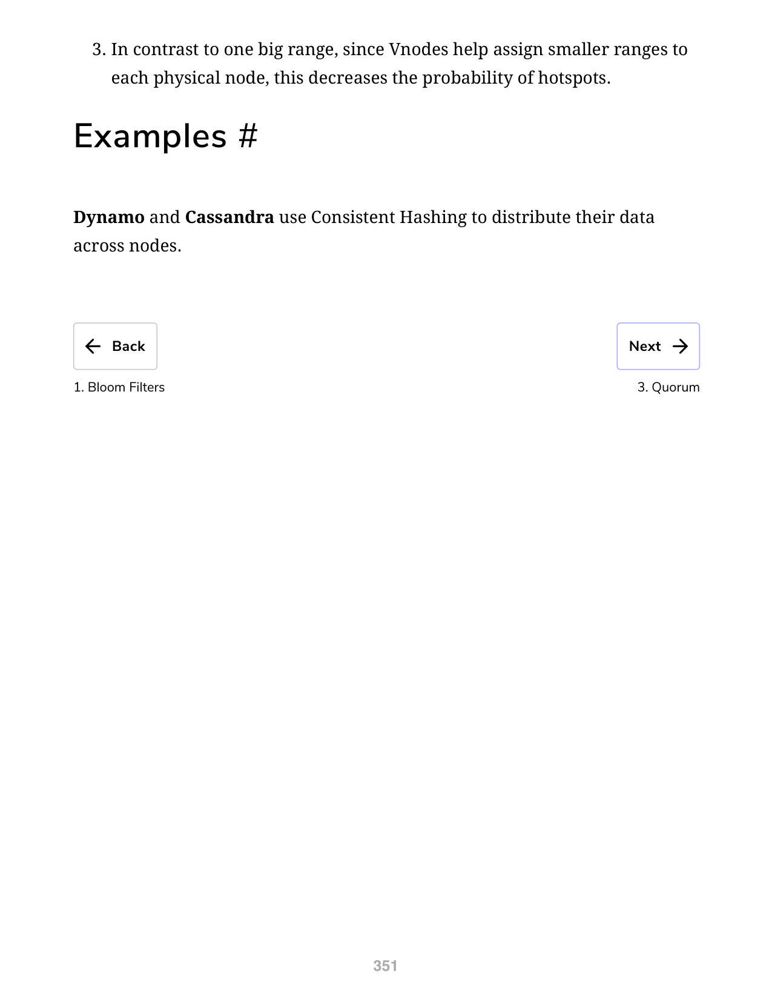

---

## 3. 仲裁

### 背景

在分布式系统中，数据为容错和高可用性在多个服务器间复制。一旦系统决定维护数据的多个副本，另一个问题随之而来：如何确保所有副本一致，即它们都拥有最新数据，且所有客户端看到相同的数据视图？

### 定义

在分布式环境中，仲裁（Quorum）是在声明操作整体成功之前，必须成功执行分布式操作的最小服务器数量。

### 解决方案

假设一个数据库在五台机器上复制。仲裁指的是执行相同操作（提交或中止）以决定事务最终操作的最少机器数量。在 5 台机器的集合中，3 台机器构成多数仲裁，如果它们同意，就提交该操作。

仲裁强制执行分布式操作所需的一致性要求。

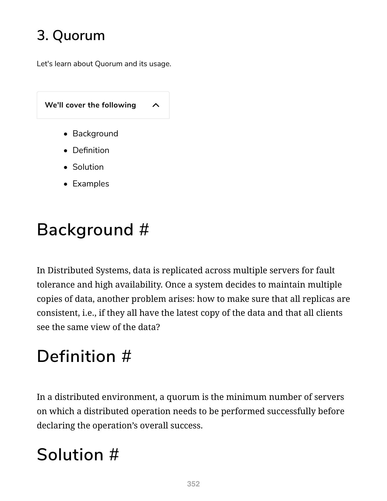

对于有多个副本的系统，用户可能读取到不一致的数据。例如，集群中有三个副本 R1、R2 和 R3，用户将值 v1 写入副本 R1。然后另一个用户从仍在追赶 R1 的 R2 或 R3 读取，不会得到值 v1，因此第二个用户看不到数据的一致状态。

**应该选择什么值的仲裁？** 超过集群节点数的一半：(N/2 + 1)，其中 N 是集群中的总节点数。

- 在 5 节点集群中，必须在线 3 个节点才能构成多数
- 在 4 节点集群中，必须在线 3 个节点才能构成多数
- 5 节点系统可容忍 2 个节点故障，而 4 节点只能容忍 1 个

因此，建议集群中的总节点数始终为奇数。

当节点遵循以下协议时即可实现仲裁：**R + W > N**，其中：
- N = 仲裁组中的节点数
- W = 最小写入节点数
- R = 最小读取节点数

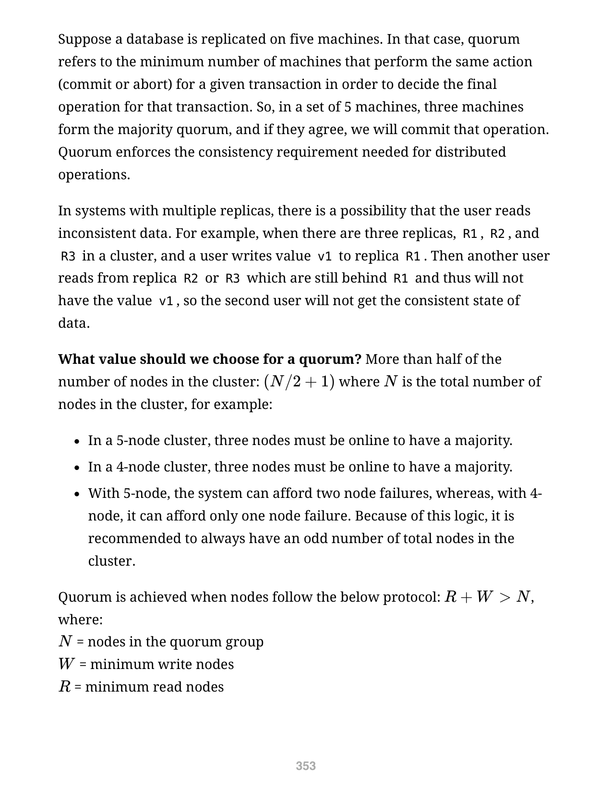

如果分布式系统遵循 R + W > N 规则，每次读取将至少看到一个最新写入值的副本。例如，常见配置 (N=3, W=2, R=2) 可确保强一致性。

其他示例：
- (N=3, W=1, R=3)：快写慢读，不太持久
- (N=3, W=3, R=1)：慢写快读，持久

在决定读写仲裁前，应注意以下两点：
- R=1 且 W=N ⇒ 全复制（写全部读一个）：服务器不可用时写入不一定能完成
- 最佳性能在 1 < r < w < n 时，因为大多数应用中读取比写入更频繁

### 示例

- **[[Chubby]]**：使用 [[Paxos]]，后者使用仲裁确保强一致性
- **[[Cassandra]]**：可配置每次写入请求仅在数据写入至少仲裁（多数）副本节点后才算成功
- **[[Dynamo]]**：将写入复制到松弛仲裁（sloppy quorum），而非像 Paxos 那样的严格多数仲裁

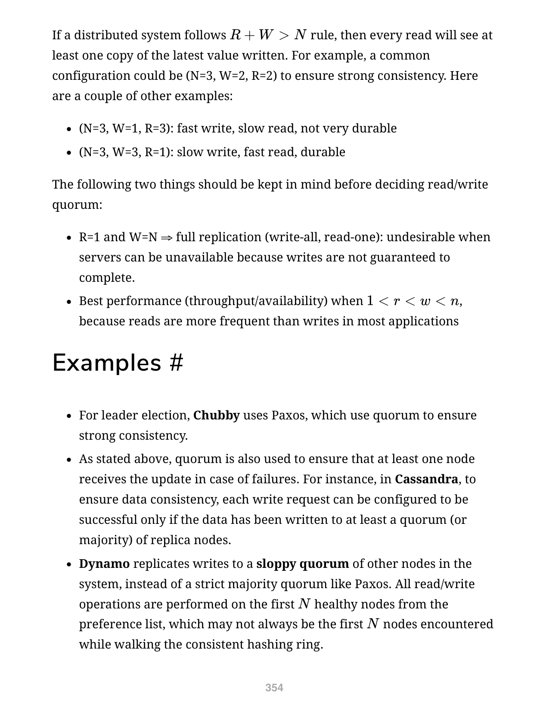

---

## 4. 领导者与追随者

### 背景

分布式系统为容错和高可用性维护数据的多个副本。系统可以使用仲裁确保副本间的数据一致性，但仲裁可能导致可用性降低——任何时候系统需要确保至少多数副本在线，否则操作将失败。仲裁在某些故障场景下也不足够，客户端仍可能看到不一致的数据。

### 定义

只允许单个服务器（称为领导者）负责数据复制和协调工作。

### 解决方案

在任何时间点，一台服务器被选为领导者。该领导者负责数据复制，并可充当所有协调的中央节点。追随者只接受来自领导者的写入，并作为备份。如果领导者故障，其中一个追随者可以成为新的领导者。在某些情况下，追随者可以为负载均衡服务读取请求。

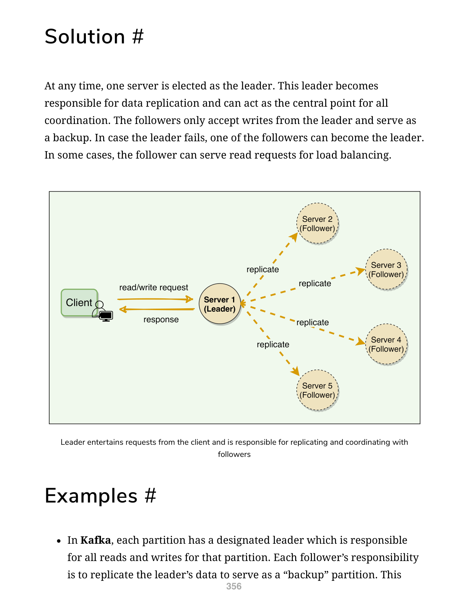

### 示例

- **[[Kafka]]**：每个分区有一个指定的领导者，负责该分区的所有读写。每个追随者负责复制领导者的数据以作为"备份"分区。如果领导者宕机，追随者可以接替领导权。在 Kafka 集群中，一个 Broker 被选举为**控制器**（Controller），负责管理操作如创建/删除主题、添加分区、分配分区领导者等
- **[[Chubby]]/[[Paxos]]**：为确保强一致性，Paxos 在启动时执行领导者选举。领导者负责数据复制和协调


---

## 5. 预写日志

### 背景

机器随时可能故障或重启。如果程序正在执行数据修改，而运行的机器断电会发生什么？机器重启时，程序可能需要知道上次正在做什么。基于其原子性和持久性需求，程序可能需要决定重做、撤销或完成已启动的操作。程序如何知道系统崩溃前正在做什么？

### 定义

为保证持久性和数据完整性，系统的每次修改首先写入磁盘上仅追加的日志。该日志称为**预写日志**（Write-Ahead Log，WAL）、事务日志或提交日志。写入 WAL 保证如果机器崩溃，系统能够恢复并在必要时重放操作。

### 解决方案

WAL 的核心思想是：所有修改在应用到系统之前，首先写入磁盘上的日志文件。每条日志条目应包含足够信息以重做或撤销修改。每次重启时可以读取日志，通过重放所有日志条目来恢复之前的状态。

使用 WAL 显著减少了磁盘写入次数，因为只有日志文件需要刷新到磁盘以保证事务已提交，而非事务更改的每个数据文件。

在分布式环境中，每个节点维护自己的日志。WAL 始终顺序追加，简化了日志处理。每条日志条目被赋予唯一标识符；该标识符有助于实现其他操作，如日志分段或日志清理。

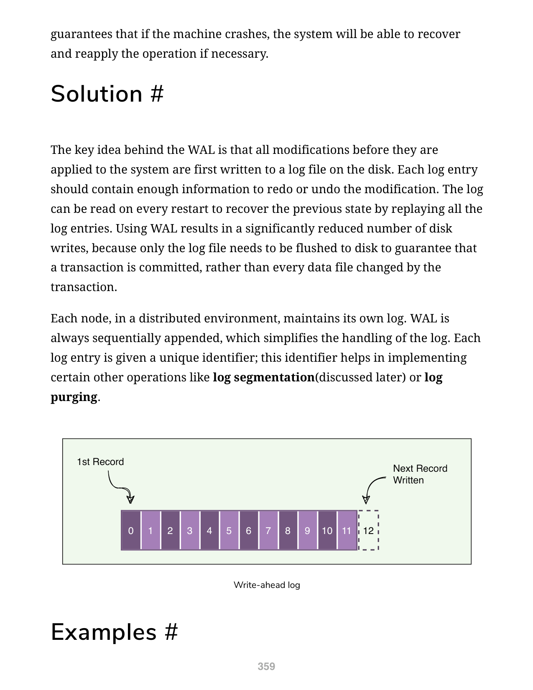

### 示例

- **[[Cassandra]]**：为保证持久性，节点收到写入请求后立即将数据写入提交日志（WAL）。在写入 MemTable 之前，Cassandra 首先将其写入提交日志。这在意外关机时提供持久性。启动时，提交日志中的任何变更将应用到 MemTable
- **[[Kafka]]**：实现分布式提交日志以持久存储接收到的所有消息
- **[[Chubby]]**：为容错和应对领导者崩溃，所有数据库事务存储在事务日志（WAL）中

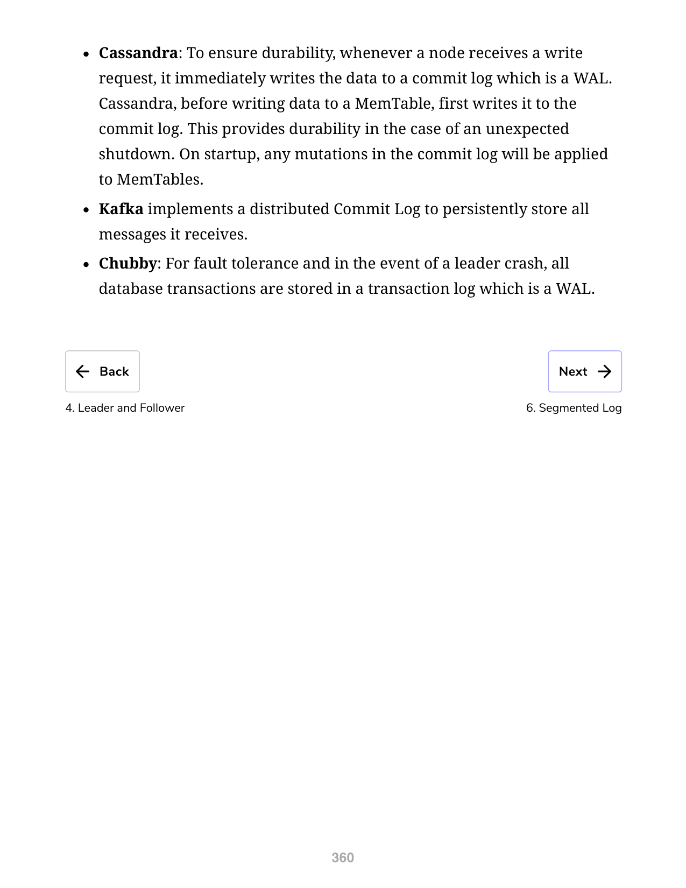

---

## 6. 分段日志

### 背景

单个日志文件可能变得难以管理。随着文件增长，它可能成为性能瓶颈，尤其是在启动时读取。旧日志需要定期清理或合并。在单个大文件上执行这些操作难以实现。

### 定义

将日志分解为较小的段以便管理。

### 解决方案

单个日志文件被分割成多个部分，使日志数据被分成大小相等的日志段。系统可以基于滚动策略滚动日志——可配置的时间周期（如每 4 小时）或可配置的最大大小（如每 1GB）。

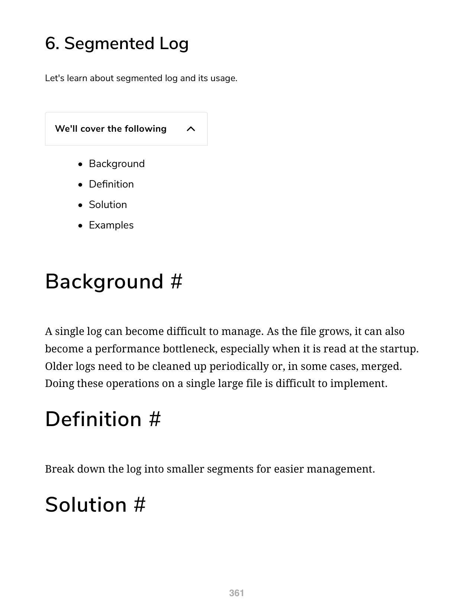

### 示例

- **[[Cassandra]]**：使用分段日志策略将其提交日志分割成多个较小的文件。当提交日志达到大小时，创建新的提交日志。随著时间推移，存在多个提交日志，每个称为一个段。当 Cassandra 将相应数据刷新到 SSTable 后，提交日志段被截断
- **[[Kafka]]**：使用日志分段实现分区的存储。由于 Kafka 需要定期在磁盘上查找消息进行清理，单个大文件可能成为性能瓶颈。为便于管理和提高性能，分区被拆分为段

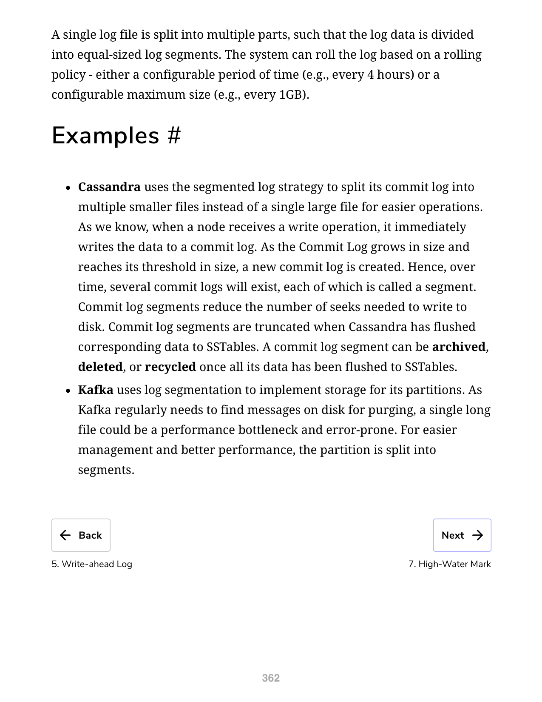

---

## 7. 高水位

### 背景

分布式系统为容错和高可用性维护数据的多个副本。为实现强一致性，一种选择是使用领导者-追随者设置，领导者负责处理所有写入，追随者从领导者复制数据。

领导者的每个事务提交到预写日志（WAL），以便从崩溃或故障中恢复。写入请求一旦提交到领导者的 WAL 即视为成功。复制可以异步发生——领导者推送变更到追随者，或追随者从领导者拉取数据。

如果领导者崩溃且无法恢复，一个追随者将被选举为新领导者。但新领导者可能比旧领导者落后一些，因为有些事务在旧领导者崩溃前尚未完全传播。这些事务在旧领导者的 WAL 中存在，但直到旧领导者重新上线才能恢复，因此被视为丢失。

在此场景下，客户端可能看到数据不一致。更重要的是，领导者和追随者需要知道日志的哪部分可以安全暴露给客户端。

### 定义

跟踪领导者上已成功复制到仲裁追随者的最后一条日志条目。该条目在日志中的索引称为**高水位标记**（High-Water Mark）索引。领导者只暴露高水位标记之前的数据。

### 解决方案

每次数据变更时，领导者先将其追加到 WAL，然后发送给所有追随者。收到请求后，追随者追加到各自的 WAL，然后向领导者发送确认。领导者跟踪已在每个追隨者上成功复制的条目索引。高水位标记索引是已成功复制到追随者仲裁的最高索引。

领导者可以通过定期心跳消息将高水位标记传播给所有追随者。领导者和追随者确保客户端只能读取高水位标记之前的数据。这保证了即使当前领导者故障且选举了新领导者，客户端也不会看到数据不一致。


### 示例

- **[[Kafka]]**：为处理不可重复读取并确保数据一致性，Kafka Broker 跟踪高水位标记，即特定分区所有 ISR（同步副本）共享的最大偏移量。消费者只能看到高水位之前的消息

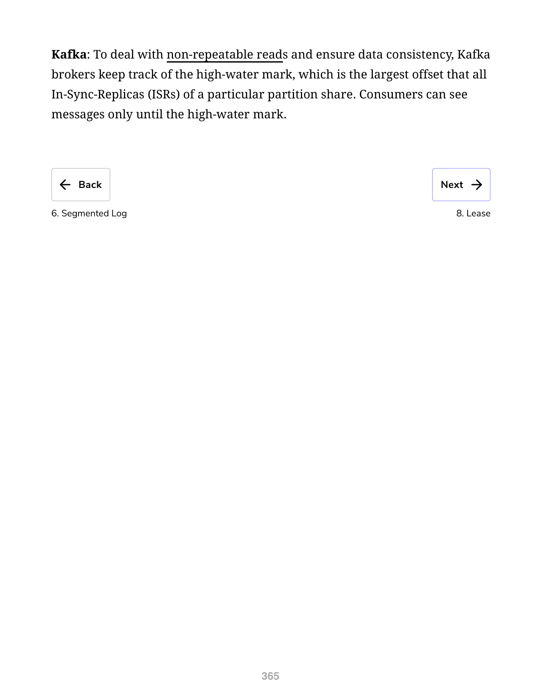

---

## 8. 租约

### 背景

在分布式系统中，客户端通常需要对某些资源的指定权利。例如，客户端可能需要排他权来更新文件内容。一种实现方式是分布式锁。客户端首先获取与文件关联的排他（写入）锁，然后进行文件更新。

锁的一个问题是：锁在锁定的客户端显式释放之前一直有效。如果客户端因任何原因（如进程崩溃、死锁或软件错误）未能释放锁，资源将被无限期锁定。这导致资源不可用，直到系统重置。是否有替代方案？

### 定义

使用有时间限制的租约向客户端授予资源权利。

### 解决方案

租约类似于锁，但即使客户端离开也能正常工作。客户端请求有限期限的租约，之后租约到期。如果客户端想延长租约，可以在租约到期前续约。


### 示例

- **[[Chubby]]**：客户端与领导者维护有时间限制的会话租约。在此时间间隔内，领导者保证不会单方面终止会话

---

## 9. 心跳

### 背景

在分布式环境中，工作/数据分布在服务器之间。为了高效路由请求，服务器需要知道系统中还有哪些其他服务器。此外，服务器应知道其他服务器是否存活和工作。

在去中心化系统中，当请求到达服务器时，服务器应有足够信息决定哪个服务器负责处理该请求。这使得及时检测服务器故障成为重要任务，系统可以采取纠正措施，将数据/工作移动到另一台健康服务器，防止环境进一步恶化。

### 定义

每台服务器定期向中央监控服务器或系统中的其他服务器发送心跳消息，以表明其仍在运行且正常工作。

### 解决方案

心跳是检测分布式系统故障的机制之一。如果有中央服务器，所有服务器定期向其发送心跳消息。如果没有中央服务器，所有服务器随机选择一组服务器，每隔几秒向其发送心跳消息。

如果一段时间未收到来自某服务器的心跳消息，系统可以怀疑该服务器可能已崩溃。如果在配置的超时时间内没有心跳，系统可以断定该服务器不再存活，停止向其发送请求，并开始处理其替换工作。

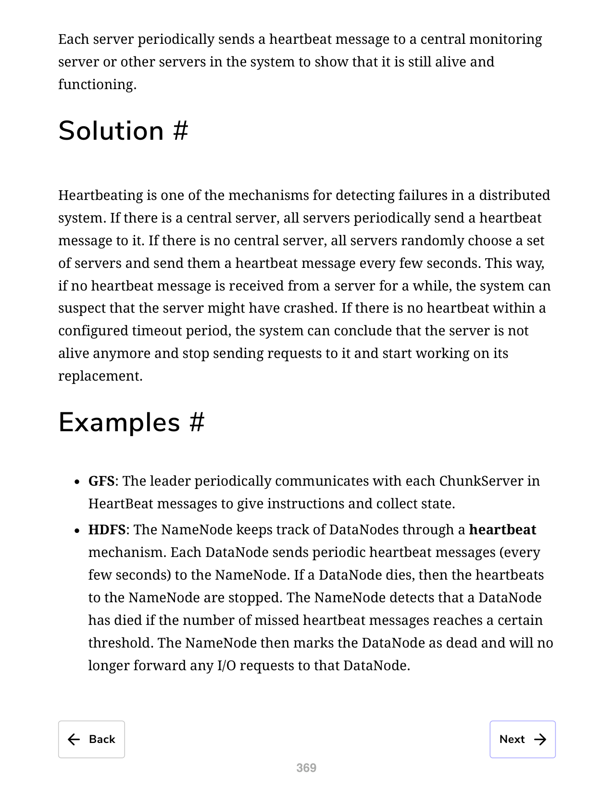

### 示例

- **[[GFS]]**：主服务器定期通过心跳消息与每个 ChunkServer 通信以发送指令和收集状态
- **[[HDFS]]**：NameNode 通过心跳机制跟踪 DataNode。每个 DataNode 定期向 NameNode 发送心跳消息（每隔几秒）。如果 DataNode 宕机，心跳将停止。NameNode 在错过的心跳消息达到一定阈值后检测到 DataNode 已死，将其标记为死亡，不再向其转发 I/O 请求

---

## 10. Gossip 协议

### 背景

在大型分布式环境中，如果没有中央节点跟踪所有节点以判断节点是否宕机，节点如何知道其他每个节点的当前状态？最简单的方式是让每个节点与所有其他节点维护心跳。当一个节点宕机时，它将停止发送心跳，其他所有节点立即发现。但这意味着每 tick 发送 O(N²) 条消息——在任意规模的集群中都是不切实际的。

### 定义

每个节点跟踪集群中其他节点的状态信息，并每秒向一个随机节点**传播**（gossip/分享）此信息。这样，最终每个节点都知道集群中所有其他节点的状态。

### 解决方案

Gossip 协议是一种点对点通信机制，节点定期交换关于自身和所知其他节点的状态信息。每个节点每秒发起一轮 gossip 以与其他一个随机节点交换状态信息。这意味着任何状态变更最终都会传播到整个系统，所有节点快速了解集群中所有其他节点的信息。

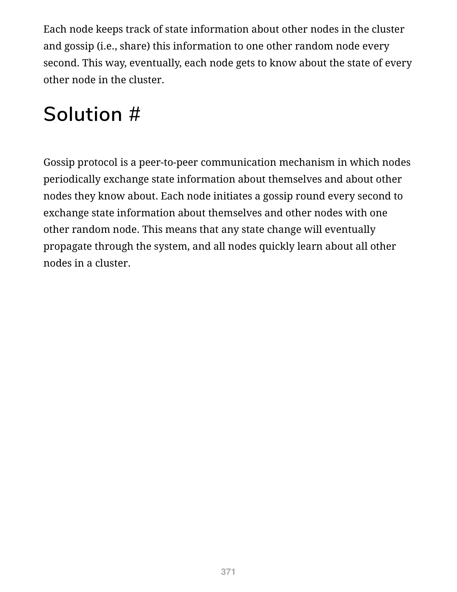

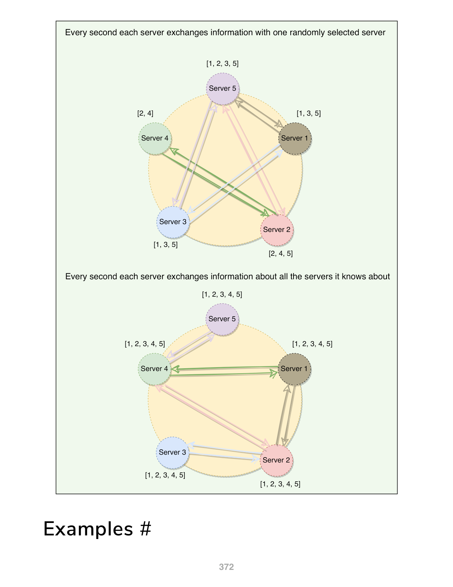

### 示例

- **[[Dynamo]] 和 [[Cassandra]]**：使用 Gossip 协议，每个节点跟踪集群中其他节点的状态信息，如哪些节点可达、它们负责哪些键范围等

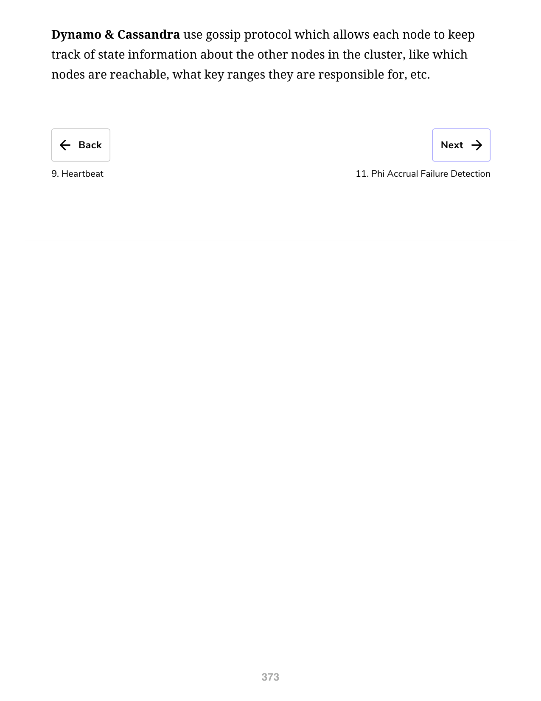

---

## 11. Phi Accrual Failure Detection

### 背景

在分布式系统中，准确检测故障是一个难题。我们无法 100% 确定系统是真的宕机，还是因为负载过重、网络拥塞等原因响应缓慢。

传统故障检测机制（如心跳）输出布尔值告诉我们系统是否存活——没有中间状态。心跳使用固定超时，如果在超时内没有收到心跳，系统假设服务器已崩溃。超时值至关重要：短超时导致快速检测但大量误报；长超时减少误报但检测故障缓慢。

### 定义

使用自适应故障检测算法，即 Phi Accrual Failure Detector。Accrual 意味着随时间的积累。该算法使用历史心跳信息使阈值自适应。它不是告诉服务器是否存活，而是输出关于服务器的**怀疑水平**（suspicion level）。怀疑水平越高，服务器宕机的可能性越大。

### 解决方案

使用 Phi Accrual Failure Detector，如果节点不响应，其怀疑水平增加，稍后可能被宣告死亡。随着怀疑水平增加，系统可以逐渐停止向其发送新请求。Phi Accrual Failure Detector 使分布式系统更高效，因为在宣告系统完全死亡之前，它考虑了网络环境的波动和其他间歇性服务器问题。

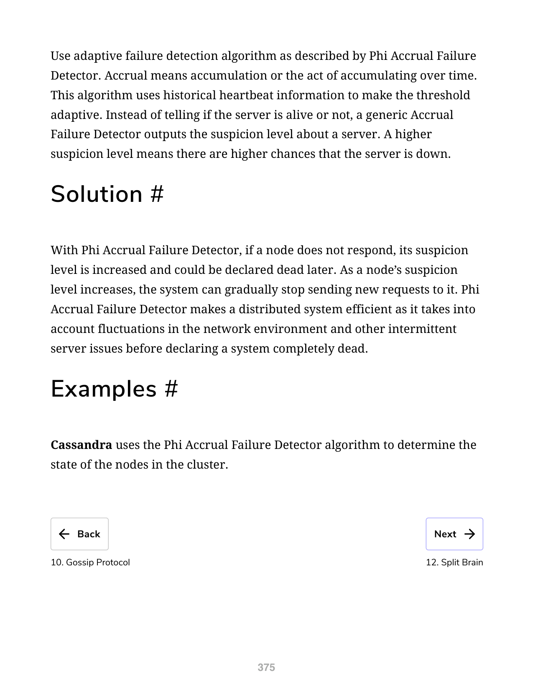

### 示例

- **[[Cassandra]]**：使用 Phi Accrual Failure Detector 算法确定集群中节点的状态

---

## 12. 脑裂

### 背景

在具有中央（或领导）服务器的分布式环境中，如果中央服务器宕机，系统必须快速找到替代者，否则系统可能迅速恶化。

问题在于我们无法真正知道领导者是永久停止还是出现了间歇性故障（如 Stop-the-World GC 暂停或临时网络中断）。尽管如此，集群必须继续前进并选出新领导者。如果原领导者只是间歇性故障，我们现在有了所谓的**僵尸领导者**——之前被系统认定死亡现已恢复的领导者。另一个节点已取代其位置，但僵尸领导者可能还不知道。系统现在有两个活跃的领导者，可能发出冲突的命令。

### 定义

分布式系统中存在两个或多个活跃领导者的常见场景称为**脑裂**（Split-brain）。

脑裂通过**世代时钟**（Generation Clock）解决，这只是一个单调递增的数字，用于表示服务器的"代"。

### 解决方案

每次选举新领导者时，世代号递增。这意味着如果旧领导者有世代号"1"，新领导者将有"2"。世代号包含在从领导者发送到其他节点的每个请求中。这样，节点可以通过简单地信任具有最高编号的领导者来轻松区分真正的领导者。世代号应持久化在磁盘上，以便服务器重启后仍然可用。一种方式是将它与预写日志中的每个条目一起存储。

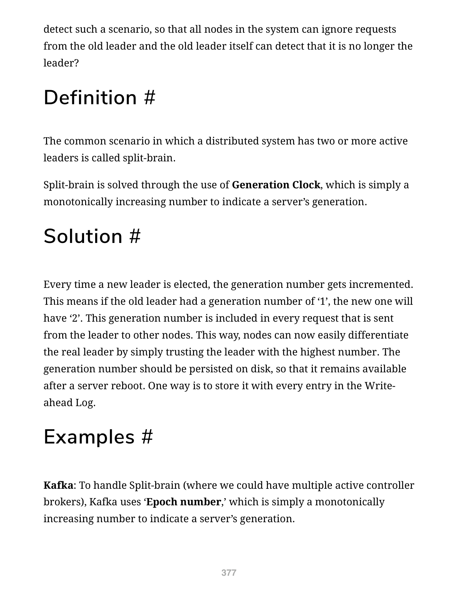

### 示例

- **[[Kafka]]**：处理脑裂（可能存在多个活跃控制器 Broker）时使用**时代号**（Epoch Number），即单调递增的数字
- **[[HDFS]]**：使用 ZooKeeper 确保在任何时间点只有一个 NameNode 处于 Active 状态。每个事务 ID 维护一个时代号以反映 NameNode 的世代
- **[[Cassandra]]**：使用世代号区分节点重启前后的状态。每个节点存储一个世代号，每次重启时递增，包含在节点间交换的 gossip 消息中

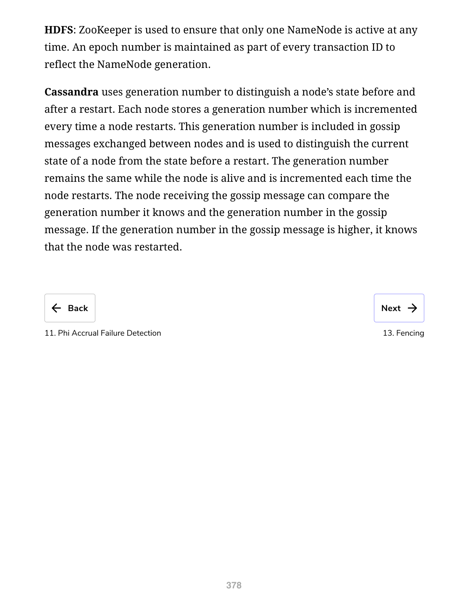

---

## 13. 隔离

### 背景

在领导者-追随者设置中，领导者故障时不可能确定领导者是否已停止工作。例如，慢速网络或网络分区可能触发新领导者选举，即使前一个领导者仍在运行并认为它仍是活跃领导者。在这种情况下，如何确保旧领导者不会运行并发出冲突的命令？

### 定义

在前一个领导者周围设置"围栏"（Fence），防止其造成损害或引起数据损坏。

### 解决方案

隔离是在先前活跃的领导者周围设置围栏，使其无法访问集群资源，从而停止服务任何读/写请求。使用以下两种技术：

1. **资源隔离**（Resource Fencing）：阻止先前活跃的领导者访问执行基本任务所需的资源。例如，撤销其对共享存储目录的访问（通常使用供应商特定的 NFS 命令），或通过远程管理命令禁用其网络端口
2. **节点隔离**（Node Fencing）：阻止先前活跃的领导者访问所有资源。常见的方法是关闭或重置节点。这是非常有效的方法，使其无法访问任何内容。此技术也称为 **STONIT**（Shoot The Other Node In The Head）

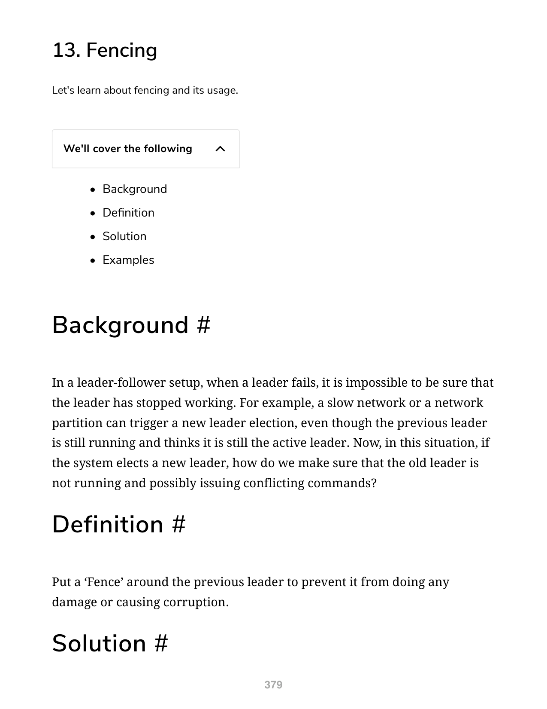

### 示例

- **[[HDFS]]**：使用隔离机制停止先前活跃的 NameNode 访问集群资源，从而阻止其服务请求

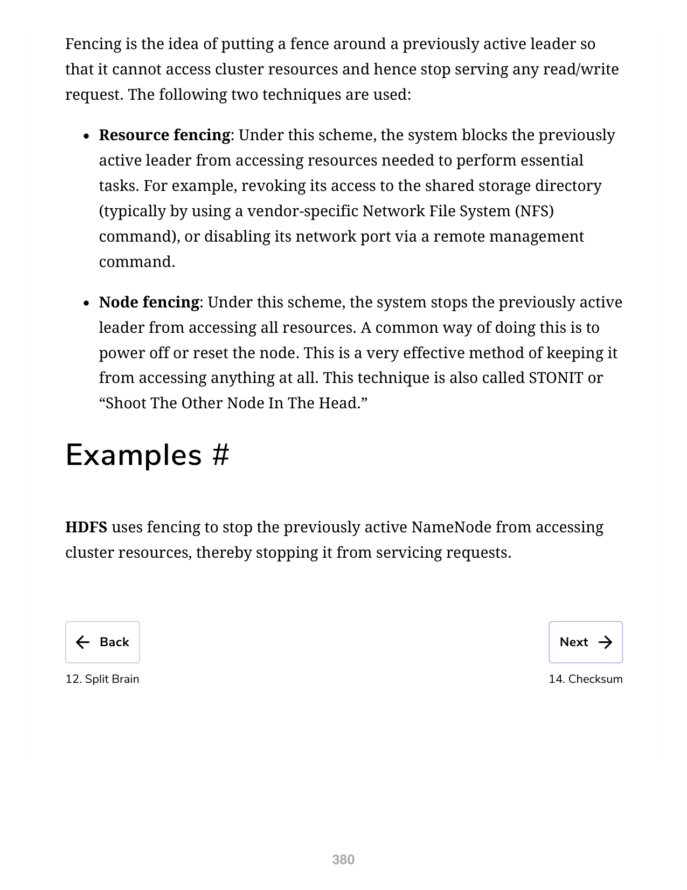

---

## 14. 校验和

### 背景

在分布式系统中，在组件之间移动数据时，从节点获取的数据可能已损坏。这种损坏可能由于存储设备、网络或软件本身的故障而发生。分布式系统如何确保数据完整性，使客户端收到错误而非损坏的数据？

### 定义

计算校验和并将其与数据一起存储。

### 解决方案

系统存储数据时，计算数据的校验和并与数据一起存储。当客户端检索数据时，验证从服务器接收的数据是否与存储的校验和匹配。如果不匹配，客户端可以选择从另一个副本检索数据。

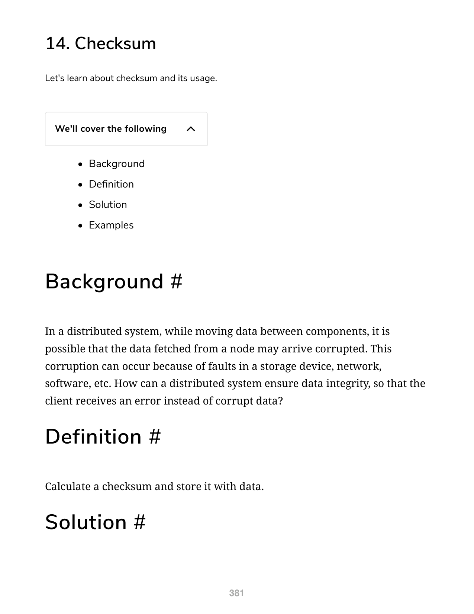

### 示例

- **[[HDFS]]** 和 **[[Chubby]]**：将每个文件的校验和与数据一起存储

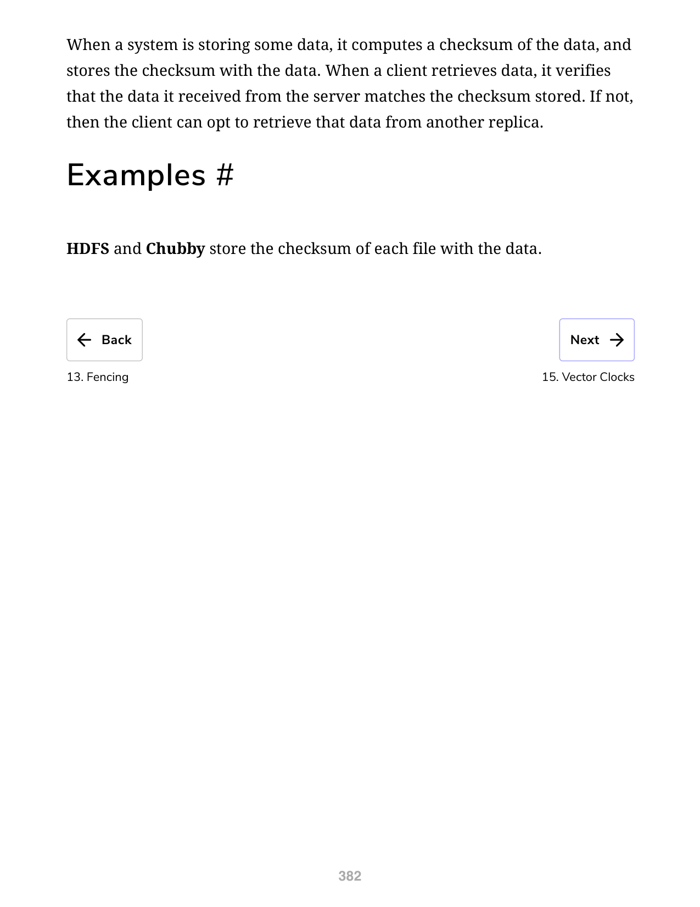

---

## 15. 向量时钟

### 背景

当分布式系统允许并发写入时，可能导致对象的多个版本。同一对象的不同副本可能以不同版本的数据结束。

在单台机器上，我们只需要知道绝对时间或墙上时钟时间：假设在时间 t1 对键 k 执行写入，然后在时间 t2 对 k 执行另一次写入。由于 t2 > t1，第二次写入必须比第一次更新，因此数据库可以安全地覆写原始值。

在分布式系统中，这一假设不成立。问题是**时钟偏差**——不同的时钟以不同速率运行，因此不能假设节点 a 的时间 t 发生在节点 b 的时间 t+1 之前。即使像 NTP 这样帮助同步时钟的实用技术，也不能保证分布式系统中的每个时钟始终同步。

那么，如何在同一对象的不同版本之间协调和捕获因果关系？

### 定义

使用向量时钟跟踪值的历史，并在读取时协调分歧的历史。

### 解决方案

向量时钟本质上是一个（节点，计数器）对。每个对象的每个版本关联一个向量时钟。如果第一个对象的时钟上的计数器小于或等于第二个时钟上的所有节点计数器，则第一个是第二个的祖先，可以被忽略。否则，两个变更被视为冲突，需要协调。

这种冲突在读取时解决。如果系统无法根据向量时钟协调对象状态，则将对象发送给客户端应用程序进行协调——因为客户端对对象有更多语义信息，可能能够协调冲突。解决冲突类似于 Git 的工作方式——如果 Git 可以自动合并不同版本，则自动完成；如果不能，客户端（即开发者）必须手动协调冲突。

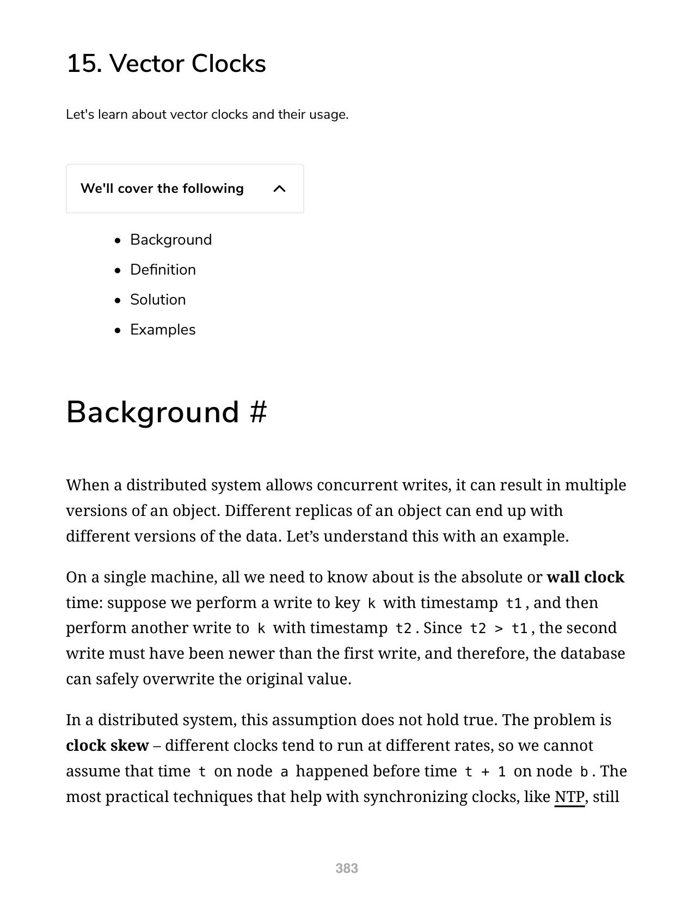

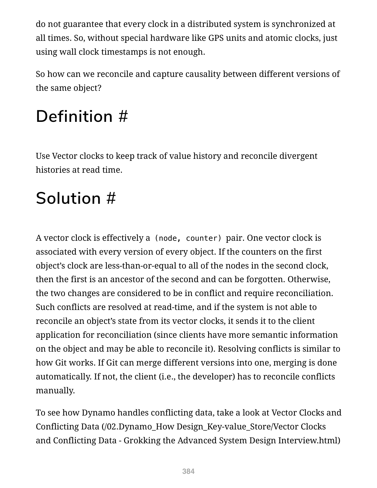

### 示例

- **[[Dynamo]]**：使用向量时钟协调对象的并发更新

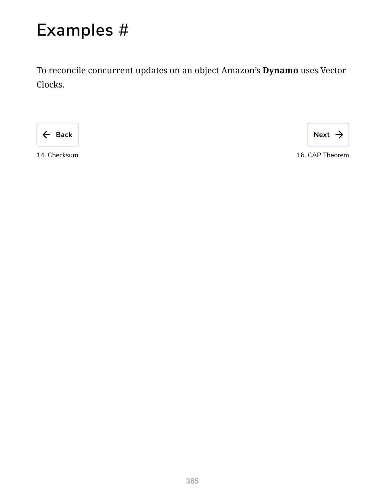

---

## 16. CAP 定理

### 背景

在分布式系统中，可能发生不同类型的故障：服务器可能崩溃或永久故障，磁盘可能损坏导致数据丢失，网络连接可能丢失使部分系统不可访问。分布式系统如何建模以从不同可用资源中获得最大收益？

### 定义

[[CAP 定理]]指出，分布式系统不可能同时提供以下三种属性：

- **一致性（C）**：所有节点在同一时间看到相同的数据。相当于拥有一份最新的数据副本
- **可用性（A）**：系统中非故障节点收到的每个请求必须得到响应。即使发生严重的网络故障，每个请求也必须终止
- **分区容错性（P）**：分区容错系统在部分系统故障或任意消息丢失的情况下继续运行。数据在节点和网络的组合中充分复制以保持系统通过间歇性中断运行

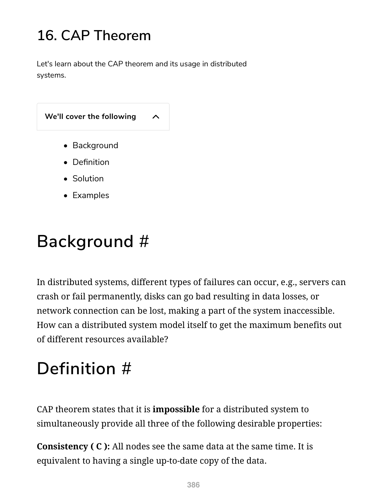

### 解决方案

根据 CAP 定理，任何分布式系统需要从三个属性中选择两个。三种选项是 CA、CP 和 AP。但 CA 不是一个连贯的选项——不支持分区容错的系统在网络分区时被迫放弃一致性或可用性。因此，该定理实际上可以表述为：**在网络分区的情况下，分布式系统必须选择一致性或可用性**。

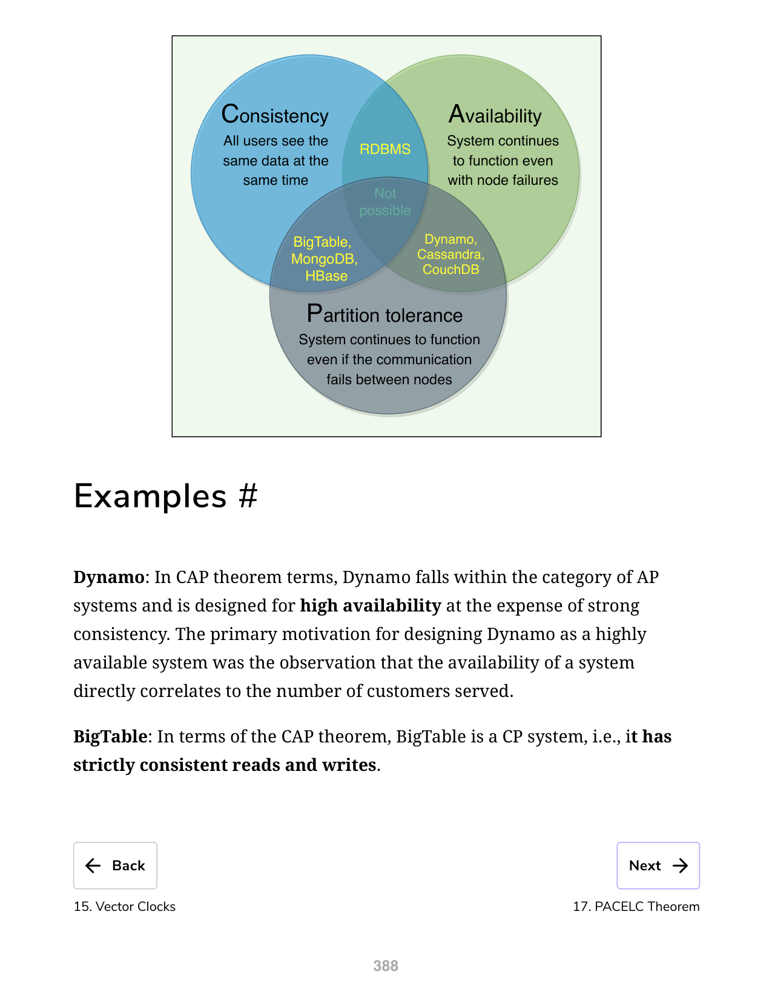

### 示例

- **[[Dynamo]]**：属于 AP 系统，设计为高可用性，以强一致性为代价。设计 Dynamo 为高可用系统的主要动机是系统的可用性与服务的客户数量直接相关
- **[[BigTable]]**：属于 CP 系统，提供严格一致的读写

---

## 17. PACELC 定理

### 背景

我们无法避免分布式系统中的分区，因此根据 CAP 定理，分布式系统应在一致性或可用性之间选择。ACID 数据库选择一致性（如果无法与对等节点检查则拒绝响应），而 BASE 数据库选择可用性（响应本地数据而不确保是对等节点上的最新数据）。

CAP 定理没有说明的是：当没有网络分区时会发生什么？没有分区时，分布式系统有什么选择？

### 定义

[[PACELC 定理]]指出，在复制数据的系统中：

- 如果有分区（**P**），分布式系统可以在可用性和一致性之间权衡（即 **A** 和 **C**）；
- 否则（**E**），当系统在无分区的情况下正常运行时，系统可以在延迟（**L**）和一致性（**C**）之间权衡。

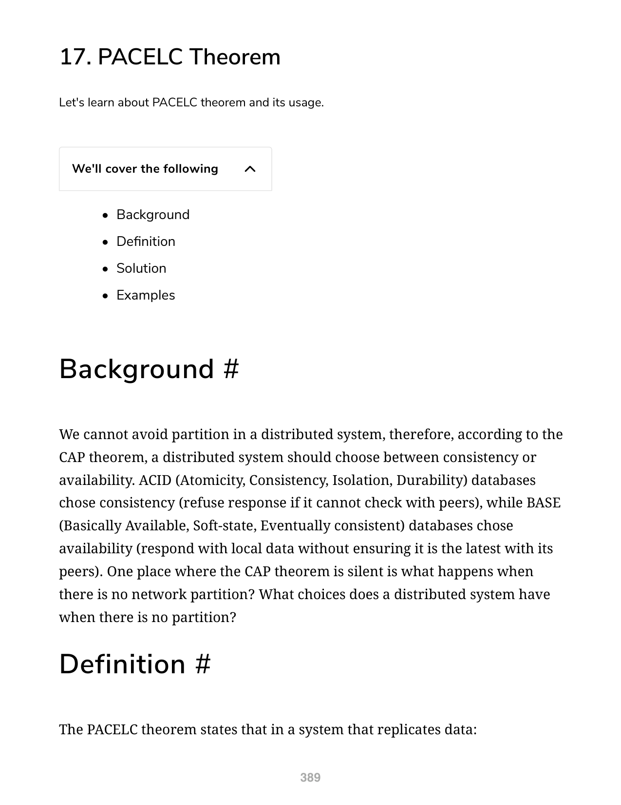

### 解决方案

定理的第一部分（PAC）与 CAP 定理相同，ELC 是扩展。整个论点假设我们通过复制维持高可用性。因此，当有故障时，CAP 定理适用。但如果没有，我们仍需考虑复制系统的一致性和延迟之间的权衡。

### 示例

- **[[Dynamo]] 和 [[Cassandra]]**：PA/EL 系统——分区发生时选择可用性而非一致性；否则选择较低延迟
- **[[BigTable]] 和 [[HBase]]**：PC/EC 系统——始终选择一致性，放弃可用性和低延迟
- **[[MongoDB]]**：PA/EC——网络分区时选择可用性，否则保证一致性

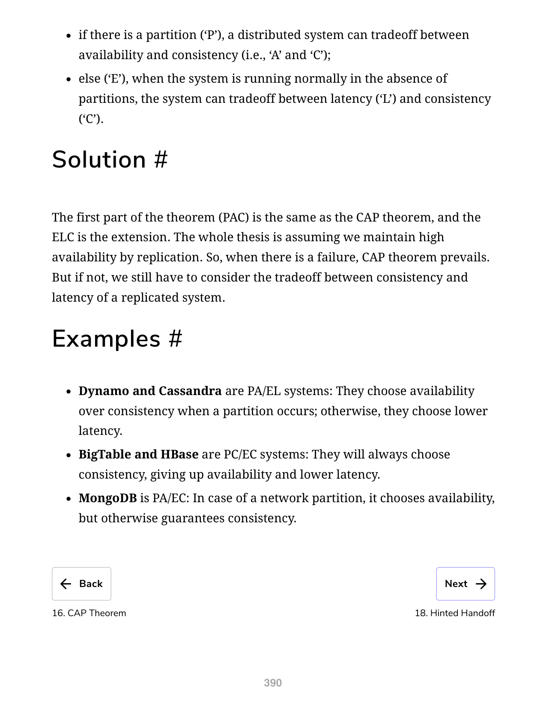

---

## 18. 手写回传

### 背景

根据一致性级别，分布式系统即使在节点宕机时也能继续服务写入请求。例如，复制因子为 3，客户端以仲裁一致性级别写入。如果一个节点宕机，系统仍可在剩余两个节点上写入以满足一致性级别，使写入成功。现在，宕机的节点重新上线后，应如何向它写入数据？

### 定义

对于宕机的节点，系统记录它们错过的所有写入请求的**提示**（hints）。当故障节点恢复后，根据存储的提示将写入请求转发给它们。

### 解决方案

当节点宕机或不响应写入请求时，协调操作的节点在本地磁盘上的一个文本文件中写入提示。该提示包含数据本身以及数据所属节点的信息。当协调节点发现其持有提示的节点已恢复时，将每个提示的写入请求转发给目标节点。

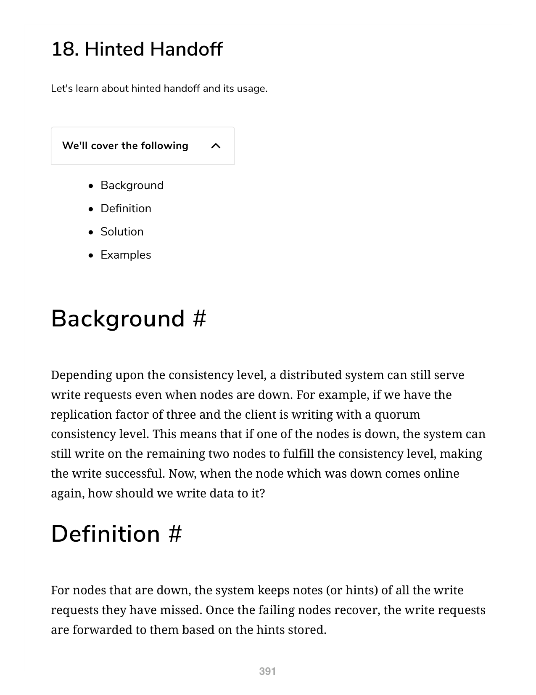

### 示例

- **[[Cassandra]]**：节点使用 Hinted Handoff 记住故障节点的写入操作
- **[[Dynamo]]**：通过使用 Hinted Handoff（和松弛仲裁）确保系统"始终可写"

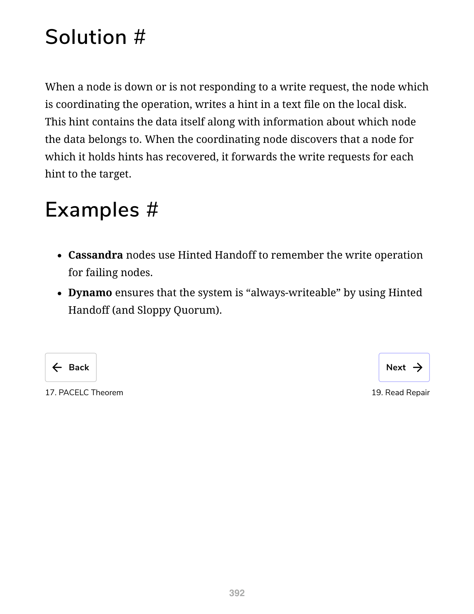

---

## 19. 读修复

### 背景

在数据跨多个节点复制的分布式系统中，某些节点可能拥有过时数据。想象一个节点因宕机或网络分区未能收到写入或更新请求的场景。当节点恢复健康时，如何确保它获取数据的最新版本？

### 定义

在读取操作期间修复过时数据，因为此时可以从多个节点读取数据以进行比较，并找出拥有过时数据的节点。这种机制称为**读修复**（Read Repair）。一旦知道拥有旧数据的节点，读修复操作将较新版本的数据推送到拥有较旧版本的节点。

### 解决方案

基于仲裁，系统从多个节点读取数据。例如，Quorum=2 时，系统从一个节点读取数据，从第二个节点读取数据的摘要。摘要是数据的校验和，用于节省网络带宽。如果摘要不匹配，意味某些副本没有数据的最新版本。此时，系统从所有副本读取数据以找到最新数据。系统将最新数据返回给客户端，并发起读修复请求。读修复操作将最新版本的数据推送到拥有较旧版本的节点。

当读取一致性级别低于"All"时，某些系统以概率方式执行读修复，例如 10% 的请求。在这种情况下，系统在满足一致性级别后立即向客户端发送响应，并在后台异步执行读修复。

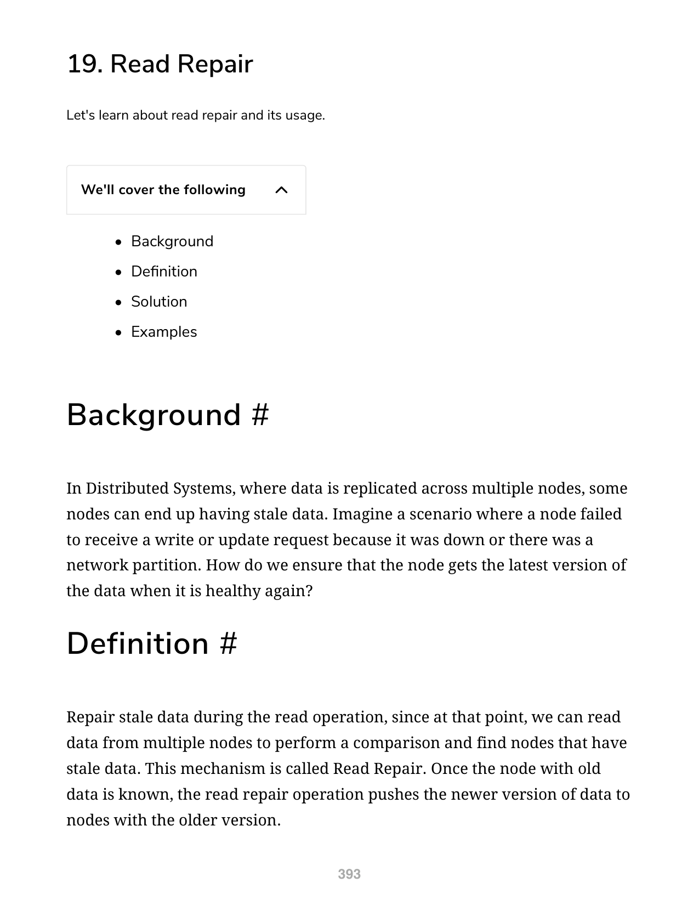

### 示例

- **[[Cassandra]] 和 [[Dynamo]]**：使用读修复将最新版本的数据推送到拥有较旧版本的节点

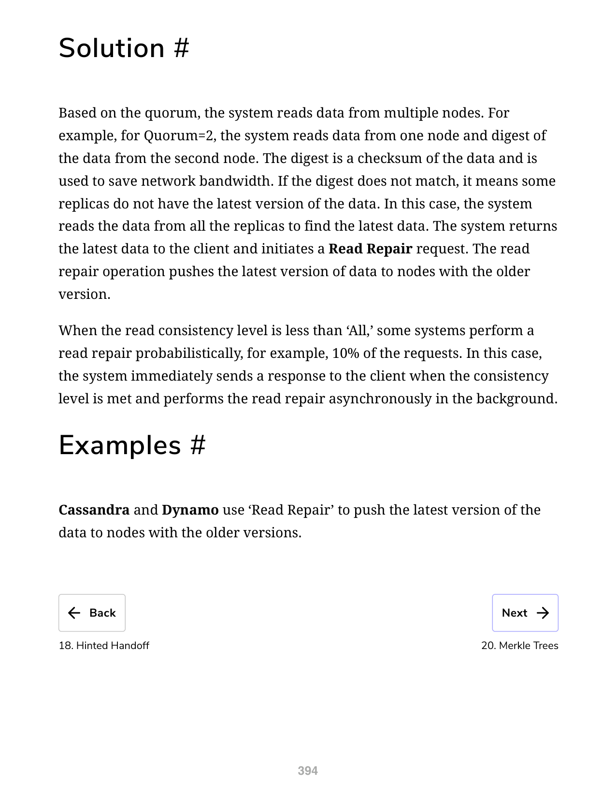

---

## 20. 默克尔树

### 背景

读修复在处理读取请求的同时解决冲突。但如果一个副本显著落后于其他副本，解决冲突可能需要很长时间。能够在后台自动解决一些冲突会很理想。为此，我们需要快速比较一个范围的两份副本，并准确找出哪些部分不同。在分布式环境中，如何快速比较两份数据范围并找出哪些部分不同？

### 定义

使用默克尔树（Merkle Tree）快速比较一个范围的两份副本，并准确找出哪些部分不同。

### 解决方案

默克尔树是一种哈希二叉树，其中每个内部节点是其两个子节点的哈希，每个叶子节点是原始数据一部分的哈希。

比较默克尔树概念上很简单：
1. 比较两棵树的根哈希
2. 如果相等，停止
3. 如果不相等，在左右子节点上递归

最终，副本准确地知道范围的哪些部分不同，但交换的数据量被最小化。默克尔树的主要优势是每个树的分支可以独立检查，无需下载整个树或整个数据集。因此，默克尔树最小化了需要为同步传输的数据量，并减少了磁盘读取次数。

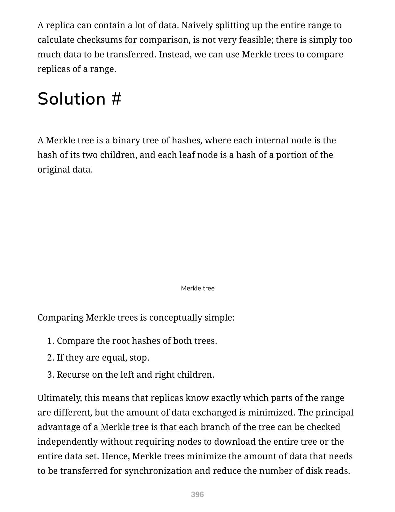

使用默克尔树的缺点是许多键范围在节点加入或离开时会发生变化，此时需要重新计算树。

### 示例

- **[[Dynamo]]**：使用默克尔树进行反熵（anti-entropy）和在后台解决冲突

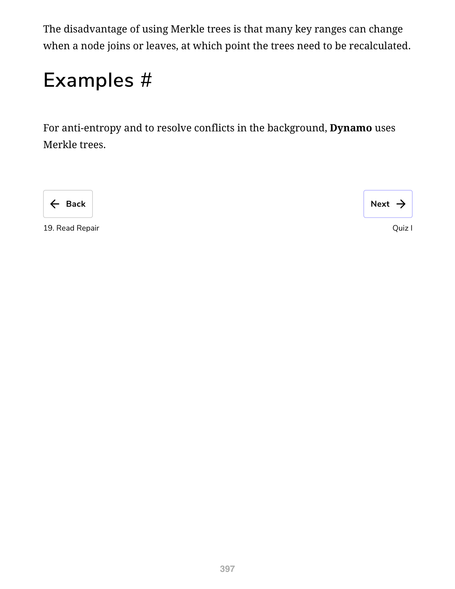

---

## 总结

| 模式 | 核心思想 | 主要应用 |
|------|---------|---------|
| [[布隆过滤器\|Bloom Filters]] | 用位数组和哈希函数判断元素是否可能在集合中 | BigTable、Cassandra 减少磁盘访问 |
| [[一致性哈希\|Consistent Hashing]] | 将数据映射到哈希环，最小化节点变动时的数据移动 | Dynamo、Cassandra 数据分区 |
| [[仲裁\|Quorum]] | R + W > N 确保每次读取至少看到一个最新副本 | Chubby/Paxos、Cassandra 一致性保证 |
| [[领导者与追随者\|Leader and Follower]] | 单领导者负责协调和复制，追随者作为备份 | Kafka、Chubby、GFS 主副本 |
| [[预写日志\|Write-ahead Log]] | 修改前先写入磁盘日志，保证持久性和恢复 | Cassandra、Kafka、Chubby 持久化 |
| [[分段日志\|Segmented Log]] | 单一日志拆分为小段，便于管理和清理 | Cassandra、Kafka 日志管理 |
| [[高水位\|High-Water Mark]] | 跟踪已复制到仲裁追随者的最后日志条目 | Kafka 数据一致性 |
| [[租约\|Lease]] | 有时间限制的锁，到期自动释放 | Chubby 会话管理 |
| [[心跳\|Heartbeat]] | 定期发送存活信号，检测故障 | GFS、HDFS 故障检测 |
| [[Gossip 协议\|Gossip Protocol]] | 节点随机交换状态信息，最终全网一致 | Dynamo、Cassandra 成员管理 |
| Phi Accrual Failure Detection | 自适应故障检测，输出怀疑水平而非布尔值 | Cassandra 故障检测 |
| [[脑裂\|Split-brain]] | 世代时钟（单调递增数字）标识领导者世代 | Kafka、HDFS、Cassandra |
| [[隔离\|Fencing]] | 资源隔离（撤销访问）+ 节点隔离（STONIT） | HDFS NameNode 隔离 |
| [[校验和\|Checksum]] | 计算数据校验和并存储，验证时比对 | HDFS、Chubby 数据完整性 |
| [[向量时钟\|Vector Clocks]] | (节点, 计数器) 对跟踪值历史，读取时协调冲突 | Dynamo 并发写入协调 |
| [[CAP 定理\|CAP Theorem]] | 分布式系统不能同时满足一致性、可用性、分区容错 | Dynamo(AP)、BigTable(CP) |
| [[PACELC 定理\|PACELC Theorem]] | 有分区时 CAP 权衡；无分区时延迟 vs 一致性 | Cassandra(PA/EL)、BigTable(PC/EC) |
| [[手写回传\|Hinted Handoff]] | 为故障节点记录提示，恢复后转发写入 | Dynamo、Cassandra 始终可写 |
| [[读修复\|Read Repair]] | 读取时对比多副本数据，修复过时节点 | Dynamo、Cassandra 最终一致性 |
| [[默克尔树\|Merkle Trees]] | 哈希二叉树快速比较数据范围差异 | Dynamo 反熵和冲突解决 |

### 进一步阅读

- [CAP 定理](https://en.wikipedia.org/wiki/CAP_theorem)
- [PACELC 定理](http://www.cs.umd.edu/~abadi/papers/abadi-pacelc.pdf)
- [布隆过滤器](https://en.wikipedia.org/wiki/Bloom_filter)
- [一致性哈希](https://en.wikipedia.org/wiki/Consistent_hashing)
- [Dynamo 论文](https://www.allthingsdistributed.com/2007/10/amazons_dynamo.html)
- [BigTable 论文](https://research.google/pubs/pub27898/)

---

## 选择题

1. 以下哪个模式通过位数组和多个哈希函数快速判断元素是否可能存在于集合中？
   a. 一致性哈希
   b. 布隆过滤器
   c. 默克尔树
   d. 向量时钟

2. 在 Quorum 模式中，确保每次读取都能看到最新写入值的条件是什么？
   a. R = N
   b. W = N
   c. R + W > N
   d. R * W > N

3. 以下哪个模式用于解决分布式系统中的脑裂问题？
   a. 心跳
   b. 租约
   c. 世代时钟（Generation Clock）
   d. 校验和

4. PACELC 定理相比 CAP 定理增加的内容是什么？
   a. 网络分区时的可用性保证
   b. 无分区时延迟（L）和一致性（C）之间的权衡
   c. 数据复制策略
   d. 故障检测机制

5. 在领导者-追随者模式中，以下哪个不是追随者的职责？
   a. 接受领导者的复制数据
   b. 作为备份等待故障接管
   c. 处理所有客户端的写入请求
   d. 在某些情况下服务读取请求以负载均衡

**答案**
1. b
2. c
3. c
4. b
5. c
