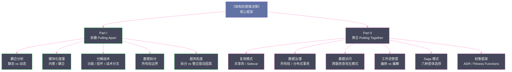

# Software Architecture: The Hard Parts — 专栏导览

> **书籍信息**：*Software Architecture: The Hard Parts — Modern Trade-Off Analyses for Distributed Architectures*
> **作者**：Neal Ford, Mark Richards, Pramod Sadalage, Zhamak Dehghani
> **出版社**：O'Reilly Media, 2021

## 专栏定位

本专栏深度解析《架构的艰难决策》这本书的核心思想。这本书与市面上大多数架构书籍截然不同——它不给你"最佳实践"，而是给你一套**权衡分析框架**。

书名中的 "Hard Parts" 有两层含义：
1. **困难的部分**：分布式系统中那些真正让架构师失眠的决策——服务边界该怎么划？数据该怎么拆？事务该怎么处理？
2. **硬性约束**：在分布式系统中，没有银弹，只有基于上下文的权衡取舍。

本专栏沿袭书中的结构，分为两大部分：**拆散（Pulling Things Apart）** 和 **聚合（Putting Things Back Together）**。

---

## 专栏目录

### Part I — 拆散：如何优雅地分解系统

| 序号 | 文章标题 | 核心问题 | 对应书中章节 |
|------|---------|---------|------------|
| 01 | [架构硬决策框架：当没有最佳实践时我们该怎么办](01%20架构硬决策框架：当没有最佳实践时我们该怎么办.md) | 为什么架构没有最佳实践？ADR 和 Architecture Fitness Functions 如何帮助我们做决策？ | Chapter 1 |
| 02 | [耦合解剖学：静态耦合与动态耦合的权衡模型](02%20耦合解剖学：静态耦合与动态耦合的权衡模型.md) | 耦合的本质是什么？如何区分静态耦合、动态耦合和数据耦合？为什么耦合是架构决策的核心变量？ | Chapter 2 |
| 03 | [架构模块化：从逻辑分层到物理服务边界的演进](03%20架构模块化：从逻辑分层到物理服务边界的演进.md) | 模块化度量有哪些维度？内聚性与耦合性如何量化？单体应用走向微服务的演进路径有哪些模式？ | Chapter 3 |
| 04 | [服务拆分的艺术：战术分叉与基于组件的分解模式](04%20服务拆分的艺术：战术分叉与基于组件的分解模式.md) | 系统分解有哪些具体战术？战术分叉（Tactical Forking）为什么比功能分解更安全？基于组件的分解如何落地？ | Chapter 4-5 |
| 05 | [数据拆分之困：运营数据的分离策略与四大权衡](05%20数据拆分之困：运营数据的分离策略与四大权衡.md) | 数据库拆分时如何处理数据所有权？共享数据库、独立 Schema、独立数据库三种模式各自的代价是什么？ | Chapter 6 |
| 06 | [服务粒度的黄金法则：拆分驱动因素与整合驱动因素](06%20服务粒度的黄金法则：拆分驱动因素与整合驱动因素.md) | 微服务到底应该多大？什么场景下需要拆分？什么场景下过度拆分反而有害？ | Chapter 7 |

### Part II — 聚合：如何在分布式中重建秩序

| 序号 | 文章标题 | 核心问题 | 对应书中章节 |
|------|---------|---------|------------|
| 07 | [代码复用的权衡：从共享库到 Sidecar 的选择困境](07%20代码复用的权衡：从共享库到%20Sidecar%20的选择困境.md) | 跨服务代码复用有哪些模式？共享库、共享服务、Sidecar 模式各自的耦合风险是什么？ | Chapter 8 |
| 08 | [数据所有权与分布式事务：分布式系统的数据治理基础](08%20数据所有权与分布式事务：分布式系统的数据治理基础.md) | 谁拥有数据？数据所有权边界如何划定？为什么分布式事务如此困难？ACID 在分布式环境下的崩塌机制 | Chapter 9 |
| 09 | [分布式数据访问模式：当查询跨越服务边界](09%20分布式数据访问模式：当查询跨越服务边界.md) | 跨服务数据访问有哪五种模式？API 数据聚合、数据复制、缓存同步各自的一致性代价是什么？ | Chapter 10 |
| 10 | [分布式工作流：编排与编舞的架构选择](10%20分布式工作流：编排与编舞的架构选择.md) | 编排（Orchestration）与编舞（Choreography）的本质区别是什么？各自适合什么场景？Saga 模式如何嵌入其中？ | Chapter 11 |
| 11 | [事务性 Saga 模式：分布式事务的六种现代解法](11%20事务性%20Saga%20模式：分布式事务的六种现代解法.md) | Epic Saga、Phone Tag Saga、Fairy Tale Saga 等六种 Saga 变体如何选择？每种模式的通信耦合和一致性取舍是什么？ | Chapter 12 |
| 12 | [如何构建自己的架构权衡分析框架](12%20如何构建自己的架构权衡分析框架.md) | 如何将全书的权衡分析方法论系统化？如何输出 ADR？如何在团队中建立架构决策文化？ | Chapter 15 |

---

## 核心思想导图

---

## 为什么要读这本书？

大多数架构书籍教你**选择**架构风格（微服务、事件驱动、CQRS……），而这本书教你**权衡**——在特定的业务约束和技术约束下，面对一个具体的架构决策，如何系统地分析每个选项的利弊，并做出一个**你能对团队解释清楚的理性决定**。

这本书的核心贡献是：
1. **让隐性的权衡变得显性**：把架构师脑中模糊的"感觉"变成可以讨论的框架
2. **引入可量化的度量**：架构健康度函数（Architecture Fitness Functions）让架构质量可以持续追踪
3. **Saga 模式的完整分类**：首次系统地将 Saga 的六种变体与其耦合特征对应起来

---

*专栏持续更新中……*
