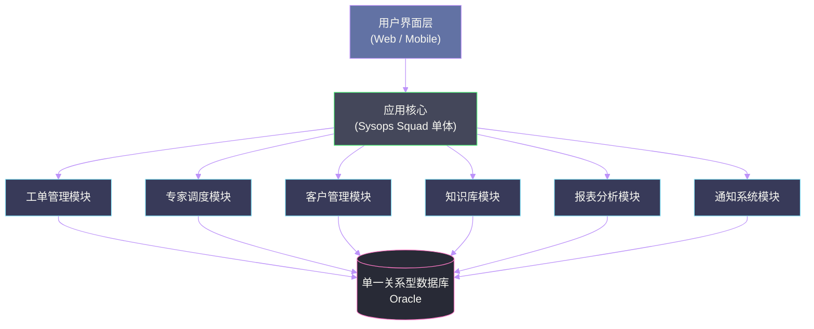
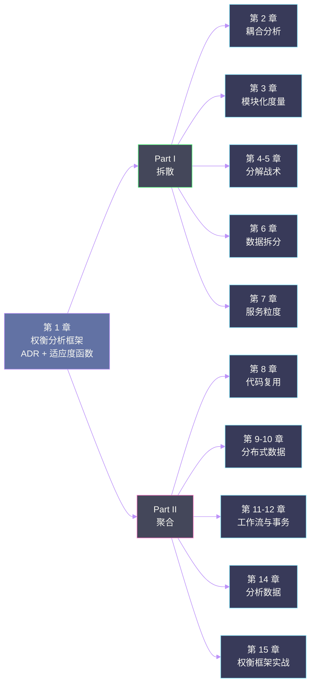

# 01 架构硬决策框架：当没有最佳实践时我们该怎么办

## 摘要

本文是《Software Architecture: The Hard Parts》专栏的第一篇，聚焦于全书最核心的思想基础：**为什么软件架构不存在最佳实践，架构师如何在充满权衡的世界里做出可解释、可追溯的理性决策**。我们将深度剖析书中引入的两个关键工具——架构决策记录（Architecture Decision Records，ADR）与架构适应度函数（Architecture Fitness Functions）——以及贯穿全书的案例 Sysops Squad 的背景。理解这一章，是理解全书其余所有权衡分析的前提。

---

## 第 1 章 "最佳实践"的幻觉

### 1.1 一个让架构师头疼的问题

想象你是一家中等规模互联网公司的首席架构师。公司的核心产品是一个运行了七年的单体应用，每天承载着数百万次交易。随着业务扩张，开发团队从 20 人膨胀到了 200 人，代码库从 30 万行膨胀到了 300 万行。每次发布都需要协调十几个团队，每次线上事故都牵一发而动全身。

这时，技术圈里有一个声音越来越响亮：**迁移到微服务架构**。

你在 InfoQ 上看到了 Netflix、Uber、Amazon 的成功案例，看到了他们如何把庞大的单体拆解成几百个独立部署的小服务，从而实现了团队自治、弹性伸缩、故障隔离。书上、文章里、会议演讲中，微服务似乎就是那个答案——那个能解决你所有烦恼的"最佳实践"。

于是你开始行动。半年后，你把原来的单体拆成了 30 个微服务。然后你发现：

- 原来一个数据库事务就能完成的订单创建，现在需要协调 5 个服务，涉及复杂的分布式事务
- 原来一个 SQL JOIN 就能搞定的报表查询，现在需要跨服务数据聚合，延迟从 50ms 飙升到 800ms
- 原来一次部署，现在变成了 30 次部署，运维复杂度指数级上升
- 开发环境搭建从 30 分钟变成了 4 小时

你问自己：微服务到底是一个正确的决策，还是一个灾难？

《Software Architecture: The Hard Parts》这本书，就是从这样的困境出发的。

### 1.2 为什么架构没有"最佳实践"

"最佳实践"这个词，在软件工程领域被滥用到了令人麻木的程度。它背后隐含着一个假设：**在所有上下文中，存在一个普遍最优的解决方案**。

这个假设在软件架构领域几乎从来不成立。

Neal Ford 在书的开篇就提出了这个核心观点：**软件架构中的每一个决策都是一场权衡（trade-off）**。没有任何一种架构风格在所有维度上都优于其他风格。微服务比单体具备更好的可扩展性，但代价是更高的运维复杂度、更复杂的分布式数据管理、更慢的跨服务查询。事件驱动架构提供了极好的解耦性，但代价是数据的最终一致性、难以调试的异步流程、更高的认知负担。

更关键的是，同样的架构决策，在不同公司、不同团队、不同业务阶段，可能产生截然相反的结果。Netflix 迁移微服务成功了，是因为他们同时具备了：

1. **足够大的规模**：单体的扩展成本已经高于微服务的协调成本
2. **强大的工程能力**：能够自研 Hystrix、Eureka、Zuul 等一系列基础设施
3. **充足的人力资源**：数以百计的 SRE 和基础架构工程师
4. **清晰的业务边界**：内容服务、推荐服务、用户服务之间天然解耦

而一个 30 人的初创公司，如果盲目照搬 Netflix 的架构，很可能在工程基础设施上耗尽所有资源，却没有任何业务价值产出。

> [!note] 设计哲学
> 书中引用了一句话，深刻概括了这一点：
> *"There are no right or wrong answers in architecture — only trade-offs."*
> 架构没有对错，只有权衡。这句话听起来像废话，但真正内化它，需要对"上下文"有极深的敏感度。

### 1.3 架构师的真实处境：决策的压力与孤独

如果架构没有最佳实践，那架构师每天在做什么？

真实情况是，架构师在以下几种压力中艰难地做决策：

**来自业务的压力**：产品经理需要新功能三周内上线，架构师却说需要三个月重构基础架构。谁赢？

**来自团队的压力**：开发团队更熟悉 Java，架构师却调研出 Go 在这个场景下性能更好。换还是不换？

**来自技术趋势的压力**：Kubernetes 已经是容器编排的事实标准，但公司现有系统跑在裸金属机器上，迁移成本巨大。值不值？

**来自历史决策的压力**：五年前的架构师选择了一个如今已被淘汰的消息队列，现在迁移代价巨大。继续用还是推倒重来？

这些决策没有教科书答案。架构师每天面对的，是充满不确定性、利益相互博弈、信息严重不足的复杂局面。

更糟糕的是，大多数架构决策的后果要在 **6 个月到 3 年后** 才会充分显现。当你发现当初的决策是错的时候，已经积累了大量的技术债，推倒重来的成本更高。

这就是《The Hard Parts》想要解决的根本问题：**在不确定性中，如何做出更理性、更可追溯、更能适应未来变化的架构决策**。

---

## 第 2 章 Sysops Squad：贯穿全书的案例

### 2.1 案例背景

为了让书中的权衡分析有具体落地场景，作者虚构了一家名为 **Sysops Squad** 的公司。理解这个案例，是理解书中所有架构决策的基础。

Sysops Squad 是一家 IT 运维服务公司，为企业客户提供现场技术支持服务。当企业客户的硬件（打印机、电脑、服务器）出现故障时，客户可以通过 Sysops Squad 的系统提交工单，系统会把工单分配给最合适的现场技术专家，专家上门解决问题后关闭工单。

公司目前的核心系统是一个**庞大的单体应用**，承载着以下核心功能：

- **工单管理**：工单的创建、分配、更新、关闭全生命周期
- **专家调度**：根据专家技能、地理位置、当前工作量分配工单
- **客户管理**：企业客户的注册、合同、账单管理
- **知识库**：历史工单和解决方案的沉淀
- **报表分析**：运营报表、SLA 达成率、专家绩效分析
- **通知系统**：向客户和专家发送 SMS / Email / App 推送



### 2.2 系统正在腐化的信号

这个系统运行了十年，最近两年开始出现明显的腐化信号：

**部署耦合**：任何模块的修改都需要整个系统重新发布，即使只是改了知识库的一个查询 SQL，也要把工单管理、调度系统一起重新部署，每次发布需要协调 6 个开发团队，发布窗口从原来的每周一次变成了每两周一次。

**数据库成为性能瓶颈**：所有模块共享同一个 Oracle 数据库，报表分析的复杂 SQL 查询会把 OLTP 操作的响应时间从 50ms 拖慢到 500ms。

**技术栈的枷锁**：系统用 Java 8 + Spring 3 + Oracle 11g 构建，要引入任何新技术（比如用 Elasticsearch 优化知识库全文搜索）都需要在这个单体框架内硬塞，改动风险极高。

**团队扩张的摩擦**：随着业务增长，开发团队从 15 人扩展到了 80 人。每个人都需要理解整个代码库才能做修改，代码冲突、知识孤岛、职责不清的问题越来越严重。

这个案例的妙处在于，它的问题足够典型，但又不是一个"答案显而易见"的案例——它需要架构师在几十个维度上做出真实的权衡。书中后续每一章的架构讨论，都会回到 Sysops Squad 来演示具体的决策过程。

### 2.3 为什么虚构案例比真实案例更有教学价值

书中用 Sysops Squad 而不是某个真实公司的案例，是有意为之的。真实的案例往往受制于信息保密、叙述不完整、上下文复杂等问题，读者很难从中提取清晰的决策逻辑。而虚构案例可以被精确地控制变量：在讨论服务粒度时，把所有关于数据拆分的复杂性暂时屏蔽；在讨论数据拆分时，把工作流复杂性暂时固定。这种"控制变量"的教学方式，让每一个架构决策的因果关系都更加清晰可见。

---

## 第 3 章 架构决策记录（ADR）

### 3.1 一个最常见的架构失忆症状

你加入了一个已经运行三年的系统，看到代码里有一段非常奇怪的逻辑——所有用户数据在写入数据库之前都要经过一个复杂的加密转换，但加密密钥却硬编码在代码里。这明显违反了安全最佳实践，为什么没人改？

你去问原来的开发者，得到的答案通常是以下几种：

- "我也不知道，我来之前就这样了"
- "好像当时有什么安全审计的要求，但我不清楚细节"
- "改过一次，但是出了 bug 回滚了，然后就再也没人动了"
- "那个写这段代码的人已经离职了"

这是一种极其普遍的现象，可以叫做**架构失忆**（Architectural Amnesia）：随着时间推移和人员流动，架构决策背后的推理过程彻底丢失，只留下决策结果的代码。

这个问题的危害不亚于技术债本身。当你不知道一个设计决策为什么存在时，你就无法判断：
- 它是一个深思熟虑的合理设计，还是当时时间压力下的妥协？
- 改动它是否安全？它背后是否有已知的边界条件？
- 当外部环境改变时（如安全政策更新），这个决策是否仍然适用？

**架构决策记录（ADR，Architecture Decision Record）**，就是为了解决这个失忆问题而生的。

### 3.2 ADR 是什么：本质是一种知识管理工具

ADR 的本质，是用一个结构化的文档，把每一个重要架构决策的**上下文、推理过程、考量过的备选方案、最终选择及其后果**，原原本本地记录下来，随代码一起存储在版本控制系统中。

> [!info] 核心概念
> **ADR（Architecture Decision Record）**：一个简短的文档，捕获一个重要的、有后果的架构决策及其原因。ADR 不是设计文档，不是 API 文档，也不是项目计划书——它是"我们为什么这样做"的备忘录。

ADR 的概念最早由 Michael Nygard 在 2011 年的博客文章中提出，后来被 ThoughtWorks 技术雷达纳入"采用"级别，逐渐成为工程团队的最佳实践。

关键点在于：**ADR 不是一个重量级的流程，而是一个极轻量的文档习惯**。一份 ADR 通常只有一页纸左右，不需要反复审批，不需要专门的工具，一个 Markdown 文件加上 Git 提交就足够了。

### 3.3 ADR 的标准结构与写法

一份 ADR 通常包含以下几个核心部分：

**1. 标题**

用一句话清晰描述决策内容，格式通常是：`[编号]. [动词] + [名词]`，例如：
- `ADR-001. 使用 PostgreSQL 作为主数据存储`
- `ADR-015. 采用 Saga 模式处理跨服务事务`
- `ADR-023. 将通知系统从主系统中拆离为独立服务`

**2. 状态（Status）**

ADR 的生命周期状态，常见取值包括：
- `Proposed`：已提出，等待讨论
- `Accepted`：已接受，正在执行或已执行
- `Deprecated`：曾经有效，但已被更新的决策取代
- `Superseded by ADR-XXX`：被另一个 ADR 取代

**3. 上下文（Context）**

描述**为什么这个问题存在**，以及做出这个决策时的外部约束条件。注意：上下文描述的是事实状态，不包含个人判断和倾向。

例如，对于"采用 Saga 模式"这个决策，上下文可以是：
> "系统正在从单体拆分为微服务。订单创建流程需要同时操作库存服务、支付服务、物流服务的数据。这三个服务拥有各自独立的数据库，无法使用传统的两阶段提交（2PC）因为它引入了过高的同步耦合和锁等待风险。"

**4. 决策（Decision）**

清晰陈述**做了什么决定**，以及**为什么选择这个方案而不是其他方案**。这是 ADR 最核心的部分，必须把推理链写清楚。

**5. 后果（Consequences）**

诚实列出这个决策带来的**所有后果**，包括正面的和负面的。这是很多团队最容易忽略的部分——人们倾向于只写好处，把坏处藏起来。但 ADR 的价值恰恰在于让未来的人看到完整的画面。

下面是一份针对 Sysops Squad 的 ADR 示例：

---

```
# ADR-001. 将通知系统从 Sysops Squad 单体中拆离为独立服务

## 状态
Accepted

## 上下文
当前 Sysops Squad 系统的通知功能（SMS/Email/App 推送）与工单管理、调度逻辑紧密耦合。
第三方通知服务商（Twilio、SendGrid）的 API 变更或服务降级，多次造成工单处理主流程
阻塞。通知发送的量级（日均 50 万次）远超工单处理量（日均 2 万次），两者的扩展需求
差异显著。通知系统的代码占整个代码库的 15%，但贡献了约 40% 的故障。

## 决策
将通知系统拆离为独立的微服务（Notification Service），通过异步消息队列（Kafka）
与主系统通信，而非直接 HTTP 调用。

考量过的备选方案：
- 方案 A：保持单体，但在通知调用处加入熔断器（Circuit Breaker）。
  否决原因：熔断器只能缓解故障扩散，无法解决扩展性差异和发布耦合问题。
- 方案 B：拆离为独立服务，但保留同步 HTTP 通信。
  否决原因：通知本身是一个最终一致性操作，没有必要同步等待。同步调用会引入
  通知服务的可用性依赖，反而降低了主系统的健壮性。

## 后果
正面：
- 通知系统可以独立扩展和部署
- 第三方服务商的故障不再影响主流程
- 通知系统可以独立迭代，无需主系统配合发布

负面：
- 引入了消息队列的运维复杂度
- 通知从同步变为异步，需要更新 UI 的实时反馈逻辑
- 消息重复投递的幂等性需要额外设计
- 本地开发环境需要额外启动 Kafka
```

---

这份 ADR 示例展示了一个好的 ADR 的几个关键特征：**上下文足够具体**（不是泛泛说"耦合太高"，而是给出了具体的数据——日均 50 万次通知、15% 代码占比、40% 故障贡献）；**否决原因足够诚实**（列出了考量过的备选方案及其被否决的理由）；**后果足够完整**（列出了真实的负面代价，不回避）。

### 3.4 ADR 的工程价值：三个层次

**第一层：消除架构失忆**

最直接的价值。新工程师加入团队，翻看 ADR 目录，15 分钟内就能了解系统中所有重大决策的来龙去脉，而不需要挨个找老员工口口相传。

**第二层：提升决策质量**

当你知道自己要写 ADR 时，你在做决策时会更认真地思考。"这个方案的后果是什么？我能把它写清楚吗？"这个追问本身，就会逼迫你更深入地分析备选方案，而不是基于习惯或直觉做决定。

书中有一个精妙的观察：**一个你能写清楚 ADR 的决策，才是一个真正想清楚了的决策**。如果你发现自己无法清晰地写出上下文和后果，那很可能意味着你还没有真正理解这个问题。

**第三层：支持架构演化**

ADR 的状态机制（Proposed → Accepted → Deprecated / Superseded）让架构决策有了生命周期管理。当外部条件变化时（比如原来用 MongoDB 是因为数据结构不确定，三年后数据结构已经稳定），你可以把原来的 ADR 标记为 Deprecated，并创建一个新的 ADR 说明为什么要迁移到 PostgreSQL，而不是让这段历史无声消逝。

> [!warning] 生产避坑
> ADR 最常见的失败模式是"有流程、没习惯"：团队定义了 ADR 模板，但只在大型项目启动时写，日常迭代中忽略。结果是 ADR 目录里全是三年前的文档，根本不能反映系统现状。
>
> 解决方案：把 ADR 写作融入 PR Review 流程——任何引入新外部依赖、改变服务通信方式、影响数据模型的 PR，都需要附带一份 ADR。这样 ADR 的更新频率就和代码变更保持同步。

---

## 第 4 章 架构适应度函数

### 4.1 问题的起源：架构质量如何客观衡量

如果说 ADR 解决的是"记住为什么这样做"的问题，那么**架构适应度函数（Architecture Fitness Functions）**解决的是一个更难的问题：**如何客观地判断一个系统是否仍然满足其架构预期？**

这个问题之所以难，是因为软件系统有一种内在的熵增倾向。随着时间推移和需求变化，系统的实际状态会不可避免地偏离架构预期。这种偏离通常是渐进的、局部的、不显眼的——没有任何单一的代码改动让系统"突然"变成了一个糟糕的架构，而是无数个小的妥协和捷径积累，最终让系统面目全非。

常见的例子包括：

- 架构上规定"服务 A 不允许直接访问服务 B 的数据库"，但在某个紧急 bug 修复时，一个工程师图省事直接查了数据库，这个违规调用从未被清理
- 架构上规定"所有外部 API 调用必须有超时设置"，但随着代码库增长，有 30% 的调用点从未设置过超时
- 架构上规定"模块间只能通过定义好的接口通信，不允许直接导入对方的内部 package"，但随着开发者的更替，这个规则只存在于口头约定中，没有任何机制强制执行

这些问题有一个共同特征：**它们用肉眼 Code Review 根本发现不了**，它们需要系统级的、持续的、自动化的检测。

### 4.2 适应度函数是什么：借鉴进化算法的思想

"适应度函数"这个术语来自进化算法（Evolutionary Algorithm）。在进化算法中，适应度函数是一个评估函数，用来衡量某一个解决方案对目标问题的"适应程度"——适应度越高的个体，越有可能被选择和繁殖。

Neal Ford 等人把这个概念引入软件架构，用来描述：**一个衡量架构特定质量属性的、可执行的、自动化的评估机制**。

> [!info] 核心概念
> **架构适应度函数**：任何能够对某个架构特征进行客观、可重复评估的机制，包括但不限于：单元测试、集成测试、静态分析工具、监控指标、混沌工程等。其核心价值在于**把架构预期从口头约定变成可执行的代码**。

这个定义的关键词有两个：**客观** 和 **可执行**。

"客观"意味着评估结果是确定性的，不依赖于人的主观判断——就像单元测试一样，要么通过，要么失败。

"可执行"意味着这个评估必须能够在 CI/CD 流水线中自动运行，而不是靠人工定期审查。

### 4.3 适应度函数的分类：四个维度

书中从四个维度对适应度函数进行了分类：

**维度一：原子性 vs. 整体性**

- **原子适应度函数（Atomic Fitness Function）**：针对单个架构特征进行评估，独立运行，不依赖其他系统组件。例如：一个 ArchUnit 测试，检查"包 `com.sysops.order` 中的类不允许导入 `com.sysops.billing` 中的内部类"。

- **整体适应度函数（Holistic Fitness Function）**：评估多个架构特征的组合行为，通常需要在真实或接近真实的环境中运行。例如：一个端到端的性能测试，验证"在 1000 并发用户下，工单创建 API 的 P99 延迟不超过 200ms"。

整体适应度函数的价值在于，它能捕捉到单个指标无法反映的**涌现行为**——系统在各个局部都健康，但组合起来却出现了意想不到的问题。

**维度二：触发方式**

- **持续型（Continual）**：每次代码提交时自动触发，运行时间必须足够短（通常在 5 分钟内）。适合快速静态检查、轻量级单元测试层面的架构验证。

- **定时型（Triggered）**：按计划定期运行（每日/每周），可以运行时间更长、更深度的分析。适合全量的依赖分析、安全扫描、复杂的合规性检查。

**维度三：范围**

- **系统级**：跨越整个系统的质量属性评估，如全局的循环依赖检测、系统总体的可观测性覆盖率
- **服务级**：单个服务内部的质量属性，如某个服务的 API 响应时间 SLA、某个服务的测试覆盖率
- **组件级**：更细粒度的模块/包级别检查

**维度四：自动化程度**

- **全自动化**：无需人工介入，在 CI/CD 流水线中完全自动运行，失败时阻断部署
- **半自动化**：工具辅助生成报告，但最终判断需要人工审核（适用于复杂的架构合规性评估）
- **手动**：定期的架构审查会议，利用工具生成的数据辅助讨论（适用于战略层面的架构健康度评估）

| 维度 | 分类 A | 分类 B | 应用场景 |
|------|--------|--------|---------|
| 原子性 | 原子（单特征） | 整体（多特征组合） | 单项合规 vs. 系统涌现行为 |
| 触发 | 持续（每次提交） | 定时（每日/每周） | 快速反馈 vs. 深度分析 |
| 范围 | 系统级 | 服务/组件级 | 全局约束 vs. 局部 SLA |
| 自动化 | 全自动（阻断部署） | 手动（辅助决策） | 强制红线 vs. 观测指标 |

### 4.4 工程实践：如何在项目中落地适应度函数

**实践一：用 ArchUnit 守护架构层级约束**

[[ArchUnit]] 是 Java 生态中最成熟的架构测试框架，它允许你用单元测试的方式编写架构规则。以 Sysops Squad 的案例为例：

```java
// 用 ArchUnit 测试保证服务间不直接访问对方数据库层
@AnalyzeClasses(packages = "com.sysops")
public class ServiceIsolationTest {

    // 规则：工单服务不允许直接导入调度服务的 repository 层
    @ArchTest
    static final ArchRule ticketingMustNotAccessSchedulingRepository =
        noClasses()
            .that().resideInAPackage("com.sysops.ticketing..")
            .should().accessClassesThat()
            .resideInAPackage("com.sysops.scheduling.repository..");

    // 规则：所有对外部系统的调用必须经过 gateway 层，不允许直接调用
    @ArchTest
    static final ArchRule externalCallsMustGoThroughGateway =
        noClasses()
            .that().resideInAPackage("com.sysops..")
            .and().doNotResideInAPackage("com.sysops..gateway..")
            .should().accessClassesThat()
            .resideInAPackage("com.sysops..external..");
}
```

这段测试代码会在每次 CI 构建时自动运行。一旦有人违反了服务隔离原则，流水线立刻失败，违规行为在合并到主干之前就被拦截。

> [!warning] 生产避坑
> ArchUnit 测试的维护成本容易被低估。随着业务演化，有些架构约束需要放宽（比如为了紧急修复临时允许某个特例），有些需要新增。如果没有专人负责维护 ArchUnit 测试，它们很容易因为误报被工程师加入白名单而失去意义。建议指定架构委员会（Architecture Guild）负责所有 ArchUnit 测试的 Owner。

**实践二：用 SLO 追踪保证运行时架构质量**

并非所有架构质量属性都能在编译期检测，许多属性只在运行时才能评估。例如：

- 服务的可用性（Availability）
- API 的 P99 延迟（Latency）
- 服务间的超时配置覆盖率
- 告警覆盖率（每个核心链路是否都有相应的监控告警）

对于这类运行时属性，适应度函数的实现方式是：将它们定义为 **SLO（Service Level Objective）**，通过 [[Prometheus]] + [[Grafana]] 等监控系统持续追踪，并设置错误预算告警。当某个服务的 P99 延迟连续 15 分钟超过阈值，自动触发告警并在 PR Review checklist 中添加性能分析要求。

**实践三：用依赖分析工具追踪耦合演化**

对于正在进行拆分的系统（如 Sysops Squad 的单体迁移），可以用工具定期分析模块间的依赖关系，追踪耦合度的演化趋势。

工具选择：
- Java 生态：JDepend、Structure101
- Python 生态：pydeps
- 通用：SonarQube 的依赖分析模块

核心指标：
- **Afferent Coupling（Ca）**：某个模块被其他模块依赖的数量（被依赖越多，修改风险越高）
- **Efferent Coupling（Ce）**：某个模块依赖其他模块的数量（依赖越多，脆弱性越高）
- **Instability（I）**：`Ce / (Ca + Ce)`，值越接近 1 说明越不稳定

定期生成这些指标的趋势报告，可以让团队直观看到架构的耦合是在收敛还是在发散，从而做出及时的干预。

---

## 第 5 章 权衡分析框架：全书的方法论脊梁

### 5.1 从"有没有最佳实践"到"如何分析权衡"

前面四章建立了两个基础工具：ADR 记录决策，适应度函数验证约束。但这两个工具都是手段，不是目的。真正的核心问题还没有解决：**面对一个具体的架构决策，如何系统地分析利弊？**

书中给出的答案，是一个贯穿全书的**权衡分析方法论**。它不是一个固定的公式，而是一套思考框架，帮助架构师：
1. 识别所有相关的架构特征（Quality Attributes）
2. 分析每个备选方案在各个特征上的表现
3. 基于当前上下文，做出可解释的取舍

### 5.2 架构特征：决策的评估维度

**架构特征（Architectural Characteristics）**，也叫"非功能性需求"或"质量属性"，是衡量架构好坏的评估维度。

> [!info] 核心概念
> **架构特征**不描述系统"做什么"（功能），而描述系统"做得怎么样"。常见的架构特征包括：
> - **可扩展性（Scalability）**：应对负载增长的能力
> - **弹性（Elasticity）**：快速扩缩容的能力
> - **可用性（Availability）**：系统在预期时间内正常运行的比例
> - **可维护性（Maintainability）**：修改、理解和测试系统的容易程度
> - **可观测性（Observability）**：理解系统内部状态的能力
> - **安全性（Security）**：抵御攻击和保护数据的能力
> - **性能（Performance）**：系统在给定负载下的响应时间
> - **数据一致性（Data Consistency）**：分布式环境下数据正确性的保证程度
> - **工作流（Workflow）**：系统支持复杂业务流程的能力

书中特别指出，架构特征之间存在**内在的张力**，你不可能同时优化所有维度：

- **可扩展性 vs. 数据一致性**：越追求水平扩展，越难保证强一致性（[[CAP 定理]]）
- **可维护性 vs. 性能**：最易维护的代码往往不是最高性能的代码
- **安全性 vs. 可用性**：越严格的安全控制，越容易降低系统可用性
- **可复用性 vs. 可测试性**：高度共享的代码库降低重复，但增加了测试隔离的难度

### 5.3 权衡分析的实操：决策矩阵

权衡分析最直接的工具是**决策矩阵（Decision Matrix）**：列出所有备选方案，行出所有关键架构特征，在每个格子里评估该方案对该特征的影响（正面/负面/中性，或者 1-5 分），最终综合评分辅助决策。

以 Sysops Squad 的通知系统拆分决策为例：

| 架构特征 | 保持单体<br/>(加熔断器) | 拆离服务<br/>(同步 HTTP) | 拆离服务<br/>(异步消息) |
|---------|---------------------|----------------------|---------------------|
| 可用性 | ⭐⭐（通知故障仍影响主流程）| ⭐⭐⭐（主服务降级，通知丢失）| ⭐⭐⭐⭐⭐（完全隔离）|
| 可扩展性 | ⭐⭐（与主系统耦合扩展）| ⭐⭐⭐⭐（独立扩展）| ⭐⭐⭐⭐⭐（独立扩展+背压）|
| 数据一致性 | ⭐⭐⭐⭐⭐（同步操作保证）| ⭐⭐⭐⭐（同步等待结果）| ⭐⭐⭐（最终一致性）|
| 可维护性 | ⭐⭐⭐（减少部署耦合有限）| ⭐⭐⭐⭐（独立代码库）| ⭐⭐⭐⭐（独立代码库）|
| 运维复杂度 | ⭐⭐⭐⭐（无需额外组件）| ⭐⭐⭐（需要维护服务注册）| ⭐⭐（需要额外维护 Kafka）|
| 开发体验 | ⭐⭐⭐⭐（本地开发简单）| ⭐⭐⭐（需启动两个服务）| ⭐⭐（需启动两个服务+Kafka）|

从这个矩阵中可以清楚地看到：
- 如果最看重**可用性和可扩展性**，选异步消息方案
- 如果最看重**运维简单和开发体验**，选保持单体加熔断器
- 如果想要**平衡方案**，选同步 HTTP 的独立服务

决策矩阵的价值不在于产生一个"正确答案"，而在于**让权衡可见**，让所有参与者都能看到每个方案的代价，从而基于共同的理解做出选择。

> [!note] 设计哲学
> 决策矩阵有一个重要的哲学前提：**评分标准必须在决策之前确定**，而不是在评分之后调整。如果先有了倾向性的结论，再反推权重，决策矩阵就变成了"结论正当化工具"，失去了客观分析的价值。

### 5.4 MECE 原则在架构权衡中的应用

面对复杂的架构决策，分析框架很容易陷入两个极端：**要么太宽泛**（只分析几个显而易见的维度，遗漏了关键约束），**要么太细碎**（把每一个细节都列出来，却看不到全局）。

麦肯锡的 **MECE 原则**（Mutually Exclusive, Collectively Exhaustive，相互独立，完全穷尽）在这里非常有用：

- **相互独立**：分析的维度之间不应该大量重叠。例如"性能"和"延迟"高度重叠，合并为一个维度更清晰
- **完全穷尽**：所有对决策有实质影响的维度都应该被考虑到，遗漏一个关键维度可能导致决策失误

在 Sysops Squad 案例中，如果遗漏了"本地开发体验"这个维度，可能会过于激进地选择了分布式方案，导致开发效率下降、团队抵触情绪强烈，最终让架构演化难以为继。

---

## 第 6 章 本章总结与全书地图

### 6.1 三个核心认知的内化

读完本章，有三个认知需要深度内化，它们是理解全书其余所有内容的前提：

**认知一：架构权衡是第一性原理**

不要再寻找"最佳实践"了。每一个架构决策都是在特定上下文中的权衡。你的工作不是找到答案，而是**清晰地分析问题**。

**认知二：隐性决策的危害超过错误决策**

一个经过深思熟虑但事后被证明错误的决策，远比一个从未被明确做出的"隐性决策"危害小。因为前者是可追溯的、可反思的，而后者留下的只是一堆无法解释的代码。ADR 就是把隐性变成显性的工具。

**认知三：架构约束需要代码来守护**

口头约定的架构规则会随着时间腐化。只有把架构预期写成可执行的代码（适应度函数），才能在系统演化过程中持续保证架构质量。

### 6.2 全书内容地图

理解了上述三个认知，我们就可以看到全书的逻辑脉络：

书的第一部分（第 2-7 章）关注**拆散**——如何把一个单体系统分解为分布式服务：
- 第 2 章分析耦合的本质（需要理解才能有效拆解）
- 第 3 章介绍模块化度量（需要量化才能知道拆到什么程度）
- 第 4-5 章给出具体的分解战术（战术分叉、基于组件的分解）
- 第 6 章讨论数据拆分（往往是拆分中最难的部分）
- 第 7 章确定服务粒度（拆多细才合适）

书的第二部分（第 8-15 章）关注**聚合**——分散的服务如何协同工作：
- 第 8 章讨论代码复用
- 第 9-10 章处理分布式数据
- 第 11-12 章解决分布式工作流和事务
- 第 13 章管理服务契约
- 第 14 章处理分析数据
- 第 15 章给出完整的权衡分析框架



### 6.3 给读者的提示

全书的所有讨论都基于一个关键假设：**你正在处理一个真实的业务系统，受到真实的约束**——团队规模、技术债务、预算、时间压力。书中给出的任何分析框架，都需要你在自己的上下文中重新校准。

不要把书中 Sysops Squad 案例的结论直接套用到你的系统上。更有价值的做法是把书中的**分析过程**内化，然后用它来分析你自己系统的权衡。

这也正是书名 "The Hard Parts" 的精髓所在——这本书不会让架构变得容易，但它能让你在做艰难决策时，有更扎实的方法论支撑，而不是靠直觉和运气。

---

## 延伸阅读

- [[Designing Data-Intensive Applications]]：深度讨论分布式数据系统的权衡，与本书互补
- [[Building Microservices]]：Sam Newman 的微服务实践指南，提供更多服务拆分的战术细节
- [[Team Topologies]]：从团队结构视角看架构设计，与本书的服务粒度讨论高度相关
- [[Fundamentals of Software Architecture]]：Neal Ford 和 Mark Richards 的另一本书，提供了更系统的架构特征分类
