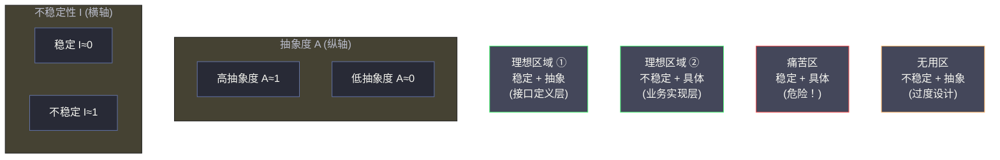
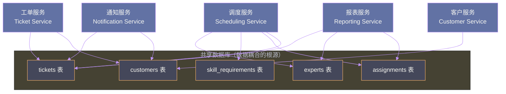

# 02 耦合解剖学：静态耦合与动态耦合的权衡模型

## 摘要

耦合是软件架构中最核心、也最常被误解的概念。工程师都知道"高内聚、低耦合"，但当面对一个真实的系统时，却往往说不清楚：哪些耦合是必要的？哪些是有害的？同样是"调用另一个服务"，同步调用和异步调用的耦合性质有何本质差异？本文深度解析《Software Architecture: The Hard Parts》第二章，系统梳理耦合的三个维度——静态耦合、动态耦合、数据耦合——并引入"架构量子"这一核心概念，建立起一套可量化、可操作的耦合分析框架，为后续所有架构拆分决策奠定认知基础。

---

## 第 1 章 重新认识"耦合"

### 1.1 为什么说大多数工程师对耦合的理解是片面的

"高内聚、低耦合"是每一个学过软件工程的人都能背出来的原则。然而在实际工程中，这六个字却常常沦为一句口号——每当有人提出一个设计方案，反对者祭出"这会增加耦合"，提出者立刻反驳"我这是高内聚的"，然后讨论陷入各说各话的泥沼。

这种困境的根源，是大多数人把"耦合"当作一个二元属性来讨论：要么耦合，要么不耦合。但现实世界的耦合是多维度的、有程度区别的、有时甚至是必要的。

**耦合本质上是一种依赖关系**：当系统中的一个部分发生变化，另一个部分不得不随之改变时，我们说这两个部分是耦合的。注意"不得不"这个词——它意味着耦合是一种约束，而约束的代价是灵活性。

但这里有一个重要的前提：**不是所有约束都是有害的**。物理定律是约束，但你不会说"物理定律耦合了发动机和汽车"并试图消除它。同样地，业务逻辑本身的关联性会产生耦合，这种耦合反映的是真实的业务依赖，不应该也无法被消除。

架构师的工作，不是消除耦合，而是**识别哪些耦合是业务本质决定的（必要耦合），哪些是实现方式导致的（偶然耦合），然后消除偶然耦合，合理管理必要耦合**。

### 1.2 耦合的代价：为什么耦合令架构师失眠

在分布式系统的背景下，耦合的代价比单体系统更加具体和严峻。

**部署耦合**：服务 A 和服务 B 在代码层面共享某个类库，当类库发布新版本时，A 和 B 必须协调同步升级，无法独立部署。这种耦合让"独立部署"这个微服务的核心价值荡然无存。

**可用性耦合**：服务 A 同步调用服务 B，当 B 出现慢响应时，A 的请求线程被大量占用，A 的可用性随之下降。在极端情况下，B 的故障会通过调用链传播，最终导致整个系统级联崩溃。这种现象叫做**故障扩散（Failure Cascade）**，是分布式系统中最常见的可用性杀手之一。

**扩展耦合**：服务 A 和服务 B 共享同一个数据库，当 A 的流量需要扩容时，数据库连接池成为瓶颈，B 的性能也随之受损。A 的扩展需求强制影响了 B 的运行状态。

**变更耦合**：服务 A 和服务 B 共享一个数据模型（比如直接访问同一张数据库表），当 A 需要修改表结构时，必须同时修改 B，甚至协调双方的发布时序，否则会出现 Schema 不兼容的问题。

这四种耦合代价，对应着分布式系统设计中的四个核心关切：**可维护性、可用性、可扩展性、独立演化能力**。理解这四种代价，是理解本书所有拆分与协同决策的出发点。

> [!note] 设计哲学
> 书中有一个精准的比喻：耦合就像系统中的引力场——每两个部分之间都存在引力，完全孤立的组件是不存在的。架构师的工作是**管理这个引力场的分布**，让必要的引力集中在业务边界内部，避免不同业务边界之间产生过强的引力。

---

## 第 2 章 静态耦合：编译时的依赖网络

### 2.1 静态耦合的本质

**静态耦合（Static Coupling）**，是指在代码编译期或部署打包阶段就已经确定的依赖关系。它描述的是系统中各个组件在结构层面的依赖图谱——类依赖类、模块依赖模块、服务依赖共享类库。

静态耦合是最直观的耦合形式，也是工具链最容易分析的耦合形式。IDE 的依赖分析、Maven 的依赖树、[[ArchUnit]] 的约束检测，分析的都是静态耦合。

静态耦合有两个方向，对应两种不同的风险：

**传入耦合（Afferent Coupling，Ca）**：有多少个组件依赖当前组件。Ca 越高，说明这个组件被越多的组件所依赖，修改它的代价越高——因为每一次修改都可能影响所有依赖它的组件。高 Ca 的组件往往是系统的"关键节点"，例如共享的工具类库、基础的数据模型定义。

**传出耦合（Efferent Coupling，Ce）**：当前组件依赖了多少个其他组件。Ce 越高，说明这个组件自身越脆弱——它依赖的任何一个组件出问题，它都可能受影响。Ce 极高的组件通常是业务流程的"聚合点"，它知道太多，需要协调太多。

### 2.2 不稳定性度量：量化静态耦合的健康度

[[Robert C. Martin]] 提出了一个优雅的度量指标——**不稳定性（Instability，I）**：

```
I = Ce / (Ca + Ce)
```

- **I = 0**：该组件没有任何传出依赖（Ce = 0），只有其他组件依赖它。这是最**稳定**的状态——该组件永远不会因为外部变化而被迫修改。但这也意味着它无法演化，必须保持极度稳定。典型例子：基础类库的核心 API 接口定义。

- **I = 1**：该组件有大量传出依赖，但没有任何组件依赖它（Ca = 0）。这是最**不稳定**的状态——它随时可能因为任何外部变化而被改变。但这也意味着改变它的代价很低，没有任何下游会受影响。典型例子：顶层的业务应用代码、启动类、配置文件。

- **0 < I < 1**：介于两者之间的中间状态，大多数真实组件都在这个区间。

**稳定依赖原则（Stable Dependencies Principle，SDP）**：一个组件应该只依赖比自己更稳定的组件。换句话说，依赖的方向应该指向稳定性更高（I 值更低）的组件。

这个原则揭示了很多架构问题的根源。在 Sysops Squad 的单体系统中，调度模块（I=0.6，中等稳定性）直接依赖了报表模块（I=0.8，不稳定），违反了 SDP。当产品经理要求调整报表维度时，报表模块的频繁修改会通过依赖关系传播到调度模块，造成意外的回归测试压力。

### 2.3 距离度量：组件离"理想状态"有多远

Martin 还提出了另一个度量：**主序列距离（Distance from Main Sequence，D）**：

```
D = |A + I - 1|
```

其中 A 是**抽象度（Abstractness）**，计算方式是抽象类和接口占所有类的比例：
```
A = 抽象类数量 / 总类数量
```

D 的取值范围是 [0, 1]，D 越接近 0，说明组件越处于理想状态。

这个度量的背后是一个核心洞察：**稳定的组件应该是抽象的，不稳定的组件应该是具体的**。

- **高稳定性（低 I）+ 高抽象度（高 A）**：理想状态。稳定的接口定义，很多地方依赖它，但它本身很少变化，因为它是抽象的，变化发生在实现层。
- **低稳定性（高 I）+ 低抽象度（低 A）**：理想状态。不稳定的具体业务代码，可以自由演化，但只有少量东西依赖它。
- **高稳定性（低 I）+ 低抽象度（低 A）**：**痛苦区（Zone of Pain）**。具体的代码被很多地方依赖，修改成本极高，但它是具体实现，终究会需要修改。这是最危险的状态，典型例子：数据库 schema 被直接硬编码引用的 ORM 实体类、被全系统依赖的工具类。
- **低稳定性（高 I）+ 高抽象度（高 A）**：**无用区（Zone of Uselessness）**。高度抽象但没人依赖，说明这个抽象是没有价值的过度设计。



### 2.4 静态耦合的实战识别：在 Sysops Squad 中的表现

回到 Sysops Squad 的单体系统，静态耦合最明显的体现是：

**共享实体类（Shared Entity Problem）**：整个系统共用一套 JPA 实体类，`Ticket`、`Expert`、`Customer` 等核心领域对象被所有模块直接引用。当工单管理模块需要在 `Ticket` 实体上增加一个字段时，所有依赖 `Ticket` 的模块——调度模块、报表模块、通知模块——都需要重新编译和测试，即使它们根本不使用这个新字段。

**共享工具库的膨胀**：随着系统演化，出现了一个 `common-utils` 模块，起初只包含日期格式化工具，后来慢慢加入了加密工具、HTTP 客户端封装、配置读取工具……它的 Ca 不断攀升，成为一个典型的痛苦区组件——几乎所有模块都依赖它，但它本身是具体实现，经常需要修改。每次修改都引发全系统级别的回归测试。

---

## 第 3 章 动态耦合：运行时的协同代价

### 3.1 动态耦合的本质：静态耦合的孪生兄弟

如果说静态耦合是系统的"骨骼结构"，那么**动态耦合（Dynamic Coupling）**就是系统的"神经网络"——它描述的是系统在运行时各个组件之间的通信和协调关系。

动态耦合之所以重要，是因为它直接影响系统的运行时行为：**可用性、性能、一致性**。两个在代码层面完全独立的服务（零静态耦合），只要它们在运行时相互通信，就存在动态耦合，并且这种动态耦合可能成为系统最脆弱的地方。

动态耦合有两个核心维度：**通信方式（Communication）** 和 **一致性要求（Consistency）**。

### 3.2 通信方式：同步与异步的根本差异

**同步通信（Synchronous Communication）**：

调用方发出请求后，阻塞等待被调用方的响应，整个调用链在被调用方返回之前无法继续执行。

```
服务 A ────────────────────────────────────────► 服务 B
       │  REQUEST                    RESPONSE  │
       │◄──────────────────────────────────────┤
       │  (阻塞等待，直到 B 响应)                │
```

同步通信的特征：
- **时间耦合（Temporal Coupling）**：调用方和被调用方必须同时在线。如果 B 宕机，A 的调用立刻失败。
- **性能耦合（Performance Coupling）**：A 的响应时间 = 自身处理时间 + B 的响应时间。B 慢了，A 也慢了。
- **可用性耦合（Availability Coupling）**：A 的可用性受 B 可用性的约束，在 n 个同步调用链中，系统整体可用性约等于各服务可用性的乘积。

假设 Sysops Squad 的工单创建流程是同步的：工单服务依次同步调用调度服务（分配专家）、通知服务（发送确认短信）、报表服务（记录统计数据）。如果每个服务的可用性都是 99.9%（业界通常认为不错的 SLA），那么整个工单创建流程的可用性是：

```
0.999 × 0.999 × 0.999 × 0.999 ≈ 0.996
```

四个 99.9% 的服务组成的链路，整体可用性下降到了 99.6%，每月约有 1.7 小时的不可用时间。如果链路更长，这个问题会更严重。

> [!warning] 生产避坑
> 在分布式系统中，**同步调用链的可用性等于链路中所有服务可用性的乘积**，这是一个常被低估的陷阱。一个看似合理的五层同步调用链，即使每层都有 99.9% 的可用性，整体可用性也只有 `0.999^5 ≈ 99.5%`，每月约有 3.6 小时不可用。

**异步通信（Asynchronous Communication）**：

调用方发出请求后，不等待响应，立刻继续执行。被调用方在自己的节奏内处理请求，结果通过回调、事件、消息队列等方式通知调用方（或根本不通知）。

```
服务 A ──► 消息队列 ──► 服务 B
       PUT                GET
       (发完即走)          (按自己节奏处理)
```

异步通信的特征：
- **时间解耦**：A 和 B 不需要同时在线。A 把消息放入队列后立即返回，即使 B 此刻宕机，消息会在 B 恢复后被处理。
- **性能解耦**：A 的响应时间不包含 B 的处理时间，A 的吞吐量不受 B 处理速度的限制。
- **但引入了最终一致性**：A 无法立刻知道 B 的处理结果，系统从强一致性变为最终一致性，业务逻辑需要相应调整。

### 3.3 一致性要求：强一致 vs. 最终一致

动态耦合的第二个核心维度是**一致性要求**。不同的业务操作对数据一致性有不同的容忍度，而一致性要求直接决定了通信方式的选择空间。

**需要强一致性的场景**：金融交易（不能多扣款、不能少扣款）、库存扣减（不能超卖）、并发资源竞争（不能重复分配）。这些场景中，数据的临时不一致会直接造成业务损失，因此需要同步通信（或分布式事务）来保证即时一致性。

**可以接受最终一致性的场景**：通知发送（工单确认短信晚 5 秒到达无所谓）、统计数据更新（报表数据延迟 1 分钟可接受）、搜索索引（全文搜索结果延迟几分钟可接受）。这些场景中，数据的临时不一致不影响核心业务，可以用异步通信换取更好的性能和可用性。

| 一致性级别 | 通信方式 | 典型场景 | 代价 |
|-----------|---------|---------|------|
| 强一致性 | 同步（+分布式事务） | 金融转账、库存扣减 | 高耦合、低吞吐、可用性下降 |
| 读写自己写（Read Your Writes） | 同步写 + 异步读 | 用户个人资料更新 | 中等复杂度 |
| 会话一致性 | 带版本号的异步 | 购物车操作 | 需要客户端版本管理 |
| 最终一致性 | 异步消息 | 通知、统计、搜索索引 | 低耦合、高吞吐，但数据临时不一致 |

### 3.4 动态耦合的量化：依赖关系图的时间维度

静态耦合可以通过代码分析工具量化，动态耦合的量化则需要引入**时间维度**——也就是运行时的调用数据。

常见的动态耦合度量指标：

**调用链深度（Call Chain Depth）**：从入口请求到最终响应，同步调用链经过了多少个服务。深度越深，可用性和延迟问题越严重。一般建议同步调用链不超过 3 层。

**扇出度（Fan-out）**：某个服务在处理一个请求时，需要同步调用多少个其他服务。扇出越大，该服务的可用性和响应时间越容易被下游拖累。

**协调模式（Coordination Pattern）**：服务间的协调是通过中心化编排（Orchestration）还是去中心化编舞（Choreography）实现的？这直接影响了系统的动态耦合拓扑，也是后续第 10、11 章的核心议题。

在可观测性工具（如 [[Jaeger]]、[[Zipkin]] 等分布式链路追踪系统）的支持下，可以从生产流量中直接提取这些指标，生成动态依赖关系图，让原本隐性的动态耦合变得可视化。

---

## 第 4 章 数据耦合：最容易被忽视的耦合维度

### 4.1 数据耦合为什么是"隐形杀手"

在微服务架构的讨论中，工程师对"代码耦合"已经非常警惕——服务之间不能共享代码库，不能直接调用对方的内部 API。但对"数据耦合"的警惕却远远不够。

数据耦合是指**多个服务对同一份数据或同一种数据格式产生依赖**。它的隐蔽性在于，数据耦合不体现在代码的 import 语句中，不会触发编译错误，只有在运行时（或者更糟糕地，在生产故障发生时）才会暴露。

数据耦合有三种主要形式：

**语义耦合（Semantic Coupling）**：两个服务对同一个业务概念的理解是一致的，当这个概念的定义发生变化时，两个服务都需要改变。

例如，Sysops Squad 的工单服务和调度服务都有"专家（Expert）"这个概念，而且它们对"专家"的定义完全一致（同样的字段、同样的业务规则）。当业务决定给"专家"增加"认证级别"属性时，两个服务需要同步升级。这不是代码层面的耦合，而是概念层面的耦合。

**Schema 耦合（Schema Coupling）**：多个服务依赖同一个数据 Schema（数据结构定义）。最典型的形式是**共享数据库**——多个服务直接读写同一张数据库表。

共享数据库是分布式系统中最强的数据耦合形式，也是最难消除的。它的危害包括：
- 数据库 Schema 变更需要协调所有使用方同步发布
- 某个服务的错误写操作可能污染其他服务依赖的数据
- 某个服务的高负载查询会影响所有服务的数据库性能
- 无法为不同服务独立选择最合适的数据存储技术

**契约耦合（Contract Coupling）**：服务之间通过 API 接口传递数据，当接口的数据结构（请求体/响应体）发生变化时，调用方需要相应修改。

契约耦合是服务间通信的必然产物，无法完全消除，但可以通过良好的契约设计（[[消费者驱动契约测试]]、语义版本管理、向后兼容原则）来降低其冲击。

### 4.2 Sysops Squad 的数据耦合全景分析

让我们系统地分析 Sysops Squad 单体系统在被拆分成微服务后，潜在的数据耦合点：



从这个图可以清晰地看到问题所在：`tickets` 表被工单服务、调度服务、报表服务、通知服务四个服务共同访问。`customers` 表被工单服务、客户服务、通知服务三个服务共同访问。

这意味着，如果要给 `tickets` 表增加一个字段，需要：
1. 评估对四个服务的影响
2. 协调四个服务团队同步发布（或者做滚动升级，但这需要 Schema 变更向后兼容）
3. 测试四个服务在新 Schema 下的行为

这正是 Sysops Squad 发布周期越来越长的根本原因之一——数据耦合导致了跨团队的隐性协调成本。

### 4.3 数据耦合的解耦策略：数据所有权的归属

解决数据耦合的核心思路是**数据所有权（Data Ownership）**：每一份数据必须有一个且只有一个"拥有者"服务，只有拥有者才能直接写这份数据，其他服务必须通过拥有者的 API 来访问或修改。

这个思路听起来很简单，但落地却极其困难，原因在于：**真实世界的数据往往是被多个业务场景共同关心的**。

`experts` 表中的数据，同时被以下场景关心：
- 调度模块关心：专家的技能、所在地区、当前工作量（用于分配工单）
- 报表模块关心：专家的历史绩效数据（用于生成月报）
- 通知模块关心：专家的联系方式（用于发送工单通知）

把 `experts` 数据归属给"专家服务（Expert Service）"后，调度服务、报表服务、通知服务都需要通过 Expert Service 的 API 获取数据，而不是直接查数据库。这解决了 Schema 耦合问题，但带来了新的挑战：**跨服务数据查询的性能和可用性问题**——这正是本专栏第 9 篇文章要深入讨论的主题。

---

## 第 5 章 架构量子：理解耦合的最高维度

### 5.1 为什么需要"架构量子"这个概念

前面我们分别讨论了静态耦合、动态耦合、数据耦合，但一个真实系统中，这三种耦合是交织在一起的。架构师需要一个更高层次的概念，来整体性地描述"哪些部分应该在一起，哪些部分应该分开"。

书中引入的 **架构量子（Architectural Quantum）** 这个概念，正是为了填补这个空白。

> [!info] 核心概念
> **架构量子（Architectural Quantum）**：在一个软件系统中，能够独立部署、独立扩展、并且具有高度功能内聚性的最小可部署单元。其定义包含三个关键特征：
> 1. **独立可部署性（Independent Deployability）**：该单元可以独立发布，不依赖其他单元的同步部署
> 2. **高功能内聚性（High Functional Cohesion）**：该单元内部的组件共同实现一个完整的业务能力
> 3. **同步连接性（Synchronous Connascence）**：单元内部的组件通过同步通信协调，形成一个运行时的整体

"量子"这个物理学借词，传达了一个核心思想：在量子物理学中，量子是能量的最小离散单位，不可以被进一步分割。类比到软件架构，架构量子是独立部署和扩展的最小单位——再细分就失去了独立性，合并到一起就失去了边界。

### 5.2 架构量子的识别方法

识别一个系统的架构量子边界，本质上是在回答以下问题：

**问题一：哪些组件必须同步发布？**

如果 A 和 B 每次发布都必须同步，它们很可能属于同一个架构量子。强制同步发布的原因通常是：共享了 API 接口（契约耦合）、共享了数据库 Schema（数据耦合）、存在编译时依赖（静态耦合）。

**问题二：哪些组件必须同步扩展？**

如果 A 流量增加时，必须同步扩容 B（否则 B 会成为瓶颈），A 和 B 很可能属于同一个架构量子。这通常是因为它们之间存在高度同步的动态耦合，一个的性能直接受限于另一个。

**问题三：哪些组件共同实现一个完整的业务能力？**

这是功能内聚性的判断。工单服务和工单数据库属于同一个架构量子，因为它们共同实现"工单管理"这个业务能力。工单服务和报表服务不属于同一个架构量子，因为报表是一个独立的业务能力，即使工单服务宕机，历史报表依然可以查看。

### 5.3 架构量子数量与架构风格的关系

书中有一个非常有洞察力的观察：**不同的架构风格，对应着不同的架构量子数量**。

| 架构风格 | 架构量子数量 | 典型特征 |
|---------|------------|---------|
| 单体（Monolith） | 1 | 所有功能打包在一起，一荣俱荣一损俱损 |
| 前后端分离（Frontend + Backend） | 2 | 前端可以独立部署，但后端仍是单体 |
| 模块化单体（Modular Monolith） | 1（代码上多个，部署上一个） | 代码结构清晰，但仍需整体发布 |
| 面向服务架构（SOA） | 少（通常 4-20 个） | 按业务领域拆分，但服务粒度较大 |
| 微服务（Microservices） | 多（通常 20-200+ 个） | 每个服务独立，最高的独立性，最高的协调成本 |
| 事件驱动（Event-Driven） | 1 到多个不等 | 取决于事件消费者是否真正解耦 |

这个表格揭示了一个反直觉的事实：架构量子数量不是越多越好。

**量子越多，意味着：**
- 每个量子可以独立优化（扩展性更好）
- 每个量子的发布周期更短（敏捷性更好）
- 但量子之间的协调成本更高（分布式复杂性）
- 数据一致性更难保证（跨量子的强一致是不可能的）
- 运维和可观测性的复杂度指数级增长

**量子越少，意味着：**
- 量子内部的事务和一致性保证更容易（因为是本地事务）
- 运维复杂度低
- 但每次发布需要协调更多的功能（部署耦合）
- 扩展受到整体约束，不能针对热点业务单独扩容

> [!note] 设计哲学
> 架构量子数量的选择，是整本书最核心的权衡之一。在第 7 章讨论服务粒度时，我们会从架构量子的视角重新审视"服务应该多大"这个问题：**服务的边界，应该与架构量子的边界对齐**。把一个自然的架构量子强行拆成两个服务，会引入不必要的分布式协调成本；把两个自然独立的架构量子合并成一个服务，会失去独立部署和扩展的能力。

### 5.4 动态量子连接性：量子之间的通信协议

架构量子内部可以使用同步通信（因为是同一个部署单元），但量子之间的通信应该偏向异步——这样才能真正实现量子的独立性。

书中引入了 **量子连接性（Quantum Connascence）** 的概念，从动态角度描述量子之间的耦合程度：

**同步量子连接性（Synchronous Connascence）**：量子 A 同步等待量子 B 的响应。这意味着 A 和 B 在可用性和性能上是耦合的，从严格意义上讲，如果两个量子之间存在大量同步连接，它们其实应该被合并为一个量子。

**异步量子连接性（Asynchronous Connascence）**：量子 A 向消息队列发送消息，量子 B 异步消费。A 和 B 在可用性和性能上是解耦的，这是量子之间理想的通信方式。

这个分析给出了一个实用的架构设计准则：**如果两个服务之间的同步调用非常频繁（高频同步连接性），应该考虑将它们合并为一个架构量子；如果两个服务之间的通信可以做成异步（低连接性），应该考虑将它们分离为不同的架构量子。**

---

## 第 6 章 耦合分析实战：如何对 Sysops Squad 做耦合全景图

### 6.1 建立三维耦合矩阵

有了静态耦合、动态耦合、数据耦合三个分析维度，可以对 Sysops Squad 的各个功能模块进行系统性的耦合分析。实践中，可以用一个**三维耦合矩阵**来组织这个分析：

行：系统中的各个模块/服务

列：静态耦合（共享代码依赖）、动态耦合（运行时调用频率）、数据耦合（共享数据表）

单元格：耦合强度评分（0=无耦合，1=弱耦合，2=中等耦合，3=强耦合）

| 模块对 | 静态耦合 | 动态耦合 | 数据耦合 | 总分 | 优先处理 |
|--------|---------|---------|---------|-----|---------|
| 工单服务 ↔ 调度服务 | 2（共享实体类） | 3（每张工单都需同步调用） | 3（共享 tickets + assignments 表）| 8 | ⚠️ 高优先 |
| 工单服务 ↔ 通知服务 | 1（轻量接口） | 2（每次状态变更触发） | 2（共享 customers 表读取联系方式） | 5 | 中等 |
| 工单服务 ↔ 报表服务 | 1（轻量接口） | 1（报表异步生成） | 3（报表直接读 tickets 表） | 5 | 中等 |
| 调度服务 ↔ 知识库服务 | 0（无直接依赖） | 1（偶尔查询参考案例） | 1（独立表结构） | 2 | 低 |
| 客户服务 ↔ 报表服务 | 0（无直接依赖） | 1（月报生成时查询） | 2（共享 customers 表） | 3 | 低 |

从这个矩阵中，可以清晰地识别出优先级最高的解耦目标：**工单服务与调度服务的耦合**最为严重（总分 8），它的高度同步动态耦合表明这两个服务可能属于同一个架构量子，或者至少需要优先设计解耦方案。

### 6.2 从耦合分析到架构决策

耦合矩阵的输出，直接指导了接下来的架构决策方向：

**对于高耦合对（工单服务 ↔ 调度服务）**：
- 静态耦合解决方案：拆解共享实体类，各自维护领域模型
- 动态耦合解决方案：评估能否将同步调用改为异步（工单分配是否真的需要实时返回结果？）
- 数据耦合解决方案：明确数据所有权，tickets 归工单服务，assignments 归调度服务，跨服务访问通过 API 进行

**对于中等耦合对（工单服务 ↔ 通知服务）**：
- 动态耦合是主要问题，解决方案是将工单服务改为发布事件，通知服务异步消费事件，消除时间耦合

**对于低耦合对（调度服务 ↔ 知识库服务）**：
- 耦合程度已经可以接受，可以暂时不处理，将精力集中在高优先级问题上

> [!warning] 生产避坑
> 耦合分析最常见的误区是**一次性追求零耦合**——看到矩阵中的所有耦合点就想全部解决。这种做法既不实际（解耦本身有成本），也不正确（有些耦合反映的是真实的业务依赖，不应该消除）。正确的方法是**基于业务影响排序，分批次、迭代式地解耦**，每次解耦都需要评估其带来的收益是否大于成本。

---

## 第 7 章 总结

### 7.1 耦合分析的核心框架回顾

本文建立了一套完整的耦合分析框架，由三个层次构成：

**第一层——识别耦合的三个维度**：
- 静态耦合：编译期的代码依赖，用 Ca/Ce/不稳定性/距离度量量化
- 动态耦合：运行时的通信协调，区分同步/异步、评估时间耦合和可用性耦合
- 数据耦合：共享数据结构的依赖，区分语义耦合/Schema 耦合/契约耦合

**第二层——以架构量子为单位思考系统边界**：
- 识别系统中"必须一起"的最小单元（架构量子）
- 量子内部允许高耦合（换来一致性和性能），量子之间追求低耦合（换来独立性）

**第三层——建立三维耦合矩阵，指导解耦优先级**：
- 用矩阵可视化系统中的耦合全景，基于业务影响排序解耦目标
- 分批次迭代解耦，每次解耦前评估收益与成本

### 7.2 与下一章的衔接

本章建立了分析耦合的语言和工具，但还没有回答一个关键问题：**当我们决定要解耦时，如何衡量模块化程度——即，拆分到什么程度才算"足够模块化"？**

这正是第三篇文章的核心主题：**架构模块化——从逻辑分层到物理服务边界的演进**。我们将引入模块化的量化指标（内聚性、耦合性的具体度量），以及从单体演进到微服务的几种典型路径，并分析每种路径适合的上下文。

---

## 延伸阅读

- [[Robert C. Martin]] 的《Clean Architecture》：详细介绍了 Ca/Ce/稳定性/主序列距离等度量
- [[Building Microservices]]：第 4 章"Microservice Communication Styles"深度讨论了同步与异步通信的选择
- [[Designing Data-Intensive Applications]]：第 9 章"Consistency and Consensus"是理解数据耦合中一致性权衡的必读内容
- [[Team Topologies]]：从团队拓扑视角理解耦合——Conway 定律告诉我们，系统耦合往往是团队耦合的镜像
