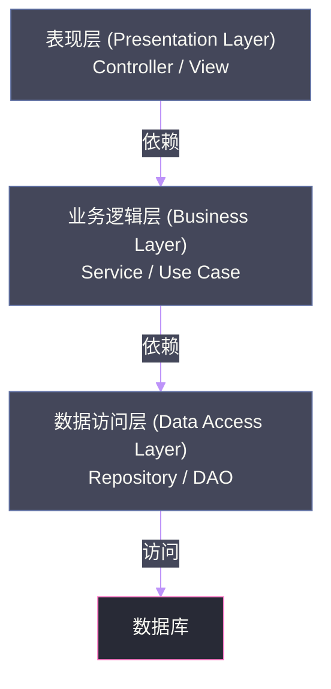
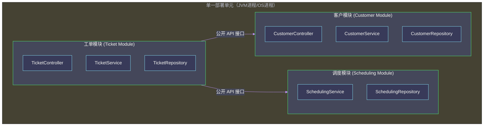
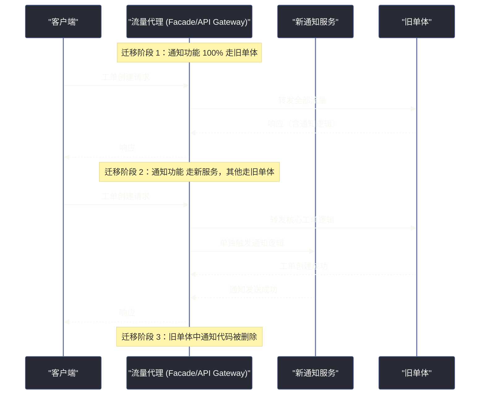

# 03 架构模块化：从逻辑分层到物理服务边界的演进

## 摘要

模块化是软件架构演化的核心驱动力，但"模块化"这个词本身却极度模糊——一个分了很多包的单体是模块化的吗？一个微服务系统一定比单体更模块化吗？本文系统梳理架构模块化的量化维度：内聚性（Cohesion）的七个层级、耦合性（Coupling）的度量方法，以及从单体到微服务的完整演化谱系。更重要的是，我们将深入分析 Conway 定律这一被严重低估的架构力量，以及在真实工程中安全地从低模块化向高模块化迁移的战术选择。

---

## 第 1 章 模块化的本质：为什么我们需要它

### 1.1 一个反直觉的起点

模块化（Modularity）这个词在软件工程中被谈论了几十年，但大多数讨论都停留在"模块化是好的，应该追求模块化"这个层次，很少有人回答一个更根本的问题：**模块化到底解决了什么问题？没有模块化会怎样？**

让我们从反面来思考。

想象一个没有任何模块化的代码库：所有逻辑写在一个巨大的文件里，所有函数都是全局函数，任何功能都可以随意调用任何其他功能。这种代码的开发体验是什么样的？

在团队规模只有 1-2 人、功能简单的阶段，它运行得相当好——代码量小，所有逻辑在一屏以内，任何修改都即时可见。这就是为什么很多成功的早期创业产品，其早期代码库都是"大泥球"（Big Ball of Mud）——它是在资源极度有限的条件下，最高效的交付方式。

问题在于成长：

当代码库从 1 万行增长到 10 万行，当团队从 2 人增长到 20 人，"大泥球"的代价开始显现：

- 任何修改都可能通过隐性依赖链影响到完全无关的功能，导致 bug 跨越多个功能域
- 新加入的工程师需要理解几乎全部代码才能安全地做修改，认知负担极重
- 多人同时修改同一个文件，代码冲突频繁，团队协作摩擦增大
- 测试范围无法收敛，任何改动都需要做全量回归测试

这些问题的共同根源是：**认知负担（Cognitive Load）随代码库体积的增长而失控**。人类的工作记忆是有限的，当需要同时记住的背景知识超过这个上限时，生产效率就会断崖式下跌，错误率急剧上升。

模块化的本质，是**通过强制定义边界，人为地将大的认知问题分解为若干个可以独立理解的小问题**。好的模块化使得工程师在修改模块 A 时，不需要理解模块 B 的内部实现——模块 B 的行为被其接口完整地描述了。

### 1.2 模块化的三个基本属性

《The Hard Parts》在讨论模块化时，引入了三个基本属性，它们共同定义了一个良好模块化系统的特征：

**可封装性（Encapsulation）**：模块的内部实现对外部不可见，外部只能通过定义好的接口访问模块。这是模块化最基础的属性——没有封装，就没有真正意义上的边界。

**职责一致性（Responsibility Alignment）**：一个模块应该只负责一件完整的事情，并且一件完整的事情只由一个模块负责。这直接对应单一职责原则（SRP）和康威定律（Conway's Law）。

**稳定的接口（Stable Interface）**：模块的接口应该比模块的实现更稳定。接口是模块对外承诺的契约，频繁变化的接口意味着高耦合，意味着每次变化都需要协调所有依赖方。

---

## 第 2 章 内聚性：模块化质量的核心度量

### 2.1 内聚性的七个层级

**内聚性（Cohesion）**是衡量一个模块内部各元素"在一起的理由"有多充分的度量。内聚性越高，模块内部的元素联系越紧密，模块作为一个整体就越有意义。

计算机科学家 Larry Constantine 和 Edward Yourdon 在 1979 年的著作《Structured Design》中，将内聚性分为七个层级，从高到低依次是：

**1. 功能内聚（Functional Cohesion）** — 最高级别

模块内所有元素共同完成且仅完成一个单一、明确定义的功能。整个模块可以用一句话完整描述。

示例：`OrderPriceCalculator` — 负责计算订单价格。模块内的所有方法（基础价格计算、折扣应用、税费计算）都服务于同一个目标——得到最终的订单价格。

这是最理想的内聚形式。功能内聚的模块不仅容易理解，也容易测试（一个单一职责的函数，其测试用例天然地围绕一组输入输出），还容易复用（其他需要计算订单价格的场景可以直接使用这个模块）。

**2. 顺序内聚（Sequential Cohesion）**

模块内的元素按照固定顺序执行，前一个元素的输出是后一个元素的输入，就像流水线一样。

示例：`OrderProcessingPipeline` — 依次完成：验证订单 → 检查库存 → 扣减库存 → 生成订单记录 → 发送确认通知。

顺序内聚的模块通常反映了一个完整的业务流程。它比功能内聚稍弱，因为模块内的元素不是共同服务于一个原子功能，而是共同服务于一个流程——流程的某些步骤在将来可能会被调整顺序或增减。

**3. 通信内聚（Communicational / Informational Cohesion）**

模块内的元素操作同一份数据，或者向同一个输出目标写数据。

示例：`CustomerService` — 包含了所有与客户数据相关的操作：`createCustomer()`、`updateCustomer()`、`getCustomerById()`、`getCustomerOrders()`、`getCustomerBillingHistory()`。

通信内聚是业务层服务类最常见的内聚形式。它的合理性在于，操作同一份数据的代码应该在一起，因为数据模型的变化会影响到所有操作。但它的局限是，随着系统增长，一个"客户服务"可能会把越来越多的与客户相关的功能堆砌进来，最终变成一个臃肿的"上帝类"。

**4. 过程内聚（Procedural Cohesion）**

模块内的元素按照一定的执行顺序运行，但不像顺序内聚那样强调数据的传递，更多是共享一个执行流程或控制流。

示例：`FileProcessor` — 包含 `openFile()`、`readFile()`、`validateContent()`、`writeLog()`、`closeFile()`。这些方法在逻辑上需要按顺序执行，但并非每个方法的输出都是下一个方法的输入。

过程内聚比通信内聚弱，因为方法之间的联系主要是执行顺序而非数据关系，将来如果要改变流程，各个方法可能需要拆分和重组。

**5. 时间内聚（Temporal Cohesion）**

模块内的元素因为在同一时间点执行而被放在一起，而不是因为有什么逻辑联系。

示例：`SystemStartupInitializer` — 在系统启动时，依次初始化数据库连接池、加载配置、预热缓存、启动定时任务。这些操作在功能上没有任何关联，唯一的共同点是"都在启动时执行"。

时间内聚的模块内聚性较弱。一旦某个"启动时执行"的任务需要在另一个时间点执行，或者某个任务不再需要在启动时执行，这个模块的结构就会变得混乱。

**6. 逻辑内聚（Logical Cohesion）**

模块内的元素在逻辑上属于同一类别，但它们的实际功能差异很大，通常通过一个参数或标志来选择执行哪个功能。

示例：一个 `IOUtils` 工具类，包含了文件 I/O、网络 I/O、数据库 I/O 的所有操作，理由是"它们都是 I/O 操作"。

逻辑内聚几乎只有分类上的关联，缺乏功能上的内在联系。这类模块往往会随着系统增长变成"杂物间"，把所有"不知道放哪里的东西"都塞进来。

**7. 偶然内聚（Coincidental Cohesion）** — 最低级别

模块内的元素毫无关联，纯粹是因为历史原因或随机原因被放在一起。

示例：一个 `Miscellaneous` 类，包含了字符串处理函数、数学计算函数、日期格式化函数、用户权限检查函数——因为某个工程师实在不知道这些函数应该放在哪里。

偶然内聚是最差的内聚形式，这类模块无法用一句话描述其职责，修改时无法预知影响范围。

### 2.2 内聚性的量化度量：LCOM

知道内聚性的层级是一回事，能够在真实代码库中量化内聚性是另一回事。**LCOM（Lack of Cohesion of Methods，方法内聚缺失度）**是最常用的内聚性量化指标。

LCOM 有多个版本，其中 **LCOM4** 是最常用的：

**LCOM4 计算方法**：将类中所有方法视为节点，如果两个方法共享一个实例变量（或者一个方法直接调用另一个方法），则在这两个节点之间画一条边。LCOM4 等于这个图的连通分量数量。

- LCOM4 = 1：所有方法构成一个连通图，说明所有方法都通过某种方式关联，内聚性高
- LCOM4 > 1：图中存在多个连通分量，说明类内部存在多个功能独立的"子组"，这个类应该被拆分

| LCOM4 值 | 含义 | 建议行动 |
|----------|------|---------|
| 1 | 高内聚，方法相互关联 | 保持现状 |
| 2 | 存在两个独立功能组 | 评估是否应该拆分为两个类 |
| 3-5 | 内聚性差，功能混杂 | 应该重构拆分 |
| > 5 | 极低内聚，典型的"上帝类" | 必须重构 |

工具支持：SonarQube、Structure101、Lattix 等都支持 LCOM 的自动计算，可以集成到 CI 流水线中作为代码质量门禁。

> [!warning] 生产避坑
> LCOM 是一个有局限性的度量工具。LCOM4 对只有一个实例变量的数据类（POJO/DTO）会误报高内聚；对具有很多方法但功能内聚的 Facade 类会误报低内聚。LCOM 应该作为**发现潜在问题的信号灯**，而不是**判断内聚性好坏的唯一标准**，需要配合人工审查使用。

---

## 第 3 章 架构模块化的演化谱系

### 3.1 五种模块化程度递增的架构风格

从"零模块化"到"极度模块化"，存在一个清晰的演化谱系，每一步演化都解决了前一步留下的核心问题，同时引入了新的挑战。

**阶段零：大泥球（Big Ball of Mud）**

特征：没有明确的模块边界，代码按文件和目录随意组织，任何组件都可以直接依赖任何其他组件。

优点：开发速度极快（在小规模时），没有架构约束的摩擦。

核心问题：认知负担随规模指数增长，团队协作摩擦随人数增长，变更风险无法控制。

适用上下文：0-1 阶段的产品验证，团队 ≤ 5 人，代码库 < 5 万行，长期稳定性不是优先考虑项。

**阶段一：分层架构（Layered Architecture）**

分层架构是对大泥球的第一次重要改进。系统被分为若干水平层次，经典的三层是：表现层（Presentation）、业务逻辑层（Business Logic）、数据访问层（Data Access）。每一层只允许依赖其直接下层，不允许跨层依赖。

分层架构解决了"随意依赖"的问题，为系统引入了第一层有意义的边界。但它是按**技术职责**而非**业务能力**划分的：所有与"用户"相关的代码，分散在 UserController（表现层）、UserService（业务层）、UserRepository（数据层）三个不同的层中。

这带来了一个典型问题：当需要修改"用户管理"功能时，改动会横跨三个技术层，三个层的代码都需要同时修改和发布。**这是分层架构最大的隐患：它把技术上相关但业务上无关的代码放在一起，把业务上相关但技术上在不同层的代码强制分开**。

适用上下文：小型到中型系统，团队规模 5-30 人，业务边界相对清晰，对技术分工有明确需求。

**阶段二：模块化单体（Modular Monolith）**

模块化单体是近年来重新受到重视的架构风格。它的核心思想是：**在单一的部署单元内，按业务能力（而非技术职责）划分模块，模块之间通过定义好的接口通信，模块内部实现对外完全封装**。

模块化单体的关键约束是：**模块边界必须有技术机制来强制执行**，而不仅仅是口头约定。在 Java 生态中，可以用 [[ArchUnit]] 来测试模块间的访问规则，或者使用 Java 9 的模块系统（JPMS）来在编译期强制封装。

模块化单体解决了分层架构的核心问题：所有与"工单"相关的代码——Controller、Service、Repository——都在 Ticket Module 内，修改工单功能的改动范围是可预测的。

同时，模块化单体保留了单体架构的优势：
- **本地事务**：跨模块操作仍然可以用本地数据库事务保证一致性
- **无网络延迟**：模块间通信是进程内方法调用，性能极高
- **开发调试简单**：本地一个进程即可运行全部功能
- **运维简单**：只有一个部署单元需要管理

模块化单体最大的局限是：**无法独立扩展某个模块**。如果调度模块是性能瓶颈，只能扩容整个系统，而不是单独扩容调度模块。同时，所有模块仍然需要协调发布。

适用上下文：中型系统，团队规模 20-80 人，业务边界清晰，对独立扩展的需求不强，但需要良好的代码组织和团队协作分工。

**阶段三：面向服务架构（SOA）**

SOA 把模块化单体中的各个业务模块，提取为独立部署的服务，服务间通过网络通信。相比微服务，SOA 的服务粒度更粗——每个服务通常对应一个完整的业务域（如"订单服务"、"用户服务"），而不是一个单一的业务能力。

SOA 在 2000 年代初期是业界的主流架构范式，使用 Web Services（SOAP/WSDL/UDDI）作为服务通信标准，配合 ESB（企业服务总线）进行服务路由和编排。

SOA 的核心问题主要有两个：

第一，**ESB 成为新的"大泥球"**。ESB 集中了所有服务的路由逻辑、协议转换、消息转换，随着服务增加，ESB 的复杂度急剧膨胀，最终成为整个系统最难理解、最难修改的部分——这与 SOA 追求的"服务自治"背道而驰。

第二，**服务粒度难以把握**。SOA 没有给出清晰的服务粒度指引，实践中往往出现两个极端：服务太粗（每个服务仍然是几十万行的单体，只是部署分开了）或者服务太细（与微服务无异，但没有微服务的工具链支持）。

适用上下文：大型企业系统，集成多个异构遗留系统，需要跨系统的业务流程编排，团队规模 50-500 人。

**阶段四：微服务（Microservices）**

微服务是当前最主流的分布式架构风格，核心理念是：每个服务只负责一个单一的、明确的业务能力，服务之间通过轻量级的 HTTP/gRPC API 或消息队列通信，每个服务独立部署、独立扩展、独立演化。

微服务与 SOA 的本质区别不在于服务的大小（虽然微服务通常更小），而在于**去中心化**：
- 没有中心化的 ESB，每个服务直接与需要通信的服务交互
- 没有统一的数据库，每个服务拥有自己的数据存储
- 没有统一的技术栈，每个服务可以选择最适合自己的语言和框架

微服务的收益和挑战同样显著：

| 维度 | 收益 | 挑战 |
|------|------|------|
| 可扩展性 | 可以对热点服务单独扩容 | 需要完善的服务注册、负载均衡基础设施 |
| 可用性 | 单个服务故障不影响全局 | 需要熔断、降级、超时等韧性机制 |
| 发布周期 | 服务可以独立发布 | 服务间依赖的版本管理复杂 |
| 技术灵活性 | 每个服务可以选择最优技术栈 | 多语言/多框架带来运维和招聘复杂度 |
| 团队自治 | 团队可以自主决策 | 需要强健的工程文化和规范约束 |
| 数据一致性 | — | 跨服务事务只能用最终一致性 |
| 可观测性 | — | 分布式链路追踪是必需品 |
| 本地开发 | — | 完整功能需要同时启动多个服务 |

适用上下文：大型系统，团队规模 80+ 人，对独立扩展和发布有明确需求，有足够的基础设施投入，团队具备分布式系统运维能力。

### 3.2 演化路径的可逆性：从微服务退回模块化单体

值得特别讨论的是：这五个阶段**不是必须单向演进的**。过去十年，业界经历了一轮"微服务狂热"，很多团队在系统规模和团队能力并不足以支撑微服务时就贸然迁移，结果陷入"分布式单体"（Distributed Monolith）的泥沼——得到了微服务的所有复杂性，但没有得到任何收益，因为服务之间仍然是强耦合的同步调用。

近年来，有一些知名案例选择从微服务**退回**到模块化单体，包括 Amazon Prime Video（2023 年公开的博客文章描述了将流媒体质量监控系统从微服务迁回模块化单体，成本降低了 90%）和 Stack Overflow（始终保持高性能的模块化单体，从未迁移微服务）。

这些案例揭示了一个关键洞察：**架构风格的选择应该由当前的实际需求驱动，而不是由技术时尚驱动**。

---

## 第 4 章 Conway 定律：被低估的架构力量

### 4.1 Conway 定律的原始表述

1967 年，计算机科学家 Melvin Conway 在一篇论文中提出了后来被称为 "Conway's Law" 的观察：

> "Any organization that designs a system (defined broadly) will produce a design whose structure is a copy of the organization's communication structure."
> 
> 任何设计系统的组织，都会产生出一个结构与该组织的沟通结构相同的设计。

用更通俗的话说：**你的系统架构会镜像你的团队结构**。

### 4.2 为什么 Conway 定律是铁律，而不是建议

Conway 定律之所以被称为"定律"而不是"建议"，是因为它描述的不是应该怎么做，而是不可避免会发生什么。

这个不可避免性的根源，在于技术决策中的**社会因素**：

当团队 A 和团队 B 各自拥有不同的代码库时，它们之间的通信是**有摩擦的**——需要跨团队会议、异步沟通、API 协商。工程师会自然地倾向于在自己能控制的边界内解决问题，而不是跨越充满摩擦的团队边界。这种倾向，最终表现为技术架构的边界与团队边界高度重合。

反过来也成立：如果你希望系统 A 和系统 B 之间有清晰的接口，最有效的方式是让不同的团队分别负责它们——团队边界会自然地演化出技术接口。

### 4.3 逆康威演进：用团队结构反向塑造架构

[[Team Topologies]] 一书将 Conway 定律的洞察推进到了实践层面，提出了 **"逆康威演进（Inverse Conway Maneuver）"** 策略：

**不要等系统架构自然地镜像团队结构，而是主动地设计团队结构，让团队结构引导系统架构向期望的方向演化。**

如果你希望 Sysops Squad 的通知系统成为一个独立的、可复用的服务，最有效的做法不是在技术文档中声明这个目标，而是**成立一个独立的团队来负责通知系统**。这个团队会自然地定义清晰的 API 边界（因为他们需要为其他团队服务），自然地追求通知服务的独立发布能力（因为他们不希望发布被其他团队的进度阻塞），自然地优化通知服务的可靠性（因为这是他们的 KPI）。

反过来，如果你希望消除某两个服务之间的技术耦合，可以考虑将它们合并为同一个团队负责——没有了团队边界摩擦，工程师会自然地在内部共享代码，而不是维护两套重复的接口。

### 4.4 Sysops Squad 的 Conway 定律分析

回到 Sysops Squad。单体系统的高耦合，有一部分原因是技术上的（共享数据库、紧密的代码依赖），但有一部分原因是组织上的：

Sysops Squad 最初只有一个开发团队，负责所有功能。随着团队扩张到 80 人，他们按技术职责分成了"前端组"、"后端组"、"DBA 组"，而不是按业务能力分成"工单组"、"调度组"、"客户组"。

这种按技术职责划分的团队结构，天然地产生了分层架构（每个技术层对应一个团队），而不是微服务架构（每个业务能力对应一个团队）。即使架构文档上声明了要做服务拆分，团队结构的引力会持续拉着系统回到分层架构的形态。

因此，Sysops Squad 在做架构演化之前，必须先讨论**组织结构调整**——这是一个很多技术团队不愿意触碰但至关重要的话题。

> [!warning] 生产避坑
> 一个非常常见的失败模式是：技术决策者对架构改造充满热情，细致地规划了服务拆分方案，却没有配套的组织结构调整。结果是：新的微服务代码库由原来同一个团队维护，服务之间的耦合在不知不觉中重新建立起来，几年后又回到了起点。**架构演化和组织演化必须同步进行**。

---

## 第 5 章 安全迁移：从单体走向模块化的战术

### 5.1 为什么迁移本身是一场高风险手术

如果模块化单体或微服务优于大泥球单体，那么逻辑上应该尽快迁移。但现实情况是：**迁移正在运行的生产系统，本身是一场高风险手术**。

一个运行多年的单体系统，通常具备以下让人"欲爱不能、欲恨不忍"的特征：

- 它有着大量隐式的业务逻辑，分散在代码的各个角落，没有任何文档
- 它有着大量"不知道为什么但不敢动"的代码，背后可能是已经离职的工程师处理某个诡异 edge case 的防御性代码
- 它运行在一组只有少数运维工程师真正理解的基础设施上
- 它集成了若干个已经半废弃的第三方系统，任何变动都可能引发不可预期的连锁反应

在这样的系统上进行架构迁移，最大的风险是**引入回归错误**：迁移过程中遗漏了某个隐式的依赖，导致看似无关的功能突然出现 bug，而这个 bug 在测试环境中难以复现（因为测试数据的覆盖率不足）。

### 5.2 绞杀榕模式（Strangler Fig Pattern）

**绞杀榕模式（Strangler Fig Pattern）** 是最广泛使用的、从单体安全迁移到微服务的战术模式，由 Martin Fowler 在 2004 年首次提出，得名于一种绞杀榕树——这种热带植物会在宿主树的外侧生长，最终将宿主树完全包裹，宿主树死亡腐朽后，绞杀榕成为独立的树干。

类比到软件：**新的服务在旧单体的外侧生长，逐步承接旧单体的功能，当旧单体的某个模块完全被新服务替代后，将其从旧单体中移除。**

绞杀榕模式的核心优势是**渐进性**和**可回滚性**：
- 不需要大爆炸式地把整个系统一次性重写
- 每次只迁移一个功能模块，风险可控
- 如果新服务出现问题，可以快速将流量切回旧单体（只需修改流量代理的路由规则）
- 旧单体和新服务可以并行运行一段时间，在真实流量下验证新服务的正确性

### 5.3 基于抽象的分支替换（Branch by Abstraction）

当要抽取的功能与单体代码高度交织、无法直接在外侧构建新服务时，可以使用**基于抽象的分支替换（Branch by Abstraction）**模式：

**步骤一**：在要抽取的功能前面，引入一个抽象层（接口）。所有调用该功能的代码，改为调用这个抽象接口，而不是直接调用具体实现。此时系统行为不变，只是增加了一层间接性。

**步骤二**：创建新的实现，通过相同的抽象接口提供同等功能。新实现可以是一个独立进程/服务，通过接口适配器与单体通信。

**步骤三**：在抽象层中引入一个"特性开关"（Feature Flag），让一小部分流量走新实现，验证其正确性。逐步提高流量比例，直到 100%。

**步骤四**：删除旧实现，移除特性开关，只保留新实现。

这个模式的关键是：**整个替换过程对代码库的改动是渐进的，每一步都保持系统可运行状态**，避免了"代码处于半完成状态、既不能发布也不能继续开发"的并行开发噩梦。

### 5.4 迁移的优先级：从哪里开始拆

面对一个庞大的单体，应该从哪个模块开始拆分？书中给出了几个判断维度：

**维度一：独立扩展需求最强的模块优先**

如果通知服务的流量是工单管理的 25 倍，但现在它们被打包在一起，扩容时需要整体扩容 25 倍——这个扩展需求差异就是最强烈的拆分信号。

**维度二：发布频率差异最大的模块优先**

如果知识库功能每季度才更新一次，而工单管理每周都有新功能发布，它们绑定在一起会导致工单管理的发布速度受知识库的牵连，或者知识库被频繁的工单发布无意中打扰。

**维度三：技术栈差异最大的模块优先**

如果知识库功能需要全文搜索能力（Elasticsearch 是更好的选择），而其他模块使用 Oracle 关系型数据库，那么把知识库拆出来，可以在不影响其他模块的情况下，为知识库选择最合适的数据存储。

**维度四：耦合度最低的模块优先（绞杀榕的入口选择）**

从耦合度最低的外围模块开始拆（而不是从最复杂的核心业务模块开始），降低迁移风险，积累团队对分布式系统的操作经验。回到上一篇文章建立的三维耦合矩阵，总分最低的模块（调度服务 ↔ 知识库服务，总分 2）是最安全的迁移起点。

---

## 第 6 章 总结

### 6.1 模块化程度与系统复杂性的对角线

通过本章的分析，我们可以描绘出一条"模块化程度与系统复杂性的对角线"：

随着模块化程度的提升（从大泥球到微服务），两件事同时发生：

**收益递增**：代码边界更清晰、团队自治性更高、独立扩展和发布能力更强、技术栈灵活性更大。

**成本递增**：分布式协调的复杂性增加（网络延迟、分布式事务、服务注册发现）、可观测性需求更高（分布式链路追踪、跨服务日志关联）、运维负担更重（更多的部署单元、更多的配置管理）、本地开发环境更复杂。

这条对角线没有一个普遍适用的"最优点"。最优点取决于你的系统规模、团队能力、业务需求和工程投入预算。

### 6.2 与下一章的衔接

本章确立了模块化的理论框架和演化谱系，但还有一个关键问题没有回答：**当你决定要进行模块化拆分时，具体有哪些战术可以使用？如何安全地"切割"一个高度耦合的单体，而不引发大规模的业务回归？**

这正是下一篇文章的主题：**服务拆分的艺术——战术分叉与基于组件的分解模式**。我们将深入分析书中给出的两种核心拆分战术，并通过 Sysops Squad 的案例展示它们在真实场景中的具体应用。

---

## 延伸阅读

- [[Building Evolutionary Architectures]]：Neal Ford、Rebecca Parsons、Patrick Kua 合著，深度展开了架构适应度函数和演化架构的实践
- [[Team Topologies]]：Matthew Skelton 和 Manuel Pais 著，从团队结构视角系统化地讨论了逆康威演进策略
- [[Refactoring: Improving the Design of Existing Code]]：Martin Fowler 著，绞杀榕模式和基于抽象的分支替换的代码级实践指南
- [[Monolith to Microservices]]：Sam Newman 著，专门讲从单体迁移到微服务的战术，是本章内容的实操补充
