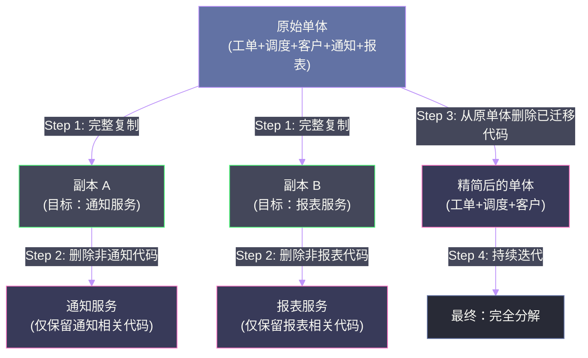
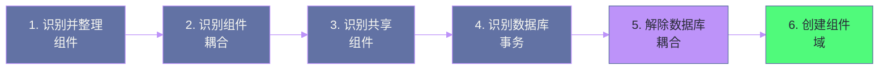

# 04 服务拆分的艺术：战术分叉与基于组件的分解模式

## 摘要

当决定把单体迁移到微服务时，架构师面临的第一个技术难题是：如何"切割"？直觉告诉我们，应该仔细识别代码中的接缝，沿着接缝精确切割。但现实中，多年积累的单体代码往往高度交织，根本找不到清晰的接缝。本文深入分析《Software Architecture: The Hard Parts》第 4-5 章介绍的两种截然不同的拆分战术：**基于组件的分解（Component-Based Decomposition）** 和 **战术分叉（Tactical Forking）**，揭示它们各自的适用场景、操作步骤和风险控制策略，帮助架构师在面对真实代码库时做出正确的战术选择。

---

## 第 1 章 两种拆分哲学的分歧

### 1.1 精确外科手术 vs. 克隆后裁剪

在讨论具体战术之前，先建立两种不同的拆分哲学：

**哲学一：精确外科手术（Surgical Extraction）**
仔细分析单体中各功能的依赖关系，找到代码中天然的"接缝（Seam）"，沿着接缝精确切割，把目标功能安全地提取为独立服务，同时保持单体其余部分的完整性和正确性。

这是大多数架构文章推荐的方法，听起来既理性又优雅。但它有一个严重的前提假设：**代码库中存在清晰可识别的接缝**。

现实情况往往相反。经历了多年野蛮生长的单体，往往像一碗被搅烂的面条——到处是横跨多个功能域的大函数、被全局引用的共享状态、违反任何模块边界的直接数据库访问。在这样的代码库里，"找接缝"本身就是一项耗时数月的工程。

**哲学二：克隆后裁剪（Clone and Trim）**
不试图识别接缝，而是直接把整个单体复制一份，然后删除新副本中不属于目标服务的所有代码，直到只剩下目标功能。这就是书中的**战术分叉（Tactical Forking）**。

这个想法看起来很粗暴，但它有一个关键优势：**你始终在处理一个可以运行的系统**，而不是一个"正在被拆解、暂时无法运行"的半成品。

### 1.2 为什么要有两种战术

这两种哲学各有适用场景，不能简单地说哪种更好：

| 维度 | 基于组件的分解 | 战术分叉 |
|------|-------------|---------|
| 适用代码质量 | 代码有一定的结构性 | 代码质量差、高度交织 |
| 迁移风险 | 较低（精确提取） | 中等（全量复制） |
| 初期成本 | 较高（需要代码分析）| 较低（直接复制）|
| 长期维护 | 较好 | 较差（多份代码库长期共存）|
| 数据分离 | 需要额外处理 | 需要额外处理 |
| 适合团队能力 | 有经验的重构团队 | 任意团队均可操作 |

---

## 第 2 章 基于组件的分解

### 2.1 什么是"组件"：拆分的基本单位

在这个语境下，**组件（Component）** 不是指 Vue/React 的 UI 组件，而是指：**在单体代码库中，一组功能上内聚、彼此强关联的类的集合，它们共同实现一个明确的业务能力**。

组件是比"类"大、比"服务"小的粒度单位。它是拆分的基本单位——你不是把一个个类提取成服务，而是把一组组相关的类（即组件）提取成服务。

识别组件的标准：
- 功能完整性：该组件能够描述一个可以用一句话表达的业务能力（如"处理工单生命周期"）
- 内部内聚：组件内部的类彼此高度相关（高 LCOM4）
- 外部接口清晰：组件对外的入口点（API、事件）数量有限且定义清晰

### 2.2 基于组件分解的六步操作流程

书中给出了一个严谨的六步操作流程，这是面对结构相对清晰的单体代码库时最推荐的方法：

**步骤一：识别并量化组件**

使用静态分析工具（如 Structure101、SonarQube）分析代码库，识别出所有组件（通常对应包/命名空间的顶层划分）。对每个组件进行量化：代码行数、类数量、对外依赖数（Ce）、被依赖数（Ca）。

以 Sysops Squad 为例，识别出的初始组件清单：

| 组件 | 代码行数 | 类数 | Ca | Ce |
|------|---------|------|-----|-----|
| ticket.core | 12,000 | 45 | 8 | 12 |
| scheduling.assignment | 8,500 | 32 | 5 | 15 |
| customer.profile | 6,200 | 28 | 6 | 8 |
| reporting.analytics | 15,000 | 52 | 2 | 20 |
| notification.sender | 4,800 | 18 | 7 | 6 |
| knowledge.base | 7,300 | 31 | 3 | 10 |
| shared.utils | 9,100 | 65 | 45 | 5 |

**步骤二：整合公共域组件**

识别被多个组件依赖的"公共域组件"（通常是共享工具类、基础设施组件）。这类组件不会成为独立服务，而是需要决定：
- 将其拆解，分别归属到依赖它的各个服务中（推荐）
- 提取为独立的内部类库（Shared Library）（次选，但引入静态耦合）
- 提取为共享基础设施服务（最后手段，引入动态耦合）

`shared.utils` 的 Ca = 45，是典型的高耦合公共组件。需要分析它包含哪些功能，分类归属给相应的服务。

**步骤三：扁平化组件**

很多单体代码库存在过深的嵌套层次（如 `ticket.core.processing.validation.rules.VIPCustomerRule`），扁平化是把这些深层嵌套的子组件"提升"到顶层，使每个组件都在同一个层次上可见，便于后续的依赖分析。

**步骤四：分析组件依赖关系**

对所有组件两两分析依赖关系：
- 哪些组件存在双向依赖（循环依赖）？循环依赖是拆分的最大障碍，必须先解决
- 哪些组件只有单向依赖（A → B）？单向依赖是安全的，可以先拆 A，因为 B 是 A 的依赖
- 哪些组件完全没有依赖关系？这些是最容易独立出来的服务候选

拆分 Sysops Squad 的依赖分析揭示了一个关键问题：`ticket.core` 和 `scheduling.assignment` 之间存在**双向依赖**——工单创建时需要调用调度分配，调度分配时需要回写工单状态。这个循环依赖必须通过引入事件（工单创建事件 → 触发调度，调度完成事件 → 更新工单）来打破。

**步骤五：确定组件域**

将相关的组件分组到"组件域（Component Domain）"中——组件域是未来独立服务的雏形。

分组原则：
- 功能上高度相关的组件归为同一个域
- 数据上高度共享的组件归为同一个域（共享数据意味着它们应该在同一个服务边界内）
- 变更频率相近的组件归为同一个域

Sysops Squad 的组件域规划：

```
工单域 (Ticket Domain)
  ├── ticket.core
  └── ticket.history

调度域 (Scheduling Domain)  
  ├── scheduling.assignment
  └── scheduling.expert

客户域 (Customer Domain)
  ├── customer.profile
  └── customer.billing

支撑域 (Support Domain)
  ├── notification.sender
  ├── knowledge.base
  └── reporting.analytics
```

**步骤六：创建域服务**

以组件域为边界，创建对应的独立服务：
- 工单服务（Ticket Service）
- 调度服务（Scheduling Service）
- 客户服务（Customer Service）
- 通知服务（Notification Service）
- 知识库服务（Knowledge Service）
- 报表服务（Reporting Service）

### 2.3 循环依赖：最难啃的硬骨头

循环依赖是基于组件分解的最大挑战，必须在拆分之前解决。

**打破循环依赖的三种方法**：

**方法一：共同父组件提取**
如果 A 依赖 B、B 依赖 A，找出它们共同依赖的部分，提取为 C，然后 A 和 B 都依赖 C，A 和 B 之间不再直接依赖。

**方法二：事件驱动解耦**
把同步调用改为异步事件：A 不再直接调用 B，而是发布事件，B 订阅并处理事件后，通过另一个事件通知 A，打破直接的循环调用。代价是引入最终一致性。

**方法三：接口反转**
在 A 和 B 之间引入接口层，通过[[依赖倒置原则（DIP）]]使依赖方向单向化。

---

## 第 3 章 战术分叉

### 3.1 为什么战术分叉是合理的

"把整个单体复制一份"听起来非常不工程化，但它的合理性在于：

**风险的不对称性**。在一个高度交织的代码库中，"精确提取"某个功能的风险极高——你很容易遗漏某个隐式依赖，导致提取后的服务行为与原来不一致。这种不一致往往在 QA 测试时发现，修复它需要重新分析代码，耗费大量时间。

而"克隆后裁剪"的风险要低得多——你只是删除代码，而不是移动代码。删除操作本身不会引入新的依赖关系，你可以持续运行测试套件来验证保留的功能没有被破坏。

> [!note] 设计哲学
> 战术分叉体现了"宁可多一点冗余，也要保证每一步都是安全的"这一工程哲学。它牺牲了代码的 DRY 原则（因为多份代码库有重复），换来了迁移过程的可控性和安全性。

### 3.2 战术分叉的操作流程



**步骤一：克隆整个代码库**

将单体代码库完整复制，得到一个新的代码库（未来的目标服务）。不要做任何改动，保持克隆版本与原版本行为完全一致。

**步骤二：在克隆版本中删除不属于目标服务的代码**

这是核心步骤。在克隆版本中，删除所有不属于目标服务的功能代码：
- 工单逻辑 → 删除
- 调度逻辑 → 删除
- 客户管理逻辑 → 删除
- 报表逻辑 → 删除
- **通知逻辑 → 保留**

删除的策略：**先删叶子，再删父节点**。先删除那些不被任何其他代码依赖的类，逐步向内收缩，直到只剩下目标功能的代码。每次删除后运行测试套件，确保通知功能的测试仍然通过。

删除过程中遇到的挑战：
- 某些"共享工具类"被通知逻辑和非通知逻辑共同使用，需要判断是保留（如果工具类是通知功能所必需的）还是提取到独立类库
- 某些配置类包含了全系统的配置，需要拆分出仅与通知相关的配置子集

**步骤三：从原单体删除已迁移的代码**

新的通知服务验证通过后，从原始单体中删除通知相关的代码，让原单体"消瘦"一些。这一步不是在新服务上线的同时做，而是等新服务稳定运行一段时间（通常 1-2 周）后再做，以便在出现问题时能快速回滚。

**步骤四：更新原单体，改为调用通知服务**

原单体中原来直接执行通知逻辑的代码，改为调用通知服务的 API（或发布事件）。

**步骤五：对剩余的每个目标服务重复上述步骤**

### 3.3 战术分叉的已知风险与缓解措施

**风险一：代码同步问题**
在克隆版本被"清理完毕"并上线之前，原单体可能仍在持续开发，引入新的 bug 修复或功能变更。这些变更需要在克隆版本中同步应用，否则会引入不一致。

缓解措施：使用功能冻结窗口（在克隆期间暂停对该模块的新功能开发）或明确的变更同步流程（每次原单体的 bug 修复需要同步 cherry-pick 到所有活跃的克隆版本中）。

**风险二：数据分离的遗留问题**
战术分叉解决的是代码分离问题，但并不直接解决数据分离问题。新的通知服务仍然可能直接访问原数据库中的客户联系方式表。数据分离需要单独的专项工作（详见第五篇文章）。

**风险三：重复代码库的长期维护**
如果有多个服务都基于同一个单体克隆，并且清理进度很慢，就会出现多个"几乎一样但不完全一样"的代码库并行存在的局面，维护成本很高。

缓解措施：制定明确的克隆清理 deadline，在清理完成之前不允许在克隆版本中引入新功能（克隆版本只用于迁移，不用于新开发）。

---

## 第 4 章 两种战术的决策框架

### 4.1 代码质量诊断

在选择拆分战术之前，需要先对代码库的"健康度"做诊断：

**高结构性代码库**（接缝明显，组件边界清晰，LCOM 值正常，循环依赖少）：选择**基于组件的分解**，可以在不引入代码冗余的情况下精确拆分。

**低结构性代码库**（高度交织，共享状态泛滥，循环依赖严重，LCOM 值高）：选择**战术分叉**，用可控的方式逃离困境，后续再在新服务中重构提升代码质量。

### 4.2 团队能力与时间预算

基于组件的分解需要团队对代码库有深入的理解，并且愿意投入大量时间进行依赖分析和接缝识别。如果团队能力或时间预算不足，战术分叉是更务实的选择——它让工程师专注于删除代码（而非分析依赖），认知负担更低。

### 4.3 混合策略

在真实项目中，两种战术往往结合使用：对代码质量相对较好的核心业务模块（工单、调度），使用基于组件的分解做精确提取；对代码质量较差的边缘支撑模块（通知、报表），使用战术分叉快速分离。

---

## 第 5 章 总结

### 5.1 核心选择逻辑

本章的核心不是告诉你"哪种战术更好"，而是告诉你**如何根据代码库的实际状况做选择**：

- 代码库结构清晰 + 团队有重构经验 + 时间充裕 → **基于组件的分解**
- 代码库高度交织 + 迁移时间紧迫 + 团队经验有限 → **战术分叉**
- 核心业务模块 + 边缘支撑模块混合 → **混合策略**

### 5.2 与下一章的衔接

代码分离只是拆分的一半。另一半，也是往往更难的一半，是**数据分离**。代码可以用以上两种战术分离，但数据库中的数据是高度共享的，服务无法共享数据库而真正独立。下一篇文章将深入分析运营数据的分离策略，以及每种分离方式背后的权衡。

---

## 延伸阅读

- [[Working Effectively with Legacy Code]]：Michael Feathers 著，专注于在遗留代码中识别接缝的实战技巧
- [[Refactoring Databases]]：Scott Ambler 著，数据库重构的实用指南
- [[Monolith to Microservices]]：Sam Newman 著，第 3-4 章详细讲解了拆分模式和战术

---

## 第 4 章 基于组件分解的六步法详解

### 4.1 完整步骤概览

书中将基于组件的分解（Component-Based Decomposition）定义为六个有序步骤，每个步骤都有明确的输入、输出和工具。



这六步不只是技术操作，每一步都对应了一类风险识别——如果某一步发现了严重的耦合或共享依赖，可能需要回到前面的步骤调整边界划分。

### 4.2 步骤一：识别并整理组件

**目标**：列出单体应用中所有已识别的组件（包名、模块名），为每个组件标注其职责和所属领域。

**Sysops Squad 实践**：

| 组件名 | 所属包 | 职责描述 | 初步领域归属 |
|-------|-------|---------|-----------|
| TicketManagement | `com.sysops.ticket` | 工单 CRUD、状态流转 | 工单域 |
| ExpertAssignment | `com.sysops.assignment` | 专家选择与分配逻辑 | 专家域 |
| CustomerProfile | `com.sysops.customer` | 客户基本信息管理 | 客户域 |
| BillingProcessor | `com.sysops.billing` | 账单生成与支付处理 | 账单域 |
| NotificationService | `com.sysops.notification` | 短信/邮件通知发送 | 通知域 |
| KnowledgeBase | `com.sysops.kb` | 问题库和解决方案管理 | 知识域 |
| ReportingDashboard | `com.sysops.reporting` | 数据统计与报表 | 报表域 |

**关键注意**：有些组件在这个阶段会被命名为"Utils"、"Common"、"Helper"等模糊名称，这些是高度共享组件的信号，需要在步骤三重点分析。

### 4.3 步骤二：识别组件耦合

**目标**：绘制组件间的依赖图，识别高耦合的组件对。

耦合度量工具：
- **传入耦合（Afferent Coupling，Ca）**：依赖该组件的组件数量
- **传出耦合（Efferent Coupling，Ce）**：该组件依赖的组件数量
- **不稳定性（I = Ce / (Ca + Ce)）**：越接近 1 越不稳定（依赖很多别人，自己被依赖少）

**Sysops Squad 依赖分析结果**：

| 组件 | Ca（传入）| Ce（传出）| 不稳定性 I |
|------|---------|---------|----------|
| TicketManagement | 5 | 3 | 0.38（相对稳定，被很多依赖）|
| ExpertAssignment | 2 | 4 | 0.67（较不稳定）|
| CustomerProfile | 4 | 1 | 0.20（非常稳定，是被依赖的核心）|
| BillingProcessor | 1 | 3 | 0.75（不稳定）|
| NotificationService | 3 | 5 | 0.63（较不稳定）|

**识别出的问题**：`TicketManagement` 被 5 个组件依赖，是系统的核心耦合点，任何改动都有广泛影响。在拆分时，需要先保证 TicketManagement 边界的清晰，再拆分其他组件。

### 4.4 步骤三：识别共享组件

**目标**：找出被多个组件共同使用的代码，决定这些代码在微服务化后如何处理。

**三种处理策略**：

1. **真正的横切关注点** → 共享库（如日志工具、日期格式化工具）
2. **有领域逻辑的共享代码** → 这通常意味着某些业务逻辑的归属没有明确，需要让它属于某个具体的服务，其他服务通过 API 调用
3. **数据共享**（多个组件写同一张表）→ 这是最难处理的，进入步骤四、五深入分析

**Sysops Squad 中的典型共享代码问题**：

```
// 问题代码：CustomerValidator 被多个组件使用
// 它既在 CustomerProfile 组件中，又被 BillingProcessor 和 TicketManagement 直接引用

public class CustomerValidator {
    public boolean isValidCustomer(String customerId) {
        // 查询数据库，验证客户是否存在且未被禁用
        return customerRepository.findById(customerId)
            .map(c -> !c.isDisabled())
            .orElse(false);
    }
}
```

**处理方案**：`CustomerValidator` 中含有领域逻辑，应该归属于 CustomerProfile 服务，BillingProcessor 和 TicketManagement 不应该直接调用验证逻辑，而应该通过 CustomerProfile 服务的 API 进行验证。这需要在拆分后引入一次跨服务调用，但消除了逻辑重复。

### 4.5 步骤四和五：数据库耦合分析与解除

**目标**：识别多个组件读写同一张数据库表的情况（表耦合），以及跨组件的数据库事务（事务耦合）。

表耦合比代码耦合更难处理，因为它隐藏在 DAO 层，不通过代码搜索难以发现。工具：
- 在数据库层启用 Statement Log，分析每张表被哪些组件的代码写入
- 审查 DAL（Data Access Layer）的依赖关系

**Sysops Squad 发现的表耦合**：

```
tickets 表：被 TicketManagement(读写) 和 Reporting(只读) 两个组件使用
experts 表：被 ExpertAssignment(读写) 和 TicketManagement(只读) 两个组件使用
customers 表：被 CustomerProfile(读写), BillingProcessor(只读), TicketManagement(只读) 三个组件使用
```

**解除策略**：
- Reporting（只读）→ 接受数据延迟，通过事件订阅维护专用的报表数据库（CQRS 读模型）
- TicketManagement 读 experts 表 → 通过 ExpertAssignment 服务 API 获取专家信息，或维护专家信息的只读副本
- BillingProcessor 和 TicketManagement 读 customers 表 → 同上，通过 CustomerProfile API 获取

### 4.6 步骤六：创建组件域

**目标**：将功能相关的组件合并为"组件域"，作为潜在的服务边界。

"组件域"不一定是一个微服务，它可能是：
- 一个微服务（独立部署）
- 一个子域模块（在模块化单体中独立部署）
- 暂时保持在单体中但有清晰边界

**Sysops Squad 的最终组件域划分**：

| 组件域（未来服务）| 包含组件 | 优先级（先拆分哪个）|
|-----------------|---------|----------------|
| 通知服务 | NotificationService | 高（独立性强，无复杂依赖）|
| 报表服务 | ReportingDashboard | 高（只读，可安全分离）|
| 账单服务 | BillingProcessor | 中（需先解除 customers 表耦合）|
| 客户服务 | CustomerProfile | 中（是其他服务的依赖，要稳定）|
| 专家服务 | ExpertAssignment | 低（和工单强耦合，需要细化边界）|
| 工单服务 | TicketManagement | 低（耦合最多，最后拆分）|

---

## 第 5 章 战术分叉与基于组件分解的对比

### 5.1 核心差异

| 维度 | 战术分叉 | 基于组件分解 |
|------|---------|-----------|
| 适用场景 | 代码质量差，难以识别组件边界 | 代码结构相对清晰，能识别出组件 |
| 起点 | 整个代码库的副本 | 当前代码库（不复制）|
| 风险 | 需要同时维护两套代码 | 过渡期复杂，可能有功能重叠 |
| 速度 | 初期快（因为先不管旧代码）| 初期慢（需要仔细分析依赖）|
| 技术债务 | 最终需要处理旧代码的下线 | 边迁移边偿还技术债务 |

### 5.2 选择框架

```
代码质量如何？
├── 极差（无法理解和扩展）→ 战术分叉
│   ├── 时间充裕？→ 完整重写
│   └── 时间紧张？→ 功能分叉（仅复制需要新功能的部分）
└── 尚可（能理解大致结构）→ 基于组件分解
    ├── 组件边界清晰？→ 直接按六步法执行
    └── 组件边界模糊？→ 先重构清晰边界，再按六步法执行
```

> [!note] 常见误区
> 很多团队误以为战术分叉是"懒人方案"，总想从基于组件分解开始。但当代码库严重腐化时，强行在腐化代码上做组件分解，只会浪费大量时间分析无法分析的依赖关系。此时战术分叉反而是更务实的选择——接受旧系统继续运行，在新服务中用正确的方式实现，让旧系统自然退休。

---

## 第 6 章 反模式与踩坑指南

### 6.1 一次性完成所有拆分（大爆炸迁移）

最常见的失败模式：团队制定了宏大的微服务迁移计划，试图在 6 个月内完成所有服务的拆分，同时还要交付业务需求。结果：迁移计划不断延期，业务需求受影响，最终回滚到单体。

**正确做法**：以最小可部署单元为目标，先拆分独立性强、风险低的服务（通知、报表），积累经验和基础设施（服务发现、API 网关、分布式追踪），再逐步拆分核心业务服务。

### 6.2 先拆分，后解耦

另一个常见错误：直接按功能拆分服务，但这些服务之间仍然有强耦合（共享数据库、同步调用链），拆分后系统变得更加脆弱（分布式单体）。

**正确做法**：先在单体内部解除耦合（模块化单体），确认服务边界清晰后，再物理提取为独立服务。

### 6.3 过细的粒度

受"微服务"名字的影响，一些团队走向另一个极端：将每个功能都独立为一个服务，最终拥有数十个只有几百行代码的服务。这些服务之间的通信开销成为系统的主要性能瓶颈，运维成本大幅增加。

**正确做法**：见文章 06 关于服务粒度的讨论。服务大小应该以"单一业务能力"为单位，而不是以"代码行数"为单位。

---
*本文是「Software Architecture: The Hard Parts 专栏」系列第 4 篇。← [[03 架构模块化：从逻辑分层到物理服务边界的演进]] | [[05 数据拆分之困：运营数据的分离策略与四大权衡]] →*

---

## 附录：拆分进度检查清单

在每个服务完成拆分时，用以下清单验证：

**边界清晰性**
- [ ] 该服务有明确的单一业务能力定义
- [ ] 该服务的 API（对外接口）已定义并稳定
- [ ] 没有其他服务直接读写该服务的数据库

**独立部署能力**
- [ ] 该服务可以独立构建、测试和部署
- [ ] 该服务的部署不需要协调其他服务同时发布
- [ ] 有独立的 CI/CD 流水线

**运行时隔离**
- [ ] 该服务有自己的配置（不依赖单体的配置文件）
- [ ] 该服务有自己的监控和告警
- [ ] 该服务的故障不会直接导致其他服务失败（有适当的熔断/降级）

如果清单中有超过 3 项未完成，说明这个服务的拆分可能是"假拆分"（代码分离了，但实质上仍然是高度耦合的分布式单体）。

> [!tip] 从最简单的服务开始
> 第一个拆分出去的服务，一定要选择最简单、最独立的那个（通常是通知、文件处理、报表等辅助性服务）。这个服务帮助团队建立微服务的基础设施（Docker化、服务注册、API 网关），积累经验，为后续拆分更复杂的核心业务服务做好准备。
