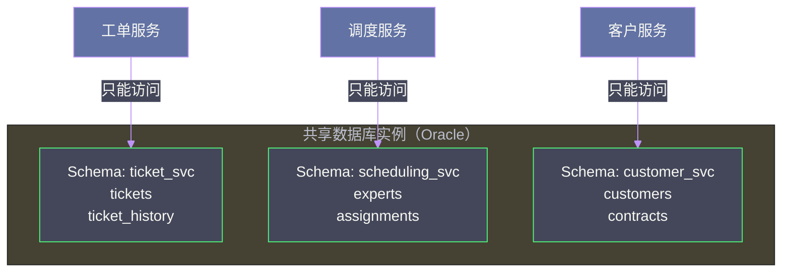
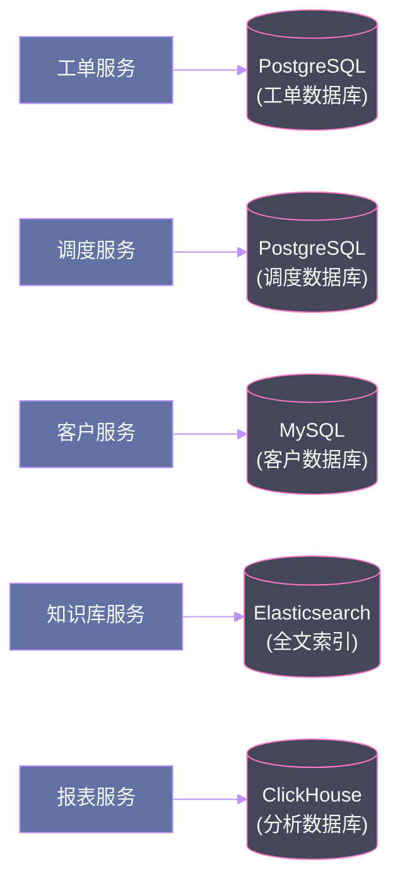

# 05 数据拆分之困：运营数据的分离策略与四大权衡

## 摘要

如果说代码拆分是微服务迁移的"皮肉手术"，那么数据拆分才是真正的"心脏手术"。在单体系统中，一个共享数据库是所有业务逻辑一致性的保障；而在微服务系统中，每个服务拥有独立数据是独立部署和自治的前提。这两个目标之间存在深刻的矛盾。本文系统分析《Software Architecture: The Hard Parts》第 6 章的核心内容：运营数据的三种分离程度（共享表、独立 Schema、独立数据库）以及数据分离带来的四大根本权衡——数据一致性、数据完整性、可扩展性、可维护性——帮助架构师理性地选择适合自己业务上下文的数据分离策略。

---

## 第 1 章 为什么数据分离是最难的部分

### 1.1 数据的粘性：比代码更难分开

代码是无状态的文本，理论上可以任意重组。数据是有状态的、有关联的、有历史的。你可以把工单处理逻辑的代码"剪切"到新服务中，但你无法把数据库中的工单记录"剪切"到新数据库中——那些数据是活的，有正在进行中的业务操作依赖它们，有外键约束保持它们的完整性，有事务边界保护它们的一致性。

这就是数据分离比代码分离难得多的根本原因：**代码可以在停机状态下迁移，数据必须在不停机、不丢失、不破坏业务一致性的前提下迁移**。

### 1.2 单共享数据库的核心问题

Sysops Squad 的所有服务共享一个 Oracle 数据库，这带来了四类问题：

**问题一：变更协调成本**
任何 Schema 变更（加字段、改字段类型、删字段）都需要协调所有访问该表的服务同步升级。在微服务体系中，这意味着必须同时发布 N 个服务，破坏了独立部署的价值。

**问题二：性能相互干扰**
报表服务的复杂分析 SQL 与工单服务的 OLTP 操作共享同一个数据库实例，前者的大查询会消耗大量 I/O 和 CPU，直接影响后者的响应延迟。

**问题三：技术栈锁定**
不同的数据访问模式适合不同的数据存储技术：全文搜索适合 [[Elasticsearch]]、知识图谱适合图数据库、时序指标适合 [[InfluxDB]]。共享一个关系型数据库，意味着所有这些场景都要用不合适的技术来解决，性能和开发效率双双受损。

**问题四：边界泄漏**
当服务 A 直接访问服务 B 的数据库表时，服务 A 事实上依赖了服务 B 的内部实现细节。一旦服务 B 出于自身业务需要变更了表结构，服务 A 就会崩溃——而服务 B 的开发者可能完全不知道服务 A 的存在。

---

## 第 2 章 数据分离的三个层次

### 2.1 层次一：共享数据库，独立 Schema（最小分离）

这是数据分离的最小化步骤：所有服务仍然连接同一个数据库实例，但每个服务的数据表被移入独立的 Schema（数据库命名空间），并通过访问控制确保服务只能访问自己 Schema 中的表。



**收益**：
- 消除了跨服务的直接表访问，建立了逻辑边界
- 每个服务可以独立变更自己 Schema 中的表，不影响其他服务（前提是没有跨 Schema 的外键约束）
- 迁移成本低，不需要搬移数据，只需要重组 Schema 归属

**局限**：
- 仍然共享数据库实例，高负载查询仍会相互影响
- 仍然共享数据库的可用性——数据库宕机，所有服务同时不可用
- 无法为不同服务选择不同的数据库技术

适合场景：数据分离的过渡期，或者业务规模不大、不同业务间的负载差异不显著。

### 2.2 层次二：共享数据库，独立连接池（中等分离）

在独立 Schema 的基础上，为每个服务配置独立的数据库用户和连接池，通过连接池的大小配置实现资源隔离。

这种方式在 Schema 隔离的基础上，增加了一定的资源隔离：报表服务的复杂查询会耗尽自己的连接池，但不会影响工单服务的连接可用性。

**局限**：这只是连接层面的隔离，底层的 I/O、CPU、内存仍然共享。在数据库整体负载高时，仍然会相互影响。

### 2.3 层次三：独立数据库（完全分离）

每个服务拥有独立的数据库实例（或独立的数据库服务器），彼此完全隔离。



**核心收益**：
- 完全的故障隔离：某个数据库宕机，只影响该数据库对应的服务
- 完全的性能隔离：报表服务的高负载查询不影响工单服务的响应时间
- 技术栈自由：每个服务可以选择最适合自己数据访问模式的数据库技术
- 独立扩展：可以针对数据量最大的服务（如知识库）单独扩容数据库，而不是整体扩容

**核心代价**：
- **跨服务查询变得困难**（详见第三章）
- **跨服务事务需要分布式事务解决方案**（详见第八章）
- **运维复杂度增加**：需要管理多个数据库实例的备份、监控、升级

---

## 第 3 章 数据分离的四大权衡

### 3.1 权衡一：数据一致性

这是数据分离最核心的代价。在单体+共享数据库的架构中，可以用本地 ACID 事务保证跨表操作的强一致性：

```sql
BEGIN TRANSACTION;
  INSERT INTO tickets (id, status, ...) VALUES (...);
  INSERT INTO assignments (ticket_id, expert_id, ...) VALUES (...);
  UPDATE experts SET current_workload = current_workload + 1 WHERE id = ?;
COMMIT;
```

这三个操作要么全部成功，要么全部回滚，不存在中间状态。

而在独立数据库的微服务架构中，这三个操作分别在三个不同的数据库中进行，本地事务无能为力。如果工单创建成功（写入工单数据库），但专家工作量更新失败（专家数据库此时宕机），系统就会处于不一致状态——工单已分配，但专家的工作量没有更新，导致后续的调度计算错误。

解决方案的代价：
- **分布式事务（2PC）**：强一致性，但引入了高同步耦合，性能差，对参与者可用性要求高
- **Saga 模式**：最终一致性，性能好，但需要设计补偿事务（Cancel Action），增加了业务复杂度
- **事件溯源（Event Sourcing）**：最终一致性，可以重放事件恢复状态，但增加了系统复杂度

没有免费的午餐。数据分离意味着你必须接受某种程度的一致性降级，或者承担额外的实现复杂度。

> [!warning] 生产避坑
> 最常见的错误是在数据已经分离的情况下，仍然用"同步等待所有服务返回"的方式试图模拟强一致性。这不仅无法保证真正的原子性（中途某个服务超时时的状态是模糊的），还会大幅降低系统的可用性，是分布式系统设计中最典型的反模式之一。

### 3.2 权衡二：跨服务数据查询

在单体+共享数据库中，一个 SQL JOIN 就能跨越多个业务域获取数据：

```sql
SELECT t.id, t.status, e.name, e.phone, c.company_name
FROM tickets t
JOIN assignments a ON a.ticket_id = t.id
JOIN experts e ON e.id = a.expert_id
JOIN customers c ON c.id = t.customer_id
WHERE t.status = 'in_progress';
```

在独立数据库的微服务中，这个查询变成了：
1. 调用工单服务，获取所有进行中的工单列表
2. 对每个工单，调用分配服务获取专家 ID
3. 对每个专家 ID，调用专家服务获取专家姓名和电话
4. 对每个工单，调用客户服务获取客户公司名称

这个过程可能产生大量的"N+1 查询"问题（100 个工单 = 100 次调用专家服务 + 100 次调用客户服务），延迟从原来的几十毫秒飙升到几秒甚至超时。

解决跨服务查询问题，有五种主要模式（详见第九篇文章），每种都有各自的一致性和性能权衡。这里先建立认知：**数据分离必然带来查询复杂性的提升，需要在设计阶段提前规划应对策略**，而不是事后发现性能问题再打补丁。

### 3.3 权衡三：数据完整性约束

在关系型数据库中，外键约束是保证数据引用完整性的重要机制：
- `assignments.ticket_id` 外键引用 `tickets.id`，保证每个分配记录都有对应的工单
- `assignments.expert_id` 外键引用 `experts.id`，保证每个分配都对应一个有效的专家

当工单和专家分别在不同数据库中时，跨数据库的外键约束是不可能的。这意味着：
- 删除工单时，系统无法自动检查并级联删除关联的分配记录
- 更新工单 ID 时，系统无法自动级联更新分配记录中的 ticket_id
- 如果出现 bug 写入了一个不存在的 expert_id 到 assignments 中，数据库不会报错

这些完整性保障的职责从数据库层落回到了应用层。应用层必须自行维护这些约束：在删除工单前，先检查并处理关联的分配记录；在写入分配前，验证 expert_id 的有效性。

应用层约束与数据库约束的核心区别：数据库约束是事务性的（要么约束检查通过后提交，要么整体回滚），应用层约束不是——先删工单的代码成功了，再删分配的代码失败了，数据就处于不一致状态。这个问题最终还是回到了一致性权衡的核心。

### 3.4 权衡四：运维复杂度

数据分离的运维成本不可忽视：

| 运维任务 | 单数据库 | 独立数据库（6 个服务）|
|---------|---------|-------------------|
| 备份配置 | 1 套 | 6 套 |
| 监控告警 | 1 套 | 6 套 |
| 版本升级 | 1 次 | 6 次（可能涉及 6 种不同的数据库技术）|
| Schema 迁移管理 | 1 套工具 | 6 套工具 |
| 连接池管理 | 1 个配置 | 至少 6 个配置 |
| 容量规划 | 1 个维度 | 6 个独立维度 |

这些运维成本是真实的，不能假装它们不存在。在评估是否要做数据分离时，必须考虑团队是否有足够的 SRE 能力来承接这些增量运维工作。

---

## 第 4 章 数据分离的实操决策框架

### 4.1 分阶段的数据分离策略

数据分离不必一步到位。书中建议采用**分阶段策略**，根据业务紧迫性和工程成本逐步推进：

**阶段一：Schema 分离（1-3 个月）**
低风险，高收益。将所有服务的数据表按服务边界重新归入独立 Schema，设置访问控制。建立数据所有权的物理边界，消除跨服务的直接表访问。

**阶段二：独立数据库（3-12 个月）**
对耦合最低、访问模式差异最大的服务，率先完成独立数据库迁移：
- 通知服务（数据读写模式独立，与核心业务耦合最低）
- 报表服务（分析型访问模式，应迁移到 OLAP 数据库）
- 知识库服务（全文搜索需求，应迁移到 Elasticsearch）

**阶段三：核心服务分离（6-18 个月）**
对工单、调度、客户等高耦合的核心服务，做数据分离前必须先解决跨服务事务和查询的设计方案，否则会出现严重的业务功能回归。

### 4.2 数据所有权分配原则

数据所有权分配的核心原则：**谁最了解这份数据的业务语义，谁就应该拥有它**。

更实用的判断方式：**谁是这份数据的"写入者"，谁就是拥有者**。

| 数据 | 写入者（拥有者） | 只读访问者 |
|------|--------------|----------|
| 工单生命周期 | 工单服务 | 报表服务（只读统计） |
| 专家信息 | HR/专家管理服务 | 调度服务（只读查询可用专家） |
| 工单分配记录 | 调度服务 | 工单服务（只读查看分配状态）|
| 客户联系方式 | 客户服务 | 通知服务（只读获取发送目标）|

> [!info] 核心概念
> **数据所有权（Data Ownership）** 不是一个可选项，而是微服务架构的必要前提。没有明确的数据所有权，就没有真正的服务自治，就没有独立的 Schema 演化，就无法实现独立部署。数据所有权的讨论，应该在服务边界讨论的同时进行，而不是在技术实现阶段才去考虑。

---

## 第 5 章 总结

### 5.1 数据分离的核心结论

数据分离是微服务迁移中最复杂、风险最高的部分，核心结论是：

1. **没有完美的数据分离方案**，每种方案都在一致性、查询性能、数据完整性、运维复杂度之间做出不同的取舍
2. **分阶段推进**比大爆炸式一次性迁移更安全
3. **数据所有权必须先于技术实现确定**，模糊的所有权会导致所有后续工作都建立在不稳固的基础上

### 5.2 与下一章的衔接

解决了"如何拆分代码"和"如何拆分数据"之后，还剩下一个基础问题没有回答：**服务到底应该拆多细？** 太细会带来过高的分布式协调成本，太粗会失去微服务的独立性收益。这个问题，正是第六篇文章的核心。

---

## 延伸阅读

- [[Designing Data-Intensive Applications]] 第 5 章：复制与一致性的深度分析
- [[Database Refactoring Techniques]]：数据库重构的具体技术手段
- [[Event Sourcing Pattern]]：通过事件溯源实现跨服务数据一致性

---

## 第 4 章 数据分离的四大权衡深度分析

### 4.1 权衡一：数据完整性（Data Integrity）

关系型数据库的外键约束（Foreign Key Constraint）在跨服务数据分离后消失了。`tickets.customer_id` 不再有数据库层面的外键引用 `customers.id`，数据库无法阻止你插入一个不存在的 customer_id。

**如何在应用层保证数据完整性？**

**方案 A：创建前 API 验证**

```java
// 工单创建时，先验证客户存在
public TicketResponse createTicket(TicketRequest request) {
    // 同步调用 CustomerService 验证
    CustomerResponse customer = customerService.getCustomer(request.getCustomerId());
    if (customer == null || customer.isDisabled()) {
        throw new InvalidCustomerException("Customer not found or disabled");
    }
    return ticketRepository.save(toTicket(request));
}
```

代价：引入了运行时服务耦合——CustomerService 不可用时，工单无法创建。

**方案 B：事后一致性检查**

```sql
-- 每日运行的数据一致性检查
SELECT t.id, t.customer_id, 'ORPHAN_TICKET' as issue
FROM tickets t
WHERE NOT EXISTS (
    SELECT 1 FROM customer_shadow_copy c 
    WHERE c.id = t.customer_id
);
```

代价：允许短暂的数据不一致状态，依赖事后检测和修复机制。

大多数系统的实践：关键路径（创建操作）用方案 A，非关键路径（历史记录关联）用方案 B。

### 4.2 权衡二：数据一致性（Data Consistency）

当数据分散在多个服务时，不同服务对同一实体的视图可能短暂不一致（最终一致性）。

**典型场景**：客户修改了电话号码（CustomerService 更新），但此时工单服务正在查询该客户的联系信息（工单服务的只读副本还是旧数据）。

**一致性窗口的量化**：

| 同步机制 | 典型延迟 | 适用场景 |
|---------|---------|---------|
| 同步 API 调用（每次读取实时查询）| 0ms（实时）| 对数据时效性要求极高，如支付确认 |
| 事件驱动同步（Kafka 消费延迟）| 10ms - 2s | 大多数业务场景 |
| 定期批量同步（ETL 流水线）| 1min - 1h | 报表、分析类场景 |

**Sysops Squad 的选择**：工单服务对客户数据的需求是"显示客户姓名和联系方式"，对实时性要求不高。因此使用事件驱动同步（延迟 < 2s 可接受），而非每次工单查询都实时调用 CustomerService。

### 4.3 权衡三：数据可访问性（Data Accessibility）

在单体数据库中，任何代码都可以直接 JOIN 任何表。数据分离后，"可访问性"需要通过 API 契约来保障，而 API 契约需要明确版本管理和向后兼容。

**数据暴露的粒度控制**：

不是所有字段都应该通过 API 对外暴露。CustomerService 的 `customers` 表可能有几十个字段，但工单服务只需要 `name` 和 `phone`。过度暴露数据不仅增加耦合，也增加了安全风险。

```protobuf
// CustomerService 为 TicketService 提供的专用视图（不是完整的 Customer 模型）
message CustomerSummary {
    string customer_id = 1;
    string display_name = 2;
    string contact_phone = 3;
    // 注意：没有暴露 credit_card_info, internal_rating 等敏感/内部字段
}
```

**API 版本兼容性**：当 CustomerService 需要修改 API 结构时，必须保持向后兼容（至少在一个过渡期内）。这种"接口合约"的维护成本在大规模微服务中不可忽视。

### 4.4 权衡四：数据可扩展性（Data Scalability）

数据分离的最大优势之一是可以为不同的数据域选择最合适的存储技术（多语言持久化）和独立的扩展策略。

**Sysops Squad 的多语言持久化实践**：

| 服务 | 数据特征 | 选择的存储 | 扩展策略 |
|------|---------|---------|---------|
| 工单服务 | 结构化，需要复杂查询 | PostgreSQL | 读写分离 + 按时间分区 |
| 通知服务 | 高写入量，日志型 | Cassandra | 水平分片 |
| 知识库服务 | 文档型，全文搜索 | Elasticsearch | 分片 + 副本 |
| 报表服务 | 大量聚合分析 | ClickHouse | MPP 查询 |

在单体数据库架构中，你不可能为不同的数据特征选择不同的存储引擎。数据分离带来的存储选择自由度，是其最被低估的长期价值。

---

## 第 5 章 三级数据分离策略的迁移路径

从单体数据库迁移到完全分离的多服务数据库，通常需要经历三个阶段：

### 5.1 阶段一：表级分离（最小代价，最快执行）

先在同一个数据库实例中，通过 Schema 隔离和权限控制，模拟数据所有权：

```sql
-- 创建独立的 Schema
CREATE SCHEMA ticket_schema;
CREATE SCHEMA customer_schema;
CREATE SCHEMA expert_schema;

-- 将表迁移到对应 Schema
ALTER TABLE tickets SET SCHEMA ticket_schema;
ALTER TABLE customers SET SCHEMA customer_schema;

-- 限制应用用户只能访问对应 Schema
CREATE USER ticket_service WITH PASSWORD '...';
GRANT ALL ON SCHEMA ticket_schema TO ticket_service;
REVOKE ALL ON SCHEMA customer_schema FROM ticket_service;
```

这一阶段的目标是发现"哪些代码路径违反了数据所有权边界"（SQL 报错即越界的早期预警）。

### 5.2 阶段二：数据库实例分离

在代码层已经正确实施了数据所有权后，将不同 Schema 迁移到独立的数据库实例。

**迁移策略**：双写期 + 流量切换

```
阶段 2a：双写（写入旧库 + 新库，读取旧库）
阶段 2b：验证（对比新旧库数据一致性）
阶段 2c：切换读取到新库
阶段 2d：停止写入旧库，迁移完成
```

双写期会引入额外的延迟和复杂性，通常需要 2-4 周来完成一个服务的数据库迁移。

### 5.3 阶段三：存储技术选型（可选）

在数据库实例分离完成、服务独立运行稳定后，可以根据各服务的数据特征，考虑更换底层存储技术（如将报表服务从 PostgreSQL 迁移到 ClickHouse）。

这个阶段是可选的，应该以"是否有明确的性能或成本瓶颈"为依据，而不是为了追求技术多样性而迁移。

> [!warning] 数据迁移的不可逆性
> 数据迁移（尤其是实例分离）比代码重构更难回滚。一旦进入数据库实例分离阶段，就需要维护两套数据库的同步，回滚的代价极高。因此，务必在阶段一（表级分离）验证充分后，再进入阶段二。不要仅凭代码测试通过就直接进行数据库实例分离。

---

## 第 6 章 Sysops Squad 数据域映射

经过六步分析，Sysops Squad 最终将数据划分为 6 个独立的数据域：

| 数据域 | 核心表 | 数据所有者 | 读取需求方 |
|-------|-------|---------|---------|
| 工单域 | tickets, ticket_events | 工单服务 | 报表服务、专家服务 |
| 客户域 | customers, customer_contacts | 客户服务 | 工单服务、账单服务 |
| 专家域 | experts, expert_skills | 专家服务 | 工单服务、分配服务 |
| 账单域 | billing_records, payments | 账单服务 | 报表服务 |
| 知识域 | kb_articles, solutions | 知识服务 | 工单服务（查找解决方案）|
| 报表域 | report_snapshots（CQRS 读模型）| 报表服务 | 无（只对外提供查询 API）|

每个数据域有明确的单一 Owner，其他服务通过 Owner 服务的 API 读取数据，或通过事件订阅维护只读副本。这种清晰的归属关系，为后续的微服务拆分和独立部署提供了坚实基础。

---
*本文是「Software Architecture: The Hard Parts 专栏」系列第 5 篇。← [[04 服务拆分的艺术：战术分叉与基于组件的分解模式]] | [[06 服务粒度的黄金法则：拆分驱动因素与整合驱动因素]] →*

---

## 附录：数据分离评估矩阵

在决定是否对某张表进行数据域分离时，用以下矩阵评估：

| 评估维度 | 问题 | 高分（支持分离）| 低分（暂缓分离）|
|---------|-----|-------------|-------------|
| 变更独立性 | 这张表的 Schema 变更是否需要协调多个团队？| 是（多团队依赖）| 否（只有一个团队使用）|
| 扩展需求 | 这张表的读写量是否和其他表有显著差异？| 是（高读低写或高写低读）| 否（访问模式相似）|
| 安全边界 | 这张表包含敏感数据，需要独立的权限控制？| 是 | 否 |
| 技术匹配 | 这张表的数据特征是否需要特殊的存储技术？| 是（如全文搜索、时序数据）| 否（标准 OLTP）|
| 业务边界 | 这张表的数据是否明确属于某个业务域？| 是 | 否（跨多个域共享）|

评分低于 2 分（5 个维度只有 2 个以下是"支持分离"）的表，暂缓分离——强行分离只会增加复杂性，而不会带来明显收益。评分 4-5 分的表，应该优先分离。

数据拆分没有终点，随着系统的演进，数据域的边界也会持续调整。重要的是建立清晰的数据所有权意识，让每次决策都有迹可循。

---

## 附录 B：常见数据分离误区

### 误区一：数据库分离等于微服务化完成

很多团队在完成数据库实例分离后就认为"微服务化完成了"，但数据库分离只是物理层面的隔离。真正的微服务化还需要：
- 应用层的服务边界（独立部署的服务进程）
- 服务间的通信契约（API 定义）
- 独立的运维和监控体系

数据库分离是必要条件，但不是充分条件。

### 误区二：数据分离后不允许任何跨域数据关联

走向另一个极端——禁止任何形式的跨服务数据关联，每次需要关联数据都必须通过 API 调用实时获取。这导致：
- 查询密集型操作（如生成报表）触发大量 API 调用，性能极差
- 任何一个依赖服务不可用，查询就失败

合理的做法是：允许维护只读副本（事件驱动的数据复制），接受最终一致性，换取查询性能和可用性。

### 误区三：过早的数据分离

在系统还处于快速迭代、数据模型频繁变更的阶段，过早进行数据库分离会大幅增加开发成本——每次 Schema 变更都需要协调多个服务的更新。

建议：等到数据模型相对稳定（核心字段不再频繁变动），再进行数据库实例分离。在此之前，可以先进行表级的 Schema 隔离（步骤一），以低成本建立数据所有权意识。

> [!warning] 数据分离的最大风险
> 不是技术风险，而是组织风险。数据分离要求明确"谁负责哪份数据"，这在组织上意味着某个团队必须承担数据质量和 API 稳定性的责任。如果组织结构没有与服务边界对齐（Conway 定律的逆向影响），数据分离很容易变成"数据孤岛"——每个团队都在维护自己的副本，没有人负责数据的整体一致性。

数据分离的成功，最终取决于组织能否明确数据所有权，并为此负责。这是技术架构问题，更是组织治理问题。

---

> [!summary] 本章核心结论
> 1. 数据分离的核心不是"怎么分"，而是"谁拥有哪份数据"
> 2. 三级分离策略（表级 → 实例级 → 多语言持久化）提供了渐进式迁移路径
> 3. 四大权衡（完整性、一致性、可访问性、可扩展性）没有完美答案，只有在当前约束下最合适的权衡点
> 4. 数据分离之困的本质是：微服务要求服务独立，但数据天然是相互关联的——解决这个张力没有捷径

---

## 附录 C：数据分离实战工具箱

**阶段一（表级分离）工具**：
- PostgreSQL Schema 权限管理（`GRANT/REVOKE`）
- [SchemaSpy](https://schemaspy.org/)：可视化数据库依赖关系，帮助识别表耦合

**阶段二（数据库实例分离）工具**：
- [AWS Database Migration Service](https://aws.amazon.com/dms/) / 阿里云 DTS：零停机数据迁移
- [Debezium](https://debezium.io/)：CDC（Change Data Capture），实现双写期的数据同步

**数据一致性验证工具**：
- [Great Expectations](https://greatexpectations.io/)：数据质量验证框架，支持跨数据源的一致性检查
- 自研一致性检查脚本（参见本章 4.1 节示例）

**跨服务查询优化**：
- [Apache Kafka](https://kafka.apache.org/)：事件流平台，驱动数据域间的异步同步
- [[Elasticsearch]]：跨服务数据聚合查询的专用读模型
