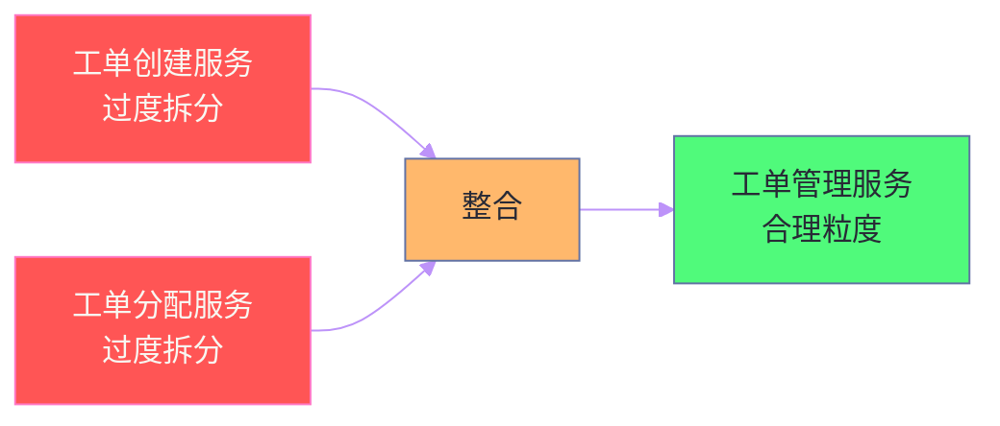
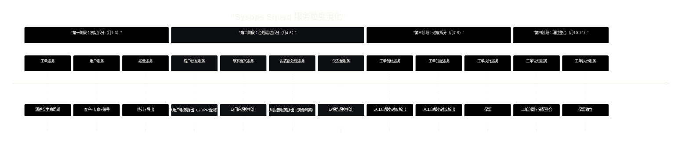

# 06 服务粒度的黄金法则：拆分驱动因素与整合驱动因素

## 摘要

微服务架构中最难回答的问题之一：服务应该多大？一个服务包含 3 个功能点还是 30 个？工单查询和工单修改应该是同一个服务，还是拆成两个？拆分服务会带来独立部署的自由，但也带来网络调用的开销、分布式事务的复杂性和运维负担的增加。整合服务减少了协调成本，但又回到了大服务的困境——局部变更需要全量部署，模块间耦合难以控制。本文系统整理《Software Architecture: The Hard Parts》第 7 章，归纳七个拆分驱动因素和六个整合驱动因素，建立一套可操作的服务粒度决策框架，让"服务该多大"不再是凭直觉做的判断，而是基于具体证据的有据可查的架构决策。

---

## 第 1 章 粒度问题的本质：没有正确答案，只有权衡

### 1.1 极端粒度的两种失败

**过度拆分（纳服务 Nano-services）**：每个函数或每个 CRUD 操作都是一个独立服务。极端情况下，"创建工单"是一个服务，"查询工单"是另一个服务，"更新工单状态"又是第三个服务。

这种架构的代价：
- 任何一个完整的业务操作都需要协调十几个服务，网络调用的延迟叠加成不可接受的响应时间
- 分布式事务的需求无处不在，原来一个数据库事务搞定的事，现在需要 Saga
- 运维负担成倍增加——监控、日志、部署、版本管理

**过度整合（大服务 Macro-services）**：实质上是把单体重新包装成了"伪微服务"——一个"工单服务"包含了工单的创建、查询、修改、审核、归档、导出、统计分析...几十个功能点。

这种架构的代价：
- 局部功能的变更（修改统计分析逻辑）需要重新部署整个服务，影响稳定的创建和查询功能
- 服务内部模块耦合难以控制，随时间退化回单体的问题
- 无法针对高负载的功能（查询）和低负载的功能（归档）分别扩容

### 1.2 正确的问题是"为什么要改变粒度"

**粒度决策应该由驱动因素触发，而不是提前设计**。这是书中最重要的观点之一：服务的粒度不是在初始设计时就确定下来的，而是随着系统的实际运行情况，根据具体的驱动因素动态调整的。

如果当前的服务粒度没有产生任何实际问题，就不要改变它。粒度调整的代价很高（重构接口、迁移数据、修改调用方）。只有当明确的驱动因素出现时，调整粒度才是值得的投资。

---

## 第 2 章 七个拆分驱动因素

### 2.1 驱动因素一：服务功能性内聚过低

**问题的表现**：一个服务内包含的功能，在业务语义上属于完全不同的领域。

**Sysops Squad 案例**：初始设计中，将"工单管理"和"专家技能档案管理"放在同一个服务中（因为两者都与"工单执行"相关）。随着系统发展：
- 工单管理的变更频率远高于专家档案（工单流程每季度都在优化）
- 两类功能由不同的业务团队负责（客服团队负责工单，HR 团队负责专家档案）
- 工单管理需要高可用（客服随时在使用），专家档案只在工作日使用

当一个服务内的功能对变更频率、负责团队、可用性要求有根本性差异时，低功能内聚是拆分的有力驱动因素。

**拆分判断标准**：服务内是否存在两个功能子集 A 和 B，满足：修改 A 不需要修改 B，且 A 和 B 有不同的变更频率或不同的负责人？

### 2.2 驱动因素二：不同的扩容需求

**问题的表现**：服务内的不同功能模块在负载上差异悬殊，整体扩容导致资源浪费。

**具体场景**：Sysops Squad 的报表生成功能（每天凌晨批量运行）和工单实时查询功能（全天高频访问）在同一个服务中。为了支撑工单查询的峰值负载，需要部署 20 个实例。但凌晨的报表生成只需要 2 个实例，20 个实例同时运行报表生成程序是纯粹的资源浪费。

拆分后：
- 工单查询服务：20 个实例，针对读取性能优化
- 报表服务：2 个实例（或弹性伸缩），凌晨扩容、日间缩容

**适用条件**：功能之间的负载差异在 5 倍以上，且云环境下的弹性伸缩可以带来明显的成本节约。

### 2.3 驱动因素三：不同的安全要求

**问题的表现**：服务内的某些功能处理高敏感数据（如支付信息、个人隐私），而其他功能处理普通业务数据。将两者混在同一个服务中，意味着所有功能都需要满足最高级别的安全合规要求，带来不必要的合规成本。

**PCI-DSS 场景**：Sysops Squad 的服务涉及账单和支付功能时，如果账单逻辑与工单管理在同一个服务中，那么整个工单管理服务都需要通过 PCI-DSS 合规审计——尽管工单管理本身与支付数据无关。

拆分后，只有账单/支付服务需要 PCI-DSS 合规，工单管理服务的安全基线可以保持在普通水平。

### 2.4 驱动因素四：不同的技术平台需求

**问题的表现**：服务内的某些功能需要特定的技术栈或运行时环境，与服务当前的技术栈不兼容。

**典型场景**：Sysops Squad 的工单服务是 Java 应用，但新增的"AI 智能分类"功能需要在 Python 环境中运行（Python 的机器学习生态是现实中的必要选择）。将 Python 的 AI 分类模块嵌入 Java 服务需要复杂的 JNI 调用，维护成本极高。

将 AI 分类功能拆分为独立的 Python 服务，通过 REST API 与工单服务通信，是更自然的架构。

### 2.5 驱动因素五：数据库事务边界过宽

**问题的表现**：服务内的某个操作需要跨越过多的数据表，导致数据库事务持锁时间长，影响系统的整体并发能力。

**具体场景**：工单完成操作需要更新工单状态表、专家工时表、客户服务记录表、账单汇总表——四张表的事务意味着四个表级锁的持有时间叠加，在高并发场景下成为瓶颈。

如果这四张表中的某些可以通过异步事件驱动（如账单汇总更新可以在工单状态更新之后异步进行），则将这些操作拆分到不同的服务，可以缩短每个事务的持锁范围，提升并发能力。

> [!warning] 拆分事务的代价
> 将数据库事务边界拆小，意味着原本由数据库保证的原子性，现在需要由 Saga 模式来保证。这是性能和一致性之间的权衡——拆分后性能提升，但一致性的保证变弱（最终一致而非立即一致）。在决定拆分前，确认业务上可以接受最终一致性。

### 2.6 驱动因素六：不同的变更频率

**问题的表现**：服务内的某些功能稳定（几乎不变），而其他功能频繁迭代。两者混在一起，稳定功能的部署会因为频繁迭代功能的发布而被迫"搭便车"，增加稳定功能的风险暴露次数。

**定量标准**：书中给出了一个可操作的参考指标：如果一个服务每两周需要发布超过 5 次，且其中 80% 的发布只涉及少数几个功能模块，那么这些频繁变更的模块应该被考虑拆分为独立服务。

**变更频率的分层管理**：
- 核心稳定功能（工单查询、历史记录）：低频发布，高稳定性要求
- 活跃演化功能（AI 分类、排班算法）：高频发布，快速迭代

### 2.7 驱动因素七：代码难以进行独立测试

**问题的表现**：服务内的某个功能模块难以被独立测试，总是需要启动整个服务和大量的测试桩（Mock）。

**测试痛苦是架构问题的信号**：当你需要 Mock 20 个依赖才能测试一个简单的业务规则时，说明这个业务规则与太多其他模块耦合，应该考虑通过拆分来降低耦合，使测试更独立。

---

## 第 3 章 六个整合驱动因素

整合驱动因素是将过细粒度的服务合并为更大服务的原因。这些因素通常出现在服务已经过度拆分、系统运行出现问题之后。

### 3.1 驱动因素一：功能分解过细导致跨服务事务激增

**问题的表现**：每一个业务操作都需要跨越多个服务，分布式事务（Saga）成为系统的主要工作模式，而不是偶发的特殊情况。

**判断标准**：如果超过 50% 的业务操作都需要 Saga 来保证一致性，说明服务粒度过细，拆分引入的复杂性已经超过了拆分带来的收益。合并相关服务，将 Saga 退化为本地数据库事务，是合理的整合理由。

### 3.2 驱动因素二：服务间调用链过长

**问题的表现**：完成一个用户请求需要串行经过 5+ 个服务，每个服务之间都有网络调用，导致总响应时间难以接受（例如每个服务调用 50ms，5 个串行调用就是 250ms，加上自身处理时间可能超过 500ms）。

**量化分析**：通过分布式追踪工具（Jaeger）分析请求的调用链，找出那些"高深度、低并行"的调用路径——这些路径的存在说明相关服务在业务上紧密关联，将它们合并可以消除网络调用的串行延迟。

### 3.3 驱动因素三：服务间数据共享过于频繁

**问题的表现**：服务 A 几乎每一个操作都需要从服务 B 获取数据，服务 A 和服务 B 之间的 API 调用频率远高于其他服务对的调用。

当两个服务之间的数据交互频率与单体内模块间的函数调用频率相当时，这两个"服务"其实应该是同一个服务内的两个模块——将网络调用替换为本地调用，可以显著降低延迟和系统复杂度。

### 3.4 驱动因素四：运维复杂度已超过团队的承受能力

**问题的表现**：服务数量过多，团队的运维能力（部署、监控、告警处理、故障排查）已经跟不上服务数量的增长。每次生产故障排查都需要翻阅 10+ 个服务的日志，MTTR（平均修复时间）持续攀升。

**"每个服务需要有清晰的所有者"原则**：如果团队无法为某个服务指定一个明确的负责团队，这个服务就处于无人负责的状态，是未来技术债的温床。服务的数量不应该超过团队有能力清晰负责的上限。

### 3.5 驱动因素五：服务间共享数据和代码已超过独立代码

**问题的表现**：两个服务之间共享的代码库（共享库）或数据（共享数据库表）已经占各自代码/数据总量的 50% 以上。

当两个服务的"共同部分"超过"独立部分"时，维护两个独立服务的开销（独立的 CI/CD、独立的监控、版本管理协调）已经无法通过独立部署的灵活性来抵消，整合是更务实的选择。

### 3.6 驱动因素六：通信模式与服务边界不匹配

**问题的表现**：拆分后发现，本应属于"异步事件通信"的服务对，实际上每次都在进行"同步请求-响应"的密集交互——两个服务的耦合方式像是模块调用，而不是独立服务的协作。

这通常意味着拆分违反了"松耦合高内聚"的原则，两个服务在业务语义上本属同一个聚合根（Aggregate Root）的范畴，应该整合回同一个服务，通过内部模块划分来保持代码结构的清晰。

---

## 第 4 章 粒度决策的操作框架

### 4.1 粒度决策矩阵

将七个拆分驱动因素和六个整合驱动因素整理为可操作的决策矩阵：

| 驱动类型 | 驱动因素 | 可量化的触发条件 |
|---------|---------|---------------|
| **拆分** | 功能内聚过低 | 服务内两个功能子集的变更不相关，且有不同负责团队 |
| **拆分** | 扩容需求差异 | 功能模块间负载差异 > 5倍 |
| **拆分** | 安全合规差异 | 某功能需要更高安全级别（PCI-DSS、HIPAA） |
| **拆分** | 技术栈差异 | 功能需要不同的编程语言或运行时 |
| **拆分** | 事务边界过宽 | 单一操作持有 4+ 张表的锁 |
| **拆分** | 变更频率差异 | 某模块发布频率是其他模块的 5 倍以上 |
| **拆分** | 测试难以独立 | Mock > 10 个依赖才能测试一个模块 |
| **整合** | 分布式事务过多 | 50%+ 的操作需要 Saga |
| **整合** | 调用链过长 | 平均请求调用链深度 > 5 |
| **整合** | 数据共享过频 | A→B 的调用占 B 总流量 > 70% |
| **整合** | 运维负担过重 | 团队无法为每个服务指定清晰负责人 |
| **整合** | 共享超过独立 | 共享代码/数据 > 独立代码/数据 |
| **整合** | 通信模式错配 | 服务间通信比内部模块调用还频繁 |

### 4.2 应用框架的步骤

**步骤一：收集证据**

不要基于假设做粒度决策。收集真实的运行数据：
- 服务的变更日志（从 Git history 分析）：哪些模块总是一起提交、一起修改？
- 服务的性能分析（从 APM 工具分析）：哪些 API 的延迟最高？调用链最长？
- 服务的扩容历史：哪些时段需要扩容？哪些功能是扩容的直接原因？

**步骤二：评分**

对于每个驱动因素，给当前服务打分（1-5，5 表示驱动力最强）。将拆分驱动因素的分数相加得到"拆分得分"，整合驱动因素的分数相加得到"整合得分"。

**步骤三：权衡**

拆分分数 > 整合分数 → 考虑拆分

整合分数 > 拆分分数 → 考虑整合

分数相近 → 维持现状（改变的代价无法被收益抵消）

**步骤四：记录决策**

无论最终选择如何，用 ADR 记录：
- 考虑了哪些驱动因素
- 评分是多少
- 最终选择和理由
- 什么条件变化时应该重新评估这个决策

---

## 第 5 章 Sysops Squad 粒度演化案例

### 5.1 初始状态：三个粗粒度服务

Sysops Squad 微服务迁移的第一阶段，将单体拆分为三个服务：
- **工单服务**：涵盖工单的全生命周期（创建、分配、执行、完成、归档）
- **用户服务**：客户信息、专家档案、账号管理
- **报告服务**：各类统计报表、导出功能

### 5.2 拆分迭代一：用户服务的粒度调整

**触发驱动因素**：安全合规差异 + 功能内聚过低

运营六个月后，IT 安全审计提出：客户的个人信息（姓名、地址、联系方式）受 GDPR 约束，需要严格的访问控制和审计日志，但专家档案（技能认证、工作历史）没有同等要求。

两类数据在同一个"用户服务"中，意味着整个服务需要按照 GDPR 的最高标准运行。

**决策**：将"用户服务"拆分为"客户信息服务"（高安全合规要求）和"专家档案服务"（普通安全要求）。

### 5.3 拆分迭代二：报告服务的资源隔离

**触发驱动因素**：扩容需求差异

"报告服务"中有两类不同的工作负载：
- 实时仪表盘查询（全天高频，响应时间要求 < 200ms）
- 复杂报表生成（每天凌晨批量运行，耗时 30-120 分钟，CPU 密集型）

为了让复杂报表不干扰实时仪表盘，拆分为：
- 仪表盘服务：常驻 8 个轻量实例，使用预聚合数据
- 报表批处理服务：凌晨扩容到 4 个高 CPU 实例，日间缩容到 0

### 5.4 整合迭代：过度拆分后的回调

**触发驱动因素**：分布式事务过多 + 调用链过长

在某个阶段，团队过于激进，将"工单服务"拆分为"工单创建服务"、"工单分配服务"、"工单执行服务"三个独立服务。

运行三个月后问题出现：
- 每次"创建并分配工单"需要跨两个服务，引入 Saga，代码复杂度暴增
- 分配失败时的补偿逻辑跨越两个服务，调试极其困难
- 两个服务的变更几乎总是同步发生（工单创建逻辑变，分配逻辑也要跟着变）

**决策**：将"工单创建服务"和"工单分配服务"整合回"工单管理服务"。两者的业务内聚性证明了它们属于同一个有界上下文（Bounded Context）。



---

## 第 6 章 粒度与团队规模的关系

### 6.1 康威定律的粒度含义

[[康威定律（Conway's Law）]]告诉我们：系统的架构会反映设计它的组织的通信结构。这对粒度决策有一个直接的推论：

**服务的粒度不应该细于团队的组织粒度**。

如果一个团队负责三个服务，而这三个服务之间的变更总是相互关联（修改 A 必须同时修改 B 和 C），说明这三个服务在业务上是一个整体，应该整合为一个服务——或者，应该将团队拆分，让每个团队完全拥有自己的服务。

### 6.2 "一个服务，一个团队"的原则

亚马逊的"两个披萨原则"（Two-Pizza Rule）提供了团队规模的参考：一个微服务的负责团队规模应该在 5-8 人之间，不超过两个披萨能喂饱的人数。

服务粒度过细（一个团队负责 20 个服务）意味着团队需要同时维护过多的服务，上下文切换成本高，每个服务的关注度不足。

服务粒度过粗（一个 50 人的团队负责一个服务）意味着协调成本急剧上升，代码冲突频繁，发布流程互相阻塞。

### 6.3 随组织成长动态调整

粒度决策不是一次性的，而是随着组织规模的变化需要动态调整的：

- **创业阶段（5-15人）**：粗粒度，2-3 个服务。团队能力有限，运维成本优先于扩展性。
- **成长阶段（15-50人）**：中等粒度，10-20 个服务。业务域逐渐清晰，按业务域划分服务边界。
- **规模阶段（50人+）**：细粒度，20-50 个服务。多团队自治需求驱动，按[[有界上下文（Bounded Context）]]划分，每个团队拥有完整的服务生命周期。

---

## 第 7 章 总结

### 7.1 粒度决策的核心原则

1. **由驱动因素触发，不预设粒度**：不要在设计初期就定义"我们要有 30 个微服务"，而是从合理粒度出发，由真实的驱动因素触发调整

2. **拆分需要具体证据**：每次拆分都应该能回答"是哪个驱动因素让我们做出这个决定？"

3. **整合是正常操作，不是失败**：过度拆分后的整合不是"倒退"，而是架构在运行反馈下的正常收敛。Sysops Squad 的整合迭代案例证明，勇于整合的团队比死守最初设计的团队有更健康的技术债管理。

4. **服务粒度应与团队粒度匹配**：一个无法被一个团队清晰负责的服务边界，是粒度需要调整的信号。

### 7.2 与下一篇的关联

粒度决策聚焦在"计算层"的服务边界。接下来，Part II 的第一个问题是：当服务已经确定了粒度，它们之间的**代码如何共享**？共享库、共享服务和 Sidecar 模式各有什么权衡？

---

## 延伸阅读

- [[Team Topologies]]：从团队拓扑视角理解服务粒度和团队边界的对应关系
- [[Building Microservices]] 第 3 章：Sam Newman 关于服务边界划定的实践建议
- [[Domain-Driven Design]] 中的聚合根（Aggregate Root）：DDD 视角下的粒度决策，以业务语义而非技术特征为边界
- [[Microservices Patterns]] 第 2 章：Chris Richardson 关于服务分解模式的系统梳理

---

## 附录：粒度决策清单（Checklist）

以下清单可以在进行粒度调整讨论时使用，确保关键维度都被考虑到。

### 拆分前必答的问题

**关于业务内聚性**：
- [ ] 被拆出的功能模块，是否有明确的业务边界（领域专家能清晰说明它的职责范围）？
- [ ] 被拆出的模块与原有服务的关联，是业务上天然分离的，还是只是技术上的划分？
- [ ] 被拆出的模块是否有独立的生命周期需求（独立的版本演化、独立的部署节奏）？

**关于技术可行性**：
- [ ] 拆分后，两个服务之间的数据交换频率是多少？是否会产生"chatty service"（过于频繁的跨服务调用）？
- [ ] 拆分后，原本的本地事务变成分布式事务的比例是多少？团队是否有处理 Saga 模式的能力和工具？
- [ ] 拆分后，每个新服务是否有清晰的所有者团队？

**关于成本评估**：
- [ ] 拆分涉及的接口设计工作量：需要定义哪些新 API？
- [ ] 拆分涉及的数据迁移工作量：是否需要拆分数据库表？数据迁移的风险和计划是什么？
- [ ] 拆分涉及的调用方修改：有多少其他服务调用了即将被拆分的功能，它们需要如何修改？
- [ ] 拆分完成后的持续运维成本：多一个服务就多一套监控、告警、部署流水线——团队能承受这个增量吗？

### 整合前必答的问题

**关于驱动因素的有效性**：
- [ ] 调用链过长是根本问题，还是可以通过异步化来解决？（有时候长调用链可以通过引入消息队列变为异步，而不需要整合服务）
- [ ] 分布式事务过多，是服务粒度的问题，还是数据模型设计的问题？（有时候优化数据所有权划分，而不是整合服务，可以解决事务复杂度问题）

**关于整合后的风险**：
- [ ] 整合后的服务，是否会违反单一职责原则？整合后的服务边界是否有清晰的业务语义？
- [ ] 整合会让某个功能模块失去独立部署的能力，这个代价可以接受吗？
- [ ] 整合后的服务由谁负责？是否需要团队合并或者跨团队的协作协议？

---

## 附录：粒度决策常见误区

### 误区一：微服务越多越好，细粒度代表先进

这是最常见的误区。微服务不是目标，而是手段。目标是**快速、可靠地交付业务价值**。服务数量增加，运维复杂度增加，这是硬成本，不是可以忽视的"架构税"。

正确的思维方式：每增加一个新服务，必须能清晰说明它带来的收益（独立部署？独立扩容？安全隔离？）超过了它带来的成本（运维、测试、分布式事务、网络延迟）。

### 误区二：整合就是退步，应该坚持细粒度

架构演化是正常的。Sysops Squad 在整合迭代中将两个过度拆分的服务重新合并——这不是失败，而是系统基于真实运行反馈做出的合理调整。能够识别过度拆分并果断整合，是架构成熟度的体现。

"架构没有固定形态，只有持续演化"——这是贯穿全书的核心思想之一。

### 误区三：按技术层划分（CRUD 服务、查询服务）

将服务按"创建服务""查询服务""更新服务"划分，是按**技术操作类型**划分服务，而不是按**业务能力**划分。这种划分方式会导致每个业务操作都需要跨越多个"技术层"服务，分布式事务激增，且任何业务需求的变更都需要同时修改多个服务。

正确的划分应该是按**业务领域能力**：工单管理服务（包含工单的所有操作）、专家档案服务（包含专家信息的所有操作）、报表服务（包含所有报表生成和查询）。

### 误区四：忽视组织能力边界

架构决策不是纯技术决策，它必须考虑组织能力的约束。一个五人团队提出要维护 30 个微服务，即使在技术上是正确的粒度，在组织上也是不可行的——团队没有能力维护如此多的服务。

**技术上正确但组织上不可行的架构，在生产中会退化为维护失控的技术债**。好的架构师会在理想的技术方案和团队实际能力之间找到平衡点。

---

## 附录：相关工具和实践

### 服务粒度分析工具

**Git 历史分析**：通过 `git log --follow -p` 分析哪些文件总是一起提交，识别高内聚的功能模块。工具如 CodeScene 可以自动生成"修改热点（Change Hotspot）"分析报告，直观展示哪些代码模块的耦合度最高。

**服务依赖图可视化**：通过服务网格（Istio）的流量数据或 APM 工具（Datadog、Dynatrace）的调用链分析，自动生成服务依赖图。依赖图中"边"（服务调用）最密集的服务对，是合并整合的重要候选。

**数据库依赖分析**：检查哪些服务共享同一张数据库表（或通过数据库 Join 关联到同一数据域），这类服务之间的数据依赖可能意味着粒度需要重新评估。

### 重构粒度的安全实践

**绞杀者模式（Strangler Fig Pattern）**：拆分服务时，不要一次性重构，而是在旧服务旁边逐步建立新服务，通过 API 网关将流量逐步迁移到新服务。当旧服务的流量降为零后，再安全下线旧服务。

**并行运行（Parallel Run）**：整合服务时，先让旧的两个服务和新的整合服务并行运行，验证整合后的行为与拆分时完全一致，再逐步停止旧服务。

**特性开关（Feature Flag）**：服务粒度调整期间，通过特性开关控制是走旧的分离路径还是走新的整合路径，支持快速回滚。

---

## 附录：Sysops Squad 粒度演化全景图

以下是 Sysops Squad 从单体迁移到微服务过程中，服务粒度演化的完整时间线：



这个演化时间线展示了一个关键洞察：**服务粒度的演化不是单向的**。第二阶段的拆分是理性的（由合规需求和资源隔离需求驱动），第三阶段的拆分是冲动的（缺乏驱动因素），第四阶段的整合是理性的（由分布式事务复杂度驱动）。

允许架构在反馈循环中演化，是优秀软件工程文化的体现。固执地坚守初始的粒度设计，忽视运行中暴露的问题，才是真正的技术债。

---

## 附录：粒度与可测试性的深层关系

### 测试金字塔在微服务中的变形

传统的测试金字塔建议：大量单元测试（底层）、少量集成测试（中层）、极少端到端测试（顶层）。微服务架构中，这个比例发生了变化：

- **服务粒度细**：单元测试仍然是基础，但集成测试（验证服务间通信）的比例增加，端到端测试的覆盖路径数量指数级增长（N 个服务有 N! 种可能的调用路径）
- **服务粒度粗**：内部的逻辑通过单元测试和模块集成测试覆盖，跨服务的集成测试较少

**粒度越细，测试基础设施的投入就越大**。TestContainers、服务虚拟化（WireMock）、消费者驱动契约测试（Pact）——这些工具是细粒度微服务测试的必要基础设施，需要投入专门的时间和人力来建立和维护。

在评估是否拆分服务时，"我们是否有能力维护这个服务的完整测试覆盖"是一个不应该被忽视的实际问题。

### 可测试性作为粒度的反馈信号

当一个模块的单元测试需要越来越多的 Mock 对象才能运行时，这是一个"依赖过多"的信号——可能是模块的职责边界不清晰（应该拆分），也可能是模块与外部服务的耦合过强（应该引入防腐层或抽象）。

可测试性不仅是工程质量的要求，也是架构健康度的晴雨表。那些"最难测试的服务"，往往也是架构中耦合最高、职责最模糊的服务。

---

## 附录：量化粒度的关键指标

### 服务健康度指标矩阵

在定期架构评审中，可以对每个服务计算以下指标，作为粒度调整的量化依据：

| 指标 | 测量方式 | 警戒值（参考） | 指向 |
|------|---------|--------------|------|
| 服务每月发布次数 | CI/CD 流水线统计 | > 20次/月 | 可能需要拆分高频变更模块 |
| 平均请求调用链深度 | APM 追踪分析 | > 5跳 | 可能需要整合或引入缓存 |
| 跨服务事务占比 | 业务操作日志分析 | > 40% | 可能需要整合 |
| 服务 API 调用集中度 | 服务网格流量分析 | A→B占B入流量>60% | 两者可能需要整合 |
| 单服务 Mock 数量 | 测试代码分析 | 单元测试Mock > 8个 | 服务依赖过多，考虑拆分或重构 |
| 每次发布回归测试时间 | CI 执行时间统计 | > 30分钟 | 服务可能过大 |
| 单服务代码行数（LOC） | 代码统计工具 | > 100K LOC | 可能存在低内聚问题 |

这些指标不是绝对的标准，而是触发深入讨论的起点。单个指标超过警戒值不一定需要调整，但多个指标同时超过警戒值时，应该认真评估粒度是否需要调整。

### 架构健康度定期评审

建议每季度对所有服务进行一次粒度健康度评审，输出格式如下：

```
服务：工单管理服务
评审日期：2024-Q1

当前指标：
- 月均发布：12次（正常）
- 调用链深度：3跳（正常）
- 跨服务事务占比：15%（正常）
- 单元测试Mock数：平均6个（正常）

结论：当前粒度合理，无需调整
下次评审：2024-Q2

触发调整的条件（提前记录）：
- 如果分配功能的发布频率超过创建功能的3倍，考虑拆分分配模块
- 如果引入AI分类需要Python运行时，考虑拆分分类功能
```

预先记录"触发调整的条件"，是避免惰性（不调整）和冲动（过度调整）的有效方法。当条件真的出现时，无需重新讨论是否应该调整，只需要执行已经确定的调整方案。
