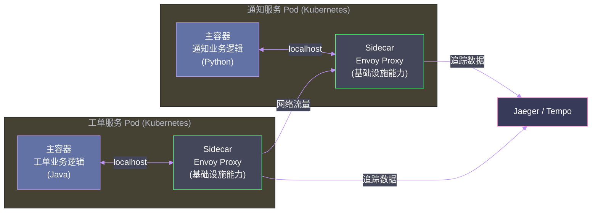
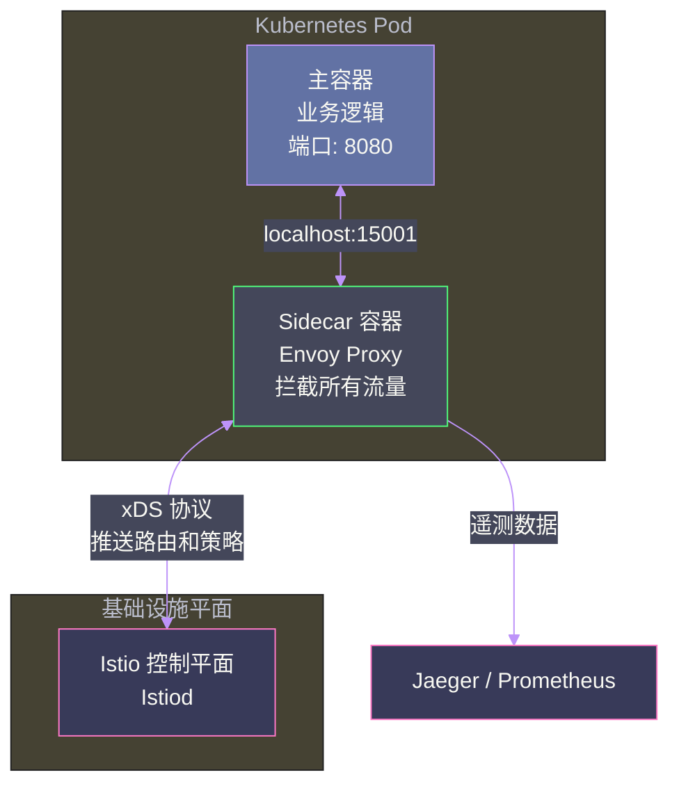
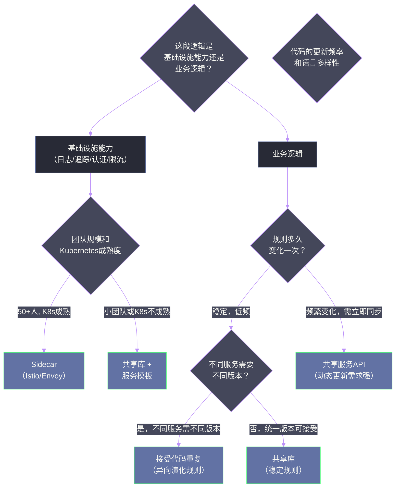

# 07 代码复用的权衡：从共享库到 Sidecar 的选择困境

## 摘要

DRY（Don't Repeat Yourself）是软件工程中最经典的原则之一，但在微服务架构中，对 DRY 的天真追求反而会引入新的耦合和风险。当多个微服务需要共享同一段逻辑时——无论是加密工具、日志库、还是通用的业务规则——如何复用？本文深度解析《Software Architecture: The Hard Parts》第 8 章，系统比较五种代码复用模式（共享库、数据服务、共享服务、服务模板、Sidecar）的耦合特征、适用场景和生产风险，帮助架构师做出与服务自治目标相符的复用策略选择。

---

## 第 1 章 微服务中复用的悖论

### 1.1 DRY 在单体中工作良好，在微服务中却暗藏陷阱

在单体架构中，DRY 的实现是直接的：把重复的逻辑提取成一个函数或类，所有调用者共享同一个代码。修改这个逻辑，整个系统立刻获得更新，没有同步问题，没有版本管理问题，没有部署协调问题。

微服务架构打破了这个美好的假设。当"所有调用者"变成了多个独立部署的服务时，"共享一段逻辑"意味着：

- 这段逻辑的修改，需要所有使用它的服务重新部署（版本同步问题）
- 这段逻辑的 bug，会同时影响所有使用它的服务（故障扩散问题）
- 这段逻辑的不同服务可能需要不同版本（多版本共存问题）

**复用引入的是耦合**。每一种复用模式都是在"代码复用收益"和"耦合代价"之间做权衡，没有任何一种模式可以完全消除这个矛盾。

### 1.2 复用的两类需求

在分析具体模式之前，先区分两类不同的复用需求，因为它们的权衡方向不同：

**基础设施共用（Infrastructure Reuse）**：日志库、链路追踪、健康检查、认证鉴权、限流熔断等横切面能力。这类逻辑与业务逻辑无关，理论上所有服务应该使用相同的实现，且版本差异不影响业务正确性。

**业务逻辑共用（Business Logic Reuse）**：跨多个服务的公共业务规则，例如"折扣计算逻辑同时被订单服务和报价服务使用"。这类逻辑的任何修改都直接影响业务行为，版本控制和一致性要求更高。

这两类需求适合不同的复用模式。

---

## 第 2 章 五种复用模式及其权衡

### 2.1 模式一：共享库（Shared Library）

**是什么**：将共享逻辑打包为独立的类库（JAR、npm 包、Go module），各服务在构建时引入该类库。类库的代码在服务启动时加载，作为服务进程的一部分运行。

**优点**：
- 无网络延迟，调用开销接近零
- 无需独立部署和运维
- 类库可以独立版本化，服务可以选择不同版本

**缺点**：
- **静态耦合**：类库是服务二进制的一部分，类库升级需要服务重新构建和部署
- **版本漂移风险**：当多个服务使用不同版本的类库时，相同的业务规则在不同服务中的表现不同，产生难以排查的 bug
- **语言绑定**：类库只能被相同语言的服务使用，不适合多语言架构

**最适合的场景**：
- 频繁变更的业务逻辑：**不适合**（频繁变更意味着频繁需要同步升级所有服务）
- 稳定的基础设施能力（如内部的加密算法工具、JSON 序列化工具）：**适合**
- 团队偏向同一语言栈：**适合**

**Sysops Squad 案例**：将工单 ID 生成算法、客户等级判断规则打包成共享库。工单 ID 算法极少修改，适合共享库。客户等级规则随业务频繁调整，不适合共享库——共享库的版本管理负担会超过其带来的收益。

> [!warning] 生产避坑
> 共享库最常见的失败模式是"依赖地狱（Dependency Hell）"：库 A 依赖库 C 的 1.x 版本，库 B 依赖库 C 的 2.x 版本，而服务同时依赖 A 和 B，产生版本冲突。随着共享库数量增加，版本矩阵的复杂度呈指数增长。解决方法之一是为所有服务建立统一的"依赖版本清单（Bill of Materials）"，确保所有服务使用相同版本的共享库。

### 2.2 模式二：数据服务（Data Service）

**是什么**：将共享数据（而非逻辑）封装为独立服务，多个服务通过 API 调用该服务来访问数据，而不是直接访问数据库。

**本质**：这个模式解决的是**数据共享**问题，而不是代码逻辑复用问题。当多个服务需要访问同一份数据时（如"专家信息"被调度服务和通知服务共同需要），建立一个"专家数据服务"，由它负责专家数据的读写，其他服务通过它的 API 获取数据。

**优点**：
- 建立了清晰的数据所有权边界
- 消除了共享数据库带来的 Schema 耦合
- 数据访问逻辑（缓存、分页、格式化）集中在一处维护

**缺点**：
- 引入了网络调用的延迟（相比直接数据库查询）
- 数据服务本身成为一个潜在的单点故障
- 增加了运维负担（一个需要独立维护的服务）

**最适合的场景**：多个服务需要读取同一批数据，且这批数据有复杂的访问控制或格式化逻辑时。

### 2.3 模式三：共享服务（Shared Service）

**是什么**：将共享逻辑部署为一个独立的微服务，其他服务在运行时通过网络调用该服务来使用这段逻辑。

**与共享库的根本区别**：共享库在编译时嵌入调用方的二进制，共享服务是独立运行的进程，通过网络提供功能。

**优点**：
- **动态更新**：共享服务升级后立刻对所有调用方生效，无需重新部署调用方服务
- **语言无关**：任何语言的服务都可以通过 HTTP/gRPC 调用共享服务
- **版本管理简单**：只有一个运行中的版本，无版本漂移问题

**缺点**：
- **运行时耦合**：共享服务不可用时，所有依赖它的服务都受影响。这是最严重的问题——原本是"提高复用性"，结果变成了"扩大故障半径"
- **网络延迟**：每次调用都有网络往返开销
- **容量瓶颈**：如果共享服务成为热点，需要独立扩容，且扩容不当会成为全系统瓶颈

**最适合的场景**：
- 基础设施类的功能（如统一的认证鉴权服务、统一的配置中心）：适合，因为这类服务本来就应该是"整个系统的单一入口"
- 核心业务逻辑：**通常不适合**，风险太高——共享服务的故障会级联影响所有业务服务

**反思**：很多团队把共享服务当作"更好的共享库"，这是一个误区。共享服务在复用性上的收益（动态更新、语言无关）是以运行时可用性耦合为代价的，在核心业务逻辑上使用共享服务，等于主动增加了系统的单点故障风险。

### 2.4 模式四：服务模板（Service Template）

**是什么**：不是"运行时共享"，而是"创建时共享"——提供一个标准化的服务项目模板，包含所有基础设施代码（日志配置、健康检查端点、链路追踪集成、认证中间件），新服务基于模板创建，从起点就具备标准化的基础能力。

**本质差异**：模板是**代码生成时**的共享，而非运行时。一旦服务基于模板创建，它的基础设施代码就"属于"该服务自己，不再与模板保持任何运行时关联。

**优点**：
- 无任何运行时耦合——这是它最大的优势
- 保证了所有服务在初始状态下的一致性（日志格式统一、健康检查端点一致、追踪标准统一）
- 新服务的创建成本极低（一键创建，基础设施代码开箱即用）

**缺点**：
- **模板更新不同步**：当模板更新了某个基础设施能力（如升级了追踪 SDK 版本），所有已有的服务不会自动更新，需要逐个手动升级
- 随时间推移，各服务的基础设施代码会出现版本漂移，运维一致性下降

**最适合的场景**：团队规模快速扩张，需要频繁创建新服务，且对初始标准化有较高要求，但可以接受长期的版本漂移（通过定期的"基础设施大扫除"来处理）。

### 2.5 模式五：Sidecar 模式（Sidecar Pattern）

**是什么**：为每个服务部署一个"伴侣进程（Sidecar）"，由 Sidecar 承担所有的基础设施横切面功能（日志收集、链路追踪、服务网格的流量管理、认证代理），主服务进程只专注于业务逻辑。



Sidecar 是[[服务网格（Service Mesh）]]架构的核心组件，Istio 和 Linkerd 都采用了这种模式（以 [[Envoy Proxy]] 作为 Sidecar 实现）。

**优点**：
- **语言无关**：Sidecar 是独立进程，主服务可以用任何语言实现
- **基础设施能力可独立更新**：升级 Envoy 版本无需修改主服务代码
- **关注点分离极彻底**：业务逻辑与基础设施逻辑完全隔离在不同进程中

**缺点**：
- **资源开销**：每个服务都运行一个额外的 Sidecar 进程，在服务数量庞大时，Sidecar 的总资源消耗不可忽视（在 Kubernetes 场景下，每个 Pod 的 Envoy Sidecar 通常消耗 10-50 MB 内存）
- **运维复杂度高**：Sidecar 本身需要管理（配置、升级、故障排查）
- **延迟增加**：流量经过 Sidecar 代理，会增加几毫秒的延迟（对延迟极度敏感的场景需要权衡）

**最适合的场景**：
- 多语言技术栈（不同服务用不同语言实现），需要统一的基础设施能力
- 已经使用 Kubernetes 作为容器编排平台，Sidecar 的部署和管理有成熟的工具链支持
- 服务数量在 50 个以上，手动维护每个服务的基础设施代码成本已经超过 Sidecar 的运维成本

---

## 第 3 章 五种模式的综合比较

### 3.1 核心维度对比

| 维度 | 共享库 | 数据服务 | 共享服务 | 服务模板 | Sidecar |
|------|--------|---------|---------|---------|---------|
| 运行时耦合 | 无 | 中等 | 高 | 无 | 低 |
| 版本管理难度 | 中等 | 低 | 低 | 高（漂移）| 低 |
| 网络延迟 | 无 | 有 | 有 | 无 | 微量 |
| 语言无关 | 否 | 是 | 是 | 否 | 是 |
| 故障半径 | 小 | 中（服务数据单点） | 大（所有调用方）| 无 | 小 |
| 适合基础设施复用 | 适合（稳定逻辑）| 不适合 | 适合（有风险）| 适合 | 最适合 |
| 适合业务逻辑复用 | 适合（稳定规则）| 不适合 | 不建议 | 不适合 | 不适合 |

### 3.2 决策框架

根据两类复用需求做选择：

**基础设施能力复用**（日志、追踪、认证等）：
- 多语言架构 + Kubernetes 环境 → **Sidecar**
- 单语言架构 + 团队不熟悉服务网格 → **共享库 + 服务模板**
- 需要运行时统一管控 → **共享服务**（需要谨慎设计高可用）

**业务规则复用**：
- 规则稳定，修改频率低 → **共享库**（接受静态耦合）
- 规则频繁变化，需要所有服务立即生效 → **共享服务**（需要接受可用性耦合风险）
- 没有真的需要复用，只是相似但不完全一样 → **接受适度重复**，不要为了 DRY 引入不必要的耦合

### 3.3 接受适度重复

书中有一个重要的观点：**在微服务架构中，适度的代码重复有时比强行复用更好**。

这个观点乍听起来与工程直觉相悖，但其逻辑是清晰的：如果两个服务中的相似代码，在未来会按照不同的业务方向演化（服务 A 的折扣逻辑会加入 VIP 规则，服务 B 的折扣逻辑会加入季节性规则），那么今天把它们合并为一个共享库，等于在未来制造了一个需要应对两个方向演化的复杂逻辑——这远比维护两份相似但独立演化的代码更难。

**判断是否应该复用的核心问题**：这两处"相似的代码"，未来会**同向演化**（总是需要一起改）还是**异向演化**（各自沿着不同的业务方向发展）？

同向演化 → 值得复用（否则每次修改需要同步两处）

异向演化 → 接受重复（复用只会在未来制造合并冲突和职责混淆）

---

## 第 4 章 总结

### 4.1 核心结论

微服务中的代码复用，不是"DRY 越彻底越好"，而是在复用收益和耦合代价之间做理性的权衡：

1. 基础设施复用优先选择**不引入运行时耦合**的模式（Sidecar > 服务模板 > 共享库）
2. 业务逻辑复用需要评估代码的演化方向，同向演化再复用，异向演化接受重复
3. 共享服务是风险最高的复用模式，只有当所有调用方均可接受其可用性依赖时才使用

### 4.2 与下一章的衔接

代码复用解决了"逻辑共享"的问题，接下来面对更难的挑战：**数据所有权和分布式事务**。当工单的创建需要同时更新工单数据库和调度数据库，且这两个数据库属于不同的服务时，如何保证操作的原子性？这是第八章的核心议题。

---

## 延伸阅读

- [[Service Mesh Patterns]]：深度了解 Sidecar 模式和服务网格的实现细节
- [[Istio in Action]]：Envoy Sidecar 和 Istio 控制平面的实战指南
- [[Building Microservices]] 第 4 章：Sam Newman 关于微服务间代码共享的讨论

---

## 第 5 章 深入 Sidecar 模式：服务网格的工作原理

### 5.1 Sidecar 的部署模型

Sidecar 模式在 Kubernetes 环境中，表现为 Pod 内运行多个容器：主容器（业务逻辑）和 Sidecar 容器（基础设施能力）共享同一个网络命名空间（Network Namespace），可以通过 localhost 通信，共享同一个 IP 地址。



Istio 通过 iptables 规则将 Pod 内所有的入站和出站流量重定向到 Envoy Sidecar，而不需要修改主容器的代码或配置。主容器"感知不到" Sidecar 的存在——从主容器的视角，它就是在正常地发送和接收 HTTP 请求。

### 5.2 Sidecar 能提供哪些能力

**流量管理**：
- 负载均衡（轮询、最少连接、一致性哈希）
- 熔断器（Circuit Breaker）：连续失败超过阈值时自动断开，避免雪崩
- 重试和超时控制：统一的重试策略，无需在每个服务中单独实现
- 金丝雀发布（Canary Release）：将一定比例的流量路由到新版本，逐步验证

**安全**：
- mTLS（双向 TLS）：服务间通信自动加密，验证双方身份
- 授权策略：基于服务身份（SPIFFE/SVID）的访问控制

**可观测性**：
- 自动生成调用链追踪数据（无需在代码中手动注入追踪逻辑）
- 自动收集请求指标（QPS、延迟分布、错误率）
- 访问日志（每个请求的详细元数据）

这些能力**完全不需要业务代码的配合**，是通过 Sidecar 透明注入的。这是 Sidecar 模式最强大的价值主张。

### 5.3 Sidecar 的成本边界

尽管 Sidecar 能力强大，但它有明确的成本边界，不是免费的午餐：

**内存开销**：每个 Envoy Sidecar 在空闲状态消耗约 30-50 MB 内存，在处理大量连接时可能达到 100-200 MB。在一个有 200 个 Pod 的集群中，Sidecar 总内存开销可能达到 10-40 GB，这是不可忽视的基础设施成本。

**CPU 开销**：每个请求通过 Sidecar 时，会有少量 CPU 开销（iptables 规则匹配 + Envoy 处理逻辑）。通常在 0.5-1% 的 CPU 利用率增量，对大多数系统影响微小，但在极高吞吐量（百万 QPS）的场景下需要仔细评估。

**延迟增加**：每个请求通过 Sidecar 的延迟增加通常在 0.5-2ms 之间。对于 P99 延迟要求在 10ms 以下的场景，这个额外延迟可能不可接受，需要权衡。

**运维复杂度**：Sidecar 本身需要管理。Envoy 的配置语言（xDS API）复杂，Istio 的控制平面（Istiod）是额外的基础设施组件，需要专人维护。如果团队没有 Kubernetes 和服务网格的运维经验，引入 Sidecar 会带来较高的学习曲线和运维风险。

### 5.4 eBPF 对 Sidecar 的挑战

近年来，出现了基于 [[eBPF]] 技术的替代方案（如 Cilium、Hubble），它们通过在 Linux 内核级别拦截网络流量来实现服务网格的能力，而不需要在每个 Pod 中注入 Sidecar。

**与 Sidecar 的对比**：

| 维度 | Sidecar（Istio/Envoy）| eBPF（Cilium）|
|------|----------------------|--------------|
| 延迟 | +0.5-2ms | +0.1-0.5ms |
| 内存开销 | 30-50MB/Pod | 共享内核，接近零 |
| 运维复杂度 | 中等 | 较高（内核级调试） |
| 功能完整性 | 完整成熟 | 部分功能还在开发中 |
| 成熟度 | 生产级（5年+） | 较新（2-3年）|

eBPF 方案在性能上有明显优势，但功能完整性和生产稳定性仍在追赶。对于对延迟极度敏感的场景，eBPF 是值得考察的方向。

---

## 第 6 章 代码复用的演化路径

### 6.1 从小团队到大团队的复用策略演化

不同规模的团队，代码复用策略的最佳选择是不同的，且会随着团队成长而演化：

**阶段一：5-15 人团队**

推荐策略：**共享库 + 内部包管理**

团队规模小，统一的语言栈基本可以保证。将公共逻辑打包为内部 npm/Maven/Go 包，通过私有包仓库（Artifactory、Nexus）分发。升级协调成本可接受（通知5个团队远比通知50个团队容易）。

Sidecar 对小团队来说是"杀鸡用牛刀"——Kubernetes + Istio 的运维复杂度会消耗小团队过多的精力。

**阶段二：15-50 人团队**

推荐策略：**服务模板 + 共享库（稳定基础设施逻辑）**

服务数量增加，新服务的创建频率提高，服务模板的价值开始显现。同时，语言栈可能开始多样化（Python 团队加入），部分功能需要语言无关的共享方式（共享服务 API）。

**阶段三：50+ 人团队，多语言栈**

推荐策略：**Sidecar（基础设施能力）+ 共享服务（业务逻辑 API）**

团队规模大，语言栈多样，Kubernetes 运维能力通常已经建立。Sidecar 提供统一的基础设施能力，无需与语言栈绑定。稳定的业务规则（如定价逻辑）通过共享服务 API 提供，需要严格的 SLA 和高可用保证。

### 6.2 不要"过早优化"复用策略

和粒度决策一样，复用策略也应该由驱动因素触发，而不是提前过度设计。

**反例**：一个10人团队，在系统还有3个服务的时候，就开始建设 Istio 服务网格和 Sidecar 基础设施，理由是"我们未来会需要多语言支持"。

**正例**：同一个团队，当服务数量增长到15个，且真的有第二种语言（Python）加入时，才开始评估是否引入 Sidecar 模式。

预测需求并提前建设，听起来很有远见，但在软件工程中，预测失准的代价往往高于"需要时再建设"的代价。这是 YAGNI（You Ain't Gonna Need It）原则的核心思想。

---

## 第 7 章 总结与决策树

### 7.1 复用模式决策树



### 7.2 核心结论

代码复用的五种模式（共享库、数据服务、共享服务、服务模板、Sidecar）不是相互替代的关系，而是针对不同场景的不同工具：

- **稳定的基础设施 + 单语言** → 共享库
- **统一的新服务起点** → 服务模板
- **多语言 + 大团队** → Sidecar
- **动态变化的业务规则** → 共享服务（谨慎使用，注意可用性风险）
- **两段代码方向不同** → 接受重复，不要强行复用

---

## 附录：共享库的版本管理最佳实践

### 语义化版本（Semantic Versioning）的应用

共享库的版本管理是防止"依赖地狱"的第一道防线。语义化版本（SemVer）规范：`主版本号.次版本号.补丁号`。

- **主版本号（Major）**：不兼容的 API 变更（调用方必须修改代码才能升级）
- **次版本号（Minor）**：向后兼容的新功能（调用方无需修改代码即可升级）
- **补丁号（Patch）**：向后兼容的 Bug 修复

**共享库的最佳实践**：
- 尽量保持向后兼容（Minor 和 Patch 版本），减少调用方的强制升级
- 当确实需要做破坏性变更时，使用 Major 版本号，并提供至少一个版本的"deprecation 期"，让调用方有充足时间迁移
- 为每个 Major 版本建立独立的文档和迁移指南

### Bill of Materials（BOM）统一依赖版本

在多服务的 Java 微服务系统中，Maven BOM（Bill of Materials）是一种强大的依赖版本统一工具：

```xml
<!-- 在组织级 BOM 中统一所有服务的共享库版本 -->
<dependencyManagement>
    <dependencies>
        <dependency>
            <groupId>com.sysopssquad</groupId>
            <artifactId>common-utils</artifactId>
            <version>2.1.3</version>
        </dependency>
        <dependency>
            <groupId>com.sysopssquad</groupId>
            <artifactId>ticket-client</artifactId>
            <version>1.5.0</version>
        </dependency>
    </dependencies>
</dependencyManagement>
```

所有服务引入这个 BOM 后，自动使用统一版本的共享库，消除版本漂移风险。

---

## 附录：生产故障案例——共享服务的可用性陷阱

### 案例背景

某团队将"价格计算逻辑"实现为共享服务（一个独立的 REST API 服务），被5个核心业务服务调用（订单服务、报价服务、结算服务、续费服务、促销服务）。

### 事故经过

价格计算服务在一次版本升级后，存在内存泄漏问题。升级后4小时，服务因 OOM 崩溃，K8s 开始重启 Pod。由于重启期间有短暂的不可用窗口（约15秒），而5个调用方服务均未配置合理的超时和降级策略，导致：

1. 订单服务因为调用价格服务超时，开始积累请求队列
2. 积累的请求占用订单服务的线程池
3. 订单服务的健康检查超时，K8s 开始重启订单服务
4. 连锁反应蔓延，核心业务受损约20分钟

### 根本原因

共享服务的故障半径覆盖了所有调用方。任何一个调用方都没有"价格服务不可用时的降级策略"（如返回默认价格、使用缓存价格），导致故障级联放大。

### 教训

1. 调用共享服务的代码**必须**实现熔断器（Circuit Breaker）和降级策略，确保共享服务故障时不影响自身服务的核心功能
2. 对于业务关键路径上的共享服务调用，必须有明确的"服务不可用时的行为定义"——是用缓存数据？还是返回错误？还是允许以默认值继续？
3. 共享服务的 SLA 必须严格，且要求高于所有调用方服务的 SLA（因为共享服务的故障会叠加影响所有调用方）

这个案例说明，**共享服务的引入不仅是代码层面的变化，更是运维责任和可用性契约层面的重大变化**，需要配套的运维机制（熔断器、降级、SLA 协议）才能安全使用。

---

## 附录：复用模式的测试策略

不同复用模式的测试方式有所差异：

### 共享库的测试

共享库可以像普通代码一样进行单元测试，且测试质量要求高于业务代码，因为任何 bug 会影响所有使用它的服务。

**测试要求**：
- 单元测试覆盖率建议 > 90%
- 每次版本发布前，对所有使用该库的服务运行集成测试
- 在 CI 流水线中，共享库的变更自动触发所有下游服务的集成测试

### 共享服务的测试

共享服务需要额外关注的测试维度：

**消费者驱动契约测试**：每个调用方定义自己依赖的共享服务行为（"我需要 `/price` 接口返回包含 `amount` 字段的 JSON"），共享服务的 CI 流水线运行所有消费者的契约测试，确保任何变更不会破坏任何消费者。

**负载测试**：共享服务是全系统的公共组件，必须能承载所有调用方的叠加流量。定期进行压力测试，确认服务在预期峰值流量下的性能指标。

### Sidecar 的测试

Sidecar 本身（Envoy）是第三方组件，通常不需要自己测试。需要测试的是：

- Istio/Envoy 的配置是否正确（路由规则、超时、重试策略）
- Sidecar 注入是否正常工作（Pod 内是否有 Envoy 容器）
- mTLS 策略是否如预期工作（某些服务之间是否强制使用 mTLS）

这类测试通常通过集成测试和自动化的 Kubernetes 配置验证来完成。
