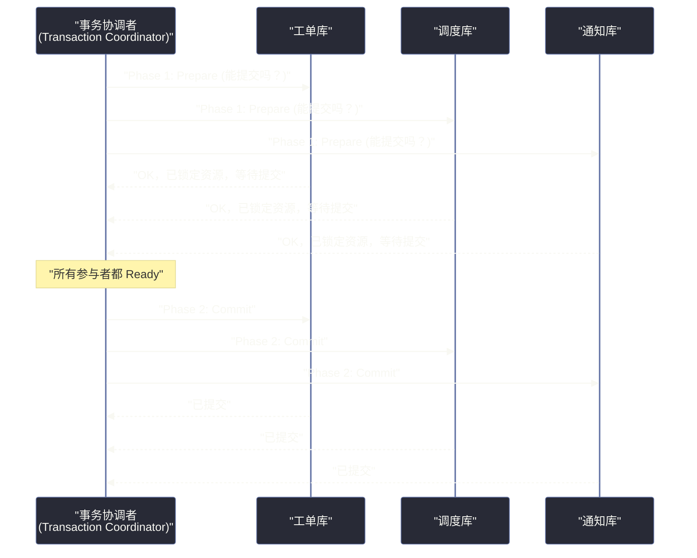
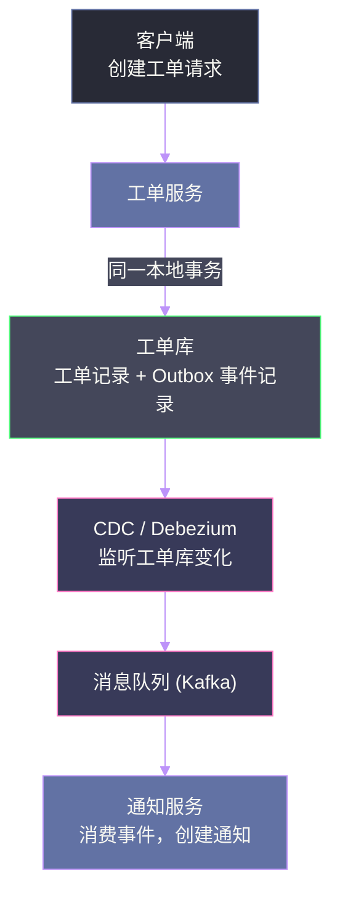
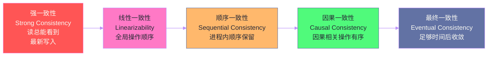

# 08 数据所有权与分布式事务：微服务时代的数据一致性困局

## 摘要

单体架构中，一个数据库事务可以将多个操作原子性地提交或回滚，这个能力被大多数开发者视为理所当然。当架构被拆分为微服务后，这个"理所当然"变成了"最难解决的问题之一"。本文深度解析《Software Architecture: The Hard Parts》第 9 章，从数据所有权的划分原则出发，分析分布式事务的根本困境，比较两阶段提交（2PC）的局限性与最终一致性模型，为微服务数据治理提供系统性的决策框架。

---

## 第 1 章 数据所有权的本质

### 1.1 单一数据所有权原则

在微服务架构中，每一张数据库表（或每一类数据）应该有**且只有一个**服务对其进行写操作，这个服务被称为该数据的**所有者（Owner）**。其他服务如果需要修改这份数据，必须通过所有者服务的 API 来操作，不允许直接访问所有者的数据库。

这个原则看起来简单，但在实践中有大量的灰色地带需要判断：

**边界清晰的案例**：工单（Ticket）数据由工单服务所有，专家（Expert）数据由专家管理服务所有。工单创建时需要关联专家 ID，但这不意味着工单服务需要"拥有"专家数据，它只需要存储一个外键引用即可。

**边界模糊的案例**：客户（Customer）数据需要被"客户管理服务"读写，同时工单服务在创建工单时需要验证客户是否有效，调度服务在分配工单时需要读取客户所在区域。三个服务都需要客户数据，谁来"拥有"它？

这个问题的答案是：**谁负责管理这份数据的生命周期（创建、更新、删除），谁就是所有者**。客户数据的生命周期管理属于客户管理服务，其他服务只能"读取"（通过 API 或数据复制），不能直接写入。

### 1.2 联合所有权：当两个服务都需要写同一份数据时

联合所有权（Joint Ownership）是一种复杂但有时不可避免的情况：两个或多个服务都需要对同一份数据进行写操作。

**Sysops Squad 案例**：工单的"状态"字段需要被工单服务（创建工单时设置初始状态）、调度服务（分配工单时更新为"已分配"）和完成服务（工单完成后更新为"已完成"）共同修改。

三种常见的处理方式：

**方式一：单一写入服务**——将所有状态修改操作统一由一个"工单状态服务"负责，其他服务发送"状态变更请求"给它，由它执行实际的写入。代价是引入了一个新的服务和网络调用。

**方式二：事件驱动所有权**——每个服务只对自己负责的状态转换拥有写权限（"工单服务写 CREATED，调度服务写 ASSIGNED，完成服务写 COMPLETED"），通过定义清晰的状态转换规则避免并发冲突。

**方式三：表拆分**——将"工单基本信息"和"工单状态"拆分为两张表，分别由不同的服务所有。工单服务拥有工单基本信息，工单状态机服务拥有工单状态。

没有哪种方式天然优越，选择取决于状态变更的频率、并发程度和团队对额外服务运维的承受能力。

---

## 第 2 章 分布式事务的根本困境

### 2.1 为什么微服务让事务变难

ACID 事务（原子性、一致性、隔离性、持久性）是关系型数据库提供的能力，**其前提是所有操作发生在同一个数据库实例或分布式数据库系统中**。

微服务架构中，不同服务拥有各自独立的数据库，跨服务的操作天然是"跨数据库的操作"。问题在于：

- 工单服务的数据库是独立的 PostgreSQL 实例
- 调度服务的数据库是独立的 MySQL 实例
- 通知服务的数据库是独立的 MongoDB 实例

当一个"创建工单"的操作需要同时在这三个数据库中写入数据时，没有一个外部系统可以原子地控制这三个操作，要么全部成功，要么全部回滚。

**CAP 定理的约束**：在分布式系统中，一致性（Consistency）、可用性（Availability）、分区容忍性（Partition Tolerance）三者只能选二。由于网络分区是分布式系统的必然现实，分区容忍性（P）是必须满足的，因此实际的选择是在"强一致性（C）"和"高可用性（A）"之间权衡。

### 2.2 两阶段提交（2PC）：试图保住强一致性的代价

两阶段提交是业界提出的跨数据库原子事务方案。

**工作流程**：



**2PC 的致命缺陷**：

**问题一：阻塞协议**——在 Prepare 阶段，所有参与者都会持有锁，等待协调者的最终决策。如果协调者在两阶段之间崩溃，所有参与者将**永久等待**，无法继续处理其他请求。这是 2PC 被称为"阻塞协议"的原因。

**问题二：协调者单点**——事务协调者本身是单点。协调者崩溃会导致所有进行中的分布式事务卡住。即使引入协调者高可用（HA），也需要处理协调者切换时的状态恢复问题，复杂度急剧上升。

**问题三：性能代价**——每个 2PC 事务需要至少 2 次网络往返（Prepare + Commit），加上锁的持有时间，整体延迟远高于单机事务。

**问题四：实践中几乎不可用**——2PC 要求所有参与的数据库都支持 XA 协议（分布式事务标准），很多 NoSQL 数据库和新型数据库都不支持 XA。即使支持，不同数据库的 XA 实现之间也可能存在兼容性问题。

> [!warning] 2PC 在微服务场景的结论
> 两阶段提交在理论上解决了跨数据库原子事务的问题，但在微服务实践中，它的可用性问题、性能代价和实现复杂度使其几乎不可用。现代微服务架构的主流选择是**放弃强一致性，拥抱最终一致性**。

---

## 第 3 章 最终一致性与 BASE 模型

### 3.1 从 ACID 到 BASE

ACID 模型要求事务完成时，数据立刻处于一致的状态。BASE 模型则放宽了这个要求：

- **BA（Basically Available，基本可用）**：系统在任何时候都可以处理请求，即使某些节点故障
- **S（Soft State，软状态）**：系统的状态可能随时间而改变，即使没有外部输入（因为后台的数据同步操作在持续进行）
- **E（Eventual Consistency，最终一致性）**：给定足够的时间且没有新的更新，系统最终会达到一致状态

BASE 模型的核心思想是：**相比"任何时刻强一致"，更重要的是"高可用且最终一致"**。

### 3.2 最终一致性的业务含义

接受最终一致性意味着：在某个时间窗口内，不同服务看到的数据可能不一致，这是被允许的，只要在后续某个时间点恢复一致即可。

**能否接受不一致的判断标准**：这个不一致的时间窗口，对用户或业务是否可见？是否会导致实质性的错误？

- 用户提交工单后，调度服务还没有看到这个工单（延迟 100 毫秒）→ 可接受，用户不会感知
- 用户付款成功后，订单服务还没有更新订单状态 → 不可接受，用户可以在付款成功后立刻查看订单，此时不一致会造成困惑

可见，**最终一致性不是银弹**，需要根据具体业务场景判断哪些操作必须强一致，哪些可以接受最终一致。

---

## 第 4 章 数据所有权与事务模式的选择框架

### 4.1 单一所有权场景：最简单的情况

当一个业务操作只涉及一个服务所有的数据时，这是标准的单机 ACID 事务，无需任何分布式事务机制。

**最佳实践**：尽量设计业务操作，使其数据变更只影响一个服务的数据库。这是减少分布式事务需求的根本方法。

### 4.2 两个服务的数据同时需要修改：核心困境

这是最常见的分布式事务场景。当工单创建需要同时在工单库中插入工单记录，并在通知库中创建通知任务时，如何保证两者的原子性？

**选项一：同步 API 链式调用**——工单服务创建工单后，同步调用通知服务创建通知。如果通知服务失败，工单服务负责补偿（删除已创建的工单或标记工单为"通知失败"状态）。

优点：实现简单。缺点：工单服务与通知服务产生运行时耦合，通知服务的故障会直接影响工单创建的成功率。

**选项二：异步事件驱动**——工单服务创建工单后，向消息队列发布"工单创建"事件。通知服务订阅该事件，异步创建通知。

优点：解除运行时耦合，通知服务的临时故障不影响工单创建（消息会在队列中等待）。缺点：通知不是立即生成的，存在延迟；需要处理消息重复消费（at-least-once delivery）的问题。

**选项三：Outbox 模式**——工单服务在同一个数据库事务中，同时写入工单记录和一条"待发送事件记录（Outbox Record）"，然后由一个后台进程（Change Data Capture 或定时任务）读取 Outbox 表，将事件推送到消息队列。

优点：彻底解决了"写数据库"和"发消息"的原子性问题（两者在同一本地事务中），是事件驱动架构中保证消息可靠投递的标准模式。缺点：需要引入 Outbox 表和额外的读取机制（CDC 工具如 Debezium 或定时任务）。



### 4.3 多个服务的数据需要协调一致：Saga 模式预览

当一个业务流程涉及三个或更多服务，且这些服务的数据变更需要在逻辑上保持原子性时，Saga 模式是主流解法。

Saga 将一个跨服务的"全局事务"分解为多个"局部事务"，每个局部事务由一个服务负责，且每个局部事务都有对应的**补偿事务（Compensating Transaction）**：当某一步失败时，通过执行前面各步骤的补偿事务来撤销已经完成的操作。

Saga 的细节留给下一篇文章（事务性 Saga 的六种变体）详细展开。

---

## 第 5 章 总结

### 5.1 核心结论

1. **数据所有权是分布式架构的基础**：每份数据有且仅有一个服务负责写操作，是实现服务自治的前提
2. **2PC 在微服务场景不实用**：阻塞协议 + 协调者单点 + 性能代价，使其几乎无法在生产中可靠运行
3. **最终一致性是主流选择**：接受在时间窗口内的不一致，换取高可用和松耦合
4. **Outbox 模式**是解决"写数据库 + 发消息"原子性的标准模式，应成为事件驱动架构的默认选择

### 5.2 与前后文的关联

本篇建立了数据所有权和分布式事务的基础认知。下一篇将探讨"当查询需要跨越服务边界时"的五种数据访问模式——这是一个与写操作同等复杂的挑战：如何在保持服务数据自治的前提下，高效地完成跨服务的联合查询？

---

## 延伸阅读

- [[CAP Theorem]]：理解一致性、可用性、分区容忍性的根本矛盾
- [[Outbox Pattern]]：事件驱动架构中消息可靠投递的标准模式
- [[Debezium]]：开源的 Change Data Capture 工具，Outbox 模式的常用实现
- [[Designing Data-Intensive Applications]] 第 9 章：深度讲解分布式事务和一致性保证

---

## 第 5 章 Outbox 模式的完整实现

### 5.1 为什么需要 Outbox 模式

在事件驱动架构中，一个服务在完成数据库写入后，还需要向消息队列（Kafka）发送一个事件通知。这个"写数据库 + 发消息"的组合操作不是原子的：

- **先写数据库，后发消息**：数据库写入成功，但发消息失败（Kafka 暂时不可用），消息丢失，下游服务永远不知道这个操作发生了
- **先发消息，后写数据库**：消息发出，但数据库写入失败（如约束冲突），消息已经被下游消费，但实际操作失败了——下游服务的状态与实际状态不一致

Outbox 模式通过"将发消息的意图持久化到数据库"，保证了两者的原子性。

### 5.2 Outbox 模式的实现细节


**Outbox 表结构**：

```sql
CREATE TABLE outbox_events (
    id          UUID PRIMARY KEY DEFAULT gen_random_uuid(),
    aggregate_type VARCHAR(100) NOT NULL,  -- 如 'Ticket'
    aggregate_id   VARCHAR(100) NOT NULL,  -- 如 'T001'
    event_type     VARCHAR(200) NOT NULL,  -- 如 'ticket.created'
    payload        JSONB        NOT NULL,  -- 事件内容
    created_at     TIMESTAMP    NOT NULL DEFAULT NOW(),
    published_at   TIMESTAMP,              -- NULL 表示未发布
    retry_count    INT          NOT NULL DEFAULT 0
);
```

**业务代码**（伪代码）：

```java
@Transactional
public Ticket createTicket(TicketRequest request) {
    // Step 1: 写入业务数据
    Ticket ticket = ticketRepository.save(new Ticket(request));
    
    // Step 2: 写入 Outbox 事件（同一事务）
    OutboxEvent event = OutboxEvent.builder()
        .aggregateType("Ticket")
        .aggregateId(ticket.getId())
        .eventType("ticket.created")
        .payload(toJson(ticket))
        .build();
    outboxRepository.save(event);
    
    // 事务提交——两个写入要么都成功，要么都失败
    return ticket;
}
```

### 5.3 CDC vs 轮询：两种 Outbox 读取方式

**CDC（Change Data Capture）方式**：

[[Debezium]] 监听数据库的二进制日志（MySQL binlog、PostgreSQL WAL），捕获 outbox 表的 INSERT 操作，实时将变更推送到 Kafka。

优点：延迟极低（毫秒级），不需要对 outbox 表做额外查询。

缺点：依赖数据库的二进制日志功能（需要开启），Debezium 是额外的基础设施组件，需要单独运维。

**轮询方式**：

定时任务（每隔 N 秒）扫描 outbox 表中 `published_at IS NULL` 的记录，将其发送到 Kafka，发送成功后更新 `published_at`。

优点：实现简单，无需额外基础设施。

缺点：存在轮询延迟（消息不是立即发送的），对数据库有周期性的扫描压力。

**选择建议**：对消息延迟敏感（要求亚秒级）→ CDC；对延迟不敏感（秒级可接受）+ 不想引入额外组件 → 轮询。

---

## 第 6 章 分布式事务的模式选择总结

### 6.1 五种模式的适用场景对比

| 场景 | 推荐方案 | 理由 |
|------|---------|------|
| 单服务内的多步骤操作 | 本地 ACID 事务 | 无需分布式事务机制 |
| 两个服务，非关键路径操作 | 异步事件 + Outbox | 消除耦合，可靠投递 |
| 两个服务，关键路径操作 | Saga（Fairy Tale）| 异步编排，平衡原子性和耦合 |
| 多服务，复杂业务流程 | Saga + 工作流引擎 | 持久化状态，可恢复，可监控 |
| 读取跨服务数据 | 数据复制/缓存/CQRS | 不同查询特征选不同模式 |

### 6.2 分布式事务的最终建议

书中最重要的一个建议：**通过架构设计减少分布式事务的需求，而不是不断地优化分布式事务的实现**。

如果一个系统中 50% 以上的操作都需要分布式事务，说明服务的边界划分有问题——要么服务粒度过细（相关的操作被拆分到了不同的服务），要么数据所有权划分不合理（多个服务都试图写相同的数据）。

**架构层面减少分布式事务的策略**：

1. **数据与逻辑一起移动**：如果服务 A 需要频繁修改服务 B 的数据，考虑将这部分数据的所有权迁移到服务 A
2. **异步化非关键步骤**：不是所有步骤都需要实时一致，通知、审计日志、推荐更新等可以完全异步
3. **接受业务层面的补偿**：在某些业务场景中，"最终一致 + 人工或自动补偿"比"强一致 + 分布式事务"更简单且更可靠

---

## 附录：生产实践——数据所有权变更的迁移策略

### 场景：重新划定数据所有权

当发现现有的数据所有权划分不合理时（比如工单状态被三个服务共同修改），需要进行所有权迁移。这是一个有风险的操作，需要小心处理。

**迁移步骤**：

**第一步：确定新的所有者**

明确哪个服务负责这份数据的生命周期管理。决策依据：哪个服务对这份数据的理解最深？哪个服务的变更与这份数据的演化最相关？

**第二步：双写过渡**

在迁移期间，新旧两个"写路径"并行运行：
- 旧路径：各服务直接写入数据库
- 新路径：各服务调用新所有者服务的 API 写入

通过特性开关控制流量在新旧路径之间切换，逐步将流量迁移到新路径，验证一致性后再关闭旧路径。

**第三步：清理旧路径**

确认新路径稳定运行一段时间（通常 1-2 周）后，删除旧的直接数据库访问代码，完成所有权迁移。

---

## 附录：一致性保证的层次模型

### 从强一致到弱一致的光谱



**从左到右**：一致性保证越来越弱，但可用性越来越高，延迟越来越低。

在微服务架构中，**因果一致性**往往是一个合理的平衡点：不要求全局强一致，但保证逻辑上有因果关系的操作（"先支付再发货"）对所有观察者都是有序的。

### 业务对一致性的真实需求分析

很多业务场景实际上并不需要强一致性，只是开发者默认"数据应该是实时一致的"。在做架构决策之前，值得与业务方明确确认：

**工单创建后，调度服务最迟多久应该看到这个工单？**
- 业务方答案："1 秒以内即可"→ 最终一致性可以满足
- 业务方答案："必须立即可见"→ 需要同步调用或强一致性保证

**账单数据更新后，用户在账单页面最迟多久能看到最新数据？**
- 业务方答案："5 分钟内更新即可"→ 每 5 分钟同步一次的缓存即可满足
- 业务方答案："用户刷新页面应该立即看到"→ 需要直接读取源数据，不能用缓存

**量化业务的一致性容忍度**是一个常被忽略但极其重要的步骤。过度追求强一致性会带来不必要的系统复杂度；而对一致性要求理解不足则可能带来业务风险。

---

## 附录：分布式事务的监控与告警

### 关键监控指标

分布式事务（Saga）需要专门的监控指标：

- **Saga 实例状态分布**：当前有多少 Saga 处于 `RUNNING`、`COMPENSATING`、`FAILED`、`COMPLETED` 状态
- **Saga 平均完成时间**：P50/P90/P99 的完成时间，监测是否有步骤出现异常延迟
- **Saga 补偿率**：需要触发补偿的 Saga 占总 Saga 的比例，持续升高说明某个步骤的成功率在下降
- **Saga 最终失败率**：补偿后仍然失败（需要人工介入）的 Saga 比例

### 人工介入的队列设计

对于自动补偿无法恢复的 Saga 失败，系统应该将这些案例放入"人工处理队列"，而不是默默丢弃。工程师或客服人员需要介入处理，确保每个业务请求最终都有明确的结果（成功或有记录的失败）。

人工处理队列的设计要点：
- 记录完整的 Saga 执行历史（每一步的输入、输出、错误信息）
- 提供查询和操作界面，让人工处理者能快速了解上下文并执行修复操作
- 设置 SLA：每个进入人工队列的案例必须在 N 小时内处理

这个设计将分布式事务的"技术失败"转化为"可管理的业务事件"，避免在系统中产生无人负责的"数据孤岛"。

---

## 附录：Sysops Squad 完整数据所有权映射

### 数据域划分结果

经过分析，Sysops Squad 的数据所有权划分如下：

| 数据实体 | 所有者服务 | 其他服务的访问方式 |
|---------|---------|----------------|
| 工单（Ticket）| 工单管理服务 | 通过工单管理服务 API 读写 |
| 工单状态（TicketStatus）| 工单管理服务 | 通过状态变更 API（其他服务不直接写状态）|
| 专家信息（Expert）| 专家档案服务 | 通过 API 查询；部分数据通过事件同步到调度服务 |
| 客户信息（Customer）| 客户服务 | 通过 API 查询；调度服务有客户区域的本地副本 |
| 调度记录（Assignment）| 调度服务 | 工单管理服务通过事件获取分配结果 |
| 账单记录（BillingRecord）| 账单服务 | 其他服务通过账单创建事件触发，不直接写入 |
| 通知记录（Notification）| 通知服务 | 独立所有，通过事件订阅触发创建 |

### 联合所有权的处理

**工单状态**是一个典型的联合所有权问题：工单管理服务（创建时设为 OPEN）、调度服务（分配后设为 ASSIGNED）、执行服务（完成后设为 COMPLETED）都需要修改工单状态。

解决方案：在工单管理服务中实现一个**状态变更 API**，接受"状态变更请求"。其他服务不直接操作状态字段，而是通过这个 API 发起状态变更请求，由工单管理服务负责状态机的合法性验证和实际写入。

```
调度服务 → POST /tickets/{id}/status  
          body: {"newStatus": "ASSIGNED", "assignedExpertId": "E042", "requestSource": "SchedulingService"}
工单管理服务 → 验证状态转换合法性（OPEN → ASSIGNED 是合法的）→ 更新状态 → 发布 ticket.status.changed 事件
```

这个设计将状态机逻辑完全封装在工单管理服务中，消除了联合所有权的并发写入风险，同时保持了其他服务触发状态变更的能力。

---

## 附录：CAP 定理的实践含义

### 理解网络分区是常态

CAP 定理中，"P（分区容忍性）"被很多人误解为"我们的系统可以选择不支持分区容忍性"。实际上，在任何分布式系统中，网络分区是不可避免的事实：

- 数据中心之间的网络链路可能临时中断
- 单机房内，某台服务器的网卡可能出现故障
- Kubernetes Pod 的网络命名空间偶尔会出现路由问题

因此，**P 不是可选项，它是必须满足的前提**。CAP 定理的实际含义是：在 P 必须满足的前提下，你只能在 C（强一致性）和 A（高可用性）之间二选一。

### 微服务默认选择 A 而非 C

大多数互联网微服务系统默认选择 A（高可用性），接受 C（强一致性）的妥协。这意味着：

- 当网络分区发生时，系统仍然响应请求（高可用），但不同节点可能返回不一致的数据
- 分区恢复后，系统最终会达到一致状态（最终一致性）

这个选择对用户体验的影响取决于具体场景。对于大多数"读多写少"的业务（如查询工单状态），用户能接受短暂的数据延迟（显示的是几秒前的状态）。对于金融交易（余额扣减、支付确认），可能需要特别设计强一致的关键路径，牺牲这部分场景的一些可用性。

**结论**：CAP 定理不应该被用来为整个系统选择一个立场，而是针对每个具体的数据域和业务操作，做精细化的一致性 vs 可用性权衡。

---

## 附录：TCC（Try-Confirm-Cancel）模式

### TCC 是什么

TCC（Try-Confirm-Cancel）是另一种分布式事务模式，它通过三个阶段来实现跨服务的原子性：

- **Try**：预留资源，但不提交（如"预扣库存"而非"扣库存"）
- **Confirm**：所有 Try 都成功后，执行实际的提交操作（如"扣库存"）
- **Cancel**：任何 Try 失败时，释放所有已预留的资源（如"解冻预扣的库存"）

### TCC vs Saga 的区别

| 维度 | TCC | Saga |
|------|-----|------|
| 一致性 | 更强（预留阶段）| 最终一致 |
| 业务入侵性 | 高（每个服务需实现三个接口）| 中（每个服务需实现补偿接口）|
| 适用场景 | 需要资源预留的场景（库存、余额）| 通用业务流程 |
| 实现复杂度 | 高 | 中等 |

**Sysops Squad 的适用性**：工单系统没有明显的"资源预留"需求（工单不像库存那样有数量限制），因此 Saga 比 TCC 更合适。TCC 更适合电商库存管理、机票座位预订等场景。

理解 TCC 的存在，是为了在遇到 Saga 无法满足的场景（如必须防止"双重分配"的资源竞争）时，有备选方案。


---

## 附录：数据所有权决策速查

**判断数据归属的三个问题**：
1. 谁创建这条数据？（创建者有最高可能性是 Owner）
2. 谁有权修改这条数据的核心字段？（修改者通常是 Owner）
3. 当数据不一致时，谁的版本是权威版本？（权威来源就是 Owner）

**三种共享数据的处理模式**：
- 多个服务都需要写同一份数据 → 设计上有问题，重新检查服务边界
- 多个服务读，一个服务写 → 事件驱动的只读副本（最常见）
- 查询时临时关联来自多个服务的数据 → API 组合或 CQRS 读模型

> [!warning] 违反数据所有权的代价
> 当多个服务直接写同一数据库表时，数据库变成了事实上的"隐式共享服务"，这比 API 耦合更难打破。因为数据库的 Schema 变更会影响所有写入方，且这种耦合在代码层面不可见，只有在数据库层面才暴露。识别和消除这种"数据库耦合"往往是微服务迁移中最困难、耗时最长的工作。

---
*本文是「Software Architecture: The Hard Parts 专栏」系列第 8 篇。← [[07 代码复用的权衡：从共享库到 Sidecar 的选择困境]] | [[09 分布式数据访问模式：当查询跨越服务边界]] →*
