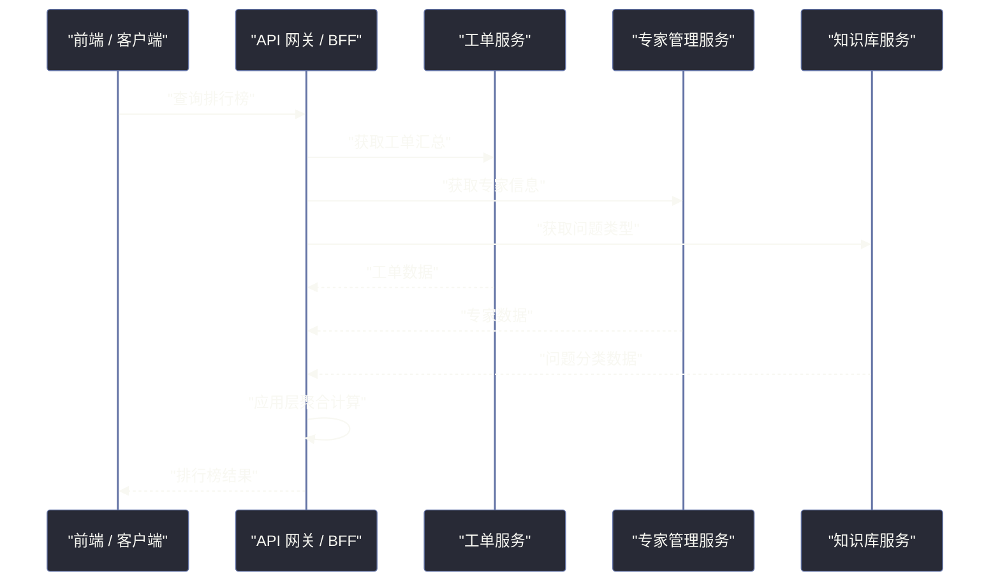
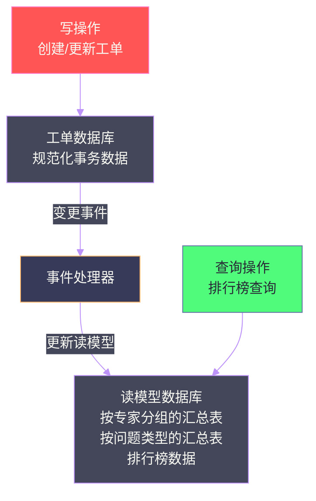
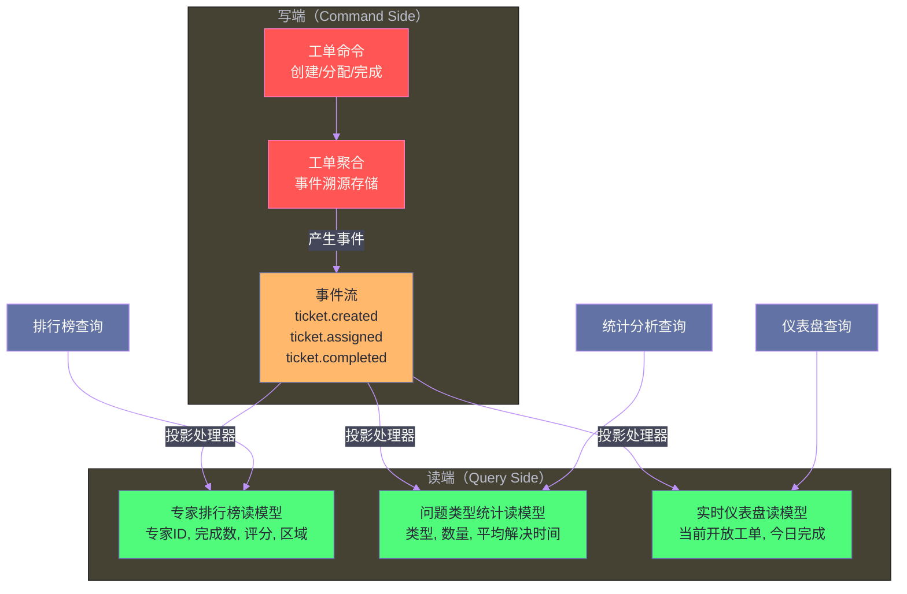
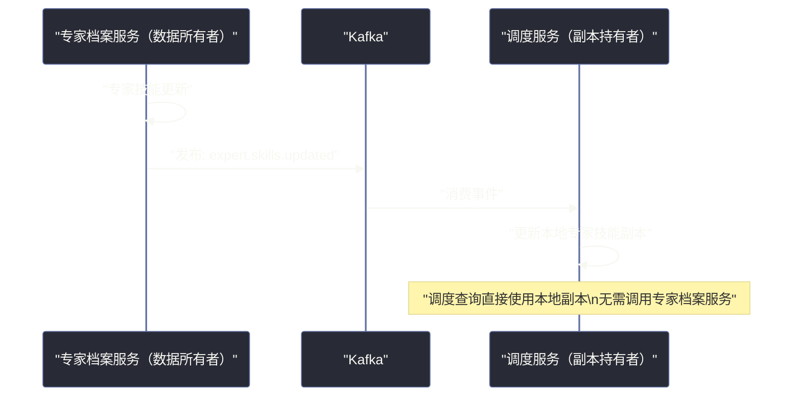

# 09 分布式数据访问模式：当查询跨越服务边界

## 摘要

拆分服务后，一个业务查询往往需要聚合来自多个服务的数据。在单体中，一条 JOIN 语句可以轻松完成的操作，在微服务中变成了需要协调多个网络调用、处理数据格式差异、权衡延迟与一致性的复杂工程问题。本文系统梳理《Software Architecture: The Hard Parts》第 10 章中的五种分布式数据访问模式，帮助架构师根据查询特征、数据规模和一致性要求，选择合适的实现方式。

---

## 第 1 章 跨服务查询的本质挑战

### 1.1 问题的来源

微服务数据自治原则要求每个服务管理自己的数据库，禁止跨服务直接访问数据库。这个原则保障了服务的独立演化能力，但同时带来了一个问题：**当业务查询需要整合多个服务的数据时，该怎么办？**

**Sysops Squad 场景**：管理员需要查看"过去 30 天内，按专家分组、按问题类型聚合的工单完成率排行榜"。这个查询需要工单数据（工单服务所有）、专家信息（专家管理服务所有）和问题分类（知识库服务所有）三方数据联合计算。

在单体中，这是一条带 JOIN 和 GROUP BY 的 SQL 语句，开销极小。在微服务中，这个查询需要跨越三个服务边界。

### 1.2 五种模式的出发点

不同的业务查询有不同的特征，需要不同的解法：
- 实时性要求：是否需要毫秒级的最新数据？
- 数据量：涉及的数据集大小是几行还是几百万行？
- 查询复杂度：是简单的字段聚合还是复杂的多维分析？
- 调用频率：是低频的管理报表还是高频的用户界面请求？

---

## 第 2 章 五种分布式数据访问模式

### 2.1 模式一：服务间 API 调用（Inter-Service API Call）

**是什么**：调用方服务直接通过 HTTP/gRPC API 调用其他服务，获取所需数据后在应用层合并。



**优点**：实现简单，数据实时，无需额外基础设施。

**缺点**：
- 串行调用时，总延迟 = 各服务延迟之和；并行调用时，总延迟 = 最慢服务的延迟
- 当被调用的服务不可用时，整个查询失败（可用性耦合）
- 需要在应用层编写数据聚合逻辑，复杂查询的代码会非常冗长

**适用场景**：需要聚合的服务数量少（2-3 个），数据量小，实时性要求高，且各服务可用性有保障。

### 2.2 模式二：API 网关聚合（API Gateway Aggregation）

**是什么**：在 API 网关层实现数据聚合逻辑，网关负责并行调用多个服务，合并结果后返回给客户端。这是模式一的一种架构化实现——将聚合逻辑从业务服务中提取出来，集中在网关层。

**与 BFF（Backend For Frontend）的关系**：BFF 是 API 网关聚合模式的一种特例——为特定的客户端（如移动端、Web 端）定制一个专属的网关层，它负责聚合多个服务的数据，并将结果裁剪为客户端所需的格式，避免客户端直接调用多个服务。

**优点**：
- 将聚合逻辑集中在一处，业务服务保持单一职责
- 可以在网关层实现并行调用优化

**缺点**：
- 网关层逻辑越来越复杂，可能演变为新的"分布式单体"
- 网关成为全系统的流量入口，是潜在的性能瓶颈

**适用场景**：客户端类型多样（移动/Web/IoT），每类客户端所需数据结构不同，BFF 模式可以有效减少"过度取数"（Over-fetching）和"不足取数"（Under-fetching）问题。

### 2.3 模式三：数据复制（Data Replication）

**是什么**：服务 A 将自己所有的部分数据复制到服务 B 的数据库中。服务 B 在查询时，直接从本地数据库读取，无需跨服务调用。


**优点**：
- 消除了查询时的跨服务调用，查询延迟极低（本地 SQL）
- 查询方服务在数据源服务不可用时仍然可以正常工作

**缺点**：
- **数据一致性延迟**：复制通常是异步的，存在数据复制延迟
- **数据冗余**：相同数据存储在多个地方，增加存储成本
- **数据治理复杂**：哪些数据被复制到哪里？谁负责维护副本的准确性？随着复制关系增多，形成难以管理的"数据蜘蛛网"

**适用场景**：需要频繁查询的参照数据（如专家信息、地区信息、产品目录），且这类数据的更新频率低，可以接受秒级到分钟级的数据延迟。

### 2.4 模式四：缓存（Caching）

**是什么**：对跨服务查询的结果进行缓存，后续相同的查询直接从缓存读取，无需再次调用下游服务。

**本质**：缓存是数据复制的一种特例，区别在于缓存有过期时间（TTL），数据复制通常是"永久"维护的。

**优点**：显著降低下游服务压力，减少查询延迟。

**缺点**：
- **缓存一致性问题**：数据更新后，缓存中的旧数据在 TTL 内仍然有效，查询结果可能是过期的
- **缓存失效风暴（Cache Stampede）**：大量缓存同时过期，导致瞬间大量请求直接打到下游服务
- **缓存穿透/击穿**：恶意查询不存在的数据，绕过缓存每次都打到数据库

**适用场景**：查询频率高但数据更新不频繁，且业务可以容忍一定时间内的数据不一致（典型的 TTL = 1-5 分钟）。

### 2.5 模式五：CQRS（命令查询责任分离）

**是什么**：将写操作（Command）和读操作（Query）分离为两个独立的数据模型。写操作维护规范化的事务数据，读操作维护专门为查询优化的非规范化读模型（Read Model / Projection）。

读模型通常由事件驱动维护：每当写操作产生事件（如"工单已完成"），读模型的维护组件订阅该事件并更新读模型中的汇总数据。



**优点**：
- 读模型专门为特定查询优化，查询性能极高（无需复杂的 JOIN 和聚合）
- 读写模型可以独立扩容（读多写少的系统可以将读模型部署在更多副本上）
- 写操作不再受查询性能的影响（规范化数据库对写入更友好）

**缺点**：
- **架构复杂度高**：需要维护两套数据模型和事件驱动的同步机制
- **最终一致性**：写入数据到读模型更新之间存在延迟
- **事件溯源依赖**：完整的 CQRS 通常与事件溯源（Event Sourcing）配合使用，进一步增加了学习和实现成本

**适用场景**：读写比例悬殊（读远多于写），且查询需求多样（不同的查询需要不同维度的聚合），CQRS 提供了极高的查询灵活性。

---

## 第 3 章 五种模式的选择矩阵

| 模式 | 实时性 | 查询复杂度 | 数据规模 | 耦合程度 | 实现复杂度 |
|------|--------|----------|---------|---------|----------|
| 服务间 API 调用 | 高 | 低 | 小 | 运行时耦合 | 低 |
| API 网关聚合 | 高 | 中 | 中 | 运行时耦合 | 中 |
| 数据复制 | 中（有延迟）| 高 | 大 | 低（事件驱动）| 中 |
| 缓存 | 中（TTL 内）| 中 | 中 | 低 | 低 |
| CQRS | 中（有延迟）| 高 | 大 | 低（事件驱动）| 高 |

**决策建议**：
- 简单聚合 + 高实时性 → 服务间 API 调用（并行调用优化延迟）
- 多客户端差异化需求 → API 网关 / BFF 模式
- 参照数据频繁被查询 → 数据复制（接受延迟）
- 热点数据 + 更新不频繁 → 缓存
- 复杂分析查询 + 读多写少 → CQRS + 专用读模型

---

## 第 4 章 总结

分布式数据访问没有通用解法，每种模式都在实时性、复杂度、耦合程度之间做不同的取舍。核心决策框架是：**先评估查询的实时性要求和复杂度，再选择匹配的数据访问模式**，避免为所有查询都套用同一种模式。

下一篇将从"读操作"转向"流程编排"，探讨分布式工作流中编排（Orchestration）与编舞（Choreography）两种风格的根本差异和适用场景。

---

## 延伸阅读

- [[CQRS Pattern]]：Greg Young 关于 CQRS 的原始论文和解释
- [[Event Sourcing]]：与 CQRS 配合使用的事件存储模式
- [[BFF Pattern]]：Sam Newman 关于 Backend For Frontend 模式的描述
- [[Designing Data-Intensive Applications]] 第 11 章：流处理与 CQRS 的结合

---

## 第 5 章 CQRS 的深度实践

### 5.1 CQRS 的事件驱动实现

CQRS 最强大的实现形式是与事件溯源（Event Sourcing）结合：写端将所有操作记录为不可变的事件序列（Event Stream），读端通过订阅事件流、将事件投影（Projection）到针对查询优化的读模型中。

以 Sysops Squad 的排行榜功能为例：



每个"投影处理器"维护一个专门的读模型，读模型的数据结构完全针对对应的查询类型优化，无需进行复杂的 JOIN 或聚合计算。

### 5.2 投影（Projection）的设计原则

**一个查询场景对应一个读模型**：不要试图用一个读模型满足所有查询需求。如果"专家排行榜"和"问题类型统计"的查询结构不同，就维护两个独立的读模型。

**读模型的数据结构完全由查询决定**：读模型不是数据库表的翻版，而是针对特定查询预先计算好的"查询结果缓存"。

```sql
-- 专家排行榜读模型（针对"按完成率排序的专家"查询优化）
CREATE TABLE expert_performance_projection (
    expert_id        VARCHAR(50) PRIMARY KEY,
    expert_name      VARCHAR(200),
    region           VARCHAR(100),
    total_assigned   INT DEFAULT 0,
    total_completed  INT DEFAULT 0,
    avg_rating       DECIMAL(3,2),
    completion_rate  DECIMAL(5,4) GENERATED ALWAYS AS 
                     (CASE WHEN total_assigned > 0 
                      THEN total_completed::decimal / total_assigned 
                      ELSE 0 END) STORED,
    updated_at       TIMESTAMP
);

-- 查询排行榜只需要一条简单 SELECT，无需 JOIN 或聚合
SELECT expert_name, region, completion_rate, avg_rating
FROM expert_performance_projection
ORDER BY completion_rate DESC, avg_rating DESC
LIMIT 20;
```

### 5.3 CQRS 的挑战：投影的维护

**挑战一：投影处理器的幂等性**

事件流（Kafka）通常保证 at-least-once delivery，即同一个事件可能被多次消费。投影处理器在处理事件时必须是幂等的——处理同一个事件多次，得到的结果与处理一次相同。

实现方式：在读模型中记录已处理事件的 ID（或偏移量），每次处理前检查是否已经处理过。

**挑战二：投影的重建（Replay）**

当需要修改读模型的结构（如添加新的统计维度），或者读模型数据损坏时，需要从事件流的起点重新投影，重建整个读模型。

**解决方案**：设计"蓝绿投影"机制——新投影在独立的表中构建，构建完成后将查询路由到新投影，再删除旧投影。这样读模型的重建不影响正在运行的查询。

**挑战三：多个投影之间的一致性**

不同的投影处理器在消费同一个事件时，可能处于不同的消费进度（一个处理器消费到第 100 个事件，另一个只消费到第 80 个）。这意味着，在查询"专家排行榜"和"问题类型统计"时，两者反映的时间点可能不同。

对于大多数业务场景，这种轻微的不一致是可以接受的——排行榜数据延迟几秒与统计数据延迟几秒，不会影响业务决策。但如果某些业务逻辑要求跨查询的一致性，需要额外的协调机制。

---

## 第 6 章 数据复制的深度实践

### 6.1 事件驱动的数据复制

数据复制的最佳实现方式是事件驱动：当数据所有者（如专家档案服务）的数据发生变化时，发布一个数据变更事件，需要数据副本的服务订阅该事件并更新本地副本。



**关键设计**：副本的更新应该是**幂等的**，即多次接收同一个更新事件，结果与接收一次相同（可以用 `INSERT OR REPLACE` 或 `UPSERT` 语义实现）。

### 6.2 初始数据同步（Bootstrap）

在服务第一次启动或数据副本损坏时，需要进行"初始全量同步"：从数据所有者服务获取完整的数据集，建立初始副本，然后再切换到事件驱动的增量更新模式。

全量同步通常通过以下方式实现：
- 调用数据所有者服务的"全量导出 API"
- 或者直接从数据所有者的数据库做只读的历史数据快照导出

全量同步与增量更新之间的切换需要处理"间隙问题"：全量同步期间发生的变更，必须通过之后的增量事件补齐。实践中，通常是：

1. 记录全量同步开始时的事件偏移量（Kafka Offset）
2. 执行全量同步
3. 从记录的偏移量开始消费事件，补齐全量同步期间的变更

---

## 第 7 章 跨服务查询的性能调优

### 7.1 并行请求：减少串行调用的总延迟

当使用服务间 API 调用模式时，如果多个服务的查询相互独立，应该并行发起请求，而不是串行等待。

**串行调用（低效）**：
```
总延迟 = 工单服务响应时间(50ms) + 专家服务响应时间(30ms) + 知识库响应时间(20ms)
       = 100ms
```

**并行调用（高效）**：
```
总延迟 = max(工单服务50ms, 专家服务30ms, 知识库20ms) = 50ms
```

使用异步编程模型（Java CompletableFuture、Go goroutine、Python asyncio）发起并行调用，将总延迟从各服务延迟之和压缩到最慢服务的延迟。

### 7.2 超时和降级：保护整体可用性

在多服务调用中，任何一个服务的缓慢响应都会拖慢整体请求。必须为每个服务调用设置独立的超时：

```java
// 每个服务调用有独立的超时设置
CompletableFuture<Tickets> ticketsFuture = 
    CompletableFuture.supplyAsync(() -> ticketService.getTickets())
    .orTimeout(200, TimeUnit.MILLISECONDS)
    .exceptionally(e -> Collections.emptyList()); // 超时时降级返回空列表

CompletableFuture<Experts> expertsFuture = 
    CompletableFuture.supplyAsync(() -> expertService.getExperts())
    .orTimeout(100, TimeUnit.MILLISECONDS)
    .exceptionally(e -> cachedExperts.get()); // 超时时使用缓存数据
```

**降级策略**：当某个服务不可用时，返回"降级值"而非直接失败：
- 排行榜所需的某个数据维度不可用 → 在排行榜中标注"部分数据暂时不可用"，其他维度正常显示
- 专家信息服务超时 → 返回缓存的专家信息（可能有轻微延迟），而非返回错误

---

## 第 8 章 总结：五种模式的选择决策

### 8.1 综合决策流程

在选择分布式数据访问模式时，建议按以下顺序评估：

**第一步：明确查询的实时性要求**
- 实时性要求 < 1秒 → 仅考虑服务间 API 调用或 API 网关聚合
- 实时性要求 < 1分钟 → 数据复制或缓存（TTL 设为 30-60 秒）
- 实时性要求 < 1小时 → CQRS 读模型（定期刷新）

**第二步：评估查询复杂度**
- 简单字段聚合（合并 2-3 个服务的少量字段）→ 服务间 API 调用
- 复杂多维聚合（排行榜、趋势分析）→ CQRS 专用读模型

**第三步：评估数据量**
- 查询涉及的数据记录 < 1000 条 → 服务间 API 调用可以满足
- 查询涉及的数据记录 > 10000 条 → 数据复制到本地后再查询

**第四步：评估调用频率**
- 低频查询（每分钟 < 10 次）→ 服务间 API 调用
- 高频查询（每分钟 > 1000 次）→ 缓存或数据复制

遵循这个评估流程，可以避免为简单查询引入 CQRS 的复杂度，也避免用简单的 API 调用去承担复杂聚合查询的压力。

---

## 附录：GraphQL 作为跨服务聚合层

### GraphQL 的聚合能力

GraphQL 是一种查询语言和运行时，允许客户端精确指定需要哪些字段，并在服务端按需聚合来自多个数据源的数据。在微服务架构中，GraphQL 可以作为一种高级的 API 网关聚合模式。

```graphql
# 客户端精确指定所需字段，GraphQL 聚合来自多个服务的数据
query ExpertLeaderboard($region: String!, $limit: Int!) {
    expertLeaderboard(region: $region, limit: $limit) {
        expert {
            id
            name          # 来自专家档案服务
            certifications # 来自专家档案服务
        }
        performance {
            completionRate  # 来自工单统计服务
            avgRating       # 来自评价服务
            totalCompleted  # 来自工单统计服务
        }
        knowledgeAreas {
            category       # 来自知识库服务
            proficiency    # 来自专家档案服务
        }
    }
}
```

GraphQL 服务端的 Resolver 分别调用专家档案服务、工单统计服务、评价服务和知识库服务，将结果合并后返回给客户端。

**GraphQL Federation**：当系统规模更大时，可以使用 Apollo Federation 将多个 GraphQL 服务组合成一个统一的 Supergraph，每个服务负责自己的子图（Subgraph），Federation 自动处理跨子图的查询分发和数据合并。

### GraphQL vs REST 在聚合场景的对比

| 维度 | REST + 多次调用 | GraphQL |
|------|---------------|---------|
| 过度取数（Over-fetching）| 高（每个 API 返回固定字段）| 低（客户端精确指定所需字段）|
| 不足取数（Under-fetching）| 高（需要多次请求）| 低（单次请求可以获取所有数据）|
| 后端复杂度 | 低 | 中（需要维护 Schema 和 Resolver）|
| 学习曲线 | 低 | 中等 |
| 缓存 | 容易（HTTP 缓存）| 较复杂（需要 Apollo Client 等专用缓存）|

GraphQL 在查询灵活性上有明显优势，但引入了新的复杂度。对于查询模式固定（少数几种固定格式）的系统，REST + BFF 模式足够；对于查询模式多样（不同客户端有不同需求，前端需要自由组合）的系统，GraphQL 的价值更突出。

---

## 附录：跨服务查询的测试策略

### 集成测试的必要性

跨服务查询的正确性依赖于多个服务的协同，单元测试（Mock 其他服务）只能验证聚合逻辑本身，无法验证各服务返回的数据格式是否符合预期。

**消费者驱动契约测试（CDC）**：

在测试"排行榜聚合服务"时，使用 [[Pact]] 框架：
- 排行榜服务作为"消费者"，定义它对各下游服务 API 的期望（数据格式、字段含义）
- 各下游服务作为"提供者"，运行 Pact 测试，验证自己的实现符合所有消费者的期望

这样，即使不部署完整的集成测试环境，也能在 CI 阶段验证服务间的 API 兼容性。

### 性能测试的关键点

跨服务查询的性能测试需要特别关注：

- **真实的并发模式**：使用生产流量的并发模式进行压测，而非简单的线性增加
- **下游服务的延迟注入**：模拟某个下游服务的延迟增加（如从 30ms 增加到 300ms），验证整体查询的表现和降级策略是否生效
- **服务不可用场景**：模拟某个下游服务完全不可用，验证降级策略是否按预期工作，整体服务是否还能正常响应（部分数据缺失但不崩溃）

---

## 附录：分布式 JOIN 的替代思路

### 传统数据库 JOIN 在微服务中的消失

在关系型数据库时代，JOIN 是处理多表关联查询的标准工具，性能高效，语义清晰。微服务架构打破了跨服务的 JOIN 能力——你不能在不同数据库实例之间执行 SQL JOIN。

但 JOIN 的需求并没有消失，只是需要用不同的方式满足：

| 传统数据库 JOIN | 微服务替代方案 |
|----------------|--------------|
| INNER JOIN（两张表有对应记录才返回）| 服务间 API 调用，过滤掉没有对应记录的结果 |
| LEFT JOIN（主表记录 + 可选的关联记录）| 服务间 API 调用，关联服务失败时返回 null |
| 聚合查询（COUNT/SUM/AVG）| CQRS 读模型预计算 |
| 全文搜索 + 关联查询 | 专用的搜索服务（Elasticsearch），包含预先投影的关联数据 |

### 搜索服务（Search Service）作为数据聚合层

对于需要全文搜索 + 复杂过滤 + 关联数据展示的查询场景（如"搜索'网络问题'相关工单，并展示工单、分配专家、问题分类"），专用的搜索索引（[[Elasticsearch]]、[[OpenSearch]]）是一种高效的解法。

**工作原理**：

1. 各服务发布数据变更事件
2. 索引处理器（Indexer）消费事件，将来自多个服务的数据合并，写入搜索索引
3. 搜索查询直接命中搜索索引，无需跨服务调用

索引中存储的是"预先 JOIN 过的非规范化文档"，查询时无需 JOIN：

```json
{
  "ticketId": "T001",
  "title": "网络连接异常",
  "description": "...",
  "assignedExpert": {
    "id": "E042",
    "name": "张专家",
    "certifications": ["CCNA", "CCNP"]
  },
  "category": {
    "id": "C003",
    "name": "网络问题",
    "subcategory": "连接故障"
  },
  "status": "COMPLETED",
  "completedAt": "2024-01-15T14:30:00Z"
}
```

搜索索引是数据复制思想的一种特殊应用，专门针对搜索和复杂过滤查询优化。代价是数据延迟（索引更新有延迟）和数据冗余（同一份数据存在多处）。
