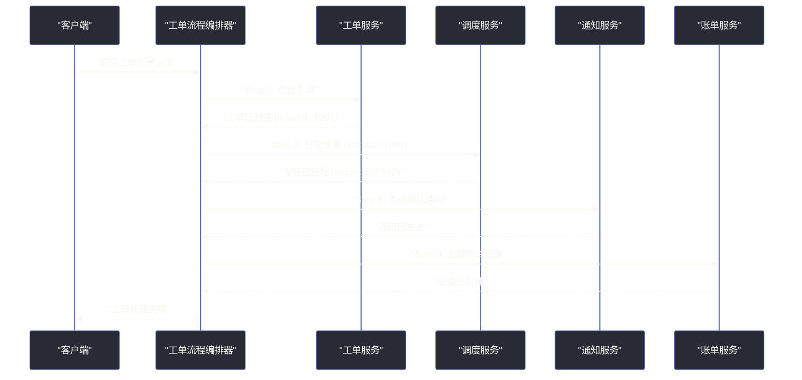
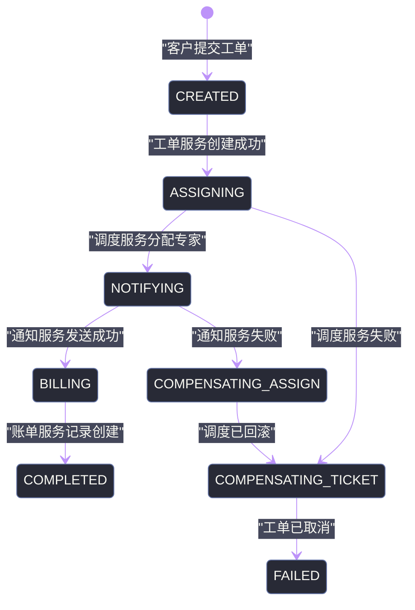
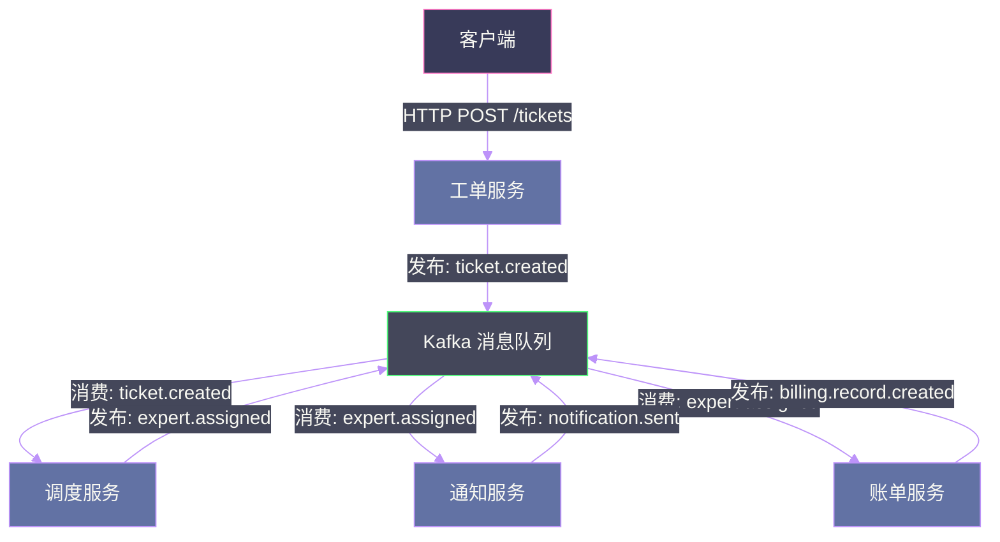
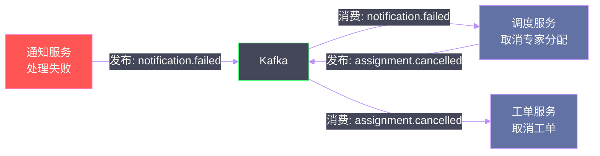
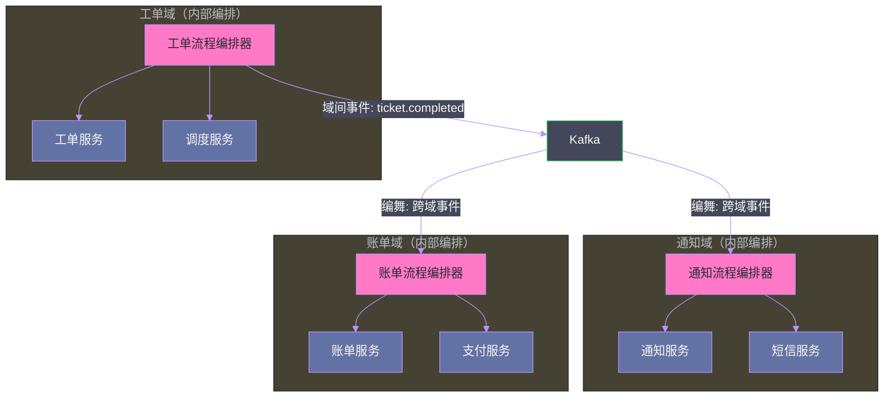

# 10 分布式工作流：编排与编舞的架构选择

## 摘要

当一个业务流程需要多个微服务按照特定顺序协作完成时，如何协调这些服务？是由一个"指挥家"（编排器）统一调度，还是让服务通过事件"自发协作"？这不是一个技术选型问题，而是一个影响系统弹性、可维护性和团队协作方式的架构哲学问题：你在不同的服务之间分配多少"知识"？谁拥有流程的全局视角？谁对失败负责？本文系统分析《Software Architecture: The Hard Parts》第 11 章，从通信模式、错误处理、可观测性、团队自治和工具选型五个维度深度比较编排（Orchestration）与编舞（Choreography），并通过 Sysops Squad 全链路案例展示两种模式在实际系统中的落地实践。

---

## 第 1 章 问题的本质：分布式协调的不可避免性

### 1.1 单体中的"免费协调"

在单体架构中，跨模块的业务流程协调是"免费的"——调用一个方法，方法内部可以调用其他模块的方法，所有调用共享同一个线程栈、同一个数据库事务、同一个内存空间。协调的代价几乎为零，你甚至不会意识到"协调"是一个需要专门解决的问题。

以 Sysops Squad 为例，在单体时代，工单处理流程可能是这样的：

```java
// 单体中的工单处理——一个事务解决所有问题
@Transactional
public void processTicket(TicketRequest request) {
    Ticket ticket = ticketService.create(request);    // 创建工单
    Expert expert = schedulingService.assign(ticket); // 分配专家
    notificationService.notify(ticket, expert);       // 发送通知
    billingService.createRecord(ticket);              // 创建账单记录
    // 任何一步抛出异常，整个事务自动回滚，状态始终一致
}
```

这段代码背后，数据库 ACID 保证了事务原子性，调用栈保证了执行顺序，Java 异常机制保证了失败时的回滚。开发者只需思考业务逻辑本身，"协调"是框架自动提供的基础能力。

### 1.2 微服务打破了隐式协调

当工单服务、调度服务、通知服务和账单服务成为四个独立微服务时，以上代码变得不可行：

- 四个服务各有独立数据库，无法共享同一个数据库事务
- 四个服务独立部署，调用需要跨越网络——网络有延迟，有分区，有超时
- 某个服务的临时故障不应该让整个流程永久失败（弹性要求）
- 某些流程步骤需要等待外部确认（等待运维人员处理，可能需要数小时）

微服务架构把"协调"从隐式问题变成了**显式的架构决策**，你必须主动回答：

1. 谁知道整个流程的全貌和当前进度？
2. 谁负责推进下一步？
3. 某步失败时，谁负责触发补偿/回滚？
4. 如何查询一个具体工单的当前处理进度？

编排和编舞是这些问题的两种截然不同的答案，代表了两种分布式系统设计哲学。

---

## 第 2 章 编排（Orchestration）：中心指挥官模式

### 2.1 核心思想：集中持有流程知识

编排是**中心化的**协调方式。存在一个"编排器（Orchestrator）"，它是整个流程的唯一知情者——它知道流程有哪些步骤、每步应该由哪个服务执行、每步的依赖关系是什么、失败时应该怎么处理。其他服务是"愚蠢的执行者"，它们只知道如何完成被分配的单个任务，不知道也不需要知道整个业务流程。

以 Sysops Squad 的工单创建流程为例，在编排模式下：



**编排器拥有完整的流程状态**，任何时候可以回答"工单 T001 现在在哪一步"。

### 2.2 编排器的内部状态机

一个健壮的编排器本质上是一个**持久化的状态机**。每次流程推进，状态机都将当前状态写入持久存储（数据库或专用的工作流存储），这样即使编排器进程崩溃重启，它也能从上次中断的地方恢复，而不是从头重新执行。



这个状态机包含两条路径：**正向流程**（Happy Path）和**补偿路径**（Compensation Path）。每个状态的转换都被持久化，确保系统重启后可以精确恢复。

### 2.3 编排模式的错误处理：有序补偿

编排模式的错误处理是编排模式最大的优势之一，逻辑清晰、可控：

**场景**：工单 T001 的通知服务（Step 3）失败，此时 Step 1（工单创建）和 Step 2（专家分配）已经成功完成。

编排器的处理逻辑：

```
1. 检测到 Step 3 失败
2. 查询已完成的步骤列表：[Step 1, Step 2]
3. 逆序触发补偿：
   - 补偿 Step 2：调用调度服务的"取消分配"接口
   - 补偿 Step 1：调用工单服务的"取消工单"接口
4. 将流程状态标记为 FAILED
5. 可选：向监控系统发送告警，或将请求放入人工处理队列
```

整个补偿逻辑集中在编排器中，**任何参与服务都不需要知道"当我失败后，其他服务应该做什么"**。补偿的责任和知识完全属于编排器。

> [!info] 补偿事务 vs 数据库回滚
> 数据库回滚（ROLLBACK）是原子的、同步的，撤销数据库层面的操作。Saga 的补偿事务是业务层面的撤销操作，是异步的、最终一致的。补偿事务不能撤销所有副作用——已经发送的短信无法"物理撤回"，只能发送一条"您的工单已被取消"的通知。这是 Saga 补偿和数据库回滚之间本质的区别。

### 2.4 编排模式的可观测性：天然的仪表盘

由于编排器持有所有流程的状态，它天然成为了整个系统的"流程仪表盘"：

- "查询所有处于 ASSIGNING 状态超过 10 分钟的工单" → 直接查询编排器数据库
- "工单 T001 卡在哪一步了？" → 直接查询编排器状态
- "今天有多少工单的通知步骤失败了？" → 直接查询编排器的失败记录

这种可观测性不需要任何额外的基础设施，是编排模式的内置能力。

### 2.5 编排模式的代价：中心化的双刃剑

编排模式的集中化在带来可见性和控制力的同时，也带来了两个系统性问题：

**问题一：编排器的团队瓶颈**

在一个多团队组织中，如果工单流程涉及 5 个团队（工单团队、调度团队、通知团队、账单团队、风控团队），那么每次流程变更（比如在 Step 3 之后加入风控检查步骤），都需要修改编排器的代码。

编排器由谁维护？通常是"平台团队"或"架构团队"。这意味着：任何业务团队想修改流程，都需要让平台团队来实现变更。随着系统规模增长，平台团队成为所有流程变更的**瓶颈**。

**问题二：编排器成为新的单体**

如果系统中所有的业务流程都由同一个编排器管理，这个编排器会随着业务增长变得越来越庞大，它知道系统中每一个业务流程的细节——这是[[分布式单体（Distributed Monolith）]]的一种变体。编排器的部署、测试和故障排查的复杂度会逐渐失控。

> [!warning] 编排器的规模陷阱
> 避免"一个编排器管理所有流程"的设计。健康的实践是：每个业务领域有自己的编排器（工单领域编排器、账单领域编排器），而不是一个全局编排器。这与微服务的"每个服务管理自己的数据库"原则类似——将编排器的职责也按领域边界划分。

---

## 第 3 章 编舞（Choreography）：去中心化协作模式

### 3.1 核心思想：知识分散到各服务

编舞是**去中心化的**协调方式。没有任何中心组件知道整个流程的全貌。每个服务只知道两件事：

1. 我关心哪些事件类型？（订阅什么）
2. 当我处理完成后，我应该发布什么事件？

整个业务流程是通过这些事件链条**隐式地**编排完成的。

以同样的 Sysops Squad 工单处理流程为例，在编舞模式下：



**没有任何服务知道整个流程的全貌**。工单服务只知道"创建完工单后发布 `ticket.created` 事件"，它不知道调度服务的存在；调度服务只知道"收到 `ticket.created` 后分配专家，然后发布 `expert.assigned`"，它不知道通知服务的存在。

### 3.2 编舞模式的松耦合：新服务的无缝接入

编舞的最大优势是**扩展性**。假设 Sysops Squad 决定增加一个"工单质量评分服务"——当专家被分配后，自动发起质量预评估。

在编排模式中，需要修改编排器，在 Step 2 之后加入 Step 2.5。

在编舞模式中，只需要：
1. 创建"质量评分服务"
2. 让它订阅 `expert.assigned` 事件
3. 完成评分后发布 `quality.scored` 事件

**零修改现有服务**，零修改"流程定义"（因为根本没有一个集中的流程定义），新服务完全自主地接入了现有流程。

### 3.3 编舞模式的错误处理：分散的补偿逻辑

编舞模式的错误处理是其最大的挑战。以同样的"通知服务失败"场景为例：

通知服务处理失败后，它需要：
1. 发布 `notification.failed` 事件（到 Kafka）
2. 调度服务订阅 `notification.failed`，执行"取消专家分配"操作，然后发布 `expert.assignment.cancelled`
3. 工单服务订阅 `expert.assignment.cancelled`，执行"取消工单"操作



问题在于：
- 补偿逻辑分散在每个服务中，没有一个地方可以看到完整的补偿流程
- 如果调度服务在执行"取消分配"时也失败，需要再发一个 `cancellation.failed` 事件，进一步的补偿链条难以追踪
- 随着流程步骤增多，失败场景的组合数量呈指数增长，每种场景都需要对应的补偿事件和处理逻辑

### 3.4 编舞模式的可观测性挑战：流程的隐形化

在编舞模式中，"工单 T001 现在在哪一步？"这个简单的问题变成了一个需要关联多个系统数据的调查任务：

1. 查询工单服务的数据库：工单 T001 存在，状态为"CREATED"
2. 查询调度服务的数据库：有专家分配记录
3. 查询通知服务的日志：...出错了？或者还没消费到？
4. 查询 Kafka 的 Consumer Group Offset：消费到哪条消息了？

这需要：
- **分布式追踪（Distributed Tracing）**：通过 Trace ID 串联跨服务的操作记录（[[Jaeger]]、[[Tempo]]、[[Zipkin]]）
- **集中式日志（Centralized Logging）**：将所有服务的日志汇聚到一处（[[Elasticsearch]] + [[Kibana]]）
- **事件流监控**：监控 Kafka 的 Consumer Group Lag，检测消费积压

这些基础设施在生产系统中是必须的，但它们有成本——无论是人力成本还是运维复杂度。

---

## 第 4 章 两种模式的综合比较

### 4.1 七个维度的系统对比

| 比较维度 | 编排 | 编舞 |
|---------|------|------|
| **流程知识** | 集中于编排器 | 分散在各服务 |
| **耦合类型** | 编排器与参与服务耦合 | 服务与事件模式耦合 |
| **错误处理** | 集中、清晰、易实现 | 分散、复杂、难追踪 |
| **可观测性** | 天然高（编排器即仪表盘） | 需要专门的追踪基础设施 |
| **服务扩展** | 需要修改编排器 | 无需修改现有服务 |
| **测试难度** | 较低（编排器可单独测试） | 较高（需要集成测试整个事件链路） |
| **适用团队规模** | 小型、单一团队 | 大型、多团队、高度自治 |

### 4.2 耦合类型的微妙差异

编排和编舞**都存在耦合**，只是耦合的形式不同：

**编排的耦合**：编排器"知道"每个参与服务——它知道工单服务的接口、调度服务的接口、通知服务的接口。这是**直接的服务间耦合**。

**编舞的耦合**：每个服务"知道"它关心的事件模式——它知道 `ticket.created` 事件的 Schema、`expert.assigned` 事件的 Schema。这是**事件契约耦合（Event Contract Coupling）**。

事件契约耦合相对更轻量，因为修改事件消费者（如新增一个消费 `expert.assigned` 的服务）不需要修改事件生产者（调度服务）。但事件 Schema 的变更（如 `expert.assigned` 事件增加一个字段）仍然会影响所有消费者——只是影响是**可选择性的**（消费者可以选择忽略新字段），而编排器的接口变更通常是**强制性的**。

### 4.3 规模决定选择

书中给出了一个关键洞察：**编排和编舞的优劣不是绝对的，而是随着团队规模和系统复杂度而变化的**。

| 系统规模 | 推荐方式 | 理由 |
|---------|---------|------|
| 单团队、5-10个服务 | 编排 | 团队可以整体理解系统，编排器的集中控制带来效率 |
| 多团队、10-30个服务 | 混合（内部编排，外部编舞）| 域内高内聚，域间低耦合 |
| 大型组织、30+个服务 | 偏向编舞 | 无法在单一编排器中维护所有流程的知识 |

---

## 第 5 章 混合模式：领域边界内外的不同选择

### 5.1 混合策略的核心原则

书中明确指出：编排和编舞并非对立，**在同一个系统中混合使用两种模式是成熟架构的常见选择**。

一个简洁的混合策略：

- **域内（Intra-domain）使用编排**：在单一业务领域（如工单领域）内部，用编排器管理复杂的多步骤状态机，享受清晰的错误处理和高可观测性
- **域间（Inter-domain）使用编舞**：不同业务领域之间（工单域→账单域、工单域→通知域）通过事件松耦合地协作，每个域保持高度自治



这种设计将两种模式的优点结合：
- 域内：编排器提供流程透明性和集中错误处理
- 域间：事件驱动实现领域自治，工单域不需要知道通知域的内部实现

---

## 第 6 章 工具选型：编排引擎 vs 消息队列

### 6.1 编排的工具选择

编排器不一定需要从零开始实现状态机。现代工作流引擎提供了开箱即用的持久化状态机、重试、超时、人工干预等能力：

**[[Temporal.io]]**：
- 以"持久化函数（Durable Functions）"为核心抽象
- 用普通代码（Java/Go/Python/TypeScript）编写工作流逻辑，框架自动处理持久化和重放
- 原生支持长时间运行的工作流（等待数天、等待外部事件）
- 适合需要精确控制重试策略、超时和补偿逻辑的场景

```java
// Temporal 工作流示例（伪代码）
@WorkflowInterface
public class TicketWorkflow {
    @WorkflowMethod
    public void processTicket(TicketRequest request) {
        // Temporal 自动处理这个工作流的持久化和故障恢复
        String ticketId = activities.createTicket(request);
        
        try {
            String expertId = activities.assignExpert(ticketId);
            activities.sendNotification(ticketId, expertId);
            activities.createBillingRecord(ticketId);
        } catch (ActivityFailure e) {
            // 补偿逻辑，Temporal 确保这段代码在失败时被可靠执行
            activities.cancelTicket(ticketId);
            throw e;
        }
    }
}
```

**[[Camunda / Zeebe]]**：
- 基于 BPMN（Business Process Model and Notation）标准的可视化流程建模
- 业务人员可以通过图形界面查看和理解流程
- 适合业务流程复杂、需要业务人员参与流程设计的场景

**自研状态机**：
- 用数据库表存储状态，用定时任务驱动状态转换
- 实现简单，但缺乏高级特性（重试、超时、信号等）
- 适合流程简单、团队不熟悉工作流引擎的场景

### 6.2 编舞的工具选择

编舞通常基于消息队列实现：

**[[Apache Kafka]]**：
- 高吞吐量、持久化的事件流
- 支持多消费者组，同一事件可被多个服务独立消费
- 适合高并发、需要事件回溯（Event Replay）的场景
- Schema Registry（Confluent / AWS Glue）帮助管理事件 Schema 版本

**[[RabbitMQ]]**：
- 传统消息队列，支持丰富的路由规则（Exchange / Binding）
- 延迟更低，但持久化能力和吞吐量不如 Kafka
- 适合低延迟、复杂路由规则的场景

**事件 Schema 管理**：无论使用哪种消息队列，编舞模式都需要认真管理事件的 Schema。推荐使用 Schema Registry + Protobuf / Avro，为每个事件类型定义严格的契约，并在服务发布新事件版本时保持向后兼容。

---

## 第 7 章 编舞的反模式："编舞地狱"

### 7.1 什么是编舞地狱

编舞地狱（Choreography Hell）是编舞模式失控后的典型状态：事件和订阅关系形成了一个庞大、复杂、没有人能完整理解的"蜘蛛网"，任何修改都可能引发难以预料的连锁反应。

征兆：
- 没有人能从代码库中一眼看出某个业务流程的完整步骤
- 当一个服务修改了发布的事件 Schema，其他团队才意外发现自己的消费者出错
- 调试一个业务流程异常需要打开 4+ 个服务的日志
- 新加入的工程师需要数天才能理解系统的核心流程

### 7.2 预防措施

**事件目录（Event Catalog）**：维护一份文档，列出系统中所有的事件类型、生产者和消费者。工具选择：AsyncAPI、EventCatalog（开源工具）。

**消费者告知原则（Consumer-Driven Contract Testing）**：事件生产者发布变更前，必须验证所有消费者的兼容性。[[Pact]] 是一个流行的消费者驱动契约测试工具。

**事件溯源（Event Sourcing）的节制使用**：事件溯源是一个强大但复杂的模式，在编舞架构中引入事件溯源会进一步增加系统复杂度。只有当回溯历史状态是明确的业务需求时，才引入事件溯源。

**流程文档的强制要求**：在团队规范中要求所有跨服务的业务流程必须有对应的流程图文档，并建立自动化工具定期从事件订阅关系重建流程图，与人工维护的文档进行比对，检测两者是否一致。

---

## 第 8 章 测试策略

### 8.1 编排的测试

编排器是一个可以独立测试的组件。测试策略分三层：

**单元测试**：Mock 所有参与服务的接口，测试状态机的状态转换逻辑。重点测试：每个步骤的失败是否触发了正确的补偿序列；状态转换是否正确；补偿的顺序是否正确（逆序）。

**集成测试**：使用 TestContainers 启动真实的数据库和消息队列，测试编排器的完整流程（但仍然 Mock 业务服务的接口）。

**端到端测试**：在 Staging 环境部署所有服务，执行完整的业务流程，验证最终状态的正确性。

### 8.2 编舞的测试

编舞系统的测试更具挑战性，因为没有单一的"流程入口"：

**服务合约测试（Contract Testing）**：验证事件的生产者和消费者对同一 Schema 的理解一致。[[Pact]] 框架可以在不部署所有服务的情况下，验证事件契约的兼容性。

**事件链路集成测试**：在测试环境中发布一个事件，验证整个事件链路能正确触发所有预期的下游操作。这通常需要借助专门的测试框架（如 Spring Cloud Stream 的测试支持）。

---

## 第 9 章 从同步到异步的迁移路径

### 9.1 常见的起点：同步编排

很多团队在微服务初期选择**同步 HTTP 调用的编排模式**——工单服务直接调用调度服务的 HTTP 接口，调度服务直接调用通知服务的接口。这是最简单、最容易理解的起点。

### 9.2 第一步：引入异步消息解耦

当系统规模增长，同步调用链的问题开始显现（某个服务的慢响应影响全链路延迟；某个服务的故障导致全链路失败）。这时引入消息队列作为缓冲：

```
HTTP 同步调用链
→ 引入 Kafka，将非关键步骤（通知、账单）改为异步
→ 核心步骤（创建工单、分配专家）保持同步
```

### 9.3 第二步：引入工作流引擎

当流程的补偿逻辑变得复杂，或者需要支持长时间运行的流程（等待人工审批），引入 Temporal 或 Camunda 这样的工作流引擎，将临时的状态管理代码替换为成熟的框架。

这个迁移路径保证了系统的渐进式演化，不需要一步跨到最终形态。

---

## 第 10 章 Sysops Squad 完整案例：双模式并存

### 10.1 最终架构设计

Sysops Squad 经过讨论后，采用了**混合模式**：

**工单领域内部（编排）**：
- 工单的创建→分配专家→开始处理→完成这个核心流程，由"工单流程编排器"管理
- 使用 Temporal 作为工作流引擎，支持长时间等待（专家处理可能需要数小时）
- 编排器状态完整，随时可以查询任意工单的处理进度

**跨领域通知和账单（编舞）**：
- 工单完成后，发布 `ticket.completed` 事件到 Kafka
- 通知服务订阅该事件，独立地处理客户满意度调查、完成通知
- 账单服务订阅该事件，独立地生成最终账单
- 两个域完全自治，工单域不知道也不需要知道通知域和账单域的存在

### 10.2 这个设计的权衡

**收益**：
- 核心工单流程的可见性和错误处理清晰（编排的优势）
- 通知和账单功能可以独立演化，不影响核心流程（编舞的优势）
- 通知服务的临时故障不影响工单的完成状态

**代价**：
- 需要维护 Temporal 工作流引擎的基础设施
- 工单域和通知域/账单域之间的事件 Schema 需要专门管理
- 端到端的测试覆盖更复杂（需要同时测试编排路径和编舞路径）

---

## 第 11 章 总结

### 11.1 核心决策框架

编排和编舞各有其适用场景，选择的核心维度是：

**选编排，当你需要**：
- 对复杂的有状态流程有全局可见性
- 集中管理错误处理和补偿逻辑
- 流程有复杂的条件分支和并行步骤
- 需要支持长时间运行的流程（等待人工操作）

**选编舞，当你需要**：
- 多个独立团队对各自的服务有完全的自治权
- 流程步骤之间需要严格解耦（允许新步骤的无侵入接入）
- 高吞吐量的事件处理（发布-订阅天然适合高并发）
- 系统已经深度依赖事件驱动架构

### 11.2 记住核心权衡

| 维度 | 编排 | 编舞 |
|------|------|------|
| 流程可见性 | ✅ 高 | ⚠️ 低，需要额外工具 |
| 错误处理 | ✅ 清晰集中 | ⚠️ 分散复杂 |
| 服务自治 | ⚠️ 低 | ✅ 高 |
| 扩展性（新步骤）| ⚠️ 需要修改编排器 | ✅ 零侵入 |
| 团队瓶颈风险 | ⚠️ 编排器成为瓶颈 | ✅ 无中心瓶颈 |

下一篇将深入事务性 Saga 模式——这是编排和编舞在分布式事务场景下的具体应用，书中给出了六种不同的 Saga 变体，每种都对应不同的耦合特征和权衡。

---

## 延伸阅读

- [[Temporal.io 官方文档]]：持久化工作流引擎的实践指南，包含 Java/Go/Python SDK 示例
- [[Saga Pattern]]：分布式长事务的协调模式，与本文的编排模式深度结合
- [[Event-Driven Architecture]]：编舞模式的理论基础，Martin Fowler 的系列博文
- [[Enterprise Integration Patterns]]：Gregor Hohpe 对消息模式和工作流的权威参考
- [[AsyncAPI]]：编舞系统中管理事件 Schema 的开放标准规范
