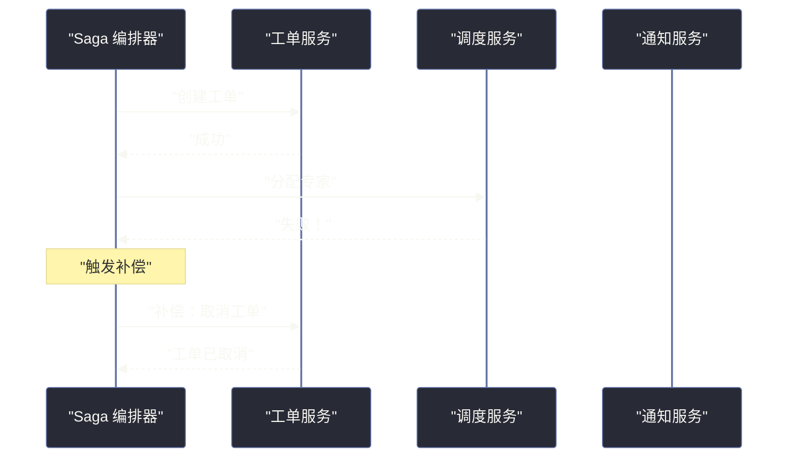
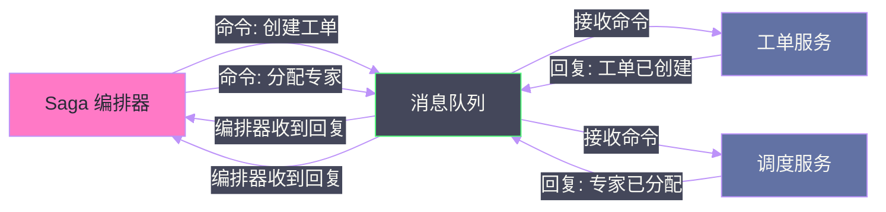
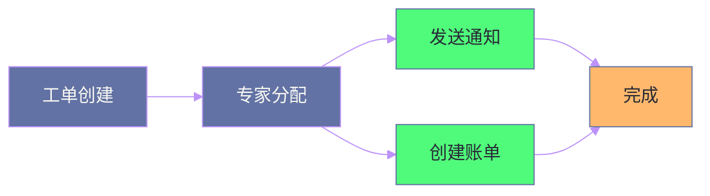

# 11 事务性 Saga 模式：分布式事务的六种现代解法

## 摘要

当一个业务操作需要多个微服务协同完成，且任何一步失败都需要撤销前面已完成的操作时，我们面对的是分布式长事务问题。Saga 模式是目前最主流的解法，但"Saga 模式"并不是一个单一的模式——《Software Architecture: The Hard Parts》第 12 章给出了六种不同的 Saga 变体，每种变体在耦合程度、原子性保障、可查询性和错误处理复杂度上有根本性的差异。本文系统梳理这六种 Saga 变体，帮助架构师理解何时选择哪种。

---

## 第 1 章 Saga 模式的核心思想

### 1.1 什么是 Saga

Saga 是一种管理分布式长事务的模式：将一个需要跨多个服务协调完成的"全局事务"分解为一系列"局部事务"，每个局部事务由单一服务负责，且每个局部事务都有对应的**补偿事务（Compensating Transaction）**。

**关键思想**：当流程中的某一步局部事务失败时，Saga 会逆序执行已完成步骤的补偿事务，从而将整个系统恢复到操作开始前的状态（语义回滚，而非数据库回滚）。

> [!info] 补偿事务 vs 数据库回滚
> 数据库回滚是撤销数据库层面的操作（如 ROLLBACK），是原子的。补偿事务是业务层面的撤销（如"已发送的邮件无法物理撤回，只能发送一封取消邮件"），是最终一致的。Saga 提供的是"语义原子性"，而非"技术原子性"。

### 1.2 六种 Saga 变体的命名

书中用了一套颇有创意的命名方案，将六种 Saga 变体按通信方式（同步/异步）和协调方式（编排/编舞）的组合来区分：

| Saga 变体 | 通信方式 | 协调方式 | 原子性 | 耦合 |
|-----------|---------|---------|-------|------|
| Epic Saga | 同步 | 编排 | 高 | 高 |
| Phone Tag Saga | 同步 | 编舞 | 高 | 中高 |
| Fairy Tale Saga | 异步 | 编排 | 中 | 中 |
| Time Travel Saga | 异步 | 编舞 | 中 | 低中 |
| Fantasy Fiction Saga | 同步 | 编排 | 高 | 高 |
| Horror Story Saga | 异步 | 编舞 | 低 | 低 |

---

## 第 2 章 六种 Saga 变体详解

### 2.1 Epic Saga：同步编排，最像 2PC 的 Saga

**通信方式**：同步（HTTP/gRPC）

**协调方式**：编排器（Orchestrator）

**工作原理**：编排器依次同步调用每个参与服务，等待每个服务返回结果后再进行下一步。如果某步失败，编排器逆序调用已完成步骤的补偿接口。



**优点**：原子性语义最强（每步同步确认），流程进度完全透明。

**缺点**：同步调用引入运行时耦合，每个参与服务的延迟叠加为总流程延迟，服务不可用直接导致 Saga 卡住。

**适用场景**：流程步骤少（3-4 步）、各步骤延迟低、对原子性要求极高且可以接受耦合的场景。

### 2.2 Phone Tag Saga：同步编舞，最分散的同步模式

**通信方式**：同步

**协调方式**：编舞（每个服务直接调用下一个服务）

**工作原理**：没有中心编排器。工单服务创建工单后，同步调用调度服务；调度服务完成后，同步调用通知服务；以此类推，形成一条服务调用链。

**优点**：无需额外的编排器组件。

**缺点**：
- 服务调用链形成了**深度同步耦合**：链条末端服务的故障会沿调用链向上传播，影响整条链
- 补偿逻辑分散在各个服务中，极难追踪和调试
- 调用链形成了**隐式的工作流依赖**，无法从任何单一位置了解完整流程状态

**适用场景**：几乎不推荐在新项目中主动选择，通常出现在从同步调用链迁移到微服务时的早期阶段。

### 2.3 Fairy Tale Saga：异步编排，最平衡的选择

**通信方式**：异步（消息队列）

**协调方式**：编排器

**工作原理**：编排器通过消息队列发送命令消息给各服务，服务处理完成后通过消息队列回复结果。编排器监听所有回复，根据结果决定下一步。



**优点**：
- 保留了编排模式的可见性（流程状态集中在编排器）
- 通过消息队列解除了运行时耦合（服务临时不可用不会立刻导致流程失败）
- 支持重试：消息可以被重新消费

**缺点**：原子性语义比 Epic Saga 弱（服务已处理但回复丢失时，需要幂等处理）；编排器需要持久化状态（Saga 状态机）。

**适用场景**：**这是书中最推荐的 Saga 变体之一**。对于大多数需要跨服务协调的业务流程，Fairy Tale Saga 在可见性、耦合度和原子性之间取得了最佳平衡。

### 2.4 Time Travel Saga：异步编舞，最自治的选择

**通信方式**：异步

**协调方式**：编舞（事件驱动）

**工作原理**：无中心编排器。每个服务发布自己完成的事件，下一个服务订阅并响应。补偿也通过事件驱动：失败服务发布"失败事件"，前置服务订阅并执行补偿。

**优点**：服务完全自治，最低耦合度，最适合多团队独立开发的大型系统。

**缺点**：
- 补偿逻辑分散，极难调试
- 需要额外的分布式追踪工具才能了解流程进度
- 事件循环和依赖关系随时间增长变得极难管理

**适用场景**：业务流程简单（步骤少于 4 步），团队数量多且需要高度自治，且有完善的分布式追踪基础设施。

### 2.5 Fantasy Fiction Saga 与 Horror Story Saga

**Fantasy Fiction Saga**：同步通信 + 编排，但与 Epic Saga 不同的是，它在流程中引入了并行步骤（某些步骤可以并行执行而不是全串行）。

**Horror Story Saga**：无编排、无统一的错误处理策略，完全依赖每个服务自己决定如何响应错误。这是书中用来警示的反模式——在没有统一协调的情况下，Saga 的错误处理会变成噩梦，是"最难维护的 Saga 模式"。

> [!warning] Horror Story Saga 的教训
> Horror Story Saga 通常出现在团队各自为战、缺乏整体架构设计时：每个服务自行决定错误处理策略，有的重试、有的直接失败、有的发事件、有的沉默失败，最终系统在一次部分失败后进入无法自动恢复的不一致状态。避免它的方法是在设计阶段就明确整个 Saga 的错误处理策略，并将其文档化。

---

## 第 3 章 Saga 状态管理

### 3.1 Saga 的持久化状态

对于异步 Saga（特别是 Fairy Tale Saga），编排器需要持久化 Saga 的当前状态，以便在系统重启或编排器故障时可以恢复流程。

Saga 状态机通常包含：
- Saga 实例 ID
- 当前所处的步骤
- 已完成步骤的列表（用于补偿时知道需要回滚哪些步骤）
- 每个步骤的输入和输出（用于幂等重试）

### 3.2 幂等性：Saga 的必要前提

由于 Saga 的步骤可能因为网络问题被重复执行（at-least-once delivery），每个参与服务的局部事务必须是**幂等的**：相同的操作执行多次，结果与执行一次相同。

实现幂等的常见方法：
- 使用唯一的业务 ID（如工单 ID）作为幂等键，操作执行前检查是否已经执行过
- 对于数据库插入操作，使用 INSERT IF NOT EXISTS 或 UPSERT 语义
- 对于外部调用（如发送短信），在本地记录发送状态，重试前先检查状态

---

## 第 4 章 总结

六种 Saga 变体提供了一个从"强原子性高耦合"到"弱原子性低耦合"的完整光谱：


对于大多数微服务场景，**Fairy Tale Saga（异步编排）是最佳起点**：它保留了编排模式的可见性，同时通过消息队列实现了时间解耦，是原子性、耦合度和可运维性的最佳平衡点。

下一篇将作为全专栏的收尾，从更高的视角审视如何构建自己的架构权衡分析框架——将书中所有工具和思维模式系统化。

---

## 延伸阅读

- [[Saga Pattern Original Paper]]：Garcia-Molina & Salem 的 1987 年 Saga 原始论文
- [[Microservices Patterns]] 第 4 章：Chris Richardson 关于 Saga 实现的详细讲解，包含 Axon Framework 和 Eventuate Tram 的代码示例
- [[Temporal.io]]：现代化的工作流编排平台，将 Saga 状态机的实现大幅简化
- [[Zeebe]]：Camunda 的云原生工作流引擎，适合实现 Fairy Tale Saga 模式

---

## 第 5 章 Saga 的实现技术选型

### 5.1 自研 vs 工作流引擎

**自研 Saga 状态机**：

适合简单场景（步骤数 ≤ 5，无复杂条件分支）的团队自研方案：

```java
// 简单的 Saga 状态机（伪代码）
@Service
public class TicketCreationSaga {
    
    public void start(TicketRequest request) {
        SagaInstance saga = sagaRepository.save(new SagaInstance(request));
        processStep(saga, SagaStep.CREATE_TICKET);
    }
    
    private void processStep(SagaInstance saga, SagaStep step) {
        try {
            switch (step) {
                case CREATE_TICKET:
                    String ticketId = ticketService.create(saga.getRequest());
                    saga.setTicketId(ticketId);
                    saga.markStepComplete(step);
                    sagaRepository.save(saga);
                    processStep(saga, SagaStep.ASSIGN_EXPERT);
                    break;
                case ASSIGN_EXPERT:
                    // ... 类似处理
            }
        } catch (ServiceException e) {
            compensate(saga, step);
        }
    }
    
    private void compensate(SagaInstance saga, SagaStep failedStep) {
        // 逆序执行已完成步骤的补偿
        for (SagaStep completedStep : saga.getCompletedSteps().reversed()) {
            compensationService.compensate(completedStep, saga);
        }
        saga.markFailed();
        sagaRepository.save(saga);
    }
}
```

**Temporal.io 工作流引擎**：

对于复杂场景（步骤数 > 5，需要等待外部事件，需要长时间运行），Temporal 将状态持久化的复杂性完全抽象掉：

```java
// Temporal 的 Saga 实现（核心逻辑清晰，无需手写状态机）
@WorkflowImpl
public class TicketCreationWorkflowImpl implements TicketCreationWorkflow {
    
    private final TicketActivities activities = Workflow.newActivityStub(TicketActivities.class);
    
    @Override
    public void createTicket(TicketRequest request) {
        String ticketId = null;
        String expertId = null;
        
        try {
            ticketId = activities.createTicket(request);
            expertId = activities.assignExpert(ticketId);
            activities.sendNotification(ticketId, expertId);
            activities.createBillingRecord(ticketId);
        } catch (ActivityFailure e) {
            // Temporal 保证这个补偿逻辑在失败时被可靠执行
            if (expertId != null) activities.cancelAssignment(expertId);
            if (ticketId != null) activities.cancelTicket(ticketId);
            throw e;
        }
    }
}
```

Temporal 自动处理了：
- 工作流状态的持久化（即使服务重启，工作流从上次中断处恢复）
- Activity 的自动重试（网络超时自动重试，不需要手写重试逻辑）
- 长时间等待（等待外部事件可以持续数天，不消耗线程）

---

## 第 6 章 Saga 的高级场景

### 6.1 并行步骤的 Saga

并非所有 Saga 步骤都必须串行执行。当某些步骤相互独立时，可以并行执行以减少总流程时间。

**Sysops Squad 案例**：工单分配完成后，"发送客户通知"和"创建账单记录"是独立的步骤，可以并行执行：



并行步骤的补偿逻辑需要特别注意：当并行步骤之一失败时，需要同时取消另一个可能已经成功的并行步骤。

### 6.2 等待外部事件的 Saga

某些 Saga 步骤需要等待外部触发（如等待人工审批，等待第三方系统回调）。这种"长时间等待"是 Saga 模式区别于普通的同步 API 调用的重要特征。

**Temporal 的等待信号机制**：

```java
// Temporal 工作流可以无限期等待外部信号
@Override
public void processHighValueTicket(TicketRequest request) {
    String ticketId = activities.createTicket(request);
    
    // 等待人工审批信号（可能等待数小时）
    // Temporal 在等待期间不消耗线程，状态持久化在服务器端
    Workflow.await(Duration.ofDays(1), () -> this.approvalDecision != null);
    
    if (this.approvalDecision == null) {
        // 超时未审批
        activities.autoApproveOrEscalate(ticketId);
    } else if (this.approvalDecision.isApproved()) {
        activities.assignExpert(ticketId);
    } else {
        activities.rejectTicket(ticketId, this.approvalDecision.getReason());
    }
}

@SignalMethod
public void receiveApproval(ApprovalDecision decision) {
    this.approvalDecision = decision;
}
```

这种长时间等待的 Saga 在传统的数据库状态机中也可以实现，但需要手动设计超时检测机制（定时任务扫描超时的 Saga 实例），而 Temporal 将这个复杂性完全封装。

---

## 第 7 章 Saga 的可观测性

### 7.1 关键监控指标

Saga 模式引入了新的可监测维度：

| 指标名称 | 含义 | 告警阈值（参考） |
|---------|------|--------------|
| saga_active_count | 当前活跃的 Saga 实例数量 | 持续增长（没有完成） |
| saga_completion_p99 | P99 完成时间 | 超过业务 SLA |
| saga_compensation_rate | 需要补偿的 Saga 占比 | > 5%（说明某步骤失败率升高）|
| saga_failed_total | 最终失败需要人工介入的数量 | > 0（每个都需要跟踪处理）|
| saga_step_duration | 每个步骤的执行时间 | 异常升高说明某步骤性能退化 |

### 7.2 Saga 执行历史的可视化

在生产运维中，能够快速查询"某个 Saga 实例的完整执行历史"是排查问题的关键能力。

最简单的实现：为每个 Saga 实例记录执行日志表：

```sql
CREATE TABLE saga_execution_log (
    id          BIGSERIAL PRIMARY KEY,
    saga_id     UUID NOT NULL,
    step_name   VARCHAR(100) NOT NULL,
    step_status VARCHAR(20) NOT NULL,  -- STARTED, COMPLETED, FAILED, COMPENSATED
    input       JSONB,
    output      JSONB,
    error       TEXT,
    started_at  TIMESTAMP NOT NULL,
    completed_at TIMESTAMP
);

-- 查询工单 T001 的 Saga 执行历史
SELECT step_name, step_status, started_at, completed_at, error
FROM saga_execution_log
WHERE saga_id = (SELECT saga_id FROM sagas WHERE ticket_id = 'T001')
ORDER BY started_at;
```

这个查询可以让运维人员在几秒内了解某个工单的处理流程在哪一步出了问题，以及出错的具体信息。

---

## 第 8 章 总结：Saga 模式的选择指南

### 8.1 完整决策流程

面对跨服务事务需求时，按以下顺序决策：

**第一步：能否避免分布式事务？**
- 重新设计服务边界，将相关操作合并到同一个服务 → 避免了分布式事务
- 将非关键步骤异步化（Outbox 模式）→ 减少了对原子性的需求

**第二步：需要哪种原子性保证？**
- 需要强原子性（支付等金融场景）→ Epic Saga（同步编排）或 TCC
- 接受最终一致性（大多数业务场景）→ Fairy Tale Saga（异步编排）

**第三步：团队是否有能力维护？**
- 有 Temporal 或 Camunda 的使用经验，或愿意投入学习 → 使用工作流引擎
- 流程简单（≤ 5 步，无复杂分支）→ 自研状态机
- 多团队、强调服务自治 → Time Travel Saga（异步编舞）

### 8.2 Fairy Tale Saga 是最佳起点

对于大多数微服务团队，**Fairy Tale Saga（异步编排）配合 Temporal 是最佳起点**：

- 编排器持有完整状态，故障排查容易（可见性高）
- 异步消息解除了运行时耦合，某服务临时不可用不影响整体流程
- Temporal 处理了状态持久化和重试的所有复杂性，业务代码保持简洁

当系统规模增大、多团队自治需求增强时，再考虑将跨域的编排步骤改为编舞（事件驱动），形成混合模式。

---

## 附录：Sysops Squad 完整案例复盘

Sysops Squad 在引入微服务后，工单处理流程面临典型的 Saga 挑战。原来在单体数据库中的一次 INSERT + 多次 UPDATE（原子性保证），在微服务化后跨越了 4 个服务：

**工单服务**（创建工单记录）→ **专家分配服务**（选择并分配专家）→ **通知服务**（通知客户和专家）→ **账单服务**（创建潜在费用记录）

每个服务独立部署，每个服务有自己的数据库，无法依赖数据库事务实现原子性。

### 第一阶段尝试：同步调用链（Phone Tag Saga 的错误版本）

初期实现中，工单服务直接同步调用其他三个服务，任何一个失败都返回错误：

```
客户请求 → 工单服务
  → 调用专家分配服务（超时 200ms）
  → 调用通知服务（超时 200ms）
  → 调用账单服务（超时 200ms）
→ 返回成功/失败
```

上线后发现问题：通知服务（发短信/邮件）的响应时间不稳定（P99 达到 2 秒），导致工单创建的整体成功率下降至 78%。账单服务的偶发性超时导致用户重复提交工单。

### 第二阶段：引入编排型 Saga

团队引入 Temporal 后，重构为 Fairy Tale Saga：

```
客户请求 → 工单服务（同步创建工单记录）→ 发布 TicketCreated 事件
Temporal 工作流消费事件 → 依次执行 4 个 Activity（带自动重试）
工单创建立即返回 202 Accepted，用户通过轮询或 WebSocket 获取最终状态
```

重构后的关键指标变化：
- 工单创建成功率：78% → 99.2%（Temporal 处理了重试）
- 工单创建 P99 响应时间：4200ms → 180ms（异步后不需要等待所有步骤完成）
- 补偿事务触发率：~3.5%（主要是专家分配失败后需要取消工单）

### 第三阶段：补偿逻辑的细化

随着运营，发现原来的补偿逻辑过于粗放——一旦任何步骤失败就取消工单，导致客户体验差。细化后的策略：

- **通知服务失败** → 重试 3 次，最终失败只记录告警，不取消工单（非关键步骤）
- **账单服务失败** → 将账单创建任务放入死信队列，人工介入，不取消工单（可补录）
- **专家分配失败** → 标记工单为"待分配"状态，进入人工分配队列，不取消工单

这个细化过程揭示了一个重要原则：**不是所有的步骤失败都应该触发补偿取消。应该根据步骤的业务重要性，设计差异化的失败处理策略。**

> [!note] 关键收获
> Sysops Squad 的案例说明，Saga 模式的引入是一个渐进式的过程。从简单的同步调用链开始，识别出真正的痛点（哪些步骤的失败影响了关键路径），再有针对性地引入异步和编排，而不是一开始就设计复杂的状态机。

### 从 Sysops Squad 案例提炼的通用原则

1. **先识别关键路径步骤**：哪些步骤的失败应该阻止整个流程？哪些是可以异步完成的辅助步骤？
2. **补偿不等于取消**：失败处理有多种选择：重试、降级、延后处理、人工介入，"取消并回滚"只是最后手段。
3. **可观测性先于复杂化**：在实现复杂的 Saga 状态机前，先确保有足够的日志和监控，让运维人员能快速定位问题。
4. **从 Happy Path 开始**：先让正常路径工作，再逐步补充异常处理和补偿逻辑，避免过度设计。
5. **用业务语言描述 Saga**：Saga 步骤应该对应业务操作（创建工单、分配专家），而不是技术操作（INSERT to tickets table），这样代码才能和业务对齐。

这五条原则不只适用于 Sysops Squad，也适用于任何采用微服务架构并面临分布式事务挑战的团队。

> [!warning] Saga 不是银弹
> Saga 模式解决了分布式环境下的原子性问题，但它本身也引入了复杂性：补偿逻辑、幂等性设计、可见性问题。选择 Saga 之前，先问一个更根本的问题：能否通过重新设计服务边界，将原本的分布式事务变成单服务内的本地事务？如果能，那是更优先的选择。Saga 是"分布式事务不可避免时"的解决方案，而不是默认的首选方案。

---
*本文是「Software Architecture: The Hard Parts 专栏」系列第 11 篇。← [[10 分布式工作流：编排与编舞的架构选择]] | [[12 如何构建自己的架构权衡分析框架]] →*
