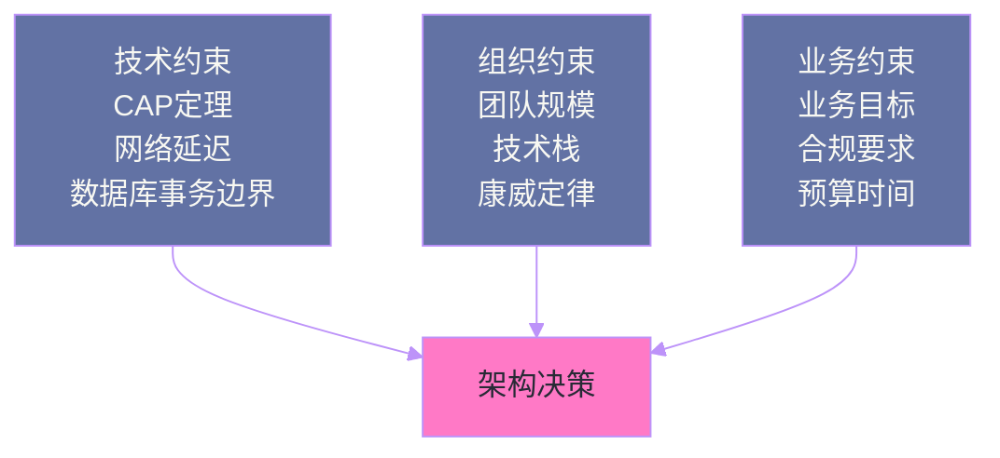

# 12 如何构建自己的架构权衡分析框架

## 摘要

《Software Architecture: The Hard Parts》最后一章（第 15 章）是对全书的方法论升华：不是再给出一个新的模式或技术方案，而是教你如何构建自己的架构权衡分析能力。本文作为专栏的收尾篇，将全书的核心工具、思维模型和方法论系统化，帮助你在面对新的架构问题时，知道应该问哪些问题、评估哪些维度，最终做出可以被清晰解释和有效防御的架构决策。

---

## 第 1 章 架构的本质是在约束下做取舍

### 1.1 没有最佳架构，只有最适合的架构

全书开篇就点明了核心主题：**架构中不存在通用的最优解，只有在特定上下文中"最不坏"的选择**。每一个架构决策都是多个相互竞争的质量属性之间的权衡：

- 性能 vs 可扩展性
- 一致性 vs 可用性
- 服务自治 vs 可操作性
- 开发速度 vs 系统稳定性

"硬决策"之所以"硬"，不是因为技术实现复杂，而是因为**不同的选择会让不同的利益相关方感到不满意**——让运维团队满意的决策可能让开发团队痛苦，让今天快速交付的决策可能成为明天的技术债。

### 1.2 架构权衡的三个约束维度

书中将影响架构决策的约束分为三类：

**技术约束（Technical Constraints）**：来自技术本身的限制，如 CAP 定理、网络延迟的物理下限、数据库事务的范围等。这些约束是客观的，无法通过工程手段消除，只能设计绕过。

**组织约束（Organizational Constraints）**：来自团队规模、技术栈选择、组织结构等人的因素。[[康威定律（Conway's Law）]]告诉我们，系统架构会不可避免地反映设计它的组织的通信结构。这类约束是可以被改变的，但改变的成本往往远高于改变技术方案。

**业务约束（Business Constraints）**：来自业务目标、合规要求、预算和时间限制。这是最终决定架构走向的约束，所有技术决策最终服务于业务目标。



---

## 第 2 章 架构权衡分析的工具集

### 2.1 工具一：质量属性树（Quality Attribute Tree）

质量属性树（QA Tree）是一种将抽象的系统质量需求分解为可度量的具体场景的工具。

**构建步骤**：
1. 列出系统的核心质量属性（如性能、可用性、可维护性、安全性）
2. 为每个质量属性定义具体的可度量场景（如"在 P99 延迟 < 200ms 的条件下支持每秒 10,000 次写操作"）
3. 对每个质量属性的优先级进行排序（使用 "H/M/L" 或加权分数）

质量属性树让架构讨论从"我们需要高性能"（主观）变为"在高峰时段 10,000 TPS 下 P99 延迟不超过 200 毫秒"（客观可测量），从而让不同的架构方案可以被客观比较。

### 2.2 工具二：架构特征权衡矩阵

当面对多个可选架构方案时，权衡矩阵（Trade-off Matrix）提供了一种结构化的比较方法。

矩阵的行是候选方案，列是质量属性（结合上面的质量属性树），每个单元格评估该方案在该质量属性上的表现（可以用 1-5 分、+/-/0 或 H/M/L）。

**Sysops Squad 示例**：评估"工单处理流程"的 Saga 策略选择：

| 质量属性 | Epic Saga | Fairy Tale Saga | Time Travel Saga |
|---------|---------|---------|---------|
| 原子性 | ★★★★★ | ★★★★☆ | ★★★☆☆ |
| 服务自治 | ★★☆☆☆ | ★★★☆☆ | ★★★★★ |
| 可观测性 | ★★★★★ | ★★★★☆ | ★★☆☆☆ |
| 延迟 | ★★☆☆☆ | ★★★★☆ | ★★★★★ |
| 运维复杂度 | ★★★☆☆ | ★★★☆☆ | ★★☆☆☆ |

矩阵本身不给出答案，但它迫使架构师明确每个维度的评估，并让讨论聚焦在具体的权衡上，而非抽象的方案好坏之争。

### 2.3 工具三：ADR（架构决策记录）

ADR（Architecture Decision Records）在全书的第一章就被引入，在收尾章作为贯穿全书的元工具再次被强调。

ADR 的核心价值不在于记录"做了什么决定"，而在于记录**"为什么做这个决定，当时考虑了哪些备选方案，拒绝了哪些，理由是什么"**。

**一份高质量 ADR 的必要元素**：
- **标题**：动词开头的决策陈述（如"采用 Saga 模式管理跨服务事务"）
- **状态**：Proposed / Accepted / Deprecated / Superseded
- **上下文**：促使做这个决定的背景和约束
- **决策**：选择了什么
- **考虑的备选方案**：列出所有认真考虑过的方案
- **后果**：这个决定带来的已知优缺点和需要承担的代价

ADR 的最大价值在于**六个月后**：当新加入的团队成员或者你自己忘记了当初为什么这样设计时，ADR 能在几分钟内重建决策上下文，避免"重新发明"已经被认真评估并放弃过的方案。

### 2.4 工具四：架构适应度函数（Fitness Functions）

适应度函数是对架构特征的**自动化验证机制**。它将架构约束从"文档里写着"变成"代码里测着"：

- 用 [[ArchUnit]] 验证"基础设施层不能反向依赖业务层"
- 用 SLO 告警验证"P99 延迟不超过 200 毫秒"
- 用构建流水线中的循环依赖检测验证"模块间无循环依赖"

适应度函数将架构决策的约束"代码化"，使其成为持续集成流程的一部分，防止架构随时间漂移。

---

## 第 3 章 构建自己的权衡分析习惯

### 3.1 永远问"和什么相比？"

当有人说"方案 A 比方案 B 好"时，第一个问题永远是：**在什么维度上更好？在什么约束下？对于哪些利益相关方？**

书中反复强调：架构中的"好"是相对的，脱离上下文谈优劣没有意义。微服务对大型多团队组织可能是正确选择，对5人团队可能是灾难。Saga 模式在跨服务事务中很有价值，在单服务内引入 Saga 是过度设计。

### 3.2 明确"你在优化什么"

每一个架构决策都是在隐式优化某些质量属性、同时隐式地牺牲另一些质量属性。优秀的架构师应该让这个优化目标显式化：

**反例**："我们选择微服务架构是因为微服务是现代的、可扩展的。"

**正例**："我们选择微服务架构是因为当前组织有 8 个独立的业务域，每个域需要独立扩容和独立部署节奏，微服务允许我们将这 8 个域分配给 8 个独立团队，换取的代价是增加了分布式系统的运维复杂度和跨服务事务的处理成本，这个代价对于我们当前的规模是可接受的。"

### 3.3 记录你拒绝了什么

选择一个方案时，同样重要的是记录你认真考虑过但最终拒绝的方案。这不仅是 ADR 的要求，更是一种思维习惯：**拒绝一个方案必须是因为它在当前约束下不如选择的方案，而不是因为不了解它**。

如果你不能清楚地说出"为什么我没有选 2PC""为什么我没有用 Kafka 而用了 RabbitMQ""为什么没有把这两个服务合并"，那么你的决策可能是基于直觉或惰性，而非真正的权衡分析。

---

## 第 4 章 全专栏知识体系回顾

### 4.1 两大主题：拆散与聚合

全书围绕两大主题展开：

**拆散（Part I，Articles 01-06）**：如何将系统分解为独立的服务？
- 什么是好的服务边界（[[架构量子]]、内聚性）
- 如何系统地执行拆分（组件分解、战术分叉）
- 数据层如何配合服务拆分（数据独立化）
- 服务粒度的决策框架（拆分驱动 vs 聚合驱动）

**聚合（Part II，Articles 07-12）**：拆分后的服务如何协作？
- 代码如何在服务间共享（共享库 → Sidecar 光谱）
- 数据所有权和分布式事务（2PC 的局限 → 最终一致性）
- 跨服务查询（五种分布式数据访问模式）
- 工作流协调（编排 vs 编舞）
- 分布式长事务（六种 Saga 变体）

### 4.2 贯穿全书的方法论：没有银弹

每一章的结论都不是"用这个模式，扔掉那个模式"，而是：

> 在 [具体场景/约束] 下，[模式 A] 优于 [模式 B]，因为它在 [质量属性 X] 上更好，代价是 [质量属性 Y] 较差，这个代价在 [上下文] 下是可接受的。

这种思维方式——**情境化的权衡分析**——是书中传递的最核心的架构思维习惯，也是区分优秀架构师和普通架构师的关键能力。

---

## 第 5 章 总结

### 5.1 专栏核心收获清单

通读本专栏后，你应该具备以下能力：

✅ 用 ADR 记录架构决策的上下文、选择和放弃的方案

✅ 用适应度函数将架构约束自动化验证

✅ 区分静态耦合、动态耦合和数据耦合，分析任意两个服务间的耦合类型

✅ 评估一个系统的模块化程度，判断是否需要服务拆分

✅ 执行基于组件的服务分解过程（6 步方法）

✅ 设计数据层的服务独立化策略，权衡四大代价

✅ 根据服务粒度的 7 个拆分驱动和 6 个整合驱动做出粒度决策

✅ 在共享库、数据服务、共享服务、服务模板、Sidecar 五种复用模式中做出合理选择

✅ 解释为什么 2PC 在微服务场景不实用，如何用 Outbox 模式保证消息可靠投递

✅ 根据查询特征选择五种分布式数据访问模式

✅ 判断编排和编舞在特定流程中的适用性

✅ 选择适合场景的 Saga 变体，并处理幂等性和状态持久化问题

### 5.2 持续深化的方向

本书是分布式架构权衡分析的入门框架，更深入的方向包括：

- 领域驱动设计（DDD）：将业务领域模型与服务边界设计结合，从业务语义而非技术特征划定服务边界
- 事件溯源（Event Sourcing）：将系统状态表示为事件序列，与 CQRS 结合实现极高的查询灵活性
- 平台工程（Platform Engineering）：将本书中的基础设施能力（服务网格、服务模板、适应度函数）系统化为内部开发者平台

---

## 延伸阅读

- [[Domain-Driven Design]] Eric Evans 著：服务边界划定的理论基础
- [[Building Evolutionary Architectures]]：Neal Ford、Rebecca Parsons 著，适应度函数的深度实践
- [[Fundamentals of Software Architecture]]：Mark Richards、Neal Ford 著，与本书配套的架构基础教材
- [[Team Topologies]]：Matthew Skelton、Manuel Pais 著，从团队拓扑视角理解康威定律和服务边界设计

---

## 第 4 章 架构决策记录（ADR）的完整实践

### 4.1 ADR 的价值与核心理念

架构决策往往在当时显得理所当然，但六个月后，团队成员换了一批，当初为什么这样决策已经无从查考。新成员重新做出同样的错误决策，或者不理解为什么某个"奇怪的"设计存在，这是团队知识流失的典型场景。

ADR（Architecture Decision Record）的核心价值：**让架构决策的上下文和权衡分析可以被未来的自己和团队成员查阅**。

一份好的 ADR 不只是记录"我们做了什么"，更重要的是记录"我们考虑了哪些选项、在什么约束下做出了这个选择、以及我们接受了哪些代价"。

### 4.2 完整的 ADR 模板

```markdown
# ADR-{编号}: {简短标题（动宾结构）}

## 状态
[提议中 / 已接受 / 已废弃 / 已替代 by ADR-{编号}]

## 上下文
描述导致这个决策的背景、约束和驱动力。
这里应该说明：
- 当前架构中存在什么问题或需求
- 有哪些约束（团队规模、技术栈、时间窗口）
- 相关的 QA 特征（性能、可维护性、扩展性）要求是什么

## 决策
我们选择了 [方案名称]。

简短说明这个方案的核心机制。

## 选项分析

### 选项 A: {方案A名称}
- **优点**：...
- **缺点**：...
- **适用场景**：...

### 选项 B: {方案B名称}（最终选择）
- **优点**：...
- **缺点**：...
- **适用场景**：...

### 选项 C: {方案C名称}
- **优点**：...
- **缺点**：...
- **适用场景**：...

## 后果

**正面影响**：
- ...

**负面影响（接受的代价）**：
- ...

**需要跟进的工作**：
- [ ] ...

## 参与者
- 决策者：{姓名/角色}
- 审阅者：{姓名/角色}
- 日期：{YYYY-MM-DD}
```

### 4.3 Sysops Squad 的 ADR 示例

```markdown
# ADR-007: 使用 Temporal 工作流引擎实现工单创建 Saga

## 状态
已接受

## 上下文
工单创建流程跨越 4 个服务（工单、专家分配、通知、账单），
原有的同步调用链导致工单创建成功率仅 78%（通知服务的不稳定性是主因）。

团队规模：8 人，有 2 人有 Temporal 使用经验。
时间约束：需要在 Q2 完成上线。

QA 要求：工单创建成功率 ≥ 99%，P99 响应时间 ≤ 300ms。

## 决策
我们选择 Temporal 工作流引擎来编排工单创建 Saga。

## 选项分析

### 选项 A: 继续使用同步调用链 + 增加超时重试
- **优点**：无需引入新中间件，实现简单
- **缺点**：无法根本解决通知服务不稳定导致的成功率问题；会导致 API 响应时间升高
- **适用场景**：下游服务均高度可靠时

### 选项 B: 使用 Temporal（最终选择）
- **优点**：工作流状态自动持久化；Activity 自动重试；工单创建可立即返回 202；
  团队有现成的 Temporal 经验
- **缺点**：引入新的运维组件；本地开发需要启动 Temporal 服务器；学习曲线
- **适用场景**：需要可靠执行多步骤流程，有长时间运行的步骤

### 选项 C: 自研基于数据库状态机的 Saga
- **优点**：无新依赖，完全可控
- **缺点**：需要自行实现重试、超时检测、状态恢复；工作量大且容易出错
- **适用场景**：流程简单（≤3 步），团队人力充足

## 后果

**正面影响**：
- 工单创建成功率预期从 78% 提升至 99%+
- API 响应时间从 ~2s 降低至 ~200ms（异步处理）

**负面影响**：
- 需要维护 Temporal 集群（增加了运维复杂性）
- 工单创建从同步变异步，客户端需要轮询状态（前端改动）

**需要跟进的工作**：
- [ ] 部署 Temporal 集群到生产环境
- [ ] 实现工单状态查询 API（供客户端轮询）
- [ ] 为前端添加"处理中"状态展示

## 参与者
- 决策者：架构委员会
- 审阅者：工单服务团队、前端团队
- 日期：2024-03-15
```

一份好的 ADR 通常在 1-2 页以内，超过 3 页说明需要拆分为多个独立决策。

---

## 第 5 章 架构适应度函数

### 5.1 什么是适应度函数

[[架构适应度函数]]（Architecture Fitness Functions）是 *Building Evolutionary Architectures* 中提出的概念，本书将其延伸到分布式架构场景：**将架构特征（Architecture Characteristics）转化为可自动验证的规则**，并持续在 CI/CD 流水线中执行。

适应度函数的核心思想：**如果一个架构特征无法被测量和自动验证，它就无法被持续保障**。"我们的系统是低耦合的"是一个无法验证的口号；"任何服务的传入依赖不超过 3 个"是一个可以用代码检测的规则。

### 5.2 三类适应度函数

**1. 架构结构函数**：检测模块/服务之间的依赖关系是否符合预期。

```java
// ArchUnit 实现的包依赖适应度函数
@Test
void domainLayerShouldNotDependOnInfrastructureLayer() {
    JavaClasses classes = new ClassFileImporter()
        .importPackages("com.sysops.ticketservice");
    
    ArchRule rule = noClasses()
        .that().resideInAPackage("..domain..")
        .should().dependOnClassesThat()
        .resideInAPackage("..infrastructure..");
    
    rule.check(classes);
}

// 检测服务的最大传入依赖数（防止核心服务成为单点依赖）
@Test
void coreServicesMaxIncomingDependencies() {
    // 通过服务注册表或架构图检测
    // 任何服务的传入依赖 ≤ 5 个
    serviceRegistry.getAllServices().forEach(service -> {
        int incomingDeps = serviceRegistry.getIncomingDependencies(service).size();
        assertThat(incomingDeps)
            .as("Service %s has too many incoming dependencies", service.getName())
            .isLessThanOrEqualTo(5);
    });
}
```

**2. 性能特征函数**：在 CI 中持续验证关键接口的性能指标未退化。

```yaml
# k6 压测脚本，作为 CI 阶段执行
import http from 'k6/http';
import { check } from 'k6';

export const options = {
  thresholds: {
    # 工单创建接口 P99 延迟不超过 300ms
    'http_req_duration{name:ticket_create}': ['p(99) < 300'],
    # 工单查询接口成功率不低于 99.5%
    'http_req_failed{name:ticket_query}': ['rate < 0.005'],
  },
};

export default function() {
  const response = http.post('/api/tickets', {
    customerId: 'C001',
    problemCategory: 'NETWORK',
    description: '网络连接异常',
  }, { tags: { name: 'ticket_create' } });
  
  check(response, { 'status is 202': (r) => r.status === 202 });
}
```

**3. 数据完整性函数**：定期验证跨服务的数据一致性是否符合预期。

```python
# 每日运行的数据一致性检测函数
def check_ticket_expert_consistency():
    """验证所有状态为 IN_PROGRESS 的工单，都有对应的专家分配记录"""
    tickets_in_progress = ticket_db.query(
        "SELECT id FROM tickets WHERE status = 'IN_PROGRESS'"
    )
    
    inconsistent_tickets = []
    for ticket_id in tickets_in_progress:
        assignment = expert_db.query(
            "SELECT id FROM assignments WHERE ticket_id = ?", ticket_id
        )
        if not assignment:
            inconsistent_tickets.append(ticket_id)
    
    # 超过阈值时告警（少量不一致属于最终一致性的正常状态）
    if len(inconsistent_tickets) / len(tickets_in_progress) > 0.01:
        alert(f"Data inconsistency rate exceeded 1%: {inconsistent_tickets}")
```

### 5.3 适应度函数的运维成本

适应度函数不是免费的——它需要持续维护。一条建议：**先为最容易退化的架构特征添加适应度函数**，而不是为每一个特征都添加。

最容易退化的特征通常是：
- **依赖关系**（随着功能迭代，很容易无意间引入循环依赖）
- **关键接口性能**（随着数据量增长，性能悄悄退化）
- **模块边界**（随着"快速修复"，边界被绕过）

---

## 第 6 章 整合 12 篇：Sysops Squad 的完整架构演进

回顾 Sysops Squad 从单体到分布式架构的完整旅程，每一篇文章对应了一个关键决策节点：

| 决策阶段 | 核心问题 | 对应文章 | 最终选择 |
|---------|---------|---------|---------|
| 架构分解启动 | 为什么要拆分？拆分依据是什么？| [[01 架构硬决策框架]] | 以业务能力为边界，建立权衡分析框架 |
| 服务边界划定 | 如何识别和管理耦合？| [[02 耦合解剖学]] | 区分静态耦合与动态耦合，优先解除动态耦合 |
| 模块化路径 | 单体如何演进为服务？| [[03 架构模块化]] | 先实现模块化单体，再提取服务 |
| 分解策略选择 | 用什么具体方法分解组件？| [[04 服务拆分的艺术]] | 基于组件的分解 + 战术分叉（对遗留代码）|
| 数据库拆分 | 数据层如何分离？| [[05 数据拆分之困]] | 数据域级别分离，容忍一定的最终一致性 |
| 服务粒度决策 | 服务应该多细？| [[06 服务粒度的黄金法则]] | 以扩展性和容错为主要拆分驱动因素 |
| 共享代码处理 | 跨服务的公共代码如何维护？| [[07 代码复用的权衡]] | 共享库用于业务无关的工具代码，Sidecar 用于横切关注点 |
| 数据所有权 | 谁拥有哪份数据？| [[08 数据所有权]] | 每服务单一数据库，通过事件同步只读副本 |
| 跨服务查询 | 如何处理跨越服务边界的查询？| [[09 分布式数据访问]] | 关键路径用 API 组合，报表用 CQRS 读模型 |
| 工作流协调 | 多步骤流程如何协调？| [[10 分布式工作流]] | 编排（Temporal）处理关键路径，编舞处理非关键通知 |
| 分布式事务 | 如何保证跨服务操作的原子性？| [[11 事务性 Saga 模式]] | Fairy Tale Saga（异步编排）配合 Temporal |
| 持续决策体系 | 如何持续管理架构演进？| 本文 | ADR + 质量属性研讨会 + 适应度函数 |

这个旅程揭示了一个规律：**每一个分布式架构决策都是一连串权衡的结果，没有任何一个单一框架能给出标准答案**。《Software Architecture: The Hard Parts》的价值，不是提供一套"正确答案"，而是提供一个结构化思考分布式架构权衡的语言体系。

> [!note] 架构师的核心价值
> 优秀的架构师不是那些做出最多决策的人，而是那些最清楚地定义了问题、找到了最适合当前约束的权衡点，并且把决策的上下文记录清楚、让团队共同理解的人。架构是集体智慧的结晶，架构师是这个结晶过程的催化剂。

---
*本文是「Software Architecture: The Hard Parts 专栏」系列第 12 篇（终章）。← [[11 事务性 Saga 模式：分布式事务的六种现代解法]] | [[00 专栏导览]] →*

---

## 附录：一页纸架构权衡分析模板

当面对任何架构决策时，用这五个问题快速结构化分析：

| # | 问题 | 作用 |
|---|------|------|
| 1 | 这个决策影响哪些 QA 特征？（性能/可维护性/可靠性…）| 定义评估维度 |
| 2 | 有哪些可选方案？（至少三个，避免"二选一"思维）| 展开解空间 |
| 3 | 每个方案在各 QA 维度上的得分？（1-5 分）| 量化比较 |
| 4 | 当前最重要的 QA 是什么？（根据业务约束确定权重）| 确定优先级 |
| 5 | 我们接受哪些代价？（每个选择都有代价，明确说出来）| 显式化权衡 |

记录答案，写入 ADR，这就是一个完整的架构权衡分析。复杂的框架和工具都是这五个问题的延伸和细化。

> [!info] 关于"框架焦虑"
> 很多团队在开始架构分析时会感到焦虑："我们的框架够严谨吗？我们考虑了足够多的维度吗？"这种焦虑本身就是一种过度设计的信号。
>
> 一个实用的架构权衡分析不需要完美，它需要的是：比没有分析时更少的盲点、更多的团队共识、以及未来可以回溯的决策上下文。哪怕只是一段文字说明"我们考虑了 A/B 两个方案，因为 X 选了 A，代价是 Y"，也比什么都不记录要好一百倍。
>
> 从最简单的 ADR 开始，随着团队对架构讨论的习惯养成，再逐步引入更结构化的工具。这，才是架构能力成长的正确姿势。

架构的硬决策没有终点，只有下一个决策。带着这个框架，持续前行。

