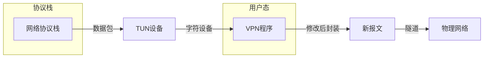
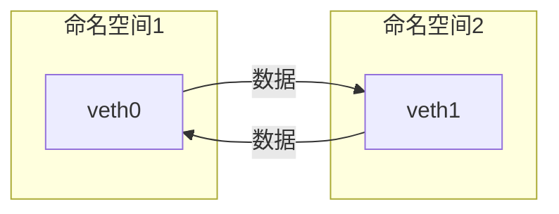
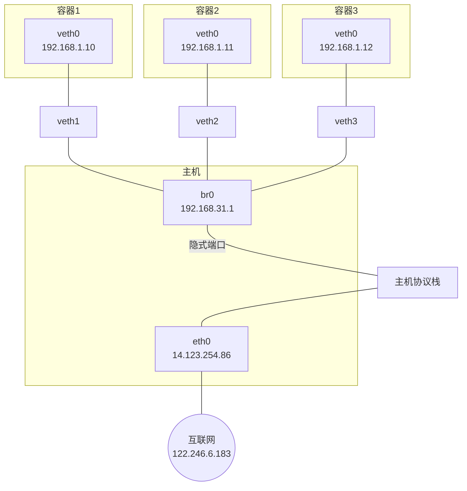
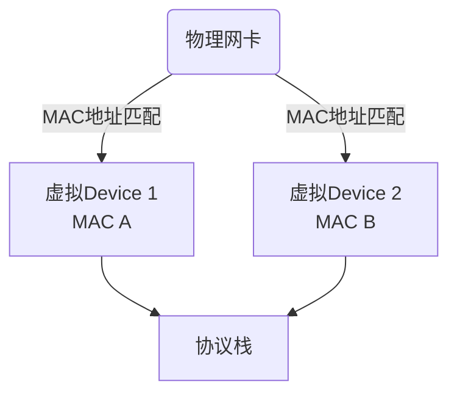

# 1.6 不可变基础设施

## 从微服务到云原生

### 云原生定义（Cloud Native Definition）

> Cloud native technologies empower organizations to build and run scalable applications in modern, dynamic environments such as public, private, and hybrid clouds. Containers, service meshes, microservices, immutable infrastructure, and declarative APIs exemplify this approach.
>
> These techniques enable loosely coupled systems that are resilient, manageable, and observable. Combined with robust automation, they allow engineers to make high-impact changes frequently and predictably with minimal toil.
>
> 云原生技术有利于各组织在公有云、私有云和混合云等新型动态环境中，构建和运行可弹性扩展的应用。云原生的代表技术包括容器、服务网格、微服务、不可变基础设施和声明式 API。
>
> 这些技术能够构建容错性好、易于管理和便于观察的松耦合系统。结合可靠的自动化手段，云原生技术使工程师能够轻松地对系统作出频繁和可预测的重大变更。
>
> —— [Cloud Native Definition](https://icyfenix.cn), CNCF，2018

“不可变基础设施”这个概念由来已久。2012 年 Martin Fowler 设想的“[[凤凰服务器]]”与 2013 年 Chad Fowler 正式提出的“[[不可变基础设施]]”，都阐明了基础设施不变性所能带来的益处。在[[云原生基金会]]定义的“云原生”概念中，“不可变基础设施”提升到了与[[微服务]]平级的重要程度，此时它的内涵已不再局限于方便运维、程序升级和部署的手段，而是升华为向应用代码隐藏分布式架构复杂度、让分布式架构得以成为一种可普遍推广的普适架构风格的必要前提。

前一章以“分布式的基石”为题，介绍了微服务中关键的技术问题与解决方案，解决这些问题原本应该是架构师与程序员的本职工作。在本章，笔者会以容器、编排系统和服务网格的发展为主线，介绍虚拟化容器与服务网格是如何模糊掉软件与硬件之间的界限，如何在基础设施与通讯层面上帮助微服务隐藏复杂性，解决原本只能由程序员通过软件编程来解决的分布式问题。

---

## 虚拟化容器

容器是云计算、微服务等诸多软件业界核心技术的共同基石，容器的首要目标是让软件分发部署过程从传统的发布安装包、靠人工部署转变为直接发布已经部署好的、包含整套运行环境的虚拟化镜像。在容器技术成熟之前，主流的软件部署过程是由系统管理员编译或下载好二进制安装包，根据软件的部署说明文档准备好正确的操作系统、第三方库、配置文件、资源权限等各种前置依赖以后，才能将程序正确地运行起来。Chad Fowler 在提出“不可变基础设施”这个概念的文章《[Trash Your Servers and Burn Your Code](https://icyfenix.cn)》里，开篇就直接吐槽：要把一个不知道打过多少个升级补丁，不知道经历了多少任管理员的系统迁移到其他机器上，毫无疑问会是一场灾难。

让软件能够在任何环境、任何物理机器上达到“一次编译，到处运行”曾是 Java 早年的宣传口号，这并不是一个简单的目标，不设前提的“到处运行”，仅靠 Java 语言和 Java 虚拟机是不可能达成的，因为一个计算机软件要能够正确运行，需要有以下三方面的兼容性来共同保障（这里仅讨论软件兼容性，不去涉及“如果没有摄像头就无法运行照相程序”这类问题）：

- **ISA 兼容**：目标机器指令集兼容性，譬如 ARM 架构的计算机无法直接运行面向 x86 架构编译的程序。
- **ABI 兼容**：目标系统或者依赖库的二进制兼容性，譬如 Windows 系统环境中无法直接运行 Linux 的程序，又譬如 DirectX 12 的游戏无法运行在 DirectX 9 之上。
- **环境兼容**：目标环境的兼容性，譬如没有正确设置的配置文件、环境变量、注册中心、数据库地址、文件系统的权限等等，任何一个环境因素出现错误，都会让你的程序无法正常运行。

> [!info] 额外知识：ISA 与 ABI
> **指令集架构**（Instruction Set Architecture，ISA）是计算机体系结构中与程序设计有关的部分，包含了基本数据类型，指令集，寄存器，寻址模式，存储体系，中断，异常处理以及外部 I/O。指令集架构包含一系列的 Opcode 操作码（即通常所说的机器语言），以及由特定处理器执行的基本命令。
>
> **应用二进制接口**（Application Binary Interface，ABI）是应用程序与操作系统之间或其他依赖库之间的低级接口。ABI 涵盖了各种底层细节，如数据类型的宽度大小、对象的布局、接口调用约定等等。ABI 不同于应用程序接口（Application Programming Interface，API），API 定义的是源代码和库之间的接口，因此同样的代码可以在支持这个 API 的任何系统中编译，而 ABI 允许编译好的目标代码在使用兼容 ABI 的系统中无需改动就能直接运行。

笔者把使用仿真（Emulation）以及虚拟化（Virtualization）技术来解决以上三项兼容性问题的方法都统称为虚拟化技术。根据抽象目标与兼容性高低的不同，虚拟化技术又分为下列五类：

1. **指令集虚拟化（ISA Level Virtualization）**。通过软件来模拟不同 ISA 架构的处理器工作过程，将虚拟机发出的指令转换为符合本机 ISA 的指令，代表为 [[QEMU]] 和 [[Bochs]]。指令集虚拟化就是仿真，能提供了几乎完全不受局限的兼容性，甚至能做到直接在 Web 浏览器上运行完整操作系统这种令人惊讶的效果，但由于每条指令都要由软件来转换和模拟，它也是性能损失最大的虚拟化技术。
2. **硬件抽象层虚拟化（Hardware Abstraction Level Virtualization）**。以软件或者直接通过硬件来模拟处理器、芯片组、内存、磁盘控制器、显卡等设备的工作过程。既可以使用纯软件的二进制翻译来模拟虚拟设备，也可以由硬件的 [[Intel VT-d]]、[[AMD-Vi]] 这类虚拟化技术，将某个物理设备直通（Passthrough）到虚拟机中使用，代表为 [[VMware ESXi]] 和 [[Hyper-V]]。如果没有预设语境，一般人们所说的“虚拟机”就是指这一类虚拟化技术。
3. **操作系统层虚拟化（OS Level Virtualization）**。无论是指令集虚拟化还是硬件抽象层虚拟化，都会运行一套完全真实的操作系统来解决 ABI 兼容性和环境兼容性问题，虽然 ISA 兼容性是虚拟出来的，但 ABI 兼容性和环境兼容性却是真实存在的。而操作系统层虚拟化则不会提供真实的操作系统，而是采用隔离手段，使得不同进程拥有独立的系统资源和资源配额，看起来仿佛是独享了整个操作系统一般，其实系统的内核仍然是被不同进程所共享的。
   操作系统层虚拟化的另一个名字就是本章的主角“[[容器化]]”（Containerization），由此可见，容器化仅仅是虚拟化的一个子集，只能提供操作系统内核以上的部分 ABI 兼容性与完整的环境兼容性。这意味着如果没有其他虚拟化手段的辅助，在 Windows 系统上是不可能运行 Linux 的 Docker 镜像的（现在可以，是因为有其他虚拟机或者 WSL2 的支持），反之亦然。也同样决定了如果 Docker 宿主机的内核版本是 Linux Kernel 5.6，那无论上面运行的镜像是 Ubuntu、RHEL、Fedora、Mint 或者任何发行版的镜像，看到的内核一定都是相同的 Linux Kernel 5.6。容器化牺牲了一定的隔离性与兼容性，换来的是比前两种虚拟化更高的启动速度、运行性能和更低的执行负担。
4. **运行库虚拟化（Library Level Virtualization）**。与操作系统虚拟化采用隔离手段来模拟系统不同，运行库虚拟化选择使用软件翻译的方法来模拟系统，它以一个独立进程来代替操作系统内核来提供目标软件运行所需的全部能力，这种虚拟化方法获得的 ABI 兼容性高低，取决于软件是否能足够准确和全面地完成翻译工作，其代表为 [[WINE]]（Wine Is Not an Emulator 的缩写，一款在 Linux 下运行 Windows 程序的软件）和 [[WSL]]（特指 Windows Subsystem for Linux Version 1）。
5. **语言层虚拟化（Programming Language Level Virtualization）**。由虚拟机将高级语言生成的中间代码转换为目标机器可以直接执行的指令，代表为 Java 的 JVM 和.NET 的 CLR。虽然厂商肯定会提供不同系统下都有相同接口的标准库，但本质上这种虚拟化并不直接解决任何 ABI 兼容性和环境兼容性问题。

---

## 容器的崛起

容器的最初的目的不是为了部署软件，而是为了隔离计算机中的各类资源，以便降低软件开发、测试阶段可能产生的误操作风险，或者专门充当[[蜜罐]]，吸引黑客的攻击，以便监视黑客的行为。下面，笔者将以容器发展历史为线索，介绍容器技术在不同历史阶段中的主要关注点。

### 隔离文件：chroot

容器的起点可以追溯到 1979 年 [[Version 7 UNIX]] 系统中提供的 `chroot` 命令，这个命令是英文单词“Change Root”的缩写，功能是当某个进程经过 `chroot` 操作之后，它的根目录就会被锁定在命令参数所指定的位置，以后它或者它的子进程将不能再访问和操作该目录之外的其他文件。

1991 年，世界上第一个监控黑客行动的蜜罐程序就是使用 `chroot` 来实现的，那个参数指定的根目录当时被作者戏称为“Chroot 监狱”（Chroot Jail），黑客突破 `chroot` 限制的方法就称为 Jailbreak。后来，FreeBSD 4.0 系统重新实现了 `chroot` 命令，用它作为系统中进程沙箱隔离的基础，并将其命名为 [[FreeBSD jail]]，再后来，苹果公司又以 FreeBSD 为基础研发出了举世闻名的 iOS 操作系统，此时，黑客们就将绕过 iOS 沙箱机制以 root 权限任意安装程序的方法称为“[[越狱]]”（Jailbreak），这些故事都是题外话了。

2000 年，Linux Kernel 2.3.41 版内核引入了 `pivot_root` 技术来实现文件隔离，`pivot_root` 直接切换了根文件系统（rootfs），有效地避免了 `chroot` 命令可能出现的安全性漏洞。本文后续提到的容器技术，如 LXC、Docker 等也都是优先使用 `pivot_root` 来实现根文件系统切换的。

时至今日，`chroot` 命令依然活跃在 UNIX 系统与几乎所有主流的 Linux 发行版中，同时以命令行工具（`chroot(8)`）或者系统调用（`chroot(2)`）的形式存在，但无论是 `chroot` 命令抑或是 `pivot_root`，都并不能提供完美的隔离性。原本按照 UNIX 的设计哲学，一切资源都可以视为文件（In UNIX，Everything is a File），一切处理都可以视为对文件的操作，理论上，只要隔离了文件系统，一切资源都应该被自动隔离才对。可是哲学归哲学，现实归现实，从硬件层面暴露的低层次资源，如磁盘、网络、内存、处理器，到经操作系统层面封装的高层次资源，如 UNIX 分时（UNIX Time-Sharing，UTS）、进程 ID（Process ID，PID）、用户 ID（User ID，UID）、进程间通信（Inter-Process Communication，IPC）都存在大量以非文件形式暴露的操作入口，因此，以 `chroot` 为代表的文件隔离，仅仅是容器崛起之路的起点而已。

### 隔离访问：namespaces

2002 年，Linux Kernel 2.4.19 版内核引入了一种全新的隔离机制：[[Linux 名称空间]]（Linux Namespaces）。名称空间的概念在很多现代的高级程序语言中都存在，用于避免不同开发者提供的 API 相互冲突，相信作为一名开发人员的你肯定不陌生。

Linux 的名称空间是一种由内核直接提供的全局资源封装，是内核针对进程设计的访问隔离机制。进程在一个独立的 Linux 名称空间中朝系统看去，会觉得自己仿佛就是这方天地的主人，拥有这台 Linux 主机上的一切资源，不仅文件系统是独立的，还有着独立的 PID 编号（譬如拥有自己的 0 号进程，即系统初始化的进程）、UID/GID 编号（譬如拥有自己独立的 root 用户）、网络（譬如完全独立的 IP 地址、网络栈、防火墙等设置），等等，此时进程的心情简直不能再好了。

Linux 的名称空间是受“[[贝尔实验室九号项目]]”（一个分布式操作系统，“九号”项目并非代号，操作系统的名字就叫“Plan 9 from Bell Labs”，充满了赛博朋克风格）的启发而设计的，最初的目的依然只是为了隔离文件系统，而非为了什么容器化的实现。这点从 2002 年发布时只提供了 Mount 名称空间，并且其构造参数为“`CLONE_NEWNS`”（即 Clone New Namespace 的缩写）而非“`CLONE_NEWMOUNT`”便能看出一些端倪。后来，要求系统隔离其他访问操作的呼声愈发强烈，从 2006 年起，内核陆续添加了 UTS、IPC 等名称空间隔离，直到目前最新的 Linux Kernel 5.6 版内核为止，Linux 名称空间支持以下八种资源的隔离（内核的官网 [Kernel.org](https://kernel.org) 上仍然只列出了前六种，从 Linux 的 Man 命令能查到全部八种）。

**表 11-1 Linux 名称空间支持以下八种资源的隔离**

| 名称空间 | 隔离内容 | 内核版本 |
|----------|----------|----------|
| Mount    | 隔离文件系统，功能上大致可以类比 `chroot` | 2.4.19 |
| UTS      | 隔离主机的 Hostname、Domain names | 2.6.19 |
| IPC      | 隔离进程间通信的渠道（详见“远程服务调用”中对 IPC 的介绍） | 2.6.19 |
| PID      | 隔离进程编号，无法看到其他名称空间中的 PID，意味着无法对其他进程产生影响 | 2.6.24 |
| Network  | 隔离网络资源，如网卡、网络栈、IP 地址、端口，等等 | 2.6.29 |
| User     | 隔离用户和用户组 | 3.8 |
| Cgroup   | 隔离 cgroups 信息，进程有自己的 cgroups 的根目录视图（在 `/proc/self/cgroup` 不会看到整个系统的信息）。cgroups 的话题很重要，稍后笔者会安排一整节来介绍 | 4.6 |

> [!note] 注：Cgroup 名称空间的内核版本在原文中未明确，表内为估算值，实际<!-- 已根据所提供的源文本第一部分完成转换，后续内容需下一部分源文本继续 -->

2018 年，由 Docker 捐献给 CNCF 的 containerd，在 CNCF 的精心孵化下发布了 1.1 版，这次升级最引人瞩目的是 **containerd 开始直接支持 CRI 规范**，这意味着原本用作 CRI 适配器的 DockerShim 不再必需，Kubernetes 可以完全略过 Docker Engine，直接通过 containerd 来操作 runC。此时的调用链变为：

```
Kubernetes Master → kubelet → KubeGenericRuntimeManager → containerd → runC
```

> [!INFO] CNCF 孵化 containerd
> containerd 从 Docker 中独立出来后，由 CNCF 托管孵化，逐步演化为工业级的容器运行时管理组件。1.1 版本对 CRI 的原生支持，标志着它脱离 Docker 依赖的关键一步。

2018 年底，Kubernetes 1.13 发布，**containerd 成为 Kubernetes 正式支持的 CRI 运行时实现**。紧接着 2019 年，Kubernetes 1.14 中，**DockerShim 的内部实现被标记为“维护模式”**，这意味着 Kubernetes 社区已明确表示，后续将逐步减少对 Docker 特定依赖的维护，鼓励用户转向 containerd、CRI-O 等通用 CRI 实现。

> [!WARNING] Docker 在 Kubernetes 中的地位变化
> 从 Kubernetes 1.24（2022 年 5 月发布）开始，Kubelet 中内置的 DockerShim 已被正式移除。Kubernetes 官方不再推荐直接使用 Docker Engine 作为容器运行时，用户需要迁移到 containerd、CRI-O 等符合 CRI 的运行时。这一变化对整个容器生态产生了深远影响。

此时再来回顾图 11-2 所示的 Docker、containerd 和 runC 的交互关系，会发现 Docker 曾经构建的调用栈（Docker Engine → containerd → runC）已经被 Kubernetes 生态从中间截断。**containerd 原本只是 Docker Engine 的下游模块，现在却反过来成为了 Docker Engine 的可替代品**——Kubernetes 可以直接越过 Docker 使用 containerd，而 Docker 本身也必须依赖 containerd 才能工作。

> [!NOTE] Docker 的尴尬处境
> Docker 在容器运行时领域的统治地位，因为 Kubernetes 的生态演变而被动摇。它自身的设计层次（Docker Engine 依赖 containerd）反而成为了被替代的突破口。

---

## 1.6 不可变基础设施

容器技术的崛起带来了一个重要的副产品：**不可变基础设施（Immutable Infrastructure）** 的理念得以在软件行业中广泛实践。

### 什么是不可变基础设施？

在传统的运维模式中，服务器（无论是物理机还是虚拟机）是可变的。管理员可以通过 SSH 登录上去，修改配置文件、安装补丁、调整软件版本。这种可变性导致了一系列问题：

- **配置漂移（Configuration Drift）**：多台服务器之间随时间推移产生非预期差异。
- **雪花服务器（Snowflake Servers）**：每台服务器都是独一无二、难以复现的，一旦宕机便难以恢复。
- **更新风险**：直接在运行环境中修改，很容易引入不可预知的副作用。

不可变基础设施的核心思想是：**任何基础设施的组件（服务器、容器等）一旦创建，就不再对其进行修改。如果需要更新、修复或修改配置，则直接销毁旧组件，并使用新的镜像或配置创建新组件来替代。**

这就像“用完即弃”的部署哲学：

- 不会在服务器上打补丁，而是替换整个服务器实例。
- 不会修改运行中容器的配置，而是重新构建镜像并重新部署容器。
- 服务器或容器实例的生命周期与部署的生命周期同步，实例本身是廉价的、临时的。

> [!TIP] 不可变基础设施的好处
> - **一致性**：从开发、测试到生产，环境完全一致，消除“在我的机器上能跑”的问题。
> - **可追溯**：每个部署版本都有明确的镜像 ID 或版本标签，变更历史清晰。
> - **快速回滚**：出问题时可以迅速回滚到上一个版本的镜像或快照。
> - **简化运维**：无需管理复杂的配置管理工具（如 Ansible、Puppet、Chef）在运行时的状态维持。

### 容器与不可变基础设施的天然契合

容器技术天生就是不可变基础设施的最佳载体：

- **容器镜像的分层只读特性**：镜像一旦构建完成，每一层都是只读的，容器运行时会在最上层叠加一个可写层，但容器停止后该可写层通常就被丢弃。这强制了“不可变”原则。
- **声明式部署**：Kubernetes 等编排系统采用声明式配置，用户定义期望的状态，系统负责将实际状态调整为期望状态。当配置改变，系统销毁旧容器并创建新容器来实现期望状态。
- **快速启动与销毁**：容器可以在毫秒到秒级完成启动/销毁，使得替换操作变得极其轻量。
- **环境完全封装**：应用及其依赖全部打包在镜像中，不存在外部隐式依赖。

图 11-4 示意了可变基础设施与不可变基础设施在部署更新时的不同流程。

  
*图 11-4：左侧为可变基础架构，通过配置管理工具在运行实例上执行更新；右侧为不可变基础架构，通过替换实例来达成更新。*

> [!INFO] 图片说明
> 图 11-4 中，左侧展示传统方式：通过配置管理工具（如 Ansible、Puppet）登录到服务器进行修改；右侧展示不可变方式：构建新镜像 → 部署新实例 → 销毁旧实例。

### 不可变基础设施的实践演进

不可变基础设施的理念并非容器技术独有。在虚拟机时代，就已经有使用 Packer 构建虚拟机镜像、结合 Terraform 等基础设施即代码（IaC）工具的实践。AWS 的 Auto Scaling Group 和滚动更新（Rolling Update）也隐含了替换而非修复的思想。

但容器技术将这一理念推向了极致：

- **轻量化镜像**：容器镜像可以做得非常小（如 distroless 镜像），仅包含应用及其最少依赖。
- **镜像层级复用**：分层存储机制让大量不同微服务共享相同的 base 层，极大降低存储和传输开销。
- **编排系统原生支持**：Kubernetes 的 Deployment、StatefulSet 等工作负载资源，其下 Pod 的滚动更新（RollingUpdate）或重建（Recreate）策略都是基于替换思想的。

以 Kubernetes Deployment 为例，更新应用版本时：
1. 新版本的容器镜像会被拉取下来。
2. 根据更新策略（如 RollingUpdate，逐个替换 Pod），旧的 Pod 被删除，新的 Pod 被创建。
3. 如果更新失败（如新 Pod 健康检查不通过），Kubernetes 可以根据策略自动回滚，即重新应用旧版本的 Pod 模板。

这种模式让软件交付的可靠性大幅提升，同时也推动了 **GitOps** 等新型运维范式的流行——将 Git 仓库作为系统的单一事实来源，任何对系统状态的修改都必须通过提交变更到 Git 来实现，而集群状态持续向 Git 中声明的期望状态收敛。

> [!EXAMPLE] 不可变基础设施与配置管理的关系
> 不可变基础设施并不意味着完全取代配置管理工具。在构建镜像的过程中，通常还需要使用配置管理工具（或简单的 shell 脚本）来安装软件包、设置基础配置。区别在于：这些工作发生在**构建阶段**而非**运行阶段**，且一旦构建完成，镜像内容便被冻结。运行时的差异化配置则通过环境变量、配置文件挂载（ConfigMap/Secret）等外部注入机制完成，而不会修改镜像本身。

### 云原生时代的不可变基础设施

在云原生领域，不可变基础设施已经不仅仅局限于单个容器或服务器，而是扩展到整个部署拓扑：

- **基础设施即代码（IaC）**：用代码定义所有云资源，并通过自动化工具（如 Terraform、Pulumi）部署和更新，避免手动点击控制台。
- **不可变集群**：通过 Kubernetes 集群的声明式管理，对集群本身的配置（节点规格、网络策略等）也采用不可变模式，通过替换节点池而非修改存量节点来升级。
- **不可变交付管道**：CI/CD 中的制品（如容器镜像、Helm Chart）是不可变的，每次构建生成唯一的版本号，并贯穿测试、预发、生产环境。

最终，不可变基础设施让“可复现性”成为系统的核心属性。任意环境，任何时间点，只要使用相同的制品和配置声明，就可以获得完全一致的系统状态。

---

至此，我们看到了容器技术从 Linux 内核的 namespaces 和 cgroups 开始，经过 LXC、Docker 的演进，再到 Kubernetes 的编排统治，以及引发的不可变基础设施潮流。下一节，我们将深入探讨容器化之后，微服务之间通信所面临的挑战，以及 **服务网格（Service Mesh）** 技术如何应对这些挑战。

# 以容器构建系统

1.1 版与 1.0 版的最大区别是此时它已完美地支持了 CRI 标准，这意味着原本用作 CRI 适配器的 cri-containerd 从此不再需要。此时，再观察 Kubernetes 到容器运行时的调用链，你会发现调用步骤会比通过 DockerShim、Docker Engine 与 containerd 交互的步骤要减少两步，这又意味着用户只要愿意抛弃掉 Docker 情怀的话，在容器编排上便可至少省略一次 HTTP 调用，获得性能上的收益，且根据 Kubernetes 官方给出的测试数据，这些免费的收益还相当地可观。Kubernetes 从 1.10 版本宣布开始支持 containerd 1.1，在调用链中已经能够完全抹去 Docker Engine 的存在：

```
Kubernetes Master → kubelet → KubeGenericRuntimeManager → containerd → runC
```

今天，要使用哪一种容器运行时取决于你安装 Kubernetes 时宿主机上的容器运行时环境，但对于云计算厂商来说，譬如国内的阿里云 ACK、腾讯云 TKE 等直接提供的 Kubernetes 容器环境，采用的容器运行时普遍都已是 containerd，毕竟运行性能对它们来说就是核心生产力和竞争力。

未来，随着 Kubernetes 的持续发展壮大，Docker Engine 经历从不可或缺、默认依赖、可选择、直到淘汰是大概率事件，这件事情表面上是 Google、RedHat 等云计算大厂联手所为，实际淘汰它的还是技术发展的潮流趋势，就如同 Docker 诞生时依赖 LXC，到最后用 libcontainer 取代掉 LXC 一般。同时，我们也该看到事情的另一面，现在连 LXC 都还没有挂掉，反倒还发展出了更加专注于与 OpenVZ 等系统级虚拟化竞争的 LXD，相信 Docker 本身也很难彻底消亡的，已经养成习惯的 CLI 界面，已经形成成熟生态的镜像仓库等都应该会长期存在，只是在容器编排领域，未来的 Docker 很可能只会以 runC 和 containerd 的形式存续下去，毕竟它们最初都源于 Docker 的血脉。

自从 Docker 提出“以封装应用为中心”的容器发展理念，成功取代了“以封装系统为中心”的 LXC 以后，一个容器封装一个单进程应用已经成为被广泛认可的最佳实践。然而单体时代过去之后，分布式系统里应用的概念已不再等同于进程，此时的应用需要多个进程共同协作，通过集群的形式对外提供服务，以虚拟化方法实现这个目标的过程就被称为容器编排（Container Orchestration）。

容器之间顺畅地交互通信是协作的核心需求，但容器协作并不仅仅是将容器以高速网络互相连接而已。如何调度容器，如何分配资源，如何扩缩规模，如何最大限度地接管系统中的非功能特性，让业务系统尽可能免受分布式复杂性的困扰都是容器编排框架必须考虑的问题，只有恰当解决了这一系列问题，云原生应用才有可能获得比传统应用更高的生产力。

## 隔离与协作

笔者并不打算过多介绍 Kubernetes 具体有哪些功能，向你说明 Kubernetes 由 Pod、Node、Deployment、ReplicaSet 等各种类型的资源组成可用的服务、集群管理平面与节点之间如何工作、每种资源该如何配置使用等等，并不是笔者的本意，如果你希望了解这方面信息，可以从 Kubernetes 官网的文档库或任何一本以 Kubernetes 为主题的使用手册中得到。

笔者真正希望说清楚的问题是“为什么 Kubernetes 会设计成现在这个样子？”、“为什么以容器构建系统应该这样做？”，寻找这些问题的答案最好是从它们设计的实现意图出发，为此，笔者虚构了一系列从简单到复杂的场景供你代入其中，理解并解决这些场景中的问题，并不要求你对 Kubernetes 已有多深入的了解，但要求你至少使用过 Kubernetes 和 Docker，基本了解它的核心功能与命令；此外还会涉及到一点儿 Linux 系统内核资源隔离的基础知识，别担心，只要你仔细读懂了上一节“容器的崛起”，就已经完全够用了。

现在就来设想一下，如果让你来设计一套容器编排系统，协调各种容器来共同来完成一项工作，会遇到什么问题？会如何着手解决？让我们从最简单的场景出发：

**场景一**：假设你现在有两个应用，其中一个是 Nginx，另一个是为该 Nginx 收集日志的 Filebeat，你希望将它们封装为容器镜像，以方便日后分发。

最直接的方案就将 Nginx 和 Filebeat 直接编译成同一个容器镜像，这是可以做到的，而且并不复杂，然而这样做会埋下很大隐患：它违背了 Docker 提倡的单个容器封装单进程应用的最佳实践。Docker 设计的 Dockerfile 只允许有一个 ENTRYPOINT，这并非无故添加的人为限制，而是因为 Docker 只能通过监视 PID 为 1 的进程（即由 ENTRYPOINT 启动的进程）的运行状态来判断容器的工作状态是否正常，容器退出执行清理，容器崩溃自动重启等操作都必须先判断状态。设想一下，即使我们使用了 supervisord 之类的进程控制器来解决同时启动 Nginx 和 Filebeat 进程的问题，如果因某种原因它们不停发生崩溃、重启，那 Docker 也无法察觉到，它只能观察到 supervisord 的运行状态，因此，以上需求会理所当然地演化成场景二。

**场景二**：假设你现在有两个 Docker 镜像，其中一个封装了 HTTP 服务，为便于称呼，我们叫它 Nginx 容器，另一个封装了日志收集服务，我们叫它 Filebeat 容器。现在要求 Filebeat 容器能收集 Nginx 容器产生的日志信息。

场景二依然不难解决，只要在 Nginx 容器和 Filebeat 容器启动时，分别将它们的日志目录和收集目录挂载为宿主机同一个磁盘位置的 Volume 即可，这种操作在 Docker 中是十分常用的容器间信息交换手段。不过，容器间信息交换不仅仅是文件系统，假如此时我又引入了一个新的工具 confd——Linux 下的一种配置管理工具，作用是根据配置中心（Etcd、ZooKeeper、Consul）的变化自动更新 Nginx 的配置，这里便又会遇到新的问题。confd 需要向 Nginx 发送 HUP 信号以便通知 Nginx 配置已经发生了变更，而发送 HUP 信号自然要求 confd 与 Nginx 能够进行 IPC 通信才行。尽管共享 IPC 名称空间不如共享 Volume 常见，但 Docker 同样支持了该功能，`docker run` 提供了 `--ipc` 参数，用于把多个容器挂载到同一个父容器的 IPC 名称空间之下，以实现容器间共享 IPC 名称空间的需求。类似地，如果要共享 UTS 名称空间，可以使用 `--uts` 参数，要共享网络名称空间的话，就使用 `--net` 参数。

以上便是 Docker 针对场景二这种不跨机器的多容器协作所给出的解决方案，自动地为多个容器设置好共享名称空间其实就是 Docker Compose 提供的核心能力。这种针对具体应用需求来共享名称空间的方案，的确可以工作，却并不够优雅，也谈不上有什么扩展性。容器的本质是对 cgroups 和 namespaces 所提供的隔离能力的一种封装，在 Docker 提倡的单进程封装的理念影响下，容器蕴含的隔离性也多了仅针对于单个进程的额外局限，然而 Linux 的 cgroups 和 namespaces 原本都是针对进程组而不仅仅是单个进程来设计的，同一个进程组中的多个进程天然就可以共享着相同的访问权限与资源配额。如果现在我们把容器与进程在概念上对应起来，那容器编排的第一个扩展点，就是要找到容器领域中与“进程组”相对应的概念，这是实现容器从隔离到协作的第一步，在 Kubernetes 的设计里，这个对应物叫作 Pod。

> [!INFO] 额外知识：Pod 名字的由来与含义
> Pod 的概念在容器正式出现之前的 Borg 系统中就已经存在，从 Google 的发表的《Large-Scale Cluster Management at Google with Borg》可以看出，Kubernetes 时代的 Pod 整合了 Borg 时代的“Prod”（Production Task 的缩写）与“Non-Prod”的职能。由于 Pod 一直没有权威的中文翻译，笔者在后续文章中会尽量用英文指代，偶尔需要中文的场合就使用 Borg 中 Prod 的译法，即“生产任务”来指代。

有了“容器组”的概念，场景二的问题便只需要将多个容器放到同一个 Pod 中即可解决。扮演容器组的角色，满足容器共享名称空间的需求，是 Pod 的两大最基本职责之一，同处于一个 Pod 内的多个容器，相互之间以超亲密的方式协作。请注意，“超亲密”在这里并非某种带强烈感情色彩的形容词，而是有一种有具体定义的协作程度。对于普通非亲密的容器，它们一般以网络交互方式（其他譬如共享分布式存储来交换信息也算跨网络）协作；对亲密协作的容器，是指它们被调度到同一个集群节点上，可以通过共享本地磁盘等方式协作；而超亲密的协作是特指多个容器位于同一个 Pod 这种特殊关系，它们将默认共享：

- **UTS 名称空间**：所有容器都有相同的主机名和域名。
- **网络名称空间**：所有容器都共享一样的网卡、网络栈、IP 地址，等等。因此，同一个 Pod 中不同容器占用的端口不能冲突。
- **IPC 名称空间**：所有容器都可以通过信号量或者 POSIX 共享内存等方式通信。
- **时间名称空间**：所有容器都共享相同的系统时间。

同一个 Pod 的容器，只有 PID 名称空间和文件名称空间默认是隔离的。PID 的隔离令每个容器都有独立的进程 ID 编号，它们封装的应用进程就是 PID 为 1 的进程，可以通过 Pod 元数据定义中的 `spec.shareProcessNamespace` 来改变这点。一旦要求共享 PID 名称空间，容器封装的应用进程就不再具有 PID 为 1 的特征了，这有可能导致部分依赖该特征的应用出现异常。在文件名称空间方面，容器要求文件名称空间的隔离是很理所当然的需求，因为容器需要相互独立的文件系统以避免冲突。但容器间可以共享存储卷，这是通过 Kubernetes 的 Volume 来实现的。

> [!INFO] 额外知识：Kubernetes 中 Pod 名称空间共享的实现细节
> Pod 内部多个容器共享 UTS、IPC、网络等名称空间是通过一个名为 Infra Container 的容器来实现的，这个容器是整个 Pod 中第一个启动的容器，只有几百 KB 大小（代码只有很短的几十行，见[这里](https://github.com/kubernetes/kubernetes/blob/master/build/pause/pause.c)），Pod 中的其他容器都会以 Infra Container 作为父容器，UTS、IPC、网络等名称空间实质上都是来自 Infra Container 容器。
>
> 如果容器设置为共享 PID 名称空间的话，Infra Container 中的进程将作为 PID 1 进程，其他容器的进程将以它的子进程的方式存在，此时将由 Infra Container 来负责进程管理（譬如清理僵尸进程）、感知状态和传递状态。
>
> 由于 Infra Container 的代码除了注册 SIGINT、SIGTERM、SIGCHLD 等信号的处理器外，就只是一个以 `pause()` 方法为循环体的无限循环，永远处于 Pause 状态，所以也常被称为“Pause Container”。

Pod 的另外一个基本职责是实现原子性调度，如果容器编排不跨越集群节点，是否具有原子性都无关紧要。但是在集群环境中，容器可能跨机器调度时，这个特性就变得非常重要。如果以容器为单位来调度的话，不同容器就有可能被分配到不同机器上。两台机器之间本来就是物理隔离，依靠网络连接的，这时候谈什么名称空间共享、cgroups 配额共享都失去了意义，我们由此从场景二又演化出以下场景三。

**场景三**：假设你现在有 Filebeat、Nginx 两个 Docker 镜像，在一个具有多个节点的集群环境下，要求每次调度都必须让 Filebeat 和 Nginx 容器运行于同一个节点上。

两个关联的协作任务必须一起调度的需求在容器出现之前就存在已久，譬如在传统的多线程（或多进程）并发调度中，如果两个线程（或进程）的工作是强依赖的，单独给谁分配处理时间、而另一个被挂起都会导致程序无法工作，如此就有了协同调度（Coscheduling）的概念，以保证一组紧密联系的任务能够被同时分配资源。如果我们在容器编排中仍然坚持将容器视为调度的最小粒度，那对容器运行所需资源的需求声明就只能设定在容器上，这样集群每个节点剩余资源越紧张，单个节点无法容纳全部协同容器的概率就越大，协同的容器被分配到不同节点的可能性就越高。

协同调度是十分麻烦的，实现起来要么很低效，譬如 Apache Mesos 的 Resource Hoarding 调度策略，就要等所有需要调度的任务都完备后才会开始分配资源；要么就会实现得很复杂，譬如 Google 就曾针对 Borg 的下一代 Omega 系统发表过论文《Omega: Flexible, Scalable Schedulers for Large Compute Clusters》介绍它如何使用通过乐观并发（Optimistic Concurrency）、冲突回滚的方式做到高效率，也同样高度复杂的协同调度。但是如果将运行资源的需求声明定义在 Pod 上，直接以 Pod 为最小的原子单位来实现调度的话，由于多个 Pod 之间必定不存在超亲密的协同关系，只会通过网络非亲密地协作，那就根本没有协同的说法，自然也不需要考虑复杂的调度了，关于 Kubernetes 的具体调度实现，笔者会在“资源与调度”中展开讲解。

Pod 是隔离与调度的基本单位，也是我们接触的第一种 Kubernetes 资源。Kubernetes 将一切皆视为资源，不同资源之间依靠层级关系相互组合协作，这个思想是贯穿 Kubernetes 整个系统的两大核心设计理念之一，不仅在容器、Pod、主机、集群等计算资源上是这样，在工作负载、持久存储、网络策略、身份权限等其他领域中也都有着一致的体现。

图 11-4 Kubernetes 的计算资源

由于 Pod 是 Kubernetes 中最重要的资源，又是资源模型中一种仅在逻辑上存在、没有物理对应的概念（因为对应的“进程组”也只是个逻辑概念），是其他编排系统没有的概念，所以笔者专门花费了一些篇幅去介绍它的设计意图，而不是像帮助手册那样直接给出它的作用和特性。对于 Kubernetes 中的其他计算资源，像 Node、Cluster 等都有切实的物理对应物，很容易就能形成共同的认知，笔者也就不必逐一介绍了，仅将它们的设计意图列举如下：

- **容器（Container）**：延续了自 Docker 以来一个容器封装一个应用进程的理念，是镜像管理的最小单位。
- **生产任务（Pod）**：补充了容器化后缺失的与进程组对应的“容器组”的概念，Pod 中容器共享 UTS、IPC、网络等名称空间，是资源调度的最小单位。
- **节点（Node）**：对应于集群中的单台机器，这里的机器即可以是生产环境中的物理机，也可以是云计算环境中的虚拟节点，节点是处理器和内存等资源的资源池，是硬件单元的最小单位。
- **集群（Cluster）**：对应于整个集群，Kubernetes 提倡理念是面向集群来管理应用。当你想要部署应用的时候，只需要通过声明式 API 将你的意图写成一份元数据（Manifests），将它提交给集群即可，而无需关心它具体分配到哪个节点（尽管通过标签选择器完全可以控制它分配到哪个节点，但一般不需要这样做）、如何实现 Pod 间通信、如何保证韧性与弹性，等等，所以集群是处理元数据的最小单位。
- **集群联邦（Federation）**：对应于多个集群，通过联邦可以统一管理多个 Kubernetes 集群，联邦的一种常见应用是支持跨可用区域多活、跨地域容灾的需求。

## 韧性与弹性

笔者曾看过一部叫作《Bubble Boy》的电影，讲述了一个体内没有任何免疫系统的小男孩，终日只能生活在无菌的圆形气球里，对常人来说不值一提的细菌，都能够直接威胁到他的性命。小男孩尽管能够降生于世间，但并不能真正与世界交流，这种生命是极度脆弱的。

真实世界的软件系统与电影世界中的小男孩亦具有可比性。让容器得以相互连通，相互协作仅仅是以容器构建系统的第一步，我们不仅希望得到一个能够运行起来的系统，而且还希望得到一个能够健壮运行的系统、能够抵御意外与风险的系统。在 Kubernetes 的支持下，你确实可以直接创建 Pod 将应用运行起来，但这样的应用就如同电影中只能存活在气球中的小男孩一般脆弱，无论是软件缺陷、意外操作或者硬件故障，都可能导致在复杂协作的过程中某个容器出现异常，进而出现系统性的崩溃。为此，架构师专门设计了服务容错的策略和模式，Kubernetes 作为云原生时代的基础设施，也尽力帮助程序员以最小的代价来实现容错，为系统健壮运行提供底层支持。

如何实现具有韧性与弹性的系统是展示 Kubernetes 控制器设计模式的最好示例，控制器模式是继资源模型之后，本节介绍的另一个 Kubernetes 核心设计理念。下面，我们就从如何解决以下场景四的问题开始。

**场景四**：假设有一个由数十个 Node、数百个 Pod、近千个 Container 所组成的分布式系统，要避免系统因为外部流量压力、代码缺陷、软件更新、硬件升级、资源分配等各种原因而出现中断，作为管理员，你希望编排系统能为你提供何种支持？

作为用户，当然最希望容器编排系统能自动把所有意外因素都消灭掉，让任何每一个服务都永远健康，永不出错。但永不出错的服务是不切实际的，只有凑齐七颗龙珠才有望办到。那就只能退而求其次，让编排系统在这些服务出现问题，运行状态不正确的时候，能自动将它们调整成正确的状态。这种需求听起来也是贪心的，却已经具备足够的可行性，应对的解决办法在工业控制系统里已经有非常成熟的应用，叫作控制回路（Control Loop）。

Kubernetes 官方文档是以房间中空调自动调节温度为例子介绍了控制回路的一般工作过程的：当你设置好了温度，就是告诉空调你对温度的“期望状态”（Desired State），而传感器测量出的房间实际温度是“当前状态”（Current State）。根据当前状态与期望状态的差距，控制器对空调制冷的开关进行调节控制，就能让其当前状态逐渐接近期望状态。

图 11-5 控制回路

将这种控制回路的思想迁移应用到容器编排上，自然会为 Kubernetes 中的资源附加上了期望状态与实际状态两项属性。不论是已经出现在上节的资源模型中，用于抽象容器运行环境的计算资源，还是没有登场的另一部分对应于安全、服务、令牌、网络等功能的资源，用户要想使用这些资源来实现某种需求，并不提倡像平常编程那样去调用某个或某一组方法来达成目的，而是通过描述清楚这些资源的期望状态，由 Kubernetes 中对应监视这些资源的控制器来驱动资源的实际状态逐渐向期望状态靠拢，以此来达成目的。这种交互风格被称为是 Kubernetes 的声明式 API，如果你已有过实际操作 Kubernetes 的经验，那你日常在元数据文件中的 `spec` 字段所描述的便是资源的期望状态。

> [!INFO] 额外知识：Kubernetes 的资源对象与控制器
> 目前，Kubernetes 已内置支持相当多的资源对象，并且还可以使用 CRD（Custom Resource Definition）来自定义扩充，你可以使用 `kubectl api-resources` 来查看它们。笔者根据用途分类列举了以下常见的资源：
> 
> - **用于描述如何创建、销毁、更新、扩缩 Pod**，包括：Autoscaling（HPA）、CronJob、DaemonSet、Deployment、Job、Pod、ReplicaSet、StatefulSet
> - **用于配置信息的设置与更新**，包括：ConfigMap、Secret
> - **用于持久性地存储文件或者 Pod 之间的文件共享**，包括：Volume、LocalVolume、PersistentVolume、PersistentVolumeClaim、StorageClass
> - **用于维护网络通信和服务访问的安全**，包括：SecurityContext、ServiceAccount、Endpoint、NetworkPolicy
> - **用于定义服务与访问**，包括：Ingress、Service、EndpointSlice
> - **用于划分虚拟集群、节点和资源配额**，包括：Namespace、Node、ResourceQuota
> 
> 这些资源在控制器管理框架中一般都会有相应的控制器来管理，笔者列举常见的控制器，按照它们的启动情况分类如下：
> 
> - **必须启用的控制器**：EndpointController、ReplicationController、PodGCController、ResourceQuotaController、NamespaceController、ServiceAccountController、GarbageCollectorController、DaemonSetController、JobController、DeploymentController、ReplicaSetController、HPAController、DisruptionController、StatefulSetController、CronJobController、CSRSigningController、CSRApprovingController、TTLController
> - **默认启用的可选控制器，可通过选项禁止**：TokenController、NodeController、ServiceController、RouteController、PVBinderController、AttachDetachController
> - **默认禁止的可选控制器，可通过选项启用**：BootstrapSignerController、TokenCleanerController
> 
> 与资源相对应，只要是实际状态有可能发生变化的资源对象，通常都会由对应的控制器进行追踪，每个控制器至少会追踪一种类型的资源。为了管理众多资源控制器，Kubernetes 设计了统一的控制器管理框架（kube-controller-manager）来维护这些控制器的正常运作，以及统一的指标监视器（kube-apiserver）来为控制器工作时提供其追踪资源的度量数据。

由于毕竟不是在写 Kubernetes 的操作手册，笔者只能针对两三种资源和控制器为代表来举例说明，而无法将每个控制器都详细展开讲解。这里只要将场景四进一步具体化，转换成下面的场景五，便可以得到一个很好的例子，以部署控制器（Deployment Controller）、副本集控制器（ReplicaSet Controller）和自动扩缩控制器（HPA Controller）为例来介绍 Kubernetes 控制器模式的工作原理。

**场景五**：通过服务编排，对任何分布式系统自动实现以下三种通用的能力：

1. Pod 出现故障时，能够自动恢复，不中断服务；
2. Pod 更新程序时，能够滚动更新，不中断服务；
3. Pod 遇到压力时，能够水平扩展，不中断服务；

前文曾提到虽然 Pod 本身也是资源，完全可以直接创建，但由 Pod 直接构成的系统是十分脆弱的，犹如气球中的小男孩，生产中并不提倡。正确的做法是通过副本集（ReplicaSet）来创建 Pod。ReplicaSet 也是一种资源，是属于工作负荷一类的资源，它代表一个或多个 Pod 副本的集合，你可以在 ReplicaSet 资源的元数据中描述你期望 Pod 副本的数量（即 `spec.replicas` 的值）。当 ReplicaSet 成功创建之后，副本集控制器就会持续跟踪该资源，如果一旦有 Pod 发生崩溃退出，或者状态异常（默认是靠进程返回值，你还可以在 Pod 中设置探针，以自定义的方式告诉 Kubernetes 出现何种情况 Pod 才算状态异常），ReplicaSet 都会自动创建新的 Pod 来替代异常的 Pod；如果异常多出现了额外数量的 Pod，也会被 ReplicaSet 自动回收掉，总之就是确保任何时候集群中这个 Pod 副本的数量都向期望状态靠拢。

ReplicaSet 本身就能满足场景五中的第一项能力，可以保证 Pod 出现故障时自动恢复，但是在升级程序版本时，ReplicaSet 不得不主动中断旧 Pod 的运行，重新创建新版的 Pod，这会造成服务中断。对于那些不允许中断的业务，以前的 Kubernetes 曾经提供过 `kubectl rolling-update` 命令来辅助实现滚动更新。

所谓滚动更新（Rolling Updates）是指先停止少量旧副本，维持大量旧副本继续提供服务，当停止的旧副本更新成功，新副本可以提供服务以后，再重复以上操作，直至所有的副本都更新成功。将这个过程放到 ReplicaSet 上，就是先创建新版本的 ReplicaSet，然后一边让新 ReplicaSet 逐步创建新版 Pod 的副本，一边让旧的 ReplicaSet 逐渐减少旧版 Pod 的副本。

之所以 `kubectl rolling-update` 命令会被淘汰，是因为这样的命令式交互完全不符合 Kubernetes 的设计理念（这是台面上的说法，笔者觉得淘汰的根本原因主要是因为它不够好用），如果你希望改变某个资源的某种状态，应该将期望状态告诉 Kubernetes，而不是去教 Kubernetes 具体该如何操作。因此，新的部署资源（Deployment）与部署控制器被设计出来，可以由 Deployment 来创建 ReplicaSet，再由 ReplicaSet 来创建 Pod，当你更新 Deployment 中的信息（譬如更新了镜像的版本）以后，部署控制器就会跟踪到你新的期望状态，自动地创建新 ReplicaSet，并逐渐缩减旧的 ReplicaSet 的副本数，直至升级完成后彻底删除掉旧 ReplicaSet，如图 11-6 所示。

图 11-6 Deployment 滚动更新过程

对于场景五的最后一种情况，遇到流量压力时，管理员完全可以手动修改 Deployment 中的副本数量，或者通过 `kubectl scale` 命令指定副本数量，促使 Kubernetes 部署更多的 Pod 副本来应对压力，然而这种扩容方式不仅需要人工参与，且只靠人类经验来判断需要扩容的副本数量，不容易做到精确与及时。为此 Kubernetes 又提供了 Autoscaling 资源和自动扩缩控制器，能够自动根据度量指标，如处理器、内存占用率、用户自定义的度量值等，来设置 Deployment（或者 ReplicaSet）的期望状态，实现当度量指标出现变化时，系统自动按照“Autoscaling→Deployment→ReplicaSet→Pod”这样的顺序层层变更，最终实现根据度量指标自动扩容缩容。

故障恢复、滚动更新、自动扩缩这些特性，在云原生中时代里常被概括成服务的弹性（Elasticity）与韧性（Resilience），ReplicaSet、Deployment、Autoscaling 的用法，也属于是

好的，这是您要求的文档内容：

### 1.6 不可变基础设施

#### 以应用为中心的封装

看完容器技术发展的历程，不知你会不会感到有种“套娃式”的迷惑感？容器的崛起缘于 `chroot`、`namespaces`、`cgroups` 等内核提供的隔离能力，系统级虚拟化技术使得同一台机器上互不干扰地运行多个服务成为可能；为了降低用户使用内核隔离能力的门槛，随后出现了 LXC，它是 `namespaces`、`cgroups` 特性的上层封装，使得“容器”一词真正走出实验室，走入工业界实际应用；为了实现跨机器的软件绿色部署，出现了 Docker，它（最初）是 LXC 的上层封装，彻底改变了软件打包分发的方式，迅速被大量企业广泛采用；为了满足大型系统对服务集群化的需要，出现了 Kubernetes，它（最初）是 Docker 的上层封装，让以多个容器共同协作构建出健壮的分布式系统，成为今天云原生时代的技术基础设施。

那 Kubernetes 会是容器化崛起之路的终点线吗？它达到了人们对云原生时代技术基础设施的期望了吗？从能力角度讲，是可以说是的，Kubernetes 被誉为云原生时代的操作系统，自诞生之日起就因其出色的管理能力、扩展性与以声明代替命令的交互理念收获了无数喝彩声；但是，从易用角度讲，坦白说差距还非常大，云原生基础设施的其中一个重要目标是接管掉业务系统复杂的非功能特性，让业务研发与运维工作变得足够简单，不受分布式的牵绊，然而 Kubernetes 被诟病得最多的就是复杂，自诞生之日起就以陡峭的学习曲线而闻名。

举个具体例子，用 Kubernetes 部署一套 Spring Cloud 版的 Fenix's Bookstore，你需要分别部署一个到多个的配置中心、注册中心、服务网关、安全认证、用户服务、商品服务、交易服务，对每个微服务都配置好相应的 Kubernetes 工作负载与服务访问，为每一个微服务的 `Deployment`、`ConfigMap`、`StatefulSet`、`HPA`、`Service`、`ServiceAccount`、`Ingress` 等资源都编写好元数据配置。这个过程最难的地方不仅在于繁琐，还在于要写出合适的元数据描述文件，既需要懂的开发（网关中服务调用关系、使用容器的镜像版本、运行依赖的环境变量这些参数等等，只有开发最清楚），又需要懂运维（要部署多少个服务，配置何种扩容缩容策略、数据库的密钥文件地址等等，只有运维最清楚），有时候还需要懂平台（需要什么的调度策略，如何管理集群资源，通常只有平台组、中间件组或者核心系统组的同学才会关心），一般企业根本找不到合适的角色来为它管理、部署和维护应用。

这个事儿 Kubernetes 心里其实也挺委屈，因为以上复杂性不能说是 Kubernetes 带来的，而是分布式架构本身的原罪。对于大规模的分布式集群，无论是最终用户部署应用，还是软件公司管理应用都存在诸多痛点。这些困难的实质源于 Docker 容器镜像封装了单个服务，Kubernetes 通过资源封装了服务集群，却没有一个载体真正封装整个应用，将原本属于应用内部的技术细节圈禁起来，不要暴露给最终用户、系统管理员和平台维护者，让使用者去埋单；应用难以管理矛盾在于封装应用的方法没能将开发、运维、平台等各种角色的关注点恰当地分离。

既然微服务时代，应用的形式已经不再限于单个进程，那也该到了重新定义“以应用为中心的封装”这句话的时候了。至于具体怎样的封装才算是正确，今天还未有特别权威的结论，不过经过人们的尝试探索，已经窥见未来容器应用的一些雏形，笔者将近几年来研究的几种主流思路列出供你参考。

#### Kustomize

最初，由 Kubernetes 官方给出“如何封装应用”的解决方案是“用配置文件来配置配置文件”，这不是绕口令，你可以理解为一种针对 YAML 的模版引擎的变体。Kubernetes 官方认为应用就是一组具有相同目标的 Kubernetes 资源的集合，如果逐一管理、部署每项资源元数据过于繁琐的话，那就提供一种便捷的方式，把应用中不变的信息与易变的信息分离开来解决管理问题，把应用所有涉及的资源自动生成一个多合一（All-in-One）的整合包来解决部署问题。

完成这项工作的工具叫作 [[Kustomize]]，它原本只是一个独立的小程序，从 Kubernetes 1.14 起，被吸纳入 `kubectl` 命令之中，成为随着 Kubernetes 提供的内置功能。Kustomize 使用 [[Kustomization 文件]] 来组织与应用相关的所有资源，Kustomization 本身也是一个以 YAML 格式编写的配置文件，里面定义了构成应用的全部资源，以及资源中需根据情况被覆盖的变量值。

Kustomize 的主要价值是根据环境来生成不同的部署配置。只要建立多个 Kustomization 文件，开发人员就能以基于基准进行派生（Base and Overlay）的方式，对不同的模式（譬如生产模式、调试模式）、不同的项目（同一个产品对不同客户的客制化）定制出不同的资源整合包。

```text
k8s 
 ├── base 
 │     ├── deployment.yaml 
 │     ├── kustomization.yaml 
 │     └── service.yaml 
 └── overlays 
       └── prod 
       │     ├── load-loadbalancer-service.yaml 
       │     └── kustomization.yaml 
       └── debug 
             └── kustomization.yaml 
```

在配置文件里，无论是开发关心的信息，还是运维关心的信息，只要是在元数据中有描述的内容，最初都是由开发人员来编写的，然后在编译期间由负责 CI/CD 的产品人员针对项目进行定制，最后在部署期间由运维人员通过 kubectl 的补丁（Patch）机制更改其中需要运维去关注的属性，譬如构造一个补丁来增加 Deployment 的副本个数，构造另外一个补丁来设置 Pod 的内存限制，等等。

Kustomize 使用 Base、Overlay 和 Patch 生成最终配置文件的思路与 Docker 中分层镜像的思路有些相似，既规避了以“字符替换”对资源元数据文件的入侵，也不需要用户学习额外的 DSL 语法（譬如 Lua）。从效果来看，使用由 Kustomize 编译生成的 All-in-One 整合包来部署应用是相当方便的，只要一行命令就能够把应用涉及的所有服务一次安装好，本文档附带的 Kubernetes 版本和 [[Istio]] 版本的 Fenix's Booktstore 都使用了这种方式来发布应用的，你不妨实际体验一下。

但是毕竟 Kustomize 只是一个“小工具”性质的辅助功能，对于开发人员，Kustomize 只能简化产品针对不同情况的重复配置，其实并没有真正解决应用管理复杂的问题，要做的事、要写的配置，最终都没有减少，只是不用反复去写罢了；对于运维人员，应用维护不仅仅只是部署那一下，应用的整个生命周期，除了安装外还有更新、回滚、卸载、多版本、多实例、依赖项维护等诸多问题都很麻烦。这些问题需要更加强大的管理工具去解决，譬如下一节的主角 [[Helm]]。不过 Kustomize 能够以极小的成本，在一定程度上分离了开发和运维的工作，无需像 Helm 那样需要一套独立的体系来管理应用，这种轻量便捷，本身也是一种可贵的价值。

#### Helm 与 Chart

另一种更具系统性的管理和封装应用的解决方案参考了各大 Linux 发行版管理应用的思路，代表为 [[Deis 公司]] 开发的 [[Helm]] 和它的应用格式 [[Chart]]。Helm 一开始的目标就很明确：如果说 Kubernetes 是云原生操作系统的话，那 Helm 就要成为这个操作系统上面的应用商店与包管理工具。

Linux 下的包管理工具和封装格式，如 Debian 系的 `apt-get` 命令与 `dpkg` 格式、RHEL 系的 `yum` 命令与 `rpm` 格式相信大家肯定不陌生。有了包管理工具，你只要知道应用的名称，就可以很方便地从应用仓库中下载、安装、升级、部署、卸载、回滚程序，而且包管理工具自己掌握着应用的依赖信息和版本变更情况，具备完整的自管理能力，每个应用需要依赖哪些前置的第三方库，在安装的时候都会一并处理好。

Helm 模拟的就是上面这种做法，它提出了与 Linux 包管理直接对应的 Chart 格式和 Repository 应用仓库，针对 Kubernetes 中特有的一个应用经常要部署多个版本的特点，也提出了 Release 的专有概念。

Chart 用于封装 Kubernetes 应用涉及到的所有资源，通常以目录内的文件集合的形式存在。目录名称就是 Chart 的名称（没有版本信息），譬如官方仓库中 WordPress Chart 的目录结构是这样的：

```text
WordPress 
 ├── templates 
 │     ├── NOTES.txt 
 │     ├── deployment.yaml 
 │     ├── externaldb-secrets.yaml 
 │     └── 版面原因省略其他资源文件 
 │     └── ingress.yaml 
 └── Chart.yaml 
 └── requirements.yaml 
 └── values.yaml 
```

其中有几个固定的配置文件：`Chart.yaml` 给出了应用自身的详细信息（名称、版本、许可证、自述、说明、图标，等等），`requirements.yaml` 给出了应用的依赖关系，依赖项指向的是另一个应用的坐标（名称、版本、Repository 地址），`values.yaml` 给出了所有可配置项目的预定义值。可配置项是指需要部署期间由运维人员调整的那些参数，它们以花括号包裹在 `templates` 目录下的资源文件中，部署应用时，Helm 会先将管理员设置的值覆盖到 `values.yaml` 的默认值上，然后以字符串替换的形式传递给 `templates` 目录的资源模版，最后生成要部署到 Kubernetes 的资源文件。由于 Chart 封装了足够丰富的信息，所以 Helm 除了支持命令行操作外，也能很容易地根据这些信息自动生成图形化的应用安装、参数设置界面。

Repository 仓库用于实现 Chart 的搜索与下载服务，Helm 社区维护了公开的 Stable 和 Incubator 的中央仓库（界面如下图所示），也支持其他人或组织搭建私有仓库和公共仓库，并能够通过 Hub 服务把不同个人或组织搭建的公共仓库聚合起来，形成更大型的分布式应用仓库，有利于 Chart 的查找与共享。

> [!INFO]
> **图 11-7 Helm Hub 商店**（图片来自 [Helm 官网](https://helm.sh)）
> *此处描述了 Helm Hub 的图形界面，展示了一个集中式应用商店，用户可以浏览和搜索各种可用的 Chart。*

Helm 提供了应用全生命周期、版本、依赖项的管理能力，同时，Helm 还支持额外的扩展插件，能够加入 CI/CD 或者其他方面的辅助功能，这样的定位已经从单纯的工具升级到应用管理平台了。强大的功能让 Helm 受到了不少支持，有很多应用主动入驻到官方的仓库中。从 2018 年起，Helm 项目被托管到 CNCF，成为其中的一个孵化项目。

Helm 以模仿 Linux 包管理器的思路去管理 Kubernetes 应用，一定程度上是可行的，不过，Linux 与 Kubernetes 中部署应用还是存在一些差别，最重要的一点是在 Linux 中 99% 的应用都只会安装一份，而 Kubernetes 里为了保证可用性，同一个应用部署多份副本才是常规操作。Helm 为了支持对同一个 Chart 包进行多次部署，每次安装应用都会产生一个版本（Release），版本相当于该 Chart 的安装实例。对于无状态的服务，Helm 靠着不同的版本就已经足够支持多个服务并行工作了，但对于有状态的服务来说，这些服务会与特定资源或者服务产生依赖关系，譬如要部署数据库，通常要依赖特定的存储来保存持久化数据，这样事情就变得复杂起来。Helm 无法很好地管理这种有状态的依赖关系，这一类问题就是 Operator 要解决的痛点了。

#### Operator 与 CRD

[[Operator]] 不应当被称作是一种工具或者系统，它应该算是一种封装、部署和管理 Kubernetes 应用的方法，尤其是针对最复杂的有状态应用去封装运维能力的解决方案，最早由 CoreOS 公司（于 2018 年被 RedHat 收购）的华人程序员邓洪超所提出。

如果上一节“以容器构建系统”介绍 Kubernetes 资源与控制器模式时你没有开小差的话，那么 Operator 中最核心的理念你其实就已经理解得差不多了。简单地说，Operator 是通过 Kubernetes 1.7 开始支持的自定义资源（[[Custom Resource Definitions]]，CRD，此前曾经以 TPR，即 Third Party Resource 的形式提供过类似的能力），把应用封装为另一种更高层次的资源，再把 Kubernetes 的控制器模式从面向于内置资源，扩展到了面向所有自定义资源，以此来完成对复杂应用的管理。下面是笔者引用了一段 RedHat 官方对 Operator 设计理念的阐述：

> [!NOTE] Operator 设计理念
> Operator 是使用自定义资源（CR，笔者注：CR 即 Custom Resource，是 CRD 的实例）管理应用及其组件的自定义 Kubernetes 控制器。高级配置和设置由用户在 CR 中提供。Kubernetes Operator 基于嵌入在 Operator 逻辑中的最佳实践将高级指令转换为低级操作。Kubernetes Operator 监视 CR 类型并采取特定于应用的操作，确保当前状态与该资源的理想状态相符。
> —— [什么是 Kubernetes Operator](https://www.redhat.com)，RedHat

以上这段文字不是笔者转述，而是直接由 RedHat 官方撰写和翻译成中文的，准确严谨但比较拗口，对于没接触过 Operator 的人并不友好，什么叫作“高级指令”？什么叫作“低级操作”？两者之间具体如何转换？为了能够理解这些问题，我们需要先弄清楚有状态和无状态应用的含义及影响，然后再来理解 Operator 所做的工作。

[[有状态应用]]（Stateful Application）与 [[无状态应用]]（Stateless Application）说的是应用程序是否要自己持有其运行所需的数据，如果程序每次运行都跟首次运行一样，不会依赖之前任何操作所遗留下来的痕迹，那它就是无状态的；反之，如果程序推倒重来之后，用户能察觉到该应用已经发生变化，那它就是有状态的。无状态应用在分布式系统中具有非常巨大的价值，我们都知道分布式中的 CAP 不兼容原理，如果无状态，那就不必考虑状态一致性，没有了 C，那 A 和 P 便可以兼得，换而言之，只要资源足够，无状态应用天生就是高可用的。但不幸的是现在的分布式系统中多数关键的基础服务都是有状态的，如缓存、数据库、对象存储、消息队列，等等，只有 Web 服务器这类服务属于无状态。

站在 Kubernetes 的角度看，是否有状态的本质差异在于有状态应用会对某些外部资源有绑定性的直接依赖，譬如 Elasticsearch 建立实例时必须依赖特定的存储位置，重启后仍然指向同一个数据文件的实例才能被认为是相同的实例。另外，有状态应用的多个应用实例之间往往有着特定的拓扑关系与顺序关系，譬如 Etcd 的节点间选主和投票，节点们都需要得知彼此的存在。为了管理好那些与应用实例密切相关的状态信息，Kubernetes 从 1.9 版本开始正式发布了 [[StatefulSet]] 及对应的 StatefulSetController。与普通 ReplicaSet 中的 Pod 相比，由 StatefulSet 管理的 Pod 具备以下几项额外特性：

- **Pod 会按顺序创建和按顺序销毁**：StatefulSet 中的各个 Pod 会按顺序地创建出来，创建后续的 Pod 前，必须要保证前面的 Pod 已经转入就绪状态。删除 StatefulSet 中的 Pod 时会按照与创建顺序的逆序来执行。
- **Pod 具有稳定的网络名称**：Kubernetes 中的 Pod 都具有唯一的名称，在普通的副本集中这是靠随机字符产生的，而在 StatefulSet 中管理的 Pod，会以带有顺序的编号作为名称，且能够在重启后依然保持不变。
- **Pod 具有稳定的持久存储**：StatefulSet 中的每个 Pod 都可以拥有自己独立的 PersistentVolumeClaim 资源。即使 Pod 被重新调度到其它节点上，它所拥有的持久磁盘也依然会被挂载到该 Pod，这点会在“容器持久化”中进一步介绍。

只是罗列出特性，应该很难快速理解 StatefulSet 的设计意图，笔者打个比方来帮助你理解：如果把 ReplicaSet 中的 Pod 比喻为养殖场中的“肉猪”，那 StatefulSet 就是被家庭当宠物圈养的“荷兰猪”，不同的肉猪在食用功能上并没有什么区别，但每只宠物猪都是独一无二的，有专属于自己的名字、习性与记忆，事实上，早期的 StatefulSet 就曾经有一段时间用过 PetSet 这个名字。

当 StatefulSet 出现以后，Kubernetes 就能满足 Pod 重新创建后仍然保留上一次运行状态的需求，不过有状态应用的维护并不仅限于此，譬如对于一套 Elasticsearch 集群来说，通过 StatefulSet 最多只能做到创建集群、删除集群、扩容缩容等最基本的操作，其他的运维操作，譬如备份和恢复数据、创建和删除索引、调整平衡策略等操作也十分常用，但是 StatefulSet 并不能为此提供任何帮助。

笔者再举个实际例子来说明 Operator 是如何解决那些 StatefulSet 覆盖不到的有状态服务管理需求的：假设要部署一套 Elasticsearch 集群，通常要在 StatefulSet 中定义相当多的细节，譬如服务的端口、Elasticsearch 的配置、更新策略、内存大小、虚拟机参数、环境变量、数据文件位置，等等，为了便于你对已经反复提及的 Kubernetes 的复杂有更加直观的体验，这里就奢侈一次，挥霍一次版面，将满足这个需求的 YAML 全文贴出如下：

```yaml
apiVersion: v1 
kind: Service 
metadata: 
  name: elasticsearch-cluster 
spec: 
  clusterIP: None 
  selector: 
```yaml
---
apiVersion: v1 
kind: Service 
metadata: 
  name: elasticsearch-loadbalancer 
spec: 
  selector: 
    app: es-cluster 
  ports: 
  - name: http 
    port: 80 
    targetPort: 9200 
  type: LoadBalancer 
---
apiVersion: v1 
kind: ConfigMap 
metadata: 
  name: es-config 
data: 
  elasticsearch.yml: | 
    cluster.name: my-elastic-cluster 
    network.host: "0.0.0.0" 
    bootstrap.memory_lock: false 
    discovery.zen.ping.unicast.hosts: elasticsearch-cluster 
    discovery.zen.minimum_master_nodes: 1 
    xpack.security.enabled: false 
    xpack.monitoring.enabled: false 
  ES_JAVA_OPTS: -Xms512m -Xmx512m 
---
apiVersion: apps/v1beta1 
kind: StatefulSet 
metadata: 
  name: esnode 
spec: 
  serviceName: elasticsearch 
  replicas: 3 
  updateStrategy: 
    type: RollingUpdate 
  template: 
    metadata: 
      labels: 
        app: es-cluster 
    spec: 
      securityContext: 
        fsGroup: 1000 
      initContainers: 
      - name: init-sysctl 
        image: busybox 
        imagePullPolicy: IfNotPresent 
        securityContext: 
          privileged: true 
        command: ["sysctl", "-w", "vm.max_map_count=262144"] 
      containers: 
      - name: elasticsearch 
        resources: 
            requests: 
                memory: 1Gi 
        securityContext: 
          privileged: true 
          runAsUser: 1000 
          capabilities: 
            add: 
            - IPC_LOCK 
            - SYS_RESOURCE 
        image: docker.elastic.co/elasticsearch/elasticsearch:7.9.1 
        env: 
        - name: ES_JAVA_OPTS 
          valueFrom: 
              configMapKeyRef: 
                  name: es-config 
                  key: ES_JAVA_OPTS 
        readinessProbe: 
          httpGet: 
            scheme: HTTP 
            path: /_cluster/health?local=true 
            port: 9200 
          initialDelaySeconds: 5 
        ports: 
        - containerPort: 9200 
          name: es-http 
        - containerPort: 9300 
          name: es-transport 
        volumeMounts: 
        - name: es-data 
          mountPath: /usr/share/elasticsearch/data 
        - name: elasticsearch-config 
          mountPath: /usr/share/elasticsearch/config/elasticsearch.yml 
          subPath: elasticsearch.yml 
      volumes: 
        - name: elasticsearch-config 
          configMap: 
            name: es-config 
            items: 
              - key: elasticsearch.yml 
                path: elasticsearch.yml 
  volumeClaimTemplates: 
  - metadata: 
      name: es-data 
    spec: 
      accessModes: [ "ReadWriteOnce" ] 
      resources: 
        requests: 
          storage: 5Gi 
```

出现如此大量的细节配置,其根本原因在于 Kubernetes 完全不知道 Elasticsearch 是个什么东西,所有 Kubernetes 不知道的信息、不能启发式推断出来的信息,都必须由用户在资源的元数据定义中明确列出,必须一步一步手把手地“教会”Kubernetes 如何部署 Elasticsearch,这种形式就属于 RedHat 在 Operator 设计理念介绍中所说的“低级操作”.

如果我们使用 [Elastic.co 官方提供的 Operator](https://www.elastic.co),那情况就会简单得多了,Elasticsearch Operator 提供了一种 `kind: Elasticsearch` 的自定义资源,在它的帮助下,仅需十行代码,将用户的意图是“部署三个版本为 7.9.1 的 ES 集群节点”说清楚即可,便能实现与前面 StatefulSet 那一大堆配置相同乃至更强大的效果,如下面代码所示.

```yaml
apiVersion: elasticsearch.k8s.elastic.co/v1
kind: Elasticsearch
metadata:
  name: quickstart
spec:
  version: 7.9.1
  nodeSets:
  - name: default
    count: 3
    config:
      node.store.allow_mmap: false
```

有了 Elasticsearch Operator 的自定义资源,相当于 Kubernetes 已经学会怎样操作了 Elasticsearch,知道所有它相关的参数含义与默认值,无需用户再手把手地教了,这种就是所谓的“高级指令”.

Operator 将简洁的高级指令转化为 Kubernetes 中具体操作的方法,与前面 Helm 或者 Kustomize 的思路截然不同.Helm 和 Kustomize 都是在原有的 Kubernetes 资源模型之上,通过模板、补丁、覆盖等手段,最终仍生成标准的 Kubernetes 资源描述(如 Deployment、Service 等)并提交给 API Server;而 Operator 则是扩展了 Kubernetes 的资源模型,引入自定义资源(CRD)和对应的控制器,使 Kubernetes 能够“理解”特定应用的运维逻辑,自己生成和管理这些标准资源.因此,Operator 能够处理复杂的生命周期操作,例如数据库的备份恢复、滚动升级时的数据重平衡、故障转移等,而这些是模板工具无法做到的.

从 Kubernetes 1.7 引入 CRD,到 1.9 引入 StatefulSet,再到 Operator 的成熟,这一系列演进都是为了解决“以应用为中心”的封装难题.如今,Operator 已经成为管理复杂有状态应用的事实标准,很多主流数据库、中间件都提供了官方 Operator,例如 etcd Operator、Prometheus Operator、Kafka Operator 等.Operator 框架(如 Operator SDK)也大大降低了开发 Operator 的门槛,开发者可以用 Go、Ansible 甚至 Helm 来编写 Operator.

然而,Operator 也并非银弹.每种应用都需要专门的 Operator,这意味着需要维护大量的自定义控制器,对平台团队提出了更高的要求.同时,Operator 的开发质量参差不齐,社区维护的 Operator 可能存在 bug 或功能不全.此外,多个 Operator 之间的协同工作、资源竞争、权限管理等问题也需要慎重处理.尽管如此,Operator 仍然是目前 Kubernetes 生态中最为强大的应用封装形式,代表着云原生基础设施向自动化运维迈出的重要一步.

## 1.6 不可变基础设施

Operator 将简洁的高级指令转化为 Kubernetes 中具体操作的方法,与前面 Helm 或者 Kustomize 的思路并不相同.Helm 和 Kustomize 最终仍然是依靠 Kubernetes 的内置资源来跟 Kubernetes 打交道的,Operator 则是要求开发者自己实现一个专门针对该自定义资源的控制器,在控制器中维护自定义资源的期望状态.通过程序编码来扩展 Kubernetes,比只通过内置资源来与 Kubernetes 打交道要灵活得多,譬如当需要更新集群中某个 Pod 对象的时候,由 Operator 开发者自己编码实现的控制器完全可以在原地对 Pod 进行重启,而无需像 Deployment 那样必须先删除旧 Pod,然后再创建新 Pod.

使用 CRD 定义高层次资源、使用配套的控制器来维护期望状态,带来的好处不仅仅是“高级指令”的便捷,而是遵循 Kubernetes 一贯基于资源与控制器的设计原则的同时,又不必再受制于 Kubernetes 内置资源的表达能力.只要 Operator 的开发者愿意编写代码,前面曾经提到那些 StatefulSet 不能支持的能力,如备份恢复数据、创建删除索引、调整平衡策略等操作,都完全可以实现出来.

```yaml
apiVersion: elasticsearch.k8s.elastic.co/v1
kind: Elasticsearch
metadata:
  name: elasticsearch-cluster
spec:
  version: 7.9.1
  nodeSets:
  - name: default
    count: 3
    config:
      node.master: true
      node.data: true
      node.ingest: true
      node.store.allow_mmap: false
```

### 以应用为中心的封装

把运维的操作封装在程序代码上,表面看最大的受益者是运维人员,开发人员要为此付出更多劳动.然而 Operator 并没有受到开发人员的抵制,让它变得小众,反而由于代码相对于资源配置的表达能力提升,让开发与运维之间的协作成本降低而备受开发者的好评.Operator 变成了近两、三年容器封装应用的一股新潮流,现在很多复杂分布式系统都有了官方或者第三方提供的 Operator([这里收集了一部分](https://awesome-operators.com/)).RedHat 公司也持续在 Operator 上面大量投入,推出了简化开发人员编写 Operator 的 [Operator Framework/SDK](https://sdk.operator-framework.io/).

目前看来,应对有状态应用的封装运维,Operator 也许是最有可行性的方案,但这依然不是一项轻松的工作.以 [Etcd 的 Operator](https://github.com/coreos/etcd-operator) 为例,Etcd 本身不算什么特别复杂的应用,Operator 实现的功能看起来也相当基础,主要有创建集群、删除集群、扩容缩容、故障转移、滚动更新、备份恢复等功能,其代码就已经超过一万行了.现在开发 Operator 的确还是有着相对较高的门槛,通常由专业的平台开发者而非业务开发或者运维人员去完成,但是 Operator 符合技术潮流,顺应软件业界所提倡的 DevOps 一体化理念,等 Operator 的支持和生态进一步成熟之后,开发和运维都能从中受益,未来应该能成长为一种应用封装的主流形式.

### 开放应用模型

本节介绍的最后一种应用封装的方案,是阿里云和微软在 2019 年 10 月上海 QCon 大会上联合发布的[开放应用模型](https://oam.dev)(Open Application Model,OAM),它不仅是中国云计算企业参与制定乃至主导发起的国际技术规范,也是业界首个云原生应用标准定义与架构模型.

开放应用模型思想的核心是如何将开发人员、运维人员与平台人员关注点分离,开发人员关注业务逻辑的实现,运维人员关注程序平稳运行,平台人员关注基础设施的能力与稳定性,长期让几个角色厮混在同一个 All-in-One 资源文件里,并不能擦出什么火花,反而将配置工作弄得越来越复杂,将“YAML Engineer”弄成了容器界的嘲讽梗.

开放应用模型把云原生应用定义为“由一组相互关联但又离散独立的组件构成,这些组件实例化在合适的运行时上,由配置来控制行为并共同协作提供统一的功能”.没看明白定义并没有关系,为了便于跟稍后的概念对应,笔者首先把这句话拆解、翻译为你更加看不明白的另一种形式:

> OAM 定义的应用:一个 `Application` 由一组 `Components` 构成,每个 `Component` 的运行状态由 `Workload` 描述,每个 `Component` 可以施加 `Traits` 来获取额外的运维能力,同时我们可以使用 `Application Scopes` 将 `Components` 划分到一或者多个应用边界中,便于统一做配置、限制、管理.把 `Components`、`Traits` 和 `Scopes` 组合在一起实例化部署,形成具体的 `Application Configuration`,以便解决应用的多实例部署与升级.

然后,笔者通过解析上述所列的核心概念来帮助你理解 OAM 对应用的定义.这段话里面每一个用英文标注出来的技术名词都是 OAM 在 Kubernetes 基础上扩展而来的概念,每一个名词都有专门的自定义资源与之对应,换而言之,它们并非纯粹的抽象概念,而是可以被实际使用的自定义资源.这些概念的具体含义是:

- **服务组件(Components)**:由 Component 构成应用的思想自 SOA 以来就屡见不鲜,然而 OAM 的 Component 不仅仅是特指构成应用“整体”的一个“部分”,它还有一个重要职责是抽象那些应该由开发人员去关注的元素.譬如应用的名字、自述、容器镜像、运行所需的参数,等等.

- **工作负荷(Workload)**:Workload 决定了应用的运行模式,每个 Component 都要设定自己的 Workload 类型,OAM 按照“是否可访问、是否可复制、是否长期运行”预定义了六种 Workload 类型,如表 11-2 所示.如有必要还可以通过 CRD 与 Operator 去扩展.

表 11-2 OAM 的六种工作负荷

| 工作负荷 | 可访问 | 可复制 | 长期运行 |
|------|:---:|:---:|:---:|
| Server | √ | √ | √ |
| Singleton Server | √ | × | √ |
| Worker | × | √ | √ |
| Singleton Worker | × | × | √ |
| Task | × | √ | × |
| Singleton Task | × | × | × |

- **运维特征(Traits)**:开发活动有大量复用功能的技巧,但运维活动却很贫乏,平时能为运维写个 Shell 脚本或者简单工具已经算是个高级的运维人员了.OAM 的 Traits 就用于封装模块化后的运维能力,可以针对运维中的可重复操作预先设定好一些具体的 Traits,譬如日志收集 Trait、负载均衡 Trait、水平扩缩容 Trait,等等.这些预定义的 Traits 定义里,会注明它们可以作用于哪种类型的工作负荷、包含能填哪些参数、哪些必填选填项、参数的作用描述是什么,等等.

- **应用边界(Application Scopes)**:多个 Component 共同组成一个 Scope,你可以根据 Component 的特性或者作用域来划分 Scope,譬如具有相同网络策略的 Component 放在同一个 Scope 中,具有相同健康度量策略的 Component 放到另一个 Scope 中.同时,一个 Component 也可能属于多个 Scope,譬如一个 Component 完全可能既需要配置网络策略,也需要配置健康度量策略.

- **应用配置(Application Configuration)**:将 Component(必须)、Trait(必须)、Scope(非必须)组合到一起进行实例化,就形成了一个完整的应用配置.

OAM 使用上述介绍的这些自定义资源将原先 All-in-One 的复杂配置做了一定层次的解耦,开发人员负责管理 Component;运维人员将 Component 组合并绑定 Trait 变成 Application Configuration;平台人员或基础设施提供方负责提供 OAM 的解释能力,将这些自定义资源映射到实际的基础设施.不同角色分工协作,整体简化了单个角色关注的内容,使得不同角色可以更聚焦更专业的做好本角色的工作,整个过程如图 11-8 所示.

图 11-8 OAM 角色关系图(图片来自 [OAM 规范 GitHub](https://github.com/oam-dev/spec))

OAM 未来能否成功,很大程度上取决于云计算厂商的支持力度,因为 OAM 的自定义资源一般是由云计算基础设施负责解释和驱动的,譬如阿里云的 [EDAS](https://www.aliyun.com/product/edas) 就已内置了 OAM 的支持.如果你希望能够应用于私有 Kubernetes 环境,目前 OAM 的主要参考实现是 [Rudr](https://github.com/oam-dev/rudr)(已声明废弃)和 [Crossplane](https://crossplane.io),Crossplane 是一个仅发起一年多的 CNCF 沙箱项目,主要参与者包括阿里云、微软、Google、RedHat 等工程师.Crossplane 提供了 OAM 中全部的自定义资源以及控制器,安装后便可用 OAM 定义的资源来描述应用.

**后记**:今天容器圈的发展是一日千里,各种新规范、新技术层出不穷,本节根据人气的代表性,列举了其中最出名的四种,其他笔者未提到的应用封装技术还有 [CNAB](https://cnab.io)、[Armada](https://armada.sh)、[Pulumi](https://www.pulumi.com) 等等.这些封装技术会有一定的重叠之处,但并非都是重复的轮子,实际应用时往往会联合其中多个工具一起使用.应该如何封装应用才是最佳的实践,目前尚且没有定论,但是以应用为中心的理念却已经成为明确的共识.

---

## 容器间网络

本章我们将会讨论**虚拟化网络**方面的话题,如果不加任何限定,“虚拟化网络”是一项内容十分丰富,研究历史悠久悠久的计算机技术,是计算机科学中一门独立的分支,完全不依附于虚拟化容器而存在.网络运营商常提及的“网络功能虚拟化”(Network Function Virtualization,NFV),网络设备商和网络管理软件提供商常提及的“软件定义网络”(Software Defined Networking,SDN)等都属于虚拟化网络的范畴.对于普通的软件开发者而言,要完全理解和掌握虚拟化网络,需要储备大量开发中不常用到的专业知识与消耗大量的时间成本,一般并无必要.

本节我们讨论的虚拟化网络是狭义的,它特指“基于 Linux 系统的网络虚拟化技术来实现的容器间网络通信”,更通俗一点说,就是只关注那些为了相互隔离的 Linux 网络名称空间可相互通信而设计出来的虚拟化网络设施,讨论这个问题所需的网络知识,基本还是在普通开发者应该具有的合理知识范畴之内.在这个语境中的“虚拟化网络”就是直接为容器服务的,说它是依附于容器而存在的亦无不可,因此为避免混淆,笔者在后文中会尽量回避“虚拟化网络”这个范畴过大的概念,后续的讨论将会以“Linux 网络虚拟化”和“容器网络与生态”为题来展开.

### Linux 网络虚拟化

Linux 目前提供的八种名称空间里,网络名称空间无疑是隔离内容最多的一种,它为名称空间内的所有进程提供了全套的网络设施,包括独立的设备界面、路由表、ARP 表,IP 地址表、iptables/ebtables 规则、协议栈,等等.虚拟化容器是以 Linux 名称空间的隔离性为基础来实现的,那解决隔离的容器之间、容器与宿主机之间、乃至跨物理网络的不同容器间通信问题的责任,很自然也落在了 Linux 网络虚拟化技术的肩上.本节里,我们暂时放下容器编排、云原生、微服务等这些上层概念,走入 Linux 网络的底层世界,去学习一些与设备、协议、通信相关的基础网络知识.

> [!INFO] 阅读指引
> 本节的阅读对象设定为以实现业务功能为主、平常并不直接接触网络设备的普通开发人员,对于平台基础设施的开发者或者运维人员,可能会显得有点过于啰嗦或过于基础了,如果你已经提前掌握了这些知识,完全可以快速阅读,或者直接跳过部分内容.

#### 网络通信模型

如果抛开虚拟化,只谈网络的话,那首先应该了解的知识笔者认为是 Linux 系统的网络通信模型,即信息是如何从程序中发出,通过网络传输,再被另一个程序接收到的.整体上看,Linux 系统的通信过程无论按理论上的 OSI 七层模型,还是以实际上的 TCP/IP 四层模型来解构,都明显地呈现出“逐层调用,逐层封装”的特点,这种逐层处理的方式与栈结构,譬如程序执行时的方法栈很类似,因此它通常被称为“**Linux 网络协议栈**”,简称“网络栈”,有时也称“协议栈”.图 12-1 体现了 Linux 网络通信过程与 OSI 或者 TCP/IP 模型的对应关系,也展示了网络栈中的数据流动的路径.

图 12-1 Linux 系统下的网络通信模型

图中传输模型的左侧,笔者特别标示出了网络栈在用户与内核空间的部分,可见几乎整个网络栈(应用层以下)都位于系统内核空间之中,之所以采用这种设计,主要是从数据安全隔离的角度出发来考虑的.由内核去处理网络报文的收发,无疑会有更高的执行开销,譬如数据在内核态和用户态之间来回拷贝的额外成本,因此会损失一些性能,但是能够保证应用程序无法窃听到或者去伪造另一个应用程序的通信内容.针对特别关注收发性能的应用场景,也有直接在用户空间中实现全套协议栈的旁路方案,譬如开源的 [Netmap](http://info.iet.unipi.it/~luigi/netmap/) 以及 Intel 的 [DPDK](https://www.dpdk.org),都能做到零拷贝收发网络数据包.

图中传输模型的箭头展示的是数据流动的方向,它体现了信息从程序中发出以后,到被另一个程序接收到之前,将经历如下几个阶段:

1. **Socket**:应用层的程序是通过 Socket 编程接口来和内核空间的网络协议栈通信的.Linux Socket 是从 BSD Socket 发展而来的,现在 Socket 已经不局限于某个操作系统的专属功能,成为各大主流操作系统共同支持的通用网络编程接口,是网络应用程序实际上的交互基础.应用程序通过读写收、发缓冲区(Receive/Send Buffer)来与 Socket 进行交互,在 UNIX 和 Linux 系统中,出于“一切皆是文件”的设计哲学,对 Socket 操作被实现为对文件系统(socketfs)的读写访问操作,通过文件描述符(File Descriptor)来进行.

2. **TCP/UDP**:传输层协议族里最重要的协议无疑是传输控制协议(Transmission Control Protocol,TCP)和用户数据报协议(User Datagram Protocol,UDP)两种,它们也是在 Linux 内核中被直接支持的协议.此外还有流控制传输协议(Stream Control Transmission Protocol,SCTP)、数据报拥塞控制协议(Datagram Congestion Control Protocol,DCCP)等等.

   不同的协议处理流程大致是一样的,只是封装的报文以及头、尾部信息会有所不同,这里以 TCP 协议为例,内核发现 Socket 的发送缓冲区中有新的数据被拷贝进来后,会把数据封装为 TCP Segment 报文,常见网络协议的报文基本上都是由报文头(Header)和报文体(Body,也叫荷载“Payload”)两部分组成.系统内核将缓冲区中用户要发送出去的数据作为报文体,然后把传输层中的必要控制信息,譬如代表哪个程序发、由哪个程序收的源、目标端口号,用于保证可靠通信(重发与控制顺序)的序列号、用于校验信息是否在传输中出现损失的校验和(Check Sum)等信息封装入报文头中.

3. **IP**:网络层协议最主要就是网际协议(Internet Protocol,IP),其他还有因特网组管理协议(Internet Group Management Protocol,IGMP)、大量的路由协议(EGP、NHRP、OSPF、IGRP、......)等等.

   以 IP 协议为例,它会将来自上一层(本例中的 TCP 报文)的数据包作为报文体,再次加入自己的报文头,譬如指明数据应该发到哪里的路由地址、数据包的长度、协议的版本号,等等,封装成 IP 数据包后发往下一层.关于 TCP 和 IP 协议报文的内容,笔者曾在“负载均衡”中详细讲解过,有需要的读者可以参考.

4. **Device**:网络设备(Device)是网络访问层中面向系统一侧的接口,这里所说的设备与物理硬件设备并不是同一个概念,Device 只是一种向操作系统端开放的接口,其背后既可能代表着真实的物理硬件,也可能是某段具有特定功能的程序代码,譬如即使不存在物理网卡,也依然可以存在回环设备(Loopback Device).许多网络抓包工具,如 [tcpdump](https://www.tcpdump.org)、[Wirshark](https://www.wireshark.org) 便是在此处工作的,前面介绍微服务流量控制时曾提到过的网络流量整形,通常也是在这里完成的.Device 主要的作用是抽象出统一的界面,让程序代码去选择或影响收发包出入口,譬如决定数据应该从哪块网卡设备发送出去;还有就是准备好网卡驱动工作所需的数据,譬如来自上一层的 IP 数据包、下一跳(Next Hop)的 MAC 地址(这个地址是通过 `ARP Request` 得到的)等等.

5.  **Driver**:网卡驱动程序(Driver)是网络访问层中面向硬件一侧的接口,网卡驱动程序会通过 `DMA` 将主存中的待发送的数据包复制到驱动内部的缓冲区之中.数据被复制的同时,也会将上层提供的 IP 数据包、下一跳 MAC 地址这些信息,加上网卡的 MAC 地址、VLAN Tag 等信息一并封装成为以太帧(Ethernet Frame),并自动计算校验和.对于需要确认重发的信息,如果没有收到接收者的确认(ACK)响应,那重发的处理也是在这里自动完成的.

上面这些阶段是信息从程序中对外发出时经过协议栈的过程,接收过程则是从相反方向进行的逆操作.程序发送数据做的是层层封包,加入协议头,传给下一层;接受数据则是层层解包,提取协议体,传给上一层,你可以类比来理解数据包接收过程,笔者就不再专门列举一遍数据接收步骤了.

#### 干预网络通信

网络协议栈的处理是一套相对固定和封闭的流程,整套处理过程中,除了在网络设备这层能看到一点点程序以设备的形式介入处理的空间外,其他过程似乎就没有什么可供程序插手的余地了.然而事实并非如此,从 Linux Kernel 2.4 版开始,内核开放了一套通用的、可供代码干预数据在协议栈中流转的过滤器框架.这套名为 Netfilter 的框架是 Linux 防火墙和网络的主要维护者 Rusty Russell 提出并主导设计的,它围绕网络层(IP 协议)的周围,埋下了五个钩子(Hooks),每当有数据包流到网络层,经过这些钩子时,就会自动触发由内核模块注册在这里的回调函数,程序代码就能够通过回调来干预 Linux 的网络通信.笔者先将这五个钩子的名字与含义列出:

- **PREROUTING**:来自设备的数据包进入协议栈后立即触发此钩子.PREROUTING 钩子在进入 IP 路由之前触发,这意味着只要接收到的数据包,无论是否真的发往本机,都会触发此钩子.一般用于目标网络地址转换(Destination NAT,DNAT).
- **INPUT**:报文经过 IP 路由后,如果确定是发往本机的,将会触发此钩子,一般用于加工发往本地进程的数据包.
- **FORWARD**:报文经过 IP 路由后,如果确定不是发往本机的,将会触发此钩子,一般用于处理转发到其他机器的数据包.
- **OUTPUT**:从本机程序发出的数据包,在经过 IP 路由前,将会触发此钩子,一般用于加工本地进程的输出数据包.
- **POSTROUTING**:从本机网卡出去的数据包,无论是本机的程序所发出的,还是由本机转发给其他机器的,都会触发此钩子,一般用于源网络地址转换(Source NAT,SNAT).

图 12-2 应用收、发数据包所经过的 Netfilter 钩子

Netfilter 允许在同一个钩子处注册多个回调函数,因此向钩子注册回调函数时必须提供明确的优先级,以便触发时能按照优先级从高到低进行激活.由于回调函数会存在多个,看起来就像挂在同一个钩子上的一串链条,因此钩子触发的回调函数集合就被称为“回调链”(Chained Callbacks),这个名字导致了后续基于 Netfilter 设计的 Xtables 系工具,如稍后介绍的 iptables 均有使用到“链”(Chain)的概念.虽然现在看来 Netfilter 只是一些简单的事件回调机制而已,然而这样一套简单的设计,却成为了整座 Linux 网络大厦的核心基石,Linux 系统提供的许多网络能力,如数据包过滤、封包处理(设置标志位、修改 TTL 等)、地址伪装、网络地址转换、透明代理、访问控制、基于协议类型的连接跟踪,带宽限速,等等,都是在 Netfilter 基础之上实现的.

以 Netfilter 为基础的应用有很多,其中使用最广泛的毫无疑问要数 Xtables 系列工具,譬如 [`iptables`](https://netfilter.org/projects/iptables/index.html)、ebtables、arptables、ip6tables 等等.这里面至少 iptables 应该是用过 Linux 系统的开发人员都或多或少会使用过,它常被称为是 Linux 系统“自带的防火墙”,然而 iptables 实际能做的事情已远远超出防火墙的范畴,严谨地讲,比较贴切的定位应是能够代替 Netfilter 多数常规功能的 IP 包过滤工具.iptables 的设计意图是因为 Netfilter 的钩子回调虽然很强大,但毕竟要通过程序编码才能够使用,并不适合系统管理员用来日常运维,而它的价值便是以配置去实现原本用 Netfilter 编码才能做到的事情.iptables 先把用户常用的管理意图总结成具体的行为预先准备好,然后在满足条件时自动激活行为.以下列出了部分 iptables 预置的行为:

- **DROP**:直接将数据包丢弃.
- **REJECT**:给客户端返回 Connection Refused 或 Destination Unreachable 报文.
- **QUEUE**:将数据包放入用户空间的队列,供用户空间的程序处理.
- **RETURN**:跳出当前链,该链里后续的规则不再执行.
- **ACCEPT**:同意数据包通过,继续执行后续的规则.
- **JUMP**:跳转到其他用户自定义的链继续执行.
- **REDIRECT**:在本机做端口映射.
- **MASQUERADE**:地址伪装,自动用修改源或目标的 IP 地址来做 NAT
- **LOG**:在 /var/log/messages 文件中记录日志信息.
- ......

这些行为本来能够被挂载到 Netfilter 钩子的回调链上,但 iptables 又进行了一层额外抽象,不是把行为与链直接挂钩,而是根据这些底层操作根据其目的,先总结为更高层次的规则.举个例子,假设你挂载规则目的是为了实现网络地址转换(NAT),那就应该对符合某种特征的流量(譬如来源于某个网段、从某张网卡发送出去)、在某个钩子上(譬如做 SNAT 通常在 POSTROUTING,做 DNAT 通常在 PREROUTING)进行 MASQUERADE 行为,这样具有相同目的的规则,就应该放到一起才便于管理,由此便形成“规则表”的概念.iptables 内置了五张不可扩展的规则表(其中 security 表并不常用,很多资料只计算了前四张表),如下所列:

1. raw 表:用于去除数据包上的连接追踪机制(Connection Tracking).
2. mangle 表:用于修改数据包的报文头信息,如服务类型(Type Of Service,ToS)、生存周期(Time to Live,TTL)以及为数据包设置 Mark 标记,典型的应用是链路的服务质量管理(Quality Of Service,QoS).
3. nat 表:用于修改数据包的源或者目的地址等信息,典型的应用是网络地址转换(Network Address Translation).
4. filter 表:用于对数据包进行过滤,控制到达某条链上的数据包是继续放行、直接丢弃或拒绝(ACCEPT、DROP、REJECT),典型的应用是防火墙.
5. security 表:用于在数据包上应用 SELinux,这张表并不常用.

以上五张规则表是具有优先级的:raw → mangle → nat → filter → security,也即是上面列举它们的顺序.在 iptables 中新增规则时,需要按照规则的意图指定要存入到哪张表中,如果没有指定,默认将会存入 filter 表.此外,每张表能够使用到的链也有所不同,具体表与链的对应关系如表 12-1 所示.

表 12-1 表与链的对应关系

## 容器间通信的基础
### iptables 规则表与链

iptables 不仅是 Linux 自带工具,在容器间通信(如 Kubernetes 中 kube-proxy 的 ClusterIP 到 Pod 的转发)中也扮演关键角色.其本质是 Netfilter 钩子上的 NAT 处理.五张规则表的优先级顺序为:

**raw → mangle → nat → filter → security**

新增规则时如未指定表,默认存入 `filter` 表.各表可用的链及对应关系见表 12-1.

> [!INFO] 表 12-1 表与链的对应关系
| 表                  | PREROUTING | POSTROUTING | FORWARD | INPUT | OUTPUT |
|---------------------|:----------:|:-----------:|:-------:|:-----:|:------:|
| raw                 | √          | ×           | ×       | ×     | √      |
| mangle              | √          | √           | √       | √     | √      |
| nat(源地址转换)      | ×          | √           | ×       | √     | ×      |
| nat(目标地址转换)    | √          | ×           | ×       | ×     | √      |
| filter              | ×          | ×           | √       | √     | √      |
| security            | ×          | ×           | √       | √     | √      |

> [!NOTE] 自定义链
> 用户不能修改预置表与链的绑定关系,但可以创建自定义链.自定义链不会自动被 Netfilter 钩子触发,只能通过 `JUMP` 动作从默认链显式跳转执行.

## 虚拟化网络设备
虚拟化网络与物理网络设备高度相似,我们可从网卡、交换机、路由器对应的虚拟设施入手理解容器网络.

### 网卡:tun/tap 与 veth
#### tun/tap
- **tun**:模拟三层设备,处理 IP 报文.
- **tap**:模拟二层设备,处理以太帧.
- 一端连接网络协议栈,另一端通过 `/dev/net/tun` 字符设备与用户态程序交互.
- 常用于 VPN、隧道协议、流量加密、透明代理等.


> 图 12-3 VPN 中数据流动示意图(描述):应用程序发出的数据包经 tun 设备交予 VPN 程序,加密后作为载荷封装到新的数据包中,形成隧道.

> [!TIP] 性能与适用性
> tun/tap 需要两次穿过协议栈,性能损耗较高,但用户态程序可完全控制数据包,适用场景更广.veth 更适合容器直连通信.

#### veth(虚拟以太网对)
- 成对设备,一端进入的数据从另一端原样流出.
- 类比物理世界:一对直连的物理网卡(交叉网线).
- 只在两个独立网络命名空间之间使用才有意义.
- 内核利用简单的数据复制函数实现,轻量高效.


> 图 12-4 veth pair 工作示意图

多个容器若仅靠 veth 两两直连会异常复杂,此时需要虚拟交换机.

### 交换机:Linux Bridge
Linux Bridge 是 Linux 内核提供的虚拟二层交换机,由 `brctl` 命令管理.可接入物理网卡或虚拟设备(veth、tap).二层转发规则与物理交换机一致:

- **广播帧** → 泛洪到所有端口.
- **单播帧且 MAC 未知** → 泛洪并学习 MAC.
- **单播帧且 MAC 已知** → 直接转发指定端口.
- **环路帧** → 运行 STP 生成树协议切断环路.

> [!INFO] 隐藏端口与特殊转发规则
> Linux Bridge 自身附属于创建它的 Linux 主机,存在一个隐式端口连接主机协议栈.当桥自身配置了 IP 地址,且数据包目标 MAC 为桥的 MAC 时,该包直接交由主机三层协议栈处理,而不再转发到其它设备.

#### 单 IP 容器网络示例
配置如下(见图 12-5):
- 网桥 `br0`:IP `192.168.31.1`
- 三个容器(netns)通过 veth pair 接入桥:
  - 容器侧 `veth0` IP:`192.168.1.10/11/12`,网关 `192.168.31.1`
  - 桥侧 `veth1~3` 无 IP
- 主机物理网卡 `eth0`:IP `14.123.254.86`
- 目标外网服务器:`122.246.6.183`


> 图 12-5 Linux Bridge 构建单 IP 容器网络

**容器 1 访问外网的数据流转过程:**
1. 原始包:`src MAC=veth0 MAC`,`dst MAC=br0 MAC`,`src IP=192.168.1.10`,`dst IP=122.246.6.183`.
2. veth1 收到包,桥识别目标 MAC 为自己,触发特殊转发,提交主机协议栈.
3. 主机 Netfilter 钩子执行 SNAT:`src IP` 改为 `14.123.254.86`,记录端口映射.
4. 包经 eth0 发出,`src IP=14.123.254.86`,`dst IP=122.246.6.183`.
5. 回包到达 eth0,目标 MAC=br0 MAC,触发特殊转发,协议栈做 DNAT 还原为 `192.168.1.10`.

Linux 主机在这里承担了三层路由功能,可视为内置的虚拟路由器.

### Overlay 网络:VXLAN
#### 从 VLAN 到 VXLAN
**VLAN (802.1Q)** 通过以太帧中的 VLAN Tag 划分广播域,但存在两个缺陷:
- **ID 空间不足**:Tag 中只有 12 bits 存储 VNI,最多 4096 个 VLAN.
- **无法跨数据中心**:VLAN 是二层技术,无法在三层网络上透传.

**QinQ (802.1ad)** 使用双层 VLAN Tag(`2×12 bits`)可支持 16,777,216 个 ID,但未能解决跨数据中心问题,也未广泛普及.

**VXLAN (Virtual eXtensible LAN)** 是 **NVO3** 标准之一,采用 **L2 over L4 (MAC in UDP)** 封装.VXLAN Header 直接提供 24 bits 的 VNI,同样支持千万级租户隔离,且能跨越三层网络.

> [!NOTE] VXLAN 报文结构(图 12-6 描述)
> 外层:物理网络所需的 **Ethernet Header** + **IP Header** + **UDP Header** (端口 4789 或 8472)
> 内层:**VXLAN Header**(含 24 bits VNI) + 原始 **Ethernet Frame**
>
> *(图片来源:Orchestrating EVPN VXLAN Services with Cisco NSO)*

#### VTEP(VXLAN Tunnel Endpoint)
- 负责 VXLAN 报文的封装与解封装.
- 可以是物理设备或虚拟化设备(如配置为 VTEP 的 Linux Bridge).
- Linux 自 3.7 内核开始支持 VXLAN,3.12 完全成熟,支持单播/组播,适用 IPv4/IPv6.

#### 优缺点
- **优势**:拓扑灵活,二层网络虚拟化到三层之上,不受物理位置限制,完美匹配分布式系统弹性需求.
- **代价**:
  - **传输效率下降**:新增头部共 50 字节(VXLAN 8B + UDP 8B + IP 20B + Outer MAC 14B),而原始以太帧头部仅 14B,小包开销比率高.
  - **性能损耗**:软件 VTEP 的封包/解包额外消耗 CPU 资源.

### 副本网卡:MACVLAN
**MACVLAN** 借鉴了 VLAN 子接口思路,允许一张物理网卡拥有多个 IP 和多个 **MAC 地址**.


> 图 12-8 MACVLAN 原理

- 物理网卡收到数据包后,根据目标 MAC 分发到对应虚拟 Device.
- 虚拟 Device 相当于在协议栈中注册的回调函数.
- **同一物理网卡下所有副本网卡处于同一广播域,可直接二层通信**,无需经过外部交换机.
- 相比 Linux Bridge,MACVLAN 更加轻量,数据路径更短.
- 从交换机视角看,物理端口后仿佛级联了另一台交换机.

> [!TIP] 单臂路由与子接口
> VLAN 间通信需借助能识别 VLAN Tag 的三层设备.802.1Q 定义子接口,允许同一物理网卡为不同 VLAN 绑定多个 IP.MACVLAN 则更进一步,允许多个 MAC 地址.

## Linux 网络虚拟化(续)

> [!NOTE] MACVLAN 性能优势
> 理网卡多了一次判断而已,能获得很高的网络通信性能;从操作步骤来看,由于 MAC 地址是静态的,所以 MACVLAN 不需要像 Linux Bridge 那样考虑 MAC 地址学习、STP 协议等复杂的算法,这进一步突出了 MACVLAN 的性能优势.

除了模拟交换机的 Bridge 模式外,MACVLAN 还支持虚拟以太网端口聚合模式(Virtual Ethernet Port Aggregator,VEPA)、Private 模式、Passthru 模式、Source 模式等另外几种工作模式,有兴趣的读者可以参考相关资料,笔者就不再逐一介绍了.

## 容器间通信

经过对虚拟化网络基础知识的一番铺垫后,在最后这个小节里,我们尝试使用这些知识去解构容器间的通信原理了,毕竟运用知识去解决问题才是笔者介绍网络虚拟化的根本目的.这节我们先以 Docker 为目标,谈一谈 Docker 所提供的容器通信方案.下一节介绍过 CNI 下的 Kubernetes 网络插件生态后,你也许会觉得 Docker 的网络通信相对简单,对于某些分布式系统的需求来说甚至是过于简陋了,然而,容器间的网络方案多种多样,但通信主体都是固定的,不外乎没有物理设备的虚拟主体(容器、Pod、Service、Endpoints 等等)、不需要跨网络的本地主机、以及通过网络连接的外部主机三种层次,所有的容器网络通信问题,都可以归结为本地主机内部的多个容器之间、本地主机与内部容器之间和跨越不同主机的多个容器之间的通信问题,其中的许多原理都是相通的,所以 Docker 网络的简单,在作为检验前面网络知识有没有理解到位时倒不失为一种优势.

Docker 的网络方案在操作层面上是指能够直接通过 `docker run --network` 参数指定的网络,或者先 `docker network create` 创建后再被容器使用的网络.安装 Docker 过程中会自动在宿主机上创建一个名为 `docker0` 的网桥,以及三种不同的 Docker 网络,分别是 bridge、host 和 none,你可以通过 `docker network ls` 命令查看到这三种网络,具体如下所示:

```bash
$ docker network ls
NETWORK ID          NAME                DRIVER
```

这三种网络,对应着 Docker 提供的三种开箱即用的网络方案,它们分别为:

- **桥接模式**,使用 `--network=bridge` 指定,这种也是未指定网络参数时的默认网络.桥接模式下,Docker 会为新容器分配独立的网络名称空间,创建好 veth pair,一端接入容器,另一端接入到 `docker0` 网桥上.Docker 为每个容器自动分配好 IP 地址,默认配置下地址范围是 `172.17.0.0/24`,`docker0` 的地址默认是 `172.17.0.1`,并且设置所有容器的网关均为 `docker0`,这样所有接入同一个网桥内的容器直接依靠二层网络来通信,在此范围之外的容器、主机就必须通过网关来访问,具体过程笔者在介绍 Linux Bridge 时已经举例详细讲解过.

## Docker 的网络模式

Docker 为每个容器自动分配好 IP 地址,默认配置下地址范围是 172.17.0.0/24,docker0 的地址默认是 172.17.0.1,并且设置所有容器的网关均为 docker0,这样所有接入同一个网桥内的容器直接依靠二层网络来通信,在此范围之外的容器、主机就必须通过网关来访问,具体过程笔者在介绍 Linux Bridge 时已经举例详细讲解过.

```sh
$ docker network ls 
NETWORK ID          NAME                                    DRIVER              SCOPE 
2a25170d4064        bridge                                  bridge              local 
a6867d58bd14        host                                    host                local 
aeb4f8df39b1        none                                    null                local
```

### 主机模式
使用 `--network=host` 指定.主机模式下,Docker 不会为新容器创建独立的网络名称空间,这样容器一切的网络设施,如网卡、网络栈等都直接使用宿主机上的真实设施,容器也就不会拥有自己独立的 IP 地址.此模式下与外界通信无须进行 NAT 转换,没有性能损耗,但缺点也十分明显,没有隔离就无法避免网络资源的冲突,譬如端口号就不允许重复.

### 空置模式
使用 `--network=none` 指定,空置模式下,Docker 会给新容器创建独立的网络名称空间,但是不会创建任何虚拟的网络设备,此时容器能看到的只有一个回环设备(Loopback Device)而已.提供这种方式是为了方便用户去做自定义的网络配置,如自己增加网络设备、自己管理 IP 地址,等等.

### 容器模式
创建容器后使用 `--network=container:容器名称` 指定.容器模式下,新创建的容器将会加入指定的容器的网络名称空间,共享一切的网络资源,但其他资源,如文件、PID 等默认仍然是隔离的.两个容器间可以直接使用回环地址(localhost)通信,端口号等网络资源不能有冲突.

### MACVLAN 模式
使用 `docker network create -d macvlan` 创建,此网络允许为容器指定一个副本网卡,容器通过副本网卡的 MAC 地址来使用宿主机上的物理设备,在追求通信性能的场合,这种网络是最好的选择.Docker 的 MACVLAN 只支持 Bridge 通信模式,因此在功能表现上与桥接模式相类似.

### Overlay 模式
使用 `docker network create -d overlay` 创建,Docker 说的 Overlay 网络实际上就是特指 VXLAN,这种网络模式主要用于 Docker Swarm 服务之间进行通信.然而由于 Docker Swarm 败于 Kubernetes,并未成为主流,所以这种网络模式实际很少使用.

## 容器网络与生态

容器网络的第一个业界标准源于 Docker 在 2015 年发布的 **libnetwork** 项目,如果你还记得在“容器的崛起”中关于 **libcontainer** 的故事,那从名字上就很容易推断出 libnetwork 项目的目的与意义所在.这是 Docker 用 Golang 编写的、专门用来抽象容器间网络通信的一个独立模块,与 libcontainer 是作为 OCI 的标准实现类似,libnetwork 是作为 Docker 提出的 **CNM 规范**(Container Network Model)的标准实现而设计的.不过,与 libcontainer 因孵化出 runC 项目,时至今日仍然广为人知的结局不同,libnetwork 随着 Docker Swarm 的失败,已经基本失去了实用价值,只具备历史与学术研究方面的价值了.

### CNM 与 CNI

如今容器网络的事实标准 **CNI**(Container Networking Interface)与 CNM 在目标上几乎完全重叠,由此决定了 CNI 与 CNM 之间只能是你死我活的竞争关系,这与容器运行时中提及的 CRI 和 OCI 的关系明显不同,CRI 与 OCI 目标并不一样,两者有足够空间可以和平共处.

尽管 CNM 规范已是明日黄花,但它作为容器网络的先行者,对后续的容器网络标准制定有直接的指导意义,提出容器网络标准的目的就是为了把网络功能从容器运行时引擎或者容器编排系统中剥离出去,网络的专业性和针对性极强,如果不把它变成外部可扩展的功能,都由自己来做的话,不仅费时费力,还难以讨好.这个特点从图 12-9 所列的一大堆容器网络提供商就可见一斑.

> **图 12-9 部分容器网络提供商**
> *(此处原为图片,展示若干容器网络方案的光标)*

网络的专业性与针对性也决定了 CNM 和 CNI 均采用了插件式的设计,需要接入什么样的网络,就设计一个对应的网络插件即可.所谓的插件,在形式上也就是一个可执行文件,再配上相应的 Manifests 描述.为了方便插件编写,CNM 将协议栈、网络接口(对应于 veth、tap/tun 等)和网络(对应于 Bridge、VXLAN、MACVLAN 等)分别抽象为 **Sandbox**、**Endpoint** 和 **Network**,并在接口的 API 中提供了这些抽象资源的读写操作.而 CNI 中尽管也有 Sandbox、Network 的概念,含义也与 CNM 大致相同,不过在 Kubernetes 资源模型的支持下,它就无须刻意地强调某一种网络资源应该如何描述、如何访问了,因此结构上显得更加轻便.

从程序功能上看,CNM 和 CNI 的网络插件提供的能力都能划分为网络的管理与 IP 地址的管理两类,插件可以选择只实现其中的某一个,也可以全部都实现:

- **管理网络创建与删除**  
  解决如何创建网络,如何将容器接入到网络,以及容器如何退出和删除网络.这个过程实际上是对容器网络的生命周期管理,如果你更熟悉 Docker 命令,可以类比理解为基本上等同于 `docker network` 命令所做事情.CNM 规范中定义了创建网络、删除网络、容器接入网络、容器退出网络、查询网络信息、创建通信 Endpoint、删除通信 Endpoint 等十个编程接口,而 CNI 中就更加简单了,只要实现对网络的增加与删除两项操作即可.你甚至不需要学过 Golang 语言,只从名称上都能轻松看明白以下接口中每个方法的含义是什么:

```go
type CNI interface { 
    AddNetworkList (net *NetworkConfigList, rt *RuntimeConf) (types.Result, error) 
    DelNetworkList (net *NetworkConfigList, rt *RuntimeConf) error
}
```

- **管理 IP 地址分配与回收**  
  解决如何为三层网络分配唯一的 IP 地址的问题,二层网络的 MAC 地址天然就具有唯一性,无须刻意地考虑如何分配的问题.但是三层网络的 IP 地址只有通过精心规划,才能保证在全局网络中都是唯一的,否则,如果两个容器之间可能存在相同地址,那它们就最多只能做 NAT,而不可能做到直接通信.  
  相比起基于 UUID 或者数字序列实现的全局唯一 ID 产生器,IP 地址的全局分配工作要更加困难一些,首先是要符合 IPv4 的网段规则,且保证不重复,这在分布式环境里只能依赖 Etcd、ZooKeeper 等协调工具来实现,Docker 自己也提供了类似的 libkv 来完成这项工作.其次是必须考虑到回收的问题,否则一旦 Pod 发生持续重启就有可能耗尽某个网段中的所有地址.最后还必须要关注时效性,原本 IP 地址的获取采用标准的 DHCP 协议(Dynamic Host Configuration Protocol)即可,但 DHCP 有可能产生长达数秒的延迟,对于某些生存周期很短的 Pod,这已经超出了它的忍受限度,因此在容器网络中,往往 Host-Local 的 IP 分配方式会比 DHCP 更加实用.

### CNM 到 CNI

容器网络标准能够提供一致的网络操作界面,不论是什么网络插件都使用一致的 API,提高了网络配置的自动化程度和在不同网络间迁移的体验,对最终用户、容器提供商、网络提供商来说都是三方共赢的事情.

CNM 规范发布以后,借助 Docker 在容器领域的强大号召力,很快就得到了网络提供商与开源组织的支持,不说专门为 Docker 设计针对容器互联的网络,最起码也会让现有的网络方案兼容于 CNM 规范,以便能在容器圈中多分一杯羹,譬如 Cisco 的 Contiv、OpenStack 的 Kuryr、Open vSwitch 的 OVN(Open Virtual Networking)以及来自开源项目的 Calico 和 Weave 等都是 CNM 阵营中的成员.唯一对 CNM 持有不同意见的是那些和 Docker 存在直接竞争关系的产品,譬如 Docker 的最大竞争对手,来自 CoreOS 公司的 RKT(Rocket).

AddNetwork (net *NetworkConfig, rt *RuntimeConf) (types.Result, error) 
    DelNetwork (net *NetworkConfig, rt *RuntimeConf) error
}
```

> 容器引擎。其实凭良心说，并不是其他容器引擎想刻意去抵制 CNM，而是 Docker 制定 CNM 规范时完全基于 Docker 本身来设计，并没有考虑 CNM 用于其他容器引擎的可能性。

为了平衡 CNM 规范的影响力，也是为了在 Docker 的垄断背景下寻找一条出路，RKT 提出了与 CNM 目标类似的“RKT 网络提案”（RKT Networking Proposal）。一个业界标准成功与否，很大程度上取决于它支持者阵营的规模，对于容器网络这种插件式的规范更是如此。Docker 力推的 CNM 毫无疑问是当时统一容器网络标准的最有力竞争者，如果没有外力的介入，有极大可能会成为最后的胜利者。然而，影响容器网络发展的外力还是出现了，即使此前笔者没有提过 CNI，你也应该很容易猜到，在容器圈里能够掀翻 Docker 的“外力”，也就唯有 Kubernetes 一家而已。

Kubernetes 开源的初期（Kubernetes 1.5 提出 CRI 规范之前），在容器引擎上是选择彻底绑定于 Docker 的，但是，在容器网络的选择上，Kubernetes 一直都坚持独立于 Docker 自己来维护网络。CNM 和 CNI 提出以前的早期版本里，Kubernetes 会使用 Docker 的空置网络模式（`--network=none`）来创建 Pause 容器，然后通过内部的 kubenet 来创建网络设施，再让 Pod 中的其他容器加入到 Pause 容器的名称空间中共享这些网络设施。

> [!INFO] 额外知识：kubenet
> kubenet 是 kubelet 内置的一个非常的简单的网络，采用网桥来解决 Pod 间通信。kubenet 会自动创建一个名为 `cbr0` 的网桥，当有新的 Pod 启动时，会由 kubenet 自动将其接入 `cbr0` 网桥中，再将控制权交还给 kubelet，完成后续的 Pod 创建流程。kubenet 采用 Host-Local 的 IP 地址管理方式，具体来说是根据当前服务器对应的 Node 资源上的 `PodCIDR` 字段所设的网段来分配 IP 地址。当有新的 Pod 启动时，会由本地节点的 IP 段中分配一个空闲的 IP 给 Pod 使用。

CNM 规范还未提出之前，Kubernetes 自己来维护网络是必然的结果，因为 Docker 自带的网络基本上只聚焦于如何解决本地通信，完全无法满足 Kubernetes 跨集群节点的容器编排的需要。CNM 规范提出之后，原本 Kubernetes 应该是除 Docker 外最大的受益者才对，CNM 的价值就是能很方便地引入其他网络插件来替代掉 Docker 自带的网络，但 Kubernetes 却对 Docker 的 CNM 规范表现得颇为犹豫，经过一番评估考量，Kubernetes 最终决定去转为支持当时极不成熟的 RKT 的网络提案，与 CoreOS 合作以 RKT 网络提案为基础发展出 CNI 规范。

Kubernetes Network SIG 的 Leader、Google 的工程师 Tim Hockin 专门撰写过一篇文章《[Why Kubernetes doesn't use libnetwork](https://icyfenix.cn)》来解释为何 Kubernetes 要拒绝 CNM 与 libnetwork。当时容器编排战争还处于三国争霸（Kubernetes、Apache Mesos、Docker Swarm）的拉锯阶段，即使强势如 Kubernetes，拒绝 CNM 其实也要冒不小的风险，付出颇大的代价，因为这个决定不可避免会引发一系列技术和非技术的问题，譬如网络提供商要为 Kubernetes 专门编写不同的网络插件、由 `docker run` 启动的独立容器将会无法与 Kubernetes 启动的容器直接相互通信，等等。

促使 Kubernetes 拒绝 CNM 的理由也同样有来自于技术和非技术方面的。技术方面，Docker 的网络模型做出了许多对 Kubernetes 无效的假设：Docker 的网络有本地网络（不带任何跨节点协调能力，譬如 Bridge 模式就没有全局统一的 IP 分配）和全局网络（跨主机的容器通信，例如 Overlay 模式）的区别，本地网络对 Kubernetes 来说毫无意义，而全局网络又默认依赖 libkv 来实现全局 IP 地址管理等跨机器的协调工作。这里的 libkv 是 Docker 建立的 lib*家族中另一位成员，用来对标 Etcd、ZooKeeper 等分布式 K/V 存储，这对于已经拥有了 Etcd 的 Kubernetes 来说如同鸡肋。非技术方面，Kubernetes 决定放弃 CNM 的原因很大程度上还是由于他们与 Docker 在发展理念上的冲突，Kubernetes 当时已经开始推进 Docker 从必备依赖变为可选引擎的重构工作，而 Docker 则坚持 CNM 只能基于 Docker 来设计。Tim Hockin 在文章中举了一个例子：CNM 的网络驱动没有向外部暴露网络所连接容器的具体名称，只使用一个内部分配的 ID 来代替，这让外部（包括网络插件和容器编排系统）很难将网络连接的容器与自己管理的容器对应关联起来，当他们向 Docker 开发人员反馈这个问题时，问题被以“工作符合预期结果”（Working as Intended）为理由直接关闭掉，Tim Hockin 还专门列出了这些问题的详细清单，如 [libnetwork #139](https://github.com/moby/libnetwork/issues/139)、[libnetwork #486](https://github.com/moby/libnetwork/issues/486)、[libnetwork #514](https://github.com/moby/libnetwork/issues/514)、[libnetwork #865](https://github.com/moby/libnetwork/issues/865)、[docker #18864](https://github.com/moby/moby/issues/18864)，这种设计被 Kubernetes 认为是人为地给非 Docker 的第三方容器引擎使用 CNM 设置障碍。整个沟通过程中，Docker 表现得也极为强硬，明确表示他们对偏离当前路线或委托控制的想法都不太欢迎。上面这些“非技术”的问题，即使没有 Docker 的支持，Kubernetes 自己也并非不能从“技术上”去解决，但 Docker 的理念令 Kubernetes 感到忧虑，因为 Kubernetes 在 Docker 之上扩展的很多功能，Kubernetes 却并不想这些功能永远绑定在 Docker 之上。

CNM 与 libnetwork 是 2015 年 5 月 1 日发布的，CNI 则是在 2015 年 7 月发布，两者正式诞生只相差不到两个月时间，这显然是竞争的需要而非单纯的巧合。五年之后的今天，这场容器网络的话语权之争已经尘埃落定，CNI 获得全面的胜利，除了 Kubernetes 和 RKT 外，Amazon ECS、RedHat OpenShift、Apache Mesos、Cloud Foundry 等容器编排圈子中除了 Docker 之外其他具有影响力的参与者都已宣布支持 CNI 规范，原本已经加入了 CNM 阵营的 Contiv、Calico、Weave 网络提供商也纷纷推出了自己的 CNI 插件。

## 网络插件生态

时至今日，支持 CNI 的网络插件已多达数十种，笔者不太可能逐一细说，不过，跨主机通信的网络实现方式来去也就下面这三种，我们不妨以网络实现模式为主线，每种模式介绍一个具有代表性的插件，以达到对网络插件生态窥斑见豹的效果。

- **Overlay 模式**：我们已经学习过 Overlay 网络，知道这是一种虚拟化的上层逻辑网络，好处在于它不受底层物理网络结构的约束，有更大的自由度，更好的易用性；坏处是由于额外的包头封装导致信息密度降低，额外的隧道封包解包会导致传输性能下降。

  在虚拟化环境（例如 OpenStack）中的网络限制往往较多，譬如不允许机器之间直接进行二层通信，只能通过三层转发。在这类被限制网络的环境里，基本上就只能选择 Overlay 网络插件，常见的 Overlay 网络插件有 Flannel（VXLAN 模式）、Calico（IPIP 模式）、Weave 等等。

  这里以 Flannel-VXLAN 为例，由 CoreOS 开发的 Flannel 可以说是最早的跨节点容器通信解决方案，很多其他网络插件的设计中都能找到 Flannel 的影子。早在 2014 年，VXLAN 还没有进入 Linux 内核的时候，Flannel 就已经开始流行，当时的 Flannel 只能采用自定义的 UDP 封包实现自己私有协议的 Overlay 网络，由于封包、解包的操作只能在用户态中进行，而数据包在内核态的协议栈中流转，这导致数据要反复在用户态、内核态之间拷贝，性能堪忧。从此 Flannel 就给人留下了速度慢的坏印象。VXLAN 进入 Linux 内核后，这种内核态用户态的转换消耗已经完全消失，Flannel-VXLAN 的效率比起 Flannel-UDP 有了很大提升，目前已经成为最常用的容器网络插件之一。

- **路由模式**：路由模式其实属于 Underlay 模式的一种特例，这里将它单独作为一种网络实现模式来介绍。相比起 Overlay 网络，路由模式的主要区别在于它的跨主机通信是直接通过路由转发来实现的，因而无须在不同主机之间进行隧道封包。这种模式的好处是性能相比 Overlay 网络有明显提升，坏处是路由转发要依赖于底层网络环境的支持，并不是你想做就能做到的。路由网络要求要么所有主机都位于同一个子网之内，都是二层连通的，要么不同二层子网之间由支持边界网关协议（Border Gateway Protocol，BGP）的路由相连，并且网络插件也同样支持 BGP 协议去修改路由表。

  上一节介绍 Linux 网络基础知识时，笔者提到过 Linux 下不需要专门的虚拟路由，因为 Linux 本身就具备路由的功能。路由模式就是依赖 Linux 内置在系统之中的路由协议，将路由表分发到子网的每一台物理主机的。这样，当跨主机访问容器时，Linux 主机可以根据自己的路由表得知该容器具体位于哪台物理主机之中，从而直接将数据包转发过去，避免了 VXLAN 的封包解包而导致的性能降低。 常见的路由网络有 Flannel（HostGateway 模式）、Calico（BGP 模式）等等。

  这里以 Flannel-HostGateway 为例，Flannel 通过在各个节点上运行的 Flannel Agent（Flanneld）将容器网络的路由信息设置到主机的路由表上，这样一来，所有的物理主机都拥有整个容器网络的路由数据，容器间的数据包可以被 Linux 主机直接转发，通信效率与裸机直连都相差无几，不过由于 Flannel Agent 只能修改它运行主机上的路由表，一旦主机之间隔了其他路由设备，譬如路由器或者三层交换机，这个包就会在路由设备上被丢掉，要解决这种问题就必须依靠 BGP 路由和 Calico-BGP 这类支持标准 BGP 协议修改路由表的网络插件共同协作才行。

- **Underlay 模式**：这里的 Underlay 模式特指让容器和宿主机处于同一网络，两者拥有相同的地位的网络方案。Underlay 网络要求容器的网络接口能够直接与底层网络进行通信，因此该模式是直接依赖于虚拟化设备与底层网络能力的。常见的 Underlay 网络插件有 MACVLAN、SR-IOV（Single Root I/O Virtualization）等。

  对于真正的大型数据中心、大型系统，Underlay 模式才是最有发展潜力的网络模式。这种方案能够最大限度地利用硬件的能力，往往有着最优秀的性能表现。但也是由于它直接依赖于硬件与底层网络环境，必须根据软、硬件情况来进行部署，难以做到 Overlay 网络那样开箱即用的灵活性。

  这里以 SR-IOV 为例，SR-IOV 不是某种专门的网络名字，而是一种将 PCIe 设备共享给虚拟机使用的硬件虚拟化标准，目前用在网络设备上应用比较多，理论上也可以支持其他的 PCIe 硬件。通过 SR-IOV 能够让硬件在虚拟机上实现独立的内存地址、中断和 DMA 流，而无须虚拟机管理系统的介入。对于容器系统来说，SR-IOV 的价值是可以直接在硬件层面虚拟多张网卡，并且以硬件直通（Passthrough）的形式交付给容器使用。但是 SR-IOV 直通部署起来通常都较为繁琐，现在容器用的 SR-IOV 方案不少是使用 MACVTAP 来对 SR-IOV 网卡进行转接的，MACVTAP 提升了 SR-IOV 的易用性，但是这种转接又会带来额外的性能损失，并不一定会比其他网络方案有更好的表现。

了解过 CNI 插件的大致的实现原理与分类后，相信你的下一个问题就是哪种 CNI 网络最好？如何选择合适的 CNI 插件？选择 CNI 网络插件主要有两方面的考量因素，首先必须是你系统所处的环境是支持的，这点在前面已经有针对性地介绍过。在环境可以支持的前提下，另外一个因素就是性能与功能方面是否合乎你的要求。

性能方面，笔者引用一组测试数据供你参考。这些数据来自于 2020 年 8 月刊登在 IETF 的论文《[Considerations for Benchmarking Network Performance in Containerized Infrastructures](https://datatracker.ietf.org/doc/draft-dcn-throughput-benchmarking/)》，此文中测试了不同 CNI 插件在裸金属服务器之间（BMP to BMP，Bare Metal Pod）、虚拟机之间（VMP to VMP，Virtual Machine Pod）、以及裸金属服务器与虚拟机之间（BMP to VMP）的本地网络和跨主机网络的通信表现。囿于篇幅，这里只列出最具代表性的是裸金属服务器之间的跨主机通信，其结果如图 12-10 与图 12-11 所示：


*图 12-10 512 Bytes - 1M Bytes 中 TCP 吞吐量（结果越高，性能越好）*


*图 12-11 64 Bytes - 8K Bytes 中 UDP 延迟时间（结果越低，性能越好）*

从测试结果可见，MACVLAN 和 SR-IOV 这样的 Underlay 网络插件的吞吐量最高、延迟最低，仅从网络性能上看它们肯定是最优秀的，相对而言 Flannel-VXLAN 这样的 Overlay 网络插件，其吞吐量只有 MACVLAN 和 SR-IOV 的 70%左右，延迟更是高了两至三倍之多。Overlay 为了易用性、灵活性所付出的代价还是不可忽视的，但是对于那些不以网络 I/O 为性能瓶颈的系统而言，这样的代价并非一定不可接受，就看你心中对通用性与性能是如何权衡取舍。

功能方面的问题就比较简单了，完全取决于你的需求是否能够满足。对于容器编排系统来说，网络并非孤立的功能模块，只提供网络通信就可以的，譬如 Kubernetes 的 NetworkPolicy 资源是用于描述“两个 Pod 之间是否可以访问”这类 ACL 策略。但它不属于 CNI 的范畴，因此不是每个 CNI 插件都会支持 NetworkPolicy 的声明，如果有这方面的需求，就应该放弃 Flannel，去选择 Calico、Weave 等插件。类似的其他功能上的选择的例子还有很多，笔者不再一一列举。

---

# 持久化存储

容器是镜像的运行时实例，为了保证镜像能够重复地产生出具备一致性的运行时实例，必须要求镜像本身是持久而稳定的，这决定了在容器中发生的一切数据变动操作都不能真正写入到镜像当中，否则必然会破坏镜像稳定不变的性质。为此，容器中的数据修改操作，大多是基于写入时复制（Copy-on-Write）策略来实现的，容器会利用叠加式文件系统（OverlayFS）的特性，在用户意图对镜像进行修改时，自动将变更的内容写入到独立区域，再与原有数据叠加到一起，使其外观上看来像是“覆盖”了原有内容。这种改动通常都是临时的，一旦容器终止运行，这些存储于独立区域中的变动信息也将被一并移除，不复存在。由此可见，如果不去进行额外的处理，容器默认是不具备持久化存储能力的。

而另一方面，容器作为信息系统的运行载体，必定会产生出有价值的、应该被持久保存的信息，譬如扮演数据库角色的容器，大概没有什么系统能够接受数据库像缓存服务一样重启之后会丢失全部数据；多个容器之间也经常需要通过共享存储来实现某些交互操作，譬如以前曾经举过的例子，Nginx 容器产生日志、Filebeat 容器收集日志，两者就需要共享同一块日志存储区域才能协同工作。正因为镜像的稳定性与生产数据持久性存在矛盾，由此才产生了本章的主题：如何实现容器的持久化存储。

## Kubernetes 存储设计

Kubernete 在规划持久化存储能力的时候，依然遵循着它的一贯设计哲学，用户负责以资源和声明式 API 来描述自己的意图，Kubernetes 负责根据用户意图来完成具体的操作。不过，就算仅仅是描述清楚用户的存储意图也并不是一件容易的事，相比起 Kubernetes 提供其他能力的资源，其内置的存储资源显得格外地复杂，甚至可以说是有些烦琐的。如果你是 Kubernetes 的拥趸，无法认同笔者对 Kubernetes 的批评，那不妨来看一看下列围绕着“Volume”所衍生出的概念，它们仅仅是 Kubernetes 存储相关的概念的一个子集而已，请你思考一下这些概念是否全都是必须的，是否还有整合的空间，是否有化繁为简的可能性：

- 概念：Volume、PersistentVolume、PersistentVolumeClaim、Provisioner、StorageClass、Volume Snapshot、Volume Snapshot Class、Ephemeral Volumes、FlexVolume Driver、Container Storage Interface、CSI Volume Cloning、Volume Limits、Volume Mode、Access Modes、Storage Capacity……
- 操作：Mount、Bind、Use、Provision、Claim、Reclaim、Reserve、Expand、Clone、Schedule、Reschedule……

诚然，Kubernetes 摆弄出如此多关于存储的术语概念，最重要的原因是存储技术本来就门类众多，为了尽可能多地兼容各种存储，Kubernetes 不得不预置了很多 In-Tree（意思是在 Kubernetes 的代码树里）插件来对接，让用户根据自己业务按需选择。同时，为了兼容那些不在预置范围内的需求场景，支持用户使用 FlexVolume 或者 CSI 来定制 Out-of-Tree（意思是在 Kubernetes 的代码树之外）的插件，实现更加丰富多样的存储能力。表 13-1 列出了部分 Kubernetes 目前提供的存储与扩展：

**表 13-1：Kubernetes 目前提供的存储**

| Temp | Ephemeral（Local） | Persistent（Network） | Extension |
|------|--------------------|-----------------------|-----------|
| EmptyDir | HostPath<br>GitRepo<br>Local<br>Secret<br>ConfigMap<br>DownwardAPI | AWS Elastic Block Store<br>GCE Persistent Disk<br>Azure Data Disk<br>Azure File Storage<br>vSphere<br>CephFS and RBD<br>GlusterFS<br>iSCSI<br>Cinder<br>Dell EMC ScaleIO<br>…… | FlexVolume<br>CSI |

迫使 Kubernetes 存储设计成如此复杂，还有另外一个非技术层面的原因：Kubernetes 是一个工业级的、面向生产应用的容器编排系统，这意味着即使发现某些已存在的功能有更好的实现方式，直到旧版本被淘汰出生产环境以前，原本已支持的功能都不允许突然间被移除或者替换掉，否则，如果生产系统一更新版本，已有的功能就出现异常，那对产品的累积的良好信誉是相当不利的。

为了兼容而导致的烦琐，在一定程度上可以被谅解，但这样的设计的确令 Kubernetes 的学习曲线变得更加陡峭。Kubernetes 官方文档的主要作用是参考手册，它并不会告诉你 Kubernetes 中各种概念的演化历程、版本发布新功能的时间线、改动的缘由与背景等信息。Kubernetes 的文档系统只会以“平坦”的方式来陈述所有目前可用的功能，这有利于熟练的管理员快速查询到关键信息，却不利于初学者去理解 Kubernetes 的设计思想，由于难以理解那些概念和操作的本意，往往只能死记硬背，也很难分辨出它们应该如何被“更正确”的使用。介绍 Kubernetes 设计理念的职责，只能由 [Kubernetes 官方的 Blog](https://kubernetes.io/blog/) 这类定位超越了帮助手册的信息渠道，或者其他非官方资料去完成。本节，笔者会以 Volume 概念从操作系统到 Docker，再到 Kubernetes 的演进历程为主线，去梳理前面提及的那些概念与操作，以此帮助大家理解 Kubernetes 的存储设计。

### Mount 和 Volume

Mount 和 Volume 都是来源自操作系统的常用术语，Mount 是动词，表示将某个外部存储挂载到系统中，Volume 是名词，表示物理存储的逻辑抽象，目的是为物理存储提供有弹性的分割方式。容器源于对操作系统层的虚拟化，为了满足容器内生成数据的外部存储需求，也很自然地会将 Mount 和 Volume 的概念延拓至容器中。我们去了解容器存储的发展，不妨就以 Docker 的 Mount 操作为起始点。

目前，Docker 内建支持了三种挂载类型，分别是 Bind（`--mount type=bind`）、Volume（`--mount type=volume`）和 tmpfs（`--mount type=tmpfs`），如图 13-1 所示。其中 tmpfs 用于在内存中读写临时数据，与本节主要讨论的对象持久化存储并不相符，所以后面我们只着重关注 Bind 和 Volume 两种挂载类型。


*图 13-1 Docker 的三种挂载类型（图片来自Docker 官网文档）*

Bind Mount 是 Docker 最早提供的（发布时就支持）挂载类型，作用是把宿主机的某个目录（或文件）挂载到容器的指定目录（或文件）下，譬如以下命令中参数 `-v` 表达的意思就是将外部的 HTML 文档挂到 Nginx 容器的默认网站根目录下：

```sh
docker run -v /icyfenix/html:/usr/share/nginx/html nginx:latest 
```

请注意，虽然命令中 `-v` 参数是 `--volume` 的缩写，但 `-v` 最初只是用来创建 Bind Mount 而不是创建 Volume Mount 的，这种迷惑的行为也并非 Docker 的本意，只是由于 Docker 刚发布时考虑得不够周全，随随便便就在参数中占用了“Volume”这个词，到后来真的需要扩展 Volume 的概念来支持 Volume Mount 时，前面的 `-v` 已经被用户广泛使用了，所以也就只得如此将就着继续用。从 Docker 17.06 版本开始，它在 Docker Swarm 中借用了 `--mount` 参数过来，这个参数默认创建的是 Volume Mount，可以通过明确的 `type` 子参数来指定另外两种挂载类型。上面命令可以等价于 `--mount` 版本如下形式：

```sh
docker run --mount type=bind,source=/icyfenix/html,destination=/usr/share/nginx/html nginx:latest 
```

从 Bind Mount 到 Volume Mount，实质是容器发展过程中对存储抽象能力提升的外在表现。从“Bind”这个名字，以及 Bind Mount 的实际功能可以合理地推测，Docker 最初认为“Volume”就只是一种“外部宿主机的磁盘存储到内部容器存储的映射关系”，但后来眉头一皱发现事情并没有那么简单：存储的位置并不局限只在外部宿主机、存储的介质并不局限只是物理磁盘、存储的管理也并不局限只有映射关系。

譬如，Bind Mount 只能让容器与本地宿主机之间建立了某个目录的映射，如果想要在不同宿主机上的容器共享同一份存储，就必须先把共享存储挂载到每一台宿主机操作系统的某个目录下，然后才能逐个挂载到容器内使用，这种跨宿主机共享存储的场景如图 13-2 所示。


*图 13-2 跨主机的共享存储需求（图片来自Docker 官网文档）*

这种存储范围超越了宿主机的共享存储，配置过程却要涉及到大量与宿主机环境相关的操作，只能由管理员人工去完成，不仅烦琐，而且每台宿主机环境的差异导致还很难自动化。

又譬如即使只考虑单台宿主机的情况，基于可管理性的需求，Docker 也完全有支持 Volume Mount 的必要。Bind Mount 的设计里，Docker 只有容器的控制权，存放容器生产数据的主机目录是完全独立的，与 Docker 没有任何关系，既不受 Docker 保护，也不受 Docker 管理。数据很容易被其他进程访问到，甚至是被修改和删除。如果用户想对挂载的目录进行备份、迁移等管理运维操作，也只能在 Docker 之外靠管理员人工进行，这都增加了数据安全与操作意外的风险。因此，Docker 希望能有一种抽象的资源来代表在宿主机或网络中存储的区域，以便让 Docker 能管理这些资源，由此就很自然地联想到了操作系统里 Volume 的概念。

最后，提出 Volume 最核心的一个目的是为了提升 Docker 对不同存储介质的支撑能力，这同时也是为了减轻 Docker 本身的工作量。存储并不是仅有挂载在宿主机上的物理存储这一种介质，云计算时代，网络存储渐成数据中心的主流选择，不同的网络存储有各自的协议和交互接口，而且并非所有存储系统都适合先挂载到操作系统，然后再挂载到容器的，如果 Docker 想要越过操作系统去支持挂载某种存储系统，首先必须要知道该如何访问它，然后才能将容器中的读写操作自动转移到该位置。Docker 把解决如何访问存储的功能模块称为存储驱动（Storage Driver）。通过 `docker info` 命令，你能查看到当前 Docker 所支持的存储驱动。虽然 Docker 已经内置了市面上主流的 OverlayFS 驱动，譬如 Overlay、Overlay2、AUFS、BTRFS、ZFS，等等，但面对云计算的快速迭代，仅靠 Docker 自己来支持全部云计算厂商的存储系统是完全不现实的，为此，Docker 提出了与 Storage Driver 相对应的 Volume Driver（卷驱动）的概念。用户可以通过 `docker plugin install` 命令安装外部的卷驱动，并在创建 Volume 时指定一个与其存储系统相匹配的卷驱动，譬如希

> 希望数据存储在 AWS Elastic Block Store 上，就找一个 AWS EBS 的驱动，如果想存储在 Azure File Storage 上，也是找一个对应的 Azure File Storage 驱动即可。如果创建 Volume 时不指定卷驱动，那默认就是 local 类型，在 Volume 中存放的数据会存储在宿主机的 `/var/lib/docker/volumes/` 目录之中。

## 静态存储分配

现在我们把讨论主角转回容器编排系统上。Kubernetes 同样将操作系统和 Docker 的 Volume 概念延续了下来，并且对其进一步细化。Kubernetes 将 Volume 分为持久化的 PersistentVolume 和非持久化的普通 Volume 两类。为了不与前面定义的 Volume 这个概念产生混淆，后面特指 Kubernetes 中非持久化的 Volume 时，都会带着“普通”前缀。

普通 Volume 的设计目标不是为了持久地保存数据，而是为同一个 Pod 中多个容器提供可共享的存储资源，因此 Volume 具有十分明确的生命周期——与挂载它的 Pod 相同的生命周期，这意味着尽管普通 Volume 不具备持久化的存储能力，但至少比 Pod 中运行的任何容器的存活期都更长，Pod 中不同的容器能共享相同的普通 Volume，当容器重新启动时，普通 Volume 中的数据也会能够得到保留。当然，一旦整个 Pod 被销毁，普通 Volume 也将不复存在，数据在逻辑上也会被销毁掉，至于实质上会否会真正删除数据，就取决于存储驱动具体是如何实现 Unmount、Detach、Delete 接口的，由于本节的主题为“持久化存储”，所以无持久化能力的普通 Volume 就不再展开了。

从操作系统里传承下来的 Volume 概念，在 Docker 和 Kubernetes 中继续按照一致的逻辑延伸拓展，只不过 Kubernetes 为将其与普通 Volume 区别开来，专门取了 PersistentVolume 这个名字，你可以从图 13-3 中直观地看出普通 Volume、PersistentVolume 和 Pod 之间的关系差异。

图 13-3 普通 Volume 与 PersistentVolume 的差别

从“Persistent”这个单词就能顾名思义，PersistentVolume 是指能够将数据进行持久化存储的一种资源对象，它可以独立于 Pod 存在，生命周期与 Pod 无关，因此也决定了 PersistentVolume 不应该依附于任何一个宿主机节点，否则必然会对 Pod 调度产生干扰限制。前面表 13-1 中“Persistent”一列里看到的都是网络存储便是很好的印证。

> [!INFO] 额外知识：Local PersistentVolume
> 对于部署在云端数据中心的系统，通过网络访问同一个可用区中的远程存储，速度是完全可以接受的。但对于私有部署的系统，基于性能考虑，使用本地存储往往会更为常见。
>
> 考虑到这样的实际需求，从 1.10 版起，Kubernetes 开始支持 **Local PersistentVolume**，这是一种将一整块本地磁盘作为 PersistentVolume 供容器使用的专用方案。“专用方案”就是字面意思，它并不适用于全部应用，Local PersistentVolume 只是针对以磁盘 I/O 为瓶颈的特定场景的解决方案，副作用十分明显：由于不能保证这种本地磁盘在每个节点中都一定存在，所以 Kubernetes 在调度时就必须考虑到 PersistentVolume 分布情况，只能把使用了 Local PersistentVolume 的 Pod 调度到有这种 PersistentVolume 的节点上。调度器中专门有个 **Volume Binding Mode** 模式来支持这项处理，尽管如此，一旦使用了 Local PersistentVolume，无疑是会限制 Pod 的可调度范围。

将 PersistentVolume 与 Pod 分离后，便需要专门考虑 PersistentVolume 该如何被 Pod 所引用的问题。原本在 Pod 中引用其他资源是常有的事，要么直接通过资源名称直接引用，要么通过标签选择器（Selectors）间接引用。但是类似的方法在这里却都不太妥当，至于原因，请你想一下“Pod 该使用何种存储”这件事情，应该是系统管理员（运维人员）说的算，还是由用户（开发人员）说的算？最合理的答案是他们一起说的才算，因为只有开发能准确评估 Pod 运行需要消耗多大的存储空间，只有运维能清楚知道当前系统可以使用的存储设备状况，为了让他们得以各自提供自己擅长的信息，Kubernetes 又额外设计出了 PersistentVolumeClaim 资源。Kubernetes 官方给出的概念定义也特别强调了 PersistentVolume 是由管理员（运维人员）负责维护的，用户（开发人员）通过 PersistentVolumeClaim 来匹配到合乎需求的 PersistentVolume。

> **PersistentVolume & PersistentVolumeClaim**
> *A PersistentVolume (PV) is a piece of storage in the cluster that has been provisioned by an administrator.*
> *A PersistentVolumeClaim (PVC) is a request for storage by a user.*
>
> PersistentVolume 是由管理员负责提供的集群存储。
> PersistentVolumeClaim 是由用户负责提供的存储请求。
> —— Kubernetes Reference Documentation，Persistent Volumes

PersistentVolume 是 Volume 这个抽象概念的具象化表现，通俗地说就它是已经被管理员分配好的具体的存储，这里的“具体”是指有明确的存储系统地址，有明确的容量、访问模式、存储位置等信息；而 PersistentVolumeClaim 则是 Pod 对其所需存储能力的声明，通俗地说就是满足这个 Pod 正常运行要满足怎样的条件，譬如要消耗多大的存储空间、要支持怎样的访问方式。因此两者并不是谁引用谁的固定关系，而是根据实际情况动态匹配的，两者配合工作的具体过程如下。

1. 管理员准备好要使用的存储系统，它应是某种网络文件系统（NFS）或者云储存系统，一般来说应该具备跨主机共享的能力。
2. 管理员根据存储系统的实际情况，手工预先分配好若干个 PersistentVolume，并定义好每个 PersistentVolume 可以提供的具体能力。譬如以下例子所示：

```yaml
apiVersion: v1
kind: PersistentVolume
metadata:
  name: nginx-html
spec:
  capacity:
    storage: 5Gi                          # 最大容量为5GB
  accessModes:
    - ReadWriteOnce                       # 访问模式为RWO
  persistentVolumeReclaimPolicy: Retain   # 回收策略是Retain
  nfs:                                    # 存储驱动是NFS
    path: /html
    server: 172.17.0.2
```

以上 YAML 中定义的存储能力具体为：
- 存储的最大容量是 5GB。
- 存储的访问模式是“只能被一个节点读写挂载”（ReadWriteOnce，RWO），另外两种可选的访问模式是“可以被多个节点以只读方式挂载”（ReadOnlyMany，ROX）和“可以被多个节点读写挂载”（ReadWriteMany，RWX）。
- 存储的回收策略是 Retain，即在 Pod 被销毁时并不会删除数据。另外两种可选的回收策略分别是 Recycle，即在 Pod 被销毁时，由 Kubernetes 自动执行 `rm -rf /volume/*` 这样的命令来自动删除资料；以及 Delete，它让 Kubernetes 自动调用 AWS EBS、GCE PersistentDisk、OpenStack Cinder 这些云存储的删除指令。
- 存储驱动是 NFS，其他常见的存储驱动还有 AWS EBS、GCE PD、iSCSI、RBD（Ceph Block Device）、GlusterFS、HostPath，等等。

3. 用户根据业务系统的实际情况，创建 PersistentVolumeClaim，声明 Pod 运行所需的存储能力。譬如以下例子所示：

```yaml
kind: PersistentVolumeClaim
apiVersion: v1
metadata:
  name: nginx-html-claim
spec:
  accessModes:
    - ReadWriteOnce    # 支持RWO访问模式
  resources:
    requests:
      storage: 5Gi     # 最小容量5GB
```

以上 YAML 中声明了要求容量不得小于 5GB，必须支持 RWO 的访问模式。

4. Kubernetes 创建 Pod 的过程中，会根据系统中 PersistentVolume 与 PersistentVolumeClaim 的供需关系对两者进行撮合，如果系统中存在满足 PersistentVolumeClaim 声明中要求能力的 PersistentVolume 则撮合成功，将它们绑定。如果撮合不成功，Pod 就不会被继续创建，直至系统中出现新的或让出空闲的 PersistentVolume 资源。
5. 以上几步都顺利完成的话，意味着 Pod 的存储需求得到满足，继续 Pod 的创建过程，整个过程如图 13-4 所示。

图 13-4 PersistentVolumeClaim 与 PersistentVolume 运作过程（图片来自《Kubernetes in Action》）

Kubernetes 对 PersistentVolumeClaim 与 PersistentVolume 撮合的结果是产生一对一的绑定关系，“一对一”的意思是 PersistentVolume 一旦绑定在某个 PersistentVolumeClaim 上，直到释放以前都会被这个 PersistentVolumeClaim 所独占，不能再与其他 PersistentVolumeClaim 进行绑定。这意味着即使 PersistentVolumeClaim 申请的存储空间比 PersistentVolume 能够提供的要少，依然要求整个存储空间都为该 PersistentVolumeClaim 所用，这有可能会造成资源的浪费。譬如，某个 PersistentVolumeClaim 要求 3GB 的存储容量，当前 Kubernetes 手上只剩下一个 5GB 的 PersistentVolume 了，此时 Kubernetes 只好将这个 PersistentVolume 与申请资源的 PersistentVolumeClaim 进行绑定，平白浪费了 2GB 空间。假设后续有另一个 PersistentVolumeClaim 申请 2GB 的存储空间，那它也只能等待管理员分配新的 PersistentVolume，或者有其他 PersistentVolume 被回收之后才被能成功分配。

## 动态存储分配

对于中小规模的 Kubernetes 集群，PersistentVolume 已经能够满足有状态应用的存储需求，PersistentVolume 依靠人工介入来分配空间的设计算是简单直观，却算不上是先进，一旦应用规模增大，PersistentVolume 很难被自动化的问题就会突显出来。这是由于 Pod 创建过程中去挂载某个 Volume，要求该 Volume 必须是真实存在的，否则 Pod 启动可能依赖的数据（如一些配置、数据、外部资源等）都将无从读取。Kubernetes 有能力随着流量压力和硬件资源状况，自动扩缩 Pod 的数量，但是当 Kubernetes 自动扩展出一个新的 Pod 后，并没有办法让 Pod 去自动挂载一个还未被分配资源的 PersistentVolume。想解决这个问题，要么允许多个不同的 Pod 都共用相同的 PersistentVolumeClaim，这种方案确实只靠 PersistentVolume 就能解决，却损失了隔离性，难以通用；要么就要求每个 Pod 用到的 PersistentVolume 都是已经被预先建立并分配好的，这种方案靠管理员提前手工分配好大量的存储也可以实现，却损失了自动化能力。

无论哪种情况，都难以符合 Kubernetes 工业级编排系统的产品定位，对于大型集群，面对成百上千，乃至成千上万的 Pod，靠管理员手工分配存储肯定是捉襟见肘疲于应付的。在 2017 年 Kubernetes 发布 1.6 版本后，终于提供了今天被称为动态存储分配（Dynamic Provisioning）的解决方案，让系统管理员摆脱了人工分配的 PersistentVolume 的窘境，与之相对，人们把此前的分配方式称为静态存储分配（Static Provisioning）。

所谓的动态存储分配方案，是指在用户声明存储能力的需求时，不是期望通过 Kubernetes 撮合来获得一个管理员人工预置的 PersistentVolume，而是由特定的资源分配器（Provisioner）自动地在存储资源池或者云存储系统中分配符合用户存储需要的 PersistentVolume，然后挂载到 Pod 中使用，完成这项工作的资源被命名为 StorageClass，它的具体工作过程如下：

1. 管理员根据储系统的实际情况，先准备好对应的 Provisioner。Kubernetes 官方已经提供了一系列预置的 In-Tree Provisioner，放置在 `kubernetes.io` 的 API 组之下。其中部分 Provisioner 已经有了官方的 CSI 驱动，譬如 vSphere 的 Kubernetes 自带驱动为 `kubernetes.io/vsphere-volume`，VMware 的官方驱动为 `csi.vsphere.vmware.com`。
2. 管理员不再是手工去分配 PersistentVolume，而是根据存储去配置 StorageClass。Pod 是可以动态扩缩的，而存储则是相对固定的，哪怕使用的是具有扩展能力的云存储，也会将它们视为存储容量、IOPS 等参数可变的固定存储来看待，譬如你可以将来自不同云存储提供商、不同性能、支持不同访问模式的存储配置为各种类型的 StorageClass，这也是它名字中“Class”（类型）的由来，譬如以下例子所示：

```yaml
apiVersion: storage.k8s.io/v1
kind: StorageClass
metadata:
  name: standard
provisioner: kubernetes.io/aws-ebs  # AWS EBS的Provisioner
parameters:
  type: gp2
reclaimPolicy: Retain
```

3. 用户依然通过 PersistentVolumeClaim 来声明所需的存储，但是应在声明中明确指出该由哪个 StorageClass 来代替 Kubernetes 处理该 PersistentVolumeClaim 的请求，譬如以下例子所示：

```yaml
apiVersion: v1
kind: PersistentVolumeClaim
metadata:
  name: standard-claim
spec:
  accessModes:
  - ReadWriteOnce
  storageClassName: standard  # 明确指出该由哪个StorageClass来处理该PersistentVolumeClaim的请求
  resources:
    requests:
      storage: 5Gi
```

4. 如果 PersistentVolumeClaim 中要求的 StorageClass 及它用到的 Provisioner 均是可用的的话，那这个 StorageClass 就会接管掉原本由 Kubernetes 撮合 PersistentVolume 与 PersistentVolumeClaim 的操作，按照 PersistentVolumeClaim 中声明的存储需求，自动产生出满足该需求的 PersistentVolume 描述信息，并发送给 Provisioner 处理。
5. Provisioner 接收到 StorageClass 发来的创建 PersistentVolume 请求后，会操作其背后存储系统去分配空间，如果分配成功，就生成并返回符合要求的 PersistentVolume 给 Pod 使用。
6. 以上几步都顺利完成的话，意味着 Pod 的存储需求得到满足，继续 Pod 的创建过程，整个过程如图 13-5 所示。

图 13-5 StorageClass 运作过程（图片来自《Kubernetes in Action》）

Dynamic Provisioning 与 Static Provisioning 并不是各有用途的互补设计，而是对同一个问题先后出现的两种解决方案。你完全可以只用 Dynamic Provisioning 来实现所有的 Static Provisioning 能够实现的存储需求，包括那些不需要动态分配的场景，甚至之前例子里使用 HostPath 在本地静态分配存储，都可以指定 `no-provisioner` 作为 Provisioner 的 StorageClass，以 Local Persistent Volume 来代替，譬如以下例子所示：

```yaml
apiVersion: storage.k8s.io/v1
kind: StorageClass
metadata:
  name: local-storage
provisioner: kubernetes.io/no-provisioner
volumeBindingMode: WaitForFirstConsumer
```

使用 Dynamic Provisioning 来分配存储无疑是更合理的设计，不仅省去了管理员的人工操作的中间层，也不再需要将 PersistentVolume 这样的概念暴露给最终用户，因为 Dynamic Provisioning 里的 PersistentVolume 只是处理过程的中间产物，用户不再需要接触和理解它，只需要知道由 PersistentVolumeClaim 去描述存储需求，由 StorageClass 去满足存储需求即可。只描述意图而不关心中间具体的处理过程是声明式编程的精髓，也是流程自动化的必要基础。

由 Dynamic Provisioning 来分配存储还能获得更高的可管理性，譬如前面提到的回收策略，当希望 PersistentVolume 跟随 Pod 一同被销毁时，以前经常会配置回收策略为 Recycle 来回收空间，即让系统自动执行 `rm -rf /volume/*` 命令，这种方式往往过于粗暴，遇到更精细的管理需求，譬如“删除到回收站”或者“敏感信息粉碎式彻底删除”这样的功能实现起来就很麻烦。而 Dynamic Provisioning 中由于有 Provisioner 的存在，如何创建、如何回收都是由 Provisioner 的代码所管理的，这就带来了更高的灵活性。现在 Kubernetes 官方已经明确建议废弃掉 Recycle 策略，如有这类需求就应改由 Dynamic Provisioning 去实现了。

Static Provisioning 的主要使用场景已局限于管理员能够手工管理存储的小型集群，它符合很多小型系统，尤其是私有化部署系统的现状，但并不符合当今运维自动化所提倡的思路。Static Provisioning 的存在，某种意义上也可以视为是对历史的一种兼容，在可见的将来，Kubernetes 肯定仍会把 Static Provisioning 作为用户分配存储的一种主要方案供用户选用。

---

# 容器存储与生态

容器存储具有很强的多样性，如何对接后端实际的存储系统，并且完全发挥出它所有的性能与功能并不是 Kubernetes 团队所擅长的工作，这件事情只有存储提供商自己才能做到最好。由此可以理解容器编排系统为何会有很强烈的意愿想把存储功能独立到外部去实现，在前面的讲解中，笔者已经反复提到过多次 In-Tree、Out-of-Tree 插件，这节，我们会以存储插件的接口与实现为中心，去解析 Kubernetes 的容器存储生态。

## Kubernetes 存储架构

正式开始讲解 Kubernetes 的 In-Tree、Out-of-Tree 存储插件前，我们有必要先去了解一点 Kubernetes 存储架构的知识，大体上弄清一个真实的存储系统是如何接入到新创建的 Pod 中，成为可以读写访问的 Volume 的；以及当 Pod 被销毁时，Volume 如何被回收，回归到存储系统之中的。Kubernetes 参考了传统操作系统接入或移除新存储设备做法，把接入或移除外部存储这件事情分解为以下三种操作：

- 首先，决定应准备（Provision）何种存储，Provision 可类比为给操作系统扩容而购买了新的存储设备。这步确定了接入存储的来源、容量、性能以及其他技术参数，它的逆操作是移除（Delete）存储。
- 然后，将准备好的存储附加（Attach）到系统中，Attach 可类比为将存储设备接入操作系统，此时尽管设备还不能使用，但你已经可以用操作系统的 `fdisk -l` 命令查看到设备。这步确定了存储的设备名称、驱动方式等面向系统一侧的信息，它的逆操作是分离（Detach）存储设备。
- 最后，将附加好的存储挂载（Mount）到系统中，Mount 可类比为将设备挂载到系统的指定位置，也就是操作系统中 `mount` 命令的作用。这步确定了存储的访问目录、文件系统格式等面向应用一侧的信息，它的逆操作是卸载（Unmount）存储设备。

以上提到的 Provision、Delete、Attach、Detach、Mount、Unmount 六种操作，并不是直接由 Kubernetes 来实现，实际行为均是在存储插件中完成的，它们会分别被 Kubernetes 通过两个控制器及一个管理器来进行调用，这些控制器、管理器的作用分别是：

- **PV 控制器（PersistentVolume Controller）**：“以容器构建系统”一节中介绍过，Kubernetes 里所有的控制器都遵循着相同的工作模式——让实际状态尽可能接近期望状态。PV 控制器的期望状态有两个，分别是“所有未绑定的 PersistentVolume 都能处于可用状态”以及“所有处于等待状态的 PersistentVolumeClaim 都能配对到与之绑定的 PersistentVolume”，它内部也有两个相对独立的核心逻辑（ClaimWorker 和 VolumeWorker）来分别跟踪这两种期望状态，可以简单地理解为 PV 控制器实现了 PersistentVolume 和 PersistentVolumeClaim 的生命周期管理职能，在这个过程中，会根据需要调用存储驱动插件的 Provision/Delete 操作。
- **AD 控制器（Attach/Detach Controller）**：AD 控制器的期望状态是“所有被调度到准备新创建 Pod 的节点，都附加好了要使用的存储；当 Pod 被销毁后，原本运行 Pod 的节点都分离了不再被使用的存储”，如果实际状态不符合该期望，会根据需要调用存储驱动插件的 Attach/Detach 操作。
- **Volume 管理器（Volume Manager）**：Volume 管理器实际上是 kubelet 的一部分，是 kubelet 中众多管理器的其中一个，它主要是用来支持本节点中 Volume 执行 Attach/Detach/Mount/Unmount 操作。你可能注意到这里不仅有 Mount/Unmount 操作，也出现了 Attach/Detach 操作，这是历史原因导致的，由于最初版本的 Kubernetes 中并没有 AD 控制器，Attach/Detach 的职责也在 kubelet 中完成。现在 kubelet 默认情况下已经不再会执行 Attach/Detach 了，但有少量旧程序已经依赖了由 kubelet 来实现 Attach/Detach 的内部逻辑，所以 kubelet 不得不设计一个 `--enable-controller-attach-detach` 参数，如果将其设置为 `false` 的话就会重新回到旧的兼容模式上，由 kubelet 代替 AD 控制器来完成 Attach/Detach。

图 13-6 Kubernetes 存储架构

后端的真实存储依次经过 Provision、Attach、Mount 操作之后，就形成了可以在容器中挂载的 Volume，当存储的生命周期完结，依次经过 Unmount、Detach、Delete 操作之后，Volume 便能够被存储系统回收。对于某些存储来说，其中有一些操作可能是无效的，譬如 NFS，实际使用并不需要 Attach，此时存储插件只需将 Attach 实现为空操作即可。

## FlexVolume 与 CSI

Kubernetes 目前同时支持 **FlexVolume** 与 **CSI**（Container Storage Interface）两套独立的存储扩展机制。FlexVolume 是 Kubernetes 很早期版本（1.2 版开始提供，1.8 版达到 GA 状态）就开始支持的扩展机制，它是只针对 Kubernetes 的私有的存储扩展，目前已经处于冻结状态，可以正常使用但不再发展新功能了。CSI 则是从 Kubernetes 1.9 开始加入（1.13 版本达到 GA 状态）的扩展机制，如同之前介绍过的 CRI 和 CNI 那样，CSI 是公开的技术规范，任何容器运行时、容器编排引擎只要愿意支持，都可以使用 CSI 规范去扩展自己的存储能力，这是目前 Kubernetes 重点发展的扩展机制。

由于是专门为 Kubernetes 量身订造的，所以 FlexVolume 的实现逻辑与上一节介绍的 Kubernetes 存储架构高度一致。FlexVolume 驱动其实就是一个实现了 Attach、Detach、Mount、Unmount 等接口的可执行文件（或者脚本，通常用 Shell、Python、Go 编写），每个 FlexVolume 驱动都放置在一个特定的位置供 kubelet 发现。当用户声明一个 FlexVolume 类型的 PV/PVC 并指定了驱动后，kubelet 会根据调用流程依次执行驱动的相应接口。虽然简单直接，但这种机制也造成了 FlexVolume 的很多限制，比如不易于处理复杂场景下的错误和重试，依赖特定目录下的二进制文件部署、升降级麻烦，而且由于是 Kubernetes 专用的接口，不被其他编排系统支持。所以，Kubernetes 社区逐渐将重心转移到了 CSI 上面。

CSI 作为通用的容器存储接口规范，将存储驱动定义为一组 gRPC 接口，分为三个服务：Identity Service（负责驱动信息、健康检查）、Controller Service（负责 Provision、Delete、Attach、Detach 等控制端的操作）以及 Node Service（负责 Mount、Unmount 等节点上的操作）。CSI 驱动作为独立于 Kubernetes 的一个进程（通常以容器形式运行），通过 unix socket 与 Kubernetes 通信。为了支持 CSI，Kubernetes 提供了一套外部组件（External Components）来辅助调用这些接口，包括 `external-provisioner`、`external-attacher`、`external-snapshotter`、`external-resizer`、`node-driver-registrar` 等，这些组件与 CSI 驱动共同部署在一个 Pod 中，实现从前述的 In-Tree 控制循环到实际存储系统的桥接。这种设计使得存储厂商只需开发一套符合 CSI 规范的驱动，就能被所有支持 CSI 的容器平台所使用，形成了比 FlexVolume 更加繁荣和开放的存储生态。

FlexVolume 驱动其实就是一个实现了 Attach、Detach、Mount、Unmount 操作的可执行文件（甚至可以仅仅是个 Shell 脚本），该可执行文件应该存放在集群每个节点的 `/usr/libexec/kubernetes/kubelet-plugins/volume/exec` 目录里，其工作过程也就是当 AD 控制器和 Volume 管理器需要进行 Attach、Detach、Mount、Unmount 操作时自动调用它的对应方法接口，如图 13-7 所示。

图 13-7 FlexVolume Driver 工作过程（图片来源：https://icyfenix.cn）

如果仅仅考虑支持最基本的 Static Provisioning，实现一个 FlexVolume Driver 确实是非常简单的。然而也是由于 FlexVolume 过于简单了，导致它应用起来会有诸多不便之处。

> [!WARNING] FlexVolume 的不足
> - **非全功能驱动**：FlexVolume 不包含 Provision 和 Delete 操作，无法直接用于 [[Dynamic Provisioning]]，除非另外再编写一个 External Provisioner。
> - **部署维护相对繁琐**：FlexVolume 是独立于 Kubernetes 的可执行文件，当集群节点增加时，需要由管理员在新节点上部署 FlexVolume Driver。有经验的系统管理员通常会专门编写一个 [[DaemonSet]] 来代替人工完成这项任务。
> - **复杂交互实现困难**：FlexVolume 的每一次操作都是对插件可执行文件的一次独立调用，这种实现方式在各操作需要相互通讯时会很别扭。譬如希望在 Mount 时生成一些状态信息，供后面 Unmount 操作使用，便只能把信息记录在某个约定好的临时文件中。对于一个面向生产的容器编排系统，这种做法过于简陋。

相比起 FlexVolume 的种种不足，CSI 可算是一个十分完善的存储扩展规范。根据 GitHub 的自动代码行统计，FlexVolume 的规范文档仅有 155 行，而 CSI 则长达 2704 行。总体上看，CSI 规范可以分为**需要容器系统去实现的组件**以及**需要存储提供商去实现的组件**两大部分。

前者包括了存储整体架构、Volume 的生命周期模型、驱动注册、Volume 创建、挂载、扩容、快照、度量等内容，这些 Kubernetes 都已经完整地实现了，大体上包括以下几个组件：

- **Driver Register**：负责注册第三方插件。CSI 0.3 版本之后已处于 Deprecated 状态，将会被 **Node Driver Register** 所取代。
- **External Provisioner**：调用第三方插件接口完成数据卷的创建与删除功能。
- **External Attacher**：调用第三方插件接口完成数据卷的挂载与操作。
- **External Resizer**：调用第三方插件接口完成数据卷的扩容操作。
- **External Snapshotter**：调用第三方插件接口完成快照的创建和删除。
- **External Health Monitor**：调用第三方插件接口提供度量监控数据。

需要存储提供商去实现的组件才是 CSI 的主体部分，即前文中多次提到的“第三方插件”。这部分着重定义了外部存储挂载到容器过程中所涉及操作的抽象接口和具体的通讯方式，主要包括以下三个 gRPC 接口：

1. **CSI Identity 接口**：用于描述插件的基本信息，譬如插件版本号、插件所支持的 CSI 规范版本、是否支持存储卷创建/删除功能、是否支持存储卷挂载功能等。此外 Identity 接口还用于检查插件的健康状态，开发者可以通过实现 Probe 接口对外提供存储的健康度量信息。
2. **CSI Controller 接口**：用于从存储系统的角度对存储资源进行管理，譬如准备和移除存储（Provision、Delete 操作）、附加与分离存储（Attach、Detach 操作）、对存储进行快照等。存储插件并不一定要实现这个接口的所有方法，对于存储本身就不支持的功能，可以在 CSI Identity 接口中声明为不提供。
3. **CSI Node 接口**：用于从集群节点的角度对存储资源进行操作，譬如存储卷的分区和格式化、将存储卷挂载到指定目录上、或者将存储卷从指定目录上卸载等。

图 13-8 CSI 组件架构（图片来源：https://icyfenix.cn）

与 FlexVolume 以单独的可执行程序存在不同，CSI 插件本身便是由一组标准的 Kubernetes 资源所构成。**CSI Controller 接口**是一个以 `StatefulSet` 方式部署的 gRPC 服务，**CSI Node 接口**则是基于 `DaemonSet` 方式部署的 gRPC 服务。这意味着虽然 CSI 实现起来要比 FlexVolume 复杂得多，但却很容易安装——如同安装 CNI 插件及其它应用那样，直接载入 Manifest 文件即可，也不会遇到 FlexVolume 那样需要人工运维，或者自己编写 DaemonSet 来维护集群节点变更的问题。此外，通过 gRPC 协议传递参数比通过命令行参数传递参数更加严谨、灵活和可靠，最起码不会出现多个接口之间协作只能写临时文件这样的尴尬状况。

## 从 In-Tree 到 Out-of-Tree

Kubernetes 原本曾内置了相当多的 In-Tree 存储驱动，时间上甚至还早于 Docker 宣布支持卷驱动功能。这种策略使得 Kubernetes 能够在云存储提供商发布官方驱动之前就将其纳入到支持范围中，同时减轻了管理员维护的工作量，为它在诞生初期快速占领市场做出了一定的贡献。但是，这种策略也让 Kubernetes 丧失了随时添加或修改存储驱动的灵活性，只能在更新大版本时才能加入或者修改驱动，导致云存储提供商被迫要与 Kubernetes 的发版节奏保持一致。此外，还涉及到第三方存储代码混杂在 Kubernetes 二进制文件中可能引起的可靠性及安全性问题。因此，当 Kubernetes 成为市场主流以后——准确的时间点是从

## 1.6 不可变基础设施

（接上文）1.14 版本开始，Kubernetes 启动了 In-Tree 存储驱动的 CSI 外置迁移工作，按照计划，在 1.21 到 1.22 版本（大约在 2021 年中期）时，Kubernetes 中主要的存储驱动，如 AWS EBS、GCE PD、vSphere 等都会迁移至符合 CSI 规范的 Out-of-Tree 实现，不再提供 In-Tree 的支持。这种做法在设计上无疑是正确的，然而，这又面临了此前提过的该如何兼容旧功能的策略问题，譬如下面 YAML 定义了一个 Pod：

```yaml
apiVersion: v1 
kind: Pod 
metadata: 
  name: nginx-pod-example 
spec: 
  containers: 
  - name: nginx 
    image: nginx:latest 
    volumeMounts: 
    - name: html-pages-volume 
      mountPath: /usr/share/nginx/html 
    - name: config-volume 
      mountPath: /etc/nginx 
    volumes: 
    - name: html-pages-volume 
      hostPath:                 # 来自本地的存储 
        path: /srv/nginx/html 
        type: Directory 
    - name: config-volume 
      awsElasticBlockStore:     # 来自AWS ESB的存储 
        volumeID: vol-0b39e0b08745caef4 
        fsType: ext4 
```

其中用到了类型为 `hostPath` 的 Volume，这相当于 Docker 中驱动类型为 `local` 的 Volume，不需要专门的驱动；而类型为 `awsElasticBlockStore` 的 Volume，从名字上就能看出是指存储驱动为 AWS EBS 的 Volume，当 CSI 迁移完成，`awsElasticBlockStore` 从 In-Tree 卷驱动中移除掉之后，它就应该按照 CSI 的写法改写成如下形式：

```yaml
    - name: config-volume 
      csi: 
        driver: ebs.csi.aws.com 
        volumeAttributes: 
          - volumeID: vol-0b39e0b08745caef4 
          - fsType: ext4 
```
这样的要求有悖于升级版本不应影响还在大范围使用的已有功能这条原则，所以 Kubernetes 1.17 中又提出了称为 [[CSIMigration]] 的解决方案，让 Out-of-Tree 的驱动能够自动伪装成 In-Tree 的接口来提供服务。 笔者专门花这两段来介绍 Volume 的 CSI 迁移，倒不是由于它算是多么重要的特性，而是这种兼容性设计本身就是 Kubernetes 设计理念的一个缩影，在 Kubernetes 的代码与功能中随处可见。好的设计需要权衡多个方面的利益，很多时候都得顾及现实的影响，要求设计向现实妥协，而不能仅仅考虑理论最优的方案。

### 容器插件生态

现在几乎所有云计算厂商都支持自家的容器通过 CSI 规范去接入外部存储，能够应用于 CSI 与 FlexVolume 的存储插件更是多达数十上百款，其中部分如下图所示，已经算是形成了初步的生态环境。限于篇幅，笔者不打算去谈论各种 CSI 存储插件的细节，这节会采取与 CNI 网络插件类似的讲述方式，以不同的存储类型为线索，介绍其中有代表性的实现。

> [!INFO] 图 13-9 部分容器存储提供商（图片来源）
> *此处原书附有存储提供商图示，展示了初步形成的容器存储生态环境。*

目前出现过的存储系统和设备均可以划分到块存储、文件存储和对象存储这三种存储类型之中，划分的根本依据其实并非各种存储是如何储存数据的——那完全是存储系统私有的事情，更合理的划分依据是各种存储提供何种形式的接口供外部访问数据，不同的外部访问接口将反过来影响到存储的内部结构、性能与功能表现。虽然块存储、文件存储和对象存储可以彼此协同工作，但它们各自都有自己明确的擅长领域与优缺点，理解它们的工作原理，因地制宜地选择最适合的存储才能让系统达到最佳的工作状态。笔者按照它们出现的时间顺序分别介绍如下：

- **块存储**：块存储是数据存储的最古老形式，数据都储存在固定长度的一个或多个块（Block）中，想要读写访问数据，就必须使用与存储相匹配的协议（SCSI、SATA、SAS、FCP、FCoE、iSCSI……）来进行的。如果你是按顺序阅读本书内容的话，那笔者建议你类比上一章网络通讯中网络栈的数据流动过程，把存储设备中由块构成的信息流与网络设备中由数据包构成的信息流进行对比，事实上，像 iSCSI 这种协议真的就是建设在 TCP/IP 网络之上，上层以 SCSI 作为应用层协议对外提供服务的。

  我们熟悉的硬盘就是最经典的块存储设备，以机械硬盘为例，一个块就是一个扇区，大小通常在 512 Bytes 至 4096 Bytes 之间。老式机械硬盘用柱面-磁头-扇区号（Cylinder-Head-Sector，CHS）组成的编号进行寻址，现代机械硬盘只用一个逻辑块编号（Logical Block Addressing，LBA）进行寻址。为了便于管理，硬盘通常会以多个块（这些块甚至可以来自不同的物理设备，譬如磁盘阵列的情况）来组成一个逻辑分区（Partition），将分区进行高级格式化之后就形成了卷（Volume），这便与上节“Kubernetes 存储设计”中提到“Volume 是源于操作系统的概念”衔接了起来。

  块存储由于贴近底层硬件，没有文件、目录、访问权限等的牵绊，所以性能通常都是最优秀的，吞吐量高，延迟低。尽管人类作为信息系统的最终用户，并不会直接面对块来操作数据，多数应用程序也是基于文件而不是块来读写数据的，但是操作系统内核中许多地方就直接通过块设备（Block Device）接口来访问硬盘，一些追求 I/O 性能的软件，譬如高性能的数据库也会支持直接读写块设备以提升磁盘 I/O。块存储的特点是具有排它性，一旦块设备被某个客户端挂载后，其它客户端就无法再访问上面的数据了，因此，Kubernetes 中挂载的块存储大多访问模式都要求必须是 RWO（ReadWriteOnce）的。

- **文件存储**：文件存储是最贴近人类用户的数据存储形式，数据存储在长度不固定的文件之中，用户可以针对文件进行新增、写入、追加、移动、复制、删除、重命名等各种操作，通常文件存储还会提供有文件查找、目录管理、权限控制等额外的高级功能。文件存储的访问不像块存储那样有五花八门的协议，[[POSIX]] 接口（Portable Operating System Interface，POSIX）已经成为了事实标准，被各种商用的存储系统和操作系统共同支持。具体 POSIX 的文件操作接口笔者就不去举例罗列了，你不妨类比 Linux 下的各种文件管理命令来自行想象一下。

  绝大多数传统的文件存储都是基于块存储之上去实现的，“文件”这个概念的出现是因为“块”对人类用户来说实在是过于难以使用、难以管理了。可以近似地认为文件是由块所组成的更高级存储单位。对于固定不会发生变动的文件，直接让每个文件连续占用若干个块，在文件头尾加入标志区分即可，磁带、CD-ROM、DVD-ROM 就采用了由连续块来构成文件的存储方案；但对于可能发生变动的场景，就必须考虑如何跨多个不连续的块来构成为文件。这种需求在数据结构角度看只需在每个块中记录好下一个块的地址，形成链表结构即可满足。但是链表的缺点是只能依次顺序访问，这样访问文件中任何内容都要从头读取多个块，显然过于低效了。真正被广泛运用的解决方案是把形成链表的指针整合起来统一存放，这便形成了文件分配表（File Allocation Table，FAT）的概念。既然已经有了专门组织块结构来构成文件的分配表，那在表中再加入其他控制信息，就能很方便地扩展出更多的高级功能，譬如除了文件占用的块地址信息外，加上文件的逻辑位置就形成了目录，加上文件的访问标志就形成了权限，还可以再加上文件的名称、创建时间、所有者、修改者等一系列的元数据信息来构成其他应用形式。人们把定义文件分配表应该如何实现、储存哪些信息、提供什么功能的标准称为文件系统（File System），FAT32、NTFS、exFAT、ext2/3/4、XFS、BTRFS 等都是很常用的文件系统。而前面介绍存储插件接口时提到的对分区进行高级格式化操作，实际上就是在初始化一套空白的文件系统，供后续用户与应用程序访问。

  文件存储相对于块存储来说是更高层次的存储类型，加入目录、权限等元素后形成的树状结构以及路径访问方式方便了人类理解、记忆和访问；文件系统能够提供哪个进程打开或正在读写某个文件的信息，这也有利于文件的共享处理。但在另一方面，计算机需要把路径进行分解，然后逐级向下查找，最后才能查找到需要的文件，要从文件分配表中确定具体数据存储的位置，要判断文件的访问权限，要记录每次修改文件的用户与时间，这些额外操作对于性能产生负面影响也是无可避免的，因此，如果一个系统选择不采用文件存储的话，那磁盘 I/O 性能一般就是最主要的决定因素。

- **对象储存**：对象存储是相对较新的数据存储形式，是一种随着云数据中心的兴起而发展起来的存储，是以非结构化数据为目标的存储方案。这里的“对象”可以理解为一个元数据及与其配对的一个逻辑数据块的组合，元数据提供了对象所包含的上下文信息，譬如数据的类型、大小、权限、创建人、创建时间，等等，数据块则存储了对象的具体内容。你也可以简单地理解为数据和元数据这两样东西共同构成了一个对象。每个对象都有属于自己的全局唯一标识，这个标识会直接开放给最终用户使用，作为访问该对象的主要凭据，通常会是 UUID 的形式。对象存储的访问接口就是根据该唯一标识，对逻辑数据块进行的读写删除操作，通常接口都会十分简单，甚至连修改操作都不会提供。

  对象存储基本上只会在分布式存储系统之上去实现，由于对象存储天生就有明确的“元数据”概念，不必依靠文件系统来提供数据的描述信息，因此，完全可以将一大批对象的元数据集中存放在某一台（组）服务器上，再辅以多台 OSD（Object Storage Device）服务器来存储对象的数据块部分。当外部要访问对象时，多台 OSD 能够同时对外发送数据，因此对象存储不仅易于共享、容量庞大，还能提供非常高的吞吐量。不过，由于需要先经过元数据查询确定 OSD 存放对象的确切位置，该过程可能涉及多次网络传输，延迟方面就会表现得相对较差。

  由于对象的元数据仅描述对象本身的信息，与其他对象都没有关联，换而言之每个对象都是相互独立的，自然也就不存在目录的概念，可见对象存储天然就是扁平化的，与软件系统中很常见的 K/V 访问相类似，不过许多对象存储会提供 Bucket 的概念，用户可以在逻辑上把它看作是“单层的目录”来使用。由于对象存储天生的分布式特性，以及极其低廉的扩展成本，使它很适合于 CDN 一类的应用，拿来存放图片、音视频等媒体内容，以及网页、脚本等静态资源。

理解了三种存储类型的基本原理后，接下来又到了治疗选择困难症的环节。主流的云计算厂商，譬如国内的阿里云、腾讯云、华为云都有自己专门的块存储、文件存储和对象存储服务，关于选择服务提供商的问题，笔者不作建议，你根据价格、合作关系、技术和品牌知名度等因素自行去处理。关于应该选择三种存储类型中哪一种的问题，笔者这里以世界云计算市场占有率第一的亚马逊为例，简要对比介绍它不同存储类型产品的差异：

- 亚马逊的块存储服务是 [[Amazon Elastic Block Store]]（AWS EBS），你购买 EBS 之后，在 EC2（亚马逊的云计算主机）里看见的是一块原始的、未格式化的块设备。这点就决定了 EBS 并不能做为一个独立存储而存在，它总是和 EC2 同时被创建的，EC2 的操作系统也只能安装在 EBS 之上。EBS 的大小理论上取决于建立的分区方案，即块大小乘以块数量。MBR 分区的块数量是 2^32，块大小通常是 512 Bytes，总容量为 2 TB；GPT 分区的块数量是 2^64，块大小通常是 4096 Bytes，总容量 64 ZB。当然这是理论值，64 ZB 已经超过了世界上所有信息的总和，不会有操作系统支持这种离谱的容量，AWS 也设置了上限是 16 TB，在此范围内的实际值就只取决于你的预算额度；EBS 的性能取决于你选择的存储介质类型（SSD、HDD）还有优化类型（通用性、预置型、吞吐量优化、冷存储优化等），这也将直接影响存储的费用成本。

  EBS 适合作为系统引导卷，适合追求磁盘 I/O 的大型工作负载以及追求低时延的应用，譬如 Oracle 等可以直接访问块设备的大型数据库更是尤其合适。但 EBS 只允许被单个节点挂载，难以共享，这点在单机时代是天经地义的，但在云计算和分布式时代就成为了很要命的缺陷。除了少数特殊的工作负载外（如前面说的 Oracle 数据库），笔者并不建议将它作为容器编排系统的主要外置存储来使用。

- 亚马逊的文件存储服务是 [[Amazon Elastic File System]]（AWS EFS），你购买 EFS 之后，只要在 EFS 控制台上创建好文件系统，并且管理好网络信息（如 IP 地址、子网）就可以直接使用，无需依附于任何 EC2 云主机。EFS 本质是完全托管在云端的网络文件系统（Network File System，NFS），可以在任何兼容 POSIX 的操作系统中直接挂载它，而不会在 `/dev` 中看到新设备存在。按照本节开头 Kubernetes 存储架构中的操作来说就是你只需要考虑 Mount，无需考虑 Attach 了。

  得益于 NFS 的天然特性，EFS 的扩缩可以是完全自动、实时的，创建新文件时无需预置存储，删除已有文件时也不必手动缩容以节省费用。在高性能网络的支持下，EFS 的性能已经能够达到相当高的水平，尽管由于网络访问的限制，性能最高的 EFS 依然比不过最高水平的 EBS，但仍然能充分满足绝大多数应用运行的需要。还有最重要的一点优势是由于脱离了块设备的束缚，EFS 能够轻易地被成百上千个 EC2 实例共享，考虑到 EFS 的性能、动态弹性、可共享这些因素，笔者给出的明确建议是它可以作为大部分容器工作负载的首选存储。

- 亚马逊的对象存储服务是 [[Amazon Simple Storage Service]]（AWS S3），S3 通常是以 REST Endpoint 的形式对外部提供文件访问服务的，这种方式下你应该直接使用程序代码来访问 S3，而不是靠操作系统或者容器编排系统去挂载它。如果你真的希望这样做，也可以通过存储网关（如 [[AWS Storage Gateway]]）将 S3 的存储能力转换为 NFS、SMB、iSCSI 等访问协议，经过转换后，操作系统或者容器就能够将其作为 Volume 来挂载了。

  S3 也许是 AWS 最出名、使用面最广的存储服务，这个结果不是由于它的性能优异，事实上 S3 的性能比起 EBS 和 EFS 来说是相对最差的，但它的优势在于它名字中“Simple”所标榜的简单，我们挂载外部存储的目的十有八九就是为了给程序提供存储服务，使用 S3 不必写一行代码就能够直接通过 HTTP Endpoint 进行读写访问，且完全不需要考虑容量、维护和数据丢失的风险，这就是简单的价值。S3 的另一大优势就是它的价格相对于 EBS 和 EFS 来说往往要低一至两个数量级，因此程序的备份还原、数据归档、灾难恢复、静态页面的托管、多媒体分发等功能就非常适合使用 S3 来完成。

> [!INFO] 图 13-10 AWS 的 S3、EFS、EBS 对比（图片来自 AWS 的销售材料）
> *此处原书附有截取自亚马逊销售材料中三种存储的对比图。*

图 13-10 是截取自亚马逊销售材料中三种存储的对比，从目前的存储技术发展来看，不会有哪一种存储方案能够包打天下。不同业务系统的场景需求不同，对存储的诉求会不同，选择自然会不同。

## 资源与调度

调度是容器编排系统最核心的功能之一，“编排”一词本身便包含有“调度”的含义。调度是指为新创建出来的 Pod 寻找到一个最恰当的宿主机节点来运行它，这个过程成功与否、结果恰当与否，关键取决于容器编排系统是如何管理与分配集群节点的资源的。可以认为调度是必须以容器编排系统的资源管控为前提，那我们就首先从 Kubernetes 的资源模型谈起。

### 资源模型

开篇先来理清一个概念：资源是什么。资源在 Kubernetes 中是极为常用的术语，广义上讲，Kubernetes 系统中所有你能够接触的方方面面都被抽象成了资源，譬如表示工作负荷的资源（Pod、ReplicaSet、Service、……），表示存储的资源（Volume、PersistentVolume、Secret、……），表示策略的资源（SecurityContext、ResourceQuota、LimitRange、……），表示身份的资源（ServiceAccount、Role、ClusterRole、……），等等。“一切皆为资源”的设计是 Kubernetes 能够顺利施行声明式 API 的必要前提，Kubernetes 以资源为载体，建立了一套同时囊括了抽象元素（如策略、依赖、权限）和物理元素（如软件、硬件、网络）的领域特定语言。通过不同层级间资源的使用关系来描述上至整个集群甚至是集群联邦，下至某一块内存区域或者一小部分的处理器核心的状态，这些对资源状态的描述的集合，共同构成了一幅信息系统工作运行的全景图。

在“以容器构建系统”一节里，笔者首次提到 Kubernetes 的资源模型，将它与控制器模式一并列为 Kubernetes 中最重要的两个设计思想。本节，我们将再次讨论资源模型，但是这里所说的主要是狭义上的物理资源，特指排除了广义上那些逻辑上的抽象资源，只包括能够与真实物理底层硬件对应起来的资源，譬如处理器资源、内存资源、磁盘存储资源，等等。由于我们讨论的话题是调度，作为调度最基本单位的 Pod，只会与这些和物理硬件直接相关的资源产生供需关系，所以后文中提到资源，如无额外说明的话，均是特指狭义上的物理资源。

从编排系统的角度来看，Node 是资源的提供者，Pod 是资源的使用者，调度是将两者进行恰当的撮合。Node 通常能够提供的三方面的资源：计算资源（如处理器、图形处理器、内存）、存储资源（如磁盘容量、不同类型的介质）和网络资源（如带宽、网络地址），其中与调度关系最密切的是处理器和内存，虽然它们同属于计算资源，但两者在调度时又有一些微妙的差别：处理器这样的资源被称作**可压缩资源**（Compressible Resources），特点是当可压缩资源不足时，Pod 只会处于“饥饿状态”，运行变慢，但不会被系统杀死，即容器被直接终止，或被要求限时退出。而像内存这样的资源，则被称作**不可压缩资源**（Incompressible Resources），特点是当不可压缩资源不足，或者超过了容器自己声明的最大限度的，Pod 就会因为内存溢出（Out-Of-Memory，OOM）而被系统直接杀掉。

Kubernetes 给处理器资源设定的默认计量单位是“逻辑处理器的个数”。至于具体“一个逻辑处理器”应该如何理解，就要取决于节点的宿主机是如何解释的，通常会是 `/proc/cpuinfo` 中看到的处理器数量。它有可能会是多路处理器系统上的一个处理器、多核处理器中的一个核心、云计算主机上的一个虚拟化处理器（Virtual CPU，vCPU），或者处理器核心里的一条超线程（Hyper-Threading）。总之，Kubernetes 只负责保证 Pod 能够使用到“一个处理器”的计算能力，对不同硬件环境构成的 Kubernetes 集群，乃至同一个集群中不同硬件的宿主机节点来说，“一个处理器”所代表的真实算力完全有可能是不一样的。

在具体设置方面，Kubernetes 沿用了云计算中处理器限额设置的一贯做法。如果不明确标注单位，譬如直接写 `0.5`，默认单位就是 Core，即 0.5 个处理器；也可以明确使用 Millcores 为单位，譬如写成 `500m` 同样代表 0.5 个处理器，因为 Kubernetes 规定了 `1 Core = 1000 Millcores`。而对于内存来说，它早已经有了广泛使用的计量单位，即 Bytes，如果设置中不明确标注单位就会默认以 Bytes 计数。为了实际设置的方便，Kubernetes 还支持 `Ei`、`Pi`、`Ti`、`Gi`、`Mi`、`Ki`，以及 `E`、`P`、`T`、`G`、`M`、`K` 为单位，这两者略微有一点点差别，以 `Mi` 和 `M` 为例，它们分别是 Mebibytes 与 Megabytes 的缩写，前者表示 1024×1024 Bytes，后者表示 1000×1000 Bytes。

### 服务质量与优先级

设定资源计量单位的目的是为了管理员能够限制某个 Pod 对资源的过度占用，避免影响到其他 Pod 的正常运行。Pod 是由一到多个容器所组成，资源最终是交由 Pod 的各个容器去使用，所以资源的需求是设定在容器上的，具体的配置是 Pod 的 `spec.containers[].resource.limits/requests.cpu/memory` 字段。但是对资源需求的配额则不是针对容器的，而是针对 Pod 整体，Pod 的资源配额无需手动设置，它就是它包含的每个容器资源需求的累加值。

为容器设定最大的资源配额的做法从 cgroups 诞生后已经屡见不鲜，但你是否注意到 Kubernetes 给出的配置中有 `limits` 和 `requests` 两个设置项？这两者的区别其实很简单：`request` 是给调度器用的，Kubernetes 选择哪个节点运行 Pod，只会根据 `requests` 的值来进行决策；`limits` 才是给 cgroups 用的，Kubernetes 在向 cgroups 的传递资源配额时，会按照 `limits` 的值来进行设置。

Kubernetes 采用这样的设计完全是基于“心理学”的原因，是因为 Google 根据 Borg 和 Omega 系统长期运行的实践经验，总结出了一条经验法则：用户提交工作负载时设置的资源配额，并不是容器调度一定必须严格遵守的值，因为根据实际经验，大多数的工作负载运行过程中真正使用到的资源，其实都远小于它所请求的资源配额。

> [!QUOTE] From "Large-Scale Cluster Management at Google with Borg"
> Purchase Quota  
> Even though we encourage users to purchase no more quota than they need, many users overbuy because it insulates them against future shortages when their application’s user base grows.  
> 即使我们已经努力建议用户不要过度申请资源配额，但仍难免有大量用户过度消费，他们总希望避免因用户增长而产生资源不足的现象。

“多多益善”的想法完全符合人类的心理，大家提交的资源需求通常都是按照可能面临的最大压力去估计的，甚至考虑到了未来用户增长所导致的新需求。为了避免服务因资源不足而中断，都会往大了去申请，这点我们可以理解，但如果直接按照申请的资源去分配限额，所导致的结果必然是服务器一方面在大多数时间里都会有大量硬件资源闲置，另一方面这些闲置资源又已经分配出去，有了明确的所有者，不能再被其他人利用，难以真正发挥价值。

不大可能仅仅是因为 Kubernetes 将一个资源配额的设置，拆分成 `limits` 和 `requests` 两个设置项就能解决这个矛盾的，Kubernetes 为此还进行了许多额外的处理。一旦选择不按照最保守、最安全的方式去分配资源，就意味着容器编排系统必须为有可能出现的极端情况而买单，如果允许节点给 Pod 分配资源总和超过自己最大的可提供资源的话，假如某个时刻这些 Pod 的总消耗真的超标了，便会不可避免地导致节点无法继续遵守调度时对 Pod 许下的资源承诺，此时，Kubernetes 迫不得已要杀掉一部分 Pod 腾出资源来保证其余 Pod 能正常运行，这个操作就是稍后会介绍的驱逐机制（Eviction）。要进行驱逐，首先 Kubernetes 就必须拿出资源不足时该先牺牲哪些 Pod、该保留哪些 Pod 的明确准则，由此就形成了 Kubernetes 的服务质量等级（Quality of Service Level，QoS Level）和优先级（Priority）的概念。试想 Kubernetes 若不是为了理性对抗人类“多多益善”的心理，尽可能提高硬件利用效率，而是直接按申请的最大资源去安排调度，那原本它是无需理会这些麻烦事的。

质量等级是 Pod 的一个隐含属性，也是 Kubernetes 优先保障重要的服务，放弃一些没那么重要的服务的衡量准绳。不知道你是否想到这样一个细节：如果不去设置 `limits` 和 `requests` 会怎样？答案是不设置处理器和内存的资源，就意味着没有上限，该 Pod 可以使用节点上所有可用的计算资源。但你先别高兴得太早，这类 Pod 能以最灵活的方式去使用资源，但也正是这类 Pod 扮演着最不稳定的风险来源的角色。在论文《Large-Scale Cluster Management at Google with Borg》中，Google 明确地提出了针对这类 Pod 的一种近乎带惩罚性质的处理建议：当节点硬件资源不足时，优先杀掉这类 Pod，说得文雅一点的话，就是给予这类 Pod 最低的服务质量等级。

Kubernetes 目前提供的服务质量等级一共分为三级，由高到低分别为 Guaranteed、Burstable 和 BestEffort。如果 Pod 中所有的容器都设置了 `limits` 和 `requests`，且两者的值相等，那此 Pod 的服务质量等级便为最高的 Guaranteed；如果 Pod 中有部分容器的 `requests` 值小于 `limits` 值，或者只设置了 `requests` 而未设置 `limits`，那此 Pod 的服务质量等级为第二级 Burstable；如果是刚才说的那种情况，`limits` 和 `requests` 两个都没设置就是最低的 BestEffort 了。

通常建议将数据库应用等有状态的应用，或者一些重要的要保证不能中断的业务的服务质量等级定为 Guaranteed，这样除非 Pod 使用超过了它们的 `limits` 所描述的不可压缩资源，或者节点的内存压力大到 Kubernetes 已经杀光所有等级更低的 Pod 了，否则它们都不会被系统自动杀死。相对地，应将一些临时的、不那么重要的任务设置为 BestEffort，这样有利于它们调度时能在更大的节点范围中寻找宿主机，也利于它们在宿主机中利用更多的资源快速地完成任务，然后退出，尽量缩减影响范围；当然，遇到系统资源紧张时，它们也更容易被系统杀掉。

## 资源与调度

> All animals are equal, but some animals are more equal than others.  
> 所有动物生来平等，但有些动物比其他动物更加平等。  
> —— Animal Farm: A Fairy Story, George Orwell, 1945

除了服务质量等级以外，Kubernetes 还允许系统管理员自行决定 Pod 的优先级，这是通过类型为 PriorityClass 的资源来实现的。优先级决定了 Pod 之间并不是平等的关系，而且这种不平等还不是谁会占用更多一点的资源的问题，而是会直接影响 Pod 调度与生存的关键。

优先级会影响调度这很容易理解，它是指当多个 Pod 同时被调度的话，高优先级的 Pod 会优先被调度。Pod 越晚被调度，就越大概率因节点资源已被占用而不能成功。但优先级影响更大的另一方面是指 Kubernetes 的抢占机制（Preemption），正常未设置优先级的情况下，如果 Pod 调度失败，就会暂时处于 Pending 状态被搁置起来，直到集群中有新节点加入或者旧 Pod 退出。但是，如果有一个被设置了明确优先级的 Pod 调度失败无法创建的话，Kubernetes 就会在系统中寻找出一批牺牲者（Victims），将它们杀掉以便给更高优先级的 Pod 让出资源。寻找的原则是根据在优先级低于待调度 Pod 的所有已调度 Pod 里，按照优先级从低到高排序，从最低的杀起，直至腾出的资源足以满足待调度 Pod 的成功调度为止，或者已经找不到更低优先级的 Pod 为止。

### 驱逐机制

前面笔者动不动就提要杀掉某个 Pod，听起来实在是欠优雅的，在 Kubernetes 中专业的称呼是“驱逐”（Eviction，即资源回收）。Pod 的驱逐机制是通过 kubelet 来执行的，kubelet 是部署在每个节点的集群管理程序，由于本身就运行在节点中，所以最容易感知到节点的资源实时耗用情况。kubelet 一旦发现某种不可压缩资源将要耗尽，就会主动终止节点上较低服务质量等级的 Pod，以保证其他更重要的 Pod 的安全。被驱逐的 Pod 中所有的容器都会被终止，Pod 的状态会被更改为 Failed。

我们已经接触过内存这一种最重要的不可压缩资源，默认配置下，前面所说的“资源即将耗尽”的“即将”，具体阈值是可用内存小于 100 Mi。除了可用内存（`memory.available`）外，其他不可压缩资源还包括有：宿主机的可用磁盘空间（`nodefs.available`）、文件系统可用 inode 数量（`nodefs.inodesFree`），以及可用的容器运行时镜像存储空间（`imagefs.available`）。后面三个的阈值都是按照实际容量的百分比来计算的，具体的默认值如下：

```
memory.available < 100Mi
nodefs.available < 10%
nodefs.inodesFree < 5%
imagefs.available < 15%
```

管理员可以在 kubelet 启动时，通过命令行参数来修改这些默认值，譬如可用内存只剩余 100 Mi 时才启动驱逐对于多数生产系统来说都过于危险了，笔者建议在生产环境中考虑通过以下命令调整为剩余 10% 内存时即开始驱逐：

```bash
$ kubelet --eviction-hard=memory.available<10%
$ kubelet --eviction-hard=memory.available<10% \
```

如果你是一名 Java、C#、Golang 等习惯了自动内存管理机制的程序员，笔者还要提醒你 Kubernetes 的驱逐不能完全等同于编程语言中的垃圾收集器。垃圾收集是安全的内存回收行为，而驱逐 Pod 是一种毁坏性的清理行为，有可能会导致服务产生中断，必须更加谨慎。譬如，要同时兼顾到硬件资源可能只是短时间内间歇性地超过了阈值的场景，以及资源正在被快速消耗，很快就会危及高服务质量的 Pod 甚至是整个节点稳定的场景。因此，驱逐机制中就有了软驱逐（Soft Eviction）、硬驱逐（Hard Eviction）以及优雅退出期（Grace Period）的概念：

- **软驱逐**：通常配置一个较低的警戒线（譬如可用内存仅剩 20%），触及此线时，系统将进入一段观察期。如果只是暂时的资源抖动，在观察期内能够恢复到正常水平的话，那就不会真正启动驱逐操作。否则，资源持续超过警戒线一段时间，就会触发 Pod 的优雅退出（Grace Shutdown），系统会通知 Pod 进行必要的清理工作（譬如将缓存的数据落盘），然后自行结束。在优雅退出期结束后，系统会强制杀掉还未曾自行了断的 Pod。
- **硬驱逐**：通常配置一个较高的终止线（譬如可用内存仅剩 10%），一旦触及此红线，立即强制杀掉 Pod，不理会优雅退出。

软驱逐是为了减少资源抖动对服务的影响，硬驱逐是为了保障核心系统的稳定，它们并不矛盾，一般会同时使用，譬如以下例子所示：

> [!WARNING] 驱逐不是垃圾回收
> Kubernetes 驱逐 Pod 是一种破坏性操作，可能会中断服务，不能等同于自动内存管理中的垃圾收集器。生产环境中应谨慎配置阈值，并结合软驱逐和硬驱逐来平衡资源抖动与系统稳定。

```sh
--eviction-soft=memory.available<20% \
```

```sh
sh
sh
```

https://icyfenix.cn

## 资源与调度

Kubernetes 的驱逐与编程语言中垃圾收集器的另一个不同之处在于：垃圾收集可以“应收尽收”，而驱逐显然不能这样做 —— 不能无缘无故地把整个节点中所有可驱逐的 Pod 都清空掉。但是，通常也不能只清理到刚刚低于警戒线就停止，必须考虑到驱逐之后新 Pod 的调度与旧 Pod 运行的新增消耗。譬如，kubelet 驱逐了若干个 Pod，让资源使用率勉强低于阈值，那么很可能在极短的时间内，资源使用率又会因某个 Pod 稍微占用了些许资源而重新超过阈值，引发新一次驱逐，如此往复。为此，Kubernetes 提供了 `--eviction-minimum-reclaim` 参数，用于设置一旦驱逐发生之后，至少需要清理出来多少资源才会终止。

不过，问题到这里还是没有全部解决。Kubernetes 中很少会单独创建 Pod，通常都是由 ReplicaSet、Deployment 等更高层资源来管理的。这意味着当 Pod 被驱逐之后，它不会从此彻底消失 —— Kubernetes 将自动生成一个新的 Pod 来取代它，并经过调度选择一个节点继续运行。如果没有额外的处理，那很大概率这个 Pod 会被系统调度到当前这个节点上重新创建，因为上一次调度就选择了这个节点，而且这个节点刚刚驱逐完一批 Pod 得到了空闲资源，那它显然应该符合此 Pod 的调度需求。为了避免被驱逐的 Pod 出现“阴魂不散”的问题，Kubernetes 还提供了另一个参数 `--eviction-pressure-transition-period` 来约束调度器，在驱逐发生之后多长时间内不得往该节点调度 Pod。

关于驱逐机制，你还应该意识到，这些措施既然被设计为以参数的形式开启，就说明了它们一定不是放之四海皆准的通用准则。举个例子，假设当前 Pod 是由 DaemonSet 控制的，一旦该 Pod 被驱逐，你又强行不允许节点在一段时间内接受调度，那显然这就有违 DaemonSet 的语义。目前 Kubernetes 并没有办法区分 Pod 是由 DaemonSet 抑或是别的高层次资源创建的，因此这种假设情况确实有可能发生。比较合理的方案是让 DaemonSet 创建 Guaranteed 而不是 BestEffort 的 Pod。总而言之，在 Kubernetes 还没有成熟到变为“傻瓜式”容器编排系统之前，因地制宜地合理配置和运维都是非常必要的。

> [!TIP] 关键参数总结
> - **`--eviction-minimum-reclaim`**：驱逐一发生，至少回收多少资源才停止。
> - **`--eviction-pressure-transition-period`**：驱逐后多长时间内调度器不得向该节点调度新 Pod。

最后，关于服务质量、优先级、驱逐机制这些概念，都是在 Pod 层面上限制资源，是仅针对单个 Pod 的低层次约束。现实中我们还常会遇到面向更高层次去控制资源的需求，譬如，想限制由多个 Pod 构成的微服务系统耗用的总资源，或者是由多名成员组成的团队耗用的总资源。举个具体例子，想要在拥有 32 GiB 内存和 16 个处理器的集群里，允许 A 团队使用 20 GiB 内存和 10 个处理器的资源，再允许 B 团队使用 10 GiB 内存和 4 个处理器的资源，再预留 2 GiB 内存和 2 个处理器供将来分配。要满足这种资源限制的需求，Kuberne

```shell
--eviction-soft-grace-period=memory.available=1m30s \
```

# 1.6 不可变基础设施

## 资源与调度

```
--eviction-max-pod-grace-period=600
```

针对这些问题，Kubernetes 的解决方案是应该先为它们建立一个专用的名称空间，然后再在名称空间里建立 `ResourceQuota` 对象来描述如何进行整体的资源约束。

但是 `ResourceQuota` 与调度就没有直接关系了，它针对的对象也不是 Pod，所以这里所说的
资源可以是广义上的资源，不仅能够设置处理器、内存等物理资源的限额，还可以设置
诸如 Pod 最大数量、ReplicaSet 最大数量、Service 最大数量、全部 PersistentVolumeClaim 的总存储容量等各种抽象资源的限额。甚至当 Kubernetes 预置的资源模型不能满足约束需要时，还能够根据实际情况去拓展，譬如要控制 GPU 的使用数量，完全可以通过 Kubernetes 的设备插件（Device Plugin）机制拓展出诸如 `nvidia.com/gpu: 4` 这样的配置来。

### 默认调度器

本节的最后一部分，我们回过头来探讨开篇提出的问题：Kubernetes 是如何撮合 Pod 与 Node 的，这其实也是最困难的一个问题。调度是为新创建出来的 Pod 寻找到一个最恰当的宿主机节点去运行它，这句话里就包含有“运行”和“恰当”两个调度中关键过程，它们具体是指：

1. **运行**：从集群所有节点中找出一批剩余资源可以满足该 Pod 运行的节点。为此，Kubernetes 调度器设计了一组名为 **Predicate** 的筛选算法。
2. **恰当**：从符合运行要求的节点中找出一个最适合的节点完成调度。为此，Kubernetes 调度器设计了一组名为 **Priority** 的评价算法。

这两个算法的具体内容稍后笔者会详细解释，这里要先说明白一点：在几个、十几个节点的集群里进行调度，调度器怎么实现都不会太困难，但是对于数千个乃至更多节点的大规模集群，要实现高效的调度就绝不简单。请你想象一下，若一个由数千节点组成的集群，每次 Pod 的创建都必须依据各节点的实时资源状态来确定调度的目标节点，然而各节点的资源是随着程序运行无时无刻都在变动的，资源状况只有它本身才清楚，如果每次调度都要发生数千次的远程访问来获取这些信息的话，那压力与耗时都难压降下来。结果不仅会令调度器成为集群管理的性能瓶颈，还会出现因耗时过长，某些节点上资源状况已发生变化，调度器的资源信息过时而导致调度结果不准确的等问题。

> Scheduler  
> Clusters and their workloads keep growing, and since the scheduler’s workload is roughly proportional to the cluster size, the scheduler is at risk of becoming a scalability bottleneck.  

> 由于调度器的工作负载与集群规模大致成正比，随着集群和它们的工作负载不断增长，调度器很有可能会成为扩展性瓶颈所在。  
> —— Omega: Flexible, Scalable Schedulers for Large Compute Clusters，Google

针对以上问题，Google 在论文《Omega: Flexible, Scalable Schedulers for Large Compute Clusters》里总结了自身的经验，并参考了当时 Apache Mesos 和 Hadoop on Demand（HOD）的实现，提出了一种**共享状态（Shared State）的双循环调度机制**。这种调度机制后来不仅应用在 Google 的 Omega 系统（Borg 的下一代集群管理系统）中，也同样被 Kubernetes 继承了下来，它整体的工作流程如图 14-1 所示：


*图 14-1 状态共享的双循环*

状态共享的双循环中第一个控制循环可被称为 **“Informer Loop”**，它是一系列 **Informer** 的集合，这些 Informer 持续监视 Etcd 中与调度相关资源（主要是 Pod 和 Node）的变化情况，一旦 Pod、Node 等资源出现变动，就会触发对应 Informer 的 Handler。Informer Loop 的职责是根据 Etcd 中的资源变化去更新调度队列（Priority Queue）和调度缓存（Scheduler Cache）中的信息，譬如当有新 Pod 生成，就将其入队（Enqueue）到调度队列中，如有必要，还会根据优先级触发上一节提到的插队和抢占操作。又譬如有新的节点加入集群，或者已有节点资源信息发生变动，Informer 也会将这些信息更新同步到调度缓存之中。

另一个控制循环可被称为 **“Scheduler Loop”**，它的核心逻辑是不停地将调度队列中的 Pod 出队（Pop），然后使用 Predicate 算法进行节点选择。Predicate 本质上是一组节点过滤器（Filter），它根据预设的过滤策略来筛选节点，Kubernetes 中默认有三种过滤策略，分别是：

- **通用过滤策略**：最基础的调度过滤策略，用来检查节点是否能满足 Pod 声明中需要的资源。譬如处理器、内存资源是否满足，主机端口与声明的 NodePort 是否存在冲突，Pod 的选择器或者 nodeAffinity 指定的节点是否与目标相匹配，等等。
- **卷过滤策略**：与存储相关的过滤策略，用来检查节点挂载的 Volume 是否存在冲突（譬如将一个块设备挂载到两个节点上），或者 Volume 的可用区域是否与目标节点冲突，等等。在“Kubernetes 存储设计”中提到的 Local PersistentVolume 的调度检查，便是在这里处理的。
- **节点过滤策略**：与宿主机相关的过滤策略，最典型的是 Kubernetes 的**污点与容忍度机制**（Taints and Tolerations），譬如默认情况下 Kubernetes 会设置 Master 节点不允许被调度，这就是通过在 Master 中施加污点来避免的。之前提到的控制节点处于驱逐状态，或者在驱逐后一段时间不允许调度，也是在这个策略里实现的。

Predicate 算法所使用的一切数据均来自于调度缓存，绝对不会去远程访问节点本身。只有 Informer Loop 与 Etcd 的监视操作才会涉及到远程调用，Scheduler Loop 中除了最后的异步绑定要发起一次远程的 Etcd 写入外，其余全部都是进程内访问，这一点是调度器执行效率的重要保证。

调度缓存就是两个控制循环的**共享状态（Shared State）**，这样的设计避免了每次调度时主动去轮询所有集群节点，保证了调度器的执行效率。但是并不能完全避免因节点信息同步不及时而导致调度过程中实际资源发生变化的情况，譬如节点的某个端口在获取调度信息后、发生实际调度前被意外占用了。为此，当调度结果出来以后，kubelet 真正创建 Pod 以前，还必须执行一次 **Admit** 操作，在该节点上重新做一遍 Predicate 来进行二次确认。

经过 Predicate 算法筛选出来符合要求的节点集，会交给 Priorities 算法来打分（0-10 分）排序，以便挑选出“最恰当”的一个。“恰当”是带有主观色彩的词语，Kubernetes 也提供了不同的打分规则来满足不同的主观需求，譬如最常用的 **LeastRequestedPriority** 规则，它的计算公式是：

```
score = (cpu((capacity-sum(requested))×10/capacity) + memory((capacity-sum(requested))×10/capacity))/2
```

从公式上很容易看出这就是在选择处理器和内存空闲资源最多的节点，因为这些资源剩余越多，得分就越高。经常与它一起工作的是 **BalancedResourceAllocation** 规则，它的公式是：

```
score = 10 - variance(cpuFraction,memoryFraction,volumeFraction)×10
```

此公式中 `cpuFraction`、`memoryFraction`、`volumeFraction` 的含义分别是 Pod 请求的处理器、内存和存储资源占该节点上对应可用资源的比例，`variance` 函数的作用是计算资源之间的差距，差距越大，函数值越大。由此可知 BalancedResourceAllocation 规则的意图是希望调度完成后，所有节点里各种资源分配尽量均衡，避免节点上出现诸如处理器资源被大量分配、而内存大量剩余的尴尬状况。Kubernetes 内置的其他评分规则还有 `ImageLocalityPriority`、`NodeAffinityPriority`、`TaintTolerationPriority` 等等，有兴趣的话可以阅读 Kubernetes 的源码，笔者就不再逐一解释了。

经过 Predicate 的筛选、Priorities 的评分之后，调度器已经选出了调度的最终目标节点，最后一步是通知目标节点的 kubelet 可以去创建 Pod 了。调度器并不会直接与 kubelet 通讯来创建 Pod，它只需要把待调度的 Pod 的 `nodeName` 字段更新为目标节点的名字即可，kubelet 本身会监视该值的变化来接手后续工作。不过，从调度器在 Etcd 中更新 `nodeName`，到 kubelet 从 Etcd 中检测到变化，再执行 Admit 操作二次确认调度可行性，最后到 Pod 开始实际创建，这个过程可能会持续一段不短的时间，如果一直等待这些工作都完成了才宣告调度最终完成，那势必也会显著影响调度器的效率。实际上 Kubernetes 调度器采用了**乐观绑定（Optimistic Binding）**的策略来解决此问题，它会同步地更新调度缓存中 Pod 的 `nodeName` 字段，并异步地更新 Etcd 中 Pod 的 `nodeName` 字段，这个操作被称为**绑定（Binding）**。如果最终调度成功了，那 Etcd 与调度缓存中的信息最终必定会保持一致，否则，如果调度失败了，那将会由 Informer 来根据 Pod 的变动，将调度成功却没有创建成功的 Pod 清空 `nodeName` 字段，重新同步回调度缓存中，以便促使另外一次调度的开始。

最后，请注意笔者在这一个部分的小标题用的是**“默认调度器”**，这是强调以上行为仅是 Kubernetes 默认的行为。对调度过程的大部分行为，你都可以通过 **Scheduler Framework** 暴露的接口来进行扩展和自定义，如下图所示，绿色的部分就是 Scheduler Framework 暴露的扩展点。由于 Scheduler Framework 属于 Kubernetes 内部的扩展机制（通过 Golang 的 Plugin 机制来实现的，需静态编译），通用性与本章提到的其他扩展机制（CRI、CNI、CSI 那些）无法相提并论，属于较为高级的 Kubernetes 管理技能了，这里笔者仅在这里简单地提一下，就不多做介绍了。


*图 14-2 Scheduler Framework 的可扩展性（图片来源）*

## 服务网格

> **服务网格（Service Mesh）**  
> A service mesh is a dedicated infrastructure layer for handling service-to-service communication. It’s responsible for the reliable delivery of requests through the complex topology of services that comprise a modern, cloud native application. In practice, the service mesh is typically implemented as an array of lightweight network proxies that are deployed alongside application code, without the application needing to be aware.  

> 服务网格是一种用于管控服务间通信的基础设施，职责是为现代云原生应用支持网络请求在复杂的拓扑环境中可靠地传递。在实践中，服务网格通常会以轻量化网络代理的形式来体现，这些代理与应用程序代码会部署在一起，对应用程序来说，它完全不会感知到代理的存在。  
> —— What's A Service Mesh? And Why Do I Need One?，William Morgan，Buoyant CEO，2017

容器编排系统管理的最细粒度只能到达容器层次，在此粒度之下的技术细节，仍然只能依赖程序员自己来管理，编排系统很难提供有效的支持。2016 年，原 Twitter 基础设施工程师 William Morgan 和 Oliver Gould 在 GitHub 上发布了第一代的服务网格产品 Linkerd，并在很短的时间内围绕着 Linkered 组建了 Buoyant 公司，担任 CEO 的 Willian Morgan 发表的文章《[What's A Service Mesh? And Why Do I Need One?]》中首次正式地定义了“服务网格”（Service Mesh）一词，此后，服务网格作为一种新兴通信理念开始迅速传播，越来越频繁地出现在各个公司以及技术社区的视野中。之所以服务网格能够获得企业与社区的重视，就是因为它很好地弥补了容器编排系统对分布式应用细粒度管控能力不足的缺憾。

服务网格并不是什么神秘难以理解的黑科技，它只是一种处理程序间通信的基础设施，典型的存在形式是部署在应用旁边，一对一为应用提供服务的边车代理，及管理这些边车代理的控制程序。**“边车”**（Sidecar）本来就是一种常见的容器设计模式，用来形容外挂在容器身上的辅助程序。早在容器盛行以前，边车代理就已有了成功的应用案例，譬如 2014 年开始的 [Netflix Prana 项目]，由于 Netfilix OSS 套件是用 Java 语言开发的，为了让非 JVM 语言的微服务，譬如以 Python、Node.js 编写的程序也同样能接入 Netfilix OSS 生态，享受到 Eureka、Ribbon、Hystrix 等框架的支持，Netflix 建立了 Prana 项目，它的作用是为每个服务都提供一个专门的 HTTP Endpoint，使得非 JVM 语言的程序能通过访问该 Endpoint 来获取系统中所有服务的实例、相关路由节点、系统配置参数等在 Netfilix 组件中管理的信息。

Netflix Prana 的代理需要由应用程序主动去访问才能发挥作用，但在容器的刻意支持下，服务网格无需应用程序的任何配合，就能强制性地对应用通信进行管理。它使用了类似网络攻击里中间人流量劫持的手段，完全透明（既无需程序主动访问，也不会被程序感知到）地接管掉容器与外界的通信，将管理的粒度从容器级别细化到了每个单独的远程服务级别，使得基础设施干涉应用程序、介入程序行为的能力大为增强。如此一来，云原生希望用基础设施接管应用程序非功能性需求的目标就能更进一步，从容器粒度延伸到远程访问，分布式系统继容器和容器编排之后，又发掘到另一块更广袤的舞台空间。

## 透明通信的涅槃

> **被分布式舍弃的 Unix 的设计哲学**  
> 原始分布式时代提出的构建“符合 Unix 的设计哲学的”、“如同本地调用一般简单透明的”分布式系统这个目标，是软件开发者对分布式系统最初的美好愿景，迫于现实，它会在一定时期内被妥协、被舍弃，分布式将会经过一段越来越复杂的发展进程。但是，到了三十多年以后的将来，随着分布式架构的逐渐成熟完善，取代单体成为大型软件的主流架构风格以后，这个美好的愿景终将还是会重新被开发者拾起。  
> —— 服务架构演进史 · 原始分布式时代  

Kubernetes 为它管理的工作负载提供了工业级的韧性与弹性，也为每个处于运行状态的 Pod 维护了相互连通的虚拟化网络。不过，程序之间的通信不同于简单地在网络上拷贝数据，具备可连通的网络环境仅仅是程序间能够可靠通信的必要但非充分的条件，作为一名经历过 SOA、微服务、云原生洗礼的分布式程序员，你必定已深谙路由、容错、限流、加密、认证、授权、跟踪、度量等问题在分布式系统中都是无可回避的。

在本书开篇的“远程服务调用”一节里，笔者曾以“通信的成本”为题，讲述了三十多年计算机科学家们对“远程服务调用有否可能实现为透明通信”的一场声势浩大的争论。今天，服务网格的诞生在某种意义上可以说便是当年透明通信的重生，服务网格试图以容器、虚拟化网络、边车代理等技术所构筑的新一代通信基础设施为武器，重新对已盖棺定论三十多年的程序间远程通信不是透明的原则发起冲击。今天，这场关于通信的变革仍然在酝酿发展当中，最后到底会是成功的逆袭，抑或是另一场失败，笔者不敢妄言定论，但是作为程序通信发展历史的一名见证者，笔者丝毫不吝对服务网格投去最高的期许与最深的祝愿。

### 通信的成本

程序间通信作为分布式架构的核心内容，第一章“服务架构演进史”中笔者就已从宏观角度讲述过它的演进过程。这节里，我们会从更微观更聚焦的角度，分析不同时期应用程序如何看待与实现通信方面的非功能性需求，如何做到可靠的通信的，通过以下五个阶段的变化，理解分布式服务的通信是如何逐步演化成本章主角服务网格。

- **第一阶段：将通信的非功能性需求视作业务需求的一部分，通信的可靠性由程序员来保障。**  
  本阶段是软件企业刚刚开始尝试分布式时选择的早期技术策略。这类系统原本所具有的通信能力一般并不是作为系统功能的一部分被设计出来的，而是遇到问题后修补累积所形成的。开始时，系统往往只具最基本的网络 API，譬如集成了 OKHTTP、gRPC 这样库来访问远程服务，如果远程访问接收到异常，就编写对应的重试或降级逻辑去应对处理。在系统进入生产环境以后，遇到并解决的一个个通信问题，逐渐在业务系统中留下了越来越多关于通信的代码逻辑。这些通信的逻辑由业务系统的开发人员直接编写，与业务逻辑直接共处在一个进程空间之中，如图 15-1 所示（注：本图与后面一系列图片中，笔者均以“断路器”和“服务发现”这两个常见的功能来泛指所有的分布式通信所需的能力，实际上并不局限于这两个功能）。

  
  *图 15-1 控制逻辑和业务逻辑耦合*

  这一阶段的主要矛盾是绝大多数擅长业务逻辑的开发人员都并不擅长处理通信方面的问题，要写出正确、高效、健壮的分布式通信代码，是一项专业性极强的工作。由此决定了大多数的普通软件企业都很难在这个阶段支撑起一个靠谱的分布式系统来。另一方面，把专业的通信功能强加于普通开发人员，无疑为他们带来了更多工作量，尤其是这些“额外的工作”与原有的业务逻辑耦合在一起，让系统越来越复杂，也越来越容易出错。

- **第二阶段：将代码中的通信功能抽离重构成公共组件库，通信的可靠性由专业的平台程序员来保障。**  
  开发人员解耦依赖的一贯有效办法是抽取分离代码与封装重构组件。微服务的普及离不开一系列封装了分布式通信能力的公共组件库，代表性产品有 Twitter 的 Finagle、Spring Cloud 中的许多组件等。这些公共的通信组件由熟悉分布式的专业开发人员编写和维护，不仅效率更高、质量更好，一般还都提供了经过良好设计的 API 接口，让业务代码既可以使用它们的能力，又由于提供的源文本在上述回应中已全部翻译完成，没有剩余内容。

pkts bytes target     prot opt in     out     source               destination
      0     0 ISTIO_INBOUND tcp  --  *      *       0.0.0.0/0            0.0.0.0/0

Chain OUTPUT
 pkts bytes target     prot opt in     out     source               destination
    0     0 ISTIO_OUTPUT tcp  --  *      *       0.0.0.0/0            0.0.0.0/0
```
可以看到,Istio 在 PREROUTING 和 OUTPUT 链中分别挂载了`ISTIO_INBOUND`和`ISTIO_OUTPUT`两条自定义链,具体规则如下:

- **入站流量**:所有目标端口不是 15090、15020 的入站 TCP 流量,会被`ISTIO_INBOUND`链捕获,并重定向到 Envoy 的入站端口 15006.
- **出站流量**:所有出站 TCP 流量会被`ISTIO_OUTPUT`链捕获,并重定向到 Envoy 的出站端口 15001,由 Envoy 决定如何转发.

除了基于 `iptables` 的流量劫持,部分服务网格也开始支持利用 eBPF(Extended Berkeley Packet Filter)技术进行流量拦截,例如 Cilium 就提供了更高效、更细粒度的流量重定向方案.不过 `iptables` 仍是目前最通用、最成熟的方案.

### 可靠通信

边车代理接管流量之后,便可以为应用程序间的通信提供一系列可靠性保障,主要包括:

- **服务发现与负载均衡**:通过控制平面获取后端服务实例列表,并执行客户端负载均衡.
- **弹性与容错**:支持超时、重试、断路器等机制,避免故障扩散.
- **安全通信**:自动为服务间流量升级为双向 TLS(mTLS),实现身份认证与通道加密.
- **可观测性**:按需采集遥测数据(指标、日志、追踪),无需修改应用代码.

以上能力大部分是由边车代理(如 Envoy)的内置过滤器实现的,具体配置由控制平面下发.从应用开发者的视角看,这些功能对应用程序完全透明,仿佛网络基础设施本身具备了这些高阶能力,这便是“透明通信”的核心理念.

> [!NOTE]
> 服务网格的可靠通信机制本质上是将原来散落在各个微服务 SDK 中的通用网络功能,下沉至边车代理这一基础设施层,从而与业务逻辑解耦,实现技术栈的统一与标准化.

---

至此,我们通过容器化、Kubernetes 和服务网格三个递进的主题,勾勒出了云原生基础设施从“不可变”到“弹性编排”再到“透明通信”的演进脉络.下一段将继续探讨服务网格在实践中的其他关键问题,如多集群、多协议支持和性能优化等.

PREROUTING 和 OUTPUT 链中挂载相应的转发规则,以使用 `iptables -t nat -L -v` 命令可以查看到如下所示配置信息:

```yaml
initContainers: 
  image: docker.io/istio/proxyv2:1.5.1 
  name: istio-init 
- command: 
  - istio-iptables -p "15001" -z "15006"-u "1337" -m REDIRECT -i '*' -x "" -b 
'*' -d 15090,15020
```

```
Chain PREROUTING 
 pkts bytes target     prot opt in     out     source               destination 
 2701  162K ISTIO_INBOUND  tcp  --  any    any     anywhere             anywhere 

Chain OUTPUT 
 pkts bytes target     prot opt in     out     source               destination 
   15   900 ISTIO_OUTPUT  tcp  --  any    any     anywhere             anywhere 

Chain ISTIO_INBOUND (1 references) 
 pkts bytes target     prot opt in     out     source               destination 
    0     0 RETURN     tcp  --  any    any     anywhere             anywhere             tcp dpt:ssh 
    2   120 RETURN     tcp  --  any    any     anywhere             anywhere             tcp dpt:15090 
 2699  162K RETURN     tcp  --  any    any     anywhere             anywhere             tcp dpt:15020 
    0     0 ISTIO_IN_REDIRECT tcp  --  any    any     anywhere             anywhere 

Chain ISTIO_IN_REDIRECT (3 references) 
 pkts bytes target     prot opt in     out     source               destination 
    0     0 REDIRECT   tcp  --  any    any     anywhere             anywhere             redir ports 15006 

Chain ISTIO_OUTPUT (1 references) 
 pkts bytes target     prot opt in     out     source               destination 
    0     0 RETURN     all  --  any    lo      127.0.0.6            anywhere 
    0     0 ISTIO_IN_REDIRECT all  --  any    lo      anywhere            !localhost            owner UID match 1337 
    0     0 RETURN     all  --  any    lo      anywhere             anywhere             ! owner UID match 1337 
   15   900 RETURN     all  --  any    any     anywhere             anywhere             owner UID match 1337 
    0     0 ISTIO_IN_REDIRECT all  --  any    lo      anywhere            !localhost            owner GID match 1337 
    0     0 RETURN     all  --  any    lo      anywhere             anywhere             ! owner GID match 1337 
    0     0 RETURN     all  --  any    any     anywhere             anywhere             owner GID match 1337 
    0     0 RETURN     all  --  any    any     anywhere             localhost 
    0     0 ISTIO_REDIRECT  all  --  any    any     anywhere             anywhere 

Chain ISTIO_REDIRECT (1 references)
```

## 透明通信的涅槃

用 iptables 进行流量劫持是最经典、最通用的手段,不过,iptables 重定向流量必须通过**回环设备(Loopback)**交换数据,流量不得不多穿越一次协议栈,如图 15-6 所示.

图 15-6 经过 iptables 转发的通信

这种方案在网络 I/O 不构成主要瓶颈的系统中并没有什么不妥,但在网络敏感的大并发场景下会因转发而损失一定的性能.目前,如何实现更优化的数据平面流量劫持,是服务网格发展的前沿研究课题之一,其中一种可行的优化方案是使用 **eBPF(Extended Berkeley Packet Filter)**技术,在 Socket 层面直接完成数据转发,而不需要再往下经过更底层的 TCP/IP 协议栈的处理,从而减少数据在通信链路的路径长度.

图 15-7 经过 eBPF 直接转发的通信

议栈,如图 15-6 所示.

图 15-6 经过 iptables 转发的通信

这种方案在网络 I/O 不构成主要瓶颈的系统中并没有什么不妥,但在网络敏感的大并发场景下会因转发而损失一定的性能.目前,如何实现更优化的数据平面流量劫持,是服务网格发展的前沿研究课题之一,其中一种可行的优化方案是使用 eBPF(Extended Berkeley Packet Filter)技术,在 Socket 层面直接完成数据转发,而不需要再往下经过更底层的 TCP/IP 协议栈的处理,从而减少它数据在通信链路的路径长度.

图 15-7 经过 eBPF 直接转发的通信

```
 pkts bytes target
```

# 透明通信的涅槃

另一种可以考虑的方案是让服务网格与 CNI 插件配合来实现流量劫持，譬如 Istio 就有提供自己实现的 CNI 插件。只要安装了这个 CNI 插件，整个虚拟化网络都由 Istio 自己来控制，那自然就无需再依赖 iptables，也不必存在 initContainers 配置和 istio-init 容器了。这种方案有很高的上限与自由度，不过，要实现一个功能全面、管理灵活、性能优秀、表现稳定的 CNI 网络插件决非易事，连 Kubernetes 自己都迫不及待想从网络插件中脱坑，其麻烦程度可见一斑，因此目前这种方案使用得也并不算广泛。

流量劫持技术的发展与服务网格的落地效果密切相关，有一些服务网格通过基座模式中的 SDK 也能达到很好的转发性能，但考虑到应用程序通用性和环境迁移等问题，无侵入式的低时延、低管理成本的流量劫持方案仍然是研究的主流方向。

# 可靠通信

注入边车代理，劫持应用流量，最终的目的都是为了代理能够接管应用程序的通信，然而，代理接管了应用的通信之后，它会做什么呢？这个问题的答案是：不确定。代理的行为需要根据控制平面提供的策略来决定，传统的代理程序，譬如 HAProxy、Nginx 是使用静态配置文件来描述转发策略的，这种静态配置很难跟得上应用需求的变化与服务扩缩时网络拓扑结构的变动。Envoy 在这方面进行了创新，它将代理的转发的行为规则抽象成 Listener、Router、Cluster 三种资源，以此为基础，又定义了应该如何发现和访问这些资源的一系列 API，现在这些资源和 API 被统称为“xDS 协议族”。自此以后，数据平面就有了如何描述各种配置和策略的事实标准，控制平面也有了与控制平面交互的标准接口。目前 xDS v3.0 协议族已经包含有以下具体协议：

表 15-1 xDS v3.0 协议族

| 简称 | 全称 | 服务描述 |
|---------|-----------------------------|-----------------|
| LDS | Listener Discovery Service | 监听器发现服务 |
| RDS | Route Discovery Service | 路由发现服务 |
| CDS | Cluster Discovery Service | 集群发现服务 |
| EDS | Endpoint Discovery Service | 集群成员发现服务 |
| ADS | Aggregated Discovery Service | 聚合发现服务 |
| HDS | Health Discovery Service | 健康度发现服务 |
| SDS | Secret Discovery Service | 密钥发现服务 |
| MS | Metric Service | 度量指标服务 |
| RLS | Rate Limit Service | 速率限制服务 |
| ALS | gRPC Access Log Service | gRPC 访问日志服务 |
| LRS | Load Reporting service | 负载报告服务 |
| RTDS | Runtime Discovery Service | 运行时发现服务 |
| CSDS | Client Status Discovery Service | 客户端状态发现服务 |
| ECDS | Extension Config Discovery Service | 扩展配置发现服务 |

笔者不能逐一介绍这些协议，但可以说明清楚它们一致的运作原理，其中的关键是解释清楚这些协议的共同基础，即 Listener、Router、Cluster 三种资源的具体含义：

- **Listener**：Listener 可以简单理解为 Envoy 的一个监听端口，用于接收来自下游应用程序（Downstream）的数据。Envoy 能够同时支持多个 Listener，不同的 Listener 之间的策略配置是相互隔离的。

  自动发现 Listener 的服务被称为 LDS（Listener Discovery Service），它是所有其他 xDS 协议的基础，如果没有 LDS（也没有在 Envoy 启动时静态配置 Listener 的话），其他所有 xDS 服务也就失去了意义，因为没有监听端口的 Envoy 不能为任何应用提供服务。

- **Cluster**：Cluster 是 Envoy 能够连接到的一组逻辑上提供相同服务的上游（Upstream）主机。Cluster 包含该服务的连接池、超时时间、Endpoints 地址、端口、类型等信息。具体到 Kubernetes 环境下，可以认为 Cluster 与 Service 是对等的概念，Cluster 实际上承担了服务发现的职责。

  自动发现 Cluster 的服务被称为 CDS（Cluster Discovery Service），通常情况下，控制平面会将它从环境中获取的所有可访问服务全量推送给 Envoy。与 CDS 紧密相关的另一种服务是 EDS（Endpoint Discovery Service）。当 Cluster 的类型被标识为需要 EDS 时，则说明该 Cluster 的所有 Endpoints 地址应该由 xDS 服务下发，而不是依靠 DNS 服务去解析。

- **Router**：Listener 负责接收来自下游的数据，Cluster 负责将数据转发送给上游的服务，而 Router 则决定 Listener 在接收到下游的数据之后，具体应该将数据交给哪一个 Cluster 处理，由此定义可知，Router 实际上是承担了服务网关的职责。

  自动发现 Router 的服务被称为 RDS（Router Discovery Service），Router 中最核心信息是目标 Cluster 及其匹配规则，即实现网关的路由职能。此外，视 Envoy 中的插件配置情况，也可能包含重试、分流、限流等动作，实现网关的过滤器职能。

图 15-8 xDS 协议运作模型

Envoy 的另外一个设计重点是它的 Filter 机制，Filter 通俗地讲就是 Envoy 的插件，通过 Filter 机制 Envoy 提供了强大的可扩展能力，插件不仅是无关重要的外围功能，很多 Envoy 的核心功能都使用 Filter 来实现的。譬如对 HTTP 流量的治理、Tracing 机制、多协议支持，等等。利用 Filter 机制，Envoy 理论上可以实现任意协议的支持以及协议之间的转换，可以对请求流量进行全方位的修改和定制，同时还保持较高的可维护性。

# 控制平面

如果说数据平面是行驶中的车辆，那控制平面就是车辆上的导航系统；如果说数据平面是城市的交通道路，那控制平面就是路口的指示牌与交通信号灯。控制平面的特点是不直接参与程序间通信，而只会与数据平面中的代理通信，在程序不可见的背后，默默地完成下发配置和策略，指导数据平面工作。由于服务网格（暂时）没有大规模引入计算机网络中[[管理平面]]（Management Plane）等其他概念，所以控制平面通常也会附带地实现诸如网络行为的可视化、配置传输等一系列管理职能（其实还是有专门的管理平面工具的，譬如 Meshery、ServiceMeshHub）。笔者仍然以 Istio 为例具体介绍一下控制平面的主要功能。

Istio 在 1.5 版本之前，Istio 自身也是采用微服务架构开发的，将控制平面的职责分解为 Mixer、Pilot、Galley、Citadel 四个模块去实现，其中 Mixer 负责鉴权策略与遥测；Pilot 负责对接 Envoy 的数据平面，遵循 xDS 协议进行策略分发；Galley 负责配置管理，为服务网格提供外部配置感知能力；Citadel 负责安全加密，提供服务和用户层面的认证和鉴权、管理凭据和 RBAC 等安全相关能力。不过，经过两、三年的实践应用，很多用户都有反馈 Istio 的微服务架构有过度设计的嫌疑，Istio 在定义项目目标时，曾非常理想化的提出控制平面的各个组件都应可以独立部署，然而在实际应用场景里却并非如此，独立的组件反而带来了部署复杂、职责划分不清晰等问题。

图 15-9 Istio 1.5 版本之后的架构（图片来自 Istio 官方文档）

从 1.5 版本起，Istio 重新回归单体架构，将 Pilot、Galley、Citadel 的功能全部集成到新的 Istiod 之中。当然，这也并不是说完全推翻之前的设计，只是将原有的多进程形态优化成单进程的形态，之前各个独立组件变成了 Istiod 的内部逻辑上的子模块而已。单体化之后出现的新进程 Istiod 就承担所有的控制平面职责，具体包括有：

- **数据平面交互**：这是部分是满足服务网格正常工作所需的必要工作，具体有：
  - **边车注入**：在 Kubernetes 中注册 Mutating Webhook 控制器，实现代理容器的自动注入，并生成 Envoy 的启动配置信息。
  - **策略分发**：接手了原来 Pilot 的核心工作，为所有的 Envoy 代理提供符合 xDS 协议的策略分发的服务。
  - **配置分发**：接手了原来 Galley 的核心工作，负责监听来自多种支持配置源的数据，譬如 kube-apiserver，本地配置文件，或者定义为网格配置协议（Mesh Configuration Protocol，MCP）的配置信息。原来 Galley 需要处理的 API 校验和配置转发功能也包含在内。

- **流量控制**：这通常是用户使用服务网格的最主要目的，具体包括以下几个方面：
  - **请求路由**：通过 VirtualService、DestinationRule 等 Kubernetes CRD 资源实现了灵活的服务版本切分与规则路由。譬如根据服务的迭代版本号（如 v1.0 版、v2.0 版）、根据部署环境（如 Development 版、Production 版）作为路由规则来控制流量，实现诸如金丝雀发布这类应用需求。
  - **流量治理**：包括熔断、超时、重试等功能，譬如通过修改 Envoy 的最大连接数，实现对请求的流量控制；通过修改负载均衡策略，在轮询、随机、最少访问等方式间进行切换；通过设置异常探测策略，将满足异常条件的实例从负载均衡池中摘除，以保证服务的稳定性，等等。
  - **调试能力**：包括故障注入和流量镜像等功能，譬如在系统中人为的设置一些故障，来测试系统的容错稳定性和系统恢复的能力。又譬如通过复制一份请求流量，把它发送到镜像服务，从而满足 A/B 验证的需要。

- **通信安全**：包括通信中的加密、凭证、认证、授权等功能，具体有：
  - **生成 CA 证书**：接手了原来 Galley 的核心工作，负责生成通信加密所需私钥和 CA 证书。
  - **SDS 服务代理**：最初 Istio 是通过 Kubernetes 的 Secret 卷的方式将证书分发到 Pod 中的，从 Istio 1.1 之后改为通过 SDS 服务代理来解决，这种方式保证了私钥证书不会在网络中传输，仅存在于 SDS 代理和 Envoy 的内存中，证书刷新轮换也不需要重启 Envoy。
  - **认证**：提供基于节点的服务认证和基于请求的用户认证，这项功能笔者曾在服务安全的“认证”中详细介绍过。
  - **授权**：提供不同级别的访问控制，这项功能笔者也曾在服务安全的“授权”中详细介绍过。

- **可观测性**：包括日志、追踪、度量三大块能力，具体有：
  - **日志收集**：程序日志的收集并不属于服务网格的处理范畴，通常会使用 ELK Stack 去完成，这里是指远程服务的访问日志的收集，对等的类比目标应该是以前 Nginx、Tomcat 的访问日志。
  - **链路追踪**：为请求途经的所有服务生成分布式追踪数据并自动上报，运维人员可以通过 Zipkin 等追踪系统从数据中重建服务调用链，开发人员可以借此了解网格内服务的依赖和调用流程。
  - **指标度量**：基于四类不同的监控标识（响应延迟、流量大小、错误数量、饱和度）生成一系列观测不同服务的监控指标，用于记录和展示网格中服务状态。

# 服务网格与生态

服务网格目前仍然处于技术浪潮的早期，但其价值已被业界所普遍认可，几乎所有希望能够影响云原生发展方向的企业都已参与进来。从最早 2016 年的 Linkerd 和 Envoy，到 2017 年 Google、IBM 和 Lyft 共同发布的 Istio，再到后来 CNCF 将 Buoyant 的 Conduit 改名为 Linkerd2 再度参与 Istio 竞争。2018 年后，服务网格的话语权争夺战已全面升级至由云计算巨头直接主导，Google 将 Istio 搬上 Google Cloud Platform，推出了 Istio 的公有云托管版本 Google Cloud Service Mesh，亚马逊推出了用于 AWS 的 App Mesh、微软推出了 Azure 完全托管版本的 Service Fabric Mesh，发布了自家的控制平面 Open Service Mesh，国内的阿里巴巴也推出了基于 Istio 的修改版 SOFAMesh，并开源了自己研发的 MOSN 代理，可以说，云计算的所有玩家都正在布局服务网格生态。

市场繁荣的同时也带来了碎片化的问题，一个技术领域能够形成能被业界普遍承认的规范标准，是这个领域从分头研究、各自开拓的萌芽状态，走向工业化生产应用的成熟状态的重要标志，标准的诞生可以说是每一项技术普及之路中都必须经历的“成人礼”。前面我们曾接触过容器运行时领域的 CRI 规范、容器网络领域的 CNI 规范、容器存储领域的 CSI 规范，尽管服务网格诞生至今仅有数年时间，但作为微服务、云原生的前沿热点，它也正在酝酿自己的标准规范，既本节的主角：[[服务网格接口]]（Service Mesh Interface，SMI）与[[通用数据平面 API]]（Universal Data Plane API，UDPA），它们两者的关系如下图所示。

图 15-10 SMI 规范与 UDPA 规范

服务网格的实质上是数据平面产品与控制平面产品的集合，所以在规范制订方面，很自然地也分成了两类：SMI 规范提供了外部环境（实际上就是 Kubernetes）与控制平面交互的标准，使得 Kubernetes 及在其之上的应用能够无缝地切换各种服务网格产品。UDPA 规范则提供了控制平面与数据平面交互的标准，使得服务网格产品能够灵活地搭配不同的边车代理，针对不同场景的需求，发挥各款边车代理的功能或者性能优势。这两个规范并没有重叠，它们的关系与在容器运行时中介绍到的 CRI 和 OCI 规范之间的关系颇有些相似。

# 服务网格接口

2019 年 5 月的 KubeCon 大会上，微软联合 Linkerd、HashiCorp、Solo、Kinvolk 和 Weaveworks 等一批云原生服务商共同宣布了 Service Mesh Interface 规范，希望能在各家的服务网格产品之上建立一个抽象的 API 层，然后通过这个抽象来解耦和屏蔽底层服务网格实现，让上层的应用、工具、生态系统可以建立在同一个业界标准之上，从而实现应用程序在不同服务网格产品之间的无缝移植与互通。

如果你更熟悉 Istio 的话，不妨把 SMI 的作用理解为它提供了一套 Istio 中 VirtualService、DestinationRule、Gateway 等私有概念对等的行业标准版本，只要使用 SMI 中定义的标准资源，应用程序就可以在不同的控制平面上灵活迁移，唯一的要求是这些控制平面都支持了 SMI 规范。

SMI 与 Kubernetes 是彻底绑定的，规范的落地执行完全依靠在 Kubernetes 中部署 SMI 定义的 CRD 来实现，这一点在 SMI 的目标中被形容为“Kubernetes Native”，说明微软等云服务厂商已经认定容器编排领域不会有 Kubernetes 之外的候选项了，这也是微软选择在 KubeCon 大会上公布 SMI 规范的原因。但是在另外一端，SMI 并不与包括行业第一的 Istio 或者微软自家 Open Service Mesh 在内的任何控制平面所绑定，这点在 SMI 的目标中被形容为“Provider Agnostic”，说明微软务实地看到了服务网格领域处于群雄混战的现状。Provider Agnostic 对消费者有利，但对目前处于行业领先地位的 Istio 肯定是不利的，所以 SMI 并没有得到 Istio 及其背后的 Google、IBM 与 Lyft 的支持也就完全可以理解。

在过去两年里，Istio 无论是发展策略上还是设计上（过度设计）的风评并不算好，业界一直在期待 Google 和 Istio 能做出改进，这种期待在持续两年的失望之后，已经有很多用户在考虑 Istio 以外的选择了。SMI 一发布就吸引了除了 Istio 之外几乎所有的服务网格玩家参与进来了，恐怕并不仅仅是因为微软号召力巨大的缘故。为了对抗 Istio 的抵制，SMI 自己还提供了一个 Istio 的适配器，以便使用 Istio 的程序能平滑地迁移的 SMI 之上，所以遗留代码并不能为 Istio 构建出特别坚固的壁垒。

2020 年 4 月，SMI 被托管到 CNCF，成为其中的一个 Sandbox 项目（Sandbox 是最低级别的项目，CNCF 只提供有限度的背书），如果能够经过孵化、毕业阶段的话，SMI 就有望成为公认的行业标准，这也是开源技术社区里民主管理的一点好处。

图 15-11 SMI 规范的参与者

讲述了 SMI 的背景与价值，笔者再简要介绍一下 SMI 的主要内容。目前（v0.5 版本）的 SMI 规范包括四方面的 API 构成，分别是：

- **流量规范（Traffic Specs）**：目标是定义流量的表示方式，譬如 TCP 流量、HTTP/1 流量、HTTP/2 流量、gRPC 流量、WebSocket 流量等该如何在配置中抽象及使用。目前 SMI 只提供了 TCP 和 HTTP 流量的直接支持，而且都比较简陋，譬如 HTTP 流量的路由中甚至连以 Header 作为判断条件都不支持。这暂时只能自我安慰地解释为 SMI 在流量协议的扩展方面是完全开放的，没有功能也有可能自己扩充，哪怕不支持的或私有协议的流量也有可能使用 SMI 来管理。流量表示是做路由和访问控制的必要基础，因为必须要根据流量中的特征为条件才能进行转发和控制，流量规范中已经自带了路由能力，访问控制则被放到独立的规范中去实现。
- **流量拆分（Traffic Split）**：目标是定义不同版本服务之间的流量比例，提供流量治理的能力，譬如限流、降级、容错，等等，以满足灰度发布、A/B 测试等场景。SMI 的流量拆分是直接基于 Kubernetes 的 Service 资源来设置的，这样做的好处是使用者不需要去学习理解新的概念，而坏处是要拆分流量就必须定义出具有层次结构的 Service，即 Service 后面不是 Pod，而是其他 Service。而 Istio 中则是设计了 VirtualService 这样的新概念来解决相同的问题，通过 Subset 来拆分流量。至于两者孰优孰劣，这就见仁见智了。
- **流量度量（Traffic Metrics）**：目标是为资源提供通用集成点，度量工具可以通过访问这些集成点来抓取指标。这部分完全遵循了 Kubernetes 的 Metrics API 进行扩充。
- **流量访问控制（Traffic Access Control）**：目标是根据客户端的身份配置，对特定的流量访问特定的服务提供简单的访问控制。SMI 绑定了 Kubernetes 的 ServiceAccount 来做服务身份访问控制，这里说的“简单”不是指它使用简单，而是说它只支持 ServiceAccount 一种身份机制，在正式使用中这恐怕是不足以应付所有场景的，日后应该还需要继续扩充。

这些四种 API 目前暂时均是 Alpha 版本，意味着它们还未成熟，随时可能发生变动。从目前版本来看，至少与 Istio 的私有 API 相比，SMI 没有看到明显优势，不过考虑 SMI 还处于项目早期阶段，不够强大也情有可原，希望未来 SMI 可以成长为一个足够坚实可用的技术规范，这有助于避免数据平面出现一家独大的情况，有利于竞争与发展。

# 通用数据面 API

同样是 2019 年 5 月，CNCF 创立了一个名为“通用数据平面 API 工作组”（Universal Data Plane API Working Group，UDAP-WG）的组织，工作目标是制定类似于软件定义网络中 OpenFlow 协议的数据平面交互标准。工作组的名字被敲定的那一刻，就已经决定了所产出的标准名字必定叫“通用数据平面 API”（Universal Data Plane API，UDPA）。

如果不纠结于是否足够标准、是否由足够权威组织来制定的话，上一节介绍数据平面时提到的 Envoy xDS 协议族其实就已经完全满足了控制平面与数据平面交互的需要。事实上，Envoy 正是 UDPA-WG 工作组的主要成员，在 2019 年 11 月的 EnvoyCon 大会上，Envoy 的核心开发者、UDPA 的负责人之一，来自 Google 公司的 Harvey Tuch 做了一场以“The Universal Dataplane API：Envoy’s Next Generation APIs”为题的演讲，详细而清晰地说明了 xDS 与 UDAP 之间的关系：UDAP 的研发就是基于 xDS 的经验为基础的，在未来 xDS 将逐渐向 UDPA 靠拢，最终将基于 UDPA 来实现。

图 15-12 UDPA 规范与 xDS 协议融合时间表（图片来源）

图 15-12 是笔者在 Harvey Tuch 演讲 PPT 中截取的 UDAP 与 xDS 的融合时间表，在演讲中 Harvey Tuch 还提到了 xDS 协议的演进节奏会定为每年推出一个大版本、每个版本从发布到淘汰起要经历 Alpha、Stable、Deprecated、Removed 四个阶段、每个阶段持续一年时间，简单地说就是每个大版本 xDS 在被淘汰前会有三年的固定生命周期。基于 UDPA 的 xDS v4 API 原本计划会在 2020 年发布，进入 Alpha 阶段，不过，笔者写下这段文字的时间是 2020 年的 10月中旬，已经可以肯定地说上面所列的计划必然破产，因为从目前公开的资料看来，UDPA 仍然处于早期设计阶段，距离完备都尚有一段很长的路程，所以基于 UDPA 的 xDS v4 在 2020 年是铁定出不来了。

在规范内容方面，由于 UDAP 连 Alpha 状态都还未能达到，目前公开的资料还很少。从 GitHub 和 Google 文档上能找到部分设计原型文件来看，UDAP 的主要内容会分为传输协议（UDPA-TP，TransPort）和数据模型（UDPA-DM，Data Model）两部分，这两部分是独立设计的，以后完全有可能会出现不同的数据模型共用同一套传输协议的可能性。

# 服务网格生态

2016 年“Service Mesh”一词诞生至今不过短短四年时间，服务网格已经从研究理论变成了在工业界中广泛采用的技术，用户的态度也从观望走向落地生产。目前，服务网格市场已形成了初步的生态格局，尽管还没有决出最终的胜利者，但已经能基本看清这个领域里几个有望染指圣杯的玩家。下面，笔者按数据平面和控制平面，分别介绍一下目前服务网格产品的主要竞争者，在数据平面的产品有。

- **Linkerd**：2016 年 1 月发布的 Linkerd 是服务网格的鼻祖，使用 Scala 语言开发的 Linkerd-proxy 也就成为了业界第一款正式的边车代理。一年后的 2017 年 1 月，Linkerd 成功进入 CNCF，成为云原生基金会的孵化项目，但此时的 Linkerd 其实已经显露出了明显的颓势：由于 Linkerd-proxy 运行需要 Java 虚拟机的支持，在启动时间、预热、内存消耗等方面，相比起晚它半年发布的挑战者 Envoy 均处于全面劣势，因而很快 Linkerd 就被 Istio 与 Envoy 的组合所击败，结束了它短暂的统治期。

- **Envoy**：2016 年 9 月开源的 Envoy 是目前边车代理产品中市场占有率最高的一款，已经在很多个企业的生产环境里经受过大量检验。Envoy 最初由 Lyft 公司开发，后来 Lyft 与 Google 和 IBM 三方达成合作协议，Envoy 就成了 Istio 的默认数据平面。Envoy 使用 C++ 语言实现，比起 Linkerd 在资源消耗方面有了明显的改善。此外，由于采用了公开的 xDS 协议进行控制，Envoy 并不只为 Istio 所私有，这个特性让 Envoy 被很多其他的管理平面选用，为它夺得市场占有率桂冠做出了重要贡献。2017 年 9 月，Envoy 加入 CNCF，成为 CNCF 继 Linkerd 之后的第二个数据平面项目。

- **nginMesh**：2017 年 9 月，在 NGINX Conf 2017 大会上，Nginx 官方公布了基于著名服务器产品 Nginx 实现的边车代理 nginMesh。nginMesh 使用 C 语言开发（有部分模块用了 Golang 和 Rust），是 Nginx 从网络通信踏入程序通信的一次重要尝试。Nginx 在网络通信和流量转发方面拥有其他厂商难以匹敌的成熟经验，本该成为数据平面的有力竞争者才对。然而结果却是 Nginx 在这方面投入资源有限，方向摇摆，让 nginMesh 的发展一直都不温不火，到了 2020 年，nginMesh 终于宣告失败，项目转入“非活跃”（No Longer Under Active）状态。

- **Conduit/Linkerd 2**：2017 年 12 月，在 KubeCon 大会上，Buoyant 公司发布了 Conduit 的 0.1 版本，这是 Linkerd-proxy 被 Envoy 击败后，Buoyant 公司使用 Rust 语言重新开发的第二代的服务网格产品，最初是以 Conduit 命名，在 Conduit 加入 CNCF 后不久，宣布与原有的 Linkerd 项目合并，被重新命名为 Linkerd 2（这样就只算一个项目了）。使用 Rust 重写后，Linkerd2-proxy 的性能与资源消耗方面都已不输 Envoy，但它的定位通常是作为 Linkerd 2 的专有数据平面，成功与否很大程度上取决于 Linkerd 2 的发展如何。

- **MOSN**：2018 年 6 月，来自蚂蚁金服的 MOSN 宣布开源，MOSN 是 SOFAStack 中的一部分，使用 Golang 语言实现，在阿里巴巴及蚂蚁金服中经受住了大规模的应用考验。由于 MOSN 是阿里生态的一部分，对于使用了 Dubbo 框架，或者 SOFABolt 这样的 RPC 协议的微服务应用，MOSN 往往能够提供些额外的便捷性。2019 年 12 月，MOSN 也加入了 CNCF Landscape。

以上介绍的是知名度和使用率最高的一部分数据平面，笔者在选择时也考虑了不同程序语言实现的代表性，其他的未提及的数据平面还有 HAProxy Connect、Traefik、ServiceComb Mesher 等等，就不再逐一介绍了。除了数据平面，服务网格中另外一条争夺激烈的战线是控制平面产品，主要有包括有以下产品。

- **Linkerd 2**：Buoyant 公司的服务网格产品，无论是数据平面抑或是控制平面均采用

了“Linkerd”和“Linkerd 2”的名字。现在 Linkerd 2 的身份已经从领跑者变成了 Istio 的挑战者，虽然代理的性能已赶上了 Envoy，但功能上 Linkerd 2 仍不足以与 Istio 媲美，在 mTLS、多集群支持、支持流量拆分条件的丰富程度等方面 Istio 都比 Linkerd 2 要更有优势，毕竟两者背后的研发资源并不对等，一方是创业公司 Buoyant，另一方是 Google、IBM 等巨头。然而，相比起 Linkerd 2，Istio 的缺点很大程度上也是由于其功能丰富带来的，真的每个用户都需要支持非 Kubernetes 环境、支持多集群单控制平面、支持切换不同的数据平面等这类特性吗？在满足需要的前提下，更小的功能集合往往意味着更高的性能与易用性。

### Istio

Google、IBM 和 Lyft 公司联手打造的产品，以自己的 Envoy 为默认数据平面。Istio 是目前功能最强大的服务网格，如果你苦恼于这方面产品的选型，直接挑选 Istio 不一定是最合适的，但起码能保证应该是不会有明显缺陷的选择；同时 Istio 也是市场占有率第一的控制平面，不少公司的发布的服务网格产品都是在它基础上派生增强而来，譬如蚂蚁金服的 SOFAMesh、Google Cloud Service Mesh 等。不过，服务网格毕竟比容器运行时、容器编排要年轻，Istio 在服务网格领域尽管占有不小的优势，但统治力还远远不能与容器运行时领域的 Docker 和容器编排领域的 Kubernetes 相媲美。

### Consul Connect

Consul Connect 是来自 HashiCorp 公司的服务网格，Consul Connect 的目标是将现有由 Consul 管理的集群平滑升级为服务网格的解决方案。如同 Connect 这个名字所预示的“链接”含义，Consul Connect 十分强调它整合集成的角色定位，不与具体的网络和运行平台绑定，可以切换多种数据平面（默认为 Envoy），支持多种运行平台，譬如 Kubernetes、Nomad 或者标准的虚拟机环境。

### OSM

Open Service Mesh（OSM）是微软公司在 2020 年 8 月开源的服务网格，同样以 Envoy 为数据平面。OSM 项目的其中一个主要目标是作为 SMI 规范的参考实现。同时，为了与强大却复杂的 Istio 进行差异化竞争，OSM 明确以“轻量简单”为卖点，通过减少边缘功能和对外暴露的 API 数量，降低服务网格的学习使用成本。

现在服务网格正处于群雄争霸的战国时期，世界三大云计算厂商中，亚马逊的 AWS App Mesh 走的是专有闭源的发展路线，剩下就只有微软与 Google 具有相似体量，能够对等地掰手腕。但它们又选择了截然不同的竞争策略：OSM 开源后，微软马上将其捐献给 CNCF，成为开源社区的一部分；与此相对，尽管 CNCF 与 Istio 都有着 Google 的背景关系，但 Google 却不惜违反与 IBM、Lyft 之间的协议，拒绝将 Istio 托管至 CNCF，而是自建新组织转移了 Istio 的商标所有权，这种做法不出意外地遭到开源界的抗议，让观众产生了一种微软与 Google 身份错位的感觉，在云计算的激烈竞争中，似乎已经再也分不清楚谁是恶龙、谁是屠龙少年了。

> [!NOTE]
> 上面未提到的控制平面还有许多，譬如 [[Traefik Mesh]]、[[Kuma]] 等等，就不再展开介绍了。

服务网格也许是未来的发展方向，但想要真正发展成熟并大规模落地还有很长的一段路要走。一方面，相当多的程序员已经习惯了通过代码与组件库去进行微服务治理，并且已经积累了很多的经验，也能把产品做得足够成熟稳定，因此对服务网格的需求并不迫切；另一方面，目前服务网格产品的成熟度还有待提高，冒险迁移过于激进，也容易面临兼容性的问题。也许要等到服务网格开始远离市场宣传的喧嚣，才会走向真正的落地。

- 图像 6389 (第403页)
- 图像 6406 (第405页)
- 图像 6414 (第407页)
- 图像 6455 (第414页)
- 图像 6466 (第416页)
- 图像 6483 (第419页)
- 图像 6510 (第425页)
- 图像 6548 (第434页)
- 图像 6572 (第438页)
- 图像 6599 (第441页)
- 图像 6619 (第445页)
- 图像 6625 (第446页)
- 图像 6638 (第449页)
- 图像 6657 (第453页)
- 图像 6663 (第454页)
- 图像 6672 (第456页)
- 图像 6690 (第460页)
- 图像 6729 (第466页)
- 图像 6735 (第467页)
- 图像 6778 (第471页)
- 图像 6783 (第472页)
- 图像 6792 (第474页)
- 图像 6806 (第477页)
- 图像 6818 (第480页)
- 图像 6829 (第483页)
- 图像 6834 (第484页)
- 图像 6851 (第486页)
- 图像 6863 (第489页)
- 图像 6892 (第493页)
- 图像 6935 (第503页)
- 图像 6954 (第506页)
- 图像 6976 (第510页)
- 图像 6981 (第511页)
- 图像 6986 (第512页)
- 图像 6990 (第513页)
- 图像 6996 (第514页)
- 图像 7022 (第519页)
- 图像 7023 (第519页)
- 图像 7037 (第522页)
- 图像 7048 (第524页)
- 图像 7062 (第526页)
- 图像 7081 (第528页)
- 图像 7092 (第530页)