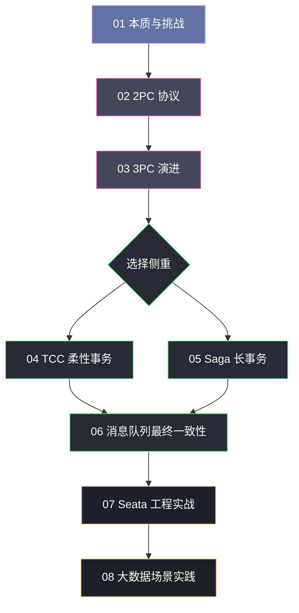

# 分布式事务专栏导览

> [!quote] 专栏定位
> 本专栏从单机事务的 ACID 本质出发，系统性地剖析分布式场景下事务一致性面临的根本挑战，逐层深入讲解各类分布式事务协议的设计哲学、工程实现与生产边界。目标读者是有一定分布式系统基础、希望彻底搞懂分布式事务"为什么这样设计"的后端工程师与架构师。

## 专栏结构

本专栏共 8 篇，按照 **是什么 → 为什么 → 怎么做 → 怎么用好** 的逻辑递进组织：

| 序号 | 文章标题 | 核心议题 |
| :--- | :--- | :--- |
| 01 | [[01 分布式事务的本质与挑战]] | ACID 的边界、CAP/BASE 理论、分布式事务问题空间的完整定义 |
| 02 | [[02 2PC 两阶段提交协议深度解析]] | 协议状态机、阻塞根因、脑裂场景、MySQL XA 工程实现 |
| 03 | [[03 3PC 三阶段提交与协议演进]] | 3PC 如何缓解 2PC 阻塞、网络分区下仍存在的数据不一致问题 |
| 04 | [[04 TCC 柔性事务模型原理与实践]] | Try-Confirm-Cancel 语义、幂等性设计、空回滚与悬挂的工程解法 |
| 05 | [[05 Saga 长事务编排模式深度解析]] | 编排 vs 协调两种模式、补偿事务设计原则、与 TCC 的本质差异 |
| 06 | [[06 基于消息队列的最终一致性方案]] | 本地消息表、RocketMQ 事务消息的 half message 机制与适用边界 |
| 07 | [[07 Seata 框架原理与工程实战]] | Seata AT/TCC/Saga/XA 四种模式底层实现，AT 模式 undo_log 机制深度解析 |
| 08 | [[08 分布式事务在大数据场景下的实践]] | Flink Checkpoint exactly-once、Hudi/Iceberg 事务语义在数据湖的工程落地 |

## 阅读路径建议

## 核心概念速查

| 概念 | 一句话定义 |
| :--- | :--- |
| **[[ACID]]** | 单机数据库事务的四个基本属性：原子性、一致性、隔离性、持久性 |
| **[[CAP 定理]]** | 分布式系统无法同时满足一致性、可用性、分区容错性 |
| **[[BASE 理论]]** | 对 CAP 中 AP 系统的实践总结：基本可用、软状态、最终一致性 |
| **[[2PC]]** | 两阶段提交，强一致性协议，存在同步阻塞与单点故障问题 |
| **[[3PC]]** | 三阶段提交，引入超时机制缓解 2PC 阻塞，但无法解决网络分区问题 |
| **[[TCC]]** | Try-Confirm-Cancel，业务层面的补偿型柔性事务 |
| **[[Saga]]** | 将长事务拆分为一系列本地事务，通过补偿事务实现回滚 |
| **[[Seata]]** | 阿里开源的分布式事务框架，支持 AT/TCC/Saga/XA 四种模式 |
